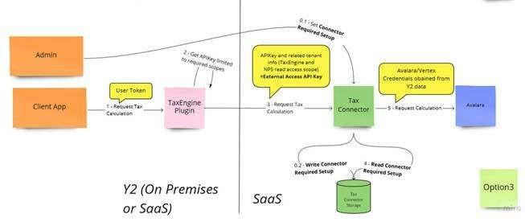
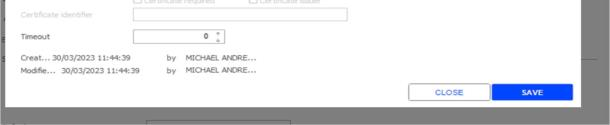

# Avalara Tax Connector

*Source: Avalara_Tax_Connector.pdf | Extracted: 2026-02-27*

---

## Cegid Retail Y2 Avalara Tax Connector

## Release Note

Cegid – 24/10/2025

2

### Document follow-up

Date

By

Comments

27/06/2024  Cegid  Updates published with package 24.0.3

21/08/2024  Cegid  Updates published with package 24.0.4

02/09/2024  Cegid  Multi-settings evolution on version 0.112

22/04/2025  Cegid  Multi-settings evolution on version 0.121

30/05/2025 Cegid Updates published with package 25.0.2. Enhanced to support default customer

from the settings, added country and jurisdiction field in the response.

23/10/2025 Cegid Updates published on version 0.159 with package 25.0.4

## Preamble

This module is a set of web services associated with one or more versions of Cegid Retail Y2.

This document describes its scope of implementation, as well as the changes and corrections made.

Please note: All module methods and services can be cited in this document. Only public methods for

which the contract is published can be used by applications not designed by Cegid.

**Legal notices**

Permission is granted under this Agreement to download documents held by Cegid and to use the

information contained in the documents only internally, provided that: (a) the copyright notice on the

documents remains on all copies of the document; material; (b) the use of these documents for personal

and non-commercial use unless it has been clearly defined by Cegid that certain specifications may be

used for commercial purposes; (c) documents will not be copied to networked computers or published on

any type of media unless expressly authorized by Cegid; and (d) no changes are made to these

documents.

Cegid – 24/10/2025

3

### Contents

1.

Introduction  ....................................................................................................................... 4

2.

Architecture  ....................................................................................................................... 5

3.

Avalara Connector Settings Endpoints  ......................................................................... 6

Avalara Connector Upsert Settings Endpoint  ................................................................................................. 6

Avalara Connector GET Settings Endpoint  ..................................................................................................... 9

4.

Avalara Connector Tax Compute Endpoint  ................................................................. 10

5.

Breaking Changes  .......................................................................................................... 11

6.

Versions  ........................................................................................................................... 12

Version 0.0.100  ....................................................................................................................................................... 12

Version 0.0.105  ....................................................................................................................................................... 12

Version 0.0.108  ....................................................................................................................................................... 12

Version 0.0.112  ....................................................................................................................................................... 12

Version 0.0.121  ....................................................................................................................................................... 12

Version 0.0.131  ....................................................................................................................................................... 13

Version 0.0.151  ....................................................................................................................................................... 13

Cegid – 24/10/2025

4

### 1.   I NTRODUCTION

The TaxEngine plugin is a component which allows web-based apps such as MPOS, Live Store

and external applications (using the SalesExternal web services) to calculate the correct tax to

apply to sales. This plugin can optionally communicate with Avalara through a connector to

calculate sales tax, instead of using the standard Y2 tax engine. This document describes that

connector.

Avalara is a software solution for automated tax compliance. They deliver real time geospatial

location sales tax rates to the Y2 POS during sales and optionally saves POS sales transactions

to Avalara for use in Avalara services.  See  https://www.avalara.com/

Please note that this document only describes the Avalara Tax Connector used through the

TaxEngine and does not cover the scope of the CBS module designed to use the Avalara from

the Y2 Front Office and Back Office applications.

Disclaimer:

When it comes to Tax management, it is important to note that Cegid cannot provide tax expertise

or recommendations for its customers. It remains the customer’s responsibility or the responsibility

of their Tax auditor/expert to provide the rules and settings for the tax calculation.

With this solution, Cegid provides tax technology for retailers to facilitate the implementation of

their rules based on Tax data content provided by Avalara.

Retailers may wish to leverage our functions to collect sales on the various sales and manage their

tax remittance via Avalara services

Cegid – 24/10/2025

5

### 2.   A RCHITECTURE

The architecture of the solution is detailed in the diagram below:

The TaxEngine plugin is installed as part of the Y2 Core modules.

The TaxEngine must be configured on the Y2 BackOffice to communicates with the Tax

Connector component, which in turn communicates with Avalara to obtain the relevant tax

information.

/!\ Important: If the Y2 instance is OnPrem, a “dedicated OnPrem tenant” needs to be obtained

from Cegid for the Tax Connector to be accessed from the OnPrem TaxEngine.

Cegid – 24/10/2025

6

### 3.   A VALARA  C ONNECTOR  S ETTINGS  E NDPOINTS

SaaS instance environment

POST https://retail-connectors.cegid.cloud/[et or t or ep or p]/avalara/

UpsertSettings?tenant=[TENANT]  &profile=[PROFILENAME]

OnPrem instance environment

POST https://retail-connectors.cegid.cloud/[et or t or ep or p]/avalara/

UpsertSettings?tenant=[TENANT]&onPremByPassApiKey=[APIKEY] &profile=[PROFILENA

ME]

These calls are used to define or update the connector settings.

The values to use for [TENANT] and [APIKEY] will be provided by Cegid. [TENANT] is the

tenant identifier and APIKEY only has a purpose for OnPrem installations.

The connectors support multiple settings profiles within a single tenant. By defining

multiple profiles, businesses can customize tax configurations per profile, ensuring the

correct tax settings are applied for each transaction. The  [PROFILENAME] value defines the

profile targeted for the operation (Upsert, Get and Compute call). Its absence will target the

default settings.

Settings body description

Field

Content

companycode

Company code provided by Avalara

user,Password

Username and password provided by Avalara

IsSandbox

true/false depending on whether you are connecting to a test

environment

Cegid – 24/10/2025

7

SecurityKey,SecurityKeyValue

If you are using tokenization to connect to Avalara, then your

Avalara contact may provide you with a security key to use in

addition to your username and password. If so, then the key

and the value need to be filled out here.

TrustedId

Avalara may also provide you with a Trusted ID which you can

use instead of a username and password. If this is the case,

then you can enter this here

PutCustomDataUrl

Certain customers may wish to use an external database to

store the tax information which is sent and received between

Y2 and Avalara. If so, then the endpoint for sending the data

should be entered in this field. However, this functionality is

unlikely to be required when using the Tax Engine with

SalesExternal as the external POS system should normally save

this data.

Url

For Avalara customers, this field should be null.

Message

Always null

taxCodesMapping

For Avalara installations, the link needs to be made between

the Y2 tax codes and the Avalara tax codes. For example, if you

have a tax code 001 in Y2 which corresponds to 12345678 in

Avalara, and another tax code 002 in Y2 which corresponds to

98765432 in Avalara, the field should look like this:

[{"y2":"001","avalara":"12345678"},{"y2":"002","avalara":"98765

432"}]

defaultTaxModel

Default value to return as TaxModel when computing taxes

Cegid – 24/10/2025

8

defaultRegion

Default value to return as Region when computing taxes

defaultTaxId

Default value to return as TaxId when computing taxes

commitRequired

This parameter will indicate to the SalesExternal plugin used by

LiveStore that an extra call needs to be done at the end of the

ticket lifecycle to record the transaction for reporting purposes

HarmonizeCanadaTaxes

true/false. If this value is false and taxes are calculated in Canada

(jurisName in TaxDetails is “CANADA”), then the tax returned

contains the details of the different rates. In other cases, the tax

returned is “harmonized” on a single line and rate of tax.

defaultCustomerCode.

Default value for CustomerCode when it is not provided in the

SaaS connector request.

Body example

{

"commitRequired": true,

"companyCode": "cgdny",

"user": "asahu@cegid.com",

"password": "***",

"isSandbox": true,

"putCustomDataUrl": "https://aps832001fun001-customdata-

test.azurewebsites.net/api/TENANT/custom-data/receipt/[receipt_id]/keys/tax-

exemption-ref",

"taxCodesMapping": [

{

"y2": "001",

"avalara": "NOR"

},

{

"y2": "NOR",

"avalara": "NOR"

}

],

}

Cegid – 24/10/2025

9

SaaS instance environment

GET https://retail-connectors.cegid.cloud/[et or t or ep or p]/avalara/

GetSettings?tenant=[TENANT]  &profile=[PROFILENAME]

OnPrem instance environment

GET https://retail-connectors.cegid.cloud/[et or t or ep or p]/avalara/

GetSettings?tenant=[TENANT]&onPremByPassApiKey=[APIKEY] &profile=[PROFILENAME]

See previous chapter for details on the query parameters.

The content returned is the same as the body of the Upsert call in the previous chapter.

Cegid – 24/10/2025

10

### 4.   A VALARA  C ONNECTOR  T AX  C OMPUTE  E NDPOINT

The format for the Avalara API endpoint is as follows.

SaaS instance environment

POST https://retail-connectors.cegid.cloud/[et or t or ep or

p]/avalara/AvalaraCompute?tenant=[TENANT] &profile=[PROFILENAME]

OnPrem instance environment

POST https://retail-connectors.cegid.cloud/[et or t or ep or

p]/avalara/AvalaraCompute?tenant=[TENANT]&onPremByPassApiKey=[APIKEY]&profile=[PR

OFILENAME]

See settings chapter for details on the query parameters.

The body and reply are identical to the GetTax operation on the TaxEngine.GetTax plugin.

The descriptions are available on the swagger UI description of that operation.

### Specific body contents

A few specific values can be provided in the compute body on top of the TaxEngine

body requirements. The TaxEngine will provide these fields when calling the

connector.

Commit Flag Logic

Transaction information can be saved in Avalara portal for reporting purposes. To

save transactions commit flag is used.

•   commit=false : Transactions are not saved in Avalara.

•   commit=true : Transactions are saved in Avalara.

This feature requires the TaxEngine version 24.0.7.8

If running through the SalesExternal plugin (the /receipt API), version 24.0.5.108 is

required.

DocCode

•

When  commit=true , the  DocCode  field is mandatory. You must provide a valid

value for DocCode along with other transaction details to successfully save the

transaction in Avalara.

Cegid – 24/10/2025

11

### 5.   B REAKING  C HANGES

This section lists evolutions which are not backward compatible, and therefore require an

evolution on third party integrated systems.

There are no elements in this list yet.

Cegid – 24/10/2025

12

### 6.   V ERSIONS

Delivered with package 24.0.3

### New Features

•

Ref. CEGID : 1465632

o   Added the ability for the connector to receive a request with a commit parameter

and a document id, for the client to be able to use the Avalara tax reporting

features.

Delivered with package 24.0.4

This version only contains technical evolutions to improve the robustness of the module.

Delivered with package 24.0.4

Delivered with package 24.0.4

### New Features

•

Ref. CEGID : 1588685

o   Ability to manage multiple settings per tenant.

### New Features

•

Ref. CEGID : 1638234

o   Support multiple levels of taxes in Canada

Cegid – 24/10/2025

13

Delivered with package 25.0.2

Ref. CEGID :  1777922,1782065

•

DefaultCustomerCode

o   The Avalara SaaS Connector has been enhanced to support a default customer

code, which can be configured in the settings. If a customer code is not provided

in the request from tax engine, the default value from the settings will be used.

o   defaultCustomerCode is now configurable in upsert settings.

•

The country Id and jurisdiction Name Fields have been Added to the response

payload.

o   "countryISO2": "CA",

o   "countryISO3A": "CAN",

o   "countryISO3N": "124",

o   "jurisName": "CANADA"

•

Corrected the 'rate' and 'taxId' values in the response for Canadian taxes.

Delivered with package 25.0.4

Ref. CEGID : Feature 1909802

•

The connector now manages a customer tax exemption reference that is submitted to

Avalara for tax-exempt sales.

•

Change in Avalara connector to support tax exemption by passing the

CustomerTaxExemptionReference in the Avalara SaaS Connector Request.

Ref. CEGID : Feature 1909803

•

Avalara request header needs to include a subscription key as per Avalara new

requirements (the second value out of the four now contains a hardcoded subscription

key)

Ref. CEGID : Bug 1842642

•

In the case of multiple tax lines, the rank value and the order were not managed

properly. This applied in particular in a Canadian context with the “GST/TPS” and “PST”

taxes.

