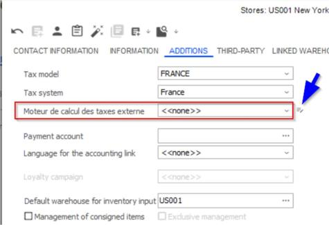
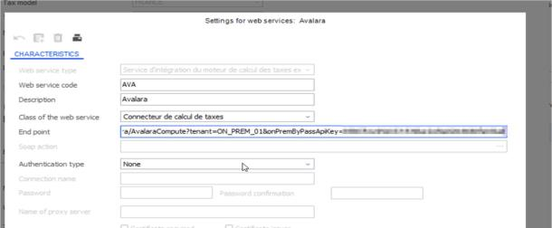
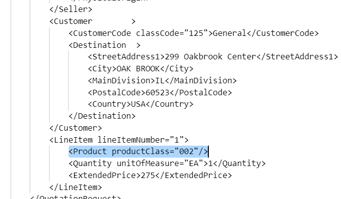

# Vertex Tax Connector

*Source: Vertex_Tax_Connector.pdf | Extracted: 2026-02-27*

---

## Cegid Retail Y2 Vertex Tax Connector

## Release Note

Cegid – 24/10/2025

2

### Document follow-up

Date

By

Comments

21/08/2024

Cegid

Updates published with package 24.0.4

21/01/2025

Cegid

Updates published with package 24.0.6

30/05/2025

Cegid

Updates published with package 25.0.2 - Enhanced to support discount amounts

through the new Extra Amounts field and introduced country Id and jurisdiction

fields in response on version 0.0.217

23/10/2025

Cegid

Updates published on version 0.0.245 with package 25.0.4

## Preamble

This module is a set of web services associated with one or more versions of Cegid Retail Y2.

This document describes its scope of implementation, as well as the changes and corrections made.

Please note: All modules methods and services can be cited in this document. Only public methods for

which the contract is published can be used by applications not designed by Cegid.

**Legal notices**

Permission is granted under this Agreement to download documents held by Cegid and to use the

information contained in the documents only internally, provided that: (a) the copyright notice on the

documents remains on all copies of the document; material; (b) the use of these documents for personal

and non-commercial use unless it has been clearly defined by Cegid that certain specifications may be

used for commercial purposes; (c) documents will not be copied to networked computers or published on

any type of media unless expressly authorized by Cegid; and (d) no changes are made to these

documents.

Cegid – 24/10/2025

3

### Contents

**......................................................................................................................................  Introduction**

......................................................................................................................................................... 4

**......................................................................................................................................  Architecture**

......................................................................................................................................................... 5

**.................................................................................................................................................  Setup**

......................................................................................................................................................... 6

**...........................................................................................................................  Breaking Changes**

......................................................................................................................................................... 9

**............................................................................................................................................  Versions**

....................................................................................................................................................... 10

Cegid – 24/10/2025

4

## Introduction

The TaxEngine plugin is a component which allows web-based apps such as MPOS, Live Store

and external applications (using the SalesExternal web services) to calculate the correct tax to

apply to sales. This plugin can optionally communicate with Vertex through a connector to

calculate sales tax, instead of using the standard Y2 tax engine. This document describes that

connector.

Vertex is a software solution for automated tax compliance. They deliver real time geospatial

location sales tax rates to the Y2 POS during sale.

Please note that this document only describes the Vertex Tax Connector used through the

TaxEngine and does not cover the scope of the CBS module designed to use the Vertex from

the Y2 Front Office and Back Office applications.

Disclaimer:

When it comes to Tax management, it is important to note that Cegid cannot provide tax expertise

or recommendations for its customers. It remains the customer’s responsibility or the responsibility

of their Tax auditor/expert to provide the rules and settings for the tax calculation.

With this solution, Cegid provides tax technology for retailers to facilitate the implementation of

their rules based on Tax data content provided by  Vertex .

Retailers may wish to leverage our functions to collect sales on the various sales and manage their

tax remittance via  Vertex  services

Cegid – 24/10/2025

5

## Architecture

The architecture of the solution is detailed in the diagram below:

The TaxEngine plugin is installed as part of the Y2 Core modules.

The TaxEngine must be configured on the Y2 BackOffice to communicates with the Tax

Connector component, which in turn communicates with Vertex to obtain the relevant tax

information.

Cegid – 24/10/2025

6

/!\ Important: If the Y2 instance is OnPrem, a “dedicated OnPrem tenant” needs to be obtained

from Cegid for the Tax Connector to be accessed from the OnPrem TaxEngine.

## Setup

The format for the Vertex API endpoint is as follows. The values to use for [TENANT] and

[APIKEY] will be provided by Cegid.

SaaS instance environment

POST https://retail-connectors.cegid.cloud/[et or t or ep or

p]/vertex/TaxWebConnector?tenant=[TENANT] &profile=[PROFILENAME]

OnPrem instance environment

POST https://retail-connectors.cegid.cloud/[et or t or ep or

p]/vertex/TaxWebConnector?tenant=[TENANT]&onPremByPassApiKey=[APIKEY]

The body and reply are identical to the GetTax operation on the TaxEngine.GetTax plugin.

The descriptions are available on the swagger UI description of that operation.

SaaS instance environment

POST https://retail-connectors.cegid.cloud/[et or t or ep or p]/vertex/

UpsertSettings?tenant=[TENANT] &profile=[PROFILENAME]

OnPrem instance environment

POST https://retail-connectors.cegid.cloud/[et or t or ep or p]/vertex/

UpsertSettings?tenant=[TENANT]&onPremByPassApiKey=[APIKEY]

&profile=[PROFILENAME]

Body description

Field

Content

companycode

Company code provided by Vertex

Cegid – 24/10/2025

7

user,Password

Username and password provided by Vertex

IsSandbox

true/false depending on whether you are connecting to a test

environment

SecurityKey,SecurityKeyValue

If you are using tokenization to connect to Vertex, then your

Vertex contact may provide you with a security key to use in

addition to your username and password. If so, then the key

and the value need to be filled out here.

TrustedId

Vertex may also provide you with a Trusted ID which you can

use instead of a username and password. If this is the case,

then you can enter this here

PutCustomDataUrl

Certain customers may wish to use an external database to

store the tax information which is sent and received between

Y2 and Vertex. If so, then the endpoint for sending the data

should be entered in this field. However, this functionality is

unlikely to be required when using the Tax Engine with

SalesExternal as the external POS system should normally save

this data.

Url

For Vertex customers, this field should be null.

Message

Always null

Cegid – 24/10/2025

8

taxCodesMapping

For Vertex installations, the link needs to be made between the

Y2 tax codes and the Vertex tax codes. For example, if you have

a tax code 001 in Y2 which corresponds to 12345678 in Vertex,

and another tax code 002 in Y2 which corresponds to

98765432 in Vertex, the field should look like this:

[{"y2":"001","vertex":"12345678"},{"y2":"002","vertex":"98765

432"}]

defaultTaxModel

Default value to return as TaxModel when computing taxes

defaultRegion

Default value to return as Region when computing taxes

defaultTaxId

Default value to return as TaxId when computing taxes

commitRequired

This parameter will indicate to the SalesExternal plugin used by

LiveStore that an extra call needs to be done at the end of the

ticket lifecycle to record the transaction for reporting purposes

Useproductclass

This parameter will determine whether we want to send product

or product class to the vertex.

saveTaxAreaType

If this option is true, tax area and type from the vertex response

will be saved in custom DB.

putCustomDataUrlTaxAreaId

URL for Custom to store the tax area id and type

Body example

{

"commitRequired": true,

"companyCode": "cgdny",

"user": "asahu@cegid.com",

"password": "***",

"isSandbox": true,

Cegid – 24/10/2025

9

"putCustomDataUrl": "https://aps832001fun001-customdata-

test.azurewebsites.net/api/TENANT/custom-data/receipt/[receipt_id]/keys/tax-

exemption-ref",

"taxCodesMapping": [

{

"y2": "001",

"vertex": "NOR"

},

{

"y2": "NOR",

"vertex": "NOR"

}

],

"Useproductclass": false,

"saveTaxAreaType": false,

"putCustomDataUrlTaxAreaId": null

}

SaaS instance environment

GET https://retail-connectors.cegid.cloud/[et or t or ep or p]/vertex/

GetSettings?tenant=[TENANT]  &profile=[PROFILENAME]

OnPrem instance environment

GET https://retail-connectors.cegid.cloud/[et or t or ep or p]/vertex/

GetSettings?tenant=[TENANT]&onPremByPassApiKe y=[APIKEY]

The content returned is the same as the body of the Upsert call in the previous chapter.

## Breaking Changes

This section lists evolutions which are not backward compatible, and therefore require an

evolution on third party integrated systems.

There are no elements in this list yet.

Cegid – 24/10/2025

10

## Versions

Delivered with package 24.0.4

•

Use Product Class Instead of Product :

An option has been added in the configuration to send the Product class instead of the product

when calling Vertex. This setting allows you to choose whether to include the product or the

product class tag in the XML request.

•

Save Tax Area ID and Type:

The Vertex response includes the tax area ID and type. Some customers want to use

these values for their other systems. We now offer the option to save these details in a

custom database.

•

Upgraded Cosmos DB version

Cegid – 24/10/2025

11

Delivered with package 24.0.6

•

Commit transaction in Vertex

o

A few specific values can be provided in the compute body on top of the TaxEngine

body requirements. The TaxEngine will provide these fields when calling the

connector.

1.1.1

Commit Flag Logic

•

Transaction information can be saved in Vertex portal for reporting

purposes. To save transactions commit flag is used.

▪

commit=false : Transactions are not saved in  Vertex .

▪

commit=true : Transactions are saved in  Vertex .

▪

This feature requires the TaxEngine version 24.0.7.8

▪

If running through the SalesExternal plugin (the /receipt API), version

24.0.5.108 is required.

1.1.2

DocCode

o   When  commit=true , the  DocCode  field is mandatory. You must provide a valid

value for DocCode along with other transaction details to successfully save the

transaction in  Vertex .

o   Get th values from internal results

o   Multi profile change:  Ability to manage multiple settings per tenant.

Delivered with package 25.0.2

•

Support for Discount Amount via ExtraAmounts Field: The Vertex SaaS Connector has

been enhanced to support discount amounts through the new ExtraAmounts field. This

field has been added to both the request and response payloads, allowing improved

handling and visibility of discount-related data in tax calculations.  For example:

"ExtraAmounts": [

{

"Rank": 1,

"Amount": 10.24

},

Cegid – 24/10/2025

12

{

"Rank": 2,

"Amount": 10.24

}

]

•

The country Id and jurisdiction Name fields have been added to the response

payload.

"countryISO2": "CA",

"countryISO3A": "CAN",

"countryISO3N": "124",

"jurisName": "CANADA"

Delivered with package 25.0.4

This version contains minor technical evolutions including framework libraries version bumps.

