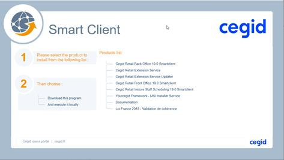

# Follow-up Notes Y2Plugin InventoryMovement V26

*Source: Follow-up_Notes_Y2Plugin_InventoryMovement_V26.pdf | Extracted: 2026-02-27*

---

## InventoryMovement Plugin V05

## Cegid Retail Y2 –  Version 26

## Follow-up Notes

## Make more

## possible

Registration date:   January 21, 2026

Cegid Retail Y2 – InventoryMovement Plugin 2

## Preamble

This plugin is a set of web services associated with one or more versions of Cegid Retail Y2.

This document describes its scope of implementation, as well as the changes and corrections made.

Please note: All plugin methods and services can be cited in this document. Only public methods for

which the contract is published can be used by applications not designed by Cegid.

Legal notices

Permission is granted under this Agreement to download documents held by Cegid and to use the

information contained in the documents only internally, provided that: (a) the copyright notice on the

documents remains on all copies of the document; material; (b) the use of these documents for personal

and non-commercial use unless it has been clearly defined by Cegid that certain specifications may be

used for commercial purposes; (c) documents will not be copied to networked computers or published on

any type of media unless expressly authorized by Cegid; and (d) no changes are made to these

documents.

Cegid Retail Y2 – InventoryMovement Plugin 3

## Contents

Preamble

2

1.   OBJECTIVES  ................................................................................................................................................................................ 4

Documentation

4

Y2 versions

5

2.   ITEMSINPUT  ................................................................................................................................................................................. 6

Create

6

GetDetail

7

3.   ITEMSINPUT2  ............................................................................................................................................................................... 9

Create

9

GetDetail

10

4.   ITEMSOUTPUT  ......................................................................................................................................................................... 11

Create

11

GetDetail

11

5.   ITEMSOUTPUT2 ....................................................................................................................................................................... 13

Create

13

GetDetail

13

6.   REPORT  ....................................................................................................................................................................................... 14

GenerateDocument

14

Poll

14

Download

15

7.   REPORT2  .................................................................................................................................................................................... 16

Download

16

EndGenerateLabels

16

GenerateLabels

17

8.   OTHER  .......................................................................................................................................................................................... 18

Net Framework 4.8

18

Cegid Retail Y2 – InventoryMovement Plugin 4

### 1.   O BJECTIVES

The  InventoryMovement  plugin is used to manage the flow of item input/output.

This service will be gradually enriched.

Reminder: Only public methods for which the contract is published can be used by applications not

designed by Cegid. Cegid reserves the right to modify private services without ensuring backward

compatibility, and without informing users.

## Documentation

The service contract documentation is visible on the IIS server(s) from the software package download

page:

"Documentation" is a link that provides access to the list of documentation:

➔   Web Services

The screen displayed provides access to the Web Services contracts and their properties

Please note: the absence of a contract in the Web Services documentation screen means that the

service is not installed or is not public.

➔   Exceptions

Cegid Retail Y2 – InventoryMovement Plugin 5

This part provides access to exceptions, classified by type, and according to the plugin.

➔   Installation

This page allows you to download Web Services installation and consumption documentation.

## Y2 versions

This plugin is compatible with the following version of Cegid Retail Y2:

➔   Version 26

Note:

The # sign at the beginning of the plugin build number corresponds to the major version of Cegid Retail

Y2.

Cegid Retail Y2 – InventoryMovement Plugin 6

### 2.   I TEMS I NPUT

The service is now set to the Obsolete status.

Method replaced by ItemsInput2. It has the status Obsolete and will be removed from versions

generated after 2/1/2028.

## Create

### ➔   Objectives

The objective of this service is to be able to create a special stock entry.

Business rules

User restrictions on stores are taken into account.

The document effective date is updated by import according to the document date.

The document must contain at least one item with a quantity to be entered into stock.

Management of sales representatives/salespeople/ cashiers:

•

If there is a representative at line level, he/her will be recovered in the line.

•

If there is a representative in the header, but not at line level, the header representative will be

recovered in the line.

•

If there is a representative in the line, but not in in the header, the representative of the first line

will be recovered in the header.

Movement reasons:

•

The reason provided in the header of the contract is applied by default to all document lines.

•

If the document supports movement reasons, an exception is raised if:

o

The reason is not provided in the contract header

o

The reason provided in the header does not exist in Cegid Retail Y2

o

The scope of the reason does not match the type of the processed document

•

If the document type does not support movement reason, an exception is raised if a reason is

provided in the contract header

If there is line with a serial number:

•

The quantity of the line must be 1

•

The document type must accept serial numbers (and management exceptions to the

store/warehouse)

External reference

•

If the reference is provided in the contract header, it will be recovered in the document header,

but it will not be applied to the document lines.

•

If the external reference is provided at line level, it will be recovered in the document lines.

Internal reference

•

Uniqueness is a requirement in case of document transformation. As this document has no

subsequent document, the uniqueness of this reference is not required.

Dev

Date

CEGID’s

Ref.

Pb Ref.

Pull request

Plugin Build no.

Quality Ctrl

RLO

1/2/2023

A2427

151311

#2.134

Cegid Retail Y2 – InventoryMovement Plugin 7

Valuation

•

The document will be revalued using the data import function with variable $$_RECALCULPIECE =

‘X’.

Item identification

•

Each line should use the internal item code (GA_ARTICLE), which identifies it in a unique and

unambiguous manner.

Third party required

•

All Cegid Retail Y2 documents must have a third party.

For special inputs/outputs, since the third party is not in the contract, the value of the company

setting “Commercial management / Third party for special movements” must be entered with a

fictitious third party. It is taken over when the movement is created.

The third party (customer and/or supplier) must respect the setting of the document type, in tab

"Third party": “Authorized types of third parties”.

Idempotency

Idempotency guarantees that an action gives the same result, regardless of its number of applications.

It is necessary to specify the OperationUid property in the contract, allowing Cegid Retail Y2 to record this

information, in order not to repeat the processing. This number should therefore be unique.

### ➔   Improvements

Added new properties, catalog reference, package reference and complementary description at the line

level.

The method is now set to the Obsolete status..

Dev

Date

CEGID’s

Ref.

Pb Ref.

Pull request

Plugin Build no.

Quality Ctrl

RLO

1/2/2023

A2427

151311

#2.137

## GetDetail

### ➔   Objectives

The objective of this service is to return the detail of a special input.

Dev

Date

CEGID’s

Ref.

Pb Ref.

Pull request

Plugin Build no.

Quality Ctrl

RLO

3/1/2022

A2302

106933

#2.39

Dev

Date

CEGID’s

Ref.

Pb Ref.

Pull request

Plugin Build no.

Quality Ctrl

RLO

10/27/2021

A2266

90063

#1.78

Cegid Retail Y2 – InventoryMovement Plugin 8

Added user fields to GetDetail and Create operations.

Added the new package reference property at line level to the Reply.

The method is now set to the Obsolete status..

Dev

Date

CEGID’s

Ref.

Pb Ref.

Pull request

Plugin Build no.

Quality Ctrl

RLO

1/2/2023

A2427

151311

#2.137

Dev

Date

CEGID’s

Ref.

Pb Ref.

Pull request

Plugin Build no.

Quality Ctrl

PCH

2/18/2022

A2299

104571

#1.78

Dev

Date

CEGID’s

Ref.

Pb Ref.

Pull request

Plugin Build no.

Quality Ctrl

JMO

3/1/2022

A2302

10842

#2.37

Cegid Retail Y2 – InventoryMovement Plugin 9

### 3.   I TEMS I NPUT 2

## Create

### ➔   Objectives

The objective of this service is to be able to create a special stock entry.

Business rules

User restrictions on stores are taken into account.

The document effective date is updated by import according to the document date.

The document must contain at least one item with a quantity to be entered into stock.

Management of sales representatives/salespeople/ cashiers:

•

If there is a representative at line level, he/her will be recovered in the line.

•

If there is a representative in the header, but not at line level, the header representative will be

recovered in the line.

•

If there is a representative in the line, but not in in the header, the representative of the first line

will be recovered in the header.

Movement reasons:

•

The reason provided in the header of the contract is applied by default to all document lines.

•

If the document supports movement reasons, an exception is raised if:

o

The reason is not provided in the contract header

o

The reason provided in the header does not exist in Cegid Retail Y2

o

The scope of the reason does not match the type of the processed document

•

If the document type does not support movement reason, an exception is raised if a reason is

provided in the contract header

If there is line with a serial number:

•

The quantity of the line must be 1

•

The document type must accept serial numbers (and management exceptions to the

store/warehouse)

External reference

•

If the reference is provided in the contract header, it will be recovered in the document header,

but it will not be applied to the document lines.

•

If the external reference is provided at line level, it will be recovered in the document lines.

Internal reference

•

Uniqueness is a requirement in case of document transformation. As this document has no

subsequent document, the uniqueness of this reference is not required.

Valuation

•

The document will be revalued using the data import function with variable $$_RECALCULPIECE =

‘X’.

•

The valuation of a line requires the CurrencyId and TaxIncluded properties to be specified.

•

If the base unit price is present in the contract:

   It is copied into the unit price of each line.

   No price search is performed.

Cegid Retail Y2 – InventoryMovement Plugin 10

•

The line amount is obtained by multiplying the unit price and the quantity. This amount is

rounded with the number of decimals defined in the Cegid Retail Y2 settings, or in the currency

settings depending on the options.

•

The taxation engine of Cegid Retail Y2 is used to calculate the taxes.

Item identification

•

Each line should use the internal item code (GA_ARTICLE), which identifies it in a unique and

unambiguous manner, or its barcode. If these two properties are provided (not empty), a search

for the item is carried out through its Id, allowing the retrieval of its barcode (GA_CODEBARRE).

Idempotency

Idempotency guarantees that an action gives the same result, regardless of its number of applications.

It is necessary to specify the OperationUid property in the contract, allowing Cegid Retail Y2 to record this

information, in order not to repeat the processing. This number should therefore be unique.

### ➔   Improvements

The service is now set to the Released status

## GetDetail

### ➔   Objectives

The objective of this service is to return the detail of a special input.

### ➔   Improvements

The method is now set to the Released status

Dev

Date

CEGID’s

Ref.

Pb Ref.

Pull request

Plugin Build no.

Quality Ctrl

RLO

1/2/2023

A2427

151311

#2.134

Dev

Date

CEGID’s Ref.

Pb

Ref.

PR

Plugin Build no.

Quality Ctrl

LDE

7/11/2023

A2452

179127

#3.73

Cegid Retail Y2 – InventoryMovement Plugin 11

### 4.   I TEMS O UTPUT

The service is now set to the Obsolete status.

Method replaced by Itemsoutput2. It has the status Obsolete and will be removed from

versions generated after 2/1/2028.

## Create

### ➔   Objectives

The objective of this service is to be able to create a special stock withdrawal.

The business rules are similar to those applied to special stock entries.

### ➔   Improvements

Added new properties, catalog reference, package reference and complementary description at the line

level.

The method is now set to the Obsolete status..

Dev

Date

CEGID’s

Ref.

Pb Ref.

Pull request

Plugin Build no.

Quality Ctrl

RLO

1/2/2023

A2427

151311

#2.137

## GetDetail

### ➔   Objectives

The objective of this service is to return the detail of a special output.

Dev

Date

CEGID’s

Ref.

Pb Ref.

Pull request

Plugin Build no.

Quality Ctrl

RLO

1/2/2023

A2427

151311

#2.134

Dev

Date

CEGID’s

Ref.

Pb Ref.

Pull request

Plugin Build no.

Quality Ctrl

RLO

3/1/2022

A2302

106933

#2.39

Dev

Date

CEGID’s

Ref.

Pb Ref.

Pull request

Plugin Build no.

Quality Ctrl

RLO

10/27/2021

A2266

90063

#1.78

Cegid Retail Y2 – InventoryMovement Plugin 12

Added user fields to GetDetail and Create operations.

Added the new package reference property at line level to the Reply.

The method is now set to the Obsolete status..

Dev

Date

CEGID’s

Ref.

Pb Ref.

Pull request

Plugin Build no.

Quality Ctrl

RLO

1/2/2023

A2427

151311

#2.137

Dev

Date

CEGID’s

Ref.

Pb Ref.

Pull request

Plugin Build no.

Quality Ctrl

PCH

2/18/2022

A2299

104571

#2.19

Dev

Date

CEGID’s

Ref.

Pb Ref.

Pull request

Plugin Build no.

Quality Ctrl

JMO

3/1/2022

A2302

10842

#2.37

Cegid Retail Y2 – InventoryMovement Plugin 13

### 5.   I TEMS O UTPUT 2

## Create

### ➔   Objectives

The objective of this service is to be able to create a special stock withdrawal.

The business rules are similar to those applied to special stock entries.

### ➔   Improvements

The service is now set to the Released status

## GetDetail

### ➔   Objectives

The objective of this service is to return the detail of a special output.

### ➔   Improvements

The method is now set to the Released status

Dev

Date

CEGID’s

Ref.

Pb Ref.

Pull request

Plugin Build no.

Quality Ctrl

RLO

1/2/2023

A2427

151311

#2.134

Dev

Date

CEGID’s Ref.

Pb

Ref.

PR

Plugin Build no.

Quality Ctrl

LDE

7/11/2023

A2452

179127

#3.73

Cegid Retail Y2 – InventoryMovement Plugin 14

### 6.   R EPORT

This service manages the PDF transmission of a special input/output with the following steps:

➔   Cegid Retail Y2 server request to generate the PDF document on the server, by using the printing

templates configured in the Back Office.

➔   Loading of the PDF to the service caller as soon as available on server.

➔   Sending the PDF to the service caller, for printing managed by this caller.

Please note: this service does not allow the document to be marked as printed (GP_EDITEE field not

updated). The change in value of this field is reserved for interactive publishing, which links the creation of

the PDF to its printing.

## GenerateDocument

### ➔   Objectives

This method prompts the print server to stack the printing request of a document, using its unique

identifier in Cegid Retail Y2.

The report is printed by default in the “software language” as defined in the cultural profile of the user

using this service for the following elements:

➔   The mask: Titles and descriptions of the report template

➔   The format of numbers and dates.

➔   The data transmitted: item descriptions, markdown reason, etc.

The  LanguageId  property allows you to edit the report mask and the format of numbers and dates

according to this new language.

The  CultureId  property allows you to force the formatting of data numbers and dates:

➔   If the  LanguageId  property is missing.

➔   If the  LanguageId  property is identical to the "software language" in the user’s cultural profile.

The data remains in the user's language.

Only the native Cegid report generator is used to generate the PDF.

### ➔   Improvements

## Poll

### ➔   Objectives

At the end of the PDF generation call, the Poll method is called to find out its availability.

In interactive mode, we recommend making an initial call after five seconds, then every two seconds with

no time limit, leaving the user the option to pause the wait.

In batch mode, a call every 5 seconds is recommended, with a maximum of 10 calls.

Cegid Retail Y2 – InventoryMovement Plugin 15

### ➔   Improvements

## Download

### ➔   Objectives

When the Poll returns positively, the Download method is used to download the PDF and print on a

printer, store it or send it by e-mail.

### ➔   Improvements

Cegid Retail Y2 – InventoryMovement Plugin 16

### 7.   R EPORT 2

This service manages the reports and follow-up of special inventory input/output.

This service manages the PDF transmission of a special input/output with the following steps:

➔   Request the Cegid Retail Y2 server to generate the PDF (GenerateXX method) on the server, by

using the printing templates configured in the Back Office.

➔   Upload  the PDF to the service caller as soon as it is available on server.

➔   Send the PDF to the service caller, for printing managed by this caller.

## Download

### ➔   Objectives

This method downloads the PDF file that was generated by one of the Generate methods below.

The following business rules are applied:

•

The identifier of the file to be downloaded must exist.

In response, a link will allow you to download the PDF document to your computer.

Dev

Date

CEGID’s Ref.

Pb Ref.

Pull request

Plugin Build no.

Quality Ctrl

ADU

11/29/2024

A2497

328753

#4.27

### ➔   Improvements

The method is now set to the Released status

## EndGenerateLabels

### ➔   Objectives

This method allows you to check the progress of a label printing request in  Cegid Retail Y2.

The following business rules are applied:

•

The process ID must exist

In response, the Report section is populated only if the PDF was successfully generated. The identifier of

the generated file allows you to download it via the Download method

Dev

Date

CEGID’s Ref.

Pb Ref.

Pull request

Plugin Build no.

Quality Ctrl

ADU

11/29/2024

A2497

328753

#4.27

Dev

Date

CEGID’s Ref.

Pb Ref.

Pull request

Plugin Build no.

Quality Ctrl

ADU

2/4/2025

A2508

352536

#4.62

Cegid Retail Y2 – InventoryMovement Plugin 17

### ➔   Improvements

The method is now set to the Released status

## GenerateLabels

### ➔   Objectives

This method is used to initiate a request to generate a PDF file of labels for items in a document identifying

a special inventory input/output.

The following business rules are applied:

•

The document must exist

•

The printing template, language, and the store must exist.

If the print contains the 2D barcode, its setup is retrieved at the store level.

In reply, the information indicates the progress of the PDF generation request.

•

The JobId is returned only if the generation could not be finalized within the requested

time (WaitTimeout in request). This JobId is used to call the EndGenerateLabels method, which

indicates the status of the generation.

•

The Report section is populated only if PDF generation was successful. The identifier of the

generated file allows you to download it via the Download method.

Dev

Date

CEGID’s Ref.

Pb Ref.

Pull request

Plugin Build no.

Quality Ctrl

LDE

12/10/2024

A2497

331576

#4.27

### ➔   Improvements

The method is now set to the Released status

The price list type and pricing system used for label printing are no longer those of the document, but are

now searched for at store level, in order to be able to print labels with their final consumer price inclusive

of tax from a purchase document invoiced exclusive of tax.

Dev

Date

CEGID’s Ref.

Pb Ref.

Pull request

Plugin Build no.

Quality Ctrl

ADU

2/4/2025

A2508

352536

#4.62

Dev

Date

CEGID’s Ref.

Pb Ref.

Pull request

Plugin Build no.

Quality Ctrl

ADU

2/4/2025

A2508

352536

#4.62

Dev

Date

CEGID’s

Ref.

Pb Ref.

Pull request

Plugin Build no.

Quality Ctrl

HDA

3/7/2025

1726793

367569

#.4.70

Cegid Retail Y2 – InventoryMovement Plugin 18

### 8.   O THER

## Net Framework 4.8

Following Microsoft‘s announcement about the “end of support for .NET Framework 4.5.2, 4.6 and 4.6.1 as

soon as April 26, 2022" the plugin now requires the installation of the .Net Framework 4.8 (runtime) on

server components.

## Swagger

Rest/Restful APIs grouped by plugin, with the option of selecting them by plugin name.

Dev

Date

CEGID’s

Ref.

Pb Ref.

Pull request

Plugin Build no.

Quality Ctrl

ADU

1/16/2025

1543349

345176

#4.54

