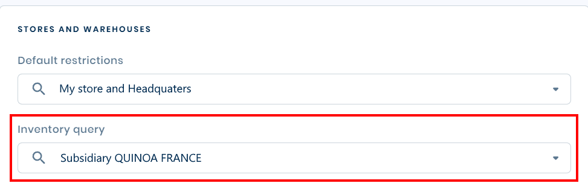

# Follow-up Notes Y2Plugin Inventory V26

*Source: Follow-up_Notes_Y2Plugin_Inventory_V26.pdf | Extracted: 2026-02-27*

---

## Inventory Plugin  V06

## Cegid Retail Y2 –  Version 26

## Follow-up Notes

## Make more

## possible

Registration date: January 21, 2026

Cegid Retail Y2 – Inventory Plugin

2

## Preamble

This plugin is a set of web services associated with one or more versions of Cegid Retail Y2.

This document describes its scope of implementation, as well as the changes and corrections made.

Please note: All plugin methods and services can be cited in this document. Only public methods for which

the contract is published can be used by applications not designed by Cegid.

Legal notices

Permission is granted under this Agreement to download documents held by Cegid and to use the

information contained in the documents only internally, provided that: (a) the copyright notice on the

documents remains on all copies of the document; material; (b) the use of these documents for personal

and non-commercial use unless it has been clearly defined by Cegid that certain specifications may be used

for commercial purposes; (c) documents will not be copied to networked computers or published on any

type of media unless expressly authorized by Cegid; and (d) no changes are made to these documents.

Cegid Retail Y2 – Inventory Plugin

3

## Contents

Preamble

2

1.   OBJECTIVES  ................................................................................................................................................................................ 4

Documentation

4

Y2 versions

5

2.   COUNTERS  ................................................................................................................................................................................... 6

GetAvailableQtyForMyStore

6

GetAvailableQtyByStores

7

GetListDetail

9

Recalculate

11

3.   SERIALNUMBERS  ................................................................................................................................................................... 12

GetLocation

12

4.   OTHER  .......................................................................................................................................................................................... 13

Net Framework 4.8

13

Cegid Retail Y2 – Inventory Plugin

4

### 1.   O BJECTIVES

The  Inventory  plugin contains public and private services intended to manage the stock publication.

Public services are described in the following chapters. Private services are used by Cegid Retail Y2 to plan

management operations for inventory closures and snapshots.

Reminder: Only public methods for which the contract is published can be used by applications not

designed by Cegid. Cegid reserves the right to modify private services without ensuring backward

compatibility, and without informing users.

## Documentation

The service contract documentation is visible on the IIS server(s) from the software package download page:

"Documentation" is a link that provides access to the list of documentation:

➔   Web Services

The screen displayed provides access to the Web Services contracts and their properties

Please note: the absence of a contract in the Web Services documentation screen means that the

service is not installed or is not public.

➔   Exceptions

Cegid Retail Y2 – Inventory Plugin

5

This part provides access to exceptions, classified by type, and according to the plugin.

➔   Installation

This page allows you to download Web Services installation and consumption documentation.

## Y2 versions

This plugin is compatible with the following version of Cegid Retail Y2:

➔   Version 26

Note:

The # sign at the beginning of the plugin build number corresponds to the major version of Cegid Retail

Y2.

Cegid Retail Y2 – Inventory Plugin

6

### 2.   C OUNTERS

## GetAvailableQtyForMyStore

### ➔   Objectives

This method returns the in-stock quantities of a list of items in a store.

Each item is checked:

➔   If there is an unknown item in the list, an exception is raised.

➔   If the item is known, it is included in the reply.

➔   If an item is out of stock, it is returned in the reply without an associated store.

The store is checked:

➔   If the " StoreId " property is present, but unknown, an exception is raised.

➔   If the store is unknown, an exception is raised.

➔   The list of stores studied is filtered by the caller's default user restriction:

If a store is not present in this restriction, an exception is raised.

➔   If a store is known and authorized, it is included in the reply.

For an item in a store, two pieces of information are returned:

➔   PhysicalQty : Physical inventory quantity in the store (GQ_PHYSIQUE).

➔   AvailableQty : Available inventory quantity in the store, calculated according to the following

formula from the company settings:

Note: if the inventory record is missing, these two values are reset to zero.

Cegid Retail Y2 – Inventory Plugin

7

Single-warehouse environment

The inventory returned for the store matches the warehouse inventory of the same code.

Multi-warehouse environment

The inventory returned for the store combines the inventory of warehouses with this option checked:

The "Warehouses" collection is systematically populated with inventory details per warehouse.

### ➔   Improvements

In single warehouse mode, added the Detail per warehouse to the reply.

Added the possibility to perform a search against a list of barcodes. Added the item barcode in the reply.

Fixed the "Value cannot be null" error that occurred when the collection of item identifiers was null.

Improved performance in searching for warehouses by store, and distinction between item and store control

time measurements.

## GetAvailableQtyByStores

### ➔   Objectives

This method returns the in-stock quantities of a list of items in for a list of stores, including the warehouses

for which the “Inventory visible to other stores” option is checked.

The management rules are identical to those of the GetAvailableQtyForMyStore method, except for the

following points:

-

The user restriction applied is the inventory query restriction.

Dev

Date

CEGID’s

Ref.

Pb Ref.

Pull request

Plugin Build no.

Quality Ctrl

EPL

9/15/2021

A2249

84628

#3.127

Dev

Date

CEGID’s

Ref.

Pb Ref.

Pull request

Plugin Build no.

Quality Ctrl

ADU

6/2/2022

A2358

118667

119315

#4.71

Dev

Date

CEGID’s

Ref.

Pb Ref.

Pull request

Plugin Build

no.

Quality Ctrl

EPL

8/31/2022

862130

129543

#4.127

Dev

Date

CEGID’s

Ref.

Pb Ref.

Pull request

Plugin Build

no.

Quality Ctrl

EBU

1/15/2024

1315953

217490

#5.125

Cegid Retail Y2 – Inventory Plugin

8

-

-

The list of warehouses taken into account in a multi-warehouse environment.

The stock returned for each store totals the stock of the warehouses having this option checked:

### ➔   Improvements

Use of the GetListDetail operation from the Stores service in the Company plugin, instead of an internal

service. Removed the CBR_131_0003 exception.

In single warehouse mode, added the Detail per warehouse to the reply.

Added the possibility to perform a search against a list of barcodes. Added the item barcode in the reply.

The StoreIds property is made optional. If no store is requested, the information from all stores authorized

by the user restrictions is returned.

Fixed the exception in GetAvailableQtyByStores for Inventory if more than 100 stores are passed in the

query.

This is done by increasing the maximum number of elements from 100 to 200 for the internal and external

identifiers of the store and the warehouse in the Company plugin.

Dev

Date

CEGID’s

Ref.

Pb Ref.

Pull request

Plugin Build no.

Quality Ctrl

EPL

9/14/2021

637700

84581

#3.117

Dev

Date

CEGID’s

Ref.

Pb Ref.

Pull request

Plugin Build no.

Quality Ctrl

EPL

9/15/2021

A2249

84628

#3.127

Dev

Date

CEGID’s

Ref.

Pb Ref.

Pull request

Plugin Build no.

Quality Ctrl

ADU

6/2/2022

A2358

118667

119315

#4.71

Dev

Date

CEGID’s

Ref.

Pb Ref.

Pull request

Plugin Build no.

Quality Ctrl

AMO

7/7/2022

A2370

123423

#4.91

Dev

Date

CEGID’s

Ref.

Pb Ref.

Pull request

Plugin Build no.

Quality Ctrl

AMO

7/19/2022

189157

843406

125222

#4.98

Cegid Retail Y2 – Inventory Plugin

9

Fixed the "Value cannot be null" error that occurred when the collection of item identifiers was null.

Correction made to view the result for more than 20 stores, only limited to 200, which is the value provided

in the web service contract.

Correction to view the full result, without being limited to 200 stores.

Improved performance in searching for warehouses by store, and distinction between item and store control

time measurements.

The user restriction applied to stores is the inventory query restriction and no longer the default restriction.

## GetListDetail

### ➔   Objectives

This method returns the in-stock quantities of a list of items for a baby shower list store.

Each item is checked:

➔   If there is an unknown item in the list, it is not returned in the reply.

➔   If an item is out of stock, it is returned in the reply without an associated store.

The store is checked:

➔   The list of stores taken into account is filtered by the caller's user restrictions:

Dev

Date

CEGID’s

Ref.

Pb Ref.

Pull request

Plugin Build

no.

Quality Ctrl

EPL

8/31/2022

862130

129543

#4.127

Dev

Date

CEGID’s

Ref.

Pb Ref.

Pull request

Plugin Build

no.

Quality Ctrl

PLA

3/21/2023

1127037

161008

#5.25

Dev

Date

CEGID’s

Ref.

Pb Ref.

Pull request

Plugin Build

no.

Quality Ctrl

EPL

5/16/2023

1166526

169458

5.50

Dev

Date

CEGID’s

Ref.

Pb Ref.

Pull request

Plugin Build

no.

Quality Ctrl

EBU

1/15/2024

1315953

217490

#5.125

Dev

Date

CEGID’s

Ref.

Pb Ref.

Pull request

Plugin Build

no.

Quality Ctrl

HDA

9/12/2024

298362

#5.173

Cegid Retail Y2 – Inventory Plugin

10

If a store is not present in this restriction, it is not returned in the reply.

➔   If the " StoreId " property is filled in but unknown, it is not returned in the reply.

Several pieces of information are returned, depending on the values chosen for the Fields field:

➔   Prices : Inventory valuation information

➔   Quantity : Various stock positions

➔   Replenishment : Data for replenishment

➔   SystemFields : System fields (user/date) for creation/modification

➔   UserDefinedQuantities : Stock positions defined according to the retailer’s needs

Single-warehouse environment

The inventory returned for the store matches the warehouse inventory of the same code.

Multi-warehouse environment

The inventory returned for the store is detailed for every warehouse.

The "Warehouses" collection is systematically populated with inventory details per warehouse.

### ➔   Improvements

Availability

Added the possibility to perform a search against a list of barcodes. Added the item barcode in the reply.

The method is now set to the Released status

Optimization of inventory search, the filter is applied to the AvailableForMyStore and

AvailableForOtherStore information directly when retrieving the list of warehouses at store search level.

The call to the CompanyWarehouses.GetListDetail service to search for warehouses has been removed.

Dev

Date

CEGID’s

Ref.

Pb Ref.

Pull request

Plugin Build no.

Quality Ctrl

ADU

4/7/2022

A2300

112410

#4.36

Dev

Date

CEGID’s

Ref.

Pb Ref.

Pull request

Plugin Build no.

Quality Ctrl

ADU

6/2/2022

A2358

118667

119315

#4.71

Dev

Date

CEGID’s Ref.

Pb

Ref.

Pull request

Plugin Build no.

Quality Ctrl

LDE

7/11/2023

A2452

179083

#5.66

Cegid Retail Y2 – Inventory Plugin

11

Dev

Date

CEGID’s Ref.

Pb

Ref.

Pull request

Plugin Build no.

Quality Ctrl

RLO

4/23/2024

252389

#5.144

## Recalculate

### ➔   Objectives

This method recalculates inventory counters, based on the strategy defined in Cegid Retail Y2.

Please note: this method should only be used in Cegid Retail Y2.

### ➔   Improvements

Cegid Retail Y2 – Inventory Plugin

12

### 3.   S ERIAL N UMBERS

## GetLocation

### ➔   Objectives

This method returns the warehouse/store that has an item with a serial number. It also returns the document

that has put an option on the serial number (order, preparation or customer reservation).

This method thus allows you to:

➔   Track the presence of the item/serial number in the network’s stores.

➔   Accept or reject the item/serial number of the document being entered, by checking that the

inventory movement of the serial number is in line with the real inventory:

o

Enter a serial number present in another warehouse.

o

Remove a serial number present in the warehouse.

If there is a problem, an adjustment must be made in Cegid Retail Y2.

Inventory input

Examples: validation of a supplier delivery notice, transfer notice, receipt of goods.

Check that the serial number being recorded is not already present in another warehouse, with application

of the following rules:

➔   A search is carried out in the table of available serial numbers to check that there is stock of this

serial number for this item.

Please note: an item with a serial number ordered by a customer is no longer considered to be

present in the store.

➔   If it is present, the warehouse is returned.

➔   If it is present in the warehouse with a reservation, order or preparation, the number of the

corresponding document is returned in the contract.

Inventory output

Check that the serial number being recorded is indeed present in the warehouse concerned.

The same rules are applied.

### ➔   Improvements

Cegid Retail Y2 – Inventory Plugin

13

### 4.   O THER

## Net Framework 4.8

Following Microsoft‘s announcement about the “end of support for .NET Framework 4.5.2, 4.6 and 4.6.1 as

soon as April 26, 2022" the plugin now requires the installation of the .Net Framework 4.8 (runtime) on

server components.

## Swagger

Rest/Restful APIs grouped by plugin, with the option of selecting them by plugin name.

Dev

Date

CEGID’s

Ref.

Pb Ref.

Pull request

Plugin Build no.

Quality Ctrl

ADU

1/10/2025

1543349

342784

#5.202

