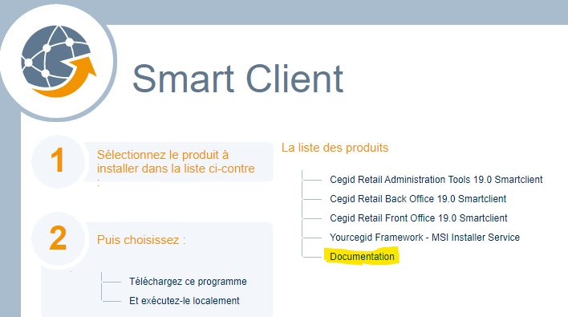
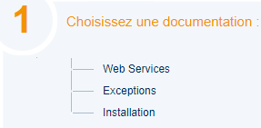

# Follow-up Notes Y2Plugin RetailSalesPrice V26

*Source: Follow-up_Notes_Y2Plugin_RetailSalesPrice_V26.pdf | Extracted: 2026-02-27*

---

## RetailSalesPrice Plugin V05

## Cegid Retail Y2 –  Version 26

## Follow-up Notes

## Make more

## possible

Registration date:   20 February 2026

Cegid Retail Y2 –  RetailSalesPrice Plugin 2

## Preamble

This plugin is a set of web services associated with one or more versions of Cegid Retail Y2.

This document describes its scope of implementation, as well as the changes and corrections made.

Please note: All plugin methods and services can be cited in this document. Only public methods for which

the contract is published can be used by applications not designed by Cegid.

Legal notices

Permission is granted under this Agreement to download documents held by Cegid and to use the

information contained in the documents only internally, provided that: (a) the copyright notice on the

documents remains on all copies of the document material; (b) these documents are used for personal and

non-commercial purposes, unless it has been clearly defined by Cegid that certain specifications may be

used for commercial purposes; (c) documents will not be copied to networked computers or published on

any type of media unless expressly authorized by Cegid; and (d) no changes are made to these documents.

Cegid Retail Y2 –  RetailSalesPrice Plugin 3

Preamble

2

1.   OBJECTIVES  ................................................................................................................................................................................ 5

Documentation

5

Y2 versions

6

2.   ENGINE ............................................................................................................................................................................................ 7

GetList

7

3.   ENGINE2  ......................................................................................................................................................................................... 9

GetDetailFromGeneric

9

GetListDetail

9

4.   MANAGEMENT  ......................................................................................................................................................................... 12

CreateOrUpdate

12

Close

12

Delete

13

5.   MERCHANDISEITEMSETTINGS  ...................................................................................................................................... 14

GetDetail

14

GetListDetail

15

6.   PERIODSSERVICE  ................................................................................................................................................................. 16

Create

16

GetDetail

16

GetListDetail

16

GetStoreDetail

17

GetStoreListDetail

17

7.   PURCHASEENGINE  ............................................................................................................................................................... 18

GetListDetail

18

8.   SETTINGS  ................................................................................................................................................................................... 19

GetCustomer

19

GetItem

19

GetItemList

19

GetProgram

20

GetProgramsList

20

GetRule

20

GetRulesList

20

GetStore

20

9.   OTHER  .......................................................................................................................................................................................... 21

Cegid Retail Y2 –  RetailSalesPrice Plugin 4

Net Framework 4.8

21

Deployment

21

Cegid Retail Y2 –  RetailSalesPrice Plugin 5

### 1.   O BJECTIVES

The objective of the  RetailSalesPrice  plugin is to offer a service to get the retail price of a list of

merchandise, service and financial type items.

Just remind: Only public methods for which the contract is published can be used by applications not

designed by Cegid. Cegid reserves the right to modify private services without ensuring backward

compatibility, and without informing users.

## Documentation

The service contract documentation is visible on the IIS server(s) from the software package download page:

"Documentation" is a link that provides access to the list of documentation:

➔   Web Services

The screen displayed provides access to the Web Services contracts and their properties

Please note: the absence of a contract in the Web Services documentation screen means that the

service is not installed or is not public.

➔   Exceptions

This part provides access to exceptions, classified by type, and according to the plugin.

Cegid Retail Y2 –  RetailSalesPrice Plugin 6

➔   Installation

This page allows you to download Web Services installation and consumption documentation.

## Y2 versions

This plugin is compatible with the following version of Cegid Retail Y2:

➔   Version 26

Note:

The # sign at the beginning of the plugin build number corresponds to the major version of Cegid Retail

Y2.

Cegid Retail Y2 –  RetailSalesPrice Plugin 7

### 2.   E NGINE

The service is now set to the Obsolete status.

Service replaced by Engine2. It has the status Obsolete and will be removed from versions generated

after 2/1/2028.

## GetList

### ➔   Objectives

This service returns the retail selling price of a list of items with the following characteristics:

➔   The price settings in the store record must be set to retrieve the prices.

➔   Merchandise, service and financial type items are accepted.

➔   It is possible to ask for prices for a closed item.

➔   Only single or sized items are authorized.

➔   Prices are returned in the store’s currency.

➔   The TaxExcluded property allows you to search for the tax-exclusive or the tax-inclusive price.

Please note: these two prices are independent and are not deductible from each other.

Recognition of the item

This service allows the item on each line to be found in two ways:

•

Lines.ItemIdentifier.Reference: This property should not be used; it is not reliable.

In the case of a reference with the same level of priority for several items, nothing can predict which

item will be used.

This property will soon be rendered obsolete.

•

Lines.ItemIdentifier.Id: This property identifies an item in a unique way in Cegid Retail Y2 and should

be used.

Loyalty price lists

If the UseLoyaltyPriceList property is set to true:

➔   The customer should be present in the contract, with a valid loyalty card.

➔   The loyalty price should be set in the store, and exist.

Only use this property if the brand or the store handles loyalty pricing.

Limits

This service does not process staff allowances or trade pricing.

Remarque : ce service utilise des services internes à Y2. It is heavily dependent on Core versions.

### ➔   Improvements

Dev

Date

CEGID’s

Ref.

Pb Ref.

Pull request

Plugin Build no.

Quality Ctrl

RLO

1/2/2023

A2427

151291

#3.265

Cegid Retail Y2 –  RetailSalesPrice Plugin 8

Cegid Retail Y2 –  RetailSalesPrice Plugin 9

### 3.   E NGINE 2

## GetDetailFromGeneric

### ➔   Objectives

This service returns the selling price of a generic items and its dimensions.

### ➔   Improvements

Cascading discounts are taken into account

Prices from the price list were wrongly converted into the folder currency and not in the store currency.

Dev

Date

CEGID’s

Ref.

Pb Ref.

Pull request

Plugin Build no.

Quality Ctrl

PCH

2/27/2024

1417689

232147

#4.272

Added item status, item type and price list type information to the single final trace, to improve service

observability.

+ added an exception when the input item does not exist.

Dev

Date

CEGID’s

Ref.

Pb Ref.

Pull request

Plugin Build no.

Quality Ctrl

LDE

7/22/2024

1538581

280475

#4.358

## GetListDetail

This operation gives the retail price of a list of merchandise, service and financial type items.

### ➔   Improvements

The number of items entered into the contract has been increased to 1000.

Correction of time measurement and addition of intermediate measurements.

The service is now Delphi-exposed for possible use by the smart client and deployed to the TaskScheduler

for use in scheduled tasks.

Dev

Date

CEGID’s

Ref.

Pb Ref.

Pull request

Plugin Build no.

Quality Ctrl

LDE

2/23/2024

1390487

230834

#4.269

Dev

Date

CEGID’s

Ref.

Pb Ref.

Pull request

Plugin Build no.

Quality Ctrl

HDA

9/29/2022

A2291

129880

133449

#3.193

Cegid Retail Y2 –  RetailSalesPrice Plugin 10

Removal of the deadlock that could occur when Orchestrator triggered a call from the V2 aggregate

calculation.

Company settings are now read using the CBP service instead of the Identity plugin.

Cascading discounts are taken into account

If Base price = Current price, the markdown reason is no longer returned, even if a promo price list is used.

Dev

Date

CEGID’s

Ref.

Pb Ref.

Pull request

Plugin Build no.

Quality Ctrl

PCH

2/28/2024

1417689

232491

#4.275

Various optimizations:

- Items/barcodes were checked twice.

- Use GetItemList operation instead of GetItem to retrieve the item settings + paging management for this

operation.

- Do not retrieve conversion rates if the request currency=store currency.

- Store restrictions were checked twice.

Dev

Date

CEGID’s

Ref.

Pb Ref.

Pull request

Plugin Build no.

Quality Ctrl

PCH

4/22/2024

4/23/2024

4/26/2024

4/30/2024

1466620

251876

252315

252495

253191

254413

#4.317

If there were 2 base price lists for the generic item, the price list for the dimensioned item was not correct.

Dev

Date

CEGID’s

Ref.

Pb Ref.

Pull request

Plugin Build no.

Quality Ctrl

PCH

5/15/2024

1475629

259026

#4.318

If there was 1 loyalty price list + 1 promotional price list, the base price was not correct.

Dev

Date

CEGID’s

Ref.

Pb Ref.

Pull request

Plugin Build no.

Quality Ctrl

PCH

6/19/2024

1522603

269189

#4.319

Added item status, item type and price list type information to the single final trace, to improve service

observability.

Note: This information is available when only one item is processed.

Dev

Date

CEGID’s

Ref.

Pb Ref.

Pull request

Plugin Build no.

Quality Ctrl

Dev

Date

CEGID’s

Ref.

Pb Ref.

Pull request

Plugin Build no.

Quality Ctrl

HDA

9/8/2023

1226572

188053

#4.78

Dev

Date

CEGID’s

Ref.

Pb Ref.

Pull request

Plugin Build no.

Quality Ctrl

LDE

2/23/2024

1390487

230834

#4.269

Cegid Retail Y2 –  RetailSalesPrice Plugin 11

LDE

7/22/2024

1538581

280475

#4.358

The 4 company settings for optimizing price list searches are taken into account, so that price lists are only

searched for if they are present in the database.

Dev

Date

CEGID’s

Ref.

Pb Ref.

Pull request

Plugin Build no.

Quality Ctrl

PCH

1/2/2025

1653119

339552

#4.440

In the reply of the operation, a “Detail” section to have has been added for additional information on price

lists.

Dev

Date

CEGID’s

Ref.

Pb Ref.

Pull request

Plugin Build no.

Quality Ctrl

PCH

1/23/2025

1637431

345321

#4.466

Fixed  so that the promo price list with 100% discount displays a price of 0 in the response, without returning

the base price.

Dev

Date

CEGID’s

Ref.

Pb Ref.

Pull request

Plugin Build no.

Quality Ctrl

PLA

7/9/2025

1845958

INC0247523

404926

#4.571

Cegid Retail Y2 –  RetailSalesPrice Plugin 12

### 4.   M ANAGEMENT

## CreateOrUpdate

### ➔   Objectives

This service is used to create and update Retail selling price lists.

### ➔   Improvements

Correction to correctly populate the GF_SOCIETE, column, with the company identifier and not the store

identifier.

Dev

Date

CEGID’s

Ref.

Pb Ref.

Pull request

Plugin Build no.

Quality Ctrl

PLA

9/26/2024

1570109

CBO Mail

294175

#4.394

Modification to set up a retry mechanism (20 trials), when several API consumers try to create price lists at

the same time, in order to handle the DUPLICATE-KEY exception during an INERT in the TARIF table.

Dev

Date

CEGID’s

Ref.

Pb Ref.

Pull request

Plugin Build no.

Quality Ctrl

PLA

5/7/2025

1570109

1750640

389634

#4.533

## Close

### ➔   Objectives

This service allows you to close price lists in Y2, to check that the prices returned by Y2 are correct

without these price lists.

Publishing of the Close method

### ➔   Improvements

Dev

Date

CEGID’s

Ref.

Pb Ref.

Pull request

Plugin Build no.

Quality Ctrl

RLO

1/27/2023

A2397

146974

#3.256

Cegid Retail Y2 –  RetailSalesPrice Plugin 13

## Delete

### ➔   Objectives

This service allows you to delete price lists in Y2.

Publishing of the Delete method

### ➔   Improvements

Dev

Date

CEGID’s

Ref.

Pb Ref.

Pull request

Plugin Build no.

Quality Ctrl

RLO

1/27/2023

A2397

146974

#3.256

Cegid Retail Y2 –  RetailSalesPrice Plugin 14

### 5.   M ERCHANDISE I TEM S ETTINGS

### ➔   Objectives

This service returns pricing information for an item or a list of items of type merchandise, i.e., the main data

from the Pricing tab of the item record in Y2 Core.

➔  Detailed information is returned according to the value passed in the Fields field:

o

Cost: Returns information on cost prices

o

Purchase: Returns information on purchase prices

o

Selling: Returns information on selling prices

➔  For dimensioned items, the returned information is memorized at dimension level.

➔   Prices are in the folder currency (currency returned in the reply.)

➔  An item is returned in the folder currency only if it complies with the "Sales division in read-only

mode” user restrictions.

## GetDetail

Returns pricing information for an item of type merchandise.

➔  An item is identified either by its barcode, or its Y2 internal identifier, to be specified in the Id

property.

If a barcode is used, the value entered must be prefixed by 'EXT-'

Example with barcode "123456789": "EXT-123456789"

➔  If the item is unknown, an exception is raised.

### ➔   Improvements

Publishing of the GetDetail method

Dev

Date

CEGID’s

Ref.

Pb Ref.

Pull request

Plugin Build no.

Quality Ctrl

ADU

11/10/2023

A2466

199972

#4.198

Correction so that no exception is raised when columns GA_CALCPRIXTTC and GA_CALCPRIXHT are null for

the item being accessed by the GetDetail method.

Dev

Date

CEGID’s

Ref.

Pb Ref.

Pull request

Plugin Build no.

Quality Ctrl

ADU

7/14/2024

1552224

INC0188922

277470

#4.352

The method is now set to status Beta

Dev

Date

CEGID’s

Ref.

Pb Ref.

Pull request

Plugin Build no.

Quality Ctrl

ADU

2/4/2025

A2508

352696

#4.468

Cegid Retail Y2 –  RetailSalesPrice Plugin 15

## GetListDetail

Returns pricing information for a list of items of type merchandise.

➔  Items are identified either by their barcode, or their Y2 internal identifier. Only one of these two lists

“Barcodes” or “Ids” must be specified.

➔  If there is an unknown item in the list, it is not returned in the reply.

### ➔   Improvements

Publishing of the GetListDetail method

Dev

Date

CEGID’s

Ref.

Pb Ref.

Pull request

Plugin Build no.

Quality Ctrl

ADU

11/10/2023

A2466

199972

#4.198

The method is now set to status Beta

Dev

Date

CEGID’s

Ref.

Pb Ref.

Pull request

Plugin Build no.

Quality Ctrl

ADU

2/4/2025

A2508

352696

#4.468

When calculating aggregate price lists with pagination, if there were more than 1,000 items, an error

message appeared stating “value cannot be null.”

Dev

Date

CEGID’s

Ref.

Pb Ref.

Pull request

Plugin Build no.

Quality Ctrl

PCH

2/5/2026

2057445

454079

454241

#5.71

Cegid Retail Y2 –  RetailSalesPrice Plugin 16

### 6.   P ERIODS S ERVICE

### ➔   Objectives

This service is used to create and return retail selling price list periods with the following characteristics:

➔   By default, information is returned from all stores

➔   Exceptions per store are returned if requested in the Fields property of the query.

➔   User restrictions apply to price lists. Only periods without a price list or associated with a price list

authorized for the user will be returned .

➔   Store user restrictions will be applied. Only exceptions concerning a store subject to the user’s

default restriction will be returned in the reply.

## Create

This operation is used to create a price list period with its possible exceptions per store.

The creation of a new period requires that:

➔   The user has no restrictions on stores and no restrictions on the price lists. In case of restrictions,

an exception is raised.

➔   The markdown reason must include the type "Price list discount" in its scope of use and must not

be closed.

➔   For an exception, if the properties for the store are all the same as in the reference period, the

exception is not recorded.

### ➔   Improvements

## GetDetail

This service operation gives the characteristics of a period with exceptions per store.

### ➔   Improvements

## GetListDetail

This service operation lists the price list periods with their exceptions per store

### ➔   Improvements

Cegid Retail Y2 –  RetailSalesPrice Plugin 17

## GetStoreDetail

This service operation gives the characteristics of a price list period for a given store.

### ➔   Improvements

## GetStoreListDetail

This service operation lists the price list periods with information valid for a given store.

### ➔   Improvements

Cegid Retail Y2 –  RetailSalesPrice Plugin 18

### 7.   P URCHASE E NGINE

## GetListDetail

This operation gives the purchase price of a list of merchandise, service and financial type items.

### ➔   Improvements

Publishing of the GetDetail method

Dev

Date

CEGID’s

Ref.

Pb Ref.

Pull request

Plugin Build no.

Quality Ctrl

PCH

10/19/2023

A2469

196259

196967

198394

199223

#4.205

The method is now set to status Beta

Dev

Date

CEGID’s

Ref.

Pb Ref.

Pull request

Plugin Build no.

Quality Ctrl

ADU

2/4/2025

A2508

352696

#4.468

Cegid Retail Y2 –  RetailSalesPrice Plugin 19

### 8.   S ETTINGS

### ➔   Objectives

This service allows you to retrieve the settings relating to price lists for items, customers and stores

## GetCustomer

Returns a customer’s price list information.

### ➔   Improvements

## GetItem

Returns price list information for an item.

### ➔   Improvements

Addition of the item purchase to the reply.

## GetItemList

Returns price list information for an item collection.

### ➔   Improvements

Addition of the item purchase to the reply.

Dev

Date

CEGID’s

Ref.

Pb Ref.

Pull request

Plugin Build no.

Quality Ctrl

LDE

10/3/2023

1252542

192529

#4.125

Dev

Date

CEGID’s

Ref.

Pb Ref.

Pull request

Plugin Build no.

Quality Ctrl

LDE

10/3/2023

1252542

192529

#4.125

Cegid Retail Y2 –  RetailSalesPrice Plugin 20

## GetProgram

Returns price list information for a pricing program.

### ➔   Improvements

## GetProgramsList

Returns price list information for pricing programs.

### ➔   Improvements

## GetRule

Returns rule information for pricing programs.

### ➔   Improvements

## GetRulesList

Returns the list of rules for pricing programs.

### ➔   Improvements

## GetStore

Returns price list information for a store.

### ➔   Improvements

Cegid Retail Y2 –  RetailSalesPrice Plugin 21

### 9.   O THER

## Net Framework 4.8

Following Microsoft‘s announcement about the “end of support for .NET Framework 4.5.2, 4.6 and 4.6.1 as

soon as April 26, 2022" the plugin now requires the installation of the .Net Framework 4.8 (runtime) on

server components.

## Deployment

Publication of the documentation on exceptions

Added installation kit for ReportService.

## Swagger

Rest/Restful APIs grouped by plugin, with the option of selecting them by plugin name.

Dev

Date

CEGID’s

Ref.

Pb Ref.

Pull request

Plugin Build no.

Quality Ctrl

ADU

1/15/2025

1543349

343864

#4.444

Dev

Date

CEGID’s

Ref.

Pb Ref.

Pull request

Plugin Build no.

Quality Ctrl

EPL

9/11/2023

A2397

1209267

188197

#4.82

Dev

Date

CEGID’s

Ref.

Pb Ref.

Pull request

Plugin Build no.

Quality Ctrl

EPL

9/22/2023

1239802

190642

#4.112

