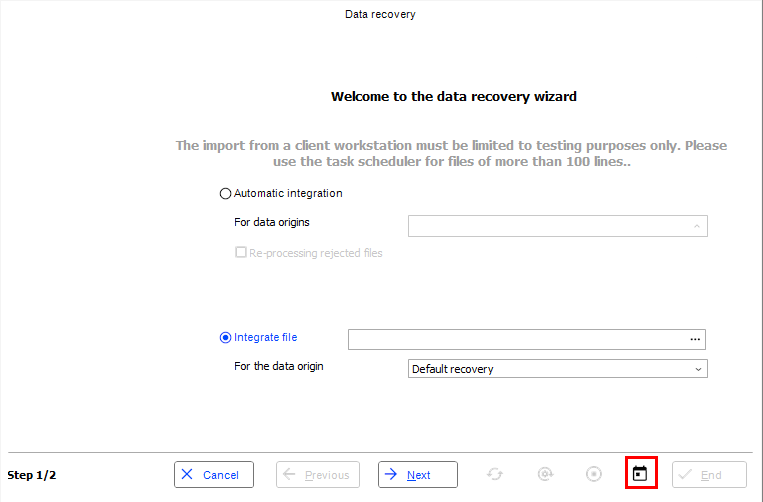
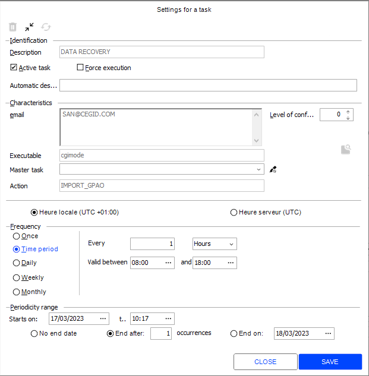
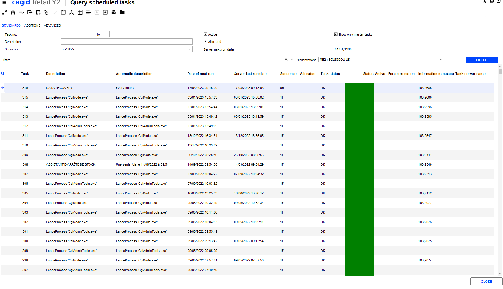
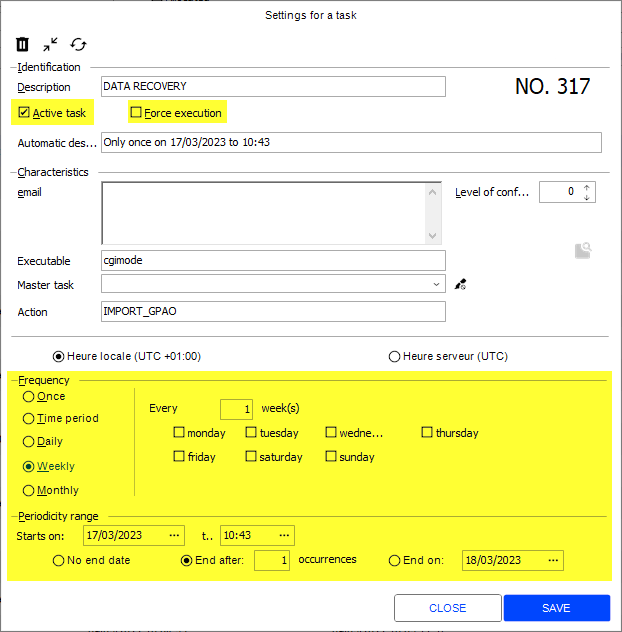
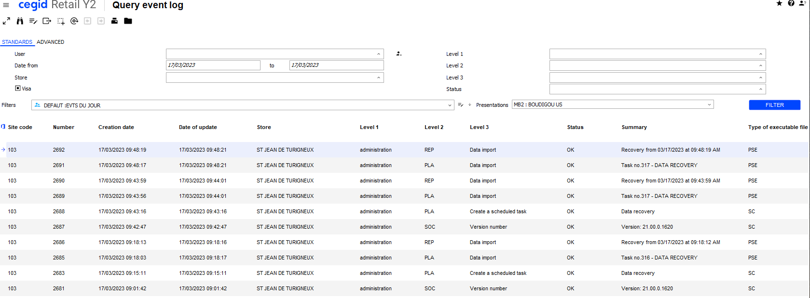

# Follow-up Notes Y2Plugin TaskScheduler V26

*Source: Follow-up_Notes_Y2Plugin_TaskScheduler_V26.pdf | Extracted: 2026-02-27*

---

## TaskScheduler Plugin

## Cegid Retail Y2 –  Version V26

## Follow-up Notes

## Make more

## possible

Registration date:   January 21, 2026

Cegid Retail Y2 – TaskScheduler Plugin

2

## Preamble

This plugin is a set of web services associated with one or more versions of Cegid Retail Y2.

This document describes its scope of implementation, as well as the changes and corrections made.

Please note: All plugin methods and services can be cited in this document. Only public methods for

which the contract is published can be used by applications not designed by Cegid.

Legal notices

Permission is granted under this Agreement to download documents held by Cegid and to use the

information contained in the documents only internally, provided that: a) the copyright notice on the

documents remains on all copies of the document; material; (b) the use of these documents for personal

and non-commercial use unless it has been clearly defined by Cegid that certain specifications may be

used for commercial purposes; (c) documents will not be copied to networked computers or published on

any type of media unless expressly authorized by Cegid; and (d) no changes are made to these

documents.

Cegid Retail Y2 – TaskScheduler Plugin

3

## Contents

Preamble

2

1.   OBJECTIVES  ................................................................................................................................................................................ 4

Documentation

4

Y2 versions

5

2.   MANAGEMENT  ............................................................................................................................................................................ 6

GetDetail

8

GetListDetail

8

Enable

9

Disable

10

ForceRun

10

3.   OTHER  .......................................................................................................................................................................................... 11

Cegid Retail Y2 – TaskScheduler Plugin

4

### 1.   O BJECTIVES

The objective of the  TaskScheduler  plugin is to provide services related to the scheduling of certain

processes, allowing them to be launched automatically on the task servers at a given date/time or on a

regular basis.

Reminder: Only public methods for which the contract is published can be used by applications not

designed by Cegid. Cegid reserves the right to modify private services without ensuring backward

compatibility, and without informing users.

## Documentation

The service contract documentation is visible on the IIS server(s) from the software package download page:

"Documentation" is a link that provides access to the documentation list:

➔   Web Services

The screen displayed provides access to the Web Services contracts and their properties.

Please note: the absence of a contract in the Web Services documentation screen means that the

service is not installed or is not public.

➔   Exceptions

Cegid Retail Y2 – TaskScheduler Plugin

5

This part provides access to exceptions, classified by type, and according to the plugin.

➔   Installation

This page allows you to download Web Services installation and consumption documentation.

## Y2 versions

This plugin is compatible with the following version of Cegid Retail Y2:

➔   Version 26

Note:

The # sign at the beginning of the plugin build number corresponds to the major version of Cegid Retail

Y2.

Cegid Retail Y2 – TaskScheduler Plugin

6

### 2.   M ANAGEMENT

Scheduled tasks are created from the screens of Cegid Retail Y2 schedulable features (replenishment, data

import, accounting transfer, etc.) via the standard scheduling button

.

Example of data import:

The created tasks can be viewed in the Back Office module Administration through menu Scheduled tasks

> Query:

Cegid Retail Y2 – TaskScheduler Plugin

7

Opening the task record allows its administration, with the possibility to:

   Modify the schedule

   Activate/Deactivate the task

   Force an immediate execution of a task, without waiting for its start time.

When a task is launched, its execution is recorded in the event log, allowing its follow-up:

The log report indicates any processing issues.

Cegid Retail Y2 – TaskScheduler Plugin

8

## GetDetail

### ➔   Objectives

This method allows you to view the periodicity or the settings of a called task by its unique identifier.

More or less information is returned, depending on the tags present in the Fields property.

The following business rules are applied:

➔   A task is returned only if it belongs to the Y2 domain (SKJ_APPPLATFORM = "Cegid Retail Y2

XX.Y")

➔   An exception is returned if the ID does not exist. In RESTFUL, the http status code 404 (NotFound)

is returned.

### ➔   Improvements

The service is based on the number of occurrences of the task, to return the information of the last

execution. This number is zero if the task is a "Once" task, and in this case the information was not

returned, a change was made to fix this issue:

Dev

Date

CEGID’s

Ref.

Pb Ref.

Pull request

Plugin Build no.

Quality Ctrl

AMO

3/8/2023

1110892

1110892

158098

#3.20

A new Origin property has been added to the reply.

This property indicates the origin of the task. The available origin types are:

•

DOS – Folder (default value)

•

CEG – Predefined (this task type cannot be disabled and is considered a predefined task)

Dev

Date

CEGID’s

Ref.

Pb Ref.

Pull request

Plugin Build no.

Quality Ctrl

AAH

10/20/2025

1968084

1968084

423853

#4:14 AM

## GetListDetail

### ➔   Objectives

This method allows an external scheduler to have access to the data of the tasks scheduled in Cegid Retail

Y2: task number, description, automatic description, next execution date, sequence, allocation, task status,

status, last execution end date, scheduled tasks in progress.

It also allows you to retrieve the list of tasks according to their status (activated, deactivated, in progress,

etc.), and to filter on a particular task.

More or less information is returned, depending on the tags present in the Fields property.

Cegid Retail Y2 – TaskScheduler Plugin

9

The following business rules are applied:

➔   A task is returned only if it belongs to the Y2 domain (SKJ_APPPLATFORM = "Cegid Retail Y2

XX.Y")

➔   The description and the automatic description are not mandatory. If it is present, a “LIKE” is

performed.

➔   The tasks are returned sorted by Id, by default, if the "Sort" property is not specified.

➔   Each Boolean criterion follows the following rule:

o

Not present in the Request: No filter is applied.

o

Present in the Request: A filter is applied according to the value of the Boolean.

➔   Each date type criterion follows the following rule:

o

Not present in the Request: No restriction.

o

Present in the Request: Tasks with a date between the start and end dates will be

returned in the list.

➔   As the list of tasks meeting the criteria can be quite large, a SOAP and RESTFUL compatible

paging mechanism is implemented.

Maximum size of a page: 1000 tasks, default value 100.

### ➔   Improvements

A new Origin property has been added to the reply.

This property indicates the origin of the task. The available origin types are:

•

DOS – Folder (default value)

•

CEG – Predefined (this task type cannot be disabled and is considered a predefined task)

Dev

Date

CEGID’s

Ref.

Pb Ref.

Pull request

Plugin Build no.

Quality Ctrl

AAH

10/20/2025

1968084

1968084

423853

#4:14 AM

## Enable

### ➔   Objectives

This method is used to activate a scheduled task in Cegid Retail Y2..

The following business rules are applied:

➔   A task is returned only if it belongs to the Y2 domain (SKJ_APPPLATFORM = "Cegid Retail Y2

XX.Y")

➔   No error is returned, if the task is already active, with status = "Already done".

➔   No check on the scheduling data will be performed on the activation, as the task is assumed to be

consistent when it is registered in the database in Y2.

### ➔   Improvements

Cegid Retail Y2 – TaskScheduler Plugin

10

## Disable

### ➔   Objectives

This method is used to deactivate a scheduled task in Cegid Retail Y2.

The following business rules are applied:

➔   A task is returned only if it belongs to the Y2 domain (SKJ_APPPLATFORM = "Cegid Retail Y2

XX.Y")

➔   An exception is returned if the task is not active.

### ➔   Improvements

Tasks with the origin type Predefined (CEG) cannot be deactivated.

When an attempt is made to deactivate this type of task, the system returns an error status with error

code CBR_206_0003 for the task concerned.

Dev

Date

CEGID’s

Ref.

Pb Ref.

Pull request

Plugin Build no.

Quality Ctrl

AAH

10/20/2025

1968084

1968084

423853

#4:14 AM

## ForceRun

### ➔   Objectives

This method allows you to start the immediate execution of a scheduled task.

The following business rules are applied:

➔   A task is returned only if it belongs to the Y2 domain (SKJ_APPPLATFORM = "Cegid Retail Y2

XX.Y")

➔   The task that is forced to run can be inactive (one-off launch of a previously deactivated task). In

this case, it remains inactive after launch.

### ➔   Improvements

Cegid Retail Y2 – TaskScheduler Plugin

11

### 3.   O THER

## Swagger

Rest/Restful APIs grouped by plugin, with the option of selecting them by plugin name.

Dev

Date

CEGID’s Ref.     Pb Ref.

Pull request

Plugin Build no.

Quality Ctrl

ADU

1/16/2025

1543349

345140

#3.174

