# Product Data & Inventory Management

*Source: Cegid Retail Y2 – Version 26 | Extracted: 2026-02-27*

---

# Product Data & Inventory Management

## Item Data

### Item Record

#### Contents

=> See also procedure no. 417 (Item Margin)

Item Record - Contents

The item record forms the basis of a Commercial management folder. Indeed, any information entered when creating items determines to a large extend the creation of documents, analyses and statistics on all aspects of business: purchases, sales, inventory, valuation, etc. The objective is to clearly identify items and classify them by category, supplier, collection, theme or classification.

The process also involves defining the behavior of the items when entering documents and performing valuations. This allows you to analyze the commercial performance of the items associated with each classification, and therefore decide on the commercial strategy to be applied for future seasons.

Cegid Retail Y2 can differentiate various types of items such as:
- Items of type Merchandise (MAR): These items occur most frequently and are the most important. They are dealt with in this manual. Within this category, a distinction is made between single items (no dimensions managed, such as size or color) and dimensioned items (classed by size, color, materials, etc.)
- Items of type Service (PRE): These include services, repairs, or other items that are not referenced or managed in stock, etc.
- Items of type financial (FI): These relate to purely financial register operations, such as deposit payments, reimbursements, register cash float, etc. They are created in Settings > Management > Register operations .
- Items of type Bill of materials (NOM): These items consist of separate merchandise items that have been grouped together into one item for sales purposes. Note that only items present in a bill of materials are managed individually in stock (see Bills of materials ).

This topic deals with Merchandise and Service type items only.

Settings for item records
- Company settings
- Fields in item record
- Access rights

Item records (Merchandise and/or Service)
- Multiple Criteria item list
- Toolbar in the item record
- General tab
- Pricing tab
- Characteristics tab
- Other tabs
- Specific features in service record
- Description of prices from the item record

Functions related to items
- Batch modification and deletion
- Item report
- Item labels
- Creation from pictures
- Lists of items

#### Settings for Item Records

Settings for Item Records

Company settings

Back Office > Administration > Company > Company settings

Settings for merchandise records

Open Commercial management > Items and enter information in the following fields according to management mode wanted. It is highly recommended to manage the following settings from among those proposed:

following fields
- Automatic assignment of the barcode .
- Item code assignment
- Distinct barcodes per supplier .

Service record settings

Go to Commercial management > Services to set default data.

Commercial management > Services

Fields in item record

Back Office > Settings > Items > Field settings.

This function allows you to determine the fields to be displayed in item records. Click here for further information.

Click here

Access rights

Back Office > Administration > Users and access > Access right management
- Menu Concepts (26 ) – Commercial management > Items : This menu allows you to authorize the display, creation and/or modification of item records by relevant user groups. It also allows you to authorize (or forbid) the viewing and modification of prices (Last Purchase Price – LPP and/or Last Cost Price – LCP), as well as the option to query and/or modify item lists.
- Menu Settings (105 ) – Items : This menu allows you to authorize the relevant user groups to access the various settings tables used for specifying the content of the item records. It also allows you to authorize access to the definition of item profiles and barcode types as well as the configuration of required or optional fields in the item record that can be viewed or modified.
- Menu Basic Data (110) – Items : This menu allows you to authorize specific user groups to access the actual item records in Back Office. It also allows you to authorize modification, deletion or closing these records. It is also used for managing access to item-related processes and printed reports.

#### Multiple Criteria Item List

Multiple Criteria Item List

Back Office > Basic data > Items > Items

Back Office > Basic data > Items > Services

It allows you to display a list of existing items based on the specified sort criteria. At this stage, you can perform operations as described in detail hereafter.

Please note!

Some of these buttons are not available in Service type item records.

Toolbar of the multiple criteria screen

The [Expand list] button allows you to hide the selection criteria displayed at the top of the screen in order to free up space to display the item list.

The [Search list] button allows you to launch an advanced search by record description.

The [Set up layout] button allows you to access the settings for the columns on the displayed list in order to customize the information displayed for each item.

The [Export list] button allows you to create a file containing the items from the list, and open this file at a later stage using an office tool such as Excel or Word.

You can create a new item record using the [New] button.

The [New bill of materials] button allows you to create an item BOM (see Bills of materials .)

Bills of materials

The [Duplicate item] button allows you to create a new item record by copying the information contained in the current record, thereby speeding up the creation process.

The [Item properties] button opens the current item record in search mode only. The fields are grayed out and cannot be changed.

These buttons allow you to navigate in the list of items displayed on screen.

The [Notepad] button enables you to display the notepad for the item line selected.

The [Print] button prints the displayed list.

The [Open] button allows you to access the current item record. You can also open the record by double-clicking a line.

#### Toolbar in the Item Record

Toolbar in the Item Record

Back Office > Basic data > Items > Items

Please note!

Some of these buttons are not available for Service type item records.

You can create a new item record using the [New] button.

The [New bill of materials] button allows you to create an item BOM (see Bills of Materials .)

Bills of Materials

The [Apply profile values] button is used to add data, set in profiles, to the current item record (Settings > Items > Item profiles.) Note that the default item profile can be automatically assigned to an item during its creation (see Company settings > Item > Default Profile field .)

Default Profile field

The [Duplicate item] button allows you to create a new item record by copying the information contained in the current record.

The [Update prices] button allows you to update the selling and cost prices.

This button gives access to Item flash query. This window lists all item movements (transfer, returns, reservation, etc.)

The [Complementary data] button enables you to manage several attributes per item, including:

- Working exceptions for the items (on documents, by store, by tax system.)
- Any links with other items
- The supplier list is useful only in a multi-supplier environment (see the company setting One supplier per item .)
- Multi-referencing (allows you to assign codes other than Cegid Retail Y2 code.)
- Classification management (see Multi-classification .)
- Data collection may be called up using this button (see Business Operations and Data Collection .)
- The list of transformed items allows you to view items that have been actually transformed. Very often, this means items purchased in bulk (e.g. chocolates purchased by the kilo) and sold in mixed assortments (e.g. box of chocolates). This option is available only if the Merchandise transformation option, in the "Documents - Entry” section of the company settings has been enabled.

The [Additional information] button allows you to view various information concerning items :

- Stock availability by warehouse and date
- Documents in progress for the item
- Various prices for the item if the Pricing module has been purchased

The [Memos and photos] button allows you to access various photos or files linked to the item record. These photos are of a different type than the “Photo for records” type defined in company settings, and will not cause the Photo tab to be displayed.

The [Print] button allows you to print the item record.

#### Tabs in the Item Record

##### General Tab

Item Record - General Tab

Back Office > Basic data > Items > Items

This first tab contains the basic information for the item. The fields displayed in the General tab are described below. The Orli presentation may be enabled or disabled (see Company Settings - Items .)

Company Settings - Items

Information relating to the item type (e.g., Merchandise or Bill of materials) is displayed on the right above the Comment field.

Please note!
- We strongly advise you not to use a wildcard character when composing your item codes.
- Data displayed in this tab is available according to whether the Orli presentation is enabled or not.
- Orli presentation enabled : Just to remind, the Orli presentation can be activated through Administration > Company > Company settings > Commercial management > Items. When the Orli presentation is enabled, the options described below will not be visible in the General tab. They will be found in the Characteristics tab. Moreover, the Statistic criteria 1 and Statistic criteria 2 fields are available in Orli display mode only. The titles of these fields are configured in Settings > Items > Field title – Collection + Statistics, with the corresponding content being configured in Settings > Items > Statistics. Orli presentation disabled: Some of the options described below will only be visible if the corresponding module has been purchased and serialized.

| Fields | Description |
| --- | --- |
| In stock | This option indicates whether or not the item is managed in stock. By default, this checkbox is activated – in principle, all items are in stock. |
| Discountable | This option allows you to specify whether or not the discount in the document footer applies to the item. By default, this checkbox is activated – the discount will therefore be applied to all created items a priori. |
| Batch management | This option is used to specify whether or not the item is managed by batch (see Batch Management .) This option is available for items with the following characteristics : Merchandise-type items only Items managed in stock Non-consigned and non-temporary items Without serial number management: Items managed with serial number cannot be managed in batches, and vice versa. |
| Packing Item | This option is only visible if packing management has not been activated in the company settings. If it has been activated, this option will not be accessible by default when creating an item. To do this, the item must not be in stock. A packing item does not include dimensions (see Packing .) |
| Serial numbers | This option allows you to specify whether the item is managed with serial numbers (e.g. jewelry, weaponry, etc.). By default, this option is deactivated – created items are not managed with serial numbers unless expressly specified (see Serial Numbers ) |
| Temporary items | This option is not accessible by default. For it to be accessible, the item must not be in stock and must be excluded from replenishment. These items can be called directly during the sales transaction in cases where the item reference cannot be found. A process allows you to correct the sale afterwards and replace this temporary reference with the actual reference of the item sold. A temporary item does not include dimensions (see Sales Based on Temporary Items .) |
| Item for free at register | This option allows you to specify that the item is free of charge (sample, customer gift, etc.) When entering an item of this type at the register, the cursor will not land on the selling price. These items are always free of charge. In this way, item scanning enables you to go to the next line without stopping on the price. When checking out, some fields will not be accessible: price, discount fields, discount percent, unit price and total amount. In addition, the item will be sold without an alert message on the register, even when a margin check is requested for the item. |
| Item for free outside cashing | This option allows you to specify that an item will be free of charge only when entering commercial documents, regardless of movement type: purchase, stock, inventory, etc. This option has no effect on Front Office sales. When entering an item of this type at the register, the selling price will be displayed normally. |
| Commissioned items | This option allows you to specify whether or not the sale of the item is to be taken into account when calculating salesperson commissions. By default, this checkbox is deactivated. |
| Invoice total discountable | This option allows you to specify whether or not the discount applies to the item. By default, this checkbox is activated – Global discounts apply to these items. |
| Line discountable | This option allows you to specify whether or not the discount in a document line applies to the item. By default, this checkbox is activated – It is possible to apply a discount to an item sales line. |
| Usable for loyalty | This option allows you to specify whether or not the sale of the item is to be taken into account when calculating the loyalty total. By default, this checkbox is activated – sales of the item are included in the loyalty total (see Loyalty .) |
| Included in indexes | This option allows you to specify whether the sale of the item is to be taken into account when calculating sales indexes (average sales value, etc.) By default, this checkbox is activated: sales of the item are included in the indices (see Indices .) |
| Replenishment excluded | This option allows you to specify whether or not the item is to be taken into account when calculating the automatic replenishment proposal. By default, this checkbox is deactivated: the item is included when calculating the replenishment proposal (see Store Replenishment .) |
| Managed as countermark | Allows you to enable the countermark for each item concerned (see Countermark Management .) |
| Invisible in Omni-channel | This option allows you to specify whether or not the item is available for use on a Website (see Omni-channel Management .) |
| Deleted on | This field indicates the date applied for batch deletion. |
| Closed | This field, modifiable at dimension level, allows you to forbid the use of the item in all documents. By default, this checkbox is deactivated. However, you can use a related setting in the document types to authorize the use of closed items in certain document types (e.g. transfers, special inputs/outputs, etc.) |
| Sale suspended | This option allows you to forbid the use of the item in sales documents only (e.g., confirmed shortage.) By default, this option is deactivated. |

##### Pricing Tab

Item Record - Pricing Tab

Back Office > Basic data > Items > Items

| Fields | Description |
| --- | --- |
| Currency | This section allows you to modify the display currency of the prices included in this tab. By default, the display currency is always the currency of the folder defined in Administration > Company > Company settings > Accounting > Folder settings. When changing the currency, the exchange rate that was used for the conversion and the corresponding date are displayed for information. |
| Price calculation method | The Price calculation method section allows you to automate the calculation of retail selling prices (incl. tax) and trade prices (excl. tax). To do this, select an initial price from the list, then select a multiplying coefficient and, then check the Automatic re-calculation option. |
| Item margin check | This section is detailed below, under this table. |
| Price list category | This section allows you to link the item to a specific category that has already been created in Settings > Items > Price list category. The objective is to facilitate the input of prices by selecting a category, thereby allowing all items in a specific category to be processed more quickly. |
| Single price | This checkbox is very important for an item managed in dimensions. It allows you to specify whether the prices for all dimensions of an item are identical, or whether these prices differ according to dimension. |
| Excluded from the automatic price list generation | If the corresponding setting is activated in the Company settings, this option allows you to specify whether or not the item should be included in the automatic price list generation process (see Automatic Price List Generation .) |
| Purchase price | This section allows you to enter the purchase price of the item directly, or modify the result of the automatic calculation. The Last purchase price field and Weighted average purchase price fields are populated by Cegid Retail Y2 based on the movements entered for the item in question. However, it is also possible to enter the Last purchase price manually. |
| Profile | Cost price calculations: This setting is active only if you have serialized the Cost Price Calculation module. It enables you to manage cost price profiles, created in Settings > Items > Cost price profiles (see Cost Prices .) |
| Cost price | This section allows you to enter the cost price of the item directly, or modify the result of the automatic calculation originating from the cost price management module. The Base cost price -Tax excl. (GA_PRHT) field is managed by the user. It is updated from the user interface or imported. Cegid Retail Y2 does not modify it. The Last cost price (GA_DPR) and Weighted average cost price (GA_PMRP) fields are filled in by Cegid Retail Y2 according to the movements entered for the item concerned and its profile. These fields are also updated when documents set up to update the LCP and WACP are saved. It is however possible to fill in the Last cost price field manually. To understand how the prices in the item record are populated, please refer topic Description of Prices from the Item Record . |
| Base selling price | This section allows you to enter Wholesale (tax excl.) and Retail (tax incl.) selling prices directly, or modify the results of the automatic calculation. It also allows you to indicate the quantity this price corresponds to. A selling price of €10 for a quantity of 2, implies that the unit price is actually €5. By default, the billing unit is fixed by unit. |

Item margin check

=> See also procedure no. 417 (Item Margin)

This section allows you to specify the information required in order to calculate the minimum margin per item, so that you can check that this is applied in the documents.

For information, the Item margin check function is activated in Administration > Company > Company settings > Commercial management > Documents - entry.

The price used as the basis for the check is retrieved from the item record in accordance with this company setting.

You will then need to populate the Margin qualifier field for each item (Coefficient, Amount or Percentage), as well as the associated minimum value.

The following formula is used to calculate the margin, based on the company setting and selected margin qualifier:

| Company settings | Margin qualifier |
| --- | --- |
| Coefficient | Amount | Percentage |
| Item purchase price | UP * /Item PP | SP * – Item PP | (SP * – Item PP) / SP * |
| Inventory LPP | UP * /Inventory LPP | SP * – Inventory LPP | (SP * – Inventory LPP) / SP * |
| Inventory WAPP | UP * /Inventory WAPP | SP * – Inventory WAPP | (SP * – Inventory WAPP) / SP * |
| Item cost price | UP * /Item CP | SP * – Item CP | (SP * – Item CP) / SP * |
| Inventory LCP | UP * /Inventory LCP | SP * – Inventory LCP | (SP * – Inventory LCP) / SP * |
| Inventory WACP | UP * /Inventory WACP | (SP * – Inventory WACP | (SP * – Inventory WACP) / SP * |

* The price (UP/SP) taken into account for calculation is the ex-tax price when the document is invoiced without tax. If the document is invoice with tax, tax-inclusive prices are used for calculation.

##### Characteristics Tab

Item Record - Characteristics Tab

Back Office > Basic data > Items > Items

Description of the Characteristics tab when the Orli presentation has been enabled.

| Fields | Description |
| --- | --- |
| Measurements | Allows you to enter the required information to create documents, such as a trade of goods declaration. The Gross weight , Net weight and Customs weight fields can be modified at dimension level. |
| Variable weight | This option is visible only when the Weighing module for items option is activated in Administration > Company > Company settings > Commercial management > Front-Office. It allows you to specify whether or not the item should be weighed when it is being sold. |
| Assortment criterion | Allows you to specify the type of assortment assigned to the item in question when the module is activated in company settings (refer to Assortment .) |
| Purchases and Sales | These fields are used to specify the purchase/sales units for the item, and particularly to indicate if the item is not managed by unit. The Purchased in multiples of and Sold in multiples of fields are taken into account in document entry, by rounding up to the next highest multiple the quantity entered or scanned by the user. These fields are also used when copying or generating documents. When entering transfers, the field taken into account by default is the Purchased in multiples of field. It is possible to adjust this setting according to the document type, in Settings > Documents > Documents > Type. |
| Delivered/picked up | This field allows you to set the default pick-up type associated to the item to be delivered/picked up (see Delivered/Picked up .) |
| Accounting and tax information | This section is also used for the trade declaration, but is essential for the correct calculation of VAT in the various documents where the item appears. The Customs reference field can be modified at dimension level. |
| Profile | Since this section no longer appears in the General tab, it will be visible in this tab. The same goes for the following options displayed at the bottom of the screen: Deleted, Closed and Sale suspended. These options are described in detail in the General tab |
| Is considered in the quantity total | This option is active if the Item for free at register option is ticked. It allows you to take the item quantity into account in calculation of the total quantity in each document. |
| Mask-type | The Mask-type , Mandatory , and Standard checkboxes and the By default field are visible for dimensioned items only, provided that management of mask-types is activated in Administration > Company > Company settings > Commercial management > Items. They are respectively used to indicate whether the item is managed by mask-type, and if so, to specify whether or not the use of mask-type is required. It is then possible to specify the standard mask-type assigned to the item (see Mask-Types .) |

##### Other Tabs

Item Record - Other Tabs

Back Office > Basic data > Items > Items

Information tab

This tab allows you to customize the record according to individual needs, as the fields contained in this tab are entirely user-defined and configurable. The number of fields will vary according to the display format activated.
- Orli presentation disabled: The lower section acts as a notepad with simple word processing functions (right-click.)
- Orli presentation enabled: The notepad will be transferred to its own tab (see Notepad tab.)

For information, the titles in user-defined tables are defined in Settings > Items > User-defined field title. But their content must be entered in Settings > Items > User-defined tables or directly in the record, by clicking the button displayed at the end of the field .

Notepad tab

This tab is only visible when Orli presentation is activated in Administration > Company > Company settings > Commercial management > Items. If this option is disabled, the notepad will be found in the Information tab.

Dimension tab

(Refer to Item Dimensions )

Item Dimensions

This tab is only visible for items available in different dimensions (sizes, colors, etc.). It is not present for single items.

When creating an item managed with dimensions, you must associate it to a dimension mask; otherwise the item will be irreversibly created as a “Single” item. Right-clicking on the dimension mask allows the user to allow certain dimensions to be managed for the item. Only existing dimensions are then visible in the mask. However, the Detail checkbox allows you to view all mask dimensions, whether existing or not.

Photo Tab

This tab is only visible when one of the photos linked to the item has the necessary usage type defined in Administration > Company > Company settings > Commercial management > Preferences, and specifically in the Photo for records field. If no photo is defined with this usage type, the Photo tab will not be displayed.

However, you can still see the photos linked to the item via the [Memos and photos] button in the toolbar.

User fields tab

See User fields .

User fields

This tab is displayed only when managing User fields .

#### Specific Features in the Service Record

Specific Features in the Service Record

Back Office > Basic data > Items > Services

Service type items group together the services (alterations, rentals, etc.), repairs, and all items the user does not want to list.

These are necessarily items not managed in stock.

The Service record is just a simplified Merchandise item record.

To learn more about the different fields that make up the Service record, please refer to the Merchandise Type Item Record.

Caution!
- We strongly advise you not to use a wildcard character when composing your item codes.
- The Additions tab is only visible if the After-Sales module has been purchased and enables (see Customer Service Management .)

#### Description of Prices from the Item Record

Description of Prices from the Item Record

The purpose of this topic is to understand how prices are populated in the Item record.

Just remind

In the Pricing tab of the Item record, the Cost Price section allows you to enter the cost price of the item directly, or to modify the result of the automatic calculation originating from the cost price management module
- The Base cost price -Tax excl. (GA_PRHT) field is managed by the user. It is updated from the user interface or imported. Cegid Retail Y2 does not modify it.
- The Last cost price (GA_DPR) and Weighted average cost price (GA_PMRP) fields are filled in by Cegid Retail Y2 according to the movements entered for the item concerned and its profile. These fields are also updated when documents set up to update the LCP and WACP are saved. It is however possible to fill in the Last cost price field manually.

Example of settings for supplier receipts

Document type

Back Office > Settings > Documents > Documents > Types > Valuation tab

All document types impacting the last cost prices or the weighted average cost prices will be taken into account:

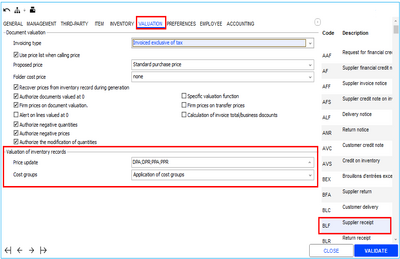

Company settings

Back Office > Administration > Company > Company settings > Accounting

The prices in the item record will only be modified for documents that impact the default store declared in the Company settings, > Accounting > Accounting data > Default store field.

Viewing prices in the Item record

Back Office > Basic data > Items > Items > button [Additional information - Warehouse inventory availability]

The Folder LCP and the Folder WACP fields are managed per warehouse and are expressed in folder currency whatever the currency of the warehouse:

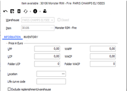

They are updated during the validation of documents set in the document types to be updated, as seen previously (see paragraph above on document types).

#### Functions Related to Items

Functions Related to Items

Batch modification and deletion of items

Batch modification of items

Back Office > Basic data > Items > Batch modification of items

This function is used to modify or fill in a field for a selection of items. Modifications can be validated automatically for all selected records or else record by record for better checking.

Batch modification by picture

Back Office > Basic data > Items > Batch modification by picture

It serves the same purpose as batch modification, but item selection is done using pictures set via the [Memos and pictures] button in item records.

Actually, the items listed here are the ones for which, using the [Memos and pictures] button in the item record, the Use field is set to Picture .

Batch modification of services

Back Office > Basic data > Items > Batch modification of services

This function is used to modify or fill in a field for a selection of services. Modifications can be validated automatically for all selected records or else record by record for better checking.

Batch deletion of items

Back Office > Basic data > Items > Batch deletion

This function is used to permanently delete an item or a selection of items. To do this, the relevant records must first be closed and contain a deletion date. Of course, certain checks should also be carried out before authorizing deletion.

Item report

Back Office > Basic data > Items > Item report

This function is used to print a list of item records selected according to various criteria, with or without valuation.

Item labels

Back Office > Basic data > Items > Labels

This function is used to print the labels to be affixed to the selected items (see Item Labels .)

Item Labels

Create from pictures

Back-Office > Basic data > Items > Create from pictures

This functionality enables faster creation of item records by using pictures and an item profile. To use this, you have to specify the directory in which the files containing the pictures are stored, image format and the item profile used. The records created will be populated with the values of the profile and will have to be completed after creation.

In addition, you should specify if the created items are managed with dimensions, and if so, which dimension mask is associated with the items. You therefore need to launch the operation as many times as there are dimension masks, plus once more for single items. Item records can be created by batch or by validating each new record (recommended option for better checking).

Make sure the size of attached images is not too large.

List of items

Back Office > Basic data > Items > Lists of items

Cegid Retail Y2 offers many processes enabling you to select items according to classification: category levels or user-defined tables. This functionality enables you to select a list of items free of all classification. For more information, refer to Lists of items .

Lists of items

### Item Dimensions

#### Contents

Item Dimensions - Contents

Commercial management folders contain several types of items, including Merchandise items. Merchandise . In this category, the following are differentiated:

Merchandise
- single items that are not classified by size, color, material, etc.
- dimensioned items that come in different sizes, colors, material, depth length, etc.

For example, if you have one item that comes in 10 sizes and 5 colors, it would be needlessly complex, in terms of inventory management, to create 50 different item references. Instead, you can create just one reference using the Size and Color axes (or dimensions). This will then be managed in inventory and in movements with the aid of a dimension. A pivot table for axis 1 Size and axis 2 Color, representing all possible combinations. The number of different axes you will need to use depends on the type of items in question.

The object of this overview is to explain the different steps required to create these masks, and the different ways the data can be displayed in item records and documents:
- To determine the type and number of different item axes required (size, color, inseam, cup size, shoe size, fabric, etc). These are dimension Categories.
- To determine the different codes and values for each range. These are Grids and Values.
- To determine the cross-references to use. These are dimension data entry masks.

Each dimensioned item will then be linked to the appropriate entry mask during creation. This mask will remain with the item throughout its lifetime..

General settings
- Company settings
- Access rights

Dimension mask creation and use
- Creating dimension masks
- Using dimension masks

Dimension grid settings display
- Setting grid display options
- Defining display profiles
- Defining modifiable item fields at dimension level
- Managing reserved colors

#### General Settings

Item Dimension Settings

Company settings

Back Office > Administration > Company > Company settings

Go to Commercial management > Dimensions. Click here for the settings to specify.

Click here

Access rights

Back Office > Administration > Users and access > Access right management

The following menus and access rights must be managed for the different user groups.
- Menu settings (105) > Items > Dimensions for items : Authorizes the relevant user groups to access the various settings tables needed to create the dimension masks used in the dimensioned item records.
- Menu Concepts (26 ) > Commercial management > Dimensions : Authorizes the relevant user groups to access the advanced dimension display settings, and to modify complementary descriptions for imported dimensions.

#### Dimension Mask Creation and Use

Dimension Mask Creation and Use

Creating dimension masks

Step 1: Categories

Back Office > Settings > Dimensions for items > Mask-types

First, you need to determine the number and type of axes to be used for dimensioned items in the folder. Will items come in one-size only, by color, material, inseam or cup. The answers depend on the type of item in question.

You can manage up to 5 distinct dimensions, as indicated below. The Categories command allows you to determine this setting by assigning a code, a description and a short description to the desired dimensions.

The table below shows a typical example of how to create categories, as well as an example that should be avoided.

In fact, the categories must follow each other, i.e. they must be created one after the other, without leaving a "gap" between each of them:

| Example of a PERFECT creation where the categories follow each other: | Example of a creation TO BE BANNED where category 3 would be absent: |
| --- | --- |
| Code: 001 Description: Size Code: 002 Description: Color Code: 003 Description: Material Code: 004 Description: Length Code: 005 Description: Cup | Code: 001 Description: Size Code: 002 Description: Color - Code: 004 Description: Length Code: 005 Description: Cup |
| Note that if a code is not specified, it means that the relevant dimension is not managed in the folder. |

Step 2: Mask types

Back Office > Settings > Dimensions for items > Mask types

Next, it is useful to determine the multi-store dimension mask type.

Note that there is already a “Standard” default mask. In addition to the standard mask, you need to determine a “Multi-store” mask type.

You can do this by creating a new mask type and checking the Multi-store checkbox.

This step is not required, but it will allow you to add an additional axis to the dimensions already managed in the folder, i.e. stores.

In order to create a new type, you must activate mask type management in Company Settings .

Company Settings

When dealing with several types of masks, you can switch between types using the dimension masks display options.

Step 3: Grids

Back Office > Settings > Dimensions for items > Mask-types

For each axis-dimension managed, t his step consists of creating codes and descriptions associated to the grids to be used for items. You must first select the dimension (size, color, etc.), then create the long and short description codes.

For each axis-dimension managed, t

Attention !

Do not enter the content (values) of the size or color grids here. You only need to give them a name.

Examples:
- Size : Perfume volume, bedding dimensions, carpet dimensions, shoe size, clothing size, etc.
- Color: Standard, two-tone, jeans, supplier X color, etc.
- Length: Jeans US, Jeans EUR, etc.
- Cup: Cup US, Cup EUR, etc.
- Material: Basic materials, supplier X materials, etc.

Step 4: Values

Back Office > Settings > Dimensions for items > Mask-types

This step consists of creating the contents, i.e. the values for the various grids for each axis-dimension managed. You first need to choose the dimension type in the upper section of the screen: size, color, length, cup, material, etc. Then you need to enter the values for each grid code/description created in the previous step. The Check for duplicates option enables you to avoid duplicates.

Tool bar

The tool bar has the following options:

The [Display columns] and [Display lines] buttons allow you to switch the value display to vertical or horizontal.

If you have forgotten to create a grid code, the [Create a new dimension grid] button allows you to do so without having to go back to step 3.

The [Insert size] button allows you to add new values where the cursor is positioned .

where the cursor is positioned

The [Delete a size] button allows you to delete only one size.

The [Delete a dimension grid] button allows you to delete a complete dimension grid.

The [Search for a size] button allows you to retrieve a precise value more quickly.

The [Move left/right] buttons allow you to reorder the grid values by moving a value within the grid. Remember to position the cursor on the value you want to move.

The [Ascending/Descending sort] buttons allow you to reorder the grid values by sorting them in ascending or descending order. Note that alphanumerical values will be classified by alphabetical order.

Complementary descriptions

The Complementary description field allows to assign an optional value to the same position in a grid (used with corresponding sizes). You can enter a complementary description in the upper section of the screen (Line: Complementary description), for the current grid where the cursor is positioned (if values are displayed horizontally).

The Display complementary descriptions option allows you to display the complementary descriptions in the lower part of the screen that makes up the grid list, instead of the normal descriptions.

Note that this information is also used by the data import module.

When a dimension grid is imported, modification of complementary descriptions is blocked and the titles of the lines in the upper grid are displayed in bold to show that the grid has been imported.

You can override this block by assigning the relevant access rights in the Administration - Users and access> Management right management menu. This is the Change of the complementary label concept available in Commercial management > Dimensions.

Step 5: Masks

Back Office > Settings > Dimensions for items > Mask-types

In this last step, you need to define the entry mask by cross-referencing the grid values for the different axes in columns, lines and tabs. A test sample remains displayed at the bottom of the screen.

If you click the Close option, you will not be able to use the mask for new items unless you delete it (preservation of old items).

The [New] button allows you to create a mask.

The [Delete] button allows you to completely delete a mask, under certain conditions.

Notes:
- If a multi-store mask type was selected in step 2, each time you create a standard mask the corresponding multi-store mask will be generated automatically.
- Dimension masks can be configured to display normal descriptions or complementary descriptions, or both together in the desired order.
- The dimensions are then displayed according to these new settings.

Using dimension masks

In the item record

Back Office > Basic data > Items > Items

When creating an item record, the Dimension tab enables you to choose the code for the mask to associate to an item.

The various dimension will be displayed cross-hatched, at first (i.e. Nonexistent). A right-click will enable you to render them as “existing” and thus usable for the item. It would not be useful to render all positions as “existing”, above all if an item is not managed in all possible sizes and colors.

The Details option enables you to view dimensions, existing or not, in order to render new dimensions existing in turn.

Please note!

If no mask is associated to an item during its creation, it will be created as a unique item: the Dimensions tab will not exist for this type of item. It will then no longer be possible to associate a dimension mask to an unique item.

When entering a document

Dimension masks associated to items will also be displayed during the entry of document lines referring to these items. On the other hand, only existing dimensions will be displayed.

#### Displaying the Dimension Grid

Displaying the Dimension Grid

Setting grid display options

The dimension grid settings screen can be accessed from.
- The item record: in its Dimension tab click the [Settings] button.
- The document entry: click the [Grid settings] button in the dimension grid.

Display options
- Defining the values to display: The idea is to choose the values to display by dimension from among the available values listed on the left, by transferring them from the list on the right using the right / left arrows. It will then be possible to reorganize the values to display using the up / down arrows.
- Setting the fonts: For each field transferred to the right (in the Values to display column), the [Font] button allows you to access an additional screen to configure descriptions: font used, style, color and size.
- Setting the background For each field transferred to the right (in the Values to display column), the [Background] button allows you to access an additional screen to set the background color for the description.
- Forcing the default style: This button available next to the left of the [Font] button allows you to force the default style for a selected value, when a view on the setup result is not satisfactory.
- Defining the column width: Column width is set automatically by default (recommended). However, you may customize it.
- Defining the alternate colors: The Alternate color option allows you to access to setting 2 colors used alternately to clearly distinguish dimension mask columns.
- Selecting the mask type: The choice of mask type (standard or multi-store) is made in the Presentation options field. If choosing a multi-store mask type, you may then decide to display the code, description or the short description for the stores.
- Viewing other settings: This button allows you to access display profiles, provided that the user has the Display profile access right activated (see Access rights ).
- Defining advanced settings: You may define a more accurate setup for displaying values in the dimension object, by adding display conditions. These settings may be accessed via the [Advanced] button, visible only if the user has the following access right enabled: Dimension display advanced settings (see Access rights ). Up to 3 conditions may be set for a field. To access the condition setting, you need to check one of the No condition fields, then use the [Font] and [Background] buttons in order to set specific values when the condition has been met (e.g. Display negative stock in bold red.) Attention! This advanced configuration in only available for numerical values. Consequently, the [Advanced] button will be grayed-out for non-numerical values.

Defining display profiles

Back Office > Settings > Dimensions for items > Display profiles

This command gives the option to organize these various configurations. Display profiles will be listed according to the display type (document type, item query, etc.) according to user and/or store. You may also set default profiles.

Please note! The settings defined for profiles cannot be used in the specific Front Office receipt line entry screen. This screen has its own display mode. Settings for document type FFO will therefore only be applied in Back Office for the receipt document type.

Define modifiable item fields at dimension level

By default, item data displayed in dimension masks may not be changed. This information comes from the various tabs in generic item records and is simply copied to the mask display. However, some information may be defined as being configurable by dimension. This property is defined for the entire folder and the fields affected are as follows:
- User-defined items 1 to 4
- User-defined Booleans 1 and 2
- Current collection and base collection
- Category/subcategory for levels 1 to 4
- User-defined tables 1 to 15
- User-defined decisions 1 to 15
- User-defined amounts1 to 3
- User-defined dates 1 to 3
- User-defined texts 1 to 3
- User-defined statistics 1 and 2
- Item calculation coefficient with and without tax
- Customs reference
- Invisible Web

Settings

Back Office > Settings > Items > Fields modifiable by dimension

By default, the settings correspond to standard operations, i.e. without fields modifiable by dimension. This command will therefore allow you to select fields which may be modified by dimension.

Using this button, switch the fields that you wish to modify by dimension to the right side of the screen and validate.

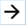

Displaying fields modifiable by dimension in bold

In the Dimension tab of the item record, click the [Settings] button to open the Grid settings screen. The configuration previously defined will be taken into account. Values modifiable by dimension will be displayed in bold.

Use in Item records

Open an item record classified by dimension. In order to distinguish the fields modifiable by dimension from those that are not, the former will have a gray background. These fields will nevertheless remain modifiable at the generic item level, in order to serve as default values during the creation of new dimensions or when the fields of a dimensioned item are updated.

Note that customer-defined information may also be configured by dimension.

Dimension table

The dimension chart enables you to display all fields (modifiable or not) by dimension. Non-modifiable fields are, of course, only available for query. Fields modifiable by dimension authorize the selection of a value specific to the dimension concerned.

The Copy generic data option is available through a right-click and enables you to copy the values of generic items for each modifiable field displayed.

Managing reserved colors

Back Office > Administration > Company > Company settings

This functionality enables you to force a new color on an item, without changing the normal color grid for the item. Go to Commercial management > Dimensions, and check the Consider reserved colors option. This functionality implies that:
- When using reserved colors, the GA DESTINATION1 field will be renamed “Reserved color” in the dimension grid and in its configuration.
- The reserved color will be modified in the record for the dimensioned item, by double-clicking on the dimension grid. During this change, the reserved color will be impacted on all the dimensions corresponding to this color.
- When adding a dimension (right-click / Existing), the reserved color will be automatically assigned to it.

In the dimension object, the description for the dimension used for the color will be replaced by the description of the reserved color.

### Serial Numbers

#### Contents

=> See also procedure 290 (DISPOSERIE Positions)

=> See also procedure 357 (Printing the Serial Number of Items on the Receipt)

Serial Numbers - Contents

When you implement serial number management, every unique or dimensioned item will have a serial number and can therefore be tracked from entry until sold.

Serial number management allows items to be specially identified, but for a given item code only. This means that an item with a special “BAG” code, and a dimensioned “SHIRT” code, available in S, M, L sizes and in RED and BLUE:
- Two dimensions for the same item do not have the same serial number (regardless of the warehouse.)
- Items with different codes may have the same serial number repeated several times (regardless of the warehouse.)

In short:

| SKU | Serial no. |  |
| --- | --- | --- |
| Shirt / S / Red | 123456789 | Impossible |
| Shirt / S / Blue | 123456789 | Impossible |
| Bags | 987654321 | Possible |
| Shirt / M Red | 987654321 | Possible |

In principle, serial numbers should be assigned to items when added to inventory. After entering them into documents allocating stock, these codes will automatically be identified by serial number.

The same applies to the entry of stock-takes.

Item labels and the report relating to documents in stock display the serial numbers of the items in question. A new report lists the movements for the serial numbers provided.

Serial numbers are also managed by the Import/Export module.

General settings
- Configuring serial number management
- Configuring stores
- Configuring items
- Configuring document types
- Configuring access rights

Operation of serial numbers
- Entering serial numbers in document entry
- Scanning serial numbers in document entry
- Serial numbers and document generation
- Operating in standalone mode

Tracking serial numbers
- Updating serial numbers
- Serial number program
- Checking movements
- Tracking serial numbers in inventory
- Item flash (inventory)

Editing inventory and item labels
- Inventory report with serial numbers
- Editing labels with serial numbers
- Editing label on inventory with serial numbers

Inventory count management
- Item inventory with serial numbers

Customer service and serial numbers
- Customer service records with serial numbers
- Reports and customer service receipts with serial numbers

Referencing items handled with serial numbers
- Referencing settings
- Entering references
- Importing the reference table

#### General Settings

Serial Number General Settings

Configuring serial number management

Back Office > Administration > Company > Company settings

Go to Commercial management > Items and populate the Serial Number section.

Serial Number

Configuring stores

Back Office > Basic data > Stores > Stores

The Serial number option enable you to specify the stores that manage serial numbers ( Contact tab in store record).

Configuring items

Back Office > Basic data > Items > Items

To declare an item as managed with serial numbers, check the Serial numbers box in the Characteristics tab.

It is recommended to assign serial numbers to items as soon as they are entered into stock. Nevertheless, you can always check this box for an existing item. A check will be done to detect any anomalies. The summary report will then be displayed onscreen.

In the same menu, you can also use the Batch modification of items command for batch processing and apply this setting to several items in a single operation.

Configuring document types

Back-Office > Settings > Documents > Documents > Types

The Inventory tab allows you to determine the document types involved in serial number management. The elements to enter are described here .

described here

Regarding document generation, the Recover serial numbers setting, also located in the Inventory tab, allows you to specify the type of document from which the serial numbers should be retrieved during generation.

Recover serial numbers

Managing access rights

Back Office > Administration > Users and access > Access right management

Serial number management is subject to access rights that may be allowed or refused in the following menus.

| Menu | Section | Access right/Concept |
| --- | --- | --- |
| Menu Concepts (26) | Commercial management - Inventory | View serial number movements in all warehouses This concept refers to the Serial Numbers > Serial Numbers in stock command available in Inventory > Query. It enables you to authorize or forbid viewing of movements for items managed by serial number. If the user is granted authorization, he can view the serial number of an item in all the warehouses; otherwise, he can see only the warehouses linked to the inventory restriction. |
| Menu Concepts (26) | Document entry | Propose the sale of items w/serial numbers in a stockroom warehouse During the sale of an item with a serial number that will be absent from the main sales/stock site, this concept will authorize/forbid users to go to stock sites only to verify if the serial number is present in stock. |
| Menu Concepts (26) | Serial numbers | Force locks In inventory: Allows you to authorize a user to enter a lesser number of serial numbers than the number of items entered in an inventory document (transfers, special inputs/outputs). This right can also be used to authorize the user to switch from blind entry mode to an automatic assignment entry mode. In purchase documents: Allows you to authorize a user to enter a lesser number of serial numbers than the number of items entered in a purchase document. This right can also be used to authorize the user to switch from blind entry mode to an automatic assignment entry mode. In sales documents: Allows you to authorize a user to enter a lesser number of serial numbers than the number of items entered in a sales document. This right can also be used to authorize the user to switch from blind entry mode to a list-based entry mode. Entry is mandatory in sales documents: You can require the user to enter the serial number in sales documents. Authorize the change of weight for components of serial numbers: Enables you to authorize users to modify weight for item components with serial numbers. They can do this from Inventory > Query > Serial numbers > Referencing. Update if inventory serial numbers: Authorize/forbid serial number modification via the Check/Update inventory command. Modifications are authorized as default. |
| Menu Inventory (103) | Query | Serial numbers These access rights allow you to display the following command lines of the Inventory module > Query > Serial numbers: Check/Update inventory Program Check movements Serial numbers in stock Referencing serial numbers |
| Menu Inventory (103) | Reports | This access right enables you to authorize access to the following options, accessible from the Inventory module > Reports: Inventory report with serial numbers Item labels on serial numbers |
| Menu Settings (105) | Items/Field titles | This enables you to authorize/forbid access to the following commands concerning referencing : User-defined serial number descriptions User-defined dates for serial numbers User-defined serial number checkboxes User-defined serial number values |
| Menu Follow up actions (113) | Inventory/Physical inventory | Variance on serial numbers If you select discrepancy tracking for serial numbers, the actions done with this option may be viewed in Back Office or Front Office: BO > Administration > Event log > Log query FO > Settings > Administration > Event log > Log query |

#### Operation

Serial Number Operation

Back Office > Purchases and Sales modules > Enter menu

Please note!!

When selling several serial numbers associated with a single Y2 item code, we strongly recommend that you enter a sales line for each serial number sold.

This will make it easier to enter the return of a single serial number (see Management of Returns .)

Management of Returns

Entering serial numbers in document entry

When entering a document that has serial number management activated, the user has to enter as many serial numbers as there are items in the document.

If the user enters fewer serial numbers than there are items, a message is displayed :
- If the user does not have the necessary access rights, (force locks), they will be prompted to enter the user code and password of a user who does have these rights to proceed.
- If the user has the necessary rights, they can enter fewer serial numbers than there are items.

In the [Enter serial numbers] screen, users can switch from one input method to another using this button, provided they have the corresponding access rights.

The [Additional actions/Detail of serial numbers] button enables you to return to serial number details in the document.

Missing serial numbers can be entered later, in Inventory > Query > Serial numbers > Check > Update inventory.

After entering each item with its serial number, a window will open allowing you to assign them.

The operation of the serial number entry window depends on previous settings (see Configuring Document Types .)

Configuring Document Types

| Type of entry | Documents concerned | How it works |
| --- | --- | --- |
| Automatic assignment | Purchase documents | If you opted for automatic assignment for the document type, the Allocation of serial numbers screen will appear. The lower section of the screen enables you to configure the automatic assignment desired by entering a prefix and a suffix. The Qty field shows the quantity assigned to the item in the document. The initial number will be automatically incremented, once assigned. A prefix and suffix can also be entered; in which case the serial number is assigned as follows: <PREFIX> + <NUMBER> + <SUFFIX> |
| Blind entry | Purchase and sales documents | If blind entry has been selected as the document type, the Allocation of serial numbers screen will open with the cursor in the Serial number to assign field, so that you can enter the desired serial number. At the stage, you may scan the serial number (see “Scanning serial numbers” below). |
| Select from a list | Sales documents | When selecting from a list has been chosen for the document type, the Allocation of serial numbers window opens in the lower section of the main screen and the list of potentially available serial numbers will. Just switch to the right side of the screen. |

Scanning serial numbers in document entry

When the Allocation of serial numbers window opens, the cursor will go to the first serial number to enter, which immediately authorizes scanning a serial number via an optical wand. When doing multiple entries, the cursor will automatically go to the next serial number while waiting for the scan.

Serial numbers and document generation

Document type settings enable you to specify the document type serial numbers are to be taken from in document generation (see Recover Serial Numbers .) When documents are generated, you can specify and check the serial numbers in the barcode entry screen. There are two possible scenarios here:

Recover Serial Numbers
- Sales: Serial numbers are searched from those present in stock.
- Purchases: Serial numbers are searched from those present in the original document.

Operating in standalone mode

Serial numbers are taken into account in standalone mode, it operates as follows:
- Direct entry of serial numbers in item references: Re-integrating receipts is done without problem (green sale receipt) and does take into account the item related to the serial number.
- Entering item codes (therefore without entering serial numbers): When being re-integrated, sales receipts are in red status (because serial numbers are expected). This requires users to enter open the sales receipts to enter the serial number. In any case, the standard serial number entry window found in connected mode is not proposed in standalone mode.

#### Tracking Serial Numbers

Tracking Serial Numbers

Updating serial numbers

Back Office > Inventory> Query > Serial numbers > Check > Update inventory

This option enables you to enter missing serial numbers or to change existing ones.

Serial number program

Back Office > Inventory > Query > Serial numbers > Program

The reports available through this option are as follows:
- Tracking by number
- Tracking by type
- Checking purchase/sale of series

Checking movements

Back Office > Inventory > Query > Serial numbers > Check movements

This option enables you to track purchasing, sales and inventory movements for items managed by serial number. You can also filter by item status in the multi-criteria search screen.

Tracking serial numbers in stock

Back Office > Inventory > Query > Serial numbers > Serial numbers in stock

This option is subject to the View Serial Number Movements in all Warehouses concept. It enables you to search items by serial number.

View Serial Number Movements in all Warehouses

The multi-criteria search is based on the table of serial numbers in inventory. The results will be limited to these items only. However, you cannot display items present in a store at a given time because they will no longer be present in the table.

Double-clicking on the displayed list will give you access to the movements for the serial numbers selected.

Item flash (inventory)

Back Office > Inventory > Query > Item flash

If the searched item is managed by serial number in the store, the [Serial numbers] button will be available in the toolbar at the bottom of the screen while searching inventory or dimensions. This button enables you to display the criteria for the serial numbers present in inventory.

Query example:
- In the store inventory window, enter the code for the searched item and click the [On catalog] button. Once the item has been selected, the Flash inventory query window will open.
- At the bottom of the screen, click the [Serial numbers] button to display the list of serial numbers in stock for the item.

#### Editing Inventory and Item Labels with Serial Numbers

Editing Inventory and Item Labels with Serial Numbers

Inventory report with serial numbers

Back Office > Inventory > Reports > Inventory report with serial numbers

This option enables you to obtain the list of items managed by serial number and the quantity in stock for each one.

Editing labels with serial numbers

Back Office > Inventory > Reports > Item Labels > On serial numbers

Searching items entered you want to print labels for, takes into account the search priority set in Company settings > Commercial management > Items > field Search Priority for Items .

Search Priority for Items

There is also a standard label template integrating serial numbers available. The barcode printed on this template is as follows:
- The item serial number (code 39) for all items that manage serial numbers
- The item barcode for items that do not manage serial numbers

This template can be used for the following:
- Document labels
- Inventory labels
- Labels with serial number on request

Editing item labels on inventory

Back Office > Inventory > Reports > Item labels > On inventory

The Additions section displays additional options related to the use of serial numbers. The Serial number field enables you to print items managed with serial numbers (for customer reservations and/or picking.)

#### Item Count with Serial Numbers

Item Count with Serial Numbers

Cegid Retail Y2 allows tracking items by serial numbers in the various modules of the application.

The operation describes below is active only for filers supporting serial numbers, i.e. folders for which the Serial number management company setting is ticked. This setting is available in the company settings in Commercial management > Items and is only visible the management of serial numbers has been serialized.

This topic explains how to adjust serial numbers from inventory discrepancies. Using the list of serial numbers in the theoretical inventory, the module allows you to delete or add them in line with the discrepancy quantity

Searching by serial number

Back Office > Settings > Items > Search priorities.

Serial number searches require that search priorities be set beforehand.

Item search priority is handled by the transmission modules via PIT and inventory counter file. It is possible to scan serial numbers. However, for these operations to handle serial numbers, one of the search priorities must contain the Serial number value. Note that the item search priority must also be indicated in Company settings > Commercial management > Items. For more information on managing search priority, please see Search Priorities .

Search Priorities

Generation of the inventory list

Back Office > Inventory > Conduct inventory > Beginning of inventory > Generate a list

Front Office > Management > Conduct inventory > Beginning of inventory > Generate a list

In the creation window of the inventory list, a message is displayed red specifying that inventory lists including items with serial numbers must be created at a given moment.

Transmitted inventories with serial numbers

PIT transmission

Back Office > Inventory > Conduct inventory > Transmitted inventories > Entry/Query

Front Office > Management > Conduct inventory > Transmitted inventories > Entry/Query

You can view and modify transmitted lists. You can also create a totally new list from this menu. If the operator has scanned serial numbers and not item barcodes, the item search priorities from the company settings are used to find the e article to which the scanned serial number belongs. To ensure that serial number based searches work properly, they must be unique in the item data. If there are duplicates, the first number recovered will be processed.

Rejected serial numbers

Back Office > Inventory > Conduct inventory > Transmitted inventories > Correct incorrect BC

Front Office > Management > Conduct inventory > Transmitted inventories > Correct incorrect BC

Rejected serial numbers can be viewed in the list of wrong barcodes. These errors will be processed the following way:
- Item unknown: the transmitted item reference failed to find the item in Cegid Retail Y2.
- Incorrect quantity: for items managed using serial numbers, if the inventoried quantity is other than 1.

Integrating an inventory counter file

Back Office > Inventory > Conduct inventory > Transmitted inventories > Integrate inventory counter file

Front Office > Management > Conduct inventory > Transmitted inventories > Integrate inventory counter file

The import format for an inventoried item lists allows item serial numbers to be entered. The following cases may occur:
- The file has no serial number: serial numbers must be entered manually.
- The file contains a barcode and a serial number: the imported serial numbers will be automatically linked to the item that corresponds to the barcode.
- The file has only one serial number: the search priorities will be used to find the item to which the scanned serial number belongs.

Please note!

Only serial numbers referenced in the database will be recognized; others will be rejected as incorrect.

General remarks
- The entry window is pre-populated with serial numbers that have been imported or retrieved using a portable inventory terminal (PIT). These are displayed on the right-hand list. This is possible only if the item that corresponds to the serial number has been identified in the import file or in the database.
- The length of imported codes is limited to 35 characters. If using an inventory terminal, bear in mind its particular limitations.
- Serial numbers are not mandatory at this stage. A transmission can be integrated even with an incomplete serial number entry; they can be filled in at the inventory count list entry/modification stage.
- If the inventory count is conducted using barcodes (without serial numbers), and if the inventoried quantity corresponds to the number of serial numbers present in the inventory, the serial numbers are automatically inventoried. The inventory count line is then automatically checked as entered.
- If the number of serial numbers inventoried and the quantity inventoried are:

Entering/Changing an inventory count with serial numbers

Back Office > Inventory > Conduct inventory > Enter/Change inventory

Front Office > Inventory > Conduct inventory > Enter/Change inventory

When entering an inventory count, the Enter inventory screen allows you to enter the inventoried serial numbers into the Serial no. column. This list is used for both dimensioned and single items.

This entry is mandatory only for lines with discrepancies.

Information on each line indicates whether or not it refers to an item managed by serial number. This information not only depends on the item, but also on the store, and on the serial number management exceptions per store. The Number referencing window will open:
- By double-clicking on the line of an item managed by serial number.
- Using the Detail of serial numbers option available with the [Additional functions] button.

The upper section of the Serial numbers screen shows the item in question and the inventoried quantity. This window also has a indicator for the origin of the serial number:
- Red : Serial number present in the inventory but not inventoried
- Green : Serial number found in stock and inventoried.
- Amber : Serial number not included in stock but inventoried.

Validating an inventory count

Back Office > Inventory > Conduct inventory > Validation

Front Office > Management > Conduct inventory > Validation

When validating an inventory count, an additional check is carried out to ensure that no information relating to items managed by serial number is missing. During validation, the serial numbers in the inventory are deleted or added, depending on the discrepancies recorded:
- Inventory serial numbers are deleted for items that are included on the inventory count copy, BUT not in the inventoried serial numbers.
- Inventoried serial numbers that do not exist on the inventory count copy are added.

If serial numbers have a particular status (notice, customer preparation, etc.) this status is preserved.

Querying inventory count discrepancies

Back Office > Inventory > Conduct inventory > Generated inventory discrepancies

Front Office > Management > Conduct inventory < Generated inventory discrepancies

When viewing inventory count discrepancies, the Serial number display window can only be accessed in view mode.

Canceling an inventory count

Back Office > Inventory > Conduct inventory > Cancel validation

When canceling an inventory count, the inventory count discrepancy document is deleted. The serial numbers in the inventory are also updated according to the number of canceled discrepancies.

Deleting an inventory count

When deleting an inventory count list, either via the inventory count entry multi-criteria selection screen, or as part of the end of inventory count process, a confirmation request will advise you that the list will not be able to be recreated for the same date because it contains serial numbers. If deletion is confirmed, the serial numbers in the inventory count list and the serial numbers in the inventory snapshot are deleted.

#### Customer Services and Serial Numbers

Customer Services and Serial Numbers

Customer service records with serial numbers

Back Office > Sales > Customer services > Customer service records

Serial numbers can be entered in the Description tab when entering information in a customer service record.

Note that the Serial number field is available in the customer service record only if the store manages serial numbers.

When creating or modifying a customer service record, entering or scanning a serial number triggers a search for a customer service record that includes this serial number and is current (i.e. a record that is not closed or document that is not inactive). If there is already a customer service record open, a message will tell you that there already is a customer service record for this serial number.

Reports and customer service receipts with serial numbers

Customer service reports with serial numbers

The serial number is indicated on the following printed reports:
- Customer service report
- Workshop report
- Shipping document report
- Customer quotation report
- Customer return report

Customer service receipts with serial numbers

The serial number is indicated on the following receipts:
- Customer service receipt
- Workshop receipt
- Shipping document
- Customer quotation
- Green light
- Returned to customer

The Serial number label is only visible if the serial number is displayed in the customer service record.

#### Item Referencing with Serial Numbers

Item Referencing with Serial Numbers

Referencing serial numbers is optional. This allows you to identify all entry/exit movements for items composed in whole or in part of precious metals (gold, silver, platinum). Cegid Retail Y2 enables you to:
- Stock the total weight for gold, silver or platinum for each item by date (serial #).
- Save customer-defined information by serial number.
- Print the serial number and actual weight for each document on retail invoices and labels (by document date).

Referencing settings

Activating referencing

Back Office > Administration > Company > Company settings > Commercial management > Items

This management option must be activated beforehand, using the Referencing Serial Numbers company setting. When this option is checked, it enables you to use the referencing functions. If you also wish to manage the weight and components of items with serial numbers,in addition to referencing, enable the Managing weights and components of serial numbers setting.

Referencing Serial Numbers

Configuring document types

Back-Office > Settings > Documents > Documents > Types

You must indicate the referencing type in the Inventory tab for each Inventory entry document type (see Configuring Document Types .)

Configuring Document Types

Configuring user-defined attributes

Back Office > Settings > Items > Field titles

This table enables you save user-defined information for each serial number. The following elements may be configured:
- User-defined serial number descriptions
- User-defined dates for serial numbers
- User-defined serial number checkboxes
- User-defined serial number values

They will then be available in Inventory > Query > Serial number > Referencing serial numbers.

Managing components

Back Office > Settings > Management > Components

This command enables you to enter the various components for items managed by serial number (e.g., Gold, silver, platinum, diamond, etc.)

Components cannot be deleted if they are used for items with serial numbers.

Managing measurement units

Back Office > Settings > Management > Measurement units

The measurement unit table in Cegid Retail Y2 can be used to save measurement units for component quantity. Measurement units cannot be deleted if they are used for a component.

Entering references

Back Office > Inventory > Query > Serial numbers > Referencing serial numbers

This option enables you to search, create or modify serial number references, outside of all inventory movements. This referencing uses an existing table (STKFICHETRACE), completed with user-defined fields. The Reference without component criterion enables you to filter the references entered with or without components.
1. Click the [New] button to open the Serial number tracking window.
2. Enter header information (item code, serial no., etc.).
3. Click the [New component] button to enter the serial number component, including the weight.
4. The date and the Closed field enable you to track changes in weight for a component over time (e.g. gem polishing, removing a link from a necklace), thus providing the product value history. By default, there is only one open line for given component.

Example:

| GOLD Ring Item 000566 no. 45645645678/ |
| --- |
| Component | 001 – GOLD | 4.45g 8/1/2012 Closed on – |
| Component | 500 - Diamond | 2 Ct 8/1/2012 Closed on – |
| To change ring weight, create new record : Gold at 4g. (Do the inverse to display open items above.) |
| Component | 001 – GOLD | 4.45g 8/1/2012 Closed on X |
| Component | 500 - Diamond | 2 Ct 8/1/2012 Closed on – |
| Component | 001 – GOLD | 4.0g 10/1/2012 Closed on – |
| Each record includes the weighing date and the creation date with time, since the user created a new weight record. |

If a component has already been entered, you may change it by double-clicking on the line. However, modifications are subject to the Authorize modification of component weight for serial numbers access rights option (see Managing Access Rights .) The user may:

Managing Access Rights
- Change the weight for an existing component
- Add another component
- Change the weight for a component by date In this case, if the user changes a already existing component for a serial number, and the weighing date is: Identical: User will be blocked and must change the existing reference. Before: User will also be blocked. After: The existing weight will be closed and a new record added.

The same checks are implemented for imports of components linked to serial numbers.

Importing the reference table

Back Office > Data exchanges > Data recovery > Data import

If all references can be entered, it is possible to import these elements. There are 2 file formats:
- Reference import file (record identifier: SER)
- Component import file (record identifier: COM)

Importing enables you to manage the creation and update of references. Just as for components, you can retrieve composition updates (weight updates on a registered date or a new weight for a new date). The rule remains a weight per active component (the previous component weight must be closed by importing) and the component list must be modifiable.

Please note!

Serial number formats are to be taken into account. If the serial number is already referenced, importing will update it.

### Bills of Materials

#### Contents

=> See also procedure 342 (Bills of Materials and Sales Conditions)

Bill of Materials - Contents

Three bills of materials are described in this document:
- The “macro” bill of materials (BOM) is designed to help with the data entry process. It consists of components that become independent once included in the documents.
- An assembly bill of materials enables you to run down component inventory by managing the bill of materials' own prices. Only the BOM line is displayed in the documents. The BOM content is hidden.
- The assortment bill of materials allows you to sell a combination package; e.g. a box of chocolates, without displaying the details of the content to the customer. The selling price of the combination package is calculated from the total selling price of each of its components.

General settings
- Company settings
- Document types
- Access rights

Creating/Duplicating bills of materials
- Creating a “Bill of materials” item type
- Creating BOM headers
- Duplicating bills of materials

Selling a bill of materials in Front Office
- Macro bill of materials
- Assembly bill of materials
- Assortment bill o materials
- Returning a bill of materials
- Free Items in bills of materials

Inventory management and counting
- Inventory management
- Inventory count management

Other uses of bills of materials
- Standalone mode
- Converting a document
- Entering and invoicing transfers
- Imports/Exports
- Statistics

#### Settings for Bills of Materials

Settings for Bills of Materials

Company settings

Back Office > Administration > Company > Company settings

Go to Commercial management/Items

The following settings will impact the use of BOMs in the application:
- The BOM management setting allows you to authorize all BOM-related functionalities in the application.
- The Authorize several headers per BOM" setting allows you to optimize the way in which bills of materials are managed in inventories. If the company setting is left unchecked, an inventory may be done on bill of materials type items.

Go to Commercial management/Documents - Processing.

The Selection of whole transfers during processing company setting impacts transfer invoicing. . It allows you to invoice all lines in a transfer in one go by including BOM lines The standard process of invoicing for transfers, which is line-based, does not allow bills of materials to be taken into account.

Document types

Back-Office > Settings > Documents > Documents > Types

You will then need to define the documents that will use the bills of materials. Select the document type, then open the Items tab. In the Authorized item types area, select the bill of materials type (NOM), then validate.

Access rights

Back Office > Administration > Users and access > Access right management

The access rights pertinent to BOMs are located in the following menus:

Menu Concepts (26 ) > Commercial management > Items:
- Creation of a BOM item
- BOM item modification
- Deletion of BOM items

Menu Sales Receipts (107) > Access Rights > Enter a transaction:
- Show BOM detail

#### Creating/Duplicating Bills of Materials

Creating/Duplicating Bills of Materials

Creating a “Bill of materials” item type

Back Office > Basic data > Items > Items

Regardless of type, you create bills of materials with the [New bill of materials] button in the multi-criteria toolbar.

The Choose bill of materials type record will then open, allowing you select the bill of materials type that you want to create: Macro, Assembly or Assortment
- “Macro” bills of materials : The “macro” bill of materials (BOM) is designed to help with the data entry process. It consists of components that become independent once included in the documents. It is not possible to enter prices, as the price for the macro bill of materials is the sum price of its components. User-defined information is not available and only the General tab is displayed.
- “Assembly” bills of materials : The “Assembly” bill of materials allows you to maintain a specific price for a bill of material. This is the BOM that is displayed in the documents. Its content is hidden. It is possible to enter a price for this type of bill of material. The user-defined information is also available. The following tabs are also displayed: General, Pricing, Characteristics, Information
- “Assortment” bills of materials : The “Assortment” bill of materials allows you to sell a combination package; e.g. a box of chocolates, without displaying the details of the content to the customer. The selling price of the combination package is calculated from the total selling price of each of its components. User-defined information is also available, and only the General and Information tabs are displayed.

Creating BOM headers

Back Office > Basic data > Items > Items > BOM record.

In this screen, to view items of type Bill of materials in the Additions tab, select Bill of materials in the Item type field.

Open the BOM record you wish, then click the [Bill of materials for item] button to create one of more BOM headers.

If the Authorize several headers per BOM company setting is left unchecked, it will only be possible to create one header per bill of material.

The user will be alerted about this incompatibility when the following message is displayed: Your setup does not allow you to create several BOM headers.

If you want Assortment BOM details printed on receipts, check Print details .

Inserting components

After entering the required information (code, description, etc.), click the [BOM component] button in the Bills of materials (header) record.

Select the Enter BOM option to display the BOM input screen.

This step allows you to select various items (single and dimensioned) that make up the BOM.

Please note!

Cegid recommends avoiding the insertion of BOM type items as a component of another BOM, in order to preserve the reliability of processing in Y2 concerning this type of item.

It is possible to associate a quantity with each selected item. This quantity will then be used when the bill of materials is entered in a document.

This button, on the BOM entry screen, is used to preform a number of actions:

- Open the item record
- Where used: Find the bill of materials headers the item is attached to.
- Insert/Delete lines
- The Show dimensions option allows you to display the dimensions for the item on the task bar at the bottom of the record.

Please note!

The BOM must not include any component with a negative price, as this could cause a problem when the receipt is returned.

Viewing BOM components

After you have created headers and added components to the Bill of materials (header) record, click the [BOM component] button. Select the Implode option.

The Imploded bill of materials screen will open, giving a more detailed view of the complete bill of materials: the various BOM prices and items will be displayed (LPP, LCP etc.), as well as the list of items composing it.

Duplicating bills of materials

Back Office > Basic data > Items > Items

In the multi-criteria screen showing the Bill of materials type items, select the one you wish, then click the [Duplicate item] button.

A new Bill of materials item record type will be displayed, using the name of the duplicated item.

#### Selling a Bill of Materials in Front Office

Selling a Bill of Materials in Front Office

Front Office > Sales receipts > Sales > Enter transaction

Macro bill of materials
- When entering a document: The act of entering the item code corresponding to the bill of materials or scanning the barcode will display the BOM line and the lines corresponding to its components. The prices are displayed automatically as if the items had been entered directly (item price lists applied). It is possible to change the quantity.
- When printing documents: Bill of materials and component detail appearing on receipts

Assembly bill of materials

When entering a document

When entering a document, the process of entering the item code corresponding to the bill of materials or scanning the barcode will display the bill of materials line only. Lines for its components will not appear. If a price list exists for the BOM item, it will be displayed automatically.

Assortment BOM

When entering a document

When entering a document, the process of entering the item code corresponding to the bill of materials or scanning the barcode will display the Bill of materials breakdown screen. This screen allows you to modify the quantity of each of the components, as well as delete certain components and add new ones. This is the real advantage of this type of bill of materials, as the salesperson can customize the packages purchased by the customer right at the register.

Any changes made to the components will only affect the current entry. They will not be transferred to the bill of materials.

The selling price of the combination package is calculated from the total selling price of each of its components.

This button opens the Discount window to enter a discount for one of the lines in the bill of materials.

This button allows you to save the bill of materials under a new name in the event of changes being made to the quantities, for example.

The main advantage here is that it facilitates the entry of new assortments at the register.

The bill of materials backup window opens for you to specify a name for the new bill of materials, as well as label printing options. If a bill of materials containing the same component lines exists, a message will be displayed to this effect on validation.

When the bill of materials is validated, the relevant line is added to the receipt, including any discounts entered.

If necessary, you can view the details of the bill of materials again by clicking the [Additional actions/BOM detail] button on the toolbar. This function is subject to the Show BOM detail access right.

Display the components of the bill of materials

In the same way as with dimensioned items, the assortment is displayed in the document as a comment line, with the components included as hidden item lines. You can display the BOM lines by pressing the ALT+D combination on the BOM line. Each component line is linked to the assortment line. As a result, the following applies:
- You cannot delete or modify component lines.
- Modifying an assortment quantity will trigger the update of each component quantity.
- Deleting an assortment will trigger deletion of all component lines.
- If a discount has been entered in assortments, it will be applied to all components available to be discounted. The markdown reason entered in assortments will be copied to each discounted component.

When printing documents

When the document is printed, the bill of materials detail will only be included if the printing of details was specified in the settings for the bill of materials header.

Taxes

The tax calculation function does not take into account the assortment line; however it does take into account the component lines. This allows the association of items within the same assortment that are subject to different tax rates – for example, dark chocolate is subject to a VAT of 5.5% whereas milk chocolate is subject to a VAT of 20%.

Selling assortments in Back Office

The process is similar to that used for entering sales and printing invoices in Back Office.

Unlike Front Office, an assortment discount can only be entered in the form of a percentage that is applied to each component.

#### Returning a Bill of Materials

Returning a Bill of Materials

Front Office > Sales receipts > Sales > Enter transaction

Returning a bill of materials is done using the [Actions on lines] button, options Returns line or Returns line without control .

The Return of receipts option means that an entire receipt was returned and the customer was identified during the sale.

In any case, returns are saved exactly as sales are, with a negative quantity.

Returning bills of material
- Return line option : When you use this option, the Internal Reference dialog box will be displayed. If you leave this dialog without entering a reference, the List of items sold box will appear. You may then search among these sold items. In this area, to view items of type Bill of materials in the Additions tab, select Bill of materials in the Item type field. The complete bill of materials will be returned with all components. Only one line will be included on the receipt, reflecting the sale. The components will be retrieved with information from the original line.
- Return line option without control : When you use this option, it is easier to first scan the bill of materials code then use the [Actions on lines - Line return without control] button. The complete bill of materials will be returned with all components. Only one line will be included on the receipt, reflecting the sale. The components will be retrieved with the breakdown in the item field.

Managing multiple quantity returns

When there are several items of the same type, you can use an input screen to change any returned quantity. To do this, check the Remainder management on returns option available in the Management tab of the Register settings.

#### Free Items in Bills of Materials

Managing Free items in Bills of Materials

Creating a free item list

Back Office > Basic data > Items > Lists of items

For item lists relating to Loyalty or Sales conditions , you can enter an equivalent value in points for each item.

To display this value in a multi-criteria list, you need to select the Item value (MLH_VALEURARTICLE) field available when customizing presentations.

To integrate bills of materials into a created list of items click the [Add items] button, and then select the Bill of materials option.
- Only macro and assembly bills of materials are managed.
- Only the item lists pertaining to Loyalty or Sales Conditions are concerned.
- The value of the item concerns the bill of materials and its components.

Using the list in Front Office

Front Office > Sales receipts > Sales > Enter transaction

When calling up an item list, a bill of materials will behave same way as other items.

When selecting, you will find the integration function to be similar to bill of materials sales in the receipt (prices, inventory, component management, etc.).

The selling prices in the bill of materials and components will be cleared to 0, with the discount reason configured in Sales conditions and Loyalty.

#### Inventory Management for Bills of Materials

Inventory Management for Bills of Materials

Inventory closures and snapshots

Back Office > Inventory > Processing > Inventory closures and/or Inventory snapshot

The creation of inventory closures and inventory snapshots takes into account the bills of materials stored in the LIGNENOMEN table.

Inventory Adjustment

Back Office > Administration > Maintenance > Inventory adjustment

The inventory adjustment utility takes into account the bills of materials stored in the LIGNENOMEN table.

Replenishment

Back Office > Inventory > Store replenishment

Assortments are not held in stock. They cannot therefore be taken into account when calculating store replenishments.

However, the sale of an assortment will trigger the sale and update of the corresponding component inventory.

These elements are taken into account when calculating the replenishment (a search is carried out for the sales in the LIGNE + LIGNENOMEN table).

The restriction of items based on movements takes bills of materials into account. Sales and lifecycle methods take bills of materials into account.

#### Inventory Counts for Bills of Materials

Inventory Counts for Bills of Materials

When generating an inventory list, bills of materials can be selected just as items of type merchandise. When a bill of materials is selected, the associated items are then inserted into the inventory list. Inventory transmission also accepts bills of materials that will be added to the transmission when BOM barcodes are scanned and then broken down when integrated.

Example:

The “BASKET” bill of materials is composed of 2 chocolate bars and one pack of coffee

When this bill of material is scanned for transmission, you will see a BASKET line appear. If you scan 2 BASKETS, a line with 2 “BASKET” bills of materials will appear.

When integrating this transmission; the module automatically transforms the bill of materials by returning the items that compose it to insert them into the inventory list.

In our illustration,

If you scan 1 basket, you get:
- one line with 2 chocolate bars
- one line with 1 coffee pack

If you scan 2 baskets, you get:
- one line with 4 chocolate bars
- one line with 2 coffee packs

Note that a bill of materials may have more than one header; in this case, the bill of materials cannot be used in inventories.

Required settings

Back Office > Administration > Company > Company settings

Go to Commercial management> Items and uncheck the Authorize several headers per BOM option.

This setting prohibits the creation of several headers for a bill of material to make them usable in inventories.

To use bills of materials in transmissions, this setting must be unchecked. Otherwise, the process can select a header only arbitrarily. Once this setting disabled, you cannot create more than one header for a bill of materials.

Please note!

This setting is initialized according to the data in the database. If there are several headers for a same BOM item, the setting is enabled; otherwise it is disabled. If the setting is enabled and there are several headers for the same BOM, then the company setting can not be changed as long as there are BOMs with several headers.

Taking inventory

Back Office> Inventory > Conduct inventory

It is possible to select bills of materials directly when creating an inventory list or transmission. The associated items are then added to the corresponding document automatically. When bill of materials barcodes are scanned, they will be added to the transmission then broken down during integration.

#### Other Uses for Bills of Materials

Other Uses for Bills of Materials

Standalone mode

Back Office > Administration > Scheduled tasks > Price list aggregates

All types of bills of materials are available in standalone mode. To have access to them, the following conditions must be met:
- Only bills of materials sold within 90 days preceding the calculation date of aggregates are taken into account.
- The Bills of materials option must be ticked in the price list aggregates.

Note that price list aggregates for items composing bills of materials are calculated even if they do not met price list aggregate criteria (refer to Managing Price Lists and Items in Standalone Mode ).

Managing Price Lists and Items in Standalone Mode

Converting a document

When converting a document containing an assortment, each component line is linked to the corresponding line in the original document. Remainders can be managed at assortment level, with the option of balancing assortment remainders.

Entering and invoicing transfers

When invoicing transfers, it is possible to invoice a transfer in its entirety, with inclusion of bills of materials. In this case, the selection is made in the document header.

The Selection of whole transfers during invoicing company setting, accessed under Commercial management > Documents - Processing, allows you to invoice all lines in a transfer in one go by including BOM lines.

The standard process of invoicing for transfers, which is line-based, does not allow bills of materials to be taken into account.

Imports/Exports

Bills of materials are integrated into import/export functions.

Statistics

The vast majority of the statistics available in Front Office and Back Office take components into account, as opposed to assortments.

### Item and Store Lists

#### Contents

Lists of Items and Lists of Stores - Contents

Cegid Retail Y2 offers many processes enabling you to select items according to classification: category levels or user-defined tables.

This functionality enables you to select a list of items free of any classification.

You may also manage store triggers based on a store list (see Triggers .)

Triggers

Creating an item and/or store list
- Creating list headers
- Adding items to the list
- Adding stores to the list
- Special features of Sales conditions and Loyalty lists

Examples of item list usage according to scope
- Using item lists
- Using store lists

Importing lists
- Importing an item list
- Importing a store list

Associated access rights
- Access rights management

#### Creating Item or Store Lists

Creating an Item and/or Store List

Back Office > Basic data > Items > Lists of items

Back Office > Basic data > Stores > Lists of stores

A list is made up of a header and lines (items or stores). To create an item list, follow the procedure shown below.

Creating list headers

Press the [New] button, then enter a code and description associated to the new list, and if need be, select a restriction category.

The Scope of use box lets you define the function(s) in which this list will be used. You can use the Triggers scope of use

Triggers
- Calculation of WAPP - WACP
- Catalog
- Sales conditions
- Triggers
- Loyalty
- Inventories
- Payment methods
- Transfer prices
- Replenishment
- Statistics
- Price list update

Next, press the [Save] button to open the selection screen for the items or stores that will make up the list.

Adding items to the list

After creating the list header, the item list screen will be displayed.

Press the [Add items] button, then select the item selection type:

- Item grouping: Select from generic and single items
- Dimension grouping 1 - 5: Select items according to dimension (size, color, material, cup, length, shoe size, etc.)
- No grouping: Select from single and dimensioned items
- Bill of materials: Select from Macro and Assembly bills of materials

In the Item selection screen, make your selection using the space bar or the [Select all] button.

After making your selection, click on [Add items] then validate the confirmation message.

The Item list screen will open with the list of items previously selected. At this point you can add new items, delete items or even leave the screen.

“Bill of Materials” type items

Only Macro and Assembly bill of materials types are authorized. They need to be linked to lists with a scope of use set to Sales conditions or Loyalty . When calling up an item list, a bill of materials will behave same way as other items. When selecting, you will find the integration function to be similar to bill of materials sales in the receipt (prices, inventory, component management, etc.)

“Service” type items

You can integrate services into item lists. The scopes of use for which the services are authorized are as follows:
- Sales conditions
- Triggers
- Loyalty
- Payment methods

Adding stores to the list

After creating the list header, the item list screen will be displayed.

Click the [Add stores] button to display the stores.

In the Store selection screen, make your selection using the space bar or the [Select all] button.

After making your selection, click on [Add stores] then validate the confirmation message.

Special features of “Sales Conditions” and “Loyalty” scopes

Allocating values

For item lists relating to Loyalty and Sales conditions, you can enter an equivalent value in points for each item on a list.

Select the item, then click on the [Allocate values] button. The Value to allocate window will open, enabling you to enter an item value.

BOM management

When calling up an item list, a bill of materials will behave same way as other items.

When selecting, you will find the integration function to be similar to bill of materials sales in the receipt (prices, inventory, component management, etc.).

Sales condition options

This section is visible only if the Sales conditions scope is checked. The displayed options enable you to show whether you wish to offer “Item merchandise not managed in stock” , and/or “Item merchandise with zero or negative stock” as item-gifts.

The Order of display option enables to determine the order of display of items in item lists. It may take the following values: item and description code, value (descending sorting), quantity in stock (descending sorting).

When entering sales receipts, if the conditions for obtaining sale conditions wit the list of gift items have been met, the gift selection window will display the available items according to determined stock criteria, according to the order of display configured.

In standalone mode, item lists are downloaded, but not stock. It will therefore display 0. If the list of items has been configured to be sorted by the quantity in stock, then it will be sorted by item code.

#### How to Use Lists According to Scope

Examples of Item List Usage According to Scope

When your item lists have been created, they can be used in various functions according to the scope of use shown in the record.

Using item lists

Calculation of WAPPs

This scope can be used in Back Office > Administration > Maintenance > Recalculation of WAPPs.

It enables you to calculate the WAPPs for a list of items selected from the Characteristics tab, Option section.

Catalog

This scope can be used in Cegid Retail Live Store.

It facilitates the addition of items without barcodes by giving the cashier access to item lists.

Please refer to topic about Using item lists in the Cegid Retail Live Store documentation.

Sales conditions

This scope can be used in Back Office > Sales > Sales conditions > Rules.

It enables you to create sales conditions concerning a list of items shown in the Benefit tab.

Triggers

This scope can be used in Back Office > Settings > General > Triggers > Item.

It enables you to create item triggers on the basis of an item list in the Trigger type section.

Loyalty

This scope can be used in Back Office > Sales > Loyalty > Loyalty programs.

It enables you to specify whether item lists will be managed in benefit options.

Inventories

This scope can be used in Back Office > Inventory > Conduct inventory > Beginning of inventory > Generate a list.

In the Item selection pane, the Use of an item list field allows you to use one or more previously created item lists. Items in this list make up the items to be inventoried.

Payment method

This scope can be used in Back Office > Settings > Management > Payment Methods.

With Cegid Retail Y2, for a given payment method, you can define which item to offer the customer when a sale is paid for in full using that payment method. The Front Office tab enables you to input the item list to be used to reimburse the customer.

Transfer prices

This scope can be used upon document entry.

Once this module enabled (via the Company Settings webapp and the Store record), the item list will be automatically displayed in document entry mode (for document types defined in calculation rules.)

Replenishment

This scope can be used in Back Office > Inventory > Store replenishment > Replenishment and Distribution and Rules for replenishment.

The Replenishment and distribution command enables you to add items from a previously created item list.

Likewise, the Rules for replenishment command enables you to create replenishment rules based on an item list.

Update of price lists

This scope can be used in Back Office > Sales > Pricing > Price list update > On item lists.

It enables you to update a previously created item list. The system displays a multi-criteria window with all item lists whose scope of use is Update of price lists.
- The [Additions] button lets you view a list header, as well as items on the list.
- Double-clicking on the selected item list will launch the price update wizard.
- Before the wizard comes up, a test will be done to ensure that the item list is actually complete.
- Generating prices is done using items on the list in the same way as when items are selected individually.

Using store lists

Note that store lists have only a scope of use of type Triggers.

Triggers

This scope can be used in Back Office > Settings > General > Triggers > Store.

It enables you used to create a store trigger based on a store list. To do this, check the Store list option in the Trigger type section.

#### Importing Item or Store Lists

Importing an Item and/or Store List

Back Office > Data exchanges > Data recovery

To import item lists, you need to specify an importing format for them with all the required fields, as well as the tests to be done and data to be updated. The new format is to be supplied for "Default recovery" data origin. This is to be completed with a “.dai” file (contact your Cegid consultant, if necessary).

For more information on importing item or store lists, please refer to the documentation about Data imports - Import formats .

Data imports - Import formats

List of items

MLISTEARTICLE

You may create and update item lists by importing files to the MLISTEARTICLE table.

The import format is defined in the MLISTEARTICLE table containing the items on the list that several supplementary fields will be added to, in order to manage header data and various item information.

Procedure

Items may be entered via barcode or item code. Dimensions are checked in relation to an additional description (CAPM code). Note that price list importing can only update a single usage scope, which may be completed by importing another scope.

According to the item information entered, grouping by item will be determined automatically, except if a settings discrepancy prevents it:
- Item grouping
- Grouping - dimensions 1 to 5
- No grouping

List of stores

You may create and update item lists by importing files to the following tables:

MLISTEETABENT

This table is populated using the following fields:

| Fields | Description |
| --- | --- |
| $$_LIBELLELISTE | Description of the store list |
| $$_PORTEELISTEETAB | Scope of use for the store list |
| $$_FAMILLERESTR | Restriction category for the store list |

MLISTEETABLISS

To populate the MLISTEETABLISS table:

| Fields | Description |
| --- | --- |
| ML2_ETABLISSEMENT | Store code |
| $$_ANNULEREMPLACE | X: Deletes all stores from the list before recreating it, by adding the store from the relevant line. Empty: Adds store of the relevant line |

#### Managing Access Rights

Access Rights Linked to Item and Store Lists

Back Office > Administration > Users and access > Access right management

The access rights concerning this function are located in the following menus:

List of items

Menu 26 – Concepts

In the Commercial management section, you can choose whether or not to authorize salespeople access to the following commands:
- View all item lists
- Modify all item lists

Menu 102 – Sales

In the Price list update section, you can choose whether or not to authorize salespeople access to the price update command on the item list.

Menu 110 – Basic data

In the Commercial management section, you can choose whether or not to authorize salespeople access to the List of items command.

Store list

Menu 110 – Basic data

In the Commercial management section, you can choose whether or not to authorize salespeople access to the List of items menu.

### Merging Items

#### Contents

Merging Items - Contents

Merging an item allows you to replace an existing item with another item from the database. All data relating to the items, i.e. histories, inventory, price lists, etc., will be merged during this process. You can merge several items at the same time.

Checks, restrictions and access rights
- Checks and restrictions
- Access rights

Creating an item merge
- Step 1: Enter the setup description
- Step 2: Select the item to preserve
- Step 3: Check dimension mapping
- Step 4: Execution mode and updating purchase prices
- Step 5: View the processing report

Managing and following up item merges
- Merged items
- List of item merges

Data imports
- Merging from a data import

Technical appendix
- References
- History
- Inventory
- Non-supported tables

#### Checks, Restrictions and Access Rights

Merging Items: Checks, Restrictions and Access Rights

Checks and restrictions

Several checks are carried out to validate the merging of the items:
- The items must be merchandise items.
- You cannot merge items that are managed in stock with items that are not managed in stock.
- The selected items must belong to the same supplier if the folder is managed in single supplier mode.
- The items to be merged must be of the same type – the utility can merge single items OR dimensioned items
- The selected items must have the same number of dimensions – all the dimensions of the item to be replaced must be mapped. Two items with different dimensions cannot be merged based on the same dimension (a document containing these 2 dimensions would subsequently be corrupt).
- If the items to be merged are managed with serial numbers, the utility will verify that these serial numbers are all different. If the serial numbers are all different, the merge can be carried out; otherwise, the merge is not possible.
- For consigned items, the items must have the same exceptions (the list of stores where both items are consigned or non-consigned must be the same).
- The selected items cannot be part of the current inventory list, nor a non-validated replenishment suggestion.
- The tax settings for the selected items must be identical, as well as the "purchased by" and "sold by" values.
- Two items to be merged must not be linked together.
- The additional index for GL_CODESDIM in the LIGNE table is required. Its existence is checked in the list of additional indexes.
- It is not possible to merge closed items.

Access rights

Back Office > Administration > Users and access > Access right management

Access rights allowing you to authorize certain actions or menus for the user groups concerned are located in menu Administration (106) > Maintenance > Merge items. Notably, it allows you to access the following commands:
- Create a merge
- List merges

#### Creating an Item Merge

Creating an Item Merge

Back Office > Administration > Maintenance > Merge items > Create a merge

The screen will display the list of items based on previously entered selection criteria.

Select the item to merge using the keyboard space bar, then click this button to start the setup wizard for the merge.

You may leave the wizard at any time without losing your work. A message will prompt you to save the current operation, which then can be resumed using the Merge items/List merges command.

Step 1: Enter the setup description

This description allows you to describe the purpose of the merge setup. This information is required in order to continue.

If the description is not entered, the selected items will not be saved if you cancel.

Step 2: Select the item to preserve

The screen is divided into 2 sections:
- The list of selected items is displayed on the left.
- The item to be kept is displayed on the right.

This item must be included in the list of selected items. The arrows allow you to switch the items that you want to keep to the right.

Step 3: Check dimension mapping

This step is carried out for generic items only. For each item to be merged, you are prompted to enter the mapping between the dimensions of the item to be merged and the replacement item in a grid. The screen in the form of a table, lists the different items to be merged and their dimensions. To make the mapping easier, all of the dimensions of the item to be merged are displayed automatically.

This button allows you to automatically map the dimensions of the item to be saved, to the dimensions of the items to be merged if they have the same dimension mask and the same dimensions.

The dimension is selected using a button in the "Correspondence" column which displays the dimension grid for the item to be saved.

All of the dimensions of the item to be merged must be mapped. The following step will not be accessible if this rule is not applied.

In order to make it easier to enter the required mapping, you can use a checkbox to hide items that have already been processed. As long as the process has not been scheduled or executed, it is possible to change your mapping selections.

Step 4: Execution mode and updating purchase prices

The screen gives you the option to execute the item merging process immediately via the "End" button, or to schedule the execution of this process. By default, the choice is an immediate execution. A warning message will be displayed informing you that the process will take a while.

Please note!

An immediate execution is not recommended if the merge involves a large number of items. If it is used, the process is performed on the local workstation and involves multiple exchanges with the server.

Two options allow you to specify whether the WAPP and/or LPP values should be recalculated after the items have been merged. This process involves recalculating the WAPP and LPP values of inventory based on the movement history available in Cegid Retail Y2.

Any movements not included in the application that had an effect on the initial stock are not taken into account.

For further information about recalculating WAPPs, refer to Recalculation of WAPPs.

Step 5: View the processing report

Once the operation has been run, you can view the merge run report. This report is saved and can also be viewed from the List merges command by double-clicking on the line of the operation to be viewed. The report includes the following:
- Processing status
- Any error messages and warnings
- Execution time
- Informational messages, if not too large

#### Managing and Following up Item Merges

Managing and Following up Item Merges

Merged items
- Merged items are closed
- The Replacement item field in the item record is populated for informational purposes.
- Merged item barcode is deleted
- The merge date is saved and may be viewed using the List merges command, by adding the Run date to the presentation setup.

List of item merges

Back Office > Administration > Maintenance > Merge items > List merges

This command enables you to list and manage the settings of already created merges. This screen allows you to complete the following:
- Create a merge with the [New] button.
- Modify or delete the setup for merges that have not been executed yet.

Processing status

Once the process has been executed, its status will change:

| Status | Description | Caption |
| --- | --- | --- |
| On hold | The process is being created, and has not been executed yet. The setup can be modified. |  |
| Scheduled | The process is scheduled for a specific date and time. The merge was not carried out. The setup can no longer be modified or executed. |  |
| In progress | The process is running. The setup can no longer be modified or executed. |  |
| Error | The process was executed, serious errors were detected, so the merge was not carried out. The setup can no longer be modified, but can be executed again. |  |
| Warning | The process was executed, minor errors were detected, therefore the merge was carried out. The setup can no longer be modified or executed. |  |
| Terminated | The process was executed without errors, the merge was carried out. The setup can no longer be modified or executed. |  |

#### Merging from Data Import

Merging from Data Import

It is possible to merge two items using an import file.

Please note!

For this import, the two items must be unique, or dimensioned with the same masks and same dimensions.

The $$_PMAPMAJ and $$_DPAMAJ fields specify whether the merge is followed by recalculation of the WAPP and LPP values respectively.

These options can be specified via the default values for these fields in the import format.

These options are common to all dimensions of the saved item. The values defined for the first record are used here.

Import format: MFUSIONARTDET table

The optional $$_LIBELLE field allows you to specify a description for the merge. The default description is "Merging based on item XXX".

The item identifiers can be replaced by the $$_CODEBARREFUS and $$_CODEBARRECONS fields, so that you can find the item identifiers using their barcodes.

| Type | Mode | Seq. | Start | Size | Type | Req. | Field | Description |
| --- | --- | --- | --- | --- | --- | --- | --- | --- |
| FUA | C | 1 | 0 | 35 | AN | Yes | MFD_ARTICLEFUS (1) | Merged item identifier |
|  |  |  | 35 | 35 | AN | Yes | MFD_ARTICLECONS (1) | Saved item identifier |
|  |  |  | 70 | 35 | AN | No | $$_LIBELLE | Merge description |
|  |  |  | 105 | 1 | AN | No | $$_PMAPMAJ | Recalculation of WAPPs |
|  |  |  | 106 | 1 | AN | No | $$_DPAMAJ | Recalculation of LPPs |

Constraints

For dimensioned items, the following constraints apply:
- The file must be sorted by preserved item.
- All dimensions of merged items must be mapped to the preserved item.

Otherwise, it is not possible to merge dimensioned items. The constraints defined in the Checks and restrictions section must also be checked.

Checks and restrictions

#### Technical Appendix

Merging items - Technical appendix

This chapter describes the impacts of merging items.

References

The references for the merged items are replaced for various possible setups:

| Settings | Impacts |
| --- | --- |
| Barcodes | If the barcode of the merged item is different from that of the merge item, the latter is taken and used for multiple referencing. The same holds for the multiple referencing of the merged item (ARTICLETIERS). |
| ARTICLE table | The item is preserved and closed. The merge date is available in the MFUSIONARTENT table. If the item is dimensioned, the corresponding generic item is closed also. |
| GA_REMPLACEMENT | Replacement item (unused) will be populated by the merge item, available in read-only mode in the item record. |
| GA_SUBSTITUTION | Substitution item (unused), hidden in the item record. |
| Company settings | If the merged item is referenced in a company setting, it is replaced by the merge item. - Commercial management/Front Office standalone mode/Default item: SO_GCFODGDARTICLE |

History

The references for the merged items are replaced in the following tables:
- AFFCDEDISPO – GED_ARTICLE: Order allocation - Available
- AFFCDELIGNE – GEL_ARTICLE, GEL_CODEARTICLE, GEL_CODESDIM: Order allocation – Detail line
- ARTICLEPIECE – GAP_ARTICLE: Item exception by document
- ARTICLETIERS - GAT_ARTICLE: Third party referencing
- CATALOGU – GCA_ARTICLE: Item catalog
- COMMISSION – GCM_ARTICLE, GCM_CODEARTICLE: Sales representative commission
- DISPOSERIE – GQS_ARTICLE: Available from serial numbers
- GSERIETYPEART – GSA_CODEARTICLE: Mask type/Item link
- LIAISONPIECE – GLP_ARTICLE: Document link
- LIGNE – GL_ARTICLE, GL_CODEARTICLE, GL_CODESDIM: Document line
- LIGNENOMEN - GLN_ARTICLE, GLN_CODEARTICLE: BOM line
- LIGNESERIE - GLS_ARTICLE: Serial number line
- Not managed: - LISTEINVLIG - GIL_ARTICLE, GIL_CODEARTICLE: Inventory list line
- MARTICLETRANSFO – MTF_ARTICLE, MTF_ARTICLETRANSFO: Item transformation
- MCOLISENT – MCE_ARTICLE: Package header
- MCOLISLIG – MCL_ARTICLE, MCL_CODEARTICLE: Package line
- MODELETAXEART – GMA_ARTICLE: Item exception on tax model
- NOMENLIG – GNL_ARTICLE, GNL_CODEARTICLE: BOM definition
- PARSEUILFID – GFS_CODEARTICLE: Loyalty threshold
- TRANSINVLIG – GIN_ARTICLE, GIN_CODEARTICLE: Inventory list lines
- PM specific tables

Inventory

Items managed in stock

For items managed in stock, the following counters are totaled:

GQ_PHYSIQUE GQ_RESERVECLI GQ_RESERVEFOU GQ_PREPACLI GQ_LIVRECLIENT GQ_LIVREFOU GQ_TRANSFERT GQ_QTE1 GQ_QTE2 GQ_PREPAORLI GQ_STOCKINITIAL GQ_CUMULSORTIES GQ_CUMULENTREES GQ_VENTEFFO GQ_ENTREESORTIES GQ_ECARTINV GQ_QRUPSTOC GQ_TAILLELOT GQ_FACTURECLI GQ_FACTUREFOU GQ_AVOIRSTOCK GQ_AVOIRFOURNSTOCK GQ_RETOURFOURN GQ_DISPOCLI

The following counters are not totaled, and are excluded:
- Minimum inventory: GQ_STOCKMIN
- Maximum inventory: GQ_STOCKMAX
- Assortment inventory: GQ_STOCKASSORT

The values of the merge item will be kept.

WAPP/LPP

There are two options for the GQ_PMAP (WAPP inventory) and GQ_DPA (Last purchase price - inventory) fields:
- The replacement item values will be kept as they are.
- The values are recalculated after the merge by taking all merged item movements into account.

Note : Cost prices can be recalculated later by the cost price utility.

Note

Inventory records and snapshots

The inventory record for the merged item is deleted (DISPO)

For the inventory snapshots, the available quantity is merged and the recipient item prices are preserved (the prices in the inventory snapshots can be taken from inventory or from the item record)

The inventory record for the merged item is deleted from the snapshot (MDISPOIMAGELIG)

Removal of records

The records pointing to the items to be merged are removed from the following database tables:
- Removal from the price list table: TARIF – GF_ARTICLE
- Removal from the price list calculation table: MTARIFCALC – MTC_ARTICLE
- Removal from the linked item table: ARTICLELIE – GAL_ARTICLE, GAL_ARTICLELIE
- Removal from the sales extrapolation curve table: COURBEEXTRAVENTE – MCV_CODEARTICLE: Sales extrapolation line
- Removal from the replenishment aggregate calculation program table: MAGRREACALC - MA2_ARTICLE: Calculation of replenishment aggregates
- Removal from the consigned item exception table: MARTEXCEPTCONFBTQ – MEC_CODEARTICLE: Consigned exceptions by store
- Removal from the assortment routing table: MGAMMEASSORT – MG1_CODEARTICLE
- Removal from the assortment routing by store table: MGAMMEETAB – MG3_CODEARTICLE
- Removal from the item list table: MLISTEARTICLE – (MLH_ARTICLE) MLH_CODEARTICLE
- Removal from the cost price calculation table: MPRCALCART – MPX_ARTICLE
- Removal from the replenishment balancing table: MPROPEQUILIBRAGE – (MEQ_ARTICLE) MEQ_CODEARTICLE
- Removal from the top-selling replenishment table: MPROPPALMART – MP0_ARTICLE: Top-selling replenishment items
- Removal from the replenishment rule table: MPROPREGLEART – MR3_ARTICLE: Replenishment rule
- Removal from the replenishment proposal line table: PROPTRANSFLIG – (GTL_ARTICLE) GTL_CODEARTICLE
- Removal from the inventory errors table: TRANSINVERR – MTE_ARTICLE

Tables not managed by merges
- ARTICLECOMPL – Additional item information
- All temporary MTMPxxx and GCTMPxxx tables
- Temporary tables as follows:

### Search Priorities

#### Contents

Search Priorities - Contents

Search priority enables you to define the elements you wish to search, whether an item, customer or supplier has priority, as well as name, code, etc.

Search priority overview
- Available search priorities

Search priority for items
- Creating item search priorities
- Configuring item search mode
- Defining specific search priorities
- Using item search priorities

Customer/supplier search priority
- Required settings
- How to use search priorities

Item search by keywords
- Required settings
- How to use item search by keyword

#### Available Search Priorities

Available Search Priorities

The search priorities proposed differ according to search type: item, customer or supplier.

| Proposed priorities | Available in search priorities: |
| --- | --- |
|  | Items | Customers/Suppliers |
| Item code | YES | NO |
| Barcode/2D barcode | YES | NO |
| Supplier catalog | YES | NO |
| Customer reference | YES | NO |
| Supplier reference | YES | NO |
| Company reference | YES | NO |
| Serial number | YES | NO |
| Keyword | YES | NO |
| Italian fiscal code | NO | YES |
| Third-party code | NO | YES |
| CPF/CNPJ code | NO | YES |
| EAN code | NO | YES |
| External loyalty card number | NO | YES |
| E-mails | NO | YES |
| NAICS, TIN codes | NO | YES |
| Last name / First name / 2nd last name / 2nd first name | NO | YES |
| Official document | NO | YES |
| C.R.N | NO | YES |
| Telephones | NO | YES |

#### Item Search Priorities

Item Search Priorities

Creating item search priorities

Back Office > Settings > Items > Search priorities

This menu contains the following list of search priorities:
- For company settings: SOC code
- For every document type, a corresponding line uses the applicable search priority.

Company settings configuration example (SOC):
- Priority 1: 2D barcodes
- Priority 2: Barcodes
- Priority 3: Item code
- Priority 4: Supplier reference
- Priority 5: Customer reference
- Priority 6: Keyword

If necessary, use the [New] button to create a new item search priority.

Special case related to multi-referencing

The item search priority must have one or more of the following references as priorities:
- Supplier reference
- Customer reference
- Company reference

Configuring item search mode

Back Office > Administration > Company > Company settings

To configure the item search mode, open Commercial Management/Items and fill in the following fields.
- Item search by keyword
- Search priority for items
- Minimum length for search

Note! Only the Search priority for items field is to be populated for multi-referencing.

Defining specific search priorities

By document type

Back Office > Settings > Documents > Documents > Types

Specific searches may be done for each document type in the Preferences tab. To do this, check the Specific search priority option and make your choice. Search priorities must be entered beforehand (cf. paragraph Creating Search Priorities).

An exception can be managed for a store via the [Addition/Addition per store] button, Preferences tab.

By store/subsidiary

Back Office > Basic data > Stores > Stores

Back Office > Basic data > Stores > Subsidiaries
- For stores not linked to a subsidiary: in the Miscellaneous tab of the store record, the Item search priority enables you to assign a specific search to a store.
- For stores linked to a subsidiary: if a store is associated to a subsidiary, you may access the Item search priority option by enabling the appropriate option in the subsidiary record. This option is available in the Characteristics tab, and more specifically in the Settings section.

Using item search priorities

While entering documents

Applying search criteria is done in the following order:
- Exceptions for document type in the user’s affiliated store
- Document type settings
- User’s affiliated store
- Company settings

Elsewhere except document entry

In this case, applying search criteria is done in the following order:
- User’s affiliated store
- Company settings

#### Customer/Supplier Search Priority

Customer/Supplier Search Priority

Required settings

Creating third-party search priorities

Back Office > Settings > Customer (or Suppliers) > Search priorities

This command enables you to configure search priorities applicable to third-parties.

Configuring third-party search mode

Back Office > Administration module > Company > Company settings

Go to Commercial management/Customer-Supplier , to configure the desired third-party search mode.

Commercial management/Customer-Supplier

Defining customer search priorities by store

Back Office > Basic data > Stores > Stores

In the Miscellaneous tab of the store record, the Customer search priority option enables you to assign a specific search to a store.

How to use customer/supplier search priorities

Back Office > Basic data > Customers (or Suppliers) > Customers (or Suppliers)

The multi-criteria screen proposes the Search for customer field or the Search for supplier field for this search mode. When a search criterion has been met by at least one third-party, the search will end and the results will be displayed. Note that criteria are all managed differently. All criteria must be completely entered, with the exception of the Last name and Second name fields, which allow partial searches. It is also recommended to put the name as a last priority. If a partial search on a criterion is done, use the dedicated field available in the multi-criteria list.

Example:

To perform a partial search for a customer e-mail, use the “E-mail” field, available in the multi-criteria list (Additions tab), rather than the "Search for customer" field.

Specific case: Phone number search

A phone number may be used as a search priority. Nevertheless, settings must be configured beforehand in Company settings > Commercial management > Customers-Suppliers. In the Management of phone numbers section, check the Control of phone numbers and enter the authorized special characters (spaces, +, etc.)

Management of phone numbers

The Automatic correction on entry option enables you to correct unauthorized characters when quitting this field.

They will be replaced by the first character contained in the previous field (Authorized special characters).

Note that if the Authorized special characters field is empty, unauthorized characters will be replaced by 0. An exact search will be done on 3 customer telephone numbers. If the telephone number returned has the exact syntax as entered, the customer record will be returned (and several customer records if there are duplicate numbers.) This operates the same for suppliers.

#### Item Search by Keyword

Item Search by Keyword

The objective is to allow users to search for items on the basis of a field that is supplied with different keywords that are specific to each item. The search is based on a list of specific keywords for each item. It is available when entering documents and in the multi-criteria item search function.

Remember, the search priority sequence is based on the following:
- In documents: it is based on the priorities defined in the document settings.
- Elsewhere: it is based on the priorities defined in company settings.

Please note! If the search by keyword option is enabled, it must be defined as the last search priority for the group.

Required settings

Step 1: Creating item search priorities

Back Office > Settings > Items > Search priorities

The search by keyword must be the last search priority of the group.

Step 2: Enabling the search by keywords

In documents

Back Office > Settings > Documents > Documents > Types

For item searches carried out within a document, you need to define the search priorities on the Preferences tab in the document types:

For other elements

Back Office > Administration > Company > Company settings

Open Commercial management > Items, then check Item search by keyword. In the Search priority for items f ield, select the search priority created in step 1.

Step 3: Entering keywords in the item record

Back Office > Basic data > Items > Items

The Keywords field is provided in the General tab in the item record. They may contain up to 255 characters. Note that this field can be updated by the batch update and import processes.

How to use the item search by keyword

While entering documents

If a keyword search enables you to identify:
- a single item: this will be retrieved in the Reference entry field.
- several items: a multi-criteria screen proposes a list of various items. You can then refine your search or select the required item.

In multi-criteria screens

The Search for item field is included in the following multi-criteria functions:
- Items
- Item availability
- View inventory discrepancy lines
- View receipt lines
- View purchase and sales document lines

### Linked Items

#### Contents

Linked Items - Contents

The function described in this document allows you to link one or more items to a reference item, in order to increase sales for the store. For example, if a customer is purchasing a bathrobe, the accompanying towel and wash cloth can be proposed to the customer automatically. Linked items can also be used to manage environmental taxes.
- Required Settings
- Viewing and deleting links between items
- How linked items work
- Management rules for mandatory linked items

#### Required Settings for Linked Items

Required settings for Linked Items

Company settings

Back Office > Administration > Company > Company settings

Open Commercial management > Items, and check the Management of linked items option.

Document types

Back Office > Settings > Documents > Documents > Types

Select the document type you wish to enable the function for.

Open the Item tab, then check the Management of linked items setting.

Repeat the option for each document type concerned.

If the linked item is a service (e.g., affixing a name to an item of clothing), it will also be necessary to authorize the Service item type. This operation is done in the same tab, via the Authorized item types field.

Registers

Back Office > Settings > Front Office > Register > General tab

Front Office > Settings > Registers > Registers > General tab

The Propose linked items setting ( General tab) enables you to determine how the register is to operate:
- Setting unchecked: Only required items will be added to the receipt.
- Setting checked: Users can select linked items (not required items) to be added to the receipt.

Access rights

Back Office > Administration > Users and access > Access right management
- Menu Concepts (26) > Commercial Management > Items > Batch deletion of linked items: Authorizes or prevents batch deletion of linked items.
- Menu Basic data (110) > Items > List of linked items: Authorizes or prevents access to the list of linked items.
- Menu Follow up actions (113) > Basic data > Items > Batch deletion of linked items: Traces batch deletion of linked items done by users. Once the follow-up enabled, these deletions may be viewed in: Back Office > Administration > Event log > Log query Front Office > Settings > Administration > Event log > Log query

Items

Back Office > Basic data > Items > Items

It is possible to link one or more items to a reference item. These linked items will be proposed when entering the document.
1. Open the reference item record.
2. Click the [Complementary data] button, then select the List of linked items option.
3. Enter the following information in the linked item window.

| Fields | Description |
| --- | --- |
| Linked item | Select the item to be linked to the reference item. |
| Type of use | The linked item can be a service or merchandise type item. The available usage types are below: Proposed item: The linked item is proposed when the reference item is entered in a document. It is up to the user to manually select the linked item, if desired. Pre-selected item: Pre-elected linked items are proposed when the reference item is entered in a document. Required item (available only for Service type items): The linked item is automatically proposed and pre-selected. It cannot be deselected when entering the reference item. |
| Applying reference item quantity | Allows you to propose the same quantity for the linked item as for the default reference item. |
| Stores/Application flow | You may determine the scope of application for the proposal of linked items, particularly for subsidiary stores and document types. |
| Propose during sale, if shortage | Allows you to authorize or block proposal of the selected linked item, even if this item is no longer in stock. This option is only available for a merchandise type item which is also managed in stock. |

Sold quantity accounting

Back Office > Basic data > Items > Services

Services updates the running total for the document quantity. Accordingly, item sales with required a service will display a subtotal of 2 items sold. An option has been added to service type items, enabling you to show whether the quantity is to be added to the total quantity for each document. This setting can be applied in Service type item records. For Service type items, the Counted in total quantities option allows you to exclude the linked item from subtotals and totals for the documents entered.

#### Viewing and Deleting Links Between Items

Viewing and Deleting Links Between Items

Performing these deletion actions will remove the link between the linked item and the reference item, but will never delete the linked items themselves. The corresponding authorization must be enabled to perform the operations described below.

In the item record

Back Office > Basic data > Items > Items

Open the reference item record and click the [Complementary Data] button, then select the List of linked items option

The linked item record will display for consultation. To delete the link between the reference item and the linked item, use the [Delete] button.

In the linked items list

Back Office > Basic data > Items > Linked item list.

Open the reference item record to view it, otherwise, use the [Delete] button to delete the link between the reference item and the linked item.

To perform a batch deletion of linked items, select the items from the list and launch the deletion process.

#### How Linked Items Work

How Linked Items Work

Enter reference item

When entering a reference item, the Items window will open. Items will be displayed differently according to the linked item type. If the linked item is a:
- Proposed item: A red button will show on the item line. The user will need to use the space bar to select the item that will complete the document.
- Pre-selected item: A green button will show on the item line, displayed in italics. Because the linked item is pre-selected by default, the user will need to use the space bar to deselect the item.
- Required item: If another item is linked to the reference item, a padlock will show on the mandatory linked item line, displayed in italics. The user cannot perform any actions on this item. If no other item is linked to the reference item, the mandatory item is automatically inserted into the document.

Linked item returns

When entering a return in Front Office, mandatory linked items are automatically inserted.

Standalone mode

Only mandatory linked items are managed in standalone mode, assuming that they have been included in the calculation of price list totals. Register settings must also be exported.

General constraints for linked item lines
- Inserting lines: Lines cannot be inserted between a reference item and its linked item when the linked item is a mandatory item.
- Changing quantity: If the Apply quantity of reference item option is checked, modifications made to the reference item quantity are automatically copied to the corresponding mandatory linked item lines. It is not possible to modify the quantity of a mandatory linked item directly.
- Deleting lines: Mandatory linked item lines cannot be deleted. However, the deletion of a reference item line triggers the deletion of the corresponding line in all associated mandatory linked items, but not in non-mandatory linked items.

Importing data

When importing documents, all mandatory linked items are added automatically.
- The $$_GEREARTLIESOBLIG field allows you to activate or deactivate the management of linked items (Replaces the PARPIECE option).
- The $$_MNTARTLIESOBLIG1 field allows you to indicate the amount that will be copied to the first mandatory linked item added (only the price of the first mandatory linked item is retrieved).

Example of an import format allowing you to create or modify large numbers of linked items in bulk:

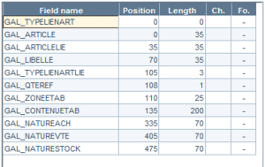

#### Management Rules for Mandatory Linked Items

Management rules for mandatory linked items
- Manual generation of documents : When opening the document to be generated, the application verifies that all mandatory linked items are included. If not, the items are added automatically (checks are carried out based on the generated document type, based on whether or not the document type authorizes the management of linked items.)
- Automatic generation of document : The automatic generation of a document involves adding the missing mandatory linked items.
- Modification of document : When opening the document to be modified, the application verifies that all mandatory linked items are included. If not, they are added automatically.
- Duplication of documents : When opening the document to be copied, the application verifies that all mandatory linked items are included in the new document. If not, they are added automatically.
- Processing customer orders in Front Office : The verification process is the same as for document generation. After it has been processed, the customer order will trigger the generation of an available order and transfers. Missing mandatory linked items will be added automatically if the generated documents manage linked items.
- Entering purchase order proposals and pre-allotment : When generating the purchase order based on a pre-allotment defined for the purchase proposal order, mandatory linked items will be added automatically if the purchase order manages them.
- Processing replenishment orders : When generating the purchase order based on a replenishment order entered in Front Office, mandatory linked items will be added automatically if the purchase order manages them.
- Invoicing sales and transfers : When generating documents arising from invoicing sales and transfers, mandatory linked items will be added automatically if the documents manage them.

### 2D Barcodes

#### 2D Barcodes - Contents

=> See also procedure 301 (Configuring 2D Barcodes)

2D Barcodes - Contents

A 2D barcode (or 2-dimensional barcode) has a format with 2 dimensions. The pictograph is built from small squares. The Cegid Retail Y2 application reads, generates and identifies 2D barcodes based on the QR code standard. Reading barcodes is made possible with authorized hardware.

Note: 2D barcodes are not saved in item records as it is the case with other barcodes (1D).
- Required settings prior to using 2D barcodes
- Configuring and test ing 2D barcodes
- Label formats for 2D barcodes
- Item search with 2D barcodes
- Configuring Honeywell MS7580 scanners

#### Required Settings Prior to Using 2D Barcodes

Required Settings Prior to Usind 2D Barcodes

Company settings

From Webapp > Company settings

Open Commercial management > Items and specify the Character set for 2D barcodes setting according to the elements defined here .

elements defined here

The standard selected must work with the 2D barcode readers used. See the Labels section described below for information on these standards.

Store record

Back Office > Basic data > Stores > Stores

In the Additions tab of the store record, the 2D barcodes for labels field allows you to print barcode pictographs using the selected setup. If this field is not specified, the pictograph is not printed on the label.

Access rights

Back Office > Administration > Users and access > Access right management

You must authorize access to the 2D barcode settings option using menu Settings (105) > Items > Barcodes > 2D Barcodes

#### Configuring and Testing 2D Barcodes

Configuring and Testing 2D Barcodes

Back Office > Settings > Items > Barcodes > 2D Barcodes

The 2D barcode is composed of information characterizing the item. Your selection can concern information related to dimensions (color, size, etc.), linked to values in the user-defined tables or item categories.

Click the [New] button and populate the fields as described:
- A code and label
- A prefix
- A maximum length of 255 characters
- A usage priority

Barcodes are built from fields transferred to the grid on the right. The first barcode field is the prefix defined in the header. The order of fields in the grid determines the order in barcodes. Settings must include at least one search field.

Please Note! Any modification to 2D barcode settings must be realized with care, because the labels issuing from them will no longer function, i.e. Identify the associated item.

Available fields

All data in item records will be available, except the notepad. The following variables are available:
- $$_IDSERIE : Allows you to determine the location of serial numbers in barcodes.
- $$_CONSTANTE : Allows you to insert a fixed character string into barcodes (e.g. separation character). They can be included several times. In this case, the [Constant] button enables access to the desired value.

Enter the length of each field to be printed. You need to take care that the field length does not exceed the barcode length.

The [Field format] button enables you to determine :
- For numerical fields: separators and decimal places
- For date fields: date format (DDMMYYYY, DDMMYY, etc.)

Search criteria

2D barcodes may be selected from item search criteria.

Use the [Search criterion] button to designate a field as a search criterion. When you designate fields as search criteria, they will be used to search items. In other words, when scanning items via 2D barcodes, the fields checked as search criteria enable the item to be found. A field designated as search criterion must keep its original length to properly identify separate items.

Please note!

2D barcodes missing item identifiers or barcodes cannot be used in standalone mode. When these elements are missing, a message stating that the barcode cannot be used in standalone mode will be displayed.

Information to resume

The Recov. and Recovered field options may be accessed through the [Information to resume] button. They are to be used if you wish to recover (and save) 2D barcode information from document lines. You can populate the following fields on document lines:

- Item catalog reference: GL_REFCATALOGUE field (35 characters)
- Line barcodes: GL_REFARTBARRE (18 characters)
- External line reference: GL_REFEXTERNE (40 characters)

Document line fields may be used only once, and the number of fields populated may not exceed 3.

The number of characters copied to document line fields is limited to the length of these fields.

If 2D barcodes are generated via an application other than Cegid Retail Y2 and you wish to recover barcode information from a document (e.g. serial numbers), you can associate the barcode to one of the document fields via the $$_constante variable.

2D barcode test

The [2D barcode test] button enables you to verify barcode structure elements.

When the Barcode test window opens, select the item to be tested in the Item field.

Next, click the [2D barcode calculation] button to display in the 2D barcode field the data making up the item 2D barcode.

A button is also available to copy the barcode data to the clipboard.

2D barcode decoding

The [2D barcode decoding] button decodes a 2D barcode from the multi-criteria list. This option breaks down barcodes as follows:
- corresponding settings used
- list of fields and values in the information field

#### Label Formats for 2D Barcodes

Label Formats for 2D Barcodes

A label template compatible with 2D barcodes is supplied and is called: Standard label w/ 2D barcode When printing labels, the 2D barcodes are generated from the settings for 2D barcodes linked to the store.

Pictograph format

Access > Report generator

You need to select a compatible format in the report generator, according to the number of encoded characters in the barcode. All formats starting with QRCode, concern 2D barcodes in this format -- QRCode-XXY-ZZZ with:
- XX represents the QRCode version: 03, 06, 11, 18 and 25
- Y represents the level of error correction, including: M (Medium) and H (High)
- ZZZ represents the module size, including: 050 (~0,5mm) and 100 (~1mm)

If the number of barcode characters in the printout is not compatible with the number of characters to encode, a message will be generated containing a CBP 00667 exception.

Format chart

The number of characters contained in the pictograph depends on the 2D barcode character set for the size’s level of quality.

Examples:
- For a UTF - 8 - BOM character set, version 11, high-quality (67 characters).
- For an ISO-8859-1 character set, version 11, medium-quality (248 characters).

| Character set for 2D barcodes |
| --- |
|  | UTF - 8 - BOM | ISO-8859-1 |
| Max bytes/number of characters at worst | ECC M | ECC H | ECC M | ECC H |
| Version 03 | 39 B / 19 char | 21 B / 10 char | 39 B / 39 char | 21 B / 21 char |
| Version 06 | 103 B / 51 char | 55 B / 27 char | 103 B / 103 char | 55 B / 55 char |
| Version 11 | 248 B / 124 char | 134 B / 67 char | 248 B / 248 char | 134 B / 134 char |
| Version 18 | 557 B / 278 char | 307 B / 153 char | 557 B / 557 char | 307 B / 307 char |
| Version 25 | 1270 / 635 char | 712 B / 356 char | 1270 / 1270 char | 712 B / 712 c |

Note that 2D barcodes may be used provided that three squares have been printed on the label:

Item search with 2D barcodes

Back Office > Settings > Items > Search priorities.

When a search priority has been set with 2D barcode, the barcode content search will be done as follows:
- Step 1: Evaluate each barcode content structure according to priorities.
- Step 2: Use the first structure with a barcode length the same as the size of the search value. The prefix must match the initial characters in the value.
- Step 3: When the barcode structure has been found, extract the various item or serial number fields from the contents.
- Step 4: Search the items with the field values which were selected as search criteria when determining barcode contents.

Item searches are done according to the user’s store search priorities (see Search Priorities .)

Search Priorities

Configuring Honeywell MS7580 scanners

Please see the Metrologic manufacturer’s documentation: "MetroSelect Configuration Guide".

| Configuration procedure for use with Cegid Retail Y2 |
| --- |
| Enter configuration mode - page E1 | Activate the “carriage return” suffix (CR) - page E15 | Disable the “Insert new line” suffix (LF)- page E15 | Quit configuration mode - page E1 |
|  |  |  |  |

#### Item Search with 2D Barcodes

Item Search with 2D Barcodes

Back Office > Settings > Items > Search priorities.

When a search priority has been set with 2D barcode, the barcode content search will be done as follows:
- Step 1 : Evaluate each barcode content structure according to priorities.
- Step 2 : Use the first structure with a barcode length the same as the size of the search value. The prefix must match the initial characters in the value.
- S tep 3 : When the barcode structure has been found, extract the various item or serial number fields from the contents.
- Step 4 : Search the items with the field values which were selected as search criteria when determining barcode contents.

Item searches are done according to the user’s store search priorities (see Search Priorities .)

Search Priorities

Configuring Honeywell MS7580 scanners

Please see the Metrologic manufacturer’s documentation: "MetroSelect Configuration Guide".

| Configuration procedure for use with Cegid Retail Y2 |
| --- |
| Enter configuration mode - page E1 | Activate the “carriage return” suffix (CR) - page E15 | Disable the “Insert new line” suffix (LF)- page E15 | Quit configuration mode - page E1 |
|  |  |  |  |

#### Configuring Honeywell MS7580 Scanners

Configuring Honeywell MS7580 scanners

Please see the Metrologic manufacturer’s documentation: "MetroSelect Configuration Guide".

| Configuration procedure for use with Cegid Retail Y2 |
| --- |
| Enter configuration mode - page E1 | Activate the “carriage return” suffix (CR) - page E15 | Disable the “Insert new line” suffix (LF)- page E15 | Quit configuration mode - page E1 |
|  |  |  |  |

### Item Labels

#### IContents

Item Labels

Since items for sale have to be ticketed, Cegid Retail offers several item label editing methods
- When a document has been validated, for example, during supplier receipt: the quantity edited will be the one in the document.
- On request: Re-editing lost or damaged labels. The quantity edited is the one pulled from stock.
- On stock, in order to re-label a set of items, because of prices changes for example: The quantity edited is based on the quantity still in stock,
- On catalog, making up a "book". The quantity edited corresponds to the number of copies of the labels that have been requested for each item.
- ….

Item label editing is available in Back Office with the following commands:
- Purchase, Sales and Inventory modules > Reports > Item labels
- Basic data module > Items > Labels

And in Front Office with the following commands:
- Management > Inventory > Item Labels
- Sales Receipts > Pricing > Labels on new price list

Contents
- Editing labels from dedicated menus
- Operating options
- Label access rights

#### Editing Labels from Dedicated Menus

Editing Labels from Dedicated Menus

Labels on catalog

The Labels on catalog command allows you to specify the required number of labels and template to be used to edit the labels for all selected items, regardless of whether or not these items are currently in stock. The multi-criteria selection screen allows you to select the items to be ticketed. The Page layout tab allows you to select the label template to be used, as well as the number of copies to be printed. You can also display a print preview if needed.

Labels on request

The multi-criteria selection screen proposes several options:

| Fields | Description |
| --- | --- |
| Price list date | Is used to print labels for a specific price list date. By default, this value is set to the current date. |
| Inventory query | This information is checked by default and displays the item inventory in column Quantity in stock . If you uncheck this option, you are not going to search for the quantity in stock or display it, which saves time, especially when importing a large list of scans. Please note! If the option was unchecked when the lines were integrated, checking it again will not recalculate the stocks. |
| 1st printed label | This option allows you to start the printing from the n-th label, in order to recycle partially used label sheets. |

In the selection screen, you can indicate the publishing store, the items to be labeled (reference), as well as the number of labels to be printed.

The dimension mask opens automatically for dimensioned items. The quantities entered for the dimensions may also be viewed.

The Quantity in stock column is displayed for information purposes, and behaves differently depending on whether the item is a single or a dimensioned one:
- If the label request is for a single item, the information on the quantity in stock is relevant.
- If the label request is for a dimensioned item, with only one dimension requested , the information on the quantity in stock is relevant.
- If the label request concerns a dimensioned item, with several dimensions requested , the information on the quantity in stock is no longer relevant. Indeed, the quantity in stock displayed is that of the last dimension requested. To avoid this situation, you have to make several request lines, one for each dimension concerned.

To start printing, click the [Print] button. After editing, you can save your selection by clicking Yes in response to the following prompt: "Do you want to restart this process later?”

Download from a portable inventory terminal

You may also add data to the item list via portable inventory terminal downloading. Therefore, click the [Terminal downloading] button.

The terminal enabled by the user allows items to be inserted in the window listing the references to print. Note that you may select items by scanning their serial numbers.

Import a scan list

This button allows you to import a list of scans to generate the lists of labels to be printed (see Inventory Tracking V3).

Optimizations have been made to reduce the number of queries performed when importing a scan list.

Please note! Serial numbers are not supported when editing labels on request.

Labels on serial numbers

This process, which is only available if serial number management has been serialized, is very similar to the process used for editing labels on request. You must select the warehouse where the serialized items are stored, as well as the serial numbers to be printed.

Labels on sale return

The screen used for sales return labels allows you to print the exact number of labels corresponding to the items returned. This command is particularly useful for items returned without sales receipts.

Labels on document

This command concerning labels for orders, delivery notices, receipts and transfers, allows you to print the exact number of labels for the items contained in a document of the type in question. The multi-criteria selection screen allows you to select the store, date range, and numbers corresponding to the documents.

The Page layout tab allows you to select the label template to be used. You can also display a print preview if needed.

The number of copies is determined automatically by the quantity displayed in the selected documents.

When editing labels for documents, you may print a header label in the Page layout tab, in order to separate the documents

Labels on inventory

This command allows you to print the exact number of labels corresponding to the number of copies in stock of the selected items. The multi-criteria selection window allows you to select the store corresponding to the inventory and the items to be labeled.

The Addition tab enables you to print items managed with serial numbers for customer reservations or preparation.

The Page layout tab allows you to select the label template to be used and display a print preview if needed.

The Price list date field allows you to print labels for a specific price list date. By default, this value is set to the current date.

The number of copies printed is determined automatically by the quantity in stock in the warehouse in question.

The Use of scheduled price lists option ( Criteria tab) enables you to edit labels for items in stock which have scheduled price lists, regardless of print date. Items in stock which do not have scheduled price lists will not be taken into account. By default, the standard template Label w/ scheduled price lists includes this function.

Note that this option is not compatible with the following options: Item lists and Use item template .

Labels for replenishment

Back Office > Inventory> Store replenishment > Replenishment and distribution

You may create labels when validating replenishment proposals.

The print label on proposal engine operates the same way as the other label modules (templates for stores, items, shortage management, etc.)

The [Print] button enables you to re-print labels for replenishment at any time after validating the proposal.

Note that this function is subject to the following access right: Menu Follow up actions (113) > Inventory > Replenishment> Labels on proposal and documents.

Labels for price lists

Back Office > Sales > Pricing > Item price list

Front Office > Sales receipts > Pricing > Labels on new price list

This command is used to edit labels for items for which the price list has changed, based on 3 criteria available in the Standards tab:
- The Frozen price lists checkbox allows you to display price lists that have been frozen in the module used for automatically generating price lists.
- The Modified prices checkbox allows you to display only the price lists for which the previous price is different from the current price.
- The Changed since field allows you to retrieve price lists that have been modified after the specified date.

After selecting items with the space bar, use the [Edit Labels] button to display the Edit labels window where you can manage the following options:

| Fields | Description |
| --- | --- |
| Label template | This option allows you to change the default template or use the template by item defined in the item record. |
| Inventory labels | Sets the number of labels to be edited according to the inventory of the selected store. |
| Closed items/Labels on catalog | These two options allow you to include these types of items in the label reprint. |
| Partial print | This option allows you to edit labels based on a percentage of stock, while defining a minimum and maximum number of labels per item. This percentage is set to 100% by default. The quantity to be printed is calculated based on this percentage and is rounded to the nearest value. You can enter a minimum quantity so that a least one label can be printed for items with low levels of inventory. You can set a maximum quantity in order to limit the number of labels for items with high levels of inventory. A quantity of 0 allows you to ignore these two settings. |

#### Operating Options

Operating Options

Using templates by item

Back Office > Basic data > Items > Items

The item record allows you to specify the label template to be used for certain items. To do this, select the desired label template in the field of the same name in the General tab.

There may be different templates according to items. In this case, if the corresponding option is checked at the time of printing, each item will be printed according to its own template.

You can also avoid selecting a template for certain items. In this case, the template used for printing will be the one used for this printout. To use this function, you only need to disable the Use template by item option in the Page layout tab in the multi-criteria screen for labels. The edition will then be sorted by label template: a window will enable you to insert the corresponding medium between each template ( Medium to insert field).

Notes:
- The label template can be changed in this window.
- You can start printing from the nth label, in order to recycle partially used label sheets.
- Item labels that have not been allocated a specific printing template will be printed based on the template indicated on the multi-criteria selection screen on the Page Layout tab.

Options for editing during document validation

Back Office > Settings > Documents > Documents > Types > Document types > Layout tab

You can define in the Edit labels section, the default options used when validating documents, depending on the document type.

In the Printing options section, the Template choice at end of document option enables you to make this window appear with the default values at document validation, to make quick changes.

When validating a document, Cegid Retail Y2 automatically triggers label printing for items entered in the document, according to the specified settings.

Label templates by store

Back Office > Basic data > Stores > Stores

You may configure item label templates to be used for each store.

The setup rules are created by clicking the [Additions/Exception on label template management] button in the store record. These exceptions are based on item groupings such as collection, user-defined tables, or supplier. You can create as many exceptions as needed. A priority order (modifiable) will allow you to define the rule that is to apply in cases where several rules apply to the same item.

Please note!

This search process is only performed if the use of templates by item is activated for editing.

This setting has priority over item labels template defined in the item record for the store in question.

Label printer margins

Back Office > Inventory > Administration > Users and access> List of printers

This command enables you to reset different print margins for certain labels.

Click the [New] button to create a new record. Once the settings have been defined, they must then be assigned to the relevant users in their user records, (select in the Characteristics tab, the desired print margin in the Print margins field.

Reprinting labels

Step 1: Enable the tracking of reprints

Back Office > Administration > Users and access > Access right management

You can track label reprints and enter the corresponding reason for reprinting. This function requires the assignment of access rights for label reprinting via menu Follow up actions (113). You can therefore specify that entry and follow-up should be activated for catalog printouts, on-demand printouts, and inventory printouts, not for the other printing modules.

If follow-up is activated, you need to enter a reason when reprinting labels, and a record will be entered in the event log.

Step 2: Create reasons for printing

Back Office > Settings > Management > Reasons for printing labels

This option enables you to create various reasons why labels need to be printed, (e.g. Damage, Theft, Other, etc.) The re-print reason will be requested in the label printing modules that follow-up has been activated for. This function can be used for all on-demand re-print requests. The actions will be followed up and the entry of a reason will be necessary in the label printing modules see above.

Note that an alert will be displayed, with a list all of label reprinting processes (see. CEG-REIMPRETIQ ) :

CEG-REIMPRETIQ

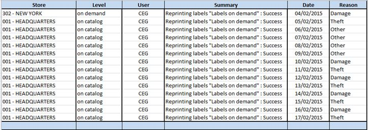

#### Label Access Rights

Label Access Rights

Back Office > Administration > Users and access > Access right management

Enable access rights for the user groups of your choice.
- Menus Purchases (101), Sales (102), Inventory (103 ): The Reports/Item labels section allows you to manage access to label editing methods related to purchases, sales and inventory in Back Office.
- Menu Administration (106) : The User and access/List of printers section allows you to manage user-specific access to label printer settings.
- Menu Management (108) : Several menus enable you to manage access rights concerning label editing in Front Office.
- Menu Basic data (110) : The Items/Item labels section allows you to manage access to label editing methods related to items.
- Menu Follow up actions (113) : Various actions related to labels can be logged to the event log with this menu. These actions also allow you to activate the management of reprint reasons.

### Measurement Units and Multi-Packaging

#### Contents

=> See also procedure 287 (Implementation of Quotities)

=> See also procedure 337 (Changing the Item Packaging)

Measurement Units and Multi-Packaging

The objective of this section is to explain the various settings necessary to create and sell items with different packaging. Accordingly, it is possible to sell salad cups by unit, a tray of 10 or a tray of 50. The same goes for wire fencing. You may sell roll by unit (50-meter roll) or by the meter.
- Required settings
- Sales process
- Examples of configurations for items sold with different packaging

#### Multi-Packaging ‒ Required Settings

Multi-Packaging ‒ Required Settings

Managing measurement units

Back Office > Settings > Management > Measurement units

This command enables you to create different types of measurement units: weight, area, volume, time, etc. It is then possible to sell the same item (even barcodes) with several types of packaging, with the corresponding price change according to packaging.

Click the [New] button, then populate following fields after setting a code and description:

| Fields | Description |
| --- | --- |
| Correspondence | Measurement type: Non-modifiable list of measurement types The objective of this concept is effect packaging between comparable units: weight, volume, area, unit/item, etc. You can associate only the measurement units with the same type of measurement in the item record. You will need to create a series with the same measurement type. Measurement quotity: Here you determine how the item is to be sold. (Example: If the measurement type is “linear”, the item may be sold by 1, 0.2, 0.02 or 0.0002). Quantity rounding: optional information |
| Impact on prices | Attention! In the case where the quotity is 1, the following fields may not be modified. Price coefficient: the price coefficient enables you to increase or decrease prices according to the quota. This information is recovered from the quota, and cannot be null. The coefficient has at least 4 decimal places. Price rounding: optional information. In the case where it is entered, it must be consistent with the unit and quotity. |

Configuring packaging in item records

Back Office > Basic data > Items > Items

To limit the packaging selection for each item, the record enables you to identify the packaging suitable for the item with the help of the following fields, available in the Pricing tab:

| Fields | Description |
| --- | --- |
| Billing unit | Here you will find the data configured in measurement units. |
| Available billing units | When the previous field has been populated, only the billing units with the same measurement type may be associated (e.g., if the billing unit is “Linear”, only “Linear” type units will be available). Note that this field may be populated only if a stock unit exists for the item. |

Sales process

Front Office > Sales receipts > Sales > Enter transaction

When an item has been entered by its code, or its barcode scanned, a screen will display the various packaging present in the item record and those available (e.g. Tray of 1 and tray of 10). The billing unit selection screen enables you to enter the quantity sold using a keyboard or mouse. A period is available to enter any decimals.

Please note!

Searching is done according to what the sales unit proposes. No stock searches are done to verify package availability.

The cashier selects a tray of 10, corresponding to a quotity of 1. The item is therefore sold with a quantity of 1, at the price corresponding to the packaging (e.g. €10). A quantity of 1 is pulled from stock.

The item is scanned again and sold with the tray of 1 packaging. The item is therefore sold with a quantity of 0.1, at the price €1.20. A quantity of 0.1 is pulled from stock.

In the case where the tray of 1 packaging corresponds to the quotity of 1, the quantity adapts:
- Sale of a tray of 10 (quotity of 10): quantity of 10
- Sale of 4 trays of 1 (quotity of 1): quantity of 4

Note that when the line is validated, you cannot return to the quantity. On the other hand, the prices may be changed.

Please note!

If the billing unit is used with a quota of less than 1, update receipt templates, as well as the various criteria that display quantity because decimals are not displayed by default.

Standalone mode

The various item packaging are available during sales in standalone mode.

Examples of configurations for items sold with different packaging

Salad cups

They may be sold by unit (€1.20) or by trays of 10 cups (€10). A normal sale is considered to be by trays of 10:

| Tray type | Quotity | Price coefficient | Rounding |
| --- | --- | --- | --- |
| Tray of 10 | 1 | 1 (non-modifiable) | None |
| Cup | 0.1 | 1.2 | None |

A selection of packaging is proposed during the sale: by tray of 10 or by cup. The salesperson can vary the price according to the selection made.

If the customer purchases 13 cups, there will be 2 lines on the receipt, detailing the prices applied:

| Item | Description | Quantity | Unit price | Line total |
| --- | --- | --- | --- | --- |
| Salad | Tray of 10 salad cups | 1 | 10 | 10 |
| Salad | Tray of 10 salad cups | 0.3 | 12 | 3.60 |

Wire fencing by the meter

The fencing may be sold by the meter (€1.30) or by rolls of 10 meters (€10).

Case 1: A normal sale is considered to be by rolls of 10 meters.

| Wire fencing type | Quotity | Price coefficient | Rounding |
| --- | --- | --- | --- |
| Roll of 10 m | 1 | 1 (non-modifiable) | None |
| By meter | 0.1 | 1.3 | None |

A selection of packaging is proposed during the sale: 1 meter, 5 meters (roll of 5 m), 10 meters (roll of 10 m), 0.1 meter. The salesperson can vary the price according to the selection made.

If the customer purchases 12.8 meters, i.e. 10 meters, plus 2.8X1 meter, there will be 2 lines on the receipt, detailing the prices applied:

| Item | Description | Quantity | Unit price | Line total |
| --- | --- | --- | --- | --- |
| Wire fencing | 10-meter roll of wire fencing | 1 | 10 | 10 |
| Wire fencing | 10-meter roll of wire fencing | 0.28 | 13 (10*1.3) | 3.64 |

Case 2: A normal sale is by the meter.

| Wire fencing type | Quotity | Price coefficient | Rounding |
| --- | --- | --- | --- |
| By meter | 1 | 1 (non-modifiable) | None |
| Roll of 10 m. | 10 | 0.7692 | None |

A selection of packaging is proposed during the sale: 1 meter, 5 meters (roll of 5 m), 10 meters (roll of 10 m), 0.1 meter. The salesperson can vary the price according to the selection made.

If the customer purchases 12.8 meters, i.e. 10 meters, plus 2.8X1 meter, there will be 2 lines on the receipt, detailing the prices applied:

| Item | Description | Quantity | Unit price | Line total |
| --- | --- | --- | --- | --- |
| Wire fencing | Wire fencing by 1 m | 10 | 1 (1.3*0.7692) | 10 |
| Wire fencing | Wire fencing by 1 m | 2.8 | 1.3 | 3.64 |

#### Sales Process

Sales process

Front Office > Sales receipts > Sales > Enter transaction

When an item has been entered by its code, or its barcode scanned, a screen will display the various packaging present in the item record and those available (e.g. Tray of 1 and tray of 10). The billing unit selection screen enables you to enter the quantity sold using a keyboard or mouse. A period is available to enter any decimals.

Please note!

Searching is done according to what the sales unit proposes. No stock searches are done to verify package availability.

The cashier selects a tray of 10, corresponding to a quotity of 1. The item is therefore sold with a quantity of 1, at the price corresponding to the packaging (e.g. €10). A quantity of 1 is pulled from stock.

The item is scanned again and sold with the tray of 1 packaging. The item is therefore sold with a quantity of 0.1, at the price €1.20. A quantity of 0.1 is pulled from stock.

In the case where the tray of 1 packaging corresponds to the quotity of 1, the quantity adapts:
- Sale of a tray of 10 (quotity of 10): quantity of 10
- Sale of 4 trays of 1 (quotity of 1): quantity of 4

Note that when the line is validated, you cannot return to the quantity. On the other hand, the prices may be changed.

Please note!

If the billing unit is used with a quota of less than 1, update receipt templates, as well as the various criteria that display quantity because decimals are not displayed by default.

Standalone mode

The various item packaging are available during sales in standalone mode.

### Merchandise Transformation

#### Contents

=> See also procedure 337 (Changing the Item Packaging)

Merchandise Transformation (or Item Conversion)

This topic deals with the case of brands that have to transform some of their references into one or more sales references.

Let us take the example of chocolate which arrives in the shop in boxes of X kilos and which must be transformed into one or more sales references (bulk sold by weight or in boxes).

Cegid Retail Y2 proposes a Merchandise Transformation module, thus allowing the user to withdraw a reference from stock, and then to enter one or more references automatically.

Please note! To avoid complicating data entry, only single items are supported.
- Required settings
- Entering correspondences
- Entering transformation

#### Merchandise Transformation ‒ Required settings

Merchandise Transformation ‒ Required settings

Company settings

Back Office > Administration > Company > Company settings > Commercial management

Go to the Documents - entry section in Company Settings and define the following settings:
- Enable the Merchandise transformation module
- Define a reason for special inputs/outputs
- Decide how inventory entry is to be valued

The configuration of these options is detailed here: Merchandise Transformation

Merchandise Transformation

Access rights

The following access rights must be enabled to grant access to the appropriate commands in Back Office and/or Front Office:
- Back Office: Menu Inventory (103) > Enter > Special movements > Transformation.
- Front Office: Menu Management (108) > Special movements > Transformation.

#### Entering Correspondences

Entering Correspondences

In the Item record

Back Office > Basic data > Items > Items

Just remind: To avoid complicating data entry, only single items are supported.

Let us start with the following example:

Item BO1 (Chocolate box of 2kg) to be transformed into: Box of 200g, Box of 500g and Bulk chocolates.

In the item record, click the [Complementary data] button and select the List of transformed items.

In our example again, from the BO1 record (box of 2kg), three related references are possible:
- 1 (item BO1 - Box of 2kg) corresponds to 10 (items BAL200 - Chocolate box of 200g)
- 1 (item BO1 - Box of 2kg) corresponds to 4 (items BAL500 - Chocolate box of 500g)
- 1 (item BO1 - Box of 2kg) corresponds to 2000 (items BVRAC - Bulk chocolate)

Note that if the gross weight and the weight units are filled in for the items, the Quantity field is populated automatically, including for the initial item (in our example, Item BO1.)

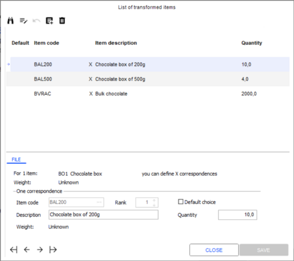

#### Entering Transformation

Entering Transformation

Back Office > Inventory > Enter > Special movements > Transformation

Front Office > Management > Special movements > Transformation

Transformation is carried out through inventory withdrawal (document of type (SEX)), and automatically generated at validation an inventory entry (document of type (EEX)).

A control is carried out at data entry. Indeed, only single items with corresponding references can be entered. If the user searches for an item through the multiple criteria, only items matching these criteria will be displayed.

Items to enter stock are also selected. If the withdrawn item has:
- only one match, the assignment will be made automatically.
- several matches, the window below is displayed and allows the user to select the item(s) to be put into stock, as well as their quantity.

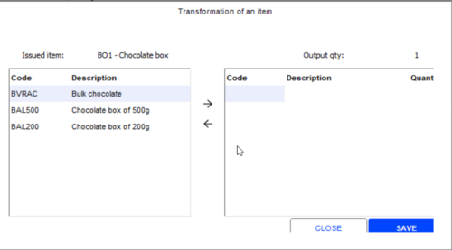

### Configuring and Using Mask-Types

Configuring and Using Mask-Types

The objective of mask-types is to facilitate the entry of quantities in dimension grids by using pre-referenced allocation profiles.

Example:

| Size | 37 | 38 | 39 | 40 | 41 |
| --- | --- | --- | --- | --- | --- |
| Quantity | 1 | 2 | 3 | 2 | 1 |

Preliminary settings

Company settings

Back Office > Administration > Company > Company settings

To manage this feature, refer to the Company settings, topic Commercial management > Items > Management of mask-types .

Commercial management > Items > Management of mask-types

Types of documents

Back Office > Settings > Documents > Documents/Types

Management of mask-types should be activated for the document type selected. To do this, the Use of mask-types field must display the management type desired, found in the Item tab. You can then achieve the following:
- Specify that mask-types should not be activated
- Activate the optional management of mask-types for a document
- Activate the mandatory management of mask-types for a document

Access rights

Back Office > Administration > Users and access > Access right management

Front Office > Settings > Administration > Users and access > Access right management

The access rights concerned by this function are located in menu Concepts (26) > Commercial management > Mask-types. You can then authorize or refuse the following rights:
- Create mask-types
- Change/Delete mask-types
- Associate an item to a mask-type

Creating and associating mask-types

Creating mask-types

Back Office > Settings > Dimensions for items > Mask-types
1. Click the [New] button and specify a code and description of the mask-type.
2. In the Dimension selection section, select the dimensions desired, as well as the presentation.
3. The options proposed enable you to specify the type of mask-type.
- Standard: Enables you to specify a mask-type (default) Packaging: Indicates that the mask-type will be used as a package. If this box is not checked, the mask-type will only be used as an order entry profile. Closed: To forbid any future use of the mask-type.
1. When the mask-type has been validated, the Detail option will show all dimensions.

Associating mask-types to items

Back Office: Basic data > Items > Items

For dimensioned items only, the Characteristics tab of the item record allows you to define whether mask-types are managed, and if they are, to associate them to these items, if necessary. If the management of mask-types is activated in the item record, it is possible to define how the feature works by selecting the appropriate option:
- Mandatory: In this case, use of the mask-type will be mandatory when entering a document for this item.
- By default: useful if several mask-types are associated to one item.
- Standard: The item can only use the "standard" mask-types and all of them will be implicitly associated to it, without having to do it manually via the [Mask-type association] button at the right of the field. The button will only be accessible in read-only mode.

You can use the [Mask-type association] button to associate a mask-type with an item, except when Standard is checked. In this window that displays, the Usable mask-types section enabled you to shift a selected mask-type to the Item mask - types section, using the [Move to right] button.

Using mask-types when entering a document

When entering a document that supports mask-types, a window will be displayed for the items for which mask-types are managed in order to determine the quantities to be entered. If the Enter mask-types by quantity company setting is:
- Not ticked: You only need to enter the number of mask-types to be added to the document. This is to be done in the Number field.
- Ticked: You can also enter quantities for items to be inserted into the document. Converting the quantities to the number of mask-types is carried out automatically. This is to be done in the Total quantity field.

Note!

In this configuration, the quantity entered must obviously be a multiple of the total number of items for the mask-type. Otherwise, a message will be displayed indicating that the quantity does not match a multiple of the mask-type.

### Sales Based on Temporary Items

Sales Based on Temporary Items - Contents

Even if an item is not identified by the register, the sale must still be able to proceed. You can proceed with the sale by defining these items as temporary items during the sales transaction. A process allows you to correct the sale afterwards and replace this temporary reference with the actual reference of the item sold.

These temporary items can be called directly during the sale in cases where the item reference cannot be found.

Temporary items should be used on a temporary basis only. They should be replaced with the correct reference as soon as possible.

Please note! A temporary item has no dimensions.

Create and use a temporary item

Create a temporary item

Back Office > Basic data > Items > Items

You create temporary items in the same way as other items. The only difference is that certain options in the Characteristics tab must be enabled or disabled.

Therefore, to make an item temporary you must, from the Characteristics tab of the Item record, and according to the available options:
- Disable the following options: "In stock", "Consigned item", "Serial numbers", "Batch management"
- Enable the following options: "Replenishment excluded", "Discountable on line", "Temporary item"

Use in Front-Office

The sale is registered with the temporary item code, in the same way for a standard sale. This module also processes returns. The code and description of the temporary item are printed on the register receipt.

Additional information

The "CEG-ARTICLESTEMPO" alert enables you to list the receipt lines containing the temporary references to be updated.

Correct sales based on temporary items

Procedure

Back Office > Administration > Maintenance > Correct temporary items

This functionality is used to assign an actual item to a temporary one.

The correction process consists of replacing the item code and certain item data in the receipt line so that the maximum possible information is retained for receipt printing purposes.
1. Once all item lines are displayed on screen, select one or more lines to correct and click the [Open] button. The "Receipt lines on temporary item" screen displays the receipt number and the item line.
2. Specify the reference of the actual item in the Item field and validate. If supported by the application, you may be asked to enter the corresponding serial numbers.
3. Repeat the procedure for each temporary item selected.

Impact on accounting closure

Back Office > Administration > Company > Company settings > Commercial management > Front Office

An initial check determines, for each corrected line, whether the date of the receipt line is earlier than the accounting closure.

If you are required to perform the processing on accounting entries that have already been posted, you should select the Override considered receipts option in the Temporary item field.

Impact of the correction

Once validated, the correction process updates the following:
- The item inventory
- The inventory snapshots if the snapshot is dated after the sale
- The receipt line
- The item code: "GL_CODEARTICLE" and "GL_ARTICLE"
- Information on the new item (e.g. category, collection, user-defined tables)
- The PP and CP of the sales line
- The user who modified the line and the modification date
- The serial numbers
- The event log if the action is logged. If there are price discrepancies, an error is generated in the event log.

If a copy of the receipt is printed after correction, the temporary item code displayed on the original receipt will be replaced with the code of the actual item. However, the description of the temporary item will be kept.

### Packing

Packing

The purpose of this function is to manage packing for shipments. This packing will enable the following:
- Packaging and grouping of items for shipment,
- Smoother integration of items when the goods are received in the store.

Packing Settings

Company settings

Back Office > Administration > Company > Company settings > Commercial management > Logistics

Specify the information described in section Logistics , and validate.

Logistics

Document types

Back-Office > Settings > Documents > Documents > Types

You will be able to configure packing management by document type.
1. Select the type of document for which you want to manage packing.
2. Open the Packing tab.
3. Specify the information described here and validate.

Stores

Back Office > Basic data > Stores > Stores

You should specify at the store level whether packing is to be managed there or not.
1. Open the Store record for which you want to manage packing.
2. Select the Contact information tab.
3. Tick the Packing management checkbox option and validate.

Package barcodes

Back Office > Inventory > Logistics > Package barcodes

This command enables you to configure package barcode allocation by selecting the type of barcode desired.

Packing-type items

Back Office > Basic data > Items > Items

You have to create Packaging type items, which will enable you to pack the items specified in the documents. These are necessarily items that are not managed in stock.
1. To create a Packing-type item, click the [New] button.
2. Populate the record fields.
3. Tick the Packing item in the Characteristics tab, and validate.

Access rights

Back Office > Administration > Users and access > Access right management

This command enables you to define the user groups that will have access to packing functions.
- Menu Concepts (26) > Commercial management > Packing proposes two concepts to manage the access to the reference mode and the manual entry of the package number (see Access rights - Packing .)
- Menu Inventory (103) > Logistics grants access to various menus in the Inventory > Logistics module: Packing query, Packing printouts (Package labels, Packing slips, Packing lists,) Package barcodes.

Packing

Entering a document with packing

Note that for a given document, you cannot perform partial packing. All quantities listed on the document must either be packed or managed without packing.
1. Enter the document as usual by filling in the various required fields according to the document type: supplier, store, items, etc.
2. Click the [Packing] button to open the Packing list window. Note that if the packing was configured in document type as being required, the window will open automatically when validating the document, without having to use this button.
3. Select the Packing-type item that will be used to package the document items. This will be displayed in the window on the right-hand side.
4. Using this button, select the document items to be packed. If all the items are to be in the same package, you can use the [Include all] button. Otherwise, click the [Include] button as many times as there are items to be packed.
5. Search other items to be packed, if necessary via the [Search for an item] button. They will be automatically added to the body of the document.
6. Validate the document to launch printing. During each packing process, the user has the option of printing different documents: package label, packing slip, and packing list. This can be done automatically on closing the packing process, on validation of the document, or at a later stage from an existing document. In shipping, the packing phase can take place during the picking phase or directly on creation of the delivery slip, either from an existing document or from a newly generated one.

Adding packages during packing

This button enables you to search for a package already in the system, in order to include it in the document being entered.

Examples: Transferring a package from one store to another; returning a package to the main office that was sent and received in-store; transfer to store of a package put together in receiving at the main office.

Displaying package characteristics

This button displays additional information about packages (weight, number of packages, etc.)

Note that the Barcode area will be populated according to settings defined in Inventory > Logistics > Package barcodes.

Print

This function prints packing slips and package labels

Please note!

Print options will be active according to the configuration in Company Settings .

Query and printouts

Back Office> Inventory > Logistics Inventory
- Packing printouts: This command prints or re-prints the various documents relating to your package (Package labels, Packing slips and Packing lists.)
- Packing query: This command enables you to query a list of packages through multiple selection criteria.

## Inventory Management

### Inventory Count Management

#### Contents

Inventory Count Management - Contents

Back Office > Inventory > Conduct Inventory

Front Office > Management > Conduct Inventory

The process of conducting an inventory count can be broken down into several stages:
- A preparatory phase (beginning of the inventory count)
- A download from a portable inventory terminal
- A physical inventory count
- A report on the discrepancies between the physical inventory and the computerized inventory
- An update of the computerized inventory
- An inventory count completion phase (deletion of the physical inventory count)

The time it takes to complete a full inventory count cycle can vary considerably depending on how the company is organized. In addition, none of the stages in the inventory count cycle should prevent the IT system from carrying out day-to-day management tasks. An inventory count can be conducted for all or just some of a store’s inventory, and it must be possible to select the items to be inventoried. Moreover, it must be possible to conduct several inventory counts at the same time, for the same store, but different items. All the inventory updates resulting from an inventory count must be clearly identified to ensure maximum traceability.

A special type of document called “Inventory discrepancies” allows you to record inventory adjustments.

General settings
- Defining company settings
- Defining default values
- Dissociating documents of positive and negative inventory discrepancies
- Defining Portable Inventory Terminal (PIT) settings

Associated access rights
- Menu 26 – Concepts
- Menu 103 – Inventory
- Menu 108 – Management
- Menu 113 – Follow up actions

Requirements common to conducting inventories with or without a Portable Inventory Terminal
- Step 1: Check inventory counts awaiting validation
- Step 2: Delete old inventory count lists
- Step 3: Generate an inventory preparatory list
- Step 4: Edit a preparatory list

Manual inventory counts without a Portable Inventory Terminal
- Entering/Changing inventoried quantities
- Actions performable on the inventory count entry and change screen

Inventory counts with a Portable Inventory Terminal
- Downloading the result of an inventory count
- Various PIT types
- Characteristics of the Colombus Retail inventory terminal
- Modifying a transmission
- Viewing and correcting errors
- Integrating an inventory count file
- Entering/Changing inventoried quantities after integration

Inventory counts with an optical reader (hand-held scanner)
- Input procedure

Inventory counts by integrating an inventory counter file
- File format
- Defining data recovery settings
- Integrating an inventory counter file

Reverse inventory counts
- Generating an inventory preparatory list
- Validating an inventory count

Inventory results and validation
- Validating an inventory count
- Inventory reports and valuation
- Canceling an inventory count validation
- Deleting an inventory count list

Splitting an inventory count list
- Dividing an inventory list

Inventory counts by areas
- Defining areas for the inventory count list
- Conducting an inventory by area
- Inventory count entry excluding download
- Validation of the inventory

Pre-validation by store
- Pre-validation by store: Principle

Inventory counts for specific items
- Inventory counts for bills of materials
- Inventory counts for items with serial numbers
- Inventory count for items managed by batch

#### General Inventory Count Settings

General Settings for Inventory Count

Defining company settings

Back Office > Administration > Company > Company settings
- Commercial management > Inventory: Specify the settings described in the Conduct inventory section .
- Commercial management > Default settings: You have to specify here a third-party for inventory discrepancies. This setting is essential to validate inventories: it assigns inventory count discrepancies to a (fictitious) third-party. Open the Commercial management > Default settings branch and populate the Third party for inventory discrepancies field. Note that third party for inventory discrepancies may be created using the [New] button, or even in Basic data > Customers > Customers.

Defining default values

Back Office > Inventory > Conduct Inventory > Settings for inventories

You can set default values for some inventory count information, and you can also ensure that said information cannot be modified by certain user groups. These settings relating to inventory lists, manual transmissions, as well as to the inventory validation and the end of inventory, are organized by tabs.

This option is subject to access rights Settings for inventories (available in Menu Inventory (103).)

Settings for inventories

How it works

The columns mean the following:

| Fields | Description |
| --- | --- |
| Propose a value | Option not checked: the default value is used and the By default and Modifiable options are not accessible. Option checked: the value you enter in the next column, By default will be used and may be changed if you wish. |
| Modifiable | This field is grayed out for non-modifiable values. |

Search levels for the settings

| Search level | Description |
| --- | --- |
| Subsidiary | A search for the screen settings is carried out for the subsidiary of the inventoried store. If these settings exist, they are retrieved in full. This button, available in the subsidiary record, enables you to define the inventory settings. |
| Company | If no record exists for the subsidiary, the settings are searched for at company level. The Settings for inventories enables you to determine this company setting. It can also be accessed via the button on the screens used for generating and validating an inventory count list. |
| Program | If no record exists for the company, the default values are retrieved. |

Dissociating documents of positive and negative inventory discrepancies

Back Office > Administration > Users and access > Access right management

If discrepancies are detected when validating an inventory count, an inventory count discrepancy document grouping these discrepancies together is generated. It is then possible to split this document in order to dissociate positive and negative inventory discrepancies. This option may be enabled via access rights management (see Dissociating documents of positive and negative inventory discrepancies ).

Dissociating documents of positive and negative inventory discrepancies

Defining Portable Inventory Terminal (PIT) settings

Defining the terminal type

Back Office > Administration > Company > Company settings

To set the default PIT model, open Commercial management > External connections.
- If a specific model is used by a store, you can enter the settings for the terminal in the store’s record (refer to paragraph “Configuring the store’s terminal” hereafter.)
- If there are no settings defined for the store, the information used by default is the data defined in the company settings.

Configuring the store’s terminal

Back-Office > Basic data > Stores > Stores

There is an option in the store record that allows you to specify that the store in question uses a PIT different from the one indicated in the company settings.

This option can be accessed via the [Additional information/Settings for portable inventory input terminal] button. The Inventory setup by store will display, enabling you to set the options for that store.

Attention!

If the setup by store is not available, the information in the company settings will continue to be used by default.

Moreover, you can configure a terminal that is not supported by Cegid, either in the company settings or in the store record. Two items of information are requested:
- The command line to be executed in order to download the PIT file to the workstation.
- The name of the file generated, so that it can be integrated. Settings for the file contents may be adapted in Back Office > Inventory > Conduct inventory > Transmitted inventories > File format settings.

#### Access Rights for the Conduct Inventory Module

Access Rights for the Conduct Inventory Module

Back Office > Administration > Users and access > Access right management

Menu 26 – Concepts

Accounting - Closure
- Non-validated inventory prior to the closure date .

Management - Inventory

For more information on the following rights, see Access rights management .

Access rights management
- Modify transmissions
- Authorize negative quantities.
- Override the limitation for integrating inventories
- Cancel integrations
- Modify inventory settings
- Copy computerized inventory on inventoried stock
- Dissociate documents of positive and negative inventory discrepancies.
- Deleting transmissions
- Authorize inventory lists to be divided
- Change the status of the inventory list

Menu 103 – Inventory

Query/Discrepancies of inventories

This access right authorizes or not the user to view the list of the generated inventory discrepancy lines.

Conduct inventory

This access right authorizes or not the user to access the following features in the Back Office:
- Beginning of inventory
- Inventory counts by areas
- Transmitted inventories
- Enter/Change inventory
- Display valuations
- Reports
- Pre-validation by store
- Validation
- Cancel validation
- Generated inventory discrepancies
- End of inventory
- Settings for inventories

Menu 108 – Management

Conduct inventory

This access right authorizes or not the user to access the following features in the Front Office:
- Beginning of inventory
- Inventory counts by areas
- Transmitted inventories
- Enter/Change inventory
- Display valuations
- Inventory report
- Pre-validation by store
- Validation
- Generated inventory discrepancies
- End of inventory

Menu 113 – Follow up actions

Inventory/Physical inventory

The follow-up of actions is used to track the various operations and manipulations performed by employees, concerning features related to inventory counts. The following actions may be tracked:
- Transmitted inventory integration
- Inventory list validation
- Inventory abortion
- Cancel integrations
- Variance on serial number

Once the actions you want to follow up are defined, they may be viewed in the Event log (see Event Log ).

Event Log

#### Requirements Common to Conducting Inventories with or without a Portable Inventory

Requirements Common to Conducting Inventories with or without a Portable Inventory Terminal

Step 1: Check inventory counts awaiting validation

Back Office > Inventory > Conduct Inventory > Validation

Front Office > Management > Conduct Inventory > Validation

Before you conduct an inventory, you should ensure that there are no inventory count lists awaiting validation. The list of inventory counts awaiting validation must be empty. Indeed, an item cannot be included on 2 different lists. You must therefore ensure that none of the lists of items to be inventoried are awaiting validation.

Step 2: Delete old inventory count lists

Back Office > Inventory> Conduct Inventory> End of inventory

Front Office > Inventory> Conduct Inventory> End of inventory

When the Inventory closing wizard screen displays, select the stores concerned, then check the deletion options for lists and transmitted inventories. Click the [Run] button, and confirm the following message: “Transmitted lists and inventories will be deleted for all stores selected.” Once the process is complete, click on OK.

Step 3: Generate a preparatory list

Click here for this step .

Click here for this step

Step 4: Edit a preparatory list

The preparatory list can be printed on a desktop printer, or on a register printer in the stores.

On a desktop printer

Back Office > Inventory > Conduct inventory > Beginning of inventory > Edit a preparatory list

Front Office > Management > Conduct inventory > Beginning of inventory > Edit a preparatory list

Although this not mandatory, it is necessary for manual inventories to print a list of the items to be inventoried that will be provided to the operators conducting the inventory. This report indicates the item description (reference, description, dimensions, etc.) and the computerized inventory, and provides a blank space for the operator to indicate the quantity counted. Care should be taken with the sort criteria and page breaks in order to facilitate the work of the operators and to minimize the risk of errors. This report is only necessary for manual inventory counts. In the Edit a preparatory inventory list screen, perform the following operations:
- In the Criteria and Addition tabs, select the desired criteria.
- In the Groupings tab, specify the sorting order desired. For example, if you want to sort by supplier and then by category, select Supplier in grouping 1 and then Category in grouping 2.
- In the Page layout tab, enter the print criteria.

Once the criteria have been entered, click this button to start printing.

On a register printer

Front Office > Management > Conduct inventory > Inventory report > Inventory list in receipt format

The list can display the computerized inventory, the inventoried stock or the inventory discrepancies. If the user is authorized to view purchase prices, the valued inventory can also be shown. The receipt format template can be customized in the Page layout tab.

Use this button to start printing the inventory list on a register printer.

#### Generating an Inventory Preparatory List

Generating an Inventory Preparatory List

Back Office > Inventory > Conduct inventory > Beginning of inventory > Generate a list

Front Office > Management > Conduct inventory > Beginning of inventory > Generate a list

Generating a list

This step is mandatory to conduct an inventory. The following operations must be performed:

Specifying the list of items to be inventoried

An inventory count can be conducted on all or just some of a store’s inventory.

For a partial inventory count, the multi-criteria selection screen for items allows you to create the exact list of items to be inventoried.

If the first list is incomplete, you can generate other lists for the same store to include the missing items. However, an item that already belongs to a list for a given store and warehouse cannot be inserted into a second list. Only items that have not yet been selected can be used. The contents of these lists are very important, as they make up the database of items that will be processed when conducting the inventory count. The computerized inventory will be reset to zero for all items on these lists for which no units were inventoried.

Generating a snapshot of the computerized inventory

The IT system preserves a snapshot of the inventory for each of the items selected, so that other departments in the company can keep working while the inventory count is being conducted. This inventory snapshot corresponds to the reference inventory for the inventory count, and will serve as the basis for calculating the inventory count discrepancies.

The reference stock level, which is stored in an inventory count list, reflects the inventory situation at time T, except in the case of an inventory conducted on a different date, the stock level corresponds to the inventory of the inventory count date in the morning. Generating an inventory count list allows you to select the store and warehouse on which the inventory count is to be conducted, in addition to the items to be inventoried.

Close-up of the Inventory preparatory list screen

Settings

| Fields | Description |
| --- | --- |
| Title | Title describing the list, for example "Montaigne inventory count January 2018" |
| List code prefix | The list code prefix is inserted automatically. |
| Salesperson | Select the salesperson associated with the list. This field is optional. |
| Inventory date | The current date is suggested by default. The inventory taken into account reflects the inventory situation at a given moment. The list can be created at an earlier or later date. The inventory taken into account will always be the one from the morning. If the list is created on an earlier date, the inventory will be recalculated based on the list date. |

Selection criteria

Please note!

In the criteria below, if both the Total inventory and Distinct lists per supplier options are checked, then upon Inventory validation the request to generate then a snapshot or an inventory closure as part of a total inventory will not work because of the separate lists. Inventory snapshots or closures are only possible in total inventory WITHOUT distinct lists per supplier.

| Fields | Description |
| --- | --- |
| Subsidiary/Store/Warehouse | The list can be generated in the following ways: For a single store. If the multi-warehouse mode is in use, you can select one or more warehouses to inventory. For several stores at once. If the multi-warehouse mode is in use, all warehouses must be included in the inventory count. It is not possible to generate an inventory count list for stores that belong to different subsidiaries. |
| Total inventory | This option allows you to generate an inventory count list for all the items. If the option is not ticked, select the items to count in Item Selection . Total inventory: Is used if you need to create a single and unique list of all the items in the inventory on the day of the inventory count. In this case, inventoried items not included on the list are considered non-existent (inventory at zero). Partial inventory: is used if you need to inventory some of the items. You can create several lists. References not included on the list are rejected. |
| Load the price lists | This option retrieves the purchase price lists for the relevant items so that the inventory count can be valued using the price lists rather than the fixed prices of the items. |
| Distinct lists per supplier | This option allows you to generate an inventory count list for each supplier of the selected items. |

Item selection

| Fields | Description |
| --- | --- |
| Item selection | The Total inventory checkbox is selected by default. If you perform a partial inventory, uncheck this option and use the [Item selection] button to select the relevant items to count. |
| Selection of transmissions | This button allows you to select a transmitted inventory. This option is especially used for reversed inventories. |
| Deletion of the selection | This button allows the deletion of the selections made previously. |
| Use of an item list | You can carry out an inventory count on an item list. If you forget an item in the item list, you can add it afterwards (see Item Lists .) |
| Cycle counting | This option allows you to create an inventory count list based on the stock and select all the items for which the date of the last inventory count is before the cycle count date. Note that a cycle count can only ever be a partial inventory count. Therefore, the Total inventory option becomes unavailable if the Cycle counting option is checked. |

Your item selection criteria are not deleted after you create the inventory count list; this means that you can validate several inventory count lists using the same item selection.

Examples:
- Creation of an inventory count list with items from a supplier for store 101.
- The store is changed and the list is validated; the item selection criteria are retained.

Note that an item cannot be included in 2 different lists. You must therefore ensure that none of the lists of items to be inventoried are awaiting validation.

Accounting of inventory areas

This section is used to carry out inventory counts by area (see Inventory by Area .)

Inventory by Area

Optimization

It is recommended that you leave the two optimization checkboxes selected, so as not to slow down the inventory count processes:
- List with transferred items only: Option checked by default. It allows you to limit the items on the list, by ensuring that only items that have already been transferred to the relevant store are included. If you want to conduct an inventory of all the items in the database, you will need to uncheck this option.
- List limited to items with non void inventory: This option allows you to create a list containing only items with a positive or negative inventory. Any items with zero inventory will not be included in the list. It is recommended that you use this option when carrying out a total inventory count. Option not visible if the Management of consigned items is checked .

Once you have made your selection, click on the validate button. The following message displays: “Create the inventory list at a given time” Click Yes to start generating the list. Once the list has been generated, a message displays specifying the number of lists generated and the number of items inserted. Then click OK: A summary of the generated list displays in the Generation report pane of the screen.

Please note, when creating an inventory count list, a message will appear if there are any delivery or transfer notices that have not yet been validated.

Actions performable on the Inventory preparatory list screen

Scheduling an inventory list

This button allows you to define the settings of the inventory count list scheduling process.

Viewing the settings for inventory screens

This button gives access to the default settings used to create an inventory list. For further information about settings for inventory lists, please refer to Defining Default Values .

Defining Default Values

How to manage concurrent inventory lists

If two operators with the same login try to create inventory list for a selection of items, there will be a conflict. This conflict will be handled as follows:

A message will ask the user if he wants to proceed. If he answers:
- NO: The list will not be created
- YES: The list will be created and traced in the event log.

#### Manual Inventory Counts without a Portable Inventory Terminal

Manual Inventory Counts without a Portable Inventory Terminal

Back Office > Inventory > Conduct Inventory > Enter/Change inventory

Front Office > Inventory > Conduct Inventory > Enter/Change inventory

Before performing the following operations, please first follow the steps described in the Requirements Common to Conducting Inventories with or without a Portable Inventory Terminal chapter. Once these steps completed, the manual inventory count allows you to enter or modify the inventoried quantities before you validate the inventory count. You can enter the quantity inventoried and therefore calculate the inventory count discrepancies between this quantity and the theoretical inventory. Using the preparatory report which has been carefully filled in by the operators and the inventory count list which was generated at the beginning of the inventory count, the inventory manager enters the inventoried quantities for each single and dimensioned item.

Requirements Common to Conducting Inventories with or without a Portable Inventory Terminal

Entering/Changing inventoried quantities

Just remind: it possible to hide the notion of Physical inventory in the inventory list. To do this, check the Blind Entry in Inventory Counts (see Defining Company Settings .)

Defining Company Settings

In the Inventory result column, you must therefore enter the quantity actually counted during the inventory. A green checkmark will be displayed at the left of the line, at each entry. Changes will be saved when you validate, but it is possible to exit and return to this entry screen as many times as necessary.

Note that you must populate all the lines. Actually, as long as the lines do not show a green checkmark in the Entered column, the inventory will not be validated.

Please note!
- To begin with, all the inventoried quantities are set to zero.
- If the computerized inventory is negative, the inventory result will be forced to zero.
- You can validate the inventory if all lines are marked entered.

Input procedure
1. The multi-criteria selection screen displays all of the lists generated.
2. Double click the list of your choice to open the item list. The Enter inventory screen displays. Each single or dimensioned item is displayed on a line. The quantity in stock is shown in the Computer inventory column.
3. Complete each line by entering the quantity counted in the Inventory result column. If the access right Authorize negative quantities is attributed, you may enter negative quantities by using a minus sign (-) before the quantity.
4. After each entry is made, the discrepancy between the computerized inventory and the inventory result is updated. A green checkmark to the left of the line indicates that the inventoried quantity has been entered.

Actions performable on the inventory count entry and change screen

Double-click the item line of your choice to display the “Enter inventory” screen. The actions you may perform on this screen are listed hereafter.

Mark line as entered

In order to validate an inventoried quantity of zero for an item whose computerized quantity is not null, you must select this button, option [Mark line as entered].

Copy the data of a column

This button enables you to copy data from the Computer inventory column in the Inventory result column, for all the lines not yet entered. If you click this button again, it will reset the inventory result.

This function saves time for operators having to enter a quantity for each line. They only need to modify the lines for which the inventory count identified a discrepancy.

For inventory counts performed with a portable inventory terminal, this enables reintegrating a transmission without cumulating inventories quantities. (Example: An inventory counter file has been integrated, but this file has some errors. If you integrate another file to replace the first one, and if you do not reset the quantities before this second integration, the quantities in the second file will be added to those of the first).

Display the detail of prices for an item

The {Detail of prices] button allows you to display the detail of prices for the item.

Search in a list

This button allows you to search for an element in the list.

Add/Remove items

These buttons allow you to add or remove an item from the list.

Inventory flash query

This button displays the inventory flash of the SKU on which the cursor is positioned, in the store of the inventory count.

Perform additional actions

This button allows you to:

- View the detail of prices
- Update the prices linked to warehouses, items, and/or the price list field,
- Mark lines as entered or not entered
- Access the settings for inventory list
- Update the Computer inventory column
- Display the detail of serial numbers

This button allows you to:

- Show item
- View the item transmissions
- Go to the first blank line
- Go to the first negative listed line

#### Inventory Counts with a Portable Inventory Terminal

=> See also procedure 347 (Downloading Data from Columbus Retail Symbol Terminals )

=> See also procedure 224 (Specific Import Formats 01 and 02 and External Formats)

Inventory counts with a Portable Inventory Terminal

Before performing the following operations, please first follow the steps described in the Requirements Common to Conducting Inventories with or without a Portable Inventory Terminal chapter.

Requirements Common to Conducting Inventories with or without a Portable Inventory Terminal

Transmitting inventory results

Back Office > Inventory > Conduct Inventory > Transmitted inventories > PIT transmission

Front Office > Inventory > Conduct Inventory > Transmitted inventories > PIT transmission

Operators count quantities in inventory for each item using a PIT. When the memory limit of a PIT has been attained or when finished working, operators transmit the data saved on the PIT to the information system.

Several transmissions maybe done when conducting an inventory. Each transmission is done to the PC located in the store, with the aid of a cable connecting the PIT to one of the computer’s serial ports.

When item counting via the PIT has been done, open the “PIT transmission” command. The Transmission screen displays. Select the warehouse concerned, and enter the transmission title. Warehouse selection will be taken into account only if the warehouse has not been saved in the PIT.

Attention!

Warehouse selection does not serve as a filter. Accordingly, if you select Lyon, and the PIT contains the store code for Marseille, you will obtain a transmission for Marseille.

The title of this transmission will be carried back to the transmission if it has been entered. Otherwise, the field will be initialized as “RECUP”.

Click the [Display configuration] button, then verify the type of PIT used, and the serial port it is connected to. The configuration will be saved by store and may be modified directly in the store record.

Click this button to transmit to the PIT. The PC awaits the transmission. The transmission will then be started from the PIT. The list of barcodes will scroll to the End of communication message. Verify the message announces no errors on the barcode list (e.g. unknown barcodes), then click the [Close] button.

Note that generic items will be blocked in transmission to a PIT.

You may obtain a report when the PIT transmission has finished. By default, a Cegid report is furnished and configured. However, it is possible to print others via the [Display configuration] button in the Status field.

Different types of PIT

Back Office > Inventory > Conduct Inventory > Transmitted inventories > PIT transmission

Front Office > Management > Conduct Inventory > Transmitted inventories > PIT transmission

Click the [Display configuration] button and select the PIT type.

| PIT | Description |
| --- | --- |
| Symbol | Connects to MC1000 and MC3000. |
| Texlon and Telxon (old protocol) | Connects to a Texlon PIT (this PIT is not sold by Cegid). |
| Colombus Retail PIT | Configures the link with a Colombus PIT. The transmission principle is described in the following chapter (Features related to the Colombus Retail PIT). The file will take another fixed name and will be made available in a given directory in the expected format, and is described in the next chapter. |
| Colombus Retail PIT Symbol | It will automatically pre-populate the command line with the default values. The location of the PIT file created by the utility is: C:\ProgramData\CEGID\TPI\. Once the file has been integrated, it will be saved in a sub-directory called SAV. |
| External PIT | Uses the CAPM import with the INV import settings. |
| PIT Handy Terminal | Enables you to integrate a file issued from a PIT Handy Terminal. The line format (read from left to right with a comma as separator) of the expected file is as follows: 1st field: Different than 0, otherwise the record will be rejected. 4th field: Store code + warehouse code 6th field: Operator code 7th field: Location 8th field: Transfer number 9th field: Barcodes with 20 characters + serial number (without using Cegid serial number management) 10th field: Quantity |
| PIT Feature 01 | Enables you to integrate a file via an external tool. The line format (read from left to right) of the expected file is as follows: 3 characters: Warehouse code 15 characters: User code 15 characters: Location code 14 characters: Barcode 5 characters: Quantity |
| PIT Feature 02 | Enables you to integrate a file via an external tool. The line format (read from left to right) of the expected file is as follows: 3 characters: Warehouse code 15 characters: User code 15 characters: Location code 16 characters: Barcode 3 characters: Quantity |

Features related to the Colombus Retail PIT

Back Office > Inventory > Conduct Inventory > Transmitted inventories > PIT transmission

Front Office > Inventory > Conduct Inventory > Transmitted inventories > PIT transmission

Transmission principle

An executable will be automatically loaded on all store workstations. It is called “DechargementSymbol.exe”. Populate the command line in CEGID Retail Y2 (PIT settings):

DechargementSymbol.exe /OUT:FileName [/COM:COMPortNumber] [/BAUD:BaudRate] [/DATA:DataBits] [/STOP:StopBits] [/PARITY:Parity] [/TIMEOUT:TimeOut] [/LOG:LogFileName]

With the following parameters:
- COM Port Number: Numerical value from 1 to 99. DEFAULT = 1
- Baud Rate : 2400, 4800, 9600, 19200, 38400, 57600, 115200. DEFAULT = 38400
- Data bits : Numerical value from 5 to 8. DEFAULT = 8
- Stop bits: 1, 2. DEFAULT = 1
- Parity: NONE, EVEN, ODD. DEFAULT = NONE
- Time Out: Time out in seconds. From 0 to 100. 0 means waiting infinitely. DEFAULT = 10

Expected format for Colombus Retail PIT integration

Main header record

| Field | Start | Length | Type | Value/Format |
| --- | --- | --- | --- | --- |
| Record type | 1 | 1 | Alpha/Num | H |
| Number of fields | 19 | 4 | Num | 0000 |
| Number of barcode lines | 24 | 6 | Num | 000000 |
| Date of inventory | 31 | 6 | Num | 000000 |

Header field record

| Field | Start | Length | Type | Value/Format |
| --- | --- | --- | --- | --- |
| Record type | 1 | 1 | Alpha/Num | E |
| Portable current date | 13 | 10 | Date | dd/mm/yyyy |
| Portable time | 24 | 8 | Time | hh:mm:ss |
| Number of lines per field | 33 | 6 | Num | 000000 |
| Number of items per field | 40 | 6 | Num | 000000 |
| Field number | 47 | 8 | Alpha/Num |  |
| Store code | 58 | 8 | Alpha/Num |  |

Barcode line record

| Field | Start | Length | Type | Value/Format |
| --- | --- | --- | --- | --- |
| Record type | 1 | 1 | Alpha/Num | L |
| Barcode | 5 | 13 | Alpha/Num |  |
| Quantity inventoried in the field | 38 | 6 | Num | 000000 |

Remember: All documents having entries via barcode may be supplied information with the transmission of this PIT.

Modifying transmissions

Back Office > Inventory > Conduct Inventory > Transmitted inventories > Entry/Query

Front Office > Inventory > Conduct Inventory > Transmitted inventories > Entry/Query

When processing is complete, you may view or modify the transmission. Note that you may modify a transmission as long as it has not been integrated. To do this, click the transmission concerned, modify the lines, then validate.

Entering item codes in transmissions

In the inventory transmission screen, you may enter the item code in the barcode field. When quitting the cell:
- If the barcode was not found, the application will search a generic item.
- If the barcode was found, the dimension object will open, in order to select sizes/colors for this item.

This method avoids going to a multi-criteria search.

Canceling transmissions

When a transmission has been integrated into a list, it may no longer be modified. But it is possible to cancel the transmission, in order to integrate it again, if necessary. Only the transmissions already integrated may be cancelled. To display them, in the Standards tab, check the Transmission integrated checkbox. By opening one of these transmissions, the mention, la mention Query only ensures that the transmission has already been integrated.

To cancel a transmission, you need only click the [Cancel transmission] button.

Creating or deleting transmissions

It is also possible to manually create a transmission, by using the [New] button, then scanning the item barcode using a wand.

The [Delete] button enables you to completely delete a transmission.

Querying and correcting errors

Back Office > Inventory > Conduct Inventory > Transmitted inventories > Correct incorrect BC

Front Office > Inventory > Conduct Inventory > Transmitted inventories > Correct incorrect BC

This command enables you to correct incorrect barcodes faster in inventory transmissions.

The barcode error management screen displays the errors for all stores in order to process them all at once.

The Status field (GIN_STATUTTRANS) can be added to the layout in order to get informed about the transmission status of the line. The following values are possible:
- OK
- AIN= unknown
- SQT= Inventoried quantity > 1

Errors may be corrected by validating the line. A screen will appear to associate the barcodes scanned to an existing item in the database. The following information will be displayed:
- Barcode scanned, in error
- Item code selected
- Item description
- Display dimensions

In this entry screen, the Memory setting enables you to save information. The main site will therefore constitute a memory of errors that may be saved from one inventory session to another.

The [Apply item to memory] button enables you to save the barcode reference with the item code given.

This button enables you to start the correction process for the selected lines. Erroneous barcode that have a reference will be automatically corrected.

General remarks
- An error message will be displayed when opening a non-validated transmission, if it contains unknown barcodes.
- A warning message will be displayed when integrating a transmission, if it contains unknown barcodes.
- Unknown barcodes in transmissions have the item reference, Error in order to recognize them more easily.
- Items not managed in inventory will be taken into account, and are considered as erroneous barcodes.

Integrating inventory files

Back Office > Inventory > Conduct Inventory > Transmitted inventories > Integration

Front Office > Inventory > Conduct Inventory > Transmitted inventories > Integration

This command enables you to integrate inventory transmissions into a list. Select the transmitted file concerned, then validate to start integration. Integration will update the quantity inventoried into the list generated at inventory start-up. At this stage, it is still possible to modify the inventory count. You can do this by using the Enter/Change Inventory command. According to the PIT, barcodes are factored or not (several lines of the same incorrect barcode correction list with a quantity of 1). It is desirable to be able to group the same barcodes during transmission of information to the PIT in Cegid Retail Y2 (an option in transmission settings). This option is called: Grouping identical barcodes.

Enter/Change Inventory

Integrating lines without barcodes

You may integrate a new line by entering the barcode or the item code (case of a barcode corrected in the database).

Integrating PIT transmissions

During integration, if an item is not on the list, the stock quantity search method is as follows: if the total inventory list -> stock forced to 0, otherwise, create a transmission containing non-integrated items.

Entering/modifying a quantity inventoried after integration

Back Office > Inventory > Conduct Inventory > Enter/Change inventory

Front Office > Inventory > Conduct Inventory > Enter/Change inventory

The entry/change procedure is explained in the following chapter: Entering/Changing Inventoried Quantities .

Entering/Changing Inventoried Quantities

#### Inventory Counts with an Optical Reader (Hand-held Scanner)

Inventory Counts with an Optical Reader (Hand-held Scanner)

Back Office > Inventory > Conduct Inventory > Transmitted inventories > Entry/Query

Front Office > Inventory > Conduct Inventory > Transmitted inventories > Entry/Query

This feature enables you enter all or part of the inventory count using a hand-held register scanner or a hand-held wireless scanner.

Input procedure

In order to do this, click on [New] button to create a new transmission. An entry window will open in which you should enter the following information:

- The store for which the inventory count is being conducted. A transmission number will be input automatically after you have made your selection.
- The location (optional)
- The inventory count title
- The barcodes of the various items to be inventoried

The items should be scanned one by one. A quantity of 1 is entered each time by default. However, you can go back to a line to change this value.

As with inventory counts transmitted by inventory terminals (PIT), you can modify this entry as long as it has not been integrated.

Once the entry has been checked, it should be integrated via the Transmitted inventories/Integration menu.

The procedure is identical to the one detailed for inventory counts by portable inventory terminals.

This integration process will update the inventoried quantities in the list that was generated when the inventory count was started.

#### Inventory Counts Conducted by Integrating an Inventory Counter File

Inventory Counts by Integrating an Inventory Counter File

File format

The integration of an inventory counter file enables you to retrieve easily an ASCII file containing an inventory count. If need be, this operation can be performed in the Front-Office. The format of the file is configurable: It is an ASCCI type file, and must be divided into columns (fixed length field) with no field separator. The following information should always be transmitted:
- The Cegid Retail Y2 code of the inventoried store: 3 characters.
- The barcode: 13 characters – or more if needed, and notify this.
- The inventoried quantity: 4 characters, aligned on the right.
- The location (optional): Maximum 17 characters.
- The user (optional): Maximum 17 characters.

Example of file format:

001 3600980407287 1 LOCATION Bob

001 3600980411147 1 LOCATION Bob

001 3600980417927 1 LOCATION Bob

Note that if this type of file is integrated, it will not be possible to flag the lines. Reintegrating the file will duplicate the lines in the TRANSINVLIG table.

Files with line headers

Example of files:

INVC1 001 3600980407287 1 LOCATION Bob

INVC1 001 3600980411147 1 LOCATION Bob

INVC1 001 3600980417927 1 LOCATION Bob

Please note!
- The 0 position corresponds to the 7th character (beginning of the data to be retrieved)
- The sixth blank character allows you to flag lines during integration:
- In order to optimize the recovery, lines with the same barcode should be grouped together.
- As the file structure can be customized in the import format, it may vary for size and position of the zones.

Defining data recovery settings

Back Office > Inventory > Conduct Inventory > Transmitted inventories > File format settings

Front Office > Inventory > Conduct Inventory > Transmitted inventories > File format settings

The origin of data, Inventory recovery , used for this purpose and selected by default, will be automatically created by the module if it does not exist. The settings allow you to define a file format that populates the TRANSINVLIG table (transmitted inventory count). The module allows you to retrieve all file types. Double-click the import format proposed by default: the Recovery Settings screen displays.

List of specific fields

| Fields | Description |
| --- | --- |
| $$_LIBELLE | Custom description |
| $$_CODEGPAODIM1 to 5 | Dimension code 1 to 5 in CAPM |
| $$_SANSREJETCB | Is used to exclude any rejections of unknown barcodes, as they are processed in Cegid Retail Y2. |

You have to add the GIN_EMPLACEMENT and GIN_INITOPE fields to integrate optional information about locations and operators.

Use the [Define default values] to populate your usual operating options.

Save your setup via the [Save settings] button.

Option “Without barcode reject"

If in the List of specific fields, you have configured the “$$_SANSREJETCB” field, unknown barcodes will be integrated with the application.
- Option configured and ticked in the default values: erroneous barcodes will be integrated; they must be corrected afterwards in the application .
- Option not configured: unknown barcodes are rejected when the file is integrated, and a report displays the list of the barcodes concerned.

Integrating an inventory counter file

Back Office > Inventory > Conduct Inventory > Transmitted inventories > Integrate inventory counter file

Front Office > Inventory > Conduct Inventory > Transmitted inventories > Integrate inventory counter file

This action replaces the stage in which the inventory count is downloaded from a portable inventory terminal. It is therefore necessary to start, first, the processes relating to the beginning of an inventory as described in the Requirements Common to Conducting Inventories .

Requirements Common to Conducting Inventories

Procedure
1. The wizard for recovering the inventory counter file will open.
2. The Data Origin field is already populated by default. This field cannot be changed by the user.
3. Select the file to integrate, then click the [Next] button Step 2 will be displayed.
4. Click the [Start recovery] button. The processing report displays on-screen.
5. Continue the inventory as normal to the Entry/Query step for the transmitted inventory.

#### Reverse Inventory Counts

Reverse Inventory Counts

A reverse inventory count is used, for example, when items are hanging in cabinets, the contents of which are not known. It is therefore impossible to create a partial list for these items. The contents of the cabinet must be scanned so that an inventory count can be carried out on the scanned items alone. Principle:
- Create a transmission containing all the scanned items in a cabinet.
- Create a partial list by selecting the transmission containing the cabinet items.
- Integrate the transmission into the partial inventory count list.
- Validate the list

In the case of a transmission, items are scanned in the standard manner using a portable inventory terminal.

Generating list

Back Office > Inventory > Conduct inventory > Beginning of inventory > Generate a list

Front Office > Management > Conduct inventory > Beginning of inventory > Generate a list

In principle, a partial inventory count is conducted by selecting items using a multi-criteria selection screen when generating the inventory count list. In a reverse inventory count, the inventory count list is generated from one or more transmissions.

In the screen that displays, uncheck the Total inventory , option, then click the [Selection of transmissions] button. The Entry/Query screen displays and allows you to select items from a transmission header multi-criteria selection. The inventory count list will contain all of the items in the inventory count transmissions.

Note: After you have selected the items by transmission, the subsidiary, store and warehouse criteria can no longer be accessed Item selection by transmission can only be carried out for one store at a time (single-store inventory count lists)

Please note! The inventory count list must be created on the day the items are scanned

The inventory count list contains a copy of the inventory at the moment the inventory count list was created. This makes it possible to conduct inventory counts at any time of the day. But, as the transmission is created before the inventory count list, you must ensure that the items are not sold between the time they are scanned and the time the inventory count list is created.

However, it is possible to create an inventory count list at a prior date: In this case the computerized inventory at the morning, prior to any movement is copied to the inventory count list. The inventory count must therefore be carried out in the morning before the daily opening.

Cycle counting

When creating an inventory count list, the Cycle counting option allows you to create an inventory count list based on the stock and the selection of all the items for which the date of the last inventory count is before the cycle count date.

Note that a cycle count can only ever be a partial inventory count. The Total inventory option becomes unavailable if the Cycle counting option is checked.

Validating an inventory count

Back Office > Inventory > Conduct Inventory > Validation

Front Office > Management > Conduct Inventory > Validation

Select the inventory count to validate, and click the [Validate lists] button to display the validation wizard for inventory lists.

- When validating a standard inventory count, the application proposes an option to reset the inventory to zero for non-inventoried items, i.e. items that are no longer in the store.
- When validating a reverse inventory count, as the item list is created from the scanned items, non-inventoried items are never reset. Neither are items that are present in the computerized inventory, but no longer in the store. The solution is to mark all the items that have been inventoried, in order to extract a list of all the items that are present in the inventory but have not been inventoried during the year.

When validating an inventory count, step 1 proposes an option that allows you to Update the date of the inventory for all items of the list. . This action updates a date field in the inventory record. You can view this new “last inventory count” date in the dashboards and by querying item availability.

Please note! If you cancel the validation, the date of the last inventory count cannot be updated. It will continue to show the date updated by the validation.

#### Inventory Results and Validation

Inventory Results and Validation

Validating an inventory count

Back Office > Inventory > Conduct Inventory > Validation

Front Office > Management > Conduct Inventory > Validation

Once the checks have been carried out and the inventory count modifications entered, the theoretical inventory should be updated in line with the inventoried quantities. Please note! This action will modify the inventory.

Select the inventory count to validate, and click the [Validate lists] button to display the validation wizard for inventory lists. The computerized inventory quantities are modified to take into account the discrepancies registered between the physical inventory and the reference inventory that was created in the preparatory phase. An Inventory discrepancies document (type INV) is created every time an inventory count is validated, and records the inventory adjustment quantities assigned to each item.

Reminder concerning inventory date management:

For an inventory created October 15:
- When an inventory count is being validated, a snapshot will be created the same morning (in our example: the morning of October 15).
- The inventory count document which justifies the discrepancies detected, is done before the snapshot, i.e. the day before (in our example: October 14).

Step 1 - Last configuration before validation

Settings for pricing

When validating the inventory count, you can value it using the following prices:

| Fields | Description |
| --- | --- |
| Entered | This concerns the price specified on the inventory list (Last Purchase Price, Last Cost Price, Average Weighted Purchase Price or the Average Weighted Cost Price), according to the elements entered in Document type settings > Valuation tab > field Proposed price, for the Inventory discrepancies document type (INV). |
| Inventory | This is the price specified in the inventory record for each item (LPP, LCP, WAPP or WACP). |
| Item | This is the price specified in the record for each file (LPP, LCP, WAPP or WACP, Selling price tax excl., Purchase price tax excl.). |
| Purchase price list | This is the item purchase price list on the date the inventory count list is created. |

Note that for the 3 prices proposed on this screen (Price 1, Price 2, and Price 3), the price used for valuation will be the first price different from 0 for each item (e.g. For item XX, if the price entered is 0, the valuation will be made using the inventory price.)

As a result, the valuation may differ for each item in the list. In “Edit valuation of inventories” (Conduct inventory > Reports > Valuation of inventories), you may select these 3 types of valuation in the Criteria tab, for a report conforming to the inventory.

Reset computerized inventory to zero

The wizard also allows you to choose whether or not to reset the computerized inventory to zero for any item with a null inventoried quantity. In general, this option is always checked, to ensure that the inventory for a non-inventoried item is forced to zero. However, in order to validate an inventory count in which certain items have not been counted, due to lack of time, you can deactivate this inventory reset.

Validate an inventory count with negative quantities

If negative quantities have been entered in the Entering/Changing inventories quantities step, check this option to validate the inventory count lists. This option is subject to access rights: Authorize negative quantities .

Entering/Changing inventories quantities

Authorize negative quantities

Update the date of the inventory count for all items on the list

This action updates a date field in the inventory record. You can view this new “last inventory count” date in the dashboards and by querying item availability.

Step 2 - Closure and/or snapshot

For full inventory counts, the second step in the validation wizard suggests the creation of the following:
- A total inventory closure
- A simplified inventory closure (does not take into account inventories at 0)
- An inventory snapshot
- Neither snapshots, nor inventory statements

Please note!
- When generating the inventory list , if both the Total inventory and Distinct lists per supplier options are checked, upon the request to generate then a snapshot or an inventory closure as part of a total inventory will not work because of the separate lists. Inventory snapshots or closures are only possible in total inventory WITHOUT distinct lists per supplier.
- An inventory closure blocks any inventory transfer documents that predate the inventory count list. It is preferable, therefore, when validating an inventory count, to launch an inventory snapshot, rather than an inventory closure. However, for performance reasons, it is strongly recommended that you do not launch an inventory snapshot or closure right after inventory count validation. Instead, you should schedule it to be processed at night, so that users are not impacted.

Step 3: Launch the process

Once the process has been launched, the computerized inventory is updated and the inventory count lists can no longer be modified. Note that to start a valuation of inventory, you will need to enter a third party for inventory discrepancies in Company settings > Commercial management > Default settings (see Default settings in Company Settings .)

Default settings in Company Settings

Inventory reports and valuation

Editing a stock/inventory count comparison

Back Office > Inventory > Conduct Inventory > Reports > Stock/Inventory comparison

Front Office > Inventory > Conduct Inventory > Reports > Stock/Inventory comparison

This feature allows you to edit a comparison of the counted inventory and the theoretical stock. Various criteria available in the different tabs help you to get a detailed report.

Editing an inventory count valuation

Back Office > Inventory > Conduct Inventory > Reports > Valuation of inventories

Front Office > Inventory > Conduct Inventory > Reports > Valuation of inventories

This feature allows you to edit a valuation report for the inventoried items based on various criteria.

Canceling an inventory count validation

Back Office > Inventory > Conduct Inventory > Cancel validation

An inventory count validation updates the inventories, and in the case of a total inventory count, creates an inventory statement or snapshot. Canceling an inventory count validation allows you to cancel these 2 actions, enabling you to go back to the initial, pre-validation status. This may be necessary when the same portable inventory terminal (PIT) has been downloaded twice, for example. This action is to perform only in the Back-Office. Canceling an inventory count results in the following:
- It deletes the inventory count discrepancy document
- It makes it possible to modify the inventory count list, while retaining physical inventory
- It deletes the inventory closure if the list in question is a total inventory count list

You can only cancel a validation if the inventory count list and the inventory count discrepancy document are included in the database.

Deleting an inventory count list

Back Office > Inventory > Conduct Inventory > End of inventory

Front Office > Inventory > Conduct Inventory > End of inventory

This process ends the inventory count by completely deleting the transmitted lists and inventory counts for all the selected stores. This operation can be performed after the inventory count validation phase has been completed, or just before launching a new inventory count. You should ensure that all the inventory count reports have been printed before you delete the list. This optional process is described in detail in step Check Inventory Counts Awaiting Validation .

Check Inventory Counts Awaiting Validation

#### Splitting an Inventory Count List

Splitting an Inventory Count List

This feature allows you to validate inventory count lists that have more than 2,000 discrepancy lines.

Dicing a list consists in splitting an inventory list with many discrepancy lines into several lists, so that it can be validated, viewed or deleted more easily.

At the inventory validation step, if the list to validate includes more than x lines with discrepancies, the list will be split automatically.

Setting up the number of lines

Back Office > Administration > Company > Company settings

The number of lines from which the list will be split is defined in the company settings in Commercial management > Inventory , in the field Authorized limit to validate an inventory (number of lines with discrepancies) . This setting corresponds to the maximum number of items showing a discrepancy allowed per sub-list created.

Commercial management > Inventory

Splitting Procedure

Back Office > Inventory > Conduct Inventory > Validation

Front Office > Management > Conduct Inventory > Validation

When the inventory is validated, the list is split automatically, and several inventory lists corresponding to the differences are recreated.

For example:

Code of the list before splitting is 001041024000001.

After it has been split up, the list is displayed in the following format: 1 closed list (the original) + 3 lists with the following codes:
- 001041024000001_A
- 001041024000001_B
- 001041024000001_C

Lists A, B and C contain the inventory count discrepancies that must all be validated.

This wizard is subject to the “Authorize inventory lists to be divided’ concept available in Menu 26 – Commercial management > Conduct inventory

Advantages
- During validation, there are several visual validation stages for each inventory count list.
- The inventory count discrepancy documents can be queried easily, as they are smaller.
- Deletion is quicker as the inventory count discrepancy documents are small

Disadvantages
- Inventory closures and snapshots are no longer processed automatically.
- An inventory snapshot must be launched manually or scheduled, after all the inventory count lists have been validated.

#### Inventory Counts by Areas

Inventory Counts by Areas

This features allows you to conduct an inventory for a store divided into areas. Note that the term Location is replaced by Area .

Defining areas for the inventory count list

Back Office > Inventory > Conduct inventory > Beginning of inventory > Generate a list

Front Office > Management > Conduct inventory > Beginning of inventory > Generate a list

In the Accounting of inventory areas section, click the Area management option.

This option specifies that the management of areas for inventories is mandatory pour this inventory count list. Specify the numbers of the first and the last areas. All areas located between these two numbers will be created automatically when the inventory count list is generated.

Attention!

Ticking the Area management option requires you to manage and validate the inventory count according to this new operation. By default, this option is not ticked in order to use the standard operation. An area contains maximum 17 characters and must be unique in the inventory count list. Areas are created:
- Automatically, when the inventory count list is created, in the case the counters had been specified.
- Manually, at any time, even if the inventory count is in progress.

Areas are displayed and sorted on the description of the area. If a new area is added to the screen, it will be integrated after the last one. It will recover its right place after reloading.

Conducting an inventory by area

Back Office > Inventory > Conduct Inventory > Inventory counts by area

Front Office > Inventory > Conduct Inventory > Inventory counts by area

This feature has been optimized for processing times. Select the store and the inventory list. Once these criteria specified, the various areas will display onscreen. By default all areas are grey; only counted areas will change in color. The progress is displayed at the bottom of the screen, which allows you to control all the actions of the process. Every area can have the following status:

| Fields | Description |
| --- | --- |
| On hold | Default value |
| Allocated | The first phase is a phase of allocation. An available area allows you to allocate a team to the area. The area then changes in color meaning that it has been allocated. This phase is optional. |
| Counted | An option allows you to open the download screen for a portable inventory terminal. This download creates a transmission by area. If the terminal contains 3 areas, you will get 3 transmissions provided that the area downloaded by the terminal exists and that the status of the area is set to: On hold or Allocated . If the area does not exist, a message displays, prompting the user to create the area. If you answer: Yes: The area and the transmission are created. No: The transmission is rejected. In the same way, if the area is already inventoried, the transmission is rejected. |
| Integrated | An option enables you to integrate the selected area if its status is: Counted . The count from the area is integrated with the inventory list, and the area can no longer be modified. |

Once all areas are counted, use this button to integrate them with the inventory list. The process continues with the Pre-validation by Store .

Pre-validation by Store

List of options available for each area based on its status:
- Erase: Option available for status Allocated and Counted . This option erases the transmission associated with the area, and resets it to the On hold status.
- Erase all areas: this option erases all the areas from the inventory list.
- Delete: option available if the status is set to On hold or Allocated . This option deletes the area from the inventory list.
- Integrate all counted areas: This option integrates all the areas whose status is set to Counted .

Inventory count entry excluding download

Inventory counts can be viewed and modified by users with access rights to the current menus. It is therefore possible to add references:
- not associated to areas,
- associated to existing areas or not referenced in the store.

Validating an inventory count

The inventory count can be validated only if all areas have a status set to Integrated . In the case a store has an area without items, the areas must be deleted. During the validation phase, all the areas of the store are reset, and their status becomes On hold .

#### Pre-Validation by Store

Pre-Validation by Store

Back Office > Inventory > Conduct Inventory > Pre-validation by store

Front Office > Management > Conduct Inventory > Pre-validation by store

This intermediate step allows the store to perform a pre-validation indicating that the job is done.

Principle

When the store thinks the inventory count is finished, it makes a pre-validation. The inventory count becomes non modifiable for users in the Back- and the Front Office. The inventory count can then be recovered by the Headquarters for final validation and discrepancy management. An authorized user in Back-Office can de-validate the inventory count, pre-validated by the store to make it available again for correction. If you open a list pre-validated by the store via the Enter/Change inventory feature, this information will be displayed in red in the header of the inventory list. In this case, the inventory list is in read-only mode.

Close-up of the Pre-validation by store screen

The screen displayed is a multi-criteria screen with inventory lists not yet validated, so that the store can make a pre-validation. Two statuses are available:
- Inventory in progress: default status when an inventory list is created.
- Inventory pre-validated by the store.

Settings for inventories and inventory list

The [Settings] button gives you access to the settings of inventories, as well as to the settings of the inventory list. For the second option, if the inventory list was already pre-validated by the store, the summary screen of the list displays in red the following: Pre-validated by the store .

De-validate a list

Use the [Cancel validation of lists by store] to de-validate a list. The status of the list will change from pre-validated to in progress . This button is enabled only if the Modify a status of an inventory list concept is enabled for the user and only in Back Office. In Front Office, this button will still remain grayed out.

Reminder of the generation criteria

The [Notepad] button enables the display of the inventory generation criteria.

#### Inventory Counts for Specific Items

##### Inventory Counts for Bills of Materials

Inventory Counts for Bills of Materials

When generating an inventory list, bills of materials can be selected just as items of type merchandise. When a bill of materials is selected, the associated items are then inserted into the inventory list. Inventory transmission also accepts bills of materials that will be added to the transmission when BOM barcodes are scanned and then broken down when integrated.

Example:

The “BASKET” bill of materials is composed of 2 chocolate bars and one pack of coffee

When this bill of material is scanned for transmission, you will see a BASKET line appear. If you scan 2 BASKETS, a line with 2 “BASKET” bills of materials will appear.

When integrating this transmission; the module automatically transforms the bill of materials by returning the items that compose it to insert them into the inventory list.

In our illustration,

If you scan 1 basket, you get:
- one line with 2 chocolate bars
- one line with 1 coffee pack

If you scan 2 baskets, you get:
- one line with 4 chocolate bars
- one line with 2 coffee packs

Note that a bill of materials may have more than one header; in this case, the bill of materials cannot be used in inventories.

Required settings

Back Office > Administration > Company > Company settings

Go to Commercial management> Items and uncheck the Authorize several headers per BOM option.

This setting prohibits the creation of several headers for a bill of material to make them usable in inventories.

To use bills of materials in transmissions, this setting must be unchecked. Otherwise, the process can select a header only arbitrarily. Once this setting disabled, you cannot create more than one header for a bill of materials.

Please note!

This setting is initialized according to the data in the database. If there are several headers for a same BOM item, the setting is enabled; otherwise it is disabled. If the setting is enabled and there are several headers for the same BOM, then the company setting can not be changed as long as there are BOMs with several headers.

Taking inventory

Back Office> Inventory > Conduct inventory

It is possible to select bills of materials directly when creating an inventory list or transmission. The associated items are then added to the corresponding document automatically. When bill of materials barcodes are scanned, they will be added to the transmission then broken down during integration.

##### Items with Serial Numbers

Item Count with Serial Numbers

Cegid Retail Y2 allows tracking items by serial numbers in the various modules of the application.

The operation describes below is active only for filers supporting serial numbers, i.e. folders for which the Serial number management company setting is ticked. This setting is available in the company settings in Commercial management > Items and is only visible the management of serial numbers has been serialized.

This topic explains how to adjust serial numbers from inventory discrepancies. Using the list of serial numbers in the theoretical inventory, the module allows you to delete or add them in line with the discrepancy quantity

Searching by serial number

Back Office > Settings > Items > Search priorities.

Serial number searches require that search priorities be set beforehand.

Item search priority is handled by the transmission modules via PIT and inventory counter file. It is possible to scan serial numbers. However, for these operations to handle serial numbers, one of the search priorities must contain the Serial number value. Note that the item search priority must also be indicated in Company settings > Commercial management > Items. For more information on managing search priority, please see Search Priorities .

Search Priorities

Generation of the inventory list

Back Office > Inventory > Conduct inventory > Beginning of inventory > Generate a list

Front Office > Management > Conduct inventory > Beginning of inventory > Generate a list

In the creation window of the inventory list, a message is displayed red specifying that inventory lists including items with serial numbers must be created at a given moment.

Transmitted inventories with serial numbers

PIT transmission

Back Office > Inventory > Conduct inventory > Transmitted inventories > Entry/Query

Front Office > Management > Conduct inventory > Transmitted inventories > Entry/Query

You can view and modify transmitted lists. You can also create a totally new list from this menu. If the operator has scanned serial numbers and not item barcodes, the item search priorities from the company settings are used to find the e article to which the scanned serial number belongs. To ensure that serial number based searches work properly, they must be unique in the item data. If there are duplicates, the first number recovered will be processed.

Rejected serial numbers

Back Office > Inventory > Conduct inventory > Transmitted inventories > Correct incorrect BC

Front Office > Management > Conduct inventory > Transmitted inventories > Correct incorrect BC

Rejected serial numbers can be viewed in the list of wrong barcodes. These errors will be processed the following way:
- Item unknown: the transmitted item reference failed to find the item in Cegid Retail Y2.
- Incorrect quantity: for items managed using serial numbers, if the inventoried quantity is other than 1.

Integrating an inventory counter file

Back Office > Inventory > Conduct inventory > Transmitted inventories > Integrate inventory counter file

Front Office > Management > Conduct inventory > Transmitted inventories > Integrate inventory counter file

The import format for an inventoried item lists allows item serial numbers to be entered. The following cases may occur:
- The file has no serial number: serial numbers must be entered manually.
- The file contains a barcode and a serial number: the imported serial numbers will be automatically linked to the item that corresponds to the barcode.
- The file has only one serial number: the search priorities will be used to find the item to which the scanned serial number belongs.

Please note!

Only serial numbers referenced in the database will be recognized; others will be rejected as incorrect.

General remarks
- The entry window is pre-populated with serial numbers that have been imported or retrieved using a portable inventory terminal (PIT). These are displayed on the right-hand list. This is possible only if the item that corresponds to the serial number has been identified in the import file or in the database.
- The length of imported codes is limited to 35 characters. If using an inventory terminal, bear in mind its particular limitations.
- Serial numbers are not mandatory at this stage. A transmission can be integrated even with an incomplete serial number entry; they can be filled in at the inventory count list entry/modification stage.
- If the inventory count is conducted using barcodes (without serial numbers), and if the inventoried quantity corresponds to the number of serial numbers present in the inventory, the serial numbers are automatically inventoried. The inventory count line is then automatically checked as entered.
- If the number of serial numbers inventoried and the quantity inventoried are:

Entering/Changing an inventory count with serial numbers

Back Office > Inventory > Conduct inventory > Enter/Change inventory

Front Office > Inventory > Conduct inventory > Enter/Change inventory

When entering an inventory count, the Enter inventory screen allows you to enter the inventoried serial numbers into the Serial no. column. This list is used for both dimensioned and single items.

This entry is mandatory only for lines with discrepancies.

Information on each line indicates whether or not it refers to an item managed by serial number. This information not only depends on the item, but also on the store, and on the serial number management exceptions per store. The Number referencing window will open:
- By double-clicking on the line of an item managed by serial number.
- Using the Detail of serial numbers option available with the [Additional functions] button.

The upper section of the Serial numbers screen shows the item in question and the inventoried quantity. This window also has a indicator for the origin of the serial number:
- Red : Serial number present in the inventory but not inventoried
- Green : Serial number found in stock and inventoried.
- Amber : Serial number not included in stock but inventoried.

Validating an inventory count

Back Office > Inventory > Conduct inventory > Validation

Front Office > Management > Conduct inventory > Validation

When validating an inventory count, an additional check is carried out to ensure that no information relating to items managed by serial number is missing. During validation, the serial numbers in the inventory are deleted or added, depending on the discrepancies recorded:
- Inventory serial numbers are deleted for items that are included on the inventory count copy, BUT not in the inventoried serial numbers.
- Inventoried serial numbers that do not exist on the inventory count copy are added.

If serial numbers have a particular status (notice, customer preparation, etc.) this status is preserved.

Querying inventory count discrepancies

Back Office > Inventory > Conduct inventory > Generated inventory discrepancies

Front Office > Management > Conduct inventory < Generated inventory discrepancies

When viewing inventory count discrepancies, the Serial number display window can only be accessed in view mode.

Canceling an inventory count

Back Office > Inventory > Conduct inventory > Cancel validation

When canceling an inventory count, the inventory count discrepancy document is deleted. The serial numbers in the inventory are also updated according to the number of canceled discrepancies.

Deleting an inventory count

When deleting an inventory count list, either via the inventory count entry multi-criteria selection screen, or as part of the end of inventory count process, a confirmation request will advise you that the list will not be able to be recreated for the same date because it contains serial numbers. If deletion is confirmed, the serial numbers in the inventory count list and the serial numbers in the inventory snapshot are deleted.

##### Items Managed by Batch

Inventory Management and Batch Counting

Inventory Management

Note that batches are not handled in inventory snapshots.

Item Availability

Back Office > Inventory > Query > Item availability

You can access from this command the Inventory batch detail screen using the [Physical inventory detail] button.

This screen displays the detail of batches available in stock by item and by warehouse. By default, only the batches that have stock are displayed. By unchecking the "Batch in stock" option, batches with zero quantities are displayed. Searching for a batch involves the following criteria: External batch, internal batch, tracked batch (if supported), and the various applicable dates.

Viewing the batch record

Back Office > Inventory > Query > Batch management

The batch record can be viewed using the [Batch record] button. It contains the identification elements of the batch (its references,) its creation origin (any information linked to the document), dates and other information.

Movement history

Back Office > Inventory > Query > Batch management

The detail of movements for a batch is accessed by double-clicking the batch line, or by using the [Movement history] button. This screen displays all of the movements that have affected the batch. By default, the movement line includes the document number, original document type, movement type, and information linked to the batch and the quantity.

Inventory counts

Back Office > Inventory > Conduct inventory

The aim of conducting an inventory for batches is to count the physical quantities and identify them by batch on a specific date. For example, on a given day, 10 units of item A are counted in stock: 2 for batch A, 3 for batch B and 5 for batch C. This inventory count allows you to note any possible allocation errors between batches or the physical absence of a batch.

Generating a list

For batch-managed items at store level, the inventory list contains the detail by item/batch calculated using the information stored in the database. The list generated for an inventory date (prior to the generation date) does not take into account those movements that have affected batches or those created after this date. The detail by batch on the inventory date is calculated on the morning of the inventory date. Note that items belonging to a batch will populate a specific table (LISTEINVLOT) in order to associate with the inventory list all theoretical data of the batch for all items concerned.

Transmitted inventories

Transmissions for batch-managed items are carried out by itemizing the batches, meaning that the transmission must include as many occurrences of the item as there are batches with inventoried quantities on the inventory day. Batch numbers must be specified for the batch managed items in order to identify the batch to which the item belongs and integrate it with the right inventory list. When the transmission is integrated, if an item is managed by batch and the batch identifier was not specified, the item will be rejected into a new transmission (except if an exception on this item was defined for the store concerned.) The integration works as follows:
- For a partial inventory, the item will be added to the inventory list, if it is part of the items listed, or if the items match the selection criteria of the items in the list. If these conditions are not met, the item will be rejected into a new transmission.
- For a total inventory, the item will be absolutely included in the inventory list of the corresponding store and warehouse, if the identifier of the batch is specified, or if the item is subject to an exception.

In the Enter/Query command, the [Batch detail] button allows you to specify the batch references either by entering the relevant information, or by selecting an available batch from the inventory detail using the [Select a batch] button.

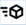

When integrating the transmission, if the batch information is not specified for a batch-managed item, the line will not be added to the inventory list.

Entering/changing an inventory list

For batch-managed items at store level, the information linked to the batch is displayed in the section under the inventory lines. This section includes: the batch references (internal, external...), and the batch dates (entry date, use-by date, etc.) If the item is not subject to batch management, the message Item not managed by batch is displayed. Inventoried quantities are entered by batch in order to ensure traceability and to record discrepancies at each batch level. The Items managed by batch option - depending on how this option is managed - displays or excludes all batch-managed items, or considers all items.

On the Enter inventory screen, batch references are accessed by double-clicking the appropriate line, or by using the [Additional functions - Batch detail] button.

Depending on the inventory type, the following applies:
- For a full inventory, existing batch references cannot be modified. If a physically inventoried batch is not included on the list, you can enter the batch and its inventoried quantity using the [Add an item] button. Batch references are mandatory, and a message prompts you to specify them, if need be, either by entering the relevant information or by selecting an available batch from the inventory detail using the [Select a batch] button.
- For a partial inventory, the existing batch references can be modified, but in such cases, the computer inventory quantities are set to zero; this type of modification is like referencing a new batch. Attention! In this case, the modified batch is no longer included on the list.

Validation

When the inventory is validated, the inventory discrepancies are carried over to the stock and have an effect on the batch detail. For each batch with a negative or positive discrepancy, a movement (inventory-type movement) will record the effect on the batch. If the batch added to the inventory list does not exist, it will be created. If the list includes a batch-managed item for which an inventoried quantity has been entered and the batch references are not specified, the inventory will not be validated. The event log will display the following message in this case: "The batch information is not complete" (with the item code and the inventoried quantity). Inventory snapshots do not contain the details of the batches that make up the stock.

### Internal Inventory Movements

#### Contents

Internal Inventory Movements - Contents

Internal inventory movements are movements of merchandise that have an impact on inventory and are triggered by transactions other than purchases or sales. They can be special movements (input or output of stock), transfers of merchandise between two stores, or transfers of merchandise between two warehouses of the same store.

Required settings
- Define movement reasons

Special inputs/outputs
- Entry of a special input/output
- Adjustment of a special input/output
- Query of a special movement
- Modification of a special movement
- Impacts of a special movement

Transfers
- Setup, preparation and creation of a transfer
- Validation of a transfer notice
- Query, modification and duplication of transfers
- Generation of a transfer
- Management of transfer remainders
- Other useful information about transfer management

#### Define Movement Reasons

=> See also procedure 412 (Management of Movement Reasons)

Define Movement Reasons

Back Office > Settings > Documents > Movements reasons

Movement reasons are used to associate a reason with the creation of a document or some document lines.

They are mainly used for special inventory input and outputs, but can also be set up for other document types.

Each reason is associated with one or more movement types, which define the use cases for this reason, i.e. for which movement types this reason can be used.

Brief overview

Originally, a movement type called Internal movements grouped together:
- Special inputs (drafts, inputs)
- Special outputs (drafts, outputs)
- Transfers (requests, preparations, issues, notices, receipts)

As of version 22.0, in June 2023, this type of movement has been split into 3, in order to distinguish between the reasons for inputs, outputs and transfers:
- Special inputs ( I )
- Special outputs (J)
- Transfers ( K )

All existing reasons for Internal movements ( I ) type have been taken over and typed ( I ; J ; K ). They can then be modified without constraint.

How it works

To filter reasons:
- Menus generating only a special input or a draft input will propose reasons of type I (Special input.)
- Menus generating only a special output or draft output will propose reasons of type J (Special output.)
- Menus generating transfers (transfer requests, transfer preparations, transfer notices, sent transfers, or received transfers) use type K ( Transfer.)

#### Special Inputs/Outputs

Special Inputs/Outputs

Entry of a special input/output

Back Office > Inventory> Enter > Special movements> Input-Output

Front Office > Management> Special movements> Input and Output

These commands allow you to enter special types of inventory input/output movements (theft, breakages, etc.) Compared to the process for entering other documents, there is one particularity – a movement reason must be entered for the document, and if applicable, for the lines. This reason is mandatory. Note that input/output reasons must have been created first by the user in Settings module > Documents > Movement reasons.

Adjustment of a special input/output

Back Office > Inventory > Enter > Special movements > Adjustment

Front Office > Management > Special movements > Adjustment

These commands allow you to enter, in one single document, inventory input and output movements. Input movements must be entered as positive values, and output movements as negative values. When validated, two documents are created automatically – a special input document for positive lines, and a special output document for negative lines.

Query of a special movement

Back Office > Inventory > Query

Front Office > Management > Special movements > Query

In Back Office, special movements can be queried in different ways via the following commands:
- Dashboard, option Internal movements.
- Query, option Special movements.
- Query, option Inventory movement by item
- Movements

In Front Office, special movements are viewed via the Query command.

Modification of a special movement

Back Office > Inventory > Enter> Modification

Front Office > Management > Special movements > Modification

It is possible to modify certain data on a document about special movements, such as item lines, quantities, warehouse, document reason, and line reason. However, it is not possible to modify the document store.

Impacts of a special movement

| Special movements | GQ_PHYSIQUE | GQ_ENTREESORTIES |
| --- | --- | --- |
| Special inputs (EEX) | 1 | 1 |
| Special outputs (SEX) | -1 | -1 |

#### Transfers

##### Setup, Creation and Preparation of a Transfer

Setup, Preparation and Creation of a Transfer

Setup for transfers

Company settings

Back Office > Administration > Company > Company settings

Go to Commercial management > Inventory, and specify the settings available in Inter-warehouse transfers .

Inter-warehouse transfers

Access rights

Back Office > Administration > Users and access > Access right management

The Inventory (103) menu authorizes or not users to access the menus relating to the query, creation, and modification of internal inventory movements.

Creation of a transfer

Back Office > Inventory > Enter > Transfer

Front Office > Management > Transfers > Create transfer

The creation of transfers is slightly different from the process used for entering other documents – You are required to define a sender store and sender warehouse as well as a recipient store for the document. This data is mandatory.

Note that a recipient warehouse must also be entered for transfers from one warehouse to another warehouse of the same store.

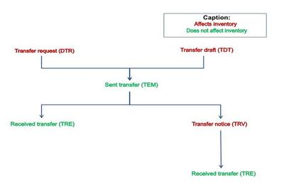

The sender store creates a sent transfer (TEM document type) for another store. There are two possible scenarios here:
- If the recipient store is required to validate its transfer notices, a transfer notice (TRV) will be automatically created at the same time as the TEM document. The recipient store must validate its transfer notice, which will result in the creation of the corresponding received transfer.
- If the recipient store is not required to validate its transfer notices, the corresponding received transfer will be created at the same time as the TEM document.

Preparation of a transfer

Back Office menu Inventory > Enter > Transfer worksheet

Front Office > Management > Transfers > Create transfer worksheet

This command allows you to make a temporary entry of a transfer that can be modified in the sender store until it is changed into a sent transfer. This transfer type (BTR) can be used in the Back Office and in the Front Office. It will be initialized by default with the settings of the Sent transfer and the use of specific counters (document counter, inventory counter.) The following actions are available:
- Creating transfer worksheets in Back Office > Inventory > Enter > Transfer worksheet.
- Duplicating transfer worksheets in Back Office > Inventory > Enter > Duplication/Transfer worksheet.
- Transforming a worksheet into a sent transfer in Back Office > Inventory > Generation > Validate transfer worksheet.

This type is not available by default. Use the access right management to activate this type, in Back Office > Administration > Users and access > Access right management (Inventory/Enter.) Similar access rights are available for the duplication and validation of transfers drafts.

Note if the settings for sent transfers are modified, we strongly recommend to modify manually the settings for the transfer worksheets , so that both types remain identical as much as possible.

##### Validation of a transfer notice

Validation of a Transfer Notice

Back Office > Inventory > Generation > Validate transfer notices

Front Office > Management > Transfers > Validate transfer notices

Several scenarios detailed hereafter are possible.

Standard scenario of validating a transfer notice

A store must validate its transfer notices if the Validate transfer notices option is checked in:
- The Company settings > Commercial Management > Inventory
- The recipient store record in the Contact information tab)
- The recipient warehouse record in the Contact information tab)

Subsidiary record (Characteristics tab):

If a store manages subsidiaries, the Authorize the validation of transfer notices in the stores records setting is checked in the subsidiary record of the recipient store, if this recipient store is associated with a subsidiary.

Warehouse record (Contact information tab):

The Validate transfer notices option is taken into account only when a transfer involves a same store (sender and recipient). Note that if at least one warehouse manages the validation of transfer notices, a transfer notice is generated.

Direct transfers between remote warehouses of the same geographical site

Back Office > Basic data > Stores > Subsidiaries

If subsidiary management is active, it is possible to specify that transfer notices should not be generated for transfers between two warehouses: Therefore, go to the Characteristics tab in the subsidiary record, and enable the Print intra-store transfer documents on a same geographical site setting. The Direct transfers between remote warehouses of a same geographical site setting allows you to specify that no transfer notices should be generated for transfers between remote warehouses within the same geographical site. The sent transfer (TEM ) is then generated directly as a received transfer (TRE) in the following cases:
- If the sender and recipient warehouses belong to the same store, and are not remote warehouses.
- If the sender and recipient warehouses are remote warehouses within the same geographical site, whether or not they belong to the same store.

The following table summarizes the different scenarios for two stores that manage direct transfers and belong to the same subsidiary:

| Store | Warehouses | Characteristics |
| --- | --- | --- |
| 101 | 100 | Non-remote warehouse |
|  | 10A | Vaise remote warehouse |
|  | 10B | Jemmapes remote warehouse |
|  | 10C | Vaise remote warehouse |
|  | 10D | Non-remote warehouse |
|  |  |  |
| 001 | 000 | Non-remote warehouse |
|  | 00A | Vaise remote warehouse |
|  | 00B | Jemmapes remote warehouse |
|  | 00C | Vaise remote warehouse |

| Recipient warehouse |
| --- |
| Sender warehouse |  | 000 | 00A | 00B | 00C | 100 | 10A | 10B | 10C | 10D |
| 000 | - | TRV | TRV | TRV | TRV | TRV | TRV | TRV | TRV |
| 00A | TRV | - | TRV | No TRV | TRV | No TRV | TRV | No TRV | TRV |
| 00B | TRV | TRV | - | TRV | TRV | TRV | TRV | TRV | TRV |
| 00C | TRV | No TRV | TRV | - | TRV | No TRV | TRV | No TRV | TRV |
| 100 | TRV | TRV | TRV | TRV | - | TRV | TRV | TRV | No TRV |
| 10A | TRV | No TRV | TRV | No TRV | TRV | - | TRV | No TRV | TRV |
| 10B | TRV | TRV | TRV | TRV | TRV | TRV | - | TRV | TRV |
| 10C | TRV | No TRV | TRV | No TRV | TRV | No TRV | TRV | - | TRV |
| 10D | TRV | TRV | TRV | TRV | No TRV | TRV | TRV | TRV | - |

If the two stores do not belong to the same subsidiary, or if one of the two stores does not belong to any subsidiary, the process is based on the settings defined for the recipient store (subsidiary/store/warehouse).

Example:

If store 101 does not belong to any subsidiary, a transfer (TEM) sent from warehouse 00A to warehouse 10A will generate a transfer notice, even though both warehouses are remote warehouses on the same geographical site, unlike in the examples shown above.

Direct transfer from headquarters-type stores

Store not linked to a subsidiary

If the sender store is a headquarters-type store, a sent transfer automatically generates a received transfer.

Store linked to a subsidiary
- Is a headquarters-type store, a sent transfer automatically generates a received transfer regardless of the other options activated in the subsidiary record.
- Is a headquarters-type store, the system takes into account the Direct transfers between remote warehouses of a same geographical site option (refer to the previous chapter “Direct transfers between remote warehouses of a same geographical site.”) Direct transfers between remote warehouses of the same geographical site). If the Direct transfers between remote warehouses of a same geographical site option is not checked, the Validate transfer notices option from the store record is taken into account.

##### Query, Modification and Duplication of Transfers

Query, Modification and Duplication of Transfers

Transfer query

Back Office > Inventory > Query> Query> Transfers

Front Office > Management > Transfers > Query

These commands allow you to view BTR, DTR, TEM, TRV, and TRE documents. In Back Office, other types of query are available from the Query menu:
- Dashboard > option Internal movements.
- Query > option Inventory movement by item
- Movements

Transfer modification

Back Office > Inventory > Enter > Modification > Transfers

Front Office > Management > Transfers > Modification

If a TEM document is modified, a message prompts the user to confirm whether the changes should be implemented in the following documents also:
- in the “counterpart” TRV document, if it exists, and has not been validated yet.
- in the “counterpart” TRE document, if there is no TRV document, or if the TRV document has been validated.

If selected, the Request to apply modifications when validating transfers company setting accessed via Commercial management > Inventory will also prompt the user to confirm if they want the changes made during validation of a TRV document to be applied to its counterpart TEM document also.

Transfer duplication

Back Office > Inventory > Enter > Duplication

Front Office > Management > Transfers > Duplication

These commands enable the duplication of transfer documents (such as request and worksheets.)

##### Generation of a transfer

Generation a Transfer

Back Office > Inventory > Generation

Validate transfer requests

It is possible for a store to enter a transfer request in order to ask another store if they can send items to them. Once entered, the transfer request (DTR) document must be validated before the corresponding Transfer sent (TEM) document can be created.

Please note!

When entering a transfer request (DTR), the store that enters the DTR is the recipient store in the document, since it is considered to be the store that will receive the transferred merchandise.

recipient

Validate transfer worksheets

This command allows users to validate transfer worksheets so that a sent transfer, and if necessary, a transfer notice can be generated.

Validate transfer notices

The command allows users to validate transfer notices once the conditions listed in the section on validating transfer notices have been met (see above).

Validate replenishment orders

This command allows you to generate transfers at Headquarters from replenishment orders entered in the store. The transfers can be created automatically or manually, and with or without checks being carried out on the warehouse from which the inventory is to be taken. A multi-criteria search screen allows you to select the replenishment order to be converted to a transfer. When generating transfers automatically, an option allows you to choose:
- Either the entire replenishment order should be generated, even if there is no inventory for the items in the warehouse
- Or only part of the replenishment order should be generated; in which case only the items for which there is inventory in the warehouse are taken into account In this case, the replenishment order will remain active, as long as there are quantities to process.

When validating the orders you have selected for transfer, a record allows you to select the warehouse from which the inventory is to be taken. When transfers are generated manually, the standard document generation process applies. A specific step in the process allows you to generate the transfer notice or the received transfer associated with the sent transfer.

Pre-receive transfer notices

It is possible for transfer notices to be automatically pre-received and received in multi-selection mode. This makes it possible to accelerate the merchandise receipt functionalities in the case of delivery notices by indicating that the goods have arrived at the store, thus allowing them to be rapidly entered into inventory. The notices must be selected using the space bar. You can then carry out a number of actions:
- Launch the pre-receipt of the elements selected.
- Launch the multi-package pre-receipt of the elements selected.
- Launch the multi-package receipt of the elements selected.
- Launch the validation of the transfer notices (and therefore generation of the corresponding received transfers) for the selected elements.
- Display the screen for communicating with a portable inventory terminal. Activating the terminal download function allows transfer notices to be received automatically.

The status of the receipt is indicated in the multi-criteria header. The status may be set to the following values:
- On hold: the document has just been created.
- Pre-received: the document has arrived at the warehouse.
- Partial processing: The document content has been scanned but items are missing
- Notice processed: all the items have arrived or the document has been cleared

For convenience, this screen also allows you to pre-receive and receive delivery notices (ALF documents) and purchase orders (CF documents). Note that the same feature is available in Purchases > Generation.

Please note!

To display the sender store in the presentation, click this button and add the GP_ETABLISSEMETT column.

The default setting for the Store column (GP_ETABLISSEMENT) refers to the recipient store.

##### Management of Transfer Remainders

Management of Transfer Remainders

The goal here is to ensure that the process for managing delivery notices and the process for managing transfer notices are exactly the same throughout the receipt cycle. This is achieved by using special functions for transfers. In particular, this allows for the following:
- Management of transfer notice remainders so that partial receipts are possible.
- Transfer notices can be closed/reopened.
- The multi-criteria screens can display remainders, closed documents, non-closed documents, and all other elements necessary to ensure that the process is the same as for managing delivery notices.

Settings and impacts

Back Office > Administration > Company > Company settings

To activate the remainder management, select the Management of remainders for transfer notices company setting accessed under Commercial management > Inventory.

Please note! Once you activate this setting, it cannot be changed anymore . The consequences of activating this setting are as follows:

cannot be changed anymore
- The received transfer counter is set to the same value as the sent transfer counter.
- The Remainder management setting is activated on the Inventory tab of the document types for TEM, TRV, and TRE documents. It will no longer be possible to change this setting.
- The Request to apply modifications when validating transfers company setting is disabled.
- The Validate transfer notices company setting is activated.

Neither of these two settings can be changed again.

Note that if remainders are managed in transfer notices, and a received transfer is deleted, the deleted quantities in the previous document must be reset if this document is a transfer notice.

Use

Back Office > Inventory > Processing > Close/Reopen transfers

When validating a transfer, you can receive a transfer notice in several parts. The remainders can be displayed in a multi-criteria query screen for transfer notices.

These two features are subject to access rights available in Administration > Users and access > Access right management > Menu Inventory (103) > Processing.

Management of remainders for transfer worksheets and requests

Back Office > Settings > Documents > Documents> Types

The remainder management for transfers is also operational for transfer worksheets and transfer requests.

To facilitate the management of remainders, you can impose in the settings of transfer worksheets and requests, the generation of only one subsequent document.

##### Other Useful Information about Transfer Management

Other Useful Information about Transfer Management

Approval for documents

Back Office > Inventory > Processing > Approval for documents

If approval is managed for the documents in question, this feature allows you to manage approvals in document-by-document mode or in batch mode.

User restriction for transfer requests

Back Office > Administration > Users and Access > Users > tab Restrictions

This feature is aimed at adding a restriction level to the transfer management in order to meet the following requirement:
- Store 001 is able to send a transfer request to store 002.
- Store 002 is not able to send a transfer request to store 001.

To enable this operation, a new type of restriction is added to the user record, in the Restrictions tab, field Transfer request sender.

Impact on the DISPO table

Sender warehouse for items

Recipient warehous e for items

|  | GQ_PHYSIQUE | GQ_RESERVETRF | GQ_ANNONCETRF | GQ_TRANSFERT | GQ_BROUILLONTRF |
| --- | --- | --- | --- | --- | --- |
| Creation of a transfer request | - | +1 | - | - |  |
| Validation of a transfer request and generation of the corresponding sent transfer | -1 | -1 | +1 | -1 |  |
| Entry of a sent transfer and generation of the corresponding received transfer | -1/ +1 | - |  | -1/ +1 |  |
| Entry of a sent transfer and generation of the corresponding transfer notice | -1 | - | +1 | -1 |  |
| Validation of the transfer notice and generation of the received transfer | +1 | - | -1 | +1 |  |
| Entry of a transfer draft | - | - | - | - | +1 |
| Validation of a transfer draft and generation of the corresponding sent transfer | -1 |  | +1 | -1 | -1 |

Litigations on transfers

Setup

Back Office > Administration > Company > Company settings

You can also define restrictions for viewing and processing litigations on transfers. Go to Documents - Entry, and populate the fields Query litigations on transfers and Process litigations on transfers . These settings are also copied to the subsidiary record for more flexibility. To remain iso-functional, the default values of the settings are set to “by recipient”

Use

Back Office > Inventory > Processing > Process transfer litigations

Front Office > Management > Transfers > Process transfer litigations

Click here for further information about processing litigations.

Click here

Valuation of transfers

Please refer to topic Valuation of Transfers or the various settings required.

Valuation of Transfers

### Inventory Advanced Dashboard

#### Contents

Inventory Advanced Dashboard - Contents

Back Office > Inventory > Query > Dashboard

There are two inventory dashboards:
- Standard dashboard for inventory: Works with the DISPO table (availability) and enables you to retrieve additional information on inventory, sales, inventory movements and inventory snapshots. The primary query is always based on the current inventory or on inventory at a certain date (following full or optimized closure). It is not possible, for example, to display an item that was sold over a given period if this is not included in current inventory.
- Advanced dashboard for inventory: The objective is to offer a new advanced dashboard optimally combining inventory, purchases, sales, inventory movements and inventory snapshots. Note that archived movements are taken into account in this dashboard.

To use functions related to the advanced dashboard, enable the access user rights in Menu Inventory (103) > Inventory > Query > Advanced dashboard.

Available selection criteria
- Standards tab
- Inventory tab
- Documents tab
- Pricing tab

Additional information
- Data Consistency
- Coefficient calculation
- Dashboard generation time

Management of additional fields
- List of fields
- Available fields

#### Available Selection Criteria

Available Selection Criteria

Back Office > Inventory > Query > Dashboard > Advanced

The advanced dashboard offers the ability to combine selections based on inventory, inventory snapshots, and movements. The different selections that you make populate two temporary tables, MTMPTVGENINT and MTMPTVGENRG. These tables are used directly by the dashboard. To ensure that it is as comprehensive as possible, this dashboard takes dimensions into account.

Standards tab

Using the standard selection criteria and your selected dimensions, this tab allows you to select the items that are to be taken into account: Three grouping categories are offered, including:
- 8 item categories
- 15 user-defined item tables
- 2 user-defined item statistics
- Supplier code
- Sales divisions
- Collection, as well as the basic collection

In terms of the dashboard display in the case of grouping, the fields for the item record (item code, selling price, purchase price, etc.) are not displayed, and it is no longer possible to make selections based on the Item field and on the dimensions.

Six additional fields will be displayed – the three grouping fields and their corresponding descriptions. The grouping criteria are displayed when the criteria are printed out. This concept of grouping allows you to optimize the dashboard layout. Once run, queries will return data that has already been added to the temporary table for the dashboard.

However, it is not possible to carry out price list evaluations as this would require adding the item details to the temporary table, evaluating the price lists, and the subsequent grouping of the data. This would considerably slow down the process This means that once you select a field of type Grouping , the fields relating to price lists are reinitialized and are no longer available for selection.

In the case of grouping, fields of type Dimension (size, color, etc.) and the Item field will no longer be made available for selection either.

It is also possible to use a filter and/or grouping by store :
- If no store grouping is active, and one or more stores have been selected, the list of warehouses will be reduced accordingly and statistics will be filtered according to the stores selected.
- If a store grouping is active, the column corresponding to the grouping can be added to the presentation.

Inventory tab

This tab enables you to select inventory, inventory snapshots and the valuation type. Since priority is given to inventory snapshots, inventory closures are not provided for selection. It is possible to select the current inventory (access to all fields in the inventory record) and a maximum of two separate inventory snapshots. This allows access to the following:
- Inventory on the date of the snapshot
- Valuation based on LPP, WAPP, LCP, or WACP

For each of these selections relating to inventory, the Items in stock field allows you to select the following values: Negative inventory, positive inventory or zero stock. The combination of these selections allows you to select all inventory levels, positive inventory only, negative inventory only, or inventory different from zero.

Please note! Make sure the combination of selected criteria is coherent.

For example, if you request positive inventory only for snapshot 1, it will still be possible to view items with zero or negative inventory for snapshot 1 if these items are currently in stock and you have also requested to view items in stock for the current inventory.

Note that if items are displayed and are not taken from a snapshot, the date is not shown in the Snapshot date field for snapshot 1.

Documents tab

This tab allows you to make three different selections for each document type – sales, internal movements and purchases. This allows you for given type to request:
- Two different types of documents for the same period – for example, supplier orders and deliveries for the month M.
- The same type of document for 2 different periods – for example, deliveries for months M and M-1.

The Quantity field allows you to select the quantity to be taken into account:
- Initial quantity (GL_QTEINIT): Corresponds to the quantities that were entered when the document was first created.
- Quantity billed (GL_QTEFACT): Corresponds to the quantities entered for the last modification.
- Quantity remaining (GL_QTERESTE): Corresponds to the quantities remaining after the document has been converted to the next document type within the business chain.

For example, This dashboard allows you to display the quantities delivered between two dates (selection no. 1 with GL_QTEFACT) as well as the outstanding order quantity for the same period (selection no. 2 with GL_QTERESTE).

Note that the Individual checkbox allows you to select the sales documents that were saved for private customers (box checked) or for companies (box unchecked). You can also choose to disregard this criterion (box empty.)

Each document type triggers a movement in a specific direction – entry or exit of merchandise. Because the selections are multi-type selections, merchandise entries are added and merchandise exits are subtracted.

Considering documents of type Sales

| Type | Description | Document direction | Credit note document | + or - |
| --- | --- | --- | --- | --- |
| AVC | Customer credit note | Both | Yes | - |
| AVS | Credit on inventory | Output | Yes | - |
| BLC | Customer delivery | Output | No | + |
| CC | Customer order | Output | No | + |
| CDI | Available order | Output | No | + |
| DE | Trade command | Output | No | + |
| FAC | Customer invoice | Output | No | + |
| FAF | Financial customer invoice | Output | No | + |
| FFA | Cart on hold | Output | No | + |
| FFO | Receipt | Output | No | + |
| PRE | Delivery preparation | Output | No | + |
| PRO | Pro-forma invoice | Output | No | + |
| RDI | Customer reservations | Output | No | + |

Considering documents of type Purchases

| Type | Description | Document direction | Credit note document | + or - |
| --- | --- | --- | --- | --- |
| AAF | Request for financial credit note | Input | Yes | - |
| AF | Supplier financial credit note | Input | Yes | - |
| AFF | Supplier invoice notice | Input | No | + |
| AFS | Supplier credit note on inventory | Input | Yes | - |
| ALF | Delivery notice | Input | No | + |
| BFA | Supplier return | Input | Yes | - |
| BLF | Supplier receipt | Input | No | + |
| CF | Supplier order | Input | No | + |
| DEF | Purchase order proposal | Input | No | + |
| FCF | Replenishment order | Input | No | + |
| FF | Supplier invoice | Input | No | + |
| FFF | Financial supplier invoice | Input | No | + |

Considering documents of type Movements

| Type | Description | Document direction | Credit note document | + or - |
| --- | --- | --- | --- | --- |
| DTR | Transfer request | Both | No | - |
| TEM | Sent transfer | Output | No | - |
| TRE | Received transfer | Input | No | + |
| TRV | Transfer notice | Input | No | - |
| EEX | Special inputs | Input | No | + |
| SEX | Special outputs | Output | No | - |
| INV | Inventory discrepancies (1) | Input | No | + |

Pricing tab

The selling prices and purchase prices accessible on the dashboards are the prices stored in the item record. You can therefore obtain the selling price by selecting either the LPP, WAPP, LCP or WACP price from the inventory record.

Two fields from the Pricing tab are also provided on the advanced dashboard to display purchase price lists or sales price lists. It is also possible to display the selling price inclusive of tax and the purchase price exclusive of tax as retrieved from the price list management function. The price list type (purchase or selling), the price list, and the price list date can be specified. The settings used for retrieving the price list for an item are as follows:
- Item code
- Price list date,
- Selling/purchase price code.

The choice of price list is determined by user restrictions applied to price lists.

Please note!

The price lists (if specified as criteria) are evaluated for each of the items returned by the selection. Depending on the number of items returned on the dashboard, processing time may be longer compared with the current dashboard. Standard price list searches are used, which ensures that the price is always correct, regardless of the price list type (generic item, dimensioned item, discounted price, etc.) If you generate an advance dashboard grouped by item (item dimension checkboxes not checked), the price list for the generic item is returned. In terms of dimensions, any deviating price lists are ignored.

#### Additional Information

Additional Information on Inventory Advanced Dashboard

Data Consistency

A check has been added to verify that all stores linked to a warehouse have the same subsidiary.

Please note! It is not always a good idea to select multiple document types within the same selection, especially if they follow each other in the business chain.

Example:

For a purchase period in a given month, an initial quantity of 50 is entered on a purchase order. The quantity is then changed to 100, and all 100 items are recorded as deliveries in the database. These deliveries have not been converted to a supplier invoice yet.

| Selection #1 | QTEINIT | QTEFACT | QTERESTE |
| --- | --- | --- | --- |
| CF | 50 | 100 | 0 |
| BLF | 100 | 100 | 100 |
| CF+BLF | 150 | 200 | 100 |

Selecting CF+BLF together with QTEFACT and QTEINIT will return an incoherent result, whereas the selection of QTERESTE corresponds correctly to the 100 units that were actually ordered and delivered in full. You therefore need to make sure that the requested quantity criteria and document types are consistent.

Coefficient calculation

The calculation of coefficients can only be accessed when the selection is made based on a purchase period by checking the corresponding criterion. The selection of a sales period is also necessary for the calculation. The following coefficients are available for these two selection periods:
- Coeff. Sales qty purchase: Sales/purchase period quantity
- Coeff. Stock qty purchase: Physical inventory/purchase period quantity
- Coeff. Purchase/sale valuation: (Purchase period qty X Purchase period amount tax excluded)/(Sales period qty X Sales period amount, tax included)

Dashboard generation time

Each time you make an inventory or document selection, two queries are triggered:
- An INSERT query for inserting records that have not yet been added to the temporary table
- An UPDATE query for updating records that are already included in the table.

The time required to generate the dashboard is therefore dependent on the number of selections made.

These requests are run each time a change is made to the selection criteria, and the specific fields for the selected criteria are made available on the dashboard. However, if you choose to display new fields on the dashboard, the requests are not run again since the temporary table has already been generated.

We therefore recommend limiting the period of time corresponding to the first selection. You can then work on the display format, save it, and then run the final process for a longer period of time.

An intermediary screen allows you to track the progress of the individual steps in the process.

#### List of Fields

Inventory Advanced Dashboard - List of Fields

The list of fields available for the dashboard layout changes according to the selection criteria.

Documents tab

Fields with the following suffixes appear in the Documents tab:
- A1 or purchase 1 suffix concern purchase documents selection 1
- A2 or purchase 2 suffix concern purchase documents selection 2
- V1 or sales 1 suffix concern selection 1 for sales documents
- V2 or sales 2 suffix concern selection 2 for sales documents
- M1 or mvt 1 suffix concern selection 1 for internal movement documents
- M2 or mvt 2 suffix concern selection 2 for internal movement documents

Inventory tab

Fields with the following suffixes appear in the Inventory tab:
- I1 or snapshot 1 suffix concern the selection of inventory snapshot 1
- I1 or snapshot 2 suffix concern the selection of inventory snapshot 1
- ST or undefined suffix concern the selection of current inventory

Currency management

This dashboard also integrates elements from the multi-currency reporting function. It is therefore possible to query valuation fields expressed in the same currency, referred to as the conversion currency. The fields available on the dashboard display can be identified as follows:
- Fields with a CON suffix are valued in the requested conversion currency.
- Fields with an ETAB or ETA suffix are valued in the currency of the relevant store.
- Fields with an FIL suffix are valued in the currency of the relevant affiliated store (subsidiary). By default, they are expressed in the currency of the folder.
- Fields with a DOS suffix are valued in the currency of the folder.

Depending on the options checked in the various tabs, click here to view the available fields .

click here to view the available fields

#### Available Fields

Inventory Advanced Dashboard - Available Fields

Note that when grouping, the GA_XXX and GA2_XXX fields are not available.

| Description | Field name | Comments |
| --- | --- | --- |
| Item | MZS_ARTICLE | In the case of grouping, this field is not available. Otherwise, it corresponds to the item code (e.g. C19331), provided you have not selected a dimension. If you have selected a dimension, it displays as the item ID (e.g. C19331 001002 X) otherwise. |
| Warehouse | MZS_DEPOT | Warehouse. |
| Inventory | MZS_PHYSIQUE | Inventory total: Physical. |
| Front Office sales | MZS_VENTEFFO | Inventory total: Front Office Sales. |
| Customer invoiced | MZS_FACTURECLI | Inventory total: Customer invoiced. |
| Delivered to customer | MZS_LIVRECLIENT | Inventory total: Customer delivered. |
| Available for customer | MZS_DISPOCLI | Inventory total: Customer availability. |
| Delivery preparation | MZS_PREPACLI | Inventory total: Delivery preparation. |
| ORLI preparation | MZS_PREPAORLI | Inventory total: ORLI preparation. |
| Customer ordered | MZS_RESERVECLI | Inventory total: Customer ordered. |
| Credit on inventory | MZS_AVOIRSTOCK | Inventory total: Credit on stock. |
| Supplier invoiced | MZS_FACTUREFOU | Inventory total: Supplier invoiced. |
| Supplier delivered | MZS_LIVREFOU | Inventory total: Supplier delivered. |
| Ordered from supplier | MZS_RESERVEFOU | Inventory total: Ordered from supplier. |
| Supplier credit note on inventory | MZS_AVOIRFOUSTOCK | Inventory total: Supplier credit on stock. |
| Supplier return | MZS_RETOURFOURN | Inventory total: Supplier return. |
| Inventory transfer | MZS_TRANSFERT | Inventory total: inventory transfer. |
| Input/output | MZS_ENTREESORTIES | Inventory total: Inputs/Outputs. |
| Inventory discrepancy | MZS_ECARTINV | Inventory total: Inventory discrepancy. |
| Quantity 1 - inventory | MZS_QTE1 | Quantity 1 – inventory (GQ_QTE1) |
| Quantity 2 - inventory | MZS_QTE2 | Quantity 2 – inventory (GQ_QTE2) |
| Sold | MZS_VENDU | Calculated field = GQ_VENTEFFO+GQ_FACTURECLI+GQ_LIVRECLIENT |
| Net inventory | MZS_STOCKNET | Calculated field = GQ_PHYSIQUE+GQ_RESERVEFOU - GQ_RESERVECLI - GQ_DISPOCLI - GQ_PREPACLI |
| Store currency LPP | MZS_DPAETAST | Calculated field = Sum(GQ_DPA*GQ_PHYSIQUE)/Sum(GQ_PHYSIQUE) |
| Store currency LCP | MZS_DPRETAST | Calculated field = Sum(GQ_DPR*GQ_PHYSIQUE)/Sum(GQ_PHYSIQUE) |
| Store currency WAPP | MZS_PMAPETAST | Calculated field = Sum(GQ_PMAP*GQ_PHYSIQUE)/Sum(GQ_PHYSIQUE) |
| Store currency WACP | MZS_PMRPETAST | Calculated field = Sum(GQ_PMRP*GQ_PHYSIQUE)/Sum(GQ_PHYSIQUE) |
| Inventory valued at store currency LPP | MZS_STODPAETAST | Calculated field = Sum(GQ_DPA*GQ_PHYSIQUE) |
| Inventory valued at store currency LCP | MZS_STODPRETAST | Calculated field = Sum(GQ_DPR*GQ_PHYSIQUE) |
| Inventory valued at store currency WAPP | MZS_STOPMAPETAST | Calculated field = Sum(GQ_PMAP*GQ_PHYSIQUE) |
| Inventory valued at store currency WACP | MZS_STOPMRPETAST | Calculated field = Sum(GQ_PMRP*GQ_PHYSIQUE) |
| Net inventory valued at store currency LCP | MZS_NETDPRST | Calculated field = Sum(GQ_DPA * (GQ_PHYSIQUE + GQ_RESERVEFOU - GQ_RESERVECLI - GQ_DISPOCLI - GQ_PREPACLI)) |
| Net inventory valued at store currency LPP | MZS_NETDPAST | Calculated field = Sum(GQ_DPR * (GQ_PHYSIQUE + GQ_RESERVEFOU - GQ_RESERVECLI - GQ_DISPOCLI - GQ_PREPACLI)) |
| Net inventory valued at store currency WAPP | MZS_NETPMAPST | Calculated field = Sum(GQ_PMAP * (GQ_PHYSIQUE + GQ_RESERVEFOU - GQ_RESERVECLI - GQ_DISPOCLI - GQ_PREPACLI)) |
| Net inventory valued at store currency WACP | MZS_NETPMRPST | Calculated field = Sum(GQ_PMRP * (GQ_PHYSIQUE + GQ_RESERVEFOU - GQ_RESERVECLI - GQ_DISPOCLI - GQ_PREPACLI)) |
| Selected currency rate - inventory | MZS_COTATIONCONST | A search is carried out for the conversion rate between the store currency and the currency entered in the Currencies tab based on the selected stock exchange. The date of the rate that is taken into account is either the current date (if the Fixed date of rate field has not been checked), or the entered date. |
| Folder currency rate - inventory | MZS_COTATIONDOSST | A search is carried out for the conversion rate between the folder currency and the currency entered in the Currencies tab based on the selected stock exchange. The date of the rate that is taken into account is either the current date (if the Fixed date of rate field has not been checked), or the entered date. |
| Subsidiary currency rate - inventory | MZS_COTATIONFILST | A search is carried out for the conversion rate between the subsidiary currency and the currency entered in the Currencies tab based on the selected stock exchange. The date of the rate that is taken into account is either the current date (if the Fixed date of rate field has not been checked), or the entered date. |
| Received valued at LPP - Store currency | DPAETAST_RECU_FOURN | Calculated field = MZS_LIVREFOU * MZS_DPAETAST. Total calculated in case of grouping. |
| Transfer valued at LPP - Store currency | DPAETAST_TRANSFERE | Calculated field = MZS_TRANSFERT * MZS_DPAETAST. Total calculated in case of grouping. |
| Inputs/outputs valued at LPP - Store currency | DPAETAST_ENTREESORTIE | Calculated field = MZS_ENTREESORTIES * MZS_DPAETAST. Total calculated in case of grouping. |
| Inventory valued at store currency LPP | DPAETAST_STOCK | Calculated field = MZS_PHYSIQUE * MZS_DPAETAST. Total calculated in case of grouping. |
| Ordered by customer valued at LPP - Store currency | DPAETAST_RESA_CLIENT | Calculated field = MZS_RESERVECLI * MZS_DPAETAST. Total calculated in case of grouping. |
| Available for customer valued at LPP - Store currency | DPAETAST_DISPO_CLIENT | Calculated field = MZS_DISPOCLI * MZS_DPAETAST. Total calculated in case of grouping. |
| Ordered by supplier valued at LPP - Store currency | DPAETAST_CDE_FOURN | Calculated field = MZS_RESERVEFOU * MZS_DPAETAST Total calculated in case of grouping. |
| Delivery preparation valued at LPP - Store currency | DPAETAST_PREPA_CLIENT | Calculated field = MZS_PREPACLI * MZS_DPAETAST. Total calculated in case of grouping. |
| ORLI preparation valued at LPP - Store currency | DPAETAST_PREPA_ORLI | Calculated field = MZS_PREPAORLI * MZS_DPAETAST. Total calculated in case of grouping. |
| Supplier credit note on inventory valued at LPP - Store currency | DPAETAST_AVOIRFOURNSTOCK | Calculated field = MZS_AVOIRFOUSTOCK * MZS_DPAETAST. Total calculated in case of grouping. |
| Credit on inventory LPP valuation - Store currency | DPAETAST_AVOIRSTOCK | Calculated field = MZS_AVOIRSTOCK * MZS_DPAETAST. Total calculated in case of grouping. |
| Inventory discrepancy valued at LPP - Store currency | DPAETAST_ECARTINV | Calculated field = MZS_ECARTINV * MZS_DPAETAST. Total calculated in case of grouping. |
| Invoiced to customer valued at LPP - Store currency | DPAETAST_FACTURECLI | Calculated field = MZS_FACTURECLI * MZS_DPAETAST. Total calculated in case of grouping. |
| Invoiced by supplier valued at LPP - Store currency | DPAETAST_FACTUREFOU | Calculated field = MZS_FACTUREFOU * MZS_DPAETAST. Total calculated in case of grouping. |
| Supplier return valued at LPP - Store currency | DPAETAST_RETOURFOURN | Calculated field = MZS_RETOURFOURN * MZS_DPAETAST. Total calculated in case of grouping. |
| Delivered to customer valued at LPP - Store currency | DPAETAST_LIVRECLIENT | Calculated field = MZS_LIVRECLIENT * MZS_DPAETAST. Total calculated in case of grouping. |
| Front Office sales valued at LPP - Store currency | DPAETAST_VENTEFFO | Calculated field = MZS_VENTEFFO * MZS_DPAETAST. Total calculated in case of grouping. |
| Quantity 1 inventory valued at LPP - Store currency | DPAETAST_QTE1 | Calculated field = MZS_QTE1 * MZS_DPAETAST. Total calculated in case of grouping. |
| Quantity 2 inventory valued at LPP - Store currency | DPAETAST_QTE2 | Calculated field = MZS_QTE2 * MZS_DPAETAST. Total calculated in case of grouping. |
| Sold valued at LPP - Store currency | DPAETAST_VENDU | Calculated field = (MZS_LIVRECLIENT + MZS_VENTEFFO) * MZS_DPAETAST. Total calculated in case of grouping. |
| Net inventory valued at store currency LPP | DPAETAST_STOCK_NET | Calculated field = (MZS_PHYSIQUE + MZS_RESERVEFOU – MZS_RESERVECLI – MZS_DISPOCLI – MZS_PREPACLI) * MZS_DPAETAST. Total calculated in case of grouping. |
| Inventory valued at LPP - Converted | DPA_PHYSIQUECON | Calculated field = MZS_PHYSIQUE * MZS_DPAETAST * MZS_COTATIONCONST. Total calculated in case of grouping. |
| Received valued at LCP - Store currency | DPRETAST_RECU_FOURN | Calculated field = MZS_LIVREFOU * MZS_DPRETAST. Total calculated in case of grouping. |
| Transfer valued at LCP - Store currency | DPRETAST_TRANSFERE | Calculated field = MZS_TRANSFERT * MZS_DPRETAST. Total calculated in case of grouping. |
| Inputs/outputs valued at LPP - Store currency | DPRETAST_ENTREESORTIE | Calculated field = MZS_ENTREESORTIES * MZS_DPRETAST. Total calculated in case of grouping. |
| Inventory valued at store currency LCP | DPRETAST_STOCK | Calculated field = MZS_PHYSIQUE * MZS_DPRETAST. Total calculated in case of grouping. |
| Ordered by customer valued at LCP - Store currency | DPRETAST_RESA_CLIENT | Calculated field = MZS_RESERVECLI * MZS_DPAETAST. Total calculated in case of grouping. |
| Available for customer valued at LCP - Store currency | DPRETAST_DISPO_CLIENT | Calculated field = MZS_DISPOCLI * MZS_DPRETAST. Total calculated in case of grouping. |
| Ordered from supplier valued at LCP - Store currency | DPRETAST_CDE_FOURN | Calculated field = MZS_RESERVECLI * MZS_DPRETAST. Total calculated in case of grouping. |
| Delivery preparation valued at LCP - Store currency | DPRETAST_PREPA_CLIENT | Calculated field = MZS_PREPACLI * MZS_DPRETAST. Total calculated in case of grouping. |
| ORLI preparation valued at LCP - Store currency | DPRETAST_PREPA_ORLI | Calculated field = MZS_PREPAORLI * MZS_DPRETAST. Total calculated in case of grouping. |
| Supplier credit note on inventory valued at LCP - Store currency | DPRETAST_AVOIRFOURNSTOCK | Calculated field = MZS_AVOIRFOUSTOCK * MZS_DPRETAST. Total calculated in case of grouping. |
| Credit on inventory LCP valuation - Store currency | DPRETAST_AVOIRSTOCK | Calculated field = MZS_AVOIRSTOCK * MZS_DPRETAST. Total calculated in case of grouping. |
| Inventory discrepancy valued at LCP - Store currency | DPRETAST_ECARTINV | Calculated field = MZS_ECARTINV * MZS_DPRETAST. Total calculated in case of grouping. |
| Invoiced to customer valued at LCP - Store currency | DPRETAST_FACTURECLI | Calculated field = MZS_FACTURECLI * MZS_DPRETAST. Total calculated in case of grouping. |
| Invoiced by supplier valued at LCP - Store currency | DPRETAST_FACTUREFOU | Calculated field = MZS_FACTUREFOU* MZS_DPRETAST. Total calculated in case of grouping. |
| Supplier return valued at LCP - Store currency | DPRETAST_RETOURFOURN | Calculated field = MZS_RETOURFOURN * MZS_DPRETAST. Total calculated in case of grouping. |
| Delivered to customer valued at LCP - Store currency | DPRETAST_LIVRECLIENT | Calculated field = MZS_LIVRECLIENT * MZS_DPRETAST. Total calculated in case of grouping. |
| Front Office sales valued at LCP - Store currency | DPRETAST_VENTEFFO | Calculated field = MZS_VENTEFFO * MZS_DPRETAST. Total calculated in case of grouping. |
| Quantity 1 inventory valued at LCP - Store currency | DPRETAST_QTE1 | Calculated field = MZS_QTE1 * MZS_DPRETAST. Total calculated in case of grouping. |
| Quantity 2 inventory valued at LCP - Store currency | DPRETAST_QTE2 | Calculated field = MZS_QTE2 * MZS_DPRETAST. Total calculated in case of grouping. |
| Sold valued at LCP - Store currency | DPRETAST_VENDU | Calculated field = (MZS_LIVRECLIENT + MZS_VENTEFFO) * MZS_DPRETAST. Total calculated in case of grouping. |
| Net inventory valued at store currency LCP | DPRETAST_STOCK_NET | Calculated field = (MZS_PHYSIQUE + MZS_RESERVEFOU – MZS_RESERVECLI – MZS_DISPOCLI – MZS_PREPACLI) * MZS_DPRETAST. Total calculated in case of grouping. |
| Inventory valued at LCP - Converted | DPR_PHYSIQUECON | Calculated field = MZS_PHYSIQUE * MZS_DPRETAST * MZS_COTATIONCONST. Total calculated in case of grouping. |
| Received valued at WAPP - Store currency | PMAPETAST_RECU_FOURN | Calculated field = MZS_LIVREFOU * MZS_DPRETAST. Total calculated in case of grouping. |
| Transfer valued at WAPP - Store currency | PMAPETAST_TRANSFERE | Calculated field = MZS_TRANSFERT * MZS_DPSAETAST. Total calculated in case of grouping. |
| Inputs/outputs valued at WAPP - Store currency | PMAPETAST_ENTREESORTIE | Calculated field = MZS_ENTREESORTIES * MZS_PMAPETAST. Total calculated in case of grouping. |
| Inventory valued at store currency WAPP | PMAPETAST_STOCK | Calculated field = MZS_PHYSIQUE * MZS_PMAPETAST. Total calculated in case of grouping. |
| Ordered by customer valued at WAPP - Store currency | PMAPETAST_RESA_CLIENT | Calculated field = MZS_RESERVECLI * MZS_PMAPETAST. Total calculated in case of grouping. |
| Available for customer valued at WAPP - Store currency | PMAPETAST_DISPO_CLIENT | Calculated field = MZS_DISPOCLI * MZS_PMAPETAST. Total calculated in case of grouping. |
| Ordered by supplier valued at WAPP - Store currency | PMAPETAST_CDE_FOURN | Calculated field = MZS_RESERVEFOU * MZS_PMAPETAST. Total calculated in case of grouping. |
| Delivery preparation valued at WAPP – Store currency | PMAPETAST_PREPA_CLIENT | Calculated field = MZS_PREPACLI * MZS_PMAPETAST. Total calculated in case of grouping. |
| ORLI preparation valued at Store currency WAPP - Store currency | PMAPETAST_PREPA_ORLI | Calculated field = MZS_PREPAORLI * MZS_PMAPETAST. Total calculated in case of grouping. |
| Supplier credit note on inventory valued at WAPP - Store currency | PMAPETAST_AVOIRFOURNSTOCK | Calculated field = MZS_AVOIRFOUSTOCK * MZS_PMAPETAST. Total calculated in case of grouping. |
| Credit on inventory valued at WAPP - Store currency | PMAPETAST_AVOIRSTOCK | Calculated field = MZS_AVOIRSTOCK * MZS_PMAPETAST. Total calculated in case of grouping. |
| Inventory discrepancy valued at WAPP - Store currency | PMAPETAST_ECARTINV | Calculated field = MZS_TRANSFERT * MZS_PMAPETAST. Total calculated in case of grouping. |
| Invoiced to customer valued at WAPP - Store currency | PMAPETAST_FACTURECLI | Calculated field = MZS_FACTURECLI * MZS_PMAPETAST. Total calculated in case of grouping. |
| Invoiced by supplier valued at WAPP - Store currency | PMAPETAST_FACTUREFOU | Calculated field = MZS_FACTUREFOU* MZS_PMAPETAST. Total calculated in case of grouping. |
| Supplier return valued at WAPP - Store currency | PMAPETAST_RETOURFOURN | Calculated field = MZS_RETOURFOURN * MZS_PMAPETAST. Total calculated in case of grouping. |
| Delivered to customer valued at WAPP - Store currency | PMAPETAST_LIVRECLIENT | Calculated field = MZS_LIVRECLIENT * MZS_PMAPETAST. Total calculated in case of grouping. |
| Front Office sales valued at WAPP - Store currency | PMAPETAST_VENTEFFO | Calculated field = MZS_VENTEFFO * MZS_PMAPETAST. Total calculated in case of grouping. |
| Quantity 1 inventory valued at WAPP - Store currency | PMAPETAST_QTE1 | Calculated field = MZS_QTE1 * MZS_PMAPETAST. Total calculated in case of grouping. |
| Quantity 2 inventory valued at WAPP - Store currency | PMAPETAST_QTE2 | Calculated field = MZS_QTE2 * MZS_PMAPETAST. Total calculated in case of grouping. |
| Sold valued at WAPP - Store currency | PMAPETAST_VENDU | Calculated field = (MZS_LIVRECLIENT + MZS_VENTEFFO) * MZS_PMAPETAST. Total calculated in case of grouping. |
| Net inventory valued at store currency WAPP | PMAPETAST_STOCK_NET | Calculated field = (MZS_PHYSIQUE + MZS_RESERVEFOU – MZS_RESERVECLI – MZS_DISPOCLI – MZS_PREPACLI) * MZS_PMAPETAST. Total calculated in case of grouping. |
| Inventory valued at WAPP - Converted | PMAP_PHYSIQUECON | Calculated field = MZS_PHYSIQUE * MZS_PMAPETAST * MZS_COTATIONCONST. Total calculated in case of grouping. |
| Received valued at WACP - Store currency | PMRPETAST_RECU_FOURN | Calculated field = MZS_LIVREFOU * MZS_PMRPETAST. Total calculated in case of grouping. |
| Transfer valued at WACP - Store currency | PMRPETAST_TRANSFERE | Calculated field = MZS_TRANSFERT * MZS_PMRPETAST. Total calculated in case of grouping. |
| Input/output valued at WACP - Store currency | PMRPETAST_ENTREESORTIE | Calculated field = MZS_ENTREESORTIES * MZS_PMRPETAST. Total calculated in case of grouping. |
| Inventory valued at store currency WACP | PMRPETAST_STOCK | Calculated field = MZS_PHYSIQUE * MZS_PMRPETAST. Total calculated in case of grouping. |
| Ordered by customer valued at WACP - Store currency | PMRPETAST_RESA_CLIENT | Calculated field = MZS_RESERVECLI * MZS_PMRPETAST. Total calculated in case of grouping. |
| Available for customer valued at WACP - Store currency | PMRPETAST_DISPO_CLIENT | Calculated field = MZS_DISPOCLI * MZS_PMRPETAST. Total calculated in case of grouping. |
| Supplier ordered valued at WACP - Store currency | PMRPETAST_CDE_FOURN | Calculated field = MZS_RESERVEFOU * MZS_PMRPETAST. Total calculated in case of grouping. |
| Delivery preparation valued at WACP - Store currency | PMRPETAST_PREPA_CLIENT | Calculated field = MZS_PREPACLI * MZS_PMRPETAST. Total calculated in case of grouping. |
| ORLI preparation valued at WACP - Store currency | PMRPETAST_PREPA_ORLI | Calculated field = MZS_PREPAORLI * MZS_PMRPETAST. Total calculated in case of grouping. |
| Supplier credit note on inventory valued at WACP - Store currency | PMRPETAST_AVOIRFOURNSTOCK | Calculated field = MZS_AVOIRFOUSTOCK * MZS_PMRPETAST. Total calculated in case of grouping. |
| Credit on inventory values at WACP - Store currency | PMRPETAST_AVOIRSTOCK | Calculated field = MZS_AVOIRSTOCK * MZS_PMRPETAST. Total calculated in case of grouping. |
| Inventory discrepancy valued at WACP - Store currency | PMRPETAST_ECARTINV | Calculated field = MZS_ECARTINV * MZS_PMRPETAST. Total calculated in case of grouping. |
| Invoiced to customer valued at WACP - Store currency | PMRPETAST_FACTURECLI | Calculated field = MZS_FACTURECLI * MZS_PMRPETAST. Total calculated in case of grouping. |
| Invoiced by supplier valued at WACP - Store currency | PMRPETAST_FACTUREFOU | Calculated field = MZS_FACTUREFOU * MZS_PMRPETAST. Total calculated in case of grouping. |
| Supplier return valued at WACP - Store currency | PMRPETAST_RETOURFOURN | Calculated field = MZS_RETOURFOURN * MZS_PMRPETAST. Total calculated in case of grouping. |
| Delivered to customer valued at WACP - Store currency | PMRPETAST_LIVRECLIENT | Calculated field = MZS_LIVRECLIENT * MZS_PMRPETAST. Total calculated in case of grouping. |
| Front Office sales valued at WACP - Store currency | PMRPETAST_VENTEFFO | Calculated field = MZS_VENTEFFO * MZS_PMRPETAST. Total calculated in case of grouping. |
| Quantity 1 inventory valued at WACP - Store currency | PMRPETAST_QTE1 | Calculated field = MZS_QTE1 * MZS_PMRPETAST. Total calculated in case of grouping. |
| Quantity 2 inventory valued at WACP - Store currency | PMRPETAST_QTE2 | Calculated field = MZS_QTE2 * MZS_PMRPETAST. Total calculated in case of grouping. |
| Sold valued at WACP - Store currency | PMRPETAST_VENDU | Calculated field = (MZS_LIVRECLIENT + MZS_VENTEFFO) * MZS_PMRPETAST. Total calculated in case of grouping. |
| Net inventory valued at store currency WACP | PMRPETAST_STOCK_NET | Calculated field = (MZS_PHYSIQUE + MZS_RESERVEFOU – MZS_RESERVECLI – MZS_DISPOCLI – MZS_PREPACLI) * MZS_PMRPETAST. Total calculated in case of grouping. |
| Inventory valued at WACP - Converted | PMRP_PHYSIQUECON | Calculated field = MZS_PHYSIQUE * MZS_PMRPETAST * MZS_COTATIONCONST. Total calculated in case of grouping. |
| Price list selection 1 | MZS_TARIF1 | Price list found for selection 1. In the case of grouping, this field is not available. |
| Selected currency rate - price list 1 | MZS_COTATIONCONT1 | A search is carried out for the conversion rate between the currency of the price list and the currency specified in the Currencies tab based on the selected stock exchange. The date of the rate that is taken into account is the date entered either on the Price lists tab (if the Fixed date of rate field has not been checked), or on the Currencies tab. |
| Subsidiary currency rate -price list 1 | MZS_COTATIONFILT1 | A search is carried out for the conversion rate between the subsidiary currency and the currency entered in the Currencies tab based on the selected stock exchange. The date of the rate that is taken into account is the date entered either on the Price lists tab (if the Fixed date of rate field has not been checked), or on the Currencies tab. |
| Folder currency rate - price list 1 | MZS_COTATIONDOST1 | A search is carried out for the conversion rate between the folder currency and the currency entered in the Currencies tab based on the selected stock exchange. The date of the rate that is taken into account is the date entered either on the Price lists tab (if the Fixed date of rate field has not been checked), or on the Currencies tab. |
| Inv. valuation of selected price list 1 | PHYSIQUE_TAR1 | Calculated field = MZS_PHYSIQUE * MZS_TARIF1. In the case of grouping, this field is not available. |
| Inv. valuation of selected price list 1 - Converted | PHYSIQUE_TAR_CON1 | Calculated field = MZS_PHYSIQUE * MZS_TARIF1 * MZS_COTATIONCONT1. In the case of grouping, this field is not available. |
| Inv. valuation of selected price list 1 - Subsidiary currency | PHYSIQUE_TAR_FIL1 | Calculated field = MZS_PHYSIQUE * MZS_TARIF1 * MZS_COTATIONFILT1. In the case of grouping, this field is not available. |
| Inv. valuation of selected price list 1 - Store currency | PHYSIQUE_TAR_DOS1 | Calculated field = MZS_PHYSIQUE * MZS_TARIF1 * MZS_COTATIONDOST1. In the case of grouping, this field is not available. |
| Price list selection 2 | MZS_TARIF2 | Price list found for selection 2. In the case of grouping, this field is not available. |
| Selected currency rate - price list 2 | MZS_COTATIONCONT2 | A search is carried out for the conversion rate between the price list currency and the currency entered in the Currencies tab based on the selected stock exchange. The date of the rate that is taken into account is the date entered either on the Price lists tab (if the Fixed date of rate field has not been checked), or on the Currencies tab. |
| Subsidiary currency rate -price list 2 | MZS_COTATIONFILT2 | A search is carried out for the conversion rate between the subsidiary currency and the currency entered in the Currencies tab based on the selected stock exchange. The date of the rate that is taken into account is the date entered either on the Price lists tab (if the Fixed date of rate field has not been checked), or on the Currencies tab. |
| Folder currency rate - price list 2 | MZS_COTATIONDOST2 | A search is carried out for the conversion rate between the folder currency and the currency entered in the Currencies tab based on the selected stock exchange. The date of the rate that is taken into account is the date entered either on the Price lists tab (if the Fixed date of rate field has not been checked), or on the Currencies tab. |
| Inv. valuation of selected price list 1 2 | PHYSIQUE_TAR2 | Calculated field = MZS_PHYSIQUE * MZS_TARIF2. In the case of grouping, this field is not available. |
| Inv. valuation of selected price list 1 2 - Converted | PHYSIQUE_TAR_CON2 | Calculated field = MZS_PHYSIQUE * MZS_TARIF2 * MZS_COTATIONCONT2. In the case of grouping, this field is not available. |
| Inv. valuation of selected price list 2 - Subsidiary currency | PHYSIQUE_TAR_FIL2 | Calculated field = MZS_PHYSIQUE * MZS_TARIF2 * MZS_COTATIONFILT2. In the case of grouping, this field is not available. |
| Inv. valuation of selected price list 2 - Store currency | PHYSIQUE_TAR_DOS2 | Calculated field = MZS_PHYSIQUE * MZS_TARIF2 * MZS_COTATIONDOST2. In the case of grouping, this field is not available. |
| Location | MZS_EMPLACEMENT | Location. In the case of grouping, this field is not available. |
| Warehouse type | GDE_TYPEDEPOT | Warehouse type. |
| Item Code | GA_CODEARTICLE | Item code (e.g. C19331). |
| Item type | GA_TYPEARTICLE | Item type (MAR, FI, etc.) |
| Closed item | GA_FERME | Closed item. |
| Item main supplier | GA_FOURNPRINC | Item supplier. |
| Sales division | GA_DOMAINE | Sales division. |
| Collection | GA_COLLECTION | Item collection. |
| Basic collection | GA2_COLLECTIONBAS | Basic collection for the item. |
| Item categories - level 1 to 8 | GA_FAMILLENIV1 to 3 and GA2_FAMILLENIV4 to 8 | Item categories. |
| User-defined tables - item 1 to 10 | GA_LIBREART1 to A and GA2_LIBREARTB to F | User-defined tables - item. |
| User-defined dates - item 1 to 3 | GA_DATELIBRE1 to 3 | User-defined dates - item. |
| User-defined amounts - item 1 to 3 | GA_VALLIBRE1 to 3 | User-defined amounts - item. |
| User-defined decisions - item 1 to 15 | GA_BOOLLIBRE1 to 3 and GA2_BOOLLIBRE4 to F | User-defined decisions - item. |
| User-defined texts - item 1 to 3 | GA_CHARLIBRE1 to 3 | User-defined texts - item. |
| Additional designation 1 item | GA_DESIGNATION1 | Additional item description |
| Item purchase price - Tax excl. | GA_PAHT | Item purchase price - Tax excl. |
| Item cost price - Tax excl. | GA_PRHT | Item cost price - Tax excl. |
| Trading price - Tax excl. | GA_PVHT | Item sales price - Tax excl. |
| Retail price - Tax incl. | GA_PVTTC | Item sales price - Tax incl. |
| Size_Row1 | TAILLE_RANG1 | Row of dimension 1 In the case of grouping, this field is not available. |
| Size | TAILLE | Dimension description In the case of grouping, this field is not available. |
| Dimension grid 1 | GA_GRILLEDIM1 | Dimension grid 1. |
| Size_DimORLI1 | TAILLE_DIMORLI1 | ORLI dimension In the case of grouping, this field is not available. |
| Color_Row2 | COULEUR_RANG2 | Row of dimension 2 In the case of grouping, this field is not available. |
| Color | COULEUR | Dimension description In the case of grouping, this field is not available. |
| Dimension grid 2 | GA_GRILLEDIM2 | Dimension grid 2. |
| Color_DimORLI2 | COULEUR_DIMORLI2 | ORLI dimension In the case of grouping, this field is not available. |
| Length_Row3 | LONGUEUR_RANG3 | Row of dimension 3 In the case of grouping, this field is not available. |
| Length | LONGUEUR | Dimension description In the case of grouping, this field is not available. |
| Dimension grid 3 | GA_GRILLEDIM3 | Dimension grid 3. |
| Length_ DimORLI3 | LONGUEUR_DIMORLI3 | ORLI dimension In the case of grouping, this field is not available. |
| Cup_Row4 | BONNET_RANG4 | Row of dimension 4 In the case of grouping, this field is not available. |
| Cup | BONNET | Dimension description In the case of grouping, this field is not available. |
| Dimension grid 4 | GA_GRILLEDIM4 | Dimension grid 4. |
| Cup_DimORLI4 | BONNET_DIMORLI4 | ORLI dimension In the case of grouping, this field is not available. |
| Raw Material_Row5 | MATIERE_RANG5 | Row of dimension 5 In the case of grouping, this field is not available. |
| Raw Material | MATIERE | Dimension description In the case of grouping, this field is not available. |
| Dimension grid 5 | GA_GRILLEDIM5 | Dimension grid 5. |
| Raw Material_DimORLI5 | MATIERE_DIMORLI5 | ORLI dimension In the case of grouping, this field is not available. |
| Sales quantity 1 | MZS_QTEPIECEV1 | In the Documents tab, depending on value of the Quantity field, Sum(GL_QTEFACT), Sum(GL_QTEINIT), or Sum(GL_QTERESTE) applies for sales documents. |
| Selected currency rate - sale 1 | MZS_COTATIONCONV1 | A search is carried out for the conversion rate between the document currency and the currency specified in the Currencies tab based on the selected stock exchange. The date of the rate that is taken into account is either the document date (if the Fixed date of rate field has not been checked), or the entered date. |
| Store currency tax excl. valuation - sale 1 | MZS_MTHTETAV1 | If field Quantity = Invoiced quantity , Sum(GL_TOTALHT) applies; otherwise calculation is as follows: Sum(GL_TOTALHT/GL_QTEFACT*GL_QTERESTE) or Sum(GL_TOTALHT/GL_QTEFACT*GL_QTEINIT) sales documents |
| Subsidiary currency tax excl. valuation - sale 1 | MZS_MTHTFILV1 | If field Quantity = Invoiced quantity , Sum(GL_TOTALHTDEV * GL_COTATIONFIL) applies; otherwise calculation is as follows: Sum(GL_TOTALHTDEV/GL_QTEFACT*GL_QTERESTE * GL_COTATIONFIL) or Sum(GL_TOTALHTDEV/GL_QTEFACT*GL_QTEINIT * GL_COTATIONFIL) for sales documents. |
| Folder currency tax excl. valuation - sale 1 | MZS_MTHTDOSV1 | If field Quantity = Invoiced quantity , Sum(GL_TOTALHTDEV * GL_COTATIONDOS) applies; otherwise calculation is as follows: Sum(GL_TOTALHTDEV/GL_QTEFACT*GL_QTERESTE * GL_COTATIONDOS) or Sum(GL_TOTALHTDEV/GL_QTEFACT*GL_QTEINIT * GL_COTATIONDOS) for sales documents. |
| Store currency tax incl. valuation - sale 1 | MZS_MTTTCETAV1 | If field Quantity = Invoiced quantity , Sum(GL_TOTALTTC) applies; otherwise calculation is as follows: Sum(GL_TOTALTTC/GL_QTEFACT*GL_QTERESTE) or Sum(GL_TOTALTTC/GL_QTEFACT*GL_QTEINIT) for sales documents. |
| Subsidiary currency tax incl. valuation - sale 1 | MZS_MTTTCFILV1 | If field Quantity = Invoiced quantity , Sum(GL_TOTALTTCDEV * GL_COTATIONFIL) applies; otherwise calculation is as follows: Sum(GL_TOTALTTCDEV/GL_QTEFACT*GL_QTERESTE * GL_COTATIONFIL) or Sum(GL_TOTALTTCDEV/GL_QTEFACT*GL_QTEINIT * GL_COTATIONFIL) for sales documents. |
| Folder currency tax incl. valuation - sale 1 | MZS_MTTTCDOSV1 | If field Quantity = Invoiced quantity , Sum(GL_TOTALTTCDEV * GL_COTATIONDOS) applies; otherwise calculation is as follows: Sum(GL_TOTALTTCDEV/GL_QTEFACT*GL_QTERESTE * GL_COTATIONDOS) or Sum(GL_TOTALTTCDEV/GL_QTEFACT*GL_QTEINIT * GL_COTATIONDOS) for sales documents. |
| Tax excl. valuation - Converted - Sales period 1 | MZS_MTHTCONV1 | Calculated field = MZS_MTHTETAV1 * MZS_COTATIONCONV1. Total calculated in case of grouping. |
| Tax incl. valuation - Converted - Sales period 1 | MZS_MTTTCCONV1 | Calculated field = MZS_MTTTCETAV1 * MZS_COTATIONCONV1. Total calculated in case of grouping. |
| Store currency LPP valuation - sale 1 | MZS_MTDPAETAV1 | Depending on the value of the Quantity field, calculation is as follows: Sum(GL_QTEFACT * GL_DPA), Sum(GL_QTERESTE * GL_DPA) or Sum(GL_QTEINIT * GL_DPA) for sales documents. |
| Subsidiary currency LPP valuation - sale 1 | MZS_MTDPAFILV1 | Depending on the value of the Quantity field, calculation is as follows: Sum(GL_QTEFACT * (GL_DPA/GL_COTATION) * GL_COTATIONFIL) or Sum(GL_QTEINIT * (GL_DPA/GL_COTATION) * GL_COTATIONFIL) or Sum(GL_QTERESTE * (GL_DPA/GL_COTATION) * GL_COTATIONFIL) |
| Folder currency LPP valuation - sale 1 | MZS_MTDPADOSV1 | Depending on the value of the Quantity field, calculation is as follows: Sum(GL_QTEFACT * (GL_DPA/GL_COTATION) * GL_COTATIONDOS) or Sum(GL_QTEINIT * (GL_DPA/GL_COTATION) * GL_COTATIONDOS) or Sum(GL_QTERESTE * (GL_DPA/GL_COTATION) * GL_COTATIONDOS) |
| Valuation at LPP - Converted - Sales period 1 | MZS_MTDPACONV1 | Calculated field = MZS_MTDPAETAV1 * MZS_COTATIONCONV1. Total calculated in case of grouping. |
| Store currency LCP valuation - sale 1 | MZS_MTDPRETAV1 | Depending on the value of the Quantity field, calculation is as follows: Sum(GL_QTEFACT * GL_DPR), Sum(GL_QTERESTE * GL_DPR) or Sum(GL_QTEINIT * GL_DPR) for sales documents |
| Subsidiary currency LCP valuation - sale 1 | MZS_MTDPRFILV1 | Depending on the value of the Quantity field, calculation is as follows: Sum(GL_QTEFACT * (GL_DPR/GL_COTATION) * GL_COTATIONFIL) or Sum(GL_QTEINIT * (GL_DPR/GL_COTATION) * GL_COTATIONFIL) or Sum(GL_QTERESTE * (GL_DPR/GL_COTATION) * GL_COTATIONFIL) for sales documents. |
| Folder currency LCP valuation - sale 1 | MZS_MTDPRDOSV1 | Depending on the value of the Quantity field, calculation is as follows: Sum(GL_QTEFACT * (GL_DPR/GL_COTATION) * GL_COTATIONDOS) or Sum(GL_QTEINIT * (GL_DPR/GL_COTATION) * GL_COTATIONDOS) or Sum(GL_QTERESTE * (GL_DPR/GL_COTATION) * GL_COTATIONDOS) for sales documents |
| Valuation at LCP - Converted - Sales period 1 | MZS_MTDPRCONV1 | Calculated field = MZS_MTDPRETAV1 * MZS_COTATIONCONV1. Total calculated in case of grouping. |
| Store currency WAPP valuation - sale 1 | MZS_MTPMAPETAV1 | Depending on the value of the Quantity field, calculation is as follows: Sum(GL_QTEFACT * GL_PMAP), Sum(GL_QTERESTE * GL_PMAP) or Sum(GL_QTEINIT * GL_PMAP) for sales documents |
| Subsidiary currency WAPP valuation - sale 1 | MZS_MTPMAPFILV1 | Depending on the value of the Quantity field, calculation is as follows: Sum(GL_QTEFACT * (GL_PMAP/GL_COTATION) * GL_COTATIONFIL) or Sum(GL_QTEINIT * (GL_PMAP/GL_COTATION) * GL_COTATIONFIL) or Sum(GL_QTERESTE * (GL_PMAP/GL_COTATION) * GL_COTATIONFIL) for sales documents |
| Folder currency WAPP valuation - sale 1 | MZS_MTPMAPDOSV1 | Depending on the value of the Quantity field, calculation is as follows: Sum(GL_QTEFACT * (GL_PMAP/GL_COTATION) * GL_COTATIONDOS) or Sum(GL_QTEINIT * (GL_PMAP/GL_COTATION) * GL_COTATIONFIL) or Sum(GL_QTERESTE * (GL_PMAP/GL_COTATION) * GL_COTATIONDOS) for sales documents |
| Valuation at WAPP - Converted - Sales period 1 | MZS_MTPMAPCONV1 | Calculated field = MZS_MTPMAPETAV1 * MZS_COTATIONCONV1. Total calculated in case of grouping. |
| Store currency WACP valuation - sale 1 | MZS_MTPMRPETAV1 | Depending on the value of the Quantity field, calculation is as follows: Sum(GL_QTEFACT * GL_PMRP), Sum(GL_QTERESTE * GL_PMRP) or Sum(GL_QTEINIT * GL_PMRP) for sales documents. |
| Subsidiary currency WACP valuation - sale 2 | MZS_MTPMRPFILV1 | Depending on the value of the Quantity field, calculation is as follows: Sum(GL_QTEFACT * (GL_PMRP/GL_COTATION) * GL_COTATIONFIL) or Sum(GL_QTEINIT * (GL_PMRP/GL_COTATION) * GL_COTATIONFIL) or Sum(GL_QTERESTE * (GL_PMRP/GL_COTATION) * GL_COTATIONFIL) for sales documents. |
| Folder currency WACP valuation - sale 1 | MZS_MTPMRPDOSV1 | Depending on the value of the Quantity field, calculation is as follows: Sum(GL_QTEFACT * (GL_PMRP/GL_COTATION) * GL_COTATIONDOS) or Sum(GL_QTEINIT * (GL_PMRP/GL_COTATION) * GL_COTATIONDOS) or Sum(GL_QTERESTE * (GL_PMRP/GL_COTATION) * GL_COTATIONDOS) for sales documents. |
| Valuation at WACP - Converted - Sales period 1 | MZS_MTPMRPCONV1 | Calculated field = MZS_MTPMRPETAV1 * MZS_COTATIONCONV1. Total calculated in case of grouping. |
| Sales quantity 2 | MZS_QTEPIECEV2 | In the Documents tab, depending on value of quantity field, Sum(GL_QTEFACT), Sum(GL_QTEINIT), or Sum(GL_QTERESTE) applies for sales documents. |
| Selected currency rate - sale 2 | MZS_COTATIONCONV2 | A search is carried out for the conversion rate between the document currency and the currency entered in the Currencies tab based on the selected stock exchange. The date of the rate that is taken into account is either the document date (if the Fixed date of rate field has not been checked), or the entered date. |
| Store currency tax excl. valuation - sale 2 | MZS_MTHTETAV2 | If field Quantity = Invoiced quantity , Sum(GL_TOTALHT) applies; otherwise calculation is as follows: Sum(GL_TOTALHT/GL_QTEFACT*GL_QTERESTE) or Sum(GL_TOTALHT/GL_QTEFACT*GL_QTEINIT) sales documents |
| Subsidiary currency tax excl. valuation - sale 2 | MZS_MTHTFILV2 | If field Quantity = Invoiced quantity , Sum(GL_TOTALHTDEV * GL_COTATIONFIL) applies; otherwise calculation is as follows: Sum(GL_TOTALHTDEV/GL_QTEFACT*GL_QTERESTE * GL_COTATIONFIL) or Sum(GL_TOTALHTDEV/GL_QTEFACT*GL_QTEINIT * GL_COTATIONFIL) for sales documents. |
| Folder currency tax excl. valuation - sale 2 | MZS_MTHTDOSV2 | If field Quantity = Invoiced quantity , Sum(GL_TOTALHTDEV * GL_COTATIONDOS) applies; otherwise calculation is as follows: Sum(GL_TOTALHTDEV/GL_QTEFACT*GL_QTERESTE * GL_COTATIONDOS) or Sum(GL_TOTALHTDEV/GL_QTEFACT*GL_QTEINIT * GL_COTATIONDOS) for sales documents. |
| Store currency tax incl. valuation - sale 2 | MZS_MTTTCETAV2 | If field Quantity = Invoiced quantity , Sum(GL_TOTALTTC) applies; otherwise calculation is as follows: Sum(GL_TOTALTTC/GL_QTEFACT*GL_QTERESTE) or Sum(GL_TOTALTTC/GL_QTEFACT*GL_QTEINIT) for sales documents. |
| Subsidiary currency tax incl. valuation - sale 2 | MZS_MTTTCFILV2 | If field Quantity = Invoiced quantity , Sum(GL_TOTALTTCDEV * GL_COTATIONFIL) applies; otherwise calculation is as follows: Sum(GL_TOTALTTCDEV/GL_QTEFACT*GL_QTERESTE * GL_COTATIONFIL) or Sum(GL_TOTALTTCDEV/GL_QTEFACT*GL_QTEINIT * GL_COTATIONFIL) for sales documents. |
| Folder currency tax incl. valuation - sale 2 | MZS_MTTTCDOSV2 | If field Quantity = Invoiced quantity , Sum(GL_TOTALTTCDEV * GL_COTATIONDOS) applies; otherwise calculation is as follows: Sum(GL_TOTALTTCDEV/GL_QTEFACT*GL_QTERESTE * GL_COTATIONDOS) or Sum(GL_TOTALTTCDEV/GL_QTEFACT*GL_QTEINIT * GL_COTATIONDOS) for sales documents. |
| Tax excl. valuation - Converted - Sales period 2 | MZS_MTHTCONV2 | Calculated field = MZS_MTHTETAV2 * MZS_COTATIONCONV2 |
| Tax incl. valuation - Converted - Sales period 2 | MZS_MTTTCCONV2 | Calculated field = MZS_MTTTCETAV2 * MZS_COTATIONCONV2 |
| Store currency LPP valuation - sale 2 | MZS_MTDPAETAV2 | Depending on the value of the Quantity field, calculation is as follows: Sum(GL_QTEFACT * GL_DPA), Sum(GL_QTERESTE * GL_DPA) or Sum(GL_QTEINIT * GL_DPA) for sales documents. |
| Subsidiary currency LPP valuation - sale 2 | MZS_MTDPAFILV2 | Depending on the value of the Quantity field, calculation is as follows: Sum(GL_QTEFACT * (GL_DPA/GL_COTATION) * GL_COTATIONFIL) or Sum(GL_QTEINIT * (GL_DPA/GL_COTATION) * GL_COTATIONFIL) or Sum(GL_QTERESTE * (GL_DPA/GL_COTATION) * GL_COTATIONFIL) for sales documents |
| Folder currency LPP valuation - sale 2 | MZS_MTDPADOSV2 | Depending on the value of the Quantity field, calculation is as follows: Sum(GL_QTEFACT * (GL_DPA/GL_COTATION) * GL_COTATIONDOS) or Sum(GL_QTEINIT * (GL_DPA/GL_COTATION) * GL_COTATIONDOS) or Sum(GL_QTERESTE * (GL_DPA/GL_COTATION) * GL_COTATIONDOS) for sales documents |
| Valuation at LPP - Converted - Sales period 2 | MZS_MTDPACONV2 | Calculated field = MZS_MTDPAETAV2 * MZS_COTATIONCONV2. Total calculated in case of grouping. |
| Store currency LCP valuation - sale 2 | MZS_MTDPRETAV2 | Depending on the value of the Quantity field, calculation is as follows: Sum(GL_QTEFACT * GL_DPR), Sum(GL_QTERESTE * GL_DPR) or Sum(GL_QTEINIT * GL_DPR) for sales documents |
| Subsidiary currency LCP valuation - sale 2 | MZS_MTDPRFILV2 | Depending on the value of the Quantity field calculation is as follows: Sum(GL_QTEFACT * (GL_DPR/GL_COTATION) * GL_COTATIONFIL) or Sum(GL_QTEINIT * (GL_DPR/GL_COTATION) * GL_COTATIONFIL) or Sum(GL_QTERESTE * (GL_DPR/GL_COTATION) * GL_COTATIONFIL) for sales documents. |
| Folder currency LCP valuation - sale 2 | MZS_MTDPRDOSV2 | Depending on the value of the Quantity field, calculation is as follows: Sum(GL_QTEFACT * (GL_DPR/GL_COTATION) * GL_COTATIONDOS) or Sum(GL_QTEINIT * (GL_DPR/GL_COTATION) * GL_COTATIONDOS) or Sum(GL_QTERESTE * (GL_DPR/GL_COTATION) * GL_COTATIONDOS) for sales documents |
| Valuation at LCP - Converted - Sales period 2 | MZS_MTDPRCONV2 | Calculated field = MZS_MTDPRETAV2 * MZS_COTATIONCONV2. Total calculated in case of grouping. |
| Store currency WAPP valuation - sale 2 | MZS_MTPMAPETAV2 | Depending on the value of the Quantity field, calculation is as follows: Sum(GL_QTEFACT * GL_PMAP), Sum(GL_QTERESTE * GL_PMAP) or Sum(GL_QTEINIT * GL_PMAP) for sales documents |
| Subsidiary currency WAPP valuation - sale 2 | MZS_MTPMAPFILV2 | Depending on the value of the Quantity field, calculation is as follows: Sum(GL_QTEFACT * (GL_PMAP/GL_COTATION) * GL_COTATIONFIL) or Sum(GL_QTEINIT * (GL_PMAP/GL_COTATION) * GL_COTATIONFIL) or Sum(GL_QTERESTE * (GL_PMAP/GL_COTATION) * GL_COTATIONFIL) for sales documents |
| Folder currency WAPP valuation - sale 2 | MZS_MTPMAPDOSV2 | Depending on the value of the Quantity field, calculation is as follows: Sum(GL_QTEFACT * (GL_PMAP/GL_COTATION) * GL_COTATIONDOS) or Sum(GL_QTEINIT * (GL_PMAP/GL_COTATION) * GL_COTATIONFIL) or Sum(GL_QTERESTE * (GL_PMAP/GL_COTATION) * GL_COTATIONDOS) for sales documents |
| Valuation at WAPP - Converted - Sales period 2 | MZS_MTPMAPCONV2 | Calculated field = MZS_MTPMAPETAV2 * MZS_COTATIONCONV2. Total calculated in case of grouping. |
| Store currency WACP valuation - sale 2 | MZS_MTPMRPETAV2 | Depending on the value of the Quantity field, calculation is as follows: Sum(GL_QTEFACT * GL_PMRP), Sum(GL_QTERESTE * GL_PMRP) or Sum(GL_QTEINIT * GL_PMRP) for sales documents. |
| Subsidiary currency WACP valuation - sale 1 | MZS_MTPMRPFILV2 | Depending on the value of the Quantity field, calculation is as follows: Sum(GL_QTEFACT * (GL_PMRP/GL_COTATION) * GL_COTATIONFIL) or Sum(GL_QTEINIT * (GL_PMRP/GL_COTATION) * GL_COTATIONFIL) or Sum(GL_QTERESTE * (GL_PMRP/GL_COTATION) * GL_COTATIONFIL) for sales documents. |
| Folder currency WACP valuation - sale 2 | MZS_MTPMRPDOSV2 | Depending on the value of the Quantity field, calculation is as follows: Sum(GL_QTEFACT * (GL_PMRP/GL_COTATION) * GL_COTATIONDOS) or Sum(GL_QTEINIT * (GL_PMRP/GL_COTATION) * GL_COTATIONDOS) or Sum(GL_QTERESTE * (GL_PMRP/GL_COTATION) * GL_COTATIONDOS) for sales documents. |
| Valuation at WACP - Converted - Sales period 2 | MZS_MTPMRPCONV2 | Calculated field = MZS_MTDPMRPTAV2 * MZS_COTATIONCONV2. Total calculated in case of grouping. |
| Purchase quantity 1 | MZS_QTEPIECEA1 | In the Documents tab, depending on value of quantity field, Sum(GL_QTEFACT), Sum(GL_QTEINIT), or Sum(GL_QTERESTE) applies for sales documents. |
| Selected currency rate - purchase 1 | MZS_COTATIONCONA1 | A search is carried out for the conversion rate between the document currency and the currency specified in the Currencies tab based on the selected stock exchange. The date of the rate that is taken into account is either the document date (if the Fixed date of rate field has not been checked), or the entered date. |
| Store currency tax excl. valuation - purchase 1 | MZS_MTHTETAA1 | If field Quantity = Invoiced quantity , Sum(GL_TOTALHT) applies; otherwise calculation is as follows: Sum(GL_TOTALHT/GL_QTEFACT*GL_QTERESTE) or Sum(GL_TOTALHT/GL_QTEFACT*GL_QTEINIT) for purchase documents |
| Subsidiary currency tax excl. valuation - purchase 1 | MZS_MTHTFILA1 | If field Quantity = Invoiced quantity , Sum(GL_TOTALHTDEV * GL_COTATIONFIL) applies; otherwise calculation is as follows: Sum(GL_TOTALHTDEV/GL_QTEFACT*GL_QTERESTE * GL_COTATIONFIL) or Sum(GL_TOTALHTDEV/GL_QTEFACT*GL_QTEINIT * GL_COTATIONFIL) for purchase documents. |
| Folder currency tax excl. valuation - purchase 1 | MZS_MTHTDOSA1 | If field Quantity = Invoiced quantity , Sum(GL_TOTALHTDEV * GL_COTATIONDOS) applies; otherwise calculation is as follows: Sum(GL_TOTALHTDEV/GL_QTEFACT*GL_QTERESTE * GL_COTATIONDOS) or Sum(GL_TOTALHTDEV/GL_QTEFACT*GL_QTEINIT * GL_COTATIONDOS) for purchase documents. |
| Store currency tax incl. valuation - purchase 1 | MZS_MTTTCETAA1 | If field Quantity = Invoiced quantity , Sum(GL_TOTALTTC) applies; otherwise calculation is as follows: Sum(GL_TOTALTTC/GL_QTEFACT*GL_QTERESTE) or Sum(GL_TOTALTTC/GL_QTEFACT*GL_QTEINIT) for purchase documents. |
| Subsidiary currency tax incl. valuation - purchase 1 | MZS_MTTTCFILA1 | If field Quantity = Invoiced quantity , Sum(GL_TOTALTTCDEV * GL_COTATIONFIL) applies; otherwise calculation is as follows: Sum(GL_TOTALTTCDEV/GL_QTEFACT*GL_QTERESTE * GL_COTATIONFIL) or Sum(GL_TOTALTTCDEV/GL_QTEFACT*GL_QTEINIT * GL_COTATIONFIL) for purchase documents. |
| Folder currency tax incl. valuation - purchase 1 | MZS_MTTTCDOSA1 | If field Quantity = Invoiced quantity , Sum(GL_TOTALTTCDEV * GL_COTATIONDOS) applies; otherwise calculation is as follows: Sum(GL_TOTALTTCDEV/GL_QTEFACT*GL_QTERESTE * GL_COTATIONDOS) or Sum(GL_TOTALTTCDEV/GL_QTEFACT*GL_QTEINIT * GL_COTATIONDOS) for purchase documents. |
| Tax excl. valuation - Converted - Purchase period 1 | MZS_MTHTCONA1 | Calculated field = MZS_MTHTETAA1 * MZS_COTATIONCONA1 |
| Tax incl. valuation - Converted - Purchases on period 1 | MZS_MTTTCCONA1 | Calculated field = MZS_MTTTCETAA1 * MZS_COTATIONCONA1 |
| Store currency LPP valuation - purchase 1 | MZS_MTDPAETAA1 | Depending on the value of the Quantity field, calculation is as follows: Sum(GL_QTEFACT * GL_DPA), Sum(GL_QTERESTE * GL_DPA) or Sum(GL_QTEINIT * GL_DPA) for purchase documents |
| Subsidiary currency LPP valuation - purchase 1 | MZS_MTDPAFILA1 | Depending on the value of the Quantity field, calculation is as follows: Sum(GL_QTEFACT * (GL_DPA/GL_COTATION) * GL_COTATIONFIL) or Sum(GL_QTEINIT * (GL_DPA/GL_COTATION) * GL_COTATIONFIL) or Sum(GL_QTERESTE * (GL_DPA/GL_COTATION) * GL_COTATIONFIL) for purchase documents |
| Folder currency LPP valuation - purchase 1 | MZS_MTDPADOSA1 | Depending on the value of the Quantity field, calculation is as follows: Sum(GL_QTEFACT * (GL_DPA/GL_COTATION) * GL_COTATIONDOS) or Sum(GL_QTEINIT * (GL_DPA/GL_COTATION) * GL_COTATIONDOS) ou Sum(GL_QTERESTE * (GL_DPA/GL_COTATION) * GL_COTATIONDOS) for purchase documents. |
| Valuation at LPP - Converted - Purchase period 1 | MZS_MTDPACONA1 | Calculated field = MZS_MTDPAETAA1 * MZS_COTATIONCONA1. Total calculated in case of grouping. |
| Store currency LCP valuation - purchase 1 | MZS_MTDPRETAA1 | Depending on the value of the Quantity field, calculation is as follows: Sum(GL_QTEFACT * GL_DPR), Sum(GL_QTERESTE * GL_DPR) or Sum(GL_QTEINIT * GL_DPR) for purchase documents. |
| Subsidiary currency LCP valuation - purchase 1 | MZS_MTDPRFILA1 | Depending on the value of the Quantity field, calculation is as follows: Sum(GL_QTEFACT * (GL_DPR/GL_COTATION) * GL_COTATIONFIL) or Sum(GL_QTEINIT * (GL_DPR/GL_COTATION) * GL_COTATIONFIL) or Sum(GL_QTERESTE * (GL_DPR/GL_COTATION) * GL_COTATIONFIL) for purchase documents |
| Folder currency LCP valuation - purchase 1 | MZS_MTDPRDOSA1 | Depending on the value of the Quantity field, calculation is as follows: Sum(GL_QTEFACT * (GL_DPR/GL_COTATION) * GL_COTATIONDOS) or Sum(GL_QTEINIT * (GL_DPR/GL_COTATION) * GL_COTATIONDOS) or Sum(GL_QTERESTE * (GL_DPR/GL_COTATION) * GL_COTATIONDOS) for purchase documents |
| Valuation at LCP - Converted - Purchase period 1 | MZS_MTDPRCONA1 | Calculated field = MZS_MTDPRETAA1 * MZS_COTATIONCONA1. Total calculated in case of grouping. |
| Store currency WAPP valuation - purchase 1 | MZS_MTPMAPETAA1 | Depending on the value of the Quantity field, calculation is as follows: Sum(GL_QTEFACT * GL_PMAP), Sum(GL_QTERESTE * GL_PMAP) or Sum(GL_QTEINIT * GL_PMAP) for purchase documents |
| Subsidiary currency WAPP valuation - purchase 1 | MZS_MTPMAPFILA1 | Depending on the value of the Quantity field, calculation is as follows: Sum(GL_QTEFACT * (GL_PMAP/GL_COTATION) * GL_COTATIONFIL) or Sum(GL_QTEINIT * (GL_PMAP/GL_COTATION) * GL_COTATIONFIL) or Sum(GL_QTERESTE * (GL_PMAP/GL_COTATION) * GL_COTATIONFIL) for purchase documents |
| Folder currency WAPP valuation - purchase 1 | MZS_MTPMAPDOSA1 | Depending on the value of the Quantity field, calculation is as follows: Sum(GL_QTEFACT * (GL_PMAP/GL_COTATION) * GL_COTATIONDOS) or Sum(GL_QTEINIT * (GL_PMAP/GL_COTATION) * GL_COTATIONDOS) or Sum(GL_QTERESTE * (GL_PMAP/GL_COTATION) * GL_COTATIONDOS) for purchase documents |
| Valuation at WAPP - Converted - Purchase period 1 | MZS_MTPMAPCONA1 | Calculated field = MZS_MTPMAPETAA1 * MZS_COTATIONCONA1. Total calculated in case of grouping. |
| Store currency WACP valuation - purchase 1 | MZS_MTPMRPETAA1 | Depending on the value of the Quantity field, calculation is as follows: Sum(GL_QTEFACT * GL_PMRP), Sum(GL_QTERESTE * GL_PMRP) or Sum(GL_QTEINIT * GL_PMRP) for purchase documents |
| Subsidiary currency WACP valuation - purchase 1 | MZS_MTPMRPFILA1 | Depending on the value of the Quantity field, calculation is as follows: Sum(GL_QTEFACT * (GL_PMRP/GL_COTATION) * GL_COTATIONFIL) or Sum(GL_QTEINIT * (GL_PMRP/GL_COTATION) * GL_COTATIONFIL) or Sum(GL_QTERESTE * (GL_PMRP/GL_COTATION) * GL_COTATIONFIL) for purchase documents |
| Folder currency WACP valuation - purchase 1 | MZS_MTPMRPDOSA1 | Depending on the value of the Quantity field, calculation is as follows: Sum(GL_QTEFACT * (GL_PMRP/GL_COTATION) * GL_COTATIONDOS) or Sum(GL_QTEINIT * (GL_PMRP/GL_COTATION) * GL_COTATIONDOS) or Sum(GL_QTERESTE * (GL_PMRP/GL_COTATION) * GL_COTATIONDOS) for purchase documents |
| Valuation at WACP - Converted - Purchases on period 1 | MZS_MTPMRPCONA1 | Calculated field = MZS_MTPMRPETAA1 * MZS_COTATIONCONA1. Total calculated in case of grouping. |
| Purchase quantity 2 | MZS_QTEPIECEA2 | In the Documents tab, depending on value of Quantity field, Sum(GL_QTEFACT), Sum(GL_QTEINIT), or Sum(GL_QTERESTE) applies for sales documents. |
| Selected currency rate - purchase 2 | MZS_COTATIONCONA2 | A search is carried out for the conversion rate between the document currency and the currency specified in the Currencies tab based on the selected stock exchange. The date of the rate that is taken into account is either the document date (if the Fixed date of rate field has not been checked), or the entered date. |
| Store currency tax excl. valuation - purchase 2 | MZS_MTHTETAA2 | If field Quantity = Invoiced quantity , Sum(GL_TOTALHT) applies; otherwise calculation is as follows: Sum(GL_TOTALHT/GL_QTEFACT*GL_QTERESTE) or Sum(GL_TOTALHT/GL_QTEFACT*GL_QTEINIT) for purchase documents |
| Subsidiary currency tax excl. valuation - purchase 2 | MZS_MTHTFILA2 | If field Quantity = Invoiced quantity , Sum(GL_TOTALHTDEV * GL_COTATIONFIL) applies; otherwise calculation is as follows: Sum(GL_TOTALHTDEV/GL_QTEFACT*GL_QTERESTE * GL_COTATIONFIL) or Sum(GL_TOTALHTDEV/GL_QTEFACT*GL_QTEINIT * GL_COTATIONFIL) for purchase documents. |
| Folder currency tax excl. valuation - purchase 2 | MZS_MTHTDOSA2 | If field Quantity = Invoiced quantity , Sum(GL_TOTALHTDEV * GL_COTATIONDOS) applies; otherwise calculation is as follows: Sum(GL_TOTALHTDEV/GL_QTEFACT*GL_QTERESTE * GL_COTATIONDOS) or Sum(GL_TOTALHTDEV/GL_QTEFACT*GL_QTEINIT * GL_COTATIONDOS) for purchase documents. |
| Store currency tax incl. valuation - purchase 2 | MZS_MTTTCETAA2 | If field Quantity = Invoiced quantity , Sum(GL_TOTALTTC) applies; otherwise calculation is as follows: Sum(GL_TOTALTTC/GL_QTEFACT*GL_QTERESTE) or Sum(GL_TOTALTTC/GL_QTEFACT*GL_QTEINIT) for purchase documents. |
| Subsidiary currency tax incl. valuation - purchase 2 | MZS_MTTTCFILA2 | If field Quantity = Invoiced quantity , Sum(GL_TOTALTTCDEV * GL_COTATIONFIL) applies; otherwise calculation is as follows: Sum(GL_TOTALTTCDEV/GL_QTEFACT*GL_QTERESTE * GL_COTATIONFIL) or Sum(GL_TOTALTTCDEV/GL_QTEFACT*GL_QTEINIT * GL_COTATIONFIL) for purchase documents. |
| Folder currency tax incl. valuation - purchase 2 | MZS_MTTTCDOSA2 | If field Quantity = Invoiced quantity , Sum(GL_TOTALTTCDEV * GL_COTATIONDOS) applies; otherwise calculation is as follows: Sum(GL_TOTALTTCDEV/GL_QTEFACT*GL_QTERESTE * GL_COTATIONDOS) or Sum(GL_TOTALTTCDEV/GL_QTEFACT*GL_QTEINIT * GL_COTATIONDOS) for purchase documents. |
| Tax excl. valuation - Converted - Purchase period 2 | MZS_MTHTCONA2 | Calculated field = MZS_MTHTETAA2 * MZS_COTATIONCONA2 |
| Tax incl. valuation - Converted - Purchases on period 2 | MZS_MTTTCCONA2 | Calculated field = MZS_MTTTCETAA2 * MZS_COTATIONCONA2 |
| Store currency LPP valuation - purchase 2 | MZS_MTDPAETAA2 | Depending on the value of the Quantity field, calculation is as follows: Sum(GL_QTEFACT * GL_DPA), Sum(GL_QTERESTE * GL_DPA) or Sum(GL_QTEINIT * GL_DPA) for purchase documents |
| Subsidiary currency LPP valuation - purchase 2 | MZS_MTDPAFILA2 | Depending on the value of the Quantity field, calculation is as follows: Sum(GL_QTEFACT * (GL_DPA/GL_COTATION) * GL_COTATIONFIL) or Sum(GL_QTEINIT * (GL_DPA/GL_COTATION) * GL_COTATIONFIL) or Sum(GL_QTERESTE * (GL_DPA/GL_COTATION) * GL_COTATIONFIL) for purchase documents |
| Folder currency LPP valuation - purchase 2 | MZS_MTDPADOSA2 | Depending on the value of the Quantity field, calculation is as follows: Sum(GL_QTEFACT * (GL_DPA/GL_COTATION) * GL_COTATIONDOS) or Sum(GL_QTEINIT * (GL_DPA/GL_COTATION) * GL_COTATIONDOS) or Sum(GL_QTERESTE * (GL_DPA/GL_COTATION) * GL_COTATIONDOS) for purchase documents. |
| Valuation at LPP - Converted - Purchase period 2 | MZS_MTDPACONA2 | Calculated field = MZS_MTDPAETAA2 * MZS_COTATIONCONA2. Total calculated in case of grouping. |
| Store currency LCP valuation - purchase 2 | MZS_MTDPRETAA2 | Depending on the value of the Quantity field, calculation is as follows: Sum(GL_QTEFACT * GL_DPR), Sum(GL_QTERESTE * GL_DPR) or Sum(GL_QTEINIT * GL_DPR) for purchase documents. |
| Subsidiary currency LCP valuation - purchase 2 | MZS_MTDPRFILA2 | Depending on the value of the Quantity field, calculation is as follows: Sum(GL_QTEFACT * (GL_DPR/GL_COTATION) * GL_COTATIONFIL) or Sum(GL_QTEINIT * (GL_DPR/GL_COTATION) * GL_COTATIONFIL) or Sum(GL_QTERESTE * (GL_DPR/GL_COTATION) * GL_COTATIONFIL) for purchase documents |
| Folder currency LCP valuation - purchase 2 | MZS_MTDPRDOSA2 | Depending on the value of the Quantity field, calculation is as follows: Sum(GL_QTEFACT * (GL_DPR/GL_COTATION) * GL_COTATIONDOS) or Sum(GL_QTEINIT * (GL_DPR/GL_COTATION) * GL_COTATIONDOS) or Sum(GL_QTERESTE * (GL_DPR/GL_COTATION) * GL_COTATIONDOS) for purchase documents |
| Valuation at LCP - Converted - Purchase period 2 | MZS_MTDPRCONA2 | Calculated field = MZS_MTDPRETAA2 * MZS_COTATIONCONA2. Total calculated in case of grouping. |
| Store currency WAPP valuation - purchase 2 | MZS_MTPMAPETAA2 | Depending on the value of the Quantity field, calculation is as follows: Sum(GL_QTEFACT * GL_PMAP), Sum(GL_QTERESTE * GL_PMAP) or Sum(GL_QTEINIT * GL_PMAP) for purchase documents |
| Subsidiary currency WAPP valuation - purchase 2 | MZS_MTPMAPFILA2 | Depending on the value of the Quantity field, calculation is as follows: Sum(GL_QTEFACT * (GL_PMAP/GL_COTATION) * GL_COTATIONFIL) or Sum(GL_QTEINIT * (GL_PMAP/GL_COTATION) * GL_COTATIONFIL) or Sum(GL_QTERESTE * (GL_PMAP/GL_COTATION) * GL_COTATIONFIL) for purchase documents |
| Folder currency WAPP valuation - purchase 2 | MZS_MTPMAPDOSA2 | Depending on the value of the Quantity field, calculation is as follows: Sum(GL_QTEFACT * (GL_PMAP/GL_COTATION) * GL_COTATIONDOS) or Sum(GL_QTEINIT * (GL_PMAP/GL_COTATION) * GL_COTATIONDOS) or Sum(GL_QTERESTE * (GL_PMAP/GL_COTATION) * GL_COTATIONDOS) for purchase documents |
| Valuation at WAPP - Converted - Purchase period 2 | MZS_MTPMAPCONA2 | Calculated field = MZS_MTPMAPETAA2 * MZS_COTATIONCONA2. Total calculated in case of grouping. |
| Store currency WACP valuation - purchase 2 | MZS_MTPMRPETAA2 | Depending on the value of the Quantity field, calculation is as follows: Sum(GL_QTEFACT * GL_PMRP), Sum(GL_QTERESTE * GL_PMRP) or Sum(GL_QTEINIT * GL_PMRP) for purchase documents |
| Subsidiary currency WACP valuation - purchase 2 | MZS_MTPMRPFILA2 | Depending on the value of the Quantity field, calculation is as follows: Sum(GL_QTEFACT * (GL_PMRP/GL_COTATION) * GL_COTATIONFIL) or Sum(GL_QTEINIT * (GL_PMRP/GL_COTATION) * GL_COTATIONFIL) or Sum(GL_QTERESTE * (GL_PMRP/GL_COTATION) * GL_COTATIONFIL) for purchase documents |
| Folder currency WACP valuation - purchase 2 | MZS_MTPMRPDOSA2 | Depending on the value of the Quantity field, calculation is as follows: Sum(GL_QTEFACT * (GL_PMRP/GL_COTATION) * GL_COTATIONDOS) or Sum(GL_QTEINIT * (GL_PMRP/GL_COTATION) * GL_COTATIONDOS) or Sum(GL_QTERESTE * (GL_PMRP/GL_COTATION) * GL_COTATIONDOS) for purchase documents |
| Valuation at WACP - Converted - Purchases on period 2 | MZS_MTPMRPCONA2 | Calculated field = MZS_MTPMRPETAA2 * MZS_COTATIONCONA2. Total calculated in case of grouping. |
| Mvt quantity 1 | MZS_QTEPIECEM1 | Sum(GL_QTEFACT) applies for internal movement documents. |
| Selected currency rate - mvt 1 | MZS_COTATIONCONM1 | A search is carried out for the conversion rate between the document currency and the currency specified in the Currencies tab based on the selected stock exchange. The date of the rate that is taken into account is either the document date (if the Fixed date of rate field has not been checked), or the entered date. |
| Store currency tax excl. valuation - mvt 1 | MZS_MTHTETAM1 | If field Quantity = Invoiced quantity , Sum(GL_TOTALHT) applies; otherwise calculation is as follows: Sum(GL_TOTALHT/GL_QTEFACT*GL_QTERESTE) or Sum(GL_TOTALHT/GL_QTEFACT*GL_QTEINIT) for internal movement documents |
| Subsidiary currency tax excl. valuation - mvt 1 | MZS_MTHTFILM1 | If field Quantity = Invoiced quantity , Sum(GL_TOTALHTDEV * GL_COTATIONFIL) applies; otherwise calculation is as follows: Sum(GL_TOTALHTDEV/GL_QTEFACT*GL_QTERESTE * GL_COTATIONFIL) or Sum(GL_TOTALHTDEV/GL_QTEFACT*GL_QTEINIT * GL_COTATIONFIL) for internal movement documents. |
| Folder currency tax excl. valuation - mvt 1 | MZS_MTHTDOSM1 | If field Quantity = Invoiced quantity , Sum(GL_TOTALHTDEV * GL_COTATIONDOS) applies; otherwise calculation is as follows: Sum(GL_TOTALHTDEV/GL_QTEFACT*GL_QTERESTE * GL_COTATIONDOS) or Sum(GL_TOTALHTDEV/GL_QTEFACT*GL_QTEINIT * GL_COTATIONDOS) for internal movement documents. |
| Store currency tax incl. valuation - mvt 1 | MZS_MTTTCETAM1 | If field Quantity = Invoiced quantity , Sum(GL_TOTALTTC) applies; otherwise calculation is as follows: Sum(GL_TOTALTTC/GL_QTEFACT*GL_QTERESTE) or Sum(GL_TOTALTTC/GL_QTEFACT*GL_QTEINIT) for internal movement documents.. |
| Subsidiary currency tax incl. valuation - mvt 1 | MZS_MTTTCFILM1 | If field Quantity = Invoiced quantity , Sum(GL_TOTALTTCDEV * GL_COTATIONFIL) applies; otherwise calculation is as follows: Sum(GL_TOTALTTCDEV/GL_QTEFACT*GL_QTERESTE * GL_COTATIONFIL) or Sum(GL_TOTALTTCDEV/GL_QTEFACT*GL_QTEINIT * GL_COTATIONFIL) for internal movement documents. |
| Folder currency tax incl. valuation - mvt 1 | MZS_MTTTCDOSM1 | If field Quantity = Invoiced quantity , Sum(GL_TOTALTTCDEV * GL_COTATIONDOS) applies; otherwise calculation is as follows: Sum(GL_TOTALTTCDEV/GL_QTEFACT*GL_QTERESTE * GL_COTATIONDOS) or Sum(GL_TOTALTTCDEV/GL_QTEFACT*GL_QTEINIT * GL_COTATIONDOS) for internal movement documents. |
| Tax excl. valuation - Converted - Movement period 1 | MZS_MTHTCONM1 | Calculated field = MZS_MTHTETAM1 * MZS_COTATIONCONM1 |
| Tax incl. valuation - Converted – Movement period 1 | MZS_MTTTCCONM1 | Calculated field = MZS_MTTTCETAM1 * MZS_COTATIONCONM1 |
| Store currency LPP valuation - mvt 1 | MZS_MTDPAETAM1 | Depending on the value of the Quantity field, calculation is as follows: Sum(GL_QTEFACT * GL_DPA), Sum(GL_QTERESTE * GL_DPA) or Sum(GL_QTEINIT * GL_DPA) for internal movement documents. |
| Subsidiary currency LPP valuation - mvt 1 | MZS_MTDPAFILM1 | Depending on the value of the Quantity field, calculation is as follows: Sum(GL_QTEFACT * (GL_DPA/GL_COTATION) * GL_COTATIONFIL) or Sum(GL_QTEINIT * (GL_DPA/GL_COTATION) * GL_COTATIONFIL) or Sum(GL_QTERESTE * (GL_DPA/GL_COTATION) * GL_COTATIONFIL) for internal movement documents. |
| Folder currency LPP valuation - mvt 1 | MZS_MTDPADOSM1 | Depending on the value of the Quantity field, calculation is as follows: Sum(GL_QTEFACT * (GL_DPA/GL_COTATION) * GL_COTATIONDOS) or Sum(GL_QTEINIT * (GL_DPA/GL_COTATION) * GL_COTATIONDOS) or Sum(GL_QTERESTE * (GL_DPA/GL_COTATION) * GL_COTATIONDOS) for internal movement documents. |
| Valuation at LPP - Converted - Movement period 1 | MZS_MTDPACONM1 | Calculated field = MZS_MTDPAETAM1 * MZS_COTATIONCONM1. Total calculated in case of grouping. |
| Store currency LCP valuation - mvt 1 | MZS_MTDPRETAM1 | Depending on the value of the Quantity field, calculation is as follows: Sum(GL_QTEFACT * GL_DPR), Sum(GL_QTERESTE * GL_DPR) or Sum(GL_QTEINIT * GL_DPR) for internal movement documents. |
| Subsidiary currency LCP valuation - mvt 1 | MZS_MTDPRFILM1 | Depending on the value of the Quantity field, calculation is as follows: Sum(GL_QTEFACT * (GL_DPR/GL_COTATION) * GL_COTATIONFIL) or Sum(GL_QTEINIT * (GL_DPR/GL_COTATION) * GL_COTATIONFIL) or Sum(GL_QTERESTE * (GL_DPR/GL_COTATION) * GL_COTATIONFIL) for internal movement documents. |
| Folder currency LCP valuation - mvt 1 | MZS_MTDPRDOSM1 | Depending on the value of the Quantity field, calculation is as follows: Sum(GL_QTEFACT * (GL_DPR/GL_COTATION) * GL_COTATIONDOS) or Sum(GL_QTEINIT * (GL_DPR/GL_COTATION) * GL_COTATIONDOS) or Sum(GL_QTERESTE * (GL_DPR/GL_COTATION) * GL_COTATIONDOS) for internal movement documents. |
| Valuation at LCP - Converted - Movements period 1 | MZS_MTDPRCONM1 | Calculated field = MZS_MTDPRETAM1 * MZS_COTATIONCONM1. Total calculated in case of grouping. |
| Store currency WAPP valuation - mvt 1 | MZS_MTPMAPETAM1 | Depending on the value of the Quantity field, calculation is as follows: Sum(GL_QTEFACT * GL_PMAP), Sum(GL_QTERESTE * GL_PMAP) or Sum(GL_QTEINIT * GL_PMAP) for internal movement documents. |
| Subsidiary currency WAPP valuation - mvt 1 | MZS_MTPMAPFILM1 | Depending on the value of the Quantity field, calculation is as follows: Sum(GL_QTEFACT * (GL_PMAP/GL_COTATION) * GL_COTATIONFIL) or Sum(GL_QTEINIT * (GL_PMAP/GL_COTATION) * GL_COTATIONFIL) or Sum(GL_QTERESTE * (GL_PMAP/GL_COTATION) * GL_COTATIONFIL) for internal movement documents. |
| Folder currency WAPP valuation - mvt 1 | MZS_MTPMAPDOSM1 | Depending on the value of the Quantity field, calculation is as follows: Sum(GL_QTEFACT * (GL_PMAP/GL_COTATION) * GL_COTATIONDOS) or Sum(GL_QTEINIT * (GL_PMAP/GL_COTATION) * GL_COTATIONDOS) or Sum(GL_QTERESTE * (GL_PMAP/GL_COTATION) * GL_COTATIONDOS) for internal movement documents. |
| Valuation at WAPP - Converted - Movements period 1 | MZS_MTPMAPCONM1 | Calculated field = MZS_MTPMAPETAM1 * MZS_COTATIONCONM1. Total calculated in case of grouping. |
| Store currency WACP valuation - mvt 1 | MZS_MTPMRPETAM1 | Depending on the value of the Quantity field, calculation is as follows: Sum(GL_QTEFACT * GL_PMRP), Sum(GL_QTERESTE * GL_PMRP) or Sum(GL_QTEINIT * GL_PMRP) for internal movement documents. |
| Subsidiary currency WACP valuation - purchase 2 | MZS_MTPMRPFILM1 | Depending on the value of the Quantity field, calculation is as follows: Sum(GL_QTEFACT * (GL_PMRP/GL_COTATION) * GL_COTATIONFIL) or Sum(GL_QTEINIT * (GL_PMRP/GL_COTATION) * GL_COTATIONFIL) or Sum(GL_QTERESTE * (GL_PMRP/GL_COTATION) * GL_COTATIONFIL) for internal movement documents. |
| Folder currency WACP valuation - mvt 1 | MZS_MTPMRPDOSM1 | Depending on the value of the Quantity field, calculation is as follows: Sum(GL_QTEFACT * (GL_PMRP/GL_COTATION) * GL_COTATIONDOS) or Sum(GL_QTEINIT * (GL_PMRP/GL_COTATION) * GL_COTATIONDOS) or Sum(GL_QTERESTE * (GL_PMRP/GL_COTATION) * GL_COTATIONDOS) for internal movement documents. |
| Valuation at WACP - Converted - Movements period 1 | MZS_MTPMRPCONM1 | Calculated field = MZS_MTPMRPETAM1 * MZS_COTATIONCONM1. Total calculated in case of grouping. |
| Mvt quantity 2 | MZS_QTEPIECEM2 | Sum(GL_QTEFACT) applies for internal movement documents. |
| Selected currency rate - mvt 2 | MZS_COTATIONCONM2 | A search is carried out for the conversion rate between the document currency and the currency specified in the Currencies tab based on the selected stock exchange. The date of the rate that is taken into account is either the document date (if the Fixed date of rate field has not been checked), or the entered date. |
| Store currency tax excl. valuation - mvt 2 | MZS_MTHTETAM2 | If field Quantity = Invoiced quantity , Sum(GL_TOTALHT) applies; otherwise calculation is as follows: Sum(GL_TOTALHT/GL_QTEFACT*GL_QTERESTE) or Sum(GL_TOTALHT/GL_QTEFACT*GL_QTEINIT) for internal movement documents |
| Subsidiary currency tax excl. valuation - mvt 2 | MZS_MTHTFILM2 | If field Quantity = Invoiced quantity , Sum(GL_TOTALHTDEV * GL_COTATIONFIL) applies; otherwise calculation is as follows: Sum(GL_TOTALHTDEV/GL_QTEFACT*GL_QTERESTE * GL_COTATIONFIL) or Sum(GL_TOTALHTDEV/GL_QTEFACT*GL_QTEINIT * GL_COTATIONFIL) for internal movement documents. |
| Folder currency tax excl. valuation - mvt 2 | MZS_MTHTDOSM2 | If field Quantity = Invoiced quantity , Sum(GL_TOTALHTDEV * GL_COTATIONDOS) applies; otherwise calculation is as follows: Sum(GL_TOTALHTDEV/GL_QTEFACT*GL_QTERESTE * GL_COTATIONDOS) or Sum(GL_TOTALHTDEV/GL_QTEFACT*GL_QTEINIT * GL_COTATIONDOS) for internal movement documents. |
| Store currency tax incl. valuation - mvt 2 | MZS_MTTTCETAM2 | If field Quantity = Invoiced quantity , Sum(GL_TOTALTTC) applies; otherwise calculation is as follows: Sum(GL_TOTALTTC/GL_QTEFACT*GL_QTERESTE) or Sum(GL_TOTALTTC/GL_QTEFACT*GL_QTEINIT) for internal movement documents.. |
| Subsidiary currency tax incl. valuation - mvt 2 | MZS_MTTTCFILM2 | If field Quantity = Invoiced quantity , Sum(GL_TOTALTTCDEV * GL_COTATIONFIL) applies; otherwise calculation is as follows: Sum(GL_TOTALTTCDEV/GL_QTEFACT*GL_QTERESTE * GL_COTATIONFIL) or Sum(GL_TOTALTTCDEV/GL_QTEFACT*GL_QTEINIT * GL_COTATIONFIL) for internal movement documents. |
| Folder currency tax incl. valuation - mvt 2 | MZS_MTTTCDOSM2 | If field Quantity = Invoiced quantity , Sum(GL_TOTALTTCDEV * GL_COTATIONDOS) applies; otherwise calculation is as follows: Sum(GL_TOTALTTCDEV/GL_QTEFACT*GL_QTERESTE * GL_COTATIONDOS) or Sum(GL_TOTALTTCDEV/GL_QTEFACT*GL_QTEINIT * GL_COTATIONDOS) for internal movement documents. |
| Tax excl. valuation - Converted - Movement period 2 | MZS_MTHTCONM2 | Calculated field = MZS_MTHTETAM2 * MZS_COTATIONCONM2 |
| Tax incl. valuation - Converted – Movement period 2 | MZS_MTTTCCONM2 | Calculated field = MZS_MTTTCETAM2 * MZS_COTATIONCONM2 |
| Store currency LPP valuation - mvt 2 | MZS_MTDPAETAM2 | Depending on the value of the Quantity field, calculation is as follows: Sum(GL_QTEFACT * GL_DPA), Sum(GL_QTERESTE * GL_DPA) or Sum(GL_QTEINIT * GL_DPA) for internal movement documents. |
| Subsidiary currency LPP valuation - mvt 2 | MZS_MTDPAFILM2 | Depending on the value of the Quantity field, calculation is as follows: Sum(GL_QTEFACT * (GL_DPA/GL_COTATION) * GL_COTATIONFIL) or Sum(GL_QTEINIT * (GL_DPA/GL_COTATION) * GL_COTATIONFIL) or Sum(GL_QTERESTE * (GL_DPA/GL_COTATION) * GL_COTATIONFIL) for internal movement documents. |
| Folder currency LPP valuation - mvt 2 | MZS_MTDPADOSM2 | Depending on the value of the Quantity field, calculation is as follows: Sum(GL_QTEFACT * (GL_DPA/GL_COTATION) * GL_COTATIONDOS) or Sum(GL_QTEINIT * (GL_DPA/GL_COTATION) * GL_COTATIONDOS) or Sum(GL_QTERESTE * (GL_DPA/GL_COTATION) * GL_COTATIONDOS) for internal movement documents. |
| Valuation at LPP - Converted - Movement period 2 | MZS_MTDPACONM2 | Calculated field = MZS_MTDPAETAM2 * MZS_COTATIONCONM2. Total calculated in case of grouping. |
| Store currency LCP valuation - mvt 2 | MZS_MTDPRETAM2 | Depending on the value of the Quantity field, calculation is as follows: Sum(GL_QTEFACT * GL_DPR), Sum(GL_QTERESTE * GL_DPR) or Sum(GL_QTEINIT * GL_DPR) for internal movement documents. |
| Subsidiary currency LCP valuation - mvt 2 | MZS_MTDPRFILM2 | Depending on the value of the Quantity field, calculation is as follows: Sum(GL_QTEFACT * (GL_DPR/GL_COTATION) * GL_COTATIONFIL) or Sum(GL_QTEINIT * (GL_DPR/GL_COTATION) * GL_COTATIONFIL) or Sum(GL_QTERESTE * (GL_DPR/GL_COTATION) * GL_COTATIONFIL) for internal movement documents. |
| Folder currency LCP valuation - mvt 2 | MZS_MTDPRDOSM2 | Depending on the value of the Quantity field, calculation is as follows: Sum(GL_QTEFACT * (GL_DPR/GL_COTATION) * GL_COTATIONDOS) or Sum(GL_QTEINIT * (GL_DPR/GL_COTATION) * GL_COTATIONDOS) or Sum(GL_QTERESTE * (GL_DPR/GL_COTATION) * GL_COTATIONDOS) for internal movement documents. |
| Valuation at LCP - Converted - Movements period 2 | MZS_MTDPRCONM2 | Calculated field = MZS_MTDPRETAM2 * MZS_COTATIONCONM2. Total calculated in case of grouping. |
| Store currency WAPP valuation - mvt 2 | MZS_MTPMAPETAM2 | Depending on the value of the Quantity field, calculation is as follows: Sum(GL_QTEFACT * GL_PMAP), Sum(GL_QTERESTE * GL_PMAP) or Sum(GL_QTEINIT * GL_PMAP) for internal movement documents. |
| Subsidiary currency WAPP valuation - mvt 2 | MZS_MTPMAPFILM2 | Depending on the value of the Quantity field, calculation is as follows: Sum(GL_QTEFACT * (GL_PMAP/GL_COTATION) * GL_COTATIONFIL) or Sum(GL_QTEINIT * (GL_PMAP/GL_COTATION) * GL_COTATIONFIL) or Sum(GL_QTERESTE * (GL_PMAP/GL_COTATION) * GL_COTATIONFIL) for internal movement documents. |
| Folder currency WAPP valuation - mvt 2 | MZS_MTPMAPDOSM2 | Depending on the value of the Quantity field, calculation is as follows: Sum(GL_QTEFACT * (GL_PMAP/GL_COTATION) * GL_COTATIONDOS) or Sum(GL_QTEINIT * (GL_PMAP/GL_COTATION) * GL_COTATIONDOS) or Sum(GL_QTERESTE * (GL_PMAP/GL_COTATION) * GL_COTATIONDOS) for internal movement documents. |
| Valuation at WAPP - Converted - Movements period 2 | MZS_MTPMAPCONM2 | Calculated field = MZS_MTPMAPETAM2 * MZS_COTATIONCONM2. Total calculated in case of grouping. |
| Store currency WACP valuation - mvt 2 | MZS_MTPMRPETAM2 | Depending on the value of the Quantity field, calculation is as follows: Sum(GL_QTEFACT * GL_PMRP), Sum(GL_QTERESTE * GL_PMRP) or Sum(GL_QTEINIT * GL_PMRP) for internal movement documents. |
| Subsidiary currency WACP valuation - mvt 1 | MZS_MTPMRPFILM2 | Depending on the value of the Quantity field, calculation is as follows: Sum(GL_QTEFACT * (GL_PMRP/GL_COTATION) * GL_COTATIONFIL) or Sum(GL_QTEINIT * (GL_PMRP/GL_COTATION) * GL_COTATIONFIL) or Sum(GL_QTERESTE * (GL_PMRP/GL_COTATION) * GL_COTATIONFIL) for internal movement documents. |
| Folder currency WACP valuation - mvt 2 | MZS_MTPMRPDOSM2 | Depending on the value of the Quantity field, calculation is as follows: Sum(GL_QTEFACT * (GL_PMRP/GL_COTATION) * GL_COTATIONDOS) or Sum(GL_QTEINIT * (GL_PMRP/GL_COTATION) * GL_COTATIONDOS) or Sum(GL_QTERESTE * (GL_PMRP/GL_COTATION) * GL_COTATIONDOS) for internal movement documents. |
| Valuation at WACP - Converted - Movement period 2 | MZS_MTPMRPCONM2 | Calculated field = MZS_MTPMRPETAM2 * MZS_COTATIONCONM2. Total calculated in case of grouping. |
| Price list sel. 1 - Converted | TARIF_CON1 | Calculated field = MZS_TARIF1 * MZS_COTATIONCONT1 |
| Price list sel. 1 - Subsidiary currency | TARIF_FIL1 | Calculated field = MZS_TARIF1 * MZS_COTATIONFILT1 |
| Price list sel. 1 - Store currency | TARIF_DOS1 | Calculated field = MZS_TARIF1 * MZS_COTATIONDOST1 |
| Price list sel. 2 - Converted | TARIF_CON2 | Calculated field = MZS_TARIF2 * MZS_COTATIONCONT2 |
| Price list sel. 2 - Subsidiary currency | TARIF_FIL2 | Calculated field = MZS_TARIF2 * MZS_COTATIONFILT2 |
| Price list sel. 2 - Store currency | TARIF_DOS2 | Calculated field = MZS_TARIF2 * MZS_COTATIONDOST2 |
| Grouping 1 | MZS_REGROUP1 | 1st grouping value |
| Grouping 2 | MZS_REGROUP2 | 2nd grouping value |
| Grouping 3 | MZS_REGROUP3 | 3rd grouping value |
| Description of grouping 1 | MZS_LIBREGROUP1 | 1st grouping description |
| Description of grouping 2 | MZS_LIBREGROUP2 | 2nd grouping description |
| Description of grouping 3 | MZS_LIBREGROUP3 | 3rd grouping description |
| Purchase/sale valuation coeff. | MZS_COEFVACHVEN1 | Calculated field = (MZS_QTEPIECEA1 * MZS_MTHTETAA1) / (MZS_QTEPIECEV1 * MZS_MTTTCETAV1) |
| Coeff. sales qty purchase 1 | MZS_COEFQVENREC1 | Calculated field = MZS_QTEPIECEV1 / MZS_QTEPIECEA1 |
| Coeff. inventory qty purchase 1 | MZS_COEFQSTOREC1 | Calculated field = MZS_PHYSIQUE / MZS_QTEPIECEA1 |
| Purchase/sale valuation coeff. | MZS_COEFVACHVEN2 | Calculated field = (MZS_QTEPIECEA2 * MZS_MTHTETAA2) / (MZS_QTEPIECEV2 * MZS_MTTTCETAV2) |
| Coeff. sales qty purchase 2 | MZS_COEFQVENREC2 | Calculated field = MZS_QTEPIECEV2 / MZS_QTEPIECEA2 |
| Coeff. inventory qty purchase 2 | MZS_COEFQSTOREC2 | Calculated field = MZS_PHYSIQUE / MZS_QTEPIECEA2 |
| Snapshot date 1 | MZS_DATEIMAGEI1 | Date of inventory snapshot. |
| Selected currency rate - snapshot 1 | MZS_COTATIONCONI1 | A search is carried out for the conversion rate between the store currency and the currency entered in the Currencies tab based on the selected stock exchange. The date of the rate that is taken into account is either the date of the snapshot (if the Fixed date of rate field has not been checked), or the date entered in the Currencies tab. |
| Subsidiary currency rate - snapshot 1 | MZS_COTATIONFILI1 | A search is carried out for the conversion rate between the subsidiary currency and the currency entered in the Currencies tab based on the selected stock exchange. The date of the rate that is taken into account is either the date of the snapshot (if the Fixed date of rate field has not been checked), or the date entered in the Currencies tab. |
| Folder currency rate snapshot 1 | MZS_COTATIONDOSI1 | A search is carried out for the conversion rate between the folder currency and the currency entered in the Currencies tab based on the selected stock exchange. The date of the rate that is taken into account is either the date of the inventory snapshot (if the Fixed date of rate field has not been checked), or the date entered in the Currencies tab. |
| Inventory snapshot 1 | MZS_PHYSIQUEI1 | Physical inventory of snapshot. |
| Store currency PP - snapshot 1 | MZS_PAETAI1 | Calculated field = Sum(MIL_PA) / Sum(MIL_PHYSIQUE) |
| Store currency CP- snapshot 1 | MZS_PRETAI1 | Calculated field = Sum(MIL_PR) / Sum(MIL_PHYSIQUE) |
| Subsidiary currency PP - snapshot 1 | MZS_PAFILI1 | Calculated field = MZS_PAETAI1 * MZS_COTATIONFILI1 |
| Subsidiary currency CP - snapshot 1 | MZS_PRFILI1 | Calculated field = MZS_PRETAI1 * MZS_COTATIONFILI1 |
| Folder currency PP - snapshot 1 | MZS_PADOSI1 | Calculated field = MZS_PAETAI1 * MZS_COTATIONDOSI1 |
| Folder currency CP - snapshot 1 | MZS_PRDOSI1 | Calculated field = MZS_PRETAI1 * MZS_COTATIONDOSI1 |
| Inventory valued at store currency PP snapshot1 | MZS_MTPAETAI1 | Purchase price of stocked item in inventory snapshot. |
| Inventory valued at store currency CP snapshot1 | MZS_MTPRETAI1 | Cost price of stocked item in inventory snapshot. |
| Inventory valued at subsidiary currency PP snapshot1 | MZS_MTPAFILAI1 | Calculated field = MZS_MTPAETA1 * MZS_COTATIONFILI1 |
| Inventory valued at subsidiary currency CP snapshot1 | MZS_MTPRFILI1 | Calculated field = MZS_MTPRETA1 * MZS_COTATIONFILI1 |
| Inventory valued at folder currency PP snapshot1 | MZS_MTPADOSI1 | Calculated field = MZS_MTPAETA1 * MZS_COTATIONDOSI1 |
| Inventory valued at folder currency CP snapshot 1 | MZS_MTPRDOSI1 | Calculated field = MZS_MTPRETA1 * MZS_COTATIONDOSI1 |
| PP - Converted - Snapshot 1 | MZS_PACONI1 | Calculated field = MZS_PAETAI1 * MZS_COTATIONCONI1 |
| CP - Converted - Snapshot 1 | MZS_PRCONI1 | Calculated field = MZS_PRETAI1 * MZS_COTATIONCONI1 |
| Inventory valued at PP - Converted - Snapshot 1 | MZS_MTPACONI1 | Calculated field = MZS_MTPAETAI1 * MZS_COTATIONCONI1 |
| Inventory valued at CP - Converted - Snapshot 1 | MZS_MTPRCONI1 | Calculated field = MZS_MTPRETAI1 * MZS_COTATIONCONI1 |
| Snapshot date 2 | MZS_DATEIMAGEI2 | Date of inventory snapshot. |
| Selected currency rate - snapshot 2 | MZS_COTATIONCONI2 | A search is carried out for the conversion rate between the store currency and the currency entered in the Currencies tab based on the selected stock exchange. The date of the rate that is taken into account is either the date of the inventory snapshot (if the Fixed date of rate field has not been checked), or the entered date. |
| Subsidiary currency rate - snapshot 2 | MZS_COTATIONFILI2 | A search is carried out for the conversion rate between the subsidiary currency and the currency entered in the Currencies tab based on the selected stock exchange. The date of the rate that is taken into account is either the date of the inventory snapshot (if the Fixed date of rate field has not been checked), or the date entered in the Currencies tab. |
| Folder currency rate snapshot 2 | MZS_COTATIONDOSI2 | A search is carried out for the conversion rate between the folder currency and the currency entered in the Currencies tab based on the selected stock exchange. The date of the rate that is taken into account is either the date of the inventory snapshot (if the Fixed date of rate field has not been checked), or the date entered in the Currencies tab. |
| Inventory snapshot 2 | MZS_PHYSIQUEI2 | Physical inventory of snapshot. |
| Store currency PP - snapshot 2 | MZS_PAETAI2 | Calculated field = Sum(MIL_PA) / Sum(MIL_PHYSIQUE) |
| Store currency CP- snapshot 2 | MZS_PRETAI2 | Calculated field = Sum(MIL_PR) / Sum(MIL_PHYSIQUE) |
| Subsidiary currency PP - snapshot 2 | MZS_PAFILI2 | Calculated field = MZS_PAETAI1 * MZS_COTATIONFILI1 |
| Subsidiary currency CP - snapshot 2 | MZS_PRFILI2 | Calculated field = MZS_PAETAI1 * MZS_COTATIONFILI1 |
| Folder currency PP - snapshot 2 | MZS_PADOSI2 | Calculated field = MZS_PAETAI2 * MZS_COTATIONDOSI2 |
| Folder currency CP - snapshot 2 | MZS_PRDOSI2 | Calculated field = MZS_PRETAI2 * MZS_COTATIONDOSI2 |
| Inventory valued at store currency PP snapshot2 | MZS_MTPAETAI2 | Purchase price of stocked item in inventory snapshot. |
| Inventory valued at store currency CP snapshot2 | MZS_MTPRETAI2 | Cost price of stocked item in inventory snapshot. |
| Inventory valued at subsidiary currency PP snapshot2 | MZS_MTPAFILAI2 | Calculated field = MZS_MTPAETA2 * MZS_COTATIONFILI2 |
| Inventory valued at subsidiary currency CP snapshot2 | MZS_MTPRFILI2 | Calculated field = MZS_MTPRETA2 * MZS_COTATIONFILI2 |
| Inventory valued at folder currency PP snapshot2 | MZS_MTPADOSI2 | Calculated field = MZS_MTPAETA2 * MZS_COTATIONDOSI2 |
| Inventory valued at folder currency CP snapshot 2 | MZS_MTPRDOSI2 | Calculated field = MZS_MTPRETA2 * MZS_COTATIONDOSI2 |
| PP - Converted - Snapshot 2 | MZS_PACONI2 | Calculated field = MZS_PAETAI2 * MZS_COTATIONCONI2 |
| CP - Converted - Snapshot 2 | MZS_PRCONI2 | Calculated field = MZS_PRETAI2 * MZS_COTATIONCONI2 |
| Inventory valued at PP - Converted - Snapshot 2 | MZS_MTPACONI2 | Calculated field = MZS_MTPAETAI2 * MZS_COTATIONCONI2 |
| Inventory valued at CP - Converted - Snapshot 2 | MZS_MTPRCONI2 | Calculated field = MZS_MTPRETAI2 * MZS_COTATIONCONI2 |

### Batch Management

#### Contents

Batch Management - Contents

Batch management ensures the traceability of items in the Cegid Retail application.
- During inventory input, an ID is assigned in order to identify a set of items. This ID is referred to as a "batch".
- If items are removed from stock, this identifier is then retrieved in order to track the affected part of the batch.

This type of traceability can be useful for item characteristics (expiry date or use-by date), or for regulatory requirements corresponding to customs references allocated to items as soon as they enter a territory. A batch is identified by means of dates and three references.

Required settings
- Company settings
- Internal reference formula
- Picking rules
- Item record
- Store record
- Document type
- Access rights

Batch entry
- Creating documents for Inventory input
- Focus on the Batch distribution screen
- Modifying a document
- Generating a document

Batch output
- Document creation for inventory output
- Focus on the Batch management screen (picking)
- Entering and canceling picking
- Special case of the Sales receipts module
- Generating a document

Inventory and inventory counts
- Inventory management
- Inventory count management

Import management
- Purchase documents
- Sales documents
- Inventory/transfer documents

#### Batch Management Settings

Batch Management Settings

Company settings

Back Office > Administration > Company > Company settings

Go to Commercial management > Items and populate the settings specified here .

settings specified here

Internal reference formula

Back Office > Settings > Items > Batch management >Batch formula

This formula allows you to populate automatically the Internal reference field for the batch record. This coding is linked to the store so that it can be applied to the batches that are created. In this case, an inventory input is created too. The internal reference for the batch has a maximum length of 35 characters. If the elements of the formula are greater than 35 characters, you must change the formula.

For elements that vary in length (barcodes, item codes, or external batch codes), a message informs the user that the formula could be in excess of 35 characters.

The internal reference for the batch may include the following elements:

| Elements | Description |
| --- | --- |
| System date | Year, month, day, hour, minute, second and week. |
| Entry date, expiry date, and use-by date | Year, month, and day for these dates. |
| Information linked to the document | Type, stub, line number, and warehouse. |
| Information linked to the item | Barcodes, categories (levels 1 to 3), item code and collection. |
| Miscellaneous information | Counter: Maximum length of 9 characters with a starting number. Note that if the initial number entered is less than the length of the counter (example: 100 for a length of 6), the character 0 will be added to the head of the filler character (example: 000100). Description: has a fixed length and includes alphanumeric characters, spaces, and the following characters: _ - External batch reference: Retrieved from External batch field. Batch tracking reference: Retrieved from the Tracked batch field. |
| Settings | When a document corresponding to an inventory input is validated and the Automatic assignment option is selected, the internal reference for the batch is populated automatically if this field is left blank. |

Picking rules

Back Office > Settings > Items > Batch management > Picking rules
- Selection order : Based on the characteristics data defined for a batch, the picking rule determines the order in which batches are taken from stock. The sorting order is determined by the following information: Entry date, expiry date, use-by date, internal batch, external batch, tracked batch, the available quantity in stock for a batch, etc.
- Order : Contains the elements and the classification method for the sorting criteria (increasing or decreasing).

Item record

Back Office > Basic data > Items > Items

The "Batch management" option is used to specify whether the item is managed by batch. This option is available in the Characteristics tab if the ORLI presentation is enabled. If not, it is available in the General tab. This option is available for the following items:
- Merchandise-type items only
- Items managed in stock
- Non-consigned and non-temporary items

An item managed via serial number cannot be managed via batch, and vice versa.

Store record

Back Office > Basic data > Stores > Stores

Batch management is enabled only if the "Batch management" option is ticked in the Miscellaneous tab of the store record. A batch formula and a picking rule are assigned to the store in order to automate the allocation of batches when entering a purchase or sales document. This information is mandatory. You can access the formula and the picking rule, if you have been granted access to the Batch formula and/or Picking rules menus.

You can also manage an exception to this management process for the store using the [Additions] button and the Exception on batch management option.

If the multi-warehouse setting is activated, the allocation of a warehouse must meet the following requirements:
- Store: A warehouse linked to a store that uses batch management can only be linked to another store that uses batch management.
- Exceptions to batch management: Warehouses and stores managing batches must have identical settings for this exception. An information message will be displayed.
- If the store is associated with a warehouse, which in turn is linked to several stores, exceptions can still be created if these exceptions are identical.

Miscellaneous tab

| Fields | Description |
| --- | --- |
| Batch management | Option to tick to allow the sore to manages batches. |
| Batch formula | Selection of the formal for the internal reference (see the previous section “Internal reference.”) |
| Picking management rule | Selection of the picking rule that will be applied for an inventory output (sale, credit note, special output, and inventory count). |
| Automatic picking | When a sale is entered, this option allows that a batch to be taken from stock is selected automatically based on this rule, without any input from the user. This option is only active for a sales document that decreases physical inventory. In this case, the batch selection screen is not displayed during document entry. |

Document type

Back Office > Settings > Documents > Documents/Types

Select the document type concerned by batch management and go to the Inventory tab. The Batch management option allows you to define the behavior of the feature when entering batch references (refer to Document Types /Inventory tab .)

Document Types /Inventory tab

Access rights

Back Office: Administration > Users and access > Access right management

Access rights allow you to authorize certain Back-Office user groups to access the following menus:

Menu Settings (105) - Items
- Batch management : Batch formula
- Batch management: Picking rules

Menu Settings (103) - Query:
- Batch management: Batch records
- Batch management: Movement history

#### Batch Entry

Batch Entry

This topic explains how to create batches, manually, on documents that feed physical inventory.

Creating documents for Inventory input

Back Office > Inventory > Enter > Special movements

After the entry of the item, the Batch distribution screen will appear.
- Either automatically, if the Batch management option is set to Mandatory or Proposal for the document type.
- Or on demand, using the [Additional actions] button, and then the “Detail of batches” option.

The components of the batch can be entered via the batch distribution screen.

Focus on the Batch distribution screen

The screen is divided into 2 sections. The upper part of the screen displays the following information linked to the document line:
- Item code and item description
- Warehouse: Warehouse specified in the document
- Enter: Recovered quantities
- Total distributed: Sum of the line quantities displayed in the lower part of the screen.

The lower part of the screen displays the following information:

| Fields | Description |
| --- | --- |
| Internal batch | Internal reference for the batch. If the formula for the internal reference is set to automatic, the column is hidden by default. The [Batch formula] button gives access to the entry feature of the reference. The data entered in this field is priority data and is retained after the document has been validated. |
| External batch | External reference for the batch. |
| Tracked batch | Tracking field that can be used to enter a supplier reference, for example. This field is available if the company setting Management of the batch tracking reference option is enabled. |
| Entry date | Populated with the date of the document by default |
| Expiry date | Enter the expiry date here. This field is available if the company setting Management of expiry dates is enabled. |
| Use-by-date | Enter the "Use-by date" of the batch here. This field is available if the company setting Management of use-by dates is enabled. |
| Quantity | Corresponding quantity. |

The following actions can be performed:
- This button deletes the active line.
- This button populates the Internal batch field for the active line based on the formula for the internal batch linked to the store.

Note!

The field is populated with the information that was entered when the action was initially carried out. For example, if the formula refers to a piece of data that has not yet been entered (expiry date, batch tracking, external reference, use-by date, etc.); the internal reference cannot include this piece of information and will not be updated by any future modifications. If the external reference entered in the distribution already exists for the item, a message is displayed informing you that it is linked to an internal reference and that this information should be taken into account for the current distribution in order to assign this movement to this batch.

Validation rules
- Rules linked to quantity: The distributed quantity cannot be higher than the quantity in the document line. The entry of a negative quantity is not authorized. If the document-type entry method is mandatory, all line quantities must be distributed before they can be validated. Otherwise, the following message is displayed: "Not all quantities have been distributed."
- Rules linked to batches : The Internal batch, External batch and Tracked batch fields must be populated. Only alphanumeric characters, spaces and special characters ". _ > are allowed for these fields. However, the “Internal batch” field is not mandatory if the internal reference formula is checked with the Automatic assignment option (see Internal Reference Formula ) as it is populated with the formula elements during document validation.
- Generic rules: If an item code consists of more than one line with the same internal batch and the same external batch (or same tracked batch) the following message is displayed: "External batch (or internal batch) XXX for item YYY is distributed across several lines."

Modifying a document

When modifying a document, removal or modification of the quantities does not result in the original entry being deleted, but rather an adjustment to the batch details. When modifying a document linked to another document that affects physical inventory, the following occurs:
- The distribution of the batches is queried from the original document, and a corresponding message is displayed for the user
- The quantity of a batch-managed item cannot be higher than the quantity of the original document.

Generating a document

Manual generation

If the previous document type supports mandatory batch management and affects physical inventory, the current document and the items linked to a batch must meet the following requirements:
- The quantity cannot be higher than the quantity of the original document
- Access to batch distribution is carried out based on the original document. A message is displayed informing you if the distribution is accessed for the current document.

Note that Item lines can also be added for batch-managed items. In this case, batch distribution must be entered before the document is validated.

Example:

When a Supplier invoice is generated from a receipt, and you access the batch details for the lines corresponding to the receipt, the following message is displayed: "The batches are managed for the previous document".

If the received quantity for item A is 10, the generated invoice cannot specify a quantity greater than 10.

Automatic generation

If the document to be created is subject to mandatory batch management, and if it includes at least one batch-managed item, automatic generation is not allowed for this document. In this case, the following message is displayed: "Document XX includes batch-managed items: no automatic generation can be performed.”

#### Batch Output

Batch Output

If the picking rule automatically applies to the store, automatic assignment is performed once the document has been validated. Otherwise, the picking screen is displayed and the user can select the batch to be distributed from the inventory.

Please note!

This automatic assignment of batches only applies to sales-type documents, such as customer delivery notes, customer invoices, receipts, etc.

For purchase-type documents (supplier credit notes on inventory), and output documents (special movements), the affected batches are allocated via the picking entry screen in order to ensure optimum identification of the batches affected.

Document creation for inventory output

Back Office > Inventory > Enter > Special movements

On the document entry screen, picking is carried out via a batch distribution screen. This screen is displayed as follows:
- Automatically, if the Batch management option is set to Mandatory or Proposal for the document type.
- Or on demand, using the [Additional actions] button, and then the “Detail of batches” option

On the sales transaction entry screen, you can access the batch detail screen via the [Additional actions] button, and then the Detail of batches option.

If automatic picking has been defined for sales documents, you cannot access the batch detail screen and the following message is displayed: The batches of this line will be allocated automatically

Focus on the Batch management screen (picking)

The screen is divided into 3 sections. The upper part of the screen displays information linked to the document line:
- Item: The list includes one or more batch-managed items that are present in the document.
- Available inventory: This section contains the available batches with the quantities that can be distributed. The display of batch lines depends on the classification criteria defined for the picking rule associated with the store.
- Distributed stock: The distributed stock contains the detail per batch for the effected quantities that correspond to the document line.

Entering and canceling picking

Picking can be carried out as follows:
- Comprehensive picking: Based on the picking rule, the total quantity of the line is distributed to the batches. Attention! Comprehensive picking is performed for all of the items displayed in the upper part of the screen.
- Line picking: The line selected in the Available inventory section of the screen is allocated to the distributed stock. If you double-click on an available inventory line, a line picking is performed.
- Picking of a quantity: The quantity entered in the "Quantity" field is distributed for the selected batch.

You can cancel the picking using the opposite buttons (Comprehensive cancellation, Line cancellation, and Cancellation of a quantity.) You can access them by selecting a line from the Distributed stock section.

For comprehensive cancellation mode, if several item lines are appearing in the upper part of the screen, a message will prompt you to confirm the cancellation of the picking for dimensions.

When querying a document, the buttons for entering or canceling picking are not available.

Validation rules

The total of the distributed quantities must be equal to the quantity of the document line. For every batch, the distributed quantity cannot be higher than the quantity available for that batch.

Special case of the Sales receipts module

Connected mode: Return management

Returning an item implies restocking the original batch impacted by the sale.

If this batch is not found, the batch distribution screen is displayed in order to record the inventory input.

If remainder management for returns is enabled, the return can only be performed for the full original sales receipt. The quantities corresponding to the withdrawn batch(es) will be added to stock again. Otherwise, the return will not be authorized. However, it is possible to enter the return without performing any checks.

If a cart is put on hold, the picking that was entered is not retained. When loading the cart, the picking must be entered.

Standalone mode

Picking entry is not available in standalone mode.

Generating a document

The same principles described in the “Batch entry” section apply to batch outputs.

#### Inventory Management and Counting

Inventory Management and Batch Counting

Inventory Management

Note that batches are not handled in inventory snapshots.

Item Availability

Back Office > Inventory > Query > Item availability

You can access from this command the Inventory batch detail screen using the [Physical inventory detail] button.

This screen displays the detail of batches available in stock by item and by warehouse. By default, only the batches that have stock are displayed. By unchecking the "Batch in stock" option, batches with zero quantities are displayed. Searching for a batch involves the following criteria: External batch, internal batch, tracked batch (if supported), and the various applicable dates.

Viewing the batch record

Back Office > Inventory > Query > Batch management

The batch record can be viewed using the [Batch record] button. It contains the identification elements of the batch (its references,) its creation origin (any information linked to the document), dates and other information.

Movement history

Back Office > Inventory > Query > Batch management

The detail of movements for a batch is accessed by double-clicking the batch line, or by using the [Movement history] button. This screen displays all of the movements that have affected the batch. By default, the movement line includes the document number, original document type, movement type, and information linked to the batch and the quantity.

Inventory counts

Back Office > Inventory > Conduct inventory

The aim of conducting an inventory for batches is to count the physical quantities and identify them by batch on a specific date. For example, on a given day, 10 units of item A are counted in stock: 2 for batch A, 3 for batch B and 5 for batch C. This inventory count allows you to note any possible allocation errors between batches or the physical absence of a batch.

Generating a list

For batch-managed items at store level, the inventory list contains the detail by item/batch calculated using the information stored in the database. The list generated for an inventory date (prior to the generation date) does not take into account those movements that have affected batches or those created after this date. The detail by batch on the inventory date is calculated on the morning of the inventory date. Note that items belonging to a batch will populate a specific table (LISTEINVLOT) in order to associate with the inventory list all theoretical data of the batch for all items concerned.

Transmitted inventories

Transmissions for batch-managed items are carried out by itemizing the batches, meaning that the transmission must include as many occurrences of the item as there are batches with inventoried quantities on the inventory day. Batch numbers must be specified for the batch managed items in order to identify the batch to which the item belongs and integrate it with the right inventory list. When the transmission is integrated, if an item is managed by batch and the batch identifier was not specified, the item will be rejected into a new transmission (except if an exception on this item was defined for the store concerned.) The integration works as follows:
- For a partial inventory, the item will be added to the inventory list, if it is part of the items listed, or if the items match the selection criteria of the items in the list. If these conditions are not met, the item will be rejected into a new transmission.
- For a total inventory, the item will be absolutely included in the inventory list of the corresponding store and warehouse, if the identifier of the batch is specified, or if the item is subject to an exception.

In the Enter/Query command, the [Batch detail] button allows you to specify the batch references either by entering the relevant information, or by selecting an available batch from the inventory detail using the [Select a batch] button.

When integrating the transmission, if the batch information is not specified for a batch-managed item, the line will not be added to the inventory list.

Entering/changing an inventory list

For batch-managed items at store level, the information linked to the batch is displayed in the section under the inventory lines. This section includes: the batch references (internal, external...), and the batch dates (entry date, use-by date, etc.) If the item is not subject to batch management, the message Item not managed by batch is displayed. Inventoried quantities are entered by batch in order to ensure traceability and to record discrepancies at each batch level. The Items managed by batch option - depending on how this option is managed - displays or excludes all batch-managed items, or considers all items.

On the Enter inventory screen, batch references are accessed by double-clicking the appropriate line, or by using the [Additional functions - Batch detail] button.

Depending on the inventory type, the following applies:
- For a full inventory, existing batch references cannot be modified. If a physically inventoried batch is not included on the list, you can enter the batch and its inventoried quantity using the [Add an item] button. Batch references are mandatory, and a message prompts you to specify them, if need be, either by entering the relevant information or by selecting an available batch from the inventory detail using the [Select a batch] button.
- For a partial inventory, the existing batch references can be modified, but in such cases, the computer inventory quantities are set to zero; this type of modification is like referencing a new batch. Attention! In this case, the modified batch is no longer included on the list.

Validation

When the inventory is validated, the inventory discrepancies are carried over to the stock and have an effect on the batch detail. For each batch with a negative or positive discrepancy, a movement (inventory-type movement) will record the effect on the batch. If the batch added to the inventory list does not exist, it will be created. If the list includes a batch-managed item for which an inventoried quantity has been entered and the batch references are not specified, the inventory will not be validated. The event log will display the following message in this case: "The batch information is not complete" (with the item code and the inventoried quantity). Inventory snapshots do not contain the details of the batches that make up the stock.

#### Import Management

Batch Import Management

You can import documents with batch references using the following variables:
- $$_LOTEXTERNE: Specifies the external reference for the batch
- $$_LOTINTERNE: Specifies the internal reference for the batch
- $$_LOTSUIVI: Specifies the tracking reference for the batch
- $$_DATEPEREMPTION: Expiry date of the batch
- $$_DATEDLU: Use-by date for the batch.

Options relating to expiry and use-by dates, and the tracked batch must be activated in the company settings when importing a file containing these values. Otherwise, the dates are set to 2099-12-31, and the data in the Tracked batch field is not retrieved.

Importing purchase documents

Documents that increase physical inventory

When importing a purchase document that increases physical inventory, the batch is created. Consequently, the external batch and the internal batch (or tracked batch) must be fed too.
- External reference and Tracking reference: The document is integrated, if at least one of these two references is specified. If these two references are missing, the following message is displayed: "DOCUMENT - External batch and tracked batch not specified (store code + item code)."
- Internal reference: If the internal batch is specified for the file, this information is retrieved systematically. If the internal batch is left blank, it is taken into account by the formula specified for the store. In this case, if the Automatic assignment option is checked for the formula, this field is populated during import using the formula. Otherwise, the document is rejected with the following message: "The internal batch is not specified (store code + item code); automatic assignment is not supported." A document including a batch-managed item with no internal reference and/or external reference specified is not integrated at all. Documents containing information linked to a batch for an item that is not managed in batch mode, will not be integrated.

No effect on physical inventory

Information linked to the internal and external batches, or to the tracked batch is not mandatory for documents for which the batch management setting displays a value other than "Mandatory".

If the batch management setting for a document type is Mandatory , or if the file includes an external batch for the lines, the rules described above will apply (see "Importing documents increasing physical inventory.")

Document that closes a previous document

The imported file must include the relevant external and internal references (and the tracked batch), as this information is used again when adding merchandise to stock, and consequently at batch level.

Importing sales documents

When importing a sales-type document that decreases the physical inventory, the following rules apply:

Either the file specifies any internal and external reference (and tracking reference, if supported) for the batches to be reduced

This information takes precedence over the use of automatic picking at store level. These batch references must exist for the store and the item in question. If the batch does not exist in the database (search for the internal, external, and tracking references), the following message is displayed informing that the document has not been integrated: "Problem while searching for batch (warehouse code) (item code) (internal reference) (Tracking).”

Or the file does not specify any internal and external reference (and tracking reference, if supported) for the batches to be reduced

If automatic picking has been activated for the store, the document is integrated by reducing the batches based on the picking rule. Otherwise, the document is not imported and the report includes the following message: "The batch references are not specified (warehouse code) (item code); automatic picking is not supported."

Expiry and use-by dates are not mandatory, even if they are supported. They are retrieved from the identified batch.

Importing inventory/transfer documents

When importing documents that increase physical inventory, the same rules apply as for purchase documents.

When importing a document that reduces the physical inventory where this document is not a sales-type document, the batch must be identified in the file (internal batch, external batch, and tracked batch, if supported).

Given that the withdrawal of inventory for a transfer or special movement is linked to a specific physically identified batch, the automatic picking rule linked to the store does not apply.

### Inventory Closures and Snapshots

#### Inventory Closures and Snapshots

Inventory Closures and Snapshots

In Cegid Retail Y2, an inventory is always calculated in real time, i.e. at the time it is requested. However, for certain processes or comparative analyses, it can also sometimes be useful to find out the quantity and value of the inventory at an earlier date. Inventory closures and snapshots preserve a “duplicate” inventory for a specific date, in order to meet this need.

They can be generated at any given time or for an earlier date, in which case they retrieve the inventory for the said date.
- Configuring Inventory closures and snapshots
- Creating an inventory closure or snapshot
- Viewing the results
- Managing and using an inventory closure or snapshot

#### Configuring Inventory Closures and Snapshots

Configuring Inventory Closures and Snapshots

Calculation method for inventory snapshots

This setup concerns only inventory snapshots. It defines the calculation method to use.

Go to Commercial management > Inventory. In the Inventory snapshot pane, the Calculation method for inventory snapshots field is used to select one of the following options:
- - If you choose the Standard option, the following documents are taken into account: AFS, AVS, BFA, BLC, BLF, CC, CDI, CF, EEX, FAC, FF, FFO, INV, PRE, RDI, SEX, TEM, and TRE.
- If you choose the Without considering invoices option, the following documents are taken into account: AFS, AVS, BFA, BLC, BLF, CC, EEX, FAC, FFO, INV, PRE, SEX, TEM, and TRE.

Access rights

Back Office > Administration > Users and access > Access right management
- Menu Data exchanges (1)> Data export : This menu authorizes snapshots to be exported.
- Menu Inventory (103)> Processing : This menu authorizes relevant user groups to access inventory closure and snapshot features (creation, deletion, etc.)
- Menu Follow up actions (113)> Inventory : This menu tracks invalidations of inventory closures. List of actions that may invalidate inventory closures if these actions have a date earlier than the inventory closure date: Entry, modification, duplication, and generation (manual or automatic) of a document. Entry, modification, duplication generation of a transfer. Generation of a transfer or a replenishment proposal. Validation of an inventory count Opening of sales day in Front Office

#### Creating an Inventory Closure or Snapshot

Creating an Inventory Closure or Snapshot

Back Office > Inventory > Processing > Inventory closures > Create an inventory closure

Back Office > Inventory > Processing > Inventory snapshots> Create a snapshot

The creation of inventory closures and snapshots, as well as the closure revaluation are systematically executed as server processes.

Criteria selection

| Fields | Description |
| --- | --- |
| Selection criteria | You must first select the warehouse(s) that you want to include in the process, in addition to the inventory closure/snapshot date. This date can be the current date or an earlier date. In the latter case, the inventory is recalculated, making the process somewhat longer. In all cases, the inventory refers to the inventory of the requested date, in the morning : If a closure/snapshot for the current date is requested at 3 p.m.: Any inventory movements carried out between midnight and 3 p.m. are taken into account in order to recalculate the inventory in the morning. For example, quantities sold before 3 p.m. are included in the inventory. If a closure is requested for an earlier date: Any inventory movements carried out between the date/time of the request and the morning of the requested date are taken into account in order to recalculate the inventory. For example, sales made on the requested date are included in the inventory. |
| Consider inventory movements | This option is important when calculating an inventory closure for an earlier date, in the event where an inventory was validated between the current date and the closure date. When this option is checked, the calculation includes any inventory correction movements resulting from that inventory (see the example shown in the wizard.) |
| Optimization of the closure | This option is available only for inventory closures This option allows you to reduce the number of inventory records generated in an inventory closure. It limits the number of records in the DISPO table in order to optimize the processes applied to the inventory. If this option is checked (default value) the inventory closure is limited to the following items: Items with a current inventory, greater or less than zero Items that experienced an inventory movement between the closure date and the current date |

Closure or snapshot valuation

| Fields | Description |
| --- | --- |
| Inventory snapshot valuation | You can select from the inventory snapshot valuation options: For the purchase price: The inventory last purchase price (LPP), the inventory weighted average purchase price (WAPP) or the item record purchase price (PP) For the cost price: The inventory last cost price (LCP), the inventory weighted average cost price (WACP) or the item record cost price (CP) |
| Inventory closure valuation | You can determine a price priority sequence for each selected price. The principle is as follows: If the price selected in the priority 1 field exists, it is used to calculate the valuation. If not, the price selected in priority 2 is used, and so on. The possible choices are: Closure warehouse price Folder default warehouse price specified in the Company Settings (Commercial Management > Stores and Warehouses Price from the item record Price specified for the last movement entered before closure |

Check on current documents

Tick one or more current documents for which the process may be interrupted: non-invoiced receipts, non-invoiced delivery slips, and/or inventories to validate.

Start processing

The [Schedule] button is used to launch the task for execution on the server. Thus, the inventory snapshot can be configured using a relative date, which allows you to generate a regular snapshot automatically (once a month, per quarter, etc.)

If requested, existence checks for documents to clear before inventory closure snapshot calculation are carried out a first before the process is scheduled, an a second time when the task is executed (to take into account any data changes between the scheduling and the execution steps.)

The warning relating to the document check before creating the tasks is displayed as follows:

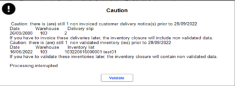

In addition to the document checks seen previously, the process also controls the document type settings.

If they differ from standard settings, messages may be displayed and an alert will also be set in the event log.

In the case of an already scheduled inventory closure/snapshot a message alerts the user.

#### Viewing the Results

Viewing the Results

Back-Office > Administration > Event log > Log query

Multi-criteria search

All the processes (creation, deletion, revaluation) are logged to the event log.

The search for records relating to the creation of inventory closures and snapshots can be performed in the multi-criteria screen, by selecting one of the following values for the Level 3 :
- Create inventory closures – P13
- Create inventory snapshots – P17

Processing report

After processing, two records are created in the event log.
1. The first record is created upon the creation of the task. The notepad contains the launch criteria defined in the wizard.
2. The second record is created upon the creation of the closure/snapshot. The notepad contains the results of the execution.

Anomalies linked to document settings

The event log includes a section called CAUTION - INCORRECT setting that details the name of the document type, as well as the settings for decreased and increased inventory. If for this document type, only the PHY (physical) counter is present (plus or minus sign), a message indicates this error. As the PHY counter is calculated from other counters, if it is the only counter entered, the document type in question will not be included.

Error status

The Error status will be displayed in the case processing is interrupted because of an exception or a functional anomaly in order to easily identify unsuccessful processes.

#### Managing and Using an Inventory Closure or Snapshot

Managing and Using an Inventory Closure or Snapshot

View an inventory snapshot

Back Office > Inventory > Processing > Inventory snapshots > Snapshot list

Back Office > Inventory > Processing > Inventory snapshots > Snapshot detail

These two commands are used to view an inventory snapshot::
- The Snapshot list command displays the list of inventory snapshots available for each warehouse. Double-click on a line to access the details of the items in the relevant inventory snapshot.
- The Snapshot detail command allows you to view directly the line details of the inventory snapshots for every warehouse and every item.

Export an inventory snapshot

Back Office > Data exchanges > Data export > Export inventory snapshots

This command is used to export inventory snapshots, if the appropriate access right was granted to the users.

Delete an inventory closure or snapshot

Back Office > Inventory > Processing > Inventory closures > Delete an inventory closure

Back Office > Inventory > Processing > Inventory snapshots > Snapshot list

These commands display the list of inventory closures/snapshots available for every warehouse.

Select the element to delete with the space bar, and click the [Delete] button.

If you want to delete all the elements displayed, use the [Select all] button.

Note that a check is performed to ensure that no task, already scheduled, is deleted.

Modify the valuation of an inventory closure

Back Office > Inventory > Processing > Inventory closures > Valuation modification

This command displays the list of available inventory closures. Double-click the closure you want to process to display the creation wizard described previously. Please note that only step 2 can be modified so that you can change the valuation of the inventory closure selected.

Use an inventory closure or snapshot

Back Office > Inventory > Query > Dashboard > Standards tab

Back-Office > Inventory > Query > Inventory Cube > Additions tab

Inventory closures and snapshots are accessed in inventory cubes and dashboards, using the Inventory snapshot and/or Inventory closure criteria.

To view the quantity of the inventory snapshot, you must define the layout of the presentation used by adding the MIL_PHYSIQUE field to the available columns.

Moreover, note that the Closing date field displays dates for optimized inventory closures in blue to differentiate them from the others as in the example hereafter:

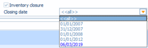

### Valuation of Transfers

Valuation of Transfers

Transfer valuation is based on the following elements:
- Transfer valuation: definition of applicable rules specific to every store (see “Rule Settings” in the section below.)
- Management of subsidiaries: application of valuation options based on information included in the subsidiary record (see “Valuation of Transfers in Subsidiaries” in the section below.)
- Settings defined in the document type: application of the settings of the document type (see “Document Type” in the section below.)

The price search is performed in the following order:
- Check whether a transfer valuation rule applies if the option is active.
- If no price is found in the rules, the settings defined in the subsidiary record of the sender store will apply.
- If no price is found via the management of subsidiaries or stores not linked to a subsidiary, then the valuation method defined in the document type will be taken into account.

Settings for Transfer Valuation

Transfer valuation is based on the rules defined (such as the possible application of price lists, application of a discount or an increase, etc.) via a store trigger with a scope of use concerning the valuation of transfers.

Please note!

These settings are not taken into account when generating Transfer Requests (DTR) when entering an E-commerce order from the Back-Office and from Cegid Retail Live Store.

Company settings

Back Office > Administration > Company > Company settings > Commercial management > Inventory

The following company settings are taken into account for transfer valuation (see Company settings - section Inventory .)

Inventory
- Use of the transfer valuation module: Tick this option so that the transfer valuation rules are sought and applied.
- Customized message for transfer valuation: When entering a transfer, the information message resumes, only in this case, the description of the rule (see section “How it works when creating a transfer” hereafter.)

Access rights

Back-Office > Administration > Users and access > Access right management

You must enable the access right for the Transfer valuation command (menu Settings 105, sub-menu Documents.)

Rule settings

Back Office > Settings > Documents > Transfer valuation

Click the {New] button and populate the following settings:

| Field | Description |
| --- | --- |
| Code + description | Enter the code and the description of the rule to apply. Note that if the company setting Customized message for transfer valuation is ticked, the message resumes the description specified here. |
| Store trigger | Selection of the store trigger to apply for this valuation. Triggers are created in Settings > General > Triggers > Store (Scope of use = Transfer valuation.) |
| Search for price list | Tick this option to search for the price list applicable for the sender store. If no price list is found, the default price will be used. |
| Proposed price | Selection list for the price to apply. |
| Discount percentage | The discount is applies to generic items and dimensioned items, regardless of the origin of the price returned. |
| Increase percentage | Enter the applicable rate. |
| Rounding code | Specify the rounding to apply. |

How it works when creating a transfer

When you create a transfer, a user message displays according to the calculation rule applied. These are the possible messages:
- “The price of the items in this document will be discounted by XX%” in the case of a discount.
- “The price of the items in this document will be increased by XX%” in the case of an increase.

Note that if the company setting “Customized message for transfer valuation” is ticked, the message resumes the description specified in the applicable rule.

Document type

Back Office > Settings > Documents > Documents > Types

The valuation method defined in the document type applies to the following types: Sent transfer, Transfer notice, and Received transfer. The Valuation tab of the document type includes the settings for the proposed price, with the possible use of price lists, and updated inventory prices.

Valuation of transfers in subsidiaries

Back Office > Basic data > Stores > Subsidiaries

You can specify in the subsidiary record via the valuation options for (sent and received) transfers, various valuation rules for stores (sender and recipient stores.)

Transfer type

The settings for valuation relate to the following transfer types:
- Intra-store transfer: the transfer concerns the same store with different warehouses
- Inter-subsidiary transfer: the transfer occurs between two stores linked to distinct subsidiaries
- Intra-subsidiary transfer: the transfer occurs between two stores linked to the same subsidiary

Valuation of sent transfers

The following options are available for the valuation of sent transfers:

| Field | Description |
| --- | --- |
| Price list | Tick this checkbox option to apply the purchases price list from the sender store. |
| By default | Selection list for the price to apply: either resume the settings defined in the document type “sent transfer”, or use other prices (Last purchase price, Last cost price, etc.) |
| Folder cost price | Selection of the price to apply for the folder cost price. |

Valuation of received transfers

The following options are available for the valuation of received transfer:

| Field | Description |
| --- | --- |
| Price list | Tick this checkbox option to apply the purchases price list from the recipient store. |
| By default | Same as sent transfer: The received transfer resumes the valuation of the sent transfer, except for the Folder cost price which is calculated based on the document type or the company settings. For other values, the valuation of the received transfer is recalculated to apply the selected price. |
| Transfer notice | Tick this checkbox option to move to the transfer notice linked to the received transfer the valuation of that transfer. |

Cost group calculation and Inventory update

According to the transfer type:
- If the cost price option in the database is linked with the Automatic calculation of cost price option, you choose to calculate automatically the cost price of the received transfer.
- Inventory prices in the recipient store are updated according to the selected information.

### Margin Correction

Margin Correction

The return of an item to a store that did not generate an inventory movement for the item and for which no price information is available in the price list record will generate a zero value (lines and inventory) for the LPP, WAPP, LCP, and WACP, as well as for the transfer price and folder cost price.

This same item will then show a 100% profit margin when it is sold. This is incorrect.

The margin correction functionality enables you to modify these values.

Required settings

Defining the calculation rule for transfer prices

Back-Office > Settings > Management > Transfer price > Rule

Transfer prices are calculated according to the settings defined in the rules for transfer prices.

Managing transfer prices by store

Back Office > Basic data > Stores > Stores

The store must support transfer prices in order to use this functionality. Therefore, the Transfer price management option must be ticked in the Contact information tab of the Store record.

Managing access rights

Back Office > Administration > Users and access > Access right management

Access rights relating to the margin correction are available in menu Administration (106) > Maintenance > Correct margin.

How to correct margins

Back-Office > Administration > Maintenance > Correct margin
1. The screen displayed enables you to select the sales lines for which one of the following prices is set to 0: LPP, LCP, WAPP, WACP, transfer price and folder cost price.
2. Once the criteria are selected and the lines displayed on screen, select the lines you want to correct.
3. You have several options:
- Launch process directly :
1. Click the [Calculation of transfer price] button.
2. A message informs you when processing has been completed.

Update the values manually, record by record :
1. Click the [Calculation record by record] button.
2. The Correct margin screen will appear for each of the selected items.
3. Specify the new values.
4. If you want to update the inventory, select the Update inventory prices option.

The process can be scheduled :

Focus on the "Correct margin" screen

The Correct margin screen displays two panes, one for Purchase prices and Cost prices, and the other for Transfer prices. These two panes are described below.

Purchase price/Cost price

This button is used to move the displayed value from the Inventory prices field to the Modified prices field.

This button allows different actions depending on its name:

- Cost price calculation from cost groups : Is used to calculate the LCP price based on the LPP price and on costs/cost groups specified for the item and store in the sales line.
- Initializing the WACP from the LCP : Is used to specify the Weighted Average Cost Price based on the Last Cost Price.
- Folder CP calculation : Is used to update the Cost price in the folder currency.

Transfer price

The fields below are stored in the document line and are recalculated based on the configuration defined for transfer price rules (go to Settings > Management > Transfer price > Rule.)

The store must support transfer prices in order to use this feature. Therefore, the Transfer price management option must be ticked in the Contact information tab of the Store record.

For each field displayed in this pane, this button is used to recalculate the values based on the settings defined in the calculation rules for transfer prices.

### Recalculation of WAPPs

LPP/WAPP Indicators

This process involves recalculating the WAPP and LPP values of inventory based on the movement history available in Cegid Retail Y2.

Creating a recalculation method for WAPPs

Back Office >: Administration > Maintenance > Recalculation of WAPPs

To create a WAPP recalculation method, click the [New] button. A window will open allowing you to set recalculation options for WAPPs.

Characteristics Tab

| Fields | Description |
| --- | --- |
| Method | The “Method” field enables you to select the desired calculation method: Calculates the WAPP or the average of inventory inputs. Regardless of the method selected, we recommend running the operation as a scheduled task when there is a high number of items. “Recalculation of WAPPs” method: Consists in recalculating the actual WAPP for items per warehouse from all movements impacting the WAPP or physical inventory. The operation may take some time according to the number of items and warehouses to process, and the volume of movements in the folder. The document types are not selected by the user. They come from the analysis of document settings performed by the application. When using this method, the physical inventory will be calculated to enable the weighted calculation. It will be saved in a new inventory simulation field: “GQ_PHYSIQUESIMU”. If it is different than the actual physical inventory, a warning message will appear in the processing report (Notepad tab). “Average on inventory inputs” method: Consists in updating the WAPPs (by calculating the weighted average purchase prices for the inventory input movements,) and the LPPs (by retrieving the last purchase price.) Note that calculating WAPP and LPP must be done separately. WAPP calculation method If “Qty in stock + Doc qty” is 0, the WAPP is updated by the document NUPEXT (Net Unit Price Excluding Taxes). LPP calculation method The inventory LPP will be updated by the NUPEXT for the last document entered. This method is less precise, but quicker. Document types taken into account are selected by the user. For example, the user may perform a calculation taking only supplier receipts into account. The WAPP thus recalculated is the approximate WAPP. Note that only the WAPP and LPP for inventory will be updated through this calculation. The document WAPPs and LPPs cannot be changed. |
| Scheduling | Processing may be started directly, or even scheduled on a task server via the [Schedule this task for execution on the server] button in the Secheduling section. Please note! Depending on the selected calculation method and volume of data processed, we strongly recommend scheduling this process. |

Notepad tab

A report is provided in the Notepad tab.

Starting the calculation in real or simulation mode

Back Office > Administration > Maintenance > Recalculation of WAPPs

The process is started with the [Launch the process on this workstation] button.

Real mode

Uncheck the Simulation option. The WAPPs and LPPs will be updated directly by the recalculation operation. If the “Recalculation of WAPPs” method is used, an event will be added to the processing report for each WAPP or LPP changed.

Simulation mode

Check the Simulation option. This recalculation method will not directly update the GQ_PMAP and GQ_DPA fields. The recalculated values will be saved in new fields: GQ_PMAPSIMU and GQ_DPASIMU.

In this case, the [Validation of simulation] button enables you to copy the simulation WAPPs and LPPs to real WAPPs and LPPs.

This step must be done before entering new purchase documents.

This button enables you to re-initialize item simulation counters.

Remarks
- The calculations may be done in simulation mode with both these methods. The new fields of GQ_PMAPSIMU and GQ_DPASIMU will give the calculated values.
- Note that the GQ_PHYSIQUESIMU field also corresponds to the calculated physical inventory. If it is different from the actual physical stock, a warning message will appear in the processing report.
- In simulation mode, validating the simulation will not update the actual inventory (the GQ_PHYSIQUESIMU field will not be copied to GQ_PHYSIQUE). If necessary, you may use the inventory adjustment module to re-establish a consistent inventory.

Miscellaneous

Recalculation function Integrated with item merge process

Back Office > Administration > Maintenance > Merge items > Create a merge

This command gives you the opportunity to update the WAPP and the LPP when merging items. The process involves recalculating WAPPs and LPPs values of inventory based on the movement history available in Cegid Retail Y2. Any movements not included in Cegid Retail Y2 that had an impact on the initial inventory are not taken into account.

Access rights

Back Office > Administration > Users and access > Access right management

You can authorize or prohibit the access to this feature in Administration > Users and access > Access right management, by enabling the Recalculation of WAPPs option in menu Administration (106) > Maintenance.

Movements taken into account

Movements taken into account are those impacting:
- Physical inventory and inventory configured in document type (Inventory tab.) The Inventory to decrement or Inventory to increment fields show “PHY” for Physical.
- The WAPP or LPP, and those configured in document type (Valuation tab), and more specifically in the Valuation section in inventory records.

Only movements with a non-null quantity will be taken into account.

The WAPP or LPP values will be recalculated for all open warehouses.

### Priority Depletion

=> See also procedure 392 (Depletion Management at Checkout)

Settings and Operation of Priority Depletion

This option is available for sales documents, and determines the order in which the warehouses of a store will be used to deplete stock, especially in accordance with inventory and the type of documents.

Settings for Priority Depletion

Enabling priority depletion for relevant sales documents

Back Office > Settings > Documents > Documents> Types
1. In the right part of the screen, select the document type to configure. This document must be of type Sale, information specified in the Flow type field, in the General tab.
2. Open the Inventory tab and select the Priority depletion checkbox option.

Please note!

This option is available only if the Inventory on shortage calculation field is supported, i.e. set to "Physical" or "Available".
1. Check the Override shortage checkbox if you want to deplete inventory in warehouses negatively.

Configuring warehouses for inventory depletion

Back Office > Basic data > Stores > Stores

Note that the priority depletion can only be done on Sales/Reserve and/or Consigned stock (if conditions apply).

This does not work with Isolated sales, Stockroom and Loan type warehouses. This information can be checked in the Warehouse record > tab Contact information > field Type.
1. Open the Store record and go to the Linked Warehouses tab.
2. Just move the warehouses to deplete to the right side of the screen.
3. Use these buttons to sort the warehouses in the desired depletion order.

Stock depletion according to item type

If the store has several warehouses of type Sales/Stockroom, the warehouses will be considered according to their ranking in the store record. The warehouse where inventory will be depleted has enough stock to serve the entire document: so inventory will be depleted in this warehouse only.

Consigned items

All Sales/Stockroom type warehouses are analyzed until one is found with enough stock to satisfy the full quantity entered:
- If a warehouse is found, inventory will be depleted.
- If none of the Sales/Stockroom warehouse types has enough stock, then the consigned warehouse will be analyzed. The latter will be used for depletion, regardless of whether or not there is enough stock to satisfy the total quantity requirements entered.

Non consigned items

All Sales/Stockroom type warehouses are analyzed until one is found with enough stock to satisfy the total quantity entered:
- If a warehouse is found, inventory will be depleted.
- If none of the warehouses of type Sales/Stockroom has enough stock, then the consigned warehouse will be analyzed;

Documents not concerned by priority depletion

Priority depletion is not supported for purchase documents, transfers, special inputs and outputs. Therefore, the warehouse of the line will be:
- The default warehouse for inventory input for a firm document
- The consigned warehouse of store in the case of a consigned document

### Inventory Query

Inventory Query

You can run an inventory query for an item in various ways using various menus in either Back Office or Front Office. This document lists all of the query options available.

The access rights concerning inventory query are located in Menu Inventory (103). In Inventory/Query you can authorize or not salespeople the use of the commands presented and detailed in this topic.

Item availability

Item Availability

Back Office > Inventory > Query > Item Availability

Front Office > Management > Inventory > Item availability

This option allows you to display various inventory indicators for items. This can be done by store in the case of single-warehouse mode, or by warehouse in the case of multi-warehouse mode. Several selection criteria, as well as presentation formatting offer the option to view warehouse physical stock, current orders (fields in the DISPO table), etc.

Please note!

Since there are no inventory counters provided for delivery notices and transfer notices, user-defined counters must be used (GQ_QTE1 to GQ_QTE4).

Note that the layout of the item availability is different depending on whether to the Use the record in the Back Office company setting (available in section Commercial management > Inventory) is ticked:

| Button | Option checked | Option not checked |
| --- | --- | --- |
|  | Clicking the [Item properties] button will open the item record in read-only mode. | Clicking the [Item properties] button will open the item record. |
|  | Clicking the [Open] button or double-clicking on a line gives access to the inventory flash record. | The [Open] button or double-clicking on a line gives access to the following records: If the item is one size only, the Available item window opens, enabling you to view all stock information. If the item has dimensions, the item record will open and the Dimension tab displays inventory per store. |
|  | Clicking the [Details] button will display the following records: If the item is one size only: the Available item window opens, enabling you to view all stock information. If the item has dimensions: the item record will open and the Dimension tab displays inventory per store. | Non available |

Note that no inventory record exists when you create an item record. Inventory item records are created when information from the inventory record is to be entered: receiving, customer order, minimum stock, etc. In this case, all information that can be displayed from inventory records are available for multi-criteria.

Item availability by location

Back-Office > Inventory > Query > Item availability by location

Front Office > Management > Inventory > Item availability by location

It is available in multi-warehouse mode and displays the item inventory by location, reflecting the availability of the item by warehouse.

Double-clicking the line will display the multi-criteria function for item availability by warehouse. The item and store are entered by default here. Information displayed is the same as in the standard item availability function (as seen above.)

Inventory flash query

Back-Office > Inventory > Query > Item flash (inventory)

Front Office > Management > Inventory > Item flash (inventory)

Choice of the item to view

This command will open the Store inventory window which allows users to view an inventory flash using the following search methods.
- Search by item ode or barcode: Enter the item code or its barcode in the Item field, then click the [Validate] button to display the Inventory flash query window.
- Search in catalog: Click the [On catalog] button to open the item multi-criteria search. Double-click the item line of your choice to display the Inventory flash query window.
- Search by picture: Click the [Picture] button to open the item photo catalog. Double-click the item photo of your choice to display the Inventory flash query window.
- Search item availability: Click the [On available] button to open the list of available items per store. Double-click the item line of your choice to display the Inventory flash query window.

Zoom on the Inventory flash query window

Once the item selected, the Inventory flash query screen displays the following pre-entered information:
- Store: indicates the user's default store
- Warehouse: this field is displayed for multi-warehouse environments only. A warehouse can be entered automatically if you select a record from the multi-criteria function that displays inventory by warehouse
- Item: This field is populated with the item selected from the multi-criteria screen, or from the item search sales receipt.
- Dimension: This field is populated if the user selected a SKU either by scanning it or by selecting it from a multi-criteria screen.
- Item photo: Is displayed only if it exists in the item record. Moreover, to display an item photo and avoid slowing down folders which do not manage item photos, the With photo of the item company setting must be activated in Administration > Company > Company > Company settings > Commercial management > Inventory (Inventory flash query section.)

Several buttons are also available:
- The [Dimensions] button allows you to return to the selection of item dimensions. To view item inventory, double-click on the desired dimension.
- The [Inventory] button displays details of the physical inventory of the item. Note that to specify warehouses to be added to store inventory queries, you need to check the Considered in the inventory of my store option in the Contact Information tab of the Warehouse record (.) The [Inventory in other stores] button displays the inventory for the item in the other authorized stores. The inventory counters for the warehouses are totaled to display the store inventory. To exclude certain warehouses from the count, check the Inventory visible to other stores option in the Contact information tab of the Warehouse record.
- The [Selling price] button allows you to display the item prices within the store. You will get the same information by clicking the View selling prices in the inventory record. The [Check the price] button allows you to access the price list justification reasons. Note that this button is available only if the Check the price concept is enabled in the Access right management > Sales receipts (107) > Access rights > Miscellaneous.

Inventory flash query settings

Back-Office > Inventory > Query > Flash query settings

The information contained in the flash query may be configured as you like. However, note that the access rights defined for the user will determine whether or not these values are displayed (purchase prices will not displayed if the user has not been granted the corresponding rights.) You can decide to display information concerning:
- Inventory: supplier orders or customer reserved items
- Selling price: the current price or selling price details
- Purchase price: purchase price or last purchase price

Configuring inventory information

First, select the type of information you want to configure by clicking the [Inventory] button, (Selling price] or [Purchase price].

Then click one of the None type fields. You may configure the following options in the settings window:

| Fields | Description |
| --- | --- |
| Type | Select Calculated value to display a value. The horizontal separator enables you to create a separating line in the list of values. |
| Description | Description corresponding to the value displayed |
| Added values | Counters whose values are added up in order to calculate the value |
| Subtracted values | Counters whose values are subtracted in order to calculate the value |
| Text color | Display area text color Also allows you to distinguish certain values better. |
| Background color | Display area background color Also allows you to distinguish certain values better. |
| Zoom on type | Allows you to select the document type. When viewing, an ellipsis is displayed to allow you access the detail of the movements relating to the specified document type. |

Access inventory flash from sales transaction entry

Front Office > Sales receipts > Sales > Enter transaction

There are several possibilities in Front Office to view item inventory:

The item flash inventory is also available using [Zoom/Show inventory for item] button.

The [Other actions/Item flash] button gives also access to the Inventory flash of the entered item.

Analysis

The following dashboards are proposed for inventory:
- Inventory standard dashboard
- Inventory advanced dashboard

### Inventory Age

Inventory Age

Back-Office > Inventory > Query > Inventory age

Knowing the age of you stock of items allows you to better value them and apply appropriate discounts.

This feature is aimed at finding out the age of every item for all the stores , by taking into account all the sales made over the period.

Processing results are stored in a temporary table. The user may either
- Build or complete the table by launching a new calculation.
- Or, view the calculated information using selection criteria.

Please note!

The calculation is performed successively for each item with a non-zero stock. This calculation may be long-lasting for huge folders. You should run this process outside the sales periods of the stores.

Launching the calculation

Back-Office > Inventory > Query > Inventory age > Calculation

The multiple criteria allow you to launch the process by limiting the number of items to be taken into account;

Just remind: Only items with a non-zero stock are taken into account.

This process includes:
- Positive and negative sales (FFO)
- Supplier receipts and returns (respectively BLF and BFA)

This method does not rejuvenate inventory through inter-store transfers.

When launching a new calculation, information relating to the same items is deleted.

The calculation is performed per year, over the 4 years prior to the current one; an accumulation over the previous years is also performed.

Results

Back Office > Inventory > Query > Inventory age > Dashboard

This lookup screen displays the temporary table with all the calculation results.

The display can be limited to the day’s calculation through a filter on the criteria available in the Advanced tab.

Example : Date of calculation > Greater than > mm/dd/yyyy

The resulting dashboard can be printed or exported to Excel. The valuation of each item line is an average of the year’s purchase prices.

Example :

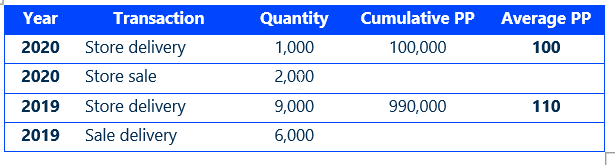

## Sales Pricing & Promotions

### Sales Conditions

#### Contents

=> See also procedure 279 (Algorithm)

=> See also procedure 289 (Setup Optimization)

=> See also procedure 291 (CBS - Ignore Application of Sales Conditions)

=> See also procedure 342 (BOM Management in Sales Conditions)

=> See also procedure 399 (Sales Conditions with Benefit type “Loyalty Points")

Sales Conditions - Contents

The management of sales conditions is an optional module in Cegid Retail Y2. This is used to manage promotions after having analyzed the items of the sales receipt according to their context (store, period, customer, etc.)

Sales conditions are configured to apply once the process of entering items on a receipt is completed.

Examples of sales conditions:
- 2 pairs of trousers purchased for €15, instead of €10 each.
- When 2 items are purchased from the E05 collection, the third item can be purchased for €1.
- 2 products purchased from the “AROMAS” category for a minimum amount of €50 = 10% discount on an item from the “TROPICAL ISLANDS” category.

Each rule defines one and only one condition.

Please note!
- Sales conditions are not appropriate to set sales, and can be used only at cashing (in documents of type FFO.)
- Items managed with serial numbers or in batches cannot be selected in sales conditions.
- Sales conditions only work with integers; decimals are not handled.
- The sales conditions can only be calculated for sales made with third parties of type CLI (Customers.) Third parties of type PRO (Prospects) are not taken into account.

Settings for application rules
- General tab
- Conditions on lines/Conditions on receipts tab.
- Conditions on customers tab
- Benefit tab
- Benefit tab - Discount type

Additional setups
- Store record settings
- Alert message for gift certificates
- Multi-level management
- Sales conditions based on a list of items taking into account the concept of available inventory

Simulation tool
- Step 1: Simulate a document
- Step 2: Simulate a calculation
- Reporting

Additional information
- Applying sales conditions to receipts with null totals
- Combining sales conditions
- Order in which sales conditions are applied
- Calculation algorithm for sales conditions
- Discount management
- Storing sales conditions

Management of sales conditions at checkout
- Summary of screens available on cash register
- Printing sales conditions for carts on hold
- Operating in standalone mode

Examples of settings defined for sales conditions
- Discounts on items of the grouping
- Reduced price for X items bought
- Third item at €1
- Reduced price for X items bought from the same category
- X items bought, the additional item is free
- Gift offered
- Gift certificate offered
- Gift to select from a list
- Progressive discount based on the quantity purchased
- Doubled loyalty points
- Customer's birthday discount
- Discount on similar item

#### Settings for Sales Conditions

##### Settings for Application Rules

###### General Tab

Applications Rules: General Tab

Back Office > Sales > Sales conditions > Rules

This tab is used to define which rules will be applied to the current receipt.

Click the [New] button to create a new rule.

| Fields | Description |
| --- | --- |
| Sales condition | Sales condition code and description |
| Close | Checkbox used to disable the condition (temporarily or not) |
| Restriction categories | The latter will limit the display of some data depending on users. You can then decide whether a user should view certain sales conditions. If the user has access only to restriction category X, only the sales conditions relating to the category the user is entitled to will be used. Restriction categories are created in Administration > Users and access > User restrictions > Restriction categories (refer to User restrictions .) |
| Type of sales condition | Is used to define conditions of type “Line” or “Receipt" with the objective to use them in a cumulative way. Depending on the selection made, the following two tabs will be displayed. Conditions on lines or Conditions on receipt. For a same receipt, you may have X sales conditions of type Line but only one condition of type Receipt (e.g. for a receipt with 4 items, you can have at most 4 conditions of type Line +1 condition of type Receipt.) This also works per level, i.e. for level 1, you can have X conditions of type Line +1 condition of type Receipt, and so on for the next levels. Note that sales conditions with a discount type (in the Benefit tab) is set to On sales receipt are considered as sales conditions of type Receipt. |
| Level | This option is available if the Multi-level management company setting is ticked in Commercial management > CRM. This option triggers cascading applicable sales conditions. Sales conditions are calculated by level (level 1, then level 2, etc.) |
| Application period | This field defines the period during which the rule is to apply. |
| Frequency | A frequency or periodicity defines a time or date range that can be used in sales conditions (refer to Periodicities .) The periodicity can be created by using this button, or entered directly via Settings > General > Periodicities. |
| Exception periods | This area is used to manage exclusion periods for the sales condition. Click this button to open the "Exception periods" window. Click this button to erase all the exception periods defined in this table. |
| Currency | The rule will only be applied in stores that use the same currency as the currency configured in the rule. Therefore, in order to apply the same sales condition to stores that use different currencies, you will need to create as many rules as there are currencies. |
| System | To ensure that amounts are managed consistently, a rule only applies to documents included in the same system: Tax excl. or Tax incl. Please note! If the tax inclusive system is used, customers configured for the tax exclusive system will not be able to benefit from the sales condition. In the same way, if the tax exclusive system is used, only customers configured for the tax exclusive system will be able to benefit from the sales condition. |
| Markdown reason | Sales conditions must be linked to a markdown reason of type Sales condition discount . Markdown reasons can be created using this button, or entered directly in Settings > Front Office > Markdown reasons. |
| Summary of application rules/benefit | Enables you to very quickly view allocation conditions of the defined rule. |

###### Conditions on Lines/Conditions on Receipt Tabs

=> See also procedure 307 (Exclusive Rules)

Application Rules: Conditions on Lines/Conditions on Receipt Tabs

Back Office > Sales > Sales conditions > Rules

This tab allows you to check the receipt lines in order to search for the applicable rules. Some of the fields described hereafter will be displayed or not, depending on the tab actually used - Conditions on lines or Conditions on receipt . The tab displayed is subject to the selections made previously in field Type of sales condition (see General Tab ).

General Tab

Header

| Fields | Description |
| --- | --- |
| Exclusive rule on lines/receipts | Option available in the Conditions on lines tab. According the exclusive rule selected: Lines: is used to exclude the other line conditions. This line condition will be the only one applicable; it cannot be combined with other line conditions. Receipts: is used to exclude receipt conditions. Both options can be checked. In this case, the condition cannot be combined with another. |
| Consider free items | This option enables you to take into account free items when calculating sales conditions. Just remind: free items are items for which the Item for free at register option is ticked in their records. This option applies whatever the type of condition on items: trigger or grouping. If the benefit generates a discount on the cheapest item, the free item will not be concerned. |
| Consider items with no line discount | Option available in the Conditions on lines tab. If this option is ticked, item record property Line discountable, available in the item record, is not assessed in the triggering calculation of the sales condition. All items are taken into account according to the value of the Condition field (as explained hereafter:) Applicable to all items: all items are taken into account, as the item property is ticked or not. Applicable to non-discounted items: only non-discounted items of the selling line are taken into account for the calculation of the sales conditions, as the item property is ticked or not. Applicable to discounted items: only discounted items of the selling line are taken into account for the calculation of the sales conditions, as the item property is ticked or not. Option supported in standalone mode. Application example: 30% for 2 items and more, on the most expensive item concerned by the sales condition. Option not enabled: The sales condition will not be triggered if the item is not line discountable. Option enabled: The sales condition will be triggered differently: One of the two items is not line discountable: the remaining line discountable item will be discounted, even if it is not the most expensive item. Both items are not line discountable: the sales condition is triggered but does not apply any discount as both items are not discountable. One of the two items is not line discountable, and it is the most expensive one: the remaining line discountable item will be discounted. |
| Consider items with no invoice total discount | Option available in the Conditions on receipt tab. This option operates differently depending on whether the item is subject to a line discount (RL), a total invoice discount (RP), or is not discountable (NRL, NRP): Option supported in standalone mode. Application example: Settings for condition: Condition triggered: From a receipt amount >= €20 Benefit: €10 off for the total amount of the receipt. Contents of receipt 1: 2 items worth €10 each, one item is not subject to a total invoice discount Option not enabled: the item that is not concerned by the total invoice discount is not taken into account to trigger the sales condition. The condition will not apply since the calculated amount of the receipt is inferior to the triggering threshold (€20). Option enabled: the item that is not concerned by the total invoice discount is taken into account to trigger the sales condition. The condition will apply since the calculated amount of the receipt is equal to the triggering threshold (€20); but the €10 discount only applies to the discountable item. Contents of receipt 2: 2 items worth €10 each, no item is not subject to a total invoice discount Option not enabled: same as receipt #1, the condition is not triggered. Option enabled: both items that are not subject to a total invoice discount are taken into account to trigger the sales condition. The condition will apply since the calculated amount of the receipt is equal to the triggering threshold (€20); but the €10 discount does not apply to any item because none of them is discountable . |
| Condition | You can manage sales conditions for already discounted items; for example. You can define that already discounted items can benefit from only 40% off whereas non discounted items can benefit from 60% off. To do so, select the appropriated type of application from the selection list. Please note that the selection Applicable on non-discounted items is impacted by the multi-level management feature (see Multi-level management .) |
| Maximize benefit | This option is available only for the following discount types (selected in the Benefit tab): On items of the condition X for Y, On additional items, On sales receipt. This option is aimed at limiting the benefit granted by the sales condition, according to the discount amount already granted for the line, so that you may manage a maximum discount applicable for each line. According to the base price of the item (discounts based on the gross price) or the net price of the cart (discounts based on the price taking into account discounts already applied), the discount granted will be limited by defining a ceiling for the total amount granted for a same item. The forced selling price is considered as a discount granted by the salesperson and processed the same way. In the case of a manual price change by the salesperson, this will be considered as the base price of the item. When the discount maximization is enabled, the Maximum discount column will be removed: The maximum discount amount will be applied automatically as compared to the price selected. An example of operation is described hereafter, below this table. |
| Combinable with line rules | Option available in the Conditions on receipt tab. This option is used to add additional benefits. For example, the customer can benefit from line rules combined with a discount of 10% on the receipt (loyal customer.) |
| Apply systematically | This option, proposed only if the benefit is of type “Gift” (refer to the Benefit tab ,) offers the possibility to apply the sales condition systematically. If the option is ticked, the Exclusive rules on lines/receipts options are disabled since they are not taken into account. Option recommended for multi-level management (refer to Multi-level management .) Please note! Sales conditions of the same level that are systematically applied, are no longer in competition each other: they all apply. However, sales condition of the same level that are not systematically applied are not selected. |

Example of operation with option “Maximize benefit”

Let us assume the following: a sales receipt includes an item with a base price of €100. A discount of 20% is applied to the cart (price list, salesperson...) i.e. a final unit price of €80 for the cart.
- A line sales condition of 20% is applied too.
- As well as a receipt sales condition of 50%.

| Maximization type | Base price | Cart discount | Cart net price | Line sales condition discount | Last net price | Receipt sales condition discount | Last net price |
| --- | --- | --- | --- | --- | --- | --- | --- |
| Without maximization | 100 | 20 | 80 | 20% of 80 = 16 | 64 | 50% of 64 = 32 | 32 |
| Versus base selling price | 100 | 20 | 80 | 20% of 80 = 16 | 64 | 50% of 100 = 50 Discount already applied: 100 - 64 = 36 Therefore, the discount is 50 - 36 = 14 | 50 |
| Versus net price | 100 | 20 | 80 | 20% of 80 = 16 | 64 | 50% of 80 = 40 Discount already applied: 80 - 64 = 16 Therefore, the discount is 40 - 16 = 24 | 40 |

Conditions on items

This section available in the Conditions on lines tab, limits the use of the rules according to several settings, and in particular according to the entry grid of the conditions triggering the benefit (in the Benefit tab.) Note that after having completed the grid, if the conditions on items are modified, a message will display to inform you that the benefit grid will be erased. You will have to populate it again according to the new conditions on items.

Note:

If the Conditions on items option is not checked, in the Conditions on amounts section (explained below), only value The entire receipt will be proposed for the Calculation type field.

| Fields | Description |
| --- | --- |
| Item trigger | This field is available only if the Price/discount per grouping is not ticked. This trigger allows you to define the items triggering the condition. Triggers can be created using this button, or entered directly in Settings > General > Triggers. (Refer to Triggers .) |
| Price/discount per grouping | This option is available only for the following discount types (available in the Benefit tab): on items of the condition and gift . Tick this option if you want to define conditions with item groupings; then define the item grouping of your choice in the Item grouping field described hereafter. Note that if you enable this option, the discount type proposed in the Benefit tab will be limited to the following choices: on items of the condition and gift . Moreover, the Select item criterion does not allow the In the receipt sequence value. |
| Item grouping | This field is available only if the Price/discount per grouping option is ticked. It allows you to handle benefits by item groupings. The groupings proposed are based on various values of the item record, such as user-defined tables (e.g. department or category), user fields (only those of type Selection list are proposed), item statistics 1&2, the item group (refer to Benefit specificity of type “Item group” ), and even one or more items (if you select the Generic item option.) According to the item grouping selected, the benefit granted to the customer must be entered in the Benefit tab (refer to Entry grid for the conditions triggering the benefit .) Note that the item grouping must be selected before completing the Benefit tab; otherwise, a blocking message will be displayed. |
| Presence of a minimum quantity in each grouping | This field is available only if the Price/discount per grouping option is ticked. This option is used to combine several triggering conditions such as the purchase of a shirt and a pair of trousers. In order to benefit from a condition, this allows cumulating several elements of a grouping, to be defined in the Benefit tab (refer to Entry grid for the conditions triggering the benefit .) If quantities are handled, the minimum quantity entered in the grid for the conditions triggering the benefit will apply. In the example below, the condition will be met with 1 item from department PA1 and 2 from department SO1. The condition will not be triggered if one item is missing. |

Condition on quantities

| Fields | Description |
| --- | --- |
| In multiples of | Option ticked: The sales condition is subject to a quantity multiple. The benefit applies to all groups of X items (X being defined in the In multiples of column of the entry grid of the conditions triggering the benefit.) Option not ticked: The sales condition is subject to a minimum quantity. The benefit applies from a minimum purchase quantity (quantity being defined in the Minimum quantity column of the entry grid of the conditions triggering the benefit.) Whether the option is ticked or not, you must fill in the entry grid for the conditions triggering the benefit in the Benefit tab. Example of operation: A sales condition triggers for a quantity of 2 items a discount of 10% The sales receipt includes 5 items, you will get the following: Option ticked (with a multiple of 2 defined in the entry grid for conditions triggering the benefit:) items 1 and 2 trigger the condition and a 10% discount is granted for item 1. Items 3 and 4 trigger the condition, and a 10% discount is granted for item 3. Item 5 does not trigger the condition and remains available for a possible other condition. Option not ticked (with a minimum quantity set to 2 in the entry grid for conditions triggering the benefit:) items 1 and 2 trigger the condition and a 10% discount is granted for item 1. The other items of the receipt are “flagged” and are no longer available for other discounts. |
| Incentive number | This setting is optional and defines the number of items triggering the display of the incentive message defined in the Benefit tab (example of incentive message: Buy 2 items and get 30% off for the third.) Please note: If this setting is set to 0; the incentive message will never display. If the number is reached, the message is not displayed anymore, and the sales condition will apply. |

Condition on amounts

| Fields | Description |
| --- | --- |
| Calculation type | This field specifies how to calculate the receipt. For example, if to benefit from the sales condition, the rule requires a purchase of €100: Entire receipt: the entire receipt must amount to €100. Set of submitted items: the items of the condition must reach €100. Each item; each item of the receipt must reach €100. Please note! If you have not checked the Conditions on items option (as mentioned before), only value the entire receipt is proposed for the Calculation type field. |
| Incentive minimum amount | This setting is optional and restricts the application of the rule to a receipt with a minimum amount. The incentive message (defined in the Benefit tab) will be displayed at validation of a document meeting the required incentive minimum amount (example of an incentive message: €100 spent = 1 gift worth €30.) Please note: If this setting is set to 0; the incentive message will never display. If the minimum amount is reached, the message is not displayed anymore, and the sales condition will apply. |

Condition on stores

The condition on stores section allows you to restrict the use of the rule to one or more stores. Note that the list of stores is automatically limited based on the configured currency.

| Fields | Description |
| --- | --- |
| Store trigger | This field specifies the stores triggering the condition (region, surface, etc.) Triggers can be created using this button, or entered directly in Settings > General > Triggers. (Refer to Triggers .) |

Condition on keyword

| Fields | Description |
| --- | --- |
| Keyword | Enter the keyword that will trigger the sales condition. To avoid any error, note that the keyword is automatically entered in uppercase. The keyword entered or scanned in the sales transaction entry screen is compared to the keywords present in each sales condition eligible for the customer. The entered value must be exact. When entering a sales transaction, you will use the [Other actions/Business operations/Keyword entry] button to access the keyword entry screen. There, you can add or remove a keyword, and view those already entered. You just have to enter or select the keyword to activate the benefit from the sales condition. |
| Scan is mandatory | In some case, the cashier should not be able to enter manually a keyword corresponding to an offer. These keywords should only be accessed by reading a flyer. In this case, tick this option. |

###### Conditions on Customers Tab

Application Rules: Conditions on Customers Tab

Back Office > Sales > Sales conditions > Rules

This tab is used to specify the customers for whom the rule must be applied.

Header

| Fields | Description |
| --- | --- |
| Conditions on customers | Tick this option so that the sales condition applies to customers according to the criteria you will define in this screen (also for loyal customers.) Note that if the customer, specified when entering a receipt, is fictitious, it will not be possible to apply a rule containing a customer-based condition, even if the Condition on customer checkbox is ticked.) |
| Customer trigger | The customer trigger enables you to define how the condition is triggered (region, birthday, etc.) Triggers can be created using this button, or entered directly in Settings > General > Triggers. (Refer to Triggers .) |
| Number of occurrences | The management of occurrences enables the condition to be applied according to the defined number of occurrences over a given period. The number of occurrences can be tested for several types of periods for referenced but non-loyal customers: Please note: The default value is set to 0 and makes this option ineffective. The specification of a trigger is not mandatory to enable the control of occurrences. |
| Period | Defines the polling period with fixed dates. Example: The customer comes to the store on January 21, 2014 to benefit from the sales condition limited to 1 occurrence from January 1, 2014 to January 31, 2014. The application controls that the condition has not been used yet for the customer over the given period. |

Loyal customers

These conditions can be applied to loyal customers:

| Fields | Description |
| --- | --- |
| Conditions on loyal customer | Tick this checkbox if you want to apply the sales condition to the customer involved in a loyalty program. |
| Loyalty program | The specification of a program is not mandatory to enable the control of occurrences. The customer must just be loyal; therefore his membership to a loyalty program with an active card is taken into account. These features are operational only for V2 loyalty. |
| Minimum number of points | This field refers to the number of points that may be set in a loyalty program. |
| Number of occurrences | The management of occurrences enables the condition to be applied according to the defined number of occurrences over a given period. The default value is set to 0 and makes this option ineffective. |
| Period | This field takes into account the various periods specific to loyalty: Based on your selection, an additional field will display to specify this period. |

Remarks about of management of occurrences

If there is trigger, it will be checked. If the customer is not listed, conditions will not be triggered. Two conditions may coexist, but will be applied the following way:
- The customer is loyal, but not referenced in the customer file: the application searches for conditions on loyal customers. (Note: A non-referenced loyal customer may be a walk-in customer who nevertheless has a loyalty card.)
- The customer is loyal and referenced in the customer file: the application searches for conditions on loyal customers.
- The customer is not loyal, but referenced in the customer file: the application searches for conditions on non loyal customers.
- The customer is neither loyal, nor referenced in the customer file: the condition is not valid.

It is therefore possible to share the application of a condition according to a customer and his membership in a loyalty program.

Examples for a same condition:
- Referenced and loyal customer who has not been benefiting from this condition for 3 months.
- Referenced and loyal customer who has not been benefiting from this condition for 1 month.

###### Benefit Tab

=> See also procedure 305 (Allocation of the Amount on the Items of the Condition)

Applications Rules: Benefit Tab

Back Office > Sales > Sales conditions > Rules

This tab allows you to configure the advantages earned by the customer in cases where the rule has been applied successfully.

Header

| Fields | Description |
| --- | --- |
| Discount type | This field defines the type of benefit that will apply; the selections proposed depend on the type of the sales condition, Line or Receipt (as defined in the General tab.) Click here to see all options proposed . |
| Deduct the amounts paid in | This option will work only for sales conditions with discount type Gift certificate . It allows you to specify the calculation of this type of sales condition when the customer pays with certain payment methods such as a credit note or a gift certificate of type Payment method. Consequently, if the customer pays with a payment method of that list, the amount of this payment method will be deducted in the calculation of the sales conditions. Example of a customer who has a gift certificate of €5 acquired during a previous sale: The customer makes a new purchase of €100, paid with a credit card. The customer returns the item; a credit note of €100 is generated. The customer makes a second purchase for an amount of €200. The customer can pay in 3 different ways: Case1: with the credit note (in full) - Generation of a gift certificate worth 5% of the remaining amount of the receipt, i.e., €200 - €100 = €100. (Gift certificate = €5.) Case 2: with the credit note + the gift certificate of type payment method , worth €5 - Generation of a gift certificate worth 5% of the remaining amount of the receipt, i.e., €200 - €100 € - €5 = €95 (Gift certificate = €4,75.) Case 3: Please note! Gift certificates of type Discount are automatically excluded, even if they are not displayed in the list. With the credit note + a gift certificate of €10 of type discount - Generation of a gift certificate worth 5% of the remaining amount of the receipt, i.e., €200 - €100 - €10 = €90 (Gift certificate = €4,50.) |
| Allocation of the discount amount on all items of the condition | This field is available only for a sales condition with discount type On items of the condition/On items of the grouping . If this setting is checked, the calculated discount amount is allocated to all the items covered by the condition. Please note! The discount amount remains the same, but this amount is allocated to all items proportionally (see Procedure 305 .) |
| On items of the condition | In the case of a condition with discount type Fixed price the option enables the following: Option ticked: the final amount of the items of the condition is the one specified. Option not ticked: the final amount of the receipt is the one specified. |
| Priority | This option defines priorities for the sales conditions, without taking into account the usual calculation algorithm . You decide which sales conditions will be applied in priority for the customer. This will work, if the Priority management company setting available in the CRM segment is enabled. Note that the default value is set to 1. |
| Lists of items | This field is available in the case of a discount of type Gift ; it is used to select the list of items that may be offered to the customer as benefit of the condition. This item is may also be based on inventory criteria (items managed in stock and or items with negative or zero stock.) These options may be checked when creating the list of items (refer to section Options relating to sales conditions .) Item lists can be created by the means of this button, or entered directly in module Basic data > Items > Item list. |
| Discount in % | This field is available in the case of a discount of type Gift ; it allows the customer to benefit from a discount percentage for one of the gifts of the list (i.e. benefit from 50% off for one of the items in the list.) Tick this checkbox to enter the discount percentage. This discount will apply to all the gifts selected. This option is not available if the Apply systematically option is ticked (refer to the Conditions on lines/Conditions on receipt tabs.) |
| Multigift | This option is available in the case of a discount of type Gift ; it is used to handle more than one gift in a list. Note that the number of gifts depends on the number of points awarded by the sales receipt, and on the value of each selected gift. You can select gifts up to the number of points awarded by the receipt. |

Entry grid for the conditions triggering the benefit

Entry grid format

This grid is to be populated systematically, whatever the setup of the condition. Based on the type of discount defined, this grid may contain one or more lines.

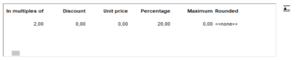

You can define there that the benefit is a discount percentage or an amount applied to each item. You can also define the items of the grouping set in the Conditions on lines tab. This benefit can be linked to a condition on quantities and/or on amounts.

The percentage-based discount can be rounded by selecting a value in field Rounded .

If the Presence of a minimum quantity in each grouping option is ticked (see section Condition on items in the Conditions on lines tab,) the minimum quantity must be entered in this grid.

This grid cannot be validated if it contains lines with an amount and a percentage of 0, otherwise the following error message will appear: "You have to specify an amount or a percentage" Note however that this prohibition is removed in the case of a condition with grouping, and if there is at least one line with an amount/percentage discount different from 0. This is to allow the setting of groupings which, for some, trigger the condition, and for others benefit from it.

Example
- The customer buys an item from an item category => triggers the sales condition.
- Discount on an item of another category => Benefit

“Category” means a grouping that can also be a user-defined table, or a user field of type List of values.

Description of available choices

Click this button to open the window for entering the quantity and/or amount ranges.

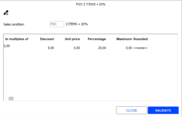

If an item grouping has been defined in the Conditions on lines tab, the first column will be named like the grouping selected (generic item, user field, department, collection, etc.) The grouping of type “Item group” is explained hereafter, in section “Benefit specificity of type Item group.”

| Choice | Description |
| --- | --- |
| Minimum quantity | Available only if Condition on quantity is ticked |
| Minimum amount | Available only if Condition on amount is ticked |
| In multiples of | Is displayed only if the option of the same name is ticked in the Conditions on lines/Conditions on receipt tabs. If the receipt contains fewer items than this quantity, the condition is not met. |
| Discount | Enables you to enter a discount amount (e.g. €2 discount,) plus rounding. |
| Unit price | Enables you to enter a fixed price (with a maximum discount, plus rounding) |
| Percent | Enables you to enter a discount percentage (with a maximum discount, plus rounding) |
| Maximum | Enables you to show tho maximum discount. |
| Unit value | In the case of a gift certificate or gift discount, you can indicate the face value of the gift certificate or the value of the gift. Example: If you enter 10, you may have a gift certificate for €10 or a gift valued at 10, to be selected from a list. |
| Value in % | This also corresponds to the face value of a gift certificate or gift, except if the value is not fixed, but a percentage of the amount of the items on the receipt triggering the sales condition. |
| Total price | In the case of fixed price discounts, this corresponds to final amount for items that trigger a sales condition (or a receipt, according to setting). Example: for a sales condition stipulating “2 items purchased = both at €10, you put 10 in the Total price column. And when the sales condition is calculated, the final sum of both will be €10, regardless of the initial amount of the items. |

Specificity of benefit type “Item group”

If you have selected a grouping of type Item group in the Conditions on lines tab, click this button to perform one of the following actions:

Creation of an item group

Click the [Access item group] button and populate the following fields:

- Description of the group: free input. If nothing is entered, the field is initialized with the description of the first item, thus allowing the quick entry of a group with a single item.
- Item table: Only one item code can be entered (generic or single item, service, assembly BOM.) If necessary, use the button displayed at the end of the Code field to search for the item code of your choice. Please note: to enter a dimensioned item, you must enter its generic item. The input order is retained when saving. However, the item entered, must not already be present in this group, or in another group of the sales condition; otherwise a blocking message will be displayed. Moreover, a non-blocking message will display if more than 100 items are entered for all groups of the sales condition. If you exit the inserted line without having entered an item, the line will be deleted even if it is the last line of the table. Once the entry validated, the group will be copied to the line of the benefit table where you can enter additional information for the line (minimum/maximum quantity, minimum/maximum amount, etc.)

Selection of a new item group

To change an item group already selected in the benefit table, in field Item group , click this button displayed at the end of the field. A window displays proposing the various item groups created so that you can select another group.

Deletion of an item group

Click this button to open the Item group window, and use one of the following buttons:

- Delete the entered item line.
- Delete the whole item group: First the benefit lines associated with the item group are deleted, then the group is deleted.

Item

| Fields | Description |
| --- | --- |
| All items | Specifies that the condition applies to all items of the condition. |
| Number of discounted items | Specifies the number of items for which a discount is granted. |
| Select item | Enables you to apply the discount differently, based on the selection made here. Example of a receipt with 4 items (A1 at €10, A2 at €40, A3 at €20, A4 at €30) for which a sales condition if the following type is applied: When you buy 2 items, you get 10% off for: The less expensive item(s): the discount is granted for A1 and A3 (the condition is used twice.) The most expensive item(s): the discount is granted for A2 and A4 (the condition is used twice.) In the receipt sequence: the discount is granted for A1 and A2 (the condition is used twice.) The less expensive item(s): the discount is granted for A1 and A4 (the condition is used twice.) This option is useful only it the condition is triggered several times on the receipt: indeed it grants the discount for the cheapest item of the group of the less expensive items, and for the cheapest item of the group of the most expensive items (it gathers the cheapest items: A1 and A3, and the most expensive: A2 and A4, and applies the discount for the cheapest item in each group.) In the case where the condition is triggered only once, the discount will be identical to the less expensive discount. |
| Number of iterations | This option, available for operations of type “line” only, defines the number of times the sales condition will apply. Examples for 2 iterations: Sales receipt with 15 items plus application of the following sales condition “ Buy 2,items, get the third item free”; tis condition applies twice at most, so that the customer has 2 items free for 4 items bought. Sales receipt with 5 items plus application of the following sales condition “Buy 1 item worth €100, get 1 gift”; this condition is applied only twice, so that the customer will be granted at most 2 gifts. However, conditions can be cumulative (according to the concept of exclusivity.) If there are two sales conditions: “Buy 2, get 3rd free” - 2 iterations are possible. “Buy 4, get 2 free” - 2 iterations are possible. These two conditions will fully apply for a sales receipt of 15 items: Twice for condition “Buy 4, get 2 free”, i.e., 4 items free for 8 items bought. Twice for condition “Buy 2, get 1 free”, i.e., 2 items free for 4 items bought. The customer will get 6 items free for 12 items bought. These two conditions will partially apply for a sales receipt of 10 items: Twice for condition “Buy 4, get 2 free”, i.e., 4 items free for 8 items bought. Once for condition “Buy 2, get 1 free”, i.e., 1 item free for 2 items bought. The customer will get 5 items free for 10 items bought. Note that in some cases, this field is grayed out and forced to 1 (the condition can only apply once on the receipt.) |
| Item grouping | In the case of a condition of type “On additional items/On items of the grouping", you can specify the items concerned in the item grouping. |
| Membership criteria | This option displays for conditions of type X for Y . If the customer buys 2 similar items, he will be granted a discount. Similar items are items with the same membership criteria that you can define here. |

Message

You can define two types of messages to be displaced at cashing.

Display the message when cashing

This message is displayed on the cash register when the sales condition is triggered, if the Show the detail of the selected condition option is ticked.

The message can be typed in or generated automatically. In the latter case, the message summarizes the sales condition, as in the example.

To display the message on the cash register, tick the Display the message when cashing checkbox.

If you want to generated it automatically, based on the settings defined for the sales condition, click the [Default message] button next to the Discount field.

If you want to type in your own text, enter it directly in the Discount field.

Otherwise if no message is defined to be displayed, only this information will be displayed in the payment grid.

Clicking this message displays the discount recap screen

Display the incentive message

The incentive message is displayed on the cash register only if the option is checked, and message specified settings.

An incentive message displays for the cashier so that the cashier may inform the customer on the sales conditions he is about to get, for example if 1 item is missing to benefit from the sales condition.

Example of incentive message:

3 items = 10% off 1 item missing to trigger the condition. Do you want to complete the receipt?

###### Benefit Tab - Discount Type

Benefit Tab - Discount Type

Back Office > Sales > Sales conditions > Rules > Benefit tab

This section describes all the options proposed for the Discount type field available in the Benefit tab of the sales conditions. This field defines the type of benefit that will apply for the customer; the selections proposed depend on the type of the sales condition (line or receipt as defined in the General tab.)

On items of the grouping

The discount applies to all items of the receipt, being part of the grouping selected in the Item section, up to the number of discounted items defined here.

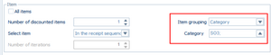

These items, as well as those used to trigger the condition, are then identified and are no longer usable by other sales conditions.

Moreover, items used to trigger the condition and being part of the grouping defined, will also be discounted.

It is therefore mandatory to select in the Item section, the items to discount by populated the two fields linked to the Item grouping (see screenshot above,) otherwise an error message will be displayed prompting you to enter this data.

Example of settings
- Discount on the Items of the Grouping

On items of the condition

Only these items will be impacted by the discount or the change in the selling price.

Examples of settings
- Reduced price for X items bought from the same category
- Progressive Discount Based on the Quantity Purchased

On additional items

Only items that do not satisfy the rule will be impacted by the discount or the change in the selling price.

Examples of settings
- Third Item at €1
- X Items Bought, the Additional Item is Free
- Gift offered

On sales receipt

All items are impacted by the benefit. In the case of a percentage, the calculation basis will take into account the receipt less the amount of other sales conditions. Example: a receipt worth €50, with a line sales condition of €10. The final amount will be €50 - €10 = €40 - 10 %

Example of settings
- Customer's birthday discount

None

No benefit will be granted to the customer. This type of rule is an incentive-based rule only; it allows a message to be sent to the customer, based on the previous conditions.

Gift certificates

The benefit will be gained in gift certificates. Therefore, it is necessary to create a new gift certificate via:
- Settings > Management > Register operations: creation of a register operation for which the Financial item type field is set to Gift certificate acquisition - sales condition in the Characteristics tab.
- Settings > Management > Payment methods: creation of a payment method for which the Type field is set to Gift certificate acquisition - sales condition in the Front Office tab.

Once created, these elements will be available in the Gift certificate field and the codes specified there will be used on the receipt if the sales condition is applied.

The value of the gift certificate is determined in the table displayed in the Benefit tab, expressed in amount or in percentage of the total amount of the items covered by the condition (by using minimum/maximum ranges or not.)

When using the gift certificate, if the type of use is Payment method, the gift certificate will not affect the calculation of the sales representatives' margins, in contrast to type Discount .

Upon receipt entry, when calculating the sales condition, the acquisition of the gift certificate will not appear on the receipt, but will be printed shortly after.

In the outstanding payment screen, the gift certificates of sales conditions will be displayed with loyalty gift certificates.

Example of settings
- Gift certificate offered

Gift

The customer is granted one or more gifts. Gifts are chosen from a list managed with a value per item. Points are calculated with the items required in the grouping. The number of points earned by the condition is 0.5 per item. The customer can choose an item worth 1 point:

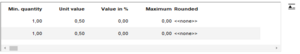

Moreover, you can also offer as a gift a discounted item (not for free) to be selected from the list of items. You must then specify the percentage of discount in field Discount in % :

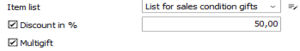

Note that a same list may be used for several sales conditions. The gift list may be visible and modified on this screen with the appropriate rights. The list includes the following information: code and description of the list, listed items with an estimate of the unit value for each item.

Example of settings
- Gift to select from a list

Fixed price

The customer may also benefit from a final fixed price. Two cases are possible. If in the Benefit tab, the On items of the condition field is:
- Checked: the final amount of the items of the condition is the one specified.
- Unchecked: the final amount of the receipt is the one specified.

In this case, the sales condition is exclusive. It cannot be combined with another condition (neither with type line, nor with type receipt)

Note that variances in rounding will be applied to 1 item of the receipt.

Example of settings
- Reduced price for X items bought

Loyalty points

=> See also procedure 399 (Sales Conditions with Benefit type “Loyalty Points")

This option is available only if the condition on loyal customer is enabled in the Condition on customers tab since the customer must be associated to a loyalty program. This allows the customer acquiring loyalty points on a sales condition. You can set in the Benefit tab a fixed number of points or a multiplying coefficient. When a sales receipt is validated, a line is added to the customer’s loyalty point counter. If two sales conditions of that type are applied, only one line is added to the loyalty point counter. Note: A user-defined export can extract this information to be processed by an ancillary software application

Example: The customer acquires 50 loyalty points for 2 items bought:

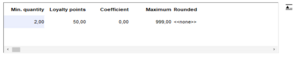

These points will be earned in addition to potential gains generated by loyalty rules.

The customer doubles the number of earned loyalty points for 2 items bought:

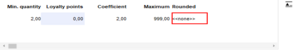

If the customer earns 50 points by the means of the loyalty program, this sales condition gives him 50 additional points.

If you had entered a coefficient of 1.5 instead of 2, the customer would have earned 25 points more.

Example of settings
- Doubled loyalty points

X for Y

If the customer buys 2 similar items, he will be granted a discount. Similar items are items that have the same membership criteria.

In the example hereafter, in the Benefit tab, you have the same department and the same collection:

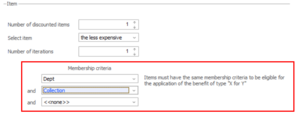

To offer the second item, just apply a 100% discount to a minimum quantity of 2:

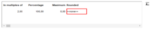

Note the following restrictions:
- A “non-discounted” item and a “discounted” item will not be eligible to the X for Y condition.
- Items from a gift benefit cannot increment the number of items bought.

Example of settings
- Discount on similar item

##### Settings in the Store Record

Settings for Sales Conditions in the Store Record

Back Office > Basic data > Stores > Stores > Miscellaneous tab

Overview of the “Choice” option

In the Sales conditions section, the Choice option allows, or not, to have the sales conditions validated by the salesperson at checkout.

In combination with the Display the message when cashing option (available in the Benefit tab for every sales condition,) it allows you to mix:

Benefit
- Sales conditions to be applied systematically
- Sales conditions for which the algorithm has selected the best-suited.

Each value proposed in this option, is detailed hereafter, as well as its impact at checkout.

Note the following points:
- This option can be modified in Basic data > Stores > Batch modification
- This information is sent in standalone mode, so that it can be taken into account the next time the settings are copied to the register.

Option 1: Manual selection of sales conditions

This option lets the salesperson, when cashing out, decide which sales condition will be applied. In this case, the Choice of sales conditions screen will be displayed:
- The left side of the screen displays all applicable sales conditions.
- The right side of the screen displays the preselected sales conditions.

Note if none of the selected sales conditions have the option Display the message when cashing ticked in the Benefit tab, then the Choice of the sales conditions screen hereafter will not be displayed.

Benefit

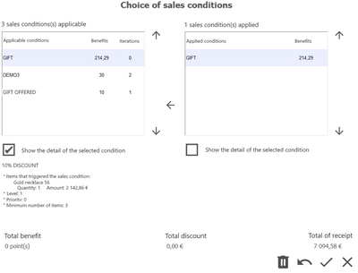

Option 2: Display applied sales conditions

This option allows the direct application of the eligible sales condition without any intervention from the salesperson.

In this case, the Choice of sales conditions screen displays the table of preselected sales conditions:

Note if all selected sales conditions have the option Display the message when cashing not ticked in the Benefit tab, then no table will be displayed in the Choice of the sales conditions screen.

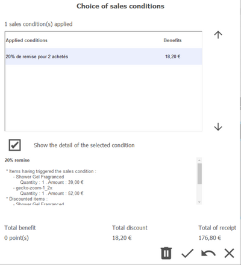

Option 3: Select from sales condition of the same level

This option already available in V19 is enabled only if the Multi-level management company setting is ticked in the CRM segment .

Multi-level management

CRM segment

This option allows you to display the sales conditions per level, if the following conditions are met:
- The selection table appears if the sales conditions are applicable but not selected.
- At least one of the selected sales condition of same level has the Display the message when cashing option ticked in the Benefit tab of the sales condition.

Please note!

Regarding the Display the message when cashing option available in the Benefit tab of the sales condition, you should be strongly advised to be consistent within each level: either all the sales condition of the same level have that option enabled or none of them. Otherwise, the displays will become more complex to understand.

Benefit

Upon cashing, the Choice of sales conditions screen will be displayed:

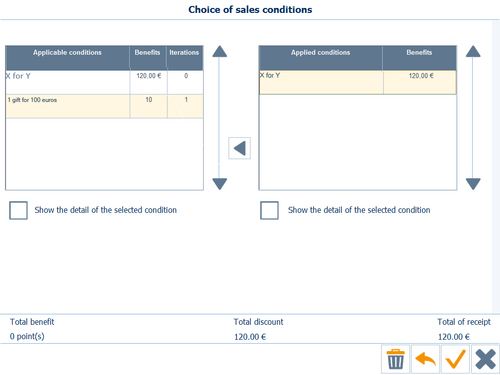

Note that in the screen above, on each side of the grids the notions of applicable sales conditions and applied sales conditions are not displayed, unlike the previous cases.

Legacy

As the value, Select from sales conditions of the same level , is new from V19 onwards, no store will have this value assigned automatically for legacy.

However, the stores for which the old option was:
- ticked, will be automatically assigned the Manual selection of sales conditions value
- not ticked, will be automatically assigned the Display applied sales conditions value

##### Additional Setups

Additional Sales Conditions Setups

Alert message for gift certificates

Back Office > Administration > Company > Company settings

Go to Commercial management > CRM. Whether the Alert on gift certificates for sales conditions is enabled or not, the operating mode will be the following:
- If the setting is enabled: a message will alert the salesperson that the customer has gift certificates relating to available sales conditions.
- If the setting is not enabled: the customer must inform the salesperson that he wants to use the gift certificates.

Multi-level management

The multi-level option is used to manage cascading sales conditions. Sales conditions are then calculated by level. They are selected according to their eligibility and sorted by level. Each level is studied successively in an orderly way:
- Study of level 1: All sales conditions of level 1 (line and receipt) are studied to determine the best application choices. The engine grants each quantity of each line a discount amount.
- After this calculation, level 2 is studied: all items become available again for every level. The sales conditions of level 2 are studied to assign new discounts, taking into account the same constraints: one line discount of level 2 per item, and one discount of level 2 per receipt. The engine does not change; it grants each quantity of every line a discount amount based on the amount already deducted from the discount of level 1.
- After this calculation, the next levels are studied: the engine is restarted as long as there are still sales conditions of higher levels.

To enable multi-level management, go to Commercial management > CRM in the Company settings and enable the Multi-level management setting. Then, for each sales condition, specify the number of handled levels (tab General , field Level .) Note that multi-level operation is impacted by the settings described below.

Multi-level management

Level

Settings impacting multi-level management

Applicability

Back Office > Sales > Sales conditions > Rules

In the Conditions on lines/on receipt tabs, the Condition selection list proposes several options used to manage sales conditions for already discounted items. If the Applicable on non-discounted items option is selected, the multi-level management works as follows:
- If there is a sales condition on level 1, the item will be discounted. In this case, a sales condition of level 2 applicable on non-discounted items will not apply. However, a sales condition of level 3 applicable on discounted items will apply.

Store record

Back Office > Basic data > Stores > Stores

In the Miscellaneous tab of the Store record, the Choice option allows you to have the sales conditions validated by the salespeople; depending on the option select the multi-level management may be impacted. Click here for further information.

Click here

Sales conditions based on a list of items taking into account the concept of available inventory

You can select in the Benefit tab the list of items that may be offered to the customer as benefit of the condition. This item list may also be based on inventory criteria (items managed in stock and or items with negative or zero stock.) These options may be checked when creating the list of items (refer to section Options relating to sales conditions .)

Benefit tab

Options relating to sales conditions

#### Simulation Tool

Simulation Tool

Step 1: Simulate a document

Back Office > Sales > Sales conditions > Simulation > Document entry

This simulation tool enables the user to enter fictitious receipts with simple information. The header of the screen is used to enter additional information:
- Store
- Date/Time of the receipt
- Customer
- Currency
- Invoicing: exclusive or inclusive of tax
- Etc.

Once the header information populated, click on this button to insert the items concerned by the simulation.

The simulator recalculates the benefit of the sales conditions for each receipt and then allocates the best combination.

These fictitious receipts will be memorized for further simulations.

They are saved with the discounted price of the sales conditions, with the aim to control and validate possible changes in the setup.

A global control can be performed to carry out a comprehensive simulation of the set of fictitious receipts.

Step 2: Simulate a calculation

Back Office > Sales > Sales conditions > Simulation > Simulation

A simulation is described by a code, a description, a calculation date, and a notepad:

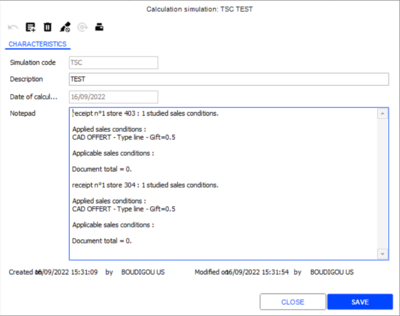

The notepad contains the list of the sales conditions used for the simulation and the list of the receipts selected.

This button is used to delete the calculations made for the current simulation.

This button is used to launch the calculation of the current simulation.

These two processes of deleting and launching the calculation undergo a selection step for the receipts to be taken into account.

Reporting

Back Office > Sales > Sales > Sales conditions> Simulation > Dashboard

Dashboard for simulation documents

Allows the comparison document by document of the various simulations performed.

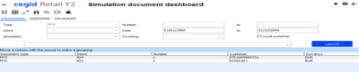

Dashboard by item

Allows the comparison of the various document simulations, item by item.

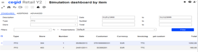

#### Additional Information

Additional Information about Sales Conditions

Note that sales conditions are not calculated on return lines, financial items and assortment BOMs. However, sales conditions can be calculated on assembly BOMs.

Applying sales conditions to receipts with null totals

Upon cashing, if a sales receipt is null (price at zero), sales conditions will also apply.

Please note!

Only the conditions granting a gift or a gift certificate (with a fixed amount and not a percentage) are taken into account. This also applies if the null receipt is put on hold.

Combining sales conditions

Sales conditions cannot be combined. Two different discounts cannot be applied to the same item.

However, discounts arising from different sales conditions can be applied to the same line if the quantity defined is greater than 1. If a line meets an amount-based discount rule and a percentage-based discount rule simultaneously, the latter is converted to an amount-based discount for comparison purposes.

Order in which sales conditions are applied

Sales conditions are sorted by gains. This means that the sales conditions of type line, with control on quantities and amounts are applied first (in decreasing order.) Then, sales conditions of type receipt are applied in decreasing order of amounts.

Calculation algorithm

=> See also procedure 279 (Sales Conditions Algorithm)

Conditions are then sorted as follows:
1. Sales conditions are first selected according to dates, store triggers, restriction categories, tax inclusive or exclusive systems, and currency.
2. Then, the selected sales conditions are calculated independently, one by one to see which ones can be triggered for the receipt, according to items, amount, quantity, customer, etc.
3. Sales conditions are sorted as follows according to the possible selection of option Condition on quantities :

| Type of sales condition | Status of fields “Condition on quantities” |
| --- | --- |
| Line | In priority sales conditions for which the “Condition on quantities” option is ticked. If several conditions have this option ticked, they will be sorted by decreasing discount amount. Conditions for which the option is not ticked. |
| Receipt | If several sales conditions have this option ticked, they are sorted by decreasing discount amount, given that sales conditions with a benefit of type On receipt are considered as sales conditions of type Receipt (even if their displayed type is Line .) |

1. Then, a calculation will be made on these sorted sales conditions according to their exclusive rule. Is considered as exclusive the relevant status of fields Exclusive rule on lines/receipts and Combinable with line rules (in the “Condition on lines/receipt” tab.) As you know, you may have for 1 receipt, X conditions of type Line , but only 1 of type Receipt . For example: You have the following 4 sales conditions SC1=discount € 10, SC2=€ 20, SC3=€30€, SC4=€40. Sales condition SC4 is of type “receipt”. Sales conditions will apply in the following order: SC3, SC2, SC1, SC4).
2. Then, the system applies the sale conditions on the receipt in the preset order. In the previous example, the system applies the SC3 sales condition. Then, it tries to apply sales condition SC2 (that will apply or not, if there are enough items available on the receipt; the system will apply sales conditions until there are no conditions to apply anymore. In doing so, the system ensures that the most advantageous combination will be applied for the customer.
3. Enabling priority management (Benefit tab) makes the system ignore the ranking mentioned above. Sales conditions will be applied according to the priorities defined in the rule: First, sales conditions with priority 1, then sales conditions with priority 2, and so on. If there is a tie, the original sorting operation will be resumed.

Discount management

Invoice total discount and line discount

Invoice total and line discounts of type Sales conditions cannot be applied to the same document.

Interaction with other discounts

Sales conditions are applied before loyalty points are calculated. The amount that is used to calculate the loyalty points takes into account the discounts arising from the sales conditions.

On the other hand, the minimum amounts configured for a sales condition rule are calculated after the calculation of the discounts that are applied to the lines manually.

Storing sales conditions

Back Office > Sales > Analysis > Discount dashboard

The application of the sales condition to a receipt can be traced by the means of the discount reason. If this reason management is not sufficient, it is possible to find exactly which sales have benefited from which sales conditions. In the case of a discount of type gift relating to a sales condition, the line added includes this information at discount level.

Please note!

This operation mode is used even if the item is a free item. In this case, the discount amount is equal to 0; otherwise it matches the amount of the proposed gift. The discount dashboard reports this information. Therefore, use the Sales condition criterion available in the Standards tab.

#### Usage at Checkout

##### Summary of Screens Available at Checkout

Summary of screens available at checkout

Front Office > Sales receipts > Sales > Enter transaction

After the entry of the items and the customer, the application calculates if all the requirements for the current receipt are met to apply the sales condition. The following screens may be displayed:

Choice of sales conditions

In the case where a message is configured in the Benefit tab.

If in the Benefit tab , the message Display the message when cashing is ticked, the Choice of sales conditions screen displays one or more sales conditions applicable for the customer.

Benefit tab

You just have to select the sales condition to apply by moving it to the right table, and validate the screen. If need be, you may view the detail of the sales condition by the means of the appropriate option.

In the Choice of sales conditions screen, this button will interrupt the sales conditions selection process and return to the shopping cart.

The message "Return to the item entry screen? YES / NO" is displayed.
- If the answer is NO, the user returns to the selection screen of the sales conditions.
- If the answer is YES, the user returns to the item entry screen.

In the case where a m essage is not configured in the Benefit tab.

In the case where no message for cashing (see the Benefit tab ) has been defined, only the following information will be displayed in the payment grid:

Benefit tab

Clicking this message displays the detail of the sales conditions.

Items to select from a list

The screen below displays when the sales conditions is set to offer a gift to be chosen from a list (see Benefit tab, type Gift .)

Benefit tab, type Gift

This screen displays in the left side the list of items from which the customer selects his gift. Note that you can display only the items available in stock (see Creating lists of items .) If no item is available, a message will state this.

Creating lists of items

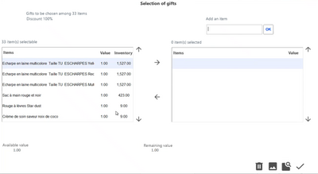

These buttons are used to move the gift chosen by the customer to the right list, or move it back to the left list if it is mistaken.

These buttons are used to move within a long list.

Also note that amounts (available and remaining) are updated once the value of the gift is reached.

Just remind: the value of the gift is determined when the benefit is defined in the entry table of the sales conditions triggering the benefit .

entry table of the sales conditions triggering the benefit

Removes all the elements selected.

Displays the picture of the item

Accesses the item record of the selected item.

Validates the selection made and go to payment.

+ This sequence of buttons allows you to skip/validate this screen without selecting a gift: simply delete the gift, then validate the screen..

Entering a keyword to activate the sales condition

When entering a sales transaction, you will use the [other actions/Business operations/Keyword entry] button to access the keyword entry screen.

On, this screen, you can add or remove a keyword, and view those already entered. You just have to enter or select the keyword to activate the benefit from the sales condition. (Refer to the Conditions on Lines/Conditions on Receipt tabs.)

Incentive message

An incentive message displays for the cashier so that he may inform the customer on the sales conditions he is about to get, for example, if 1 item is missing to benefit from the sales condition (refer to the Benefit tab .)

Benefit tab

Example of incentive message:

3 items = 10% off 1 item missing to trigger the condition. Do you want to complete the receipt?

##### Printing Sales Conditions on Carts on Holds

Printing Sales Conditions for Carts on Hold

Front Office > Sales receipts > Sales > Enter transaction

If a cart on hold is printed, the calculated discounts of the sales conditions are displayed and the final price of the receipts takes these discounts into consideration.

Only the standard template can display these discounts. For a specific report, the required changes must be carried out.

Note that the calculation of the sales conditions for carts on hold is subject to a register setting, available via Settings > Front Office > Register; open tab Receipt (continued) and tick the Sales conditions for carts on hold setting.

For sales conditions with discount type "Gift", the list of gifts to be chosen will not be displayed.

The window will display only when the receipt is validated (before the entry of payments)

The same principle applies to sales conditions with discount type “pre-recorded gift certificate", the window that allows the selection of the certificates is displayed only at the validation of the receipt (before the entry of payments.)

##### Operating in Standalone Mode

How Sales Conditions Are Working in Standalone Mode

The use of sales conditions in standalone mode is limited by the unavailability of certain information.

Sales conditions with:

Customer trigger
- Are impacted sales conditions with a customer trigger relating to fields of the customer record that are not (or cannot be) downloaded to standalone mode. For example, the Customer’s birth date criterion is never sent. Therefore, if a condition relates to a customer trigger that depends of the customer’s birthday, the condition will not be applied.
- If certain sales conditions are based on triggers, you must check the corresponding setting for exporting user-defined tables and user-defined item fields in the price list aggregate settings.

Number of occurrences

Sales conditions with a defined number of occurrences do not work (refer to the Conditions on customers tab.) To operate with standalone mode, this field must be set to 0.

Conditions on customers

Condition on loyal customer

Sales conditions having a condition on loyal customers are not usable in standalone mode.

Grouping in user fields

Back Office > Administration > Scheduled tasks > Price list aggregates > Exported data tab

User fields can be taken into account in standalone mode (refer to the Conditions on lines tab.) It is possible to export up to 5 user fields at the level of price list aggregates.

For further information about the management of these fields, please refer to the section about user fields .

user fields

Gift certificate management

Only pre-recorded gift certificates are not available in standalone mode.

#### Examples of Settings Defined for Sales Conditions

##### Discount on the Items of the Grouping

Discount on Items of the Grouping (with Conditions on Quantity Bought)

Back Office > Sales > Sales conditions > Rules

Examples of settings defined for a sales condition subject to the purchase of items from a same grouping (i.e. Department) and conditioned by a quantity that may be either a minimum number of items, or a “multiple of...” Indeed, if option Condition on quantities is ticked, you can:
- Either, tick option In multiples of and define this in the input grid of the benefit triggering conditions.
- Or, enter a minimum purchase quantity, directly in the input grid of the benefit triggering conditions.

Let us imagine the following items to illustrate the examples below:
- Category BODY CARE (SO3): C29331 and C23323.
- Department CARE: SH3765 and COND765

Example 1

| For a multiple of 2 items bought in the CARE department, the customer gets 10% off for the first item found in the BODY CARE category. |
| --- |
| Conditions on lines tab | Benefit tab |
|  |  |
| Result on the cash register |
| Case 1: Enter a sales transaction with 2 items from the CARE department with 1 item (C29331) from the BODY CARE (SO3) category. The condition is triggered and applies the discount to item C29331. Case 2: Enter a sales transaction with 3 items from the CARE department with 2 items (C29331 and C23323) from the BODY CARE (SO3) category. The condition is triggered and applies the discount to item C29331 (1st item found.) Items C29331 and CON765 are flagged by the sales condition (1 group of 2.) Case 3: Enter a sales transaction with 4 items from the CARE department with 2 items from the BODY CARE (SO3) category, in the following order (C29331, SH3765, COND765 and C23323.) The condition is triggered and applies the discount to item C29331 (1st item found.) for the first group of the 2. Then, the discount applies to item C23323 (1st item found) for the second group. |

Example 2

| For a multiple of 2 items bought in the CARE department, the application searches for the less expensive item of the BODY CARE category and then calculates 10% of its value that will be then distributed to all items belonging to this grouping. |
| --- |
| Conditions on lines tab | Benefit tab |
|  |  |
| Result on the cash register |
| Enter a sales transaction with 3 items from the CARE department with 2 items (C29331 and C23323) from the BODY CARE (SO3) category. The condition is triggered and calculates the discount: 10% of the value of the less expensive item (distributed to all items.) |

Example 3

| For a multiple of 2 items bought, the application searches for all items of the BODY CARE category and then calculates a 10% discount for all these items belonging to the grouping. |
| --- |
| Conditions on lines tab | Benefit tab |
|  |  |
| Result on the cash register |
| Enter a sales transaction with 4 items from the CARE department with 3 items from the BODY CARE (SO3) category. The condition is triggered and calculates a discount of 10% for each of these 3 items. The 4 items will be “flagged” by the sales condition (1 group of 2), since the system takes the first 2 items and discounts all the items of the grouping. |

Example 4

| From 2 items or more, bought in the CARE department, the customer gets 10% off for the 1st item found in the BODY CARE category. |
| --- |
| Conditions on lines tab | Benefit tab |
|  |  |
| Result on the cash register |
| Case 1: Enter a sales transaction with 2 items from the CARE department with 1 item (C29331) from the BODY CARE (SO3) category. The condition is triggered and applies the discount to item C29331. Case 2: Enter a sales transaction with 3 items from the CARE department with 2 items (C29331+ C23323) from the BODY CARE (SO3) category. The condition is triggered and applies the discount to item C29331 (1st item found.) Case 3: Enter a sales transaction with 4 items from the CARE department with 2 items (C29331+C23323) from the BODY CARE (SO3) category, in the following order (C29331, SH3765, COND765 and C23323.) The condition is triggered and applies the discount to item C29331 (1st item found.) |

Example 5

| From 2 items or more, bought in the CARE department, the application searches for the less expensive item of the BODY CARE category and then calculates 10% of its value that will be then distributed to all items belonging to this grouping. |
| --- |
| Conditions on lines tab | Benefit tab |
|  |  |
| Result on the cash register |
| Enter a sales transaction with 3 items from the CARE department with 2 items (C29331+ C23323) from the BODY CARE (SO3) category. The condition is triggered and calculates a discount worth 10% of the value of the less expensive item (values distributed to all items.) |

Example 6

| From 2 items or more, the application searches for all items of the BODY CARE category and then calculates a 10% discount for all these items belonging to the grouping. |
| --- |
| Conditions on lines tab | Benefit tab |
|  |  |
| Result on the cash register |
| Enter a sales transaction with 4 items from the CARE department with 3 items from the BODY CARE (SO3) category. The condition is triggered and applies the discount to the 3 items. |

##### Reduced Price for X Items Bought

Reduced Price for X Items Bought

Back Office > Sales > Sales conditions > Rules

Example of settings for an offer f type "2 T-shirts for €15, instead of €10 each.

| Conditions on lines tab | Benefit tab |
| --- | --- |
|  |  |

##### Third Item at €1

Third Item at €1

Back Office > Sales > Sales conditions > Rules

Example of settings for a promotional offer of type “When 2 items are purchased from the CARE collection, the third item can be purchased for € 1

| Conditions on lines tab | Benefit tab |
| --- | --- |
|  |  |

##### Reduced Price for X Items Bought from the Same Category

Reduced Price for X Items Bought from the Same Category

Back Office > Sales > Sales conditions > Rules

Example of settings for an offer of type “A pair of shoes for €119, two pairs for €99 each.”

| Conditions on lines tab | Benefit tab |
| --- | --- |
|  |  |

##### X Items Bought, the Additional Item is Free

X Items Bought, the Additional Item is Free

Back Office > Sales > Sales conditions > Rules

Example of settings for a promotional offer of type “13 bottles for the price of 12.”

| Conditions on lines tab | Benefit tab |
| --- | --- |
|  |  |

##### Gift Offered

Gift Offered

Back Office > Sales > Sales conditions > Rules

Example of settings for an offer type “A bag is offered for 3 items purchased for a total receipt minimum of €80”.

| Conditions on lines tab | Benefit tab |
| --- | --- |
|  |  |

##### Gift Certificate Offered

Gift Certificate Offered

Back Office > Sales > Sales conditions > Rules

Example of settings for an offer of type “For €80 spent, a gift certificate worth €10 is offered.”

| Conditions on lines tab | Benefit tab |
| --- | --- |
|  |  |

##### Gift to Select from a List

Gift to Select from a List

Back Office > Sales > Sales conditions > Rules

Example of settings for an offer of type “3 items bought = 1 gift worth €10 to select from a list.”

| Conditions on lines tab | Benefit tab |
| --- | --- |
|  |  |

##### Progressive Discount Based on the Quantity Purchased

Progressive Discount Based on the Quantity Purchased

Back Office > Sales > Sales conditions > Rules

Example of settings for a promotional offer of type “A pair of shoetrees for €19. Three pairs for €48. Ten pairs for €149.”

Note in the Benefit tab: Ticking option "All items" makes benefit all items that are part of the condition.

| Conditions on lines tab | Benefit tab |
| --- | --- |
|  |  |

##### Doubled Loyalty Points

Loyalty Points

Back Office > Sales > Sales conditions > Rules

Example of settings for an offer of type: “For 2 watches purchased, the loyalty points earned for the receipt are doubled.”

| Conditions on lines tab | Conditions on customers tab |
| --- | --- |
|  |  |
| Benefit tab |
|  |

##### Customer's Birthday Discount

Customer's Birthday Discount

Back Office > Sales > Sales conditions > Rules

Example of settings for a promotional offer of type “For the customer’s birthday, 10% off for 2 items bought.”

| Conditions on receipt tab | Conditions on customers tab |
| --- | --- |
|  |  |
| Benefit tab |
|  |

##### Discount on Similar Item

Discount on Similar Item

Back Office > Sales > Sales conditions > Rules

Example of settings for a promotional offer of type”Buy 2 items from the same department and same collection, the less expensive will be free.”

| Conditions on lines tab | Benefit tab |
| --- | --- |
|  |  |

### Retail Selling Price Lists

#### Contents

=> See also procedure 268 (Usage of Pricing Caches)

Retail Selling Price Lists - Contents

A price list consists of a price list type and an application period. To create a price list, it is therefore necessary to define first the price list type and the application period. When using price lists, the price of an item can be related to the following:
- The document date (price list application period)
- The store (price list defined for the store)
- The customer or customer category (if a customer price list has been defined)

The Sales Pricing and Promotions module must be serialized before you can use this functionality.

Settings for retail selling price lists
- Company settings
- Rounding methods
- Price list types
- Application periods
- User record
- Store record
- Access rights

Application period
- Price list application period

Creating price lists
- Specifying a price list when creating an item
- Creating a price list by item
- Creating a price list by item category
- Creating a price list by customer
- Creating a price list by customer category

Updating and generating price lists
- Update procedure
- Automatic price list generation

Managing and controlling price lists
- Querying price lists
- Editing price lists
- Closing price lists
- Deleting price lists
- Input lists
- Labels on new price lists (inclusive of tax)
- Comparative report on item price lists
- Items without price list

#### Retail Price List Settings

Retail Price List Settings

Company settings

Back-Office > Administration > Company > Company settings

Go to Commercial management > Pricing and populate the settings specified here .

Rounding methods

Back Office > Settings > Management > Payment methods

This command is used to configure rounding methods (see Setup of Rounding Methods .)

Setup of Rounding Methods

Price list types

Back Office > Sales > Pricing > Price list types

Click the [New] button to create a new price list type and populate the following fields.

| Fields | Description |
| --- | --- |
| Price list type | Enter a code and a description for the new price list type. |
| Pricing system | Used to define if the selling price list is tax inclusive or tax exclusive. |
| Currency | The price list type is expressed in a single currency that must be defined when creating the price list. |
| Coefficient | The Coefficient is the same as the coefficient applied when creating the price list and is based on the price entered in the item record. |
| Exceptions by store | This field is used to manage price list exceptions by store. This option is not modifiable. |
| Update of price list by store in purchasing | If the selling price list is entered in purchase documents, the price list update by store in purchasing will update the following data: The store price list for the purchase document if the option is selected. The price list for all stores if the option is not selected. |
| Consider prices of item record | Option selected: The item selling price will be retrieved if there is no price list found. Option not selected: The item price will not be retrieved. |

Application periods

Back Office > Sales > Pricing > Application periods

Click here for more information on price list application periods

Click here

User record

Back Office > Administration > Users and access > Users

For each user, you can restrict the visibility of price lists. Therefore, open the user record and go to the Restrictions tab. You can select the various price list types that the user is authorized to view in the Pricing section. If no value is selected, the user will have access to all price list types.

Store record

Back-Office > Basic data > Stores > Stores

The Contact information tab in the store record is used to associate a tax exclusive or inclusive selling price list with a store. Note that you can also associate a purchase price list with the store in this record. (see Retail Purchase Prices ).

Retail Purchase Prices

Access rights

Back Office > Administration > Users and access > Access right management

Menu Sales (102) - Pricing

This menu lists all available options used to manage retail selling price lists. According to the authorizations, you want to grant to user groups, enable the appropriate access rights.

#### Application Periods

Retail Price List Application Period

Back Office > Sales > Pricing > Application periods

This command allows you to enter “Promotion” type periods for price lists applying to all stores. You may define different dates for stores and call them exceptions.

Configuring price periods

Application periods are defined, for tax-inclusive and tax-exclusive price lists. Click the [New] button to create an application period and populate the following fields.

| Fields | Description |
| --- | --- |
| Code for period | Specify the code for the period being created. |
| Price list code | Select the price list type to be associated with the application period. An application period can be linked to a price list type. This link is mandatory if the Price list period always linked to a price list code company setting is checked in the Pricing tab. |
| Description | Application period description |
| Promotional period | If this option is not selected, the application period will be considered permanent. Otherwise, the application period will be considered as a promotion. It will then have a start date and/or end date, rounding type and a markdown reason. Moreover, the [Change application dates for a store] button will be enabled so that you will be able to manage store exceptions in order to adjust price list dates for each store (refer to the following section “Entering dates by store”.) |
| Starting date | The price list will be applied on this date. |
| Ending date | The application period for the price list expires on this date. This field can only be populated if the period is a promotional period. |
| Rounding type | The Rounding type will be the same as the rounding type used to calculate discounted price lists for promotional periods. |
| Mark-down | A Mark-down reason must be selected to justify any discount applied to a price list corresponding to this promotional period. |
| Cascading discounts | The Discount in series option allows you to choose whether to authorize a discount in addition to the discount already existing for the promotional period. Please note! The periods that cascading discounts are to be applied to cannot start on the same date. |

Entering dates by store

Once the Promotional period option checked, the [Change application dates for a store] button becomes active so that you will be able to adjust price list dates for each store.

The list of stores will be displayed when the window is opened:
- The list is limited to only those stores meeting user restrictions.
- If the period is associated to a price list, only those stores associated to this price list will be present on the list.
- The rounding method and dates displayed are those for the generic period for stores that are not exceptions. Otherwise, the ones will be set for the store with an exception.

Deleting an exception for a store is done by re-entering the generic period information.

Database storage

When validating store records, only those records with exceptions will be stored in the database.

Changing periods
- Change generic periods Generic period dates will become modifiable if there are store exceptions, but there is no impact on the dates entered as exceptions.
- Carry forward information to periods set by the store Data other than dates are always carried forward to the periods set by stores (markdown code, series, etc.).
- Carry forward to price lists If modified, generic period dates will be carried forward to all price lists applied to the stores that are not exceptions to the period. The outside dates of the period (the earliest start date and the latest end date for exceptions and the generic period) are carried forward to all price lists without the notion of store.

Changing exception periods

The dates and rounding methods may be changed in each store.

Carry forward to generic periods

Concerning the date range for exceptions (the earliest start dates and the latest end date), this information is carried forward to the screen in the following way:

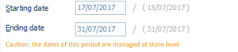

This information is calculated when being displayed on this screen or when validating the exception screen:
- Display of the most recent start date for exceptions if it is before the base period.
- Display of the oldest end date for exceptions if it is after the base period.

Carry forward changes to price lists

Changes in dates and rounding for stores with exceptions are carried forward to all price lists affecting these stores, with this period as an exception (may be changed in Sales - Pricing - Item price list).

If deleting a store with exceptions (e.g. Changing dates for the ones of the generic record), then the generic period dates will be carried forward to price lists for this store.

Imports

As a reminder, here is an example of an import format and file corresponding to a price period, with a generic record (store set to “...”) and three “exception” records, for three different stores with different dates.

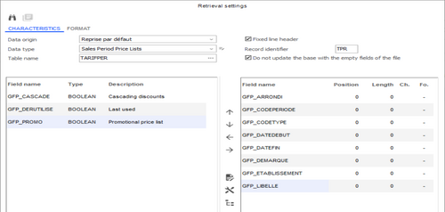

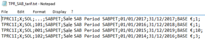

Here are the results of this import in Sales - Pricing - Application periods/Tax inclusive price list

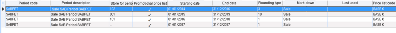

Importing an exception no longer causes the recalculation of the start and end dates of the generic period, and updating the generic period dates causes the deletion of the exceptions with the same dates. Information will be carried forward the following way:
- To import an exception period (store entered), changes to dates and rounding are carried forward for all price lists concerning this store in this period.
- To import a generic period (store set to “...”), changes made to dates and rounding are carried forward for all price lists set for stores that do not have exceptions. For price lists set without the notion of store, these outside dates will be carried forward.

History recovery

There is not history recovery, but an SQL purge of superfluous exceptions corresponding to the old storage system is made available to enable a manual startup for time periods with light activity, for customers wishing to purge their period tables. This SQL is explained in the following procedure: Y2_P207_V1100_Best_Practices_and_Performance_Optimization.

#### Creating Retail Price Lists

Creating Retail Price Lists

To create a price list, you can use the following methods.

Specifying a price list when creating an item

At item creation

If the Price list proposal in item creation company setting is selected (see Company Settings) , you can enter price lists directly when creating an item Once you validate the item created, the "Base price list of item" window will be displayed. Price lists are created according to the base period defined in the company settings.

Company Settings)

The price specified by default corresponds to the retail selling price entered in the item record multiplied by the coefficient configured for the price list type.

Updating the price list of every dimension

If the price list is generated by dimension, then after validation, you can modify the price list for each dimension by clicking the [Modification of dimensions] button.

Calling the Base price list window

After validation, you can also access this window in the item record by clicking the [Additional information/Base price list] button.

Creating a price list by item

Back Office > Sales > Pricing > Item price list

This feature enables you to create a price list (tax inclusive or tax exclusive) for each item. The following data should be entered:
- The price list type
- The application period for the price list
- The store where the price list will be applied, or All stores if the price list concerns all stores
- The code of the item for which the price list is being created
- The item price list for all settings
- The item discount as a % in the case of a promotional period, and if no price list has been entered in the previous field

The following fields are displayed again for information:
- The currency for the price list type
- The application period
- The pricing system (inclusive or exclusive of tax)
- The rounding method entered for the application period
- The mark-down reason entered for the application period

Creating a price list by item category

Back Office > Sales > Pricing > Item category price list

This command is used to create a price list for each item category (Homeware, Fashion, etc.) The principle is the same as for item price lists, but instead of selecting an item to apply the price list to, an item category must be selected. These price lists apply to promotional periods an allow you to manage percentage discounts, associated with discount reasons.

Note that item categories are configured in Settings > Items > Price list category Each item can be linked to a category in the item record in the Pricing tab.

Creating a price list by customer

Back Office > Sales > Pricing > Customer price list

This command is used to create a price list for each item category. The principle is the same as for item price lists, but instead of selecting an item to apply the price list to, a customer and item category (optional) must be selected. In such cases, the price list will be created using percentages rather than values.

Creating a price list by customer category

Back Office > Sales > Pricing > Customer category price list

This command is used to create a price list for each item category (Staff, VIP, etc.) The principle is the same as for item price lists, but instead of selecting an item to apply the price list to, a customer category and item category (optional) must be selected. In such cases, the price list will be created using percentages rather than values. Customer categories are configured in Settings > Customers > Customer categories Each customer can be linked to a category in the customer record, in the Conditions tab under Pricing . Note that when looking for an item price list, and if there is a customer price list with the relevant item category, this will be used first. Otherwise, the customer price list defined without an item category will be used.

#### Updating and Generating Retail Price Lists

Updating and Generating Retail Price Lists

Price list update

Back Office > Sales > Pricing > Price list update

This feature enables the update of price lists. This operation will be performed by selecting the items to process, based on the following criteria:
- With the selection of items: Items are displayed according to the criteria you have specified in the various tabs of the multiple criteria screen.
- On items in stock: items in stock for the warehouses selected are displayed according to the criteria previously specified in the multiple criteria screen. If the selection of items is made from a generic item, and if the user selects in the wizard the "Generating price lists at dimension level" option, the update of price lists at dimension level is not linked to the presence in stock of these dimensions, but to the presence of price lists for these dimensions.
- On item lists: These are item lists with a scope of use set to Update of price lists (refer to Item Lists .)

Price list update procedure
1. Select the items you want to update the price list for, then click the [Update] button to display the wizard for updating price lists.
2. Specify the original price settings, and select in the left part of the screen:
1. Specify the settings for the price list to update in the right part of the screen:

The Generating price lists from generic items option remains unavailable. It indicates that the price list is calculated for a generic item.

Note: Once these settings have been specified, a message will be displayed on the bottom of the screen summarizing the settings selected.
1. Click the [Next] button: A message will be displayed giving an example of the new price list calculation. (Example: If price list “XX” = EUR 10, then price list “YY” = EUR 11.)
2. Next, specify which stores you want to update.

If All stores is selected, the price list will be applied to all stores for which the configured selling price list corresponds to the updated price list type. However, if a price list specific to the store exists for this price list, this price list will be applied rather than the All stores price list
1. Click the [Next] button to display the summary window.
2. Click the [End] button to update the price list.

Automatic retail price list generation

Back Office > Sales > Pricing > Automatic price list generation

This command gives access to the following sub-commands:
- Calculation program: Allows you to define and modify calculation programs.
- Validate price lists: Allows you to validate automatically generated price lists requiring validation.
- Freeze price lists: Allows you to prevent generation of a price list for selected items.
- Delete refused price lists: Allows you to delete price lists that have not been validated.
- Delete price lists to validate: Only price lists with status To validate are taken into account by default.
- Delete validated price lists: Only price lists with status Validated are taken into account by default.
- Delete scheduled price lists: Only price lists with status Scheduled are taken into account by default.

For further information, go to topic Automatic Price List Generation .

Automatic Price List Generation

#### Retail Price List Management & Follow-up

Retail Price List Management & Follow-up

All the previous settings can be configured for both tax exclusive and tax inclusive price lists. The setup is the same, only the application of these price lists differs: tax inclusive selling price lists will be used to enter sales transaction in Front Office, and tax exclusive selling prices lists will be used for sales documents entered in Back Office, and subject to the tax exclusive system (i.e. Customer invoice for a company.)

Querying price lists

Front Office > Sales receipts > Pricing > Query price lists

In Front Office, you can view tax exclusive and tax inclusive price lists via multiple selection criteria (price list, items, barcode, etc.) Once the elements displayed onscreen, use the [Print] button to start printing price lists or use the [Export the list] button.

Printing price lists

Back Office > Sales > Pricing > Reports > Edit item price lists

Front Office > Sales receipts > Pricing > Edit item price lists

This command prints item price lists of your choice. Specify your criteria in the Criteria and Addition tabs and start printing via the [Run report] button.

Closing price lists

Back Office > Sales > Pricing > Close price lists

This command closes a price list before it will be deleted.

Deleting price lists

Back Office > Sales > Pricing > Delete price lists

This command deletes price lists that have been closed.

Input lists

Back Office > Settings > Documents > Documents > Input lists

Input lists offer you the possibility to add the Tax excl. price list and Tax incl. price list fields These selling prices are the selling price lists associated with the document store (see the Contact Information tab of the store record.) The display of these columns is subject to the following access rights, available in Administration > Users and access > Access right management > Concepts (26) > Commercial management > Document entry:

Contact Information tab
- Display selling price lists when creating documents
- Display selling price lists when viewing documents
- Display selling price lists when modifying documents
- Display selling price lists when generating documents

Labels on new price lists (inclusive of tax)

Front Office > Sales receipts > Pricing > Labels on new price lists

In Front Office, you can print labels according to the change date of price lists, and using many criteria available on the various tabs of the multiple criteria screen. This screen allows you to display price lists that have been modified (that have been regenerated by a calculation program, for example since a given date (the modification has not necessarily led to changes in the price list value).

The Modified price lists checkbox option allows you to display only those price lists with a value that has actually changed (the old price is different from the new one.)

From the list, select the modified price lists you want to print labels for, and then click the [Edit labels] button to start printing.

Please notice that this feature is subject to access rights. To use this feature, you must have been granted the following access right Labels on new price lists in Sales receipts (107) > Pricing, available in Administration > Users and access > Access right management.

Comparative report on item price lists

Back Office > Sales > Pricing > Reports

This command prints a comparative report on item price lists (Sale period, for example.)

Items without price list

Back Office > Sales > Pricing > Items without price list

This command generates a list of items having no price list. This list can also be viewed from the Purchases module.

### Trade Price Lists

#### Contents

Trade Price Lists

The pricing system can be refined using additional application conditions in order to better respond to more specific needs. Depending on the price list settings to be configured, there are two possible entry methods specific to trade documents:
- Entry of selling price lists (customers)
- Entry of purchase price lists (suppliers)

In both methods, the following can be managed:
- Price lists by item, y item category, by customer category, by customers and warehouses
- Start and end ranges for price list application
- Entered price lists
- Discount percentages
- Entered price list totals with discount percentages
- Price lists based on quantity ranges
- Cascading price lists

This feature is available for all types of trade documents.

Contents
- Settings and constraints of use
- Trade selling price lists (customers)
- Purchase price lists (suppliers)

#### Settings and Constraints of Use

Settings and Constraints of Use

Activation of modules

Back Office > Administration > Company > Serialization > Activation of modules

The Sales Pricing and Promotions module must be serialized before you can use trade price lists.

Company settings

Back Office > Administration > Company > Company settings

To enable this feature, you must tick the Use TRADE price lists company setting available in Commercial management > Pricing.

Constraints of use

The use of “trade” price lists is incompatible with tax-exclusive retail price lists. Therefore, tax-exclusive price lists must only be managed in one of these 2 modules at any given time.
- If trade price lists are used, the tax-exclusive price list that is retrieved is the price list that was created in Purchases > Supplier price lists or in Sales > Trade price lists.
- If trade price lists are not used, the tax-exclusive price list that is retrieved is the price list that was created in Purchases > Item price lists or in module Sales > Pricing.

#### Trade Selling Price Lists (Customers)

Trade Selling Price Lists (Customers)

Back Office > Sales > Trade price lists

Selling price lists can be configured by item, by item category, by customer category and by customer.

Each discount level will be applied to the base selling prices specified in the item record. You can manage start dates and end dates for the price list application periods, net prices, discount percentages; you can also calculate net price and discount totals, or even manage price lists by quantity, a single price list or cascading price lists.

The Trade price lists module offers the possibility to view and/or update the existing price lists, using the Query and Update commands.

Note:

Note:
- Customer categories can be configured in Back Office through Settings > Customers > Categories, and can then be associated with each customer in the customer record.
- Item categories can be configured in Back Office through Settings > Items > Price list category, and can then be associated with each item in the item record.

Price list types

| Price list types | Description |
| --- | --- |
| Item price lists | This command allows you to manage price lists firstly by item and then by customer category. Discounts are applied to the base selling price specified in the item record, or to the entered price. For each item, you can define a price, a discount rate, a price AND a discount rate, as well as a price list by quantity. The Price list by quantity option allows you to define price lists by quantity of items sold. In such cases, the table will be modified and new columns will be inserted into the price list settings table. The Customer category price list option is used to insert a column corresponding to the customer category, which allows you to manage price lists by item category and by customer category. |
| Price lists per item category | This command allows you to manage price lists firstly by item category and then by customer category. Discounts are applied to the base selling price specified in the item record. For each item category, it is possible to define a discount with one or more operators (successive discounts). It is not possible to manage net price lists by item category. Selecting the Price list per customer category option will insert a column corresponding to the customer category. This allows you to manage price lists by item category and by customer category. |
| Price lists per customer/item category | This option allows you to manage price lists by item category or by item using the customer category as the first criterion. The entry of item price lists by item allows you to manage price lists by quantity. Discounts are applied to the base selling price specified in the item record, or to the entered price. The Price list per item check box option allows you to manage item price lists by item. If price lists have already been defined with the Customer/Item price lists command, they will be visible on this screen. Note that item code can be accessed only if the customer category has been specified and the Item price list option has been checked. |
| Price lists per customer/item | This option allows you to manage price lists at a detailed level, i.e. by item category and by item with the customer as the first criterion. Only this level of detail allows you to make changes to a specific customer. Discounts are applied to the base selling price specified in the item record, or to the entered price. The Item price list option allows you to refine the price list by managing an entered price or a different discount by item. If this option is checked, the table used to enter price lists will be modified. Two columns will be inserted: one used to specify the item code and the other to possibly enter a unit price. If price lists have already been defined with the Customer/Item price lists command, they will be visible on this screen. Note that item code can be accessed only if the customer price list category has been specified and the Item price list option has been checked. |

Actions common to the various trade price lists

Change application of pricing conditions

This button allows you to define how pricing conditions are applied for each line of the price list. It is also available from the Quick entry of price lists window through the [Quick entry] button.

The number of conditions per price list line is limited to 23.

These conditions are cumulative so, for the price list to be applied, all table lines must be taken into account.

Please note!

The following criteria must be met when managing pricing conditions for a price list with quantity ranges:
- The pricing conditions to apply must be identical in all quantity lines.
- Modifications to a pricing condition must be completed in the first line of the price list by quantity.

Show pricing conditions

This button allows you to keep the pricing application conditions displayed for the line on which the cursor is positioned.

Copy conditions

Once the cursor is positioned on the line, this button allows you to copy the pricing conditions.

Paste conditions

Once the cursor is positioned on the line, this button allows you to retrieve the previously copied pricing conditions.

Quick entry of price lists

This button helps you to define price lists by presetting the entry of quantity limits so that you only have to enter lower limits. This option is only accessible if the Price list by quantity option is checked, and if at least the first price list line has been entered.

Discount types

| Discount types | Description |
| --- | --- |
| Cascading discounts | This information must be specified for each price list line. It offers the possibility to apply successive discounts to overlapping situations. The system searches for pricing conditions in a certain context (for example an item and a third-party price list category). If the Cascading discount option is selected in the price list entry window, the system will search for pricing conditions existing in a less-detailed context (for example an item for all third-party price list categories). If conditions are found, they will be applied too. Pricing conditions are always applied from the most detailed level to the least detailed level. As soon as the system finds a context that has not been processed successively, the search for pricing conditions stops. Attention! The principle of cascading discounts is only applied to discount percentages. |
| Cascading discounts with third-party | This option manages how the third-party discount behaves in relation to the pricing system discount. The third-party discount is defined in the % discount field in the Conditions tab of the Customer record. |
| Forced/Single discount | The pricing system will not retrieve a third-party discount if another discount has been found. |
| Best discount | The pricing system retrieves the best discount, i.e. the one that is most beneficial to the third party. |

#### Purchase Price Lists (Suppliers)

Purchase Price Lists (Suppliers)

Back Office > Purchases > Supplier price lists

Entry of supplier price lists

This feature allows you to create supplier price lists also called purchase price lists. Supplier price lists can be defined in the following ways:
- By supplier and by item if the Item price list option is checked.
- By supplier and by item category if the option is unchecked.

As with selling price lists, it is possible to create price lists by quantity. The setup of supplier price list being quite the same as for selling price lists please refer to topic Trade selling price lists, as seen before.

Query of supplier price lists

Various selection criteria allow you to display the existing price lists.

Update of supplier price lists

This option allows you to update different levels of a price list according to selection criteria and, with the help of a wizard, to configure the update of previously selected price lists. The update is performed by the following steps:
- Select the price lists that you want to update.
- Validate your selection by clicking on the [Update] button.
- This will open the wizard to complete the information for update.
- Use the [End] button to validate the process.

### Price List Programs

#### Contents

Managing Price List Programs

The management of price list programs offers the opportunity to apply via a program several types of price lists to a store by the means of rules.

A price list program consists of several rules. These rules are associated with a price list type and contain the application conditions linked to the store and/or the item. For example, price list types are created by item category (luggage, accessories, prêt-à-porter...) and the price lists associated with these types are entered.

Then, the rules are associated with these price list types and linked to the "Price list by item category" program.

Finally, the program is referenced in a store record, allowing you to apply the corresponding rule based on the item category and therefore the price lists when entering documents.

Trade price lists do not support the management of price list programs.

The price list programs work in the same way as the functions for managing retail purchase price lists and retail sales price lists (document entry, labels, aggregate calculations, standalone mode, etc.)

For further information on purchase and sales price lists, please refer to the documentations about retail purchase price lists and retail selling price lists .

retail purchase price lists

retail selling price lists
- Required settings
- Price list program management settings
- How a price list program works

#### Price List Programs - Required Settings

Price List Programs ‒ Required Settings

Serializing the management of price list programs.

Back Office > Administration > Company > Serialization > Activation of modules

This functionality is subject to serialization of the Sales Pricing and Promotions module.

Activating the management of price list programs

Back Office > Administration > Company > Company settings

Go to Commercial management > Pricing and tick the Management of price list programs per store option.

Managing access rights

Back Office > Administration > Users and access > Access right management

According to the authorizations, you want to grant to user groups, enable the appropriate access rights in menu Basic data (110) > Stores.
- Pricing/Application rules for price list types.
- Pricing/Price list type application programs.

#### Price List Program Management Settings

Price List Program Management Settings

Defining application rules

Back Office > Basic data > Stores > Pricing > Application rules for price list types

This step allows you to create application rules for price list types that are used to select a price list to apply, based on stores and items, each rule having a priority level. These price list type application rules define the application conditions and the price list type linked to these conditions. These rules are then grouped together into a price list type allocation program.

Please note!

This command is available only if the Management of price list programs per store option is ticked in the company settings.

Click the [New] button and populate the following fields:

| Field | Description |
| --- | --- |
| Application conditions | You can define the application of a rule based on a specific store and/or items. Triggers for stores and items for which the scope of use is Application rule for price list types are available and can be applied. If the trigger type is set to None , the rule will apply without conditions. |
| Price list types to apply | The rule consists of either a purchase price list type or a tax-exclusive sales and/or tax-inclusive sales price list type. If the rule relates to a purchase price list type, sales price list types are not available and vice versa. The price list type cannot be modified for rules associated with a program. This prevents a purchase type rule being changed to a sales type rule when it is associated with a program at purchase price list level. |

Please note!

The following options, contained under the price list type, are not taken into account for price list programs: Coefficient, Update of price list by store in purchasing, and Consider prices of item record.

You can only delete a rule if it is not linked to a program. You can also close a rule. In this case, a message notifies you that the rule is linked to at least one program (and includes the corresponding program code).

This button displays the list of programs using the rule specifying: the code, the program description, the order of the rule in the program, the code and description of the rule;

Creating application programs for price list types

Back Office > Basic data > Stores > Pricing > Price list type application programs

The application program enables you to select the application rules. The options will determine the cascading searches to perform if no price list is found. The price list program contains the following:
- Its code and description
- The purchase, tax-exclusive sales, and tax-inclusive sales price list types for the stores
- The search options for the program
- The applicable purchase and sales rules

Program rules cannot be used in conjunction with one another. Once a price list has been found, it is applied.

Characteristics tab

| Fields | Description |
| --- | --- |
| Applicable to price lists | A program is available in the store record provided that the application price list type for the program has been specified. The program is applied for purchase and/or tax-exclusive sales and/or tax-inclusive sales price lists. You can access the settings for the rules by double-clicking on the rule in search mode. |
| Search options if rule is satisfied without price list | These options determine the searches that need to be carried out when a rule is found that meets the application conditions but for which no price list is retrieved. The following options are available: Apply subsequent rules: Moves to the subsequent rule until a price list is retrieved. Search for the current price list of the store: If no rule returns a price list, in this case, the price list type in the store record for the price list in question (purchase price list, tax-exclusive sales price list and tax-inclusive sales price list) is applied. Recover price from item record: This checkbox is selected by default so that the item record price is retrieved in cases where a price list is not found, otherwise the price will be zero. If this option is not checked and no price list can be applied, the price is therefore set to zero for the price list reason. This differs from the price in a document for which the item record price will be retrieved because the Proposed price option for the document type (on the Valuation tab) is applied after the price list search. |

At this stage, you can only delete a program if it has not been linked to a store.

You can also close a program. In such an instance, a message notifies you if the program is linked to at least one store and also includes the corresponding store codes.

Application rules tabs for purchase and sales price list types

Program rules are assigned the same way for purchases and sales.
- The Application rule for purchase price list types tab is accessible if the Purchase price list option is checked in the Characteristics tab.
- The Application rule for sales price list types tab is accessible if the Tax excl. selling price list or Tax incl. selling price list option is checked.

The screen is divided into two sections:
- Available rules: List containing all of the available rules by price list type (purchase or sale.)
- Program rules: List of program rules and the order in which they are applied.

Closed rules are identified by a checkmark in the relevant column. The arrows allow you to move a single rule from the Available rules column to the Program rules column and vice versa, or all of the rules with the double arrows.

For program rules, two arrows allow (top, bottom) you to change the application order for a rule in the program.

This order is important as it determines the desired order based on the settings defined for the rules. For example, you can put the rules linked to a collection (summer, winter) first, rather than rules linked to a store or region with no specific item data.

Configuring stores

Back Office > Basic data > Stores > Stores

Every store can specify that it uses a price list type allocation program. In the Contact information tab, the price list program is entered by price list type. You can view the program by clicking the [Program query] button.

Configuring users

Back Office > Administration > Users and access > Users

In the Restrictions tab, the Price list type allocation programs section allows you to select the programs available to this user by price list type (purchase, tax-exclusive sales, and tax-inclusive sales). If user restrictions exist when creating a price list program, you must update them.

#### How a Price List Program Works

How a Price List Program Works

You can select a price list within the program in the following way whether the rule is applicable.

Rule is applicable

In the case a rule is applicable for the store and the entered item (application conditions are met):
- If a price list is found, it is applied.
- If no price list is found, the options under Search options if rule is satisfied without price list are taken into account. Just remind: This is available in Pricing > Price list type application programs: Moves to the subsequent program rule if the Apply subsequent rules option is checked. Takes into account the price list type entered in the store record for the corresponding price list type, if the Search for the current price list of the store option is checked. Retrieves the price from the item record if the Recover price from item record option is checked.

No rule is applicable

In the case no rule is applicable, the options under Search options if rule is satisfied without price list are taken into account. The above information applies in this case also.

In both cases, the search is integrated with the following features:
- Document management
- Query of item prices
- Price list search functions when printing price lists and labels
- Table of aggregates to download in standalone mode

### Firm Prices

#### Contents

Management of Firm Prices

This document discusses two types of firm price management, both independent of each other.

Firm price management on document valuation

This feature enables the user to decide whether a document must be revalued when generated. When a document is transformed or when generating a delivery from an order, prices of the order may be either recovered the same for the delivery or recalculated during generation.

Firm price management for transfer prices

This is used to keep the transfer prices of the original document when a document is transformed.

Contents

Contents
- Firm price settings
- How firm prices work
- Miscellaneous processes

#### Firm Price Settings

Firm Price Settings

Activating firm price management

Back Office > Settings > Documents > Documents > Types > Valuation tab

This command enables firm price management for the documents concerned. Select the document type, then check the following settings as needed.
- Firm prices on document valuation : This setting is checked by default. It is used to specify that prices will be retained when the document is converted. This option is only available for purchase and sales documents, with the exception of receipts and carts on hold.
- Firm prices on transfer prices : If this setting is checked, the transfer prices of the original document will be saved when the document is converted.

Managing access rights

Back-Office > Administration > Users and access > Access right management

These access rights may grant users authorization to use these features. These rights must be set via Menu Concepts (26) > Commercial management > Document entry.
- Authorize the status change of firm prices on document valuation.
- Authorize the status change of firm prices on transfer prices.

If the corresponding access rights are not activated, the settings will be displayed in the document types but cannot be modified.

#### How Firm Prices Work

How Firm Prices Work

When creating a document

When creating a new document, the Firm prices on document valuation status will be retrieved from document type settings. If the appropriate access rights have been granted, this value can be modified in the “Additions” tab in the document header, if necessary. It may be accessed via the [Additional actions] button.

Click the [Additional actions] button and select the Additional header information option.

When the new window opens, click the Additions tab to access the Firm prices on document valuation option.

When modifying a document

The firm prices option does not affect document modification. If an item is added to a document, the price that is valid on the date of modification will be applied. Note that the Firm prices on document valuation setting can be modified in the additional header information.

When generating a document

When generating the next document, the prices depend on the status of the original document.
- If the original document is based on firm prices, no revaluation will be done. The new document will be based on firm prices also, regardless of the document settings.
- If the original document is not based on firm prices, a revaluation process will be done. The status of the new document is retrieved from the document settings.

In the particular case of automatic generation, it is not possible to group documents whose Firm prices on document valuation status is different.

Once the “firm price” status is assigned to a document within a given document chain, this status is retained by default.

This principle applies for purchase documents and sales documents.

Example:

| Type | Purchase order | Delivery notice | Supplier receipt | Supplier invoice |
| --- | --- | --- | --- | --- |
| Document settings | Non-firm prices | Firm prices | Non-firm prices | Firm prices |
|  |  |  |  |  |
| Order creation | Order based on firm prices |  |  |  |
| Generation of delivery notice from order |  | The notice will be revalued. The generated notice is based on firm prices |  |  |
| Generation of receipt from delivery notice |  |  | No revaluation of the receipt. The generated receipt is based on firm prices regardless of the document settings. |  |
| Generation of invoice from receipt |  |  |  | No revaluation of the invoice. The generated invoice is based on firm prices. |

When duplicating a document

The following applies when copying documents:
- If the original document is based on firm prices, no revaluation will be done.
- If the original document is not based on firm prices, a revaluation process will be done.

The status of the new document is always retrieved from the document settings.

Example:

| Type | Purchase order | Delivery notice | Supplier invoice |
| --- | --- | --- | --- |
| Document settings | Non-firm prices | Firm prices | Firm prices |
|  |  |  |  |
| Order creation | Order based on firm prices |  |  |
| Order duplication | Created order revalued It is not based on firm prices |  |  |
| Order copied as delivery notice. |  | The notice is revalued. It is based on firm prices. |  |
| Delivery notice copied as invoice |  |  | The invoice is revalued. It is based on firm prices. |

At checkout

When integrating a reserved or ordered document in Front Office, the previous principle applies. If the reservation or available order is generated based on non-firm prices, the items will be revalued when they are integrated in the corresponding sales receipt.

#### Miscellaneous Processes

Miscellaneous Processes

Specific processes that generate documents

| Orders | Description |
| --- | --- |
| Front Office customer orders | The generation of an available order from the customer order is performed manually. The principle is the same as for the generation of a document. Generated transfers will be valued using the proposed price indicated in the document settings, and will be based on firm prices (the status is not modifiable for transfers). |
| Sales and transfer invoices | Generated documents are based on firm prices because the valuation of the document is dependent on the options selected in the wizard. |
| Replenishments | Firm price status is retrieved from the settings for the generated documents. |
| Generating special orders from quotations | The pricing in the purchase order is derived from the quotation, and therefore the purchase order is based on firm prices. |
| Generating replenishment suggestions | The generated documents are based on firm prices because the valuation of the document depends on the options selected in the wizard. |
| Replenishment order automatically or manually converted to a transfer | The generated transfers are based on firm prices (the status is not modifiable for transfers). |
| Generating pre-allotment per store | Original document based on: Firm prices: There is no revaluation performed, and the generated documents are based on firm prices. Non-firm prices: The generated documents are revalued, and the “firm prices” status is retrieved from the document settings. |

Revaluation method

If the Use price list when calling price option in the document type settings (Valuation tab) is:

Checked -- Then the price list of the item will be searched, based on the store and the date of the document:
- If a price list is found, it will be applied. Any line discounts will be deleted.
- If no price lists are found, a search on the Proposed price indicated in the document settings will be done: If a price is found, it will be applied. Any line discounts will be deleted. If no prices are found, the initial price and line discount will be retained.

Unchecked -- A search will be done on the Proposed price indicated in document settings:
- If a price is found, it will be applied. Any line discounts will be deleted.
- If no prices are found, the initial price and line discount will be retained.

Manual document revaluation

The [Additional actions] button available in each document allows you to recalculate prices for each document.

It allows you to update prices and apply the corresponding changes to the inventory values if the document is a purchase document (update of LPPs / WAPPs / LCPs / WACPs.) This function is subject to the Authorize document revaluation option accessed via the access rights management module (same option for all documents.)

This revaluation option can be used even if the document is closed.

Data import

When creating a new document

The status Firm prices on document valuation of the new document is always retrieved from the document settings. This status can be modified during importing (by adding GP_PRIXFERME to the import format.) When importing a new document, the addition of the $$_RECALCULPIECE option to the import format automatically recalculates the prices in the document. If there is no price found, the price will be retrieved from the import file.

When generating a document

During the generation process, the Firm prices on document valuation status of the created document will be retrieved from the document settings. This status can be modified during importing (by adding GP_PRIXFERME to the import format.) The document revaluation is done as follows:

If the import format does not include $$_RECALCULPIECE field
- If the previous document is based on non-firm prices, the prices will be recalculated based on the document date.
- If the previous document is based on firm prices, prices will be retrieved from the file.

If the import format includes the $$_RECALCULPIECE field
- If the field is checked, the new document will be recalculated automatically.
- If the field is not checked, the new document will not be recalculated and the prices will be retrieved from the file.

|  | $$_RECALCULPIECE absent | $$_RECALCULPIECE present and not checked | $$_RECALCULPIECE present and checked |
| --- | --- | --- | --- |
| Previous document based on firm prices | Price retrieved from file: If file price is set to 0, price retrieved from previous document. | Price retrieved from file: If file price is set to 0, price retrieved from previous document. | Prices recalculated: File prices are not taken into account. |
| Previous document based on non-firm prices | Prices recalculated: File prices are not taken into account. | Price retrieved from file: If file price is set to 0, price retrieved from previous document. | Prices recalculated: File prices are not taken into account. |

Importing transfers

When an issued transfer is imported, it can be converted to a transfer notice or received transfer depending on the import format ($$_DUPLICPIECE.) The generated document (TRV or TRE) will always retain the valuation from the issued transfer.

Duplicated documents in subsidiary flows

When importing a document that generates a counterpart document, the prices for the duplicated document, as well as the “Firm price” status, will be retrieved from the original document.

Managing firm prices by supplier

Back Office > Basic data > Suppliers > Suppliers

The [Complementary data/Exception on document management] button, available in the supplier record allows you to manage firm prices at supplier level by exception. This allows you to manage firm prices according to document type for certain suppliers. The Management of firm prices field offers three choices:

- Compliant with the document type: Management option linked to the document type is applied.
- Do not manage firm prices: Firm prices are not managed for the document type/supplier combination, regardless of the settings entered in the document types.
- Manage firm prices: Firm prices are managed for the document type/supplier combination, regardless of the settings entered in document types.

### Automatic Price List Generation

Automatic Price List Generation

The goal of this feature is to generate automatically new selling price lists from existing price lists. This automatic generation is subject to the application of programs and rules to a base price.

Required settings

Company settings

Back Office > Administration > Company > Company settings

After serializing the Sales Pricing and Promotions module, the Automatic price list generation company setting will be automatically enabled in Commercial Management > Pricing.

Access rights

Back Office > Administration > Users and access > Access right management

Access rights relating to this feature are located in the following menus.
- Menu Sales (102): In section Pricing > Automatic price list generation, you may authorize or deny employees the use of commands related to this function, such as Calculation Program, Validate price lists, Freeze price lists, Delete refused price lists, Delete price lists to validate, Delete validated price lists, Delete scheduled price lists.
- Menu Follow up actions (113): In section Sales > Selling price lists, you may trace the various operations and manipulations performed by the staff members when using the Automatic price list generation .

Operation

Creating a calculation program

Back Office > Sales > Pricing > Automatic price list generation > Calculation program

To generate new price lists, you must create a calculation program. Click the [New program] button to create a calculation program.

The Calculation program window that displays allows you to fill in the original price list and the generated price list, as well as information about task scheduling.

Execution sets the order in which the various programs are to be run.

The Calculated price to validate option allows you to put the calculated price lists through a validation phase before they are created.

In this window, you can also close or delete the program, or start the price list calculation.

Note that you can no longer modify a program once a rule has been associated with it.

Creating one or more calculation rules

Back Office > Sales > Pricing > Automatic price list generation > Calculation program

Once a calculation program created and validated, one or more rules must be associated with it. Therefore, double-click on one of the calculation programs to open the Calculation rules window. These calculation rules, apart from the program characteristics, include a selection of items to which the generation of the price lists applies, as well as the coefficient and the currency exchange rate to be applied for the calculation.

Each program can therefore contain several rules that are applied in a predefined and modifiable order.

Use this button to create a new calculation rule.

To generate the calculation of the price lists, you simply need to start the process in the multi-criteria of the programs or the rules.

Validating price lists

Back Office > Sales > Pricing > Automatic price list generation > Validate price lists

If the Calculated price to validate option is checked in the program, you must validate the calculated price lists before they are created.

For this, you simply need to select the price lists to be validated and start the process. The calculated price lists come into effect after validation.

You can also reject the calculated price lists. In this case, the calculated price lists will not be created.

If the price lists are validated for a date that is later than the current date, the validation of the price lists will be therefore deferred.

The status of the price lists is updated to “Scheduled” and they are frozen.

They will have to be validated by a task in the task scheduler.

Freezing price lists

Back Office > Sales > Pricing > Automatic price list generation > Freeze price lists

You can freeze specific price lists if you select them and use the [Freeze price lists] button. These frozen price lists are no longer taken into account for the automatic generation of price lists.

If need be, price lists can be released via the use of the [Release price lists] button.

Excluding items from the automatic price list generation

Back Office > Basic data > Items > Items

It is also possible to lock items to exclude them from the automatic generation of price lists. This option is available in the item record in the Pricing tab.

Deleting price lists

Back Office > Sales > Pricing > Automatic price list generation
- Delete refused price lists: You can selected price lists to delete using multiple selection criteria.
- Delete price lists to validate: Only price lists with status "To validate" are taken into account by default.
- Delete validated price lists: Only price lists with status "Validated" are taken into account by default.
- Delete scheduled price lists: Only price lists with status "Scheduled" are taken into account by default.

Generating prices based on the HSM customs code

The HSN code is an international customs code that some countries wish to use as a calculation method.

Consequently, Cegid Retail Y2 offers in their calculation rules, the possibility of using user fields as grouping criteria to filter the items to be taken into account.

Step 1: Define user field settings

Back Office > Settings > Items > User fields

Click the [New] button and fill in the description (e.g., Brazilian HSN code) then choose Selection list in field Type of entry .

Click the [Selection list] button next to that field in order to create the elements of the subtable (e.g. South Brazil/North Brazil.)

Please refer to the topic relating to User Fields to learn more about the various possible settings.

User Fields

Step 2: Define items settings

Back Office > Basic data > Items > Items

In the User fields tab of the item record, select the elements just created in step 1.

Step 3: Define the calculation rule

Back Office > Sales > Pricing > Automatic price list generation > Calculation program

When running the program or the calculation rule, the user fields defined at the item record level allow you to limit the items to be taken into account in the calculation.

After having created a calculation program, you must associate it with a rule for which the selected grouping criterion will be a value of type User Fields.

Note that each user field can be selected only once, per rule and per area, as selection criteria are combinatorial (“and”.)

Example of a calculation rule

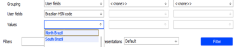

## Store Replenishment

### Store Replenishment

#### Contents

Replenishment - Contents

Overview of the Replenishment module
- Context of use and objectives
- Description of the procedure
- Preliminary settings

Creating a replenishment proposal
- Populating the header of the proposal
- Selecting options for items and quantities
- Defining calculation options
- Selecting the allocation methods

Selecting allocation methods
- Overview of allocation methods

Additional options for allocation methods
- Distribution style
- Inventory areas
- Stores to supply
- Favor location
- Miscellaneous options

Follow-up of replenishment proposals
- Viewing/Modifying a replenishment order
- Reset/Statistics

Manual inventory balancing
- Balancing procedure

Replenishment open to CBS
- Configuring the CBS process

Generating and printing documents
- Generation of replenishment documents (purchase, transfer, and store balancing)
- Reports linked to replenishment proposals

#### Overview of the Replenishment Module

Overview of the Replenishment Module

Context of Use and Objectives

Context of use

Goods are received and stored in a so-called “central” warehouse, and then routed depending on their needs, to every store via inventory transfers. Goods missing in the central warehouse may trigger the creation of a purchase order proposal or a purchase order.

This module cannot be used to automatically rebalance the stores, but nevertheless the module has a manual balancing option.

Objectives

This replenishment and distribution module must help the Inventory controller to:
- Optimize the transfers of goods from the sender warehouse to the stores to supply.
- Calculate potential shortfalls in the sender warehouse resulting in the generation of purchase order proposals or purchase orders.

The inventory controller uses a range of allocation methods to calculate the quantities to transfer, in order to complete the stocks of the stores, so that the following may be achieved:
- Reach a minimum quantity fixed or preset, by dimension.
- Address the quantities sold over given period.
- Reach a maximum quantity fixed or preset, by dimension in the case the inventory is below the minimum or maximum.
- Address the quantities ordered for replenishment over a given period.
- Transfer quantities according to the item life curve calculated previously, to the minimum inventory or to the ranking of items in sales.
- Reach a quantity defined by preset inventory assortments.
- Reach a fixed quantity entered, being the same for every dimension.
- Define inventory distribution for stores based on their respective weights as defined by the inventory controller.

Note that the last two methods are preferably used in the context of a first stock implementation, for example at the beginning of a collection. It is also possible to mix up several methods.

Description of the procedure

The module can assign the quantities present in the sender warehouse, if it performs one or more subsequent operations. Each operation is named allocation. It may concern only one reference, or a group of items, or even all items. The sum of all these allocations represents the replenishment and distribution proposal. A proposal will be implemented as follows:

Step 1

Creation of a replenishment and distribution proposal:
- Selection of the store and warehouse (if multi-warehouse management in use)
- Selection of the quantities to leave in the sender warehouse.
- Definition of the net inventory to take into account for the sender warehouse and for the stores to supply.
- Selection of the allocation methods to apply: methods already saved and/or creation of new methods; validation and then selection.
- Choice of a possible selection of items.

Step 2

Generation of the replenishment proposal

Step 3

Query/modification of the replenishment proposal result.

Step 4

Generation of documents (transfers, purchase order proposals or purchase orders.)

Replenishment scheduling

It is possible to schedule replenishment to generate the proposal and the respective documents automatically. In this case, the proposal cannot be changed anymore. However, the documents generated can still be modified.

Required settings

Serialization

Back Office > Administration > Company > Serialization

Activate the Replenishment module. This will make available the company settings linked to replenishment.

Company settings

Back Office > Administration > Company > Company settings

Various setup options are available in the company settings, in section Commercial management > Inventory .

Commercial management > Inventory

Access rights

Back Office > Administration > Users and access > Access right management

The access rights relating to replenishment are located in menu Inventory (103) - Replenishment. The various functionalities linked to this menu are listed hereafter:
- Replenishment and distribution: authorize or not employees to use this module.
- Min. max. inventory: authorize or not relevant user groups to create, modify or simply view minimum and/or maximum inventory that can be used then in the replenishment module.
- Assortments: authorize or not relevant user groups to create, modify or simply view assortments that can be used later in the replenishment module.
- Life cycle curve: authorize or not relevant user groups to exploit these curves in the replenishment module.
- Items excluded from replenishment: authorize or not relevant user groups to exclude items from the calculations made by the replenishment module.
- Rules for replenishment: authorize or not relevant user groups to define rules for the automatic and scheduled allocation of minimum inventory and/or exclusion of item references.
- Replenishment history: authorize or not relevant user groups to view the history of performed replenishment processes.
- Forecasts on sales: authorize or not relevant user groups to exploit these forecasts in the replenishment module.

#### Creating a Replenishment Proposal

Creating a Replenishment Proposal

Back Office > Inventory > Store replenishment > Assortments > Replenishment and distribution

A replenishment and distribution proposal can take time for its design and may be changed over time. It is therefore necessary to save the information entered to be able to view and modify them later.

The window that opens displays the list of existing proposals, and double-clicking a line opens the corresponding proposal.

Click the [New] button to create a new proposal; the Replenishment and Distribution screen displays where you can achieve the various steps described hereafter.

Populating the header of the proposal

| Fields | Description |
| --- | --- |
| Header | The code can be specified only in creation mode. The code has maximum 6 characters. The description must be explicit enough to describe the goal of the proposal. Specify the sender store the stock of which will be used to transfer goods. In the case of multi-warehouse management, specify the sender warehouse. |
| Replenishment type | Three replenishment types are possible: Transfer: The processing and the display of the proposal only take into account the items for which replenishment is required. The documents generated will be transfers or transfer requests. Purchase document: The processing and the display of the proposal take into account only the items for which missing quantities have been detected. The generated documents can either be purchase orders or purchase order proposals. Transfer and purchase document: The processing and the display are not optimized. The Simulation option, if enabled, creates a proposal for the main site and prohibits any action on the proposal from the remote sites. |

Selecting options for items and quantities

| Fields | Description |
| --- | --- |
| Item selection | By default for a new proposal, all items are pre-selected. To check this, the words Processing all items must be displayed in this section. If the proposal must cover a selection of items, click the [Item selection] button in the tool bar of the window, and select the Create item selection option. Select your items and launch the process. The Item selection section now displays the words Processing a selection of items . You can view this selection of items using the same button, and selecting the Query of selected items option. |
| Item limitation | In the lower part of the window, on the left, the Item limitation section is used to optimize the processing by working on a limited number of items among those selected before. Therefore select one of the following options: None: all selected items are taken into account. On inventory: only items with an inventory record (even null or negative) in the sender central warehouse are taken into account (items already moved.) On available inventory: only items with an available quantity (>0) in the sender central warehouse are taken into account. On movements: only the items moved in the store, for the period concerned, are taken into account. This option works only if a method on sales or on replenishment orders has been selected. On min. inventory of stores: only the items for which a minimum inventory has been entered for the stores to supply, are taken into account for processing. Note that it is possible to exclude some items. Therefore, an option available in the item record specifies if the item must be taken into account or not in replenishment calculation. This is aimed at taking action quickly on items that can no longer be replenished from the supplier. For a generic item: Tick the Exclude from replenishment option in the Characteristics tab of the item record. For a dimensioned item: Display the Exclude item from replenishment option in the Dimension tab of the item record, by configuring this field via the [Settings] button. Then select Yes or No. For further information, refer to the topic about Replenishment rules in chapter Manual Exclusion of Items/Stores from Replenishment . |
| Warehouse inventory | This section is used to select the quantities in stock to use in the central warehouse. If this choice is not specified, the net inventory from the sender central warehouse will be used. Otherwise, the net inventory is calculated by adding (+) to or subtracting (-) from the physical inventory in the sender central warehouse one or more quantity selections from this selection list. Qty ordered from supplier = GQ_RESERVEFOU. Delivery notice qty = Sum of the delivery notices in progress (the field does not exist in the DISPO table; so you must cover all lines of document type ALF.) Transfer notice qty = Sum of the transfer notices in progress (the field does not exist in the DISPO table; so you must cover all lines of document type TRV.) Orli preparation qty = GQ_PREPAORLI. Transfer request qty received = Sum of the transfer requests in progress (the field does not exist in the DISPO table; so you must cover all lines of document type DTR.) The lines worked on are those entering the warehouse. Purchase proposal qty = Sum of the purchase proposals in progress (the field does not exist in the DISPO table; so you must cover all lines of document type DEF.) Delivery preparation qty = GQ_PREPACLI Qty available for customer = GQ_DISPOCLI. Customer reserved quantity = GQ_RESERVECLI Transfer request qty sent = Sum of the transfer requests in progress (the field does not exist in the DISPO table; so you must cover all lines of document type DTR.) The lines worked on are those entering the warehouse. |
| Quantity to leave in warehouse | This section is used to select the quantities in stock to be left in the central warehouse. Min. inventory: keeps in stock the quantity pre-defined as minimum inventory per item/size for the sender central warehouse. Purge warehouse: no quantity is kept in the warehouse. Number of fixed parts: keeps in stock the same fixed quantity for all dimensions (sizes, colors, etc.) and for all items of the proposal. Percentage of current inventory: keeps in stock a percentage of the initial inventory in the sender central warehouse. |

Defining calculation options

| Fields | Description |
| --- | --- |
| Optimization | These options are available to optimize calculations. It is advisable to tick these options: Do not run methods after stockout (recommended): No allocation method will apply as soon as available inventory in the sender warehouse is null. This option must not be ticked in the case of shortage control, in order to be able to generate purchase orders. Limit the proposal to non-null records (recommended): keeps only records with a proposed replenishment quantity different from zero or missing part different from zero. |
| Inventory of warehouses to supply | Considering warehouses that validate notices: This option changes the requirement of stores to be supplied by defining at your choice the concept of net inventory instead of simple physical inventory. If this choice is not specified, the net inventory of each store to supply will be used. Otherwise, the net inventory is calculated by adding (+) to or subtracting (-) from the physical inventory of each store to supply, one or more quantity selections from this selection list. This option is based on the following rule: If the option is not ticked, the application takes into account the warehouses for which the option Consider in replenishments is ticked and the option Validate transfer notices is not ticked (see Warehouse Record .) In short, warehouses that validate transfer notices are excluded. If the option is ticked, the application takes into account the warehouses for which the option Consider in replenishments is ticked (see Warehouse Record .) In short, all warehouses (those validating transfer notices and those that do not) are taken into account. Note: This option is tested if the Multiwarehouse per store ” company setting is enabled (section Commercial management > Stores and warehouses,) and concerns replenishments of type Purchase and Transfer. |
| Generation after processing | This section defines the processing sequence: the generation of the selected documents will be launched at the end of the calculation process of the proposal. Tick the document type desired (purchase or transfer) and click the associated button to select the type of generation: Purchase documents: Generation of purchase orders or purchase order proposals. Transfers: Generation of sent transfers, transfer requests or transfer worksheets. |
| Rounding on "purchase by multiple qty" | This section displayed in the lower part of the screen allows you to take into account the value of Purchased in multiples of in the Characteristics tab in each selected item record. Click the associated button to select the rounding type. Examples of rounded calculations: |
| History | This option allows you to store the result of the replenishment proposal for a number of days to determine. |
| Planning | The associated button will schedule replenishments so that they will be running every day at a specific time via the Task Scheduler. |

Selecting the allocation methods

Once you have defined these various options, you must select an allocation method. You can select an already existing method, or create a new one. Once validated and then selected, the allocation method clearly displays in the table of allocation methods of the replenishment proposal.

Examples of allocations:
- Fixed quantity of 1 part by size
- Maximum quantity of 15 parts by size
- Sales from 01/15/2001 to 01/22/2001 x (coefficient 1.20) – (store inventory)

Methods can be combined in one single replenishment proposal. These methods will apply in their order of presentation, in order to achieve an ideal distribution:
- Fixed quantity of 1 part
- Min. inventory set up
- Period of sales.

In the previous case, for each store to supply, three successive passes will be made to progressively increase the quantities to transfer. The presentation order and consequently the application order of the methods can be changed in this screen without any impacts on the settings of the allocation methods. Allocation methods are described in detail in section Allocation Methods .

Allocation Methods

#### Allocation Methods

Allocation Methods

Back Office > Inventory > Store replenishment > Assortments > Replenishment and distribution

Each allocation method is saved in order to memorize the various available choices all over the year: Allocation methods for the beginning of a collection, for replenishment, for the end of a season, for promotional sales, etc.

You can create as many methods as required using the [New allocation method] button available in the Replenishment and distribution screen. In the Allocation method screen that displays, select one of the methods detailed hereafter from the Type of method selection list.

Manual entry

This is aimed at entering manually any quantities to transfer.

This is the most basic method where quantities to transfer are entered manually.

Please note!

This method cannot be combined with others.

Fixed quantity entered

This is aimed at sending a fixed quantity per store.

A fixed quantity, to be entered in the setup screen of the allocation method, is transferred to every store to supply.

Please note!

This fixed quantity entered is the same for each dimension (size, color, etc.)

Min. inventory entered

This aimed at sending a quantity, so that every store will match the minimum inventory entered.

The quantity to be sent to each store = min. inventory entered - current available inventory.

If a weighting coefficient per store is used, the formula becomes:

Quantity to send = (minimum inventory entered x coefficient) – current available inventory.

Please note!

This minimum quantity entered is the same for each dimension (size, color, etc.)

Min. inventory set up

This aimed at sending a quantity, so that every store will match the minimum inventory as preset.

The quantity to be sent to each store = min. inventory set up - current available inventory.

If a weighting coefficient per store is used, the formula becomes:

Quantity to send = (minimum inventory set up x coefficient) – current available inventory.

Please note!

The minimum inventory quantities must have been created in the Minimum and maximum inventory module. In this case, they can be different depending on dimensions.

Min. inventory => Max. inventory

This aimed at sending a quantity, so that every store will match the maximum inventory as preset, only if inventory is below the minimum inventory threshold.

This method works like the “minimum inventory set up” method, except that the store inventory will be supplied up to its maximum level, and not simply to replenish the minimum inventory.

Please note!

The minimum and maximum inventory quantities must have been created in the Minimum and maximum inventory module. They can be different depending on dimensions.

Leveled on max. inventory entered

This is aimed at limiting the quantity sent to the stores with a fixed quantity entered.

This option, combined with other methods and placed at any position, limits the replenishment of a store.

The quantity to be sent to each store = max. inventory entered - current available inventory.

If a weighting coefficient per store is used, the formula becomes:

Quantity to send = (maximum inventory entered x coefficient) – current available inventory.

Please note!

The maximum inventory quantities are the same for each dimension. Moreover, this method is necessarily associated with another.

Leveled on max. customized inventory

This is aimed at limiting the quantity sent to the stores to a maximum customized quantity.

This option placed at any position limits the replenishment of a store.

The quantity to be sent to each store = max. inventory set up - current available inventory.

If a weighting coefficient per store is used, the formula becomes:

Quantity to send = (maximum inventory set up x coefficient) current available inventory.

Please note!

The maximum inventory quantities must have been created in the Minimum and maximum inventory module. They can be different depending on dimensions. Moreover, this method is necessarily associated with another.

Max. inventory set up

This aimed at sending a quantity, so that every store will match the maximum inventory as preset.

The quantity to be sent to each store = max. inventory set up - current available inventory. If a weighting coefficient per store is used, the formula becomes:

Quantity to send = (maximum inventory set up x coefficient) – current available inventory.

Please note!

The maximum inventory quantities must have been created in the Minimum and maximum inventory module. In this case, they can be different depending on dimensions.

Period of sales

This is aimed at sending a quantity based on the analyzed period of sales.

The quantity to send to every store = quantity sold over the period.

If the “Consider store inventory” option is enabled, the formula becomes:

Quantity to send = quantity sold over the period - current available inventory.

If a weighting coefficient per store is used, the formula becomes:

Quantity to send = (quantity sold over the period x coefficient) - current available inventory.

Note that using relative dates is possible and essential for planning.

Please note!

If the Search on integration date is enabled, the analyzed period is no longer based on the date entered in the sales document, but on its integration date (useful when importing documents.)

Distribution weight

This is aimed at sending quantities to each store, based on a distribution weight previously defined by the inventory controller.

To quantity to send to each store = quantity removed from the warehouse x weight of the store. Each store is given a distribution weight by the user.

Example:

| Stores | Weight |
| --- | --- |
| Lille | 5 |
| London | 15 |
| Milan | 12 |
| Paris | 20 |
| Nice | 7 |
| Brussels | 8 |
| Total: | 67 |

For each item dimension (size, colors, etc.) the following weights will be allocated based on the following principle:

| Stores | Weight | Coefficient |
| --- | --- | --- |
| Lille | 5/67 | 7.46% |
| London | 15/67 | 22.39% |
| Milan | 12/67 | 17.91% |
| Paris | 20/67 | 29.85% |
| Nice | 7/67 | 10.45% |
| Brussels | 8/67 | 11.94% |
| Total: | 67 |  |

This method has the advantage of allowing the addition of a store without altering the others. It is well-suited when implementing the beginning of a collection.

Life cycle curves

This is aimed at applying a seasonality coefficient of the life cycle curve for each item of the item selection.

This method allows you to work on the sales of the reference period (previous day, previous week, etc.) by applying a seasonality coefficient defined by the life cycle curve module.

Example with a template curve:

| Period | History | Quantity | Projection | Coefficient |
| --- | --- | --- | --- | --- |
| 2 | 1/22/2009 to 1/28/2009 | 20 | 1/22/2010 to 1/28/2010 | 1.4 |
| 3 | 1/29/2009 to 2/04/2009 | 28 | 1/29/2010 to 2/04/2010 | 1:25 |
| 4 | 2/05/2009 to 3/11/2009 | 35 | 2/05/2010 to 3/11/2010 |  |

The replenishment calculated on the sales made between January, 30 and February 5, 2010 will be weighted the following way:
- Identification of the first day of the sales period, i.e. January, 30.
- Search for the period that includes this day: period 3.
- Multiplication of sales by seasonality coefficient.

|  | Example: | Sales of the curve |
| --- | --- | --- |
| Sales of the period | 25 | 28 |
| Coefficient | 1:25 |  |
| Replenishment | 31 | 35 |

Period of replenishment orders

This is aimed at sending a quantity relating to replenishment orders over the analyzed period, entered by the stores to be supplied.

This method works like the sales period method. Note that the replenishment orders covered by the period concerned will be closed.

Top sales over the selling period

This is aimed at using a coefficient depending on the ranking of the item within the top sales.

This method offers the advantage to privilege best-selling items, by increasing their quantities sent and freezing the items that sell poorly.

The Top sales criteria pane is used to refine the method by selecting several options, such as the period to consider for the calculation, the selection type for the top sales (simple ranking or cumulative percentage,) the top sales criterion (quantity sold or sales figures.)

Moreover, item groupings are also possible.

The “Limit to the items of the proposal” option optimizes the calculation of the top sales by taking into account only the items concerned by the replenishment proposal.

This button is used to query or simulate top sales.

Please note!

Items not sold over the period covering the top sales will not be replenished. The solution to replenish unsold items is to use a 2 nd method, based for example, on minimum inventory.

nd

The calculation period for the top sales is not linked to the selling period analyzed; but the latter is used to define the quantities to replenish whereas the first method determines the ranking of items, and consequently, the mark-up coefficients.

Top sales set up on minimum

This is aimed at using a coefficient depending on the ranking of the item within the top sales.

This works the same as the top sales method, except that the process supplements the inventory for each store up to the minimum inventory set up, and not up to the sales level of the period.

Assortment inventory set up

This is aimed at taking into account the inventory set up by using a method that resumes assortment data available in inventory by generating requirements per store.

This requirement will follow the functionalities of the proposals:
- Generation of transfers from sender warehouse to stores
- Generation of purchase orders to deal with shortage

This method will be implemented via module Inventory >, Store replenishment > Assortments

For further information on how to set up this method, please refer to Assortment Management .

Assortment Management

Forecast on sales and minimum inventory set up

This is aimed at realizing replenishment based on sales forecasts.

These forecasts must use sales history to calculate a weighting coefficient. This coefficient will apply to sales history over one or several weeks in order to obtain forecasts on sales.

The replenishment module will then make a proposal using the minimum quantities and the forecasts on sales without exceeding the maximum inventory.

Step 1: Calculate the forecasts on sales

Back Office > Inventory > Store replenishment > Forecasts on sales

Click the [New] button to open the Forecasts on sales window, where you must specify a code and a description.

- The Item list field allows you to make a selection of items to process.
- The Store trigger field allows a selection of stores.

Then, select the sales period to analyze for the calculation of the weighting coefficient.

Finally, select the sales period to be used to create the forecasts with the weighting coefficient.

Launch the process: a summary report will be displayed in the Notepad tab.

Click this button to view or modify the result manually Only the Weighting coefficient and the Week (1-10) columns are modifiable. The [Batch modification] button allows you to perform a batch modification on these columns.

Note that several forecasts on sales can be created on the same basis.

Example: You may have forecasts on sales for trousers and other forecasts for shirts.

You can also launch this process via a scheduled task.

Step 2: Launch replenishment with the method based on sales forecasts.

Back-Office > Inventory > Store replenishment > Replenishment and distribution > Allocation method screen

Select the forecast created previously in the Forecast on sales section, and tick the additional options of your choice. The method works based on the following principle:
- A proposal will be generated if the item inventory is inferior to the minimum inventory.
- A proposal will be generated if the item inventory is inferior to the forecasts on sales.
- Replenishment will be leveled if the item inventory is superior to the maximum inventory.

#### Additional Options for Allocation Methods

Additional Options for Allocation Methods

Back-Office > Inventory > Store replenishment > Replenishment and distribution > Allocation method screen

Some options are proposed to optimize the allocation methods.

Distribution style

Some options, such as the distribution style, are proposed to optimize the allocation methods. The Distribution pane, available in the Allocation method screen proposes 3 distribution types:

Hierarchical distribution

Quantities are distributed according to the display order of the store in the selection array. Therefore, if inventory is not sufficient in the sender central warehouse, distribution will be made at the expense the stores positioned at the end of the selection list.

Example: Allocation of 15 parts from the central warehouse for 5 stores requesting each 4 parts.

| Stores | Requirement | Allocation | Remainder |
| --- | --- | --- | --- |
|  |  |  | 15 |
| 001 | 4 | 4 | 11 |
| 005 | 4 | 4 | 7 |
| 002 | 4 | 4 | 3 |
| 003 | 4 | 3 | 0 |
| 008 | 4 |  |  |

Store 008 is not replenished, and store 3 has only 3 parts instead of the 4 requested.

Distribution by ratio

The allocation method is based on the “Store’s requirement/Global requirement” ratio.

Example: Allocation of 15 parts from the central warehouse for 5 stores requesting each 4 parts.

| Stores | Requirement | Ratio | Allocation | Remainder |
| --- | --- | --- | --- | --- |
|  |  |  |  | 15 |
| 001 | 4 | 20 % | 3 | 12 |
| 005 | 4 | 20 % | 3 | 9 |
| 002 | 4 | 20 % | 3 | 6 |
| 003 | 4 | 20 % | 3 | 3 |
| 008 | 4 | 20 % |  | 0 |
| Total | 20 |  |  |  |

All stores will be replenished.

Priority axis

This distribution must be implemented via Settings > Stores > Priority in replenishments You can define there several priority axes, each corresponding to a preferential ranking of stores by various criteria.

Click the [New] button to create a replenishment priority axis.

In order to get help for the selection of the stores, tick the Display multiple selection criteria for stores option to view multiple criteria such as zip code, city, etc.

Inventory areas

Some options, such as the one concerning inventory areas, are proposed to optimize the allocation methods. The Restriction on inventory proposals of stores pane is described in detail hereafter: This allows you to exclude, from the proposal calculation, items according to quantities in some inventory headings.

For example, if you do not want to replenish items with sales inferior to 2, you have to set up the following: Do not propose anything if inventory areas typed “FFO” are inferior to “2”.

Therefore, you must:
- Enable the No proposal if inventory areas setting.
- Select from the first field Front-Office sales (FFO).
- Enter 2 in the last field.

Stores to supply

Some options, such as the one concerning the stores to supply, are proposed to optimize the allocation methods. The lower part of the screen proposes a list of stores to supply. The Grouping field offers the possibility to use a group of stores.

Considering the ranking of stores

The display order of the stores is taken into account for the allocation in the case of hierarchical distribution. But, this is also important if there are residual quantities. These quantities are resulting from rounding variances: indeed, it may be difficult to transfer 1.5 unit. It is then possible to transfer 2 units (round up) or 1 unit (round down) These rounded quantities result in more or less quantities in the central warehouse as compared to the strict result of the process.

In the case of a rounding variance, the display order of the stores to supply is then taken into account, and the following principle will apply:
- Allocation of more parts compared to the parts to transfer: removal of one part per store starting from the bottom of the list until regularization.
- Allocation of less parts compared the parts to transfer: addition of a part per store starting with the top of the list until regularization.

Example:

| Stores | Coefficient | Theoretical shipment | Actual shipment |
| --- | --- | --- | --- |
| Quantity to distribute |  | 10 | 10 |
| Lille | 33.33% | 3 | 4 |
| London | 33.33% | 3 | 3 |
| Milan | 33.33% | 3 | 3 |

Favor location

Some options, such as the Favor location option, are proposed to optimize the allocation methods.

This option available in the central part of the Allocation method screen supplements methods on minimum inventory.

It favors stores that did not had the item in their possession, and thus do not offer this item for sale, replacing at the end of the list, the stores that have already received and sold this item.

This option may be useful in the following case: a new item is tested in 3 stores.

If it sells well, all the stores will be replenished, favoring those that have not yet sold this item (based on GQ_VENTEFFO): The 3 store of the test are not priority.

Example:

| Order | Store | Min. inventory | Received | Sale | Inventory | Requirement |
| --- | --- | --- | --- | --- | --- | --- |
| 1 | Paris Grenelle | 4 | 4 | 4 | 0 | 4 |
| 2 | Lyon | 4 | 4 | 3 | 1 | 3 |
| 3 | Toulouse | 2 |  |  |  | 2 |
| 4 | Lille | 2 |  |  |  | 2 |
| 5 | Cannes | 2 |  |  |  | 2 |

With this new option, the priority of the stores changes:

| Order | Store | Min. inventory | Received | Sale | Inventory | Requirement |
| --- | --- | --- | --- | --- | --- | --- |
| 1 | Toulouse | 2 |  |  |  | 2 |
| 2 | Lille | 2 |  |  |  | 2 |
| 3 | Cannes | 2 |  |  |  | 2 |
| 4 | Paris Grenelle | 4 | 4 | 4 | 0 | 4 |
| 5 | Lyon | 4 | 4 | 3 | 1 | 3 |

Miscellaneous options

Some options, such as those described hereafter, are proposed to optimize the allocation methods.

Checking maximum inventory

If an allocation method based on maximum inventory is used, the Checking maximum inventory option allows you to ignore it. (Example: First, use of two methods that take into account the maximum inventory method, and then a final method that does not take it into account.

Applying coefficient per store

If the Applying coefficient per store option is ticked, then in the list of stores, the Coeff. column allows you to enter the coefficient manually for each store, in order to weight the quantities to transfer. This coefficient increases (superior to 1) or decreases (inferior to 1) the actual requirements of stores. It may vary from <0 (if 0, the store is removed from the list) to 1,000 (maximum value)

Consider store inventory

This option is used to adjust the final replenishment proposal, taking into account the actual inventory existing in the store. (Example: If the gross replenishment proposal is 2, and there is 1 in stock, then the net proposal will be 1).

#### Follow-up of Replenishment Proposals

Follow-up of Replenishment Proposals

Back Office > Inventory > Store replenishment > Replenishment and distribution

Viewing/Modifying a replenishment order

The screen displays a list of existing proposals: double-click on the proposal you want to view or modify.

Replenishment of type Transfer

Click the [Proposal modification] button available in the tool bar. Only items requiring replenishment are proposed.

Just click the [Select all] button to select all the items proposed, or use the space bar to select items of your choice one-by-one.

Click the [Proposal validation] button to display the Generate transfers window. Then select your transfer options.

Replenishment of type Purchase document

Click the [Proposal modification] button available in the tool bar. Only items with shortage are proposed.

Just click the [Select all] button to select all the items proposed, or use the space bar to select items of your choice one-by-one.

Click the [Proposal validation] button to display the Generation of purchases window. Then select your purchase options.

Replenishment of type Transfer and purchase document

Click the [Proposal modification] button available in the tool bar. The Allocation screen is divided into 2 parts:

- The upper part displays the list of the impacted items.
- The lower part displays the detail of the allocation for the sender central warehouse and the stores to supply.

According to the item you will select in the upper part, the low part will display its details.

Relating to proposals:
- For items without dimensions: proposals can be directly modified in the lower part of the screen.
- For items with dimensions: double-click on a line displayed in the lower part to open the Item entry screen to view and modify the item distribution per dimension.

You can invert the display of the screen by clicking the [Invert] button to control for a given item the quantities sent to each store.

Note that two options in the header of the screen may limit the display of the proposal items to the items with at least one missing part and/or with at least one proposal.

The setup of columns allows you to display 2 types of quantities:
- Column Missing : If the requirements of a store are not fully satisfied (excluding maximum inventory allocation methods), this column will display missing quantities for the central warehouse.
- Column Surplus : If the requirements of a store are fully satisfied, and there is still a quantity to allocate in the central warehouse, this column will display these quantities.

The proposals made will be saved when you exit the Allocations screen

Reset/Statistics

Erase or reset the replenishment proposal

Use this button, available in the Replenishment and distribution screen to:

- Reset proposal: its settings are kept. Only the allocation result is erased. This option is preferred to deletion.
- Erase notepad: the Information tab is cleared of all previous process traces.

View statistics on proposals

Click the [Statistics on proposals] button to view the number of references sent to each store by the means of a replenishment proposal.

Information displayed on the Statistics on proposals screen can be exported in binary or Excel format by the means of the [Export] button.

#### Manual Inventory Balancing

Manual Inventory Balancing - Contents

Manual inventory balancing allows inventory exchanges between stores, facilitating rapid inventory balance between different warehouses. This manual balancing procedure may be carried out using the Inventory Balancing command or the Replenishment and Distribution command.

Moreover, you can also use aggregates helping inventory to be balanced manually, regardless of the command used.

Procedure through Inventory Balancing
- Step 1: Create inventory balancing
- Step 2: Select reference
- Step 3: Enter quantities to transfer
- Step 4: Launch the process

Procedure through Replenishment and Distribution
- Step 1: Display the Balancing column
- Step 2: Prepare transfers
- Step 3: Print inventory balancing for stores
- Step 4: Generate inventory balancing for stores

Aggregate calculation
- Selecting stores and items
- Calculation settings
- Launching the calculation
- Using aggregates when balancing inventory

#### Replenishment Open to CBS

Replenishment Open to CBS

Back Office > Inventory > Store replenishment > Replenishment and distribution

This is aimed at handing over control to an external tool that will modify the quantities proposed by the replenishment feature, in order to generate later documents in Cegid Retail Y2.

Configuring the CBS process

You can specify in each record that the proposal is to be modified by CBS, after the calculation of the proposal.

Open the proposal of your choice, click the [Specific settings] button to define the options of the process.

| Fields | Description |
| --- | --- |
| CBS process | Tick this option to specify that a CBS process will be carried out. If this option is ticked, the replenishment calculation will be performed, but documents will not be generated. |
| Generation after processing | Select the documents you want to generate: The Purchase documents option refers to documents such as purchase order proposal, purchase orders, etc. The Transfer option refers to documents such as transfer requests, transfers, etc. |
| Scheduling | The Task number field specifies that the document generation is processed as scheduled task. |

#### Generating and Printing Replenishment Documents

Generating and Printing Replenishment Documents

Back Office > Inventory > Store replenishment > Replenishment and distribution

Generation of replenishment documents

Generation of purchase documents

Open the proposal of your choice; click the [Processing] button, and then the Generate purchase documents option.

This process can then result in detecting missing quantities in the central warehouse. You can then generate for these quantities, purchase orders or purchase order proposals.

In the Generation of purchases screen that displays, the Generation pane proposes the generation methods described hereafter:
- Y2 generation : This option generates directly in Cegid Retail Y2, a purchase order or a purchase order proposal. The Distribution by stores option, if enabled, generates a purchase document for each store. Otherwise, one single document is generated for the sender central warehouse.
- Generation of an ASCII file : A file can be generated according to a configurable format. This file can be transferred to another device via an FTP copy.
- Generation of an ORLI ASCII file : A file can be generated according to a format adapted to ORLI. This file can be transferred to another device via an FTP copy.

Note! If the <DATE> tag is embedded in an ASCII file, the generated file is time-stamped.

Generation of transfers

Open the proposal of your choice; click the [Processing] button, and then the "Generation of transfers" option.

Replenishment proposals are changed into transfers sent to the stores.

In the Generate transfers screen that displays, the Generation pane offers 3 generation methods described hereafter:
- Y2 generation : Transfers or transfer requests are directly generated in the application. The transfer proposal allows the use of a document type called Transfer request instead of transfers. This will reserve the goods until their preparation, and finally their transfer. In order to take into account these transfer requests, you must enable, in the setup window of the proposal, the Transfer request quantities (received/sent) located in the Warehouse inventory pane. The transfer requests can be validated as sent transfers + transfers to validate or received transfers depending on the recipient store. A report enables you to view the gaps between the transfer requests and the transfers sent to the stores.

Please note!

There is no management of remaining quantities between a transfer request and a sent transfer. Upon validation of a sent transfer, the transfer request is closed immediately.
- Generation of an ASCII file : A file can be generated according to a configurable format. This file can be transferred to another device via an FTP copy. This feature can be used in the case where inventory is managed by an independent “stocker”. If the Positive allocation proposals option is ticked only positive proposals are taken into account.
- Generation of an ORLI ASCII file : A file can be generated according to a format adapted to ORLI. This file can be transferred to another device via an FTP copy.

Note! If the <DATE> tag is embedded in an ASCII file, the generated file is time-stamped.

Generation of store inventory balancing

Open the proposal of your choice; click the [Processing] button, and then the Generate store inventory balancing option.

Once launched, the process prepares the transfer requests, then the transfer validations to finally achieve the printout of the document.

Reports linked to replenishment proposals

In the Replenishment and distribution screen, this button allows you to print the following reports:

- Preparation slip: prints a list of transfers sorted by items.
- Transfer proposal: prints a list of items for each transfer. Note that proposals can still be modified after printing.
- Labels: prints the labels linked to the proposal. Note that the Page layout section allows you to select the template and some printing options specific to labels.
- Balancing of stores: the Page layout section allows you to select the template desired for this inventory balancing.

### Replenishment Rules

#### Content

Replenishment Rules - Contents

Cegid Retail Y2 enables you to manage replenishment using several rules previously set according to your needs. Both rules allow you to manage replenishments are based on minimum and maximum inventory management, as well as item exclusion.

Note that the Replenishment module must be serialized to be used.

For further information, also see topic Store Replenishment .

Store Replenishment

Overview and settings of replenishment rules
- Objective and overview
- Optional settings

Managing replenishment rules
- Creating replenishment rules
- Procedure according to the rule selected
- Operations possible on replenishment rules

Manual exclusion of items/stores from replenishment
- Exclude from item replenishment
- Exclude from store replenishment

#### Overview and Settings

Overview and Settings of Replenishment Rules

The 2 rules allowing you to manage replenishment are as follows:
- Min. Max. inventory: This rule initializes the minimum, maximum inventory and assortments in a cross-reference of items and stores.
- Exclude items from replenishment: This rule allows you to block a replenishment item, at the most detailed level for a group of stores.

For both rules: If the inventory record does not exist, it will be automatically created. The principle is to create a list of rules to be applied at night in scheduled tasks, so that replenishments launched the following day recognize the new values set for min./max inventory, or in the blocking of references.

Note that you may manually intervene to specify replenishment values at the item’s most detailed level (directly in the item record). But this operation is rather long and must be repeated for each automatically generated list.

We recommend that you avoid multiplying rules, otherwise this function will become complex.

To use replenishment rules, you must properly classify the information in the database.

Overview of replenishment rules

Back Office > Inventory > Store replenishment> Rules for replenishment

Min. and Max. inventory rule

This method allows you to manage a single operation the update of:
- Minimum inventory
- Maximum inventory
- Assortment inventory

Item exclusion rule

This method automatically updates replenishment exclusions (exceptions) before each replenishment proposal.

Example: Exclude from replenishment:
- woolen items
- for stores in a “regional” network
- during summer

Please note! Rules set in this way may overwrite exceptions entered manually.

Optional setup: Creating item lists

Back Office > Basic data > Items > List of items

You can use item lists in order to process large volumes of items during replenishment. This step is, of course optional, but it enables you to directly select a generic item list (or dimensioned) to apply the rules to.

For more information, refer to Lists of items .

Lists of items

Remember: These lists must have Replenishment as scope of use.

#### Managing Replenishment Rules

Managing Replenishment Rules

Creating replenishment rules

Back Office > Inventory > Store replenishment > Rules for replenishment

Only the lower section of the screen will differ, regardless of the rule selected. Consequently, follow the procedure common to rules, as described below, to create replenishment rules.

Click this button to display the Replenishment rules window.

Generic information

Rules must have a code and description, as well as a validity period.

The Closed option allows you to prevent the use of a rule. Another solution to avoid using a rule is to exclude the validity period.

Selecting stores and items

AND/OR between each selection provides you with a maximum of combinations as to item and store selection. Store selection may be done one by one, using the Values fields.

You may also use groups previously created in user-defined store tables.

Items may be selected in two ways:
- By classification: collection, category level, user-defined tables. Several values can be selected for each classification.
- From previously created item lists (see Creating Item Lists ).

Based on the rule selected

This procedure is detailed hereafter.

Procedure according to rule selected

Back Office > Inventory > Store replenishment > Rules for replenishment

If the rule is an Item Exclusion type

The Replenishment excluded panel is displayed in the lower section of the screen. Options in this section allow you to specify whether the item is:
- Integrated into replenishment: check the Consider option, or
- Excluded: check the Exclude option

In this way, you can manage rules more specifically:
- Rule to exclude an item from replenishment for all dimensions.
- Rule to take into account the item for the color White.

If the rule is “Min. and Max. Inventory”

The panel concerning various inventories (minimum, maximum and assortments) will be displayed in the lower section of the screen.

When executing rules, the quantity will be updated according to the options checked and quantity entered.

Operations possible on replenishment rules

Back Office > Inventory > Store replenishment > Rules for replenishment

Schedule processing

Using several criteria, you can program the calculation of the rules so that they are run during the night.

Generate update operations

This button enables you to manually start the operation. The information in item records by store will then be updated.

This method allows you to check runtime and see the results immediately. Runtimes are saved in the Notes tab, in the Replenishment rule record.

Duplicate a rule

Within a record, this button allows you to duplicate just one existing rule by clearing the code and description. This rule will take the last row run.

Delete a rule

With a record, this button allows you to permanently delete a rule. If you wish to temporarily disable a rule, close it or exclude it from the period of validity.

#### Manual Exclusion

Manual Exclusion of Items/Stores from Replenishment

Exclude from item replenishment

In CEGID Retail Y2, there is a method for excluding items from replenishment, but this method does not allow exceptions to be saved. It enables you to quickly take action on items which can no longer be ordered from the supplier (item exclusion), or must never be replenished in a store (item exclusion in-store). Exclusion may be done record by record or in series.

One by one exclusion

Back Office > Basic data > Items > Items

In item records, you can manually exclude desired items from replenishment:
- For a generic item: Check the Exclude from replenishment option in the Characteristics tab of the item record.
- For a dimensioned item: Display the Exclude item from replenishment option in the Dimension tab of the item record, by configuring this field via the [Settings] button. Then select Yes or No.

Excluding in series

Back-Office > Inventory> Store replenishment> Exclude items from replenishment

The update in series function enables you to set exclusions by replenishment or re-integrate them into replenishment, several items at a time. Numerous selection criteria, such as item characteristics (free item, discountable, etc.) or by dimension, enable you to do this.

Select the desired items using the space bar, then click the button to start processing. The Exclude items from replenishment window will open with the following options:

- Exclude from replenishment
- Re-integrate into replenishment

A report will be displayed at the end of the operation.

Exclude from store replenishment one by one

Back Office > Basic data > Items > Items

You can manage exceptions by excluding items for a specific store.

Generic items

Click the [Additional information] button in an item record, then select the Warehouse inventory availability option.

In the Available items window which will open, select the desired warehouse then double-click on a warehouse line.

When the new window opens, open the Information tab and check the Exclude replenishment/warehouse ” option.

Dimensioned items

Select the desired warehouse in an item record’s Dimension tab.

Use the [Settings] button to display the Exclude from store replenishment field,

This window will enable you drag the field into the list of values displayed.

Click the Exclude from store replenishment field in the Dimension tab then select Yes or No. Your choice will depend in whether or not you wish to exclude an item from store replenishment.

### Manual Inventory Balancing

#### Contents

Manual Inventory Balancing - Contents

Manual inventory balancing allows inventory exchanges between stores, facilitating rapid inventory balance between different warehouses. This manual balancing procedure may be carried out using the Inventory Balancing command or the Replenishment and Distribution command.

Moreover, you can also use aggregates helping inventory to be balanced manually, regardless of the command used.

Procedure through Inventory Balancing
- Step 1: Create inventory balancing
- Step 2: Select reference
- Step 3: Enter quantities to transfer
- Step 4: Launch the process

Procedure through Replenishment and Distribution
- Step 1: Display the Balancing column
- Step 2: Prepare transfers
- Step 3: Print inventory balancing for stores
- Step 4: Generate inventory balancing for stores

Aggregate calculation
- Selecting stores and items
- Calculation settings
- Launching the calculation
- Using aggregates when balancing inventory

#### Procedure Through Inventory Balancing

Procedure Through Inventory Balancing

Back Office > Inventory > Processing > Inventory balancing

This command is used to prepare transfer requests over several days and validate all at once.

Step 1: Create inventory balancing

Click the [New] button to create the desired inventory balancing, and populate the fields described hereafter.

| Fields | Description |
| --- | --- |
| Code and description | Code and description of the record for quick identification. For example: Balancing stores in Paris |
| Display of item selection | Optional field used to select references to limit the item select to a specific color or size, for example. |
| Multi-store mask type | To be operational the balancing module is based on a multi-store mask type. Just to remind: masks and mask types must be created in the Settings module via the item dimensions menu. |
| Status | Three values pare possible: On hold: The module is waiting for references to be entered Error: Transfer requests failed to be generated Done: Transfer requests are generated. Inventory balancing cannot be modified. It can only be viewed. You must create a new code to generate a new balance. |
| Display of replenishment aggregates | Optional options use to manage aggregates for inventory balancing. First of all, aggregates must be calculated before you can use them. Consequently, for further information about aggregates, please refer to: Aggregate calculation Display of aggregates (see Step 3 hereafter.) |
| Statistics | Allows you to find out if there are transfer requests awaiting generation. |

Step 2: Select reference

This button gives access to list of items. The display of this list depends on the selection done on the previous screen, in field Display of item selection.

Double-clicking a line triggers the display of the item selected, and detailed by warehouse. The header of the screen displays 3 types of data:
- Information on item
- Selection of the warehouse to deplete
- Filter on the warehouses to display

Step 3: Enter quantities to transfer

You have to select a sender warehouse to perform transfers. Once this warehouse is selected, it will be highlighted in dark blue, and the font is displayed in white.

To customize the display of that screen, use this button and select the fields to display, such as proposal, balancing, initial inventory, and final inventory, for example.

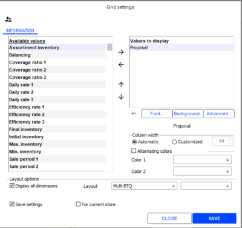

Proposal is the only required field that will be used to enter the quantity to transfer between warehouses. The other fields are optional; you can select a maximum of 10 fields.

Two fields are dynamic fields:
- Balancing: corresponds to the proposal. If you are positioned on the sender store the Balancing field is negative; otherwise it is positive.
- Final inventory: corresponds to Initial inventory minus the value in field Balancing .

The Initial inventory field displays the physical inventory (GQ_PHYSIQUE) of the item in its warehouse. This inventory value indicates whether it is possible to transfer the item from one warehouse to the other.

Display aggregates

Note: if you want to use aggregates for inventory balancing, you must calculate them before. Before proceeding with the procedure described here, refer to the chapter about Aggregates calculation . Aggregates are available at item level by warehouse:

Aggregates calculation
- 3 coverage rates, expressed in number of days.
- 3 daily rates originating from the coverage rate calculation
- 3 sales periods originating from the coverage rate calculation
- 3 efficiency rates
- 3 turnover rates

These values are displayed in the table based on the customization done in the setup window.

On this screen, click the [Advanced...] button to display the window where you can define the conditions on the fields.

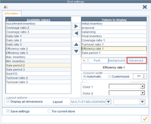

Examples:

| Display on a green background a turnover rate higher than 2.4 | Display on a red background physical inventory higher than 0 |
| --- | --- |
|  |  |

Display balancing details

Click this button to open a recap of balancing details as you entered it.

Step 4: Launch the process

After having validated the previous steps, the Inventory balancing window displays again, and allows you to generate inventory balancing and view the transfer requests.

#### Procedure Through Replenishment and Distribution

Procedure via Replenishment and Distribution

Back Office: Inventory - Store replenishment - Replenishment and distribution

The Replenishment and distribution module can automatically trigger restocking from the sender central warehouse, or issue replenishment requests to suppliers. The balancing feature enables manual stock exchanges between stores thanks to the results of the initial proposal.

manual stock exchanges

Note that inventory balancing is only possible after having launched a replenishment calculation. Indeed, the result of this calculation will be used for inventory balancing.

after

Please note!
- Only replenishments of type Transfer and purchase document allow you to perform inventory balancing.
- Replenishment of type Transfer or type Purchase document do not offer this possibility.

Step 1: Display the Balancing column

The Replenishment and Distribution screen displays the list of existent proposals.

Double-click a proposal of type Transfer and purchase document, and then click the [Proposal modification ] to open the Allocations screen.

In this screen, click the [Column settings] button, and add Balancing to the list of columns to display.

The addition of this column will highlight the items concerned.

Specials about dimensioned items

On the Allocations screen, for dimensioned items, double-click the size/store combination concerned.

The Item entry screen then displays; click this button to configure the Balancing column.

Step 2: Prepare transfers

This is aimed at transferring merchandise from one store to another. This operation will be performed from the following screen:
- From the Allocations screen for a unique size item
- From the Item entry screen for a dimensioned items

The option described hereafter are available for each cell by the means of a mouse right-click. Select the store that will send the goods via the contextual menu Selection of the sender store (right-click on the cell.)

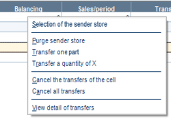

You must then position on the store that will receive the goods, and select the quantity to transfer by the means of the contextual menu (right click):
- Purge the sender store: recovers the initial inventory of the sender store.
- Transfer one part
- Transfer a quantity of X
- Two options allow you to cancel the transfer:
- Viewing the transfer detail will display the transfers sent or received in the store for the selected item.

Step 3: Print inventory balancing for stores

From the Replenishment proposal screen, the [Print] button will print a summary of inventory balancing.

Step 4: Generate inventory balancing for stores

From the Replenishment proposal screen, the [Processing] button will generate inventory balancing in stores.

The result can be displayed in the query of transfers by selecting Transfer request as document type.

#### Aggregate Calculation

Aggregate Calculation

Back Office > Administration > Scheduled tasks > Replenishment aggregates

Aggregate calculation is an operation scheduled at night or launched manually.

Selecting stores and items

Aggregate calculation is not significant on all items and all stores. The Characteristics tab displays two sections where you can limit the items and stores to process.
- Store selection
- Item selection

Aggregate calculation can be launched several times, in particular for managing groups of items, or different sales periods per store.

For items, the calculation will be performed at the finest level, i.e. the barcode.

Calculation settings

Turnover rate

The objective of this rate is to determine how many times an item is restocked in the store, from its location. For this kind of calculation, the following elements must be taken in account:
- Inventory
- Purchases
- Internal movements
- Sales: Three periods can be defined in order to analyze the turnover more accurately depending on the period (e.g., standard period, first markdown period, and second markdown period.) These periods may show the acceleration or fall of the turnover rate. These periods are necessarily consecutive, thus allowing you to benefit automatically from an overall period adding the sum of each period.

Note: When considering purchases and internal movement, you can use document user-defined tables. Therefore, it is necessary to configure the user-defined tables in the Settings Module, via menu Documents and Command Documents/Types (select the document type and go to the User-defined tables tab.)

Efficiency rate

The objective of this rate is to determine the sell-through rate of the items received. For this kind of calculation, the following elements must be taken in account:
- Inventory
- Purchases
- Internal movements
- Sales: The three periods concerned are defined in the same logic as for the turnover.) Three efficiency rates can be used:

Coverage rate

The objective of this rate is to determine the number of selling days before shortage. This rate depends on the sales period taken into account. This kind of calculation uses a daily rate and a sales period. An intermediate calculation will be performed to determine the number of days each store was open. We should consider that a store is open if at least one sale has been finalized during the day.

For this kind of calculation, the following elements must be taken in account:
- Inventory
- Sales: The three periods concerned are defined in the same logic as for the turnover.) Three coverage rates can be used (such as coverage compared to week’s sales, coverage compared to the month’s sales and coverage compared to the sales from the location.

Launching the calculation

Click this button to launch the aggregate calculation.

Click this button to display the result.

Using aggregates when rebalancing inventory

To use aggregates when entering inventory quantities to transfer from one store to the other, refer to chapter Entering quantities to transfer , and in particular section “Show aggregates”.

Entering quantities to transfer

### Managing Assortments

#### Contents

Managing Assortments - Contents

The aim is to determine the products distributed by each store, with the constraint that two stores can sell different items. The way to create this relationship is having a link between a store and every item it sells. Modeled management rules can be implemented to make this association the fastest as possible. When creating a new item, this relationship enables faster allocation of inventory without having to enter the quantities manually. This module enables you to define the assortment inventory across both items and stores, in order to use this assortment inventory as minimum inventory in restocking.

Settings for assortments
- Company settings
- Range types
- Access rights

Configuring items
- Creating assortment criteria for items
- Allocating assortment criteria to items
- Entering ranges by item

Configuring stores
- Creating assortment criteria for stores
- Creating assortment criteria for stores
- Entering ranges by store

Using assortment inventory
- Initializing assortment inventory
- Use in replenishment and distribution
- Copying assortment inventory

#### Settings for Assortments

Settings for Assortments

Company settings

Back-Office > Administration > Company > Company settings

Go to Commercial management > Inventory, and tick the Assortment inventory management option.

Range types

Back-Office > Inventory > Store replenishment > Assortments > Range types

This command is used define assortment levels.

Examples:
- Level A for low cost range
- Level B for medium range
- Level C for luxury range

Access rights

Back-Office > Administration > Users and access > Access right management

Access rights authorizing or not the use of functionalities linked to assortments are set in the Inventory (103) menu.

Inventory - Store replenishment
- Replenishment and distribution

Inventory - Store replenishment/Min. and max. inventory
- Copy assortment inventory

Inventory - Store replenishment/Assortments
- Range types
- Item criteria
- Allocate item criteria
- Enter ranges by item
- Store criteria
- Allocate store criteria
- Enter ranges by store
- Initialize assortment inventory

#### Configuring Items for Assortments

Configuring Items for Assortments

Creating assortment criteria for items

Back Office > Inventory > Store replenishment > Assortments > Item criteria

This command allows the creation of assortment types that will be allocated later to items ( Assortment criterion field available in the Characteristics tab of the item record.) The criteria allow you to group the items based on their distribution type in the store. Assortment criteria are of different types.

Examples:
- Ready-to-wear for women, Ready-to-wear for men, Children, etc.
- Sports watches, Fashion watches, Alarm clocks, Clocks, etc.
- Supplier 1, Supplier 2, Suppler 3, etc.
- Brand 1, Brand 2, Brand 3, etc.

The entry of an assortment criterion is not mandatory. Items without an assortment criterion are not taken into account in replenishment by assortment.

Items can also be excluded from replenishment, temporarily, if their assortment criterion is removed from the item record.

Specificity of the Exceptional criterion

An assortment criterion of type Exceptional criterion is created systematically. The items it represents are then managed in a special way (see the paragraph Entering ranges by item.) This criterion cannot be suppressed and is defined as follows:
- Code: ...
- Description: Exception

Allocating assortment criteria to items

Back Office > Inventory > Store replenishment > Assortments > Allocate Item criteria

This command allows you to quickly allocate an assortment criterion to all of the selected items: It also allows you to change the assortment criterion of the item, or delete it, so that the item will not be taken into account in replenishment by assortment.

Note that this allocation can also be done in the item record, through field Assortment criterion, available in the Characteristics tab

Entering ranges by item

Back-Office > Inventory - Store replenishment - Assortments > Enter ranges by item

Two options available in the upper part of the screen allow you to enter a value crossing both the range and the item assortment criterion.
- Entry by assortment criterion This option allows you to enter the typical quantity at the intersection of the assortment criterion and the range.
- Entry by item to manage the exceptions This option is used to process items with an assortment criterion of type Exception . Distribution is done directly by item. Note that new items will be associated with the default value of the assortment criterion, but this information can be modified.

After checking the desired entry type, select an item type end a range type.

Then, apply a filter to display the results.

At this point, two buttons are available to perform the following actions:
1. Use the [Entry by item] button to display a new window and enter a range for each item.
2. This button allows you to apply the default values of the criterion.

#### Configuring Stores for Assortments

Configuring Stores for Assortments

Creating assortment criteria for stores

Back Office > Inventory > Store replenishment > Assortments > Store criteria

In the same way as for items, you enter assortment criteria with the purpose of grouping together stores that have similar functions: You can create geographical criteria, for example, Northern stores or Southern stores.

The record of each store includes a new field — Assortment criterion in the Additions tab — to enter this new information. If no assortment criterion is allocated to the store, the latter is not taken into account.

Allocating assortment criteria to stores

Back Office > Inventory > Store replenishment > Assortments > Allocate store criteria

This screen allows you to quickly allocate assortment criteria to each store.

Note that this allocation can also be done in the store record, through field Assortment criterion , available in the Additions tab.

Entering ranges by store

Back Office > Inventory - Store replenishment - Assortments > Enter ranges by store

The allocation is used to configure the types of ranges to be assigned to each store. Two options available in the upper part of the screen allow you to enter a value crossing both the item assortment criterion and the store:
- Entry by assortment criterion: This option allows you to enter the type of range at the intersection of the item assortment criterion and the store.
- Entry by item to manage the exceptions: This is used to process items with an assortment criterion of type Exception . Distribution is done directly by item.

After checking the desired entry type, select an item criterion and a store criterion.

Then, apply a filter to display the results.

At this point, two buttons are available to perform the following actions:
1. Use the [Entry by item] button to display a new window and enter a range for each item.
2. This button allows you to apply the default values of the criterion.

#### Using Assortment Inventory

Using Assortment Inventory

Initializing assortment inventory

Back Office > Inventory > Store replenishment > Assortments > Initialize assortment inventory

Once the stores to update selected, start processing by the means of the [Validate] button

The Assortment inventory field is initialized on a store-by-store basis in the following way:
- If the Store assortment field is left blank, it means that you are forcing the assortment inventory from the main warehouse to 0.
- If there is an entry in the Store assortment field, the following applies:

Please note!

Only the main warehouse and the store will be impacted. This operation is logged to the event log.

Use in replenishment and distribution

Back Office > Inventory > Store replenishment > Assortments > Replenishment and distribution

The assortment inventory is taken into account by creating and using a method that resumes assortment data available in inventory by generating requirements per store. This requirement will follow the functionalities of the proposals:
- Generation of a transfer from the warehouse to stores, if there is a warehouse
- Generation of purchase orders

Copying assortment inventory

Back Office > Inventory > Store replenishment > Mini. and max. inventory > Copy assortment inventory

This command is used to copy the assortment inventory to the minimum and/or maximum inventory for each item of the store.

### Minimum and Maximum Inventory

Minimum and Maximum Inventory

Specifying a minimum inventory involves entering the quantity you do not want the inventory of an item to fall below. The objective is to avoid inventory shortages, and particularly zero inventory, and thus avoid losing potential sales.

Conversely, specifying a maximum inventory involves entering the quantity which you do not want the inventory of an item to exceed. The objective is to avoid inventory surpluses and their associated costs.

Simply entering minimum and maximum quantities is not sufficient to achieve these objectives. Instead, entering these quantities is intended to be used as a basis for the implementation of automatic replenishment methods.

Several methods described in detail hereafter are proposed to generate minimum and maximum inventory: Wizard-based generation, Manual generation, Duplication, Per item, For selected items, etc.

Note:
- The generation of minimum and maximum inventory involves initializing inventory for a store/warehouse from scratch, while creating inventory records if they do not exist. You must therefore enter the values to be assigned.
- When duplicating minimum/maximum inventory , the existing values for a warehouse are used to initialize inventory for a store/warehouse, with the creation of inventory records if they do not exist. The existing value are therefore duplicated, without having to re-enter them.

Preliminary settings

Line information

Back Office > Settings > Documents > Documents > Types

These are optional settings which enable you to view the minimum and/or maximum quantity set for documents of your choice

Select the desired document type on the right side of the screen.

Open the Line info tab and select Minimum inventory and/or Maximum inventory .

For example, if you have configured Maximum stock for the Supplier order type, this will allow you to view the maximum inventory configured for each item in the document when entering orders.

Access rights

Back Office > Administration > Users and access > Access right management
- Menu Inventory (103) > Replenishment > Min. and max. inventory: The lines in this menu allow you to authorize the relevant user groups to use the various methods for managing minimum and maximum inventory.

Generating minimum and maximum inventory using a wizard

Back Office > Inventory > Store replenishment > Min. and max. inventory > Generation wizard

The wizard allows you to generate the minimum and/or maximum inventory for a list of warehouses from orders for new products, for example. The aim is to generate a minimum inventory based on the quantities entered in orders or receipts for a given period.

First, simply specify the type of document and the period to be analyzed and then tick the Minimum inventory and/or Maximum inventory boxes as appropriate.

Coefficients are used to decrease or increase the gross quantities calculated by the process.

The warehouses affected can then be selected and switched to the Warehouses to supply column in the desired order of calculation.

Then, use the [Apply] button to start the search for items corresponding to the criteria previously entered.

If you wish to obtain additional information on the proposed calculations, click the [Information] button.

Before any update, press the [Generate list] button to view the item list.

If you wish to update all item stock records, use the [Generate all] button.

You may use the [Undo] button to reboot the operation at any time.

Manual generation of minimum and maximum quantities

For selected items

Back Office > Inventory > Store replenishment > Min. and max. inventory > Initialize min. and max. inventory

This feature allows you to view and generate minimum and/or maximum quantities for previously selected items, or for just some of their dimensions.

If you want to make a non-continuous selection of items, use the space bar; otherwise, you should use the [Select all] button.

Validation will then be done using the [Launch process] button.

The Inventory Initialization window will open, where you can enter the minimum and/or maximum quantities for the items selected.

Use the [Save] button to start the process.

Notes:
- The maximum quantity must be greater than the minimum quantity.
- If you are not using maximum inventory, we recommend that you uncheck the option to avoid entering a zero quantity.

Per item

Back Office > Basic data > Items > Items

You can enter or modify the minimum and maximum inventory for an item and a warehouse from the item record directly.
- Dimensioned item: The Dimensions tab in the Item record allows you to view and change these values. The [Settings] button allows you to select the Min. inventory and Max. inventory fields in the dimension object.
- Non-dimensioned item: The [Additional information/Warehouse inventory availability] button opens the Available items window, allowing you to view item inventory in a particular warehouse. You can double-click on one of the lines. Each line corresponds to a store. A new window then displays, where you can directly modify the minimum and/or maximum inventory quantities in the second tab (Inventory.)

Through duplication

Back Office > Inventory > Store replenishment > Min. and max. inventory > Duplicate min. and max. inventory

This feature allows you to copy the minimum and/or maximum quantities from a reference warehouse to a list of warehouses for previously selected items, or for just some of their dimensions.

For example, this is the case if you want to use the values of a warehouse to initialize inventory for a store/warehouse, with the creation of inventory records if they do not exist. At this stage, the existing values are duplicated, without having to re-enter them.

If making a non-continuous selection, you can use the space bar to select the items; otherwise, use the [Select all] button.

Use this button to validate. A window will open where you can:

- Specify the warehouse of reference
- Check the option for copying the minimum and/or maximum inventory, or the assortment inventory for the selection
- List the warehouses to be supplied

The Create inventory records option allows you to generate minimum and/or maximum inventory even when the item is not in stock in one of the stores to be supplied.

The Erase data before updating option resets the minimum and/or maximum quantities in stock.

The [Statistics] button allows you to view information on the items included in the selection, via the notepad.

By dimension mask

This method allows you to enter the minimum and/or maximum quantities in stock using dimension masks. It can be adjusted according to the allocation types, which have been previously entered.

Step 1: Create allocation types

Back Office > Inventory > Store replenishment > Min. and max. inventory > Type of inventory allocation

Allocation types enable you to make several different entries for the same dimension mask. All you have to do then is select the given type depending on the stores. This method allows you to vary the minimum and maximum quantities according to external criteria such as the surface area of the stores or their sales figures.

Example 1:
- TO1: Average sales turnover
- TO2: High sales turnover
- TO3: Very high sales turnover

Example 2:
- RO1: Average stock rotation
- RO2: High stock rotation
- RO3: Very high stock rotation

Step 2: Enter generation templates for minimum & maximum inventory

Back Office > Inventory > Store replenishment > Min. and max. inventory > Enter quantity by dimension mask

This command enables you to enter minimum and/or maximum quantities for each allocation type and each mask dimension.

The upper part of the screen displays the allocation types previously created. Select the dimension mask from the right side of the screen, then enter the minimum and/or maximum inventory for each dimension.

Step 3: Generate minimum and maximum inventory

Back Office > Inventory > Store replenishment > Min. and max. inventory > Generate min. and max. inventory

Once the previous step has been done, you will then need to allocate the minimum and/or maximum quantity to items. This is the generation step. A multi-criteria selection screen for items allows you to select the items to be allocated.

Use this button to start a search. You can then enter options via the "Allocation of min. and max. inventory" window, where you can select:

- The stores for which minimum and maximum inventory is to be allocated
- The template (allocation type) used for dimensioned items
- The quantities for any items without dimensions

Following generation, a report allows you to check the number of items updated.

Please note!

Entry via masks is necessary, but not sufficient. You will need to start generation so that minimum and maximum quantities will be created.

### Replenishment Suggestions for Customer Orders

Replenishment Suggestions for Customer Orders

Back Office > Purchases > Generation > Replenishment for customer orders > Replenishment suggestion

This function allows you to generate an inventory replenishment based on selected customer orders. The generated replenishment documents can either be purchase orders or purchase order proposals.

#### Generating replenishment suggestions

Search for customer orders according to the selection criteria available. Select the customer order lines you want to take into account via the space bar.

Click the [Open wizard] button to display the Replenishment options window, and then select the different options.

Step 1: Replenishment options

| Fields | Description |
| --- | --- |
| Suggestion control | This option allows you to use an intermediary step. This will be useful for viewing and modifying a replenishment suggestion. Both the quantities and purchase prices for the suggestion can be modified. The new values will be taken into account when generating replenishment documents. |
| Consider inventory | You can define the inventory values that are to be taken into account when calculating the suggestion (current physical inventory, inventory expected from supplier, reserved/prepared for customer, and minimum inventory). |
| Suggestion valuation | You can select the valuation that will be used when generating documents (purchase price lists, inventory LPPs, item record LPPs or tax exclusive purchase price from the item record.) |

This button allows users with the appropriate access rights to save a configuration that will be restored each time a new suggestion is created. If no configuration is saved, the default configuration for the record will be loaded.

This option requires a specific access right accessible in the Back Office in Administration > Users and access > Access right management. Then, select Concepts > Commercial management > Document entry > Save wizard settings for replenishment proposal.

Step 2: Options of generated documents

This step only displays if in the previous step, the Suggestion control option was not ticked. It allows you to define the type of document that will be generated by the suggestion (purchase order or purchase order proposal), and whether the generated document must be modifiable.

Launching the process

The process will be launch once the different options have been selected. Click the [End] button to initiate the process. Several cases may occur:

The suggestion is not generated

This may occur if the inventory level is sufficient and the Consider inventory option was selected In this case, a message informs you that inventory is sufficient to fulfill the lines of the selected customer orders. Consequently, the suggestion is not generated.

The suggestion is generated automatically

This may occur if the inventory level is not sufficient and the "Suggestion control" option was not selected. In this case, the purchase document will be generated automatically, and a report will be displayed for you to check the automatic creation of the document. According to the choices made in step 2, the generated document will be a purchase order or purchase order proposal.

The suggestion has to be checked before it is generated

This may occur if the inventory level is not sufficient and the "Suggestion control" option was not selected. In this case, the application displays the Suggestion no. XX screen, with in column To order the suggested quantity to order, according to the elements specified before. At this stage, you can proceed as follows:
- Modify the suggested quantity, if need be.
- Use this button if you want to display a recap of the quantities.
- Use this button if you want to quantity to b ordered.
- Use this button if you want to modify the valuation initially selected.
- Finally, use this button to generate the purchase document, and display the Options of generated documents window.
- Select the type of document that will be generated by the suggestion: purchase order or purchase order proposal, and specify whether the generated document must be modifiable.
- Click on Next, and then on End.
- A report displays for you to check the automatic creation of the document.

## Management of Consigned Items

### Contents

Consigned Items - Contents

The feature for managing consigned items involves a network of stores and a supplier.

Introduction
- Consigned item overview

General settings
- Supplier settings
- Warehouse settings
- Store settings
- Item settings
- Defining access rights

Managing Consigned Items
- In purchase documents
- In sales documents
- In special inputs and outputs
- In inter-store transfers
- In Replenishment and Distribution
- In sales invoicing
- In transfer invoicing and transfer creation

### Overview of Consigned Items

Managing Consigned Items - Overview

The function for managing consigned items involves a network of stores and a supplier. The supplier places certain items on consignment in certain stores. This stock therefore belongs to the supplier and will be set apart in an area designated for each store.

At regular intervals, a document will be sent by the store network to the supplier. It lists all of the items that have been sold and results in a purchase invoice, based on a set price list.

This principle is based on the fact that a Consigned warehouse has been created in each store concerned by this management mode. It contains all of the consigned items for the store. Whenever an item arrives or leaves the store, transparent inventory movements are carried out in the consignment warehouse.

Note that this module can be serialized and is available for multiple warehouses only.

Management modes

In order to simplify flows and processing, Cegid Retail Y2 offers two consigned item management modes :
- Mixed management: The same item can be managed as firm (e.g. following a purchase for the store) and as consigned (allows overstocking, which the store does not buy.)
- Exclusive management: The same item is managed as either firm or consigned.

Constraints

Note that you cannot activate consigned item management if :
- RFID is enabled.
- Priority stock rundown is disabled for sales documents.

Serialization

Back-Office > Administration > Company > Serialization

The wizard will allow you to serialize the modules of your choice. In our case, serialize the Consignment module (step 2,) then validate.

This will enable the Consignment management option, available in Company settings > Commercial management > Items.

### General Settings

Consigned Item Settings

Supplier settings

Back Office > Basic data > Suppliers > Suppliers

Consigned item suppliers must be determined beforehand. To do this, open the Additions tab and check the Management of consigned items .

Warehouse settings

Back Office > Basic data > Stores > Warehouses

You will need to create a Consigned type warehouse in each store involved in the management of consigned items.

In the Warehouse record, open the Contact information tab and select the Consigned type. This virtual warehouse is used to stock consigned items. They are not physically separate.

Please note!

It is possible to only have one Consigned warehouse per store. You cannot have one consignment warehouse in the sales area and another in the stock room in the same store.

Store settings

Back Office > Basic data > Stores > Stores

Select a Store record and enter the following information, then validate.

Additions tab
- For a mixed management mode, check the Management of consigned items box..
- For an exclusive management of consigned item, check the Exclusive management box, This enables you to specify that the items managed on consignment in this store will never be managed in firm mode.

Linked warehouses tab

A store that manages consigned items must be assigned a Consigned warehouse. This operation is done in the Linked warehouses tab in the Store record. In addition, stores managing consigned items will always be multi-warehouse stores.

Item settings

Enabling the Consigned” item type

Back Office > Basic data > Items > Items

Open the Characteristics tab in the Item record, check the Consigned item box and validate.

Please note!

This setting is managed by generic item for dimensioned items.

By default, when an item has been consigned, all the item's dimensions will be consigned.

Consigned item exceptions by store

Back-Office > Basic data > Items > Exceptions to consigned items

You have the option to differentiate the Consigned status according to store. By default, consigned items are considered to be consigned in all stores managing consignment. However, it is also possible to mark stores that do not manage these items on consignment.

The Exceptions to consigned items option allows the following actions:
- Query: The existence of a record, and therefore a line in the table means that this information is a management exception, so therefore the item is not consigned to the store.
- Modification: The record accessible for modification You can therefore check the Consigned item box, so that you can remove the exception and delete the record from the table. You can also create a new exception using the [New] button.

This information can be imported into the MARTEXCEPCONFBTQ table (Consigned item exceptions by store).

Note that you may manage these exceptions individually from the Item record:

Click the [Complementary Data] button, then select the Consigned item exceptions by store option.

Defining access rights

Back Office > Administration > Users and access > Access right management

Concepts Menu 26 – Commercial management

Document entry/Override controls on management of consigned items:
- Enabled: If this option is enabled, you may enter both firm and consigned items in the same purchase document.
- Disabled: If this option is not activated, a consigned document can contain consigned items only, and a non-consigned document may contain firm items only.

Note that the exclusive management of consigned items does not recognize this option. A consigned document cannot contain firm items under any circumstances. Conversely, a firm document cannot contain consigned items.

Replenishment/Enter replenishment orders for consigned items within exclusive management:

For replenishment orders, this concept enables you to authorize these entries in exclusive management.

Menu Basic Data (110) > Items
- Exceptions to consigned items: This right allows you to access the Exceptions to consigned items command in query and/or modification mode.

### Managing Consigned Items

Managing Consigned Items

Please note!

It is assumed that if a store manages consigned items, they must remain exclusively in the consigned warehouse.

However, if the store does not manage consigned items, they can still be entered, in which case they are considered firm and not consigned.

In purchase documents

A purchase document can be assigned the status Firm or Consigned. However, you may still enter firm items and consigned items in the same purchase document if the access rights authorize it (see concept Override Consigned Item Controls ). If this option is not activated, a consigned document can contain consigned items only, and a non-consigned document may contain firm items only. A purchase document will be consigned if the following conditions are met:

Override Consigned Item Controls
- The store manages consigned items
- AND the supplier manages consigned items
- AND the first item entered in the document is a consigned item
- AND there are no exceptions defined for this item or this store

In this case, if the selected warehouse is not a consigned warehouse, a message will appear prompting you to select a different warehouse.

Also note that "Consigned item documents" will appear in the upper left part of the window, confirming the type of entry in progress (consigned items or not).

In sales documents (retail and trade)

In contrast to purchase documents, the Consigned status is of no significance in sales documents. It will therefore not be taken into account. You can enter a number of different item types in the same sales document, whether they are consigned or not.

For more information about priority depletion of consigned items in sales documents, please refer to the user manual relating to priority depletion .

priority depletion

In special inputs and outputs

These documents function in virtually the same way as purchase documents. A special entry/exit document is consigned if the following conditions are met:
- The store manages consigned items
- AND the first item entered in the document is a consigned item
- AND there are no exceptions defined for this item or this store

In this case, if the selected warehouse is not a consigned warehouse, a message will appear prompting you to select a different warehouse.

In inter-store transfers

The following elements are checked during a transfer:
- Transfers must relate to items of the same type, i.e. consigned items or firm items
- Transferring consigned items requires destination stores to have a consignment warehouse Otherwise, the transfer will not be authorized.

A transfer document will be consigned if the following conditions are met:
- The sender store manages consigned items
- AND the recipient store manages consigned items
- AND the first item entered in the document is a consigned item in both stores
- AND there are no exceptions defined for this item in either of the 2 stores

In this case, if the selected warehouse is not a consigned warehouse, a message will appear prompting you to select a different warehouse.

Note that you cannot transfer an item that has a different status in both stores.

In Replenishment and Distribution

Back Office > Inventory > Store replenishment > Replenishment and distribution

Consigned items management

In Warehouse records, the Consider in replenishments option, present in the Contact information tab, allows you to have the inventory in the consigned warehouse included in the store’s available inventory. This method enables you to manage consigned items replenishments like other items if the checkbox is enabled. In cases where there is a replenishment requirement for a store with firm items and consigned items, two purchase orders or purchase proposals will be created:
- The first order/proposal contains the consigned items, based on the consigned warehouse
- The second order/proposal contains the other items

Consigned items transfer

Similarly, if the transfer generation process that is to replenish the store includes consigned items and firm items, two documents will be created.

Purchase proposals with consigned items

When generating purchase proposals containing consigned items using the replenishment calculation process, the generated document will be consigned if the supplier and item are consigned. Whether or not the store manages consigned items is not taken into account. When generating purchases, if the With management of consigned items , available in the upper right part of the window is :
- Checked: Purchase proposals will be divided in two parts : one for firm items and the other for consigned items.
- Unchecked: Purchase proposals will be generated for firm items only.

In sales invoicing

Back Office > Sales > Generation > Invoice sales > Interactively

The sales invoicing multi-criteria screen includes a checkbox to allow invoicing consigned items only. Once you select the sales lines for the consigned items, the Consigned item billing wizard opens prompting you to choose between a number of options. The operation will generate a document of type Supplier invoice notice per store. The document will not cause a stock update.

Once the invoice has been received, this invoice notice is converted to a supplier invoice. Note that this document lists all of the sales and returns carried out for consigned items.

A document is generated for each store, so that the purchase can be assigned to the right store from a costing perspective.

These invoice notices are processed and sent to each supplier of consigned items, with a breakdown of the items sold by store. The supplier’s invoice should then be submitted at this point.

In transfer invoicing and transfer creation

Invoicing transfers

Back Office > Sales > Generation > Invoice transfers (per program and/or interactively)

These options enable you to invoice only firm documents, using the Exclude consigned documents .

Creating transfers

Back Office > Inventory > Conduct inventory > Transfer

Additional restrictions have been added to the exclusive management of consigned items . To create transfers:
- Firm: You must enter firm items in 2 stores (which are firm stores too)
- Consigned: You must enter consigned items

To override this rule, you must contact the Headquarters