# Transverse Features

*Source: Cegid Retail Y2 – Version 26 | Extracted: 2026-02-27*

---

# Transverse Features

## Cegid Retail Y2 - Getting Started

### Connecting to the Application

Connecting to the Application

Loading login data (loading spinner)

When you log in to the Back and Front-Office, several messages appear at the bottom of the log-in screen to inform you of the stage currently being loaded. The messages appear in the following order: Initialization, Loading the database structure, Loading dictionaries, Checking licenses, Loading menus, Checking database structure, Loading data to cache, Loading user profile, Compiling scripts, Loading favorites, Completing the connection.

Display of the homepage

You can access Cegid Retail Y2 by double-clicking the Back Office or Front Office icon on the Desktop, or using the Windows Start menu.

The identification window displays, where you can enter your identifier and password.

Once the connection is established, if no favorites are defined yet, the homepage is displayed as follows (for the Back Office):

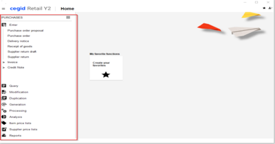

At this point, to access the application menus, use the [Maximize/Reduce menu bar] button.

To access the other modules of the application (Sales, Inventory, etc.), use the [Change module] button.

Note that there is a setting Pin menu to make the menu bar always visible on the left side of the screen, without having to use the [Maximize/Reduce menu bar] button to display it. Click here for further information.

Click here

Management of favorites

The management of favorites has been completely reviewed in version 20 of Cegid Retail Y2. Since this new favorites management is completely different from the old version, there is no transfer of favorites, and the old favorites management menus are deleted. Note that this feature works the same in Back Office and in Front Office.

To manage your favorites, use the [Create your favorites] button, available on the homepage. This button opens the Organize favorites menu which contains two lists:
- On the left, the list of menus available in Y2
- On the right, the list of menus selected in the favorites

After saving your favorites on the homepage, the [Create your favorites] button is renamed to [My favorite functions].

You can define up to 10 favorites, The names of the favorites can be customized to your needs by changing them directly in the list on the right.

If the access rights for a menu that is part of the favorites are disabled, the menu will automatically disappear from the list of favorites after reconnection. The behavior is the same if a module included in the favorites is disabled.

To access again the Organize favorites menu, use this button, available in the upper right part of the homepage.

My last functions

The history of the last 5 functions used on the workstation is presented on a line of 5 options:

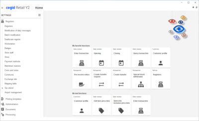

This history is not stored, it is built up at each connection.

Please note!

When selecting a function renamed in the favorites, the standard label is displayed, it is not currently possible to know if the function was launched from a favorite or from the menu.

### Working Environment

Working Environment

CEGID applications are generally composed of several modules. Each module is structured with menus, which are themselves composed of several commands. Whether you need to view data, process this data, print a report, or carry out any other action, you must first open the module, then the menu and the necessary commands.

Please note!

Only serialized options are accessible. Therefore, only menus and commands composed of serialized options will be available.

Access to the Online Help

The Cegid Retail Y2 Online Help is available at the following URL: https://cegid.fluidtopics.net/.

It is available everywhere in the Cegid Retail Y2 application, via this button, or via the F1 key on your keyboard, with the exception of Web applications.

Available languages

The Cegid Online Help is accessible in French and in English, thanks to the option available on the right of the screen that allows you to switch to the language of your choice (FR or EN).

Access right activation

Back Office > Administration > Users and access > Access right management

This feature is subject to the Access to the Online Help access right, available in the Concepts > General section.

Note that you must reconnect to the application to save the changes made.

Customizing the Online Help

From the Company Settings Web application

The Cegid Online Help is provided by default. However, if your company has its own documentation, it is possible to define a specific URL in the Company Settings, through Administration > Specifics, in the URL of the Online Help field .

Note that if you want to keep the access to the Cegid Online Help, this field can remain empty.

Using multiple search criteria

Many search screens look like this:

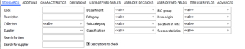

There are several field types in the multi-criteria:

The mono-selection scrolling list allows the selection of one single value. It is characterized by a downwards arrow.

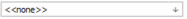

The multi-selection scrolling list allows the selection of one or more values: the combines use of keys CTRL+A allows you to select or deselect all values in the list. It is characterized by an upwards arrow.

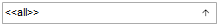

The dynamic search list ( ellipsis) allows you to quickly find the desired value:

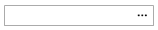
- Code entry + F5
- Description entry + (CTRL + F5)

Checkboxes usually have 3 states:

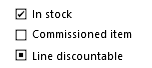

If the box is:
- checked, only data fulfilling the condition will be displayed.
- unchecked, only data not fulfilling the condition will be displayed
- "filled", all the data will be displayed.

Particularities of date fields

Date fields allow the entry of a date in the format MM/DD/YYYY:
- Either by manual entry.
- Or entering relative dates by the means of the following keyboard shortcuts:

| Choice | Description | Keyboard shortcut |
| --- | --- | --- |
| Day | Day’s date | D |
| Week | First day of the current week (and the last in the case of a range) | W |
| Fortnight | First day of the current fortnight (and the last in the case of a range) | F |
| Month | First day of the current month (and the last in the case of a range) | M |
| Quarter | First day of the current quarter (and the last in the case of a range) | T |
| Semester | First day of the current semester (and the last in the case of a range) | S |
| Year | First day of the current year (and the last in the case of a range) | Y |
| Previous | First day of the previous period (and the last in the case of a range) | Shortcut then the "+" key For example: M- |
| Next | First day of the next period (and the last in the case of a range) | Shortcut then the "+" key For example: M+ |
| General | From 01/01/1900 to 12/31/2099 | G |
| Other | From 01/01/1900 to today's date | < |
| Other | From today’s date to 12/31/2099 | > |

- Or entering asynchronous relative dates by the means of key SHIFT + the previous shortcuts, so that the 2 fields are “out of sync.” For example, for a date range starting at the beginning of the month until today, type M in the start field and SHIFT + D in the end field.

Note that relative dates are shown in italics.

Wildcard characters

In a criteria range, the wildcard allows you to perform a search of type Starts with or Contains , and not only restrictive searches of the type From… to . These characters are only used for alphanumeric fields.

Please note!

We strongly advice you not to use wildcard characters when building up your (items or other); otherwise you would not be able to benefit fully from this kind of search.

| characters | Description |
| --- | --- |
| Percentage "%" | The "%" character allows you to replace a string of characters at the beginning or the end of the field. Examples: "9%" displays all the stores whose code starts with the number "9" "%aris" displays all the stores whose name ends with "aris" |
| Asterisk "*" | The "*" character allows you to replace a string of characters at the beginning or the end of the field, but only for multi-selection fields: |
| Underscore "_" | The "_" character allows you to replace a character at the start, the middle or the end of the field. Example: "TRO_SER" displays all articles whose description is "TROUSER". |
| Square brackets [] | Square brackets allow you to include several values for the field in your search. Example: "M[7;8;9]" returns all items whose code starts with M7 or M8 or M9 |
| Cyrillic characters | Do not use these characters to codify items. |

### Keyboard Shortcuts

Keyboard Shortcuts

A keyboard shortcut allows you to activate a command or perform an action by pressing a key on your keyboard or a combination of keys. In this topic, you will find all the keyboard shortcuts used in the commands and actions common to all Cegid applications.

Move & Activate

| Function | Shortcut |
| --- | --- |
| Move to the next tab in a window | Right arrow or <Ctrl> + <Tab> |
| Move to the previous tab in a window | Left arrow or <Ctrl> + <Shift> + <Tab> |
| Move to the next field | <Tab> |
| Move to the previous field | <Shift> + <Tab> |

Check/Uncheck

| Function | Shortcut |
| --- | --- |
| Select or clear a checkbox | <Spacebar> |
| Select or clear a radio button | Arrow keys + <Spacebar> |

Close/Quit

| Function | Shortcut |
| --- | --- |
| Close a window | <Alt> + <F4> |
| Quit a wizard | <Esc> |

Multi-criteria search

| Function | Shortcut |
| --- | --- |
| Apply multiple selection criteria for data | <F9> or <F10> |
| Reset criteria (for a new search) | <Ctrl> + <Z> |
| Switch from the multi-criteria search to the list | <F12> |

Records

| Function | Shortcut |
| --- | --- |
| Create a record | <Ctrl> + <N> or |
| Delete a record | <Ctrl> + <Delete> or |
| Move to the next record | <F4> or Down arrow |
| Move to the previous record | <F3> or Up arrow |
| Open a record from a list | <F5> |
| Validate the creation or update of a record | <F10> or |
| Select/Deselect one or more elements to be processed in a particular way | <Ctrl> + Click the line or Click the line + <Spacebar> |

Text input area (Notepad type)

| Function | Shortcut |
| --- | --- |
| Bold or not the selected text | <Ctrl> + <G> |
| Italicize or not the selected text | <Ctrl> + <I> |
| Underline or not the selected text | <Ctrl> + <U> |
| Open the Zoom window | <Ctrl> + <F2> |

Choice lists

| Function | Shortcut |
| --- | --- |
| Open a choice list | <F5> |
| Select an element from the list | Arrows: <Up arrow>, <Down arrow>, <Home> and <End> or First letter of the option |

Multiple choice lists

| Function | Shortcut |
| --- | --- |
| Open a multiple choice list | <F5> |
| Select/Deselect all element in a multi-option list | <Ctrl> + <A> or cursor movement keys (<Up arrow>, <Down arrow>, <Home> and <End>) + <Spacebar> |
| Scroll through the possible choices in a list | Position the cursor in the area and use the arrow keys on the keyboard |
| Validate selection | <F5> |

Search list (dynamic or not)

| Function | Shortcut |
| --- | --- |
| Open a multiple choice list | <F5> |

Miscellaneous

| Function | Shortcut |
| --- | --- |
| Open integrated help | <F1> |
| Open the search window | <Ctrl> + < F> |
| Print | <Ctrl> + 
 or |
| Cancel last changes | <Ctrl> + <Z> |

### Context Menu

#### Context Menu

Context Menu

Back Office > Toolbar on the Home page > [Context] button.

A number of options allow you to define your preferences in terms of display and use of Cegid Retail Y2.

All these options can be set from the homepage, via the [Context] button.

| Fields | Description |
| --- | --- |
| Follow-up of prints | This menu is used to retrieve some information after launching an output request: The Asynchronous tasks tab displays any tasks currently running. The Notifications tab shows the completed edition(s), which can be viewed by clicking on the link displayed. The print is then removed from the list. |
| Change database | Displays the database currently in use and allows you to restart the connection to the current database. The change of database function is no longer available as of version 20. |
| Change input date | By default, the login date for the application is the system date, but you can change it if necessary. Changing this date will replace the current date with the date you have selected in the calendar. All the dates normally initialized at the current date will then be replaced by this new login date (default dates of documents, inventories, inventory closures, as well as dates available in the multi-criteria screens and normally having the current date as default value, etc.) The system creation/modification dates will not be impacted and will remain at the system date. In Back Office, the use of this feature is subject to the access right Modify connection date available in the Concepts (26) menu. In the Front-Office, this feature is grayed out because only the current date is used as reference date |
| SQL monitor | The SQL tool, presented in the standard tool bar, allows you to view the data of any field, and any data table by directly entering an SQL query. From the SQL monitor, as well as on data list you may minimize or maximize the list, search for an information or even export the results in a file. This tool only allows you to make Select queries. |
| Preferences | Click here for further information about the usage preferences, |
| About | This window allows the user to know more about the Cegid Retail Y2 version used, as well as about the CBP and CPOS versions installed. In the About window, the [Technical support] button allows you to know the names for the database engine, the database and the base version. This screen also allows you to send a mail to the Helpdesk and enclose a screenshot, if necessary. The Display integrated updates option shows you the lit of the integrated CPTX files. To learn more about the integration of these files and the Cegid Database Maintenance (CDM) tool, please refer to the Detailed Guide available here . |
| Quit | Option used to exit the application |

#### Preferences Record

Preferences Record

All the options from the Preferences menu be set from the homepage, via the [Preferences] button.

General tab

Communications

| Fields | Description |
| --- | --- |
| Application server address | Reminds you of the URL address used to connect to the database; also allows you to change the address. |
| Send mails via | Choose the e-mail application that will be used automatically to send your e-mails from: Outlook to use the Outlook email application installed on your workstation. SMTP to use the emailing protocol directly, without going through Outlook. The use of SMTP is strongly recommended (in this case, fill in the SMTP settings below). If Outlook is used, no information is required. Outlook information is taken into account, so you need to have an active Outlook account on your computer. |
| SMTP server | Enter the name of the SMTP server or ISP in this field. |
| E-mail address | Address of the sender of the e-mails sent through Cegid Retail Y2. |
| Email password | Some SMTP servers require authentication to allow emailing. This data must be entered here. |
| Cegid Update Server | Obsolete. Do not use. |

PDF

All reports generated in Cegid Retail Y2 can be saved in PDF format. The Default directory for PDF files option allows you to define the default directory in which to save these editions. Asynchronous reports

Asynchronous Reports

(cf. Asynchronous Reports )

Asynchronous Reports

| Fields | Description |
| --- | --- |
| Print on the default printer defined in Windows | Option used to select a Windows printer. |
| Print on this printer | Selection list of available printers. |
| Creation of a PDF file | Option for publishing in PDF format. |
| Preview | The option is ticked by default so that the user can view the document before it is printed. You can disable this option and send the document directly on a printer. In this case, you cannot view the document before it is printed. |
| User selection | The user can choose to view the printout before printing. |

Office suite

The Office suite option is used to select the office suite to be used.

Display tab

Displays

| Fields | Description |
| --- | --- |
| Automatic maximization of the application upon opening | Option ticked by default. Once the data is load and when you open the application, the main window is automatically resized so that it takes up all the space on the screen. If the option is not ticked, it is still possible to resize the window by clicking the Maximize/Reduce box in the top right-hand corner of the title bar. |
| Cascade windows | Tick this box if you want the different windows in the application to be presented in a way that you can always see their title bars. |
| RibbonBar display | Obsolete. Do not use. |
| Display checkboxes | Obsolete. Do not use. |
| Display in high contrast (effective the next time the application is launched) | The high contrast accentuates some of the colors in Cegid Retail Y2, making the screens easier to see in bright external light or when being used for projector displays. Refer to procedure 303 for more information. |
| Display vertical lines in the document grid | When entering documents in Back and Front-Office, it is possible to better outline the columns that make up the document, in order to obtain a more contrasted rendering. Note that this setting does not affect the layout of the Front-Office transaction entry grid. |

Screens

| Fields | Description |
| --- | --- |
| Search screen enlarged | Displays elements from a search list in a larger font and window than those used by default Please note! This option must be ticked for POS terminals with a touch screen. In fact, if the option is: Ticked: the screens are more suitable for touch use, as are certain other objects. Not ticked: the search screens are the same size for the Front Office and Back Office, and are more suitable for use with the mouse. |
| Automatic application of criteria | When this option is ticked, the search criteria for displaying only part of the data in the lists are automatically applied as you define them. This means you do not have to validate them using the [Apply criteria] button. |
| Launch the associated application when exporting lists | If the box is ticked, when you request a data export, the application that allows you to read the file format used will be opened at the end of processing. |

Subtables

| Fields | Description |
| --- | --- |
| Pop-up lists sorted by name | Tick this box if you want the search lists and dynamic search lists to be sorted alphabetically by the name of the available options and not by their code. |
| Multiple selection subtables with checkboxes | Obsolete. Do not use. |
| Always display search lists | For some fields, there is a search list from which you can select the item which should be filled in for the current field. When this option is ticked, the search list is automatically opened as soon as you place the cursor in the field. If you do not select this option in the user preferences, you must click the [...] button at the end of the field, or press the F5 key to open the search lists |

Home page

The Pin menu setting makes the menu bar always visible on the left side of the screen, without having to use the [Maximize/Reduce menu bar] button to display it.

| Setting enabled | Setting not enabled |
| --- | --- |
|  |  |

Although the menu bar remains permanently displayed, you can minimize it from time to time by using the [Maximize/Reduce Menu Bar] button.

Advanced options tab

Database

| Fields | Description |
| --- | --- |
| SQL date with ANSI format | Obsolete. Do not use. |
| Commit on dispatch | Obsolete. Do not use. |

Displays

| Fields | Description |
| --- | --- |
| Display information about records in the title | Information needed for development to find out the name of the object |
| Display login data | This setting makes the login information permanently visible on the Cegid Retail Y2 screens (Back and Front Office). By login data, we mean: Name of the product (Back or Front-Office) Name of the database Login user Connected store Register used (in Front Office) Login URL Once the option is activated, the information is immediately and permanently displayed at the top of the screen. |

Screens

The Show the names of the tables in the settings of the lists option is used to get the table information in the customization of the lists.

Filters

The Restrict display to filters created by user option ensures that each user only sees their own filters.

International tab

| Fields | Description |
| --- | --- |
| Default language for connection | List of languages you can use with the application. Select the language of your choice and confirm. You can now connect with a user associated with this language (see topic User management .) See also procedure 314 . |
| How to use configured periods | The notion of configured periods allows you to manage not standard quarters but “time lapses” which are 13-week periods divided in one of the following ways: 4-4-5: (1st period of 4 weeks) + (2nd period of 4 weeks) + (3rd period of 5 weeks) 4-5-4: (1st period of 4 weeks) + (2nd period of 4 weeks) + (3rd period of 4 weeks) 4-4-4: (1st period of 5 weeks) + (2nd period of 4 weeks) + (3rd period of 4 weeks) In many companies, analyses, comparisons, monthly or annual reports, return information according to these periods. Click here for further information about the configured periods. |
| Show reports in all languages | The choices made here will be used to select the language in which the reports are printed (in the Page layout section of the reports). If the option is: Ticked, the report launch screens will also show the user reports in the other languages in the folder. Not ticked, the report launch screens display the reports created in the user's language. If no report is available in the user's language, the reports in French (FRA) are proposed. |
| Enable settings for complex script languages | Checkbox to manage Asian languages for Cegid products. Click here for further information about this option. |
| Display font | Some languages, such as Turkish, Greek or Thai, require the use of a particular font, which is defined here. Before selecting the display font to use, you need to load these fonts from the Control Panel, Regional and language options, Languages tab, by checking the Install files box. Click here for further information about this option. |
| Do not us the styles | Again, for Asian language management, we recommend that you tick this box for a better on-screen display. |
| Menu font size | Option in the form of a slider which adjusts the font height of the menus on the home page and in the Context window. |
| Printing font | Before selecting the printing font to use, you need to load these fonts from the Control Panel, Regional and language options, Languages tab, by checking the Install files box. |

Debug tab

The Switch to Customer Service View is an option intended for developers only.

## Description of the Main Records

### Basic Data Module

#### Store Record

Store Record

Back Office > Basic data > Stores > Stores

Contact information tab

| Fields | Description |
| --- | --- |
| Closed | Allows you to indicate that the store is no longer used. This is useful when creating new documents, for example. When you close a store, it is not deleted. The document history and information relating to this store will still be available. |
| Address | The address can be entered on 4 lines of 70 characters, also available in the presentation settings. The city, country and region can be entered within a limit of 70 characters as well. These elements can be set in the Settings > General. |
| Currency | This option allows you to select the currency to be associated with the store. For websites, this field allows you to manage a common currency for all sales on the website. |
| Stock exchange | Select the stock exchange to define the exchange rate between currencies to apply when creating a document. |
| Type | This field must be populated; it assigns a classification to the store that can be typed Headquarters, Franchise, Branch, etc. For websites, select e-Commerce. |
| Subsidiary | This field is visible only if the folder supports subsidiaries. You can specify in this field the subsidiary the store belongs to (for example South-East Asia subsidiary, Europe subsidiary, etc.) This field must be filled in if you manage some processes such as counterpart flows, valuations, etc. You can modify the subsidiary of a store in the following situations: If the subsidiary store has no movements If the store has movements, and the currency of the new subsidiary is the same as the previous subsidiary If the store has movements, and has not been associated with a subsidiary, and the currency of the new subsidiary is the same as the currency of the folder In all other cases (especially if documents have been entered for this store,) you need to use the update wizard for the store subsidiary. You can access this wizard in Administration > Maintenance > Change subsidiary for store. This feature is available only in a client/server environment and will recalculate all the documents of the store. For further information about options relating to subsidiaries, please refer to the topics about Subsidiaries . |
| Price list program | For further information, please refer to the topics about Price List Programs . |
| Price list type | Is used to select the price lists applicable in the store (Tax inclusive or Tax exclusive.) |
| Counter per store | Tick this option to display wizard for counter creation by store and fulfill the following steps: Step 1/10: Select the store Step 2/10: Item code Step 3/10: Customer code Step 4/10: Link for payments Step 5/10: Loyalty Step 6/10: Document counters Step 7/10: Link between documents Step 8/10: Event log Step 9/10: Customer services Step 10/10: Summary The store is then correctly configured. |
| Managed on site | Although, this option is enabled in general, it is also possible to reference a store that will be managed by an external tool and not by Cegid Retail Y2. In this case the option will be unchecked. |
| Transfer price management | Activates transfer prices. |
| Serial numbers | This option allows you to indicate that the store supports the management of items with serial numbers, provided you have purchased the relevant module (refer to Serial Numbers .) |
| Packing management | This option allows you to indicate that the store supports the management of packages when entering documents (refer to Packing .) |
| Automatic assignment of the customer code | This option allows you to use specific customer coding for the store in question. |
| Validation of transfer notices | This option allows you to establish that store warehouses must validate transfer notices sent to them. Since this option is required to configure Direct transfers between remote warehouses in the same geographical site , it will become activated and grayed out in the store record when the following option has been checked in the subsidiary record. |
| Reallocate reservations or available orders in the case of intra-store transfers | This option allows reservations or available orders to be transferred from one warehouse to another when the merchandise is the object of an intra-store transfer (i.e. from a store's warehouse to another warehouse of the same store). |
| Cust. Service management | This option allows you to define whether or not the store can use the features associated with this module (refer to Customer Services .) |
| Generate and link inventory movements and customer service records | This option enables you to: create customer services records when items are transferred to certain warehouses (Customer Services warehouse). generate inventory movements from a customer service record. This setting is described in Managing Inventory Movements and Customer Services . |
| Managing quantities in customer service records | This setting is described in Managing Quantity . |
| Manage lines at 0 in receipts linked to customer services records | When a service has not been billed to a customer, it will not appear in the register screen and is not saved on the receipt. This setting enables you to change this behavior so you can manage them the same way as lines with values. |
| Handle one customer services record for the line | This setting is described in Managing Quantity . |

Information tab

This tab allows you to really customize the store record based on your specific needs. All of the information contained on this tab is user-defined and fully customizable.
- The titles of user-defined criteria can be configured in Settings > Stores (or Warehouses) > User-defined fields - titles.
- The contents of user-defined tables can be specified in Settings > Stores (or Warehouses) > User-defined tables.
- Or directly in the record via the button displayed next to the field.

The lower-right section of this tab functions as a notepad. By right-clicking on it, you can access basic word processing functions.

Additions tab

| Fields | Description |
| --- | --- |
| Tax model / Tax system | These fields are essential as they define the method to be used for defining taxes in documents for the store in question. |
| External tax calculation engine | Click this button next to the field. The Settings for Web Services window displays allowing you to set the necessary data for the connection with an external tax engine (code, description, URL, timeout). This setting will be used later when using an external tax calculation engine. |
| Taxes at cashing | This option is used to enable the taxes at cashing, i.e.: When issuing a voucher, Y2 stores the amount of taxes applied to the register operation (financial item such as the acquisition of a gift certificate, of a gift card or a deposit payment) that triggered the issuance of a voucher. When a credit note is issued, Y2 stores the tax amount of the returned items. When the voucher is used, Y2 deducts the tax amount of the items paid with the voucher from the tax amount stored when the voucher was issued. The retailer can set up user-defined exports to deduct the used taxes from the collected tax accounts. For more details see the following FAQs: => See also procedure 405 (Taxes at Cashing - Implementation) => See also procedure 406 (Taxes at Cashing - External Solutions) |
| Payment account | This field allows you to specify a particular financial account for the store. This account can then be used for accounting transfers, instead of the default account for all stores. |
| Language for the accounting link | This field allows you to define the translation language for the accounting transfer for each store, so that it can be matched to the language of the users of the store in question. This allows the accounting interface to extract translated descriptions in the interface records. The descriptions are translated automatically in the language of the store when this is different from the language of the folder. If a translation is not available, the descriptions are extracted in the language of the folder. The descriptions in question are listed below and can be translated using the data translation module: Descriptions for payment methods and payment methods per store Descriptions for register operations and register operations per store Descriptions and internal references for sales lines and payment methods (Description for document types, Description and short text for the store, Description and short text for the payment method.) |
| Loyalty campaigns | This field is usable if the Customer loyalty module has been purchased and activated. It allows you to assign a loyalty campaign to the store concerned. |
| Engine version | This setting defines the loyalty version to be used for a store (V2 or V3). |
| Default warehouse for inventory input | The field is only useful if multi-warehouse management has been activated. This field is then used to specify the priority warehouse when new inventory is received. |
| Management of consigned items | This option is used if the module has been purchased and activated in Administration > Company > Company settings > Commercial management > Items This option specifies whether the item type is managed by the store (refer to Consigned Items .) |
| Systematic entry of recipient warehouse for transfers | To display this option, you will need to check the Displays the recipient warehouse option beforehand, in Administration > Company > Company settings > Commercial management > Inventory . |
| Export sales - Tax incl. invoicing | This pane allows you to configure a markup/markdown rate for export sales (refer to Export Sales ). |
| Cost price profile | This field is used if the module has been purchased and activated in Administration > Company > Company settings > Commercial management > Inventory. This field allows you to assign a specific cost profile to the store in question. |
| 2D barcode for labels | This option enables you to generate 2D barcodes on labels using the settings associated to the store. If settings have not been set, the pictogram will not be printed on the label. |
| Assortment criterion | This field is used if the Assortment inventory management option has been activated in Administration > Company > Company settings > Commercial management > Inventory. It allows you to assign an assortment type (refer to Assortments ) to the store in question. |
| RFID template | This field will be available if you have purchased and serialized the RFID (Radio Frequency Identification) module. You may then configure it in Company settings - Commercial management/External connections (refer to RFID ). |
| Exclusion period for gift certificates/cards | Is used to select the period in which gift certificates and gift cards will not apply (refer to Setting up Gift Certificates and Gift Cards .) |
| Management of cashboxes | If the management of cashboxes is enabled in the company settings (Front-Office tab,) it is then possible to authorize this feature at store level (refer to Cashbox Management .) |

Sales receipts

| Fields | Description |
| --- | --- |
| Management of the final selling price | This section is used to authorize the store to handle the concept of final selling price (for the line and/or the receipt), as well as the associated markdown reasons (see Final Selling Price Settings.) Defining authorized reasons allows limiting the reasons usable in the store. The choice will be made in the list of markdown reasons of type Final selling price discount . If an option is ticked, a default reason is available but not mandatory It is used to specify a default value if a final selling price is entered. |
| Safe discrepancy | This field is used for safe management; it associates the register operation of type Safe discrepancy with the store. |

Third-party tab

| Fields | Description |
| --- | --- |
| Sales representative prefix | This field allows you to differentiate the various store-based codes for salespeople/representatives. |
| Cashier management | This checkbox allows you to differentiate between sales representatives/cashiers on the registers in the store in question. => See also procedure 255 (Link User - Salesperson - Cashier) |
| Customer associated to the store Supplier associated to the store | If the corresponding functions have been activated, these fields are essential for the invoicing of sales and/or transfers. |
| Checkout default customer | This field (ET_CLIENTRETAIL) is used to transfer sales entries made by an external cash register or a Live Store cash register to Accounting via the Accounting Interface menu. |
| Default supplier in documents | The specified supplier will be assigned automatically to all purchase documents entered for the store in question. |
| Customer existence control | This pane allows you to activate the methods used for checking third-parties. |

Linked warehouses tab

This tab is available if multi-warehouse management has been activated in the Company settings. It allows you to associate various inventory locations with the store. The warehouse list will be updated when creating a new warehouse.

Please note:
- A store must be associated with at least one warehouse.
- The order of the warehouses on the list is important as it determines the order in which inventory is withdrawn when documents are entered, depending on the inventory available.

Accounting tab

This tab is available if the Management of inventory closures module has been activated in the Administration > Company > Company settings > Commercial management > Inventory accounting closure (refer to Accounting Closure .)

Accounting Closure

Store staff tab

This tab is available if you have purchased the “HR In Store Optimisation - Management of the store staff” module and activated in Administration > Company > Company settings > Link to .Next modules > HR Optimisation (refer to Store Staff ).

Store Staff

| Fields | Description |
| --- | --- |
| Activate management of forecasted schedule | This option allows you to manage the forecasted schedule in the Stores staff module. |
| Activate visa management | This option allows you to activate approval management when managing the schedule for this store. |
| Activate clock-in/clock-out management and Authentication type | These options allow clock-in/clock-out processes and methods to be managed in Front Office for store registers. |
| Store time slots and Standard day | These fields define the working hours for day shifts (morning-afternoon) and night shifts . |
| Associated schedules and legal holidays | These fields allow special events or bank holidays associated to the store to be taken into account in the schedule. |

Miscellaneous tab

This tab will be available if you have purchased and activated at least one of the optional modules (Travel Retail and HRO for authenticating salespeople.)

| Fields | Description |
| --- | --- |
| Use address checking | These options allows you to configure various information required for checking customer addresses (refer to Checking Addresses.) |
| Airport | Activates airport management for the store (cf. Airports .) |
| Authentication of salespeople | These options allows you to define the security level and identification method for sales representatives in the Front-Office. This setup supplements the one defined in the company settings (refer to Salespeople Authentication .) |
| Loan management | These fields allow you to define the settings for the use of the loan module in the store (refer to Loan Management .) |
| Batch management | These fields enable batch management (refer to Batch Management ). |
| Sales conditions | The drop-down list allows you to select how sales conditions will apply at checkout. The available operations are described in topic Setting up Sales Conditions in the Store Record |
| Countermark management | This field allows you to manage store countermarks (the countermark configuration is done in Company settings > Commercial management > Documents - Processing.) The Propose the generation of the purchase order when validating the customer order option activates a message which is displayed when entering orders to allow generation of associated supplier order (refer to Countermark Management .) |
| Specific search priority | This allows you to specify whether other search priorities are to be used than those defined in company settings. |

e-Commerce tab

This tab will be available if you have purchased and activated the Omni-channel module.

The following fields allow you to define the operations the store can perform in an e-commerce context:

| Fields | Description |
| --- | --- |
| Withdrawal of goods | Pick up orders in store: The store receives goods from the Headquarters to hand them out to the omni-channel customer. E-Commerce reservation on store inventory: Allows a store to recover reservation requests. Management of pick-up points: Tick this option if the store is a pick-up point (visible only if the company setting of the same name is enabled in Commercial management > Omni-commerce.) |
| Shipment of goods | Transfer to Headquarters: If this option is ticked, the store may send goods to the Headquarters. Shipment to customers: If this option is ticked, the store directly delivers the goods to the customer. Transfer to others stores: If this option is ticked, the store directly sends goods to another store. Preparation management: the preparation step is handled in the store only. Please note! This option displays only if the Preparation management company setting in Commercial management > Omni-commerce is enabled. |
| Authorize the entry of an e-Commerce order | Allows the store to enter an omni-channel order with payment of a deposit on behalf of the customer. |
| E-Commerce affiliated store | Select a store necessarily of type Omni-channel. |
| GPS coordinates | Optional setting used to locate the store (through Google Maps for example.) |

Payment

This section is only available for websites (stores with the Type field set to e-Commerce .)

| Fields | Description |
| --- | --- |
| Payment method for outstanding amount | Used for partial payment of an order. It will potentially be used in all omni-channel scenarios. |
| Payment of deposits for reservations | This is the register operation used to register the payment made on the website. It is associated with a payment method Already paid deposit in the same currency. Used only if an order is reserved or picked up in the store; this deposit will be accounted for when the customer checks out. |
| Other currencies accepted | This option gives a website the possibility to serve several countries, with different currencies (see Multicurrency Payment of Omni-channel Orders .) This option displays a table that lists these currencies and their deposit payments: The following controls are performed: The store currency cannot be added as it is already present. Only one line is entered per currency The deposit payment must be associated with a payment method in the same currency as the sale. The deposit payment is mandatory. Note that upon validation of this screen, the number of currencies accepted is updated in brackets in the store's screen. |

Return and exchange

This section is only available for websites (stores with the Type field set to e-Commerce .)

| Fields | Description |
| --- | --- |
| Blocking reason | When blocking an order, this setting allows you to select the default reason (e.g. it may be useful to block the order until the goods of a reported return have been received). |
| Payment method for credit notes | In the case of a return of type credit note or exchange, select the payment method that will be used to refund the customer |

Follow-up status

The Default tracking status setting is used to determine the default status of a Web order with delivery to the customer, when it is created in the Back or Front Office.

For further information about the impact of this setting, please refer to Management of Status “Awaiting Validation" .

Management of Status “Awaiting Validation"

Replenishment tab

| Fields | Description |
| --- | --- |
| Sender warehouse in replenishment validation | This pane allows you to define the warehouses that are proposed by default for transfer validations or supplier orders resulting from the processing of replenishments. |
| Replenishment settings | This pane will be visible only if the Main supplier exceptions by item and store setting, found in Company settings > Commercial management > Stores and Warehouses has been activated. The Taking into account the main supplier exceptions by item and store option enables you to indicate that the store will take the various suppliers into account other than the one shown in the item record. When this option has been ticked, the exceptions will be set in the Store record toolbar via the [Additions - Exceptions of main supplier for replenishment option] button. |
| Generation of purchase documents | These options are used to defined the number of lines or the amount from which the document is split. |

Delivered/picked up tab

This tab is available if you have purchased and activated the Delivered/Picked up option (refer to Delivered/Picked up ).

Delivered/Picked up

User fields tab

This tab enables you to manage an unlimited number of user-fields to be used in conjunction with user-defined tables (refer to User Fields ).

User Fields

#### Warehouse Record

Warehouse Record

Back Office > Basic data > Stores > Warehouses

Contact information tab

| Fields | Description |
| --- | --- |
| Closed | Allows you to indicate that the warehouse is no longer used. This is useful when creating new documents, for example. When you close a warehouse, it is not deleted. The document history and information relating to this warehouse will still be available. |
| Type | Allows you define various types of warehouses, based on the following: Sales/Stockroom: Enables you to manage several warehouses in a store (sales area, sales window, stockroom 1, stockroom 2, etc.) This is a default value. Consigned: Allows you to manage suppliers’ consigned items, if you have purchased and activated the corresponding module. Only one warehouse of this type exists per store. Stockroom: This type of warehouse differs from the Sales/Stockroom warehouse in that it is not possible to sell from this warehouse if there is insufficient inventory in the other warehouses. But it is still possible to manually withdraw inventory from this type of warehouse. However, you cannot sell from this warehouse in sales documents. A previous transfer between this stockroom warehouse and a sales warehouse is necessary. Isolated sale: This type of warehouse can be assigned to a register managed in standalone mode. In this case, this POS can only sell from its own inventory. This type of warehouse is not taken into account in inventory searches when the main warehouse runs out of stock. The registers assigned to this type of warehouse will only search for inventory in this warehouse. Loan: This type of warehouse is used for loan management. The loaned items are associated with this warehouse as well as all movements relating to the loans. Customer services warehouse: This type of warehouse is available only if you have activate the Customer Services (refer to Customer Service Management ). |
| Associated customer | Is used to implement the invoicing of sales and/or the invoicing of transfers if these features are enabled. |
| External ref. | The external reference of the warehouse allows you to propose the entry of a unique code, coming from the information system of your company. The management of this field is optional, but if a value is entered, it must be unique. This field has a maximum length of 40 characters. Blank spaces are only allowed inside the reference: spaces at the beginning and end of the reference will be deleted when the reference is saved. This field is available in the layout customization, as well as in the various criteria related to the warehouse. Changes to this data can also be traced in the standard follow-up and the customized follow-up of the warehouse records (see Customized Follow-up .) |
| Address | The address can be entered on 4 lines of 70 characters, also available in the presentation settings. The city and country can be entered within a limit of 70 characters as well. These elements can be set in the Settings > General. |
| Consider in replenishments | This option allows you to exclude warehouses with inventory considered available for replenishment. For example, if you choose not to take into account items in the “Store window” warehouse, these items will no longer be considered as available in the store. |
| Inventory visible to other stores | This option allows you specify that the warehouse inventory can be viewed by other authorized stores. On the multi-criteria search screens, dashboards, and inventory cubes, the following applies: All warehouses of the user’s associated store will be visible For the user’s other authorized stores, all warehouses for which the previous setting has been selected will be visible. For further information about the visibility of warehouses, click here . |
| Considered in the inventory of my store | This option allows you to specify whether the inventory in this warehouse is to be included or excluded in the total inventory for the store when querying inventory in the Front Office. Note! In case of a loan sale, this option must be activated in order to deplete the loan warehouse (see Loan Management .) |
| Validation of transfer notices | This option is required for the implementation of transfer notices for remote sites. |
| Warehouse managed on site | This option should be activated if you want the store to be managed on the central site's machine. |
| Managed in a WMS | This option enables you to track the customer services by warehouse (refer to Customer Service Management ). |
| Serial numbers | This option allows you to indicate that the warehouse supports the management of items with serial numbers, provided you have purchased the relevant module (refer to Serial Numbers ). |
| Remote warehouse of the store | The management of inventory can be handled internally within the store or outsourced to another site. To avoid having the inventory movement document printed systematically, you can specify in the warehouse record whether the warehouse is a Remote warehouse of the store. You can also specify the Geographical site linked to this warehouse. The transfer document will not be printed in the following situations: If subsidiary management is activated and the sender and recipient stores are identical and the Print intra-store transfer documents on a same geographical site setting is not selected in the subsidiary record and the sender and recipient warehouses are not remote or the original and recipient warehouses are remote and the geographical site has been entered and the sender and recipient geographical sites are identical. |

Information tab

This tab allows you to really customize the store record based on your specific needs. All of the information contained on this tab is user-defined and fully customizable.
- The titles of user-defined criteria can be configured in Settings > Stores (or Warehouses) > User-defined fields - titles.
- The contents of user-defined tables can be specified in Settings > Stores (or Warehouses) > User-defined tables.
- Or directly in the record via the button displayed next to the field.

The lower-right section of this tab functions as a notepad. By right-clicking on it, you can access basic word processing functions.

#### Subsidiary Record

Subsidiary Record

Back Office > Basic data > Stores > Subsidiaries

Just remind!

The subsidiary record looks different whether the Intercompany module is activated; the presence of the Mobile Clienteling and/or Inventory Tracking modules also impacts the layout of the record (see Introduction to the Subsidiary Record .)

Introduction to the Subsidiary Record

Characteristics tab

The Subsidiary record is divided into three parts detailed below:

Header

The upper part of the screen is used to enter information specific to the subsidiary (code, description, e-mail, and currency.)

Note that once the currency selected, it can be changed only in Administration > Maintenance > Change currency for subsidiary.

Transfers

The middle part of the screen defines options and valuation methods for these transfers. Note that information relating to transfers does not directly concern counterpart flow management. Consequently, regardless of counterpart flows and their management, do not forget to populate the fields hereafter to enable transfers to be valued correctly.

| Fields | Description |
| --- | --- |
| Authorize the validation of transfer notices in the store records | This option is an input help. It allows you to check (or uncheck) the setting in all stores and warehouses affiliated to the subsidiary by checking (or unchecking) only that in the subsidiary record. |
| Print intra-store transfer documents on a same geographical site | This setting is closely linked to the settings in the warehouse record. The management of inventory can be handled internally within the store or outsourced to another site. To avoid having the inventory movement document printed systematically, you can specify in the warehouse record whether the warehouse is a remote warehouse of the store. You can also specify the geographical site linked to this warehouse. The transfer document will not be printed in the following situations: If subsidiary management is activated and the sender and recipient stores are identical and the Print intra-store transfer documents on a same geographical site setting is not selected in the subsidiary record and the sender and recipient warehouses are not remote or the original and recipient warehouses are remote and the geographical site has been entered and the sender and recipient geographical sites are identical. |
| Direct transfers between remote warehouses of a same geographical site | This options allows you to specify that no transfer notices should be generated for transfers between remote warehouses within the same geographical site. In this case, the TEM document is generated as a TRE document directly. For further information, please refer to Internal Inventory Movements . |
| Direct transfer from sender stores of type Headquarters | This option is only available if the Direct transfer if sender store is of type Headquarters option is selected in Company settings > Inventory. It enables the automatic creation of a sent transfer if the sender is a store typed Headquarters (see Store record > Contact information tab > field Type.) For further information, please refer to Internal Inventory Movements . |
| Valuation of transfers | All options linked to the valuation of transfers (sent or received) are described in detail in section Transfer Valuation . |

Settings

The lower part of the subsidiary screen is used to define additional settings.

| Field | Description |
| --- | --- |
| Selection for printed language | This option activates multilingual printouts: If the management of subsidiaries is not active , only the value in the Selection for printed language company setting, accessible in Commercial management > Preferences, is taken into account. If the management of subsidiaries is active, the following applies : If the user’s default store is associated with a subsidiary, the setting from the subsidiary record will be taken into account. If the user’s default store is not associated with a subsidiary, the company setting will be taken into account. An option in the Page layout tab of the print screens allows you to select the print language. By default, this language is set to the language of the user’s programs. |
| International customizations | In the case of subsidiary management, the International customizations feature must be activated for every subsidiary in the Back Office. |
| Transfer price management | This option activates transfer prices. |
| Specific item search priority | The item search priority can be activated at subsidiary level. If this option is ticked, the stores associated with the subsidiary can set a specific item search (Miscellaneous tab of the Store record .) For more information on this feature, please refer to Search Priorities . |
| Query/Process litigations on transfers | You can set restrictions for querying or processing litigations on transfers (in the company settings via Commercial management >Document-Entry) For more flexibility, these settings are also available at subsidiary level. Default values are set to By recipient . |
| Management of cashboxes | If the management of cashboxes is enabled in the company settings (Front-Office tab,) it is then possible to authorize this feature at store level (refer to Cashbox Management .) |

Toolbar
- Affiliated stores: Click this button to view the stores affiliated with the subsidiary.
- Settings for inventories: Click this button to define settings for inventory counts (refer to Inventory Count Management .)
- Supplier referencing: Once the record created, click this button to define the suppliers associated with the subsidiary. Please note! This referencing is dedicated to users handling counterpart flows. For further information about supplier referencing, please refer to paragraph Referencing Suppliers Associated with the Subsidiary , described in topic Counterpart Flows .

Affiliating the subsidiary with the store

Back Office > Basic data > Stores > Stores

Two settings in the store record allow you to specify whether the store is associated with a subsidiary, and whether certain documents exchanged between this store and its subsidiary generate counterpart documents:

This relates to the Type and Subsidiary fields (see the Contact information tab in the Store record.)

Contact information

#### Item Record (Service)

Specific Features in the Service Record

Back Office > Basic data > Items > Services

Service type items group together the services (alterations, rentals, etc.), repairs, and all items the user does not want to list.

These are necessarily items not managed in stock.

The Service record is just a simplified Merchandise item record.

To learn more about the different fields that make up the Service record, please refer to the Merchandise Type Item Record.

Caution!
- We strongly advise you not to use a wildcard character when composing your item codes.
- The Additions tab is only visible if the After-Sales module has been purchased and enables (see Customer Service Management .)

#### Customer Record

Customer Record

Back Office > Basic data > Customers > Customers

This command allows you to display the list of existing customers, as per the specified sort criteria. The various tabs of the record are detailed hereafter.

General tab

You can select an Individual-type customer used for retail sales, or a Company-type customer used for Trade sales. The selection will display various information according to the type indicated. The proposed default customer is defined in the company settings.

Note on the use of customer information (privacy management)

The [Privacy] button, available in the Address, Internet and Telephones section defines how the customer authorizes the use of his or her contact information (postal address or e-mail, and phone.) It displays a window to define whether the customer’s contact information is usable, and by whom (brand name or partner.) Available options may be configured in the Company settings (see Customer Privacy Management ). According to the information specified, one of the following buttons will be displayed in the customer record:

Customer Privacy Management

The customer has not made known his/her position.

The customer agrees that information is usable by the brand name.

The customer agrees that information is usable by the brand name or a partner.

The customer refuses the use of this information.

| Fields | Description |
| --- | --- |
| Last name / First name | You can manage dual last names and dual first names, based on the company settings defined (refer to Customers-Suppliers ). |
| Address | The address is displayed as an non-editable notepad. To enter or modify the address, click this button to open the Address management window. The address can be entered on 4 lines of 70 characters each. Note that the Address field is available in the presentation settings. The zip code and the city can be entered within a limit of 70 characters, and have an input help: the city corresponding to the zip code entered is automatically proposed if it exists in the database. The country, region and zip code can be set in Settings > General. One of these buttons is displayed, depending on the validity of the field. They open the Validity management window to validate whether or not the customer actually lives at the specified address |
| Identification | Official documents such as passports, identity cards or drivers' licenses can be entered beforehand in Settings > Customers > Official Documents, to be associated with the customer record. In addition to displaying the customer's nationality and language, this field also simultaneously displays two official documents associated to a particular type of customer record. The Back Office option, available in Settings > Customers > Field settings, allows you to manage the confidentiality of this information. The [Enter official documents] button gives access to entry/modification. Official documents include valid information which can be automatically retrieved in Cegid Retail Y2, via a document scanner . |
| Internet/Telephones | The validity of e-mail addresses and phone numbers can be managed via one of these buttons located to the left of these fields. Depending on the validity of the field (invalid, incorrect syntax valid), this button may change. E-mail addresses are entered in 2 fields – the identifier and the domain. Domains can be either entered directly, or selected from those created in Settings > General > Name of the Internet domain. The address is automatically considered incorrect if the identifier is less than 3 characters long, or if the domain name does not contain at least one dot followed by a character (e.g.: .fr, .com). Different messages may be displayed in case of a problem (e.g. “Identifier does not have enough characters” or “The domain name is not correct”). When an e-mail address or a phone number is invalid, a message appears when entering a sale, indicating that at least one e-mail address or phone number of the customer is erroneous. The customer record opens automatically for correction. This button enables you to delete the e-mail address selected previously. Note that the control of phone numbers (as well as the possibility of declaring certain characters as permitted or invalid) is set in the company settings through the Commercial management > Customers - Suppliers branch (see the Management of Phone Numbers section.) Send document automatically: Allows you to send documents entered for this customer systematically via the automatic document exchange feature (see Exchanges with Suppliers ). Recover e-mails: If checked, this option will display the customer's e-mails in the Send per e-mail window that appears during the transaction. If it is not checked, the E-mail 1 and E-mail 2 fields in the Send per e-mail window will be empty, even if the e-mails are filled in the customer’s record. |
| Date of birth | This field is made up of 3 separate fields. This allows you to enter the day and the month only, for example. |
| Store | The creation store is automatically specified with the store corresponding to the user that created the customer (Back Office), or the store corresponding to the register (Front Office). The Affiliation store field allows you to allocate the customer record to the regularly visited store. |
| Follow-up | If you no longer want the customer to be used in processes and entries, the Closed option must be checked. In that case, the customer will not be deleted from the customer file. The Fictitious customer option is required to create third-party records to be used when inputting inventory documents, transfers and special movements. In fact, you must assign a third-party that has no real existence to these movements. This is done in Company settings > Commercial management > Default settings where you have to select the desired third-party in the following fields: Third-party for transfer requests, Third-party for transfers, Third-party for inventory discrepancies, Third-party for special movements. Sales to occasional customers must also be linked to a fictitious customer in the settings defined for the Front Office registers. The [Customer outstanding] button located in the lower right-hand corner of the record allows you to access information about customer risk. It is thus possible, for example, to block a red risk customer at cashing. => See also procedure 408 (How to Block a Customer at Cashing) The information necessary for calculating the risk can be entered in the Payments tab (see Viewing the Customer’s Business Outstanding Amount .) |

Additions tab

| Fields | Description |
| --- | --- |
| Associated third-party | This section will show, if necessary, the various customer codes for delivery, billing and payment. It is especially useful for Company type customers (see Managing Customer Addresses .) |
| Store staff | This section allows you to specify the sales representatives (trade sales) with responsibility for this customer, as well as the respective commission percentages. |
| Main contact | This field refers to the main contact declared in contact management via the [User] button. |
| Mailing | This section is used to indicate whether the customer will be the recipient of a future commercial action. |
| Ask customer | This section allows you to enter a question or piece of information to be communicated to customers when they come to the register. |
| Position | This section is provided for information purposes only, and contains the dates on which the customer record was created, modified, closed, or reopened. |

Conditions tab

The Pricing, Taxes, Discounts, and Shipping conditions sections have a direct impact on the way in which documents are entered (currency, tax system, discount and business discount percentages granted, etc.). The Customer category field, which can be configured in Settings > Customers > Customer categories, facilitates the entry of price lists by categories in Sales > Pricing > Customer category price list, provided the Sales Pricing and Promotions module has been purchased and activated.

Information contained in the Export section is used for preparing the Trade of Goods Declaration (Incoterm, Shipping method, and Availability site fields.) For further information about this topic, please refer to:
- Topic Incoterms, Transportation methods and Places of Availability

Payments tab

| Fields | Description |
| --- | --- |
| Accounting | The Accounting section is essential for configuring the accounting interface. |
| Customer identification | The External reference field (40 characters maximum) allows you to manage a unique customer code (a code from the retailer';s own information system, for example), which can be modified without any other constraint than its uniqueness in Cegid Retail Y2. This is optional data, but if a value is entered, it must be unique. Note that this field is available in the columns of the customer multicriteria feature, as well as in the field settings for the customer record, but is not present in the simplified customer record of the Front-Office. Blank spaces are only allowed inside the reference. Changes to this data are also traced in the standard follow-up and the customized follow-up of the customer records. If the customer is a Company, the Customer identification section will be enriched with additional information, such as the TIN code, EAN code, legal form, etc. |
| Financing plans | This section contains the usual payment terms for the customer. Payment conditions are configured directly in Settings > Management > Financing plans . This information is especially useful in the context of wholesale sales. |
| Reminder | This section is not used in Cegid Retail Y2. |
| Credit | Specifies the method for calculating the customer risk. Risk calculations cannot be done without this information. |
| Statement | This section is not used in Cegid Retail Y2. |

Information tab

This tab allows you to completely customize the customer record based on your own specific needs. All of the information contained on this tab is user-defined and fully customizable. The following fields are available:
- 10 user-defined table fields
- 3 user-defined amount fields
- 3 user-defined date fields
- 3 text fields
- 3 checkbox fields

In order to use the tables, you must first specify the field name in Settings > Customers > Customers User-defined titles, options Tables/Amounts/Dates/Texts or Checkboxes. Next, complete the contents for the table in Settings > Customers > User-defined tables.

The lower section of this tab is a notepad. Right-clicking the mouse allows you to access basic word processing functions.

Note that in standalone mode, you can populate the user-defined fields in this tab for a customer being created.

User fields tab

This tab is only visible if user fields have been activated in the company settings. This tab allows you to enter the different user fields created for use with customers. Although a large number of user-defined fields are displayed in the Information tab of the item record by default, you may be required to manage an unlimited number of user fields. These fields are used in conjunction with user-defined information. All user fields in the customer record will be used systematically.

The management of user fields is dependent on a company setting accessible in Administration > Company > Company settings > Commercial management > Default settings .

For further information about this feature, please refer to the User fields section.

User fields

#### Supplier Record

Supplier Record

Back Office > Basic data > Suppliers > Suppliers

The list of existing suppliers is displayed based on the specified sort criteria:

Tabs of the Supplier record

General tab

| Fields | Description |
| --- | --- |
| Address | This first section displays the various contact information for the supplier: The address can be entered on 4 lines of 70 characters. The city, country and region can be entered within a limit of 70 characters as well. These elements can be set in the Settings > General. |
| Identification | Specific processes (price lists, referencing, items, management rules, rights, etc.) are linked to the Type of supplier field. |
| Pricing | This section is used to select the price list category and the currency for the supplier. |
| Communications | Send document automatically: allows you to activate the systematic sending of documents entered for this supplier, provided the relevant module has been purchased. The Exception on document management screen, available when using the Complementary data button in the record, allows you to modify the default values of the settings used for sending documents; these settings are defined in the Layout tab, accessible in Settings > Documents > Documents >Types. One file per subsidiary: this option is available if documents are sent automatically (feature enabled.) When a purchase proposal with a pre-allotment by store is sent automatically, a file will be sent by subsidiary based on the stores specified in the pre-allotment. Automatic acknowledgment of document delivery: is used to specify that the supplier is able to send acknowledgments by import. In the case where this status is not ticked (default value), the documents from this supplier are assigned the “No control” status. If the supplier handles acknowledgments, then the document created for the supplier is assigned the “Not received” status. This status can be changed when, the acknowledgment is imported, or when purchase documents are mass updated. |
| Follow-up | Closed: This option should be activated if you no longer want a supplier to be included in processes or in the entry of documents. Note that in this case, the supplier is not deleted from the database. Fictitious supplier: This option is essential for the creation of records that are used when entering documents such as replenishment orders. Indeed, it is absolutely necessary that you assign a dummy third-party to these movements. |

Addition tab

| Fields | Description |
| --- | --- |
| Workshop | This section allows you to configure the supplier record to handle workshops for servicing (see Customer Services Management .) Supplier of Customer Services / Alterations: This option allows you to type the supplier as service provider. Internal workshop: Available only if the Internal workshop management option is enabled (see Internal Workshop Management .) Margin ratios: When the workshop values the quotation, margin ratios for services will be applied if the selling prices of the services are set to zero. The ratio applies to the purchase price. You must enter a ratio for services of type “Freight and expenses”, and another ratio for other services. Workshop delivery address: Selection of an address among those already defined via the [Complementary data] button - option Addresses, available in the supplier record. |
| Quotation management | Delivery address for quotations: Is used to take delivery of special orders at the Headquarters to check them, before they are sent to stores. Margin ratio: Ratio between the price announced by the supplier and the amount to invoice to the customer. Average delivery lead time (days): Is used to update the forecasted delivery date of the quotation at the valuation step. At this step, this is date is required and becomes the D day + delivery lead-time, if not specified before. Please note! This delivery lead-time does not apply if a date was specified upon the creation of the quote. Account for special invoices: Supplier invoices from special orders can be registered to this specific supplier account. Otherwise, the auxiliary supplier account will be used. |
| Margin | Margin ration rounding: Allows you to specify the rounding method used for calculating the margin ratio. |
| Litigations on data import | For further information about this topic, refer to the chapter about Litigation Management . |
| Item referencing | This setting is visible only if the company setting One supplier per item is not ticked (refer to Company Settings/Items .) It is used in purchase documents to check that the items selected are actually sold by the supplier in a multi-supplier per item folder. This option requires that the supplier’s item referencing is up-to-date (by input or import.) Controls are performed when an item is added to a document for the given supplier: The supplier must be the main supplier in the item record. Or the supplier must be listed in the item referencing for the supplier. If none of these conditions is met, the item cannot be integrated with the purchase document. |
| Consigned items | This serializable module allows the use of items that remain property of the supplier but are consigned to the retailer for sale. The retailer is only invoiced for the merchandise that is sold, with the unsold quantity returned to the supplier at the end of the season (see Consigned Items .) |

Payments tab

| Fields | Description |
| --- | --- |
| Discounts | This section allows you to specify the supplier’s discount percentages and/or business discount percentages. These are then proposed automatically when entering documents. |
| Taxes and discounts | This section impacts the use of currencies in purchase documents. |
| Payment method | This section contains the usual payment terms. Note that these terms can be defined directly in Settings > Management > Financing plans . |
| Type | The Type section is essential because it allows you to indicate which tax system applies to the supplier. This has a direct impact on the calculation of taxes, particularly VAT, when entering documents. |
| Shipping | This section allows you to indicate the usual merchandise transportation methods for this supplier. |
| Accounting | This section is essential for configuring the accounting interface. |
| Associated suppliers | This section allows you to specify the supplier that is to be paid and/or the supplier that issued the invoice, if different from the main supplier. A supplier can be assigned to a GPO (group purchasing organization) if the Management of GPOs setting is enabled |
| Identification and Export | The information provided in these sections is used to create the Trade of Goods Declaration (Incoterm fields, Shipping method and Availability site field.) For more information on this topic, please refer to: Topic Incoterms, Transportation Methods and Places of availability |
| Credit | This section is useful for specifying risk calculation methods. |
| Coefficients | This section allows you to indicate the tax-exclusive and/or tax inclusive coefficients specific to this supplier. These are retrieved automatically when creating item records associated with this supplier. |

Information tab

This tab allows you to really customize the record based on your specific needs. All of the information contained on this tab is user-defined and fully customizable:
- The titles of user-defined criteria can be configured in Settings > Suppliers > User-defined field titles.
- The content of user-defined tables can be populated in Settings > Suppliers > User-defined tables, or directly in the supplier record by clicking the [Subtable settings] button displayed next to every field concerned.

The lower part of the screen is used as a notepad, with simple word processing functions available by right-clicking in this section.

User fields tab

This tab displays only if the use of user fields is enabled in the company settings. This tab is used to populate the various user fields defined for suppliers.

Although a large number of user-defined fields are proposed by default in the Information tab of the item record, you may be required to manage a greater number of user fields. These user fields are used in addition to the existing user-defined tables. All user fields in the supplier record will be used systematically.

The management of user fields is dependent on a company setting located in Administration > Company > Company settings > Commercial management > Default settings (see User Fields .)

User Fields

Toolbar
- The [Zoom menu] button gives access to the Current documents, Ordered items, Category price list, Pricing, Website, and Document summary.
- The [Complementary data] button gives access to exceptions, address management, various referencing and identifiers. For further information about these topics, refer to the chapters about: Multi-Referencing , Subsidiary referencing (refer to Subsidiary Record and Counterpart Flows .)
- The [Contact] button allows you to enter the details for contacts on the supplier’s side.
- The [BAID] button allows you to enter the details of the supplier’s bank account.
- The [Memos] button allows you to link photos or memos to the supplier record.
- The [Barcode] button allows you to enter specific barcode settings. This button is visible only if the Distinct barcodes per supplier checkbox option is activated. Therefore, go to Administration > Company > Company settings > Commercial management > Items.

#### Employee Record

Employee Record

Back Office > Basic data > Store staff > Store staff

Description of the tabs in The Employee record

Identity

| Fields | Description |
| --- | --- |
| Employee code | Unique identifier of the employee. |
| Role/Position | If Cashier Management is enabled for the store: Salesperson: Is used to filter the salespeople proposed for a line in the document. Cashier: Is used to filter the salespeople proposed for the document header. |
| Type | Is used to filter automatically the employees proposed in document entries according to the type defined in the document type settings ( Employee tab.) |
| Last name/First name/ Nickname | The nickname can be displayed at the checkout or printed on the receipts so as not to disclose the real name of the salesperson. |
| E-mail/Phone | For information |
| Store | Identifier of the employee’s store Checkout: Automatic filter to propose only salespeople from the store of the cash register (see List of additional stores, below). Other: Automatically filters employees proposed in document entries according to the type defined in the document type settings ( Employee tab.) |
| User | Y2 user code to find the employee code in the application from the login user. A few reminders: When a Y2 application, such as Front Office, is launched, the user must log in by entering a user code and password. When this user enters a sale in the Front Office cashing feature, it is necessary to identify the salesperson or cashier who makes the sale. Some retailers create a user code for each of their salespeople/cashiers. In this case, the salesperson/cashier ID can be found from the login user, and the salesperson/cashier is no longer asked to identify in cashing. The register setting is used in the same way as the setting in the user record, but is only used in Front-Office, while the user setting is only used by Cegid Retail Live Store. |
| Business area | Can be used to filter employees according to the sales representatives search filter defined in the document type settings ( Employee tab.) |
| Deleted on | Employee departure date. You can also enter a departure in advance. A salesperson who has left the company, i.e. whose departure date is greater than the current date, is no longer proposed. Please note! If a customer record is associated with the salesperson as part of an allowance program, any entry of a deletion date other than 31/12/2099 will also result in the closure of the allowance programs of the associated customer record. |
| Commission | Commission calculation: Provides the basis for calculating the commission (sales figures or margin.) Commission %: To calculate commission on the basis defined (sales figures or margin.) Document calculation basis: Type of document to be analyzed to find the calculation basis for the commission. |
| Front Office | Identifier for the touch pad: Identifier that is used to set up the Front Office register touch pad. From: The date from which the employee can appear on the register touch pad based on the ID entered. Customer: As this field is linked to Clothing allowance, it is only visible if the module is enabled. It indicates the Y2 customer code corresponding to the employee for clothing allowance management. This option is useful for both Front Office and Back Office. |

Information

This tab lists the various user-defined tables and fields set up in the Settings > Store staff menu.

Contract

Please note! This tab is subject to activation of the In-store Staff Scheduling module.

The fields available here are mainly for information purposes, and can help the manager to draw up the salesperson’s schedule.

The only field of any technical use is the List of additional stores which lists the stores where the employee can work (especially for itinerant salespeople.)

This field is taken into account in the Front Office checkout process and in staff scheduling, thus enabling the acceptance of a salesperson whose checkout store is either their main store or a store from the list.

Notepad

You can enter in this tab additional information.

Related actions
- Create a new record.
- Delete a record.
- Access additional data such as commission exceptions, current documents, and reports on commissions.
- Manage passwords: This button is only accessible in employee records associated with a store for which the authentication of salespeople has been activated (refer to Configuring Authentication by Store .)
- Open the associated customer record
- Print the employee record.

### Settings Module

#### Country Record

Country Record

Back Office > Settings > General > Country

This topic describes in detail all the options proposed by the Country record.

Header information

| Fields | Description |
| --- | --- |
| Code | Country code on 3 characters. |
| Short name | Country short name on 17 characters. |
| Complete description | Full name of the country |
| Uses regions | This option is used to take into account the regions defined in Settings > General > Regions This is useful for countries that have different tax calculations for their regions (USA, Spain, etc.) |
| Bordering country | In the context of the Trade of goods declaration (intra-Community trade), this notion is essential because it can be used to determine the amount of incidental cost of the exchange (see Trade of Goods Declaration .) |
| Main currency | Allows you to automatically enter the currency in the third-party records attached to the country. |
| ISO2/ISO3 codes and Numeric ISO3 code | ISO2 code: A two-letter code recommended for general use, ISO3 Code: A three letter code more closely associated with the country name, Numerical ISO3 code: A three-digit code, useful when codes must be understood in countries not using the Latin alphabet. |
| Nationality | Allows you to automatically enter the nationality in the third-party records attached to the country. |
| Main language | Allows you to automatically enter the language in the third-party records attached to the country. |

Trade of goods declaration

(see Trade of Goods Declaration )

Trade of Goods Declaration

| Fields | Description |
| --- | --- |
| Department | Select the table value that will be used to define the shipping or destination department of the declaration (column I of the Excel file): Department: the first two characters of the zip code of the shipping or destination warehouse of the goods. Warehouse user-defined tables 1 to 20: The code of the user-defined table is resumed in its full length. |
| Member of the EU | The countries concerned by the exchanges of goods must have this option checked. It is also used for the calculation of the intra-community VAT in the documents. |

Address checking

| Fields | Description |
| --- | --- |
| Country code | Further details coming soon. |
| Checking postal addresses | Further details coming soon. |
| Address format | Further details coming soon. |
| Input method | Select how postal addresses are entered. |
| Model of international customizations | Select the previously created model of international customizations (see Fiscal References/International Customization Models.) |

#### Payment Methods

Payment Methods

Back Office > Settings > Management > Payment Methods

Front Office > Settings > Registers > Payment Methods

This topic describes in detail all the options proposed by the Payment method record.

Note that payment methods can also be set by store, using the [Additions - Addition per store] button. These settings will then take priority over the global setup, and when the data of a payment method is updated, additions will be updated manually.

Characteristics tab

| Fields | Description |
| --- | --- |
| Code | Code of the payment method (3 characters maximum) |
| Description | Name of the payment method |
| Short name | Short description of the payment method |
| Restriction categories | The payment method may be subject to User Restrictions . |
| Category | Category of the payment method, based on banking standards. Select Payment instruments for gift cards and gift certificates. |
| Acceptance code | Acceptance code of the payment method In order to process drafts, recovered bills of exchange and promissory notes, select Subject to acceptance . |
| Direction | Default accounting direction used to track receipts and disbursements. Select Mixed for gift cards and gift certificates. |
| Print check letters | Prints check letters for movements linked to the payment method. |
| Print drafts/promissory notes | Prints drafts/promissory notes for movements linked to the payment method. |
| Bank reconciliation | Processed the payment method in automatic reconciliation. |
| Condition on trade settlements | Section under construction |

Addition tab

Note! This tab is not available for all payment methods.

Payment card and check

| Fields | Description |
| --- | --- |
| Additional information | This option concerns payment methods of type Check and enables the check number to be entered. For payment methods of type Bank card, this option allows you to specify which additional information must be entered when this payment method is used, except if you connect to an EFT system that will then return this information. Options marked "obsolete" are no longer supported, in particular to comply with PCI (Payment Card Industry) constraints: Card no. (obsolete) Expiry date Card type (obsolete) Control number Cardholder name CVV / CV2 / CID (obsolete) Transaction no. Installments |
| Copy card number to control number | If checked, the last 4 digits of the payment card number are copied to the control number. |
| Authorization number | An authorization number must be entered when using the payment method, except when you are using an EFT system that returns the number. |
| Type of authorization number | Is used to check the consistency of the authorization number entered (not applicable when using an EFT system.) |
| Length of check no. | Is used to check the consistency of the check number entered (not applicable when using an EFT system.) |

Register peripherals

| Fields | Description |
| --- | --- |
| Print check on register | Starts printing a check when paying for a sales receipt. |
| Send amount to EPT | Triggers the dialog with the EFT driver. For payment methods such as Bank cards or Check, this option selects those for which an authorization from the electronic payment terminal is required. This may also be used for payment methods of type Gift card. |
| Ask for customer signature | Once the payment transaction validated by the EFT system, the customer must sign on the signature terminal so that the payment be accepted. (Obsolete because signatures are now handled by EFT systems.) |
| Distance selling | When using a payment method with option Distance Selling checked, the EFT system will ask for the payment card information to be entered instead of asking the card to be inserted in the reader. |

Accounting tab

| Fields | Description |
| --- | --- |
| Journal/Account | Is used to define the journal and the account in which the payment accounting entry will be made. These settings will apply to entries from all stores, except if additional information per store is entered (see the following paragraph “Additional information per store.”) Note that if a collective account is used, the auxiliary account will be used for the entry. |
| Bank remittance journal/account | Is used to define the journal and the account for bank remittance. These settings will apply to entries from all stores, except if additional information per store is entered (see the following paragraph “Additional information per store.”) |
| Bank remittance generation | Note! Uncheck this option if you are handling safe remittance. Moreover, if this setting is checked, a bank remittance entry will be generated in the configured remittance journal and account, or if they are none, in those of the payment method are used. Note! For payment methods, this option and option Transferred to safe in the Cash Float tab are mutually exclusive. In the same way, if the company setting “Bank remittance via the safe”, available in Commercial management/Account Posting, is enabled, then this option cannot be ticked. |
| Payment method detail | Prevents the grouping on the centralization auxiliary: you will get one line per third-party and per payment method. |

Front Office tab

| Fields | Description |
| --- | --- |
| Usable at register | The payment method is used at checkout if this option is checked. |
| Customer required | Makes the entry of the customer mandatory when the payment of the sales transaction is saved. |
| Considered in the customer balance | For each payment method, takes into account document payments in order to calculate the customer's balance. Also allows you to see gift certificates purchased by customers. Linked to the Customer balance setting in the Front Office branch. |
| Change authorized in | Select the payment methods for which change is allowed. |
| Type | Depending on the type of payment method selected, specific processes are triggered in Front-Office. For example, the Electronic Money type distinguishes between payment methods made by bank card and those made by Internet (Paypal, Alipay, etc.) The payment application can then transmit this information to the CPOS drivers to act accordingly. When an electronic money payment method is registered at checkout in Y2 Front Office application, the application sends an authorization request to the CPOS driver that manages electronic payment system of the cash register with the electronic money card type; so that the driver can use the correct APIs. In analyses based on the payment method type (e.g. Z-receipt, flash report, or statistics by payment method,) payments with electronic money and bank cards will appear in separate sections to better differentiate them. |
| Type of credit request | Specifies the transaction type to issue when the customer will be refunded on their gift card. This type depends on the EFT system and the gift card manager. |
| Maximum period for installments in days | Option available for payments of type Withdrawal and Deferred check . Makes sure that the due date of a deferred check or a withdrawal entered by the cashier does not exceed the number of days as specified. |
| Currency | Specifies the currency of the sales transaction payment. |
| Rounding method | Selection list to define how the payment linked to a sales receipt is rounded up or down, according to the rounding rules defined in Settings > Management > Rounding methods |
| Software extension | Indicates that the payment method is driven by a specific CBS development. |
| Cash collection type | In the Flash Report, payments are grouped by collection type and by type with calculation of a total for collected payments and a total for other payments. This option allows you to take into account the habits of the brands when calculating their total receipts. |

Use customer/item trigger

Allows you to use the trigger created in Settings > General > Triggers (see Triggers - Payment Methods .)

Triggers - Payment Methods

Condition on amounts

| Fields | Description |
| --- | --- |
| Minimum/Maximum amount | You must define for each field the minimum/maximum amount authorized for this payment method. Examples: No credit card for an amount less than 5 dollars No cash for an amount greater than 5,000 dollars Therefore, you can check: The payment amount by selecting the On a line option Or The sum of the receipt amounts of the same type , by selecting the Per payment type option, in order to prohibit the entry of 2 payments which separately dot not exceed the maximum amount (e.g. 3,000 dollars each.) Moreover, when paying for a receipt at checkout, the total of these payments must not exceed the maximum amount for each of the payment methods used in the receipt . |
| Customer mandatory if overrun | The Front Office access right called Override amount conditions allows a user to accept a payment that exceeds the defined maximum amount. In this case, this option requires the cashier to assign the sales receipt to an identified customer. The following options are also activated: Ask the customer: Displays an alert to the cashier, for example, to have them check the customer’s passport. Max. amount for foreign customer: This field is displayed if the company setting Consider the customer's country is enabled in Commercial management/ Stores and Warehouses . The customer's country is then taken into account to apply the maximum amount entered in the payment method. |
| Maximum reimbursable | Specifies the maximum amount when using the payment method to refund a customer, for example, due to a return of merchandise. The Front Office access right, Authorize reimbursements superior to threshold 1 , allows a user to refund an amount above the 1st threshold, and the access right Authorize reimbursements superior to threshold 2 authorizes an amount above the 2nd threshold. |
| Minimum purchase amount | The payment method can be used to settle a sale only if the total in the cart, excluding financial items, exceeds the given amount; for example, the customer is allowed to pay with a deferred check, only if he buys goods for more than 200 dollars. |
| Min. customer balance | Allows you to prohibit the use of a payment method if the customer’s balance is higher than the given amount; for example, no check is accepted if the customer owes brand more than 500 dollars. |

Item to offer in the case of a sale paid 100% with this payment method

In order to promote the use of a given payment method, this option allows you to offer a gift in the event a purchase is fully settled with this payment method.

Cash float tab

Alerts

You can define for each payment method different alert thresholds to alert the user of the need for safe remittance or withdrawal based on the amount present in the cash drawer. Once these settings have been made, check the Alerts on overrun option available on the Cash float tab of the Register settings record to make them effective.

| Fields | Description |
| --- | --- |
| Minimum/Maximum in cash register | Specify amount range that must be in the cash register for the given payment method. Should one of these (upper or lower) thresholds defined be exceeded, a safe withdrawal or input procedure is automatically launched according to the amounts specified in fields Withdrawal from safe (if the amount in the register is below the minimum threshold) and Safe remittance (if the amount in the register is above the maximum threshold. If these amounts are already specified, you cannot change them. Otherwise, the minimum amount required is proposed and can be modified by the user but cannot be reduced. Please refer to topic Safe Management . These settings can be modified at store level in the additional information per store. |
| Alert threshold | Indicates that a procedure to transfer amounts to the safe should be initiated without forcing it. When the alert amount is overrun, a message prompts the user to carry out a non-compulsory safe remittance. |

Safe

| Fields | Description |
| --- | --- |
| Transferred to safe | Check this option if you want to be able to transfer this payment method to the safe. Note that if this option is checked for a payment method, you cannot check the Bank remittance generation option available in the Accounting tab for the same payment method. |
| Distinction of notes and coins in the safe | If you manage face values, this option will allow you to distinguish coin and banknotes in the safe. For example, when remitting EUR 500 to safe, the face value entry to enter coins and banknotes: 6 x €50 3 x €204 x €1030 x €240 x €1 Two euro-cash envelopes will be transferred to the safe: Bank notes: €400 Coins: €100 |
| Withdrawal from the safe/Safe remittance | These fields are usable only for payment methods of type Cash (the type is defined in the Front Office tab.) For other payment method types, only the Transferred to safe checkbox option is available. If an automatic withdrawal or remittance procedure is launched, it will be based of the amounts specified in fields Withdrawal from safe (if the amount in the cash drawer is lower than the minimum threshold) and Safe remittance (if the amount higher than the maximum threshold.) |

Cash float

This amount is only used at daily closing to define the amount to leave in the cash drawer.

Outstanding payments tab

| Fields | Description |
| --- | --- |
| Link for payments | The value must be "Mandatory" except in exceptional cases. This option allows you to link the use of a voucher to its issuance. For example, entering a payment method such as "Already paid deposits" will trigger the search for a deposit payment. If the payment link is mandatory, the cashier must select a deposit payment. If it is optional, the cashier may not select a deposit, but then no deposit will be consumed. |
| Allocation/Entry of a voucher number | Manual From MSR reader, so that the MSR reader button is visible in the voucher number allocation number. |

Selection

| Fields | Description |
| --- | --- |
| Propose the customer of the receipt | This option allows you to populate the multi-criteria search for vouchers with the customer code of the receipt you are currently entering. In this case, the multi-criteria feature will only display the customer's vouchers. If this option is set to "Only", the Customer field in the multi-criteria feature can no longer be modified and the cashier can only select a voucher belonging to the customer. If the cashier enters the voucher number without using the multi-criteria search, the company setting Retrieve customer from gift certificate to receipt is taken into account (available in the Font Office branch.) If this setting is: Not checked, the voucher will be checked to see if it belongs to the customer of the receipt being entered. Checked, the cashier will force the customer of the voucher to be the customer of the receipt being entered, if the receipt has not already been attached to a named customer |
| Propose the store | This option allows you to populate the multi-criteria feature for searching vouchers with the register store. In this case, the multi-criteria feature will only display the store's vouchers. This option has now been abandoned in favor of user restrictions on outstanding payments. |
| Associated payment method | This option allows you to use a predefined payment method if there is a "strong link" between the payment method and the document. |

Start of validity date

| Fields | Description |
| --- | --- |
| Plus ... (days) | If you enter 3 (plus 3 days), the voucher will be valid for 3 days after tits issuance date. Note that if nothing is specified, the voucher will be valid from the day it was issued. |
| Rounded up/down on... (day) | This option is used to round up the validity start date of the voucher to fixed days (beginning of the next month, the 15th of the next month, etc.) |
| From | If you check Tuesday, the voucher will be valid for X days from the Tuesday following its issuance. Note that if nothing is specified, the voucher will be valid from the day it was issued. |

End of validity date

| Fields | Description |
| --- | --- |
| Based on start day of validity | Check this option if you want the end date to be calculated from the validity start date. |
| Plus ... (days) | If you enter 3 (plus 3 days), the voucher will be valid for 3 days after tits issuance date. Note that if nothing is specified, the voucher will be valid indefinitely |
| Rounded up/down on (day) | This option is used to round up the validity end date of the voucher to fixed days (beginning of the next month, the 15th of the next month, etc.) |
| Until | If you check Tuesday, the voucher will be valid for X days until the following Tuesday. Note that if nothing is input, the voucher will be valid indefinitely |

Generate a voucher if remainder

To be filled in if you wish to manage the remaining balances on gift certificates and gift cards. Indeed, these payment methods may be used several times to pay for various purchases.

| Fields | Description |
| --- | --- |
| Keep the same voucher number | Ensures traceability by keeping the same voucher number. |
| If amount is inferior to | Specify the amount below which the customer can be reimbursed. |
| Reimburse in | Payment method used to reimburse customer, usually a Cash type payment method. |
| Propose this payment method | If this option is checked, the application prompts the cashier to confirm that the customer is refunded with this payment method. If the option is not checked, no message will be displayed. |
| Register op. for refund | Code of the financial item dedicated to the reimbursement of gift cards. This financial item is required to track exchanges with the EFT partner as Cegid Retail Y2 does not yet know the balance of the card when carrying out the payment transaction. This option is available only for payment methods of type Gift card, with option Send amount to EPT checked in the Addition tab. |

Print tab

This tab is available for certain payment methods and allows you to define the printing options: format, template, number of copies, etc. the printing is then carried out according to the settings defined.

Entering a complementary description allows you to define here the information the cashier has to specify on the register when the payment method will be used (e.g., “Name of the beneficiary” for a payment method of type Draft or Bill)

Additional settings per store

You can create an exception per store for the payment method selected, using the [Additions - Addition per store] button.

These settings then take priority over the global setup, and when the data of a payment method is updated, additions will be updated manually. You can then define the following elements:
- The store for which the exception will apply
- The description of the exception (this description will be used in the accounting entry, and if it is not specified, the entry will have a default description, using the document type and date.)
- The journal
- The account
- The bank remittance account
- The bank remittance journal

At accounting transfer, if there is an exception per store, it will be used first. And then, the settings defined in the Accounting tab will be applied later.

#### Register Operations (Financial Items)

Register Operations (Financial Items)

Back Office > Settings > Management > Register operations

This topic describes in detail all the options proposed by the Register operations record.

Note that register operations can also be set by store, using the [Additions - Per store addition] button. These settings have then priority over the global settings.

When updating the data of a cash transaction, the complements will have to be updated manually.

Characteristics tab

| Fields | Description |
| --- | --- |
| Item code | Alphanumeric code and wording identifying the register operation. |
| Comment | Possibility to enter a comment associated to the register operations. |
| Financial item type | Selection of register operation type: safe discrepancy, cash input, gift card acquisition, gift certificate acquisition, etc. |
| Sales division | Allows you to associate the cash register operation to a sales division . |
| Assign customer | Is used to specify whether the register operation should be linked to a customer, and if so in what way (mandatory or optional.) |
| Type of use | Defines whether the register operation is used as payment method or discount. If Discount is selected, you must also select an associated discount reason. |
| Discount reason | If Discount is selected for the previous field Type of use , you must also select an associated discount reason. |
| Condition on amounts | Indicates the maximum that can be granted for this register operation. You must then specify minimum/maximum amounts, or a discount percentage. |
| Type of credit request | For prepaid cards, this field allows you to differentiate from activating prepaid card, issuing a new gift card or reloading card. |
| Barcode/type | Optional option that allows you to associate a barcode with the register operation. |
| Closed | This option prohibits the use of the item in all documents; by default, this option is disabled. However, you can still allow the use of closed items in certain documents types (transfers, special inputs/outputs, etc.) with additional settings in document types. |
| Cash transaction | Safe management requires the creation of two register operations of type Safe cash float and Safe discrepancy . In this case, the operation is automatically typed as Cash transaction and the Use with other items option is grayed out. |
| Use with other items | When enabled, this setting allows you to put merchandise items and gift cards on the same receipt. |
| Usable for loyalty | Allows you to cumulate loyalty points when purchasing the item |
| Included in indexes | This option specifies if the sale of the item is taken into account in the calculation of sales indexes (average basket...) By default, this checkbox option is disabled: sales of this financial item are not taken into account. |
| Considered in the customer balance | Linked to the Customer balance setting in the Front Office branch. Allows you to see the financial items purchased by the customer. They will be included in the customer’s balance. |
| Counted in total quantities | This option specifies if the sold quantity of the item should be taken into account in the calculation of the total quantities of each document. |
| Pre-recorded | This option is for register operations such as gift cards and gift certificates. This option must be checked if the item concerns a card or a voucher pre-recorded by the Head Office (usually sent to the stores). |
| Send amount to EPT | Triggers the dialog with the EFT driver. |
| Ignored by fiscal printer | This option is useful for countries managing tax printers. |
| Line discountable | Specifies whether or not a discount on a document line applies to the item (e.g. Discount on an item of type Gift certificate acquisition.) This option is disabled by default. |

Accounting tab

This tab is used to set up elements used for accounting transfer.

Outstanding payments tab

This tab is available for register operations of type:
- Acquisition: Acquisition of gift certificate, Acquisition of gift card, Acquisition of loyalty gift certificate, Acquisition of sales condition gift certificate
- Reimbursement Deposit reimbursement, Credit note reimbursement, Gift certificate reimbursement,Gift certificate reimbursement.
- Collecting credit
- Deposit payment

Outstanding payments

| Fields | Description |
| --- | --- |
| Link for payments | This option links the use of a voucher to its issuance. For example, entering a payment method such as " Already paid deposit " will trigger the search for a deposit payment. If the payment link is mandatory, the cashier must select a deposit payment. If it is optional, the cashier may not select a deposit, but then no deposit will be consumed. The value must be "Mandatory" except in exceptional cases. |
| Allocation of voucher number | Automatic Manual From MSR reader: so that the MSR reader button is visible in the voucher number allocation number. No: this value is no longer proposed once the voucher migration utility has been run (see Voucher Migration Utility.) |

Selection

| Fields | Description |
| --- | --- |
| Propose the customer of the receipt | This option allows you to populate the multi-criteria search for vouchers with the customer code of the receipt you are currently entering. In this case, the multi-criteria feature will only display the customer's vouchers. If this option is set to "Only", the Customer field in the multi-criteria feature can no longer be modified and the cashier can only select a voucher belonging to the customer. If the cashier enters the voucher number without using the multi-criteria search, the company setting Retrieve customer from gift certificate to receipt is taken into account. If this setting is not checked, the voucher will be checked to see if it belongs to the customer of the receipt being entered. If the company setting is checked, the cashier will force the customer of the voucher to be the customer of the receipt being entered, if the receipt has not already been attached to a named customer |
| Propose the store | This option allows you to populate the multi-criteria feature for searching vouchers with the register store. In this case, the multi-criteria feature will only display the store's vouchers. This option has now been abandoned in favor of user restrictions on outstanding payments. |
| Associated payment method | This option allows you to use a predefined payment method if there is a "strong link" between the register operation and the document. |

Start of validity date

| Fields | Description |
| --- | --- |
| Plus ... (days) | If nothing is specified in this field, the voucher is valid immediately from the day of issue. If you enter 3 (plus 3 days), the voucher will be valid for 3 days after its issuance date. |
| Rounded up/down on (day) | This option is used to round up the validity start date of the voucher to fixed days (beginning of the next month, the 15th of the next month, etc.) |
| From | If you check Tuesday, the voucher will be valid for X days from the Tuesday following its issuance. Note that if nothing is specified, the voucher will be valid only the day of issue. |

End of validity date

| Fields | Description |
| --- | --- |
| Based on start day of validity | Check this option if you want the end date to be calculated from the validity start date. |
| Plus ... (days) | If nothing is specified in this field, the voucher is valid indefinitely. If you enter 100 (plus 100 days), the voucher will be valid for 100 days after its issuance date. |
| Rounded up/down on (day) | This option is used to round up the validity end date of the voucher to fixed days (beginning of the next month, the 15th of the next month, etc.) |
| Until | If you check Tuesday, the voucher will be valid for X days until the following Tuesday. Note that if nothing is input, the voucher will be valid indefinitely |
| Exclusion period | Allows you to prohibit the use of vouchers and gift cards during a given period (see Exclusion periods .) |
| Cumulative in use | Allows you to limit the use of gift certifications to 1 per receipt. Visible only when using a register operation of type Acquisition of gift certificate , Acquisition of loyalty gift certificate and Acquisition of sales condition gift certificate . Visible when using a Payment method or Discount register operation type (Characteristics tab.) |

Store trigger

| Fields | Description |
| --- | --- |
| Use store trigger | Visible only when using a register operation of type Acquisition of gift certificate , Acquisition of loyalty gift certificate and Acquisition of sales condition gift certificate . Visible when using a Payment method or Discount register operation type (Characteristics tab.) |

Item trigger

| Fields | Description |
| --- | --- |
| Use item trigger | General information: Visible only when using a register operation of type Acquisition of gift certificate , Acquisition of loyalty gift certificate and Acquisition of sales condition gift certificate . Visible when using a Discount register operation type. Always visible for all Acquisition of loyalty gift certificates and Acquisition of sales condition gift certificate types. There will be a label present under the item trigger, visible for register operations of type Acquisition of loyalty gift certificate or Acquisition of sales condition gift certificate: Taken into account only if the register operation is used as discount in the loyalty program. Taken into account only if the register operation is used as discount in the sales conditions rule. If the option is: Not checked: The gift certificate amount is transferred to all receipt lines as a discount percentage. Checked: Only the trigger items will be used in applying the discount. |

Maximum discount percentage in use

| Fields | Description |
| --- | --- |
| Maximum discount percentage in use | Enables you to use a gift certificate while keeping an item purchase amount. Example: A gift certificate does not allow an item to be offered, but limits discounts to a certain percentage Valid values are whole numbers between 0 and 100. The value 0 corresponds to a maximum value of a 100% discount. Please note! The discount percent applies to prices (before discount on retail price, salesperson discounts, sales condition, loyalty, discount on invoice totals.) General information: Visible only when using a register operation of type Acquisition of gift certificate , Acquisition of loyalty gift certificate and Acquisition of sales condition gift certificate . Visible when using a Discount register operation type. Always visible for all Acquisition of loyalty gift certificates and Acquisition of sales condition gift certificate types. There will be a label present under the maximum discount percentage, visible for register operations of type Acquisition of loyalty gift certificate or Acquisition of sales condition gift certificate : Taken into account only if this register operation is used as discount in the loyalty program Taken into account only if the register operation is used as discount in the sales conditions rule. |

Information tab

This tab is displayed in the context of collecting services. It allows you to define user-defined information (tables, values, etc.)

Print tab

This tab is used to define the printing conditions for gift certificates. If nothing is specified here, the default operating mode will be the one defined in the Register Settings .

Register Settings

## Users & Access Rights

### User Management

#### Contents

User Management - Contents

User settings and Management
- Cultural profiles
- User-defined tables for users
- Connected users
- Resetting connections
- Print margins for printers
- Change of user

Topics covered in the Identity Webapp
- User record
- User group
- User record batch modification
- Cashiers/salespeople management
- Federation

#### Cultural profiles

Cultural profiles

Back Office > Administration > Users and access > Cultural profiles

Front Office > Settings > Administration > Users and Access > Cultural profiles

In an international context, a cultural profile can be associated with each user, thus defining the language of use for the software package.

You may therefore assign a profile to each user for the Back Office, and a profile for the Front Office.

By default, these two profiles are not populated when a user is created.

Characteristics tab

| Fields | Description |
| --- | --- |
| Code | Profile code (3 characters maximum) |
| Software language | The language the application is displayed in, for screens, menus, and various messages. |
| Translator | Indicates if the user has the right to translate customer data (such as item and store descriptions, user-defined tables, etc.) If this option is checked, the user may access the feature through Administration > Multi-language > Translation. |
| Reference language | The language users will translate data from (e.g. a Japanese translator will translate from English, but not from French.) |
| Data languages | Main: The language the Customer and Cegid data will be displayed in, for subtables + item descriptions, stores, user-defined tables, etc. Secondary: The language this same data is displayed in, if not translated into the main language. |

#### User-Defined Tables for Users

User-Defined Tables for Users

This allows you to specify the data that makes up each of these user-defined tables. This information is used for sorting and reporting, but can also be printed on business documents by customizing the document template with the Report generator.

Settings

Titles of user-defined tables

Back Office > Administration > Users and access > User-defined tables - Users > User-defined titles

At first, it is necessary to give a title to the additional data.

Example : User type

User-defined table elements

Back Office > Administration > Users and access > User-defined tables - Users > User-def. table (1, 2, 3)

Secondly, you must define the list of the possible values for the titles defined previously.

Example : If you go back to the previous example for user-defined tables, you can create the following descriptions for title “User type”: Temporary, Permanent, Interim, etc.

Use

Back Office > Administration > Users and access > Users

Go to the User record and select the user-defined tables just created.

#### Other Features Linked to Users

Other Features Linked to Users

Connected users

Back Office > Administration > Users and access > Connected users

Front Office > Settings > Administration > Users and Access > Connected users

This feature shows all the users declared in the company in chart form and displays the tasks performed by each connected user in real time. By default, only connected users are displayed.

Resetting connections

Back Office > Administration > Users and Access > Reset connections

Front Office > Settings > Administration > Users and Access > Reset connections

This feature enables administrators to disconnect all the connected users if the network or machines are down.

Please note!

Only administrator users can launch this command. After this reset, administrators must physically verify that user machines actually have been disconnected.

Print margins for printers

Back Office > Administration> Users and Access > List of printers

Front Office > Settings > Administration > Users and Access > Label printers

This command is used to support the differences in margins between printers, which is very useful for printing labels.

Example: An HP printer in store A may print slightly to the left at the bottom compared to a Lexmark printer in store B.

This feature compensates for the difference in margins, avoiding the need to create a label template for each store (or printer).

When a printer has been configured, it can be associated to the user in the Print margins field in the user’s record.

Change of user

Back and Front Office > available from the home page

This button is available on the home page and is used to change the current user of the application without closing the company currently in use.

This button is inactive if the authentication mode is based on a Bearer (Authentication Server or Identity Federation).

### Access Right Management

#### Content

=> See also procedure 299 (List of Access Rights)

=> See also procedure 352 (Securing Access Rights)

=> See also procedure 382 (Securing Groups of Access Rights)

Access Right Management - Contents

Back Office > Administration > Users and access > Access right management

Front Office > Settings > Administration > Users and access > Access right management

The Access Right Management (GDA) feature manages access to modules, menus and/or commands by granting or denying appropriate authorizations for a user group . User groups are presented in columns and can be handled simultaneously.

for a user group

Access rights - Overview
- Access level
- Legend keys
- Grant or remove access rights
- Import/Export access rights

Menu 26 – Concepts
- General
- Accounting
- Commercial management - Items
- Commercial management - Customers
- Commercial management - Suppliers
- Commercial management - CRM
- Commercial management - Dimensions
- Commercial management - Inventory
- Commercial management - Pricing
- Commercial management - Document entry
- Commercial management - Serial numbers
- Commercial management - Mask-types
- Commercial management - Customer Services
- Commercial management - Packing
- Commercial management - Alert management
- Commercial management - Customer mailings
- Commercial management - Administration
- Commercial management - Conduct inventory
- Commercial management - Clothing allowances
- Commercial management - Quotations and special orders
- Commercial management - Objectives
- Commercial management - Replenishment
- Commercial management - Currencies
- Commercial management - Store staff
- Commercial management - Business operations and data collections
- Commercial management - Call-back lists
- Commercial management - Delivered/picked up
- Commercial management - Data Spread
- Commercial management - Cashbox

Menu 107 – Sales receipts
- Access rights - Enter transaction
- Access rights - Enter payments
- Access rights - Register operations
- Access rights - Payment methods
- Access rights - Daily opening/closing
- Access rights - Safe
- Access rights - Customer services
- Access rights - Miscellaneous

Menu 113 - Follow up actions
- Follow up actions

#### Access Rights - Overview

Access Rights - Overview

Back Office > Administration > Users and access > Access right management

Front Office > Settings > Administration > Users and access > Access right management

Access rights are organized in several numbered menus listed in field Menu in the upper part of the screen, on the left. The access right management is displayed in the form of a table with:
- columns for the various user groups, and
- rows for the menus and actions that can be authorized.

Access levels

Concepts and Menus

In order to refine restrictions, two different access types can be defined:
- Concepts used to authorize or prohibit certain actions are grouped together in menu 26, as well as under the Access Rights sub-menu in menu 107 for all concepts linked to encashment.
- Access rights are used to authorize or prohibit the access to some modules, menus or commands.

To select one or the other of these levels, go to the upper left part of the screen and select in field "Menu" the menu or concept you want to act on.

Examples:
- Menu Concepts (26) > Commercial management > Suppliers: The Create suppliers concept authorizes or prohibits the creation of suppliers. However, the menu line remains visible, only the [New] button is made unusable.
- Menu Basic data (110) > Suppliers: The Suppliers access right makes the Suppliers command visible or not in Basic data > Suppliers.

Key

Depending on the action status, the icons used have the following meanings:

| Icons | Description |
| --- | --- |
|  | The user group is authorized to use the feature. |
|  | The user group is not authorized to use the feature. |
|  | The feature is new and the user is authorized to use it. |
|  | The feature is new and the user is not authorized to use it. This is usually the case when a new feature is added to the application, access rights are blocked by default. |
|  | In case of modification, the icons are displayed like this to indicate that the corresponding access right has just been modified. |

Grant or remove access rights

Procedure
1. Select in the upper left part of the screen, in field Menu , the menu or the concept on which you want to intervene. The screen then displays the list of functionalities linked to the select concept or menu.
2. Access rights can be granted or removed as follows:
1. Then, for each feature, according to the change you want to make, click on the [Authorize] or [Refuse] buttons to grant or deny the access to the functionality. A blue arrow then appears next to the changed accesses.
2. Confirm the update by clicking on the [Validate] button.

Related actions

Search by keyword.

Enlarge the description column for easier reading.

Display in the right part of the screen, the users and the associated menus.

Authorize or prohibit an access right.

A right click on one of these dots or flags in the table allows you to perform the same operations. You can also double-click on one of these dots or flags of the table to reverse the authorization.

Import/Export access rights

Back Office > Administration > Company > Import/Export access rights

These commands are used to extract and reimport users’ access rights.

#### Menu Concepts (26)

##### General

Menu Concepts (26) - General

Back Office > Administration > Users and access > Access right management

Front Office > Settings > Administration > Users and access > Access right management

Use of the Front Office

| Objective: Authorize or prohibit the use of the Front Office. |
| --- |
|  | If the user is granted authorization, the features of the Front Office can be used according to the access rights that have been granted. |
|  | As soon as the user tries to connect to the Front Office, the following message will be displayed: "You do not have the rights to use the Front Office." |

Use of the Back Office

| Objective: Authorize or prohibit the use of the Back Office. |
| --- |
|  | If the user is granted authorization, the features of the Back Office can be used according to the access rights that have been granted. |
|  | As soon as the user tries to connect to the Back Office, the following message will be displayed: "You do not have the rights to use the Back Office." |

Set private presentations

Dashboards and decision cubes are provided with several presentation templates that keep the type of data to display and their layout (format, color, alignment; fonts etc.) from one session to the other.

| Objective: Authorize or not the user to handle their own presentations, create new ones, duplicate, rename or even delete them. |
| --- |
| Access | The Presentations menu is accessed by clicking this button from all statistical analyses and decision cubes. |
|  | With the appropriate rights, the user can create their own presentations and perform various actions (modify, delete, rename, duplicate, export and import) on them. |
|  | If the rights are denied, the user cannot manage their own presentations. The available standard presentations will be used. |

Set private filters

If the same selection criteria are regularly used to search and display elements in a list of data, when viewing, editing or processing; these criteria can be stored in one or more selection filters.

| Objective: Authorize or not the user to handle their own filters, create new ones, duplicate, rename or even delete them. |
| --- |
| Access | The Filters menu is accessed by clicking this button in all multiple criteria lists, decision cubes and statistical analyses. |
|  | With the appropriate rights, the user can create their own filters and perform various actions (modify, delete, rename, duplicate, export and import) on them. |
|  | If the rights are denied, the user cannot handle their own filters. The available standard filters will be used. |

Set public presentations

Dashboards and decision cubes are provided with several presentation templates that maintain from one session to the other, the type of data to display and their layout (format, color, alignment; fonts etc.)

| Objective: Authorize or not the user to handle the presentations used by all staff members , create new presentations, duplicate, rename or even delete presentations. |
| --- |
| Access | The Presentations menu is accessed by clicking this button from all statistical analyses and decision cubes. |
|  | With the appropriate right, the user can manage public presentations, meaning those created by other users. The user can duplicate, rename and even deleted them, (except of course private presentations.) Please note! In addition to activating this access right, the Administrator option must be checked in the user record. |
|  | If the right is denied, public presentations may always be used, but they cannot be modified; and it is not possible to create others. |

Set public filters

If the same selection criteria are regularly used to search and display elements in a list of data, when viewing, editing or processing, these criteria can be stored in one or more selection filters.

| Objective: Authorize or not the user to handle filters used by all staff members , create new presentations, duplicate, rename or even delete filters. |
| --- |
| Access | The Filters menu is accessed by clicking this button in all multiple criteria lists, decision cubes and statistical analyses. |
|  | If the right is granted, public filters can be modified, deleted, renamed and son on. Please note! In addition to activating this access right, the Administrator option must be checked in the user record. |
|  | If the right is denied, the public filters, however, can be used (they appear in the filter list); but they cannot be modified or deleted. |

Access to contacts by mail services

Mail services are used to send e-mails directly from some reports, or from the "About" window without having to leave the application.

| Objective: Authorize or not the user to access already stored e-mail addresses. |
| --- |
| Prerequisites | In order to make mail services available in the print preview of the reports, the Print preview in Acrobat Reader format (PDF) option must be checked. This setting is defined in the standard tool bar of the Back Office or Front Office using button [Context/Preferences option]. |
| Access | This button gives access to the mail services from many commands of the application, including print previews in reports or the About window. |
|  | If this right is granted, it will be possible from fields To and CC of the mail services to access the stored e-mail addresses via [...] without having to type them again. |
|  | If this right is denied, the user cannot access the existing e-mail addresses. The user must enter the e-mail address manually to send the e-mail. |

Set presentation for user groups

| Objective: Authorize or not the user to handle presentations used by a user group , create new presentations, duplicate, rename or even delete presentations. |
| --- |
| Access | The Presentations menu is accessed by clicking this button from all statistical analyses and decision cubes. |
|  | If authorized, the user can select from the selection list either public presentations, group presentations, or their own private presentations (if the user has the right to configure them.) The user can also create a group presentation by duplicating a public or private presentation. They can modify, delete or export the presentations of their group, created by themselves or other users. Please note! In addition to activating this access right, the Administrator option must be checked in user record. |
|  | If the right is denied, user group presentations may always be used, but they cannot be modified; and it is not possible to create others. |

Set filters for user groups

| Objective: Authorize or not the user to handle filters used by a user group , create new presentations, duplicate, rename or even delete filters. |
| --- |
| Access | The Filters menu is accessed by clicking this button in all multiple criteria lists, decision cubes and statistical analyses. |
|  | If the user has the required rights, they can use and set (create, save, rename, delete, duplicate, import and export) group filters. If the user is authorized, they can select from the selection list either public filters, group filters, or their own private presentations (if the user has the right to configure them.) The user can also create a group filter by duplicating a public or private filter. They can modify, delete or export the filters of their group, created by themselves or other users. Please note! In addition to activating this access right, the Administrator option must be checked in user record. |
|  | If the right is denied, public presentations may always be used, but they cannot be modified; and it is not possible to create others. |

Set multicompany presentations

| Objective: Authorize or not the user to handle presentations with a multicompany status. |
| --- |
| Access | The Presentations menu is accessed by clicking this button from all statistical analyses and decision cubes. |
|  | If the user has the required rights, they can use and set (create, save, rename, delete, duplicate, validate the distribution) of multicompany presentations. |
|  | If the right is denied, these multicompany presentations may always be used, but they cannot be modified; and it is not possible to create others. |

Set multicompany filters

| Objective: Authorize or not the user to handle filters with a multicompany status. |
| --- |
| Access | The Filters menu is accessed by clicking this button in all multiple criteria lists, decision cubes and statistical analyses. |
|  | If the user has the required rights, they can use and set (create, save, rename, delete, duplicate, validate the distribution) of multicompany filters. |
|  | If the right is denied, multicompany filters may always be used, but they cannot be modified; and it is not possible to create others. |

Export the lists

Cegid Retail Y2 enables data from certain lists to be exported into an export file that can be used by other applications. The following lists can be exported: multiple criteria lists, cubes, dynamic analyses, reports viewed in the form of export lists.

| Objective: Authorize or not the user to export these lists. |
| --- |
| Access | Use the following buttons to export a list: From multiple criteria lists. From multiple criteria lists and export lists. |
|  | If this right is granted, the user can export the lists by using these two buttons. |
|  | If the right is denied, these buttons will be hidden and no export function can be used. |

Modify connection date

By default, the date when the user connects to the application is the system date, but it is possible to change it if necessary (only for the Back Office.)

| Objective: Authorize or prohibit the modification of the input date when you log to the application. |
| --- |
| Access | On the Back Office Homepage > button [Context] > menu Change input date. |
|  | If this right is granted, the user can open the application on a date they have chosen. |
|  | If this right is denied, the Change input date menu is grayed out. |

Access to user preferences

User preferences are used to set some choices in relation to the display and various options, such as backgrounds, search lists, tool bar, etc.

| Objective: Authorize or prohibit the modification of these user settings. |
| --- |
| Access | User preferences can be accessed form the standard tool bar by clicking the [Context/Preferences] button. |
|  | If the user is authorized to do so, they can change the general settings for using this application. |
|  | If the user is not authorized and tries to open the Preferences menu, a message will be displayed informing that the user is not authorized to use this menu. |

Access to task scheduler

It is possible to schedule certain processes in the application to start automatically on a specified date and time. (See Scheduled Tasks .)

Scheduled Tasks

| Objective: Authorize or prohibit the use of this feature. |
| --- |
| Access | Scheduled tasks are accessible in Back Office > Administration > Scheduled tasks > Query. |
|  | If the user is granted authorization, the Scheduled tasks menu will be accessible. |
|  | If this right is denied, the Scheduled tasks menu will be hidden. |

Activating OLE links

Cegid’s applications offer you the possibility to build your own dynamic dashboards with various office tools (Microsoft Excel for example.) Your dashboards then evolve along with the data stored in your folders, as Cegid applications publish OLE verbs you can use in the formulas in your Excel sheets. This concept enables secure access to your data files.

| Objective: Authorize or not the user to enable OLE links. |
| --- |
| Access | From dashboards. |
|  | Only users associated with a user group for which this concept is enabled may create or recalculate the reporting tables using OLE links. |
|  | If the right is denied, then the user cannot use the functions using OLE links. |

SQL monitor

The SQL tool, presented in the standard tool bar, allows the user to view the data of any field, and any data table by directly entering an SQL query. From the SQL monitor, as well as on data lists the user may minimize or maximize the list, search for information or even export the results in a file.

| Objective: Authorize or prohibit the use of this tool. |
| --- |
| Access | The SQL monitor can be accessed from he standard tool bar, using the [Context/SQL monitor option] button. |
|  | If this right is granted, the user can enter SQL queries |
|  | If this right is denied, the SQL monitor is not available. |

Set up subtables

You can set up subtables from various locations in the application without having to exit the feature you are working at.

| Objective: Authorize or prohibit the setup of these subtables |
| --- |
| Access | This button is available in various locations of the application and is used to access the setup of subtables. |
|  | If the user is granted authorization, they have access to the setup of subtables. |
|  | If the right is denied, the button is hidden and the feature cannot be used. |

Customize reports

The report generator is provided with all Cegid applications. This tool enables you to create or modify most of the reports available in Cegid Retail Y2.

| Objective: Authorize or prohibit the modification of the reports used by all members of the staff. |
| --- |
| Access | In most reports, the Page layout tab proposes the [Modify report] button giving access to the Report generator. |
|  | If the user is granted authorization, they have access to the report generator and can create and/or modify the reports. |
|  | If the right is denied, the button is hidden and the feature cannot be used. |

PIN management (Cegid Retail Live Store)

In the context of managing permission elevation for Cegid Retail Live Store, you can use a PIN to authorize specific actions on the platform.

| Objective: Allow a system administrator to assign, modify or deactivate the PIN code for one or more users. |
| --- |
| Access | The Cegid Retail Live Store PIN code is managed in the Identity and Store Admin webapps. |
|  | If the right is granted, a dedicated PIN management option is available in the Y2 Identity and Store Admin interfaces. |
|  | If the right is denied, this option is not available. |

##### Accounting

Menu Concepts (26) - Accounting

Back Office > Administration > Users and access > Access right management

Front Office > Settings > Administration > Users and access > Access right management

Control accounts

Creation

| Objective: Authorize or prohibit the creation of control accounts by the user. |
| --- |
| Access | In Back Office > Administration > Link to accounting > Control accounts > [New] button. |
|  | If the user is granted authorization, they can create new control accounts via the [New] button. |
|  | If the right is denied, the button is hidden and the creation of the control account is not possible. |

Modification

| Objective: Authorize or prohibit the modification of control accounts by the user. |
| --- |
| Access | Back Office > Administration > Link to accounting > Control accounts. |
|  | If the user is granted authorization, they can modify existent control accounts. |
|  | If the right is denied, the user will see the following message display if the user tries any modification: “You do not have the right to use this function.” |

Analytical sections

Creation

| Objective: Authorize or prohibit the creation of analytical sections by the user. |
| --- |
| Access | In Back Office > Administration > Link to accounting > Analytical sections > [New] button. |
|  | If the user is granted authorization, they can create new analytical sections. |
|  | If the right is denied, the user will see the following message display if the user tries any creation: “You do not have the right to use this function.” |

Modification

| Objective: Authorize or prohibit the modification of analytical sections by the user. |
| --- |
| Access | Back Office > Administration > Link to accounting > Analytical sections. |
|  | If the user is granted authorization, they can modify existent analytical sections. |
|  | If the right is denied, the user will see the following message display if the user tries any modification: “You do not have the right to use this function.” |

Journals

Creation

| Objective: Authorize or prohibit the creation of journals by the user. |
| --- |
| Access | Back Office > Administration > Link to accounting > Journals. |
|  | If the user is granted authorization, they can create new journals. |
|  | If the right is denied, the user will see the following message display if the user tries any creation: “You do not have the right to use this function.” |

Modification

| Objective: Authorize or prohibit the creation of journals by the user. |
| --- |
| Access | Back Office > Administration > Link to accounting > Journals. |
|  | If the user is granted authorization, they can modify existent journals. |
|  | If the right is denied, the user will see the following message display if the user tries any modification: “You do not have the right to use this function.” |

Exchanges

Import / Export

| Objective: Authorize or prohibit the import and/or export of accounting data (sales, purchases, and inventory.) |
| --- |
| Access | Back Office > Administration > Link to accounting > Accounting transfer |
|  | If the user is granted authorization, they can carry out imports and/or exports of accounting data. |
|  | If the right is denied, no imports and/or exports of accounting data are possible. |

Accounting closure

The access rights described hereafter are linked to the management of accounting closures which must have been previously enabled in the company settings (see Accounting Closure .)

Accounting Closure

Opening of a sales day on a date prior to an accounting closure

When Front Office receipts are transferred to accounting, a control checks - when a sales day is opened - that the opening date is not prior to the latest closure of the store.

| Objective: Authorize or prohibit the opening of a sales day on the Front Office despite the existence of an accounting closure at a later date. |
| --- |
| Access | Front Office > Sales Receipts > Daily operations > Opening. |
|  | If authorization is granted, the user can open a sales day even if there is an accounting closure at a later date. |
|  | If this right is denied and if the user tries to open a sales day, the process will be subject to the entry of a password by an authorized user. |

Modification of the external reference date

The external reference date corresponds to the date of the document issued by a third party.

| Objective: Authorize or prohibit the modification of the external reference date despite the existence of an accounting closure at a later date. |
| --- |
| Access | The external reference date can be modified in the document header. |
|  | If the user is granted authorization, they can modify the external reference date. |
|  | If the right is denied, the date is made inaccessible so that it cannot be modified. |

Non validated inventory prior to the closure date

Inventory counts must all be validated (or deleted) at accounting closure. Otherwise, a non-blocking message will be displayed during the closure. Moreover, when an inventory is being validated, and if the validation is done for an inventory date prior to the closure date, the control will apply too; this action will be logged to the event log.

| Objective: Authorize or not the user to override this control. |
| --- |
| Prerequisites | The management of inventory accounting closures must have been enabled in the company settings > Commercial management > Inventory accounting closure. |
| Access | Administration > Link to accounting > Closure. |
|  | If the user is granted authorization, they can carry out the closure despite non validated inventories. However, the following message will be displayed to alert the user about the existence of a non validated inventory list at a prior date. Inventories prior to the closing will not be validated for store XX. Do you still want to perform a closure for this store? |
|  | If this right is denied, the user must validate or delete the inventories in progress in order to carry out an accounting closure. The following blocking message will be displayed to alert the user about the existence of a non validated inventory list at a prior date. Closure not possible for store XX. |

Existence of an open day prior to the closure date

| Objective: Authorize or prohibit the accounting closure despite the existence of a non closed sales day at a prior date. |
| --- |
| Prerequisites | The management of inventory accounting closures must have been enabled in the company settings > Commercial management > Inventory accounting closure. |
| Access | Administration > Link to accounting > Closure. |
|  | If the user is granted authorization, the user can carry out an accounting closure despite the fact that a sales day is still open at a date prior to the closure. However, a warning message will alert the user about this case. |
|  | If the right is denied, the user cannot ignore the warning message about non closed sales days. Therefore, the user will not be able to carry out the closure. |

Deletion of an accounting closure

During the deletion of an accounting closure, a message informs the user that some accounting entries have to be deleted manually from the accounting database Please note that the accounting closure is archived as "deleted" and the user who performed the deletion is also memorized.

| Objective: Authorize or prohibit the deletion of an accounting closure. |
| --- |
| Access | Back Office > Administration > Link to accounting > Closure > [Delete] button. |
|  | If the user is granted authorization, the user can delete the closure via the [Delete] button. |
|  | If the right is denied, the button is hidden and the deletion of the accounting closure is not possible. |

Override confirmation when entering a document at an earlier date

When entering a document date prior to the last accounting closure, the concept Override confirmation when entering a document at an earlier date is taken into account.

If this concept is not authorized, a message asks you to confirm the document date. Otherwise, the effective date is adjusted automatically.

##### Commercial Management

###### Items

Menu Concepts (26) - Commercial Management/Items

Back Office > Administration > Users and access > Access right management

Front Office > Settings > Administration > Users and access > Access right management

Items

Creation

| Objective: Authorize or prohibit the creation of items. |
| --- |
| Access | Back Office > Basic data > Items > Items > [New] button. |
|  | If the user is granted authorization, they can create items via the [New] button. |
|  | If the right is denied, the button is hidden and the creation of items is not possible. |

Modification

| Objective: Authorize or prohibit the modification of items. |
| --- |
| Access | Item record - [Validate] button |
|  | If the user is granted authorization, they can modify the items of the database. |
|  | If the right is denied, the button is not available and the modification of items is not possible. |

Price

Modification of LPPs

| Objective: Authorize or prohibit the modification of the last purchase price in the item record. |
| --- |
| Access | Item record > tab Pricing > field Last purchase price. |
|  | If the user is granted authorization, they can modify the amount specified in the Last purchase price field at any time. |
|  | If the right is denied, the Last purchase price field will be grayed out, making any modification of the LPP impossible. |

Modification of LCPs

| Objective: Authorize or prohibit the modification of the last cost price in the item record. |
| --- |
| Access | Item record > Pricing tab > Last cost price field. |
|  | If the user is granted authorization, they can modify the amount specified in the Last cost price field at any time. |
|  | If the right is denied, the Last cost price field will be grayed out, making any modification of the LPP impossible. |

Display cost prices

| Objective: Authorize or prohibit the display of cost prices in the item record. |
| --- |
| Access | Item record > Pricing tab > Cost price section. |
|  | If the user is granted authorization, the amounts relating to the cost prices can be viewed by the user in the Pricing tab. |
|  | If the right is denied, the amounts relating to the cost prices are hidden. |

Display purchase prices

| Objective: Authorize or prohibit the display of purchase prices in the item record. |
| --- |
| Access | Item record > Pricing tab > Purchase price section. |
|  | If the user is granted authorization, the amounts relating to the purchase prices can be viewed by the user in the Pricing tab. |
|  | If the right is denied, the amounts relating to the purchase prices are hidden. |

Item lists

Item lists are used to select items without any classification in order to apply some processes relating to loyalty, price calculation, etc. (See Item Lists .)

Item Lists

View all item lists

| Objective: Authorize or prohibit the query of these lists. |
| --- |
| Access | Back Office > Basic data > Items > List of items. |
|  | If the user is granted authorization, they can view the item lists they select. |
|  | If the right is denied and the user tries to view a list, a message will be displayed informing the user that the item list cannot be viewed. |

Modify all item lists

| Objective: Authorize or prohibit the modification of these lists. |
| --- |
| Prerequisites | The right to view all item lists must have been granted. |
| Access | Back Office > Basic data > Items > List of items. |
|  | If the user is granted authorization, they can modify the item lists they select. |
|  | If the right is denied and the user tries to modify a list, a message will be displayed informing that the user is not authorized to perform this action. |

Linked items

The management of linked items (see Linked Items ) is used to link one or more items to a reference item (for example, when selling a bathrobe, the matching towel and wash glove can be automatically proposed to the customer.)

Linked Items

Batch deletion of linked items

| Objective: Authorize or prohibit the deletion in mass of these linked items |
| --- |
| Prerequisites | To enable the management of linked items, you must checkmark the Management of linked items option, available in Administration > Company > Company settings > Commercial management > Items. |
| Access | Back Office > Basic data > Items > Linked item list. |
|  | If the user is granted authorization, they can use the [Select all] button and delete all the item records selected. |
|  | If the right is denied, only the [Delete] button is available: the user must then open every record to delete individually each selected item. |

Bill of Materials

A bill of materials of a product describes its composition with a list of components. There are 3 types of BOMs: Macro, Assembly and Assortment. (See Bill of Materials .)

Bill of Materials

Please note: To enable the management of BOMs, you must checkmark the BOM management option, in Administration > Company > Company settings > Commercial management > Items.

Creation of a BOM item

| Objective: Authorize or prohibit the creation of this type of items. |
| --- |
| Access | Back Office > Basic data > Items > Items > [New bill of materials] button. |
|  | If the user is granted authorization, they can use the [New bill of materials] button to create a BOM. |
|  | If the right is denied, the button is hidden and the creation of a BOM is not possible. |

BOM item modification

| Objective: Authorize or prohibit the modification of this type of items. |
| --- |
| Access | Back Office > Basic data > Items > Items. |
|  | If the user is granted authorization, they can modify an existent BOM. |
|  | If the right is denied, the different fields of the record are grayed out so that the modification is not possible. |

Deletion of BOM items

| Objective: Authorize or prohibit the deletion of this type of items. |
| --- |
| Access | Back Office > Basic data > Items > Items. |
|  | If the user is granted authorization, they can delete an existent BOM. |
|  | If the right is denied, the deletion is not possible. |

###### Customers

Menu Concepts (26) - Commercial Management/Customers

Back Office > Administration > Users and access > Access right management

Front Office > Settings > Administration > Users and access > Access right management

Force customer risk status

Customer risk management is aimed at identifying a customer with an outstanding balance exceeding the authorized credit limit when a document is recorded.

| Objective: Authorize or not the user to force the customer risk status. |
| --- |
| Prerequisites | In the settings of document types, in tab Third party, checkmark the Consider customer risk option, and on tab Payments of the customer record, specify the amounts required to calculate the risk. |
| Access | Customer record, General tab, Force status option. |
|  | If the user is granted authorization, they can force the risk status. |
|  | If the right is denied, the Force status option is simply hidden and no modification is possible. Only the outstanding balance can be viewed. |

Create customers

| Objective: Authorize or prohibit the creation of customers. |
| --- |
| Access | List of customers - [New] button |
|  | If the user is granted authorization, they can create new customers by clicking on the [New] button. |
|  | If the right is denied, the button is hidden and the creation of customers is not possible. Please note: During a sales transaction on the Front Office, if the user tries to create a customer, either via the buttons of the task bar, of the touch pad, or via the keyboard, the action can be carried out only if an authorized user enters a password. |

Customer modification

| Objective: Authorize or prohibit the modification of customer records. |
| --- |
| Access | List of customers - [Validate] button |
|  | If the user is granted authorization, they can validate the changes with the [Validate) button. |
|  | If the right is denied, the button is hidden and the modification of customers is not possible. Please note: During a sales transaction on the Front Office, if the user tries to modify a customer, either via the buttons of the task bar, of the touch pad, or via the keyboard, the action can be carried out only if an authorized user enters a password. |

Create prospects

| Objective: Authorize or prohibit the creation of prospects. |
| --- |
| Access | Back Office > Basic data > Customers > Prospects > [New prospect] button. |
|  | If the user is granted authorization, they can create new customers by clicking on the [New prospect] button. |
|  | If the right is denied, the button is hidden and the creation of prospects is not possible. |

Modification of fictitious customers

The concept of fictitious customer is essential to the creation of records used for the entry of inventory documents, transfers, special movements and sales to occasional customers.

It is necessary to create so-called fictitious customers in order to assign to these movements a third party that does not really exist.

| Objective: Authorize or prohibit the modification of these customer records. |
| --- |
| Prerequisites | The management of fictitious customers requires prerequisite settings (cf. Customer Record .) |
| Access | Customer record, tab General , and option Fictitious customer . |
|  | If the user is granted authorization, they can modify the records of the fictitious customers of his choice. |
|  | If the right is denied, customer records with the Fictitious customer checkbox enabled, are grayed out and cannot be modified. |

Modifying the store of creation

For each customer record, you can define the store where the customer was created.

| Objective: Authorize or prohibit the modification of this information. |
| --- |
| Access | Customer record, tab General , and field Store of creation . |
|  | If the user is granted authorization, they can modify the store of creation. |
|  | If the right is denied, the field relating to the store of creation is grayed out and no modification is possible. |

Customer 360

The 360° vision of the customer provides a concise overview of key information on only one record.

| Objective: Authorize or not the user to access this information. |
| --- |
| Access | In the customer record, click on the [Complementary data] button and select the Customer 360 option. |
|  | If the user is granted authorization, they can access the 360° vision of customer information. |
|  | If the right is denied, the Customer 360 option is missing and the relevant information cannot be viewed. |

###### Suppliers

Menu Concepts (26) - Commercial Management/Suppliers

Back Office > Administration > Users and access > Access right management

Front Office > Settings > Administration > Users and access > Access right management

Create suppliers

| Objective: Authorize or prohibit the creation of suppliers. |
| --- |
| Access | Back Office > Basic data > Suppliers > Suppliers > [New] button. |
|  | If the user is granted authorization, the user can access the [New] button. |
|  | If the right is denied, the button is not available and the creation of suppliers is not possible. |

Supplier modification

| Objective: Authorize or prohibit the modification of supplier records. |
| --- |
| Access | Back Office > Basic data > Suppliers > Suppliers > [Validate] button. |
|  | If the user is granted authorization, they can validate his changes with the [Validate) button. |
|  | If the right is denied, the button is grayed out and the modification of suppliers is not possible. |

Display contact information

The supplier record contains any data relating to the contact information you may want to keep confidential.

| Objective: Authorize or prohibit the viewing of the suppliers' contact information. |
| --- |
| Access | Back Office > Basic data > Suppliers > Suppliers > General tab. |
|  | If the user is granted authorization, they can view the contact information of his suppliers. |
|  | If the right is denied, the contact information is simply hidden and cannot be viewed. |

Display supplier

| Objective: Display or hide the Supplier field in the item record. |
| --- |
| Access | Mainly in the item record but also in all records that do display the fields of the item record. |
|  | If the user is granted authorization, they can view the suppliers' names. |
|  | If this right is denied, the Supplier field will be hidden. |

###### CRM

Menu Concepts (26) - Commercial Management/CRM

Back Office > Administration > Users and access > Access right management

Front Office > Settings > Administration > Users and access > Access right management

Close loyalty cards

The Loyalty module must have been acquired, serialized, and then enabled in the Company settings, in Commercial management > CRM.

| Objective: Authorize or prohibit the closing of a loyalty card. |
| --- |
| Access | A loyalty card can be closed from the customer record. Front Office: Use the [Loyalty card] button and then the [Close card] button. Back Office: Use the [Zoom menu - Loyalty card] button and then the [Close card] button. The mass closing of cards can be performed in Back Office > Sales > Loyalty > Query cards - [Close selected cards] button. |
|  | If the user is granted authorization, the user can close the available cards. |
|  | If the right is denied, the buttons used to close the cards are grayed out so that the cards cannot be closed. |

Change loyalty program

| Objective: Authorize or prohibit the change of a loyalty program for a customer. |
| --- |
| Access | A loyalty card can be modified from the customer record. Front Office: Use the [Loyalty card] button and then the [Change program] button. Back Office: Use the [Zoom menu - Loyalty card] button and then the [Change program] button. |
|  | If the user is granted authorization, the user changes the loyalty program via these buttons. |
|  | If the right is denied, these buttons will be grayed out and no program change can be performed. |

Reissuing of loyalty cards

If the customer has lost his loyalty card, it should be possible to assign a new card to the customer. This option is available only if the card is assigned to a customer.

| Objective: Authorize or prohibit the reissuing of a new loyalty card. |
| --- |
| Access | A new loyalty card can be issued in the Front Office from the customer record, via the [Loyalty card] button, and the [Reissuing of the loyalty card] button. |
|  | If the user is granted authorization, they can issue a new loyalty card. |
|  | If the right is denied, these buttons will be grayed out, so that no card can be issued. |

Modification of the end of validity date for loyalty cards

Loyalty cards are created with an end of validity date when the card is saved. Sometimes it will be necessary to change that date. This concept only concerns the V2 loyalty module.

| Objective: Authorize or prohibit the modification of the expiry date of a loyalty card. |
| --- |
| Access | In Back or Front Office > Sales > Loyalty > Query cards > [Modify expiry date] button |
|  | If the user is granted authorization, they can use the [Modification of the expiry date] button to change the end of validity date. |
|  | If the right is denied, the [Modification of the expiry date] button is not accessible, and no change of the expiry date is possible. |

Card extension: allocation of an amount

| Objective: Authorize or prohibit the user to change the amount when extending the validity of the card. |
| --- |
| Access | In Back or Front Office > Sales > Loyalty > Query cards > [Modify expiry date] button |
|  | If the user is authorized to do so, in the Modification of the expiry date of a loyalty card window, they can change the amounts. |
|  | If the right is denied, only the extension of the validity period of the card is authorized. |

Manual renewal of a card

| Objective: Allow a customer whose loyalty card has been closed to benefit again from the first loyalty program of the campaign in accordance with the renewal rules. This manual renewal option avoids the creation of a new card. |
| --- |
| Access | The reactivation of the card can be done directly from de card, or if more cards should be reactivate from the multiple criteria screen of the card list; the date and the balance of the card will be changed according to the options defined. |
|  | If the user is granted authorization, they can reopen the card. |
|  | If the right is denies, no renewal is possible. |

Manual renewal of a card: allocation of amount

| Objective: Allow or not a user to assign a loyalty amount to a loyalty card during a manual renewal. |
| --- |
| Access | In Back or Front Office > Sales > Loyalty > Query cards > [Manual renewal] button |
|  | If the access right is enabled, in the Manual Renewal window, the user has the right to modify the available total by clicking on the button associated to the Available total field. |
|  | If the right is denied, only the renewal of the card is possible, without being able to modify the amount available. |

Ignore mandatory reading of the card

| Objective: Allow a user to perform loyalty processes on an unread customer card. |
| --- |
| Prerequisites | The Reading the card is mandatory setting must be enabled. |
| Access | FO sales |
|  | If the user is granted authorization, they can perform loyalty processes on a customer card that has not been read. |
|  | No loyalty process can be performed on an unread card, if the right is denied. |

###### Dimensions

Menu Concepts (26) - Commercial Management/Dimensions

Back Office > Administration > Users and access > Access right management

Front Office > Settings > Administration > Users and access > Access right management

Change of the complementary label for imported dimensions

For item dimensions, the Complementary description field is used to manage size equivalences by displaying the complementary descriptions instead of the standard descriptions. When a dimension grid is imported, the change of the complementary descriptions is forbidden, but this restriction can be ignored.

| Objective: Authorize or prohibit the modification of complementary descriptions for imported dimensions. |
| --- |
| Access | The Complementary description is available in Back Office > Settings > Dimensions for items > Values. |
|  | If the user is granted authorization, they can modify the complementary descriptions of the imported dimensions. |
|  | If the right is denied, the complementary descriptions if the imported dimensions cannot be modified. |

Advanced settings for dimension display

You can define a set of displays put up for the values of the fields displayed in the dimension grids.

put up

| Objective: Authorize or prohibit the definition of advanced settings. |
| --- |
| Prerequisites | Manage dimension grids |
| Access | Item record> Dimension tab > button [Settings], and then button [Advanced]. |
|  | If the user is granted authorization, they can modify these settings via the [Advanced] button. |
|  | If the right is denied, the [Advanced] button is hidden, and no change in the settings is possible. |

###### Inventory

Menu Concepts (26) - Commercial Management/Inventory

Back Office > Administration > Users and access > Access right management

Front Office > Settings > Administration > Users and access > Access right management

Modification of LPPs

| Objective: Authorize or prohibit the modification of the Last Purchase Price. |
| --- |
| Access | Item record > Dimension tab > Last PP - store field. If this field is not visible, use the [Settings] button to display it. |
|  | If the user is granted authorization, the field can be modified. |
|  | If this right is denied, the field is in read-only mode. |

Modification of LCPs

| Objective: Authorize or prohibit the modification of the Last Cost Price. |
| --- |
| Access | Item record > Dimension tab > Last CP - store field. If this field is not visible, use the [Settings] button to display it. |
|  | If the user is granted authorization, the field can be modified. |
|  | If this right is denied, the field is in read-only mode. |

View inventory of all warehouses/of all warehouses of the subsidiary

| Objective: Authorize or not the user to view the inventory of all the warehouses and/or all the warehouses of the subsidiary. |
| --- |
| Access | Everywhere in Cegid Retail Y2 whenever user restrictions are applied. |
|  | If the user is granted authorization, the list of warehouses returned by restrictions in terms of warehouse visibility is updated. |
|  | If the right is denied, the user cannot view the inventory of all the warehouses or/and of all warehouses of the subsidiary. |

Multi-store inventory flash

| Objective: Authorize or not the user to view the inventory of another store. |
| --- |
| Access | Front Office > Management > Inventory > Item flash. Back Office > Inventory > Query > Item flash |
|  | If the user is granted authorization, the "Store" field can be modified. |
|  | If the right is denied, the Store field is grayed out, and the user can view the inventory of their own store only. |

View movements of a serial number in all warehouses

Serial number management allows items to be identified in a unique way. Every item has its own serial number and can be followed from its entry into stock to its sale (see Serial Numbers .)

Serial Numbers

| Objective: Authorize or not the user to view the movements of an item managed with a serial number. |
| --- |
| Access | Front Office > Management > Inventory > Serial numbers > Serial number in stock Back Office > Inventory > Query > Serial numbers > Serial number in stock |
|  | If a user is authorized, they can view item serial numbers at all sites. |
|  | If the right is denied, the user can see the serial number of an item only in the warehouses linked to the inventory restriction. |

###### Pricing

Menu Concepts (26) - Commercial Management/Pricing

Back Office > Administration > Users and access > Access right management

Front Office > Settings > Administration > Users and access > Access right management

Schedule validation of price lists

See Automatic price list generation

Automatic price list generation

| Objective: Authorize or prohibit the configuration of the price list validation process. |
| --- |
| Access | Back Office > Sales > Pricing > Automatic price list generation > Validate price lists > [Schedule validation] button |
|  | If the user is granted authorization, they can schedule this process by the means of the [Schedule validation] button. |
|  | If the right is denied, the [Schedule validation] button is hidden, and the user cannot use this feature. |

Modify price lists

| Objective: Authorize or prohibit the modification of purchase and selling price lists. |
| --- |
| Access | Back Office > Purchases and Sales modules, Price lists menus. |
|  | If the user is granted authorization, orders from menus Purchase and Selling price lists are available for modification. |
|  | If the right is denied, orders from menus Purchase and Selling price lists are available in read-only mode. |

###### Document Entry

Menu Concepts (26) - Commercial Management/Document Entry

Back Office > Administration > Users and access > Access right management

Front Office > Settings > Administration > Users and access > Access right management

Sales representative change

As salespeople/sales representatives are sometimes commissioned on saved documents, it may be useful to suspend the ability to change sales representatives on documents.

| Objective: Authorize or prohibit the change of a sales representative saved in a document. |
| --- |
| Access | Employee field available upon document entry. |
|  | If the user is granted authorization, this field can be modified. |
|  | If this right is denied, the field is not available for modification. |

Display full bank card number

For security reasons, it may be wise to hide the number of your customers' credit cards.

| Objective: Authorize or prohibit the viewing of the number of the bank card used for payment. |
| --- |
| Access | This button gives access to the Card number window. The button is available for any document query, after clicking on the [Installments] button, and then on the [Line detail] button. |
|  | If the user is granted authorization, they can view the number of the bank card used for the payment by clicking on the [Card number] button. |
|  | If the right is denied, the [Card number] button is hidden, and the user cannot see this information. |

Display whole number of gift card

| Objective: Authorize or prohibit the viewing of the number of the gift card used for payment. |
| --- |
| Prerequisites | Knowing how to create formulas to customize lists and reports that can restore information. |
| Access | List of outstanding payments to customize with the following formula: @DECRYPTENOGIFTCARD. Reports or receipts to customize with the following formula @FODECRYPTENOGIFTCARD. |
|  | If the user is granted authorization, they can view by the means of these formulas the number of the gift card used for the payment. |
|  | If the right is denied, the user has no access to this information. |

Validate template at the end of document

Once the document has been entered, the document is systematically printed according to the printing template defined in the document types. However, the user may also select another template when they validate the document.

| Objective: Authorize or prohibit the selection of a printing template at the end of the document entry. |
| --- |
| Prerequisites | If you want the user to select a printing template for each document type, checkmark the Template choice at end of document option. This option must be enabled in Back Office > Settings > Documents > Documents > Types > Layout tab. |
| Access | Any document entry feature for which the option has been enabled. |
|  | If the user has been granted authorization, at the end of the document entry, the user may select the printing template for the document from the window that displays. |
|  | If the right is denied, the document will be printed according to the template defined by default in the document type. |

Override locks on margin

It is possible to specify for each item a minimum margin to satisfy. Once this information saved, a check will be performed upon document entry in order to suspend any input if this setting is not met.

| Objective: Authorize or not the user to force the lock. |
| --- |
| Prerequisites | Define a minimum margin in the item record, tab Pricing - Item margin check. |
| Access | Document entry. |
|  | If the user is granted authorization, they can enter a document without satisfying the minimum margin specified in the item records. |
|  | If the right is denied, and the user enters a document where the minimum margin defined for the item is not matched, the following message displays: "The margin for the item is less than the required minimum." The user must then abort the entry. |

Modify selling price lists

According to your settings defined, certain fields may be displayed for the entry of documents. In particular, it will be possible to show fields relating to selling price lists in certain documents allowing the price list to be modified during the receipt.

| Objective: Authorize or prohibit the modification of fields linked to selling price lists when entering a document. |
| --- |
| Prerequisites | Define the documents for which you want to show the selling price lists. This setup is done in Back Office > Settings > Documents > Documents > Input lists. The following fields are relating to selling price lists and will be displayed upon document entry: Tax excl./Tax incl. price list and Tax excl./Tax incl. amount. |
| Access | Upon document entry for documents with the setup described above. |
|  | If the user is granted authorization, they can modify the fields linked to selling price lists that are displayed when the user enters a document. |
|  | If the right is denied, the fields linked to selling price lists will be displayed; but the user cannot modify them. |

View customer orders in notice validation

| Objective: Authorize or not the user to view the list of customer orders, after the validation of a delivery notice (or transfer notice), and if some items of these orders have been received. |
| --- |
| Prerequisites | Enable the “Generation of an available order when validating a receipt” setting in Company settings > Commercial management > Documents - processing. |
| Access | Back Office: Purchases > Generation > Receipt of goods Inventory > Generation > Validate transfer notices Front Office: Management > Transfer > Validate transfer notices Management > Receipts and returns > Receipts of goods |
|  | If the user is granted authorization when validating the receipt of an item from a customer order, a message displays enabling the user to view the list of customer orders. |
|  | If the right is denied, there will be no message and no query screen. |

Authorize pre-receipts when validating notices

It may happen that receipts of goods cannot be recorded immediately in the store, because of a lack of time to count or check the items received. In this case, it is possible to make pre-receipts of goods to validate the receipt later.

| Objective: Authorize or prohibit the status change of a document from "On hold" to "Pre-received" and vice versa. |
| --- |
| Access | The [Pre-receipt] button is available on the Pre-receipt and receipt of notices screen is available in Back Office and Front Office. |
|  | If the user is granted authorization, the button above is available to change the status of the document. |
|  | If the right is denied, the button is hidden and the status of the document cannot be modified. |

Generate available orders in notice validation

| Objective: Authorize or not the user to generate the available order from the customer order after the validation of a delivery notice (or transfer notice), and if some items of these orders have been received. |
| --- |
| Prerequisites | Enable the “Generation of an available order when validating a receipt” setting in Company settings > Commercial management > Documents - processing. |
| Access | Back Office: Purchases > Generation > Receipt of goods Inventory > Generation > Validate transfer notices Front Office: Management > Transfer > Validate transfer notices Management > Receipts and returns > Receipts of goods |
|  | If the user is granted authorization, when validating the receipt of an item from a customer order, a message displays enabling the user to generate the associated available order. |
|  | If the right is denied, there will be no message and no query screen. |

Authorize the automatic allocation of quantities

An entry assistance helps the user to allocate automatically the initially scheduled quantities when an order is received. This prevents any risk of error when entering quantities.

| Objective: Authorize or prohibit upon document entry the use of buttons that will populate the quantity field automatically. |
| --- |
| Access | Quantities can be allocated automatically when entering documents via the use of the following buttons: Allocate the quantities automatically for the line Allocate the quantities automatically for the document |
|  | If the user is granted authorization, the buttons for the automatic allocation of quantities are available upon document entry. |
|  | If the right is denied, the buttons are simply hidden, and the user must himself enter the processed quantities. |

Authorize document closing

When the quantity of a document is not completely processed, it is sometimes necessary to close the document by clearing the balance.

| Objective: Authorize or prohibit the closure of a document. |
| --- |
| Access | The [Additional actions - Close/Activate remainder] button is available for document entry |
|  | If the user is granted authorization, they can use this button to close the document. |
|  | If the right is denied the "Additional actions - Close / Activate remainder" option is hidden; the document cannot be closed. |

Authorize visa when validating documents

The visa management submits any document to validation, if the amount is lower or higher than the range defined. For further information on how to set up this functionality, please refer to topic Visa Management .

Visa Management

| Objective: Authorize or not the user to approve the document directly during the validation step. |
| --- |
| Prerequisites | For each document type requiring a visa, you must enable the Visa option and define the amounts that will trigger the request for approval. This setup is done in Back Office > Settings > Documents > Documents >Types > General tab |
| Access | Any document entry feature for which the option has been enabled. |
|  | If the user is granted authorization, the user may approve the document at validation, either immediately or later. |
|  | If the right is denied, the user can validate the document, but a message informs him that the document must be approved. The document is then printed with mention "Awaiting visa". |

Authorize the creation of a document for "At risk" customers

It is possible to suspend the entry of documents for customers for whom the risk of non-payment is very high.

| Objective: Authorize or prohibit the entry of documents for customers with high risks (Red level). |
| --- |
| Prerequisites | To take into account the customer risks for the entry of documents: Document types > Third-party tab: checkmark the Consider customer risk option. Customer record > Payments tab: specify the amounts required to calculate the risk. Company settings > Customers/Suppliers: checkmark Advanced management of customer risk . |
| Access | When entering documents |
|  | If the user is granted authorization, and when the user enters a document for a high-risk customer, a non-blocking message will alert the user about this situation. |
|  | If the right is denied, and when the user enters a document for a high-risk customer, a message will alert the user that only an authorized user can proceed and enter this document. |

Modify date of purchase document in creation mode

When you enter a document, the date indicated when you connect to the application is recovered in the header of the document and may be modified by the user.

| Objective: Authorize or prohibit the modification of this date when the purchase document is created. |
| --- |
| Access | Purchase documents |
|  | If the user is granted authorization, the entry field for the date is accessible and can be changed, if need be. |
|  | If the right is denied, the entry field for the date is grayed out, so that the user must keep the default date. |

Modify date of purchase document in modification mode

When you modify a document, the date indicated when you created the document is recovered in the header of the document and may be modified by the user.

| Objective: Authorize or prohibit the modification of this date when the purchase document is created. |
| --- |
| Access | Purchase documents |
|  | If the user is granted authorization, the entry field for the date is accessible and can be changed, if need be. |
|  | If the right is denied, the entry field for the date is grayed out, so that the user must keep the default date. |

Change the date of an inventory document being created

When you enter a document, the date indicated when you connect to the application is recovered in the header of the document and may be modified by the user.

| Objective: Authorize or prohibit the modification of this date when the inventory document is created. |
| --- |
| Access | Inventory documents |
|  | If the user is granted authorization, the entry field for the date is accessible and can be changed, if need be. |
|  | If the right is denied, the entry field for the date is grayed out, so that the user must keep the default date. |

Change the date of an inventory document being modified

When you modify a document, the date indicated when you created the document is recovered in the header of the document and may be modified by the user.

| Objective: Authorize or prohibit the modification of this date when the inventory document is created. |
| --- |
| Access | Inventory documents |
|  | If the user is granted authorization, the entry field for the date is accessible and can be changed, if need be. |
|  | If the right is denied, the entry field for the date is grayed out, so that the user must keep the default date. |

Deleting receipts entered in standalone mode

The standalone mode enables the cash register to meet the essential functions while the network is down. Once the connection is up again, the receipts entered during the network failure, are reintegrate interactively or automatically (see Standalone Mode .)

Standalone Mode

| Objective: Authorize or prohibit the deletion of receipts entered in standalone mode before they are integrated. |
| --- |
| Access | Front Office > Sales receipts > Daily operations > Sales integration > [Delete] button. |
|  | If the user is granted authorization, the user can use this button to delete the receipts. |
|  | If the right is denied, the button is grayed out, and no deletion is possible. |

Display selling price lists when creating, viewing, modifying and generating documents

According to your settings defined, certain fields may be displayed for the creation, query, modification and/or generation of documents. In particular, it possible to display the fields linked to selling price lists in certain documents.

To display selling price lists, you must have defined the documents concerned by this display This setup is done in Back Office > Settings > Documents > Documents > Input lists The following fields are relating to selling price lists and will be displayed upon document entry: Tax excl./Tax incl. price list and Tax excl./Tax incl. amount.

| Objective: Authorize or prohibit the display of fields linked to selling price lists when creating, viewing, modifying or generating a document. |
| --- |
| Access | Upon the creation, query, modification and/or generation of documents with the setup described above. |
|  | If the user is granted authorization, they can modify the fields linked to selling price lists that are displayed. |
|  | If the right is denied, the fields linked to selling price lists will be hidden. |

Direct access to user-defined tables at order/reservation entry in FO

| Objective: Authorize or not the user to change user-defined tables for customer orders and reservations in the Front Office. |
| --- |
| Prerequisites | Support user-defined tables for document types CC and/or RDI, and/or CDI (see Document Types/User-Defined Tables .) |
| Access | Front Office > Customers > Available for customer > Enter, Query or Modification The Type field is used to select the document type (order or reservation.). |
|  | If the right is granted, the entry button for user-defined tables is available in the toolbar |
|  | If this right is denied, the button is hidden. |

Authorize the status change of firm prices on document valuation

When a document is transformed (generation of an order for delivery, for example,) the prices of the order may be, either recovered the same for the delivery, or revalued (see Managing Firm Prices .)

Managing Firm Prices

| Objective: Authorize or prohibit the status change of the document. |
| --- |
| Prerequisites | In the document types, in the Valuation tab, the Firm prices setting means that these prices will be kept when the document is transformed. |
| Access | Click this button in the document, and then go to the Additions tab to get access to the Firm prices on document valuation field. |
|  | If the user is granted authorization, the Firm prices on document valuation field is accessible for modification. |
|  | If the user is not granted authorization, the Firm prices on document valuation field grayed out, and no change is possible. |

Authorize document revaluation

If price changes are effective, after the entry of documents, it is sometimes necessary to revalue these documents to update them.

| Objective: Authorize or prohibit the revaluation of a document. |
| --- |
| Access | The [Additional actions - Revaluation] button is available for the entry and/or modification of documents. |
|  | If the user is granted authorization, the user can use this button to revalue this document. |
|  | If the right is denied, the "Revaluation" option is hidden; the document cannot be updated. |

Save wizard settings for replenishment proposal

Suggestions for inventory replenishment are generated according to the criteria you have selected and then saved (see Replenishment Suggestions for Customer Orders .)

Replenishment Suggestions for Customer Orders

| Objective: Authorize or prohibit that this setup can be overwritten. |
| --- |
| Access | Back Office > Purchases -> Generation > Replenishment for customer orders > Replenishment suggestion > [Open wizard] button |
|  | If the user is granted authorization, when selecting his replenishment options, the user can save his settings by clicking the [Save] button. |
|  | If this right is denied, the button will be hidden. The user can use the configuration of these options; they can modify it temporarily; however they cannot overwrite it. |

Modifying/duplicating a non-modifiable/non-duplicable document

| Objective: Authorize or not the user to modify or duplicate a non-modifiable or non-duplicable document. |
| --- |
| Access | In modification or duplication mode |
|  | To authorize certain user groups to modify/duplicate a non-modifiable/non-duplicable document, this concept must be set to green. |
|  | To prohibit the medication/duplication of a non-modifiable/non-duplicable document, this concept must be set to red. |

Deletion of documents

| Objective: Authorize or prohibit the deletion of documents. |
| --- |
| Access | Upon document modification, the [Delete] button is used to delete the document. |
|  | If the user is granted authorization, the button above is available to delete the document. |
|  | If the right is denied, the button for deletion will be grayed out, so that the feature cannot be used. |

Override controls on management of consigned items

A purchase document may have either status Firm, or status Consigned. However, it is possible to enter both firm and consigned items in the same purchase document. This is allowed by this concept.

| Objective: Authorize or prohibit the entry of both firm and consigned items in a same purchase document. |
| --- |
| Prerequisites | This module must be serialized and can be used in a multiwarehouse environment only (see Managing Consigned Items .) |
| Access | Purchase document entry |
|  | If the user is granted authorization, both firm and consigned items can be entered in the same purchase document. |
|  | If the right is denied, a consigned document can include only consigned items, and a non-consigned document includes only firm items. |

Generation of documents via tracking reference

| Objective: Authorize or prohibit the generation of receipt documents by downloading information from an inventory terminal. |
| --- |
| Access | Back Office: Purchases > Generation > Receipt of goods Inventory > Generation > Validate transfer notices Purchases > Generation > Pre-receive notices Front Office: Management > Transfer > Validate transfer notices. Management > Receipts and returns > Receipts of goods Management > Receipts and returns > Pre-receive notices |
|  | The [Terminal downloading] button is available for receiving functions with access to the Terminal downloading screen. |
|  | The download button is hidden. |

Authorize modifications to be copied to transfers

| Objective: Authorize or not modifications of a sent transfer to be copied to the associated transfer notice. |
| --- |
| Access | Inventory > Enter > Modification/Transfers. |
|  | When modifying a sent transfer, a question is raised at the end of the document validation step to copy the changes to the associated transfer notice. |
|  | The change on the sent transfer is saved without asking the user and without copying the change to the transfer notice. |

Authorize international adaptations

| Objective: Authorize or not the possible use of the international customization model available in the Country record. |
| --- |
| Access | Back Office: Settings > General > Country Basic data > Stores > Stores |
|  | The model of international customizations can be accessed and modified in the country records. This model is also used in the store record (Contact information tab), but cannot be modified. |
|  | The model of international customizations cannot be modified in the country records. |

Authorize the decrease of the fiscal reference counters

(See Fiscal References .)

Fiscal References

| Objective: Authorize or not a reset or decrease of fiscal reference counters. |
| --- |
| Access | Back Office > Settings > Documents > Fiscal references > List of counters. Front Office > Sales receipts > Enter transaction > [Actions on taxation] button > Fiscal references/Modify counter option. |
|  | The reset button is visible and accessible. It is also possible to decrease manually the counter by entering a new lower value for the current counter. |
|  | If this right is denied, the reset button will be hidden. The user tries to change manually the counter, a blocking message prevents the entry of a lower value for the current counter. |

Modifying the item description

When the user enters items into a document, they may change the descriptions of these items in the Description field.

| Objective: Authorize or prohibit the modification of item descriptions when items are entered into the document. |
| --- |
| Access | Field Description at document entry. |
|  | If the user is granted authorization, the Description field is accessible and the user can change the descriptions of the items. |
|  | If the right is denied, the user has not access to the Description field, so that the user must keep the default description of the item. |

Authorize creation and modification of litigations

The management of litigations allows the user to assign a status to a line of purchase orders when an error is detected (received quantity different from the scheduled delivery, price different from the original one, etc.)

| Objective: Authorize or prohibit the creation or modification of disputes. |
| --- |
| Prerequisites | The Control of invoices and management of litigations must be serialized. Moreover, the Litigation management must be enabled in Company settings > Commercial management > Documents, as well as for any document type (General tab.) (See Litigation Management .) |
| Access | Upon document entry, the [Additional actions] button gives access to the entry of litigations. |
|  | If the user is granted authorization, they can create or modify litigations via this button. |
|  | If the right is denied, and if the user tries to create or modify litigations, a message will display informing that the user is not authorized to use this feature. |

Override freeze of documents

| Objective: Authorize or not the user to open and modify a document which is already used by another user. |
| --- |
| Prerequisites | The company setting Management of concurrent accesses in documents , accessed through Commercial management > Document - entry, must be ticked. |
| Access | Any modification feature for documents (customer orders, purchase orders, transfers, etc.) either in the Front Office, or in the Back Office. |
|  | When the user opens a document already opened by another user, a message alerts the user that this document is already in use. The user can then open it either in read-only mode, or in modification mode. |
|  | Only the read-only mode is authorized for this document. |

Release frozen documents

| Objective: Authorize or not the user to delete locks on documents. |
| --- |
| Access | Back Office > Administration > Users and access > Frozen documents |
|  | The release button is enabled and a message prompts the user to confirm the release of the documents. |
|  | The button remains active, but a message prevents processing. |

Authorize the change of the warehouse issuing the loan

When a loan is entered, the issuing warehouse specified by default is the one entered in the store record.

| Objective: Authorize or prohibit the modification of this warehouse by the user. |
| --- |
| Prerequisites | To operate effectively, the loan management must be enabled and configured appropriately (see Loan Management .) |
| Access | A loan can be entered from the Front Office: Sales receipts > Sales > Enter transaction > [Customer Services - Cust. Loans] button. Customers > Loans > Enter a loan |
|  | If the user is granted authorization, the Warehouse field is accessible and the user can change the warehouse specified by default. |
|  | If the right is denied, the user has not access to the Warehouse field, so that they must keep the default one. |

Authorize the change of the lending period (in days)

When a loan is entered, the lending period is calculated automatically and the scheduled date of the return is displayed.

| Objective: Authorize or prohibit the modification of the return date by the user. |
| --- |
| Prerequisites | To operate effectively, the loan management must be enabled and configured appropriately (see Loan Management .) |
| Access | A loan can be entered from the Front Office: Sales receipts > Sales > Enter transaction > [Customer Services - Cust. Loans] button. Customers > Loans > Enter a loan |
|  | If the user is granted authorization, the Return date field is accessible and the user can change the date calculated by default. |
|  | If the right is denied, the field is grayed out and the modification is not possible. |

Authorize the loss of a loan

Lent items are sometimes lost by the customer. However, they must be managed and accounted for.

| Objective: Authorize or prohibit the loss a lent item to be entered by the user. |
| --- |
| Prerequisites | To operate effectively, the loan management must be enabled and configured appropriately (see Loan Management .) |
| Access | A loan can be entered from the Front Office: Sales receipts > Sales > Enter transaction > [Customer Services - Cust. Loans] button. Customers > Loans > Enter a loan |
|  | If the user is granted authorization, the Loss feature is available and the user can enter the loss of the lent item. |
|  | If the right is denied, the feature is not accessible to the user and the latter must call his manager to enter the loss of the item. |

Authorize the change of the return warehouse of a loan

When a loan is returned, the return warehouse specified by default is the one entered in the store record.

| Objective: Authorize or prohibit the loss a lent item to be entered by the user. |
| --- |
| Prerequisites | To operate effectively, the loan management must be enabled and configured appropriately (see Loan Management .) |
| Access | A loan can be entered from the Front Office: Sales receipts > Sales > Enter transaction > [Customer Services - Cust. Loans] button. Customers > Loans > Enter a loan |
|  | If the user is granted authorization, the Warehouse field is accessible and the user can change the warehouse specified by default. |
|  | If the right is denied, the Warehouse field is hidden so that the field cannot be modified. |

Override blind entry of barcodes for manual generation

| Objective: Ignore the setting defined in document types that gives you the opportunity in manual document generation to enter an item by its barcode only, without being able to view the preceding document. |
| --- |
| Prerequisites | Enable the Blind entry of barcodes document setting, available in the Inventory tab of the document types. |
| Access | Back Office > Purchases or Sales > Generation > then select the command. |
|  | If the user is granted authorization, they can opt for the entry mode of his choice (standard or barcode) and have access to the elements of the preceding document. |
|  | If the right is denied, the entry through the barcode entry screen is mandatory, and information from the preceding document cannot be viewed. However, if an item barcode is not usable (label erased or torn), this button, available on the entry line (Barcode field), remains accessible to select the item from a multi-criteria screen. |

Override modification settings for user-defined tables

| Objective: Ignore the settings defined in document types, concerning the modification of user-defined tables. |
| --- |
| Prerequisites | Set up the use of document user-defined tables for the FFO document type (User-defined tables tab) with some tables being modifiable and others not. |
| Access | Back Office > Sales > Retail sales > Modify receipts. Front Office > Sales > Modify user-defined tables |
|  | If the user is granted authorization, they can modify with this button, any of the user-defined tables, regardless of option Editable ex-Receipt defined in the document type (FFO). |
|  | If the right is denied, the user can modify only the user-defined tables defined as modifiable in the document type. |

Entry of analytical breakdown per document

| Objective: Authorize or prohibit the entry of analytical breakdown per document |
| --- |
| Prerequisites | The company setting Management of analytics per document , accessed through Commercial management > Account posting, must be ticked. The Document analytics setting must be enabled for at least one document type (Accounting tab.) |
| Access | Any creation or modification feature for documents. |
|  | The [Analytical breakdowns] button is visible in the document and gives access to the Analytical breakdown record of the document, if the corresponding document type has been set up appropriately as mentioned above. |
|  | The [Analytical breakdowns] button does not propose the Document option. |

Entry of analytical breakdown per line

| Objective: Authorize or prohibit the entry of analytical breakdown per line |
| --- |
| Prerequisites | The company setting Management of analytics per document , accessed through Commercial management > Account posting, must be ticked. The Line analytics setting must be enabled for at least one document type (Accounting tab.) |
| Access | Any creation or modification feature for documents. |
|  | The [Analytical breakdowns] button is visible in the document and gives access to the Analytical breakdown per line record, if the corresponding document type has been set up appropriately as mentioned above. |
|  | The [Analytical breakdowns] button does not propose the Line option. |

Authorize the entry of a document at a date prior or later than the system date

When a document is entered, the system date is specified by default, but generally it can be modified.

| Objective: Authorize or prohibit the replacement of this date by a date prior to or later than the system date. |
| --- |
| Access | Any document creation in the Back Office or the Front Office. Except in mass data entry menus such as Pre-receive and receive notices |
|  | If the user is granted authorization, the Date field is accessible and the user can replace the system date by a prior or later date. |
|  | If the right is denied and the user tries to replace the system date by a prior or later date, a message will alert that the user cannot perform this operation. He must keep the system date as specified by default. Even an authorized user will not be able to modify this date for a document in progress. |

Authorize the status change of firm prices on transfer prices

| Objective: Authorize or prohibit the status modification of checkbox option “Firm prices on transfer prices” in the additional header information of documents. |
| --- |
| Prerequisites | The company setting Transfer price management , accessed in Commercial management >Stores and warehouses, must be ticked, and the store must support transfer prices (Contact information tab.) |
| Access | In any modification feature for documents. |
|  | When creating or modifying documents, the Firm prices on transfer prices option in the additional header information is accessible. |
|  | When creating or modifying documents, the Firm prices on transfer prices option in the additional header information is grayed out. |

Authorize pre-receipts and receipts when validating notices.

(See topic Pre-receipts and receipts of ALFs and CFs )

Pre-receipts and receipts of ALFs and CFs

These access rights authorize the users to make pre-receipts or receipts of multiple packages (feature available in Back Office > Purchases > Generation > Pre-receive notices.)

###### Serial Numbers

Menu Concepts (26) - Commercial Management/Serial Numbers

Back Office > Administration > Users and access > Access right management

Front Office > Settings > Administration > Users and access > Access right management

Serial number management allows items to be identified in a unique way. Every item has its own serial number and can be followed from its entry into stock to its sale. For further information about this functionality and its settings, please refer to Serial Numbers .

Serial Numbers

Force locks

In general, this section allows a user of type administrator to have additional rights so that they can bypass some standard controls.

In inventory, purchase and sale documents

When items are entered into one of these documents, the systems checks that the quantity of items inserted into the document is consistent with the total of serial numbers entered too. If there is any inconsistency, the feature may be locked.

| Objective: Authorize or not the user to force the lock. |
| --- |
| Access | Inventory, purchase and sale documents |
|  | If the user is granted authorization, they can enter fewer serial numbers than items entered into any of these documents. These rights can also be used to authorize the user to switch from blind entry mode to an automatic assignment entry mode. |
|  | If the right is denied, and the user enters fewer serial numbers than items, a message prompts the user to call another user with the appropriate rights to force the lock. |

Entry is mandatory in sales documents

| Objective: Authorize or not the user to enter serial numbers into sales documents. |
| --- |
| Prerequisites | The management of serial numbers must have been enabled for the document type (in the Inventory tab.) |
| Access | From the Back- or Front Office, via entry or update functions for inventory, purchase or sales documents. |
|  | If there is a gap between the serial numbers and the quantity of the document, a message enables the user to: Go back to the previous screen and complete the serial numbers. Proceed and validate the document without specifying additional serial numbers. |
|  | When validating a sales document, if the serial numbers entered do not match the quantity entered on the document, a message prompts the user to call for an authorized user to override the controls. |

Authorize the change of weight for components with serial numbers

| Objective: When validating a sales document, if the serial numbers entered do not match the quantity entered for the document, a message prompts the user to call an authorized user to override the controls. |
| --- |
| Access | Inventory > Query > Serial numbers/Referencing serial numbers |
|  | Adding or deleted components associated with a serial number is possible via the buttons located on the right of the Referencing serial numbers screen. The weight can be modified too by double-clicking the line. |
|  | If the user is not granted authorization, they cannot change the weight and components of a serial number: Buttons for adding or deleting components are hidden. Double-clicking the line is inoperative. |

Update of inventory serial numbers

| Objective: Authorize or not modifications of inventory serial numbers via the “Check/Update inventory” function. By default, modification is authorized. |
| --- |
| Access | Inventory > Query > Serial numbers > Check/Update inventory |
|  | The query/allocation of serial numbers screen can be accessed in update mode to add, delete or modify serial numbers. |
|  | The query/allocation of serial numbers screen can be accessed in read-only mode |

###### Mask-types

Menu Concepts (26) - Commercial Management/Mask-types

Back Office > Administration > Users and access > Access right management

Front Office > Settings > Administration > Users and access > Access right management

The objective of mask-types is to facilitate the entry of quantities in dimension grids by using pre-referenced allocation profiles. For further information about this functionality and its settings, please refer to Mask-types .

Mask-types

Creation

| Objective: Authorize or prohibit the creation of mask-types by the user. |
| --- |
| Access: | Back Office > Settings > Dimensions for items > Mask-types > [New] button. |
|  | If authorization is granted, the [New] button is enabled allowing the creation of mask-types. |
|  | If the right is denied and the user clicks the [New] button, a message informs that the user is not authorized to create mask-types. |

Modification - Deletion

| Objective: Authorize or prohibit the modification or deletion of mask-types by the user. |
| --- |
| Access: | Back Office > Settings > Dimensions for items > Mask-types To perform a change, use the [Validate] button. To delete a mask-type, use the [Delete] button. |
|  | If authorization is granted, the buttons mentioned above are enabled allowing the modification or deletion of mask-types. |
|  | If the right is denied, the buttons mentioned above are grayed out, and neither modification, nor deletion is possible. |

Item association

| Objective: Authorize or prohibit the association of previously created mask-types with items to select. |
| --- |
| Access: | Back Office > Basic data > Items > Items > Characteristics tab > [Mask-type association] button. |
|  | If authorization is granted, the button mentioned above triggers the display of a new window where mask-types can be associated with items via the [Move] buttons. |
|  | If the right is denied, the button gives access to the association window, but the [Move] buttons are grayed out and no association is possible. |

###### Customer Service Management

Menu Concepts (26) - Commercial Management/Cust. Service Management

Back Office > Administration > Users and access > Access right management

Front Office > Settings > Administration > Users and access > Access right management

The concepts described below are linked to the management of customer services; this module is available in the Back Office and in the Front Office. The module is aimed at tracking alterations and repairs, items under warranty, controls, etc. The Customer service management is an optional module that must have been acquired and serialized before it can be used. For further information about this functionality and its settings, please refer to Customer Services .

Customer Services

Create customer service records

| Objective: Authorize or prohibit the entry of customer service records. |
| --- |
| Access | Back Office > Sales > Customer services > Customer service records > [New] button. Front Office Sales receipts > Sales > Enter transaction > [Customer services - Cust. services - Customer service input] button. |
|  | If authorization is granted, the creation of a customer service record is possible: In Back Office: the [New] button is enabled. In Front Office: the Customer service input is available. |
|  | If the right is denied, the creation of a customer service record is not possible: In Back Office: the [New] button is hidden. In Front Office: the Customer service input is hidden. |

Deleting Customer Service records

| Objective: Authorize or prohibit the deletion of customer service records. |
| --- |
| Access | Back Office > Sales > Customer services > Customer service records > [Delete] button. Front Office Sales receipts > Sales > Enter transaction > [Customer services - Cust. services - Customer service follow-up] > [Delete] button. |
|  | If authorization is granted, the deletion of a customer service record via this button is possible. |
|  | If the right is denied, the deletion is not possible, and the [Delete] button is either hidden, or grayed out. |

Defect identification

| Objective: Authorize or prohibit the access to the Defect identification feature. |
| --- |
| Prerequisites | The company setting “Identification step of the defect”, accessible in Commercial Management/ Customer services, must be enabled. |
| Access | Back Office > Sales > Customer services > Defect identification Front Office > Customers > Customer services > Defect identification |
|  | If the user is granted authorization, they can qualify the defect via the Defect identification menu. The Salesperson field remains accessible as long as the status of record remains To qualify . |
|  | If the right is denied, the Defect identification menu is not visible, and in the customer service record, the Salesperson and Defect identification fields cannot be accessed. |

Customer service operations to send

This menu allows you to view the list of customer services waiting to be sent to the workshops in order to effectively send them

| Objective: Authorize or prohibit the use of this feature. |
| --- |
| Access | Back Office > Sales > Customer services > Customer service to send. Front Office Sales receipts > Sales > Enter transaction > [Customer services - Cust. services - Customer service to send] button. |
|  | If the user is granted authorization, they can send customer services to the workshops. |
|  | If this right is denied, the "Customer service to send" option is not accessible. |

Quotations - Valuation

Once the quotation done and the store informed about the amount of a repair, you just have to return to the list of quotations being valued. The selection of the customer services allows you to return to the record to complete it.

| Objective: Authorize or prohibit the use of this feature. |
| --- |
| Access | Back Office > Sales > Customer services > Quotations—External workshop valuation. Front Office > Sales receipts > Sales > Enter transaction > [Customer services - Cust. services - Quotations—Workshop valuation] button. |
|  | If the user is granted authorization, they may copy the information from the quotation into the customer service record. |
|  | If this right is denied, the "Quotation valuation" option is not accessible. |

Quotations - Customer reply

Once the quotation communicated to the customer, several steps may be possible:
- Quotation accepted: the customer accepts the repair and will come to the store and sign an agreement.
- Customer notified: the customer is notified of the amount of the repair; they will think about it.
- Quotation refused: the customer refuses the estimate.

| Objective: Authorize or prohibit the use of this feature. |
| --- |
| Access | Back Office > Sales > Customer services > Quotations—Customer reply. Front Office Sales receipts > Sales > Enter transaction > [Customer services - Cust. services - Quotations—Customer reply] button. |
|  | If the user is granted authorization, they can specify the customer's reply in the customer service record. |
|  | If this right is denied, the "Quotations - Customer reply" option is not accessible. |

Quotations - OK from workshop

This step consists in checking all quotations to inform the workshop that it either repairs the items or returns them.

| Objective: Authorize or prohibit the use of this feature. |
| --- |
| Access | Back Office > Sales > Customer services > Quotations—OK from workshop. Front Office > Sales receipts > Sales > Enter transaction > [Customer services - Cust. services - Quotations—Ok from workshop] button. |
|  | If the user is granted authorization, they can specify the reply in the customer service record. |
|  | If this right is denied, the "Quotations - customer reply" option is not accessible. |

Workshop returns

When items are sent back from the workshop, they must be controlled one by one to check that the repair is well done.

| Objective: Authorize or prohibit the use of this feature. |
| --- |
| Access | Back Office > Sales > Customer services > Workshop return. Front Office > Sales receipts > Sales > Enter transaction > [Customer services - Cust. services - Workshop return] button. |
|  | If the user is authorized, once they have checked the repairs, they can specify in the customer service record, the status of the repair: repair done, repair not possible, return to workshop. |
|  | If this right is denied, the "Workshop return" option is not accessible. |

Returned to customer

This list of customer service operations to return to customers is available from sales transaction entry screen.

| Objective: Authorize or prohibit the use of this feature. |
| --- |
| Access | Back Office > Sales > Customer services > Quotations - Returned to customer. Front Office Sales receipts > Sales > Enter transaction > [Customer services - Cust. services - Returned to customer] button. |
|  | If the user is granted authorization, they can perform "Returned to customer" operations and collect the amount of the repair. |
|  | If this right is denied, the "Returned to customer" option is not accessible. |

Close/Reopen a customer service

In the case of loss and theft, or even if the customer changes his mind, the customer service record may be closed.

| Objective: Authorize or prohibit the use of this feature. |
| --- |
| Access | Back Office > Sales > Customer services > Close/Reopen a customer service. Front Office > Sales receipts > Sales > Enter transaction > [Customer services - Cust. services - Close/Reopen a customer service] button. |
|  | If the user is granted authorization, they can close and/or reopen a customer service record. |
|  | If this right is denied, the "Close/Reopen a customer service" option is not accessible. |

Close C.S.

It is possible to close customer services with status Closed or Delivered to customer.

| Objective: Authorize or prohibit the closure of a customer service record. |
| --- |
| Access | Back Office > Closure. |
|  | If the user is granted authorization, they can close a customer service record via the [Validate] button. |
|  | If the right is denied, the button is disabled, no closure can be performed. |

Modify the price of the services

| Objective: Authorize or prohibit the change in service prices in various customer service records. |
| --- |
| Access | In customer service records |
|  | If the user is granted authorization, they can change the service prices in creation/modification mode in the customer service records. |
|  | If the right is denied, the change in service prices is not authorized. The prices are grayed out and are not accessible. |

Accept a quotation partially

| Objective: Authorize or prohibit the use of this feature. |
| --- |
| Access | Back Office > Sales > Customer services > Quotations—Customer reply. Front Office > Customer > Customer services > Quotations—Customer reply. |
|  | If the user is granted authorization, they can accept a quotation partially by selecting only certain service lines among the list of services. |
|  | If the right is denied, a blocking message alerts the user that they are not authorized to validate a quotation partially. Either they perform an elevation of privilege by entering an identifier/password of a user with the appropriate rights and proceed with the entry, or they entirely validate the quotation, or waive the process. |

Last step cancellation

The management of customer services consists in performing subsequent steps from the creation of the service to the delivery to the customer. It is possible at any moment to come back to the previous step, if need be.

| Objective: Authorize or prohibit the cancellation of the last step to come back to the previous step in the management of a customer service. |
| --- |
| Access | From the customer service record, click the [Last step cancellation] button to go back to the previous step. |
|  | If the user is granted authorization, they can use this button to cancel the last step performed. |
|  | If this right is denied, the [Last step cancellation] button is not accessible. |

Link step "Send green lights" to step "Customer's reply"

This allows you to proceed with the next customer service step without leaving the current screen, thus saving time.

| Objective: Authorize or not the user to proceed directly with step "Send green light" without leaving the screen. |
| --- |
| Access | From step Quotations - Customer reply , click the [Send a go-ahead] button available in the Customer's reply record to go directly to the next step without leaving the screen. |
|  | If the user is granted authorization, the [Send a go-ahead] button enables the user to proceed directly with the next step. |
|  | If this right is denied, the [Send a go-ahead] button is not accessible. |

###### Packing

Menu Concepts (26) - Commercial Management/Packing

Back Office > Administration > Users and access > Access right management

Front Office > Settings > Administration > Users and access > Access right management

The packing module is aimed at managing packages and their shipment (refer to Packing .) This module will enable the packaging and the grouping of items for shipment and ease their integration when receiving goods in the store.

Packing

Access to the reference mode

Two packing modes are available and must be configured in the document types:
- Entry in Reference mode: The user will be able to select the items to pack.
- Entry in Blind mode: Items will be scanned in the Packing window; they are not selected by reference.

| Objective: Authorize or prohibit the use of the reference packing mode, even if the packing mode on document entry is set to Blind. |
| --- |
| Access | When entering documents, from the Packing list window, click on the [Show/Hide items to package] button to switch to the "Reference" packing mode. |
|  | If authorization is granted, the [Show / Hide items to package] button is available to be able to switch to the "Reference" mode. |
|  | If the right is denied, the [Show / Hide items to package] button is grayed out; no switch to the "Reference" mode is possible. |

Manual entry for package number

The packing module is aimed at managing packages and their shipment. When entering a packing list, a package number is allocated automatically.

| Objective: Authorize or prohibit the modification of this package number. |
| --- |
| Access | When entering documents, from the Packing list window , click on the [Display the package characteristics] to get access to the package number (tab Logistics). |
|  | If authorization is granted; the Package no. field can be accessed to change the number allocated automatically. |
|  | If the right is denied, the Package no. field will be grayed out, making any modification impossible. |

###### Alert Management

Menu Concepts (26) - Commercial Management/Alert Management

Back Office > Administration > Users and access > Access right management

Front Office > Settings > Administration > Users and access > Access right management

The concepts described below are linked to the Alert management module, and more precisely to the settings for SQL queries and the resulting reports. Each indicator is based on a SQL query. It is then the result of this query that is returned in a report. Each time a query is run, the generated report is stored in order to maintain for history purposes, refer to Alert Management .

Alert Management

SQL request setup

An indicator is an element which, when run at a given time, allows you to obtain a specific result: it is a SQL query which will return one or more result lines when it is run.

| Objective: Authorize or prohibit the setup of these SQL queries. |
| --- |
| Access | Back Office > Administration > Alert management > Settings > [Request setup] button |
|  | If the user is granted authorization, they can create new queries via the [Request setup] button. |
|  | If the right is denied, the [Request setup] is not accessible and no query can be set up. |

Report setup

The results returned when the query is run are saved in a report that will be archived.

| Objective: Authorize or not the user to set up this report. |
| --- |
| Access | Back Office > Administration > Alert management > Settings > [Report setup] button |
|  | If the user is granted authorization, they can create a report by using the [Report setup] button. |
|  | If the right is denied, the [Report setup] is not accessible and no report can be set up. |

Show all indicators

The list of indicators is available in the form of a report and can be viewed at any time.

| Objective: Authorize or prohibit the query of this list. |
| --- |
| Access | Back Office > Administration > Alert management > Query |
|  | If the user is granted authorization, they can view the list of indicators. |
|  | If the right is denied, the list is void and no indicator is displayed. |

###### Mailings

Menu Concepts (26) - Commercial Management/Customer mailings

Back Office > Administration > Users and access > Access right management

Front Office > Settings > Administration > Users and access > Access right management

Just remind:

Customer mailing is available only if business operations are not supported. Therefore, uncheck the Management of business operations and data collections option, available in Administration > Company > Company settings > Commercial management > CRM.

Mailing management is performed in Basic data > Customers > Customer mailing ( Customer mailings .)

Customer mailings

Mailing management

| Objective: Authorize or prohibit the modification of customer records. |
| --- |
|  | Mailing management is possible both in the Back Office and the Front Office. |
|  | All management functions for mailing are disabled in the Back Office and the Front Office. |

Creation

| Objective: Authorize or prohibit the creation of customer mailings. |
| --- |
|  | The user can create new mailings. The creation button is visible in the multiple criteria and in the record. |
|  | The user cannot create new mailings. The creation button is visible in the multiple criteria and in the record. |

Modification - Deletion

| Objective: Authorize or prohibit the modification or deletion of mailings. |
| --- |
|  | The user can modify or delete an existent mailing. Changing information is possible in the mailing record by the means of the [Delete] button. |
|  | The mailing record opens in read-only mode. No data can be modified, the button used for deletion and creation are hidden. |

###### Administration

Menu Concepts (26) - Commercial Management/Administration

Back Office > Administration > Users and access > Access right management

Front Office > Settings > Administration > Users and access > Access right management

Complete user record

The user record enables administrators to configure users and assign them to a group and a store. They can even apply restrictions to users relating to the query of data (inventory, customers, mark-down, etc.)

| Objective: Set up restrictions on the settings available in the user record and restrict access to only essential data, such as data about the name, the position, the login and the password of the user. |
| --- |
| Access | Back Office > Administration > Users and Access > Users Front Office > Settings > Administration > Users and Access > Users |
|  | If authorization is granted, the complete user record is displayed without restriction. |
|  | If the right is denied, the user record displays only the very essential matters. |

Creation/modification of exception groups

| Objective: Authorize or prohibit the creation or modification of exception groups for payment methods |
| --- |
| Prerequisites | You must enable the Management of exception groups option, available in Administration > Company > Company settings > Commercial management/Stores and warehouses. |
| Access | From the management of exception groups: Settings > Management > Exception groups of payment methods From payment methods: Settings > Management > Payment methods |
|  | If the right is granted: From the management of exception groups: the creation/modification of groups is possible by using the creation button. From payment methods: The modification of additional information on a payment method per store, especially on a store exception causes the update of linked stores. A confirmation message will display when the record is validated. |
|  | If the right is denied: From the management of exception groups: You can only view the groups as the creation button is hidden. From payment methods: The modification of additional information on a payment method, per store, especially on a store exception is not possible (a blocking message will display.) |

Use of external functions for exports

See User-Defined Exports .

User-Defined Exports

Creation of zip codes

You can create zip codes to use them for the entry of third-party addresses.

| Objective: Authorize or prohibit the creation of new zip codes. |
| --- |
| Access | Back Office > Settings > General > Zip codes |
|  | If the user is granted authorization, they can create new zip codes via the [New] button. |
|  | If the right is denied, the [New] button is not accessible and no zip code can be created. |

###### Conduct Inventory

Menu Concepts (26) - Commercial Management/Conduct inventory

Back Office > Administration > Users and access > Access right management

Front Office > Settings > Administration > Users and access > Access right management

The concepts described below are linked to the management of inventories. For further information about this functionality and its settings, please refer to Inventory Count Management . The Conduct inventory feature must have been configured appropriately, as well as the PIT transmission if one is used.

Inventory Count Management

Modify transmissions

Inventories can be conducted with a Portable Inventory Terminal (PIT). The quantities counted on this terminal are downloaded onto the computer of the store. At the end of the transmission, these quantities can be viewed or modified.

| Objective: Authorize or prohibit the modification of the transmissions downloaded from the PIT. |
| --- |
| Access | Back Office > Inventory > Conduct inventory > Transmitted inventories > Entry/Query Front Office > Management > Conduct inventory > Transmitted inventories > Entry/Query |
|  | If the user is granted authorization, they can modify the list downloaded from the PIT. |
|  | If this right is denied, no modification is possible The list from the inventory terminal will be kept. |

Change inventories

After having generated the list of items to count, the list can be modified by specifying the quantities actually counted in order to update the stocks.

| Objective: Authorize or prohibit the modification of this list. |
| --- |
| Access | Back Office > Inventory > Conduct inventory > Enter/Change inventory Front Office > Inventory > Conduct inventory > Enter/Change inventory |
|  | If the user is granted authorization, they can modify the inventoried quantities in column Inventory result . |
|  | If this right is denied, no modification is possible. |

Authorize negative quantities

After having generated the list of items to count, the list can be modified by specifying the quantities actually counted. By default, negative quantities are allowed.

| Objective: Authorize or prohibit the entry of negative quantities. |
| --- |
| Access | Back Office > Inventory > Conduct inventory > enter/Change inventory Front Office > Inventory > Conduct inventory > Enter/Change inventory |
|  | If the user is granted authorization, they can enter negative quantities in column Inventory result by inserting the negative sign (-) just before the quantity. |
|  | If the right is denied, as soon as the negative sign (-) is inserted before a quantity, it will be deleted automatically, showing therefore a positive quantity. |

Override the limitation for integrating transmissions

| Objective: Limit the integrations and queries of transmissions to the transmissions realized by the user. |
| --- |
| Access | Inventory > Conduct inventory > Transmitted inventories > Entry/Query Inventory > Conduct inventory > Transmitted inventories > Integration |
|  | For entry or query, the user field is assigned by default with the code of the connected user; but this can be modified so that the actual user can view transmissions performed by other users. This is the same for integration; the user field is assigned by default with the code of the connected user; but this can be modified so that the actual user can integrate transmissions performed by other users. |
|  | For entry or query, the user field is assigned by default with the code of the connected user; but this cannot be modified. The user can view only his/her own transmissions. This is the same for integration: Only the user’s transmissions can be integrated. |

Cancel integrations

| Objective: Authorize or not the user to unflag an inventory transmission. |
| --- |
| Access | Inventory > Conduct inventory > Transmitted inventories > Entry/Query |
|  | In the inventory transmission record, the Cancel transmission button is accessible. |
|  | In the inventory transmission record, the Cancel transmission button is not accessible. |

Modify settings for inventories

It is possible to configure default values for some pieces of information of inventories. These settings are relating to inventory lists, manual transmissions, as well as to the inventory validation and the end of inventory.

| Objective: Authorize or prohibit the modification of these settings. |
| --- |
| Access | Back Office > Inventory > Conduct inventory > Settings for inventories > [Validate] button. |
|  | If the user is granted authorization, they can modify the settings for inventories and save the changes via the [Validate] button. |
|  | If the right is denied, the [Validate] button is grayed out and no modification is possible. |

Copy computer inventory on inventoried stock

When entering or modifying an inventory, data from the "Computer inventory" column can be copied to the "Inventory result" column on all lines not entered yet. This prevents the operator from entering a quantity on each line, and allows him to change only the lines with discrepancies.

| Objective: Authorize or prohibit the copy of data from the "Computer inventory" column to the "Inventory result" column. |
| --- |
| Access | Back Office or Front Office from Command Entry/Change inventory - button [Copy inventory] |
|  | If the user is granted authorization, they can use this button to copy the data. |
|  | If the right is denied, the button is not accessible and the computer inventory cannot be copied. |

Dissociate documents of positive and negative inventory discrepancies

If discrepancies are found when an inventory is validated, the system generates a document about these discrepancies. It is then possible to split this document in order to dissociate positive and negative inventory discrepancies.

Note! This dissociation is possible only in a store that does not handle serial numbers .

Otherwise the right was no effect. This implies that when viewing the generated inventory discrepancies (Inventory > Conduct inventory > Generated inventory discrepancies > Query), positive and negative discrepancy lines are linked to the same document number.

| Objective: Authorize or prohibit the generation a document dissociating negative and positive discrepancies. |
| --- |
| Access | Back Office or Front Office from menu item Validation. |
|  | If authorization is granted, a discrepancy document will be generated for positive inventory discrepancies and another one for negative inventory discrepancies. |
|  | If the right is denied only one document is generated with both positive and negative inventory discrepancies. |

Deleting transmissions

Inventories can be conducted with a Portable Inventory Terminal (PIT). The quantities counted on this terminal are downloaded onto the computer of the store. At the end of the transmission, these quantities can be viewed or modified, and even deleted.

| Objective: Authorize or prohibit the deletion of the transmissions downloaded from the PIT. |
| --- |
| Access | Back or Front Office, Entry/Query of transmitted inventories - [Delete] button. |
|  | If the user is granted authorization, they can delete the list downloaded from the PIT by the means of the [Delete] button. |
|  | If the right is denied, the button is not accessible and the deletion of the list is not possible. |

Authorize inventory lists to be divided

This feature consists in splitting an inventory list with many discrepancy lines into several lists, so that it can be validated, viewed or deleted more easily. At the inventory validation step, if the list to validate includes more than x lines with discrepancies, a message will propose the user to split the list.

| Objective: Authorize or not the user to split these lists. |
| --- |
| Prerequisites | Splitting the lists requires that a limit be set in the Company settings - Inventory. For further information about the settings to define, please refer to the Management of inventory counts. |
| Access | Back Office or Front Office: via the [Divide an inventory list] button available in the Inventory validation. |
|  | If the user is granted authorization, they can use this button to split the list into several parts. |
|  | If the right is denied, and the user tries to use the [Divide an inventory list] button, a message will inform that the user is not authorized to perform this operation. |

Change the status of the inventory list

| Objective: Authorize or not the user to de-validate an inventory list pre-validated by the stores. |
| --- |
| Access | Inventory > Conduct inventory > Pre-validation by store |
|  | The cancel validation button for inventory lists is accessible. |
|  | The cancel validation button for inventory lists is not accessible. |

###### Clothing Allowances

Menu Concepts (26) - Commercial Management/Clothing Allowances

Back Office > Administration > Users and access > Access right management

Front Office > Settings > Administration > Users and access > Access right management

This module is aimed at meeting the specific requirements of price list management for certain categories of customers. Especially for Clothing management and VIPs:
- Certain categories of employees may be entitled to clothing from the store's collection up to a certain amount.
- VIPs are certain categories of employees or customers that may buy items based on a price list different from the public price list.

For further information about this module and its settings, please refer to Clothing Allowances .

Clothing Allowances

Use of programs of level 1/ level 2/ level 3

The Allocations and Clothing module enables the creation of special price list conditions in order to make the concerned customers benefit from advantageous prices.

| Objective: Authorize or prohibit the use of a program according to the authorization level defined in the record: 0, 1, 2, or 3. By default, the value of the programs is set to 0, meaning that they can be used by everyone. |
| --- |
| Access | The authorization level of a program is defined in Back Office > Sales > Clothing allowances > Special conditions > Controls. The program is then used in the Front Office, after identification of the customer. |
|  | If authorization is granted, and after the identification of the customer who benefits from the special conditions, the message that displays enables the user to apply these conditions to the customer. |
|  | If the right is denied, after the identification of the customer who benefits from these special conditions, a message displays, informing the user that the customer benefits from special conditions, but that the user is not authorized to apply them. To proceed with this operation, a password from an authorized user must be entered. |

Associate program to customer

| Objective: Authorize or not the user to associate a program with a customer. |
| --- |
| Access | A program is associated with a customer in the Back Office: Customer after customer: in the Customer record > tab Conditions > button [Special conditions], and then [New]. In batch mode: in Sales > Clothing allowances > Batch association. |
|  | If the user is granted authorization, they can associate programs with customers they have chosen. |
|  | If the right is denied, the two access modes described above are not accessible, so that the user can associate no program with a customer. |

Customize customer amounts

The special condition programs enable the definition of thresholds that the customer cannot exceed and for which a warning message is issued. These thresholds are defined in amounts and/or in quantities.

| Objective: Authorize or prohibit the customization of the authorized thresholds for a customer. |
| --- |
| Access | The customization of amounts and/or quantities is performed in Back Office, in the customer's record > tab Conditions > button [Special conditions] > then button [New], and checkbox Customizing amounts . |
|  | If the user is granted authorization, they can checkmark the option and specify his own amounts and/or quantities. |
|  | The right is denied the Customizing amounts checkbox is grayed out and the user cannot make any modification. |

###### Quotations and Special Orders

Menu Concepts (26) - Commercial management/Quotations and special orders

Back Office > Administration > Users and access > Access right management

Front Office > Administration > Users and access > Access right management

The concepts described hereafter are linked to the Quotations and special orders module. It is used to enter special orders for customers, with a preliminary price request phase. This is an optional module that must be serialized first.

For further information about this functionality and its settings, please refer to section Quotations and Special Orders .

Quotations and Special Orders

Deleting a quotation

For many reasons, it is sometimes necessary to delete a quotation.

| Objective: Authorize or prohibit the deletion of an active quotation. |
| --- |
| Access | Front Office > Sales receipts > Sales > Enter transaction > [Customer services - Quotation - Quotation follow-up] button. |
|  | If authorization is granted, once the quotation record open, the user may delete the quotation via the [Delete] button. |
|  | If the right is denied, the [Delete] button is not accessible and no quotation can be deleted. |

Display step "Send go-ahead"

This step corresponds to the moment when the store has received agreement from the customer and sends a go-ahead to the workshop to begin the order:

| Objective: Authorize or prohibit the validation of this step and consequently launch the order. |
| --- |
| Access | Front Office > Sales receipts > Sales > Enter transaction > [Customer services - Quotation - Quotation go-ahead] button. |
|  | If authorization is granted, the Quotation go-ahead option is available, allowing the user to launch the order. |
|  | If the right is denied, the Quotation go-ahead option is not accessible, and the user cannot fulfill this step. |

###### Objectives

Menu Concepts (26) - Commercial Management/Objectives

Back Office > Administration > Users and access > Access right management

Front Office > Administration > Users and access > Access right management

The concepts described below are linked to the Objectives module used to define and track sales forecasts. For further information about this functionality and its settings, please refer to section Sales Objectives .

Sales Objectives

Validate/De-validate a session

A session is a framework for which objectives will be defined. It is thus characterized by several criteria (periods, analysis axes, etc.).

| Objective: Authorize or not the user to validate or de-validate a session. |
| --- |
| Access | Back Office > Objectives > Objectives > Session > [Menu – Validation or Cancel validation] button. |
|  | If the user is granted authorization, the [Menu – Validation/Cancel validation] button is available allowing the user to validate/de-validate the current session. |
|  | If the right is denied, the [Menu] button is available, but does not propose the Validation/Cancel validation options, thus making this function inoperative. |

Authorize the modification of the daily objectives

| Objective: Authorize or not the user to manages store goals |
| --- |
| Prerequisites | To see the company setting used to manage store goals, the Objectives and Budgets module must not be serialized (see Administration > Serialization > Activation of modules.) |
| Access | Back Office > Sales > Retail sales > Store goals Front Office > Sales receipts > Sales > Store goals |
|  | If the right is granted, the store goals (also called daily objectives) screen can be launched in a standard way (input is possible.) You can create or modify a goal in this screen. Buttons for creation, deletion and duplication are available. |
|  | If the right is denied, the screen is in read-only mode. Creating or modifying a goal is not allowed. Buttons are grayed out. |

###### Replenishment

Menu Concepts (26) - Commercial Management/Replenishment

Back Office > Administration > Users and access > Access right management

Front Office > Settings > Administration > Users and access > Access right management

The concepts described below are linked to the Replenishment module in Front Office. This module is used to optimize the transfers of goods and calculate, if need be, the quantities missing in the warehouse.

Authorize the modification of quantities in purchase documents

Even if an order has been validated, the user can always modify the initial quantity, if need be.

| Objective: Authorize or prohibit the modification of the quantity specified in the purchase documents. |
| --- |
| Access | Front Office > Management > Store replenishment > Validate orders > button [Open]. |
|  | If the user is granted authorization, the Modified qty field is accessible and the user can correct the purchase quantity. |
|  | If the right is denied, the Modified qty field is not accessible and the user cannot modify the quantity. |

Authorize the increase of quantities in purchase documents

Even if an order has been validated, the user can always modify the purchased quantity; but sometimes it will be necessary to control these purchases by freezing this purchase quantity.

| Objective: Authorize or prohibit the increase of the quantity specified in the purchase documents. |
| --- |
| Access | Front Office > Management > Store replenishment > Validate orders > button [Open]. |
|  | If the user is granted authorization, the Modified qty field is accessible, and the user can correct and increase the purchase quantity. |
|  | If the right is denied and the user tries to increase the purchase quantity, a message displays informing that the user is not authorized to increase the purchase quantities. |

Authorize overrun of the maximum inventory in purchase documents

Entering a maximum inventory consists in specifying the quantity beyond which you do not want to increase the inventory of an item. The objective is to avoid inventory surpluses and their associated costs. Therefore, it is sometimes necessary to block the purchase of items so as not to exceed the maximum inventory.

| Objective: Authorize or prohibit any order beyond the quantity specified for the maximum inventory. |
| --- |
| Prerequisites | The maximum inventory must have been calculated first in Back Office > Inventory > Store replenishment > Min. and max. inventory > Initialize min. and max. inventory (see Minimum and Maximum Inventory .) |
| Access | Front Office > Management > Store replenishment > Validate orders > button [Open]. |
|  | If the user is granted authorization, the Modified qty field is accessible allowing the user to order a quantity higher than the quantity displayed in the Maximum inventory field. |
|  | If the right is denied, the Modified qty field is still accessible, but the user cannot order a quantity higher than the quantity displayed in the Maximum inventory field. |

Creation of purchase documents

Purchase documents can be created based on a replenishment proposal.

| Objective: Authorize or prohibit the generation of this type of document. |
| --- |
| Access | Back Office > Inventory > Store replenishment > Replenishment and distribution > button [Processing - Generation of purchase documents]. |
|  | If the authorization is granted, the user can create purchase documents using the [Processing - Generation of purchase documents] button. |
|  | If the right is denied, and the user tries to generate a purchase document, a message will inform that the user that is not authorized to perform this operation. |

Authorize the modification of quantities in transfers

Even if a transfer has been validated, the user can always modify the initial quantity, if need be.

| Objective: Authorize or prohibit the modification of the quantity specified in the transfer documents. |
| --- |
| Access | Front Office > Management > Store replenishment > Validate transfers > button [Open] . |
|  | If the user is granted authorization the Modified qty field is accessible and the user can correct the transfer quantity. |
|  | If the right is denied, the Modified qty field is not accessible and the user cannot modify the transfer quantity. |

Authorize the increase of quantities in transfers

Even if a transfer has been validated, the user can always modify the transferred quantity; but sometimes it will be necessary to control these transfers by freezing this quantity.

| Objective: Authorize or prohibit the modification of the quantity specified in the transfer documents. |
| --- |
| Access | Front Office > Management > Store replenishment > Validate transfers > button [Open]. |
|  | If the user is granted authorization, the Modified qty field is accessible and the user can correct and increase the transfer quantity. |
|  | If the right is denied and the user tries to increase the transfer quantity, a message displays, informing that the user is not authorized to increase the transfer quantities. |

Authorize overrun of the maximum inventory in transfers

Entering a maximum inventory consists in specifying the quantity beyond which you do not want to increase the inventory of an item. The objective is to avoid inventory surpluses and their associated costs. Therefore, it is sometimes necessary to block the transfer of items so as not to exceed the maximum inventory.

| Objective: Authorize or prohibit any transfer beyond the quantity specified for the maximum inventory. |
| --- |
| Prerequisites | The maximum inventory must have been calculated first in Back Office > Inventory > Store replenishment > Min. and max. inventory > Initialize min. and max. inventory (see Minimum and Maximum Inventory .) |
| Access | Front Office > Management > Store replenishment > Validate transfers > button [Open]. |
|  | If the user is granted authorization, the Modified qty field is accessible allowing the user to transfer a quantity higher than the quantity displayed in the Maximum inventory field. |
|  | If the right is denied, the Modified qty field is still accessible, but the user cannot order a quantity higher than the quantity displayed in the Maximum inventory field. |

Authorize inventory overrun of the sender store

| Objective: Authorize or not the user to enter a quantity superior to the theoretical quantity available in the inventory of the sender stock when changing manually the quantities in a transfer proposal calculated by the replenishment module. |
| --- |
| Prerequisites | Replenishment proposal with transfer proposal to stores. |
| Access | Back Office > Inventory > Store replenishment > Replenishment and distribution > Proposal modification screen. |
|  | The user can modify the quantity of the proposal, and the new quantity can be higher than the theoretical inventory of the sender store. |
|  | The change in quantity is still possible, but only up to the amount available in the sender store. Otherwise, a blocking message will prevent validation. |

Creating transfers

Transfers can be created based on a replenishment proposal.

| Objective: Authorize or prohibit the generation of this type of transfers. |
| --- |
| Prerequisites | To use the Replenishment module, it must have been configured appropriately. |
| Access | Back Office > Inventory > Store replenishment > Replenishment and distribution > button [Processing - Generation of transfers]. |
|  | If is authorization granted, the user can create transfers via the [Processing - Generation of transfers] button. |
|  | If the right is denied, and the user tries to generate a transfer, a message will inform that the user is not authorized to perform this operation. |

###### Currencies

Menu Concepts (26) - Commercial Management/Currencies

Back Office > Administration > Users and access > Access right management

Front Office > Settings > Administration > Users and access > Access right management

The concepts described below are linked to the management of currencies. For further information about this functionality and its settings, please refer to Currency management .

Currency management

Modifying currency exchange rates

Currency management requires defining the currencies that will be used for financial and business transactions performed in your store.

| Objective: Authorize or prohibit the modification of the rate of the currencies handled in your store. |
| --- |
| Access | Back Office > Settings > Management > Currencies > Exchange rate Front Office > Settings > Registers > Exchange rate |
|  | If the user is granted authorization, the [New] button is available and allows the user to modify existent exchange rates or to create new ones. |
|  | If the right is denied, no rate can be created or modified. |

Access currency rates of all stock exchanges

Currencies are linked to stock exchanges that can be viewed.

| Objective: Authorize or not the user to view all stock exchanges not only the one linked to his store. |
| --- |
| Prerequisites | The currency and the stock exchange are defined in the Store record > Contact information tab. |
| Access | Back Office > Settings > Management > Currencies > Exchange rate Front Office > Settings > Registers > Exchange rate |
|  | If the user is granted authorization, the user can view all currencies of all stock exchanges, even those that are not linked to his store. |
|  | If the right is denied, the user will see only the currencies and stock exchanges linked to his store. |

Access currency exchange rates for cash inflows

| Objective: Authorize or prohibit the access to exchange rates for cash inflows (rate type for payments as defined in the company settings.) |
| --- |
| Prerequisites | The rate type for payments is defined in the company settings in Accounting > Folder settings. |
| Access | Back Office > Settings > Management > Currencies > Exchange rate |
|  | If the user is granted authorization, he can view and enter rates for the rate type for payments defined in the company settings. Buttons for the creation and the deletion of new rates are available. The test button for the rates displays a screen where all rate types are present. |
|  | If the right is denied, the user can neither view, nor enter these rates. Buttons for the creation and the deletion of new rates are hidden. The test button is hidden too. |

Access management currency exchange rates

| Objective: Authorize or prohibit the access to exchange rates for management currencies (default ate type defined in the company settings.) |
| --- |
| Prerequisites | The default rate type is defined in the company settings in Accounting > Folder settings. |
| Access | Back Office > Settings > Management > Currencies > Exchange rate |
|  | If the user is granted authorization, he can view and enter rates for the default rate type defined in the company settings. Buttons for the creation and the deletion of new rates are available. The test button for the rates displays a screen where all rate types are present. |
|  | If the right is denied, the user can neither view, nor enter rates for the default rate type defined in the company settings (according to rights granted, he may view or enter rate types for payments.) Buttons for the creation and the deletion of new rates are hidden. The test button for the rates displays a screen where the new rates for management are hidden (only rate types for payments are visible.) |

###### Store Staff

Menu Concepts (26) - Commercial Management/Store Staff

Back Office > Administration > Users and access > Access right management

Front Office > Settings > Administration > Users and access > Access right management

This module handles any issue linked to the management of resources in the store, such the implementation of schedules or the control of the staff attendance The Store staff module must have been acquired, serialized, and then enabled in the Company settings.

Access to sales representatives' contracts

The contracts of the sales representatives can be viewed from the Activity reporting or Enter schedule features.

| Objective: Authorize or not the user to view this information. |
| --- |
| Access | From the Enter schedule or Activity reporting features, click the [Add employee] button to display the list of salespeople. Select one of them and click the [Show record] button; the employee's record opens and the Contract tab displays the employee's contract characteristics. |
|  | If authorization granted, the user has access to the entire record and has free access to the Contract tab. |
|  | If the right is denied, the user can access the employee's record but the Contract tab has been made inaccessible. |

Authorize the modification of schedules

The store staff module is used to schedule the resources of the store especially via the Schedule feature.

| Objective: Authorize or prohibit the creation of schedules for the staff members of one or more stores. |
| --- |
| Access | Schedules are entered in Back Office > Store staff > Enter > Schedule. |
|  | If authorization is granted, the user can make changes on the schedules. |
|  | If the right is denied, the right-click on the schedule is not enabled; the user can neither modify nor create timeslots. |

Apply forecasted hours on realized hours

Upon activity reporting, in order to ease the entry of hours, the user can apply forecasted hours on realized hours.

| Objective: Authorize or prohibit the use of assistance. |
| --- |
| Access | In the Activity reporting feature, click the [Automatically apply forecasted hours on realized hours] button to recover the forecasted hours. |
|  | If the user is authorized, the [Apply automatically forecasted hours on realized hours] button is available to pass the forecasted hours on realized hours |
|  | If the right is denied, the button is made inaccessible, forcing the user to enter the realized hours. |

Viewing the objective on the schedule

The user can configure the type of information to display on the schedule, such as store goals, comments, sales figures or attendance.

| Objective: Authorize or prohibit the display of the objective if the latter has been configured to be displayed on the schedule. |
| --- |
| Prerequisites | The store goals (objectives) must have been enabled in the Company settings in Commercial management > Default settings. |
| Access | Objectives are set up in Front Office > Sales Receipts > Sales > Store goals. The setup for viewing objectives on the schedule is done in Back Office > Store staff > Settings > Templates (Analytical information tab.) The objective is viewed on the schedule in Back Office > Store staff > Enter > Schedule. |
|  | If authorization is granted, store goals will be displayed on the schedule. |
|  | If this right is denied, this information is not displayed. |

Viewing the sales figures on the schedule

The user can configure the type of information to display on the schedule, such as store goals, comments, sales figures or attendance.

| Objective: Authorize or prohibit the display of the sales figures, if the latter have been configured to be displayed on the schedule. |
| --- |
| Access | The setup for viewing the sales figures on the schedule is done in Back Office > Store staff > Settings > Templates (Analytical information tab.) Sales figures on the schedule are viewed in Back Office > Store staff > Enter > Schedule. |
|  | If authorization is granted, the sales figures are displayed on the schedule. |
|  | If this right is denied, this information is not displayed. |

Authorize modification of ranges after export

If need be, the schedules entered in Cegid Retail Y2 can be exported.

| Objective: Authorize or prohibit the modification of schedules after their export. |
| --- |
| Access | Schedules are entered and/or modified in Back Office > Store staff > Enter > Schedule (right-click on the range). Schedules are exported from Back Office > Data exchanges > Data export > Export schedules. |
|  | If the user is granted authorization, and once schedules have been exported, the user can modify them by right-clicking on the range to modify. |
|  | If the right is denied, the right-click to modify the range is not operating. |

Print schedule

For practical reasons, the schedule can be printed.

| Objective: Authorize or prohibit the printing of the schedule. |
| --- |
| Access | Schedules are printed from Back Office > Store staff> Enter > Schedule - [Print] button. |
|  | If the user is granted authorization, the user can use this button to print the schedule. |
|  | If the right is denied, and the user tries to print the schedule, a message will inform that the user is not authorized to perform this operation. |

Export schedule to Excel

For practical reasons, the schedule can be exported to Excel.

| Objective: Authorize or prohibit the export of the schedule. |
| --- |
| Access | Schedules are exported from Back Office > Store staff > Enter > Schedule > button [Excel]. |
|  | If the user is granted authorization, the user can use the [Excel] button to export the schedule. |
|  | If the right is denied, and the user tries to export the schedule, a message will inform that the user is not authorized to perform this operation. |

Modify time

In the store, the clock-in/clock-out management is used to handle the activity times of the salespeople. The manager of the store may sometimes force this control, for example, if one of the staff members has forgotten to clock in or to clock out.

| Objective: Authorize or not the user to force clock-in/clock-out operations. |
| --- |
| Prerequisites | First of all, the Clock-in/clock-out management must be enabled in Company settings > Link to .Next modules > HR Optimisation, as well as in the Store record > Store staff tab. For further information about this functionality and its settings, please refer Timeclock for Salespeople . |
| Access | A clock-in/clock-out operation can be forced in Front Office > Sales receipts > Timeclock > Modify time. |
|  | If the user is granted authorization, they can use this function without restrictions. |
|  | If the right is denied, and the user tries to force a clock-in/clock-out operation, a message will inform that the user is not authorized to perform this operation. |

Initialization of passwords

| Objective: Authorize or prohibit the creation of a password in the Employee record. Attention! We are talking about the creation of a password and not about its change. |
| --- |
| Prerequisites | The sales representative must not have had a password before. |
| Access | Employee record - [Complementary data - Initialize password] button. This gives access to the Initialize password window. |
|  | If the user is granted authorization, the button described above enables the initialization of the employee's password. |
|  | If the right is denied the "Initialize password" is not accessible and the password cannot be created. |

Authorize the modification of schedules after approval

If need be, schedules may be subject to approval via the delivery of a visa.

| Objective: Authorize or prohibit the modification of schedules after their approval by a visa. |
| --- |
| Access | Visas are granted in Back Office > Store staff > Enter > Visas. Schedules are modified in Back Office > Store staff > Enter > Schedule (right-click on the range). |
|  | If the user is granted authorization, they can modify schedules via a right-click on the appropriate range, even if a visa has been granted. |
|  | If the right is denied, the right-click on the range is inoperative and consequently the schedule cannot be modified. |

###### Business Operations and Data Collections

Menu Concepts (26) - Commercial management/Business operations and data collections

Back Office > Administration > Users and access > Access right management

Front Office > Settings > Administration > Users and access > Access right management

The concepts described below are linked to the Management of Business Operations and Data Collections .

Management of Business Operations and Data Collections

Deletion of a business operation or data collection

The management of business operations is a module based on same principle as the management of mailings, except that it takes into account more events. Once created, business operations and data collections may be deleted, if need be.

| Objective: Authorize or prohibit the deletion of a business operation or a data collection. |
| --- |
| Prerequisites | The Management of business operations and data collections module must have been enabled in the company settings in Commercial management > CRM. This module is optional and must have been serialized first. |
| Access | Business operations and data collections can be deleted in the Back Office in Basic data > Customers > Business operations or Collecting data > [Delete] button. Business operations can also be deleted in the Back Office in Basic data > Customers > Business operations or Collecting data > Deletion. |
|  | If the user is granted authorization, he can delete the business operations and the data collections of his choice. |
|  | If the right is denied, the Deletion of business operations option and the [Delete] button - available in the Business operations and Data collections records - are both made inaccessible. |

Search for customer while controlling invitations

Invitations allow you to invite customers to a special event (store opening, private sales, etc.). When the customers come to the store, their invitations are controlled based on the options defined; these invitations can also be controlled via the customer search feature.

| Objective: Authorize or prohibit the use of the customer search feature to control the invitations. |
| --- |
| Access | Invitations can be controlled in the Front Office : Customers > Customer management > Control of invitations. Sales receipts > Sales > Enter transaction > [Other actions - Business operations - Control of invitations] button. |
|  | If the user is granted authorization, the user can use the [Search for customer] button to control invitations. The user is not obliged to scan the invitations. |
|  | If the right is denied the [Search for customer] button is hidden so that the user must control the invitations in another way. |

###### Call-back Lists

Menu Concepts (26) - Commercial Management/Call-back Lists

Back Office > Administration > Users and access > Access right management

Front Office > Settings > Administration > Users and access > Access right management

Store managers may want to implement a customized customer management system with regular phone calls based on predefined criteria. Call-back lists enable you to group customers according to certain criteria, in order to carry out and track these phone calls. The management of call-back lists must have been enabled in the Company settings via Commercial management/CRM.

For further information about this functionality and its settings, please refer to Call-back Lists .

Call-back Lists

Automatically complete the stores of a call-back list

The setup of the call-back lists requires the configuration of the stores concerned. When a call-back list is assigned to a customer, and if the store of the customer does not belong to the list of stores defined in the call-back list, a message displays allowing the user to complete the call-back list with the customer's store.

| Objective: Authorize or not the user to complete the call-back list by adding new stores to the list. |
| --- |
| Access | Call-back lists can be generated from the customer record, the customer dashboard, and from the entry of a sales receipt. |
|  | If the user is granted authorization and if he adds a customer whose store is not referenced in the call-back list, a message prompts the user to add this store to the stores defined in the call-back list. |
|  | If the right is denied, the Complete option is not proposed to the user. Therefore, no new stores can be added to the call-back list. |

Set up call-back lists

Call-back lists are generally created by store managers as they do know their customers. However, call-back lists can also be managed by the Headquarters.

| Objective: Authorize or not the user to manage his own call-back lists. |
| --- |
| Access | Call-back lists can be managed in: Front Office > Customers > Call-back lists > Settings/Use - Back Office > Basic data > Customers > Call-back lists |
|  | If the user is granted authorization, he can create, use and update call-back lists. |
|  | If the right is denied, he can only view these lists. |

Authorize tasks to be allocated to another person

Call-back lists are associated with a salesperson that can be modified or not.

| Objective: Authorize or prohibit the modification of the salesperson assign to the call-back list. |
| --- |
| Access | Tasks will be assigned in the Characteristics in of the call-back list record: Front Office > Customers > Call-back lists > Use Back Office > Basic data > Customers > Call-back lists> Use |
|  | If the user is granted authorization, he can modify the salesperson specified in the header of the record and in the Entry of a new action section. |
|  | If the right is denied, the Salesperson fields cannot be modified, and the user cannot assign a task to another salesperson. |

###### Delivered/Picked up

Menu Concepts (26) - Commercial Management/Delivered-Picked UP

Back Office > Administration > Users and access > Access right management

Front Office > Settings > Administration > Users and access > Access right management

See Management of Sales to Deliver/Pick Up

Management of Sales to Deliver/Pick Up

Authorize the return of goods to the store

| Objective: Authorize the cashier to enter on the register a return of goods for the store, in the case the goods had been picked up in the warehouse or delivered to the customer. |
| --- |
| Prerequisites | Support the Delivered/picked up feature in the store. Having entered a sale to deliver or to pick up ; the customer must have been delivered or must have picked up the goods. |
| Access | Front Office: Sales receipts > Sales > Enter transaction > [Return line] button |
|  | The cashier can enter a return relating to goods from a Delivered/Picked up sales receipt. The multiple selection criteria screen for return lines will display the receipts linked to goods delivered to the customer or picked up in a warehouse. |
|  | The cashier cannot enter on the register a return relating to goods from a Delivered/Picked up sales receipt. The multiple selection criteria screen for return lines will not display the receipts linked to goods delivered to the customer or picked up in a warehouse; only standard receipts will be visible. In this case, the return must be done in the warehouse via the Follow-up of return notices: Front Office: Customers > Delivered/Picked up > Follow up return notices Back Office: Sales > Delivered/Picked up > Follow up return notices |

Ignore missing delivery of goods for a return

| Objective: Authorize the registration of a customer return if the merchandise has not been picked up or delivered to the customer, in the case of good to deliver or pick up. |
| --- |
| Prerequisites | The store must support the Delivered/picked up feature The operator must have entered a sale to deliver or to pick up , whereas the delivery or the pickup has not been done yet. |
| Access | Front Office: Sales receipts > Sales > Enter transaction > [Return line] button |
|  | The cashier can enter return lines in the Front Office, eve, if delivery has not been carried out. A message prompts the user to confirm before proceeding with the return registration. |
|  | If the right is denied, the user cannot validate the return line in the Front Office if the goods have not been delivered. A message the blocks the validation, and an elevation of privilege is required to potentially continue entering returns with an administrator user account having higher privileges. |

###### DataSpread

Menu Concepts (26) - Commercial Management/DataSpread

Back Office > Administration > Users and access > Access right management

Front Office > Settings > Administration > Users and access > Access right management

See DataSpread

DataSpread

Modify import/export profiles

The Dataspread module allows an organization to use a so-called model database with customized settings.

This model database can then be distributed in all the countries of the organization so that all countries will use the same settings. Therefore, if a new module is implemented, you just have to export the new settings to all the databases.

| Objective: Authorize or not the user to create, modify or duplicate import/export profiles. |
| --- |
| Access | Import/export profiles can be accessed in the Back Office > Administration > Company > Multi-environment settings > Import/Export profiles |
|  | If the user is granted authorization, they can create, modify or duplicate import/export profiles. |
|  | If the right is denied, the user can only view the import/export profiles. |

###### Cashbox

Menu Concepts (26) - Commercial Management/Cashbox

Back Office > Administration > Users and access > Access right management

Front Office > Settings > Administration > Users and access > Access right management

See Cashbox Management

Cashbox Management

Reassign a cashbox to a salesperson different from the original one

| Objective: In floating cashier mode (use of cashboxes) this option enables a cashbox to be reassigned to another cashier. If this right is granted, the user can close a sales day, interrupt, recover or open a sales day with a cashbox that is not assigned to him. |
| --- |
| Prerequisites | You must have enabled the management of cashboxes and created cashboxes: For the folder (in the company settings) For the subsidiary if subsidiary management is supported (Back Office: Basic data > Stores > Subsidiaries) For the store (Back Office: Basic data > Stores > Stores) |
| Access | Front Office: Sales receipts > Daily operations > Opening Front Office: Sales receipts > Daily operations > Interruption Front Office: Sales receipts > Daily operations > Recovery Front Office: Sales receipts > Daily operations > Closing |
|  | The user is authorized to work with a cashbox that is not assigned to him. He can open or close a sales day, interrupt or recover the use of a cashbox that is not assigned to him. These actions are then performed without warning message, and the latest user of the cashbox is displayed on the screen. |
|  | If the right is denied, the user can work only with his own cashbox. When the user tries to open or close a sales day, interrupt or recover the use of a cashbox with a cashbox that was not assigned to him, the application displays a message alerting the user that he cannot keep up with the current action. |

#### Menu Sales Receipts (107)

##### Enter Transaction

Menu Sales Receipts (107) - Access Rights/Enter Transaction

Back Office > Administration > Users and access > Access right management

Front Office > Settings > Administration > Users and access > Access right management

The access rights listed hereafter are referring to features available from the Sales transaction entry screen in the Front Office.

Discount greater than threshold no. 1/no. 2 /no. 3

| Objective: Authorize or prohibit discounts to be applied if they exceed the authorized threshold. |
| --- |
| Prerequisites | Define the discount thresholds in the Back Office or in the Front Office. Back Office > Settings > Front Office > Register > Discount tab of the Register record. Front Office > Settings > Registers > Register > Discount tab of the Register record. Config Console > Register form |
|  | If the user is granted authorization, they can apply a discount greater than threshold defined. |
|  | If this right is denied and if the user tries to apply a discount exceeding the threshold defined, the process will be subject to the entry of a password by an authorized user. |

Override the maximum/minimum of the mark-down reason

| Objective: Authorize or prohibit discounts to be applied on marked down items with the possibility to override the minimum/maximum defined discount. |
| --- |
| Prerequisites | Define the mark-down reasons in the Back Office or in the Front Office. Back Office > Settings > Front Office > Markdown reasons. Front Office > Settings > Registers > Markdown reasons For each mark-down reason, define in tab Characteristics - section Additions, a minimum and maximum discount percentage. |
|  | If granted authorization, the user can apply a discount greater than the thresholds defined. |
|  | If this right is denied and if the user tries to apply a discount exceeding the threshold defined, the process will be subject to the entry of a password by an authorized user. |

Increase price

Upon Sales transaction entry, the user must sometimes increase the price of an item, for example if prices have been saved incorrectly and the concerned items have lower prices on the register.

| Objective: Authorize or prohibit the increase in prices for an item or a receipt. |
| --- |
| Prerequisites | Back Office > Settings > Front Office > Register > Discount tab of the Register record. Front Office > Settings > Registers > Register > Discount tab of the Register record. |
|  | If authorization is granted, the price increase can be applied at line level or receipt level. Please note! If you do not want the price increase be shown on the receipt, do not forget to configure the receipt template appropriately. |
|  | If the right is denied, and the user attempts to increase a price, either via the buttons of the task bar, of the touchpad, or via the keyboard, the action can be carried out only if an authorized user enters a password. |

Enter a discount manually

| Objective: Authorize or prohibit manual discounts to be applied. |
| --- |
| Prerequisites | Grant authorization to enter discounts by enabling the Enter discounts checkbox option in Back Office or Front Office. Back Office > Settings > Front Office > Register > Discount tab of the Register record. Front Office > Settings > Registers > Register > Discount tab of the Register record. |
|  | If the user is granted authorization, they may apply any discount at line or receipt level, in amount or percentage. |
|  | If the right is denied, and the user attempts to grant a discount, either via the buttons of the task bar, of the touchpad, or via the keyboard, the action can be carried out only if an authorized user enters a password. |

Discount a line that already benefits from a price list discount

| Objective: Authorize or not the user to apply a discount on an item that already benefits from a price list discount. |
| --- |
| Prerequisites | Associate a promotional price list with one or more items. Therefore, an application period must have been created, as well as a tax inclusive price list; the latter must have been associated with an item. |
|  | If the user is granted authorization, they may apply any additional discount for the item that already benefits from a discounted price list. |
|  | If this right is denied, no additional discount can be granted. The fields linked to discount will not be accessible. However, pay attention to the access right used to force a price which will override this restriction. |

Change customer category

The customer category facilitates the entry on the cash register of a price list per customer category (i.e. staff, corporate committee, etc.).

| Objective: Authorize or prohibit the modification of the customer's category to assign to him a specific price list. |
| --- |
| Prerequisites | The Price lists and promotions module must have been acquired and enabled. For further information about the management of price lists, please refer to topic Retail Selling Price Lists . |
| Access | The category of a customer can be modified via the [Complementary data - Price lists] button in the task bar. The register settings also enable the configuration of a keyboard shortcut or button on the touchpad. |
|  | If the user is granted authorization, they can modify the category of a customer. |
|  | If the right is denied, and the user attempts to modify a customer's category, either via the buttons of the task bar, of the touchpad, or via the keyboard, the action can be carried out only if an authorized user enters a password. The [Complementary data - Price lists] button will be hidden. Please note that the "Show customer" access right overrides this restriction. |

Enter a return of receipt

Frequently, stores have to handle item returns from their customers.

| Objective: Authorize or not the user to perform returns on receipts without any specific control on the origin of the sale. If you rather want to act on the access rights linked to receipt returns with a control of the origin of the sale, please refer to the Enter a return line access right. |
| --- |
| Prerequisites | If no specific setup is carried out, receipt returns are possible for the current day, and a credit note is systematically issued for a return and handed over to the customer. However, settings for the returns can be defined and refined in the Back Office and in the Front Office: Back Office > Settings > Front Office > Register > Management tab of the Register record. Front Office > Settings > Registers > Register > Management tab of the Register record. These settings include the ability to control the returns and define the acceptance period of the returns. |
| Access | The return can be performed via the [Actions on lines - Return of receipts] button of the task bar. |
|  | If the user is granted authorization, they can make returns. |
|  | If the right is denied, and the user attempts to return a receipt, either via the buttons of the task bar, of the touchpad, or via the keyboard, the action can be carried out only if an authorized user enters a password. |

Duplicate a receipt

In some cases it may be necessary to duplicate a receipt (no paper when the receipt was printed, for example.)

| Objective: Authorize or prohibit the duplication of the receipt. |
| --- |
| Access | By default, the Duplicate a receipt feature is available using the [Actions on lines] button in the task bar. The register settings also enable the configuration of a keyboard shortcut or button on the touchpad. |
|  | Any duplication of a receipt from the current day is authorized. |
|  | If the right is denied, and the user attempts to duplicate a receipt, either via the buttons of the task bar, of the touchpad, or via the keyboard, the action can be carried out only if an authorized user enters a password. |

Enter a return line

Frequently, stores have to handle item returns from their customers.

| Objective: Authorize or not the user to perform returns on receipts with a control on the origin of the sale. |
| --- |
| Prerequisites | For further information about the settings to define, please refer to Management of Returns . |
| Access | The return can be performed via the [Actions on lines - Return line] button of the task bar. The register settings also enable the configuration of a keyboard shortcut or button on the touchpad. |
|  | If the user is granted authorization, they can enter a return line. |
|  | If the right is denied, and the user attempts to return a service, either via the buttons of the task bar, of the touchpad, or via the keyboard, the action can be carried out only if an authorized user enters a password. |

Enter a return line without control

| Objective: Authorize or not the user to perform returns on receipts without control on the origin of the sale. |
| --- |
| Prerequisites | For further information about the settings to define, please refer to Management of Returns . |
| Access | On the Sales transaction entry screen, once the item entered, the use of the [Actions on lines - Return line without control] allows you to enter directly a negative line without further action. |
|  | If the user is granted authorization, the user can directly enter a negative line. |
|  | If the right is denied, and the user attempts to return a service, either via the buttons of the task bar, of the touchpad, or via the keyboard, the action can be carried out only if an authorized user enters a password. |

Override control for merchandise returns

| Objective: Authorize or not the user to override the mandatory control of the original sale for a return. |
| --- |
| Prerequisites | For further information about the settings to define, please refer to Management of Returns . |
| Access | The return can be performed via the [Actions on lines - Return line] button of the task bar. For a return with the control of the original sale, if none of the proposed lines corresponds to the item returned, the mandatory control of the original sale can be bypassed. |
|  | If the user is granted authorization and the user performs a return, the use of the [Close] button in the "List of items sold" window opens a new window where information about the original sale can be entered manually. |
|  | If the right is denied and the user performs a return, the [Close] button does not open the window for the manual entry of the return information. |

Enter return of service

| Objective: Authorize or prohibit the return of an item of type service |
| --- |
| Prerequisites | The Enter a return line access right must be granted to authorize the return of a service. |
|  | The return of a service is authorized if the relevant right is granted and the prerequisite is met. |
|  | If the right is denied, and the user attempts to return a service, either via the buttons of the task bar, of the touchpad, or via the keyboard, the action can be carried out only if an authorized user enters a password. |

Delete a line

| Objective: Authorize or prohibit the deletion of a line in the current receipt. |
| --- |
| Access | By default, the Delete a line feature is available using the [Actions on lines] button in the task bar. The register settings also enable the configuration of a keyboard shortcut or button on the touchpad. |
|  | Any deletion of a line in the current receipt is authorized. |
|  | If the right is denied, and the user attempts to delete a line, either via the buttons of the task bar, of the touchpad, or via the keyboard, the action can be carried out only if an authorized user enters a password. |

Delete the last line

| Objective: Authorize or prohibit the deletion of the last line of the current receipt, in order to avoid any fraud such as deleting all the lines of the receipt after it has been paid. |
| --- |
| Prerequisites | The Delete a line access right must be granted to authorize this one. |
|  | If authorization is granted, the last line of the receipt can be deleted as any line in the receipt. |
|  | If the right is denied, and the user attempts to delete the last line, either via the buttons of the task bar, of the touchpad, or via the keyboard, the action can be carried out only if an authorized user enters a password. |

Abort document

Sometimes customers change their mind during sales transaction and no longer wish to continue the purchases, for example if they forgot their payment method.

| Objective: Authorize or not the user to abort the sale in progress. |
| --- |
| Access | By default the current receipt can be aborted via the [Escape] key. |
|  | Any transaction in progress can be aborted at any time. |
|  | If the right is denied, and the user attempts to abort the current receipt, either via the buttons of the task bar, of the touchpad, or via the keyboard, the action can be carried out only if an authorized user enters a password. |

Put/Recover cart on hold

This feature puts a cart on hold to proceed with other sales transactions, and recover the cart on hold later to finalize the sale.

| Objective: Authorize or not a user to put a cart on hold. |
| --- |
| Prerequisites | To be able to handle carts on hold, checkmark the Cart on hold option in: Back Office > Settings > Front Office > Register > Preferences tab of the Register record. Front Office > Settings > Registers > Register > Preferences tab of the Register record. |
| Access | A cart is put on hold via the [Other actions - Put a carton hold] button of the task bar. A cart on hold is recovered via the [Recover a cart on hold] button available in the task bar. |
|  | Any cart can be put on hold and/or recovered if the appropriate setting to handle carts on hold has been enabled in the register settings. |
|  | If the right is denied, and the user attempts to put a cart on hold or recover it, either via the buttons of the task bar, of the touchpad, or via the keyboard, the action can be carried out only if an authorized user enters a password. Please note: If this right is denied, the user is not authorized to abort a sale in progress. In this case too, the user must refer to an authorized user. |

Change time on receipt

It may be sometimes necessary to change the time on the receipt; for example, if the headquarters enter the sales performed by corners in big department stores.

| Objective: Authorize or prohibit the modification of time in the current receipt. |
| --- |
| Access | By default, the Change time on receipt feature is available using the [Additional actions] button in the task bar. The register settings also enable the configuration of a keyboard shortcut or button on the touchpad. |
|  | If authorization is granted, the time on the current receipt can be changed. |
|  | If the right is denied, no time modification is possible, via the buttons of the task bar, of the touchpad, nor via the keyboard. The action can be carried out only if an authorized user enters a password. |

Change quantity

| Objective: Authorize or prohibit the modification of the purchase quantity of an item. |
| --- |
| Access | By default, the user can modify the quantity of a line if they position the cursor on the Qty field on the transaction entry screen. |
|  | If authorization is granted, any modification of the quantity is possible. |
|  | If the right is denied, no modification of the quantity is possible, via the buttons of the task bar, of the touchpad, or via the keyboard. In this case, the user has to scan the item as many times as it is bought. |

Change markdown code

| Objective: Authorize or prohibit the modification of the selected mark-down code. |
| --- |
| Prerequisites | Tick the Enter mark-down option in Back Office or Front Office. Back Office > Settings > Front Office > Register > Discount tab of the Register record. Front Office > Settings > Registers > Register > Discount tab of the Register record. |
|  | If authorization is granted, the selected mark-down code can be modified for the current sales receipt. |
|  | If the right is denied, no modification of the selected mark-down code is possible, via the buttons of the task bar, of the touchpad, or via the keyboard. The Mark-down field becomes inaccessible. |

Change cashier

| Objective: Authorize or prohibit the modification of the selected cashier. |
| --- |
| Prerequisites | Enable the cashier management in: Company settings > Commercial Management > Front Office > tick the Cashier management checkbox. Store record > third party tab > tick the Cashier management checkbox. Employee record > Identity tab > tick the Cashier checkbox. |
|  | If authorization is granted, the selected cashier can be changed for the current receipt. |
|  | If the right is denied, no change of the cashier is possible, via the buttons of the task bar, of the touchpad, or via the keyboard. The action can be carried out only if an authorized user enters a password. Please note that this limitation can be overridden if the receipt is aborted. |

Change salesperson

| Objective: Authorize or prohibit the modification of the salesperson at receipt level and/or line level. |
| --- |
| Access | By default, it is possible to change the salesperson via the [...] button in the Salesperson field. |
|  | If authorization is granted, the selected salesperson can be changed, either at line or receipt level. |
|  | If the right is denied, no change of the salesperson is possible, via the buttons of the task bar, of the touchpad, or via the keyboard. The action can be carried out only if an authorized user enters a password. |

Show salesperson

| Objective: Authorize or prohibit the viewing of a salesperson's record. |
| --- |
| Access | By default, the Show salesperson feature is available using the [...] button of the Salesperson field and clicking the [Zoom] button. |
|  | If authorization is granted, the salesperson's record can be viewed. |
|  | If the right is denied, the record cannot be viewed, via the buttons of the task bar, of the touchpad, or via the keyboard. The action can be carried out only if an authorized user enters a password. |

Search for an item

| Objective: Authorize or prohibit the search for an item by means other than scanning. |
| --- |
| Access | By default, this feature is available via the [...] button of the Sales transaction entry screen. |
|  | If authorization is granted, the search for an item feature is enabled. |
|  | If the right is denied, only scanning the item is authorized. No other item search is possible, except searching the item by picture, if this feature is authorized. The search can be performed only if an authorized user enters a password. |

Show item

| Objective: Authorize or prohibit the viewing of the item record. |
| --- |
| Access | By default, the Show item feature is available using the [Zoom menu] button in the task bar. |
|  | If authorization is granted, the viewing of the item record is enabled. |
|  | If the right is denied, viewing the record is not possible, via the buttons of the task bar, of the touchpad, or via the keyboard. The action can be carried out only if an authorized user enters a password. |

Show price list

| Objective: Authorize or prohibit the viewing of the item price list |
| --- |
| Access | By default, this feature is available via the [Zoom menu] button in the task bar. |
|  | If authorization is granted, the viewing of the item price list is enabled. |
|  | If the right is denied, viewing the price list is not possible, via the buttons of the task bar, of the touchpad, r via the keyboard. The action can be carried out only if an authorized user enters a password. |

Show inventory for item

| Objective: Authorize or not the user to view the inventory of an item. |
| --- |
| Access | By default, this feature is available from the [Zoom menu] button in the task bar, and via the [Other actions / Item flash (inventory)] in the task bar. |
|  | If authorization is granted, the viewing of the item inventory is enabled. |
|  | If the right is denied, the user cannot view the item inventory, via the buttons of the task bar, of the touchpad, r via the keyboard. The action can be carried out only if an authorized user enters a password. |

Inventory query

| Objective: Authorize or prohibit the viewing of the inventory of items. |
| --- |
| Access | By default, the Inventory query is available through the [Other actions] button in the task bar. |
|  | If authorization is granted, the inventory can be viewed. |
|  | If the right is denied, the user cannot view the inventory, either via the buttons of the task bar, of the touchpad, or via the keyboard. The action can be carried out only if an authorized user enters a password. |

Show currency

| Objective: Authorize or prohibit the display of the currency properties of the payment method. |
| --- |
| Access | This feature is available from the [Zoom menu/Show currency] button available on the payment entry screen. |
|  | If authorization is granted, the user can view the currency of the payment method by the means of the [Zoom menu/Show currency] button. |
|  | If the right is denied the Show currency option is grayed out. |

Header/Footer comment

For every document type, the user can set up a header or footer comment that will be inserted into the current document on the user's request.

| Objective: Authorize or prohibit the insertion of this comment into the current receipt. |
| --- |
| Prerequisites | To be able to use this feature, the user must set up the comments first in the Back Office or Front Office, and then reconnect: Settings > Documents > Comments > Header/Footer: Enter the comment that will be inserted into the header or footer of the receipt. Settings > Documents > Types > FFO type: General tab: select Notes at beginning and end of document for the "Start and end texts" selection field. Layout tab: the Comments section allows the user to select the comment entered at the first step. |
| Access | By default, this feature is available via the [Actions on lines - Comments] button in the task bar. The register settings also enable the configuration of a keyboard shortcut or button on the touchpad. |
|  | If the user is granted authorization, they can insert a comment onto the current receipt. |
|  | If the right is denied, no comment can be inserted, via the buttons of the task bar, of the touchpad, or via the keyboard. The action can be carried out only if an authorized user enters a password. |

Additional header/line information

| Objective: Authorize or prohibit the viewing and modification of additional information for the header and/or the line. |
| --- |
| Access | By default, the Additional line/header information feature is available using the [Additional actions] button in the task bar. |
|  | If the user is granted authorization, they can view and modify additional information on header or line of the current receipt. |
|  | If the right is denied, this additional information cannot be viewed or modified, via the buttons of the task bar, of the touchpad, or via the keyboard. The action can be carried out only if an authorized user enters a password. |

Modify taxes

| Objective: Authorize or prohibit the modification of taxes for the line or the current receipt. |
| --- |
| Access | By default, it is possible to modify taxes via the [Actions on taxation / options Document taxation or Taxation for line] button. |
|  | If the user is granted authorization, they can use this button to modify the taxes on the document and/or the line. |
|  | If the right is denied, no changes on taxes can be made, via the buttons of the task bar, of the touchpad, or via the keyboard. The action can be carried out only if an authorized user enters a password. |

Implement an export sale/Implement a net export sale

An export sale is a document for which the various lines are exempt of taxes. For more information on this feature, please refer to Export Sales .

Export Sales

| Objective: Authorize or not the user to switch the current receipt to an export receipt. |
| --- |
| Access | By default, the Export sale and Net export sale features are available using the [Actions on taxation] button in Front Office, and the [Additional actions/taxes] button in Back Office. |
|  | If the user is granted authorization, the user can use this button to perform an export sale. |
|  | If the right is denied, and the user tries to use this button, a message will inform that the user is not authorized to perform this operation. To proceed with this operation, a password from an authorized user must be entered. |

Process as a bill

For further information, please refer to Fiscal References .

Fiscal References

Change warehouse for line

| Objective: Authorize or prohibit the query or change of this warehouse by the user. |
| --- |
| Access | By default, the Warehouse for line feature is available using the [Additional actions] button in the task bar. |
|  | If the user is granted authorization, they can view and or change the sales warehouse associated with the current line. |
|  | If the right is denied, no access to the warehouse associated with the current line is possible, via the buttons of the task bar, of the touchpad, or via the keyboard. The action can be carried out only if an authorized user enters a password. |

Reprint last receipt

| Objective: Authorize or not the user to reprint the last receipt recorded. This is useful if the printer is out of paper and cannot print the current receipt. |
| --- |
| Access | By default, the Reprint last receipt feature is available using the [Additional actions] button in the task bar. |
|  | If authorization is granted, the last receipt can be reprinted. |
|  | If the right is denied, the user cannot reprint the last receipt, via the buttons of the task bar, of the touchpad, or via the keyboard. The action can be carried out only if an authorized user enters a password. |

Choose printing template

| Objective: Authorize or prohibit the selection of a printing template for the current receipt. |
| --- |
| Access | By default, this feature is available via the [Actions on customers] button in the task bar. |
|  | If the user is granted authorization, they can change the default printing template for the current receipt. |
|  | If the right is denied, no printing template can be changed, via the buttons of the task bar, of the touchpad, or via the keyboard. The action can be carried out only if an authorized user enters a password. |

Open register drawer

| Objective: Authorize or prohibit the opening of the cash register drawer without any transaction. |
| --- |
| Access | This feature must have been configured first in the register settings via the [Configure touch screen and keyboard]. |
|  | If authorization is granted, the user can open the drawer at any time. Please note that an option in the register settings enables the drawer openings to be tracked. |
|  | If the right is denied, the user cannot open the drawer, via the buttons of the task bar, of the touchpad, or via the keyboard. The action can be carried out only if an authorized user enters a password. |

Reprint vouchers from last receipt

| Objective: Authorize or not the user to reprint the latest recorded voucher (gift certificate, credit note, loyalty certificate.) |
| --- |
| Access | By default, the Reprint vouchers is available through the [Other actions] button in the task bar. |
|  | If authorization is granted, the user can reprint the latest voucher recorded on the register. |
|  | If the right is denied, the user cannot reprint the voucher, via the buttons of the task bar, of the touchpad, or via the keyboard. The action can be carried out only if an authorized user enters a password. |

Override the non deletion of receipts paid in cash

| Objective: Authorize or not the user to override the prohibition to delete the receipts paid in cash. |
| --- |
| Prerequisites | Authorize the cancellation of the receipts paid in cash by enabling the Cancel cash receipts checkbox in: Back Office > Settings > Front Office > Register > Management tab of the Register record. Front Office > Settings > Registers > Register > Management tab of the Register record. |
|  | If the user is granted authorization, they can delete the receipts paid in cash, but only if the option has been set appropriately. |
|  | If the right is denied, the user cannot override the prohibition to delete the receipts paid in cash, via the buttons of the task bar, of the touchpad, or via the keyboard. The action can be carried out only if an authorized user enters a password. |

Manual entry of boarding pass

Please refer to topic Airport Sales .

Airport Sales

Force fiscal reference

It is possible to use the reference of the printed form (for example rather than the fiscal reference associated with the receipt.) For further information about the management of fiscal references, please refer to Fiscal References .

Fiscal References

| Objective: Authorize or not the user to force a fiscal reference. |
| --- |
| Access | By default, this feature is available via the [Actions on taxation/Fiscal references] button in the task bar. |
|  | If the user is granted authorization, they can force the fiscal reference of the current receipt. This operation is logged to the event log |
|  | If the right is denied, the fiscal reference cannot be forced, via the buttons of the task bar, of the touchpad, or via the keyboard. Even an authorized user will not be able to override this prohibition. |

Modify counter of fiscal reference

For further information about the management of fiscal references, please refer to Fiscal References .

Fiscal References

| Objective: Authorize or not the user to open the counter associated with the fiscal reference to be able to change the starting number. |
| --- |
| Access | By default, this feature is available via the [Actions on taxation/Fiscal references] button in the task bar. |
|  | If authorization is granted, the counter for the fiscal reference of the current receipt can be changed. |
|  | If the right is denied, the fiscal reference counter cannot be changed, via the buttons of the task bar, of the touchpad, or via the keyboard. Even an authorized user will not be able to override this prohibition. |

Override the entry of return information

For further information, please refer to Management of Returns in Front Office .

Management of Returns in Front Office

Force price

| Objective: Authorize or prohibit the modification of the price of an item without having this change appear on the sales receipt. |
| --- |
| Prerequisites | This feature must have been configured first in the register settings via the [Configure touch screen and keyboard]. |
|  | If authorization is granted, the user can force the price of an item. |
|  | If the right is denied, the price cannot be forced, via the buttons of the task bar, of the touchpad, or via the keyboard. The action can be carried out only if an authorized user enters a password. |

Assign a receipt to a customer

| Objective: Authorize or prohibit the modification of the customer on a sales receipt if this customer is not a fictitious third party. Does not apply if a sales transaction is created. |
| --- |
| Access | Front Office > Sales receipts > Sales > Assign customer |
|  | If authorization is granted, the user can change the customer on a sales receipt if the customer is not fictitious. |
|  | If the right is denied, the user cannot change the customer of the sales receipt. |

##### Enter Payments

Menu Sales Receipts (107) - Access Rights/Enter Payments

Back Office > Administration > Users and access > Access right management

Front Office > Settings > Administration > Users and access > Access right management

The access rights listed hereafter are referring to features available for entry of payments from the sales transaction entry screen in Front Office.

Global discount on receipt

| Objective: Authorize or prohibit global discounts be granted on a receipt. |
| --- |
| Access | The [Global discount on receipt] button, on the sales transaction entry screen allows the user to grant an overall discount for the receipt. |
|  | If authorization is granted, the user can grant this global discount. |
|  | If the right is denied, and the user tries to use this button, a message will inform that the user is not authorized to perform this operation. The action can be carried out only if an authorized user enters a password. |

Override direction of payment method

At checkout you can bypass the direction (disbursement or collection) of the payment method as defined in its record ( Characteristics tab.)

| Objective: Bypass the direction of the payment define in its record. |
| --- |
| Prerequisites | A direction (disbursement or collection) must be defined in the record of the payment method. This is set up in Back Office > Settings > Management > Payment methods > Characteristics tab |
|  | If this right is enabled, you can ignore the direction defined in the payment method record. |
|  | If the right is denied, the direction defined in the payment method record cannot be changed, |

Override amount conditions

You can define conditions about amounts in the Front Office tab of the payment method record.

| Objective: Authorize a cashier to use a payment method when the sales receipt does not comply the conditions defined for the amounts in the concerned record. |
| --- |
| Prerequisites | Conditions on amounts must be defined for a payment method. This is set up in Back Office > Settings > Management > Payment methods > Front Office tab > section Conditions on amounts. |
|  | If this right is enabled, the cashier can use the payment method when the sales receipt does not comply with the conditions defined for the amounts in the concerned record. |
|  | If this right is denied, the conditions on amounts defined in the payment method record cannot be ignored. |

Authorize reimbursements superior to threshold 1 / threshold 2

An operation such as the return of an item sometimes triggers the reimbursement of the item to the customer. You can define in Cegid Retail Y2 reimbursement limits through threshold 1 and threshold 2.

| Objective: Authorize or not the user to override the reimbursement thresholds. |
| --- |
| Prerequisites | For each payment method selected, you must define the maximum amount reimbursable. This is set up in the Back Office > Settings > Management > Payment methods > Front Office tab. |
|  | If authorization is granted, the user can ignore the maximum reimbursable defined. |
|  | If this right is denied, you cannot refund a customer more than the amount specified in the payment method settings. The action can be carried out only if an authorized user enters a password. |

Override conditions of use

In the Front Office tab in the payment method record, you can define conditions subject to (customer or item) triggers.

| Objective: Authorize or not a cashier to use a payment method when the sales receipt does not comply with the (customer or item) trigger defined in the payment method record. |
| --- |
| Prerequisites | A customer or item trigger must be defined for a payment method. This is set up in Back Office > Settings > Management > Payment methods > Front Office tab, section Use customer/item trigger. |
|  | If this right is enabled, the cashier can use the payment method when the sales receipt does not comply with the trigger defined in the concerned record. |
|  | If this right is denied, the conditions linked to the triggers defined in the payment method record cannot be ignored. |

Show payment method

The cashier can access the payment method when collecting the customer’s payment.

| Objective: Authorize or not the cashier to change the payment method settings when entering a payment. |
| --- |
| Access | Using the [Zoom menu/Show payment method] button, available on the payment entry screen for a sale. |
|  | If authorization is granted, the cashier can use at checkout this button to change the settings of the payment method used by the customer. |
|  | If the right is denied, the button remains grayed out. |

Show installment detail

The cashier can view the detail of the payment when collecting the customer’s payment.

| Objective: Authorize or not the cashier to view the payment detail. |
| --- |
| Access | Using the [Zoom menu/Line detail] button, available on the payment entry screen for a sale. |
|  | If authorization is granted, the cashier can use at checkout this button to view the detail of the customer’s detail. |
|  | If the right is denied, the button remains grayed out. |

Close installment line

| Objective: Authorize or prohibit the change in amount of the payment line on which the cursor is positioned to replace it with the balance to pay of the sales receipt. |
| --- |
| Access | Via the [Close on line] button, available on the Payment entry screen during a sales transaction. |
|  | Possibility to close the payment on the line selected via the [Close on line] button. |
|  | If the right is denied, the button is grayed out. |

Force EPT results

In the Register Settings (in the Peripherals tab), an option of the same name gives the cashier the possibility to accept a payment initially refused by the electronic payment system (bank card or check.) This access right can prevent this operating.

Register Settings

Launch special operation on EPT

This access right is used to grant access to some operations of the CPOS driver for the EFT feature. It is the CPOS driver that determines the critical actions for which access may be restricted.

Refund a card different from that used for the sale

Authorizes or restricts user groups from reimbursing the return amount to a card different than the one used for the purchase (refer to topic Management of Returns in Front Office ).

Management of Returns in Front Office

Override payment links

Using a paper-value as payment method requires to retrace its issuance to control the use and the assignment of the original value. This feature is subject to the Link for payments option, available in the payment method record or in the record of the register operation (in tab Outstanding Payments .)

This access right will prevent this operating and authorizes the user to ignore this setup.

Ignore or modify validity dates

Authorize or not the cashier to change the end of validity date of a paper-value or accept the payment with a paper-value for which the validity is expired.

Close an outstanding payment

| Objective: Authorize or not a user make a gift certificate unusable. |
| --- |
| Access | Front Office > Sales receipts > Sales > Outstanding payments > button [Additional actions], option Close payment. |
|  | If users are granted authorization, they can use the Close payment option and make the gift certificate unusable. |
|  | If the right is denied, the Close payment option is grayed out. |

Change due date of a deferred check

Authorize or not a cashier to change the due date of a deferred check, and therefore to postpone or advance the date on which Cegid Retail will Y2 propose to remit the check to the bank.

Reimburse a customer with a negative balance

This access right authorizes or not users to reimburse customers with a negative balance (see Customer Balance Calculation .)

Customer Balance Calculation

Authorize the search for certificate numbers at the register

This access right is enabled by default, and authorizes the search for gift certificate numbers at the cash register in order to use them. If disabled, it secures the use of these certificates by requiring the entry of the certificate number without the option to use another (refer to Secure the Use of Gift Certificates at Checkout .)

Secure the Use of Gift Certificates at Checkout

##### Register Operations

Menu Sales Receipts (107) - Access Rights/Register operations

Back Office > Administration > Users and access > Access right management

Front Office > Settings > Administration > Users and access > Access right management

The access rights listed hereafter are referring to financial-type items available from the sales transaction entry screen in Front Office. These are register operations and not payment methods used to pay a sale.

For example, when we talk about gift certificates, we are referring to the register operation that enables the issuance of a gift certificate and not to the payment used to pay a sale.

Payment methods will be described in topic Access rights - Payment methods .

Access rights - Payment methods

Acquisition of gift certificate

| Objective: Authorize or prohibit the sale of an item of type "Gift certificate". |
| --- |
| Prerequisites | Create a register operation of type Gift certificate acquisition in Back Office > Settings > Management > Register operations. |
|  | If authorization is granted, the sale of the gift certificate is possible. |
|  | If the right is denied, no gift certificate can be sold, neither via the buttons of the task bar, of the touchpad, nor via the keyboard. The action can be carried out only if an authorized user enters a password. |

Acquisition of loyalty gift certificate

| Objective: Authorize or prohibit the sale of an item of type "Loyalty gift certificate". |
| --- |
| Prerequisites | Create a register operation of type Acquisition of loyalty gift certificate in Back Office > Settings > Management > Register operations. |
|  | If authorization is granted, the sale of the loyalty gift certificate is possible. |
|  | If the right is denied, no loyalty gift certificate can be sold, neither via the buttons of the task bar, of the touchpad, nor via the keyboard. The action can be carried out only if an authorized user enters a password. |

Acquisition of gift card

| Objective: Authorize or prohibit the sale of an item of type "Gift card”. |
| --- |
| Prerequisites | Create a register operation of type Acquisition of a gift card in Back Office > Settings > Management > Register operations. |
|  | If authorization is granted, the sale of the gift card is possible. |
|  | If the right is denied, no gift card can be sold, neither via the buttons of the task bar, of the touchpad, nor via the keyboard. The action can be carried out only if an authorized user enters a password. |

Line discount on gift certificates/gift cards

Authorizes or not the cashier to grant a discount for a line including a financial item of type “Acquisition of a gift card” or “Acquisition of a gift certificate”.

Change the type of use during receipt entry

Authorizes or not the cashier to change the type of use of a gift certificate so that it can be used as payment method or discount when acquiring a pre-recorded gift certificate or a sales condition gift certificate.

Collecting deferred check

| Objective: Authorize or prohibit the collection of a deferred check, not linked to a sale. |
| --- |
| Prerequisites | Create a register operation of type Collecting deferred check in Back Office > Settings > Management > Register operations. |
|  | If authorization is granted, a deferred check can be collected independently from any sale. |
|  | If the right is denied, the deferred check cannot be collected, neither via the buttons of the task bar, of the touchpad, nor via the keyboard. The action can be carried out only if an authorized user enters a password. |

Collecting credit

| Objective: Authorize or prohibit the collection of a customer credit. |
| --- |
| Prerequisites | Create a register operation of type Collecting credit in Back Office > Settings > Management > Register operations. |
|  | If authorization is granted, a customer credit can be collected. |
|  | If the right is denied, the customer credit cannot be collected, neither via the buttons of the task bar, of the touchpad, nor via the keyboard. The action can be carried out only if an authorized user enters a password. |

Misc. input

| Objective: Authorize or prohibit a cash-in operation. |
| --- |
| Prerequisites | Create a register operation of type Miscellaneous input in Back Office > Settings > Management > Register operations. |
|  | If authorization is granted, cash-in operation can be made. |
|  | If the right is denied, no cash-in is possible, neither via the buttons of the task bar, of the touchpad, nor via the keyboard. The action can be carried out only if an authorized user enters a password. |

Cash float

| Objective: Authorize or not the user to perform a register operation of type "Cash float". |
| --- |
| Prerequisites | Create a register operation of type Cash float in Back Office > Settings > Management > Register operations. |
|  | If the user is granted authorization, they can perform a register operation of type Cash float . |
|  | If the right is denied, the creation of a register operation of type Cash float on register can be made, neither via the buttons of the task bar, of the touchpad, nor via the keyboard. The action can be carried out only if an authorized user enters a password. |

Cash float amounts outside the safe

Authorizes or not the cashier to provide cash float for the register with cash that is not withdrawn from the safe.

Exchange of payment methods

Authorize or not the cashier to add a line to the cart with a financial item of type Exchange of payment method , so that the cashier can withdraw a payment method from the safe to replace it with another payment method. In a store context, a deferred check is often replace with a bank card payment.

Withdrawal

| Objective: Authorize or prohibit register withdrawal in order to secure cash. |
| --- |
| Prerequisites | Create a register operation of type Withdrawal in Back Office > Settings > Management > Register operations. |
|  | If authorization is granted, a register withdrawal can be made. |
|  | If the right is denied, no register withdrawal is possible, neither via the buttons of the task bar, of the touchpad, nor via the keyboard. The action can be carried out only if an authorized user enters a password. |

Deposit reimbursement

| Objective: Authorize or prohibit the reimbursement of already paid deposits. |
| --- |
| Prerequisites | Create a register operation of type Deposit reimbursement in Back Office > Settings > Management > Register operations. |
|  | If authorization is granted, a reimbursement of deposits can be made. |
|  | If the right is denied, no deposit reimbursement can be made, neither via the buttons of the task bar, of the touchpad, nor via the keyboard. The action can be carried out only if an authorized user enters a password. |

Credit note reimbursement

| Objective: Authorize or prohibit the reimbursement of a credit note to a customer. |
| --- |
| Prerequisites | Create a register operation of type Credit note reimbursement in Back Office > Settings > Management > Register operations. |
|  | If authorization is granted, a reimbursement of the credit note can be made. |
|  | If the right is denied, no credit note reimbursement can be made, neither via the buttons of the task bar, of the touchpad, nor via the keyboard. The action can be carried out only if an authorized user enters a password. |

Gift certificate reimbursement

| Objective: Authorize or prohibit the reimbursement of a gift certificate to a customer. |
| --- |
| Prerequisites | Create a register operation of type Gift certificate reimbursement in Back Office > Settings > Management > Register operations |
|  | If authorization is granted, a reimbursement of the gift certificate can be made. |
|  | If the right is denied, no gift certificate reimbursement can be made, neither via the buttons of the task bar, of the touchpad, nor via the keyboard. The action can be carried out only if an authorized user enters a password. |

Reimbursement of a gift card

| Objective: Authorize or prohibit the reimbursement of a gift card to a customer. |
| --- |
| Prerequisites | Create a register operation of type Reimbursement of gift card in Back Office > Settings > Management > Register operations. |
|  | If authorization is granted, a reimbursement of the gift card can be made. |
|  | If the right is denied, no gift card reimbursement can be made, neither via the buttons of the task bar, of the touchpad, nor via the keyboard. The action can be carried out only if an authorized user enters a password. |

Miscellaneous output

| Objective: Authorize or prohibit a cash-out operation. |
| --- |
| Prerequisites | Create a register operation of type Miscellaneous output in Back Office > Settings > Management > Register operations. |
| Access | Sales transaction entry screen in Front Office: enter the financial item corresponding to the cash-out operation. |
|  | If authorization is granted, a cash-out operation can be made. |
|  | If the right is denied, no cash-out is possible, neither via the buttons of the task bar, of the touchpad, nor via the keyboard. The action can be carried out only if an authorized user enters a password. |

Deposit payment

| Objective: Authorize or prohibit the entry of a deposit payment. |
| --- |
| Prerequisites | Create a register operation of type Deposit payments in Back Office > Settings > Management > Register operations. |
| Access | Sales transaction entry screen in Front Office: enter the financial item corresponding to the deposit payment. |
|  | If authorization is granted, the deposit payment can be made. |
|  | If the right is denied, no deposit payment can be made, neither via the buttons of the task bar, of the touchpad, nor via the keyboard. The action can be carried out only if an authorized user enters a password. |

Register discrepancy

Authorizes or not the cashier to add a line to the basket with a financial item of type Register discrepancy .

Ignore authorization number for outstanding payment

Authorizes or not the cashier to accept a paper-value in standalone mode without having to call the Headquarters to obtain an authorization number after having checked the validity of the voucher.

##### Payment Methods

Menu Sales Receipts (107) - Access Rights/Payment Methods

Back Office > Administration > Users and access > Access right management

Front Office > Settings > Administration > Users and access > Access right management

The access rights listed hereafter are referring to payment methods available for the payment of a sales transaction from the Sales transaction entry screen in the Front Office, such as:
- Cash
- Credit Note
- Check
- Deferred check
- Bank card
- Already paid deposits,
- Balance due
- Gift certificates
- Gift card
- Loyalty payment
- Withdrawal
- Other payment method

| Objective: Authorize or not the user to use one or more of these payment methods. |
| --- |
| Prerequisites | These payment methods must have been created in the Back Office > Settings > Management > Payment methods. |
|  | If authorization is granted, the payment method can then be used to pay a sale. |
|  | If the right is denied, the payment method cannot be used to pay a sale. The action can be carried out only if an authorized user enters a password. |

##### Daily Opening/Closing

Menu Sales Receipts (107) - Access Rights/Daily Opening - Closing

Back Office > Administration > Users and access > Access right management

Front Office > Settings > Administration > Users and access > Access right management

The access rights listed hereafter are referring to features available in the various steps of daily opening and closing operations in Front Office > Sales receipts > Daily operations.

Change opening date

| Objective: Authorize or prohibit the modification of the opening date of the register. |
| --- |
| Access | By default, the opening date can be changed on the 1 st opening screen of the register. |
|  | If the user is granted authorization, they can specify the opening date they want. |
|  | If this right is denied and if the user tries to change the opening date, the process will be subject to the entry of a password by an authorized user. |

Open several days on the same date

| Objective: Authorize or prohibit the opening of a day at a date already opened. |
| --- |
| Access | By default, the opening date of the register is specified on the 1 st opening screen of the register. |
|  | If authorization is granted, the cashier can open the register on a date on which the register was already opened. |
|  | If this right is denied and if the cashier tries to open the register on a date on which the register was already opened, the process will be subject to the entry of a password by an authorized user. |

Enter documents if the day does not match system date

| Objective: Authorize or prohibit the entry of documents on a date different from the system date. |
| --- |
| Access | From all features allowing the entry of documents, including sales receipt. |
|  | If the user is granted authorization, they can documents on the date of his choice, even if that date is different from the system date. |
|  | If this right is denied and if the user tries to enter a document on a date different from the system date, the process will be subject to the entry of a password by an authorized user. |

Open at a date later than the system date

| Objective: Open a sales day prior to the current date in order to make up an input delay, for example. Open the day aft the following date or on any date after the current date |
| --- |
| Prerequisites | Currently, if the appropriate access right Change opening date is granted, a sales day can be opened on an earlier day in order to process any input delays. The access right Open on a date later than the system date grants the salesperson authorization to open the day on the day after or on any date after the current date. |
| Access | Front Office: Sales receipts - Daily operations - Opening |
|  | When opening the day, if the date entered is after the current date, a message displays prompting the user to confirm the opening on that date. If so, the process continues with that date and a trace is logged to the event log. Otherwise, a new date must be entered. |
|  | When entering a date after the current date, a message alerts the user that this operation is not possible, and prompts the user to carry an elevation of privilege so that a manager can perform this operation instead. If so, the system asks to authenticate with another account to proceed with the opening of the sales day. Otherwise, a new date must be entered. |

Modify additional closing actions

| Objective: Authorize or prohibit, at daily closing, that the user changes the choice of additional actions to perform such as printing the Z receipt, the cash float receipt, etc. |
| --- |
| Access | The Additional actions screen is the very last screen displayed when the user closes the sales day. |
|  | If authorization is granted, the cashier performing the closure can select and checkmark additional actions to perform. |
|  | If the right is denied, the "Additional actions" screen is grayed out, and the cashier has to perform the actions selected by default. Even an authorized user will not be able to override this restriction. |

Show detail of receipts in register control

| Objective: Authorize or prohibit the display of the day's receipts when controlling the register. |
| --- |
| Access | By default, during a register control, the [Show receipt] button enables the user to view each of the receipts entered this day. |
|  | If authorization is granted, the cashier performing the closure can view each of the receipts by clicking on [Show receipt] button. |
|  | If the right is denied, the [Show receipt] button is grayed out, and the cashier cannot view the detail on the day's receipts. |

Keep the amounts entered in the register control

| Objective: Grant or not the right to keep the data entered and process them later, in the case where the cashier is prompted to leave temporarily the register closing after having entered the details of the amounts of the day. |
| --- |
| Access | By default, when the cashier leaves the register control whereas details of the collected amounts are already entered, the following message will be displayed: "Do you want to keep the amounts entered in the register control?" |
|  | If authorization is granted, and if the cashier wants to keep the recorded amounts, the answer to this default message is YES. |
|  | If the right is denied, and the cashier leaves the register control with the amounts already entered, the message that displays will allow only an authorized user to ignore this restriction by entering their name and password. |

Accept a discrepancy in register control

| Objective: Authorize or not the user to force a register discrepancy. |
| --- |
| Access | Front Office > Sales Receipts > Daily operations > Closing. |
|  | If authorization is granted, the cashier can validate discrepancies without justification. |
|  | If this right is denied and if the user tries to validate a register discrepancy, the process will be subject to the entry of a password by an authorized user. |

Show positive (gains) or negative (losses) register discrepancies

| Objective: When closing the sales day and counting the contents of the cash register, these access rights enable the user to view the discrepancies between the theoretical amount of the register and the amount counted by the cashier. According to the right(s) granted, only positive or negative discrepancies are displayed. |
| --- |
| Access | Sales receipts > Daily operations > Closing |
|  | The user is granted authorization for positive discrepancies: if the counted amount is higher than the theoretical amount of the register, the discrepancy amount will be displayed in the summary screen. The user is granted authorization for negative discrepancies: if the counted amount is lower than the theoretical amount of the register, the discrepancy amount will be displayed in the summary screen. |
|  | The user is not granted authorization for positive discrepancies: the amount will not be displayed in the summary screen. The user is not granted authorization for negative discrepancies: the amount will not be displayed in the summary screen. |

##### Safe

Menu Sales Receipts (107) - Access Rights/Safe

Back Office > Administration > Users and access > Access right management

Front Office > Settings > Administration > Users and access > Access right management

The access rights listed hereafter are referring to features available via the safe management or the certain steps of the daily closing. To be able to use these features, the safe management must have been enabled first in the Back Office or Front Office.
- Back Office > Settings > Front Office > Register > Cash float tab of the Register record.
- Front Office > Settings > Registers > Register > Cash float tab of the Register record.

For further information, please refer to Managing the Safe .

Managing the Safe

Safe input during the day

| Objective: Authorize or not the user to secure the cash collected during the day and transfer it to the safe without waiting for a daily closing. |
| --- |
| Access | Once the safe management enabled, it will be available via the [Other actions] button in the task bar. |
|  | If authorization is granted, the user can transfer cash to the safe at any time. |
|  | If this right is denied and if the user tries to transfer cash to the safe, the process will be subject to the entry of a password by an authorized user. |

Cancel mandatory safe input

| Objective: Authorize or not the user to ignore the mandatory safe input. |
| --- |
| Access | Once the safe management enabled, and if the amount available in the register is superior to the amount defined in the payment methods, a message displays automatically and prompts the user to transfer money to the safe. |
|  | If authorization is granted, the user may ignore the safe remittance. |
|  | If the right is denied, the user is obliged to make a safe remittance. If they do not want to make this operation, they must refer to an authorized user to proceed. |

Authorize exiting the bank remittance at the end of the day

| Objective: Authorize or not the user to exit some screens of the bank remittance without performing the remittance. |
| --- |
| Access | Once the safe management enabled, the feature is available in Sales receipts > Daily operations > Safe > Bank remittance. The following screens are concerned: Validation of the slip Changing the amount of cash for bank remittance Bank remittance |
|  | If authorization is granted, the user can quit the bank remittance procedure without achieving the process. |
|  | If the right is denied, the user cannot quit the bank remittance procedure as long as the remittance has not been validated. |

Modify selected payment during bank remittance

The bank remittance procedure requires that the payment methods concerned by the bank remittance are preselected.

| Objective: Authorize or prohibit the modification of this automatic preselection. |
| --- |
| Access | Once the safe management enabled, the feature is available in Sales receipts > Daily operations > Safe > Bank remittance. Additional settings can be defined for the preselection and or modification of payment methods concerned by the safe management in the register settings. Back Office > Settings > Front Office > Register > Cash float tab of the Register record. Front Office > Settings > Registers > Register > Cash float tab of the Register record. |
|  | If authorization is granted, the user can change the selection of the payment methods. |
|  | If this right is denied and if the user tries to change the selection of the payment methods, the process will be subject to the entry of a password by an authorized user. |

Change the amount when making a bank remittance

For payment methods of type cash, the total or partial amount of the cash collected can be remitted to the bank.

| Objective: Authorize or prohibit the modification of this amount by the user. |
| --- |
| Access | Once the safe management enabled, the feature is available in Sales receipts > Daily operations > Safe > Bank remittance. |
|  | If authorization is granted, the user can change the cash amount to remit to the bank. |
|  | If the right is denied, the screen allowing the amount to be changed will not be displayed. Even an authorized user will not be able to override this prohibition. |

##### Customer Services

Menu Sales Receipts (107) - Access Rights/Customer Services

Back Office > Administration > Users and access > Access right management

Front Office > Settings > Administration > Users and access > Access right management

The access rights listed hereafter are referring to customer orders and reservations available from the Sales transaction entry screen in Front Office, using the [Customer services] button.

To be able to use these features, the customer orders and reservations must have been enabled first in the Back Office or Front Office (see Customer Orders and Customer Reservations .)

Customer Orders and Customer Reservations

Create a customer order

Please note! This access right is completely independent from the Enter customer orders right in Menu Customers (109).

| Objective: Authorize or prohibit the entry of a customer order on the Sales transaction entry screen via the [Customer services ] button. |
| --- |
| Access: | The [Customer services] button enables the creation of a customer order from the entry Sales transaction screen in Front Office. |
|  | If the user is granted authorization, they can enter a customer order. |
|  | If this right is denied and if the user tries to enter a customer order, the process will be subject to the entry of a password by an authorized user. |

Search for an available order

| Objective: Authorize or prohibit the search for an available order for a customer in the Sales transaction entry screen via the [Customer services button]. |
| --- |
| Access: | The [Customer services] button enables the search for an available customer order from the Sales transaction entry screen in Front Office. |
|  | If the user is granted authorization, they can search for an available order for a customer. |
|  | If this right is denied and the user wants to search for a customer order, the process will be subject to the entry of a password by an authorized user. |

Authorize an order available in another store

| Objective: In the case of goods ordered by the customer and picked up later in the store, this access right authorizes the user to view the orders placed in another store in order to pick them up. |
| --- |
| Example: | A customer places an order in the store downtown. In addition, if the store in the business district of the city has this access right enabled, the customer can pick up the order in this store without having to return to the store downtown. |
| Access | Front Office > Sales receipts > Sales > Enter transaction > [Customer services] button - option Customer orders/Available for customer. |
|  | The user can view and pick up the available orders of the other stores accessible to the user (stores defined as accessible in the Sales query restriction.) On the multi-criteria screen, the store field is accessible, and initialized with default value <All>; this value can be changed. If the customer picks up an order placed in another store, a trace is added to: the notepad of the order header the event log for tracking purposes. |
|  | The user can view and pick up only the orders available in his store. On the multi-criteria screen, the store field is grayed out, and initialized with the current store. |

Create a customer reservation

Please note! This access right is completely independent from the Enter customer reservation right in Menu Customers (109).

| Objective: Authorize or prohibit the entry of a customer reservation on the Sales transaction entry screen via the [Customer services ] button. |
| --- |
| Access: | The [Customer services] button enables the creation of a customer reservation from the Sales transaction entry screen in Front Office. |
|  | If authorization is granted, the user can enter a customer reservation from the Sales transaction entry screen. |
|  | If this right is denied and if the user tries to enter a customer reservation, the process will be subject to the entry of a password by an authorized user. |

Search for a customer reservation

| Objective: Authorize or prohibit the search for a customer reservation on the Sales transaction entry screen via the [Customer services] button.. |
| --- |
| Access: | The [Customer services] button enables the search for a customer reservation from the Sales transaction screen in Front Office. |
|  | If authorization is granted, the user can search for a customer reservation via the [Customer services] button. |
|  | If this right is denied and the user wants to search for a customer reservation, the process will be subject to the entry of a password by an authorized user. |

Change the salesperson of a recovered document line

Just remind : There is a setting in Cegid Retail Y2 used to save a sales receipt recovering the salesperson code from the previous document.

Just remind

For example, salesperson A records a sales transaction from reservation entered by salesperson B. The sales receipt will be then saved with the code from the salesperson who made the reservation, i.e. salesperson B and not salesperson A,

| Objective: If this setting is enabled, this right allows the user to change the salesperson code recovered from the document at the origin of the sales transaction (order, reservation, available order.) |
| --- |
| Prerequisites | The setting Keep salesperson from previous document must be ticked in the FFO document type (Employee tab.) |
| Access | Front Office > Sales receipts - Sales - Enter transaction |
|  | The salesperson codes for header and receipt lines, recovered from the previous document remain accessible and modifiable. |
|  | The salesperson codes for header and receipt lines, recovered from the previous document are neither accessible, nor modifiable by the user. |

Change the salesperson of a return line

| Objective: Authorize or prohibit the modification of the salesperson assigned to a return line. |
| --- |
| Access | By default, the Return line feature is available using the [Actions on lines] button. The register settings also enable the configuration of a keyboard shortcut or button on the touch pad. |
|  | If authorization is granted, the user can change, for a customer return, the salesperson associated with the return line. |
|  | If the right is denied, once the salesperson us selected and associated with the return line, the salesperson cannot be changed anymore. Even an authorized user will not be able to override this restriction since the Salesperson field will not be accessible. The user will have to restart the operation. |

##### Miscellaneous

Menu Sales Receipts (107) - Access Rights/Miscellaneous

Back Office > Administration > Users and access > Access right management

Front Office > Settings > Administration > Users and access > Access right management

Set up Flash report

The Flash report enables the user to view the various results and transactions of the current day, such as the summary of sales, payments, or statistics.

| Objective: Authorize or not the user to configure the data that may be viewed in the Flash report. |
| --- |
| Access | By default, the Flash report is available through the [Other actions] button in the task bar. Then, you just have to click on the [Define settings] button to change the data to display. |
|  | The user is granted authorization, they can define the information that will be visible in the Flash report. |
|  | If this right is denied and the user wants to define the settings of the Flash report, the process will be subject to the entry of a password by an authorized user. |

Modify Flash report criteria

The criteria on which the Flash report will be based (such as store, register, date, etc.) can be modified by the user.

| Objective: Authorize or prohibit the modification of the criteria linked to the Flash report. |
| --- |
| Access | By default, the Flash report is available through the [Other actions] button in the task bar. Then, you just have to click on the [Expand list] button to change the criteria as wanted. |
|  | If the user is granted authorization, they can change the criteria. |
|  | If the right is denied, the appropriate fields are made inaccessible, so that the criteria cannot be modified. |

Show customer balance in all stores

(See Customer Balance .)

Customer Balance

| Objective: Authorize the query of the customer balance for the user’s store only, or for all stores of the user’s restriction. |
| --- |
| Access | From the Enter transaction screen, using the [Actions on customers - Customer balance] button. |
|  | If authorization is granted, this button is accessible to view the customer balance without restriction. |
|  | If the right is denied, the button is not available. Only the customer balance in the user’s store can be viewed. |

Assign a receipt of previous day to a customer

For many possible reasons, it may be necessary to link a receipt to a customer afterwards.

Warning! This is meant to grant the right to use the Assign a receipt to a customer feature for a previous day . If you want to completely block the access to this feature, please use the Sales receipts > Sales > Assign customer access right.

feature for a previous day

| Objective: Authorize or not a user to search for a sales receipt from a previous day to assign it to a customer. This may be essential to populate the customer's history of purchases or to cumulate benefits on purchases. |
| --- |
| Access | By default, this feature can be accessed in Sales receipts > Sales > Assign customer |
|  | If the user is granted authorization, they can search for the receipts of a previous day and assign one of these receipts to a customer. |
|  | If the right is denied, the Date field is grayed out, so that no receipt of a previous day can be assign to a customer. Only receipts of the current day can be assigned. |

Cancel sales receipt of previous day

In some cases, the store may have to cancel a receipt from a bygone day.

| Objective: Authorize or prohibit the cancellation of a receipt from a bygone day. |
| --- |
| Access | Sales receipts can be canceled in Front Office > Sales receipts > Sales > Cancel transaction. |
|  | If the user is granted authorization, they can cancel a receipt from a bygone day. |
|  | If the right is denied, and the user tries to cancel a receipt from a bygone day, a message will inform the user that the user not authorized to perform this operation. The action can be carried out only if an authorized user enters a password. |

Correct loyalty total

In order to correct some errors, it may be useful to intervene manually on a customer's loyalty total.

| Objective: Authorize or prohibit the change of a loyalty total for a customer. |
| --- |
| Access | The Loyalty total feature is available using the [Actions on customers] button in the task bar. To correct the loyalty total of the current customer, the user just has to click on the [Manual update of loyalty] button. |
|  | If the user is granted authorization, they can change the customer's loyalty total. |
|  | If the right is denied, the [Manual update of loyalty] is grayed out, so that no modification of the customer's loyalty total is allowed. |

Create a loyalty card

To control the distribution of loyalty cards, the store may restrict the right to create cards.

| Objective: Authorize or prohibit the creation of loyalty cards for customers. |
| --- |
| Access | The Creation of a loyalty card feature is available using the [Actions on customers] button in the task bar. |
|  | If the user is granted authorization, the user can use this button to create a loyalty card. |
|  | If the right is denied, and the user tries to create a loyalty card, a message will inform the user that the user is not authorized to perform this operation. The action can be carried out only if an authorized user enters a password. |

Adjustment of loyalty total limited to threshold 1/threshold 2/threshold 3

You can define 3 adjustment thresholds in the Loyalty program record ( Manual modifications of the card tab.) Just remind: You can enter for the first amount of each threshold negative or null values, the second amount of each threshold has positive or null values Value 0 is not taken into account.
- Threshold 1: The authorized salesperson for this threshold can correct the loyalty balance with a value between -10,000 and +20.
- Threshold 2: The authorized salesperson cannot enter a balance correction greater than +50.
- Threshold 3: The authorized salesperson for this threshold has no limit.

By default, all thresholds are set to 0.

| Objective: Authorize or prohibit the correction of adjustment thresholds defined in the record of the loyalty program. |
| --- |
| Access | Thresholds must have been defined in the loyalty program record in Back Office > Sales > Loyalty > Loyalty program > then tab Manual modifications of the card. |
|  | If the user is granted authorization, they can adjust the relevant threshold. |
|  | If the right is denied, the user keeps access to the adjustment screen, but is prompted to call an authorized user for any changes. |

Force switch to standalone mode

The standalone mode enables the cash register to meet the essential functions while the network is down. For more information on this feature, please refer to Standalone Mode .

Standalone Mode

| Objective: Authorize or not the user to switch the register to standalone mode. |
| --- |
| Prerequisites | The Authorize standalone mode option must be checkmarked in the register settings, in the Standalone mode tab. |
| Access | The user can switch to the standalone mode via the use of the [other actions] button in the task bar. The register settings also enable the configuration of a keyboard shortcut or button on the touch pad. |
|  | If the user is granted authorization, they can force the switch to standalone mode. |
|  | If the right is denied, the user will see the following message if the user tries to force the standalone mode: "You do not have the right to use this function." Only an authorized user may proceed, after having entered a password. |

Access to the application menu

| Objective: In order to restrict operations on the cash register to the strictly necessary, it is possible to limit the access of a user group to only 3 menus in the Front-Office: only : Enter a receipt, Daily closing, Quit the application. |
| --- |
|  | If authorization is granted, all the menus of the Front Office can be accessed, but only if the appropriate access rights have been granted. |
|  | If the right is denied, only the following menus can be accessed: Enter a receipt, Daily closing, Quit the application. Only an authorized user may give access to the other features of the Font-Office after having entered a password. |

Check the price

Authorize or not the use of the [Check the price] button, available in Front Office, using the Show inventory for items and Item Flash (selling price) commands.

Modify the thresholds for management rules on customers in standalone mode

Authorize or not the user to modify the Warning if number of customers superior to... and Locking if number of customers superior to... options in the setup record for customer management in standalone mode.

#### Menu Follow up Actions (113)

##### Follow up Actions (113)

Menu Follow Up Actions (113)

Back Office > Administration > Users and access > Access right management

Front Office > Settings > Administration > Users and access > Access right management

Presentation

The follow-up of actions concerns the ability to trace various operations and manipulations performed by staff members. Once the actions you want to follow up are defined, they may be viewed in the Back Office or Front Office.
- Back Office > Administration > Event log > Log query
- Front Office > Settings > Administration > Event log > Log query

For further information on tracked actions, please refer to topic Event Log .

Event Log

### User Restrictions

#### Contents

User Restrictions - Contents

In addition to access rights, user restrictions allow you to restrict data viewing from certain stores to certain users of the application. For example, you can authorize a store user to view the store’s own inventories, and those of stores within the same city, but not inventories located in other cities.

User restrictions also allow you to authorize a user to view or modify only certain purchase or selling price lists. They enable you to authorize users to view or change item sales divisions (field: GA_DOMAINE).

Finally, creating restriction groups ensures data remains separated in groups for the following functionalities: Sales conditions, Titles - Legal forms, Store employees, Triggers, Allocations/Clothing, Markdown reasons, Business operations, Loyalty, Item lists, Payment methods, Periodicity.

These restrictions must be configured for each user.

Restrictions on stores and warehouses
- Creating restriction groups
- Applying restrictions to users

Restrictions on customer data
- Creating restriction groups
- Creating action profiles
- Applying restrictions to users

Restrictions on sales divisions
- Creating sales divisions
- Applying restrictions to users

Restrictions on restriction categories
- Overview of restriction categories
- Creating restriction categories
- Applying restrictions to users

Restrictions on price lists
- Creating price list types
- Applying restrictions to users

Access right management
- Associated access rights

#### Restrictions on Stores and Warehouses

Restrictions on Stores and Warehouses

Creating restriction groups

Back Office > Administration > Users and access > User restrictions > Store and warehouses restrictions

This command enables you to create restriction groups that the restrictions will be based on.

Click the [New] button to open the Restrictions window, then enter the code for the group and description (e.g., FMA/Franchised Marseille

To authorize users to access data for this store, check the User store checkbox. This example concerns the default store set in the Characteristics tab in the user record.

The Grouping option enables you to select the criterion the restriction will apply to. Grouping uses user-defined tables set in your folder (e.g. region, type, area, etc.) Note that in multiwarehouse environments, groupings are based only on store user-defined tables. In the case of a restriction based on warehouses, the warehouses taken into account are those from the stores of requested grouping.

You can also decide to select no grouping at all. In this case, select in the Stores field the stores that restrictions are to be placed on.

Examples:

|  | Restrict access to data... | Settings |
| --- | --- | --- |
| Example 1 | Store franchises | Code FRA description: Franchise User store: unchecked Grouping: Type Type: Franchise |
| Example 2 | At headquarters as well as user store | Code: BQS description: My store + Headquarters User store: checked Grouping: None Stores: Headquarters |
| Example 3 | At stores in the greater Paris region | Code: IDF description: Greater Paris User store: unchecked Grouping: Region Region: Greater Paris |
| Example 4 | At Headquarters only | Code: SIE description: Headquarters User store: unchecked Grouping: None Stores: Headquarters |
| Example 5 | For all stores | Code: TOU description: All stores User store: checked Grouping: None Store: all |

Note that restriction groups may also be created or changed directly from the user record in the Restrictions tab, using the [Subtable settings] button.

Applying restrictions to users (stores and warehouses)

Back Office > Administration > Users and access > Users > Restrictions tab

The Stores and warehouses pane enables you to apply restrictions set beforehand. Accordingly, you can configure what users will be able to query.

| Fields | Description |
| --- | --- |
| Default restrictions | Default restrictions are those that will be applied in all the other cases than those described below. |
| Inventory query | Looking at example 3, by selecting the “Greater Paris” description, users may view only the stock in the warehouses for the stores in Greater Paris. |
| Sales query | Looking at example 1 in the preceding chart, by selecting the “Franchise” description, users may view only the stock for franchise stores. |
| Customer's sales query | This option enables you to separate sales receipt queries from sales history queries in customer record by accessing the customer’s purchase history and the contents of each receipt, the list of items sold and the customer 360 vision. |
| Outstanding payments | Taking example 5, by selecting the “All stores” description, users may view outstanding payments for all stores. |
| Item returns | Taking example 5 in the preceding chart, by selecting the “All stores” description, users may view items returned by customers and purchased in one of the authorized stores. |
| Transfer recipient | This level of restriction enables you to limit transfer recipients to some stores, e.g. franchises only. |
| Transfer request sender | This level of restriction enables you to limit transfer requests to some stores, e.g. branches only. |
| Alert management | Taking example 2 in the preceding chart, by selecting the “My store + Headquarters” description, users may view indicators and alerts for their store and Headquarters. |

#### Restrictions on Customer Data

=> See also procedure 340 (Checking Customer File Exports)

Restrictions on Customer Data

Restrictions on customer data require the creation of restriction groups, as well as an action profile, as detailed below.

Creating restriction groups

Back Office > Administration > Users and access > User restrictions > Store restrictions

This command enables you to create restriction groups that the restrictions will be based on.

Please go to the procedure described here .

Please go to the procedure described here

Creating action profiles

Back Office > Administration > Users and access > User restrictions > Customer action profiles

In addition to restriction groups, customer restrictions are also based on action profiles. These restriction profiles enable you to limit authorized actions to customer files (except for Report type features.) After creating groups of restrictions, create action profiles as explained below.

Click the [New] button and enter a name and description. Enter the following information:

Characteristics Tab

| Fields | Description |
| --- | --- |
| Customers | Allow printing Enables you to display or hide the Print buttons in multi-criteria screens and dashboards containing customer data. Allow export of lists: Enables you to display or hide Export buttons in multi-criteria screens and dashboards containing customer data. |
| Export module | Enables you to limit available formats and directories. Note that action profiles may also be created or changed directly in the Restrictions tab in user records, using the [Subtable settings] button. |
| Sales history | Allow printing of sales: Enables you to display or hide the Print buttons in multi-criteria screens and dashboards containing customer data. Allow export of sales: Enables you to display or hide the Export buttons in multi-criteria screens and dashboards containing customer data. Please note! If this last option is ticked, you must also tick the List export authorized option, available above in the Customer section (see 1st line of the table), as sales are also including information about customers. |

Applying customer restrictions to users

Back Office > Administration > Users and access > Users > Restrictions tab

The Customer data pane enables you to apply restrictions set beforehand. Accordingly, you can configure what users will be able to query.
- Customer file: Taking example 2 in this table , by selecting the “My store + Headquarters” description, users may view indicators and alerts only for customers of their store and Headquarters.
- Action profile If you wish to limit the actions authorized for customer files, select the action profile created beforehand. Note that action profiles may be accessed in the batch modification feature for users.

#### Restrictions on Sales Divisions

Restrictions on Sales Divisions

Creating sales divisions

Back Office > Settings > Items > Sales divisions

This command enables you to create sales divisions that restrictions will be based on.

Sales divisions enable you to create categories to which items can be attached. (Examples: Cosmetics, Watches, Home, etc.)

Applying restrictions to users

Back Office > Administration > Users and access > Users > Restrictions tab

The Sales division for items pane enables you to limit querying and changing sales divisions for items to the users concerned. Once the sales divisions have been created, the user will be able to query and/or modify those selected in the user record for which they are authorized.

Please note!

The value None corresponds to No restrictions (therefore access to all sales divisions) and not No sales division .

#### Restrictions on Restriction Categories

Restrictions on Restriction Categories

Restriction categories - Overview

These are based on groups of restrictions created beforehand. They may be used to limit display of certain data according to user.

Example of utilization of restriction categories

Every country has different titles which differ from one country to another (e.g. M./Mme in France, Sir/Mrs. in Great Britain). It could be useful for a store to limit the number of titles displayed (according to user), whether working on records for French or English customers.
- Step 1: Create a restriction category for “Titles - Legal forms”, called “Titles France”.
- Step 2: Create titles including the restriction category: M., Mme, etc.
- Step 3: Associate the restriction category to user X, managing French customer files.
- Results: User X can only query, create or change titles for the “Titles France” restriction category. The user will not see titles for Great Britain, for example (Sir, Mrs., Miss, etc.)

Restriction groups concern the following functionalities:
- Sales conditions
- Titles– Legal forms
- Store staff
- Triggers
- Clothing allowances
- Markdown reasons
- Business operations
- Loyalty
- Item lists
- Payment methods
- Periodicity

Creating restriction categories

Back Office > Administration > Users and access > User restrictions > Restriction categories

Click the [New] button to open the Restriction category screen. Enter a unique code and a description to identify the restriction category. Then select the scope from among the functionalities proposed.

Applying restrictions to users

Back Office > Administration > Users and access > Users > Restrictions tab

In the Restriction category pane, selecting a restriction category may be done if it is associated to the category’s scope of use. An element may be created or changed by a user only if they have access to the corresponding restriction categories. (Example: In modification mode, if a user opens a customer record using a title - legal form which is not accessible to the user, this field will be grayed out and non-modifiable.)

#### Restrictions on Price Lists

Restrictions on Price Lists

Creating price list types

Back Office > Purchases or Sales > Pricing > Price list types

These are based on groups of restrictions created beforehand. This allows you to limit access to customer prices, according to their requirements and position in the company.

Click the [New] button to open the “Type of price list” screen. Populate the record, then validate.

Applying restrictions to users

Back Office > Administration > Users and access > Users > Restrictions tab

The Pricing pane enables you to limit the query and modification of item purchase and selling price lists to the users concerned.

The three fields correspond to price list types created beforehand in the Purchase and Sales modules > Pricing > Price list types.

#### Access Rights

User Restrictions: Access Rights

Back Office > Administration > Users and access > Access right management

To access user restrictions settings, you need to enable the following access rights.

Menu Administration (106) > Users and access
- Users
- User restrictions / Store restrictions
- User restrictions / Restriction categories
- User restrictions / Customer action profile

Menu FO Settings Menu (112) > Administration
- Users and access / Store restrictions

### Staff Authentication

#### Staff Authentication - Contents

=> See also procedure 364 (Strong Authentication of a Salesperson/Cashier)

=> See also procedure 255 (Link User - Salesperson - Cashier)

=> See also procedure 276 (User Password)

Staff Authentication - Contents

In stores, workstations are shared by all staff members, hence the need to be able to switch quickly salesperson in the application, thus avoiding that an employee login is used by others.

The authentication of employees allows a secure identification to be defined for each Front Office user, requiring the entry of one or more identification elements.

This is used independently of the clock-in/out management feature (that manages the employees’ work time.) However, the reverse does not apply.

The authentication of salespeople is carried out transparently in standalone mode.

Required settings
- Company settings
- Store record
- Access rights

Configuring authentication modes
- Authentication with badge
- Authentication via fingerprint
- Authentication with password (user and salesperson)

Initialization of passwords
- From the password strategy
- From the salesperson’s record
- From the user’s record

Authentication at cash register and traceability
- Salespeople authentication at cash register
- Tracing in the event log

#### Authentication: Required Settings

Authentication: Required settings

Company settings

From the Company Settings Webapp

Specify the company settings in the Authentication of salespeople section described in Commercial management > Stores and warehouses .

Store record

Back Office > Basic data > Stores > Stores > Miscellaneous tab

The authentication of salespeople can be managed at store level. Each store record must therefore be configured to determine whether or not the store manages this function, and must also define the strategy to use:

The Authentication of salespeople checkbox allows you to activate this feature by authentication type and security level as detailed hereafter.

| Fields | Description |
| --- | --- |
| Security level | This option allows you to define when authentication is to be done at the cash register: No entry: No authentication requested. The sale may be made without salesperson identification Code entry: This allows you to enter the salesperson in the receipt header, and make changes if necessary. Secured identification at input: Salesperson identification is requested when entering the sales transaction entry screen. If the salesperson does not exit the checkout screen, authentication is not requested again. The salesperson in the receipt header has read-only access. A sales receipt function allows you to change the salesperson. Secured identification in document header: Salesperson identification is requested when entering the checkout, and then each time a sales transaction (receipt) is entered. Secured systematic identification: Each time the salesperson changes, the salesperson input screen is requested on the next line. Authentication is not requested a second time if the same salesperson is entered in the following line. The security level selected impacts the register settings available in the Back Office via Settings > Front Office > Register. In the last three security levels described here (secured identification), the Management of cashiers section, displayed in the Preferences tab will be grayed out. The Recover salesperson field will automatically use the “By authentication” option. No modifications will be possible. |
| Authentication type | This field defines the authentication method used for the salesperson in the store: entry of a password, use of a badge, fingerprint, or selection of a salesperson. The detailed operation on the cash register of these authentication methods is described in section Salesperson Authentication at Cash Register. |
| Re-authentication after idle period (Front Office - Sales receipts) | This checkbox option is used to specify if the salesperson must authenticate again after an idle period on the sales transaction entry screen. If this option is ticked, you can define an authorized period of inactivity in minutes after which the salesperson must authenticate again. |

Access rights

Back Office > Administration > Users and access > Access right management

Staff authentication is based on the activation of the following access rights and concepts.

The right to reinitialize a password of a user account should be given only to user groups authorized to modify the user records (in full or partially), as well as cashier/salesperson/sales representative records.
- Menu Concepts (26) > General > Password modification
- Menu Concepts (26) > Store staff > Initialization of passwords
- Menu Settings (105) > Store staff > Badges
- Menu Administration (106) > Users and access > Password strategy
- Menu Settings (112) > Registers > Badges
- Menu Settings (112) > Registers > Fingerprints

#### Configuring Authentication Methods

##### Badge and/or Fingerprint

Configuring Badge and/or Fingerprint Authentication

This topic deals exclusively with the settings required for the authentication of salespeople at the cash register, using a badge and/or a fingerprint.

Authentication with badge

Back Office > Settings > Store staff > Badges

Front Office > Settings > Registers > Registers
1. Use the [New] button to create a new badge, knowing that each badge can be associated with a salesperson for a prescribed period.
2. In the Badge field, use [Entry of badge] button to scan or enter the badge.
3. A badge can be assigned to another user for another period in cases where a salesperson has left. It can also be rendered unusable via the Closed option.

Note that the workstation must be equipped with a magnetic stripe reader (MSR) which can be either connected to the keyboard port or managed via OPOS drivers.

The content of the magnetic stripe stored in the database is encrypted.

Authentication by fingerprint

Step 1: Activate serialization

Back Office > Administration > Serialization > Activation of modules
1. In step 3 of 6 of the wizard, check the Fingerprint Control Connector module.
2. This will activate the Fingerprints connector company setting, located in Commercial Management > Stores and warehouses.

Step 2: Configure the cash register

Back Office > Settings > Front Office > Registers

Front Office > Settings > Registers > Register
1. In the Register record, click the [Settings for peripherals] button.
2. Select the Fingerprint reader option and fill in the settings.

Step 3: Associate the fingerprint with the salesperson

Front Office > Settings > Registers > Fingerprints
1. Press the button [New] to create a fingerprint associated to a salesperson and store. If the fingerprint already exists, a message will alert the user and ask for confirmation of the replacement.
2. The fingerprint can also be initialized in the salesperson record in Front Office via the [Privacy] button.
3. Fingerprint registration is recorded in the event log, in order to prevent fraud.

As for hardware, a new type of driver must be created to manage the capture of digital fingerprints. It will function on the referenced drive, the U.are.U 400B digital fingerprint reader from Digital Persona.

##### Password (User and Salesperson)

Configuring Password Authentication (User and Salesperson)

A common strategy is defined for managing user and salespeople passwords in the Back Office. The password is no longer stored encrypted, but in a “hash + salt” format, so that it cannot be recovered from its storage in the database.

Attention!

Strategies recovered during migration are minimalist, and have to be changed quickly in the folder:
- The right to reinitialize a password of a user account should be given only to user groups authorized to modify the user records (in full or partially), as well as cashier/salesperson/sales representative records (refer to the Initialization of Passwords access right.)
- If the administrator password is lost, the Cegid Help Desk team cannot reset the password!

Step 1: Create the password strategy

Back Office > Administration > Users and access > Password strategy

Salespeople’s strategy is the standard program setting that comes with the software package. However, you can change this setting or create a new setting at any time.

| Fields | Description |
| --- | --- |
| Strategy | After having entered a code and a description, fill in the following options: Number of authorized attempts: Define the number of connection attempts for a login before the account is locked. Account locking time: Enter number of minutes that elapsed before the account is released automatically. Max. duration of validity: Enter the number of days after which a warning message will be displayed to inform the user that his password will expire soon. Alert prior to modification: enter the number of days after which an alert will be sent to inform about the upcoming password change. Number of passwords to archive: Number of passwords retained per login (user or salesperson) that will be used to check that the password entered is not identical to a former password when defining new password. In order to manage this constraint more easily, this field can be displayed in the multiple criteria via the [Set up layout] button. Time limit before deactivating the user account: Enter the number of days that once exceeded will cause the deactivation of the user account. When the user logs in, a check is run to verify the current date and the last known log-in date, and if the difference is greater than the value entered here, the user account is deactivated. |
| Password characteristics | Specify the following elements: The minimum length of the password. The fact that the password is case-sensitive. The need to include upper and lower case letters in the password when defining a new one. The need to include digits in the password when defining a new one. The need to include special characters in the password when defining a new one. |

Step 2: Implement the strategy

Once the strategies created, they must be implemented in the following commands:
- For users, this implementation will be carried out through the Strategy field of the User group record (Administration > Users and access > User groups >General tab).
- For salespeople, this implementation will be carried out in the company settings (Administration > Company > Company settings > Commercial management > Stores and warehouses.) This feature completes the settings for salespeople defined in the Miscellaneous tab of the store record.

Step 3: Associate users and Salespeople with the strategy
- In the User record, the group indicated in the Characteristics tab must be the one linked to the previously defined strategy.
- In the Employee record, the store indicated in the Identity tab must support password authentication (see the Authentication type field in the Miscellaneous tab of the Store record.)

#### Initialization of Passwords

Initialization of passwords

From the password strategy

Back Office > Administration > Users and access > Password strategy

It is possible to force all users/salespeople associated with a strategy to renew their passwords the next time they log in.
1. Open the password strategy for which you want to force password renewal.
2. Modify the Password characteristics section and save.
3. Then click the [Reset password] button.
4. The following message appears: "Do you really want to reset the passwords of users or salespeople concerned by this strategy?" :
- If you answer NO, you return to the Setup of the password strategy window without starting the operation.
- If you answer YES, the initialization is launched and the message "Processing completed successfully" is displayed.
1. The next time a user logs in:
- The user will see the following message displayed: "Your password has been reset, you must change it".
- The salesperson, when logging in at checkout, will see the following message displayed: "Your administrator has reset your password. Please change it".
1. The old password, the new password, and the confirmation of the new password will have to be entered, while respecting the conditions imposed by the strategy.
2. The strategy is checked if the new password entered is not correct or if the confirmation is different.
3. Once the password is initialized, the user will be connected to the application and the seller will be identified.

From the salesperson’s record

Back Office > Basic data > Store staff > Store staff

Front Office > Settings > Registers > Store staff

Click this button to initialize or change the password. This button is only accessible in employee records associated with a store for which the authentication of salespeople has been activated (refer to Configuring Authentication by Store .)

Configuring Authentication by Store

If you choose to initialize the password, the existing password will be deleted.

At the next identification, the salesperson will have to enter the password initialized by the administrator (which was sent to them), and then enter the new password.

This feature, useful if the password is forgotten or lost, depends on the user rights granted on the Initialize passwords concept.

Initialize passwords

The right to reinitialize a password of a user account should be given only to user groups authorized to modify the user records (in full or partially), as well as cashier/salesperson/sales representative records.

Note that the first time a salesperson is authenticated in Front Office, if the password has not been previously initialized, it can be entered directly by the salesperson when asked for it during the identification process. If making changes, you will be required to enter the old and new passwords.

From the user’s record

Back Office > Administration > Users and Access > Users

In the User record, use the Initialize password option. The procedure is exactly the same as previously explained.

#### Authentication at Cash Register and Traceability

Authentication at Cash Register and Traceability

Salespeople authentication at cash register

Front Office > Sales receipts > Sales > Enter transaction

Depending on the settings previously made, authentication at the cash register can be done as follows:
- Authentication with password only : The salesperson identification screen will be displayed so the password can be entered. During the sales transaction, this screen will also be displayed when you press the [Salespeople] button to select a new salesperson Note that the current user is not changed, meaning that any data loaded on the screen by this user remains unaffected.
- Authentication with badge only : The salesperson can authenticate by reading a badge previously created (refer to Configuring the Authentication by Badge .) To do this, the workstation must be equipped with a magnetic stripe reader (MSR) which can be either connected to the keyboard port or managed by OPOS drivers. The salesperson scans their badge on the salesperson identification screen:
- Authentication with password OR badge : In the salesperson identification screen, the salesperson may authenticate by entering the password or scanning the badge.
- Authentication with password AND badge : In the salesperson identification screen, the salesperson must enter the badge in the appropriate field and enter the password, or enter their salesperson code, badge, and password.
- Authentication via fingerprint : The salesperson identification screen displays enabling the salesperson to enter their fingerprint (refer to Configuring the Authentication by Fingerprint .)
- Authentication via fingerprint or password : After clicking the Enter transaction command, the salesperson identification screen will be displayed The salesperson may then either enter their salesperson code and then the password, or directly identify by their fingerprint.
- Authentication by selecting the salesperson : The Salesperson identification screen is displayed. The salesperson must select their name from a list. The password is not required.

Tracing in the event log

Back Office > Administration> Event log > Log query

Front Office > Settings > Administration > Event log > Log query

If authentication is to be done with a password, a record will be added to the event log with the corresponding action. This flags the salespeople who do not always use the fingerprint reader for identification.

## Reporting, Analyses & Alerts

### Configured Periods

Configured Periods

The notion of configured periods allows you to manage not standard quarters but “time lapses” which are 13-week periods divided in one of the following ways:
- 4-4-5: (1st period of 4 weeks) + (2nd period of 4 weeks) + (3rd period of 5 weeks)
- 4-5-4: (1st period of 4 weeks) + (2nd period of 5 weeks) + (3rd period of 4 weeks)
- 4-4-4: (1st period of 5 weeks) + (2nd period of 4 weeks) + (3rd period of 4 weeks)

In many companies, analyses, comparisons, monthly or annual reports, return information according to these periods.

Operating Principle

Periods can be customized: You can choose their start and end dates and customize the description of each period.
- Configured “monthly” periods are referred to as “Month 4-4-5”.
- Configured quarters are referred to as “Quarter 4-4-5” and are equal to 3 consecutive “Month 4-4-5” periods.
- Configured years are referred to as “Year 4-4-5” and are equal to 12 consecutive “Month 4-4-5” periods.

How to activate configured periods

Back Office > Toolbar on the Home page > [Context] button.

By default, the use of the configured periods is disabled.

This option can be activated from the [Context] button in the upper right part of the home page.

Then click the [Preferences] button, open the International tab, and then tick the Use configured periods (Month/Quarter/Year 4-4-5) checkbox.

Input interface

If the configured periods are enabled, you can view them from the calendar by clicking the [Show period settings] button. By default, these periods are displayed with their equivalent in the Gregorian calendar.

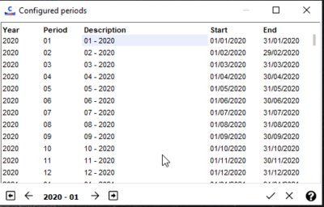

Use the [Previous month], [Next month], [Previous year], [Next year] navigation buttons to move from month to month or year to year.

When the subsequent year does not exist, the program proposes to create it automatically.

Period descriptions can be modified, as well as their start and end date.

If you are an administrator (checkbox available in the user record), then you have the possibility to change these periods directly from the calendar.

How to use configured periods

In cubes

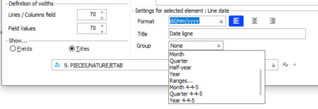

The following has been added to the date grouping criteria:
- Month 4-4-5
- Quarter 4-4-5
- Year 4-4-5

In date entry help

The following keyboard shortcuts have been added for date ranges:
- <H>: Month 4-4-5
- <Q>: Quarter 4-4-5
- <Y> : Year 4-4-5

In the calendar

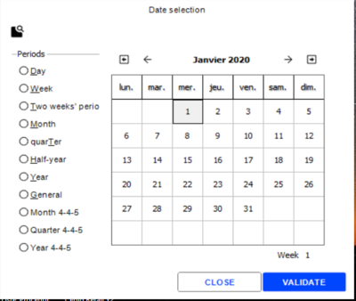

The calendar has been adapted to offer the following three choices in the Periods pane, as well as the display of the week number.
- Month 4-4-5
- Quarter 4-4-5
- Year 4-4-5

How to store configured periods

The configured periods are stored in the CHOIXCOD table as follows:
- Type = YPP
- Code = concatenating:

=> Example: 00A for the first period of 2000
- Description = Concatenation of the previous information, possibly modifiable by users.
- User-defined field = start period and end period stored in numerical format:

= > Example: 38018 - 38046

The YYPERIODESPARAMETREES subtable returns the configured periods.

### Event Log

=> See also procedure 135 (Event Log)

=> Download the Event List in .xlsx format

Event Log

The event log enables you to trace certain actions performed by users. For example, it is possible to list all register receipt cancellations, or when cash registers go to standalone mode, or any other action that is configured to be traced.

Configuring the actions to be traced

Back Office > Administration > Users and access > Access right management

Front Office > Settings > Administration > Users and access > Access right management

The actions which may be traced must be configured in Access right management > Follow up actions (113).

Features whose access rights are set to “Authorized” will be traced in the event log for the user group concerned.

Features whose access rights are set to “Denied” will not be traced in the event log.

Once these actions have been set, they may be traced through the event log:
- Back Office > Administration > Event log > Log query
- Front Office > Settings > Administration > Event log > Log query

Specificity of basic data monitoring

When you select the Follow up actions (113) menu, there is a sub-menu called Basic Data which enables you to trace actions done on the following records: Stores, Warehouses, Customers (and Prospects), Suppliers and Items.

There are two types of follow-up for basic data: Standard and Customized
- Standard follow-up : This type of follow-up allows you to trace actions done on these records. You can then query actions done on these records from the Event log, as for any other action.
- Customized Follow-up : This type of follow-up allows you to trace certain fields in these records, as for tracing a customer name change, the deletion of an address or store, or the creation of a price list category for a supplier, etc. (See topic Customized Follow-up .)

Managing access rights

Back Office > Administration > Users and access > Access right management

To query or purge the event log, access to the following commands must be given to the user group concerned, depending on the permissions you want to assign:
- Menu Administration (106), Event log : Enable the Log query access right for the chosen user groups. For rights regarding access to the Customized follow-up, see the documentation about Customized Follow-up.
- Menu Administration (106), Purge/Archive : Enable the Purge event log access right for the chosen user groups.

Querying the event log

Back Office > Administration > Event log > Log query

Front Office > Settings > Administration > Event log > Log query

This command enables you to query the actions you have set a trace for.

Level and status

Events are classified according to 3 levels. Level 3 will determine the action to follow. Each event will display a status which may take the following forms:

| Status | Description |
| --- | --- |
| Warning | Signals actions on sensitive data, such as changing settings. |
| In progress | Signals that the operation has begun and is not done. |
| Finish with error | Signals that the operation has finished with an error. Double-click on an event to display details. |
| Finish without error | Signals that the operation has finished correctly. |
| Debug | Used by support services to trace certain events. |
| Interrupted | Signals that the operation was interrupted by the user. |

To get more details about an action, double-click on the appropriate line for details on the event.

Related actions

Approve selected elements

This button is available in the multicriteria and is used to approve the selected elements.

Approving an element enables you to consider that it has been seen by the manager or administrator. Accordingly, the administrator may create a filter on non-approved elements, in order to start a trace on elements not yet viewed.

Download the report content

This button, available in the record of the viewed action, allows you to download the report content of the log, if it exists.

For all the log entries that contain information in the notepad, you can download the content into a local file, in order to view the whole import report, even if it is very long.

By default, the file name will be built from the information in the record Lev1-Lev2-Lev3-SiteCode-Number-File.txt

Note that for log entries that do not contain information in the notepad, this button is not proposed.

Purging the event log

Back Office > Administration > Purge/Archive > Event log

The purge wizard will open and display several criteria:
- Retention period for event log (in days): Modifiable field, populated with the value of the company setting present in Administration/Event log .
- Levels to purge: These three levels provide criteria for selecting events to be removed from the log. Note that these levels are also available in menu Administration > Event Log > Log query > Standards tab.

For level 3:

Some values must never to be deleted, and are therefore not purgeable. They are therefore excluded from processing and cannot be selected.

These values are:
- DE3: Modification of billing documents.
- DE7: Deletion of billing documents.
- NE3: Deletion of business documents.
- VNC: Viewing the whole number.

The purge is automatically generated as a scheduled task, and two records are available menu Administration > Event Log > Log query:
- Create a scheduled task: Level information is detailed in the content of this task.
- Purge event log: The number of records deleted is indicated in this task, including the values of the different levels selected.

### Customized Follow-Up

Customized Follow-Up

Cegid Retail Y2 gives you the opportunity to follow up the changes made to certain records such as the Store, Warehouse, Customer (and Prospects), Supplier, and Item records. This follow-up is called "customized" since it enables you to set the fields you want to trace specially for these records, in a creation, modification, or deletion context.

Settings for customized follow-up

Enabling the customized follow-up

Back Office > Administration > Company > Company settings

Go to Commercial management > Default settings and tick the Customized follow-up company setting.

Enabling the follow-up of actions for records

Back Office > Administration > Users and access > Access right management

The records that are to be tracked have to be configured in the Follow up actions (113) menu in the Access rights management module.

To do that, select the Basic data submenu, and check for each record (Customers, Stores, etc.) you want to follow that the Customized follow-up line is set to "Authorized":

Records with the Customized follow-up line set to "Authorized" will be traced in the event log for the user group concerned.

Records with their Customized follow-up line set to "Denied" will not be traced in the event log.

For example, If you want to follow the actions performed on the customer records, select the Customers/Customized follow-up line and set the access to "Authorized” for the user group concerned.

Configuring the fields to follow up

Back Office > Settings > Customers (or Suppliers, Items, Stores, Warehouses) > Customized follow-up

The fields you want to track in a record must be set up via the menu associated with this record, such as: Items, Customers, Suppliers, Stores and Warehouses. As the process is almost identical for all these screens, we will look at the customized follow-up for customers only.

Please notice: if the customized follow-up is enabled for the customer records, this feature is also enabled for the prospects records.

Go to Customers > Customized follow-up and perform the following operations:
1. First of all, specify in which contexts you want to follow up the fields of the customer records by selecting the appropriate checkbox: Creation/Modification and/or Deletion
2. The left part of the screen lists all the fields that may be tracked in a customer record.
3. Use this button to move the fields you want to track to the right part of the screen and validate.
4. The fields moved to the right will be tracked in the customized follow-up of the event log.

For example, if you select the follow-up option Creation, and then select the Address (T_ADRESSE1) from the fields to be tracked, this means that you are tracking the creation of customer records for which the field Address1 is filled in. This action can be viewed in the customized follow-up of the event log.

As in the event log, the customized follow-up creates a record for each creation, modification, or deletion.

The difference with the event log is that these events are recorded only for a sub-group of fields relating to the customer table.

The Filter field at the bottom of the screen allows you to display some of the available fields only, by setting the filter on the field name, field type or field description.

Access rights management

Back Office > Administration > Users and access > Access right management

Activate the following access rights for the user groups of your choice. These rights depend on the follow-up you want to implement and the rights you want to grant.

| Menu | Section | Access right description |
| --- | --- | --- |
| Menu 105: Settings |  | These access rights have an impact on the Customized follow-up command, available in Settings > Items, Customers, Suppliers, Stores and/or Warehouses. This is aimed at granting authorization or not to user groups of your choice so that they may define the fields to follow up for these records. For the following records you may enable or not the Customized follow-up option: Items Customers Suppliers Stores Warehouses For example, I authorize user group X to set the fields for the item records, but not for the customer records. |
| Menu 106: Administration | Event log - Customized follow-up | The access rights have an impact on the Customized follow-up , accessible from Administration > Event log. Grant authorization or not for a selected user group to view the changes made on the following records. Customers Suppliers Items Stores Warehouses For example, I authorize user group X to view the Event log/Customized follow-up for the item records, but not for the customer records. |
|  | Event log - Purge customized follow-up | These access rights have an impact on the Purge of the customized follow-up, available in Administration > Event log. Grant authorization or not for a selected user group to purge the event log for the following records. Customers Suppliers Items Stores Warehouses For example, I authorize user group X to purge the Event log/Customized follow-up for the item records, but not for the customer records. |
| Menu 113: Follow up actions | Basic data | Enable the follow-up type (standard or customized) you want to implement for each of the following records and the user groups you have selected: Stores Warehouses Customers Suppliers Items For example, I want to follow the actions performed by user group X on the item records, but not on the customer records. Please note that the standard follow-up corresponds to the follow-up that is written to the event log. |

Managing the customized follow-up

List of actions to be tracked

The settings defined for the items, customer, supplier, store or warehouse records will impact other commands. If you configure the follow-up of certain fields for these records, the actions performed using the commands hereafter are also tracked in the customized follow-up:

| Commands | Actions |
| --- | --- |
| Items | Create from pictures Batch modification (with an impact on the dimensions of generic items) Batch modification by picture Batch deletion |
| Customers | Batch modification (customer records) Deactivate customer Reactivate customer Merge customers Dashboard (start batch modifications from this board) Prospect records: any change per record, and transforming prospect into customer. |
| Suppliers | Batch modification Batch deletion Deactivate suppliers Reactivate suppliers |
| Stores | Batch modification (with impact on warehouses) Deletion (using Administration > Maintenance > Purge) |
| Warehouses | Deletion (using Administration > Maintenance > Purge) |

Reports and purges

Viewing the changes in the event log

Back Office > Administration > Event log > Customized follow-up
1. Open the customized follow-up of your choice: customers, suppliers; items, stores, or warehouses.
2. The screen displays the list of the changes performed, according to the settings defined previously.
3. To get more details about a change, double-click on the appropriate line.

Purging the customized follow-up

Back Office > Administration > Event log > Purge customized follow-up
1. Select the element for which you want to perform the purge: customers, suppliers, items, stores, or warehouses.
2. Once the data displayed on the screen, select the lines to delete and press the [Delete] button.
3. Deletions are stored in the event log, with the JO2 setting.

### Dashboards

#### Contents

=> See also procedure 395 (Failure to run Dashboards)

Dashboards - Contents

Dashboards are tools that perform dynamic statistical analyses for the purpose of allowing you to obtain relevant analyses on activity data. Although the results may differ according to the data analyzed by each of the Cegid Retail Y2 commands and applications, all commands and applications are used in similar ways.

Dashboards
- Purchase dashboard
- Sales dashboard
- Discount dashboard
- Sales conditions dashboard
- Loan dashboard
- Customer services dashboard
- Inventory dashboard
- Dashboards relating to report changes
- Customer dashboard
- Loan dashboard

Using the dashboard
- Selecting the data to be taken into account
- Selecting a presentation format
- Modifying the statistics presentation format
- Dashboard settings
- Managing date ranges
- Modifying reports

#### Main Dashboards and Access Rights

List of Main Dashboards and Access Rights

This topic lists the main dashboards available in the application and describes the access rights relating to these dashboards.

Purchase dashboard

Back Office > Purchases > Analysis > Dashboard

This dashboard allows you to view and organize data relating to purchases. It is available in two versions: detailed by item and/or dimension.
- By item: Multiple selection criteria enable you to obtain information pertaining to purchases.
- By dimension: Displays the same data as the above dashboard, but with the ability to use item dimensions also.

Access rights are managed in Administration > Users and access > Access right management, and more specifically in menu Purchases (101) > Analysis > Dashboard.

Sales dashboard

Back Office > Sales > Analysis > Dashboard

Front Office > Sales Receipts > Statistics > Dashboard

This dashboard allows you to view and organize data relating to sales. It is also available in two versions: item and/or dimension.
- By item: Multiple selection criteria enable you to obtain information pertaining to sales.
- By dimension: Displays the same data as the above dashboard, but with the ability to use item dimensions also.

Access rights are managed in Administration > Users and access > Access right management:
- To authorize the access in Back Office, go to menu Sales (102) > Analysis > Dashboard.
- To authorize the access in Front Office, go to menu Sales receipts (107) > Statistics > Dashboard.

Discount dashboard

Back Office > Sales > Analysis > Dashboard

This dashboard provides information on discounts applied to retail sales.

Access rights are managed in Administration > Users and access > Access right management, and more specifically in menu Sales (102) > Analysis > Dashboard/Discounts.

Sales conditions dashboard

Back Office > Sales > Sales conditions > Simulation > Dashboard

(Refer to Sales Conditions .)

Sales Conditions

Two reports are proposed for this dashboard:
- Document: Allows the comparison of the various simulations performed, document by document.
- Item: Allows the comparison of the various document simulations, item by item.

Access rights are managed in Administration > Users and access > Access right management, and more specifically in menu Sales (102) > Sales conditions > Simulation > Dashboard.

Loan dashboard

Back Office > Sales > Loans > Dashboard

(Refer to Loan Management )

Loan Management

This dashboard displays the status of each loan line, allowing you to obtain the statistics on the number of current loans, ratio of returned loans, and average duration of loans.

Access rights are managed in Administration > Users and access > Access right management, and more specifically in menu Sales (102) > Loans > Dashboard.

Customer services dashboard

Back Office > Sales > Customer services > Dashboard

Front Office > Customers > Customer services > Dashboard

(Refer to Customer Services ).

Customer Services

Two options are proposed:
- Customer services record: Retrieves information from the record headers.
- Customer services: Retrieves information from headers and lines.

Access rights are managed in Administration > Users and access > Access right management:
- To authorize the access in Back Office, go to menu Sales (102) > Customer services > Dashboard.
- To authorize the access in Front Office, go to menu Customers (109) > Customer Services > Dashboard.

Inventory dashboard

Back Office > Inventory > Query > Dashboard

Front Office > Management > Inventory

Several dashboards are proposed:
- By item / By Dimension: Standard dashboard for inventory with the DISPO table (availability) and enables you to retrieve additional information on inventory, sales, inventory movements and inventory snapshots. The primary query is always based on the current inventory or on inventory at a certain date (following full or optimized inventory closure). It is not possible, for example, to display an item that was sold in a given period if this is not included in current inventory. This dashboard is available in two versions: detailed by item and/or dimension.
- Internal movements: Allows you to view and organize data relating to transfers as well as special inputs/outputs.
- Advanced: Allows you to consolidate information relating to current inventory. You may consolidate up to 2 periods for inventory snapshots, sales, purchases or special movements (refer to Advanced Inventory Dashboard .)
- Inventory age: This dashboard is only available in Back Office > Inventory > Query > Inventory age.

Access rights are managed in Administration > Users and access > Access right management.
- To authorize the access in Back Office, go to menu Inventory (103) > Query > Dashboard (and Inventory age.)
- To authorize the access in Front Office, go to menu Management (108) > Inventory.

Dashboards relating to report changes

Back Office > Settings > Management > Modify reports

Dashboards available in this command allow you to modify the output masks relating to various dashboards proposed in Cegid Retail Y2 (purchases, sales, customers, movements, discounts, inventory, etc.)

Access rights for these dashboards are managed in Administration > Users and access< Access right management, and more specifically in menu Settings (105) > Management > Modify reports.

Customer dashboard

Back Office > Basic data > Customers > Dashboard

Front Office > Customers > Customer management> Dashboard

This dashboard lets you view and organize data relating to customers on the basis of multiple criteria concerning loyalty, business operations, or items sold. Numerous operations are also proposed from this dashboard, such as generating call-up lists, printing customer labels, or batch modification of customer records (see Customer Analyses ).

Customer Analyses

For your information, there is another dashboard in the Customers menu (available in the Reports command) which we recommend not to use because it is less recent and less comprehensive.

Access rights are managed in Administration > Users and access > Access right management.
- To authorize the access in Back Office, go to menu Basic data (110) > Customers > Dashboard.
- To authorize the access in Front Office, go to menu Customers (109) > Customer management > Dashboard.

Hide “Print” and “Export list” functions

Back Office > Administration > Users and access > User restrictions > Action profiles

You can hide the [Print] and [Export list] buttons for certain users with this dashboard. To do this, you must create a customer action profile:
1. Click the [New] button to create a Profile record.
2. Uncheck the Authorized print and List export authorized checkboxes, then save.
3. Open the User record you wish to hide these functions for, then select the profile you have just created in the Restrictions tab. The [Print] and [Export list] buttons will no longer be visible in dashboards for these users.

Objectives dashboard

Back Office > Objectives > Objectives > Reports

(Refer to Objectives Reports ).

Objectives Reports

This dashboard allows you to track and adjust objectives and generate follow-up reports on actual sales against planned goals and/or history.

Access rights are managed in Administration > Users and access > Access right management, and more specifically in menu Objectives (216) > Objectives > Reports

#### Using Dashboards

Using Dashboards

Selecting the data to be taken into account

This step consists of specifying a value in some or all of the fields on the different tabs so that only relevant data is taken into account. These search criteria obviously depend on the command used. For example, they will differ if you use the customer or inventory dashboards.

When you have specified your criteria, click the [Launch] button to display the data.

Please note that if you always use the same search criteria, you can save them in a filter. You can thus avoid entering them every time you wish to perform statistics calculations. In addition, it is possible to associate a display mode or “presentation” with the selection filter which will load automatically when the filter is selected.

Please note!

To print the dashboard in landscape format, you need to check the corresponding setting before making your selection.

before

Selecting a presentation format

All Cegid applications are shipped with a number of presentations, i.e. display formats that you are free to copy or rename according to your needs. Of course, you can also create new presentation formats and delete those that are no longer used.

To choose the presentation to be used, click the available arrow in the Presentations area.

Modifying the statistics presentation format

If an existing presentation format is selected, the results displayed on the screen will take into account the selected settings. However, it is still possible to modify the presentation format directly on the screen. If no presentation formats exist or are not suitable, you can create a new presentation format. After selecting criteria, the initial table will display several columns available for various operations.

Displaying columns

To display a column from the statistics table, complete the following steps:
1. Place your cursor in the header of one of the displayed columns.
2. Right-click to open the shortcut menu.
3. Select the Show column command.
4. Select the column(s) to be displayed in the table. They will be inserted just after the last column in the table.

Moving columns

The order the columns are displayed in can be change by shifting them.
1. Click on the header of the column that you want to move. Hold the mouse left-click button down.
2. Move the mouse to the position where the column is to be placed. This is made easier with the appearance of two yellow arrows indicating the column separator when you hover the mouse over either of the two columns.
3. When you release the mouse button, the column that you are moving will be placed in front of the column indicated by the yellow arrows.

Modifying column width
1. Place the cursor on the separator line to the right of the header of the column to be modified.
2. Once the cursor takes the shape of a vertical line, left-click and drag until the column reaches the width desired.

Hiding columns

To hide one of the columns displayed in the table, complete the following steps:
1. Place the cursor in the header of the column that you want to hide.
2. Right-click to open the shortcut menu.
3. Select the Hide column command. The column will be hidden immediately.

Configuring layout

You can also use the [Set up layout] command to hide or display a column as well as specify where a column is displayed within the table.

- To insert a column in this table: Click the title of the column to be added in the Available columns list. Then click the [Add] button. The column will be automatically inserted into the list of the columns selected.
- To remove columns: Click the title of the relevant column in the Columns selected list, then click the [Remove] button. The title of the deleted column will be immediately added to the Available columns list.

Performing calculations based on column data

It is possible to perform different calculations based on the values contained in each column. The result is always displayed at the bottom of the relevant column. However, it is not possible to request a calculation for columns that have been grouped together.
1. Place the cursor in the header of the column the calculation is to be performed for.
2. Right-click to open the shortcut menu.
3. Choose a calculation command from the list displayed:
1. Once you select the command, the result will be calculated and displayed in the table immediately.

If one of the proposed calculations cannot be performed for the type of value contained in the column, the command will be inactive. For example, if all of the values contained in a column are alphabetical only, the Sum and Average commands will not be active because they relate to numerical values only.

Deleting results displayed at the bottom of a column
1. Open the shortcut menu by right-clicking on the header of the relevant column.
2. Select the Nothing command.

If you have grouped the data in one of the columns of the table, you can hide the totals temporarily by selecting the Hide command from the shortcut menu.

Sorting data in a column

By default, data in the table is sorted in ascending order based on the values in the first column, however you are free to change this display format. When the data table is displayed on the screen, left-click on the header of the column corresponding to the field whose data you want to sort.

The triangle displayed to the right of the column title indicates the sorting order:
- A triangle pointing up indicates ascending order (from lowest to highest value).
- A triangle pointing down indicates descending order (from highest to lowest value).

If the values in the column are alphanumerical, the numerical values are sorted first and then the alphabetical values. For data composed of several characters, the first character is sorted first, then the second and so on.

Grouping data in a column

For greater clarity, it is possible to group the different elements of a column and quickly check the results obtained for one element of a column.
1. Click on the header of the column to be grouped and drag it above the column title row in the header of the table while keeping the mouse button depressed.
2. When two small vertical yellow arrows appear, release the mouse button. Each time a different element is found, a row is added to the table, with the title of the column followed by the name of the element. This row corresponds to a level.

On the left of the title at this level, a small button is displayed indicating that the level is closed.

By clicking on this symbol, the details for the data composing this level becomes visible, and the icon changes to the [-] sign, indicating that the level is open.

1. Complete these steps for all columns to be grouped.

Ungrouping a column
1. In the table header, place the cursor on the title of the grouped column.
2. Right-click to open the shortcut menu, and activate the Ungroup command. The title of the column is moved down to the row containing the column titles, and all of the data is displayed again.

Showing or hiding data in a grouped column

It may sometimes be useful to group a column while also being able to view the detail of the data that it contains:
1. In the table header, place the cursor on the title of the grouped column.
2. Right-click to open the shortcut menu and activate the Show column command. In this case, the title of the column is displayed in the table header to indicate that it is a grouped column, and also in the columns title row to allow you view the detail of the data it contains.

To hide the data in a grouped column again, complete the following steps:
1. In the table header, place the cursor on the title of the grouped column.
2. Right-click to open the shortcut menu and activate the Hide column command.

Opening and closing a level in the table

When a level is open, all of the data composing this subset is displayed in the table. For greater clarity, it may be useful to close the levels so that the data no longer appears and is included in the results only.

To close one level only, simply click on the small button with a minus sign [-] that is displayed on the left of the title of the level.

The button symbol will change to a plus sign [+].

To open this level again, simply click on this button [+].

Once you modify a level in this way, the application views it as a user-specific presentation format, which is indicated by the symbol to the left of the option on the shortcut menu.

Opening and closing all levels of a column
1. To open or close all of the levels in a particular column, place the cursor in the title of the grouped column in the table header.
2. Right-click to open the shortcut menu and select the “Close this level” or “Open this level” command, depending on the required presentation format.

Opening and closing all levels of all grouped columns
1. To open or close all levels of all columns that have been grouped, place the cursor in the title of one of the grouped columns in the table header.
2. Right-click to open the shortcut menu and select the “Close all levels” or “Open all levels” command, depending on the required presentation format.

If all levels are closed, only the levels of the first grouped column will be displayed in the table. To view the different levels of all grouped columns without viewing the data contained in these columns, activate the Tree structure only command in the shortcut menu.

Tree structure only

Impact on table settings

Modifications made to the levels directly using the Close all levels, Open all levels, Tree structure only , and User settings commands in the shortcut menu will have the same impact on the Miscellaneous tab, accessible via the [Set up layout] button.

Close all levels, Open all levels, Tree structure only

User settings

Please note!

Modifications made directly to the table are not saved automatically in the current presentation format. If you are working with a user-specific presentation format, you need to use the Save command in the Presentations menu to save your changes. Otherwise, you will need to make a copy of the presentation format first, make the required changes, and then save it again.

In addition, if you open or close the different column grouping levels, these changes will only be saved if they are made using this button.

In general, the presentation formats only display part of the fields that make up the records for which you have requested statistics. However, you may display other fields or hide existing fields using the options in the shortcut menu, which you can display by right-clicking on the header of a column.

Dashboard settings

If you have not selected a presentation format, the dashboard will display the data from all of the fields that make up the record of the element for which statistics have been requested as soon as your selection criteria are applied.

To obtain more relevant results, you need to select the type of information to be displayed by clicking on the [Set up layout] button.

At this stage, different actions can also be carried out in order to format the statistics table. These actions may be done on:
- Column titles: click the Title tab
- Table data: click the Data tab

Adding or removing a column

Although it is possible to add or remove columns from the statistics table directly, it is better to use the [Set up layout] button when creating a new presentation format or when permanently modifying the data to be displayed. At this stage, you can insert new columns in which the data is obtained via a calculation formula.
1. To insert a new column in the table, click the [Set up layout] button. Click on the title of the column to be added, available in the Available columns list.
2. Click the [Add] button. The column will be automatically added to the Columns selected list. If you want to move this field to a different position in the table, you need to do this in the table directly by moving the field to the required position.
3. To remove a column, click the [Remove] button.

You will need to check the Show fields option to display a field name, rather than its title

Modifying the format of column titles and/or data

You may change the format of column titles and data to brighten up the table and highlight important elements.
1. Once the data table is displayed on-screen, click the [Set up layout] button.
2. Choose the column that you want to change from the Columns selected list.
3. Select the type of formatting that you want to apply from the various options offered.

Please note!

It is only possible to modify the format of columns that have not been grouped. If the column has been grouped, you need to ungroup it first.

Modifying the font of a column title and/or data
1. The Font field in the Title tab indicates the settings that are applied to the title of a previously selected column.
2. Click on this button to modify the font, style (normal, bold, italic), size in points (8, 9, 10, etc.), effects (strikethrough, underline), and color.
3. To use a color other than those displayed in the font settings window, click on the [Color] button.
4. Click the Data tab to change data display in the previously selected column. You will then be in a Font area. It operates exactly like the one in the Title tab.

Modifying the alignment of a column title and/or data

The Framing buttons included on both the Title and Data tabs allow you to change the alignment of the text within the column:

Aligns text to the left border of the column.

Centers text between the left and the right borders of the column.

Aligns text to the right border of the column.

Changing the description of a column title

By default, the full column description is displayed in the table. To change it, simply enter a different value in the Description field on the Title tab.

Changing data format

Depending on the data included in the column, you can change the way data is displayed by entering the required format in the Format field on the Data tab:

| Date format |  |
| --- | --- |
| dd/mm/yy | Displays dates in the format 11/07/2007 |
| dd/mm/yyyy | Displays dates in the format 11/07/2007 |
| dd mmmm yyyy | Displays dates in the format 11 July 2016 |
| Amount format |  |
| 0 | To display a whole number (567) |
| 0.0 | To display one decimal place (567.1) |
| 0.00 | To display two decimal places (567.12) |
| #,##0.00 | To display thousand separators and two decimal places (3,567.12) |
| #,##0 | To display thousand separators and no decimal places (3,567) |
| #,##0 ;; ; | Semicolons are used to separate different display formats: Positive amounts Negative amounts (displayed as positive number if no value entered) Null amounts (zero displayed or not) In these formats, “0” indicates that the character is mandatory; # indicates that the character is optional. |
| Code and description formats | If no format is entered, only the identifier code is displayed. |
| $ | To display the description associated with a code |
| $$ | To display the ID code as well as the description |

Defining calculation formulas

You can also create calculation formulas (up to 3 per cube) :
1. Click one of the Formula fields (1, 2 or 3) in the Available columns list. This will automatically add the Formula field to the list of Columns selected list.
2. Enter the calculation formula in the Data tab (Formula area, Expression field), adhering to the following syntax:

+ add

- subtract

/ divide

* multiply

Example:

You want to find out the Euro and Dollar value of the amounts displayed in the cube. The code corresponding to the Amount field is GP_AMOUNT and the Euro/Dollar exchange rate for today is 0.98. The formula will be as follows: GPE_AMOUNT*0.98

Changing the background of a title and/or column

To make the statistics table easier to read or to highlight certain results, you can change the appearance of columns (titles and/or columns) by changing the background:
1. Click the [Set up layout] button in the data table.
2. Select the column whose background you want to change from the Columns selected list.
3. Then select the column title or data to be modified by clicking on the corresponding tab.
4. In the Display section, click on one of the following three buttons, depending on the effect desired:

Freezing columns
1. Click the [Set up layout] button in the data table.
2. Select the column that you want to freeze from the Columns selected list.
3. Click one of the buttons to freeze the position of columns to the right or left in the data table. The frozen column will be automatically moved to the start or end of the table, depending on your selection, regardless of its previous position. In the table, it is clear whether or not a column is frozen:

Click the [Unfreeze column] if you no longer want it to be frozen.

Changing display format of grouped columns

Using the [Set up layout] button and the various options available in the Miscellaneous tab, you can change the display of the calculation bands and grouped columns in the statistics table.

Please note!

When changes are made in the Settings window, it is the presentation format applying to the statistics table will be modified. To save these modifications, you need to save this presentation format first before exiting the relevant window.

To ensure that data from columns that have been grouped together is still presented in detail in the table, check the Display the grouped columns box.

You can change the way calculation bands are displayed through the options in the Calculation bands section. Check one of the available radio buttons to specify the way calculation lines are to be displayed:
- Never: Calculations are never displayed in the table.
- Always: Calculations are always displayed in the table.
- Groups only: Only the calculations for grouped columns are displayed.

The After grouping field enables you to change the default display for the various grouping levels done in the statistics table. Check one of the following buttons :
- Close all levels: All levels of all grouped columns will be closed. Only the levels of the first grouped column will be displayed in this case.
- Open all levels: All levels of all grouped columns will be opened.
- Tree structure only: All levels of all grouped columns will be displayed in the table, however none of the data contained in these columns is displayed.
- User settings: Select this option if only some of the levels in the statistics table have been opened or closed directly, and you want to retain this selection in the display format that you are currently using.

If the levels are modified directly in the statistics table using the Close all levels, Open all levels, Tree structure only, or User settings commands from the shortcut menu, these changes will be reflected identically in the Miscellaneous tab via the [Set display settings] button.

Exporting statistics files

The [Export the list] button allows you to export the statistics table to a file in .txt, .xls, .xlsx, .asc, .wks, .html, .xml, and .sxc format for use in other applications.

Please note!!

It is not the data that is exported, but rather the statistical results as displayed on the screen.

Example:

If data has been grouped and all levels are closed, and you then request a calculation for the last level, only the tree structure and the calculation will be exported.

Print Dashboard

To print the dashboard, click the [Print] button.

Please note!

Regarding the opening or closing of the grouped column levels, printing is performed according to the settings defined using this button in the Miscellaneous tab, and not according to the changes made directly in the table.

Managing date ranges

Back Office > Administration > Users and access > User groups

For the purpose of restricting resource-intensive processes, it is possible to limit the date ranges for searches in the analyses carried out by user group.
1. Open the desired User group record.
2. Enter the maximum number of days in the Maximum scope of analysis field.
3. Enter in the Retained date field, the date to be retained when the dates are forced (start date or end date.)

Not that only the dates on the General and Additions tabs can be managed in this way. For the advanced inventory dashboard, the dates on the Document tab can be managed in this way, however inactive dates are not taken into account.

Modifying reports

Back Office > Settings > Management > Modify reports

This command is used to change report templates concerning dashboards for purchases, customers, internal movements, discounts, inventory and sales.

### Cubes

#### Contents

=> See also procedure 395 (Failure to run Cubes)

Cubes - Contents

The decision cube is a powerful tool that allows you to analyze data based on criteria of your choice, and display it in the form of a dynamic pivot table or graph. The purpose of this topic is:
- to describe the general operational principles of decision cubes in the Cegid Retail Y2 application.
- to explain how to create, back up, and display analyses using decision cubes.

Main cubes
- Purchases cube
- Sales cube
- Payments cube
- Inventory cube
- Objectives cube
- Customers cube

Using cubes
- Defining data selection criteria
- Choosing the cube display format
- Modifying the layout of the cube
- Displaying cube results in table format
- Displaying cubes in graph format
- Managing date ranges
- Modifying reports

#### Main Cubes and Access Rights

List of Main Cubes and Access Rights

This topic lists the main cubes available in the application and describes the access rights relating to these cubes.

Purchases cube

Back Office > Purchases > Analysis > Purchases cube

This cube enables you to obtain data concerning purchases. It is available in two versions : item and/or dimension.

Access rights for this cube are managed in Administration > Users and access > Access right management, and more specifically in menu Purchases (101) > Analysis > Purchases cube.

Sales cube

Back Office > Sales > Analysis > Sales cube

This cube allows you to view and organize data relating to sales. It is available in two versions : item and/or dimension.

Access rights for this cube are managed in Administration > Users and access > Access right management, and more specifically in menu Sales (102) > Analysis > Sales cube.

Payments cube

Back Office > Sales > Analysis > Payments cube

This cube allows you to view and organize data relating to payments (see Payments cube ).

Payments cube

Access rights for this cube are managed in Administration > Users and access > Access right management, and more specifically in menu Sales (102) > Analysis > Payments cube.

Inventory cube

Back Office > Inventory > Query > Inventory cube

This cube allows you to view and organize data relating to item inventory. It is available in two versions: by item and/or by dimension.

Access rights for this cube are managed in Administration > Users and access > Access right management, and more specifically in menu Inventory (103) > Query > Inventory cube.

Objectives cube

Back Office > Objectives > Objectives > Cube

This cube allows you to view and organize data relating to the Objectives module (see Objectives Cube .)

Objectives Cube

Access rights for this cube are managed in Administration > Users and access > Access right management, and more specifically in menu Objectives (216) > Objectives > Cubes

Customers cube

Back Office > Basic data > Customers > Reports > Cube

This cube allows you to view and organize data relating to customers (see Customer Analysis ).

Customer Analysis

Access rights for this cube are managed in Administration > Users and access > Access right management, and more specifically in menu Basic data (110) > Customers > Cube.

#### Using Cubes

Using Cubes

Most Cegid applications use the decision cube calculation method but the steps performed to obtain these results are similar regardless of the application or selected command.

Defining data selection criteria

After selecting the necessary command, enter some or all of the fields displayed on the various tabs in order to select the data to be taken into account for the calculation of the cube. These fields differ from one command/application to another.

Then click the [Filter] button or press the F9 key to make the selection. A new tab, called Layout , will be displayed.

In some cubes, the Criteria tab proposes the Display/Hide criteria checkboxes to make appear additional selection tabs for items, stores or warehouses.

Please note!

If the cube is to be printed in landscape format, you will need to check this box before applying the selection.

before

Choosing the cube display format

Cegid applications are generally shipped with several presentations for each of the commands associated with decision cubes.

These display options, available in the Layout tab through the [Presentation menu] button, can be used in their existing format. To modify an existing presentation or create a new one, carry out the steps indicated below. Once you have defined the presentation, make sure to save it. As the cube is a summary report tool, it is advisable to limit the number of fields selected. The creation or modification of a cube presentation involves a number of different steps as follows:

Select fields for analysis

At least two fields must be selected to create a cube. The left-hand side of the Layout tab displays the list of available fields, i.e. the description of the fields that can be used. You may also use the [Show fields] button to display the name of a field, rather than the title.
1. Select the field desired in the Available fields list.
2. Click on the [Add line] button.
3. The field will be then added to the Rows/Columns list.
4. Use the [Remove line] button to remove a field from the list.

This will automatically add the field to the Available fields list.

Display analysis criteria by row or column

As you select analysis criteria, the application will automatically determine if the criteria will be displayed in rows or in columns in the decision cube. However, you may change the display using the buttons to the left of the criteria descriptions:

indicates that the criteria will be displayed by column.

indicates that the criteria will be displayed by row.

To change the display, hover the cursor on the criteria to be changed, then right-click the mouse and select the Switch option. If the criteria are displayed by column, it will now be displayed by row, and vice versa.

Select values

These are values corresponding to other fields on the database for which calculation methods can be defined (sum, average, counting, etc.) Then select both the field used as a value and the calculation method which will be assigned to it.
1. In the Available fields list, click the first field that you want to use as a value.
2. Click on the [Add value] button. A sub-menu will be displayed with the available commands.
3. Select an option from among the following :

Example:

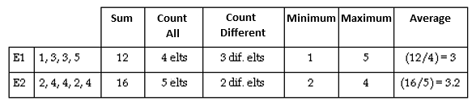

If the field used as a value does not contain numerical values, the Sum, Minimum, Maximum and Average commands cannot be used.
1. Complete the following steps for all fields to be used as analysis values.

Modifying the layout of the cube

Move fields to the list of Rows/Columns or Values

The order in which fields are processed can be modified by clicking on these buttons. It is also possible to modify the order after the cube has been calculated and displayed on the screen.

Modify column width

In the lower left section of the Layout tab, the Define width field enables you to change column width (line/column fields and Value fields), by changing the default number. These modifications are performed for the whole table, not just for one specific row or column.

Define calculation formulas

The procedure is identical to the one for dashboards. Click here for more information .

Click here for more information

Modify alignment of a column title and/or data

First, select the field that you want to modify, from either the Rows/Columns list or the Values list.

For an element from the Rows/Columns list, this formatting relates to the title of the rows or columns while, for an element from the Values list, it relates to the title of the result field.

The formatting of the text in the column can also be modified by clicking on the following buttons (at the bottom of the screen:)

Aligns text to the left border of the column.

Centers text between the left and the right borders of the column.

Aligns text to the right border of the column.

Modify color of a column title and/or data

After selecting the field to be modified in either the Rows/Columns list or the Values list, click this button to select the desired color.

For an element from the Rows/Columns list, this formatting relates to the title of the rows or columns while, for an element from the Values list, it relates to the title of the result field.

Modifying the format of titles and/or data

The Format field contains a list of options that allow you to define the display mode for Date or Amount type values, or for codes and descriptions. The procedure is identical to the one for dashboards. Click here for more information .

Click here for more information

Change the title of a row/column

The description of the selected field is displayed by default in the Title field. This description can be modified.

Group Date field values

When a selected field contains a date, you can modify how it is displayed by selecting one of the options listed in the Group field:
- Calendar day: Data will be grouped according to the day of the week (Monday, Tuesday, Wednesday, etc.)
- Week: Data grouped by week number
- Month: Data grouped by month
- Quarter: Data grouped by quarter
- Half-year: Data grouped by half-year
- Year: Data grouped by year
- Range: Grouping done through a range of dates. Define and select dates using this button [...].

Save the presentation and validate the cube

Once the cube display format has been defined, click on the [Validate] button to calculate and display the results.

Attention!

If the cube presentation has been modified, remember to save it.

Display cube results in table format

The results of the previous steps are displayed in the Result tab in the form of a dynamic pivot table. You can change the table layout in several ways:
- Directly in the table, using the mouse.
- Or using the commands displayed in the shortcut menu (by right-clicking with the mouse.)

Sort data in rows and columns

The various data calculated in the decision cube is sorted by default in increasing order (a-z, 1-9), but this can be modified.
1. Place the cursor over the header of the relevant row or column.
2. Right-click to open the shortcut menu.
3. Activate the Sorting order command and check the desired option.

Move rows and/or columns

You can move column data into a row, or row data into a column. It is also possible to invert two columns or two rows:
1. Place the cursor over the heading of the row or column that you want to move.
2. Click and hold down the left button on the mouse.
3. Drag the mouse until the data is at the desired location:
1. When the mouse button is released, the move is completely instantly.

Hide/Display columns
1. Click the small, yellow button showing a minus sign in the dimension header. All columns located to the right of this column will disappear.
2. To display them again, click on the plus sign button. The columns will once again be displayed in the table.

Show/Hide subtotals for a row or column
1. Place the cursor over the header of the relevant row or column.
2. Right-click to open the shortcut menu.
3. Check or uncheck the Visible subtotal option, as desired.

Show/Hide all subtotals at once
1. Click on the [Cube settings] button.
2. Select the Show subtotals or Hide subtotals command, as desired.

Display description and/or code

When fields are composed of a code and a description, it is possible to display the code, the description, or both:
1. Place the cursor over the header of the relevant row or column.
2. Right-click to open the shortcut menu, and select the Display description command.
3. Select one of the following commands:

Modify date grouping

In the dynamic pivot table displayed in the Result tab, you can change the display mode for date type rows or columns (week, month, quarter, etc) To do this, place the cursor on the header of the relevant row or column and right-click to open the shortcut menu. Then activates the Dates grouping command and select the desired grouping type. The new display mode is visible immediately.

However, to define date ranges for data display, you will have to configure these settings in the Group field displayed in the Layout tab.

Exclude one or more data items from a row and/or column

When a row or column contains a large quantity of data, some of which may not be significant, it is possible to hide one or more data items:
1. Place the cursor over the header of the relevant row or column and right-click to open the shortcut menu.
2. Activate the Target command. A window will then open, displaying a full list of the various values contained in the row or column, each one preceded by a checkbox.
3. Check all boxes corresponding to the values you want to display. Those values whose box is not checked will not be displayed:
4. Click the [Validate] button. If (…) is displayed in a row or column header, this indicates that only part of this row or column’s data is being displayed. If only one data item is displayed for a row or column in the table, its ID code will appear in the header. To view all values for a row or column again, simply re-check all boxes via the Target command.

Please note!

If the values for a column are “targeted” and then hidden, totals are recalculated for all values, not only for the targeted values.

Display numerical data in absolute values or percentages

By default, numerical data is displayed in absolute values, but this display can be replaced at any time by selecting a display in percentages:
1. Place the cursor over one of the numerical data items.
2. Right-click to open the shortcut menu.
3. Select one of the proposed options, depending on the desired result:

A symbol is displayed to the left of the option title selected.

In the decision cube, the % symbol is automatically added to the table values.

To view totals at the end of rows and/or columns, the Visible subtotals option must be checked for rows and/or columns.

Display details for criterion results

The Deploy command, which can be accessed via the shortcut menu, allows you to obtain value details for one or more criteria of your choice, rather than for all criteria displayed, while still displaying the total for the other criteria.

Example: Suppose you have the two following criteria.
- An alphabetical criterion containing three values: A, B and C
- A numerical criterion containing two values: 1 and 2

Schematically, the criteria and their values would be displayed as follows:

| Alphabetical Criterion | Numerical Criterion |
| --- | --- |
| A | 1 |
| 2 |
| B | 1 |
| 2 |
| C | 1 |
| 2 |

If only the alphabetical criterion is deployed on value B, the display will be as follows:

| Alphabetical Criterion | Numerical Criterion |
| --- | --- |
|  | Total A |
| B | 1 |
| 2 |
|  | Total C |

There is no restriction placed on the number of values that can be attributed to a criterion or the number of criteria that can be deployed. However, you must deploy a criterion if it is the last criterion in a row or column. Unlike the Target command, for which results are calculated based on elements displayed in the decision cube only, the Deploy command allows you to view details of significant values only, while still displaying the totals for all criteria values.

Save the presentation

Changes made to the dynamic pivot table can be saved in the current display by clicking on the [Save presentation] button.

Truncate values

When a row or column contains a description that is too long, it is possible to truncate it using the [Cube settings] button and the Truncate values option. To display the description again in its entirety, perform the same steps.

Print cube

This button allows you to print the cube in its configured format, using various printing options.

Display cubes in graph format

You can display cubes in graph format at any time. After the cube has been calculated and displayed in the Result tab, click the Graph tab.

The graph is calculated according to the position of the rows and columns in the dynamic pivot table. Thus, the fields displayed in rows on the table correspond to the x-axis of the graph, and those displayed in columns correspond to the y-axis.

If you change the location of the rows and/or columns in the Result tab, the graph will be recalculated in the Graph tab.

Modify graph format

The format and the display of a graph can be modified using the following commands, accessible by double-clicking on the graph. The screen display is made up of two tabs: Graph and Series .

The Graph tab includes the following commands:
- Series: Modify the position, format and display of the various data series contained in the graph.
- General: Modify general settings.
- Axis: Modify the format and display of axes (x and y axes.)
- Title: Modify the font, color and position of titles.
- Legend: Modify the position, format and display of the legend.
- Panel: Set the frame border of the graph. It is made up of an interior and exterior border.
- Pagination: Set the graph pagination
- Border: Modify the display of the graph borders (left, bottom and background borders).
- 3D: Set certain effects, such as zoom, rotation, elevation and perspective.

The Series tab allows you to customize the graph type set in the Graph tab. If several graphs have been inserted into your screen, select the graphic you wish to invert.
- Format: Change the general layout (border, color, etc.)
- Point: Set the point number if the graph data is in this format.
- General: Set the axis and the graphic format.
- Labels: Configure labels
- Source: Select the graph source

Managing date ranges

Back Office > Administration > Users and access > User groups

For the purpose of restricting resource-intensive processes, you can limit the date ranges for searches in the analyses carried out by user group. To do so, open the User group record of your choice, then, enter the maximum number of days in the Maximum scope of analysis field. Enter in the Retained date field, the date to be retained when the dates are forced (start date or end date.)

Modifying reports

Back Office > Settings > Management > Modify reports

This command enables you to change print masks concerning cubes for purchases, sales, customers, payments and inventory. Access rights for this feature are managed in Administration - Users and access - Access right management, and more specifically in menu Settings (105) > Management > Modify reports.

#### Payments Cube

Payments Cube

Back Office > Sales > Analysis > Payments cube

This cube allows you to view and organize data relating to payments.

Access right management

Back Office > Administration > Users and access > Access right management

Access rights for this cube are managed in menu Sales (102) > Analysis > Payments cube

Using payments cubes

This cube provides you with an extraction of payments from documents, bases on the various criteria available in the Criteria tab

To learn more about how the cube works and its various layout options, please refer to the document on how the cubes work (see Cubes .)

Cubes

Focus on the Exclude cash flow receipts criterion.

In the payments cube, to display only the sales receipts and collected amounts, i.e. excluding cash movements (such as safe remittance receipts, register opening/closing receipts) you must tick the Exclude cash flow receipts option.

This way, only payments related to sales receipts and invoices will be shown.

A cash flow receipt is related to any register operation for which the Cash transaction option is checked in the Characteristics tab in its record (see Register Operations .)

Register Operations

Please note!

This option is all the more important because if it is not checked, the following situation may occur:

For a given day and for a payment in CASH, if the total amount of the cash flow receipts (various cash in/out) is greater than the total amount of sales receipts and invoices, then the cube will not display any results for this day and this payment method.

Example

|  | Detailed display with receipt number an internal reference | Cumulative display per day |
| --- | --- | --- |
| Option not checked |  |  |
| Option checked: |  |  |

### Alert Management

#### Indicators

##### Contents

Alert management - Contents

The aim of this documentation is to describe alert management functionalities and simplify their use as follows:
- By explaining how they work.
- By describing the standard indicators and alerts that can be created.

Each indicator is based on an SQL query. The results of this query are then retrieved in a report and sent by email if required. The storage of PDF files may require considerable space if numerous indicators and alerts are sent every day. Users can disable the archiving of the results depending on the indicator or alert.

Each time the query is run, the report is stored in the history. However, you can print the report directly, or send it as an attachment to the list of recipients defined for the indicator.

The alert condition settings enable you to differentiate between various elements based on the selected condition. You can send only the list of elements with alerts.

Interactive alerts are not described here (see Interactive Alerts .)

Interactive Alerts

Foreword
- Indicator categories
- CEGID indicators
- Version updates
- User restrictions
- Storage of indicator results
- Access rights

Indicator settings
- SQL query
- Alert condition
- Results
- Scheduling
- Related actions

How to use indicators
- Run indicators
- Query indicators
- Alert lists

Standard indicators
- List of standard indicators

##### Foreword

Alert Management - Foreword

An indicator is an element that enables you to obtain a specific result when it is run at a certain time. It is an SQL query which will return one or more results when run.

Indicator categories

Indicators can be arranged by category. These categories are user-defined. Users classify their indicators based on their requirements. (Examples of indicator categories: Customers, Purchases, Sales, Inventory). The "CEGID Indicators" category is the default category shipped with the application and cannot be deleted by users.

CEGID indicators

Standard indicators are available to users. These indicators belong to the "CEGID Indicators" category. Their code starts with the specific prefix "CEG" or "CEG-". They cannot be modified by users and cannot be used directly. They can be used as templates to help users create their own indicators. Each time there is a version change, these indicators are updated automatically.

The "CEG" prefix must not and cannot be used to create user-defined indicators.

Version updates

To monitor modifications to indicators, a version number is assigned to each indicator. This number is based on the Cegid version in use. The number cannot be modified. It is incremented each time the indicator is modified:
- CEGID indicators are assigned the number of the version with which they are shipped.
- User-defined indicators are created with the number of the version in use. The indicator version number is incremented based on modifications made to the SQL query or alert condition.

The format of the version number is as follows: 09.000.001. This indicator is based on application version 9.0, corresponding to internal version 1. This version number informs users, especially in terms of history tracking, that a modification was made, and that there may be differences between the different times a given indicator is run.

User restrictions

Indicators may be based on different types of user restrictions, including restrictions on indicators and alerts. To apply these restrictions, queries must contain the store ("AS ETABLISSEMENT" alias) or the warehouse ("AS DEPOT" alias).

Storage of indicator results

Back Office > Administration > Alert management > Query

The stored indicator results (available via the " Query " menu) are those sent by email to the various recipients defined for the indicator. If the email sending functionality was disabled, a single global result (independent of user restrictions) will be stored and the user who ran the indicator will be the recipient. If the indicator includes all stores, the data on stores sent to recipients will vary depending on user restrictions. As such, results may vary from one user to another depending on the restrictions specified in user records.

Access rights

Back Office > Administration > Users and access > Access right management

The use of indicators and alerts is defined by access rights that may be granted or denied in the following menus.

Menu Concepts (26) > Commercial management > Alert Management
- SQL request setup
- Report setup
- Show all indicators

Menu Administration (106) > Alert management
- Query
- Setup
- Alert lists

##### Indicator Settings

Indicator Settings

Back Office > Administration > Alert management > Query

Standard indicators (with the "CEG" prefix) containing predefined queries are shipped with each version of the application.

To ensure that you can view all standard indicators, disable the Active option in the multiple criteria.

Users can create their own indicators using the [New] button. However, it is recommended to create a new indicator by duplicating the most suitable indicator using the [Duplicate] button.

You must then specify the properties of the indicator such as the SQL query, alert condition, retrieval and scheduling.

SQL query

Use this button to display the window for defining the SQL query. As SQL queries are quite complex, they should not be accessible to all users. As such, this feature is subject to access right management, namely SQL request setup . Once you have entered the code of the new indicator, you can access the setup of the query because the query of the duplicated indicator can be modified.

Structural constraints relating to the SQL query
- Use aliases as much as possible to simplify the definition of the alert condition.
- Alias of 35 characters. If no alias is used, fields can contain up to 35 characters.
- No update, insert... queries only select queries (a check is performed. (A check is performed before the query is run.)
- To apply the store restrictions, it is necessary that: The first field of the query is the store code and only the code. This field has the alias ETABLISSEMENT; AS and the alias are written in uppercase. Example: SELECT et_etablissement AS ETABLISSEMENT, (...)

Alert condition

To define the indicator as an alert, you must specify the corresponding condition. This is done in three steps:
- Select the field to evaluate: These are the numeric fields in the SQL query you defined.
- Select the operator: These are the standard operators used for numeric comparisons.
- Select the evaluation value: The value is selected by users based on their requirements.

Remarks on the selection of the field

This is a list of fields that can be used to define alert conditions for the indicator. This field will be available only once the SQL query is defined. It will then present all numeric fields in the SELECT query, represented by their alias if they have one. Some non-numeric fields may also be available in the selection list. However, even though these fields can be selected, they cannot be used.

Results

A user-defined indicator can have two functions:
- Display data to be viewed and analyzed by the user. This indicator will not have any trigger condition.
- Trigger one or more alerts based on a particular condition, after analysis.

The results returned can be emailed, printed or displayed on screen. For each of these three retrieval actions, you can set up an alert to be sent:
- None: No message is sent
- Alert: Lines with alerts are sent
- Detail: All result lines are sent

Results sent by email

Preliminary settings

Back Office > Administration > Company > Company settings

You must first configure the relevant settings before the application can send e-mails. Go to Commercial management > Emailing, and specify the fields as described here .

described here

Select recipients

Recipient email addresses must be specified in their records, as well as any existing restrictions. Recipients can be selected by user or by group. The proposed groups are user groups or user-defined tables. In order to restrict the data sent to recipients, the selected restriction is applied to the indicator results for each email recipient.

When selecting recipients, a warning will be displayed if one or more recipients do not have a specified email address.

Message content
1. The subject of the email should be as follows: "Indicator – Execution date"

Example: "MARK-DOWN – 8/4/2011 17:32:00"
1. The body of the e-mail should be as follows: "Indicator – Description – Number of lines with alerts"

Example: “MARK-DOWN – Markdown rate per store/day – Number of lines with alerts: 5"
1. The attachment is a PDF file containing the results of the indicator run.

The contents of the file depends on whether you selected an alert or a detail in the settings.

Printing results

One printed report is associated with each indicator created:
- In the case of a new indicator, the report is based on a template containing the standard basic mechanism.. You simply define the columns required in the report as specified in the indicator query.
- When duplicating, the original indicator report is copied.

If requested, printing can be triggered when running the indicator query.

You can also click the [Instant printing] button to print. This will print the indicator results without archiving them or sending an email.

During processing, the report is stored in the database in PDF format. This enables you to view the report at any time on the multi-criteria screen accessed in Back Office > Administration > Alert management > Query.

Please note!

Please note!

The codes for the indicator templates created must be numerical. When an existing template is assigned to a new indicator, the template must be registered in place of the previous one with the same number.

The codes for the indicator templates created must be numerical. When an existing template is assigned to a new indicator, the template must be registered in place of the previous one with the same number.

Just remind! CBP constraints - Report generator for displaying images in reports

You can integrate images into reports when an indicator is launched. However, certain constraints must be met to enable their display:
- The image component must always be part of the "Detail 1" band of the report in order to be processed
- It must always be attached to a field in the “Detail 1” band, and not in another data source such as the “Detail 2” band or an SQL field
- The image component only accepts fields of type MEMO/BLOB or String when this indicates a file name with directory

Displaying results on screen

Once you are logged in to the application, this type of output is used to display the results of the alerts in a window. If this mode is selected, the alert must be submitted for approval (visa). The option is automatically selected. This output mode is not exclusive. A given user may receive an alert sent by email as well as a message displayed when logging in.

Warning!

The alert will be displayed when users log in to the application, only if the "Display alerts and indicators when connecting" option is enabled for these users.

Restitution options
- Visa: This property is optional, except for displaying the results on screen. Some alerts may be sent by email without being approved. Others may be displayed on screen when users log in, provided that the relevant settings were defined for these users. See the previous section on the display of results on screen. A default filter is used display the alerts that are not yet approved.
- Storing lead time: Used to specify the storage duration in number of days. Each time an alert is run, the results will be purged. This is only for approved alerts or alerts that do not require approval. 0 day corresponds to an infinite storage duration.
- Restriction (user record): This is used to complete the configuration with a user restriction. This restriction must first be defined in the user record. See User Restrictions .

Scheduling

This button is used to schedule the processing and define the frequency and trigger you want. See Scheduled Tasks .

Scheduled Tasks

Related actions

Various actions can be carried out in the indicator multi-criteria screen, or in the indicator record.

Actions in the multi-criteria screen

Create a new indicator.

Duplicate an indicator.

Select all indicators.

Run processing on selected indicators.

Run a scheduled task.

Actions in indicator settings

Create a new indicator.

Delete an indicator.

Duplicate an indicator.

Define a query (button is visible based on access rights).

Configure the report.

Run a query: The indicator query is run, but no processing is initiated.

Alert processing: The query is run and processing is started (results are sent by email, printed, etc.)

Instant printing: The query is run and the report associated with the indicator is printed with a preview.

You can also display lines with alerts only, i.e., the lines fulfilling the condition defined.

##### How to Use Indicators

How to Use Indicators

Run indicators

An indicator is run as follows:
- The SQL query is run.
- The results are stored in a results table.
- The indicator settings are checked in order to run actions based on condition and restitution of results.
- You can query data using the multi-criteria screen.
- Results are stored.

Query indicators

Back Office > Administration > Alert management > Query

You can view a PDF version of the report generated as a result of running the indicator on a given date using the indicator query screen. You can also delete selected results.

Indicator statuses

CEGID indicator to duplicate

Indicator never run (Blue)

Indicator run but not sent (Yellow)

Problem while running the indicator (Red)

Indicator successfully run (Green)

Alert lists

Back Office > Administration > Alert management > Alert lists

This functionality is used to schedule batch alerts. For example: Every Monday, you want the application to send you the following information:
- The number of delivery notices to be validated by store
- The orders whose delivery dates have expired

Procedure
1. Click the [New] button and specify a name and description.
2. Select the Active . option.
3. In the "Alerts" table, the list on the left displays the indicators you previously created using the Settings command.
4. Select an alert and click this button to move the alert to the list on the right.
5. Repeat this operation for all the alerts you want to use and validate.
6. Click this button to define the settings for scheduling the task.

##### Standard Indicators

###### Standard Indicators

Standard Indicators

Standard indicators cannot be used as they are. They must be duplicated in order to create a user-specific indicator. The user-defined indicator will contain the standard indicator query, as well as the corresponding preconfigured report. If required, you can modify the query or report.

Please note!
- As reports are based on field names or aliases, you may not be able to run a report if the corresponding query is modified.
- Modifications made to the report must be limited to the "Header", "Detail1" and "Summary" bands.
- The "Title" band should not be modified under any circumstances.

List of indicators
- Store indicators
- Inventory indicators
- Register indicators
- Label and receipt indicators
- LPP/WAPP indicators
- Indicators for miscellaneous lists
- Clothing indicators
- Transfer request indicators
- Accounting and tax indicators
- Schedule and staff indicators
- Import indicators
- Miscellaneous indicators

###### Store Indicators

Store Indicators

CEG-ANNONCES

Number of delivery notices to be validated by store

List of stores where non-validated delivery notices exist. The number of notices to be validated and the total quantity of items are displayed for each store.

Alerts are possible for: Number (NOMBRE) and Quantity (QUANTITE)

Example of report format

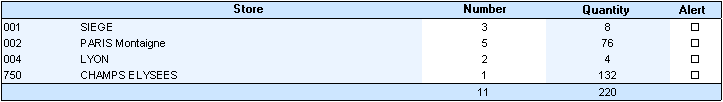

CEG-TRANSFERTS

Number of transfers to be validated by store

List of stores where non-validated transfers exist. The number of transfers to be validated and the total quantity of items are displayed for each store.

Alerts are possible for: Number (NOMBRE) and Quantity (QUANTITE)

Example of report format

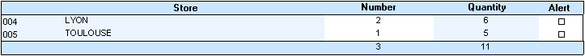

CEG-CDENONRECUES

List of orders without supplier acknowledgement

List of supplier orders where the status of the supplier acknowledgement is "Not received". List sorted by store, supplier, number.

Alerts are possible for: Number (NUMERO), Quantity (QUANTITY) and Amount (MONTANT)

CEG-ANNONCEAVALID

List of delivery notices to be validated by store (period)

List of delivery notices not yet validated, with the date, quantity, total amount and number of days since the creation of the notice.

Alerts are possible for: Number (NUMERO), Quantity (QUANTITE), Amount (MONTANT) and Number of days (NBJOURS)

CEG-CA BQT JOUR

Quantity, tax exclusive and tax inclusive turnover by store and by day (current month)

A list of stores with total quantities sold, and tax exclusive and tax inclusive turnover, displayed by day for the current month.

Alerts are possible for: Quantity (QUANTITE), Tax exclusive turnover (CA_HT) and Tax inclusive turnover (CA_TTC)

Example of report format

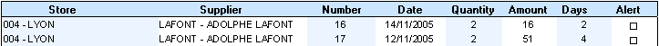

CEG-CA BTQ JOUR 2

Quantity, tax exclusive and tax inclusive turnover by store and by day (period)

A list of stores with total quantities sold, and tax exclusive and tax inclusive turnover, displayed by day for the period (modifiable).

Alerts are possible for: Quantity (QUANTITE), Tax exclusive turnover (CA_HT) and Tax inclusive turnover (CA_TTC)

Example of report format

###### Inventory Indicators

Inventory Indicators

CEG-STOCK MIN CUM

Discrepancies for minimum inventory totals

List of stores with the minimum inventory quantity, physical inventory quantity and the discrepancy between minimum and physical inventory for all types of items.

Alerts are possible for: Minimum inventory (STOCK_MINI), Inventory (STOCK) and Discrepancy (ECART)

Example of report format

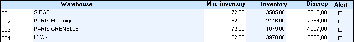

CEG-STOCK MIN DET

Discrepancies for minimum inventory with breakdown

List of items below the minimum inventory quantity with a breakdown by item dimension, minimum inventory, physical inventory and the discrepancy between minimum and physical inventory. List sorted by store and by item.

Alerts are possible for: Minimum inventory (MINI), Inventory (STOCK) and Discrepancy (ECART)

Example of report format

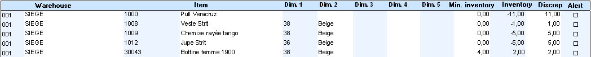

CEG-STOCK MIN ART

Number of items below minimum inventory

Total number of items below the minimum inventory quantity with minimum inventory, physical inventory and the discrepancy between minimum and physical inventory. List sorted by store.

Alerts are possible for: Number of items (NOMBRE_ARTICLES), Minimum inventory (STOCK_MINI), Inventory (STOCK) and Discrepancy (ECART)

Example of report format

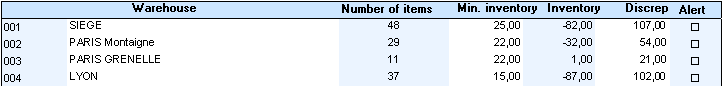

CEG-STOCK NEGATIF

Negative inventory

List of items whose physical inventory is negative with a breakdown by item dimension and inventory value. List sorted by warehouse and item.

Alerts are possible for: Inventory (STOCK)

Example of report format

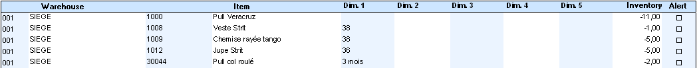

###### Register Indicators

Register Indicators

CEG-FO EVENTS

Sales receipt events (floating period)

Number of sales receipt events performed during the modifiable period, displayed by store and user. The events listed are those logged in the event log. This indicator is based on the event log and, as such, is dependent on the enabling of the log.

Alerts are possible for: Number (NOMBRE)

Example of report format

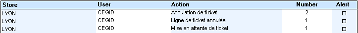

CEG-JOURSCAISSE

Number of register events (floating period)

Number of register events displayed by sales day during the specified period (modifiable). List sorted by store and opening date.

Alerts are possible for: Aborted receipts (NBTICABANDON), Canceled receipts (NBTICANNUL), Carts on hold (NBTICMISATT), Carts on hold recovered (NBTICATTREPRI), Carts on hold deleted (NBTICATTSUP), Canceled lines (NBLIGANNUL), Payment method modification (NBMODIFMDP), Drawer openings (NBOUVTIROIR), Receipts assigned to customers (NBRATCLI) and Modification of sales receipts (NBMODIFVENTIC)

Example of report format

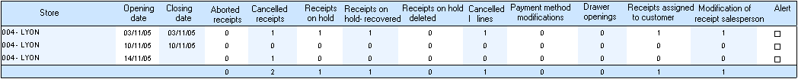

CEG-FO OUV CAISSE

Number of register openings per day (floating period)

Number of register openings per day, by store and by register during the modifiable period.

Alerts are possible for: Number (NOMBRE)

Example of report format

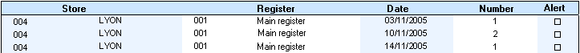

CEG-FONONFERMEE

List of non-closed days

List of non-closed days (opening date), by store and by register.

Example of report format

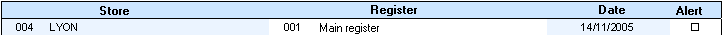

CEG-ECARTSCAISSE

Register discrepancies (floating period)

List of register discrepancies for the period (modifiable). List sorted by date, store and register.

Alerts are possible for: Amount (MONTANT)

Example of report format

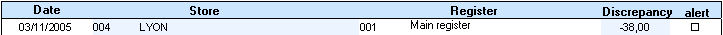

CEG-ECARTFDCAISSE

Cash float discrepancy (floating period)

List of discrepancies between the cash float entered when opening the register and the cash float entered when closing the register at the end of the previous day. List sorted by store and register, with the date, salesperson, opening and closing cash floats and the discrepancy between the two.

Alerts are possible for: Closing cash float (FONDFERME), Opening cash float (FONDOUV) and Discrepancy (ECART)

Example of report format

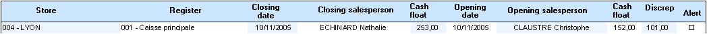

CEG-ECARTCAISSE

Register discrepancies in count

Used to edit register discrepancies for the current day.

Example of report format

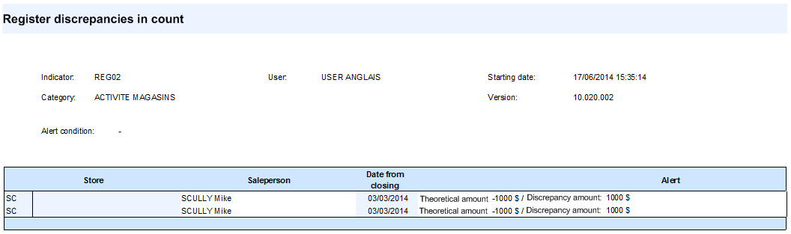

CEG-SERIAFO

Non-serialized registers

The 10-day serialization option enables a register that has not been serialized on day D to retain serialized settings for D+10 days. In this case, a trace is added to the event log. The alert also enables you to print these traces.

Example of report format

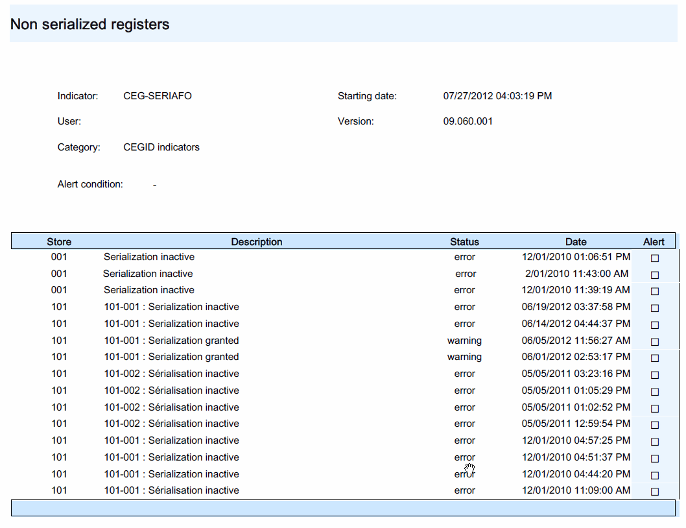

###### Label and Receipt Indicators

Label and Receipt Indicators

CEG-REIMPRETIQ

Reprinting labels

List of reprinted labels with active monitoring.

Alerts are possible for: Number (NUMERO)

Example of report format

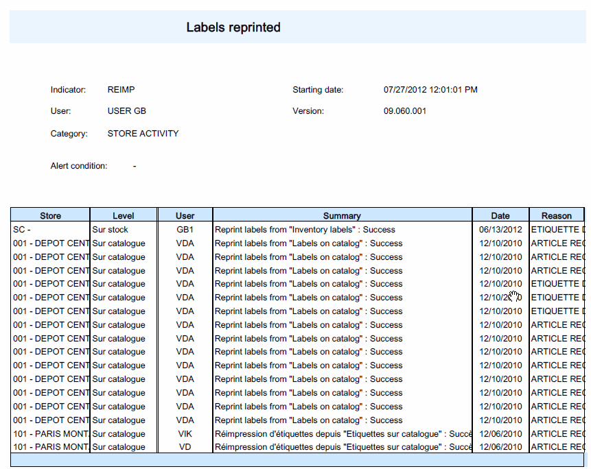

CEG-FO PREST NEG

Services with negative receipt quantities (floating period)

Number, quantity and total amount of services with negative quantities in receipts corresponding to the specified period (modifiable).

Alerts are possible for: Number (NOMBRE), Quantity (QUANTITE) and Total (TOTAL)

Example of report format

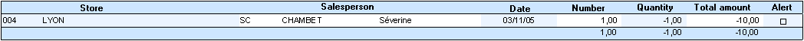

CEG-ARTICLESTEMPO

List of receipt lines for temporary items

List of receipt lines corresponding to a temporary item which must be adjusted using a new item.

Alerts are possible for: Number (NUMERO), Line number (NUMLIGNE), Index (INDICEG), Quantity (QTEFACT) and Amount (TOTALTTC)

Example of report format

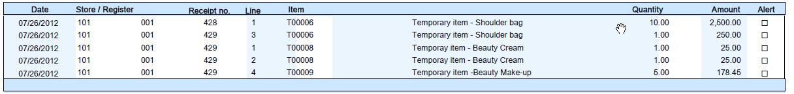

CEG-FO-FERME

Carts on hold destroyed (floating period)

This alert can be used to trace possible cases of register fraud where carts are put on hold for fraudulent purposes by unscrupulous salespeople. It lists carts on hold destroyed by the store with a summary for each receipt.

Example of report format

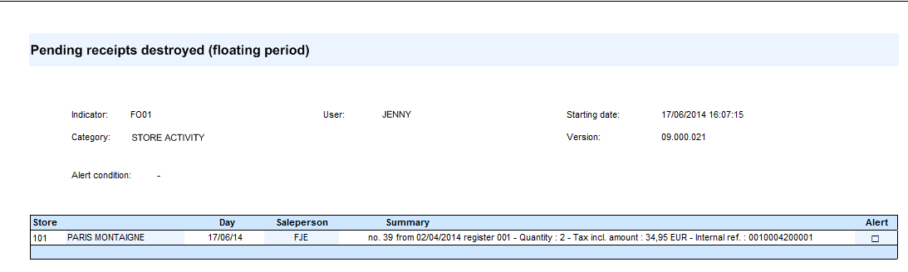

CEG-REMISE TICKET

Line or invoice total discount percentage by item (floating period)

List of items where a line or invoice total discount was applied to a modifiable period. The data provided includes the store, date, receipt number, receipt line number, item name, customer name, sales amount, value of the line and invoice total discounts, and the reason for the discount.

Alerts are possible for: Receipt (TICKET), Line number (NUM_LIGNE], Amount (MONTANT], Line discount (REMISE_LIGNE) and Invoice total discount (REMISE_PIED)

Example of report format

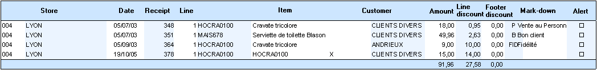

###### LPP/WAPP Indicators

LPP/WAPP Indicators

CEG-DPAPMAPNULS1

Null LPP and WAPP values in sales lines (period)

List of items with a null LPP or WAPP value in sales lines for the specified period (modifiable). The date of the sale, receipt number and receipt line number are also displayed.

Alerts are possible for: Receipt (TICKET), Line number (NUM_LIGNE), Last purchase price (DPA) and Weighted average purchase price (PMAP)

Example of report format

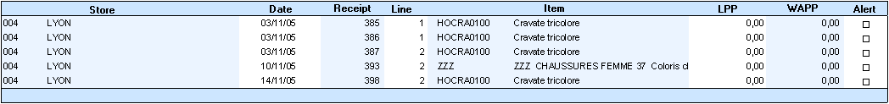

CEG-DPAPMAPNULS2

Null LPP and WAPP values in inventory records (non-closed, physical <>0)

List of items with a null LPP or WAPP value in non-closed inventory records, with a physical inventory of 0.

Alerts are possible for: Last purchase price (DPA) and Weighted average purchase price (PMAP)

Example of report format

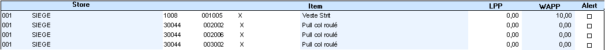

CEG-VENTEPERTE

List of items sold at a loss at WAPP (period)

List of items whose tax exclusive unit price is less than the WAPP. These items are considered to be sold at a loss. List sorted by date, store, receipt, line number and item.

Alerts are possible for: Number (NUMERO), Line number (NUMLIGNE), Tax exclusive unit price (PUHT) and Weighted average purchase price (PMAP)

Example of report format

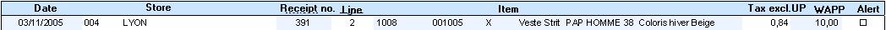

CEGECARTSDPAPMAP

List of LPP/WAPP differences between sale lines and inventory (period)

List of LPP/WAPP differences between sale lines for the period (modifiable) and inventory when the indicator was run. List sorted by store, item, and receipt, with the receipt LPP, inventory LPP, and the difference between the two LPP values (as a percentage), the receipt WAPP, inventory WAPP, and the difference between the two WAPP values (as a percentage).

Alerts are possible for: Number (NUM), Receipt LPP (DPAFFO), Inventory LPP (DPADISPO), LPP Discrepancy (ECARTDPA), Receipt WAPP (PMAPFFO), Inventory WAPP (PMAPDISPO), WAPP Difference (ECARTPMAP)

Example of report format

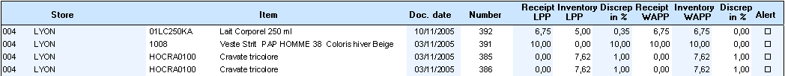

CEG-VENTEPERTEDPA

List of items sold at a loss at LPP (period)

List of sold items whose tax exclusive unit price is less than the WAPP. These items are considered to be sold at a loss. List sorted by date, store, receipt, line number and item.

Alerts are possible for: Number (NUMERO), Line number (NUMLIGNE), Tax exclusive unit price (PUHT) and Last purchase price (DPA)

Example of report format

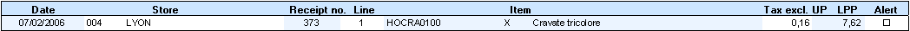

###### Miscellaneous List Indicators

Miscellaneous List Indicators

CEG-RECEPTIONS

List of goods received (floating period)

List of goods received for the period (modifiable) with a breakdown by supplier, number, date and item, as well as by quantity and amount.

Alerts are possible for: Number (NUMERO), Quantity (QUANTITE) and Amount (MONTANT)

Example of report format

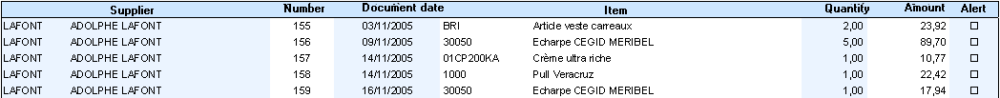

CEG-LISTRANSFERTS

List of transfers (floating period)

List of transfers received for the period (modifiable) with a breakdown by supplier, number, date and item, as well as by quantity and amount.

Alerts are possible for: Number (NUMERO), Quantity (QUANTITE) and Amount (MONTANT)

Example of report format

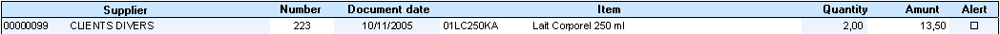

CEG-RESERVATIONS

List of available reservations

List of reservations whose expiry date has been reached. List sorted by expiry date, store and number.

Alerts are possible for: Number (NUMERO), Quantity (QUANTITE) and Amount (TOTALTTCDEV)

Example of report format

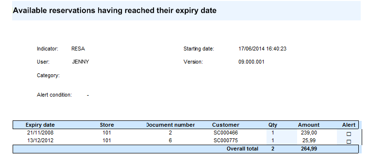

CEG-TARIFS CALCUL

List of calculated price lists

List of calculated price lists. List sorted by warehouse and item.

Alerts are possible for: Original price list (TARIFORIGINE), Original price (PRIXORIGINE), Current price (PRIXENCOURS) and Calculated price (PRIXCALCULE)

Example of report format

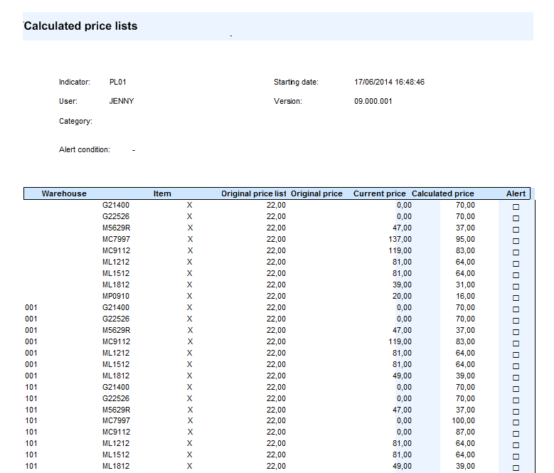

CEG-PIECES LITIGES

List of documents in litigation

List of documents whose litigation status is "In litigation". List sorted by document type, store, supplier and number.

Alerts are possible for: Number (NUMERO), Quantity (QUANTITY) and Amount (MONTANT)

CEG-DOTDEPASSE

List of customers whose threshold is exceeded (amount or quantity)

Customers whose total amount or quantity has reached or exceeded the defined threshold.

Alerts are possible for: Amount used (MONTANTUTIL)

Example of report format

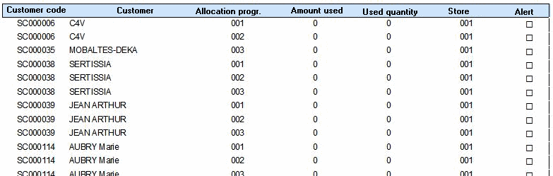

CEG-DOTATIONTIERS

List of special conditions whose salesperson was deleted

Active special conditions whose salesperson was deleted.

Alerts are possible for: none

Example of report format

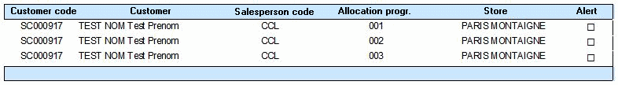

###### Clothing Indicators

Clothing Indicators

List of clothing indicators
- CEG-VESTARENDRE: List of clothing to be returned. Clothing that has not been returned up to the current date.
- CEG-VESTEDEPASSE: List of non-returned clothing. Clothing that has not been returned and whose return date has expired.
- CEG-VESTEDEPAS10: List of clothing to be returned within 10 days. Clothing that has not been returned and whose return period is within 10 days.
- CEG-DOTATIONVEST: List of clothing whose salesperson was deleted. Clothing that has not been returned and whose salesperson was deleted.

Alerts are possible for

Clothing number (VESTIAIRE)

Example of report format

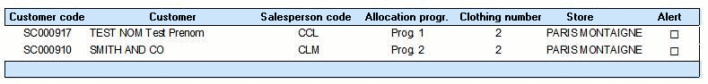

###### Transfer Request Indicators

Transfer Request Indicators

List of transfer requests indicators
- CEG-DTRENATTENTE: List of issued transfer requests awaiting validation. List of issued transfer requests awaiting validation.
- CEG-DTRAVALIDER: List of transfer requests to be validated. List of transfer requests to be validated.
- CEG-DTRENRETARD: List of transfer requests whose request date has expired. List of transfer requests whose request date has expired.

Alerts are possible for

Number (NUMERO) and Total quantity (TOTALQTE)

Example of report format

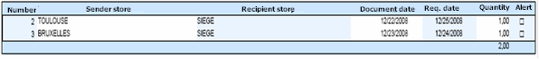

###### Accounting and Tax Indicators

Accounting and Tax Indicators

CEG-ALTJOURSCOMPT

Documents not sent to accounting (max. period 365 days)

List of documents that were not sent to accounting (maximum period of 365 days).

Alerts are possible for: Number (NUMERO), Indicator (INDICEG)

Example of report format

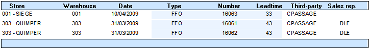

CEG-CPTAETABEXCLU

Stores excluded from accounting transfer

List of stores automatically excluded from the accounting transfer. This is the case when customer management is disabled (Company settings - Commercial management/Account posting, setting “Monitoring accounts receivable for the Back Office and the Front Office) and the collected payments account is not specified for the store.

Example of report format

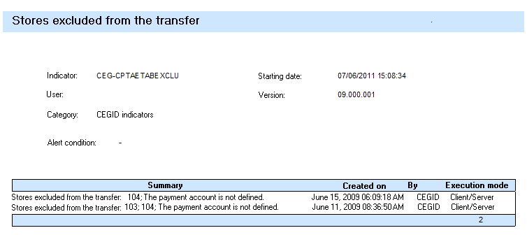

CEG-CHRONODEPASS

Fiscal numbers exceeded for stores

List of fiscal numbers whose remaining number exceeds the alert threshold defined in the store location settings.

Alerts are possible for: Number of counters (NBCHRONOS), Last counter (LASCHRONO)

Example of report format

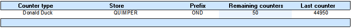

###### Schedule and Staff Indicators

Schedule and Staff Indicators

CEG-PLANNINGPREV

Forecast schedule not specified for W+2

List of stores that have not entered their W+2 schedule.

Alerts are possible for: Number of ranges (NB_PLAGES)

Example of report format

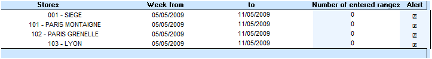

CEG-PLANNINGREA

D-1 schedule not specified

List of stores that have not entered the schedule for the previous day.

Alerts are possible for: Number of ranges (NB_PLAGES)

Example of report format

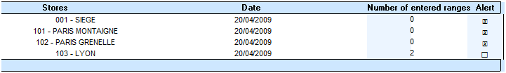

CEG-HEURESRECUP

Time to make up

The two time ranges below can be used to manage time to be made up in the schedule:
- HSR: Time to make up
- HRE: Time made up

This alert enables you to differentiate between the time to make up and the time already made up, so that you can calculate the number of hours remaining to be made up. The time range code is configurable. If you want to use other codes, you must modify it in the alert settings.

Alerts are possible for: Time to make up (ARECUP), Time already made up (RECUP) and Time remaining to be made up (RESTE)

Example of report format

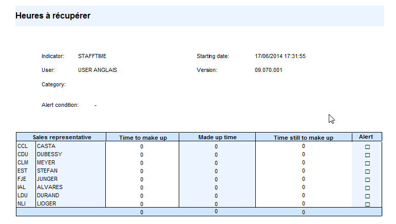

CEG-RETARDCOLLAB

Late staff members

List of employees who are late for work. You can define the number of minutes late to be taken into account.

Alerts are possible for: Number of minutes (NBMINUTES)

Example of report format

CEG-RETARDCOLLABO

Late staff members

Same as the previous alert but for Oracle databases.

CEG-POINTAGEFORCE

List of forced clock outs by employee

List of employees for whom clock-out was forced.

Example of report format

CEG-JUSTIFECART

Justification of variances

List of reasons for store staff variances.

Example of report format

###### Import Indicators

Import Indicators

CEG-IMPORTSOK

List of data import files processed in last 7 days (floating period)

List of data import files processed without errors within the last 7 days.

Alerts are possible for: Total (TOTAL)

Example of report format

CEG-IMPORTSERR

List of data import files processed with errors in last 7 days (floating period)

List of data import files with rejected data within the last 7 days.

Alerts are possible for: Total (TOTAL), Processed (TRAITE) and Error (ERREUR).

Example of report format

CEG-IMPORTS

Data import results

List of imported files, including details of processed files and files with errors.

Alerts are possible for: Total (TOTAL), Processed (TRAITE) and Error (ERREUR).

Example of report format

###### Miscellaneous Indicators

Miscellaneous Indicators

CEG-CLECRYPTAGE

List of encryption keys that are too old

List of encryption keys that have been in use for more than a year (365 days). After one year, new encryption keys must be defined.

Alerts are possible for: Number of keys (NBCLE)

Example of report format

CEG-PRETS

Loans with expired return dates

Used to list loans whose return date has expired.

Alerts are possible for: Number (NUMERO), Quantity (QUANTITE) and Amount (TOTALTTCDEV)

Example of report format

CEG-CDENONLIVREES

Orders with expired delivery dates

List of items, with quantities, included in a purchase order whose delivery date has expired. List sorted by supplier, order number and item.

Alerts are possible for: Number (NUMERO) and Remaining quantity (QUANTITE_RESTANTE)

Example of report format

CEG-APPEL DU JOUR

Alert for call management

Used to list the calls of the current day (preferred date = current date) or all late calls (preferred date exceeded).

Example of report format

#### Interactive Alerts

##### Interactive Alerts

Interactive Alerts

The purpose of an interactive alert is to trigger a message whenever a certain event occurs.

Creating alerts

Back Office > Administration > Alert management> Interactive alerts/Alert management

This command is used to create or modify alerts. Each alert is displayed in the form of a screen where you can specify a number of options via the tabs proposed.

To create an alert, click the [New] button and populate the fields as described hereafter.

Characteristics tab

| Fields | Description |
| --- | --- |
| Alert on | This field allows you to specify the type of element on which the alert will be based, such items, documents, customers/suppliers, contacts, etc. In the screenshot above, the alert is triggered by documents. (Alert on: documents.) |
| Management of events | This pane allows you to specify when the alert will be triggered: when opening a record, using a payment method, or for a birthday, etc. In the screenshot above, the alert will be triggered for each document line, according to a given customer. |
| Stores and users | Alerts can be limited to certain users and/or stores. In the screenshot above, the alert will be triggered on stores of type Corner or Franchisee (CORN, FRAN) and for users belonging to the Sales representatives group (VEN). |
| Display memo | The Alert notification section allows you to select how the message entered in the Memo tab will be notified. If this option is ticked the alert will be displayed in the form of a message. |
| Send an e-mail | The Alert notification section allows you to select how the message entered in the Memo tab will be notified. If this option is ticked, the alert will be emailed. Check this option and click the associated button. Enter the e-mail address in the appropriate field, then click on the [Add address] button. |
| Generation of an action | If the management of events concerns a third party, it is also possible to generate an action. Example: If an alert displays when a document is entered, the opening of the customer record can be automated, thus avoiding additional handling by the user. The application proposes two actions: open the customer record and/or define the address as DNLSA (does no longer live at specified address.) |
| Type of validation | When the alert is displayed, the user must confirm the reading. Two options are proposed: OK: the user has just to validate the message to continue the entry. I read + OK: the user must check option "I read" and validate to continue. |

Conditions tab

This tab is used to restrict the scope of the alert on criteria relating to documents, third-parties and items. These criteria will display according to the options selected in the Characteristics tab.

Example of an alert impacted by the following two selections (document and third party):

|  | Document type: In the example hereafter the alert is triggered for sales receipts (FFO.) Unpaid check: In this example, the alert is triggered for customers with option Unpaid check ” ticked. This option corresponds to the user-defined third party decision, available in the Information tab of the customer records (see screenshot hereafter.) |
| --- | --- |

Memo tab

This tab is used to enter a message to be displayed whenever the alert is triggered. (Example: Refuse payment by check if there are outstanding payments.)

Notification by memo and/or e-mail

Whatever the mode of notification, the message sent will be the one entered in the Memo tab.

Notification by memo

If all conditions of the alert are met, the alert displays in the form of a message. (Example: When a document is entered with an identified third party, the message will be displayed on the document being currently entered.)

Notification by e-mail

As soon as the elements that generate the alert are entered, the e-mail is sent to the address defined in the Characteristics tab (see option Send an e-mail .)

## Y2 Environment

### Document Types

#### Contents

=> See also procedure 283 (Configuring Documents)

Document Types - Contents

The settings for the document types are based on a list of all document types used in the Back-Office and in the Front-Office (purchase order, receipts of goods, sales receipts, customer credit note, transfer, special input, etc.)

For each document type, the following actions can be performed:
- Specify the behavior of the document (for example, is this a purchase document or a sales document?)
- Define options (for example, does the document trigger the update of the weighted average purchase price?)
- Enable features (for example, does the document support serial numbers?)
- Define the layout (which template will be used to print the document?)
- Define exceptions per store.

CEGID provides a standard setup for these document types. This setup is accessible. But we strongly discourage any modification. The management of the access rights limits the access to this menu to advanced users only. If you want to make changes to the management of your documents, please contact Cegid's helpdesk or your dedicated consultant.

Any change in the settings of the document types will be logged to the event log.

The present documentation gives you an overview of the various possible configurations. However, only our consultant will ensure a consistent setup and guarantee reliability and data integrity.

Various tabs allow the configuration of the document types. The availability of all the fields described in this document is subject to the document type concerned.

Configuring document types
- General tab
- Management tab
- Third-party tab
- Item tab
- Inventory tab
- Valuation tab
- Preferences tab
- Employee tab
- Accounting tab
- Accounting customization tab
- Layout tab
- Line info tab
- Context tab
- Miscellaneous tab
- Packing tab
- User-defined tables tab

Configuring additional elements
- Additional information per store
- Grouping
- Exceptions per site

#### Configuring Document Types

##### Document Type - General Tab

Document Type - General Tab

Back Office and Front Office > Settings > Documents > Documents > Types

| Fields | Description |
| --- | --- |
| Code/Title | Heading of the document as it will appear in documents and reports. When the description of a document is included in a menu line, it will not be modified. |
| Next | This setting specifies the document types authorized for document generation (except for document types whose flow type is Transfer .) This field is mandatory and each document type contains at least its own value. Example: Documents for the delivery notice (ALF) are ALF and BLF (supplier receipt) while those for the customer delivery are BLF and FAC (customer invoice). Attention! The document flow type must be identical from one document to another. If the document increments or decrements the physical inventory, the next documents must also increment or decrement the physical inventory. |
| Flow type | The selection list defines with which flow the document type will be integrated. For example, a customer invoice is part of the sales flow. This field can be modified only in the "Customer Service" view. The main consequences are as follows: Customer risk calculation (VEN) Selection of the third-party type (VEN=customer, ACH=supplier) Selection of the price list (VEN or ACH) Inventory movement type (VEN->inventory output) Shortages Tax rate (ACH or VEN) Trade settlement (VEN) Accounting interface - selection of accounts Selection of the quantity qualifier Management of consigned items Reasons for returns Transformation of documents (in the same flow only) Modification of the purchase price during document data entry Minimum margin test Packaging Third-party referencing |
| Input list | The input list represents all data entry columns in a document such as the item reference, item description, price, warehouse and delivery date. This field is mandatory and defines the list used for this document type. Input lists are configured in Settings > Documents > Documents > Input lists. |
| Start and end texts | This field is not supported at present. |
| Credit note document | This field is not modifiable. It indicates that the document is a credit note, e.g. a credit on stock. If enabled, this setting reverses the line quantities, and consequently, the amounts and totals in lines and documents. |

Litigation management

The "Litigation management" module is subject to serialization and is enabled in Company settings > Commercial management - Documents - Litigation management. (See Litigation Management .)

Litigation Management

| Fields | Description |
| --- | --- |
| Litigation management | By default, no document manages litigations. Consequently, this setting must be ticked for each document type handling litigations. Litigation management is used to indicate variances in documents (e.g. a price difference or unplanned item between a delivery notice and a receipt) in order to monitor and manage these disputes. If this setting is also enabled for the next document, during document generation, these disputes will be carried over from the original document to the next document. This functionality is supported when documents are used. If you enable this setting, you must select the additional options described below. |
| Supported litigation reasons | Used to list litigation reasons for each document type. These reasons for supported litigations will be available at document creation. Some reasons resulting from a specific processing or user action cannot be disabled. These are as follows: "Line litigation", "Forced litigation" and "Awaiting reconciliation". The list of reasons is limited based on the settings defined for the document type. During manual document data entry, litigation reasons are assigned manually by users. When data is retrieved, litigation reasons are assigned automatically and the settings defined for the document type are also taken into account. |
| Automatic creation | When receiving goods, if the physical quantity received is different from the quantity announced, litigation management enables the manual entry of litigations. The "Automatic creation" setting creates litigations automatically in order to simplify the task of receiving goods. During document generation, for example, a supplier receipt generated from a delivery notice, if the automatic creation is: Disabled: Litigations must be created manually by users. Enabled: The menu used to create litigations is disabled and the litigations are generated when the document is validated. The following litigation reasons are supported by the automatic creation: "Shipping and handling fees", "Non-planned item", "Lower quantity", "Higher quantity", "Lower net unit price", "Higher net unit price". Note that the invoice reconciliation feature will systematically create litigations. As such, you are not required to enable the automatic creation of litigations in the settings of the documents to generate them. |
| Litigations on lower quantity if remainder management | If remainder management is enabled for a document type, this setting enables you to consider a lower or null quantity as litigation. Example: If only 6 items are delivered against 10 ordered, this setting allows you to consider the 4 items as litigation for a lower quantity and not as a remaining quantity to deliver. Attention! This option must be selected only if remainder management is enabled for the document type AND if "Lower quantity" is selected in the list of the supported litigation reasons. |

Visa

| Fields | Description |
| --- | --- |
| Visa | Used to identify documents requiring approval before they can be converted to the next document type in the flow. When a document requires approval, the manager must validate or modify the document so that it can be converted. Lastly, when a quotation is generated for a special order, a company setting enables you to ignore the approval. Visas can be defined for each supplier in the Exception on document management option available in the supplier record. |
| Below/Over | A visa can be subject to some amount conditions. If the amounts specified in these fields are equal to zero, no restriction will be applied. |
| Visa by store if pre-allotment | This field can be accessed only for the "DEF" document type (purchase order proposal) if the "Visa" option is selected. For purchase order proposals with pre-allotment, if this setting is enabled, visas can be checked store by store. If a store is not within the limits, the purchase order proposal (DEF) must be approved. |

##### Document Type - Management Tab

Document Type - Management Tab

Back Office and Front Office > Settings > Documents > Documents > Types

| Fields | Description |
| --- | --- |
| Counter | Used to select a counter for the numbering of documents. This field is used only if counters by store are not used. This counter loads the "Stub" field in documents (e.g. GFO for sales receipts) and determines the number of the next document. We recommend the creation of a counter for each document type. Counters are created in Settings > Documents > Counters. Note on received transfers (TRE): The Remainder management for transfers company setting available in Commercial management > Inventory enables you to manage remainders for transfers. When you implement this option, a new document counter will be created and used for "TRE" documents. Received transfers will have a number that is different from sent transfers and transfer notices. |
| Counter per store | With the counter by store (CWAS store), the document stub is loaded using the store code by default. As such, the counter used is the counter by store. We recommend the creation of a counter for each document type. However, you can use the same counter for several document types. |
| Duplication types | This setting specifies the documents that can be created from this type through duplication. |
| Closure action | Used to define the action (recording, approval, printing, etc.) that changes the status of the document from active to non-active ("GP_VIVANT" field). Reminder: An active document is a document whose processing is being run. It can be modified and converted. Example: An order is closed as soon as it is converted to a delivery notice. If there is a partial delivery, the initial order is closed, but the remainder of the order is still active. |
| Non-modifiable document after / Non-duplicable document after | These settings list the actions that can make a document non-modifiable (GP_NONMODIFIABLE field), and/or non-duplicable (GP_NONDUPLICABLE field). There is no impact on the GP_VIVANT field. |
| Installment opening window | Used to specify how installments are managed when the document is validated: Open automatically: The data entry screen for installments systematically opens when the document is validated. Open on request: The data entry screen for installments opens when users click the [Installments] button during document data entry. No installments: The [Installments] button does not appear in the toolbar. |
| Document subject to tax | Used to specify whether the document is subject to tax (VAT). If the document is not subject to tax: Tax exclusive = Tax inclusive |
| Deposit management | If this setting is enabled, you can click the [Deposit/Payment] button during document data entry to enter full or partial deposit payment. The amount entered is carried over to the next generated document. |
| Managing transfer of remainders to the original document | In the case of linked documents, the partial validation of a generated document will enable you to transfer the remainder to the previous document. Example: Purchase order, delivery notice and supplier delivery. During supplier delivery, which is performed after a delivery notice, users can choose to carry the remainder over to the purchase order. This option is integrated within all channels (purchases, retail sales, wholesale), and is available only for the following document types: purchase order (CF), transfer request (DTR), transfer preparation (BTR), and customer order (CC). |
| Prepopulate the recipient store | When a transfer request (DTR) is entered, the recipient store is always specified with the default store of the user. Sender stores and warehouses are not specified. |

##### Document Type - Third-Party Tab

Document Type - Third-Party Tab

Back Office and Front Office > Settings > Documents > Documents > Types

| Fields | Description |
| --- | --- |
| Authorized types of third-parties | Used to define the third-party types that can be used in the document (customers for sales documents, suppliers for purchase documents). Do not specify this field for stock or inventory documents. The third-parties used for stock and inventory documents must be defined in webapp Company settings > Commercial management > Default Settings. |
| Single supplier purchase document | For purchase documents only. Used to specify whether you can have several suppliers in the same document. This option has no impact on sales or stock documents. If the One supplier per item company setting is not selected in the webapp Company Setting > Commercial management > Items, this field can no longer be configured in the document type. You can then enter items from different suppliers in a given purchase document. |
| Update of third-party upon validation | This checkbox option is used to update the Last document date, Last document number and Tax excl. total - last document columns (available in the customer multi-criteria.) If this option is ticked for a document type, these three fields will be updated when a document of that type is created. Please note the following restrictions: This update is not reflected in the Last document section (available on the outstanding balance window of the customer record.) Feature not available in document import , even if the option is ticked. |
| Recover third-party notepad | Used to retrieve and use information entered in the notepad of the customer record in documents. |
| Transforming prospect into customer | This option, visible only if prospects (PRO) are selected in the Authorized types of third-parties field, is used to convert a prospect into a customer when validating a document related to this prospect (e.g. the conversion of a prospect into a customer when entering a sale.) Note that this feature enabled in Front Office, Back Office, Document import and Standalone mode, for sales documents only. |
| Consider in outstanding | Used to take the document into account when calculating the customer's outstanding balance. The outstanding balance is available in the customer record via the [Zoom menu] button. |
| Consider customer risk | This checkbox option is used to define whether the sales document should take into account the settings defined for customer risk management. This enables you to prohibit document data entry with late-paying customers (red customer risk) or to alert users (orange customer risk). => See also procedure 408 (How to Block a Customer at Cashing) |
| Address management | This setting enables you to store the third-party delivery addresses (PIECEADRESSE table). If the setting is not selected, the address defined in the third-party record is not retrieved in the document header. To comply with legal requirements (France Law V2 module), address management must be enabled for receipts issued from a French cash register. If the store is associated with the France international adaptation, this parameter is checked and grayed out. It can not be modified. Addresses are then saved in the PIECEADRESSE table for all identified customers, whether the sale is for delivery or not. If the store is not associated with the France international adaptation, the parameter can be modified. For a sale to deliver, tick this setting to show the address of the third-party on the sales receipt (FFO type), and check register setting Save address if sale to deliver . |
| Delivery/taxation address | This setting is used to manage customers who make purchases, for example, in Britain and place orders in the US. British VAT will be applied to the sales receipt. However, for the order, another tax system will be applied such as the one used at the customer's main residence location. This option is also available in the "Per store addition" option. This section will appear depending on the document type. Present in TRADE documents (CC/FAC, etc.) |
| Supplier trigger | Enables the use of a supplier for a document type only if the supplier belongs to a trigger previously defined in Back Office > Settings > General > Supplier trigger. |

##### Document Type - Item Tab

Document Type - Item Tab

Back Office and Front Office > Settings > Documents > Documents > Types

| Fields | Description |
| --- | --- |
| Authorized item types | This list indicates the different types of items that can be entered in a document. For example, you can authorize the entry of service items in a purchase document. The possible item types are financial, merchandise, bill of materials and service. |
| Use of mask-types | The aim of mask-types is to help users enter quantities in dimensions using pre-referenced allocation profiles. This functionality should be enabled in Company settings > Commercial management > Items. For each document type, you can define how quantities are allocated. None: The mask-type functionality is not enabled. Optional: The mask-type quantities are applied but can be modified. Mandatory: The quantities must match the mask-type quantities. |
| Recover item notepad | Used to retrieve information entered in the item record notepad in documents. |
| Accept closed items | Items can be defined in item records as closed. In this case, they can no longer be used in documents, except if this setting is enabled. |
| Item managed in stock | This option offers two outcomes: Selected: During document data entry, you can use only the items that are declared as managed in stock in their respective item records. Not selected: You can use all items. |
| Management of linked items | This option is used to enable or disable the management of linked items for each document type. The management of linked items enables you to propose an item linked to the current item entered. Environmental tax is implemented using this functionality. This field and functionality will be available only if the Management of linked items company setting is selected in Commercial management > Items > Management of linked items. This option is enabled by default for sales documents. If the linked item is a service (e.g. embroidery on a garment), you must also authorize service items for the document. See the Authorized item types setting in this tab. |
| Use item characteristics "Multiples of" | This setting defines how the document type manages multiple quantities of items: None: This functionality is not used. Sale: For sales and transfer documents. Purchase: For purchase and transfer documents. This setting refers to the Purchased in multiples of and Sold in multiples of fields available in the Characteristics tab of the item record. |

Settings for item description

Select this option if you want to set up the description of the item in order to make it more explicit, or more compliant with your working environment. Next, select additional options:

| Fields | Description |
| --- | --- |
| Content of the item description | Select one or more items of information that will load the item description. When duplicating or transforming a document, the description used is the one from the original document. It is not based on the settings of the new document. In imports, the description contained in the file is retrieved first, if it is present in the setup and if it is not null. |
| Title of dimension type | Specify the heading to display for the dimensions: "Description", "Short description" or "None". |
| Dimension description | In the case of dimensioned items, this option is used to display the description of the dimension in the document type. |

In order to adapt operations to each country, you can define an exception per store through the [Additions/Per store addition] button in the Preferences tab.

##### Document Type - Inventory Tab

Document Type - Inventory Tab

Back Office and Front Office > Settings > Documents > Documents > Types

| Fields | Description |
| --- | --- |
| Inventory to increment or decrement | These fields specify the inventory flows made by a document. They enable you to view the impact of using a document type in inventory. |
| Inventory shortage calculation | Enables the calculation of shortage against the available inventory and physical inventory. If this option is enabled, a warning message is displayed when you enter an out-of-stock item. |
| Deletion of the line if shortage | Used to delete the line if the deliverable quantity is null. |
| Override shortage | Users can choose whether they want to ignore the shortage during document data entry. If this option is not selected, the quantity entered is forced to comply with the available quantity. |
| Priority depletion | This option is available only for sales documents. It is used to determine the order in which the warehouses of a store will be depleted, depending on inventory and document type. Note that this option is available only if the value of the Inventory shortage calculation field is Physical or Available . (See Priority depletion .) |
| Inventory movement qualifier | The qualifier is used to qualify inventory movements in order to analyze the query of these movements. The qualifier table is frozen. |
| Remainder management (for previous documents) | This setting enables the management of remainders. If this setting is enabled when the document is generated, the quantities that are not transformed are specified in the previous document. For example, during a partial receipt of goods, if remainder management is enabled for the receipt, the quantities that remain to be delivered will be specified in the delivery notice. |
| Generating only one subsequent document | This setting concerns delivery notices (ALF) only. It authorizes the generation of only one document to follow. In the case of remainders, the delivery notice is not transformed a second time. The subsequently generated document is modified in this case. For example, a delivery notice has 10 items. First, only 7 items are received, so a first receipt of goods is created. In a second time, the 3 missing items are delivered: If the setting is enabled, the delivery of the missing items will not generate a second receipt. The existing receipt will be updated. If the setting is disabled, a second receipt will be created. |
| Deletes lines set to zero when validating a transformed document | This setting is used to generate documents only with lines different from zero. This option is useful because it saves space in the database because the entire original document will not be stored. It also saves time because the created document is smaller and easier to recalculate and save. However, when editing the document, the reference cannot be changed because the new reference will not be linked to the original document. Note: For an item with dimensions, all dimensions are kept to enable the correction of these dimensions, if required. |
| Movement direction | Used to define the direction of the document type as regards inventory (inventory input, inventory output, or both). |
| Batch management | (Refer to Batch Management ) This option allows you to define the behavior for entering batch references. Proposal: a message proposes the entry of the composition. On request: the batch entry feature opens the means of the appropriate button available on the document entry screen. Mandatory: the batch entry feature opens when validating the line. No: no batch management in this document. For document types that have an impact on physical inventory, the batch management option will be set to “Mandatory”, and cannot be changed. Note that selecting the batch entry mode, in the document type, results in different input behaviors. Document types linked to the Manufacturing module will not be supported in batches if they impact physical inventory. BSA: Subcontracted purchase receipt CSA: Purchase subcontracting WAP: Expected manufactured quantities WBP: Manufacturing requirements WCC: Component consumption WRC: Consumption break WRP: Production receipt The document batch management is initialized to No, and cannot be accessed. |
| Serial numbers | This setting is used to enable the management of serial numbers in documents (see Serial Numbers .) Not managed: Serial numbers are not accepted for this document type. No serial number will be entered. Blind entry: Serial numbers must be entered manually without the display of available serial numbers for the selected item. This option is available in purchase documents and sales documents. Enter with automatic allocation: Serial numbers can be entered manually or using automatic allocation options in the following format Prefix + Chronological order + Suffix . This option is available only for documents with inventory input, i.e. document types with Movement direction = Inventory input (in the Inventory tab.) Note that by default, when updating the database, the option is set to this value for the following document types: Supplier credit note on inventory, Supplier return, Supplier receipt, Special inputs, Supplier invoice, Received Transfer. Selection from a list: Serial numbers can be entered manually or by selecting existing serial numbers in the database. This option is available only for documents that do not handle inventory input, i.e. document types with Movement direction = Inventory output (in the Inventory tab.) |
| Referencing serial numbers | This option is available only if the company setting Referencing serial numbers , available in Commercial management > Items, is enabled (refer to Referencing Items with Serial Numbers .) The following options are proposed for document types with movement direction set to Inventory input . None: The serial number is entered into stock. The serial numbers table is not loaded by document data entry. The referencing table can remain empty or be loaded by a data import or manual data entry. Automatic referencing: For each item that supports serial numbers entered into stock, the serial numbers are created in the referencing table. Referencing on request: For each item that supports serial numbers entered into stock, a referencing window will be opened for each serial number so that users can specify user-defined attributes. This option is also available in the "Addition per store" option., if the store handles serial numbers, and according to item exceptions. |
| Management of cancellation reasons | This setting is available in Procurement & Sourcing environments. It is used to manage the reasons why a purchase order (CF) is canceled. It offers the following advantages as you can: Add a cancellation reason that can be used later for statistical analyses. Close document lines without having to open the document. Optimize the document closing process to speed up processing times. These cancellation reasons must first be created in Back Office > Settings > Documents > Movement reasons (select Document closure.) The cancellation reason can be disabled, optional or mandatory. You can also specify it in the "Addition per store" option. Select value Default if you want to use the value selected in the document type. |
| Management of movement reasons | Used to enable the use of movement reasons. These reasons are created in Settings > Documents > Movement reasons (see Define Movement Reasons .) |
| Authorize entry of warehouses not managed on site | For sales receipts only (FFO). It proposes warehouses that are not managed on site and that are linked to the store. In Front Office, a warehouse that is not managed on site will automatically be assigned to the receipt once the Sale for delivery functionality is configured. In Back Office, warehouses not managed on site will also be available. Please note! This setting is visible only for a multiple warehouse folder. |

Document generation

| Fields | Description |
| --- | --- |
| Pre-allocation of quantities | If this setting is selected and the document is generated manually, quantities are retrieved from the previous document and entered in lines. |
| Pre-entry of the total allocated quantities | If this field is enabled and the document is generated manually, you can specify the total quantity of the document prior to data entry. The specified quantity and the total quantities entered will be reconciled. If there is a discrepancy, a blocking message will be displayed. |
| Interactive control while entering barcodes | When barcodes are entered during generation, if the item entered is not present in the previous document, a beep is heard and a message is displayed. For example, in a customer delivery, if an item is not on the customer order, a beep is heard and a message is displayed to warn the user that the item does not exist in the original order. |
| Blind entry of barcodes | This setting is used when generating a document manually. If the option is enabled, you must enter the barcode using the barcode entry screen and you cannot view information from the previous document. However, you can force this setup for certain user groups using the access right management feature. Therefore, you must enable the Override blind entry of barcodes for manual generation concept available in Back Office > Administration > Users and access > Access right management, > Concepts (26) > Commercial management > Document entry. |
| Recover serial numbers | This setting is used to specify from which document type the serial numbers will be retrieved when generating a document. If no document type is specified, serial numbers must be entered again for the generation. When documents are generated, you can specify and check the serial numbers in the barcode entry screen. There are two possibilities: Sales: Serial numbers are searched for among the serial numbers present in stock. Purchases: Serial numbers are searched for among the serial numbers present in the original document. |

##### Document Type - Valuation Tab

Document Type - Valuation Tab

Back Office and Front Office > Settings > Documents > Documents > Types

Document valuation

| Fields | Description |
| --- | --- |
| Invoicing type | Used to select the invoicing mode for the document type: Invoiced inclusive of tax: Amounts displayed are tax inclusive. Invoiced exclusive of tax: Amounts displayed are tax exclusive. Customer invoiced: The invoicing mode specified in the customer record is used. |
| Use price list when calling price | If this setting is selected, the price proposed will be from the applicable price list. If it is missing, then the price in the Proposed price field will be used. As a general rule, a search is run on prices based on the following priority: price list, inventory record, item record. |
| Proposed price | Used to propose different prices for item lines when completing a document. A search is run on prices based on priority: if the first price returned is null, retrieve the second price, if not, then the third and so on. For the last purchase price (LPP): Catalog LPP, inventory LPP, item LPP For the last cost price (LCP): Inventory LCP, item LCP For the weighted average purchase price (WAPP): Inventory WAPP, item WAPP For the weighted average cost price (WACP): Inventory WACP, item WACP For the standard purchase price: Item tax exclusive purchase price For the standard cost price: Item tax exclusive cost price For the catalog price: Catalog base price, catalog LPP, item LPP For the tax exclusive selling price: Item tax exclusive selling price (if the document is invoiced exclusive of tax), item tax inclusive selling price (if the document is invoiced inclusive of tax) User-def. amount 1: User-defined amount 1 for item User-def. amount 2: User-defined amount 2 for item User-def. amount 3: User-defined amount 3 for item If the price returned is null, and if you are not searching for a selling price (tax inclusive or exclusive): If you search for a LCP or WACP: Item tax exclusive cost price Or else: Item tax exclusive purchase price Note: For the inventory (INV) document type, you must select one of the following values: LPP, LCP, WAPP, WACP, tax exclusive purchase price or tax exclusive cost price. If another value is specified, the LPP will be forced when the valuation is processed. This value is then associated with the settings defined when the inventory was validated. When managing subsidiary flows, the prices proposed by default in the Valuation of transfers fields in the subsidiary record are initialized with the value defined in the "TEM" document type. When entering a transfer (TEM), the setting defined in the document type is ignored and the setting defined in the subsidiary record is used. |
| Folder cost price | To minimize currency conversions, this option is used to value the cost price in the currency of the folder. The folder is managed in a single currency specified in the company settings. The possible values are all in the currency of the folder: None (default value): The value in the company setting is used. Tax-exclusive cost price from item record Inventory LCP in folder currency: If there is a null value in the inventory record, the cost price of the item record will be used. Inventory WACP in folder currency: If there is a null value in the inventory record, the WACP of the item record will be used. With these price search priorities, all documents entered or imported will systematically be valued in the currency of the folder, except if the tax exclusive cost price in the item record is null. |
| Recover prices from inventory record during generation | If this setting is selected and documents are generated manually, the WAPP, WACP, LPP and LCP (as well as the updated WAPP and WACP) are retrieved from the inventory record and not from the previous document. If the price does not exist in the inventory record, the price is searched for in the item record. In either case, if the price returned is null: For the LPP, the LPP of the item record is retrieved, failing which, the LCP in the item record is retrieved.. For the LCP, the LCP of the item record is retrieved, failing which, the tax exclusive cost price in the item record is retrieved.. For the WAPP, the WAPP of the item record is retrieved, failing which, the tax exclusive purchase price in the item record is retrieved. For the WACP, the WACP of the item record is retrieved, failing which, the tax exclusive cost price in the item record is retrieved For example, if the setting for supplier invoices (FF) is: Not selected: When an FF (supplier invoice) is generated from a CF (purchase order), the WAPP of the generated invoice line is equal to the WAPP of the order line. Selected: When an FF (supplier invoice) is generated from a CF (purchase order), the WAPP of the generated invoice line is equal to the WAPP of the inventory record (if the price exists and is not null). Note: This processing is systematically applied when duplicating documents. |
| Authorize documents valued at 0 | If this setting is ticked, it authorizes a document to be entered with a total at 0 (useful to manage free items.) |
| Firm prices on document valuation | When a document is transformed (e.g. generation of an order for delivery) the prices of the order may be identical for the delivery or recalculated during generation. This setting enables you to keep the price of the original document. This setting is selected by default, and is available only for purchase documents and sales documents, excluding sales receipts and carts on hold. Note that the user can modify this option when entering the customer order or reservation, via the Additional header information ( Additions tab.) A Y2 feature enables you to update the selling prices of items ordered and/or reserved by a customer when they are sold at the cash register (see Recalculation of Selling Prices for Customer Orders and Reservations ). |
| Firm prices on transfer prices | In the same way as for the previous option, this setting is used to keep the transfer prices of the original document when a document is transformed. |
| Alert on lines valued at 0 | Used to alert users when a line has prices with null values. This alert is not blocking. This alert also appears when a handheld inventory terminal is downloaded when using barcodes. |
| Authorize negative quantities/prices | These settings check negative quantities and prices entered in documents and dimensions. Attention! These options are applied when a document is created or modified. These options are also checked when documents are imported. If one entry is not compliant with the option selected (e.g. negative price even though the option is not selected), the corresponding document will not be integrated. Controls are also added to ensure consistency with information on the unit price and quantity. If UP and quantity > 0: the line amount is positive. If UP and quantity < 0: the line amount is positive. If UP or quantity < 0: the line amount is negative. In the event of a data entry error, the line amount is automatically corrected to avoid inconsistency. |
| Authorize the modification of quantities | This setting limits the quantity of items entered in a document to 1. This is useful for some documents such as customer orders or reservations. This setting is selected by default so there is no limit on the quantity. If the setting is not selected and you enter data in a document, the default value cannot be modified in the line. Depending on the option, this information is not modifiable (no data entry) or it is checked when exiting the field to load the only value possible: 1. If you can enter a negative value, then this value must be negative. If a greater number of products must be entered, several lines must be created. In the barcode entry screen, the items scanned are rounded to the value defined in the setting: 1 by default. A quantity different from 1 can be set for both sales and purchases in the item record in the "Management" tab. In this case, this value must be respected. |
| Calculation of footer/business discounts | This is the method for calculating footer and business discounts, which can be by line (not selected) or by document (selected). Used to avoid a discrepancy if you want the total discount amounts in the document to remain fixed. Otherwise, discount amounts may be rounded off in the document total. |
| Markdown reason is mandatory | Option available for all documents of type Sale (except FFO/FFA). When checked, this setting will force the selection of a markdown reason (see Settings > Front-Office > Markdown reasons) when entering a line discount on the document. This option is not available in the additional information per store. Find out more about entering a mandatory reason when entering a discount on a sales document, and click here . |

Valuation of inventory records

| Fields | Description |
| --- | --- |
| Price update | This setting specifies which prices in the inventory record will be updated during document data entry. If there is no inventory record, the update will create one. Note 1: If the Updating the purchase and cost prices in the item record company setting found in Commercial management > Items is selected, prices that update the inventory record will be carried over to the item record. This is done systematically for the LPP and LCP. This is also the case for the WAPP and WACP for items not managed in stock. For the WAPP and WACP for items managed in stock, it depends on the setup described below in notes 2 and 3. Note 2: If the update of the WAPP in the inventory record is selected, the new WAPP will automatically be carried over to the item record if the document is entered for the default warehouse defined in the company settings in "Stores and Warehouses". If the update of the WACP in the inventory record is selected, the new WACP will automatically be carried over to the item record if the warehouse of the document belongs to the reference store as defined in the company settings in the Inventory tab. Note 3: When managing subsidiary flows, the prices proposed by default in the Update inventory field, in the subsidiary record are initialized with the value defined in the "TRE" document type. For received transfers, the setting defined in the "TRE" document type is ignored and the setting of the subsidiary record is used. |
| Cost groups | Specify here how cost groups should be applied upon document entry. No calculation: Cost groups are not applied. If this option is selected, prices (especially cost prices and folder cost prices) of the previous document are necessarily and automatically recovered. Application on demand: A message displays and prompts the user to confirm the application of cost groups. Application of cost groups: Cost groups are applied automatically. Just to remind: Cost groups must be configured in Settings > Management > Cost price > Cost group. (See Cost Price Management .) |

Currency rate

The Enter rate when validating transfer notices setting is accessible only for received transfers (TRE document type.)

It enables the generation of a blocking alert message when validating a transfer notice, if the transfer notice is in a currency different from the currency of the recipient store. This alert message prompts the user to enter a currency rate so that the inventory can be valued in the store currency. The exchange rate is saved for the document only (no new rate is created).

##### Document Type - Preferences Tab

Document Type - Preferences Tab

Back Office and Front Office > Settings > Documents > Documents > Types

Specific search priority

For each document type, you can define how items are searched for in the document, e.g. using the barcode, item code or serial number. The search priorities for items must first be configured in Back Office > Settings > Items. You can then select one of them in each document type.
- If the setting is selected, the search priorities defined in this tab will be used.
- If the setting is not selected, the search priority defined in the Search priority for items field, available in Company settings > Commercial management > Items, will be used.

An exception can be managed for a store using the [Additions/Addition per store] button in the Preferences tab.

To find out more about item search priorities, see the topic Search Priorities .

Search Priorities

| Fields | Description |
| --- | --- |
| Field for item filter | List of choices used to specify the field for filtering item references during document data entry. Possible choices: User-defined tables 1 to 10, collections 1 to 3, accounting category and price list category. Authorized values must then be selected in the "Value" field described below. |
| Value | Field used to enter one or more values for the field defined above. During document data entry, the list of items will be limited to the items that match the values specified here. |

Dimension management

| Fields | Description |
| --- | --- |
| Dimension settings | If this setting is enabled, you can configure information lines for each dimension during document data entry. If the setting is disabled, the button for configuring the grid is not accessible. |
| Dimension input behavior | This setting enables you to specify how dimensioned item lines entered in documents will be displayed: Detail of dimensions: The number of lines displayed is identical to the number of dimensions used. Generic item: Only one line per item with the total value entered for each dimension. All: the 2 previous options are combined: one totalized line with all lines per dimension. If you do not select the "Detail of dimensions" option, you can display or hide dimensions in documents using the ALT+D keyboard shortcut. |

Currencies

| Field | Description |
| --- | --- |
| Default quotation type | This list enables you to specify the type of currency rate used. During document data entry, this rate type is used to find the conversion rate. Note: Rate types must be defined in Settings > Management > Currencies > Rate types. The default rate type defined in the company settings is used everywhere except in documents (e.g. if you display prices from the item record in another currency). |
| Origin of currency | This field is used to define the allocation method of the currency for the document. Store currency: The currency of the document will be initialized with the currency defined in the store record. Third-party currency: The currency of the document will be initialized with the currency defined in the third-party record. Currency of the last entry: The currency of the document will be updated systematically when the store or third-party changes. |

Delivery date - line

| Fields | Description |
| --- | --- |
| Origin of delivery date | This setting is used to initialize the delivery date when a document is generated. Delivery date: The initial delivery date is kept. Document date: Date initialized with the date of the document being generated. Please note! If the document date is changed manually, the delivery date will not be updated. |
| Initialize line delivery date | During document creation, this setting initializes the line delivery date with the delivery date of the header. Note: Non initialized delivery date = 01/01/1900. |
| Delivery date - mandatory line | If this setting is selected, the system checks that the line delivery dates were specified (different from 01/01/1990) during document creation. |

##### Document Type - Employee Tab

Document type - Employee Tab

Back Office and Front Office > Settings > Documents > Documents > Types

| Fields | Description |
| --- | --- |
| Sales representative type for document | For each document type, you can define a sales representative type: Salesperson/Cashier (for documents linked to Front-Office operations), Sales representative (for wholesale documents), and Storekeeper (for preparing orders). The sales representative of the document is initialized based on the following search order: First of all, look for the first possible sales representative among those available in the third-party record whose affiliated store matches the store of the current document. Otherwise, if a business area is specified in the third-party record, the first sales representative available among those of the list whose store matches the store of the current document and whose business area matches the third-party business area will be returned. Otherwise, if no business area is specified in the third-party record, the first sales representative among those of the list whose store matches the store of the current document will be returned. Once the sales representative is initialized in the document header, the system will check the type of the sales representative (sales representative or salesperson/cashier). If the sales representative is not authorized, the message “Error on sales representative code” is displayed. |
| Search filter on sales represent. | List used to filter sales representatives based on the store or business area. Store: The value (modifiable) in the multi-criteria screen will be the value of the document store. Business area: The value (modifiable) in the multi-criteria screen will be the value of the customer in the document. The default restriction applies to the store criterion in the list of the sales representatives during document data entry. |
| Keep salesperson from previous document | This setting is used to keep the initial salesperson in the final sales document. For example, the salesperson who created the order is kept in the sales line when the product is delivered to the customer, even if the salesperson is not present in the store. This option is available for document types and the following exceptions by store: CDI: Available order FFO: Receipt |

##### Document Type - Accounting Tab

Document Type - Accounting Tab

Back Office and Front Office > Settings > Documents > Documents > Types

Account posting

| Fields | Description |
| --- | --- |
| Accounting link journal | Accounting journal in which business documents are posted. The journals in the list are open and support multiple currencies. |
| Account type | Used to specify the account type, "Invoice" (customer or supplier) or "Credit note" (customer or supplier). This information is essential for understanding and posting the document correctly. The account type is used to find the sales account (Customer Invoice/FC or Customer credit note/AC) or the purchase account (Supplier invoice/FF or Supplier credit note/AF) for tax exclusive lines, discount lines, business discount lines, register operation lines, freight lines and expense lines. This setting is ignored for "FFO" sales receipts (encashment log) because for payment method lines, bank remittance lines and bank card fees lines, the account type will always be "OD". |
| Go to accounting | Type of accounting entries that must be generated by the document. None: No accounting flow is generated by the document. Normal entry: The document generates accounting entries. Entries for non-received invoices: Determine the document types taken into account for the generation of accounting entries for non-received invoices. This is available only for purchase documents, and/or only if the folder supports inventory closures (Company settings > Commercial management > Inventory accounting closure > Management of inventory closures.) Documents that will generate entries for non-received invoices (FNP) are those for which “Go to accounting" is set to Entries for non-received invoices. They may be, for example: Non-invoiced deliveries (or partially invoiced) Disputed supplier invoices (not sent to accounting) Credit note requests Supplier invoice notices Invoiced receipts with a billing date after the closing date |
| Type of accounting link | Used to post business documents in real-time. If the Batch mode option is selected, you must run the accounting generation manually. Only documents whose previous setting value is “normal entry” will be processed. |
| Freeze closure | This setting is used for the inventory closure. If this setting is enabled, this prevents data entry and modification in a document at a date before closure. Documents that are locked after closing are those for which the option is enabled. |

Direct accounting

This field is displayed only if the Deferred accounting company setting is not selected in Commercial management > Account posting. A document is processed in deferred accounting if one of the following conditions is met in the order indicated below:
- The Deferred accounting company setting is selected.
- The value of the Type of accounting link field is Batch mode .
- Trade settlements are enabled.
- The value of the Go to accounting field is not None ".

If this is not the case, the document will be processed in direct accounting. In this case, an accounting transfer is not required. Accounting entries will automatically be generated in accounting.

| Fields | Description |
| --- | --- |
| Analytical behavior - inventory line | This field is not supported at present. |
| Type of link - deposit/payment | List identical to the type of accounting link. |
| Analytical behavior - inventory footer | This field is not supported at present. |
| Inventory accounting | This field is not supported at present. |
| Analytical behavior - line/footer | Used to specify the behavior of analytical data entry during document data entry (lines and/or footers): Open automatically: The window opens systematically when the document is saved. Open on request: The data entry screen for installments opens if users click the [Analytical Breakdown] button. Without analytics: Analytical pre-breakdowns are defined at the beginning and cannot be modified when entering a document. |

##### Document Type - Accounting Customization Tab

Document Type - Accounting Customization Tab

Back Office and Front Office > Settings > Documents > Documents > Types

This tab is used to customize the generation of descriptions for accounting entries. The description and internal reference of the accounting entry can be configured as follows: a fixed description followed by one or more fields selected from the list, followed by a second description, followed by one or more fields.

Description of entries

| Fields | Description |
| --- | --- |
| Fixed description | This text field is used to define one or two fixed descriptions with a maximum of 17 characters that will be loaded in the description of accounting entries. |
| Recovered fields | List of multiple choices used to select the fields retrieved. The values defined will be loaded in the description of accounting entries. |
| Type of entries supplied | Used to define the lines to which the settings must be applied. |

Accounting entry internal reference

| Fields | Description |
| --- | --- |
| Fixed description | This text field is used to define one or two fixed descriptions with a maximum of 17 characters that will be loaded in the description of accounting entries. |
| Recovered fields | List of multiple choices used to select the fields retrieved. The values defined will be loaded in the internal references of the accounting entries. |
| Type of entries supplied | Used to define the lines to which the settings must be applied. |

Grouping option

This pane is available only for sales receipts (FFO).

| Fields | Description |
| --- | --- |
| Grouping | These buttons enable you to select the grouping used by the accounting link to load the sales account: None: The transmission is performed for each receipt. Day/Month/Week: The receipts are grouped together and sent in a single line. There is one line for each day, month or week. |
| Grouping on centralization auxiliary | This setting enables grouping using a centralization auxiliary. If the setting is selected, entries are grouped using the default third party of the register.. If the setting is not selected, the third-party in the document is used. Please note! For receipts related to omni-channel sales, the grouping on the centralization auxiliary does not work, even if the option is checked, due to the fact that there is no register assigned to this type of sale; this means that the grouping on the default third party of the register is not possible. |

Accounting entry dates

| Fields | Description |
| --- | --- |
| Accounting date | Used to define the accounting date, i.e. the document date or the delivery date. |
| External reference date | Used to define the external reference date, i.e. the document date or the delivery date. |

##### Document Type - Layout Tab

Document type - Layout Tab

Back Office and Front Office > Settings > Documents > Documents > Types

Printing options

| Fields | Description |
| --- | --- |
| Template choice at end of document | This option enables you to select the elements for printing the document type during document validation or reprinting. If this option is selected, the elements defined by default in the rest of the Layout tab will be used. |
| Print in third-party language | This setting is used to print the document in the third-party language (customer or supplier). If the third-party language was not specified or if this setting is disabled, the user language will be used. |
| Selection of the printed language | If this setting is enabled, you can select the language of the printed document at the time of printing. |
| Immediate printing | If this option is selected, the document is printed automatically as soon as it is validated. If this option is not selected, the document is not automatically printed. If the Template choice at end of document option is enabled, you can reset the document to the default settings. |
| Print preview | If this setting is enabled, you can preview the document in PDF format. You must then run the print job from this preview window. If the setting is disabled, no preview is displayed and the document is printed immediately. |
| Number of copies | Used to define the number of copies to print. The maximum value is 99. |
| Printing template | This setting proposes the list of standard reports and reports created by the Report Generator. The specified template will be used to print the document. |

Comments

List of multiple choices that enables you to insert one or more comments in the first line (header) and/or in the last line (footer). The comments must first be created in Settings > Documents > Comments.

Print labels

| Fields | Description |
| --- | --- |
| Print labels | If this setting is selected, labels are printed automatically when the document is validated. If the setting is not selected, you must run the print job manually. |
| Use template by item | Used to print labels using the template defined in the item record. If this setting is selected, labels are grouped together automatically based on the label template specified in the item record and then printed. If a given item has no label template, the label will be printed using the default template of the document type. If the setting is not selected, the label will be printed with the default template of the document type. |
| Print preview | This enables the PDF preview of the label sheet. |
| Label template | You select the print template to be used for labels if the "Printing labels" option is selected. |

Sending documents

| Fields | Description |
| --- | --- |
| Export type | Buttons for defining the type of export to perform: "None", "Local", "E-mail", "FTP". For FTP exports, the name of the FTP server must be specified in the settings of the export format or in the company settings. As you may know, FTP is not usable in SaaS, another mode of data exchange is available. |
| File format | Buttons for defining the format of the file to send: PDF or ASCII. |
| ASCII export type | Used to define the type of export format. This field is enabled only if the file sent is in ASCII format. |
| ASCII export code | Used to define the code of the export format. This field is enabled only if the file sent is in ASCII format with a customizable export format type. |
| Complete the file | If this setting is enabled and if the export file already exists in the directory, the file will be modified. |
| File location | Used to specify the local directory for sending the file. The file name may include tags used to identify the file: <NUMERO_DOC>: The number of the document. <ETABLISSEMENT_DOC>: The store of the document. <REFINTERNE_DOC>: The internal reference of the document. <DATE_DOC>: The date of the document. Example of a file name: C:\Invoice<NUMERO_DOC><DATE_DOC>.pdf. The information from the generated document will replace the tags. This functionality is not available for the following document types: "INV", "EEX", "SEX", "FIC". |

##### Document Type - Line Info Tab

=> See also procedure 417 (Item Margin)

Document type - Line Info Tab

Back Office and Front Office > Settings > Documents > Documents > Types

This is additional information that appears during document data entry such as described below:

A maximum of eight additional information lines are available. The number of lines depends on the document type.

For example, you can display the warehouse, available inventory, item statistics, line or document margin, etc.

During document data entry, some information will be displayed only for dimensioned item lines.

##### Document Type - Context Tab

Document Type - Context Tab

Back Office and Front Office > Settings > Documents > Documents > Types

| Fields | Description |
| --- | --- |
| Hide this type of document | This option offers two outcomes: If the option is selected this document type will be hidden in the multi-criteria screen. Only used document types will be displayed. If the option is not selected, this document type will be displayed in the multi-criteria screen. |
| Transfer to Purchase / Sales module | In a BO-PCP configuration, this setting is used to list the document types that will be sent to the sales representatives via TOX files. |

##### Document Type - Miscellaneous tab

Document Type - Miscellaneous Tab

Back Office and Front Office > Settings > Documents > Documents > Types

Internal reference

| Field | Description |
| --- | --- |
| Enter internal reference | Used to display in your documents, a field for entering an internal reference specific to your own structure. |
| Check for unique reference | Used to enable the check for reference uniqueness. The three possible values are: "No control", "Control and message", "Control blocking message". The check for uniqueness is run on the document type + stub + third-party + reference (excluding deleted documents). |
| Automatic assignment | This setting is unchecked by default. It is used to assign automatically an internal reference, if missing, to documents being created manually or by import. (This field is not accessible for FFO, FFE, and FFA document types.) As long as this setting is not checked, the following fields are grayed out and not accessible: Length (required): 13 is the default value, allowing the possible use of a barcode for this reference for scanning. Limited to 40. Prefix (optional): in the case counters are managed by store, this prefix will be supplemented with the store code when allocating the number (as for the follow-up reference.) Last counter used: in the end, the generated reference will have the following format: XXXYYYZZZ, with: XXX: Prefix set in the document type (optional). YYY: Store code if counter by store management; otherwise it will be null. ZZZ: Counter supplemented on the left with 0, until the defined length from the document setting is reached (common to all stores.) Omni-channel specificity about the internal reference Only the creation of an omni-channel order can benefit from this automatic assignment of an internal reference. All the following documents (types PRE/BLC for orders with delivery to the customer, DTR/TEM/TRV/TRE/CDI for orders with reservation, DDY/RD for orders picked up in the store, and ANR for return notices) continue to inherit the internal reference of the original customer order, with the possibility to add “_1”for an ANR document, “_1_1” for the new exchange order if the ANR is an exchange type. The specific automatic assignment of the internal reference for an omni-channel order at checkout (WEBxxxyyy) is retained, with xxx being the store code, and yyy the order number. When importing, omni-channel documents following the order must be associated with their internal reference entered manually and respecting the usual rules of the e-commerce string (reference of the sales order with possibly _1 or _1_1 etc.), because its entry is mandatory. |

External reference

| Field | Description |
| --- | --- |
| Enter external reference | Used to display, in your documents, a field for entering an external reference and a date. |
| Check for unique external reference | Used to enable the check for reference uniqueness. The three possible values are: "No control", "Control and message", "Control blocking message". The check for uniqueness is run on the document type + stub + third-party + reference (excluding deleted documents). |

Follow-up reference

| Field | Description |
| --- | --- |
| Enter follow-up reference | Used to display, in your documents, a field for entering a follow-up reference. Additional possible settings: Rename the Follow-up reference title. You can rename this with a title of your choice. Therefore, go to Company settings > Commercial management > Preferences and enter the new wording in the Follow-up reference title field. Set an Internet link: Go to Company settings > Commercial management > Preferences, and enter the Internet link to which you want to connect in the Follow-up URL on Internet field. Users can then simply double-click the Follow-up reference field in the relevant document. |
| Check for unique follow-up reference | Used to enable the check for reference uniqueness. The three possible values are: "No control", "Control and message", "Control blocking message". The check for uniqueness is run on the document type + stub + third-party + reference (excluding deleted documents). |
| Automatic assignment | For the following document types: "SEX", "BSX", "BFA", "BRF", "TEM", "BTR", "TRV", and DTR, you can assign a follow-up reference automatically. For all other types, this information is grayed out and not accessible. You then have to define the length of the reference, its prefix and the last counter used. Note: For an automatic assignment, the store code is concatenated to the prefix, if the store handles counters. The counter used to assign the follow-up reference is no longer stored in the PARPIECE table, but managed via a CBP sequence for each document type. Management rules : The last counter is accessible only if the Automatic assignment option is checked. Display of the last counter used: Reads the value of sequence CBR_GPP_REFSUIVI for the selected document type. If the Automatic assignment option is not checked. The sequence is automatically created when the record is saved validated, if it does not already exist. The counter is initialized to 0 by default. Unchecking Automatic assignment does not reset the counter (the prefix and last counter value are retained.) Changing the counter value deletes the sequence and recreates it with the new value. Just remind, this only applies to document types that support automatic assignment of the following-up reference: SEX: Special output BSX: Special output draft BFA: Supplier return BRF: Supplier return draft BTR: Transfer worksheet TEM: Sent transfer DTR: Transfer request TRV: Transfer notice |

Costs

| Fields | Description |
| --- | --- |
| Open expenses at end of data entry | Used to automatically open the window for entering freight and expenses during document validation. |
| Freight document consolidation action | If documents are grouped together, for example, if delivery slips (BL) are grouped for an invoice, freight calculation can be based on the following choices: Aggregate: If a given freight type was used for several delivery slips, this freight can be totaled in a single invoice line. Merge: If a given freight was used for several delivery slips, the invoice will show as many freight lines as delivery slips. Reset: Freight is not retrieved from the previous documents. Default freight is saved in the final document. |

Miscellaneous

If the available option is ticked, the following alert message “Caution: you are changing the quantity” is displayed if one of the quantities is modified when you duplicate a document:

##### Document Type - Packing Tab

Document Type - Packing Tab

Back Office and Front Office > Settings > Documents > Documents > Types

This tab is available if the Packing management company setting is enabled in Commercial management > Logistics. It enables the packing functionality, i.e. the packing of items in various documents.

To find out more, see Packing .

Packing

| Fields | Description |
| --- | --- |
| Packing management | Specify how you want to manage packing for the document type. Optional: Packing management will be performed when required by clicking the relevant button during document data entry. Mandatory: The document cannot be validated until all entered items have been packed by users. None: You cannot manage packing for this document. |
| Packing mode | Select the packing mode, i.e. how the packing will be carried out during document data entry. Reference: Users can select the items to pack. Blind: Items must be scanned in the packing window, they cannot be selected by reference. However, there is a concept allowing, even in blind entry, the display of the reference window for the items to be packed. It is called the Access to the reference mode concept. |

Printing options

| Fields | Description |
| --- | --- |
| Print preview | If this option is selected, the reports described below are displayed in preview mode on screen. |
| Printing method for labels, packing slip and packing list | Is used to specify whether the following elements (Labels, Packing slip and Packing list) should be printed. If so, you can define a printout when validating the package or the document. |

##### Document Type - User-Defined Tables Tab

Document Type - User-Defined Tables Tab

Back Office and Front Office > Settings > Documents > Documents > Types

Note!

If you want to use user-defined tables for your documents, these tables must have been created before in Back Office > Settings > Documents > User-defined tables - Documents.

For further information about setting up and using user-defined tables for documents, refer to topic User-Defined Tables .

User-Defined Tables

| Fields | Description |
| --- | --- |
| User-defined tables | Select this option if you want to use user-defined tables in your documents. Then specify which tables you want to use for each document type. If you uncheck this checkbox, the options described hereafter will be disabled. |
| User-defined table name | Used to select up to three user-defined tables for the document type. The order in which the tables are displayed must be respected as this information is automatically included when the current document is transformed into the next one. |
| Default value | Used to specify a default value for the user-defined tables. These fields are optional. If they are not specified, you must specify the value of the user-defined table during document data entry. |
| Mandatory | If this setting is selected, you must enter a value for the corresponding user-defined table during document data entry. |
| Editable ex-Receipt | This setting allows you to modify user-defined tables for sales of type receipt collection (FFO document type) within a feature excluding cashing, as long as they are not posted, and provided that the right called Direct access to user-defined tables at order/reservation entry in FO (Menu Concepts (26) > Commercial management > Document entry) is granted to the user. |
| Initialize with third-party values | Checkbox option used to initialize the values of user-defined tables with third-party values for similar fields (e.g. If the zip code subtable is defined as user-defined table, the value will be initialized with the zip code of third-party address.) Takes into account possible item/customer triggers of the receipt. |
| No entry if everything is specified | This setting is used to avoid displaying the input screen for user-defined tables, if all of the values are specified, whether it is a default value or data recovered from the third-party. If this option is checked, neither triggers, nor available mandatory user fields are taken into account. |
| Use customer/item trigger | The user-defined tables displayed at bottom of the document may have triggers, so that the input screen may not display for certain customers. In this case, the “mandatory” feature of the user-defined table or field is not taken into account. |
| Customer/Item trigger | If you have enabled the use of a trigger, you must select one here. |
| Propose third-party user-defined tables | Used to display third-party user-defined tables in addition to document user-defined tables during document data entry. This way, users can complete or modify the values of these user-defined tables stored with the document without modifying the third-party record. Triggers are not taken into account, if this option is checked. |
| Update third-party user-def. tables | This setting is linked to the previous option and enables the automatic update of user-defined tables in the third-party record with the information entered during document data entry, except for fictitious third-parties that keep their original value. |
| Available user fields | You can declare usable user fields by document type or by store addition. Please note that triggers are disabled if this option is checked. Reminder about using user fields : User fields appear in the input/modification screen of the document user-defined tables. You can view them in the main multi-criteria screens for querying documents, as well as in cubes and dashboards. They are not available in standalone mode. Reminder about required settings : To use user fields, the corresponding company settings must first be enabled in Commercial management > Preferences. You must then specify restrictions in the Additions tab in the user record. To find out more, see User fields . |

#### Configuring Additional Elements

Document Type - Additional Elements

Back Office and Front Office > Settings > Documents > Documents > Types

The [Additions] button enables the access to additional options: additional information per store, grouping, and exception per site.

Per-store addition

The settings for document types are based on standard settings common to all stores. However, this menu allows you to specify for some settings exceptions (peculiarities) for one or more stores. Not all the settings available in the document types are also proposed in these additions.

Grouping

The grouping defines criteria that allow you to:
- group together documents for generation: generate an invoice from several receipts for example;
- generate several documents from one single document: generate several purchase orders (CF) from a replenishment order.

Example:

From a replenishment order including items from several suppliers, you want to generate as many purchase orders as suppliers referenced in the replenishment order.

Initial document:

Replenishment order (FCF):
- Item I1, supplier S1
- Item I2, supplier S2

Generated documents:
- Purchase order (CF) #1 for I1 / S2
- Purchase order (CF) #2 for I2 /S2

To get the two purchase orders, the following settings must be implemented for purchase orders:
- Type of grouped document: select Replenishment order .
- Select the following options:

Exceptions per site

Exceptions per site are used for the PCP (mobile order entry) module in order to initialize document stubs according to sites: PCP site = PCP mobile device with a remote base.

### Purging Data

#### Contents

Purging Data - Contents

Since the data management function provided in Cegid Retail Y2 is very comprehensive, the number of records contained in the database may become quite substantial over time. This large amount of data can reduce readability and needlessly clutter up the database resulting in delayed processing times. To prevent this, a data purge system is provided to allow you to delete data that is no longer needed. This allows you to purge the following type of data: movements, warehouses, stores, tax refunds, item price lists, items, and inventory.

Note!

Before any purge, you will need to back up your database.

Purging data (except for items)
- Purging movements
- Purging warehouses
- Purging stores
- Purging tax refunds
- Purging item price lists
- Purging inventory
- List of purges

Purging items
- Purging items

#### Purging Data (Except for Items)

Purging Data (except for items)

Back Office > Administration > Purge/Archive

Purging movements

A wizard will appear, enabling you to select the relevant warehouses, the purge end date and the nature of the documents to process. An inventory closure is mandatory in order to recalculate the inventory after movements have been deleted. Once the operation has begun, the summary report can be viewed using the "List of purges" command.

Purging warehouses

The wizard used for purging warehouses allows you to purge any warehouses that have already been closed. You can select the closed warehouse that you want to purge using the space bar.

Deleted elements
- Warehouse movements
- Warehouse inventory records
- Warehouse price lists
- Warehouse order allocations
- Warehouse inventory counts

Purging stores

The wizard used for purging stores allows you to purge stores that have already been closed. You can select the closed stores that you want to purge using the space bar.

Stock restrictions related to warehouses

It is only possible to delete stores for which warehouses no longer exist. You therefore need to start by running the warehouse purging wizard for the store warehouses in question.

Deleted elements
- Store documents
- Store price lists
- Store inventory counts
- Store inventory
- Store order allocations

Purging tax refunds

This command enables you to purge tax refund slips.

Note!

Purging physically deletes the tax refund slips from the database. There is no check carried out on the date of the purged slips.

Purging item price lists

The wizard for purging item price lists allows you to purge tax-exclusive and tax-inclusive price lists. Click the [New] button to create a new purge, and follow the steps described.

Step 1: Price list selection

The following can be selected:
- One or more price list codes
- One or more application periods

You can also specify that only the following is to be processed:
- Closed price lists / unclosed price lists / both
- Price lists that have not been modified since a certain date

By default, all items in question are processed, but it is also possible to specify a selection of items for which the price lists are to be purged. Depending on the status of the selected item, there are three scenarios:
- If a generic item is selected, the price lists for the generic item and dimensions are deleted.
- If a dimensioned item is selected, only the price lists for the selected dimension are deleted, the price lists for other dimensions and for the generic items are retained.
- If only one item is selected, all of the price lists for that item are deleted.

Regardless of the setting defined, only the price lists associated with an out-of-stock item are processed.

Step 2: Recap

This step only allows you to view all of the selected options from the previous step:

Step 3: Start processing

Validating the process results in the physical deletion of the item price lists corresponding to the setting, as well as the related data (price list types, price list periods and price list definitions). The data is either deleted immediately, or at a later stage if the process is a scheduled task. Related data will only be deleted if it is not associated with any other price list. Purged item prices are noted in the event log. They may also be viewed according to many selection criteria, using the Administration module, Purge/Archive menu.
- Purge/Item price list : welcome screen before clicking on the [New] button.
- Purge/List of purges.

Purging inventory

The wizard used for purging items allows you to purge inventory, as well as inventory closures and inventory snapshots. Click the [New] button to create a new purge, and follow the steps described.

Step 1: Inventory selection

This step allows you to enter the inventory types and warehouses to be purged. When configuring the process, it is possible to specify additional restriction criteria. These criteria allow you to select the following:
- Inventory type to be purged: Current inventory / inventory closure / inventory snapshot
- One or more processing dates:
- Items to be processed
- One or more inventory fields with a value of 0 for current inventory (only elements that meet these quantitative restrictions will be deleted).
- A deadline for inventory changes (only elements that have not been changed since the specified date will be deleted, for the current inventory only).

The inventory change date is initialized with the current date minus 2 years. It is not possible to specify a later date than the current date minus 1 year.

Only items with negative inventory or null inventory can be processed.

Step 2: Recap

This step only allows you to view all of the selected options from the previous step:

Step 3: Start processing

Validating the process results in the physical deletion of the inventory for the items that correspond to the setting. The data is either deleted immediately, or at a later stage if the process is a scheduled task.

Purge log

Purged inventory is noted in the event log. It can also be viewed according to many selection criteria, via the Administration module, Purge /Archive menu, Purge inventory command, available on the welcome screen before clicking the [New] button.

Viewing the number of records in the database

During this last step, click this button to view the following information :

- Total number of records present in the database before purging (current inventory + inventory closures + inventory snapshots)
- Number of records to be deleted when running a purge

List of purges

The displayed screen will enable you to view purges on the basis of selection criteria. The Status criterion allows you to view the scheduled purging processes that are either currently in progress or have already been completed. To see purge details, you need only double-click on a line. A new window will open with the details of the desired purge.

#### Purging Items

Purging Items

Required settings

Creating replacement items

Back Office > Basic data > Items > Items

You will need to create a closed replacement item beforehand.

Configure replacement items in documents

Back Office > Administration > Company > Company settings
1. Open the Commercial management > Item branch.
2. Select the previously created replacement item in the Replacement item in documents field, and validate.
3. You may now start the item purge procedure.

Launch purge wizard

Back Office > Administration > Purging/Archiving > Purging items

Click the [New] button to create a new purge, and follow the steps described.

Step 1: Item selection

The following can be selected:
- An item code, to delete the item entered only
- A collection, to delete all items from one or more collections
- The first 3 levels of item categories, to delete all the items in one or more categories
- You may perform multiple selections via advanced item selection, by kind and dimension.

Note that purging will always process the kind and dimensions for a dimensioned item.

Step 2: Item movements

The second step enables you to narrow the selection, by working with movements for the selected items. In this way, you may purge:
- Only those items just created (only items not yet used will be taken into account)
- Items according to date or last movement (processing only those items used on this date at the latest, to avoid deleting items recently used)
- Items according to date of creation (processing only those items created on this date at the latest, to avoid deleting items just created but not yet used)
- Items according to commercial division (processing only those items corresponding to the commercial divisions input) In this case, only the commercial divisions authorized in modification for the user will be ready for selection.

Note that the date of the last movement and the item creation date are initialized to the current date, less a year.

Step 3: Recap

This step only allows you to view all of the selected options from the previous steps.

Step 4: Start processing

Validating the process results in the physical deletion of the inventory for the items that correspond to the setting. The data is either deleted immediately, or at a later stage if the process is a scheduled task. Codes for purged items are replaced by the generic item code set in company settings (replacement item). Note that you should create an item dedicated to this configuration, rather than using an existing item. The item will not be deleted via item purging.

Other

Item references

Item references are not modified in documents. A document viewed following a purge of one the items will be as it was before purging. On the other hand, a request for purged item details will cause the replacement item record to open.

Restrictions related to stock

It is not possible to delete items whose physical stock is positive. Likewise, you cannot delete items present in a current inventory or in a current replenishment proposal.

Purge log

Purged inventory is noted in the event log. It can also be viewed according to many selection criteria, via the Administration module, Purge /Archive menu, Purge inventory command, available on the welcome screen before clicking the [New] button.

Processing

Processing will be done table by table. If processing stops before finishing, its status will take the STP/Stop value. The fact of rebooting the request via the query record for the corresponding purge number will re-start the interrupted operation by processing only the unpurged tables during the initial operation.

Deleted data

The data listed below will be deleted for the purged item:
- Third-party items
- Validated inventory lines
- Validated replenishment proposal lines
- Order allocations
- Sales rep commissions
- Available serial numbers
- Links between documents
- Bill of materials lines
- Serial number lines
- Item transformations
- Packages
- Item exceptions to tax model
- Bill of materials
- Transmitted inventory lines
- Order of lines
- Order of needs
- Order of circuits
- Order of headers
- Inventory
- Price list
- Item cost price calculations
- Items in top replenishments
- Item stocking replenishment rules
- Erroneous barcodes
- Replenishment aggregate calculation
- Available for allocation
- Proposal lines for transfer
- Linked items
- Sales extrapolation lines
- Exceptions to consigned by store
- Quantity per assortment range
- Assortment range by store
- Item lists
- Replenishment balancing
- Transfer proposals
- Order allocations
- Catalogs
- Mask type/item links
- Loyalty threshold settings
- Available lists

### Rounding Management

#### Setup of Rounding Methods

Setup of Rounding Methods

Implementing rounding methods in Cegid Retail Y2

Create a rounding method

Back Office > Settings > Management > Rounding methods

Setting up rounding methods enables you to configure progressive rounding.

Click this button to create a new method. Then, create the roundings for the method by price range, and validate:

| Fields | Description |
| --- | --- |
| Max. amount | Upper limit of the price range. You can enter a null or negative value to handle a rounding systematically to the advantage of the customer, even if there is a negative amount in the case of returns of goods for example. Example: “-100.50” will be rounded to “-101.00” to the customer's advantage. |
| Weight | Rounding unit: 1 = Rounded to nearest euro 0.1 = Rounded to nearest 10 cents... |
| Constant method | Method used for rounding on a median value The calculation methods proposed are roundings based on weight: Less than Greater than Adjust to closer value |
| Constant | Value subtracted from result obtained by the previous settings. This setting allows you to generate prices such as €9.99 (instead of €10) |

Testing the rounding method

You can check that the configured rounding method works well by clicking the [Rounding test] button. The Rounding test window displays; you can then enter the value to test

Define access rights

Back Office > Administration > Users and access > Access right management

Use menu Settings (105) > Management> Rounding methods to authorize or not user groups to set up rounding methods.

Typical examples

Results obtained with a test value

The following examples show the results obtained with a test value:

Examples of progressive rounding
- €100.50 will be rounded up to €101
- €504 will be rounded up to €505
- €509 will be rounded up to € 510
- €1,504 will be rounded down to €1,500
- €1,506 will be rounded up to €1,510

Examples of rounding with *.99
- €10 will be rounded down to €9.99
- €400 will be rounded down to €399.99

#### Rounding Cash at Checkout

Rounding Cash at Checkout

Some countries, such as Belgium, have made rounding mandatory for cash payments to reduce the circulation of 1 and 2 cent coins.

Additional settings

Payment Method Record

Back Office > Settings > Management > Payment Methods

Front Office > Settings > Registers > Payment Methods

It is possible to round up/down the payment linked to a sales receipt according to the rounding methods previously created.

To do this, go to the Front-Office tab of the payment method and use the Rounding method field to select the rounding type to be applied when the payment method is used at checkout.

Exception by store

You can also manage rounding methods through the exceptions by store available in the payment method record.
1. In the payment method record, click on the [Additions - Addition per store] button.
2. Select the store of your choice (or create new additional information using the [New] button.
3. Open the Front-Office tab and in the Rounding method field, select the rounding type to be applied, and validate.

Register record

Back Office > Settings > Front Office > Register

Front Office > Settings > Registers > Registers

Define the payment methods authorized at checkout

This step is optional and defines the payment methods accepted at checkout.
1. To do this, open the Preferences tab, and in the Authorized methods of payment field, select those of your choice.
2. When the payment method is used in the checkout process, the rounding rule associated with payment with be applied to the receipt amount.

Managing rounding-related change differences

This step assigns a payment method to change differences generated by rounding

Therefore, a payment method Change difference must first have been created
1. In the register record of your choice, open the Preferences tab.
2. In the Change difference field, select the payment method Change difference previously created, and validate.

How rounding works at checkout

The rounding method set for the payment method and for the store applies to sales transaction entry in both connected and standalone modes.

If a rounding method is defined for the payment method, the rounding method defined in the store exceptions will apply

When the rounding method is applied, the validated receipt will be distributed over these 2 payment methods.

Example:
- The payment method Cash in euro has a rounding method: To the nearest unit
- The total amount of the receipt is: €10.90
- The payment method for the sales transaction is Cash in euro .

In the payment step, the amount for the payment method is automatically rounded up to €11.00, the difference (i.e. €-0.10) is posted to the Change difference payment method, as shown when viewing the list of payments.

### Approval Management

#### Contents

Approval Management

Approval management allows all documents with an amount above or below a predefined range to be subject to validation. For example:
- Approval for customer deliveries inferior to €100 (because of too expensive shipping costs)
- Approval from the Purchasing Manager for purchase orders superior to €1,000

It is also possible to request approval according to the customer risk. This case is described at the end of the topic.
- Settings for visas
- Entry of a document subject to approval
- Visa and customer risk

#### Settings

Settings for Visas

Enabling approval management for document types

Back Office > Settings > Documents > Documents > Types

Select a document type and go to tab General . To authorize approvals on a document type, tick the Visa option and populate the following fields:
- Below: documents with an amount inferior to the amount defined must be approved. If you do not want to manage this lower limit, the amount must be equal to zero.
- Over: documents with an amount superior to the amount defined must be approved. If you do not want to manage this higher limit, the amount must be equal to zero.

If both amounts are equal to zero, all documents are subject to approval if the Visa box is ticked. Checks will be based on amounts expressed in the folder currency, either inclusive or exclusive of tax.

Enabling approval management for third-parties

Back Office > Basic data > Suppliers > Customers

These settings are also available in the third-party records, through the [Complementary data] button.

Select the Exception on document management and then populate the fields linked to Visa .

Managing access rights

Back Office > Administration > Users and access > Access rights management
- Menu Purchases (101) > Processing > Approval for documents allows you to authorize or not access to the Approval for documents command in the Purchases/Processing module in Back Office.
- Menu Sales (102) > Generation > Approval for documents allows you to authorize or not access to the Approval for documents command in the Purchases/Processing module in Back Office.
- Menu Inventory (103) > Processing > Approval for documents allows you to authorize or not access to the Approval for documents command in the Inventory/Processing module in Back Office.
- In menu Concepts (26) > Commercial management > Document entry, the Authorize visa when validating documents option allows you to authorize or not direct approval of a document during validation.

#### Entry of a Document Subject to Approval

Entry of a Document Subject to Approval

Access > from any document entry feature for which the option has been enabled.

When a document subject to approval is validated, the application prompts the user to approve the document according to the 3 options described in detail hereafter. Once a document has been approved, the document is reprinted and can be sent automatically. The following options are proposed:

Approve document now

This option is used to approve the document immediately upon entry when it is validated. Note that the Authorize visa when validating document concept must be enabled.

Return to the document

This option allows you to return to the document without validating it. Note that a document that has not been approved cannot be exported by the supplier exchanges module.

Approve document later

Back Office > Purchases or Inventory > Processing > Approval for documents

Back Office > Sales > Generation > Approval for documents

Once the document entered, go to the command Approval for documents to display the documents awaiting approval.

Select the documents to approve via the space bar and use the [Approve all documents] button, and then confirm the message.

The [Select all] button is used to select all the lines displayed in the multiple criteria screen. Please note: as long as the document is not approved, it will be marked as AWAITING VISA .

Visa and customer risk

Within the control of customer risks, you can require that documents are to be approved, based on their customer risk. This kind of approval requires a specific setup.

Enabling the advanced management of customer risk

Back Office > Administration > Company > Company settings

Go to Commercial management > Customers-Suppliers and tick the options available in the Customer payments section: Trade settlement management and Advanced management of customer risk.

Configuring how customer risk is taken into account

Back Office > Settings > Documents > Documents > Types

Select a document type and go to the Third-party tab. Tick the Consider customer risk checkbox; then, according to the customer risk status (orange or red), select Document to approve from the drop-down list. If documents are to be approved, this approval will be done independently from the Visa setting available in the General tab.

Manage access rights

Back Office > Administration > Users and access > Access rights management

In menu Concepts (26) > Commercial management, go to Document entry and enable the Authorize the creation of a document for "At risk" customers concept.

#### Visa and Customer Risk

Visa and Customer Risk

Within the control of customer risks, you can require that documents are to be approved, based on their customer risk. This kind of approval requires a specific setup.

Enabling the advanced management of customer risk

Back Office > Administration > Company > Company settings

Go to Commercial management > Customers-Suppliers and tick the options available in the Customer payments section: Trade settlement management and Advanced management of customer risk.

Configuring how customer risk is taken into account

Back Office > Settings > Documents > Documents > Types

Select a document type and go to the Third-party tab. Tick the Consider customer risk checkbox; then, according to the customer risk status (orange or red), select Document to approve from the drop-down list. If documents are to be approved, this approval will be done independently from the Visa setting available in the General tab.

Manage access rights

Back Office > Administration > Users and access > Access rights management

In menu Concepts (26) > Commercial management, go to Document entry and enable the Authorize the creation of a document for "At risk" customers concept.

### Periodicity

Periodicity

A periodicity is a range of hours or dates, reusable in different functional modules in the application.

Creating a periodicity

Back Office > Settings > General > Periodicities
1. Click the [New] button to create a new periodicity.
2. Enter a description (35 characters) and a comment (200 characters).
3. Then select the feature(s) that may support the periodicity. It can act on the following field of scope :
- Sales conditions
- Markdown reasons
- Loyalty programs
- Business operations
- Exclusion periods
1. Select the type of periodicity desired : weekly or monthly.
- Weekly: Enables you to have up to 2 time ranges for each day of the week, on day ranges for the month. Example: Wednesday morning and Saturday afternoon, from the 1st to the 15th of each month.
- Monthly: Enables you to set up to 2 time ranges for certain pre-defined days of the month. Example: the 13th of each month in summer, 9am -12pm and 2pm - 7pm
1. In order to test whether a date is part of a set periodicity, click the [Periodicity test] button.

Periodicity code unity

A periodicity is identified by a unique code determined by the application.

To get a code, activate the customer service mode, then click the [Display GUID] button

Querying the event log

Back Office > Administration > Event log > Log query

Trigger modification must be carried out with care, as all functionalities using a trigger can potentially be affected by this change. For this reason, any changes made to a periodicity will be automatically tracked in the even log. The log report specifies the value before and after modification. The information entered into the log is as follow:
- Modification date
- User
- Store
- Level 1 = Settings
- Level 2 = General
- Level 3 = Periodicities
- Status = “Warning”
- Description = “Modification of [PROCESS NAME]”
- Description of the modified field
- Name of the modified field
- Old value
- New value

### Index Management

=> See also procedure 341 (Viewing the Indexes of a Table)

Index Management

Adding customized indexes

Cegid Retail Y2 provides a certain number of standard indexes to meet most common needs. Example for customer file:
- Index based on customer code if calling by code
- Index based on customer name if searching by name

Some customers may choose to use other information on a frequent basis, such as using an email address to search for a customer, for example. In this case, Cegid Retail Y2 allows you to add an index based on email addresses. This operating mode is applied to all tables. These indexes are stored in the data model and will be preserved if the tables are reorganized or the version is updated.

Please note!

Adding an index is a specialist operation, as it must be combined with database engine optimization. It is also likely to impact on performance, as it will take longer to write record entries. Please contact your CEGID Support to perform this operation.

Querying indexes

Access right management

Back Office > Administration > Users and access > Access right management

Enable the Query indexes access right available in the Administration (106) > Performance.

How it works

Back Office > Administration > Performance > Query indexes

The multi-criteria display allows you to search for the table for which you want to view the indexes by name, description, or domain.

Once the table is displayed, double-click to view the list of its indexes.

### Y2 Network Control

=> See also procedure 247 (Y2 Network Control)

Y2 Network Control

The objective of this document is to describe how to schedule time measurement tasks for the following purposes:
- To detect slowdowns on the network or database server
- To determine the reasons for these slowdowns

Time measurement tasks are carried out by the CBRNC program.

This program can be translated. The translations are available in the cegidpgi.dic file, stored in the installation directory of the program.
- Once started, the CBRNC program loads all the settings required for it to function correctly. These settings can be reapplied on-the-fly, so that CBRNC immediately takes into account any changes made to these settings.
- CBRNC measures server and network response times at scheduled intervals. It then saves these results in batches at longer intervals in order to reduce disruption to the network.
- If there are no measurement tasks to be carried out during the day, CBRNC will close automatically. Otherwise, CBRNC will close automatically after the last scheduled time slot for the day.

This topic describes hereafter the standalone mode and the integrated mode.

Standalone mode

Appearance

Setup

The settings for the program are specified in the CBRNC.ini file, which is stored in the C:\ProgramData\CEGID\CBRNC directory:

| Available in French by default | Meaning |
| --- | --- |
| [Connexion] | Connection |
| URL de l'application | Application URL |
| Base de donnees= | Database |
|  |  |
| [Presentation] | Layout |
| Langue= | Language |
|  |  |
| [Etalon] | Standard |
| Duree etalon (millisecond)= | Standard duration in milliseconds |
| Poste= | Workstation |
|  |  |
| [Planification] | Scheduling |
| Date de debut=JJ/MM/AAAA | Start date in DD/MM/YYYY format |
| Date de fin= JJ/MM/AAAA | End date in DD/MM/YYYY format |
| Heure de debut 1=HH :MM :SS | Start time 1 |
| Heure de fin 1= HH :MM :SS | End time 1 |
| Heure de debut 2=HH :MM :SS | Start time 2 |
| Heure de fin 2= HH :MM :SS | End time 2 |
| Frequence d'execution (seconde)=120 | Execution frequency in seconds |
| Nombre d'executions entre deux enregistrements consecutifs=5 | Number of execution between to subsequent records |
|  |  |
| [Resultat] | Result |
| Proposition par defaut des fichiers CSV Microsoft Excel=1 | Default proposal of Microsoft Excel CSV files |
| Tolerance avant alerte=15 | Tolerance before alert |
| Duree de vie d'un resultat (jour)=60 | Lifetime of a result in days |

To populate this configuration file easily and correctly, you just have to:
- Create an empty CBRNC.ini file in the appropriate directory.
- Start CBRNC manually; this will largely populate the CBRNC.ini file.
- Open the CBRNC.ini file via the CBRNC menu.
- Adjust manually the values of the settings in the file.
- Apply this setup via the CBRNC menu.

Starting CBRNC manually

Start CBRNC through Windows Explorer

Results

All completed measurements are written to CBRNCAAMMJJ.csv or CBRNCAAMMJJ.log files, which are stored in the C:\ProgramData\CEGID\CBRNC:

or

Workstation Execution Server Network Total Standard Tolerance Alert

14:48:47 5 0 5 5 20

14:48:32 5 0 5 5 20

14:48:17 5 11 16 5 20 X

14:48:02 5 0 5 5 20

Integrated mode

Appearance

No results can be viewed from the drop-down menu.

Setup

Back Office > Administration > Performance > Network control > Settings

The functional settings of the program are defined in this screen:

How to start CBRNC
- The program can be started manually by clicking the appropriate button in eBOS5.
- The program can be started automatically when connecting to the database in eFOS5.

Results

Back Office > Administration > Performance > Network control

A maximum of 5 measurement results per save interval can be displayed on the screens:
- Duration analysis , for detecting network slowdowns
- Identifying workstations operating in standalone mode , i.e. workstations that were supposed to send SQL queries but haven't.

### User fields

User Fields

Although a large number of user-defined fields are displayed in the Information tab of the item record by default (especially in the case of ORLI presentation,) you may be required to manage a greater number of user fields.

These fields will supplement current user-defined tables. They can be assigned to several places in the application: customers, suppliers, items, stores, sales representatives and customer services.

User field settings

Company settings

Back Office > Administration > Company > Company settings > Commercial management

Go to Commercial management > Default settings and check User fields .

Access rights

Back Office > Administration > Users and access > Access right management

Open the Settings (105) menu and enable the User fields access right for the requested user groups, and for the menus of your choice: items, customers, suppliers, stores, store staff, documents, and customer services.

User fields

Back Office > Settings > menu of your choice (Items, Customers, Suppliers, Stores, Store staff, Customer services) > User fields

To create a new user field, click the [New] button and populate the following fields:

| Fields | Description |
| --- | --- |
| Description | Enter the user field name. |
| Type of entry | Corresponding to the user field data type. Based on the type of entry, additional options allow you to specify the values allowed: Boolean: no options available for this type of field String: you can specify the number of characters that can be entered (minimum and maximum). Date: no options available for this type of field Selection list: click the [Selection list] button. Click to validate the sub-table in the new window that opens. Numerical: specify the number of digits accepted for the integer element, and the number of decimal places. |
| Mandatory entry | Indicates whether you need to input the field or not. If this option is checked, the required user field will have an asterisk before it when entering data in the record concerned. |
| Display rank | When in use, user fields are always displayed based on the ranking specified here. |

User records

Back Office > Administration > Users and access > Users

The Additions tab in user records contains the list of user fields that are authorized for use.

Check the Use of user fields checkbox option for each element (item, customer, etc.,) then select the user field of your choice

Document types

Back Office and Front Office > Settings > Documents > Documents > Types

To use the user fields in your documents, you must select them for each type of document.

To do this, open the User-defined tables tab, and in the Available user fields field select the ones you want.

Using User Fields

Note that deleting a user field or modifying a user field type will delete all its data too.

Used in the following records (Item, Store, Customer, Store staff, and Customer services)

Once the settings have been made, note that the multi-criteria selection screen of the list proposes the User fields tab where you can perform a search on the user fields.

If fields have been defined in records that manage user fields, the User fields tab will be displayed. This tab allows you to populate all defined user fields.

Specific use in item records

Back Office > Basic data > Items > Items

Open an item record of your choice, select the User fields tab and specify all required user fields. You have to know that:
- Only items of type Merchandise are affected by user fields.
- Deleting or modifying a user field will result in all of its corresponding data being deleted or modified also.
- Deleting an item also deletes the data in the user fields.
- User field values for a given entity can be imported too.

Note that the user fields can be modified in batch mode, from Basic data > Items > Batch modification. After selecting the relevant item rows, use the [User fields] button.

Use in Analyses

The User fields tab allows you to enter data in the user fields that are used to carry out the query. This data is available in the following elements:
- Multi-criteria selection functions for items, stores, suppliers, sales representatives, customers and customer service.
- Inventory cubes and dashboards
- Item availability
- Customer dashboard

Use in Documents

User fields can be managed in your documents, provided that you have previously defined for which documents you want to manage them (see previous paragraph: Settings / Document types.)

Once the settings have been made, the screen is automatically displayed in your document.

Otherwise, use the [Additional actions / Documents - user-def. fields] button to access it.

### Print Management

=> See also procedure 381 (Report Scheduler)

Print Management

This topic deals with deferred prints, asynchronous prints and with the automatic allocation of prints at checkout.

Reprint documents

Available in modules Purchases, Sales, or Inventory > Reports > Reprint Documents

This Back Office feature allows the printing of a set of similar documents in a single action.

Asynchronous prints

Managing options

Asynchronous mode is the standard printing mode available by default in Cegid Retail Y2. There is no setting to enable or disable this mode. It gives you a view of your document as it will appear when you print it. Consequently, the Print preview option is no longer accessible, as this mode is now the default mode. However, some options are proposed to manage these prints.

They can be accessed from the [Context] button in the upper right part of the home page.

Then click the [Preferences] button, and in the General tab, check the options of your choice (see Preferences record .)

Preferences record

How printing works

After having launched the print request, notifications briefly appear in the upper right part of the screen.

You can find these notifications by using the [Notifications] button available in the toolbar on the top of the screen, or using the [Context] button available on the home page, an then selecting the Follow-up of prints option.

The window that opens then, displays two tabs.
- The Asynchronous tasks tab displays, if applicable, one or more running tasks.
- The Notifications tab lists the prints that can be viewed by clicking the link displayed. The print is then removed from the list.

The Export list option available in the Page layout section for reports directly exports the document. In this case, the list can be opened from the notification window and then exported.

Automatic allocation of prints at checkout

=> See also procedure 257 (Report Routing)

=> See also procedure 256 (Receipt Routing)

You can configure a printer for printing reports according to their type, such as:
- Printing invoices in report format on an A4 printer,
- Printing gift certificates in report format on an A5 printer.

Print management with report format

Printing template/format of register operations

Back Office > Settings > Management > Register operations

The settings for the template and the format for register operations are defined in the Print tab. These are available for register operations of type Gift certificate acquisition, Gift card acquisition, Collecting credit, and Deposit payment. Tick the Print voucher checkbox, then select printing format Report , as well as a template. Note that you can also create a new template using the [Subtable settings] button.

Assignment/Routing

Back Office > Settings > Documents > Printer management

This command assigns a printer according to the user and the report to print:
- This setting requires that you use a printer known by the workstation that performs this association. This feature is mainly used by users of the Headquarters of the stores that share printers.
- This routing is taken into account only for reports.
- This screen displays only the reports types for which a template is available in the database.

Register Settings

Back Office > Settings > Front Office > Register

In some cases, you can specify in the register settings of the Back Office, a report template according to each register. This operation is performed in the Prints section of the Services tab.

For each document type, you can define the format, the template and the number of copies to print.

How it works

At checkout, when cashier validates the sales receipts that includes an item of type gift certificate, gift card, credit collection or deposit payment, the printing request is sent directly to the printer (no print preview.) The printer defined in the Printer management command will be taken into account, if it exist. Otherwise, the register setting is used.

Print management with receipt format

Note that the abovementioned routing is not operational with receipt management. Sales receipts are routed successively by the following settings.

Assignment/Routing

Back Office > Settings > Documents > Printer management

This command is used to route receipts. Note that the Receipt type includes several types such as gift certificates.

Register Settings

Back Office > Settings > Front Office > Register

You can specify the template to be used in the Print tab.

Printing scheduler

The [Program printing] button, available in most of the reports offered by Cegid Retail Y2, allows you to define the frequency and times at which the desired reports will be launched.

Please note! This button is not usable in SaaS environment, even if it is present.

### Internal Reference

=> See also procedure no. 264 (Document Counters)

Behavior of the Internal Reference

Just to remind, the entry/allocation of the internal reference is subject the settings defined for every document type (see Document Types/Miscellaneous .)

Document Types/Miscellaneous

Behavior of the internal reference in different use cases - Recap

The principle of assigning internal references in entries, imports and in Y2 Web Services (WS) is described below in the form of a recap table.

Creating documents

| Type | Automatic assignment disabled | Automatic assignment enabled |
| --- | --- | --- |
| Y2 | Manual entry Unique on option | Optional on entry Unique on option New unique no. if not entered |
| Import | Mandatory in import file Unique according to import format ($$_PIECEUNIQUE) | Optional in import file If present, unique according to import format ($$_PIECEUNIQUE) New unique no. if not present |
| WS | Mandatory in the contract Unique (forced $$_PIECEUNIQUE) Error if not present | Optional in the contract Unique If present (forced $$_PIECEUNIQUE) New unique no. if not present |

Transforming documents

| Type | Automatic assignment disabled | Automatic assignment enabled |
| --- | --- | --- |
| Y2 | Recovered from preceding document | Not recovered from preceding document |
| Import | Search for document to transform: Reject if internal reference is not unique Generated document: Not recovered from preceding document Mandatory in import file Unique according to import format ($$_PIECEUNIQUE) | Search for document to transform: Reject if internal reference is not unique Generated document: Not recovered from preceding document Optional in file with uniqueness according to import format ($$_PIECEUNIQUE) New unique no. if not provided in the file |
| WS | Search for document to transform: Identified by its key Generated document: Optional in the contract with check for uniqueness if present Recovered from preceding document if not transmitted | Search for document to transform: Identified by its key Generated document: Optional in the contract with check for uniqueness if present New unique no. if not present |

Partially transforming documents

| Type | Automatic assignment disabled | Automatic assignment enabled |
| --- | --- | --- |
| Y2 | Recovered from preceding document Manual modification Unique on option | Not recovered from preceding document Manual entry with uniqueness according to the document type. New unique no. systematic if not entered |
| Import | Search for document to transform: Reject if internal reference is not unique Generated document: Not recovered from preceding document Mandatory in import file Unique according to import format ($$_PIECEUNIQUE) | Search for document to transform: Reject if internal reference is not unique Generated document: Not recovered from preceding document Optional in file with uniqueness according to import format ($$_PIECEUNIQUE) New unique no. if not provided in the file |
| WS | Search for document to transform: Reject if internal reference is not unique Generated document: Optional in the contract Recovered from preceding document if not transmitted Systematic check for uniqueness => Reject on second transformation if not transmitted. | Search for document to transform: Reject if internal reference is not unique Generated document: Optional in the contract New unique no. if not present Systematic check for uniqueness |

Remind:
- A unique internal reference is imposed for the creation or transformation of documents by WS.
- Transformation is not possible if the internal reference is not unique in the original document.
- Addition of the internal reference, optional, if document transformed by WS.

Behavior of the internal reference in different use cases - Detailed explanation

Regarding imports or partial transformations by WS, in the case where several active documents exist with the same internal reference, a blocking control prevents the document transformation.

Global transformation by WS

Operation described below (except for omni-channel documents.)

Automatic assignment enabled:
- If the reference is transmitted in the contract, it will be used.
- If it is not transmitted, a new internal reference will be assigned by incrementing the counter of the document type.
- Its uniqueness is systematic.

Automatic assignment disabled:
- If the reference is transmitted in the contract, it will be used.
- If it is not transmitted, it will be recovered from the preceding document.
- Its uniqueness is systematic.

Partial transformation in Y2

Automatic assignment enabled:
- If it is not entered, a new internal reference will be assigned by incrementing the counter of the document type.
- Check for uniqueness according to the document type.

If it is entered, the internal reference may be not unique. In this case, the transformation of the document generated by import or WS with this reference will be rejected because the reference corresponds to 2 documents.

Automatic assignment disabled:
- The internal reference recovered from the original document will not be unique in the second partial transformation. If this reference is not modified manually (e.g. addition of an index,) this second partial transformation will be rejected according to the settings defined.
- If the second partial transformation makes it possible to use the same internal reference, the transformation of the document generated by import or WS with this reference will be rejected because the reference corresponds to 2 documents.

Partial transformation by import

Automatic assignment enabled:
- If it is not provided in the file, a new internal reference will be assigned by incrementing the counter of the document type.
- Check for uniqueness according to the import format.

Automatic assignment disabled:
- Mandatory in import file
- Check for uniqueness according to the import format.

In any case, if $$_PIECEUNIQUE is not set in the import format, the internal reference provided in the file cannot be unique. In this case, the transformation of the document generated by import or WS with this reference will be rejected because the reference corresponds to 2 documents.

Global transformation by Web Services

Automatic assignment enabled:
- If the reference is transmitted in the contract, it will be used.
- If it is not transmitted, a new internal reference will be assigned by incrementing the counter of the document type.
- Its uniqueness is systematic.

Automatic assignment disabled:
- If the reference is transmitted in the contract, it will be used.
- If it is not transmitted, it will be recovered from the preceding document.
- Its uniqueness is systematic.

The internal reference supplied as input may be not unique depending on the document settings. In this case, the transformation of the document by import or WS with this reference will be rejected because the reference corresponds to 2 documents.

Partial transformation by Web Services

Automatic assignment enabled:
- If the reference is transmitted in the contract, it will be used and must be unique.
- If it is not transmitted, a new internal reference will be assigned by incrementing the counter of the document type.

Automatic assignment disabled:
- If the reference is transmitted in the contract, it will be used.
- If it is not transmitted, it will be recovered from the preceding document.
- It must be unique for the third-party and the document type.

Please note! The second partial transformation will be rejected. In this case, it is necessary that the third-party software sends a unique internal reference, or that the automatic assignment is checked in Y2.

Management of single subsequent document

Nothing to report

### User-Defined Tables

Managing User-Defined Tables

User-defined tables are used to manage additional information about items, documents, user, etc. Some are described in detail hereafter.

User-defined tables available in Cegid Retail Y2

See below the list of user-defined tables managed in Cegid Retail Y2 from the Settings module. Note that all these user-defined tables are subject to access right management.
- User-defined tables - Documents
- User-defined tables - Item
- User-defined tables - Customers
- User-defined tables - Suppliers
- User-defined tables - Stores
- User-defined tables - Warehouse
- User-defined tables - Users
- User-defined tables - Sales representatives
- User-defined tables - Contacts
- User-defined tables - Mark-down reasons
- User-defined tables - Customer services

How user-defined tables work

Detailed examples

Three examples of using user-defined tables are described hereafter:
- User-defined tables - Documents: To enter user-defined tables in your documents, refer to topic User-Defined Tables for Documents .
- User-defined tables - Items : To display user-defined tables for items at checkout, refer to topic Item User-Defined Tables at Checkout .
- User-defined tables - Users: To manage user-defined tables concerning your users, refer to topic User-Defined Tables for Users .

Note that the management of these three user-defined tables is subject to the following access rights, available in Administration > Users and Access > Access Rights Management:
- Settings (105) > Items > User-defined tables
- Settings (105) > Documents >User-defined tables - Documents
- Administration (106) > Users and Access > User-defined tables

Moreover, for user-defined tables for documents of type FFO, some other access rights are also available:
- Direct access to user-defined tables at order/reservation entry in FO: This access right authorizes or not a user to change user-defined tables for customer orders or reservations from Front Office (refer to the dedicated chapter in the topic about access rights.)
- Override modification settings for user-defined tables: This access right authorizes or not a user to ignore the settings defined in document types, concerning the modification of user-defined tables (refer to the dedicated chapter in the topic about access rights.)

### Field Settings

Field Settings

Back Office > Settings > Menu of your choice (Items, Customers, Suppliers, Stores, Contacts, Customer services, Quotations and special orders) - Field settings

Settings and use

This feature helps you to determine which fields will be displayed in the records for items, customers, suppliers, stores, contacts, customer services, quotations and special orders. This operates the same for all records.

For any information present in the item record, you can determine whether this information is visible and/or modifiable according to stores and/or user group. This setting can also be applied to the buttons on the record toolbar.

If no specific setting has been defined, each field in the record is optional and can also be viewed and modified.

In this way, you can display a record in read-only mode only, simplified to one user group while displaying a complete and fully modifiable record for a different group.

In the field settings record, the [Enter default values] button automatically inputs default values in certain record fields.

In multiple criteria lists, the [Duplicate store settings] button allows you to create new settings more quickly by copying the settings already in place for another store.

Note that the field settings of basic data can be accessed by the means of multiple criteria to view the current settings.

## Triggers

### Contents

Triggers - Contents

A trigger is a group of conditions which, when they are met, trigger an application action, message, etc. They may impact the following features: Stores, Customers, Items, Suppliers, Payment methods, Warehouses (available only if Procurement and Sourcing is serialized.) Once configured, these triggers may be used in various Cegid Retail Y2 modules.

Trigger Settings
- Multi-criteria list of triggers
- Creating triggers
- Testing the settings

Scope of use
- How to use triggers according to their scope

Store and Item triggers on lists
- Use of restriction categories (optional step)
- Creating lists of stores and/or lists of items
- Creating store and/or item triggers

Additional information
- Event log
- Operating in standalone mode
- Access rights

### Creating Triggers

Trigger Settings

Back Office > Settings > General > Triggers (Store, Customer, Item, Supplier, Warehouse or Payment method)

Comments on the multi-criteria list of triggers

Store triggers

The query of the multiple criteria list of store triggers is not restricted in relation to the restriction category of the Store list . It is restricted only in relation to the Trigger restriction category, therefore, all store triggers are visible here, regardless of the restriction category of the associated store list.

Customer triggers

The Standards tab displays the Birthday/Customer creation criterion.

To make this criterion also available in the Column view, you must use the [Set up layout] button to display the Select Birthday/Creation column (MDR_ANNITIERS field.) You will be able to view it in the list as shown in the screenshot below with the ANN value for a BIRTHDAY trigger and the CRE value for a CUSTOMER CREATION trigger (and empty if the trigger does not exist.)

Creating triggers

Click the [New] button and populate the fields as described below:

Trigger settings

| Fields | Description |
| --- | --- |
| Description | Enter a description (35 char max) to identify the trigger you are creating. Note that a trigger can be identified by the means of a unique code by the application and not by the user. This code cannot be seen in the trigger record directly. To view it, you must switch to the Customer Service view and click on the [GUID display] button. |
| Restriction categories | Specify a restriction category, if necessary. Just remind: Restriction categories are created in Administration > Users and access > User restrictions/Restriction categories. Note that this option is not available for Warehouse and Supplier triggers. |
| Comments | You can enter text in the Comments field (200 characters maximum). |

Scope of use

Then select the feature(s) that may support the trigger.

The concept of scope is used to define the features or the contexts where these triggers are visible and can be used. This issue will be discussed in detail in topic How to Use Triggers .

How to Use Triggers

Trigger type

Then select the trigger type you want to use: Fields, Grouping or Lists (only for triggers of type Store and Item.)

The interface will change depending on the trigger selected (store, customer, item, etc.)

| Trigger type | Description |
| --- | --- |
| Fields | This allows you to make a selection based on the name or description of a field. "Fields" is selected by default. To see the fields, select the Show fields option available in the lower part of the window. Example of a basic trigger: You want the trigger to impact stores including PARIS in their description. You must specify the following in section Fields of the table : Store description Contains Paris Example of a more elaborate trigger: The criteria in the Fields of the table are divided into two groups of three criteria, separated by an “And/Or” operator. Within each of these two groups, there is a system of parentheses used to organize the criteria order to make up the best possible selection according to these two groups. Note on the use of operators The operators "IS IN" / "IS NOT IN" can be used only for numeric elements. For alphanumeric data, use the "CONTAINS" / "DOES NOT CONTAIN" operators. |
| Groupings | This allows you to make a selection by grouping, based on user-defined tables (store, customer, item, etc.) User-defined tables depend on the settings in your database. The examples below are for information only. You can define the groupings in the "Selection" pane: You want the trigger to impact the stores located in the south of France. Enter: Grouping = Region Values = South of France Use the "Exclusion" pane to refine your settings: You want the trigger to impact the stores located in the south of France, with a surface area inferior to 50m2. The previous settings will be completed if you add the following in the "Exclusion" pane. Grouping = area Values = Less than 50m2 |
| List (stores and items) | This type of trigger is only available for items and stores. This allows you to define a trigger for a list of stores or a list of items that has in turn the triggers as scope of use. The store and item lists are visible and usable by some users only, by the means restriction categories. There is therefore, a scope of use Store list or Item list in the restriction categories. Each Store list or Item list created can be associated with a restriction category of type Store list” or “Item list ”, and for a user the use of store or item lists may be restricted to certain categories. For further information about the use of these triggers of type List, refer to section Store or Item Triggers on Lists. |

Birthday/Customer creation

This option is available only for customers. It is used to create a trigger based on the customer’s date of birth, or on the creation date of the customer record. After checking the option, select one of these two choices:

Customer birthday

If you have chosen the customer’s birthday, you can set a birthday “period” calculated from of the date of birth shown in the customer record. Three periods are proposed:
- Day : Actual day of customer birth, or a period set concerning that date. For example, a period running from the day before to 7 days afterwards.
- Month : Birth month For example, if a customer was born on April 12, this period will cover the entire month of April.
- Calendar week : This is the calendar week of the customer's date of birth. For example, if the customer was born October 25, and this day falls on a Thursday in 2018, the period will cover the week running from Monday, October 22 to Sunday, December 28, 2018. This concept of week takes into account the first day of the week as defined in the Windows regional settings

Customer creation

If you have chosen the customer creation date, you can set a period calculated from the creation date specified in the customer record. Three periods are proposed:
- Day : You can enter only a Day + value. This number of days is calculated from the creation date of the customer record.
- Month : This refers to the creation month of the customer record.
- Calendar week : This refers to the calendar week related to the creation date of the customer record For example, if the customer record is created on November 2, and this day falls on a Friday in 2018, the period will cover the week running from Monday, October 29 to Sunday, November 4, 2018. This concept of week takes into account the first day of the week as defined in the Windows regional settings

Note that you cannot use the Customer creation trigger in the following categories of loyalty rules: Line and Receipt Welcome, Line and Receipt Customer’s Birthday, Line and Receipt Acquisition.

Testing the settings
- Test trigger! Click this button to display the Trigger test window, then select a code to test the validity of the settings. This test checks that your setup corresponds to your needs.
- View result: Click this button to display the list of data resulting from the settings configured. List of customers, items, and stores according to the trigger used.

### Scopes of Use

Scopes of Use and Examples

Back Office > Settings > General > Triggers

This section describes the various scope of use available and describes orders where they are applied in the application.

Gift certificates/Gift cards

Trigger used: store

Usable in Back Office > Sales > Retail sales > Non active payments > Pre-register gift certificates and gift cards

This command is used to pre-register gift certificates and gift cards with a trigger set for the store where these gift certificates or gift cards will be used. Therefore, tick the Use in several stores checkbox option to show the trigger.

Triggers used: store, item

Usable in Back Office: Settings > Management > Register operations > Outstanding payments tab

Store and Item triggers are available in gift certificate and gift card settings (see Outstanding payments tab ).

Outstanding payments tab

Customer service workshop coefficients

Triggers used: store, item

Usable in Back Office > Settings > Customer services > Application rules for workshop coefficients

This command allows you to enter a store and/or item trigger used to calculate the selling price at the valuation step of a quote in a customer service record. This applies if the Management of coefficients by store and by item company setting is enabled, and the store for the customer services is consistent with the trigger.

Sales conditions

Triggers used: item, store, customer

Usable in Back Office > Sales > Sales conditions > Rules

This command is used to create the rules of the sales conditions taking into account the following triggers:
- Item and/or Store : to be specified in the Conditions on lines tab.
- Store : to be specified in the Conditions on receipt tab. For example, in a sales transaction, in a receipt that should trigger the condition, the latter will be applied only if the store of the register belongs to the list of the trigger.
- Customer : to be specified in the Conditions on customers tab. For example, a sales condition may be applied to a customer living in Marseille only.

Invoicing sales and transfers

Triggers used: item, store

Usable in Back Office > Sales > Generation > Invoice sales/transfers - per program

This command is used to create invoicing programs taking into account Item and/or Store triggers to be specified in the Characteristics tab.

Standalone mode

Trigger used: customer

Usable in Back Office > Settings > Front-Office > Offline customer criteria

In order to use off-line mode only for certain customers, customer triggers are available in the Customer Settings tabs.

Payment Methods

Triggers used: item, customer

Usable in Back Office > Settings > Management > Payment Methods

Item and Customer triggers can be used to determine payment method settings, to set conditions for the use of the payment method when entering receipts. This is also based on certain fields in the customer record or in the record of one of the receipt items. (Example: A specific payment method can be used only for customers who do not reside in France.)

How it works

The trigger is defined in the Front Office tab of the payment method record. Once the cashier has entered the payment method, a check is done to ensure that the conditions for acceptance of this entry have been met. If the customer on the receipt and at least one receipt item meet the required conditions, the payment method can be used for the purchase. If not, a message will prompt the cashier to choose another payment method.

Checking the conditions

The conditions are checked when entering the receipt, or when modifying the payment in Front-Office. At the final validation of the receipt, the conditions are checked again for the payment methods that can still be modified. Consequently, the application conditions for any payment per bank card validated by a payment terminal are not checked again. Please note that the conditions are not checked if the payment method is part of a financing plan.

Specific access right

The Override conditions of use access right allows you to authorize certain users to use a payment method even if the corresponding conditions have not been met.

Per-store addition

These triggers are also available in the record containing additional payment method information per store.

Standalone mode

In standalone mode, most of the data in the third-party table and item table is not known. However, the triggers are still verified using the data available.

Markdown reasons

Triggers used: item, store

Usable in Back Office > Settings > Front Office > Markdown reasons

Item and Store triggers can be used when configuring the settings for markdown reasons ( Characteristics tab). The list of reasons is then restricted for checkout when you enter such as discount.

Business operations

Triggers used: customer, store, item

Usable in Back Office > Basic data > Customers > Business operations > Management of business operations

This command is used to create business operations based on a customer trigger to be specified in the Characteristics and General tabs.

Trigger used: store

Usable in Front Office > Sales receipts > Enter transaction

At checkout, the cashier can control the business operations of the register store via the [Other actions] button, option Business operations/Control of invitations.

Register peripherals

Triggers used: item, store, payment method

Usable in Back Office > Settings > Front Office > Register > Button [Settings for peripherals]

This command allows you to use an item trigger and/or a payment method trigger for EPTs and register drawers (refer to Configuring Register Peripheral Devices .)

Configuring Register Peripheral Devices

Tip to modify a trigger of type payment method in the setup record of the EPT or register drawer.

If there is already a trigger in the setup record of the peripheral device and you want to change existing the scope of use, you cannot do this, because the Scope of use field is grayed out. Just uncheck the Use the payment method trigger option to reset the field.

Then click this button to access the list of triggers. A double-click on the trigger opens its record where you can uncheck the Scope of use .

Purchase documents

Trigger used: supplier

Usable in Back Office > Settings > Documents > Documents > Types

This is aimed at limiting the selection of suppliers for certain purchase documents . This restriction is set by adding a supplier trigger to document types ( Third-party tab).

purchase documents

Transfer price

Triggers used: item, store

Usable in Back Office > Settings > Management > Transfer price > Rule

In the calculation rules for transfer prices, you can enter a sore and/or item trigger and define calculation coefficients for one or more document types.

Trigger used: item

Usable in Back Office > Administration > Maintenance > Transfer price >Inventory valuation programs in transfer prices

This command is used to create rules and/or programs for transfer prices, based on an Item trigger as specified in the Characteristics tab.

Replenishment

Trigger used: store

Usable in Back Office > Inventory > Store replenishment > Forecasts on sales

This command enables the use of a store trigger in the calculation of forecasts on sales. Once the process launched, the calculation will be performed only for stores belonging to the list of the trigger, as detailed in the notepad.

Application rules for price list types

Triggers used: store, item

Usable in Back Office > Basic data > Stores > Pricing > Application rules for price list types

This command is used to create application rules for price lists, based on Store and/or Item triggers as specified in the Characteristics tab.

With respect to the store trigger, this rule being associated with a price list program that in turn is linked to one or more stores, the purchase or selling prices entered for these price lists will be applied or not according to the store of the document entered.

Loyalty rules

Triggers used: item, customer, store

Usable in Back Office > Sales > Loyalty > Loyalty programs

The following triggers are available to set loyalty rules (V2 only):

| Loyalty tabs | Available triggers |
| --- | --- |
| Creation of the card | Store, Customer, Item |
| Acquisition options | Welcome: store, customer. Birthday: store, customer. Sales line: store, customer, item. Sales receipt: store, customer. Please note! Triggers of type Customer creation are not available in all loyalty acquisition rules. Indeed, it is not possible to select a customer trigger of that type in these 6 categories of loyalty rules: Welcome line and receipt - Customer birthday line and receipt - Acquisition line and receipt (refer to Trigger Settings, section Birthday/Customer Creation. ) |
| Benefit options | Store, Customer |
| Card renewal and program change rules | Item |

Example: A loyalty rule that is dependent on a trigger for the Paris Champs-Elysées store will be applied for this store only.

User-defined tables - Documents

Triggers used: item, customer

Used in Back Office > Settings > Documents > Documents > Types

The User-defined tables tab allows you to specify an Item and a Customer trigger for sales documents and internal movement documents. It will set conditions for the use or non-use of user-defined tables when entering a document. This option is also available for document exceptions by store.

Transfer valuation

Trigger used: store

Usable in Back Office > Settings > Documents > Transfer valuation

This command allows you to apply transfer valuation by taking into account a Store trigger. The trigger is specified in the Characteristics tab.

Procurement & Sourcing - management rules

Triggers used: supplier, warehouse

This scope of use is available only if the Procurement & Sourcing module is serialized.

### Store and Item Triggers on Lists

Store and Item Triggers on Lists

You can also create store or item triggers based respectively on a list of store or a list of items, created previously and having the same triggers as scope of use.

The store or item lists are visible and usable by some users only, by the means restriction categories. There is therefore, a scope of use Store list or Item list in the restriction categories. Each store list or item list created can be associated with a restriction category of type Lists of stores or Lists of items ; for a user the use of store or item lists may then be restricted to certain categories.

This topic summarizes all the settings required to manage a trigger base on a list.

Use of restriction categories (optional)

Creating a restriction category

Back Office > Administration > Users and access > User restrictions > Restriction categories

The store and item lists are visible and usable by some users only, by the means restriction categories. There is therefore, a scope of use Store list or Item list in the restriction categories.

Click the [New] button to create a restriction category with a scope Lists of items and/or Lists of stores .

Assigning the restriction category to the user

Back Office > Administration > Users and access > Users > User record

Open the user record of your choice; go to the Restrictions tab (section Restriction categories) and specify the restriction category in the Lists of stores and /or Lists of items fields.

Creating lists of stores and/or lists of items

Back Office > Basic data > Stores (or Items) > Lists of stores (or Lists of items)

This step allows the creation of store and/or item lists (refer to Lists of Items/Lists of Stores .)

Lists of Items/Lists of Stores

Creating store and/or item triggers

Back Office > Settings > General > Triggers (Store and/or Item)

Creation of triggers of type Lists of stores or List of items (refer to Creating Triggers .)

Creating Triggers

### Supplementary Trigger Information

Supplementary Trigger Information

Event log

Back Office > Administration > Event log > Log query

Trigger modification must be carried out with care, as all features using a trigger can potentially be affected by this change. For this reason, all changes made to triggers are automatically traced in the event log. The log report specifies the value before and after modification. The following information is logged:

automatically traced
- Modification date
- User
- Store
- Level 1 = Settings
- Level 2 = General
- Level 3 = Triggers
- Status = Warning
- Description = Modification of [PROCESS NAME]
- Description of the modified field
- Name of the modified field
- Old value
- New value

Operating in standalone mode

Store triggers

Only two functionalities are impacted in standalone mode: Sales conditions and Discount types. Indeed, data exported relating to triggers for standalone mode is the following:
- Store triggers present in sales conditions
- Markdown reasons
- Lists of stores used in these triggers

Customer triggers

In standalone mode, information about the Birthday/Customer creation trigger is not exported.

Consequently, standalone mode does not take into account customer triggers of that type, having also one of the following scopes of use: Sales conditions, Business operations, Loyalty rules, Document user-defined tables or Payment methods.

For non-exported customer fields in standalone mode, please refer to topic Customer Management in Standalone Mode in particular the Exported data tab.

Exported data

Access rights

Back Office > Administration > Users and access > Access right management
- Menu Settings (105) : You may authorize or prohibit the use of Store, Customer, Item, Supplier, and Warehouse. triggers by your staff in the General branch.
- Menu Sales receipts (107) : This menu deals with the access rights specific to payment methods. The Override conditions of use access right allows you to authorize certain users to use a payment method even if the corresponding conditions have not been met. Please refer to the chapter about Payment Methods .
- Menu Basic Data (110) : Access rights about Item lists and store lists are also required if the trigger type concerns a list.