# CRM & Clienteling

*Source: Cegid Retail Y2 – Version 26 | Extracted: 2026-02-27*

---

# CRM & Clienteling

## Customer Management & CRM

### Customer Record

#### Contents

Customer Record - Contents

The customer record forms part of the essential basic data required for a Commercial Management folder. It is not possible to carry out any sale, retail, or trade transaction without associating it to a customer.

The customer record forms the basis for numerous processes and analyses – linking of sales to an identified third party or default customer, sales statistics per customer, mailing management, commercial actions and price list policy management, implementation of loyalty programs, promotional activities, business conditions, customer reservations management, quotations and special orders, etc.

The relevancy and effectiveness of these various actions depend closely on the quality and the consistency of information entered into the customer records.

closely

The objective, of course, is to clearly identify customers who have made purchases, the period in which the purchases were made, and the amounts corresponding to these purchases. With this information, management can engage in targeted actions in order to induce these customers to buy again, which will eventually increase sales figures.

Preliminary settings
- Company settings
- Defining field settings for customer records
- Assigning customer codes
- Managing access rights

Customer record
- General tab
- Additions tab
- Conditions tab
- Payments tab
- Information tab
- User fields tab
- Toolbar

Actions performed on customer records
- Batch modification/Batch deletion
- Deactivating/Reactivating customer records
- Merging customers from a list of customers

Customer management
- Managing customer addresses
- Managing customer identifiers
- Phonetic search for a customer’s name
- Viewing the customer’s business outstanding amount
- Customer data anonymization

#### Preliminary Settings

Customer Record Settings

Company settings

Back Office > Administration > Company > Company settings
- Commercial management > Customers/Suppliers : Click here to select the settings that will be used as default settings.
- Open Commercial management > Formatting customer fields : Click here to format the customer fields. The options available here allow you to standardize the format of customer records. For example, you can specify that the customer names be automatically displayed in uppercase when entering a record or delete spaces in telephone numbers.

Defining field settings for customer records

Back Office > Settings > Customers > Field settings

This function allows you to determine the fields to be displayed in customer records. Click here for further information.

Click here

Assigning customer codes

Assigning a code to a new customer is carried out based on the settings in the store record, and then, by default, according to the company settings as noted below.

Company settings

Back Office > Administration > Company > Company settings

Remember, the default procedure for automatically allocating the customer code must be defined in the company settings. Please refer to the Company Settings , and more specifically to the Customer code assignment section.

Company Settings

Store record

Back-Office > Basic data > Stores > Stores
1. Open the desired Store record, Contact information tab.
2. The Automatic assignment of the customer code option determines the automatic or manual code assignment by store.
3. Click this button to open the wizard for counter creation by stores.
4. In the wizard, step 3 defines the settings for the customer code assignment

Manual assignment of a code to a record is also possible. However, for ease of use, it is advisable to opt for automatic assignment.

Managing access rights

Back Office > Administration > Users and access > Access right management

Activate the following access rights for the user groups of your choice.
- Menu Concepts (26) - Commercial management/Customers : This menu allows you to authorize the creation and/or modification of customer records by relevant user groups. It also allows you to assign a mandatory customer risk status, access mailing management, and authorize the creation and/or modification of mailings.
- Menu Settings (105) - Customers : This menu allows you to authorize the user groups in question to access the various settings tables (country, language, postal code, user-defined table, etc.) that are used to populate the records, as well as the Field settings, Classification, and User fields tables.
- Menu Administration (106) - Event log : This menu enables you to authorize personalized customer tracking, including purges.
- Menu Customers (109) : Gives access in Front Office to customer-related options can be configured in this menu, according to user group. This menu also allows you to manage the access to customer orders, reservations, as well as to estimates and special orders, even to customer services, if these additional modules have been purchased.
- Menu Basic data (110) - Customers : This menu allows you to authorize in Back Office, specific user groups to access the actual item records. It also allows you to authorize modification, deletion or closing these records. It is also used for managing access to customer-related processes and printed reports. Finally, it gives you access to loyalty settings in the event this additional module is purchased.

#### Customer Record

Customer Record

Back Office > Basic data > Customers > Customers

This command allows you to display the list of existing customers, as per the specified sort criteria. The various tabs of the record are detailed hereafter.

General tab

You can select an Individual-type customer used for retail sales, or a Company-type customer used for Trade sales. The selection will display various information according to the type indicated. The proposed default customer is defined in the company settings.

Note on the use of customer information (privacy management)

The [Privacy] button, available in the Address, Internet and Telephones section defines how the customer authorizes the use of his or her contact information (postal address or e-mail, and phone.) It displays a window to define whether the customer’s contact information is usable, and by whom (brand name or partner.) Available options may be configured in the Company settings (see Customer Privacy Management ). According to the information specified, one of the following buttons will be displayed in the customer record:

Customer Privacy Management

The customer has not made known his/her position.

The customer agrees that information is usable by the brand name.

The customer agrees that information is usable by the brand name or a partner.

The customer refuses the use of this information.

| Fields | Description |
| --- | --- |
| Last name / First name | You can manage dual last names and dual first names, based on the company settings defined (refer to Customers-Suppliers ). |
| Address | The address is displayed as an non-editable notepad. To enter or modify the address, click this button to open the Address management window. The address can be entered on 4 lines of 70 characters each. Note that the Address field is available in the presentation settings. The zip code and the city can be entered within a limit of 70 characters, and have an input help: the city corresponding to the zip code entered is automatically proposed if it exists in the database. The country, region and zip code can be set in Settings > General. One of these buttons is displayed, depending on the validity of the field. They open the Validity management window to validate whether or not the customer actually lives at the specified address |
| Identification | Official documents such as passports, identity cards or drivers' licenses can be entered beforehand in Settings > Customers > Official Documents, to be associated with the customer record. In addition to displaying the customer's nationality and language, this field also simultaneously displays two official documents associated to a particular type of customer record. The Back Office option, available in Settings > Customers > Field settings, allows you to manage the confidentiality of this information. The [Enter official documents] button gives access to entry/modification. Official documents include valid information which can be automatically retrieved in Cegid Retail Y2, via a document scanner . |
| Internet/Telephones | The validity of e-mail addresses and phone numbers can be managed via one of these buttons located to the left of these fields. Depending on the validity of the field (invalid, incorrect syntax valid), this button may change. E-mail addresses are entered in 2 fields – the identifier and the domain. Domains can be either entered directly, or selected from those created in Settings > General > Name of the Internet domain. The address is automatically considered incorrect if the identifier is less than 3 characters long, or if the domain name does not contain at least one dot followed by a character (e.g.: .fr, .com). Different messages may be displayed in case of a problem (e.g. “Identifier does not have enough characters” or “The domain name is not correct”). When an e-mail address or a phone number is invalid, a message appears when entering a sale, indicating that at least one e-mail address or phone number of the customer is erroneous. The customer record opens automatically for correction. This button enables you to delete the e-mail address selected previously. Note that the control of phone numbers (as well as the possibility of declaring certain characters as permitted or invalid) is set in the company settings through the Commercial management > Customers - Suppliers branch (see the Management of Phone Numbers section.) Send document automatically: Allows you to send documents entered for this customer systematically via the automatic document exchange feature (see Exchanges with Suppliers ). Recover e-mails: If checked, this option will display the customer's e-mails in the Send per e-mail window that appears during the transaction. If it is not checked, the E-mail 1 and E-mail 2 fields in the Send per e-mail window will be empty, even if the e-mails are filled in the customer’s record. |
| Date of birth | This field is made up of 3 separate fields. This allows you to enter the day and the month only, for example. |
| Store | The creation store is automatically specified with the store corresponding to the user that created the customer (Back Office), or the store corresponding to the register (Front Office). The Affiliation store field allows you to allocate the customer record to the regularly visited store. |
| Follow-up | If you no longer want the customer to be used in processes and entries, the Closed option must be checked. In that case, the customer will not be deleted from the customer file. The Fictitious customer option is required to create third-party records to be used when inputting inventory documents, transfers and special movements. In fact, you must assign a third-party that has no real existence to these movements. This is done in Company settings > Commercial management > Default settings where you have to select the desired third-party in the following fields: Third-party for transfer requests, Third-party for transfers, Third-party for inventory discrepancies, Third-party for special movements. Sales to occasional customers must also be linked to a fictitious customer in the settings defined for the Front Office registers. The [Customer outstanding] button located in the lower right-hand corner of the record allows you to access information about customer risk. It is thus possible, for example, to block a red risk customer at cashing. => See also procedure 408 (How to Block a Customer at Cashing) The information necessary for calculating the risk can be entered in the Payments tab (see Viewing the Customer’s Business Outstanding Amount .) |

Additions tab

| Fields | Description |
| --- | --- |
| Associated third-party | This section will show, if necessary, the various customer codes for delivery, billing and payment. It is especially useful for Company type customers (see Managing Customer Addresses .) |
| Store staff | This section allows you to specify the sales representatives (trade sales) with responsibility for this customer, as well as the respective commission percentages. |
| Main contact | This field refers to the main contact declared in contact management via the [User] button. |
| Mailing | This section is used to indicate whether the customer will be the recipient of a future commercial action. |
| Ask customer | This section allows you to enter a question or piece of information to be communicated to customers when they come to the register. |
| Position | This section is provided for information purposes only, and contains the dates on which the customer record was created, modified, closed, or reopened. |

Conditions tab

The Pricing, Taxes, Discounts, and Shipping conditions sections have a direct impact on the way in which documents are entered (currency, tax system, discount and business discount percentages granted, etc.). The Customer category field, which can be configured in Settings > Customers > Customer categories, facilitates the entry of price lists by categories in Sales > Pricing > Customer category price list, provided the Sales Pricing and Promotions module has been purchased and activated.

Information contained in the Export section is used for preparing the Trade of Goods Declaration (Incoterm, Shipping method, and Availability site fields.) For further information about this topic, please refer to:
- Topic Incoterms, Transportation methods and Places of Availability

Payments tab

| Fields | Description |
| --- | --- |
| Accounting | The Accounting section is essential for configuring the accounting interface. |
| Customer identification | The External reference field (40 characters maximum) allows you to manage a unique customer code (a code from the retailer';s own information system, for example), which can be modified without any other constraint than its uniqueness in Cegid Retail Y2. This is optional data, but if a value is entered, it must be unique. Note that this field is available in the columns of the customer multicriteria feature, as well as in the field settings for the customer record, but is not present in the simplified customer record of the Front-Office. Blank spaces are only allowed inside the reference. Changes to this data are also traced in the standard follow-up and the customized follow-up of the customer records. If the customer is a Company, the Customer identification section will be enriched with additional information, such as the TIN code, EAN code, legal form, etc. |
| Financing plans | This section contains the usual payment terms for the customer. Payment conditions are configured directly in Settings > Management > Financing plans . This information is especially useful in the context of wholesale sales. |
| Reminder | This section is not used in Cegid Retail Y2. |
| Credit | Specifies the method for calculating the customer risk. Risk calculations cannot be done without this information. |
| Statement | This section is not used in Cegid Retail Y2. |

Information tab

This tab allows you to completely customize the customer record based on your own specific needs. All of the information contained on this tab is user-defined and fully customizable. The following fields are available:
- 10 user-defined table fields
- 3 user-defined amount fields
- 3 user-defined date fields
- 3 text fields
- 3 checkbox fields

In order to use the tables, you must first specify the field name in Settings > Customers > Customers User-defined titles, options Tables/Amounts/Dates/Texts or Checkboxes. Next, complete the contents for the table in Settings > Customers > User-defined tables.

The lower section of this tab is a notepad. Right-clicking the mouse allows you to access basic word processing functions.

Note that in standalone mode, you can populate the user-defined fields in this tab for a customer being created.

User fields tab

This tab is only visible if user fields have been activated in the company settings. This tab allows you to enter the different user fields created for use with customers. Although a large number of user-defined fields are displayed in the Information tab of the item record by default, you may be required to manage an unlimited number of user fields. These fields are used in conjunction with user-defined information. All user fields in the customer record will be used systematically.

The management of user fields is dependent on a company setting accessible in Administration > Company > Company settings > Commercial management > Default settings .

For further information about this feature, please refer to the User fields section.

User fields

#### Toolbar in the Customer Record

Toolbar in the Customer Record

Back Office > Basic data > Customers > Customers

The toolbar proposes the following actions:

The [Customer service] gives access to the Available for Customer feature (to query customer orders, available orders, customer and customer reservations,) and to the Generated quotations feature.

Available for Customer

The [Zoom menu] button gives access to the following commands: Outstanding, Transaction history, Loyalty card, List of items, Pricing, and Document summary.

The [Contact] button allows you to enter the customer’s contact information and family members for an Individual-type customer, or the people to contact for a Company-type customer.

The [BAID] button allows you to enter the customer’s bank details, especially in the case of Company-type customers.

The [Memos] button allows you to link photos or memos to the customer record.

The [Send a message] button allows you to switch to the default mailing system.

The [Complementary data] button gives access to the management of addresses, exceptions, referencing, complementary identifiers, loans, customer 360, data collections and call-back lists. For further information about some of these topics, refer to the following sections:

- Multiple referencing
- Customer 360
- Call-back lists
- Business operations and data collection

#### Actions Performed on Customer Records

Actions Performed on Customer Records

Batch modification

Back Office > Basic data > Customers > Batch modification > Customer records

It allows you to modify or populate a field for a selection of customers. The modification can be validated automatically for all of the selected records, or on a record-by-record basis for better control.

Sometimes it may be necessary to format the customer’s address information, especially if the format has changed for the whole customer file, or if an old file needs to be made compliant or even if information is imported. In this case, just use the Address formatting command available in Basic Data > Customers > Customers > Batch modification.

Batch deletion

Back Office > Basic data > Customers > Batch deletion

This command allows you to delete permanently a customer record or a selection of customer records. To do this, the records in question must be closed first. Note that only customer records that are not associated with a document will be deleted. A certain number of checks are performed (customer balance at zero, etc.) before deletion is authorized.

permanently

It is possible to view a list of these deleted customer records, as well as those records that were rejected during the deletion process along with the reason for rejection.

=> See also procedure 398 (Deleting a List of Customers)

Deactivating customer records

Back Office > Basic data > Customers > Deactivate customer

This option enables you to exclude processing and/or entries for a customer or a selection of customers, without permanently deleting the file. You can always view information concerning deactivated records.

Reactivating customer records

Back Office > Basic data > Customers > Reactivate customer

It allows you to reopen a single closed customer record or a selection of closed customer records that can be used again in processes and entries.

Merging customers from a list of customers

Back Office > Basic data > Customers > Merge customers

This command allows you to merge a large number of customers. The process is detailed in procedure P397.

=> See also procedure P397 (Merging a List of Customers)

#### Customer Management

Customer Management

Managing customer addresses

Billing address

When a document is entered (for example when entering a trade sale transaction), the customer’s address is accessible by using the [Additional actions/Additional header information] button.

However, to take into account the billing address when entering this document, this address must have been entered first into the customer’s record using the [Complementary data/Addresses] button; then the No. of this address must have been linked to the Customer billed field in the corresponding Address no. field in the Addition tab.

Proceed as follows:
1. Click the [Complementary data/Addresses] button in the customer record.
2. Then, click the [New] button to enter the billing address.
3. Tick the Billing address checkbox The address entered is resumed in the upper part of the screen with an allocation number (in general “1” for a first entry.)
4. Validate and go to the Addition tab of the customer record,
5. Select the customer for the Customer billed , field; then specify in the Address no. field the address no. as allocated previously.
6. This address will be used in the document. To check this, when entering a document, just click the [Additional actions/Complementary header information] button.

Delivery address

The procedure is the same as for the billing address. This then refers to the delivered customer.

Payment address

The procedure is the same as for the billing address. This then refers to the customer who pays.

Managing customer identifiers

For a better management of their customer files, retailers need to ensure the uniqueness of their customer IDs. Therefore, Cegid Retail Y2 proposes to use the EAN code (T_EAN) available at several locations in the application:
- Customer record : Payments tab (BO) and General tab (FO). Note that in standalone mode, the EAN code field remains available in the customer record.
- Customer search : both in the Back Office and in the Front Office, the EAN code field is available in the main multicriteria screens relating to customers.
- Customer search priorities : the EAN code field is also available in the customer search priorities, via Settings > Customers > Search priorities .

Preliminary settings

Back Office > Administration > Company > Company settings

To ensure the uniqueness of the EAN code field, tick the Check for uniqueness of EAN code company setting available in the Customers-Suppliers tab. This setting checks that the EAN code assigned in the customer record to every customer is unique. Enabling this setting triggers a check of possible duplicates in the database. In case of duplicates, you cannot enable this setting. Note that this setting is not compliant with customer restrictions.

Operating at the cash register

The cashier enters an EAN code (company or individual), and the system checks in the database that this code is not used by another customer or prospect. If there are duplicates, the entry is not possible. A screen then displays the presence of an existing customer as well as his affiliated store.

Operating in standalone mode

The EAN code information is available in the data settings downloaded for standalone mode.

Please note!

No check for uniqueness is performed in standalone mode on the EAN code field. When querying a customer record in standalone mode, this information cannot be viewed.

When the connection is up again, the system performs this check to confirm that the EAN code has no duplicate in an existing record. Uniqueness is set on the customer type: customer or prospect (not on the supplier.)

| Examples |
| --- |
| There is already a customer with this code (T_EAN), but it is not visible for the store (because of user restrictions.) | A new customer is created without any EAN code: T_EAN is empty. Message in the screen WITHOUT the duplicate customer (because of restriction) |
| There is a customer with this code (T_EAN), and it is visible for the store; but it does not correspond to the customer created in standalone mode (different last name.) | A new customer is created without any EAN code: T_EAN is empty. Message in the screen with the duplicate customer. |
| There is a customer with this code (T_EAN), and it is visible for the store; but it does not correspond to the customer created in standalone mode (different last name.) | MERGE customers |

Importing customers

If the company setting is enabled, when importing an EAN code for a customer (new or updated,) the application performs a check to confirm that this information is not a duplicate from an existing record.

Phonetic search for a customer’s name

Back Office > Basic data > Customers > Customers

The Phonetics for name field available in the customer multiple criteria, allows you to perform phonetically a search on a customer's name regardless of the database case, names with uppercase or accented characters. This feature lets you convert the customer’s name (the first one) into “Phonetics.” A new field will collect this data: T_PHONETIQUE. The phonetic transformation function will perform the following:
- Transform the name in uppercase
- Map the syllables

In this way, the phonetic search of a customer partially eliminates the constraint of spelling his name. For example, let us imagine a customer base hosting two customers whose names are Arhan and Harang. When typing ARAN in the Phonetics on name field available in the multiple search criteria, the application will find these two customers, even if the spelling is not the same.

#### Viewing the Customer’s Business Outstanding Amount

Viewing the Customer’s Business Outstanding Amount

Back Office > Basic data > Customers > Customers

You can view a customer’s outstanding business in the General tab of the customer record, using the [Customer outstanding] button.

It is also available from the toolbar of the customer record via the [Zoom menu - Outstanding]

Note that you can also access the customer’s record from Trade sales documents, using the [Zoom menu - Show third-party) available in the toolbar.

The business outstanding, the customer balance, the paid but not due amount, and the risk amount are automatically displayed according to the customer’s documents, as well as information about the last document entered. These values are calculated based on the settings specified in the Third party tab of the document types (Settings > Documents > types) for the following fields:
- Consider in outstanding
- Consider customer risk

The calculation of the risk is determined by the credit and credit limit values specified for each customer.

These values are displayed but cannot be modified, as they are set for each customer in the Payments tab of their record. The color of the traffic light changes according to the risk level defined for the customer:
- Green when the credit granted is not reached,
- Orange when the credit granted is reached or exceeded but the limit is not reached yet,
- Red when the limit is reached or exceeded.

Depending on the level of risk, the following warning messages are likely to be displayed when entering a new document for this customer:
- The credit granted to the third party has been exceeded.
- The credit limit for the third party has been exceeded.

If the credit limit is reached or exceeded, the entry is blocked. However, it is possible to force the blocking with the Force status checkbox (option subject to access rights). In the Outstanding window, the [Outstanding detail] button gives access to a summary of the documents of the customer concerned and their associated payments.

=> See also procedure 408 (How to a Block Customer at Cashing) .

Calculation of outstanding amounts, customer balance and customer risk amounts

Outstanding amounts, customer balance and customer risk amounts are calculated according to the following formulas!

| Fields | Description |
| --- | --- |
| Business outstanding | Sum of active documents of type Sale (for which the Consider in business outstanding option is ticked in the Third party tab of the document type settings.) |
| Customer balance | Sum of payments on invoices – Sum of amounts collected on invoices |
| Paid, but not due | Sum of paid invoices that are not yet due. |
| Risk amount | Sum of all active documents of type Trade (for which the Consider in business outstanding option is ticked in the Third party tab of the document type settings.) – Customer balance |

Documents processed for business outstanding and customer risk are as follows:
- Business outstanding: Customer orders (CC), Delivery preparations (PRE), and Delivery slips (BLC)
- Customer risk: Customer orders (CC), Delivery preparations (PRE), Delivery slips (BLC), and customer invoices (FAC)

How to calculate the outstanding amount, the customer balance and the customer risk amounts

Assume a customer for whom a delivery slip (BLC) worth 1,900 EUR has been created, followed by two partial customer invoices (FAC) based on this BLC,
- One of these invoices amounts to 900 EUR, with a payment received of 500 EUR, and another payment not yet due of 400 EUR,
- The other has an amount of 200 EUR, with a payment received of 50 EUR, and another payment not yet due of 150 EUR.

The customer’s outstanding window will appear as follows:

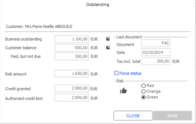

| Fields | Description |
| --- | --- |
| Business outstanding | The business outstanding will be the total of the two invoices 900 + 200 = 1,100 EUR. |
| Customer balance | The customer balance is calculated by subtracting the total collected amounts from the total of the invoice payments: (900 + 200) – (500 + 50) = 550 EUR. The customer balance is negative because the payments of the two invoices have not yet been received. |
| Paid, but not due | This field shows the total of the payments collected, but not yet due for the two invoices: 400 +150 = 550 EUR. |
| Risk amount | The risk amount is determined by adding the total of all active trade documents (i.e., the two invoices (FAC)) and subtracting the customer balance: 1,100 – (–550 ) = 1,650 EUR. |

#### Customer Data Anonymization

Customer Data Anonymization

This feature anonymizes the private data of one or more customers.

Required settings

Access right management

Back Office > Administration > Users and access > Access right management

For the selected user group(s), activate the following right: Menu Concepts (26) > Commercial Management > Customers > Anonymization.

Activation of the required option

WebApp Identity > Users

To enable the user to anonymize customer data, the Registration authority option must be activated in the user record.

How it works

Two APIs are available to anonymize customer data, depending on whether it concerns a single customer or a list of customers:

|  | Anonymize data for a single customer | Anonymize data for a list of customers |
| --- | --- | --- |
| API used | /FolderId/api/customers-anonymization/V1/id | /FolderId/api/customers-anonymization/V1 |
| Restrictions | Data cannot be anonymized in the following cases: Clothing allowances have been granted to this customer. There are outstanding payments for this customer. | Data cannot be anonymized in the following cases: Clothing allowances have been granted to one of the customers. There are outstanding payments for one of the customers. One of the customers on the list does not exist in the database. |
| Please note! You cannot undo this anonymization! |

### Business Operations and Data Collection

#### Contents

Business Operations and Data Collection - Contents

Business operation management enables you to save various types of events from a customer file.

The following sections include detailed descriptions of how these business operations work.

The management of business operations applies to receipts only (FFO type).

The Follow-up of business operations and collected information module is optional and must be serialized beforehand.

Introduction
- Objectives and Presentation

Preliminary settings
- Company settings
- Restricting access rights by category
- User-defined tables and amounts
- Register settings
- Access rights

Creating a business operation
- General tab
- Characteristics tab
- Shipment tab
- Results tab

Applying business operations
- Targeting customers
- Option recap table based on targeting
- Customer mailing based on business operations

Using business operations in Front Office
- Recording operations when entering a sales transaction
- Controlling invitations

Collecting data
- Creating a data collection operation
- Use in Front Office

Actions on events
- Exporting and importing events
- Purging events

#### Objectives and Overview

Business Operations and Data Collection - Objectives and Presentation

Business operation management enables you to save various types of events from a customer file, by taking into account the following functions.

Managing personal (or "nominative") events

For example, a customer who has been invited to an event on a given date (store grand opening) or a given period (a 3-day private sale). Personalized invitations are sent to certain customers. When customers arrive, the event is recorded which allows attendance to be evaluated. Invitations are to be checked more or less strictly, according to option.

This information is entered into a window dedicated to commercial operations: A successive scan is done of all invitations with verification. It can also be integrated into the sales process, thus automatically identifying the customer.

Management of condition-based events

A business operation may be much more general, such as private sales without personal invitations or follow-up of an ad campaign. Triggering an event is subject to more or less complex characteristics:
- Business operation linked to an event, based on the customer category. Example: An event open to VIP customers only.
- Sales line linked to an event based on items purchased. Example: An event open to perfume only. Enables you to compare the same advertising in several magazines.

This type of event can also viewed on the event sales screen at any time, independently of the receipt or customer. For example:
- When recording lost or potential sales
- When recording customer presence in the store when no purchases are made

Discount entitlement

An event may involve sales conditions that provide certain benefits for the customer involved.

Follow-up of operation

You can measure the success of an operation through viewing the history. Each record carries its origin: store, customer, date, etc.

Customer 360

This customer record option allows you to search for all actions that have been carried out by the customer:
- Sales history
- Order history
- Follow-up of call-back lists
- Follow-up of events sent to a customer or events in which the customer took part

Customer 360 is explained here .

Customer 360 is explained here

#### General Settings

Settings for Business Operations and Data Collections

Company settings

Back Office > Administration > Company > Company settings

Click Commercial management > CRM and enter the options described here .

options described here

Restricting access rights by category

Back Office > Administration > Users and access > User restrictions > Restriction categories

This function enables you to create specific user restrictions for business operations. The Business operations option must be checked in the Scope of use field.

Restrictions are optional. These optional restrictions can then be linked to the relevant users via the corresponding user record in Back Office > Administration > Users and access > Users.

These restriction categories can be used for both business operations and data collection.

User-defined tables and amounts

Back Office > Settings > Customers > Business operations

User-defined table and amount settings enable you to classify operations in different categories.

E xamples: Private sales, private invitations, lost sales, magazine advertising, etc.

This information can be accessed at multi-criteria search level for targeting purposes.

Register settings

You can enter a business operation or data collection as follows on the sales transaction entry screen:
- via the [Other actions ] button in the toolbar
- via the buttons configured on the touchpad

Access rights

Back-Office > Administration > Users and access > Access right management

The following menus and access rights must be managed for the different user groups.

Menu 26 – Concepts

Menu 26 – Concepts

Commercial management/Management of business operations and data collections:
- Deletion of a business operation or data collection
- Search customer while controlling invitations

Menu 105 – Settings

Menu 105 – Settings

Customers/Business operations:
- User-defined table 1
- User-defined table 2
- User-defined table 3
- Title of user-defined table
- Title of user-defined amount

Menu 109 – Customers

Menu 109 – Customers

Customer management:
- Control of invitations
- Follow-up of business operations
- Customer 360

Menu 110 – Basic data

Menu 110 – Basic data

Customers/Business operations:
- Management of business operations
- Follow-up of business operations
- Deletion of business operations

Customers/Collecting data:
- Management of data collections
- Follow-up of data collections

#### Business Operations

##### Creating a Business Operation

Creating a Business Operation

Back Office > Basic data > Customers > Business operations > Management of business operations

The header of the business operation enables you to show important information, such as operation code/description, restriction category, etc. The business operation code can be defined by the user. A check is done to verify that the code is not already in use. In internal code is nevertheless present (GUID), guaranteeing the consistency of the business operation in the system.

To create a business operation, click the [New] button and populate the following fields.

General tab

| Fields | Description |
| --- | --- |
| Store trigger | This allows you to restrict the use of data collection to a list of stores based on a trigger. The trigger must have a “Business operations” scope. |
| Validity | Validity limits the use of the information collected to the period indicated. The document date (and also the date of register opening) is taken into account here and not the system date on the user's workstation. |
| Frequency | The frequency completes the period of validity, enabling data collection on specified days or hours. The frequency used must have a Business operations scope. |
| User-defined tables and amounts | The settings for user-defined tables and amounts are explained in the section above. |
| Identification method | The method of identification enables you to designate the customers affected by the business operation. In Front Office, if none of the following apply to the customer, the business operation will not be saved : On generated list: For business operations based on a generated list, the customer dashboard is used first to select the relevant customers for the business operation. This is done on the basis of selection criteria. This function is located in the Basic Data > Customers > Quality > Dashboard. When the list of customers has been generated the [Generating a list of business operations] button enables you to assign it to the desired business operation. Each customer is assigned a personal code, which can be viewed by clicking the [List of customers] button in the business operation record. The Business operations tab in the Dashboard filters customers by event (cf. Customer Analysis ). On non-personal list: This setting may be used when flyers are distributed in public, for example. The operation barcode will be printed on each flyer (the same for all flyers). The barcode is generated when creating a business operation via the [Enter barcode] button. When the customer visits the store, the barcode will be scanned in order to save the business operation. On trigger: Identification of a third party via a customer trigger selected from the business operation record. It is however possible to avoid selecting the customer trigger with this option. The business operation will therefore be applied to all customers. However, a message will alert the user if no customer trigger has been selected when creating the business operation. On trigger with generated list: After selecting a customer trigger in the business operation record, the [Generate list] button will enable you to generate a list of customers corresponding to this trigger. A customer trigger must be selected for this option. Note that for business operations based on generated lists and on triggers with generated lists, the [List of customers] button in the business operation record allows you to open the generated list of customers. |

#### Characteristics tab

Identification

| Fields | Description |
| --- | --- |
| Barcode required | This option enables you to associated an operation to data. The barcode is customer-specific and is generated by the system when the list of customers is generated. |
| Scan is mandatory | This option requires scanning of invitation cards or barcodes via an optical scan. Manually entering codes is not recognized as valid. |
| Customer required | If this option is checked, the business operation will depend on the customer. It may be done only if the customer has been entered. Examples: Recording when a customer comes to a store opening through a personal invitation, private sale with invitation check. |
| Unique use | This option allows a one-time participation in a business operation. For example, an invitation to a private sale, valid once. |

Follow-up type

| Fields | Description |
| --- | --- |
| Control of invitations | This allows you to perform checks on invitations sent to a list of customers and to verify attendance. |
| Link operation to the sale | If the business operation is entered during a sale, this option allows you to link both of them. This association is not automatic. The event can be recorded for a customer other than the one for the sale. |
| Keywords for sales conditions | This enables you to enter a keyword dedicated to sales conditions. Each keyword consists of alphanumeric characters (A -> Z and 0 -> 9), without spaces or special characters. If more than one keyword is linked to the same sales condition, they will be separated by semicolons. If a keyword is entered during the checkout process, a search will be made for the keyword within the business operations assignable to the receipt. There are two possible scenarios: No business operations contain this keyword – No action, apart from applicable sales conditions being applied. One or more business operations contain this keyword: If no operations have been associated to the receipt, the list of relevant operations will be displayed. When selecting, assignment checks will be done. If an operation was assigned to a receipt (manually or using a customer code), it will be retained. The entered keyword is simply added to the list of keywords evaluated by the sales conditions, without being associated with a business operation. |
| Allocation to receipt | When the receipt is printed, a window will open with a list of active operations for the salesperson. |
| Allocation to line (automatic) | This option is specific to item sales and therefore tested on each sales receipt line. The operation will be saved only if one of the items on the receipt meets the trigger conditions. This option also enables you to avoid displaying a window with a selection of operations, to be automatically selected according to rank. Other operations will be ignored. |

Please note! All of these options are interrelated, and also depend on the options configured in the General tab.

Click here to view the table summarizing the various options by target type.

Click here

Shipment tab

| Fields | Description |
| --- | --- |
| Export | Allows you to specify the creation characteristics of a customized export file based on the list of customers who will be the recipients of the mailing (see Data Export ). |
| Mailing and e-mailing | This section allows you to specify the Word mailing template to be used, as well as the final document obtained (see Customer Mailings ). |
| Export for routing | Allows you to specify the storage directory of a simple export file containing the list of customers or contacts who will be the recipients of the mailing. The information relating to every customer is based on the data displayed in the presentation of multi-criteria table. |
| Expected shipping date | Allows you to save the date on which the operation was generated, such as : the date on which the operation was sent to the customer the date the advertisement ran the date the campaign was displayed |

Results tab

The following information is calculated when the user selects this tab:
- Number of e-mails sent
- Number of generated lines
- Number of returns: corresponds to the total number of returns, taking into account the customer presence with or without sales, as well as customer visits (in cases where the operation is saved multiple times)
- Return rate: Number of returns/Number of shipments
- Number of sales: This corresponds to the number of operations associated to a receipt sale (FFO).
- Sales rate: Number of sales/Number of shipments
- Actual S F: This field enables you to obtain the sales figures generated by the operation:

Note that this information is not saved. It is recalculated when the Results tab is displayed, depending on the origin of the request:
- In Front Office: The scope of the results includes the store and the customers that are linked to it (customer’s affiliated store).
- In Back Office: The scope of the results includes all stores involved in the business operation, and all customers, thereby providing a global view of all results for this operation.

##### Applying Business Operations

Applying Business Operations

Targeting customers

Manual targeting of customers – Generated personal list

The customer dashboard is used to target customers affected by the operation. Every customer will receive a personal code to be entered. (Examples: Invitation to private sales, invitation to a private viewing.) The barcode for the operation must be entered or scanned in Front Office. This code can be used more than once and the customer is required. A follow-up of the operation will be carried out as follows:
- Checking invitations
- Linking an operation to a receipt
- Checking the invitations and linking the operation to the receipt all at once

In Front Office: in Customers > Customer management > Control of invitations, a data entry window allows you to enter the personal code that was given tor sent to the customer.

Non-personal targeting of customers – Non-personal list

The barcode for the operation must be entered or scanned in Front Office. This code can be used more than once and the customer is optional. A follow-up of the operation will be carried out as follows:
- Checking invitations
- Linking an operation to a receipt
- Checking the invitations and linking the operation to the receipt all at once

If this setup does not require any data, no entry window will open when entering the receipt after you have selected this operation. However, if this setup requires you to enter a barcode or customer, the previous window will open.

Targeting customers based on triggers with or without generated list

The barcode for this type of operation is not to be entered or scanned in Front Office. This operation can be used more than once and the customer is optional. A follow-up of the operation will be carried out as follows:
- Checking invitations
- Linking the operation to a receipt or a line
- Checking the invitations and linking the operation to a receipt or a line all at once

The table below summarizes the different options according to the target type:

The following table recaps the various ways of operating:

| Identification | Barcode required | Scan is mandatory | Customer required | Unique use | Invitation check | Allocation to receipt | Allocation to line |
| --- | --- | --- | --- | --- | --- | --- | --- |
| Generated list | R | O | R | O | O | O | N/A |
| Non-personal list | O | O | O | O | O | O | N/A |
| Trigger | N/A | N/A | O | O | O | O | O |
| Trigger with generated list | N/A | N/A | O | O | O | O | O |

Key: R = Required, O = Optional, N/A = Not applicable

Customer mailing based on business operations

Back Office > Basic data > Customers > Business operations > Management of business operations

Creating customer mailings follows the same pattern as creating business operations (see Creating a Business Operation .)

Creating a Business Operation

The Mailing and e-mailing section in the Shipment tab in the Management of business operations record allows you to specify the mailing templates for customer mailings. The procedure for creating and managing templates is described in section Customer Mailings .

Customer Mailings

##### Using Business Operations in Front Office

Using Business Operations in Front Office

Saving business operations when entering sales transactions

Front Office > Sales receipts > Sales > Enter transaction

A business operation can be saved in Front-Office if it can be linked to the sale while inputting a receipt.

Recording operations with checks

Business operations configured with a link to the sale and an assignment to the receipt can be selected:

link to the sale

to the receipt
- manually when entering a sales transaction, via the [Other actions] button in the entry window toolbar, or special buttons on the touchpad.
- among all the business operations proposed when validating the receipt, if no operation of this type has already been assigned to this receipt.

The list of all operations applicable to customers and receipts is displayed by default, with the Search field enables you to:
- Scan/enter the invitation code sent to the customer
- Scan/enter a keyword

If a search is successful, the list of operations will be modified to display only those matching the scanned or entered code. If a scan returns a single event only, it will be automatically selected. If the code has not been scanned, business operations that require a mandatory scan will not be displayed, even if the code has been entered correctly. Depending on the selected operation and its settings, a window will open to allow you enter the following required information.

Automatic recording

Business operations configured with a link to the sale and an assignment to the line will be saved without prompting the salesperson for any information when inputting a receipt. In cases where several operations can be allocated to the same receipt line, the highest ranking operation will be selected automatically.

link to the sale

to the line

Example: If two operations, one ranked in position 1 and the other in position 3, are allocated to one receipt, the operation ranked first will be selected automatically.

Saving business operations when checking invitations

Customers > Customer management > Control of invitations in Front-Office

From the toolbar or touchpad during the sales receipt process, regardless of whether a transaction has been entered.

Business operations can be saved in Front Office, if control of invitations has been set for the operation during an invitation check. For example, a customer is invited to an event on a given date (store grand opening) or a given period (a 3-day private sale). When customer arrives his invitation can be checked more or less strictly, according to options defined:
- customer must have an invitation
- invitation addressed personally to each customer
- invitation must be scanned
- invitation can be used only once

The Customers > Customer management > Control of invitations feature in Front Office allows you to start the invitation check process. A multi-criteria selection screen displays a list of the business operations for which an invitation check has been configured. You can then select the relevant operation.

Business operations – Generated personal lists

The barcode field allows you to enter or scan the identifier (barcode) on the invitation sent to the customer. If the code is valid, a confirmation message will be displayed, and the customer is automatically identified. If the code is invalid, an alert message will show this. A message may also appear indicating that the salesperson must be specified.

After the invitation has been checked, information about the customer and a visual message will be displayed for a period of time defined via the [Clock] button.

This button allows you to search for customers using a multi-criteria selection screen that displays the list of invited customers.

Note that the button is subject to access rights in menu Concepts (26) > Management of business operations and data collection > Search customer during while controlling invitations.

Business operations – Non-personal lists

The window used for checking invitations is similar to the previous window. In case of non-personal lists (flyers distributed in the street, for example), the barcode for the operation is the same for all customers.
- If the Customer identification checkbox is selected in the business operation settings, you will need to complete the Search for customer field in addition to the barcode, so that it can be identified (using search priorities).
- If the Customer identification checkbox is not selected, there will be no references requested when checking the invitation.

Business operations – Triggers

You cannot scan a barcode for this type of business operation. The Customer search field allows you to search for a customer using specified search priorities.

This button allows you to carry out a search on the multi-criteria selection screen for the customer, depending on the trigger configured for the business operation.

When entering a sales transaction, a button configured on the touchpad or the [Other actions/Business operations/Control of invitations] button on the toolbar, allows you to directly display the selection window for those operations that require checks. The window for entering the required information is then displayed, depending on the settings for the business operation.

#### Collecting Data

Collecting Data

Creating a data collection operation

Back Office > Basic data > Customers > Collecting data > Management of data collections

The data collection option is not necessarily linked to a sale or a customer. It serves to collect information about data which may be deemed relevant (e.g. Lost sales, network down, etc.) The data collection option header enables you to show the main information:
- Code/Description
- Restriction categories
- Comments

Restriction categories are applied to both business operations and the collection of data. Other options in the tab enable you to determine the following elements:

| Fields | Description |
| --- | --- |
| Store trigger | This allows you to restrict the use of data collection to a list of stores based on a trigger |
| Validity | Validity limits the use of the information collected to the period indicated. The document date (and also the date of register opening) is taken into account here and not the system date on the user's workstation. |
| Frequency | The frequency completes the period of validity, enabling data collection on specified days or hours. |
| Customer required | Data collection may be become customer-dependent, i.e. it cannot be stored unless the customer is specified. |
| Recover customer from receipt | Enables you to retrieve the receipt customer for data collection. |
| Link this event to the current receipt | If this option is checked when entering a receipt, it will be saved in the event log. |
| Item entry | If this option is checked, data collection must be associated to item entry. The Item trigger field enables you to manage restrictions for items to be associated to data collection. |

How to collect data

In Back Office

The data collection can be called directly from the item record and from the customer record .

customer record

In Front Office

Data can be manually collected in the sales transaction entry window using:
- the [Other actions/Data collection] button in the toolbar
- or a button configured on the touchpad

A window will open allowing you to select the relevant data collection. After selecting, additional information will be requested. If the Assign event to current receipt setting has been checked, the current receipt will be saved in the event. If the receipt is associated to an identified customer, it will be automatically retrieved. The settings defined for the data collection will determine whether you have to specify a customer and item.

This button allows you to return to the data collection selection window.

Please note!

Automated processes are not possible in the data collection module. The salesperson alone is responsible for entering the relevant information.

#### Actions on Events

Actions on Events

Exporting and importing events

The event history list can be exported to feed an external CRM. Events issued from an external source may be imported into the system. The following imports are possible:
- Importing an event: After a unity check of the event type, the event will be created and given an internal number within the system.
- Importing invitations of an event: The list of invited customers for an event can be integrated, which then can be used in Cegid Retail Y2. Once integrated, these records will no longer be able to be changed by importing other data, so that its use will not be changed (customer arrival).
- Importing attendance to an event: If entered in a system other than Cegid Retail Y2, events can be integrated through data imports. They can then be viewed in the customer action dashboard. Checks are done to verify the consistency of the data imported.

Purging events

Two options enable you to purge events.
- Deleting an event: A function is available in each event enabling you to delete it, as well as all actions related to the event. This option requires user rights (see Access rights .)
- Purging events: An event deletion module is available which enables you to delete event lists according to criteria, such as period or user-defined tables.

### Call-Back Lists

#### Contents

Call-Back Lists - Contents

Store managers may want to implement a customized customer management system with regular phone calls based on predefined criteria. Call-back lists allow you to group customers according to certain criteria, in order to carry out and track these phone calls.

General settings
- Enabling the management of call-back lists
- Configuring the status of actions
- Configuring an alert to track the calls
- Managing access rights

Configuration of call-back lists
- Configuring the call-back list header
- Assigning several customers to a call-back list in Back Office or Front Office
- Assigning a customer to a call-back list in Front Office

Use of call-back lists
- Description of the follow-up of the call
- Modifying call-back lists
- Deleting call-back lists
- Importing call-back lists

#### General Settings for Call-Back Lists

General Settings for Call-Back Lists

Enabling the management of call-back lists

Back Office > Administration > Company > Company settings

You must first enable call-back lists in the company setting. Go to Commercial management > CRM and tick the Management of call-back lists option.

Configuring an alert to track the calls

Register alert

Back Office > Settings > Front Office > Register

You can define for each register an alert on call-back lists. To activate this feature, open the Register record of your choice and select the Daily Operations tab. Check the Alert on call-back lists option and validate. At daily opening, this option will enable the display of an alert on the calls to be made.

Cegid alert

Back Office > Administration - Alert management > Settings

An alert of type “Cegid" is used to track the call-back list according to several criteria to be defined.

Example:

All the calls of the current day (preferred date = current date) or all late calls (preferred date exceeded).
1. Enter "CEG-APPEL DU JOUR%" in the "Indicator" field and click the [Apply criteria] button.
2. Double-click the "CEG-APPEL DU JOUR" line. The "Indicator" window will appear.
1. The [Instant printing] button is used to print the list of calls to make.

Configuring the status of actions

Back Office > Settings > Customers > Status of actions

When call-back lists are used, you may be required to specify the status of the action, e.g. the customer does not want to be contacted or the customer wants to receive an invitation. This status is available only if user-defined values were defined in the corresponding subtable.

Managing access rights

Back Office > Administration > Users and access > Access rights management

Front Office > Settings > Administration > Users and access > Access right management

The use of this functionality depends on the following access rights and concepts:

Menu Concepts (26) - Commercial management - Management of call-back lists

This menu is used to authorize or deny access to the following functionalities:
- Automatically complete the stores of a call-back list
- Set up call-back lists
- Authorize tasks to be allocated to another person

Menu Customers (109) - Call-back lists

This menu is used to authorize or deny access to the following Front Office functionalities:
- Customers > Call-back lists > Settings
- Customers > Call-back lists > Use

Menu Basic data (110) - Customers - Call-back lists

This menu is used to authorize or deny access to the following Back-Office functionalities:
- Basic data > Customers > Call-back lists > Settings
- Basic data > Customers > Call-back lists > Use
- Basic data > Customers > Call-back lists > Batch update

#### Configuration of Call-Back Lists

Configuration of Call-Back Lists

Configuring the call-back list header

Back Office > Basic data > Customers > Call-back lists > Settings

Front Office > Customers > Call-back lists > Settings

Click the [New] button to display the "Call-back list" window and specify the following information:

| Fields | Description |
| --- | --- |
| Label | Name of the list with a maximum of 70 characters. |
| Assignment of salesperson | The salesperson who will be assigned to carry out the call: Customer's main salesperson: The salesperson associated with the customer record will automatically be assigned to the customer's call. Not specified: No specific salesperson will be assigned to the calls. Dedicated salesperson: A salesperson must be specified manually for each call. |
| Store | This information specifies the store that must call the customer. This can be the affiliated store or the customer creation store. |
| Validity dates | Enter the validity dates of the list. |
| Notepad | Field used to enter a user-defined comment. |

Validate the creation of the list header. The next step consists of assigning customers to the list you just created.

Assigning several customers to a call-back list in Back Office or Front Office

Back Office > Basic data > Customers > Dashboard

Front Office > Customers > Customer management > Dashboard

You perform this step in the Front Office for the current store and in the Back Office if there are several stores. This step enables you to assign selected customers to the call-back list you created in the previous step. This assignment is performed via the customer dashboard, based on various criteria (date of birth, city of residence, etc.).
1. Once the selected customers are displayed on screen, click the [Generate a call-back list] button. The Assignment to a call-back list window will appear.
2. Select a call-back list and a salesperson. The salesperson associated with the call will depend on the option you selected when you created the call-back list header:
1. Next, select the preferred date of the call which is set by default to the start date of the validity period of the list header. This date may be modified but must fall within the same validity period.
2. Validate the assignment of the call-back list to the selected customers. When you validate, one call will be created for each customer. This can be used as follows:
1. If one or more customers are assigned to a store that is not referenced in the call-back list, then when you validate the assignment, a message will appear. You can perform one of the following actions:
1. After the initial assignment of customers to a call-back list, you can subsequently add new customers to the list. Only new customers will be inserted in the call-back list.

Assigning a customer to a call-back list in Front Office

Front-Office > In the customer record using the [Complementary data/Call-back lists] button

Front-Office > In the sales receipts screen using the [Other actions/Call-back lists] button

If requested by the customer while making payment, a call-back request can be directly defined in Front Office. (Example: The customer wants to receive information on private sales and invitations.)
1. In the sales receipt screen, select the customer and then click the [Other actions/Call-back lists] button. You can also open the customer record and click the [Complementary data/Call-back lists] button. The Assignment to a call-back list window will appear.
2. Complete the required fields and validate. The customer is now assigned to the selected call-back list.

#### Use of Call-Back Lists

Use of Call-Back Lists

Description of the follow-up of the call

Back Office > Basic data > Customers > Call-back lists > Use

Front Office > Customers > Call-back lists > Use

Even if a call-back list is assigned to several stores, each call is assigned to only one store. Stores will only see their own calls. The calls that are created include the following information:

| Fields | Description |
| --- | --- |
| Call-back list | The call-back list to which the customer was assigned. The [View] button enables you to view the header of the call-back list. |
| Salesperson of the call | By default, the salesperson defined in the call-back list header. You can modify this field depending on the configuration of the "Authorize tasks to be allocated to another person" option. By default, the value of this option is "Authorized". If the value of the option is "Not authorized", you cannot access the field even if it is empty. |
| Customer concerned | Last name, first name, phone numbers, and email as specified in the customer record. The [View] button enables you to view the customer record. |
| Comment | Field used to enter a user-defined comment. |

Dashboard recap

Displays the fields of the dashboard.

List of actions

Displays the last action performed.

Entry of a new action

This section enables the salesperson performing the action to enter information on the current call manually.

| Fields | Description |
| --- | --- |
| Date of the action | Date of the current call. |
| Salesperson of the action | By default, the salesperson defined in the call-back list header. You can modify this field depending on the configuration of the Authorize tasks to be allocated to another person option. By default, the value of this option is "Authorized". If the value of the option is "Not authorized", you can access the field only if no salesperson is specified in the header. Otherwise the salesperson specified in the header will be loaded and non-modifiable. |
| Status | This field is available only if user-defined values were defined in the corresponding subtable. See Configuring the Status of Actions . |
| Description | Field used to enter a user-defined comment. |
| Status of the call | The initial status is "Not started". The status will change to "In progress" once the first action is entered. As long as the status is "In progress", you can update and save this screen. |

Modifying call-back lists

Back Office > Basic data > Customers > Call-back lists > Batch update

This functionality performs a mass update of one or more selected lines using the following information:
- Salesperson of the call
- Preferred date
- Comment of the call

This functionality depends on the configuration of the Authorize tasks to be allocated to another person option. If the value of the option is "Not authorized", the salesperson specified in the header will be loaded and non-modifiable.

Deleting call-back lists

Back Office > Basic data > Customers > Call-back lists > Settings

Front Office > Customers > Call-back lists > Settings

This button is used to delete a call-back list if the following two conditions are met:

- The call-back list is closed.
- The deletion date does not fall within the validity period of the list.

The list, as well as all associated calls, will be deleted.

Importing call-back lists

Back Office > Data exchanges > Data recovery > Data import

You can integrate a call-back list using its code as follows:
- If the code does not exist, the list will be created.
- If the code exists, the list will be updated.

### Item and Customer Multi-Classification

#### Contents

Multi-Classification - Contents

The objective of this functionality is to be able to manage an unlimited number of groupings, hierarchical or otherwise. These groupings can be allocated to customers and items
- Overview of groupings
- Multi-classification settings
- Entering classifications
- Using classification in analyses

#### Overview of Groupings

Overview of Groupings

Non-hierarchical grouping

Each of the values is independent of the others:

| Plating | Plated Solid |
| --- | --- |
| Sales area | Entrance Register Store |
| Window | Interior Exterior Register |

Hierarchical grouping

Each of the sublevels is dependent on the level to which it belongs:

| Accessories | Jewelry | Gold Silver |  |
| --- | --- | --- | --- |
|  | Watches | Men’s Women’s | Sports Classic |
|  | Bags | With strap Without strap | Leather Fabric |

#### Multi-Classification Settings

Multi-Classification Settings

Activating multi-classification

Back Office > Administration > Company > Company settings

Go to Commercial management/Default settings and check the Multi-classification company setting.

Creating classifications

Back Office > Settings > Items > Item classifications
1. Click the [New] button to create a new classification.
2. The Define item classifications screen displays where you can specify the name of the classification you have just created. (Example: Accessories)
3. On the right side of the screen, specify the code and the description of every element belonging to the classification. (Example: Bags, Belts, etc.)
4. On the left side of the screen, select the element you have just created, and specify the code and the description of each element belonging to this level. (Example: With strap, without strap, leather, etc.)
5. You can create several classifications at several levels. Each of these sub-elements can be sorted or deleted via the appropriate buttons displayed on the right side of the screen.

Please note!
- The sub-level code is unique within the classification. For example, the “CUI” code cannot be used as a sub-level of “Bags”, because it is already used in the "Belts" level (see Overview of Groupings .)
- Once created, the code cannot be changed.

The Exclusive classification option allows you to specify whether or not an item or customer can be linked to several levels (see Exclusive Classification .)

Exclusive Classification

Configuring user authorizations

Define authorized classifications

Back Office > Administration > Users and Access > Users

Open the user record of your choice and go to tab Additions . In the Classification section, specify one or more classifications usable by user.

Manage access rights

Back Office > Administration > Users and access > Access rights management

You must enable the following access rights in the Settings menu (105):
- Item classifications (in the Items submenu)
- Customer classifications (in the Customers submenu)

#### Entering Classifications

Entering Classifications

Back Office > Basic data > Items > Items

Back Office > Basic data > Customers > Customers

In records (customer and/or item) that manage classifications and where classifications have been defined, the [Complementary data] button allows you to access the Classifications menu. For a given item record, the allocation window makes it easy for you to allocate the item in question to one or more classifications. it is the same for a customer record.

- Exclusive classification : If the classification is an “exclusive” type, the item or the customer can be assigned to one classification level only. Example: “Bags” or “Belts"
- Non-exclusive classification : If the classification is a “non-exclusive” type , the item or the customer can be assigned to more than one classification level. Example: “Bags” and “Belts"

Deleting a classification will result in the deletion of all data corresponding to this classification. Deleting a node will delete all values associated with that node.

#### Using Classifications in Analyses

Using Classifications in Analyses

Inventory

Item availability

Back Office > Inventory > Query > Item availability

Analyses enable you to filter data according to classification criterion. The criterion is located in the Additions tab.

Dashboard and cube

Back Office > Inventory > Query > Dashboard and Cube

Analyses enable you to filter data according to classification criterion. This criterion is located in the Standards tab for dashboards, and in the Additions tab for cubes.

Customers

List of customers

Back Office > Basic data > Customers > Customers

Analyses enable you to filter data according to classification criterion. The criterion is located in the Additions tab.

Customer dashboard

Back Office > Basic data > Customers > Dashboard

Analyses enable you to filter data according to classification criterion. To get access to this classification criterion, go to the Customer tab and enable the following options available in the Display criteria section:
- On sold items: triggers the display of the Item tab where you can select the classification criteria.
- Additional to customers: triggers the display of the Customer addition tab where you can select the classification criteria.

Items

Back Office > Basic data > Items > Items

Analyses enable you to filter data according to classification criterion. The criterion is located in the Additions tab.

### Customer Mailings

#### Contents

Customer Mailings

The mailing feature allows you to manage the various mailing actions from the customers file or contacts file. This is achieved by creating a mailing record.

A mailing record relates to a selection of customers or contacts, and prompts the creation of an export file (for internal use or to be sent to a “router” in charge of mailings). If using a mailing template created by Microsoft Word, it also allows the creation of a form letter addressed to each customer, which can potentially be sent by e-mail.

This mailing record can be a simple collection of data relating to a given commercial action (shipment date, validity dates, etc.), but can also assess the return from the operation by linking the sales entered in Front Office to the commercial actions behind the customer visit.
- Required settings
- Focus on customer mailing records
- Creating a mailing
- Managing various mailings
- Using mailings in Front Office

#### Customer Mailings ‒ Required Settings

Customer Mailings ‒ Required Settings

Company settings

Back Office > Administration > Company > Company settings

Go to Commercial management > CRM. To display the Customer mailing menu, you have to disable the Management of business operations and data collections option.

Access rights

Back-Office > Administration > Users and access > Access right management

Access rights linked to mailings can be handled in the following menus:
- Menu Concepts (26) > Commercial management > Customer mailings: Mailing management, Creation, Modification - Deletion.
- Menu Basic data (110) > Customers > Customer mailings: Mailing list, Mailings per customer, Mailing per contact.

#### Focus on Customer Mailing Records

Focus on Customer Mailing Records

Back Office > Basic data > Customers > Customer mailing > Mailing list

This command allows you to display the list of existing mailing records according to the sort criteria selected in the header of the window.

Please note: The management of mailings is not available in Front Office, except for the purpose of linking a sale to a particular mailing when entering a sales transaction.

Toolbar

The [Export the list] button creates a file containing the mailings of the displayed list, which can be retrieved using an office tool such as Excel or Word.

The [Open] button gives access to the current mailing record. A double-click on the line also opens the record.

It is possible to create a new mailing record by clicking the [New] button.

Characteristics tab

This tab displays the key data relating to the mailing operation, such as the code, description, the validity dates and the expected sending date. It also allows you to specify the document type for which the mailing will be used (generally Front-Office receipts) in order to determine its effectiveness.

The Storage of the sending list checkbox allows a list recipient customers to be stored in the database. To be able to determine the impact of the commercial operation, this option must be checked. If this option is disabled, it will not be possible to link a sale to a mailing when entering a sales transaction in Front-Office; and therefore, it will not be possible to calculate any return value in the Scope section of this tab.

The [Calculate returns and success rates] button updates the impact assessment: number of sent mailings, number of returns, and success rate.

The [List of customers] button enables you to view the list of customers (or contacts) receiving this mailing. This button is available only if the Storage of the sending list option is enabled on the multi-criteria screen.

Shipment tab

This tab allows you to define the routing settings for the addressees of the mailings. It need not to be specified when creating the mailing record. These shipment characteristics may be given when the mailing concerned is launched. However, the information specified in this tab will be automatically retrieved by default when the mailing is launched.

| Fields | Description |
| --- | --- |
| Export | Allows you to specify the creation characteristics of a customized export file based on the list of customers who will be the addressees of the mailing (see Data Export ). |
| Mailing and e-mailing | This section allows you to specify the Word mailing template to be used, as well as the final document obtained. The [Create/Change templates] button gives access to Word’s mail merge functions (refer to |
| Export for routing | Allows you to specify the storage directory of a simple export file containing the list of customers or contacts who will be the recipients of the mailing. The information relating to every customer is based on the data displayed in the presentation of multi-criteria table. |

#### Creating a Mailing

Creating a Mailing

Back Office > Basic data > Customers > Customer mailing > Mailing list

In the Shipment tab of the Mailing record, the [Create/Change templates] button gives access to the creation and change functions for a Word mail merge:

Creating a new template

This enables you to access the Word mail merge function.

Template management

This opens the print Template module in Word, displaying the list of templates already created.

The [New external document] button enables you to create a new template by selecting a Word document stored on the workstation to store it the database.

Once the new template has been selected, the [Process document/Take document for modification] button allows you to recover an existing document in the database onto the local workstation in order to modify it.

Once the changes made to the document, the latter must be reintegrated with the database via the [Process document/Integrate modified document] button.

This integration makes the template unavailable for any use. It is therefore necessary to make it available again by changing the template status from “Unavailable” to “Available”. Indeed, the template cannot be used to create mailings unless its status is “Available”. If the status is:
- “Unavailable”, the template will not be visible in the database.
- “Creation in progress”, the template will be visible, but not usable to create mailings.

#### Managing Various Mailings

Managing Various Mailings

Mailings per customer

Back Office > Basic data > Customers > Customer mailing > Mailings per customer

This function allows you to select the customer records for which a mailing operation should be performed.

You can view a customer record by clicking on the [Display the third-party] button.

The [Select all] button is used to select all the lines displayed in the multiple criteria screen. The space bar of the keyboard allows a disrupted selection record-by-record.

The [Customer extraction] button will start processing the selected customers. The characteristics entered in the commercial operation record are proposed by default, but remain modifiable at this stage.

- The [Create/Change templates] button provides access to the functions for creating and managing templates, as explained above (see Creating Mailings.)
- The [Export] button starts the creation of the export file or form letters for the mail merge, or even e-mails. You have then to specify the associated mailing as well as the access path to the file to generate.
- The Template selection field allows you to view the list of templates available in the database and select one of them.
- The [Print] button prints the selection of displayed templates.
- The [Show document] button allows you to verify the generated form letters, in the case of a simple mailing.

Once the export has been completed, the following message “Customer export done” displays.

In the case of mailings, once Word is open, you must use the [Merge to E-mail] button on Word’s Mail Merge toolbar.

Mailings per contact

Back Office > Basic data > Customers > Customer mailing > Mailings per contact

In the database for the sorting criteria indicated, this command enables you to select contact records that mailing operations are to be done on. The process is the same as that described for Mailings per customer.

Mailings from the customer dashboard

Back Office > Basic data > Customers > Dashboard

For more information on how the advanced customer dashboard is used, refer to Customer Analyses .

Customer Analyses

The [Generating a list of business operations] button displays the same window that is used for the configuration of mailings per customer or contact, but this time it is displayed for the export of the customer list displayed by the dashboard according to the criteria selected in the multi-criteria selection list.

#### Using Mailings in Front Office

Using Mailings in Front Office

The management of mailings is not available in Front Office, except for the purpose of linking a sale to a particular mailing when entering a sales transaction.

If the Storage of the sending list option has been checked when the mailing record was created, and if the type of document for which the mailing is used is FFO, it is possible to link a customer’s sale to the mailing operation performed.

Once you have finished entering the sales transaction, and payment has been validated, a dialog box opens automatically and displays a list of mailing operations in progress. This link between the sale and the mailing allows the generation of specific statistics on the success of the mailing, as explained in the previous section Characteristics tab.

### Customer Analyses

Customer Analyses

The objective of customer record management is to use the information gathered to launch targeted sales operations. In order to do this, a number of reports and analyses are available.

Access rights linked to customer analyses are available in Administration > Users and access > Access right management:
- Menu Basic data (110) > Customers gives access to customer records and various actions such as modification, deletion or closure of records. It also manages access to customer-related processes and reports.
- Menu Customers (109): This menu allows you to authorize user groups of your choice to access the Customer dashboards in Front Office.

Customer Reports and Analyses

Back Office > Basic data > Customers > Reports

This command gives access to various reports and analyses. Most of these reports can be customized using the report generator.

List of customers

This command allows you to print a list of customers selected from criteria of your choice. The list also displays customer contact information.

Accounts receivable

This report allows you to print a list of customers according to the criteria entered. The report (detailed or not) also lists the amount purchased and the balance for a given period for each customer. The Additions section allows you to make a selection based on the total sold, the customer balance or the purchase date. A checkbox allows you to request the details of sales.

Customer labels

This report enables you to print the selected customer labels according to the criteria entered. Labels can be printed with or without barcodes. This command is also available in Front Office, in the Customers > Customer management > Edit labels.

Customer dashboard

Please note!

There are 2 customer dashboards: this one and the advanced dashboard are available in the same module (Basic data > Customers.)

The customer dashboard available in the Reports command, allows you to view and to group together a list of customers selected according to your chosen criteria. The report list only contains the general information entered in the customer records, and never contains information regarding customer purchases. To obtain information about customer purchases, use the advanced dashboard detailed hereafter.

You can customize the appearance of the customer dashboard using the special Dashboard tools.

Dashboard

Customer cube

This analysis allows you to view and to group together a list of customers selected according to your chosen criteria. The report list only contains the general information entered in the customer records, and never contains information regarding customer purchases. To obtain information about customer purchases, use the advanced dashboard detailed hereafter.

You can customize the appearance of cubes using the special Cube tools.

Cube

Customer Advanced Dashboard

Back Office > Basic data > Customers > Advanced dashboard

Front Office > Customers > Customer management> Advanced dashboard

This analysis allows you to view and to group together a list of customers selected according to your chosen criteria. The report list relates both to the general information entered in the customer records, and information relating to purchases (quantity and sales figures) and customer balances for a given period thanks to additional tabs. These tabs can therefore be displayed on demand, allowing you to perform statistics calculations on numerous selection criteria such as sales realized, stores or business operations. The tabs displayed by default are as follows: Customer, Labels, Currencies, Advanced.

Displaying additional tabs

Use in the Customer tab, the options available in the Display criteria section, and check one or more of the following options.

| Fields | Description |
| --- | --- |
| On sold items | Allows you to display the selection tabs for criteria relating to items purchased by customers. Note that you can combine a selection of items using "and / or" in the Item tab. |
| Additional to customers | Allows you to display the selection tabs for user-defined customer record criteria and mailing criteria |
| On the stores of the sales | Allows you to display the selection tabs for criteria relating to the stores in which the sales were made. |
| On customer sales | Allows you to display the selection tab for customer purchase criteria for a given period, with or without sales. The Consider criteria from other tabs strictly checkbox allows you to strictly link criteria on totals to other criteria. Ticking this option displays a typical example describing how it works. For the values of the fields (of the type total sales, qty, etc.) to be displayed, they must be added to the presentation, then saved and reloaded. The calculation will then be carried out correctly, otherwise the columns will remain at 0. |
| On business operations | Displays the Business operations tab where you can filter customers according to events. |
| On loyalty | Displays the Loyalty tab allowing you to select loyalty criteria. If this option is checked, a loyalty criterion will be required. Likewise, if there is a presentation with loyalty data present in the report data displayed. |
| On privacy | Displays the Privacy tab allows you to add new restrictions to contact information. |

Report list

Once the selected customers are displayed in the report list, a specific toolbar allows you to perform a number of actions on this list.
- Generate the list of business operations: generates the list of customers currently involved in a business operation with an identification method set to Generated list.
- Print customer labels.
- Batch modification of customers.
- Generate a call-back list containing customers of the report. This option is accessible if call-back lists are managed.
- Show customer record.
- Change loyalty program: This option is available if loyalty campaign management enables you to switch from one loyalty program to another program.
- Display list of loyalty cards.
- Display customer balance.

### Customer Balance

Customer Balance

The balance for retail customers, which is calculated as being the difference between sales made to a customer and the payments from this same customer, can be fully configured. You can therefore define which register operations and payment methods will be taken into account in the calculation of the balance.

General settings

Calculation rule

Back Office > Administration > Company > Company settings

Front Office > Administration > Settings> Company > Company settings

Go to Commercial management > Front Office. In the Customer balance section, specify the Calculation rule setting.

Register operations and payment methods

Back Office > Settings > Management > Register operations and Payment methods

This step is used to exclude some register operations or payment methods from the calculation of the customer’s balance. Consequently, you may decide to exclude gift certificates from the calculation of the customer's balance.

The Considered in the customer balance option, available in the Register operation and in the Payment method records, respectively in tabs “Characteristics” and “Front Office” is used to specify if the operation or the payment must be accounted for in the customer balance.

Please note that this option is not available for all register operations or all payment methods.

Access rights

Back Office > Administration > Users and access > Access right management

Features linked to the customer balance calculation are subject to access rights that may be granted or denied in the Sales receipts (107) menu.
- In the Access rights > Miscellaneous section, the Show customer balance in all stores access right is used to limit the display of the customer balance to the user’s store, or to all stores of their restriction.
- In the Enter payments section, the Reimburse a customer with a negative balance access right authorizes or not users to reimburse customers, despite a negative balance.

How does the customer balance work in Front Office

Perform a sales transaction that updates the customer's balance

Front Office > Sales receipts > Sales > Enter transaction
1. Enter the customer’s name and make a sale of
- either a register operation previously configured to be considered in the customer's balance (i.e. the sale of the gift certificate.) or an item that will be paid with a payment method previously configured to be considered in the customer's balance (i.e. sale of an item paid with the payment of a deposit.)
1. Finalize the transaction to update the customer;s balance

View customer balance

Customer balance accesses are listed hereafter, depending on how you access the customer balance, i.e. from the sales transaction entry screen, the customer record, or from analyses.

You can view the customer's balance in the Front Office from:
- The sales transaction entry screen: via the toolbar, the [Actions on customers] button gives access to several options including “Customer balance.” Moreover, the customer;s balance is also displayed in the header of sales transaction entry screen, just under the Customer field, once the latter has been identified.
- The customer record: The [Customer balance] button opens the Customer balance window.
- Analyses: The customer dashboard available in module Customers > Customer management displays the customer balance. Click the [Set up layout] button to display the Customer balance column.

The Customer balance screen displays the list of register operations and payment methods used by the customer. To display the detail of the selected line, click the [Show detail] button.

### Customer Tracking – Customer 360

Customer Tracking – Customer 360

The Customer 360 tool allows you to view all of the actions carried out by and for a customer:
- List of business operations assigned to the customer
- Sales and other documents
- Customer call-back lists

Settings for the customer tracking

Back Office > Basic data > Customers > Customer tracking/Settings

This feature allows you to define the data to collect for a given customer, and specify the actions that will be searched for and displayed. The purpose of defining these settings is to limit the amount of data displayed so that the information loaded is optimized.

The [Generate history] button allows you to copy the selected information to a temporary table so that you can work on it later in the Customer 360 tool.

Note that only the selected information will be stored in the temporary table. Moreover, a history of 0 months indicates that the history is to start from scratch.

Operation of the Customer 360 tool

Back Office > Basic data > Customers > Customer tracking > Customer 360

Front Office > Customers > Customer management > Customer 360

The multi-criteria selection function displays the information from the temporary table. This table is already populated by default based on the settings defined before. To view the details for a line, simply double-click the line. You can then view the corresponding document, reservation, loan, business operation, customer service record, etc.

Please note!

The multi-criteria selection screen will only display the information contained in the temporary table. For example, if the settings define that the history should display the last 6 sales months, it will not be possible to display data for the period prior to these 6 months.

This button allows you to display the following columns:

| Columns | Description |
| --- | --- |
| Document status (MVB_STATUT360) | Specifies the status of the information: Documents: In progress or closed Calls: Call status description Business operations: Return statistics Customer services: In progress or closed |
| Item code (GA_CODEARTICLE) | Displays the item code. |
| Employee (MVB_REPRESENTANT) | Code and name of the salesperson: for receipts, this is the salesperson indicated in the header. |
| Quantity (MVB_QTE) | This is the main quantity. |
| Amount (MVB_MONTANT) | Tax-exclusive and tax-inclusive amounts. |

Other possible accesses to Customer 360

Note that the Customer 360 tool for a customer is also available from the following features.
- Customer record From the customer’s record in the Back Office, by using the [Complementary data/Customer 360] button. From the customer’s simplified record in the Front Office, by using the [Zoom/Customer 360] button.
- Transaction entry screen: You can configure a dedicated button on the touch pad of the transaction entry screen (refer to the Register settings .) In this case, the customer cannot be a fictitious customer; they must really exist.

### Official Document Reader

Official Document Reader

Official documents, such as passports and identity cards, contain valid information that can be included in Cegid Retail Y2.

This topic first explains how to install the QS1000 document reader, associated with the 3M software, and then deals with setting up the device and its use in Cegid Retail Y2.
- Click here to access the document .

## Customer Loyalty

### Loyalty Basic Concepts

#### Contents

Customer Loyalty - Contents

General characteristics
- Program and campaign concepts
- Additional information

Customer loyalty management - Overview
- Program structure
- Characteristics tab
- Creation of the card tab
- Acquisition options tab
- Benefit options tab
- Renewal of the card
- Benefits with gift certificate from Headquarters

Program rules
- Creation of a new rule
- Application of rules
- Interaction of loyalty with sales conditions and final selling price

Campaigns management - Overview
- Description of the tabs in loyalty campaign records
- Management rules
- Scheduled renewal

Loyalty settings
- Company settings
- Register settings
- Loyalty receipts
- Information displayed on the customer banner
- Import

Loyalty card
- Loyalty card management

Access rights
- Access rights management

Standalone mode
- Loyalty management in standalone mode

#### General Characteristics

Customer Loyalty - General Characteristics

Program and campaign concepts

Loyalty management is based on two complementary concepts: program and campaign.

Loyalty program

This basic concept includes all loyalty management rules in a program. Your loyalty program is defined based on your own specific criteria. For example, the program may concern:
- A specific store
- All stores using the same currency
- All stores in a same geographical area
- A global program
- Etc.

The program management defines its characteristics, enrollment rules, acquisition rules, benefit rules and card renewal rules. In the program, you will link the stores for which the program applies. During a sales transaction entry, the system applies the rules of a program linked to the store of the cash register.

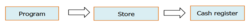

See topic Loyalty program - Overview .

Loyalty program - Overview

Loyalty campaign

This concept allows you to gather a set of programs applicable in chronological order, and manage loyalty levels to segment loyalty cards. The most common example is a campaign with Silver, Gold and Platinum levels. However, you can also define the other levels, such as: Rubies, Emeralds, Diamonds or VIP A, VIP B, VIP C, etc. The campaign adds the following features:
- Combination of programs with management of card renewal (definition of rules for staying in the same program or downgrading.)
- Management of program changes by defining applicable rules.

In this case, the link with the stores is established at campaign level, and not at loyalty program level. During a sales transaction entry, the system applies the campaign linked to the store of the cash register.

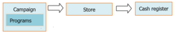

Note that in this case, the rules attached to the programs will apply.

See topic Loyalty Campaign – Overview .

Loyalty Campaign – Overview

Additional information

For every customer, loyalty is characterized by the creation of a loyalty card (see Loyalty Card .)

Loyalty Card

Loyalty is enabled on options and various settings are available (see Settings .)

Settings

In the sales transaction entry feature, various tools are available to display information about customer loyalty, perform actions and print information (see Register Settings .)

Register Settings

According to user groups, you can decide who may access loyalty settings. By the means of concepts, you may restricts actions to perform on loyalty cards or in the sales transaction entry feature (see Access Right Management .)

Access Right Management

Importing loyalty offers the possibility to integrate and update loyalty cards, and also calculate loyalty when importing sales receipts (see Import .)

Import

#### Customer Loyalty Management

Customer Loyalty - Overview

Back Office > Sales> Loyalty> Loyalty programs

Program structure

A loyalty program is structured as follows:

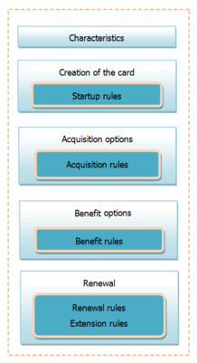

Configuring a loyalty program consist in defining various rules and options (see Rules ) applicable to the management of loyalty cards.

Rules

Characteristics tab

This tab allows you to define the characteristics of the program:
- Code and description, aggregate type (points or amounts), multi- or mono-currency, duration of the program, information messages displaying in the Front-Office, interfacing loyalty with an external tool, etc.
- Note that if the Multicurrency option is enabled, the program necessarily cumulates points, and you have to define the rules applicable to the currency of the card or the register store and the exchange rate type.
- You can modify cards manually and therefore define the scope of these changes (thresholds, for the actions performed on the card, you can define if comments and reasons are handled and if they are mandatory or optional.) You can define the store linked to this program.
- Note that the list of stores contains the stores whose currency is included in the program and for which no program is defined.

Please note!

Some choices are irreversible, especially the list of currencies, and the choice of the multicurrency or mono-currency environment even in the settings, because these choices determine the display of options in the following tabs:

Creation of the card tab

You will define the startup options of the card and its use:
- The validity of the card (no limit, ending date, or number of days)
- The card can be activated at the first purchase or the next one, or at start up for an existing card.
- The card number can be initialized automatically or entered manually at cashing.
- Startup options (automatic, on request, or on startup rules (see Rules .)

Note that if the Multicurrency option is enabled, you have to select the currency of the card (i.e. the currency of the customer’s affiliated store, or the currency linked to the store of the register that creates the card,) and if the choice is to be done when the card is created.

Acquisition options tab

This tab is to define a whole set of acquisition rules (see Rules .) These acquisition rules determine, based on the customer’s purchases, the amount or how many points the customer will earn on his loyalty card.

Rules

Application

| Field | Description |
| --- | --- |
| Default item types | Merchandise, financial (register operation,) bill of materials or services. Note! Only items for which the Usable for loyalty option is ticked are taken into account for the calculation of the rules. |
| Exclude receipts paid with | You can also exclude sales receipt paid with certain payment methods. Warning! In this case, acquisitions on sales lines are no longer available since the payment method concerns the receipt in as a whole, and not the lines. |
| Management of bonus rules | Bonus rules can also be applied. |

Acquisition modes

Rules are calculated based on the receipt and/or on each line.

| Field | Description |
| --- | --- |
| On sales line | The calculation on each line generates the benefit earned according to the rules defined. You can also exclude lines with discounts according to their reason, especially lines with loyalty discounts. Note that the line calculation takes into account item triggers to refine the calculation. Welcome acquisition: If this option is ticked, the Welcome - line tab is displayed where you can define the welcome rules that will be applied when the card is created. Customer’s birthday acquisition: If this option is ticked, the Birthday - line tab is displayed where you can define the special rules that will be applied for the customer’s birthday. Acquisition: If this option is ticked, the Sales line is displayed where you can define the rules for standard advantages. |
| On sales receipt | This type of calculation considers the amount of the receipt eligible for loyalty and determines the amount acquired. Moreover, you will also define the calculation method in the case of returns. Welcome acquisition: If this option is ticked, the Welcome Receipt tab is displayed where you can define the welcome rules that will be applied when the card is created. Customer’s birthday acquisition: If this option is ticked, the Birthday - Receipt tab is displayed where you can define the special rules that will be applied for the customer’s birthday. Acquisition: If this option is ticked, the Sales line is displayed where you can define the rules for standard advantages. |

The calculation basis can be defined on amounts inclusive or exclusive of tax, or even on quantities. Also note that the calculation on quantities is functionally oriented to programs based on points.

Once the various acquisition modes defined for the program, you can enter for each available mode, the standard rules and the bonus rules if required (see Rules .)

Rules

Benefit options tab

The benefit options handle the benefits granted to the customer thanks to loyalty. The benefit can be granted in the form of a discount, a gift certificate, or a gift to be selected from a list of items. You can configure these benefits using benefit rules (see Rules .)

Rules

Note that loyalty gift certificates are printed directly at cash register or by the Head-office via the Generating gift certificates or Reprint gift certificates commands (Sales > Loyalty.)

General settings for using benefits

| Fields | Description |
| --- | --- |
| Getting benefits without purchase | Authorizes to grant benefits without obligation of purchasing. |
| Systematically propose benefits | The benefit is proposed automatically. With loyalty V2, the benefit is obtained on the current receipt, while with loyalty V3 it will be offered on the next one. |
| Considering only points available for (days) | For programs in points, the application considers only points earned prior to X days. |

Benefits applicable within the program

| Fields | Description |
| --- | --- |
| Welcome benefit | Customers can be granted a benefit when they enroll for a loyalty program. |
| Birthday benefit | A specific benefit can be granted to the customer for their birthday. |
| Benefit on sales receipt | You will define the benefit that will be granted to the customer for their sales receipt. |

Once the various benefit modes defined for the program, you can enter for each available mode, the standard rules and the bonus rules if required (see Rules .)

Rules

Renewal of the card

In the case loyalty campaign management is not enabled, and cards have a limited validity period, you can define the following elements through rules (see Rules .)

Rules
- Conditions for card renewal
- Conditions for validity extension

Benefits with gift certificate from the Headquarters

Specifically, you can centralize the generation of gift certificates at Headquarters. This assumes that Headquarters generate the gift certificates and ship them to customers. Only programs that offer the acquisition of gift certificates from Headquarters will be proposed. You can use the following commands from the Sales > Loyalty menu to generate gift certificates:
- Generate gift certificates: You will calculate and generate gift certificates.
- Reprint gift certificates: You can reprint calculated and already issued gift certificates.

#### Program Rules

Program Rules

Back Office > Sales > Loyalty > Loyalty programs

The various program rules are the following:
- Startup rules condition the creation of the card.
- Acquisition rules calculate the gains on the card.
- Benefit rules grant specific advantages to the customer.
- Renewal rules (program) allow the renewal of the card (see Campaigns .)
- Extension rules extend the validity of the card by applying a rule before the card expires.

Creation of a new rule

A rule defines in its own setup context (startup, acquisition, etc.), the conditions of its application and triggering threshold. Only one rule is ever applicable at any one time (rules cannot be used in combination with each other.)

In the Creation of the card, Acquisition options or Benefit options tabs, use the [Create a new rule] button. In the window that displays, you can perform the following:

- Define an application period and/or an exclusion period
- Opt for the application of particular conditions
- Limit its application by the means of triggers (stores, items, customers)

By the means of the triggering thresholds, you will define:
- The calculation basis (amount inclusive or exclusive of tax, number of visits, quantity, etc.)
- The detail of the operation to perform by the program within the context defined by the rule. The values to populate will display according to the basis selected. For an acquisition rule, the operation consists in defining from the selected basis, the corresponding value in amount or in points earned by the customer on their loyalty card. For a benefit rule, this consists in defining that a customer is granted from a threshold A, a certain discount in percent or amount, or a gift certificate with a value calculated in percent or fixed amount.

Note that a rule can have one or more triggering thresholds. As soon as the threshold is reached it is applied. For example:
- Upon the creation of the loyalty card, you can define from the tax inclusive amount, that the customer should be enrolled into the loyalty program as soon as the amount of €100 is reached.
- Upon the acquisition of points, from the 1st euro in the sale, the customer gets the equivalent in points.

Application of rules

Regardless of the type of rule, the application method is always the same: the rule that applies is always the first rule for which the application conditions are met. It is the priority order of the rules that takes precedence.

Please note!
- Triggering thresholds are not taken into consideration during searches. The system will stop searching for a rule as soon as it finds an “applicable” rule, even if there is no applicable threshold. It is therefore essential to enter rules from the most accurate to the most generic.
- In the case of loyalty triggered on the customer's birthday, note that the Exclusion period field must not be filled in, in order to avoid excluding customers whose birthday is within the exclusion period.

Interaction of loyalty with sales conditions and final selling price

When configuring the acquisition of points, discount reasons and discount percentage can be taken into account. The settings are defined in the Specific conditions section (on the right of the screen,) as well as in the Threshold section (at the bottom) where you can define the Minimum discount %.

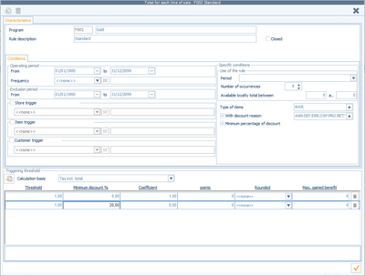

These options limit the accessibility of points, according to the salesperson’s discounts only.

If sales conditions or final selling price discounts (FSP) are applied subsequently, these options will not be used. Loyalty is calculated based on a coefficient without taking these option into account.

Example based on the screenshot below:

| Gross amount | Salesperson discount | Net amount | SC/FSP discount | Points earned |
| --- | --- | --- | --- | --- |
| 100 | 10% | 90 |  | 90 |
| 100 | 20% | 80 |  | 0 |
| 100 |  | 100 | 20% | 80 |
| 100 | 10% | 90 | 50% | 45 |

#### Campaign Management

Loyalty Campaign - Overview

A campaign is defined via Campaigns module (available in Sales > Loyalty.) A loyalty campaign is composed of several programs. The campaign includes the list of the stores that use the campaign. Note that a program must always be associated with a campaign to work.

Description of the tabs in loyalty campaign records

Back Office > Sales > Loyalty > Campaigns

Characteristics tab

You will define the characteristics of the loyalty campaign:
- Code and description, currency or multicurrency
- List of available programs: You have access to available programs that are not closed and not associated with a campaign; they have the same currency or currencies than the campaign.
- List of associated programs: List of the programs contained in the campaign, sorted from the less attractive to the most attractive. You can associate several programs with the same campaign. You can access the settings of the program by means of the [...] button accessible when you click the description field. Note that the order specified cannot be changed if there are renewal or program change rules.
- You choose to start with the first program in the list (option “Start with first program”.)
- When changing for another program, you can leave the choice to the customer, if you select the option Program change: Select program . Otherwise, the change is performed automatically.

Stores tab

This tab allows you to assign one or more stores to a campaign. The system proposes only the stores that share the same currency as the campaign and that are not associated with another program. A store can only ever be associated with one loyalty campaign.

Renewal options tab

Card renewal is supported on option. This renewal allows you, from a maintenance threshold, either to close the card, or to continue with the same program, or to downgrade to another program. The renewal rules are presented in an array:
- The lines correspond to the programs actually used by loyalty cards.
- The columns correspond to the programs to which cards can be downgraded.

At transition of the current program to the future program, you can access the renewal screen proposing one or more renewal rules. If no rule was entered, the following message displays “Renewal not scheduled” If at least one rule exists, the following message is displayed “Actives rules: X” (X being the number of rules.) Only the threshold to keep up with the same program or the downgrade are possible for the renewal.

Please note!

If no rule is defined or active, the renewal of loyalty cards for this program is not supported. At the end of its validity period, the card will be closed.

Example: If a campaign defines the following program order: Program A, followed by Program B and then Program C. The renewal screen displays:

|  | Program C | Program B | Program A |
| --- | --- | --- | --- |
| Program A |  |  | Active rules: 1 |
| Program B |  | Renewal not scheduled | Active rules: 1 |
| Program C | Active rules: 1 | Renewal not scheduled | Active rules: 1 |

The renewal rules determine in particular:
- The threshold to keep up with the program
- The calculation basis: Gained total, available total, gained total over the validity period of the card. Total purchases since a certain date, total purchases over a period (options available only with V3 loyalty and only if there are no non-closed stores configured with V2 loyalty.)
- Applicable to one or more stores
- Applicable to such and such customers or customer groups
- Possibility to define an application period or an exclusion period

You can also manage the card renewal in real or simulation mode (see Scheduled renewal hereafter) for a set of customers.

Options for program change tab

You will manage the conditions of a program change for loyalty cards. Upon the program change, you have different options:
- You can create a new loyalty card for the new program or keep the old one.
- The activation date of the card can be set to the program change date to extend customer loyalty, or you can keep the initial date.
- Extend the validity period of the card by recalculating the end of validity date from the date of the program change.

The Use of rules for program change option gives access to the entry of rules.

The Loyalty acquisition on program change option enables you to enter the acquisition made by the customer upon the program change in number of points or in amount.

At transition of the current program to the future program, you can access the Program change screen proposing one or more applicable rules. The program change rules are presented in an array:
- The lines correspond to the programs actually used by loyalty cards. The list contains only programs for which an upgrade is possible.
- The columns correspond to the programs to which cards can evolve. The list proposes the programs available from a specific program.

Example: From the example of the renewal for the campaign in question, the Program change screen displays the following:

|  | Program B | Program C |
| --- | --- | --- |
| Program A | Program change | Active rules: 1 | Active rules: 1 |
| Acquisition (1) | Gained value: 100 | Gained value: 500 |
| Program B | Program change |  | Non scheduled change |
| Acquisition (1) |  | Gained value: 0 |

(1) Display if the Loyalty acquisition on program change option is ticked.

With the program change rules, you can determine:
- The triggering threshold of the rule
- The calculation mode in currency or currencies excepted
- The calculation basis: currencies excepted: on available total, on earned total, on number of visits, on earned total over a period, by combining totals and number of visits, etc. in currency: on purchased total over a period, on tax exclusive or inclusive amount of the sales receipt to take into account, etc.
- According to the calculation basis, you will enter thresholds.
- Limit the application to one or more stores
- Take into account such and such customers or customer groups
- Define the application scope to specific items or item groups
- Possibility to define an application period or an exclusion period

Additions tab

You will manage rewritable cards. Note that the validation of these cards is available for a specific template.

Management rules

A loyalty program can only ever be associated with one loyalty campaign. A campaign groups together one or more loyalty programs.

Scheduled renewal

Back Office > Sales > Loyalty > Renewal of cards

In order to manage your loyalty cards, you can perform a mass renewal. Using the Calculation of the renewal command, you will select the cards for which you want to perform the renewal. The simulation is aimed at calculating for each card the renewal and viewing the result using the Query command. For each card, the query feature displays: the new program, the renewal status, the new earned total, the new available total, and the new end of validity date. Other information is recovered too: the old program, the earned total and the available total. All these operations can be scheduled via scheduled tasks.

Warning!

Only one simulation is available per loyalty program or loyalty campaign. Starting a new simulation erases the former results.

#### Loyalty Settings

Loyalty Settings

Activation

Back Office > Administration > Company > Serialization > Activation of modules

Tick the Loyalty option in Customer Relationship Management to activate loyalty.

Company Settings

From the company Settings WebApp

Go to the Commercial Management > CRM and manage the settings described here .

described here

Register settings

Back Office > Settings > Front Office > Register

Front Office > Settings > Registers > Registers

Management of the touchpad

The touchpad can be enhanced with buttons relating to loyalty. Open the record of the register to modify and click the [Configure touch screen and keyboard] button.

In the Button type field, select Function to display the screen below

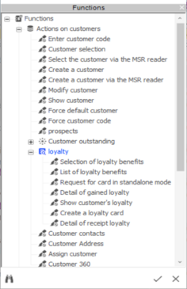
- Selection of loyalty benefits: to get loyalty benefits without making purchases, just press this button on the touchpad once the customer has been identified.
- List of loyalty benefits: displays the list of available benefits.
- Request for card in standalone mode: enter the loyalty card number in standalone mode.
- Detail of gained loyalty: displays the earned loyalty total distributed by period.
- Show customer loyalty: allows you to open a window containing information about the customer's loyalty card.
- Create a loyalty card: allows you to create a card on request, if authorized by the corresponding card creation settings.
- Detail of receipt loyalty: displays loyalty earned for the document.

For further information about configuring register buttons, click here .

click here

Management of merchandise returns

Within loyalty management, and in order to associate the item return with the customer, it is advisable to check the Recover customer of the return option in the Register settings (Management tab).

Loyalty receipts

Standard receipt templates are provided with the application: Loyalty summary, Loyalty summary - narrow, Detailed loyalty summary, and Detailed loyalty summary - narrow. The template to use can be selected in the register settings in the Receipt (continued) tab. If you select a template, the loyalty summary receipt is printed automatically after the sales receipt has been printed, provided this sales receipt resulted in the generation of loyalty.

Information displayed on the customer banner

Information relating to customer loyalty is available on the informational task bar on the top and at the center of the sales transaction entry screen:
- Header: Loyalty total / End of validity of the loyalty card / Loyalty status
- Sale: Loyalty total / End of validity of the loyalty card / Loyalty status / Loyalty card number.
- Payment: Loyalty total / Loyalty card number

Import

When an external tool is used for loyalty, the import feature allows you to integrate loyalty cards and perform the relevant updates. The import will be performed:
- For loyalty cards: creation, update of information, closure, program change, update of dates for the cards, etc.
- For loyalty lines: the import can be performed, but must comply with specific rules and will be assessed and used if appropriate.

Importing receipt lines

When importing sales receipt lines, the $$_MAJFIDELITE field takes into account V2 loyalty and applies the acquisition rules of the program.

In this type of import, loyalty calculation (subject to field $$_MAJFIDELITE) is done in a basic way. All discounts granted by the external software are combined into one single line discount; it is therefore not possible to guarantee that the number of points earned during the import is identical to that of the receipt entered in Y2.

This will rarely be the case, considering that the functions available in the loyalty engine (line discount, total invoice discount, discount based on reasons, card creation, birthday, etc.)

The best solution is not to try to recalculate the number of points with Y2, but to transmit the number of points calculated by the third-party software.

Note, as this is a line discount, it follows the principles of line discounts, considering the discount percentage and discount reason.

#### Loyalty Card

Loyalty Card

Back Office > Basic data > Customers > Customers

To access the customer's loyalty card details, click this button and select the [Loyalty card] option.

Information

A loyalty card can be a physical medium or not. It includes in particular the following information:
- About the customer: Customer’s Last- and First names
- About the card: The program associated with the card, the currency, the card number and the type of the card (first assignment, extension, renewal.)
- About dates: Start and end of validity dates, date of the customer’s last visit, activation date of the card and its closing date.
- About aggregates: Gained, Available and Renewal values (the detail of loyalty totals displays the distribution over periods,) and the number of visits.
- Information messages are displayed for benefits of type Welcome, Birthday and Sales receipt.

Query

A loyalty card can be viewed from:
- The customer record
- The touchpad in the sales transaction entry screen, by clicking a button on the touchpad or using the appropriate menu.

Actions

In the loyalty card, the following actions are available:
- Adjust loyalty (higher or lower)
- Extend the validity date of the card
- Renew a card or simulate its renewal
- Change the program
- View the list of benefits
- Get the available benefit
- Close the card
- Issue a new validity card
- …

Miscellaneous

A customer can only have one active card per store. A customer can have several loyalty cards for different stores A loyalty card is always linked to just one loyalty program.

#### Access Rights

Access Right Management

Back Office > Administration > Users and access > Access right management

You must decide which of the following access rights and options should be applied in order to grant or deny access to the relevant customer loyalty functions.

Loyalty card

You can limit the actions to perform on a loyalty card in:

Menu Concepts (26) > Commercial management > CRM
- Close loyalty cards
- Change loyalty program
- Reissuing of loyalty cards
- Modification of the end of validity date for loyalty cards
- Card extension: Allocation of an amount
- Manual renewal of a card
- Manual renewal of a card: allocation of an amount
- Ignore mandatory reading of the card

Sales receipts

You can limit actions to be performed on loyalty cards when you enter a sales transaction in the Front Office.

Menu Sales receipts (107) > Access rights > Miscellaneous
- Correct loyalty total
- Create a loyalty card
- Adjustment of loyalty total limited to threshold 1... threshold 2... threshold 3

Loyalty management

You will manage access to loyalty settings, loyalty card management, and management of gift certificates handled by Headquarters.

Menu Sales (102) > Loyalty
- Campaigns
- Loyalty programs
- Query cards
- Generate gift certificates
- Reprint gift certificates

Menu Customers (109) > Settings > Loyalty

Note that this menu only displays programs in read-only mode.

Loyalty gift certificate

Access to loyalty gift certificates is managed via the following menus:

Menu Sales (102) > Retail sales
- Outstanding payments/Loyalty gift certificates
- Non-active payments/Loyalty gift certificates

Menu Sales receipts (107) > Sales
- Outstanding payments/Loyalty gift certificates
- Non-active payments/Loyalty gift certificates

Printing templates

Settings for printing templates of gift certificates will be handled in Menu Settings (112 ) > Printing templates > Vouchers > Loyalty certificates

Use of gift certificates

You can limit the use of loyalty gift certificates when you enter a sales transaction in the Front Office using the following menu:

Menu Sales receipts (107) > Access rights
- Payment methods > Loyalty payment
- Register operations > Acquisition of loyalty gift certificate

Loyalty migration

V1-V2 loyalty migration will be managed using Menu Administration (106) > Maintenance> V1-V2 loyalty migration.

#### Standalone Mode

Loyal Customers in Standalone Mode

Loyalty functionalities (acquisition calculations, benefit proposals, card renewal, or program change) are not available in standalone mode.

Loyalty points earned on sales receipts entered in standalone mode will be calculated during receipt integration.

Loyalty card management in standalone mode

Creation of a loyalty card

In standalone mode, no card creation will be proposed. The loyalty card will be created when sales transactions (receipts) are reintegrated; according to the program options defined.

Renewal of a loyalty card

The renewal of a loyalty card occurs either at the end of the official validity period of the loyalty card (i.e. When the expiry date of the card is exceeded), or when purchasing a new loyalty card (this new card replaces the old one, and validity dates are updated consequently.)

Setting aside a loyalty card number

Back Office > Settings > Front Office > Register

Front Office > Settings > Registers > Register

In standalone mode, you can set aside a card number to be allocated to a new loyalty card (creation and renewal.)

No setup is required, but for a more user-friendly use, you can set a [Request for card in standalone mode] button on the register touchpad. To create this button, follow the instructions described in the Configuring Touch Screen and Keyboard topic. As you know, you will select Function for the Type of button , and then Request for card in standalone mode for the Function field.

Configuring Touch Screen and Keyboard

At checkout, on a manual action from the salesperson, a window is displayed so that the operator can then enter the number of the loyalty card. This number will be saved to the sales receipt, and will be used later by loyalty processes when reintegrating the receipt. Upon integration, loyalty rules will apply according to several possible cases:
- This number will be taken into account if the card must be created or renewed. The salesperson does not have to enter the number, as the reserved number will be used.
- If the number was reserved by mistake: this number does not affect the integration of the receipt, and, the card associated with the number remains available for another customer. Information is inserted into the event log to track these errors and alert the users. This information is independent from the reintegration trace of the receipt.
- If no number was reserved, the current operating mode for the creation of the renewal of the card will apply: the entry of a number will be required.
- If there is already a loyalty card, with a number entered in standalone mode, a trace will be added to the event log, and the application displays again a message for the creation of the card and the entry of the number.

Please note!

None of the loyalty settings will be exported in standalone mode; this card creation or renewal remains without control.

Loyalty price lists in standalone mode

Cegid Retail Y2 proposes the application of the loyalty prices to owners of a loyalty card. The appropriate setting is defined in the store record.

The calculation of price list aggregates includes the calculation of loyalty prices and makes them available in standalone mode (see Managing Items in Standalone Mode .)

Managing Items in Standalone Mode

When customers are exported, the search priority is focused on the loyalty card number, and this is essential to determine if the customer is loyal.

On the register, the following cases may occur in standalone mode:
- With customer export and customer search priorities including loyalty cards, loyalty prices are automatically proposed to loyal customers.
- Without customer export and customer search priorities including loyalty cards: For stores applying loyalty prices, Cegid Retail Y2 asks the operator if the customer is loyal to apply the loyalty price. This is then traced in the event log.
- Unknown customers: Cegid Retail Y2 also asks the operator if the customer is loyal to apply this special price.

## Customer Services

### Customer Services Management

#### Contents

Customer Services - Contents

The “After Sales Services” module is available in Front Office and Back Office. Its purpose is to track alterations, repairs, warranty, verification, etc.

Preamble
- Introduction to customer services and their different steps

Required settings
- General settings
- Additional settings

Customer service process
- Customer service input
- Focus on customer service records
- Customer service operations (Customer Service operations to be sent, Quotation requests, Follow-up, clearing, and closing operations)

Internal workshops
- Activating internal workshop management
- Customer service records: Status

Customer service defect qualification
- Overview
- Implementation and operation

Managing quantities
- Settings
- Use

Inventory movements and customer service operations
- Implementation
- Use in customer service records
- Document types

Other functions related to Customer Services
- Managing user fields in customer services
- Managing workshop coefficients
- Dashboard for customer services
- Customer service approval
- Price lock
- Import/export of customer services

#### Introduction to Customer Services and their Different Steps

Introduction to Customer Services and their Different Steps

Introduction to Customer Services

The “After Sales Services” module is available in Front Office and Back Office. Its purpose is to track alterations, repairs, warranty, verification, etc.

For example, a customer brings an item needing repair to the store whether it has been sold in this store or not. It is important to do the following:
- Carefully describe the object (for refund in case of loss).
- Explain what is wrong if the item is defective, or describe the operations to be completed, possibly with an estimate.

You will then have to follow up on completion of these operations, subcontracting them to an off-site repair shop.

The “After Sales Services“ module allows you to track these steps right up to delivery of the repaired merchandise to the customer.

This module is optional module and must therefore be serialized through Administration > Serialization > Activation of modules ( After Sales Services module.)

Activation in company settings will make options available and set them up. For example, they could involve managing internal workshops or managing qualification, by default.

Customer Services - Step Recap

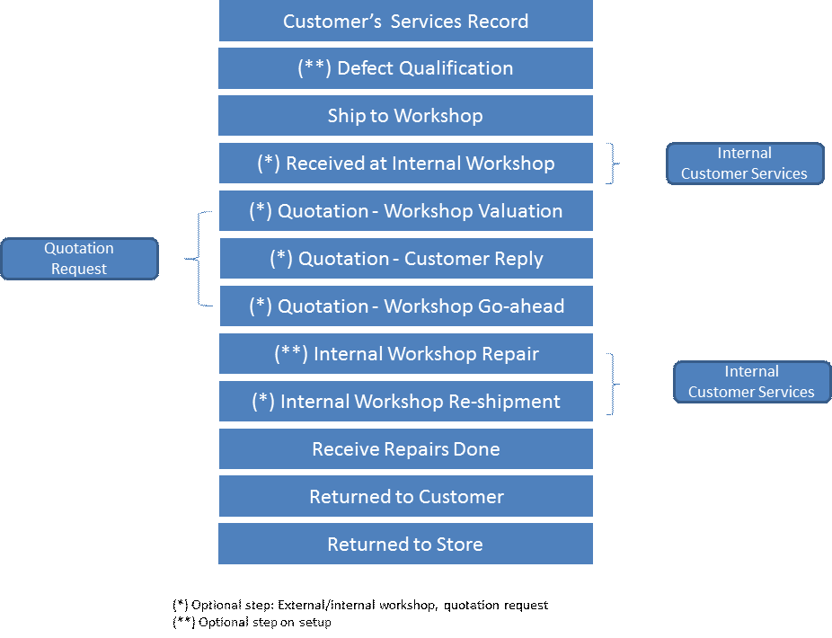

#### Preliminary Settings

##### General Settings for Customer Services

General Settings for Customer Services

Defining company settings

Back Office > Administration > Company > Company settings

Go to Commercial management > Customer services

The options described in this section enable you to activate the customer service function and set the default options.

Configuring sites

Store record

Back Office > Basic data > Stores > Stores

Open the store record you wish, and check the Customer services management option in the Contact information tab, and populate the related settings ( described here ).

described here

Warehouse record

Back Office > Basic data > Stores > Warehouses

You can create a warehouse of type Customer service warehouse. This type depends on the use of the Customer service module. This type of warehouse enables you to trigger specific processing related to the Customer services module, and differentiate inventory when taking inventories, if necessary.

The Managed in WMS option is available at the bottom of the Warehouse record. It facilitates exchanges between Cegid Retail Y2 and an external logistics system or customer services. This option puts conditions on the document type generated from customer service records (draft or not). These types of generated documents can be set in the Customer Services Company Settings .

When linking a warehouse to a store:
- If the store does not manage customer services and the warehouse is of type customer services, the link will not be made.
- If the store is linked to a customer service warehouse, you cannot uncheck customer services management in the store.

Configuring suppliers

Back Office > Basic data > Suppliers > Suppliers

Select a supplier record, go to the Addition tab and enter the information described here , and then validate.

information described here

Note that the Standard tab in the multi-criteria window will propose the customer service option. This will display a list of suppliers appearing in the Customer Services module.

It includes internal workshops as well as external workshops (subcontractors). These suppliers (or workshops) will then be used for services settings and for associating workshops.

Configuring services

Back Office > Basic data > Items > Services

The services entered must be typed to be used for customer services operations. To do this, check the Alterations/Customer service option in the desired Service record.

This will create a new tab called Additions . You can then enter the supplier and deposit amount percentage.

Select the type of service in the Characteristics tab to vary the behavior of the service according to customer responses:
- Handling fee: This line type will be billed to the customer if the quotation is rejected.
- Shipping costs: This line type is automatically billed to the customer.
- Service: This line type will be billed to the customer if the quotation is accepted.

Managing access rights for customer services

Back Office > Administration > Users and access > Access right management

Activate the following access rights for the user groups of your choice.

| Menu | Sub-menu/Option | Description |
| --- | --- | --- |
| Menu Data Exchange (1) | Data export/Export customer service records | Authorize or prohibit the export of customer service records. |
| Menu Concepts (26) | Commercial management/Cust. Service management | Several authorizations related to customer service management may be granted (creation, quotation management, closing, etc.) |
| Menu Sales (102) | Customer services and Internal workshop customer services | You may grant authorization to use these 2 menus. |
| Menu Settings (105) | Customer services | Authorize or prohibit the use of configuration functions for customer services in the Back Office. |
| Menu Customers (109) | Customer services | Authorize or prohibit the use of customer service functions in Front Office. |

##### Additional Settings for Customer Services

Additional Settings for Customer Services

Back Office > Settings > Customer services

This section lists the various complementary settings for customer services.

The commands below are used to complete the configuration of the Customer Services:
- Customer service warranty : This option enables you to create accepted warranty types (i.e., Manufacturer’s warranty, extended guarantee.)
- Type of Customer service : This option enables you to create a list of customer service types. These services will be available in the Status/Services tab in Customer Services. It enables you to classify services.
- Customer agreement type : This menu allows you to define the different methods customers can accept quotations (e.g., by mail, telephone, e-mail, visit, etc.)
- Customer information type : This menu allows you to define the different methods by which the customer can be informed about a quotation (e.g., by mail, telephone, e-mail, in store, etc.)
- Customer refusal type : This menu allows you to define the different reasons why a customer may reject a quotation (e.g., Estimate too high, made too late, changed mind, etc.)
- Litigation : This menu allows you to create the types of dispute that can exist with the workshop (e.g., Preparation not done, object damaged, late, etc.).
- Link stores - workshops : Is used to associate stores to customer services workshops. The workshops are actually suppliers whose customer services box has been checked in the Additions tab in their record. A “primary” type workshop may be set for each store. It will be proposed as the default workshop when creating customer services records.

This button enables you to change the status of workshop status (primary or not), without opening the record. Select the workshop to modify, then click this button : status changed.

- User-defined field titles & User-defined tables : There are 10 user-defined tables and 10 checkboxes provided to allow you indicate the status of an item that has been sent for repair. They are fully customizable. In the case of user-defined tables, once the name of the table has been specified, you need to specify the different values for each table.
- Field settings : This feature allows you to determine the fields to be displayed in customer service records. Click here for further information.
- Customer Service Reports and Customer Service Receipts : These commands enable you to change the various reports and receipts managed in customer services via the report generator.

Reminder about Customer service settings and receipt printouts: The various customer service receipt printouts are managed in the Services tab in the register settings (Settings > Front Office > Register). Select the format, template and the number of copies desired for each Customer Service receipt.
- User fields : This feature is described here .
- Applications rules for workshop coefficients : This feature is described here .

#### Customer Service Process

##### Customer Service Input

Customer Service Input

Front Office > Customers > Customer services > Customer service input

Front Office > Sales transaction entry window, [Customer services/Cust. services] button. Note that each customer service action can also be assigned to a touch pad button, making it easier to access and use this function.

Back Office > Sales > Customers services > Customer service records

Header

The following information can be entered in the record header, relating to the store, customer, and workshop (by default the primary workshop linked to the store will be used.) You can change customer fields and store fields until the customer service operation has been sent. Phone numbers and e-mail addresses (for customer and workshop) are included here, making it easier for you to access this information and contact them quickly.

Description tab

This tab allows you to specify the characteristics of the item by retrieving an existing item from the database, or by entering all of the item’s characteristics:
- The description allows you to describe the item, if it is not already included in the database.
- The price and the date of sale are provided for information purposes.
- The quantity (see Managing Quantities .)
- References: They may match references issued from a system other than Cegid Retail Y2. Three reference types are authorized: Initial, External and Follow-up
- If the Generate and link inventory movements and customer service records option is activated for the store, a list of documents relating to the Customer service module will be displayed (see Defining Company Settings for Customer Services ).
- The serial number may be entered, if necessary.

Detailed description tab

There are two fields provided for entering repair descriptions: Description 1 and Description 2. User-defined fields (fields and user-defined tables) configured for customer services may be entered in this tab (see Configuring Customer Services , section User-defined field titles & User-defined tables).

Configuring Customer Services

Qualification/Services tab

This tab enables you to enter detailed information in the chart below. The service will concern either an item under warranty or an item requiring an estimate for a customer service operation. Consequently, only one of these 2 options can be checked.

| Fields | Description |
| --- | --- |
| Customer quotation | The customer service operation is subject to the customer's acceptance of the quotation. Or the item is under warranty (see following option), or the customer service operation will require an estimate. |
| Under warranty | Specifies whether the item is under warranty, as well as the corresponding warranty type. If this checkbox is selected, the configured Customer service warranty reason must be selected. |
| Expected delivery date | This field allows you enter the planned date when the repaired item is to be returned to the customer. |
| Services | This is where you enter customer service operations. The selling price valuation process will use the settings defined for the store's tax-inclusive selling prices. The Accepted column shows if the service was approved by the customer. When printing estimates, only approved services will be printed. The button allows you to search for the services to be added to a customer services record. To insert an additional service line. The services available are those associated with the workshop selected in the header of the customer service record. Allows you to delete a service line. |
| Reports or Receipts | This information allows you to select the print template to be used for the customer and workshop when reprinting documents from the customer service record via the “Print” button. These fields are not saved when the record is validated. |

Workshop follow-up tab

This field recaps the customer service steps completed so far, showing the date and the supplier that carried out the step.

Item user-defined fields

The user-defined tables and checkboxes are from the item record. When the customer service operation record is created, user-defined field and item information will be retrieved. Once populated, these fields are no longer linked to the fields in the item record and can be modified freely.

User fields tab

This tab is displayed if user fields have been enabled (see User Field Management .)

User Field Management

##### Customer Service Record

Customer Service Record

Front Office > Customers > Customer services > Customer service input

Back Office > Sales > Customers services > Customer service records

This topic lists the various actions that can be carried out on a customer service record

Entering comments in customer services records

If the Automatic update of event notepad setting is selected, the notepad to the right of the customer service record will contain the relevant follow-up history.

Validating customer service records

Once the customer service record has been validated, a customer service receipt will be printed, followed by a workshop receipt. If the customer contact information in the customer service record is different than the information in the customer record, a message will prompt you to apply the changes to the customer record.

Create a customer service record

This button is available only in the multicriteria screen of the List of customer services and enables you create new customer service records.

Duplicate of a customer service record

This button is active for workshop returns. Duplication is only possible for customer service records that have not been closed and have the following status:

- REA: Re-shipment to repair workshop done
- REI: Re-shipment to repair workshop not possible
- RDS: Repair without quotation
- RDA: Repair quotation accepted
- RDR: Refused repair quotation
- RDT: Repair returned
- RDI: Quotation not possible, customer contacted

When duplicating a customer service record, the original record can be closed.

Back to previous state

Enables you to cancel the last step, so that the customer service record returns to the previous state. This option is accessible if the Last step cancellation option is authorized.

View the Original customer service record

This button enables you to view the original customer service record for a duplicated customer service record.

Enter a comment in the notepad

This entry is controlled by the Entry of notepad is mandatory company setting. The following options are available: Mandatory, Optional, or Mandatory for customer services under warranty.

Create inventory movements

The option is available if inventory movement management with customer service records is activated (see Generate and Link Inventory Movements and Customer Services .)

Generate and Link Inventory Movements and Customer Services

##### Customer Service Operations

Customer Service Operations

Customer service operations to send

Front Office > Customers > Customer services > Customer service operations to send

Back Office > Sales > Customer services > Customer service to send

This option enables you to display the list of customer service operations not yet sent to a workshop.

Select the customer service operation using the space bar, then click the [Launch processing] button.

Using this button, you can also scan or select a customer service operation to be sent.

In the Customer service to send window, the Workshop shipping info field, for example, can be used to specify a carrier slip number. A shipping slip will be printed on validation.

Quotation requests

Front Office > Customers > Customer services

Back Office > Sales > Pricing > Customer services

The following steps have been added for estimate requests (see the Qualification/Services tab in the record of the entered customer service.)

Qualification/Services tab

Quotations - Valuation

When a store is informed of the amount of a repair for which a quotation was generated, you need only see the list of quotations still being evaluated. Selecting the customer service operation allows you to return to the customer service record in order to complete it. Two buttons enable you to go to the next step:
- Quotation valued
- Repair not possible

If the selling price is zero, the valuation is based on the purchase price with application of the relevant coefficients from the service provider (see Suppliers ).

Suppliers

The next step is to notify the customer using the [Call customer] button, which brings you directly to the Quotations – customer reply screen.

Since the selling price has already been communicated to the customer, it cannot be changed in this step.

Quotations – Customer reply

There are several possible steps involved in obtaining customer approval:
- Quotation accepted: the customer approves the repair. The Confirmed by field shows how customer approval was obtained.
- Customer informed: the customer has been informed of the amount of the repair and wishes to think it over. The Information medium field shows how the customer was informed.
- Quotation refused: the customer refuses the estimate. The Reason for refusal field specifies why the quotation was refused.

These three steps are handled on a single screen, and can be completed in a single operation, depending on company operations.

After specifying the methods used to notify customers, you can print the quotation or send it by e-mail.
- The [Send go-ahead] button will display the next step: the Workshop quotation go-ahead screen will open to continue the transaction.
- The [Send workshop go-ahead] button allows you to automatically send an e-mail with a .pdf file to the service provider.

Quotations - OK from workshop

This screen allows you to check all quotations for the purposes of informing the workshop that it can proceed with the repairs, or return the items involved. The [Send workshop go-ahead] button allows you to automatically send an e-mail with a .pdf file to the service provider. The .pdf file will be saved in the following default directory: C:\Users\userX\AppData\Local\Temp

Workshop returns

Front Office > Customers > Customer services > Workshop return

Back Office > Sales > Customer services > Workshop return

When the items are returned from the workshop, they must be checked one by one in order to verify that the repair meets standards. The following three options are available here:
- Repair done
- Repair not possible
- Item must go back to repair shop (repair does not meet standards, error, etc.)

It is also possible to question the price invoiced by the service provider by attaching a dispute (litigation) to each service line. In this case, the customer service department is initiator of the dispute and will inform accounting that the workshop should not be paid automatically.

Entry via barcode scan is also possible with the [Enter barcode] button in the multi-criteria screen.

Returned to customer

Front Office > Customers > Customer services > Returned to customer

Back Office > Sales > Customer services > Returned to customer

This screen displays the list of customer service operations to be returned to customers.

If the item is under warranty or cannot be repaired, this operation will enable you to close the customer service operation.

If services are to be billed, they will appear on the register screen and the customer will pay as usual.

Customer services references will appear in a comments line on the register screen. You can also print a customer return receipt.

Please note!

In Front Office, only customer services operations carried out in the store are usable. If not, a message is displayed informing you that it is forbidden to return a service that was entered in another store.

Follow-up and closing operations

Front Office > Customers > Customer services

Back Office > Sales > Pricing > Customer services

Customer service follow-up

This window is available in Front Office and enables you to view all customer service operations:
- Tabs describing the item, its status, and the services to be provided
- A follow-up tab showing the current customer service step
- A tab showing the accounting stage of the services

Close/Reopen a customer service operation

In case of loss or theft, or if a customer changes their mind, you may close a customer service operation, so that it is no longer included on the lists.

Closure of a customer service record

The quality of a repair may not be acceptable to a customer. In this case, the original customer service record may be closed out and a new one created. A new option in customer services records implements this operation by duplicating the existing record. When duplicating, closing out the original record will be proposed as an option.

#### Internal Workshops

Managing Internal Workshops

Additional steps are available in Back Office to manage receipt at the internal workshop, valuation of the quotation, description of the repair, and shipment back from the internal workshop.

Activating internal workshop management.

Back Office > Administration > Company > Company settings

Go to Commercial management > Customer services and populate the following company settings ( described here )

described here
- Internal workshop management
- Control when returning an item to the store
- Management of mass repair validations

Customer services records: Status

Delivery slips are created between the stores and the internal repair workshop. Received items can be scanned or entered in the repair workshop by scanning all the items received. A specific type of slip allows the barcodes to be displayed. The following steps have been added:

| Steps | Original status | Subsequent possible status |
| --- | --- | --- |
| Receiving | Internal workshop re-shipment RDS: Repair without quotation AVA: Price a quotation | RAM: Internal workshop receiving RAD: Receipt at internal workshop w/quote |
| Estimate amount | RAD: Receipt at internal workshop w/quote | CAA: Call customer CAI: repair not possible |
| Repair | RDA: Supplier informed - quotation accepted RAM: Receipt at internal workshop (if no quotation requested) | RIE: Internal repair done (re-shipment) RII: Internal repair not possible (re-shipment) |
| Re-shipment | RIE: Internal repair done RII: Internal repair not possible RDR: Refused repair quotation If the Management of mass repair validations option is selected, the following status are also available: RDA: Supplier informed - quotation accepted RAM: Receipt at internal workshop (if no quotation requested) | REA: Re-shipment to repair workshop done REI: Re-shipment to repair workshop not possible |

#### Customer Service Defect Qualification

Customer Service Defect Qualification

Back Office > Sales > Customer services > Defect identification

Front Office > Customers > Customer services > Defect identification

Presentation

This step allows you to determine the follow-up steps that are to be carried out for the customer service record before it is shipped.

Open the desired Customer service record > Qualification/Services tab.

The Defect identification field allows you to characterize the outcome before shipping the item for repair. It allows you to complete the following:
- Enter more detailed information in customer service record
- Transfer items to another customer service warehouse or send items back to suppliers (for internal customer service)
- Define the repair workshop
- Specify whether a quotation request is to be managed
- Determine if the item can be repaired, then give the green light to the warehouse.

Implementation

To set up this management, the Defect identification company setting must enabled beforehand (see General Settings .)

General Settings

Operation

This step is available in Back and Front Office. It enables you to determine customer service outcomes. The list of defect identification cannot be customized. The selections are as follows:
- To qualify: The customer service record has been created but no one has made a decision yet on whether the defect can be repaired.
- Item repairable: The item will be sent to a repair shop (choices: repair shop, estimate or under warranty).
- After this step, the customer service record is available in the customer service records to be sent to the workshop.
- Item not repairable: The item cannot be repaired.

Qualification management adds the next step:

| Step | Original status | Subsequent possible status |
| --- | --- | --- |
| Qualification | QUA: To be qualified | INI (repairable item) QRI (non-repairable item) |

#### Managing Quantities

Managing Quantities

Quantities are managed in the customer service record based on the options defined for each store.

Settings

Activating quantity management

Back Office > Administration > Company > Company settings

Go to Commercial Management > Customer Services, then check Manage quantities in customer service records .

Activating store management

Back Office > Basic data > Stores > Stores

This is done in the Contact information tab in the Store record, by checking the Manage quantities in customer services records option. When quantity management has been enabled in company settings, the Manage single customer service record for the line option will be activated with the following options:

| Options | Subsequent possible status |
| --- | --- |
| Yes | A customer service record will be automatically created for each document line. Example: An inventory movement line consisting of X items will result in the creation of just one customer service record with a quantity of X. |
| No | A customer service record will be automatically created for each document item. Example: An inventory movement line consisting of X items will result in the creation of X customer service records. |
| On request | Whenever a document line contains a quantity greater than 1, the following prompt will be displayed: “Do you want to create a customer record for each item moved?” If YES, X customer service records will be created. If NO, only one customer service record with quantity X will be created. |

Use

This setting adds a new field to customer service records.

In the Description tab of the customer service record, the Quantity field appears next to the Date of sale and Selling price fields.

This quantity will then be copied to documents from a customer service record.

Remainders are not managed, and the items must not be dissociated.

If the Management of inventory movements and customer services option is activated, the management of the quantities in the customer service record will be taken into account (see Managing Inventory Movements and Customer Service Operations ).

Managing Inventory Movements and Customer Service Operations

#### Inventory Movements and Customer Service Operations

Managing Inventory Movements and Customer Service Operations

Customer service management enables you to associate customer service records to inventory movements. This allows more control in finding repair items. This function allows you to generate inventory movements for the warehouses so that you can track the progress of the customer service operations resulting from a quality control check as well as follow up on the inventory situation for items in the customer service record.

Warehouses must be defined as customer service warehouses (see Configuring Sites ) and the inventory movements resulting from the documents allow you to track internal customer service operations (exchanges between store and quality department, shipments from quality department to customer service workshop, etc.)

Configuring Sites

Implementation

Activating inventory movement management

Back Office > Administration > Company > Company settings

Go to Commercial Management > Customer Services, then check Generate and link inventory movements and customer service records . The following fields must be must be populated for the warehouses of type Customer services and warehouses of type Customer services managed in a WMS. It enables you to determine the types for documents generated from customer service records.

Activating the appropriate management options by store

Back Office > Basic data > Stores > Stores

Go to the Contact information tab in the Store record and check the Generate and link inventory movements and customer service records option. Make sure the Associated customer field in the Third-party tab is filled in.

Activating the appropriate management options by warehouse

Back Office > Basic data > Stores > Warehouses

This setup conditions the type of document generated from customer service records. For warehouses, the Customer services warehouse type allows you to define specific warehouses for the Customer services.

The Managed in a WMS (Warehouse Management System) option indicates that the warehouse is being managed in system outside Cegid Retail Y2 (external logistics or customer service system).

The created warehouse must be associated to the store in the Stores record, in the Linked warehouses tab.

Use in customer service records

Back Office > Sales > Customers services > Customer service records

Create stock movements in customer service records using the [Stock movement] button:
- Transfer the item to another warehouse
- Return the item to a supplier
- Place the item into stock
- Withdraw the item from stock.

This function is accessible for customer service records that corresponds to the customer associated with the store of the customer service record (Third-party tab in Store record.)

The type of the document generated is determined by the options defined for the company setting Generate and link inventory movements and customer service records , based on whether the warehouse of type “Customer services” is managed in a WMS.

The selected warehouse determines the type of document to be generated. For transfers, the sender warehouse is used as the reference for the document type.

Enter all required information in the Inventory movement window.

The following comment line is included on the first line of the document: Document generated from customer service record no. XXXXXXX on DD/MM/YYYY.

The document internal reference uses the external reference in the customer service record.

Document types

Depending on the document type, you may generate customer service records when validating the document. This function is available for the following document types:
- Supplier returns and Supplier return drafts
- Sent transfer, Transfer request and Transfer Draft
- Special inputs, Special outputs, Special input drafts and Special output drafts.

If the Manage quantities in customer service records option is activated, the creation of the customer service record will depend on line quantities and on the option selected for Handle one customer service record for the line (see Managing Quantities ).

Managing Quantities

The creation of customer service records is optional and may be done as follows:
- By validating the document
- By modifying the document, if there are no customer service records associated with the document, using the [Additional actions/Customer service record] button.

#### Other Functions Related to Customer Services

Other Functions Related to Customer Services

Managing user fields in customer services

Activating user field management

Back Office > Administration > Company > Company settings

Go to Commercial management/Default settings, and check User fields setting and validate.

Configuring user fields

Back Office > Settings > Customer services > User fields

For more information on user field settings, please see the following topic: User Fields .

User Fields

Creating and using user fields

Back Office > Sales > Customer services > Customer service records

The User fields tab in customer service records contains the configured fields. You can populate these fields freely. These fields can also be populated via the [User fields/Customer services] button available for certain commands. The user fields are available under the selection criteria in the Customers services user fields tab.

Managing workshop coefficients

Coefficients may be defined by supplier (refer to the supplier record, Addition tab ); however, you can enable a more exhaustive management of purchase/sale coefficients in the customer services module. These coefficients are defined from application rules depending on stores and items.

Addition tab

Enabling coefficient management

Back Office > Administration> Company > Company settings > Commercial management

Go to Customer services and tick the Management of coefficients by store and by item company setting (refer to Company Settings - Customer Services .) This setting is not enabled by default; the coefficient used is the one stored at the level of the workshop record, i.e. in the record of the supplier who makes the repair.

Company Settings - Customer Services

If enabled, this company setting gives you access to the command that determines the application rules for purchase/sale coefficients.

Note that coefficient management by subsidiary is not supported.

Type settings

Back Office > Settings > Customer services > Types

Rules types can be defined from this command or directly via the command described hereafter.

Application rules for workshop coefficients

Back Office > Settings > Customer services > Application rules for workshop coefficients

Coefficients are defined from application rules based on store and item triggers (Settings > General) and the supplier record.

As for transfer price rules, each rule has a priority level defined by the user; the first applicable rule is selected. Rules are applied from priority 1 to x. If no rule can be applied, the coefficient stored in the workshop record will be used by default and applied automatically.

The Workshop coefficient field defines a coefficient by workshop in this module.

This management feature is implemented in the current creation of customer service records. Depending on the company setting, the selling price is calculated from the coefficient of the workshop record or from the coefficient matching the rules.

Dashboard for customer services

Back Office > Sales > Customer services > Dashboard

Customer service records

This dashboard displays information from customer service record headers.

Customer service operations

This dashboard displays information from headers and lines. Fields concerning services and customer services lines, especially purchase and selling prices for service lines (fields: MSI_PRIXACHAT, MSI_PRIXVENTE in the MSAVLIG table).

A selection criterion enables you to take approved services into account (MSI_DEVISACCEPTE field).

Please note!

You will need to take into account only the services approved for margin calculations.

Customer service approval

Back Office > Sales > Customer services > Accounting

Customer repairs in dispute must be approved for accounting.

Price lock

Three pieces of information in the customer service record show if prices have been changed. This information is initialized to keep the current function (purchase price change, but not selling price). These fields can be supplied or modified with data from the import module only. The Modify the price of services concept enables certain users to change prices.

Import/Export

For more information, see topic Imports and Exports of Customer Service Data .

Imports and Exports of Customer Service Data

### Imports and Exports of Customer Services

#### Contents

Imports and Exports of Customer Services

Data exports can be used to allow the Cegid Retail Y2 application interface with other systems. Cegid Retail Y2 enables the following types of data exports:
- Export lists: Some reports can be exported directly. You can do this by simply selecting the Export list option on the Page layout tab of the report in question. The report must be exportable in its current format. Examples: Top-selling items, cash book, sales summaries, etc.
- Direct export to Microsoft Excel: All lists with the [Export list] button can be exported to Microsoft Excel with a simple click. This applies to the screens used for viewing documents and third-party lists, for example, and to all multiple criteria selection screens in general.
- A specific export module that allows you to export a whole range of data, such as the customer service records described in this section.

Data imports can be used to allow the Cegid Retail Y2 application interface with other systems. It can be used for example to import into the application, items with their respective settings (categories, dimensions, suppliers etc.) documents, inventory, customers, price lists, etc.

Each of this data type has its own default import format, as detailed in this topic.

Click here for further information about data exchanges.

Click here
- Required settings
- Exporting customer service records
- Importing customer service records

#### Required Settings for Importing/Exporting Customer Services

Required Settings for Importing/Exporting Customer Services

Serialization

Back Office > Administration > Company > Serialization > Activation of modules

The Foundation Integration Management module must be serialized and validated before you can use this feature.

Access rights

Back Office > Administration > Users and access > Access right management

Select the Data exchanges (1) menu and enable access rights for the user groups you want.

#### Exporting Customer Service Records

Exporting Customer Service Records

Back Office > Data exchanges > Data export > Export Customer service records

Fields of tables ETABLISS (Stores), ARTICLE (Items), MSAVLIG (Services linked to the customer service records), MSAVENT (Customers service operations) and TIERS (Third-parties) are available/

An export option available in the Status tab allows the export of record headings only.

There is also a number of specific fields available, identified by a $$ prefix. To display them when defining the settings of the export code (see the Settings tab), and specify $$ in the Filter field.

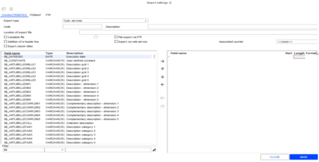

#### Importing Customer Service Records

Importing Customer Service Records

Back Office > Data exchanges > Data recovery > Data import

Preamble

The import wizard allows you to retrieve customer service records.

Given the structure of these documents, settings are based on the MSAVENT table and use a number of specific $$_ fields to populate the MSAVLIG table. This table should never be populated directly using the import wizard.

MSAVENT

MSAVLIG

It is possible to create records, and there are several modification options available. Controls about the mandatory character of data, existence and consistency checks are performed based on the information provided in the import file. Due to the complexity of operation of the customer service process, changes on the records are possible, but limited and supervised. These changes depend on the $$_MAJPARTIELLE field:
- Update of references
- Workshop valuation quotation -Supersede service
- Quotations - Customer's reply
- Workshop Go-ahead
- Workshop repair done - Update service
- Workshop repair not possible
- Repair done - Workshop re-shipment - Update service
- Re-shipment to repair workshop not possible
- Repair done - Workshop re-shipment - Supersede service

Note that the quotation purchase price, the final purchase price and the selling price may be non-modifiable after import, if this request is specified at the time of the import.

The import format has been deliberately restricted. The following fields allow you to define the key:
- Customer service no.
- External reference of customer service: Mandatory , if the customer service number is not entered, as this field is essential for identifying the record.

Two lines belonging to the same customer service record must be consecutive and must have the same ID. In creation mode, it is possible to create only the header of a customer service record without service lines. These lines must be added later during modifications allowing you to supersede services.

Note that it is also possible to create a customer service record without service ($$_MAJPARTIELLE is not populated then.) There are finally two solutions to add services:
- Manual entry
- Import for workshop valuation (($$_MAJPARTIELLE = 002), provided that the status of the record is “Quotation to value” or “Repair without quotation”. The existing lines are then canceled and replaced with those from the import file.

Creating customer service records

You will find below the list of available fields. Note that for certain fields, one of the identification methods is mandatory.

| List of available fields |
| --- |
| MSA_ETABLISSEMENT | Store of customer service operation |  |
| MSA_REFEXTERNE | External reference |  |
| MSA_REFSUIVI | Follow-up reference |  |
| MSA_REFINITIALE | Initial reference |  |
| MSA_TIERS | Customer code |  |
| MSA_TELEPHONE | Phone |  |
| MSA_TELEX | Phone no. 2 |  |
| MSA_EMAIL | E-mail |  |
| MSA_REPRESENTANT | Salesperson |  |
| MSA_FOURNISSEUR | Workshop |  |
| MSA_IDSERIE | Serial number |  |
| MSA_ARTAREPARE | Reference of the item to repair. Field MSA_ARTAREPARE corresponds to GA_ARTICLE. | Mandatory |
| $$_CODEDIMGPAO 1 to 5 | Dimension codes 1 to 5 for CAPM | Mandatory |
| $$_CODEBARRE | Barcode of the item to repair | Mandatory |
| MSA_PRIXACHATART | Item selling price |  |
| MSA_DATEACHAT | Sales date |  |
| MSA_GARANTIE | Under warranty |  |
| MSA_COUTGARANTIE | Cost of the warranty |  |
| MSA_MOTIFGARANTIE | Warranty reason |  |
| MSA_INFOTYPESAV | Type of customer services |  |
| MSA_DEVISDEMANDE | Quotation inquiry |  |
| MSA_DEVISFORCE | Forced quotation |  |
| MSA_DATELIVPREV | Expected delivery date |  |
| MSA_MOTIFIMP | Impossible repair reason |  |
| MSA_MOTIFSOL | Settled service reason |  |
| MSA_BOOLLIBRE 1 to A | User-defined decision 1 to 10 – Customer services |  |
| MSA_LIBREPR 1 à A | s User-defined table 1 to 10 - Customer services |  |
| MSA_LIBELLE | Description of the service. Please note: This description can be modified during the service, if the workshop makes changes for example. |  |
| MSA_DESCRIPTION1 and MSA_DESCRIPTION2 | In addition to MSA_LIBELLE, this field is used to enter the issue in other languages. |  |
| $$_PRESTATION | Cegid Retail Y2 item code for the service | Mandatory |
| $$_CODEBARREPRESTA | Barcode of the service item | Mandatory |
| $$_ACOMPTE | Deposit paid |  |
| $$_PRIXACHAT | Purchase price |  |
| $$_DEVISEPA | Purchase price currency (store currency by default) |  |
| $$_PRIXVENTE | Selling price |  |
| $$_DEVISEPV | Selling price currency (store currency by default) |  |

Since customer service records manage user fields, these are available in the import format via the $$_ fields in the list of available fields:
- $$_CHAMPUTILISATx (User field)
- $$_CHAMPVALEURx (Value of the user field)

If one of these two fields is shifted to the right in the import format, the associated second field will also be shifted to the right, and a number will be attributed to them:
- $$_CHAMPUTILISAT1
- $$_CHAMPVALEUR1
- $$_CHAMPUTILISAT2
- $$_CHAMPVALEUR2
- $$_CHAMPUTILISAT3
- $$_CHAMPVALEUR3
- ...

The user must specify the relevant user field for each $$_CHAMPUTILISATx field.

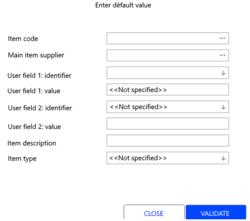

During import, the $$_CHAMPVALEURx field values are checked to ensure that they comply with all user field characteristics:
- Boolean
- Value
- String
- Selection list

In order to simplify verification, user restrictions are deactivated during the configuration and importing phases.

For imports, the record type is always set to Customer services for imports. The status of the service depends on whether or not the record contains a workshop. If the record does not contain a workshop, it is set to "To qualify"; if it does contain a workshop, it is set to "Initial".

Item fields, as well as the supplier of the item to repair, user-defined decisions and tables, are initialized based on the item record.

Notes:
- Customer service records must be imported completely or not at all.
- All necessary customer service information not present in the import format will be updated by the import wizard by default.
- Not all of this information has to be present in the record, as it can be initialized by default.

Maintaining Customer Service Records

Maintenance involves modifying records which have already been integrated. A $$_MAJPARTIELLE combo box field has been added specifying:
- The update is partial, only some of the fields will be updated.
- The customer service step updated by the import.

Possible modifications are described hereafter.

Update of references

For update type "001", Cegid Retail Y2 updates external and/or follow-up references based on the number of the customer service record.

This update can be carried out at any point during the customer service process.
- $$_MAJPARTIELLE = 001

Only fields for external and/or follow-up references are processed in the import file.

Workshop valuation quotation - Supersede services

The customer service record is created in Cegid Retail Y2, and exported to the external system which values the repair.

Cegid Retail Y2 retrieves this valuation and sets the status of the customer service record to "Call customer".

The fields available for update type "002" are as follows:

| List of available fields |
| --- |
| MSA_NUMSAV | Customer service no. |
| MSA_REFEXTERNE | External reference |
| $$_PRESTATION | Cegid Retail item code for the service |
| $$_CODEBARREPRESTA | Barcode of the service item |

Note that one of the identification methods for the repair service is mandatory: Cegid Retail item code or barcode.

| List of available fields |
| --- |
| $$_ACOMPTE | Deposit paid |
| $$_PRIXACHAT | Purchase price |
| $$_DEVISEPA | Purchase price currency (store currency by default) |
| $$_PRIXVENTE | Selling price |
| $$_DEVISEPV | Selling price currency (store currency by default) |
| $$_MAJPARTIELLE = 002 |  |

The conditions and updates carried out are as follows:
- The customer service record must be set to "Quotation to value" or "Repair without quotation" (field MSA_SAVETAT = AVA or RDS).
- The import supersedes all service lines. All services must be included in the file to import. Those which were initially present and not resent are lost.
- The service record then undergoes the next step: Customer to call (field MSA_SAVETAT = CAA).
- The return date of the workshop quotation is updated (MSA_DATEREPTRANS).

Quotations - Customer's reply

The customer service record is created in Cegid Retail Y2 and valued. Following the customer’s reply indicating whether or not the repair should be carried out, the customer service record undergoes the following step: Quotations – customer reply. This update involves importing the customer reply. The fields available for update type "003" are as follows:

| List of available fields |
| --- |
| MSA_NUMSAV | Customer service no. |
| MSA_REFEXTERNE | External reference |
| $$_REPDEVISCLIENT | Customer's reply: CLA – Q quotation accepted, CLR – quotation refused |
| MSA_INFOREPCLI | Type of the customer agreement |
| MSA_INFOREFUSCLI | Info on customer refusal – quotation |
| $$_MAJPARTIELLE = 003 |  |

The conditions and updates carried out are as follows:

xxxxx
1. The customer service record must undergo one of the following steps: Call customer - CAA Call customer, impossible - CAI Quotation accepted, awaiting confirmation - CAC Customer informed quotation awaiting reply - CAF Quotation accepted - CAC Quotation refused - CLR
2. The record subsequently undergoes one of the following steps: Quotation accepted: field MSA_SAVETAT = CAC Quotation refused: field MSA_SAVETAT = CLR Accepted quotation confirmed: CHAMP MSA_SAVETAT = CLA
3. The customer reply date is updated ( MSA_DATEREPCLI ).

Workshop go-ahead

The customer service record is created in Cegid Retail Y2 and valued. Following the customer's acceptance, the repair is carried out. This update involves importing the workshop go-ahead. The fields available for update type "004" are as follows:

| List of available fields |
| --- |
| MSA_NUMSAV | Customer service no. |
| MSA_REFEXTERNE | External reference |
| $$_MAJPARTIELLE = 004 |  |

The conditions and updates carried out are as follows:
- The record must be set to "Quotation accepted" (field MSA_SAVETAT = CAC).
- The service record then undergoes the next step: Customer reply - accepted quotation confirmed and transmitted to workshop" (MSA_SAVETAT field = CLA).
- The return date of the workshop quotation is updated (MSA_DATEREPTRANS).

Workshop repair done - Update service

The customer service record is created in Cegid Retail Y2 and valued. Following the customer's acceptance, the repair is carried out. This update involves importing the “Workshop repair done” step, as well as the final valuation of the repair. The fields available for update type "005" are as follows:

| List of available fields |
| --- |
| MSA_NUMSAV | Customer service no. |
| MSA_REFEXTERNE | External reference |
| $$_PRESTATION | Cegid Retail item code for the service |
| $$_CODEBARREPRESTA | Barcode of the service item |

Note that one of the identification methods for the repair service is mandatory: Cegid Retail item code or barcode.

| List of available fields |
| --- |
| $$_ACOMPTE | Deposit paid |
| $$_PRIXACHAT | Purchase price |
| $$_DEVISEPA | Purchase price currency (store currency by default) |
| $$_PRIXVENTE | Selling price |
| $$_DEVISEPV | Selling price currency (store currency by default) |
| $$_MAJPARTIELLE = 005 |  |

The conditions and updates carried out are as follows:
- The customer service record must be set to "Quotation accepted", "Initial", or "Repair without quotation" (field MSA_SAVETAT = CLA/INI/RDS).
- The service record then undergoes the next step: Workshop repair done (field MSA_SAVETAT = RAE).
- The Workshop return date is updated (MSA_DATEREPARE).

Workshop repair not possible

The customer services record is created in Cegid Retail Y2 and valued. The customer has either accepted or refused; repair is not possible. This update involves importing the following step: Workshop repair not possible. The fields available for update type "006" are as follows:

| List of available fields |
| --- |
| MSA_NUMSAV | Customer service no. |
| MSA_REFEXTERNE | External reference |
| $$_MAJPARTIELLE = 006 |  |

The conditions and updates carried out are as follows:
- The customer service record must be set to "Quotation accepted and confirmed", "Quotation refused ", "Initial", or "Repair without quotation" (field MSA_SAVETAT = CLA/CLR/INI/RDS).
- The service record then undergoes the next step: Workshop repair not possible (field MSA_SAVETAT = RAI).
- Internal repair date is updated (MSA_REPAREDATE).

Repair done - Workshop re-shipment - Update service

The customer service record is created in Cegid Retail Y2, and the repair is carried out. This update involves importing the following step: Repair done - Workshop re-shipment. The fields available for update type "007" are as follows:

| List of available fields |
| --- |
| MSA_NUMSAV | Customer service no. |
| MSA_REFEXTERNE | External reference |
| $$_PRESTATION | Cegid Retail item code for the service |
| $$_CODEBARREPRESTA | Barcode of the service item |

Note: One of the identification methods for the item to repair is mandatory: Cegid Retail item code or barcode.

| List of available fields |
| --- |
| $$_ACOMPTE | Deposit paid |
| $$_PRIXACHAT | Purchase price |
| $$_DEVISEPA | Purchase price currency (store currency by default) |
| $$_PRIXVENTE | Selling price |
| $$_DEVISEPV | Selling price currency (store currency by default) |
| $$_MAJPARTIELLE = 007 |  |

The conditions and updates carried out are as follows:
- The customer service record must be set to "Initial", "Quotation accepted ", or "Repair without quotation" (field MSA_SAVETAT = INI/CLA/RDS).
- The service record then undergoes the next step: Repair done - Workshop re-shipment (field MSA_SAVETAT = RAE).
- Update of the shipping date (MSA_DATEEXPEDITION).
- The customer service record is valued.

Workshop re-shipment - repair not possible

The customer services record is created in Cegid Retail Y2 and valued. The customer has either accepted ore refused; repair is not possible. This update involves importing the following step: Workshop re-shipment - repair not possible. The fields available for update type "008" are as follows:

| List of available fields |
| --- |
| MSA_NUMSAV | Customer service no. |
| MSA_REFEXTERNE | External reference |
| $$_MAJPARTIELLE = 008 |  |

The conditions and updates carried out are as follows:
- The customer service record must be set to "Quotation accepted and confirmed", "Quotation refused ", "Initial", or "Repair without quotation" (field MSA_SAVETAT = CLA/CLR/INI/RDS).
- The service record then undergoes the next step: Workshop re-shipment - repair not possible (MSA_SAVETAT field = REI).
- Update of the shipping date (MSA_DATEEXPEDITION).

Repair done - Workshop re-shipment - Supersede service

The customer service record is created in Cegid Retail Y2, and the repair is carried out. This update involves importing the following step: Repair done - Workshop re-shipment. The fields available for update type "009" are as follows:

| List of available fields |
| --- |
| MSA_NUMSAV | Customer service no. |
| MSA_REFEXTERNE | External reference |
| $$_PRESTATION | Cegid Retail item code for the service |
| $$_CODEBARREPRESTA | Barcode of the service item |

Note that one of the identification methods for the repair service is mandatory: Cegid Retail item code or barcode.

| List of available fields |
| --- |
| $$_ACOMPTE | Deposit paid |
| $$_PRIXACHAT | Purchase price |
| $$_DEVISEPA | Purchase price currency (store currency by default) |
| $$_PRIXVENTE | Selling price |
| $$_DEVISEPV | Selling price currency (store currency by default) |
| $$_MAJPARTIELLE = 009 |  |

The conditions and updates carried out are as follows:
- The customer service record must be set to "Initial", "Quotation accepted ", or "Repair without quotation" (field MSA_SAVETAT = INI/CLA/RDS).
- The import supersedes all service lines. All services must be included in the file to import. Those which were initially present and not resent are lost.
- The service record then undergoes the next step: Repair done - Workshop re-shipment (field MSA_SAVETAT = RAE).
- Update of the shipping date (MSA_DATEEXPEDITION).
- The customer service record is valued.

## Loan Management

### Contents

Loan Management - Contents

The objective of this module is to loan merchandise to a customer and manage an expected return date. It provides an option that allows you to withdraw an item from inventory, and print a document that will be given to the loan customer. The expected and actual return dates will be saved, in addition to the usual document data. There are 3 types of loan return transactions: Return of loaned merchandise, Loss of loaned merchandise, and Sale of loaned merchandise.

Please note!

The Loan Management module is subject to serialization and is available only in a multi-warehouse environment.

General settings
- Creating loan management methods
- Setting the default management method
- Creating movement reasons
- Activating movement management reasons in documents
- Loan management settings
- Managing access rights

Entering and closing loans
- Entering loans
- Closing loans (loan return, sale or loss)

Additional information
- Analyses and statistics
- Query and printing
- Inventory, inventory count and items
- Workflow

### Configuring Loan Management

Configuring Loan Management

Creating loan management methods

Back Office > Sales > Settings > Stores > Loan management method

This option enables you to determine the various types of loan management.

Note that if the values below are set to 0, they will not be taken into account.

| Fields | Description |
| --- | --- |
| Code and description | 3-Alphanumerical character code, and 35-character description code |
| Default number of days Maximum number of days | Number of loan days by default, to be used in the loan document header. This may be changed by users that have authorization and may not exceed the maximum number of days configured. |
| Max. number of items per loan | This is the maximum number of items per loan document. |
| Max. number of items per customer | A maximum number of loaned items for each customer (in cases where several loan documents have been entered for one customer) Once a customer has been entered in a loan, a search will be carried out to check if the customer has other loans in progress, or loans that have expired. This information is displayed as a warning message for the salesperson. A check will be done during validation to ensure that the maximum number of loans per document and per customer has not been exceeded. |
| General terms | Field used to enter a user-defined comment. |

Once this step is completed, you will need to determine the management method for loans to be used by default in company settings, as explained below.

Setting the default management method

Back Office > Administration > Company > Company settings
1. Open Administration > Distribution
2. In the CRM and clienteling branch, the Loan management section will display the Default management model .
3. Select the desired default management model and validate.

Note that the Loan management option will be automatically checked and grayed out following the serialization operation.

Creating movement reasons

Back Office > Settings > Documents > Movement reasons

Managing loans means also managing movement reasons.

To create a new movement reason, click the [New] button and enter the required information.

Of the following types of movement, only 3 are related to loan management:

They can be used only for PRT document type in headers and on lines.

Please note!

To ensure that the corresponding special output can be created correctly, the value selected for the Loss of loan movement reason must be Special output .

Activating movement management reasons in documents

Back Office > Settings > Documents > Documents > Types

The PRT – Loan document type is used for entering loan documents. Open the Inventory tab and check the Manage movement reasons setting.

Configuring loan management

In warehouses

Back Office > Basic data > Stores > Warehouses

The warehouses used for loans must be type Loan. Open the Warehouse record of your choice and select the Contact information tab.

Select the Loan option in the Type field and validate.

Loan management is dependent on the existence of a certain type of warehouse in the stores – a loan warehouse.

All items contained in this type of warehouse are considered loans.

A special option is provided to allow you supply this loan warehouse, by transferring merchandise between the original warehouse and the loan warehouse. The withdrawal of merchandise from the loan warehouse is carried out by means of various transactions: Return, Sale, or Loss.

In stores

Back-Office > Basic data > Stores > Stores

Open the Store record of your choice and select the Miscellaneous tab.

If loans are managed for the folder, the Loan management option must be activated for each store. The default warehouse issuing the loan also must be entered. Another warehouse will be named, enabling you to enter the warehouse to be supplied when the loan is returned. Loaned items may therefore be managed specifically or go to a verification status before being returned to store stock.

The previously defined loan management method must be entered. Default reasons for loss, loan, and return of loans may be specified to facilitate entry. Also enter the settings related to printing loan return documents.

On cash registers

Back Office > Settings > Front Office > Register

A setting is present on each register to specify if the register manages loans. You can therefore designate the registers which manage loans.

To activate this option, open the Register record of your choice and select the Services tab. Check the Management of loans option and validate.

Note that you can define for each register an alert for loans whose theoretical date of return is expired. To activate this feature, open the Register record of your choice and select the Daily Operations tab. Check the Alert on overdue loans option and validate. During the daily opening, this option will enable you to display loans whose return dates are due. You can also generate an alert for loans whose return dates are expired, in order to send this list to a manager. This option is set in Back Office > Administration > Alert management. This is the standard alert CEG-PRETS.

Managing access rights

Back Office > Administration > Users and access > Access right management

Activate the following access rights for the desired user groups:

Menu Concepts (26) – Commercial management/Document entry

The following options should be activated for user groups requiring access to these functions:
- Authorize the change of the warehouse issuing the loan
- Authorize the change of the lending period (in days)
- Authorize the loss of a loan
- Authorize the change of the return warehouse of a loan
- Modify the return date of a loan

Menu Sales (102) - Loans

The following menu options should be activated for the relevant user groups in Back Office:
- Enter
- Return
- Loss
- Query
- Detailed query
- Dashboard

Menu Settings (105) - Stores

The Loan management method option should be activated for the relevant user groups in Back Office.

Menu Customer (109) - Loans

The following menu options should be activated for the relevant user groups in Front Office:
- Enter
- Return
- Loss
- Query
- Detailed query

### Entering and Closing Loans

Entering and Closing Loans

Entering loans

Back Office > Sales > Loans > Enter

Front Office > Customers > Loans > Enter

The entry window displayed enables you to enter loans. You must enter the customer in the window’s header. Fictitious customers are not acceptable. The Return date column will be displayed for each loan line. It is filled in by default, but may be modified.

When validating, a Loan type document will be created for the customer. When a transfer (TEM) to the loan warehouse occurs, the corresponding receipt of transfer (TRE) will also be created. Creating a TEM or TRE is transparent for the user.

Once the loan has been saved, it can no longer be modified. The item must be returned before it can be loaned out again.

Note that this operation can also be accessed in Front Office in the Sales transaction entry window using:
- The [Customer services - Enter a loan] button, available in the toolbar.
- The touchpad: if the corresponding button has been configured.

Closing a loan

A loan is closed when declared returned, sold or lost.

Return of loaned merchandise

Back Office > Sales > Loans > Return

Front Office > Customers > Customer loans > return

This case usually comes up when a customer returns the loaned item. The screen will display the list of current loans. The Remaining quantity column allows you to see the lines awaiting returns.

Using the space bar, select the loan you are doing a return for and then click the [Generation of returns] button.

If you wish to select all screen lines with one click, use the [Select all] button.

The Loan return window will open: enter the salesperson, return reason, quantity (note that the latter may be different from the original quantity), as well as any comments.

When validating this screen, a message will prompt you to print the return form. If the return is a complete return, the Remaining quantity remaining column will display 0.

Note that this operation can also be accessed in Front Office from the Sales transaction entry window using:
- The [Customer services] button, available in the toolbar To use the Loan return command, it is recommended to enter the customer name first .
- The touchpad: if the corresponding button has been configured.

In addition, if you have decided to configure the Alert on overdue loans register option when the customer has been identified on the register, a message will be displayed showing the list of current loans.

Sale of loaned merchandise

Front Office > Sales receipts > Sales > Enter transaction

The customer may purchase the item which was loaned to him. In this case, the warehouse the item came from will be the loan warehouse.

Please note!

In case of a loan sale, the Considered in the inventory of my store option (available in the Contact information tab of the Warehouse record) must be enables in order to deplete the loan warehouse.

On the sales transaction entry screen, enter the customer’s name and press this button.

Select the Customer loans - Sale of loans option to insert customer loans into the current receipt.

The items will be priced at the prices current at the time of the loan. You may modify this amount in the sales receipt screen, provided the salesperson has authorization.

Loss of loaned merchandise

Back Office > Sales > Loans > Loss

Front Office > Customers > Loans > Loss

In cases where the item has been lost, and the customer is not to be billed, a function is provided to allow you select the loans so that the inventory can be withdrawn from the loan warehouse inventory. The screen will display the list of current loans.

Using the space bar, select the loan you wish to declare a loss for, then click the [Generation of returns] button.

If you wish to select all screen lines with one click, use the [Select all] button.

The “Loan return” window will open. Enter the salesperson, loss reason, quantity and a comment.

Items are withdrawn from the loan warehouse using a “Special output” (SEX) type document. Note that this operation can also be accessed in Front Office in from the Sales transaction window using:
- The [Customer services] button, available in the toolbar To use the Loss of loans option, it is recommended to enter the customer’s name first.
- The touchpad: if the corresponding button has been configured.

### Additional Information on Loan Management

Additional Information on Loan Management

Analyses and statistics

Loan dashboard

Back Office > Sales > Loans > Dashboard

This dashboard displays the status of each loan line, allowing you to obtain statistics on the number of current loans, ratio of returned loans, and average duration of loans.

Query and printing

Loan query and printing

Back Office > Sales > Loans> Query and Detailed query

Front Office > Customers > Loans> Query and Detailed query

The Query command displays the list of loans, based on numerous selection criteria.

The Detailed query command also allows you to display the loan status (loss, return, etc.).

The lists can also be printed by clicking the [Print] button.

Query the list of loans per customer

From customer record

The [Complementary data/List of loans] button allows you to view the customer’s loans.

Query due loans

In daily opening/closing window

You can also view the list of due loans, i.e. the loans whose return date is expired. This option is available only if the Alert on overdue loans setting is enabled (see Register Settings .)

Register Settings

Printing a return voucher

Back-Office > Basic data > Stores > Stores

It is possible to print a return voucher for loaned merchandise. This is defined in the Miscellaneous tab of the store record.

Inventory, inventory counts and items

Inventory query

If a store wants to view its available inventory, it can do so in the following ways:
- In each warehouse, for more accurate information on available items. Items on loan can therefore be viewed.
- In the store’s stock, by cumulating inventory in certain warehouses

Loaned items are not cumulated, if the Considered in the inventory of my store option available in the Contact information tab of the Warehouse record - is not ticked,

Inventory management

Loan warehouses can be included in the valuation of inventory for annual inventories.

Item management
- With serial numbers: you will be prompted to enter the serial numbers when entering the loan. The same applies for return and sale transactions.
- Consigned items: these items cannot be used for a loan.

Workflow

When processing a loan entry, a PRT type document is entered:

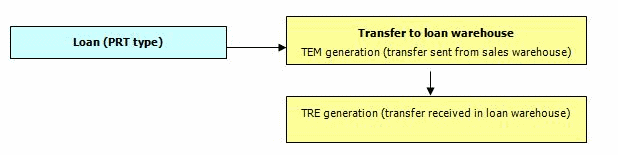

When a loan is returned, the loan document is updated. An inverse transfer will be done in order return the item to stock. The destination warehouse can be modified.

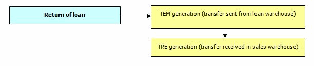

When processing the sale of a loan item (whether an actual sale or gift), the loan type document is updated. A sales receipt type sale will pull the item from stock.

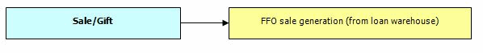

When an item has been lost, a loan document is updated. A special operation will pull the item from the loan warehouse.

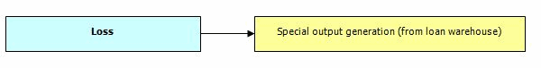

A link between the generated movement and the loan document will be automatically created and associated at a later date. These stock movements are done automatically and remain transparent for the user.

## Available for Customer

### Customer Orders and Customer Reservations

#### Contents

Customer Orders and Customer Reservations - Contents

Customer orders

The principle of the customer orders module is simple. A customer comes to the store and finds that the item that they want to purchase is not available in the store. The salesperson enters an order for the customer via the Front Office Sales receipts module, menu option Enter transaction . The customer can pay a deposit to confirm the order. When the order is confirmed, the paid deposit is added to the receipt with the reference of the order in question. At this step, the document type entered is a customer order (CC) that is transferred to the Head Office immediately. When the ordered item is received by the Head Office, it generates an available order, which will be sent to the store: the document type is no longer a sales order (CC), but an available order (CDI).

When the customer returns to the store, and is identified at the cash register, a message alerts the salesperson that the ordered items are available.

Customer reservations

In Cegid Retail Y2, one or more items can be reserved by a customer for a later purchase. Unlike in customer orders, items are actually present in store inventory, but customers will make their purchase later. Items are reserved until the customer comes to the store.. The customer can make a deposit/down payment to confirm their reservation. When a reservation is confirmed, the deposit is added to the receipt with the reference of the reservation in question. Once the customer's reservation has been confirmed, items can be picked up in various ways:
- Several reservations can be recovered in one operation on the same sales receipt.
- Some of the reserved items can be recovered now and others later by the customer, or they can be closed if the customer does not return.

Various analyses such as dashboards, are used to track these reservations.

General settings
- Settings for customer orders and customer reservations
- Access rights management

Management of customer orders and customer reservations
- Creating a customer order and/or a customer reservation
- Collecting deposits/down payments
- Generating an available order in the store
- Delivering an order or a reservation to a customer
- Available for customer

Additional feature
- Customer orders with or without tax according to stores
- Recalculation of selling prices for customer orders and customer reservations
- Emailing documents

Find out more
- Additional information

#### Required Settings

##### General Settings

Settings for Customer Orders and Customer Reservations

Defining register settings

Back Office > Settings > Front Office > Register > Register record > Services tab

Front Office > Settings > Registers > Registers > Register record > Services tab

The settings required for the management of customer orders and customer reservations are detailed in the Services tab of the Register Settings .

Services tab of the Register Settings

Basically, you need to specify the settings detailed below:

For customer orders
- Enable the Customer order management setting Once this setting enabled, the [Customer services/Customer orders] button appears on the sales transaction entry screen.
- Complete the Deposit/Down payment section, if you wish to manage them, otherwise skip this step.

For customer reservations
- Enable the Customer reservation management setting Once this setting enabled, the [Customer services/Customer reservations] button appears on the sales transaction entry screen.
- Complete the Deposit/Down payment section, if you wish to manage them, otherwise skip this step.
- Complete the Number of authorized days field used to limit the reservation period by proposing an expiration date when the items are reserved. When this period is expired, the daily opening and closing operations indicate the number of expired reservations that can then be sold (see Close/Reopen Customer Reservations ). An alert can be triggered to list all reservations that have reached their expiration date (see Interactive Alerts ).

Configuring a button for the checkout screen

Back Office > Settings > Front Office > Register > Register record > [Configure touchscreen and keyboard] button

Front Office > Settings > Registers > Registers > Register record > button Configure touch screen and keyboard]

You can also configure a specific button, dedicated to customer orders and customer reservations on the touch pad ( see Configuring Touch Screen and Keyboard ).

Configuring Touch Screen and Keyboard

It can be a button of type:
- Function > Customer services : Used to configure a button on the touch pad corresponding to the functions relating to customer orders or customer reservations, as well as function Available for customer
- Menu lines > Query availability via customer documents or Query availability via customer document lines : Used to configure a button on the touch pad that automatically opens the configured query option. In order to preserve any settings made in previous versions, 4 menu lines have been retained (2x2), but they give access to the same features.

Defining remainder management

In Back Office or Front Office > Settings > Documents > Documents > Types

For customer orders

In the case of partial delivery to the customer (only 2 items out of the 3 ordered by the customer) the operator can determine whether the order will be closed.

In the Inventory tab, for documents of type customer order (CC) and available orders (CDI), the Remainder management option allows the operator to handle this kind of event:
- Option checked : When generating the available order, the customer order remains open to enable the future receipt of the quantity still to be received.
- Option not checked : When generating the available order, the customer order is closed automatically, and only the quantity effectively received will be delivered to the customer. However, if need be, a new customer order can be entered.

This setting will be taken into account as soon as you reconnect.

For customer reservations

In the case of partial delivery to the customer (only 2 items out of the 3 reserved by the customer) the operator can determine whether the reservation will be closed.

In the Inventory tab, for documents of type customer reservation (RDI), the Remainder management option allows the operator to handle this kind of event:
- Option checked : When a customer comes to the store to pick up the reserved items, a message will prompt the salesperson at the cash register if they want to keep the remainder of the reservation. If the answer is YES, the reservation of the missing item will stay active for a later purchase. If the answer is NO, the reservation for the missing item will be cleared.
- Option checked : When a customer comes to pick up the reserved items, the reservation for the missing item will be cleared automatically.

This setting will be taken into account as soon as you reconnect.

Defining the search method for available orders and reservations

Back Office > Administration > Company > Company settings > Commercial management > Front Office

It is possible to define how to search for available orders and reservations.

Enable in the Available orders/reservations section the Search by reference option. Click here for further information.

Click here

Configuring freight and expenses for customer orders

If you want to collect the amount corresponding to shipping fees, the latter must be configured as follows:

Defining shipping fees

Back Office > Settings > Management > Freight and expenses
1. Click the [New] button to create a new record,
2. and populate the various fields used to calculate the expenses to apply to items.

Enabling freight and expenses for customer orders

Back Office > Settings > Documents > Documents > Types
1. Select type Customer order (CC) and go to tab Miscellaneous .
2. Tick the Open expenses at end of data entry checkbox, and validate.
3. When the operator enters a customer order, the Freight and expenses window appears where the operator may select the amount matching the expenses to collect.

Configuring the transfer store for customer orders

Back Office > Basic data > Stores > Stores

At least one store of the type Headquarters must exist, which will act as a sender store for transferring items (between the Front Office and the Back Office.)

Headquarters
1. Open the record of the store that will be the sender store for the item transfer.
2. In the Contact information tab of the record, select. Headquarters for the, Type field.
3. Check that this setting has been taken into account by opening in Back Office, the Generate customer orders command via module Sales > Retail sales > Available for customer.
4. The Settings tab of the window displays the store of the transfer you have just defined.

Keeping the tax inclusive retail selling price of the item for the customer order

The following settings allow you to obtain the retail selling price for the item inclusive of taxes when entering a customer order.

In the customer record

Back Office > Basic data > Customers > Customers

In the Front Office, customers must be configured as Individual customers (see tab General), and Tax excl. invoicing field must be unchecked (Conditions tab).

In document types

Back Office > Settings > Documents > Documents > Types
1. In the Employee tab, the type of the sales representative must be set to "All":
2. In the Valuation tab:
1. The Invoicing type option must be set to Customer invoiced . The Proposed price option must be set to Selling price . If retail price lists are used, the Use price list when calling price checkbox must be ticked.

In company settings

Back Office > Administration > Company > Company settings > Commercial management > Front Office

Just remind: When the Third-party with tax excl. invoice by default company setting is checked, customers are created in Tax exclusive invoicing mode by default.

Keeping the same salesperson throughout the customer order cycle

Back Office > Settings > Documents > Documents > Types

It may happen that the salesperson who created the order is not present in the store to deliver the order to the customer

There is a setting that allows you to keep the salesperson, who initiated the order, in the sales line when the product is delivered to the customer.

For document types Available order (CDI) and Receipt (FFO), tick the Keep the salesperson from previous document checkbox available in the Employee tab.

Moreover, exceptions per store can be defined via the [Additions - Per store additions - tab General] button.

##### Access Rights

Access Rights for Customer Orders and Customer Reservations

Back-Office > Administration > Users and access > Access right management

Front Office > Administration > Users and access > Access right management

Activate the following access rights for the user groups of your choice:

Menu Concepts (26) > Commercial management > Document entry

The options in this menu as detailed here ) allow users to perform the following:

here
- View customer orders in notice validation
- Generate available orders in notice validation

Menu Sales (102) > Retail sales > Available for customer

The options available in this menu allow you to authorize the relevant user groups to carry out the following actions in Back Office:
- Query by document
- Query by line
- Modification
- Generate available orders
- Close
- Reopen customer reservations

Menu Sales receipts (107) > Access rights > Customer services

These access rights are detailed in topic Access Right Management .

Access Right Management
- Create a customer order
- Search for an available order
- Authorize an order available in another store
- Create a customer reservation
- Search for a customer reservation
- Change the salesperson of a recovered document line
- Change the salesperson of a return line

Menu Customers (109) > Available for customer

The options available on this menu allow you to authorize the relevant user groups to perform the following actions in Front Office:
- Enter: Customer order/Customer reservation
- Query: By document/By line
- Generate available orders
- Edit customers orders
- Modification
- Close
- Reopen customer reservations

#### Management of Customer Orders and Reservations

##### Management in Front Office

Customer Orders and Reservations in Front Office

Creating a customer order or a customer reservation

Front Office > Sales receipts > Sales > Enter transaction and button [Customer Services]

Front Office > Customers > Available for customer > Enter

Procedure on sales transaction entry screen
1. Create or search for the customer who wants to place an order or reservation.
2. Press the [Customer services - Customer orders (Customer reservations) - Enter] button.
3. A new screen will come up with the customer’s name.
4. Enter the items to order/reserve, their quantity and any comments. A delivery date may be mentioned too for orders.
5. Once validated, the customer document is created (document type: CC for orders and RDI for reservations.)
6. The purchase order is printed in report or receipt format as defined through the settings in the Services tab of the Register settings. It can also be sent per mail (see Emailing Documents .)
7. The checkout screen reappears, displaying a deposit amount to be collected, calculated according to the settings defined in the Services tab of the Register settings A Deposit payment line appears as a financial item in the lines of the receipt. At this point, you can:
1. Finalize the transaction and collect or not the deposit/down payment Proceed with the sales transaction if the customer wants to make additional purchases.

Please note!

Regarding the order, if shipping costs have been defined, a window displays and prompts the operator to select the expenses to add to the order.
1. If the deposit payment is set to 0 in the Services tab of the Register settings, the message “Do you wish to return to the walk-in customer?” may appear at the end of the transaction (or when it is aborted.) If the cashier answers: No: the customer currently on the checkout screen will be kept to continue with other transactions for this customer. Yes: the customer currently on the checkout screen is replaced by the “walk-in” customer in order to move on to the next customer.

Collecting deposits/down payments after order entry

Front Office > Sales receipts > Sales > Enter transaction > button [Customer Services].

This function can be used to retrieve a customer order for which a deposit or down payment has to be collected afterwards.
1. Press the [Customer services], option Customer orders - Deposit/down payment, and then search for the customer who passed the order.
2. The Selection of customer orders window appears, allowing you to select the order requiring a deposit/down payment.
3. Once the order selected, the Sales transaction entry screen appears again.
4. Specify the amount of the payment , the payment method and validate. The receipt is then printed.

Generating an available order in the store

By validating a transfer or a delivery notice

Front Office > Management > Transfers > Validate transfer notices

Front Office > Management > Receipts and returns > Validate delivery notices

In most cases, customer orders are processed and converted to available orders in the Back Office; but it is also possible to process them directly in the store, making the ordered items available to the customer. It is also possible to generate an available order directly in the store, without reference to a delivery or transfer, particularly in cases where the store has not had time to validate its notices (see Management of Availability via Customer Documents .)

Management of Availability via Customer Documents

Validating a delivery or transfer notice from the Head Office will update inventory and therefore make the ordered items available for sale. When validating a transfer notice or a delivery notice (not linked to a customer), a check allows you to verify the existence of customer orders relating to the items received. The salesperson can then view the customer orders in question, and generate the associated available orders.

From Menu Available for customer

Front Office > Customers > Available for customer > Generate available orders

See Generate Available Orders .

See Generate Available Orders

Delivering an order or a reservation to a customer

Front Office > Sales receipts > Sales > Enter transaction

If the order or reservation is available in the store, the customer can receive it on arrival.

Available order or reservation with an identified customer

If the customer is identified in the sales transaction entry screen and has orders/reservations to collect, the following message displays: "The customer has ordered or reserved items. Would you like o hand them over?”

If the answer is Yes, the Available for customer screen opens, allowing you to retrieve the customer's document(s).

At this stage, it is possible to select both available order lines and customer reservation lines. Selection is made line by line.

If the customer does not retrieve all the items in the order and/or reservation, a message informs the cashier that there are still items to be retrieved, and asks whether the documents need to be closed (see Remainder Management .)

Remainder Management
- If the answer is Yes, the documents concerned are closed.
- If the answer is No, the documents remain open and can be retrieved later.
- If the cashier clicks the [Detail] button, a multicriteria window opens to view the details of the remaining items in the documents selected previously.

Please note!

To ensure consistent operation, it is advisable to have the same remainder management for orders and reservations.

If this is not the case, it will not be possible to make multiline selections on the document type, which would not manage backorders.

At checkout, the salesperson recovers any deposit or down-payment made by the customer when the order/reservation was placed. The customer can then complete the payment.

Please note!

If you select an available order or reservation that does not belong to the customer previously entered, you will be asked the following question to confirm your choice: “The customer associated with the document (XX) is not the customer associated with the receipt (YY). Do you want to proceed?” Once the customer selected, their ordered or reserved items are included in the current receipt.

Available order or reservation with non-identified (fictitious) customer

You can search for an available order or reservation without identifying the customer first.

Therefore, the search by reference feature must be enabled (refer to Company Setting “Search by reference” in the Front Office Tab .)

Company Setting “Search by reference” in the Front Office Tab
1. In the sales transaction entry screen, click the [Customer services (or Customer reservation) - Available for customer] button.
2. The Search for available documents displays and allows you to find a document by its reference; or via a multicriteria search.

##### Available for Customer

Management of Availability via Customer Documents

Front Office > Customers > Available for Customer

Back Office > Sales > Retail sales > Available for customer

This menu allows you to query, modify, close and reopen the documents of this menu, i.e., customer orders, available orders, and reservations.

Please note!

Retailers who have customized the various multi-criteria in this menu will have to recreate the filters, layouts and CBS additions for the corresponding new multi-criteria.

Query availability via customer documents

Front Office > Customers > Available for Customer > Query

Back Office > Sales > Retail sales > Available for customer > Query

This query can be performed by document or by line.

Select in the Type field one or more types of documents you want to view: customer orders, available orders, customer reservations.

Note that this customer-related query is also accessible from the following features:
- Customer record: in Back office via button [Customer service], and in Front Office via button [Zoom menu].
- Sales transaction entry screen in Front Office: via button [Customer services], options Customer orders and/or Customer reservations.

Modify availability via customer documents

Front Office > Customers > Available for customer > Modification

Back Office > Sales > Retail sales > Customer available > Modification

Select in the Type field one or more types of documents you want to modify: customer orders, available orders, customer reservations

Please note that you can also select all documents.

You can modify a customer order in Front Office at any stage, as long as the order has not been processed.

Edit a customer order and check inventory (in Front Office)

Front Office > Customers > Available for customer > Edit customer orders

This feature is used to review the customer orders in progress and assess the available inventory according to various item or customer criteria.

Generate available orders

Front Office > Customers > Available for customers > Generate available orders

Back Office > Sales > Retail sales > Available for customer > Generate available orders

This feature allows you to make the customer order immediately available in the store, even if the store did not have time enough to validate its transfer or delivery notices.

This moves the customer order from status Customer order to status Available order . It also handles the required inventory transfers.

The list returning the orders displays them line by line; this means that you may have as many lines as various items composing the order.

However, the available order is generated by document.
1. Search for the order you want to make available and open it by double-clicking on the appropriate line.
2. Once the order displayed, specify in column Quantity the quantity effectively received and validate.
3. Whether you handle remainders or not, the order will remain in progress or be closed automatically.
4. After the creation of the available order: If the store validates its transfer notices; a sent transfer (document type: TEM) and a transfer notice (document type: TRV) are created. If the store does not validate its transfer notices, a received transfer (document: type TRE) is created.

Once the available order and transfers have been generated, the customer order is no longer active (if it has been processed in its entirety.)

It is therefore no longer possible to view it as a current customer order. Only the available order can be viewed.

Close customer documents

Front Office > Customers > Available for customer > Close

Back Office > Sales > Retail sales > Available for customer > Close

In cases where a customer never comes back to collect the order or reservation, whether the items are received in the store or not, it is possible to close the document.

This renders the selected documents inactive.

Select in the Type field the type of the document to close: customer order, available order, customer reservation.

Note that you can reactivate a customer reservation via the Reopen customer reservations feature.

Reopen customer reservations

Front Office > Customers > Available for customer > Reopen customer reservations

Back Office > Sales > Retail sales > Customer available > Reopen customer reservations
1. However, you can reopen a closed reservation to make it active again.
2. After a multiple criteria search, the screen displays the list of the customer reservations matching your search criteria.
3. Select one or more reservations and press the [Reopen] button.
4. A message will prompt you to confirm your choice.

Please note!

The closing of an RDI containing an item with a serial number is final. It is not possible revoke the link between the item of the RDI and the associated serial number in stock.

Moreover, the reactivation of a recently closed RDI remains blocked as long as no other document has used the serial number that has thus been "released". Indeed, it is not possible to return into stock a serial number already present in inventory.

#### Additional Features

##### Customer Orders With or Without Tax According to Stores

Customer Orders With or Without Tax According to Stores

In some cases, you must be able to manages customer orders for which the application of taxes is different from one store to another. For example, some store chains should be able to manage customer orders expressed as follows:
- With tax for European stores
- Without tax for US stores

At the end of this topic, a typical example of configuration is presented for you to be able to configure correctly and concretely a case of that type.

Recap of the various settings

Define the document type

Back Office > Settings > Documents > Documents > Types

This step allows you to manage the invoicing type for customer orders by store. First, select the CC document type (customer order.)

Click the [Additions] button and select the Per store addition option.

Then, select the store on which you want to act, and open the Valuation tab.

Select one of the following options for the Invoicing type field:
- By default: Uses the setting of the document type.
- Invoiced exclusive of tax
- Invoiced inclusive of tax
- Customer invoiced: Uses the setting defined in the customer’s record?

Defining register settings

Back Office > Settings > Front Office > Register

Open the register record of your choice and specify the following information:

| Tabs | Fields to populate |
| --- | --- |
| General tab | The Invoicing type field allows you to define the type of invoicing that will be applied on the cash register. Invoiced exclusive of tax, Invoiced inclusive of tax, Customer invoiced |
| Services tab | Enable the management of customer orders Select a register operation for deposit payment. Define how the deposit amount is calculated by selecting one of the following options. Based on invoicing type: This is the default mode so that the usual operation cannot be changed. Tax excl.: Deposits are always calculated in relation to the tax exclusive amount. Tax incl.: Deposits are always calculated in relation to the tax inclusive amount. Enter the percentage of the order amount to be paid. |

Company setting

Back Office > Administration > Company > Company settings > Commercial management > Front Office

The Apply the invoicing system of the cash register to all sales documents company setting allows the following:
- If it is checked, the setup for the register are taken into account.
- If it is not checked, the setup defined in the document type is taken into account.

General operation

On cash register workstations

If the Apply the invoicing system of the cash register to all sales documents company setting is checked, the setup defined for the cash register will be used.

Otherwise, the operation is as described below.

On workstations not assigned to a register and on Back Office workstations

If there is an exception for the store in the document type:
- If option “By default” is set, the setting in the main document type is used.
- Otherwise, the option of the store exception will be used
- Otherwise, the option of main document type will be used

Typical example

The aim is to manage customer orders in the Back Office, expressed as follows:
- With tax for European stores
- Without tax for US stores

Store settings

| Settings | European Store | US Store |
| --- | --- | --- |
| Document type - Customer order (CC) | Invoicing type = with tax | Invoicing type = without tax |
| Register settings/General tab | Invoicing type = Customer invoiced | Invoiced inclusive of tax |
| Register settings/Services tab | Calculate amount = Based on receipt invoicing type | Calculate amount = % of tax incl. total in customer document Amount to pay= 100% |
| Company settings | Do not check the Apply the invoicing system of the cash register to all sales documents company setting. |

##### Recalculation of Selling Prices for Customer Orders and Reservations

Recalculation of Selling Prices for Customer Orders and Reservations

The selling price of a product may change (upwards or downwards) between the time it is ordered/reserved by a customer and the time it is delivered to the customer.

This section explains how to update the selling prices of items ordered and/or reserved by a customer when they are sold at the checkout.

Required settings

Access rights

Back Office > Administration > Users and access > Access right management

Front Office > Administration > Users and access > Access right management

In menu Customer (109), all lines of menu Available for customer must be set to green.

Document types

Back Office and Front Office > Settings > Documents > Documents > Types

In the Valuation tab, disable the Firm prices on document valuation setting for document types CDI and RDI

For further information about this setting, click here .

click here

Register settings

Back Office > Settings > Front Office > Register

Front Office > Settings > Registers > Registers

In the Services tab, perform the following actions:
1. Enable the settings hereafter:
1. Customer order management Customer reservation management
1. The Update prices setting specifies when and how to update the prices of available order or reservation lines when they are retrieved in the shopping cart. For further information about the proposed choices, click here .

How it works at checkout

The aim is to check the selling price (updated prices, current promo prices, etc.) when integrating the available order and reservation lines into the receipt, with a proposal to the salesperson/cashier to apply the updates prices to the receipt lines.

For customer orders and reservations, a first check is carried out at document header level in order to check the status of the Firm prices on document valuation option.

It is possible to uncheck this setting in the order/reservation header for the register settings to apply.

Two scenarios may arise depending on whether the Firm prices on document valuation option is enabled:

Option Firm prices on document valuation is enabled:
- If a manual discount was entered for the order or reservation, it is retained when integrating the order or reservation into the receipt.
- Likewise, if a price change has been made since the order or reservation was entered, this is not reflected: the price applied when the order or reservation was entered is retained.

Option Firm prices on document valuation is disabled:

In this case, the Price updates register setting applies. Just remind, this setting defines how the selling price is updated. If the setting is set to:
- Always update : the day’s price is applied to the line, instead of the order or reservation price, without requesting confirmation from the user . If the item was granted a line discount when the order or reservation was placed, this discount is lost. The same applies to prices increases.
- Offer higher prices only : If the day's price is higher than the unit price before applying the line discount, the cashier is asked "Do you want to apply this new price to the line?":
- If the answers is No, the order or reservation price is applied. If the answers Yes, the day's base price and the day's price are applied to the cart line. If the item was granted a line discount when the order or reservation was placed, this discount is lost. The same applies to prices increases.
- Offer lower prices only : If the day's price is lower than the unit price before applying the line discount, the cashier is asked "Do you want to apply this new price to the line?":
- If the answers is No, the order or reservation price is applied. If the answers Yes, the day's base price and the day's price are applied to the cart line. If the item was granted a line discount when the order or reservation was placed, this discount is lost. The same applies to prices increases.
- Offer higher or lower prices : If the day’s price is different from the unit price before applying the line discount, the cashier is asked whether the new price should be used.
- If the answers is No, the order or reservation price is applied. If the answers Yes, the day's base price and the day's price are applied to the cart line. If the item was granted a line discount when the order or reservation was placed, this discount is lost. The same applies to prices increases.

##### Emailing Documents

Emailing Documents about Customer Orders and Reservations

As retailers are increasingly using e-mails to communicate with their customers, Cegid Retail Y2 offers the possibility to email documents about customer orders and reservations.

This topic only deals with the emailing of these documents (orders and reservations) from the checkout.

To find out more about emailing sales receipts, please refer to topic Emailing Receipts.

Emailing Receipts.

Required settings

Creating e-mail profiles

Back Office > Settings > Documents > E-mail profile

E-mail profiles are used to define standard information (such as the subject, body and printing template) that will be sent in the e-mail when the transaction is validated.

Note that the following information can be configured in the subject of the e-mail: <DATE>, <DOCDATE>, <DOCNO>, <DOCTIME>, <REGISTER>, <STORE>.

Once the profile created, it must be associated with a register that can email documents to customers (register record, tab Receipt (continued) , field E-mail profile .

By default, the e-mail template defined in the e-mail profile will be sent at checkout.

If you want to use another default template, you have to blank out the template defined in the e-mail profile, in which case the template set in the Register record (tab Services , field Template ) will be used as the default template (see the Register settings below.)

Defining customer record settings

Back Office > Basic data > Customers > Customers

Front Office > Customer > Customer management > Customer file

This step ensures that for customer orders or reservation at the cash register, the customer’s e-mails are automatically displayed during the transaction (in the window called Send per e-mail .)

In order for the customer's e-mails to be displayed in this window, you must check the Recover e-mails option in the General tab of the Customer record.

If it is not checked, the E-mail 1 and E-mail 2 fields in the Send per e-mail window will be empty, even if the e-mails are filled in the customer’s record.

Defining register settings

Back Office > Settings > Front Office > Register > register record > Services tab

Front Office > Settings > Registers > Registers > register record > Services tab

Open the Services tab, and in the Prints section perform the following operations for the customer orders and/or reservations :
- Format field : Select from the drop-down list, select the Report format for emailing to work. This is because the Receipt format does not allow these documents to be emailed.
- Template field : Select the appropriate printing template. Note the order in which the printing template is used, depending on whether it is set or not:
- The prevailing template that is used first is the one specified in the e-mail profile. Otherwise, the one indicated in the Services tab of the register record ( Template field) is used. If not, the one indicated in the customer record is used again, via the button [Additional data/Exception to document management]. Otherwise, the template indicated in the CC and/or RDI document types ( Layout tab) is used.
- E-mail field : Check this option to allow documents about customer orders and/or reservations to be emailed.

How it works at checkout

Front Office > Sales receipts > Sales > Enter transaction

When entering a reservation or customer order, after entering the customer’s name and the items, the Send document per e-mail window appears.

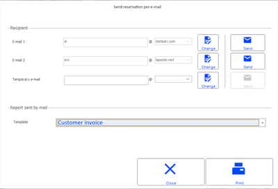

Please note!
- This window only opens if an e-mail profile has been set up.
- If the Emailing Receipts feature is also set, the Send receipt per e-mail window will appear next.

| Fields | Description |
| --- | --- |
| Recipient | E-mail 1/E-mail 2 If in the customer record, the Recover e-mails option is checked, the customer’s e-mails are displayed automatically as in the example above, otherwise these fields are empty. Temporary e-mail If the previous fields are empty, this field allows you enter e-mail ion an ad hoc basis in order to send the document to the customer. Buttons associated with the fields The [Change] button allows you to correct the customer's email address and update their record. The [Send] button allows you to email the document to the customer. |
| Report sent per e-mail | The template can be modified if necessary. By default, this is the one defined in the e-mail profile. Otherwise, the one indicated in the Services tab of the register record ( Template field) is used. If not, the one indicated in the customer record is used again, via the button [Additional data/Exception to document management]. Otherwise, the template indicated in the CC and/or RDI document types ( Layout tab) is used. |
| Close | Exits the screen without printing or sending an e-mail. |
| [Print] | Prints the document. |

#### Additional Information

Additional Information on Customer Orders and Customer Reservations

Link between receipt and customer order (or customer reservation)

Note that there is no link between the receipt and the customer order or reservation. The modification of one document has no impact on the other.

For example, if a receipt is cancelled, the order will not be cancelled.

In the same way, if the amount of the order is modified, the deposit amount in the receipt will not be changed.

Inventory and transfer management

Transfers

The transfer includes the following information:
- The third party of the transfer is the customer concerned by the transfer.
- The transfer is valued based on the purchase price defined in the document type settings.

Inventory

Once the items have been received, the salesperson validates the transfer notices, which triggers an update of the store’s inventory. These items are accounted for in the store’s current computer inventory. They are not reserved from the point of view of the information system. However, the salesperson can physically label the items by attaching the purchase order to them, or by placing them on a specific rail.

Once the transfer is validated, the salesperson is alerted that the merchandise is intended to fulfill a customer order. The salesperson can then inform the customer that the order has arrived.

Note that stockout is not calculated for the receipt lines originating from an available order or from a customer reservation.

Reservation status

The various screens propose new criteria to search a reservation by its expiration date and/or its status. A reservation may have the following status:
- In progress (the reservation is registered, awaiting the customer’s return)
- Delivered (the items have been delivered; the reservation is no longer active)
- Canceled (the reservation has been canceled).

This enables you to know the percentage of reservations which result in actual sales.

Standalone mode

The management of customer orders and customer reservations is not available in standalone mode.

Queries and analyses

Back Office > Sales > Sales >Reports

For the various query types (analyses, cubes, and dashboards,) the document type to select is:
- CC for customer orders
- CDI for available orders
- RDI for customer reservations

## Countermark Management

### Contents

Countermark Management

There is clear and direct link between customer orders and purchase orders, as illustrated by the following scenario:
- The customer has just made a store purchase: a customer order has been entered.
- If the merchandise is not available in-store, a purchase order is generated directly based on this customer order.
- When the supplier delivers the order, the customer order is closed and the merchandise will be available to the customer.
- Required settings
- Countermark status
- Entering a customer order in Front Office
- Processing countermark lines
- Partial or full receipt of a purchase order

### Required Settings

Countermark Settings

Managing countermarks

Back Office > Administration> Company > Company settings

Go to Commercial management > Documents - Processing, and tick the Countermark company setting.

Activating stores

Back Office > Basic data > Stores > Stores

Countermark must also be activated at store level by checking the Countermark management box available in the Miscellaneous tab.

If it is checked, the Propose the generation of the purchase order when validating the customer order option will automatically create the purchase order after validation of the customer order. Items will be grouped according to the main supplier, and a purchase order will be created for each supplier with the requested items.

Activating the items concerned

Back Office > Basic data > Items> Items

Likewise, the countermark must be activated for each item concerned, by checking the Manage as countermark available in the Characteristics tab found in the item record.

Configuring inventory shortage calculations

Back Office > Settings > Documents > Documents > Types

Inventory shortages must be managed for documents of type Customer order (CC). To do this, you must select Physical . for the Inventory shortage calculation field in the Inventory tab.

Configuring access rights

Back Office > Administration > Users and access > Access right management

The access rights affected by this function are located in Menu Sales (102). You may authorize or deny other users access to the commands available in Generation/Process countermark lines and in Trade sales/Cancel countermark lines.

### Countermark Status

Countermark Status

This chart lists the various countermark status types.

| Icon | Status | Meaning |
| --- | --- | --- |
| Blue flag | Countermark request | The customer order has been created, but has not yet been converted into a purchase order. |
| Yellow flag | Order generated | The purchase order is generated from the customer order. |
| Green flag | Order delivered | The purchase order was generated on receipt, and the available order was generated. |

The customer order status will be visible if the required configuration has been done, as detailed hereafter (display of status or icon.)

Configuring the status display for customer orders

Icon display

Back Office > Settings > Documents > Documents > Input lists

When dealing with customer orders, this setting enables you to directly display the countermark status on the item line in the form of an icon.

Once you have clicked the [Open data entry list], select the Customer order list.

Click the Countermark status field in the Available fields window and drag it to the main screen to display the column with the others. Validate.

Status display

Back Office > Settings > Documents > Documents > Types

When dealing with customer orders, this setting enables you to display the countermark status in the lower left side of the document, and not on the order line.

Therefore, select the Customer order document type (CC) and open the Line info tab. Select the Countermark status info and validate.

### Entering a Customer Order in Front Office

Entering a Customer Order in Front Office

Front Office > Sales receipts > Sales> Enter transaction > button [Customer Services - Customer order].

Front Office > Customers > Available for customer > Enter

Case 1: The item is not in stock

When entering a customer order in Front Office, and the relevant item is not in stock, you will be prompted to change the line to a countermark line:

Please note! The entire order line will be converted to a countermark line, and not just a partial quantity.

If the user checks YES after finishing input, a new message will be displayed proposing automatic creation of the countermark order, according to store settings.

When the user validates this request, items will be grouped according to the main supplier and a purchase order will be created for each supplier with the requested items.

A summary will be displayed and the customer order will be printer afterwards.

The purchase order includes the same information as the customer order, with adjusted prices (purchase prices or price lists).

The customer order will use the countermark information in the customer order: in this case, the table for document links will be used with a "countermark" type link. This means that you can link a purchase order and a customer order.

The purchase cycle then takes place as usual with the countermark status of the document preserved.

After the supplier receipt has been generated, the available order will be created.

Case 2: The item is in stock

A customer order can be entered when the merchandise is already in stock. In this case, countermark creation will not be automatically proposed in this screen. However, the countermark can be forced using the [Additional actions/Line addition] button. Open the Information tab, and check the desired information in the Countermark area:
- Not checked, grayed out: The item is not available as a countermark item
- Not checked, modifiable: The item is not currently a countermark item, but may become one.
- Checked, modifiable: The item is currently a countermark item, but this request may be canceled.
- Checked, grayed out: The countermark order was already generated.

The supplier that is retrieved by default is the main supplier for the item.

This screen also allows you to modify the supplier of the item in the document line. This is the supplier that will be used for generating the purchase order.

### Processing Countermark Lines

Processing Countermark Lines

Back Office > Sales > Generation> Process countermark lines

The screen will display customer orders according to the criteria of your choice. Several actions may be performed in this screen:
- Change the countermark supplier for a group of countermark lines.
- Generate purchase orders, if this was not already carried out when the customer order was entered.
- Cancel countermark lines.

### Partial or Full Receipt of a Purchase Order

Partial or Full Receipt of a Purchase Order

Back Office > Purchases > Generation > Receipt of goods

Case 1: Full receipt of a purchase order

The countermark status of purchase documents will be retrieved when generating the supplier receipt from the purchase order. The customer order will be directly converted to an available order.

The countermark status of the customer order is therefore deemed to be "delivered".

The available order is assigned this status, indicating that it is a countermark order.

Case 2: Partial receipt of a purchase order

The available order uses the quantity received from the supplier. The original customer order is closed. A message informs the salesperson that this quantity does not match the expected quantity.