# Omni-Channel Management

*Source: Cegid Retail Y2 – Version 26 | Extracted: 2026-02-27*

---

# Omni-Channel Management

## Central Retail Administration

### Store Record - Warehouse Record

#### Contents

Store Record - Warehouse Record - Contents

The store record is one of the basic elements of a folder. The information contained in the store record has a direct impact on document creation, various processes (replenishment, inventory, inventory closure, etc.) and in particular on the analyses and statistics relating to all aspects of managing purchases, sales, inventory, valuations, etc.

The documents must therefore be associated with a store. The analyses and statistics can then apply to a specific store, a selection of stores or a group of stores. They can also be consolidated for all stores within the folder.

The goal is to clearly identify the stores, and classify them by category, if necessary, for the purposes of organizing them into groups. Another goal is to analyze the sales performance of each store, or each group of stores, and use this information to determine the sales strategy for upcoming seasons.

In addition, the store is also used as the basis for implementing User Restrictions . This involves specifying whether or not certain data can be viewed, according to the type of store and user. This is particularly useful, for example, in the case of a distribution network made up of different store types, such as outlets and franchises.

User Restrictions

Setup and overview of the Store/Warehouse record
- Settings for the Store/Warehouse records
- Overview of the Store/Warehouse records

Store record
- Contact information tab
- Information tab
- Additions tab
- Third-party tab
- Linked warehouses tab
- Accounting tab
- Store staff tab
- Miscellaneous tab
- Omni-channel tab
- Replenishment tab
- Delivered/picked up tab
- User fields tab

Warehouse record
- Contact information tab
- Information tab
- Viewing warehouse inventory

#### Setup and Overview of the Store/Warehouse Record

Setup and Overview of the Store/Warehouse Record

The concept of store must not be confused with the concept of warehouse.
- Single warehouse management: By default, a Cegid Retail Y2 folder is mono-warehouse. In this case, only one warehouse corresponds to one store. Both concepts overlap, and the store concept only is used everywhere in the folder.
- Multiple warehouse management: However, you can opt for multi-warehouse folder management , in the company settings via Administration > Company > Company settings > Commercial management > Stores & warehouses. In this management mode, you may associate several inventory warehouses (physical or virtual) to the same store . All of the screens for the folder refer to both warehouse and store, during document entry as well as in analyses, in order to allow for the selection of a warehouse within a store.

Please note!

Once you change a folder from single warehouse mode to multi-warehouse mode, you cannot undo this! This is why it is imperative that you are sure it is necessary, before making any changes.

Once you change a folder from single warehouse mode to multi-warehouse mode, you cannot undo this!

Store record settings

Company settings

Back Office > Administration > Company > Company settings
- Go to Commercial management > Stores and Warehouses and populate the settings specified here .
- Go to Commercial management > Inventory and populate the settings specified here , and specifically those relating to inter-warehouse transfers.

Store record fields

Back Office > Settings > Stores > Field settings

This feature allows you to define user fields to be displayed in the store record. Click here for further information.

Click here

Overview of the Store/Warehouse records

Back Office > Basic data > Stores > Stores

Back Office > Basic data > Stores > Warehouses

List of stores/warehouses

This allows you to display the list of existing customers, according to the specified sort criteria.

The [Expand list] button allows you to hide the selection criteria displayed at the top of the screen in order to free up space for display of the store list.

The [Search in a list] button allows you to carry out a refined search by record description.

The [Set up layout] button allows you to access the settings for the columns in the list in order to customize the information displayed for each record.

The [Export the list ] button allows you to create a file containing the records from the list. This list can then be retrieved using an office tool such as Word or Excel.

It is possible to create a new warehouse record by clicking on the [New] button.

The [Duplicate] button allows you to create a new record by copying the information contained in the current record, thereby speeding up the creation process.

The [Print] button prints the displayed list.

The [Open] button allows you to open the current warehouse record. You can also open a record by double-clicking on a line.

Toolbar in the warehouse/store records

Buttons common to both records

It is possible to create a new warehouse record by clicking the [New] button.

The [Contact] button allows you to access the list of contacts associated with the record.

The [Memos] button allows you to access the various photos or files associated with the record.

The [Duplicate] button allows you to create a new record by copying the information contained in the current record, thereby speeding up the creation process.

Buttons specific to the store record

The [Wizard for counter creation] button opens the wizard used for creating counters. This wizard allows you to assign a store-specific prefix to all counters used by a store (for documents, payments, items, loyalty processes, customers, etc.) This prevents the duplication of codes in other stores and is also useful when registers associated with this store are switching to standalone mode/.

The [Additions] button allows you to access the following submenus:

- Exception to the management of serial numbers – This submenu allows you to specify that an item which normally supports serial numbers (refer to Item Record ) will not support them for this store.
- Exception on label template management – If a label template is defined for the item record, this store record submenu allows you to specify which other template will be used for reports for this item and this store.
- Main supplier exception for replenishment: This option is linked to replenishment. It implements main supplier exceptions for the store. To create a new exception, use the [New] button.
- Exception to batch management: This option will be available only if you have enabled batch management (refer to Batch Management .)

The [Additional information] button allows you to access the following options:

- The International customizations option allows you to access the additional settings for customizations (fiscal numbers, transfer prices, fiscal references, etc.)
- The Serial numbers in inventory option allows you to view the inventory for items managed by serial number in the store.
- The Settings for portable inventory input terminal option allows you to access specific inventory terminal (PIT) download settings for that store.

Buttons specific to the warehouse record

The [Stores using this warehouse] button allows you to view the list of associated stores, without modifying these.

This button is used to send an e-mail to the address specified in the e-mail field (contact information tab.)

#### Various Tabs in the Store Record

Store Record

Back Office > Basic data > Stores > Stores

Contact information tab

| Fields | Description |
| --- | --- |
| Closed | Allows you to indicate that the store is no longer used. This is useful when creating new documents, for example. When you close a store, it is not deleted. The document history and information relating to this store will still be available. |
| Address | The address can be entered on 4 lines of 70 characters, also available in the presentation settings. The city, country and region can be entered within a limit of 70 characters as well. These elements can be set in the Settings > General. |
| Currency | This option allows you to select the currency to be associated with the store. For websites, this field allows you to manage a common currency for all sales on the website. |
| Stock exchange | Select the stock exchange to define the exchange rate between currencies to apply when creating a document. |
| Type | This field must be populated; it assigns a classification to the store that can be typed Headquarters, Franchise, Branch, etc. For websites, select e-Commerce. |
| Subsidiary | This field is visible only if the folder supports subsidiaries. You can specify in this field the subsidiary the store belongs to (for example South-East Asia subsidiary, Europe subsidiary, etc.) This field must be filled in if you manage some processes such as counterpart flows, valuations, etc. You can modify the subsidiary of a store in the following situations: If the subsidiary store has no movements If the store has movements, and the currency of the new subsidiary is the same as the previous subsidiary If the store has movements, and has not been associated with a subsidiary, and the currency of the new subsidiary is the same as the currency of the folder In all other cases (especially if documents have been entered for this store,) you need to use the update wizard for the store subsidiary. You can access this wizard in Administration > Maintenance > Change subsidiary for store. This feature is available only in a client/server environment and will recalculate all the documents of the store. For further information about options relating to subsidiaries, please refer to the topics about Subsidiaries . |
| Price list program | For further information, please refer to the topics about Price List Programs . |
| Price list type | Is used to select the price lists applicable in the store (Tax inclusive or Tax exclusive.) |
| Counter per store | Tick this option to display wizard for counter creation by store and fulfill the following steps: Step 1/10: Select the store Step 2/10: Item code Step 3/10: Customer code Step 4/10: Link for payments Step 5/10: Loyalty Step 6/10: Document counters Step 7/10: Link between documents Step 8/10: Event log Step 9/10: Customer services Step 10/10: Summary The store is then correctly configured. |
| Managed on site | Although, this option is enabled in general, it is also possible to reference a store that will be managed by an external tool and not by Cegid Retail Y2. In this case the option will be unchecked. |
| Transfer price management | Activates transfer prices. |
| Serial numbers | This option allows you to indicate that the store supports the management of items with serial numbers, provided you have purchased the relevant module (refer to Serial Numbers .) |
| Packing management | This option allows you to indicate that the store supports the management of packages when entering documents (refer to Packing .) |
| Automatic assignment of the customer code | This option allows you to use specific customer coding for the store in question. |
| Validation of transfer notices | This option allows you to establish that store warehouses must validate transfer notices sent to them. Since this option is required to configure Direct transfers between remote warehouses in the same geographical site , it will become activated and grayed out in the store record when the following option has been checked in the subsidiary record. |
| Reallocate reservations or available orders in the case of intra-store transfers | This option allows reservations or available orders to be transferred from one warehouse to another when the merchandise is the object of an intra-store transfer (i.e. from a store's warehouse to another warehouse of the same store). |
| Cust. Service management | This option allows you to define whether or not the store can use the features associated with this module (refer to Customer Services .) |
| Generate and link inventory movements and customer service records | This option enables you to: create customer services records when items are transferred to certain warehouses (Customer Services warehouse). generate inventory movements from a customer service record. This setting is described in Managing Inventory Movements and Customer Services . |
| Managing quantities in customer service records | This setting is described in Managing Quantity . |
| Manage lines at 0 in receipts linked to customer services records | When a service has not been billed to a customer, it will not appear in the register screen and is not saved on the receipt. This setting enables you to change this behavior so you can manage them the same way as lines with values. |
| Handle one customer services record for the line | This setting is described in Managing Quantity . |

Information tab

This tab allows you to really customize the store record based on your specific needs. All of the information contained on this tab is user-defined and fully customizable.
- The titles of user-defined criteria can be configured in Settings > Stores (or Warehouses) > User-defined fields - titles.
- The contents of user-defined tables can be specified in Settings > Stores (or Warehouses) > User-defined tables.
- Or directly in the record via the button displayed next to the field.

The lower-right section of this tab functions as a notepad. By right-clicking on it, you can access basic word processing functions.

Additions tab

| Fields | Description |
| --- | --- |
| Tax model / Tax system | These fields are essential as they define the method to be used for defining taxes in documents for the store in question. |
| External tax calculation engine | Click this button next to the field. The Settings for Web Services window displays allowing you to set the necessary data for the connection with an external tax engine (code, description, URL, timeout). This setting will be used later when using an external tax calculation engine. |
| Taxes at cashing | This option is used to enable the taxes at cashing, i.e.: When issuing a voucher, Y2 stores the amount of taxes applied to the register operation (financial item such as the acquisition of a gift certificate, of a gift card or a deposit payment) that triggered the issuance of a voucher. When a credit note is issued, Y2 stores the tax amount of the returned items. When the voucher is used, Y2 deducts the tax amount of the items paid with the voucher from the tax amount stored when the voucher was issued. The retailer can set up user-defined exports to deduct the used taxes from the collected tax accounts. For more details see the following FAQs: => See also procedure 405 (Taxes at Cashing - Implementation) => See also procedure 406 (Taxes at Cashing - External Solutions) |
| Payment account | This field allows you to specify a particular financial account for the store. This account can then be used for accounting transfers, instead of the default account for all stores. |
| Language for the accounting link | This field allows you to define the translation language for the accounting transfer for each store, so that it can be matched to the language of the users of the store in question. This allows the accounting interface to extract translated descriptions in the interface records. The descriptions are translated automatically in the language of the store when this is different from the language of the folder. If a translation is not available, the descriptions are extracted in the language of the folder. The descriptions in question are listed below and can be translated using the data translation module: Descriptions for payment methods and payment methods per store Descriptions for register operations and register operations per store Descriptions and internal references for sales lines and payment methods (Description for document types, Description and short text for the store, Description and short text for the payment method.) |
| Loyalty campaigns | This field is usable if the Customer loyalty module has been purchased and activated. It allows you to assign a loyalty campaign to the store concerned. |
| Engine version | This setting defines the loyalty version to be used for a store (V2 or V3). |
| Default warehouse for inventory input | The field is only useful if multi-warehouse management has been activated. This field is then used to specify the priority warehouse when new inventory is received. |
| Management of consigned items | This option is used if the module has been purchased and activated in Administration > Company > Company settings > Commercial management > Items This option specifies whether the item type is managed by the store (refer to Consigned Items .) |
| Systematic entry of recipient warehouse for transfers | To display this option, you will need to check the Displays the recipient warehouse option beforehand, in Administration > Company > Company settings > Commercial management > Inventory . |
| Export sales - Tax incl. invoicing | This pane allows you to configure a markup/markdown rate for export sales (refer to Export Sales ). |
| Cost price profile | This field is used if the module has been purchased and activated in Administration > Company > Company settings > Commercial management > Inventory. This field allows you to assign a specific cost profile to the store in question. |
| 2D barcode for labels | This option enables you to generate 2D barcodes on labels using the settings associated to the store. If settings have not been set, the pictogram will not be printed on the label. |
| Assortment criterion | This field is used if the Assortment inventory management option has been activated in Administration > Company > Company settings > Commercial management > Inventory. It allows you to assign an assortment type (refer to Assortments ) to the store in question. |
| RFID template | This field will be available if you have purchased and serialized the RFID (Radio Frequency Identification) module. You may then configure it in Company settings - Commercial management/External connections (refer to RFID ). |
| Exclusion period for gift certificates/cards | Is used to select the period in which gift certificates and gift cards will not apply (refer to Setting up Gift Certificates and Gift Cards .) |
| Management of cashboxes | If the management of cashboxes is enabled in the company settings (Front-Office tab,) it is then possible to authorize this feature at store level (refer to Cashbox Management .) |

Sales receipts

| Fields | Description |
| --- | --- |
| Management of the final selling price | This section is used to authorize the store to handle the concept of final selling price (for the line and/or the receipt), as well as the associated markdown reasons (see Final Selling Price Settings.) Defining authorized reasons allows limiting the reasons usable in the store. The choice will be made in the list of markdown reasons of type Final selling price discount . If an option is ticked, a default reason is available but not mandatory It is used to specify a default value if a final selling price is entered. |
| Safe discrepancy | This field is used for safe management; it associates the register operation of type Safe discrepancy with the store. |

Third-party tab

| Fields | Description |
| --- | --- |
| Sales representative prefix | This field allows you to differentiate the various store-based codes for salespeople/representatives. |
| Cashier management | This checkbox allows you to differentiate between sales representatives/cashiers on the registers in the store in question. => See also procedure 255 (Link User - Salesperson - Cashier) |
| Customer associated to the store Supplier associated to the store | If the corresponding functions have been activated, these fields are essential for the invoicing of sales and/or transfers. |
| Checkout default customer | This field (ET_CLIENTRETAIL) is used to transfer sales entries made by an external cash register or a Live Store cash register to Accounting via the Accounting Interface menu. |
| Default supplier in documents | The specified supplier will be assigned automatically to all purchase documents entered for the store in question. |
| Customer existence control | This pane allows you to activate the methods used for checking third-parties. |

Linked warehouses tab

This tab is available if multi-warehouse management has been activated in the Company settings. It allows you to associate various inventory locations with the store. The warehouse list will be updated when creating a new warehouse.

Please note:
- A store must be associated with at least one warehouse.
- The order of the warehouses on the list is important as it determines the order in which inventory is withdrawn when documents are entered, depending on the inventory available.

Accounting tab

This tab is available if the Management of inventory closures module has been activated in the Administration > Company > Company settings > Commercial management > Inventory accounting closure (refer to Accounting Closure .)

Accounting Closure

Store staff tab

This tab is available if you have purchased the “HR In Store Optimisation - Management of the store staff” module and activated in Administration > Company > Company settings > Link to .Next modules > HR Optimisation (refer to Store Staff ).

Store Staff

| Fields | Description |
| --- | --- |
| Activate management of forecasted schedule | This option allows you to manage the forecasted schedule in the Stores staff module. |
| Activate visa management | This option allows you to activate approval management when managing the schedule for this store. |
| Activate clock-in/clock-out management and Authentication type | These options allow clock-in/clock-out processes and methods to be managed in Front Office for store registers. |
| Store time slots and Standard day | These fields define the working hours for day shifts (morning-afternoon) and night shifts . |
| Associated schedules and legal holidays | These fields allow special events or bank holidays associated to the store to be taken into account in the schedule. |

Miscellaneous tab

This tab will be available if you have purchased and activated at least one of the optional modules (Travel Retail and HRO for authenticating salespeople.)

| Fields | Description |
| --- | --- |
| Use address checking | These options allows you to configure various information required for checking customer addresses (refer to Checking Addresses.) |
| Airport | Activates airport management for the store (cf. Airports .) |
| Authentication of salespeople | These options allows you to define the security level and identification method for sales representatives in the Front-Office. This setup supplements the one defined in the company settings (refer to Salespeople Authentication .) |
| Loan management | These fields allow you to define the settings for the use of the loan module in the store (refer to Loan Management .) |
| Batch management | These fields enable batch management (refer to Batch Management ). |
| Sales conditions | The drop-down list allows you to select how sales conditions will apply at checkout. The available operations are described in topic Setting up Sales Conditions in the Store Record |
| Countermark management | This field allows you to manage store countermarks (the countermark configuration is done in Company settings > Commercial management > Documents - Processing.) The Propose the generation of the purchase order when validating the customer order option activates a message which is displayed when entering orders to allow generation of associated supplier order (refer to Countermark Management .) |
| Specific search priority | This allows you to specify whether other search priorities are to be used than those defined in company settings. |

e-Commerce tab

This tab will be available if you have purchased and activated the Omni-channel module.

The following fields allow you to define the operations the store can perform in an e-commerce context:

| Fields | Description |
| --- | --- |
| Withdrawal of goods | Pick up orders in store: The store receives goods from the Headquarters to hand them out to the omni-channel customer. E-Commerce reservation on store inventory: Allows a store to recover reservation requests. Management of pick-up points: Tick this option if the store is a pick-up point (visible only if the company setting of the same name is enabled in Commercial management > Omni-commerce.) |
| Shipment of goods | Transfer to Headquarters: If this option is ticked, the store may send goods to the Headquarters. Shipment to customers: If this option is ticked, the store directly delivers the goods to the customer. Transfer to others stores: If this option is ticked, the store directly sends goods to another store. Preparation management: the preparation step is handled in the store only. Please note! This option displays only if the Preparation management company setting in Commercial management > Omni-commerce is enabled. |
| Authorize the entry of an e-Commerce order | Allows the store to enter an omni-channel order with payment of a deposit on behalf of the customer. |
| E-Commerce affiliated store | Select a store necessarily of type Omni-channel. |
| GPS coordinates | Optional setting used to locate the store (through Google Maps for example.) |

Payment

This section is only available for websites (stores with the Type field set to e-Commerce .)

| Fields | Description |
| --- | --- |
| Payment method for outstanding amount | Used for partial payment of an order. It will potentially be used in all omni-channel scenarios. |
| Payment of deposits for reservations | This is the register operation used to register the payment made on the website. It is associated with a payment method Already paid deposit in the same currency. Used only if an order is reserved or picked up in the store; this deposit will be accounted for when the customer checks out. |
| Other currencies accepted | This option gives a website the possibility to serve several countries, with different currencies (see Multicurrency Payment of Omni-channel Orders .) This option displays a table that lists these currencies and their deposit payments: The following controls are performed: The store currency cannot be added as it is already present. Only one line is entered per currency The deposit payment must be associated with a payment method in the same currency as the sale. The deposit payment is mandatory. Note that upon validation of this screen, the number of currencies accepted is updated in brackets in the store's screen. |

Return and exchange

This section is only available for websites (stores with the Type field set to e-Commerce .)

| Fields | Description |
| --- | --- |
| Blocking reason | When blocking an order, this setting allows you to select the default reason (e.g. it may be useful to block the order until the goods of a reported return have been received). |
| Payment method for credit notes | In the case of a return of type credit note or exchange, select the payment method that will be used to refund the customer |

Follow-up status

The Default tracking status setting is used to determine the default status of a Web order with delivery to the customer, when it is created in the Back or Front Office.

For further information about the impact of this setting, please refer to Management of Status “Awaiting Validation" .

Management of Status “Awaiting Validation"

Replenishment tab

| Fields | Description |
| --- | --- |
| Sender warehouse in replenishment validation | This pane allows you to define the warehouses that are proposed by default for transfer validations or supplier orders resulting from the processing of replenishments. |
| Replenishment settings | This pane will be visible only if the Main supplier exceptions by item and store setting, found in Company settings > Commercial management > Stores and Warehouses has been activated. The Taking into account the main supplier exceptions by item and store option enables you to indicate that the store will take the various suppliers into account other than the one shown in the item record. When this option has been ticked, the exceptions will be set in the Store record toolbar via the [Additions - Exceptions of main supplier for replenishment option] button. |
| Generation of purchase documents | These options are used to defined the number of lines or the amount from which the document is split. |

Delivered/picked up tab

This tab is available if you have purchased and activated the Delivered/Picked up option (refer to Delivered/Picked up ).

Delivered/Picked up

User fields tab

This tab enables you to manage an unlimited number of user-fields to be used in conjunction with user-defined tables (refer to User Fields ).

User Fields

#### Various Tabs in the Warehouse Record

Warehouse Record

Back Office > Basic data > Stores > Warehouses

Contact information tab

| Fields | Description |
| --- | --- |
| Closed | Allows you to indicate that the warehouse is no longer used. This is useful when creating new documents, for example. When you close a warehouse, it is not deleted. The document history and information relating to this warehouse will still be available. |
| Type | Allows you define various types of warehouses, based on the following: Sales/Stockroom: Enables you to manage several warehouses in a store (sales area, sales window, stockroom 1, stockroom 2, etc.) This is a default value. Consigned: Allows you to manage suppliers’ consigned items, if you have purchased and activated the corresponding module. Only one warehouse of this type exists per store. Stockroom: This type of warehouse differs from the Sales/Stockroom warehouse in that it is not possible to sell from this warehouse if there is insufficient inventory in the other warehouses. But it is still possible to manually withdraw inventory from this type of warehouse. However, you cannot sell from this warehouse in sales documents. A previous transfer between this stockroom warehouse and a sales warehouse is necessary. Isolated sale: This type of warehouse can be assigned to a register managed in standalone mode. In this case, this POS can only sell from its own inventory. This type of warehouse is not taken into account in inventory searches when the main warehouse runs out of stock. The registers assigned to this type of warehouse will only search for inventory in this warehouse. Loan: This type of warehouse is used for loan management. The loaned items are associated with this warehouse as well as all movements relating to the loans. Customer services warehouse: This type of warehouse is available only if you have activate the Customer Services (refer to Customer Service Management ). |
| Associated customer | Is used to implement the invoicing of sales and/or the invoicing of transfers if these features are enabled. |
| External ref. | The external reference of the warehouse allows you to propose the entry of a unique code, coming from the information system of your company. The management of this field is optional, but if a value is entered, it must be unique. This field has a maximum length of 40 characters. Blank spaces are only allowed inside the reference: spaces at the beginning and end of the reference will be deleted when the reference is saved. This field is available in the layout customization, as well as in the various criteria related to the warehouse. Changes to this data can also be traced in the standard follow-up and the customized follow-up of the warehouse records (see Customized Follow-up .) |
| Address | The address can be entered on 4 lines of 70 characters, also available in the presentation settings. The city and country can be entered within a limit of 70 characters as well. These elements can be set in the Settings > General. |
| Consider in replenishments | This option allows you to exclude warehouses with inventory considered available for replenishment. For example, if you choose not to take into account items in the “Store window” warehouse, these items will no longer be considered as available in the store. |
| Inventory visible to other stores | This option allows you specify that the warehouse inventory can be viewed by other authorized stores. On the multi-criteria search screens, dashboards, and inventory cubes, the following applies: All warehouses of the user’s associated store will be visible For the user’s other authorized stores, all warehouses for which the previous setting has been selected will be visible. For further information about the visibility of warehouses, click here . |
| Considered in the inventory of my store | This option allows you to specify whether the inventory in this warehouse is to be included or excluded in the total inventory for the store when querying inventory in the Front Office. Note! In case of a loan sale, this option must be activated in order to deplete the loan warehouse (see Loan Management .) |
| Validation of transfer notices | This option is required for the implementation of transfer notices for remote sites. |
| Warehouse managed on site | This option should be activated if you want the store to be managed on the central site's machine. |
| Managed in a WMS | This option enables you to track the customer services by warehouse (refer to Customer Service Management ). |
| Serial numbers | This option allows you to indicate that the warehouse supports the management of items with serial numbers, provided you have purchased the relevant module (refer to Serial Numbers ). |
| Remote warehouse of the store | The management of inventory can be handled internally within the store or outsourced to another site. To avoid having the inventory movement document printed systematically, you can specify in the warehouse record whether the warehouse is a Remote warehouse of the store. You can also specify the Geographical site linked to this warehouse. The transfer document will not be printed in the following situations: If subsidiary management is activated and the sender and recipient stores are identical and the Print intra-store transfer documents on a same geographical site setting is not selected in the subsidiary record and the sender and recipient warehouses are not remote or the original and recipient warehouses are remote and the geographical site has been entered and the sender and recipient geographical sites are identical. |

Information tab

This tab allows you to really customize the store record based on your specific needs. All of the information contained on this tab is user-defined and fully customizable.
- The titles of user-defined criteria can be configured in Settings > Stores (or Warehouses) > User-defined fields - titles.
- The contents of user-defined tables can be specified in Settings > Stores (or Warehouses) > User-defined tables.
- Or directly in the record via the button displayed next to the field.

The lower-right section of this tab functions as a notepad. By right-clicking on it, you can access basic word processing functions.

#### Viewing Warehouse Inventory

Viewing Warehouse Inventory

This section details the required settings to view warehouse inventory.

Activating access rights

Back Office > Administration > Users and access > Access right management

Two concepts are used in conjunction with the settings of the warehouse records. You can access these options in Menu Concepts (26) - Commercial Management > Inventory in the Access right management module:
- View inventory of all warehouses of the subsidiary
- View inventory of all warehouses

If the first option is set to green, the user will be able to view the following:
- All warehouses of their store
- All warehouses of the stores associated with the subsidiary of their store
- Warehouses that have been selected as viewable for all other stores

The second option takes precedence over the first.

Settings enabling warehouse inventory to be visible

There are 3 settings impacting the visibility of warehouse inventory.
- Setting 1, available in the warehouse record: Inventory visible to other stores
- Setting 2, concept available in the access rights: View inventory of all warehouses of the subsidiary
- Setting 3, concept available in the access rights: View inventory of all warehouses

If setting 3 is set to green , the user can view the inventory of all warehouses, regardless of settings 1 and 2.

If settings 2 and 3 are set to red , the user can view the inventory for the following:
- Warehouses of their own store
- Warehouses for which setting 1 is selected.

If setting 3 is set to red and setting 2 to green , the user can view the inventory for the following:
- Warehouses of their own store
- All warehouses of the stores of their subsidiary
- Other warehouses for which setting 1 is selected

### Lists of Stores

#### Item and Store Lists - Contents

Lists of Items and Lists of Stores - Contents

Cegid Retail Y2 offers many processes enabling you to select items according to classification: category levels or user-defined tables.

This functionality enables you to select a list of items free of any classification.

You may also manage store triggers based on a store list (see Triggers .)

Triggers

Creating an item and/or store list
- Creating list headers
- Adding items to the list
- Adding stores to the list
- Special features of Sales conditions and Loyalty lists

Examples of item list usage according to scope
- Using item lists
- Using store lists

Importing lists
- Importing an item list
- Importing a store list

Associated access rights
- Access rights management

#### Creating an Item and/or Store List

Creating an Item and/or Store List

Back Office > Basic data > Items > Lists of items

Back Office > Basic data > Stores > Lists of stores

A list is made up of a header and lines (items or stores). To create an item list, follow the procedure shown below.

Creating list headers

Press the [New] button, then enter a code and description associated to the new list, and if need be, select a restriction category.

The Scope of use box lets you define the function(s) in which this list will be used. You can use the Triggers scope of use

Triggers
- Calculation of WAPP - WACP
- Catalog
- Sales conditions
- Triggers
- Loyalty
- Inventories
- Payment methods
- Transfer prices
- Replenishment
- Statistics
- Price list update

Next, press the [Save] button to open the selection screen for the items or stores that will make up the list.

Adding items to the list

After creating the list header, the item list screen will be displayed.

Press the [Add items] button, then select the item selection type:

- Item grouping: Select from generic and single items
- Dimension grouping 1 - 5: Select items according to dimension (size, color, material, cup, length, shoe size, etc.)
- No grouping: Select from single and dimensioned items
- Bill of materials: Select from Macro and Assembly bills of materials

In the Item selection screen, make your selection using the space bar or the [Select all] button.

After making your selection, click on [Add items] then validate the confirmation message.

The Item list screen will open with the list of items previously selected. At this point you can add new items, delete items or even leave the screen.

“Bill of Materials” type items

Only Macro and Assembly bill of materials types are authorized. They need to be linked to lists with a scope of use set to Sales conditions or Loyalty . When calling up an item list, a bill of materials will behave same way as other items. When selecting, you will find the integration function to be similar to bill of materials sales in the receipt (prices, inventory, component management, etc.)

“Service” type items

You can integrate services into item lists. The scopes of use for which the services are authorized are as follows:
- Sales conditions
- Triggers
- Loyalty
- Payment methods

Adding stores to the list

After creating the list header, the item list screen will be displayed.

Click the [Add stores] button to display the stores.

In the Store selection screen, make your selection using the space bar or the [Select all] button.

After making your selection, click on [Add stores] then validate the confirmation message.

Special features of “Sales Conditions” and “Loyalty” scopes

Allocating values

For item lists relating to Loyalty and Sales conditions, you can enter an equivalent value in points for each item on a list.

Select the item, then click on the [Allocate values] button. The Value to allocate window will open, enabling you to enter an item value.

BOM management

When calling up an item list, a bill of materials will behave same way as other items.

When selecting, you will find the integration function to be similar to bill of materials sales in the receipt (prices, inventory, component management, etc.).

Sales condition options

This section is visible only if the Sales conditions scope is checked. The displayed options enable you to show whether you wish to offer “Item merchandise not managed in stock” , and/or “Item merchandise with zero or negative stock” as item-gifts.

The Order of display option enables to determine the order of display of items in item lists. It may take the following values: item and description code, value (descending sorting), quantity in stock (descending sorting).

When entering sales receipts, if the conditions for obtaining sale conditions wit the list of gift items have been met, the gift selection window will display the available items according to determined stock criteria, according to the order of display configured.

In standalone mode, item lists are downloaded, but not stock. It will therefore display 0. If the list of items has been configured to be sorted by the quantity in stock, then it will be sorted by item code.

#### Examples of Item List Usage According to Scope

Examples of Item List Usage According to Scope

When your item lists have been created, they can be used in various functions according to the scope of use shown in the record.

Using item lists

Calculation of WAPPs

This scope can be used in Back Office > Administration > Maintenance > Recalculation of WAPPs.

It enables you to calculate the WAPPs for a list of items selected from the Characteristics tab, Option section.

Catalog

This scope can be used in Cegid Retail Live Store.

It facilitates the addition of items without barcodes by giving the cashier access to item lists.

Please refer to topic about Using item lists in the Cegid Retail Live Store documentation.

Sales conditions

This scope can be used in Back Office > Sales > Sales conditions > Rules.

It enables you to create sales conditions concerning a list of items shown in the Benefit tab.

Triggers

This scope can be used in Back Office > Settings > General > Triggers > Item.

It enables you to create item triggers on the basis of an item list in the Trigger type section.

Loyalty

This scope can be used in Back Office > Sales > Loyalty > Loyalty programs.

It enables you to specify whether item lists will be managed in benefit options.

Inventories

This scope can be used in Back Office > Inventory > Conduct inventory > Beginning of inventory > Generate a list.

In the Item selection pane, the Use of an item list field allows you to use one or more previously created item lists. Items in this list make up the items to be inventoried.

Payment method

This scope can be used in Back Office > Settings > Management > Payment Methods.

With Cegid Retail Y2, for a given payment method, you can define which item to offer the customer when a sale is paid for in full using that payment method. The Front Office tab enables you to input the item list to be used to reimburse the customer.

Transfer prices

This scope can be used upon document entry.

Once this module enabled (via the Company Settings webapp and the Store record), the item list will be automatically displayed in document entry mode (for document types defined in calculation rules.)

Replenishment

This scope can be used in Back Office > Inventory > Store replenishment > Replenishment and Distribution and Rules for replenishment.

The Replenishment and distribution command enables you to add items from a previously created item list.

Likewise, the Rules for replenishment command enables you to create replenishment rules based on an item list.

Update of price lists

This scope can be used in Back Office > Sales > Pricing > Price list update > On item lists.

It enables you to update a previously created item list. The system displays a multi-criteria window with all item lists whose scope of use is Update of price lists.
- The [Additions] button lets you view a list header, as well as items on the list.
- Double-clicking on the selected item list will launch the price update wizard.
- Before the wizard comes up, a test will be done to ensure that the item list is actually complete.
- Generating prices is done using items on the list in the same way as when items are selected individually.

Using store lists

Note that store lists have only a scope of use of type Triggers.

Triggers

This scope can be used in Back Office > Settings > General > Triggers > Store.

It enables you used to create a store trigger based on a store list. To do this, check the Store list option in the Trigger type section.

#### Importing an Item and/or Store List

Importing an Item and/or Store List

Back Office > Data exchanges > Data recovery

To import item lists, you need to specify an importing format for them with all the required fields, as well as the tests to be done and data to be updated. The new format is to be supplied for "Default recovery" data origin. This is to be completed with a “.dai” file (contact your Cegid consultant, if necessary).

For more information on importing item or store lists, please refer to the documentation about Data imports - Import formats .

Data imports - Import formats

List of items

MLISTEARTICLE

You may create and update item lists by importing files to the MLISTEARTICLE table.

The import format is defined in the MLISTEARTICLE table containing the items on the list that several supplementary fields will be added to, in order to manage header data and various item information.

Procedure

Items may be entered via barcode or item code. Dimensions are checked in relation to an additional description (CAPM code). Note that price list importing can only update a single usage scope, which may be completed by importing another scope.

According to the item information entered, grouping by item will be determined automatically, except if a settings discrepancy prevents it:
- Item grouping
- Grouping - dimensions 1 to 5
- No grouping

List of stores

You may create and update item lists by importing files to the following tables:

MLISTEETABENT

This table is populated using the following fields:

| Fields | Description |
| --- | --- |
| $$_LIBELLELISTE | Description of the store list |
| $$_PORTEELISTEETAB | Scope of use for the store list |
| $$_FAMILLERESTR | Restriction category for the store list |

MLISTEETABLISS

To populate the MLISTEETABLISS table:

| Fields | Description |
| --- | --- |
| ML2_ETABLISSEMENT | Store code |
| $$_ANNULEREMPLACE | X: Deletes all stores from the list before recreating it, by adding the store from the relevant line. Empty: Adds store of the relevant line |

#### Access Right Management

Access Rights Linked to Item and Store Lists

Back Office > Administration > Users and access > Access right management

The access rights concerning this function are located in the following menus:

List of items

Menu 26 – Concepts

In the Commercial management section, you can choose whether or not to authorize salespeople access to the following commands:
- View all item lists
- Modify all item lists

Menu 102 – Sales

In the Price list update section, you can choose whether or not to authorize salespeople access to the price update command on the item list.

Menu 110 – Basic data

In the Commercial management section, you can choose whether or not to authorize salespeople access to the List of items command.

Store list

Menu 110 – Basic data

In the Commercial management section, you can choose whether or not to authorize salespeople access to the List of items menu.

### Currency Management

#### Contents

Currencies - Contents

General settings
- Defining company settings
- Defining document settings
- Defining user restrictions
- Managing access rights

Configuring currencies
- Creating currencies
- Managing stock exchanges
- Managing rate types
- Entering currency exchange rates

Allocating a currency to basic data
- Subsidiaries
- Stores
- Warehouses
- Items
- Customers
- Suppliers

Using currencies in the application
- When entering documents
- When entering transfers
- When generating reports and analyses
- In the Item flash
- In the Front Office

Currency management utilities
- Updating currencies
- Recalculating documents

#### General Settings for Currencies

General Settings for Currencies

Defining company settings for currencies

Back Office > Administration > Company > Company settings

Accounting - Folder settings

A consolidation currency exists for each folder. It allows you to specify the currency for information that is not associated with a store, for example, the pricing for an item record. The currency is configured when the folder is created; therefore, go to Accounting - Folder settings and specify the following information:

Accounting - Folder settings
- Default rate type
- Default rate type for payments

Commercial management - Default settings

Other elements about currencies can be defined in the company settings. Therefore, go to Commercial management - Default settings and populate the following fields:

Commercial management - Default settings
- Behavior of currency input with no price list
- Currency alert

Commercial management - Preferences

The number of decimal places for unit prices may require greater precision than offered by the currency decimal places, particularly when managing very low prices. You may set the desired management for the number of decimal places displayed for unit prices in item records, purchase and selling prices, wholesale documents and Front Office receipts.

This may be different according to price type: purchase or selling

Document amounts remain displayed with keeping the proper decimal places for the document currency. You can choose document management in company settings. To do this, go to Commercial management - Preferences and fill in the decimal fields:

Commercial management - Preferences

Defining document settings

Back Office > Settings> Documents > Documents/Types

Select the document type, then open the Preferences tab. Fill in the following fields:

Preferences
- Default quotation type
- Origin of currency

Defining user restrictions

Back Office > Administration > Users and access > Users

If the user’s default store has not been entered in the Characteristics tab, the user’s currency and stock exchange location will be populated with the values indicated in the Folder settings of the Company settings.

Managing access rights

Back Office > Administration > Users and access > Access right management

Menu Concepts (26)

The following concepts allow you to manage access to currency rates for user groups:
- Authorize currency rate changes: If the user is not granted this authorization, he will only view the currency rates.
- Authorize access to all stock exchange locations: Users have access to all stock exchanges. If necessary, users will see only currency rates for the stock exchange linked to their store.
- Authorize access to exchange rates for cash inflows: The user has access to the rates for incoming payments in the company settings.
- Authorize access to management exchange rates: The user has access to the management rates in the company settings. Management rates are considered to be all rates different from incoming payment rates. If users do not have access to these rates, they will see only incoming payment rates.

By default, all users have the rights previously cited.

Menu Settings (105)

The Management > Currencies submenu allows you to authorize or not deny user groups to perform the following settings: Currencies, currency rates, stock exchange, rate types.

Menu Administration (106)

The Maintenance menu item allows you to authorize or not user groups to use currency modification tools: Modification of the folder currency, subsidiary currency and store currency.

Menu Sales receipts (107)

The Access rights > Enter transaction submenu displays an option called Show currency. This allows you to authorize or not user groups to show currencies in encashment.

Menu Settings (112)

The Settings > Registers submenu allows you to authorize or not user groups to set up currencies and currency rates in Front-Office.

#### Configuring Currencies

Configuring Currencies

Creating currencies

Back Office > Settings > Management > Currencies > Currencies

Front Office > Settings > Registers > Currencies

This command is used to create or configure a new currency. Let us describe the Currency record:

Record header

| Fields | Description |
| --- | --- |
| Code and description | Code on 3 characters and description of the currency. |
| Symbol | The Symbol field is used for the currency format when printing documents that contain currencies. |
| ISO3 Code and Numerical ISO3 code | These codes are used in particular when importing data and for certain types of communications with a payment terminal or with the tax refund software. |
| Quotity | This corresponds to the unit conversion ratio between the currency and the pivot currency. It is used to manage exchange rates using a limited number of decimal places when the currency has a weak unit value in relation to the pivot currency. Currency management in the application enables you to express an exchange rate with 5 decimal places after the decimal point. There are currencies with weak exchange rates: Lebanese pound: 1 LBP = €0.000429366 (1 LBP consists of 100 piasters) Zimbabwean dollar: 1 ZWD = €0.0000216314 (1 ZWD consists of 100 cents) It is easier to use a quotity to express these conversion rates, for example: 1,000 LBP = €0.429366 |
| Decimals | The number of decimal places indicates how many digits after the decimal point are used to express amounts in this currency. |
| Inactive | This setting was created for the FRF (French Francs) currency: this currency is used in a company settings (non accessible.) If you do not want to see this currency (when entering a rate for example), this setting is to be enabled. |

Adjustments tab

This tab allows you to specify the financial accounts to be used when making adjustments during currency transactions.

Terminology tab

This tab allows you to specify the descriptions of the units of account, in the singular and plural, as well as for the subdivisions. These settings will be especially useful when printing numbers in letters. An example is automatically generated at the bottom of the screen of the currency record.

Managing stock exchanges

Back Office > Settings > Management > Currencies > Stock exchange

This subtable allows you to define the place of quotation of the currency, thus enabling different quotations between two stock exchanges. Since each subsidiary may be required to apply different exchange rates between the currencies, it may be necessary to create several stock exchanges for the Euro zone. For example, the conversion rate for the Swiss Franc will not be the same in France as it is in the United-Kingdom.

Managing various rate types

Back Office > Settings > Management > Currencies > Rate types

This subtable is used to define the various rate types that will be used when exchange rates are entered. You can always create new rate types from the Currency rate command.

Entering currency exchange rates

Back Office > Settings > Management > Currencies > Exchange rate

Front Office > Settings > Registers > Exchange rate

Currency rates are entered by currency type.

To enter a new rate, click the [New] button located in the toolbar. Then, complete the following steps in the Characteristics tab:

- Select a stock exchange.
- Select the rate type. The current date displays by default, but you can change this.
- Select the reference currency and the conversion currency.
- Enter the conversion rate.

At validation, the Reverse rate window displays, thus enabling the validation of the reverse rate.

Please notice that the main screen allows you to view the exchange rates on a given date. The fields available in the upper part of the screen enable a multi-criteria search for these rates.

The search must then be launched via the [Apply criteria] button.

If need be, rates can be tested by the means of the [Test rates] button.

#### Allocating a Currency to Basic Data

Allocating a Currency to Basic Data

Subsidiaries

Back Office > Basic data > Stores > Subsidiaries

Currency selection is done in the Characteristics tab. It is possible to use different currencies within the same subsidiary. If you are managing counterpart flows, the counterpart document stays in the same currency as the document issued. The amounts expressed in the store currency are converted to the currency of the new store.

Stores

Back Office > Basic data > Stores > Stores

Stock exchange and currency selection is done in the Contact Information tab. This currency is retrieved to value the inventory for this store. The inventory is expressed in the currency of the store. Note that when any documents are entered for the store, the Currency field in the store record will no longer be modifiable.

Warehouses

Back Office > Basic data > Stores > Stores

Stock exchange and currency selection is done in the Contact Information tab. If one of the warehouses linked to the selected store is also associated with another store, a message is displayed indicating that you cannot change the currency or stock exchange for this store.

Note that the currency and the stock exchange cannot be changed if the warehouse is changed or associated to a store.

Items

Back Office > Basic data > Items > Items

Currency used to display prices

You can choose the currency in which the prices are displayed in the Pricing tab, especially in the Currency section. This display option allows you to enter and display the price of an item in a currency of your choice. It concerns only the item record only and does not affect document data entry. This functionality allows you to enter the prices for certain items directly in dollars, and then display them in euros, for example.

Note!

Prices are saved in the database in the transaction currency for the folder and not in the input currency.

Date of searched rate

This field, available in the Pricing tab, enables you to enter a date on which the conversion rate was searched. By default, it is the current date. Note that this function remains a display artefact as the prices of the item record are still stored in the folder currency.

Unit price decimal places

Decimal places for unit prices may require a greater degree of accuracy for configuration, in particular when dealing with low prices. For further information about managing unit price decimal places, please see the section covering company settings related to decimal places (go to Commercial management - Preferences .)

Commercial management - Preferences

Customers

Back Office > Basic data > Customers > Customers

Entering documents in Back Office

Documents entered for the customer in Back Office will display the currency selected in the Conditions tab.

Calculating balances and customer exposure

To manage credits and limits in a given currency that may be different from the currency of the folder, you can select the currency in the Payments tab. By default, when a customer record is created, the currency proposed is the currency of the store to which the customer is affiliated.

It may be modified later in the customer record. It will be initialized during a version change with the customer's currency or the folder currency if the customer's one is not specified. It may be changed if extended risk management is enabled; but it will not recalculate the entered thresholds.

Suppliers

Back Office > Basic data > Suppliers > Suppliers

In the supplier record, you can select the currency for a third party in the General tab, and more specifically in the Pricing pane. The choice of the supplier’s currency will have a direct impact on document entry.

#### Using Currencies in the Application

Using Currencies in the Application

When entering a document

A document is always valued in two currencies:
- Entry currency: defined in the document settings.
- Store currency: the conversion rate is retrieved from the date of the document based on the rate type defined in the document settings

The following rates are also stored in the PIECE and LIGNE tables:
- The folder quotation currency rate: This is the rate for converting between the document currency and the folder currency.
- The store currency rate: This is the rate for converting between the document currency and the store currency.
- The subsidiary currency rate: This is the rate for converting between the document currency and the store subsidiary currency.

The PIEDECHE table stores the following amounts for payments and installments:
- GPE_MONTANTENCAIS and GPE_DEVISEESP are expressed in the payment currency
- GPE_MONTANTDEV and GPE_DEVISE are expressed in the document currency
- GPE_MONTANTECHE and GPE_DEVISEETAB are expressed in the store currency.
- GPE_COTATION: Exchange rate between the document currency and the store currency.
- GPE_COTATIONESP: Exchange rate between the incoming payment currency and the document currency.
- GPE_COTATIONDOS: Exchange rate between the document currency and folder currency
- GPE_COTATIONFIL: Exchange rate between the document currency and subsidiary currency.

This rate allows you to express the document amounts in either the folder currency or the subsidiary currency by means of a simple operation.

Example:
- Document currency = CAD
- Store currency = USD
- Folder currency = EUR

Each document is expressed in CAD and in USD. The conversion rate between CAD and EUR is also stored, so that the documents can be expressed in EUR without the need for additional searches.

When entering transfers

Back Office > Settings > Documents > Documents > Types

A blocking alert message is automatically generated when a transfer notice is validated, if this notice is in a currency different from the currency of the recipient store. This alert message prompts the user to enter a currency rate so that the inventory can be valued in the store currency.

In this case, the exchange rate must be entered when the transfer notice is validated in order to initialize the currency rate that is used for converting between the transfer currency and the currency of the recipient store. This entry is qualified by a document setting in the Valuation tab. It is only visible if the document type is TRE – Received transfer. This setting is called Enter rate when validating transfer notices.

If this setting is enabled, the following message displays when your entry is validated: “The currency of the current transfer is different from the currency of your store. Please enter the desired exchange rate to convert XX to YY."

Once this message is validated, the Enter conversion rate window opens, allowing you to enter the desired rate. The default value is 0. It is not possible to enter a value of 1 or 0. Please notice that the currency of the transfer received is still the same as the currency of the transfer sent.

When generating reports and analyses

Back Office > Purchases, Sales and/or Inventory modules > Reports and/or Analyses menus

In the reports and/or analyses available from the Purchases, Sales or Inventory modules, the Currencies tab will display two panes: Reference price and the conversion currency.

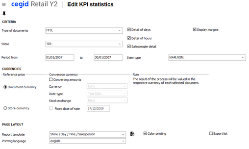

Reference price

An option allows a better use of the document valuation by selecting the reference currency of the store in the following sales reports:
- Annual sales summary: Detailed/Comparison Last Year
- Monthly sales summary: Detailed/Comparison Last Month
- Sales statistics: Reports
- Top sales: Reports

The price of the reference currency is selected by checking one of these 2 options:
- Folder currency: the price used is the price of the store converted to the folder currency on the day of the sale.
- Store currency: the price used is the price of the store in the currency of the store without conversion.

Note that if the multiple selection criteria allow the grouping by store, the access to the store currency will take into account this selection.

Conversion currency

You can define the display currency for most reports thanks to the various options available in this pane: The cubes and dashboards can display results in the following currencies simultaneously:
- Entry currency (field without suffix)
- Subsidiary currency (field with FIL suffix)
- Folder currency (field with DOSS suffix)
- Conversion currency, where the folder currency is used as the reference currency (field with CONV suffix)

Example:

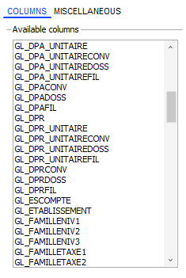

Reminder:
- Fields with a DEV suffix are expressed in the currency of the document. All other fields are expressed in the currency of the store.
- The conversion rate for converting between the document currency and store currency is stored in GP_COTATION and GL_COTATION.
- The conversion rate for converting between the document currency and folder currency is stored in GP_COTATIONDOS and GL_COTATIONDOS.

In the Item flash

Settings

Back Office > Inventory > Query> Flash query settings

In the Inventory flash query screen, click the [Selling price] button to display the list of the available fields. Then double-click the first available None field. The Settings window displays and allows you to configure the Currency and Quotation type fields.

This information is not populated by default, thus allowing the display in the store currency and not in a forced currency.

In the case where the currency is specified, the quotation type must be entered. This setup window is also used to entered information of type inventory in the fields Added values and/or Subtracted values . However, note that if the added or subtracted values are not exclusively a price type, the Currency and Quotation type fields will be grayed out. Moreover, the Zoom on type field is enabled only it the currency is not populated.

Operation

Back Office > Inventory > Query > Item flash (selling price)

The Inventory flash query screen displays the prices the currency defined previously. Clicking the field where the currency is specified, displays the exchange rate and the reverse rate at the bottom of the screen. Note that this screen displays whether the item has an inventory record or not.

In Front Office

Front Office > Sales receipts > Enter transaction

There are two options provided in the sales receipt entry window, accessed by clicking the [Additional actions] button in the toolbar.

- Receipt price in foreign currency: displays the total price of the receipt in different currencies.
- Line price in foreign currency: displays the price of the current line in different currencies

You can also underline the currencies whose rates have not been updated for some time.

These options can be used if the appropriate settings have been defined first, as described in the following chapter.

Settings

Front Office > Settings > Registers > Registers

The currencies you want to display depend on the settings defined for the register. To define these settings, go to the Preferences tab and populate the following fields in the Display amounts in foreign currency pane:
- Displayed currency: Select the currency you want to display. A maximum of 63 currencies can be stored.
- Highlight rates entered for more than x days: If enabled, this option displays the currencies in red whose rates have not been updated for the number of days specified in this field (x being a number between 0 and 9999).

Operation

Front Office > Sales receipts > Enter transaction

For a sales transaction in progress, click the [Additional actions] button in the toolbar and select one of the proposed options in the sales receipt entry screen.

A window will open with a list of prices converted into the currencies defined previously, and their exchange rates. The conversion takes into account the currency rate of the incoming payment, defined as follows:
- Stock exchange of the store (set in the store record.
- Default rate type for payments (defined in the Company settings)

The currency amounts displayed in red are amounts whose rates were entered later than the number of days set.

Note that these options can be associated to buttons on the register touchpad (refer to Configuring Touch Screen and Keyboard .)

Configuring Touch Screen and Keyboard

#### Currency Management Utilities

Currency Management Utilities

Currency updates

Changing folder currency

Back Office > Administration > Maintenance > Change folder currency

The folder currency can be changed in the company settings through Accounting > Folder settings, directly in field Folder currency , provided that there are no inventory documents or records already present in the folder. As soon as a document or inventory record is created in the folder, this company setting is grayed out. Then, changing the folder currency is possible only in Administration > Maintenance > Change folder currency in Back Office.

Changing the currency for a subsidiary

Back Office> Administration > Maintenance > Change currency for subsidiary

Changing the currency for the subsidiary may be done only if there are no inventory documents or records in all the subsidiary’s stores. Then, the currency may only be changed in Administration > Maintenance > Change currency for subsidiary. This utility enables you to change the currency of a given subsidiary. This change will impact all documents linked to the various stores of the subsidiary. The tool modifies the conversion rate used for converting the document currency and subsidiary currency.

Changing the currency for a store

Back Office > Administration > Maintenance > Change currency for store

Changing the currency in the store record may be done only if there are no documents or inventory records stored in all the warehouses of the store. Then, the currency may only be changed in Administration > Maintenance > Change currency for store.

Recalculating documents

Back-Office > Administration > Maintenance > Recalculation of documents

This utility, which is based on document selection criteria, enables you to recalculate amounts expressed in the store currency. It allows you to correct documents following a change of conversion rate. Exchange rates will then be re-loaded into documents and all amounts re-calculated.

Please note!

We recommend using this utility only in exceptional cases as a temporary measure.

### Tax Management

#### Contents

Tax Management - Contents

Tax management in Cegid Retail Y2 is aimed at meeting the various requirements faced by companies in France and abroad:
- In England: Tax changes are made on the basis of size.
- In Italy: Tax system changes are made on the basis of materials.
- In Canada (and Provinces): Federal tax is applied to products and services (GST) as well as provincial sales tax (PST). Some Provinces (such as Ontario) levy the Harmonized Sales Tax (HST), which is a single, blended combination of the PST and GST.
- Quebec: Levies the federal GST and QST (Quebec Sales Tax).
- In the USA: Specific system

To face these differences, each store is linked to a tax model. According to the third party in documents or the place of shipment for an item, purchases and sales may be subject to taxes, exempt or subject to taxes from another region.

For each country, each item is subject to a tax type (standard or reduced rate), the document will match the grouping of these different areas and enable the application of the correct tax rate for each item. A wizard will help you create a new model. Default values are available in company settings.

Foreword
- Characteristics of French taxes
- Tax management in Cegid Retail Y2

Tax settings
- Settings of tax models and tax rates
- Additional settings (system, type, category, exception, USA specifics)
- Folder settings (company settings, item/third-party/store records, access rights)

Management of tax models and tax rates
- Tax models (viewing/modifying a model and exception management)
- Tax rates (modifying, generating and deleting a rate, and statutory changes to VAT rates)
- Taxation of delivered sales

Search algorithm for tax rates
- Searching for the tax model to apply
- Various impacts
- Tax rate search
- Characteristics of taxes in the USA

Additional information
- Tax calculation for services
- Changes to the tax system at the checkout
- Managing delivery/taxation addresses
- Tax refunds and export sales

#### Foreword

Foreword

If the tax management feature of this software satisfies many cases, it cannot cover all cases. Every country is subject to the same tax management for all trading companies. Therefore, each store will be linked to a tax model that describes the country’s taxation. According to the third-party in documents or the place of shipment for an item, purchases and sales may be subject to taxes, exempt or subject to taxes from another region. For each country, an item is subject to a tax type (normal, reduced tax). The commercial document will match the grouping of these various main areas and enables the application of the correct rate for each item.

Characteristics of French taxes

There are two tax categories in France: the value-added tax (VAT) and the parafiscal tax (this tax is applied to watchmaking). There are different rates for each of these taxes:
- VAT: reduced rate VAT (5.5%), intermediate rate (10%) and the standard rate (20%).
- Parafiscal tax at 0.20%, subject to VAT

Each item is linked to a VAT rate and may be linked to a parafiscal tax rate. This information is present in the item record. Application of the VAT depends on the third party:
- VAT + parafiscal tax
- European Union exemption
- Export exemption

Therefore, there are several scenarios:
- Retail and wholesale customers in France: subject to VAT + parafiscal tax
- Wholesale customers within the European Union: tax exemption for the European Union
- Wholesale customers outside the European Union: tax exemption for exporting

Note that for EU and non-EU wholesale customers, there are two distinct VAT systems, since for EU customers must periodically prepare a “Trade of goods declaration” on EU exchanges.

Tax management in Cegid Retail Y2

Tax setup is simplified since it uses a wizard to create the following elements:
- Tax model: The tax model states the tax rules applied in the store where the document is issued at the point of sale for sales transactions.
- Tax category: The code is automatically generated, prefixed with the model code (e.g VAT, parafiscal tax).
- Tax system: The tax system applicable to local customers and an exemption system (e.g. default system and exemption system).
- Tax class: The tax class takes into account item characteristics from a fiscal point of view.
- Tax type (e.g. standard rate, reduced rate, exempt)

Once a tax model is created, you need to create tax rates for each category, type and tax system. They will be created manually (entry of percent values by tax type).

The tax model creation wizard enables you to create a default tax system and an exemption system for EU customers.

For the EU countries, the user must also create an exemption system for export customers (and a system for the French overseas departments).

The tax system is linked to the tax model and has one or more applicable taxes, or none at all.

The tax model is then linked to a store.

The creation steps for the tax model and tax rate are explained in the sections below.

#### Tax Settings

##### Settings of Tax Models and Tax Rates

Settings of Tax Models and Tax Rates

Back Office > Settings > Management > Taxes > Tax rate

Focus on the setup screen

The screen that displays allows you to create tax models, as well as tax rates.

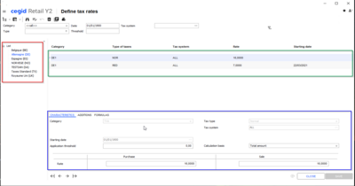
- The left part of the screen shows the list of existing tax models (Belgium, Germany, etc. as you can see from the screenshot above).
- Once you have selected the tax model (Germany, in the screenshot above), the right part of the screen displays the rates associated with the model .
- The bottom part of the screen displays the characteristics of selected tax rate (DE1, as you can see from the screenshot above).

Step 1: Creating a tax model

Click the [New/New tax model] button at the top of the screen and follow various steps of the wizard.

Characteristics of taxes in the USA!

Note that some settings present below enable you to manage features related to American taxes.

Step 1/7

| Fields | Description |
| --- | --- |
| Model code | Specify the tax model code in two characters. |
| Description | This wording gives a specific name to the model (e.g. French model). |
| Number of taxes | Users can create up to 2 taxes linked to this model (e.g. VAT and PFT (parafiscal tax). The second step in the wizard enables this creation. |
| Number of decimals | Number of decimal places in the tax rate. For example, two decimal places in France (20.00%) and three in the USA (8.675%) |

Step 2/7

This step creates the algorithms required to calculate taxes. Note that tax no. 2 may be subject to tax no. 1.

The tax type can be created using this button without leaving the screen. Otherwise, it can be created in Settings > Management > Taxes > Tax types.

Step 3/7

This step creates the default tax system for the tax model, i.e. the tax system that applies by default to the third-parties of the documents that are subject to this model:

| Fields | Description |
| --- | --- |
| Code | Tax system code in three characters. |
| Description | This easily identifies the default tax system (e.g. France.) |
| Applicable taxes | Here, the user will find the taxes created in step 2. |

Note that the other tax systems can be created later and linked to the model in Settings > Management > Taxes > Tax system.

Step 4/7

This fourth step completes the setup.

| Fields | Description |
| --- | --- |
| Country of application | Select the country to apply the model to. |
| Search for taxes | The tax rate generally depends on the item, thus on the item tax category. In some countries, it also depends on the location where ownership is transferred. This can be the zip code (as in the USA), or a region (as in France, where the standard rate for the region of Corsica is different than the one for mainland France). Tax search enables you to specify how tax rates can be determined. This setting thus defines how to search for tax rates in the tax model (location information): No regionalization: If the rate does not vary within a country, this criterion is used. (Country = Country of ownership transfer location / Other criterion: None.) Zip code: Search based on the delivery address zip code. (Country = Country of ownership transfer location / Other criterion: Zip code of the ownership transfer location.) Region: Search based on the delivery address region (Country = Country of ownership transfer location / Other criterion: Region of the ownership transfer location.) Tax system: Based on the third-party’s tax system (Country = No / Other criterion = Document tax system.) Store: Based on the store specified in the document (Country = No / Other criterion = Store linked to the document.) Generally, the user must take into account the address where ownership is transferred. Back Office documents are considered as delivered, therefore the delivery address is taken into account, or otherwise the third-party address in the document. Receipts entered in Front Office are considered as in-house sales (no delivery); the address for the register store is taken. However, it is possible to enter a receipt by specifying that it is to be delivered (the “sale to deliver” concept in Front Office). In this case, the Back Office rule will be used. For management of American taxes, it is important to know which state a city belongs to. Therefore you must add the concept of region to the zip code table (or state) for the United States. In the USA, the state is generally entered in the region of the customer record. Note that the $$_NONRECHTAXES setting in data imports, enables you to recover the tax calculation method for the document of origin. |
| Exemption system | This system is used if you want to enter export sales (see Export Sales in FO). It is also used in the USA, if you apply the rule of fiscal representation, meaning that items delivered to a state where the merchant has no representation, are exempt from tax. |
| Export | Activation of the derogation rule for services impacts the behavior of the tax calculation engine, in order to take this exemption rule into account. This also causes changes to tax application for Service type items (see Activating the Exemption System for Services .) |

Step 5/7

| Fields | Description |
| --- | --- |
| Keep null tax details | Usually, no base was kept if the amount of the associated tax was zero. This tax model option allows you to keep documents to facilitate calculation of taxable and non-taxable amounts in the tax base table. This is used in the USA to generate a fiscal report, in particular with the threshold that triggers the tax (e.g. 8.675% above $110). If you sell goods for $80, no tax will be applied. The fiscal report must state 8.675%, sold $80, levied $0). |
| USA | Activation of USA fiscal representation: In the USA, the tax to apply when goods are delivered in another State depends on the fiscal representation of the company in that State. This tax model setting allows activation of this operating mode. Tax rate ranking (Colorado - USA): In the state of Colorado, the tax rate depends on not only the zip code (as in other American states), but also the county and city. In this state, several tax rates may be applied in the same zip code because the same zip code is used by several counties or cities. There are approximately 1200 “zip codes+city+county” in the state of Colorado, where at least half have different tax rates for the same zip code. To meet this requirement, you may enter several tax rates for the same zip code using the concept of rank. Therefore, tax rate searches will be performed as follows: Take the rate set for the zip code of the delivery address in the case of a sale to deliver (Back or Front Office), or the store address for the register for in-house sales (Front Office.) If there are several ranks of rates for a zip code, the user must select the appropriate rate from the list that is displayed. This selection is only possible during document entry. In other cases, a 0 rank rate will be used. If no rate is found, the district rate will be used. Cegid Retail Y2 does not allow you to save several lines with the same zip code and the same city in the zip code table. Consequently, the pair (zip code, city) may only be linked to a single county. |
| Calculating taxes by line | Cumulating taxes per line is correct, but may cause discrepancies among totals. This option enables you to determine whether the tax is to be calculated for each document line valued with tax exclusive or tax inclusive prices. If no option has been ticked, the tax will be calculated on the total of the lines with the same tax elements. This total is called the tax calculation base. The difference between the total tax of the lines and the tax amount calculated from the base, is reflected on the line where the amount is highest. Line calculation: The tax amount is calculated for each line. It is cumulated by tax rate to populate the table of the document footer. Tax formula = Base * Rate, is not always true. Calculation base: Tax formula = Base * Rate is always true. The difference is reflected on the line with the highest amount. The default setting is: For tax exclusive documents. |

Step 6/7

The To be accounted as a value-added tax step allows you to specify taxes which are VAT (added-value tax) from among all applicable taxes, for a maximum of 2 at present.

This also allows you to transmit the VAT rate table to fiscal printers requesting it (only this tax type is sent to printers) and tax refund (only this tax type may be refunded).

Step 7/7

This last step starts the creation of the tax model according to the options defined, or enables users to access previous steps, if necessary. If the step is confirmed, the tax model will be created and may be viewed on the left side of the main screen.

Step 2: Creating a tax rate

This step allows you to create a tax rate and to assign it to the previously created model. Consequently, once the tax model is created, the user must create tax rates for each category, type and system.

If the left side of the screen displays the various tax models as previously seen, the right and bottom sections of the screen are used to create the various tax rates.

For example, for the French VAT, in addition to the exemption system, there are various applicable rates, such as:
- Normal rate at 20%: Applied by default to all operations if no other tax is specified.
- Reduced rate at 10%: Applied to non-processed agricultural products, such as firewood, passenger transport, catering, housing renovation, entry fees for museums, zoos, etc.
- Reduced rate at 5.5%: Applied to food, water and non-alcoholic beverages, books, etc.
- Reduced rate at 2.1%: Applied to medicines reimbursed by the French Social Security, blood products, etc.

After having selected the tax model from the list on left, use the [New/New tax rate] button available in the toolbar of the screen. The cursor will go to a new line to enter a new tax rate.

A new line will be added to existing ones on the right side of the screen.

At the bottom of the screen, populate the fields present in the various tabs shown below, then validate the record.

Quit the applications, then restart the server so that the changes will be saved.

Characteristics tab

This tab is used to specify the category, tax system, tax type, as well as the rate to apply to the purchase and sales documents.

By populating a document including taxes, tax calculation will take into account the value indicated in the Calculation basis field, as well as the limit set for the application. The values proposed for the calculation basis are as follows:

| Calculation basis | Description |
| --- | --- |
| Total amount | Tax calculation is done on the total amount, provided that the item amount exceeds the set limit. Examples: Limit of €100 and an item at €90 à the limit has not been reached, the tax will be 0. Limit of €100 and item at €120 à the limit has been reached, the tax will be calculated on the total amount of the item price, i.e. €120. |
| Above the limit (GXT_TAXESISUPSEUIL) | Tax calculation is based only on the amount exceeding the limit. Examples: Limit of €100 and an item at €90 à the limit has not been reached, the tax will be 0. Limit of €100 and an item at €120 à the tax will be calculated only on the difference between €120 for the item and €100 for the limit, i.e. on €20. |
| Up to the limit (GXT_TAXEJUSOUAUSEUIL) | Enables you to calculate tax up to a certain limit. Examples: Limit of €100 and an item at €90 à the limit has not been reached, the tax will be calculated on €90. Limit of €100 and an item at €120 à the limit has been exceeded, the tax will be calculated only on the €100 limit. |

Tax calculation and the limit test are based on the ex-tax unit price of the item.

You may view the tax rate applied and the tax calculation amount by using the following buttons:
- [Actions on taxation/Taxation for line] in sales transaction entry.
- [Additional actions/Taxes/Taxation for line] in documents.

Concerning document importing, the tax calculation engine takes the Calculation basis option into account for the tax rate, in order to determine the calculation basis for the amount of tax, and therefore to calculate the amount of tax for each line of imported documents.

This tax calculation mode is also available in standalone mode.

Notice to those using older versions!

The new calculation basis replaces the old field called Taxation beyond the threshold . History will be recovered and the old settings will inherit the following values:
- Total amount: If the old field, Taxation beyond the threshold was not ticked:
- Above the limit: If the old field, Taxation beyond the threshold was ticked:

Note that Up to the limit is not involved, since it concerns a new option.

Additions tab

This is used to specify the control accounts to be used for posting the selected tax.

Formulas tab

This tab is to be used only for the USA, in order to meet their specific tax application conditions. The variables available for using a formula are as follows: [BASE], [BASETAXABLE], [SEUIL], [TAUX], [QUANTITE].
- [BASE] - Enables you to use the total amount of the line (all discounts deducted) for configuring the calculation formula for the taxable base or in the one for calculating the tax amount.
- [BASETAXABLE] - Obtains the basis for the calculation of the tax which is calculated by the base calculation formula and to use it in determining the tax amount calculation formula. If no formula has been set, the taxable base is equal to the BASE.
- [SEUIL] - Enables you to use the application limit set for the tax rate when configuring the formula for the calculation of the taxable base, or in the one for the tax amount calculation.
- [TAUX] - Enables you to use the tax rate set when determining the calculation formula for the taxable base, or in the one for tax amount calculation.
- [QUANTITE] - Enables you to use the line quantity when determining the taxable base calculation formula, in the one for the tax amount calculation.

Note that the data import module allows importing taxable base calculation formulas. The operation associated to the $$_PARAMPRECEDENT field takes these formulas into account.

##### Additional Settings for Taxes

Additional Settings for Taxes

Tax system

Back Office > Settings > Management > Taxes > Tax systems

The tax model creation wizard enables you to create a default tax system and an exemption system for EU customers. All other systems linked to the model must be created manually via this command.
- For the EU countries, the user must also create an exemption system for export customers (and a system for the French overseas departments).
- To manage American taxes, please see the section on American taxes.

Tax types

Back Office > Settings > Management > Tax types

This command enables you to create various tax types. You can create different types for each tax category, such as:
- VAT taxes: Exempt, Normal, Reduced
- PFT taxes: Subject, Exempt

These types are used to create tax rates.

Tax category

Back Office > Settings > Management > Taxes > Tax categories

Tax categories are defined when creating a tax model. It concerns items.

Item or third-party exceptions

Back Office > Settings > Management > Taxes > Batch item (or third-party) exceptions

Rules concerning tax exceptions can be configured and manually started for groups of items or third parties in each country, in order to meet local legal requirements (VAT: normal, reduced, exempt, super-reduced, etc.)

Select the elements to process using the space bar, then click the [Launch process] button. The wizard for updating item exceptions displays. You can then select the tax model and the taxes to process. The [Next] button is used to check the selection before the process is launched via the [End] button.

Specifics for item exceptions

You can program a scheduled task to update item exceptions.

This is possible only if the user had decided to process all items by selecting them in the multiple criteria screen via the [Select all] button.

In this case, in step 2, click this button to open the Settings for task screen, to set the required triggering settings and frequency.

Note that the scheduler saves the query that was used in the multiple criteria screen to build up the item list that was displayed. This query is run again every time the scheduled task is launched. Updating item exceptions concerns all items that meet the conditions of the query at the time the task is launched.

USA specifics

Managing tax exceptions

Back Office > Settings > Front Office > Register

During the daily opening, you can specify whether there will be an exception in the tax system configured for the day. This system is used in some American states to boost sales.

There is an option for registers that never have used such measures. This is the Tax exception upon opening cash register setting present in the Daily operations tab. It enables you to propose the option of a tax exception to apply by default to receipts for the day.

Concept of district

Back Office > Settings > General > County

To simplify management of American taxes, a zip code may be assigned to a district or county. Each district is identified by a unique 6-character code. It must be associated to a country and can be linked to a region. As seen previously, regions are created in Settings > General > Region. A district is present only in the zip code record and the tax rate entry record. It does not appear on address records.

In the case of a tax model whose search criterion is the zip code, you can set a tax rate for a district. This rate would apply to all zip codes that are in the district, except if you have declared a rate specifically for the zip code searched. The rate search algorithm takes the district concept into account. Rate searches are done:
- on zip codes
- on county codes if the preceding search returns nothing
- if no rates are found, a rate of 0% will be applied

It is vital that the zip code table be correctly populated. Actually, deleting zip codes or changing a district of a zip code, has an impact on the calculation of taxes for all documents using this zip code. When importing data via the wizard, it is vital to either give the zip code and leave the county blank, or give the county and enter ‘...’ for the zip code.

##### Folder Settings

Folder Settings for Tax Management

Company settings

Back Office > Administration > Company > Company settings

Commercial management > Default settings

Open Commercial management > Default settings , and populate the following fields:

Commercial management > Default settings
- Country code of third-party
- Default tax model

Accounting > Miscellaneous

Open Accounting > Miscellaneous , and enter the invoicing system. The latter is recovered by default in the tax system when creating customers and suppliers.

Accounting > Miscellaneous

Item record

Back Office > Basic data > Items > Items

When creating an item, the Characteristics tab shows the tax type of the default tax model as specified in the company settings.

By default, all items are assigned to the default tax type of the model. This screen enables you to change this assignment. Entering item tax types is therefore always done via models.

After validating items, you may complete the rate type for other tax models, using the Exceptions on tax model option button.

It is thus possible, for example, for an item is subject by default to the “Standard taxes” tax model (defined in the company settings and to the "Normal” tax type (item record, Characteristics tab.) However, in documents where the “France” tax model is used, the item will be “Exempt”.

Remark about the application to dimensions!

The tax type assignment screen is used by default for each new dimensioned item. If the assignment of a generic item is changed, the user will be prompted to carry over changes to all dimensions.

Third-party records

Customer/supplier records

Back Office > Basic data > Customers (or Suppliers) > Customers (or Suppliers)

When you create a third party, the Conditions tab (for a customer) and the Payments tab (for a supplier) display the system specified in company settings (see the Accounting > Miscellaneous section above). This screen is used to change this assignment.

After validating the record, you can complete these settings using this button and the Exceptions on tax model option.

Store record

Back Office > Basic data > Stores > Stores

In the store record, the Additions tab is used to specify the tax model used by the store, as well as the tax system assigned to new customers.
- Tax model: The tax model displayed by default is the one specified in Default settings of the Company settings.
- Tax system: The tax system recovered by default is the one specified in Accounting/Miscellaneous of the Company settings, if it is associated to the store tax model. Otherwise, the default tax system of the tax model will be used.

Access rights

Back Office > Administration > Users and access > Access right management

Enable access rights for the user groups of your choice.

Menu 105 - Settings

The Management section is used to handle the access to the various commands relating to tax management (rates, systems, categories, deletion, etc.)

Menu 107 - Sales receipts

In the Access rights/Enter transaction section, the Modify taxes access right authorizes or forbids the user the to change the taxes for the line or the receipt being entered. By default, you may change the tax via the [Actions on taxation] button.
- If the user is granted authorization, they can use this button to modify the taxes on the document and/or the line.
- If the right is denied, no change can be made to taxes, either using the taskbar buttons of the touchpad or using the keyboard. This action can be carried out only if an authorized user enters a password.

Menu (113) - Follow up actions

Reminder concerning the follow-up of actions

This feature enables you to trace the various operations and manipulations performed by staff members. Once the actions you want to follow up are defined, they may be viewed in Back Office or Front Office:
- BO > Administration > Event log > Log query
- FO > Settings > Administration > Event log > Log query

In our case, the Setting/Taxes section allows you to trace the operations performed through the following commands:
- Delete tax rates
- Generate tax rates

For further information about tracked actions, please refer to the documentation on the Event Log .

Event Log

#### Management of Tax Models and Tax Rates

Management of Tax Models and Tax Rates

Tax models

Back Office > Settings > Management > Taxes > Tax rate

Viewing/Modifying an existing model

The left side of the screen displays the various tax models. Double-clicking on the model of your choice will open its record:
- The Characteristics tab displays the main elements of the model configuration, notably the tax calculation algorithm. The Closed option will temporarily suspend the model.
- The Properties tab uses the various elements configured during tax model creation. The Ignore free items at checkout in the Fiscal printer panel enables you to avoid printing free items on the fiscal receipt (e.g. samples which may not be sold).

Managing exceptions to the tax model

The left side of the screen displays the various tax models. Double-clicking on the model of your choice will open its record:

Click this button to open the Tax exception window, to set the exception to be applied. For example, an item for which a NORMAL tax applies, may use a REDUCED type in some cases.

Note that tax exceptions are also taken into account in standalone mode. In that case, tax model exceptions will be downloaded to all registers.

Tax rate

Modifying a tax rate (legal changes in VAT rates)

Back Office > Settings > Management > Taxes > Tax rate

Note!

The procedure for legal changes to VAT rates is the same as the one previously seen concerning tax rate creation.

Actually, existing rates must not be changed under any circumstances. It is therefore preferable to create a new rate, with its own application date.

Notes:
- If the old ones have been correctly configured, you need only duplicate them and modify just the rate and the application start date.
- If item or third party exceptions exist, you will need to update them manually in Back Office > Settings > Management > Taxes > Item exceptions.

Generating a tax rate

Back Office > Settings > Management > Taxes > Generate tax rates

This tool creates a new tax rate for a set of zip codes or districts.

To obtain the elements desired, populate the various selection criteria proposed in tabs.

Then select the elements to process, and click the [Start generation] button to display the tax generation wizard.

Enter the various characteristics for the rate to be created.

A rate will be created for each element selected.

If a rate already exists for the same date, you can keep the existing rate or replace it with a new one.

Deleting tax rates

Back Office > Settings > Management > Taxes > Delete tax rate

Please note!

You must not delete a rate if it is likely that you will save or recalculate a document for a date that this rate will be applied.

After the selection of a tax model, this command deletes on or more tax rates associated with the model. Once the selection criteria have been applied, the list of the concerned tax rates displays.

Select the lines to delete using the space bar or select all lines with the [Select all] button.

Once you have selected the rates, use this button to start deleting the rates.

Once the deletion process has been carried out, the Delete tax rates trace is logged to the event log.

#### Taxation of Delivered Sales

Taxation of Delivered Sales

Since July 1, 2021, distance sales have been taxable in the country of arrival when carried out in European Union countries. To meet this legal requirement, the document must be able to be taxed using a tax model. This tax will be levied at the customer's delivery address, or at the store where the goods are collected or reserved, or at the pick-up point.

This feature is also relevant for countries such as Canada, where many provinces have different tax rates, even though they are the same country.

This topic explains how to apply the tax rules of the country of delivery, rather than the country of the store where the items are purchased.

Preliminary settings

Settings of tax models and tax rates

Back Office > Settings > Management > Taxes > Tax rate

In Cegid Retail Y2, tax rules are carried by the tax model, and each store is associated with a tax model.

Consequently, tax models and tax rates must be set up beforehand in the folder (see Tax Model Management .)

Tax Model Management

Defining substitute taxes

Back Office > Settings > Management > Taxes > Delivery taxation

This step allows you to define which substitute tax model to use in case of delivery in another country. This setting also allows the model to be adapted to a specific region, if required

| Fields | Description |
| --- | --- |
| Original tax model | Selection of the tax model created previously. |
| Delivery country | This field mandatory and the country must exist in the country table. |
| Delivery region | This field is optional. If it is populated, the region must exist in the country. This field can be used to mange the various provinces/regions of a country. |
| Tax model to be used for delivery | This is the substitute tax model. This field is mandatory and must be different from the original tax model. |

In the example below, the setting indicates that if the stores associated with the tax model "Germany" make a sale to be delivered in "Spain", they will have to apply the tax model "Spain".

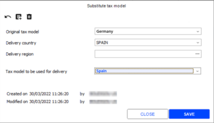

For “Service” type items

Back Office > Settings > Management > Taxes > Tax rate

Only items of type "Merchandise" are systematically concerned.

The taxation of services (alterations, shipping costs, etc.) depends on the Derogation rule for services option available in the Properties tab of the tax model (after having double-clicked on the tax model):
- If the option is checked, all services are subject to the substitute model.
- If the option is not checked, all services keep the original model.

How it works at checkout

When the cashier uses the Sale for delivery function on the receipt being entered, Cegid Retail Y2 requires the delivery address.

Once this address is known, a search is performed in the Delivery taxation menu to check if there is a substitute tax model defined for the store's tax model, for the country and for the region of the delivery address. If there is none, you will search for the one defined for the store’s tax model and for the country of the delivery address, i.e. without a region filled in. If the latter exists, Cegid Retail Y2 applies it to the lines to be delivered. It assigns the customer's tax system and the item tax types for the substitute tax model to these lines. Cegid Retail Y2 then recalculates the taxes applied to the receipt. The same process is run if the delivery address is changed.

Note that the substitute tax model can assign a "reduced" line tax while this item was subject to "normal" tax in the original tax model.

Special cases

The substitute tax model is not taken into account in the following cases :
- The cashier has changed the tax model of the receipt. It is therefore different from the tax model defined for the store of the register.
- The cashier has used the Export sale function.
- The tax calculation has been deactivated for the receipt line with the option No automatic tax calculation or by CBS.

Note that if the tax model of the receipt has been substituted for the one to be used for delivery, the cashier can no longer use the Export sale function.

Additional information
- Delivered/Picked up : The use of the substitute tax model covers receipts entered in the delivered/picked up context, as receipts are financial documents. The substitute tax model only applies to lines making a delivery, not to lines to be picked up.
- Documents affected : The use of the substitute tax model does not apply to Back Office documents, nor to other documents in the flow (CC, CDI, etc.) as they only concern inventory management. Their valuation and taxation are not valuable. It is therefore accepted that these documents are taxed with the tax model of the document store.
- Standalone mode : Unlike the Delivered/Picked up module, the Sale for delivery function is not available in standalone mode. In standalone mode, the item tax types are only known for the tax model of the cash register. Likewise, the tax rates are only known for the tax model of the cash register store. It is therefore not possible to automatically replace the tax model of a line that is to be delivered. In this case, a message alerts the cashier to change the taxes manually.
- Management of sales returns : For accounting reasons, the return of a receipt line is only allowed if the country of the tax model associated with the line is the same country as for the tax model of the current receipt, as it is not possible to deduct a tax collected in another country. This principle is extended to delivery taxation, i.e. the return of a receipt line is allowed if the tax model of the returned line is a substitute model for the tax model of the current receipt. Note that after a manual change of the model in the original sale, the return of the sale is not possible. In this case, the message "Line taxes are not compatible with the taxes of the document” will be displayed.

How it works for an omni-channel order

Whether the order has been created using a SmartClient or a Web Service, you must have defined the settings beforehand.

Order created using a SmartClient

When an e-commerce order is entered in the Back or Front Office, a search is performed in the previous settings to check whether a defined substitute model exists.
- If it exists, the tax rate of the country of delivery is applied to the document lines.
- If it does not exist, the tax rate defined for the document store is applied.

Order created by the SaleDocument Web Service

Using the delivery address

In the Web Service envelope, add and update the delivery address fields in order to create the order correctly in Cegid Retail Y2:
- DeliveryAddress (PIECEADRESS) Delivery and billing address data of the billing document.

Using the tax model and the tax system

No settings are required, as taxes are calculated according to the tax model and the tax system as specified, and received from the envelope.

In the Web Service envelope, add and update following fields at line level in order to create the order correctly in Cegid Retail Y2:
- TaxCountryId (GL_PAYSTAXE)
- TaxModelId (GL_CODEMODELETAXE)
- TaxRegionId (GL_REGIONTAXE)
- TaxSystemId (GL-REGIMETAXE)

Using the tax model, tax system and VAT amount

No settings are required as the tax model, the tax system and the tax received from the envelope will be specified. The address is recovered from the customer record, as it is missing in the envelope.

Add to the Web Service envelope, at line level, the 4 tax fields seen in the previous case, as well as the following 2 fields:
- Amount (GL_TOTALTAXEDEV1)
- FamilyId (GL_FAMILLETAXE1)

Use cases

| Setting up 2 substitute models |
| --- |
| Belgium | Spain with Andalusia |
|  |  |

For delivery to the customer, taxation will be as follows

The delivery address in the order will be the customer's address, and for taxation:
- Spanish customer > Delivery to Andalusia in Spain = Spanish tax.
- Spanish customer > Delivery in Spain without region or in another region than Andalusia = Standard tax because no model defined.
- German customer > Delivery in Germany = Standard charge because no model defined.

For pick-ups or reservations in a store or pick-up point, taxation will be as follows:

The delivery address in the order will be the address of the store or relay point, and for taxation:
- Spanish customer > Delivery to a pick-up point whose address is in Spain with Andalusia = Spanish tax.
- Spanish customer > Delivery to a store whose address is in Spain with Catalonia = Standard tax, as no model has been defined for this region.
- Belgian customer > Reservation in a store in Belgium = Belgian tax.
- French customer > Delivery in Belgium = Belgian tax.

#### Search Algorithm for Tax Rates

Search Algorithm for Tax Rates

Searching for the tax model to apply

The tax model used is the one defined at the document level. It can be modified by the user, but the following is proposed:
- The tax model of the document store.
- If it is not defined, the default tax model (company setting) is used.

Various impacts

Impact of the third party

Third party exceptions are searched for tax model. If an exception exists, the system of this exception is taken into account. Otherwise, the default tax system of the tax model is used.

Impact of the item

If the default tax model is used, the tax types defined in the item record are taken into account.

If a tax model other than the default model is used, the item exceptions for the item exceptions for the tax model are searched for.

If an exception exists, the tax types for the exception are taken into account.

Otherwise, the default tax types of the tax model is used.

Impact of the document line

If an exception has been entered for the line, the tax types of the exception are taken into account; the exception tax types are defined as a replacement for item tax types.

Impact of the location set in the model

The taxation country is used, except if the location is set to Tax system or Store . If the location defined for the tax model is set to Region or Zip code , the taxation region (or taxation zip code) defined at the document line level is used. This information can be modified by the user, but the following cases are considered:

Items of type “Service”

If the item is a service, the region or the zip code of the document store is used.

Items of type “Merchandise”

If the item is merchandise, the region or the zip code is searched in:
- The delivery address of the line, if it exists.
- The delivery address of the document, if it exists.
- The store address for Receipt type documents.
- The third party's address for documents of another type.

Tax rate search

In any case, the tax rate search criteria includes the document tax model, the line tax type and document date.
- If the location defined for the tax model is set to Region or Zip code , the regional rate will be searched, according to country and tax region.
- If there is no regional rate, the national rate will be searched, according to the country of taxation.
- If there is no national rate, the line is considered to be exempt from taxation.

Characteristics of taxes in the USA

If the region (or state) of the taxation zip code is different than the region of the store issuing the document, and if there are no stores matching the region of the taxation zip code (see fiscal representation in the state), the line will not be subject to tax.

#### Additional Information

Additional Information on Tax Management

Tax Calculation for Services

In principle, the French VAT must apply to a service, such as a repair made by a provider of the service in France. But in most cases, the exemption rule will apply. This rule states that if the beneficiary of a service located in another member-state of the European Union has given the French service provider a VAT identification number in another member-state, the French VAT will not apply if the goods are shipped out of France after the completion of the service.

Activating the exemption system for services

Back Office > Settings > Management > Taxes > Tax rate (tax model)

This system is enabled in step 4 for the tax model creation (see Settings for Tax Models), using the Derogation rule for services .

When a document is entered, the tax calculation engine searches the rate to apply from :
- The tax model of the document store.
- The tax category of the item (VAT, PFT, etc.)
- The tax type of the item (normal, reduced, etc.)
- The country, region or zip code (according to the settings defined in the tax model).
- The document date

The country, region or zip code are those of the location of the ownership transfer, i.e. the delivery location for the goods and the location where the services are realized . The Derogation rule for services option of the tax model enables the use of the country, region or zip code of the delivery location in the case of services, in order to order to align with the operating mode for goods.

the delivery location for the goods and the location where the services are realized

The following table presents the origin of this data according to the document type, merchandise type, and the value of the Derogation rule for services option (in blue if the option is ticked) of the tax model.

|  | Purchase or sales document | Receipt | Receipt to deliver |
| --- | --- | --- | --- |
| Merchandise | Delivery address | Store address | Delivery address |
| Service | Store address or Delivery address | Store address | Store address or Delivery address |
| Financial operation | Store address | Store address | Store address |

- Impact on export sales: No impact When a sales document is transformed into an export sale, the exemption system applies to all the line relating to a Merchandise or BOM type item. Services are ignored by this process and still subject to the tax rules that applied to the document before the latter was transformed into an export sale.
- Impact on tax refunds : No impact Only the receipt lines that concern a Merchandise or BOM type item, with a VAT amount greater than 0, are sent to the tax refund application. Services are ignored by the process and are not subject to tax refunds.

Changes to the tax system at checkout

It is possible to configure a button on the register to change the document tax system during checkout operations. (Example: Make a sale without tax with ex-tax management (for USA or Japan).

Button configuration

Back Office > Settings > Front Office > Register > [Configure touchscreen and keyboard] button
1. Select the “Free” button.
2. The Type of button field must be set to Function .
3. In the Function field, select Document tax system as shown below.

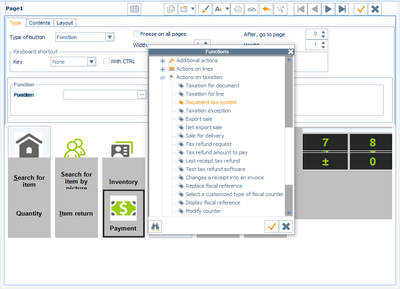

At the checkout, the list of tax systems is the one for the store register tax model.

In Front Office (at checkout) the tax system can be overridden in the toolbar, with the [Actions on taxation] button.

In Back Office, the tax system can be overridden in the toolbar, with the [Additional actions] button.

A confirmation message will appear if the document tax system has been changed.

Managing delivery/tax addresses

Back Office > Settings > Documents > Documents > Document types (Third-party tab)

The Delivery/taxation address , available in the Third-party tab in document types, enables you to manage customers that may, for example, purchase in a British store and place an order in the USA.

The tax for the British store will be applied to the receipt. On the other hand, another tax must be applied to the order, as the one corresponding to the main residence of the customer.

This option will be also copied to complement by store.

For more information, see Delivery/Taxation Address .

Delivery/Taxation Address

Tax refunds and export sales
- For further information about tax refund management, please refer to topic Tax Refund Connectors
- For further information export sales, please refer to the Export Sales documentation.

### Document Management in Back Office (Purchases and Sales)

#### Contents

Cycle and Purchase and Sales Document Management (Trade and Retail) - Contents

The purchase and sales cycle is used to manage the different documents necessary for the smooth running of the company. Cegid Retail Y2 has a very large range of possibilities for the management of these documents.
- The purchase cycle mainly occurs in the Back Office Purchases module, but some functionalities are however available in Front Office.
- The sales cycle distinguishes between retail sales (sales made with retail customers and with tax included prices), and trade sales (sales made with corporate customers, generally with tax excluded prices.)

Only purchases and sales made in Back Office are described in this topic.

Introduction
- Overview of the purchase cycle
- Trade sales cycle

Miscellaneous settings
- Document type settings
- Additional setup for trade sales documents
- Access rights management

Manual entry of documents
- Header information
- User-defined tables for documents
- Body of the document
- Document footer information
- Payment entry
- Other entry functionalities

Query, modify and duplicate documents
- Query documents/receipts
- Modify documents/receipts
- Duplicate documents
- Preventing the modification or duplication of a document/receipt

Generation of purchase or trade sales documents
- Manual generation of documents
- Automatic generation of documents
- Pre-receipts and receipts of ALFs and CFs
- Grouping criteria
- Visa management
- Remainder management

Links with inventory
- Impacts on inventory

Trade payments
- Trade settlement settings
- Entering trade payments
- List of payments when generating invoices
- View customer outstanding business
- Reconcile/Cancel payment reconciliation

#### Overview of the Purchase Cycle

Overview of the Purchase Cycle

Different procurement methods

With software from the ORLI range

The purchase cycle can be supplied by the Orliweb software package:
- Orders from Orliweb customers are downloaded to Cegid Retail Y2 as purchase orders.
- Orliweb deliveries are downloaded to Cegid Retail Y2 as delivery notices or supplier receipts, depending on the user’s choice.

By using replenishment or pre-allotment

A purchase order can also be created from:
- Automatic replenishment available in Back Office > Inventory > Store replenishment > Replenishment and distribution.
- Replenishment orders entered directly by the stores and then generated at Headquarters as purchase orders.
- Purchase proposals entered at Headquarters, and then generated as purchase orders by the means of pre-allotment.
- Replenishment suggestions available in Back Office > Purchases > Generation > Replenishment for customer orders > Replenishment suggestions.

Directly in Back Office

A purchase order can also be simply entered directly in Back Office > Purchases > Enter > Purchase order. Here it is possible to enter:
- Orders centralized at Headquarters for all stores
- Orders by store

The procurement cycle

Various purchase documents
- Purchase order proposal (DEF) : This document is a sort of pre-purchase order. It is used to enter at the Headquarters only one document grouping all the needs of the stores for a given supplier, and then generate as many purchase orders as there are stores involved (refer to Pre-allotment of Purchases by Store .)
- Purchase order (CF) : This is a document created for a single store and a single supplier. It can be entered directly, or it can be issued from the generation of other documents.
- Delivery notice (ALF) : The delivery notice is a document used to notify stores of the delivery of ordered items. It is thus an intermediary document between the order and the receipt. The store must validate its delivery notices every day according to the merchandise received. The validated delivery notice is then transformed into a receipt.
- Receipt (BLF) : This document is used to make a record of a supplier delivery. It can either be entered directly, or generated from a purchase order or a delivery notice. This type of document has an impact on physical inventory. The validation of a delivery notice (ALF) in the Front Office has the effect of generating a receipt (BLF).
- Financial invoice notice (AFF) : This document is made up of all sales and all consigned item returns. The process of invoicing sales generates a document of type Financial invoice notice per supplier and per store, in order to enable an analytical allocation of the purchase to the right store. These invoice notices will be retrieved and sent to each supplier of consigned items, with the breakdown of items sold per store, then generated as a financial supplier invoice when the invoice is received (refer to Managing Consigned Items .)
- Supplier invoice (FF) : This document is a typical invoice that validates the merchandise order to a supplier, and has an impact on inventory.
- Financial supplier invoice (FFF) : This document does not physically correspond to a merchandise exchange, and has therefore no impact on inventory. It can be, for example, an additional invoice following a mistake in the original invoice.
- Supplier return (BFA) : This document follows a return of merchandise to the supplier after receipt and/or invoicing. This type of document has an impact on inventory.
- Supplier credit note on inventory : This document corresponds to a typical credit note prompting a supplier invoice. This type of document has an impact on inventory.
- Request for a financial credit (AAF) : This document precedes the financial credit in the purchase cycle, and has no impact on inventory. It is particularly used in litigation management.
- Supplier financial credit note (AF) : This document is the counterpart of the financial invoice. It may, for example, correspond to an invoicing correction only affecting the price and not the quantity of items.

#### Overview of the Trade Sales Cycle

Overview of the Trade Sales Cycle

Trade sales cycle

Overview of Trade sales documents
- Customer quotation (DE) : This type of document is a kind of customer pre-purchase order that performs an initial calculation of the order cost. It has no impact on the physical inventory.
- Pro-forma (PRO) : This type of document is equivalent to a quotation, but is used for administration purposes. It has no impact on the physical inventory.
- Customer order (CC) : This type of document, when used for a specific store and customer, can be entered directly or generated from another type of document that comes before it in the cycle. It has no impact on the physical inventory.
- Delivery preparation (PRE) : This is a kind of intermediate document between an order and a delivery. It is optional, and aims to make it easier to search the inventory for items that have been ordered. It may differ from the relevant customer order to the extent that not all of the ordered items may be available. It has no impact on the physical inventory.
- Customer delivery (BLC) : This type of document can be entered directly or generated from another document that comes before it in the cycle (Quotation/Customer order/Delivery preparation, etc.). It has an impact on the physical inventory.
- Customer invoice (FAC) : This document corresponds to a traditional invoice and has an impact on the physical inventory. It can be entered directly or generated from another document type that comes before it in the cycle – generally a delivery.
- Financial customer invoice (FAF) : This document does not result in a physical exchange of merchandise, and therefore has no impact on the physical inventory (example: an additional invoice following an error in the original).
- Customer credit on inventory (AVS) and financial credit note (AVC) : Customer credit on inventory corresponds to a traditional credit note. Its counterpart is a customer invoice, and it has an impact on the physical inventory. A financial credit note is the counterpart of a financial customer invoice. It has no impact on the physical inventory.

#### Various Settings

Settings Linked to Purchase and Sales Document Management

Document type settings

Back and Front Office > Settings > Documents > Documents > Types

This command lists all documents type used in Back Office and Front Office (especially purchase documents, trade or retail sales document.) You can customize settings for each document type. Click here for further information.

Click here

Required settings for trade sales documents

Back Office > Administration > Company > Company settings > Commercial management

Some of the company settings hereafter have a direct impact on the way in which trade sales documents are entered.
- In Documents - Processing: Check the settings of the Miscellaneous section .
- In Pricing: Check the Use TRADE price lists field.
- In Documents - Entry: The Delivery dates section allows you to set up a delivery date check to be carried out during entry and generation, according to the document type.
- In Customers - Suppliers: Check the Trade settlement management setting (in the Customer payment section.)

Access rights management

Back-Office > Administration > Users and access > Access right management

The following access rights may be activated for the user groups of your choice.

| Menu | Section | Access right description | Cycle |
| --- | --- | --- | --- |
| Menu Concepts (26) | Commercial management - Document entry | This menu manages user rights concerning the particular functions relative to the entry of documents in general, including purchase cycle documents. | Purchase and sales (trade and retail) cycle |
| Menu Settings (105) | Documents | This menu is used to authorize, in accordance with user groups, access to document settings, counter settings, input list settings, etc. | Purchase and sales (trade and retail) cycle |
| Management | This menu allows you to grant the relevant user groups access to the settings tables used when entering documents, for example, payment methods, currencies and exchange rates, tax systems, freight and expenses. | Purchase and sales (trade and retail) cycle |
| Menu Purchases (101) | All sections | This menu grants authorization for selected user groups to get access to all the operations and processes that can be performed on purchase documents according to their type: entry, search, modification, reports and analyses, generation, duplication, processing, price lists, etc. | Purchase cycle |
| Menu Sales (102) | Retail sales | These menus allow you to authorize users to enter, modify and query retail sales receipts in Back Office. They can also be used to manage user access rights for outstanding payments, orders and customer reservations, etc. | Retail sales cycle |
| Pricing | These menus allow you to authorize the relevant user groups to access retail sales price list management functions, i.e. tax included price lists. | Retail sales cycle |
| Analyses and Reports | These menus allow you to grant the relevant user groups access to analyses and reports. | Purchase and sales (trade and retail) cycle |
| Trade sales | These menus allow you to authorize the relevant user groups to input, modify, view, duplicate and reconcile the various types of trade sales documents. | Trade sales cycle |
| Generation | They also allow you to manually or automatically change one type of trade sales document into another type of document that comes later in the sales cycle. They can also be used to manage user access rights for document approval, customer order allocation, remainder cancellation. | Trade sales cycle |
| Trade price lists and Pricing | These menus allow you to grant the relevant user groups access to trade sales price list management functions, i.e. tax excluded price lists. | Trade sales cycle |

#### Manual Entry of Documents

Manual Entry of Purchase and Sales Documents

Back Office > Purchases or Sales (Retail or Trade) modules > Enter

The features linked to the entry of a document are available in the tool bar. The purchase document can be divided into the following parts: Header information, User-defines tables (optional), Body of the document, Footer information of the document, and Payment entry.

Please note that some documents can be entered directly. Others can only be generated from a previous document.

The document type used for the entry of retails is FFO (Sales receipt), and concerns both the receipts entered in Front Office and in Back Office. It includes sales receipts and customer merchandise return receipts.

Header information

A purchase or sales document has a certain amount of header information. Some information is mandatory, especially:
- The supplier (for purchase documents)
- The customer (for sales documents) even if the customer is not identified.
- The store and the warehouse (if multi-warehouse management in use)
- The document currency
- The document date
- The provisional delivery date

Once the items are entered, some information is non modifiable, and other data is optional, such as references (internal, external or follow-up) or the sales representative.

Note that many fields can be pre-set in the document types (go to Settings > Documents > Documents > Types). The field concerned are:
- Document currency: This field recovers the setup defined in the document types/ Preferences tab, field Origin of currency
- Delivery date: This fields is supplied by the setting defined in the document types/Preferences tab, field Origin of delivery date .
- Document sales rep: This field recovers the setup defined in the document types/Employee tab, field Sales representative type .
- References (internal, external or follow-up): These fields recover the settings defined in the document types, tab Miscellaneous .

Document user-defined tables (optional)

Note that the use of document user-defined tables is not mandatory. For more information on user field settings, please refer to topic User-defined tables - Documents .

User-defined tables - Documents

Document body

This part is used to enter items, or other lines such as comment lines. Several entry methods are offered:

Entry of the item reference

Enter directly into the Reference field the item reference, or double-click to select your item from the list (only the items linked to the supplier of the document are proposed.)

Enter barcode

Click this button to display the Enter barcode window.

Terminal downloading

It is possible to use a portable inventory terminal (PIT) to download data.
1. Click the [Enter the barcode] button to display the "Enter barcode" screen.
2. Then click this button to open the Transmission window.

Footer information of the document

In addition to the information displayed on the item lines, it is possible to enter in the footer:
- discount
- A business discount
- Freight and expenses

You can display in the footer data of the document useful information when entering the document such as the available inventory or the purchase unit for example. This is the Line Info:

This line information can be defined in Back Office > Settings > Documents > Types.
1. Open the document type of your choice (for example: Customer order (CC)), then select the Line Info tab.
2. In one of the available fields, select the criterion you want to see in the footer of the customer orders and validate.
3. You must reconnect for the settings to be taken into account.

Payment entry

For sales document (trade and retail,) once the body of the receipt entered and validated, an entry window opens automatically to allow you to add the payment method(s) used.

Other entry functionalities

Back Office > Purchases and Sales (Retail or Trade) modules - Enter

The functionalities linked to the entry of a document are available in the toolbar. Depending on the settings of the folder, other buttons or lines of buttons are available (litigation, packing, pre-allotment etc.)

| Button | Description |
| --- | --- |
|  | This button is used to view the third-party record or the document currency. |
|  | The [Additional actions] button is used to enter information to complement the header information, to detail discounts, to enter taxation exemptions, etc. |
|  | The [Installments] button is used to open the due dates and payment methods input window. |
|  | The [Line actions] button is used to insert and delete lines, to merge lines with identical characteristics and to display or hide generic item dimensions. |
|  | The [Insert subtotal] button is used to create a subtotal during entry. |
|  | This button is used to enter a deposit or a payment, if the Deposit management is enabled in the document type, in the Management tab. |
|  | The [Freight and expenses] button allows you to create or use freight and expenses for the document. |
|  | The [Search] button allows you to search for an element in the document |
|  | The [Detailed description of item] button opens a small free input window for the selected line, which can be used to enter comments on a line. |
|  | If this button is used the item search is performed via the item referencing rather than via a list of items. |
|  | The [Enter barcode] button opens the barcode entry window. |
|  | This button concerns only purchase documents. It is used to insert items in mass based on inventory criteria. |
|  | This button concerns only purchase documents It is used to create an item during document entry. |
|  | This button is used to manage the packing of items, if the appropriate option has been enabled first in the document types. |
|  | This button is used to create a third-party as long as the cursor is located in the document header (a supplier for purchase documents, a customer for sales documents.) |
|  | This button concerns only purchase documents. These buttons are used to allocate automatically the quantity of the previous document to the current document for a specific line or for all the lines of the document. |

#### User-Defined Tables - Documents

=> See also procedure 354 (Managing Document User-Defined Tables)

User-Defined Tables - Documents

If the information in the document header is insufficient to characterize it, you can add data by using user-defined document tables. Therefore, a preliminary setup is required.

Required settings

Step 1: Titles of user-defined tables

Back Office > Settings > Documents > User-defined tables - Documents > Definition

At first, it is necessary to give a title to the additional data (for example, Order type, Origin of the order, etc.)

Step 2: User-defined table elements

Back Office > Settings > Documents > User-defined tables - Documents > User-defined fields

Secondly, you must define the list of the possible values for the titles defined previously.

For example, consider the two previous examples for user-defined tables:
- For title "Order type" you can create the following: Collection, Replenishment, etc.
- For title "Origin of the order" you can create the following: Regular mail, E-mail, Fax, etc.

You can also use an existing subtable, thus avoiding the entry of different descriptions. Therefore, tick the Using a subtable checkbox option, and select the subtable to use. In this way, you can define a table called Collection and then use the Collections subtable without having to fill them in, as they are already defined in the subtable. You can do the same on all the subtables proposed: Zip codes, Accounting categories, Shipping method, Regions, Currencies, etc.

Step 3: Scope of use for user-defined tables

Back-Office > Settings > Documents > Documents > Types

In step three, you must determine the scope of use. Therefore, select in the right-hand part of the screen the document type for which you want to use these user-defined tables (Customer order - CC, Sales receipt - FFO, etc.)

Go then to the User-defined tables tab, and tick the Use of user-defined tables checkbox option, and specify the preferred values.

The Mandatory checkbox option makes the entry of this information mandatory, with or without a default value (refer to Document Types/Tab User-defined Tables .)

Document Types/Tab User-defined Tables

Display of document user-defined tables at checkout

Click here to find out how to display the document user-defined tables at checkout.

Click here

How to use user-defined tables

User-defined tables are then used in document entry for later use in statistics and analyses.

#### Query, Modify and Duplicate Documents

Query, Modify and Duplicate Purchase and Sales Documents (Trade and Retail)

Query documents or receipts

| Access from Back Office | Type of query |
| --- | --- |
| Purchases or Trade sales > Query > By document | By document Documents can be queried document by document. In this case, 1 line = 1 document. Double-clicking on a line allows you to view the document concerned (for re-printing for example.) |
| Purchases or Trade sales > Query > By document line | Query by document line Documents can be queried by document line. In this case, 1 line = 1 line in a document. Double-clicking on a line allows you to view the document concerned (for re-printing for example). |
| Purchases or Trade sales > Query > By document | Query canceled documents The Deleted document checkbox option available the Status tab, is used to view the canceled documents only. By default, this option is not ticked. |
| Sales > Retail sales > Query > Receipts | Query receipts Receipts can be queried receipt by receipt. In this case, 1 line = 1 receipt. Double-clicking on a line allows you to view the document concerned (for re-printing for example). |
| Sales > Retail sales > Query > Receipt lines | Query receipt lines Receipts can be queried by line by line. In this case, 1 line = 1 receipt line: Double-clicking on a line allows you to view the document concerned (for re-printing for example.) |
| Sales > Retail sales > Query > Receipts or Receipt lines | Query canceled receipts The Receipt canceled option, available the Additions tab, is used to view canceled receipts only. By default, this option is not ticked. |
| Purchases or Trade sales > Query > By archived document or By archived document line Sales > Retail sales > Query >Archived receipts or Archived receipt lines | Query by archived documents/receipts Once the documents or receipts archived, use this command to perform queries (by document/receipt or by lines.) About the archiving feature (Administration > Purge/Archive > Archive documents): Archiving consists in reducing the size of the document tables, thus optimizing the management of active documents. The process is subject to the purge date (this date must be inferior to the current date by at least 3 years) and to the existence of an inventory closure (prior to the archiving date in order to be able to recalculate inventory.) The event log contains a record of archiving operations. The discount dashboard (available in Sales > Analysis > Dashboard/Discounts,) takes into account the movements archived in Back Office. |

Modify documents or receipts

| Access from Back Office | Type of change |
| --- | --- |
| Purchases or Trade Sales > Modification | Modification of documents This feature is used to modify the contents of a document. Once validated after its entry, a document can be modified only via this command. When a document has been opened using the modification command, the usual entry functions are available from the tool bar. However, some header information can no longer be modified. |
| Purchases or Sales (Trade and Retail) > Batch modification | Batch modification of documents/receipts This feature is used to modify the following properties of the documents/receipts selected: Acknowledgment of receipt, recorded document, Exported document, emailing status, mailing associated with a document This batch modification can be performed by document or document line. |
| Sales > Retail sales > Modify receipts | Modification of a receipt This feature is used to modify the contents of a sales receipt. Once validated after its entry, a receipt can be modified only via this command. This tool bar button is used to modify only the user-defined document tables, as long as they are not accounted for. This function depends on the activation of the Override modification settings for user-defined tables concept, in Administration > Users and Access > Access Right Management. This concept is used to ignore the settings defined in the User-defined tables tab in the settings of the document types, thus making all user-defined tables modifiable. |
| Sales > Retail sales > Batch modification | Modification of a payment This feature is used to modify the payment of a receipt. Once validated after its entry, a payment can be modified only via this command. |
| Sales > Retail sales > Assignment to a customer | Modification of a customer This feature is used to modify the customer of a receipt. This window offers numerous selection criteria, especially the Store field in the Standard tab, to search for specific sales receipts. Once the list of the receipts displayed, double click on the line of your choice. In the list of customers that will display, select the customer you want to assign to the receipt. After validation, a process is launched to link the receipt to the customer, taking into account the customer's loyalty. This operation is logged to the event log, thus tracing the origin of the assignment. |

Duplicate purchase and trade sales documents

Note that this Duplication feature does not concern Retail sales in Back Office.

To duplicate a document, you must first specify the duplication types for each document type in Settings Documents > Documents/Types.

Go to the Management tab, and specify in the Duplication types field the duplication types for each document type.

Duplicating a document

Back Office > Purchases or Trade sales modules

This function is useful for entering a new document quickly when the lines are virtually identical and only one piece of header information needs to be changed, such as the customer or store.

The document duplication function does not create any link between the original document and the duplicated document.

Double-click on the document to duplicate. Once open, make the relevant modifications and validate.

Upon duplication, button [Zoom menu, option Linked documents] displays the list of linked documents, and the type of link, in a simplified multi-criteria selection screen.

Information is added to the duplicated document to show that it has been duplicated. This information is also added to the duplication multi-criteria selection screen, in order to facilitate the selection of non-duplicated documents.

Please notice that the usual entry functionalities are available to you through the toolbar.

Preventing the modification or duplication of a document/receipt

If this feature is enabled, a user who tries to modify a document/receipt declared non-modifiable or to duplicate a document declared non-duplicable, will see a message displaying that this operation is not allowed.

Just remind: this Duplication feature does not concern Retail sales in Back Office.

Step 1: Define the actions that make the document non-modifiable or non-duplicable.

Back-Office > Settings > Documents > Documents/Types

For the document type of your choice (FFO for receipts), go to the Management tab and specify in field Doc. is not modifiable after or in field N on-duplicable doc. after , the actions that make this document type non-modifiable or non duplicable (creation, visa, etc.)

Step 2: Enable user rights

Back-Office > Administration > Users and access > Access right management

Select menu Concepts (26) and go to Commercial management > Document entry.

The Modifying a non-modifiable document and Duplicating a non-duplicable document concepts must be set to red to forbid the modification or duplication of these documents.

#### Generating Purchase and Sales Documents

Generating Purchase and Sales Documents

This process consists in creating a new document quickly from another document that precedes it in the trade sales cycle. There are two types of generation (manual or automatic)

Manual generation of documents

Back-Office > Purchases or Sales > Generation > and then selection of the command

This feature allows the rapid entry of a document from a previous document. Each document can thus be generated from a previous document in the purchase cycle.

Examples:
- Creating a delivery from a customer order, or creating an invoice from a delivery or direct from a quotation.
- Creating a receipt from a purchase order, or creating an invoice from a receipt.

Standard input procedure

Choose the type of document you want to generate from the generation menu: Order, Delivery, etc.

Use the multi-criteria selection screen to search for the document you want to transform. Only those types of documents that precede the new document in the cycle will be shown.

Double-click on the document to transform. The entry screen for the document you want to generate will open, with the normal entry functions.

Use the following quantity allocation buttons located in the toolbar, and then validate the new document:
- Allocate the quantities automatically for the line,
- Allocate the quantities automatically for the document.

Note: The quickest method is to allocate the quantities for the entire document, and then just change the lines that have different quantities.

Blind entry of barcodes

In manual document generation, you can opt for entering barcodes in blind mode. If the option is enabled, you must enter the barcode using the barcode entry screen and you cannot view information from the previous document. However, if an item barcode is not usable (erased or torn label,) this button , available on the input line ( Barcode field) allows you to select the item from a multi-criteria screen.

To implement this functionality, enable the Blind entry of barcodes setting in the document type concerned. Once this setting is enabled, you can nevertheless force this setting for some user groups by activating, through the access right management, the Override blind entry of barcodes for manual generation concept in Back Office > Administration > Users and access > Access right management, > Concepts (26) > Commercial management > Document entry.

Blind entry of barcodes

Override blind entry of barcodes for manual generation

If there is a difference between the original document and the validated document, an information message is displayed to alert the user about this issue: “There are differences between the validated document and the original one. For further information, please refer to the event log.”

In order to keep track in the event log, of these discrepancies found for the entered items, go to module Administration > Users and access > Access rights management > Follow up actions (113) and enable the tracking of actions of your choice:
- Purchases > Generation of purchases > Discrepancy on blind validation of barcodes
- Sales > Generating sales > Discrepancy on blind validation of barcodes

Automatic generation of documents

Back-Office > Purchases or Sales > Generation > Automatic generation

This command enables the automatic generation of a document or several documents using one or several preceding documents, according to grouping criteria (see below.)
- In the case of different suppliers in original documents, several documents will be generated.
- In the case of identical suppliers in the original documents, just one document can be generated, under certain conditions (same tax system, same discount if there is one, same currency, etc.)

Pre-receipts and receipts of ALFs and CFs

Back-Office > Purchases > Generation > Pre-receive and receive notices

It is possible to pre-receive and receive delivery notices and purchase orders automatically in multi-selection. This makes it possible to accelerate the merchandise receipt functionalities in the case of delivery notices by indicating that the goods have arrived at the store, thus allowing them to be rapidly entered into inventory.

Procedure

Documents must be selected with the space bar, and then use one of the following buttons:
- This button launches the pre-receipt of the elements selected.
- This button launches the validation of notices and orders (and therefore receipt) of elements selected.
- This button displays the communication screen with an input terminal. Terminal downloading allows you to automatically take delivery of the notices and orders.
- These buttons allow you to perform pre-receipts and receipts of multiple packages. They display a screen that allow you to enter information quickly , especially if the references are barcodes. These two options are subject to the following access rights: Authorize multi-package pre-receipts when validating notices and Authorize multi-package receipts when validating notices , both available in Menu 26 - Concepts > Commercial management > Document entry.

Status

The status of a receipt may have 1 of these 4 values:
- On hold: the document has just been created
- Pre-received: the document has arrived at the warehouse
- Partial processing: The document content has been scanned but items are missing
- Notice processed: all the items have arrived or the document has been cleared

To view the status in the multiple criteria screen, configure appropriately the display of the "Receiving Status" column.

For convenience, this screen will also allow you to pre-receive and receive transfer notices (TRV).

The Pre-receive and receive notices feature is also available in Back Office menu Inventory > Generation, and in Front Office menu Management > Receipts and returns.

Grouping criteria

Back Office > Settings > Documents > Documents > Types

The grouping criteria can be configured via the [Additions - Grouping option] button, according to document type.

Third party criteria are generally used for quotations, taxes, invoicing system (tax exclusive or inclusive), business discount percentage, etc. You cannot group orders from more than one customer into a single delivery.

Visa Management

(See Approval Management )

Approval Management

Approval management allows any document type to be subject to validation by an authorized user if the amount in question falls outside of a predefined range. (For example, a customer order must be approved if the cost exceeds 500 euros.)

Remainder management

When entering a document, you may find that there are quantities leftover from the quantity entered in the preceding document. These are called remainders. For example, order # 1 contains the following items:
- UNI: 3 items
- DIM: 20 items, as follows:

| Colors/Sizes | 36 | 38 | 40 | 42 | Total |
| --- | --- | --- | --- | --- | --- |
| Black | 1 | 2 | 3 | 4 | 10 |
| Pink | 4 | 3 | 2 | 1 | 10 |
| Total | 5 | 5 | 5 | 5 | 20 |

Receipt # 1 is generated from order # 1:
- UNI: 1 item
- DIM: 20 items, as follows:

| Colors/Sizes | 36 | 38 | 40 | 42 | 44 | Total |
| --- | --- | --- | --- | --- | --- | --- |
| Black | 2 | 2 | 2 | 2 | 2 | 10 |
| Pink | 2 | 2 | 2 | 2 | 2 | 10 |
| Total | 4 | 4 | 4 | 4 | 4 | 20 |

The remainders of the UNI item are therefore 2 items.

The remainders of the DIM items are as follows:

| Colors/Sizes | 36 | 38 | 40 | 42 | 44 | Total |
| --- | --- | --- | --- | --- | --- | --- |
| Black | - | 0 | 1 | 2 | - | 3 |
| Pink | 2 | 1 | 0 | - | - | 3 |
| Total | 2 | 1 | 1 | 2 | - | 6 |

These remainders can be consulted:
- in the document query (field GP_TOTALQTERESTE)
- in the documents line query (field GL_QTERESTE)
- in the purchases dashboard
- in the inventory cube

Note: The DIM quantities for size 44 are referred to as surplus quantities.

#### Impacts on Inventory

Impacts on Inventory

Purchase and sales documents have an obvious impact on inventory.

Purchase documents

The following counters allow you to change the DISPO table:
- GQ_PHYSIQUE (physical inventory)
- GQ_PROPOACHAT (purchase proposal counter)
- GQ_RESERVEFOU (purchase order counter)
- GQ_ANNONCELIV (delivery notice counter)
- GQ_LIVREFOU (receipts of goods counter)
- GQ_FACTUREFOU (supplier invoices on inventory counter)
- GQ_AVOIRFOURNSTOCK (supplier credit note on inventory counter)
- GQ_RETOURFOURN (supplier return counter)

Purchase proposals, purchase orders and delivery notices never have an impact on physical stock (GQ_PHYSIQUE). The other documents have an impact on stock as indicated above.

Please notice that in some cases, the generation cancels the impact of the previous document.

Example:

| Action: | Impacted counters | Impacted quantity |
| --- | --- | --- |
| Creation of a purchase order (CF) | GQ_RESERVEFOU +1 | +1 |
| Generation of a delivery (BLF) | GQ_PHYSIQUE GQ_LIVREFOU GQ_RESERVEFOU | +1 +1 -1 |

GQ_RESERVEFOU is impacted again by the generation of the previous document.

Sales documents

The following counters allow you to change the DISPO table:
- GQ_PHYSIQUE (physical inventory)
- GQ_RESERVECLI (customer order counter)
- GQ_PREPACLI (delivery preparation counter)
- GQ_LIVRECLI (customer delivery counter)
- GQ_DISPOCLI (available reservations and orders counter)
- GQ_FACTURECLI (customer invoices on inventory counter)
- GQ_AVOIRSTOCK (customer credit notes on inventory counter)

Deliveries, invoices and credit notes have an impact on the physical inventory (GQ_PHYSIQUE field). The other documents have an impact on stock as indicated above.

Please notice that in some cases, the generation cancels the impact of the previous document.

Example:

| Action | Impacted counters | Impacted quantity |
| --- | --- | --- |
| Creating a customer order (CC) | GQ_RESERVECLI | +1 |
| Generating a delivery (BLC) | GQ_PHYSIQUE GQ_LIVRECLI GQ_RESERVECLI | +1 +1 -1 |

GQ_RESERVEFOU -1 is impacted again by the generation of the preceding document.

#### Trade payments

Trade Payments

One of the key elements of trade sales document management is the entry and tracking of customer payments. By default, when accounting and commercial management have common databases, this tracking is managed by the additional accounting module called Payment follow-up . If the databases are different, a number of settings must be configured in the commercial management folder in order to ensure that customer payments are tracked (whether they have been collected or not), and that a customer’s balance can be viewed at any time.

Trade settlement settings

Enable payment follow-up

Back-Office > Administration > Company > Company settings

Go to Commercial management > Customers-Suppliers, then check the Trade settlement management option (available in the Customer payments section.)

Configure how the installment window opens

Back-Office > Settings > Documents > Documents > Types

Go to the Management tab and specify in field Opening installment window how the window will open (automatically, on demand, no installments.)

Configure payment method used

Back-Office > Settings > Management > Financing plans

This option enables the user to define the payment methods that will be used when entering trade payments.

Entering trade payments

Back Office > Sales > Trade sales

This topic explains trade payment entry within or outside a document.

Enter payments in a document

Back-Office > Sales > Trade sales, then select the document to enter (quotation, order, delivery, etc.)

Depending on the relevant settings, the installment window will open automatically or via the [Installments] button.

For all documents except invoices, you must first indicate whether a payment is a deposit or a down payment. This information is not required for an invoice.

You must then specify the customer payment method(s), the respective amounts and whether the payments were made at the time, or the scheduled payment date, otherwise.

The default settlement method specified in the Payment tab of the relevant customer record will be displayed first.

This button allows you to access the financing plan settings in the Installment distribution window.

Note that the Amount collected information is only available when the Trade settlement management company setting has been activated.

This button allows you to assign due dates to the payment methods displayed.

Enter payments without using a document

Back Office > Sales > Trade sales > Enter payment

This allows you to enter a payment without entering a business document.

The payments and due dates entry window is then displayed so that you can complete the initial entry made during document entry. In this entry mode, payments are considered to be collected by default.

Warning:

When a payment is entered directly in this way it is linked to a fictitious document type, with the code FIC.

List of payments when generating invoices

Back Office > Sales > Generation > Invoice

When the Trade settlement management option has been enabled in the company settings, a List of customer payments will be automatically displayed when validating the generation of customer invoices.

You can then select all or some of the payments that were recorded as collected when the documents preceding the invoice were entered.

View customer outstanding business

(cf. Viewing the customer’s business outstanding amount .)

Viewing the customer’s business outstanding amount

Reconciling/Canceling payment reconciliation

Back Office > Sales > Trade sales > Reconcile/cancel

Cegid Retail Y2 allows you to match invoices to customer payments.

After having selected a line from the list, click on this button to view the document information at the bottom of the screen without having to open it.

The left part displays information about the items of the document and the right part displays payment data.

The [Zoom] button allows you to switch between the customer record view and the document view.

Lines can be selected using the space bar or the [Select all] button.

A number of checks are performed when carrying out or canceling a reconciliation. Generally, these checks are linked to payments; and based on their context the following messages may be displayed:
- The sum of payments cannot be superior to the sum of invoices.
- Payment of invoice no. XX is linked to several invoices. Do you want to cancel the reconciliation of these other invoices or only this one?

### Export Sales

Export Sales

In Front Office, two types of export sales are available:
- Export sale: This is a sales transaction with a markdown/markup rate.
- Net export sale: This is a sales transaction without a markdown/markup rate.

To be able to make the distinction between the two types of sales, the markup rate is stored in the document:
- Export sales: An export sale is a document in which the various lines are considered tax-exempt; this only makes sense for documents which generally express their prices as tax inclusive. The unit price is determined by subtracting the various applicable taxes from the unit price inclusive of tax. VAT is subtracted from the selling price inclusive of tax (from the item price list or item record) in order to calculate the price excluding taxes.
- Net export sales: This function is similar to the management of export sales, the difference being that no markup or markdown is applied to the selling price. The sale is changed to a net export sale on the salesperson's initiative in the same place as export sales are.

Attention!

In principle, Service or Register operation type items remain subject to tax. This is why only Merchandise or Bill of materials type items can be subject to export.

Switching a document to export sale or net export sale is an operation that cannot be canceled. A tax exclusive document cannot become a tax inclusive document again. In this case, the document must be canceled and the sale must be entered again inclusive of tax.

Export Sales Settings

Access rights

Back Office > Administration > Users and access > Access right management

Front Office > Administration > Users and access > Access right management

Go to menu Sales receipts (107) > Access Rights > Enter transaction, and depending on whether or not you want to allow users to set up export sales and/or net export sales, activate the corresponding access rights (Implement an export sale and/or Implement a net export sale).

Markup/markdown rate

Back Office > Basic data > Stores > Stores > Additions tab

Unlike net export sales, export sales can be supplemented using a markdown or markup rate as well as a rounding rule:
- The markup rate allows you to mark up the unit price exclusive of tax for an item that is sold as an export item.
- The markdown rate allows you to mark down the unit price inclusive of tax for an item that is sold as an export item.

These settings are defined for each store.

Configuring export without tax or with tax and respectively with markup or markdown

The Export sales - Tax inclusive invoicing section of the screen is used to specify the calculation basis to be used.
- Select the W/o tax option and enter a markup rate. The export sales will be calculated on this basis. To calculate the end price, VAT is subtracted from the tax-inclusive selling price (from the item price list or item record) to get the tax-exclusive price. The markup rate is then added to that price: Tax-incl. price = Tax-excl. price * (1 + MARKUP_RATE/100) Note that the tax model exemption system is applied to the line in order to make it tax-exempt.
- Select the w/ tax option and enter a markdown rate. The export sales will be calculated on this basis. To calculate the end price, the tax-inclusive selling price (from the item price list or item record) is used, from which you will also deduct the markdown rate: Tax-incl. price = Tax-excl. price (1 – MARKDOWN_RATE/100)

In both cases, if the Include items not subject to tax option is not ticked, items with a tax exclusive unit price equal to the tax inclusive unit price are excluded from processing.

Finalizing an Export sale or a Net export sale

Export sales in Back Office

Back Office > Sales > Retail sales > Enter

When entering a retail sale in Back Office, use the [Additional actions/Taxes] button This option is only available for documents with the invoicing type "Invoiced inclusive of tax".

Export sales in Front Office

Front Office > Sales receipts > Sales > Enter transaction

When you enter a receipt, use the [Actions on taxation] button to move the receipt to the export sale or net export sale feature. A message then prompts you to confirm that you want to move the document to an export sale or a net export sale. Note that you cannot undo this operation.

Return of an export sale

Front Office > Sales receipts > Sales > Enter transaction

To perform a line return for an export sale, you must first click the [Actions on taxation/Export sale], and then the [Actions on lines/Return line] button.

Impacts of an export sale

Lines that have already been entered are modified to take into account the export status of the document, and "Subtotal" lines are recalculated in order to display the subtotals excluding tax. New lines relating to Merchandise or Bill of materials items are immediately changed to "tax exclusive". When a document is changed to an export document, the following actions are no longer possible:
- Changing the document back to "tax inclusive"
- Recalculating the price list using the Price list update: line by line feature
- Modifying the document customer

Please note!

In export sales, receipts are considered tax-exempt and prices and amounts are expressed as exclusive of tax.

As a result, the amounts used as a calculation basis in the sales conditions and loyalty modules are, in this case, amounts exclusive of tax, and not amounts inclusive of tax.

Examples of sales with markup/markdown rates

Sale with markup rate:

€14.00 price inclusive of tax (VAT at 20%). Markup rate is 10%:
- Net export sale amount: 14/1.20 = €11.66
- Export sale amount with markup of 10%: 11.66*(1+10/100) = €12.82

Sale with markdown rate:

€14.00 price inclusive of tax (VAT at 20%). Markdown rate is 10%:
- Net export sale amount: 14/1.20 = €11.66
- Export sale amount with markdown of 10%: 14*(1-10/100) = €10.50

### Multi-Referencing

Multi-Referencing

In Back Office and Commercial management, referencing enables you to manage item references reserved to either each customer, each supplier or at the company level. It is therefore possible to define a specific item code and description for each customer which is different from the company’s code and description. Multi-referencing is used in item search priority.

Multi-referencing settings

Step 1: Creating item search priorities

Back Office > Settings > Items > Search priorities

Since multi-referencing is used in item search priority, you will need to configure search priorities (see Item Search Priority ). Item search priorities allow you to search items according to an order of priority previously configured.

Item Search Priority

Example:
- Priority 1: Item code
- Priority 2: Barcode
- Priority 3: Company reference
- Priority 4: Company reference
- Priority 5: Company reference
- Priority 6: No search

In this example, based on the item code entered, Cegid Retail Y2 will first search if the code is referenced as an item code. If it does not find a corresponding item code, it will then search by barcode, then by company reference, customer reference, and finally by supplier reference.

Note!

The search will stop as soon as a code that matches the search criteria is found. We therefore strongly recommend that you have separate codes for each type of search. Note that the priorities are those that were defined by default for each type of document. It will then be possible to change them type by type in document type, if necessary (see Defining Search Priorities by Document Type .)

Defining Search Priorities by Document Type

Step 2: Configuring multi-packaging

Back Office : Administration > Company > Company settings

This step is optional. It allows you to associate a quantity with each reference. It is therefore possible to express a sale by unit, or by batch for a single item.

Example:
- Unit sales: item code used, its barcode or any referencing managed “by a multiple of 1.”
- Multiples of 10: Use a new reference managed by multiples of 10.

This display depends on enabling the Multi-packaging management company setting in Commercial management/Items.

Multi-packaging management

Multi-listing input

Referencing can be defined by generic item or by single item. You can do this in the item record, customer record and the supplier record. It is possible to enter these references in quick succession after selection of an item list in the customer record.

In the item record

Back Office: Basic data > Items > Items

Via this button, the Referencing option you can enter the reference and description of the selected item for one or more customers.

In the customer record and supplier record

Back Office: Basic data > Customers (Suppliers) > Customers (Suppliers)

If you click this button to access the Referencing (or Item referencing ) option, a window opens to allow you enter the reference and description of one or more items for the selected customer.

You can then make multiple entries by using the [Enter multiple references] button in the Referencing window.

In this case, the entry window will allow you to select several items and then enter a reference and description for each of these items, all for the selected customer.

Using customer referencing in documents

Back Office: Settings > Documents > Documents/Type

Customer referencing can be used when entering documents. In the Preferences tab, select an item search priority containing the customer or supplier reference. Once this configuration has been completed, you may enter items and documents as follows:

Entering the item reference directly

The customer reference can be entered in the grid directly. If it is exact, the description of the customer referencing will then be inserted into the line. Otherwise, the multi-criteria search window will appear.

Using the multi-criteria search window for items

When customer referencing management is activated for a document, the [Standard item search] button will appear in the menu bar. This button, which can have an active or inactive status, will become active when you place your cursor in the entry grid on the document. When searching an item, the search will be launched on the standard multi-criterion for the items. If this button is pressed, a search will be launched on item multi-criteria listed at the customer’s.

Please note that if you select the ORLI presentation checkbox in the company settings, item category levels 4 to 8 will be displayed here.

### Mandatory Markdown Reason in Document Entry

Mandatory Markdown Reason in Sales Document Entry

When applying a discount to a sales document line , you can make the reason for the discount mandatory.

This applies to all sales documents (except FFO/FFA).

Please note!

Global discounts are not affected by this management. They can be entered without a discount reason.

Required settings

Document types

Back and Front Office> Settings > Documents > Document > Types

Open the Valuation tab and set the Markdown reason is mandatory option.

Click here for further information about this setting.

Click here

Company Settings

Back Office > Administration > Company > Company settings > Commercial management

Open Documents > Entry and set the Default markdown reason (sales documents) option

Click here for further information about this company setting.

Click here

Markdown reasons

Back Office > Settings > Front Office > Markdown reasons

This command is used to create markdown reasons that will then be used when applying a discount.

Please note!

Only reasons with markdown type Line discount will be proposed in the context of this feature.

User restrictions

Back Office > Administration > Users and access > Users > Restrictions tab

The Markdown reasons restriction category is used to restrict the access to certain reasons for some users.

If the user has restrictions on markdown reasons of the Line discount type, these reasons then cannot be used to justify a line discount in sales document entry.

Click here to find out more about restriction categories .

restriction categories

Access rights

Back Office > Administration > Users and access > Access rights management

No access right allows you to override the obligation to enter a reason for discount.

How it works when entering a document

Once all this has been set, it will no longer be possible to enter a line discount in percentage or amount, without entering a markdown reason for a document concerned.

When entering a line discount for a document set with a mandatory markdown reason, a window displays for the user to select the markdown reason.

If the user tries to save the document without having selected a reason,they will be blocked by a "Selecting a reason is mandatory for a discount" message.

If the user clicks on the [Close] button in the reason selection window, the following message will display:

"Selecting a reason is mandatory for a discount. Do you want to delete the discount?” :
- If the user answers No, the selection screen for the reasons will open again.
- If the user answers Yes, the discount will be deleted.

In short, line discounts cannot be entered in the documents concerned by this setting in the following cases:
- If there is no markdown reason flagged as Line discount
- If the user's restrictions do not allow them to use a markdown reason flagged as Line discount

In both cases, a message shows the user: “Operation not possible No markdown reason available.”

How it works in document generation/modification

When generating or modifying a document, if the original document contained discounts without a reason, the default reason defined in the Company settings (see Required settings) will be used to generate the next document with this markdown reason.

How it works in data import

When importing a sales document, if the markdown reason is mandatory for the type of the imported document, the default markdown reason defined in the Company settings will be used when importing a document with a discount and no markdown reason entered.

## Trade Management

### Trade Sales Cycle and Document Management

#### Contents

Cycle and Purchase and Sales Document Management (Trade and Retail) - Contents

The purchase and sales cycle is used to manage the different documents necessary for the smooth running of the company. Cegid Retail Y2 has a very large range of possibilities for the management of these documents.
- The purchase cycle mainly occurs in the Back Office Purchases module, but some functionalities are however available in Front Office.
- The sales cycle distinguishes between retail sales (sales made with retail customers and with tax included prices), and trade sales (sales made with corporate customers, generally with tax excluded prices.)

Only purchases and sales made in Back Office are described in this topic.

Introduction
- Overview of the purchase cycle
- Trade sales cycle

Miscellaneous settings
- Document type settings
- Additional setup for trade sales documents
- Access rights management

Manual entry of documents
- Header information
- User-defined tables for documents
- Body of the document
- Document footer information
- Payment entry
- Other entry functionalities

Query, modify and duplicate documents
- Query documents/receipts
- Modify documents/receipts
- Duplicate documents
- Preventing the modification or duplication of a document/receipt

Generation of purchase or trade sales documents
- Manual generation of documents
- Automatic generation of documents
- Pre-receipts and receipts of ALFs and CFs
- Grouping criteria
- Visa management
- Remainder management

Links with inventory
- Impacts on inventory

Trade payments
- Trade settlement settings
- Entering trade payments
- List of payments when generating invoices
- View customer outstanding business
- Reconcile/Cancel payment reconciliation

#### Overview of the Trade Sales Cycle

Overview of the Trade Sales Cycle

Trade sales cycle

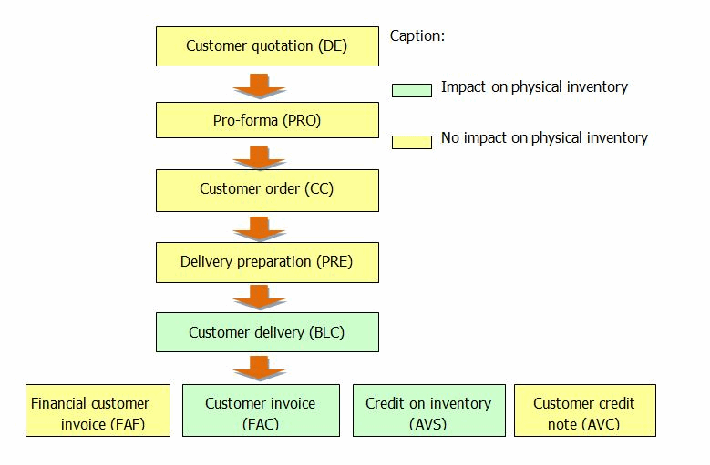

Overview of Trade sales documents
- Customer quotation (DE) : This type of document is a kind of customer pre-purchase order that performs an initial calculation of the order cost. It has no impact on the physical inventory.
- Pro-forma (PRO) : This type of document is equivalent to a quotation, but is used for administration purposes. It has no impact on the physical inventory.
- Customer order (CC) : This type of document, when used for a specific store and customer, can be entered directly or generated from another type of document that comes before it in the cycle. It has no impact on the physical inventory.
- Delivery preparation (PRE) : This is a kind of intermediate document between an order and a delivery. It is optional, and aims to make it easier to search the inventory for items that have been ordered. It may differ from the relevant customer order to the extent that not all of the ordered items may be available. It has no impact on the physical inventory.
- Customer delivery (BLC) : This type of document can be entered directly or generated from another document that comes before it in the cycle (Quotation/Customer order/Delivery preparation, etc.). It has an impact on the physical inventory.
- Customer invoice (FAC) : This document corresponds to a traditional invoice and has an impact on the physical inventory. It can be entered directly or generated from another document type that comes before it in the cycle – generally a delivery.
- Financial customer invoice (FAF) : This document does not result in a physical exchange of merchandise, and therefore has no impact on the physical inventory (example: an additional invoice following an error in the original).
- Customer credit on inventory (AVS) and financial credit note (AVC) : Customer credit on inventory corresponds to a traditional credit note. Its counterpart is a customer invoice, and it has an impact on the physical inventory. A financial credit note is the counterpart of a financial customer invoice. It has no impact on the physical inventory.

#### Various Settings

Settings Linked to Purchase and Sales Document Management

Document type settings

Back and Front Office > Settings > Documents > Documents > Types

This command lists all documents type used in Back Office and Front Office (especially purchase documents, trade or retail sales document.) You can customize settings for each document type. Click here for further information.

Click here

Required settings for trade sales documents

Back Office > Administration > Company > Company settings > Commercial management

Some of the company settings hereafter have a direct impact on the way in which trade sales documents are entered.
- In Documents - Processing: Check the settings of the Miscellaneous section .
- In Pricing: Check the Use TRADE price lists field.
- In Documents - Entry: The Delivery dates section allows you to set up a delivery date check to be carried out during entry and generation, according to the document type.
- In Customers - Suppliers: Check the Trade settlement management setting (in the Customer payment section.)

Access rights management

Back-Office > Administration > Users and access > Access right management

The following access rights may be activated for the user groups of your choice.

| Menu | Section | Access right description | Cycle |
| --- | --- | --- | --- |
| Menu Concepts (26) | Commercial management - Document entry | This menu manages user rights concerning the particular functions relative to the entry of documents in general, including purchase cycle documents. | Purchase and sales (trade and retail) cycle |
| Menu Settings (105) | Documents | This menu is used to authorize, in accordance with user groups, access to document settings, counter settings, input list settings, etc. | Purchase and sales (trade and retail) cycle |
| Management | This menu allows you to grant the relevant user groups access to the settings tables used when entering documents, for example, payment methods, currencies and exchange rates, tax systems, freight and expenses. | Purchase and sales (trade and retail) cycle |
| Menu Purchases (101) | All sections | This menu grants authorization for selected user groups to get access to all the operations and processes that can be performed on purchase documents according to their type: entry, search, modification, reports and analyses, generation, duplication, processing, price lists, etc. | Purchase cycle |
| Menu Sales (102) | Retail sales | These menus allow you to authorize users to enter, modify and query retail sales receipts in Back Office. They can also be used to manage user access rights for outstanding payments, orders and customer reservations, etc. | Retail sales cycle |
| Pricing | These menus allow you to authorize the relevant user groups to access retail sales price list management functions, i.e. tax included price lists. | Retail sales cycle |
| Analyses and Reports | These menus allow you to grant the relevant user groups access to analyses and reports. | Purchase and sales (trade and retail) cycle |
| Trade sales | These menus allow you to authorize the relevant user groups to input, modify, view, duplicate and reconcile the various types of trade sales documents. | Trade sales cycle |
| Generation | They also allow you to manually or automatically change one type of trade sales document into another type of document that comes later in the sales cycle. They can also be used to manage user access rights for document approval, customer order allocation, remainder cancellation. | Trade sales cycle |
| Trade price lists and Pricing | These menus allow you to grant the relevant user groups access to trade sales price list management functions, i.e. tax excluded price lists. | Trade sales cycle |

#### Manual Entry of Documents

Manual Entry of Purchase and Sales Documents

Back Office > Purchases or Sales (Retail or Trade) modules > Enter

The features linked to the entry of a document are available in the tool bar. The purchase document can be divided into the following parts: Header information, User-defines tables (optional), Body of the document, Footer information of the document, and Payment entry.

Please note that some documents can be entered directly. Others can only be generated from a previous document.

The document type used for the entry of retails is FFO (Sales receipt), and concerns both the receipts entered in Front Office and in Back Office. It includes sales receipts and customer merchandise return receipts.

Header information

A purchase or sales document has a certain amount of header information. Some information is mandatory, especially:
- The supplier (for purchase documents)
- The customer (for sales documents) even if the customer is not identified.
- The store and the warehouse (if multi-warehouse management in use)
- The document currency
- The document date
- The provisional delivery date

Once the items are entered, some information is non modifiable, and other data is optional, such as references (internal, external or follow-up) or the sales representative.

Note that many fields can be pre-set in the document types (go to Settings > Documents > Documents > Types). The field concerned are:
- Document currency: This field recovers the setup defined in the document types/ Preferences tab, field Origin of currency
- Delivery date: This fields is supplied by the setting defined in the document types/Preferences tab, field Origin of delivery date .
- Document sales rep: This field recovers the setup defined in the document types/Employee tab, field Sales representative type .
- References (internal, external or follow-up): These fields recover the settings defined in the document types, tab Miscellaneous .

Document user-defined tables (optional)

Note that the use of document user-defined tables is not mandatory. For more information on user field settings, please refer to topic User-defined tables - Documents .

User-defined tables - Documents

Document body

This part is used to enter items, or other lines such as comment lines. Several entry methods are offered:

Entry of the item reference

Enter directly into the Reference field the item reference, or double-click to select your item from the list (only the items linked to the supplier of the document are proposed.)

Enter barcode

Click this button to display the Enter barcode window.

Terminal downloading

It is possible to use a portable inventory terminal (PIT) to download data.
1. Click the [Enter the barcode] button to display the "Enter barcode" screen.
2. Then click this button to open the Transmission window.

Footer information of the document

In addition to the information displayed on the item lines, it is possible to enter in the footer:
- discount
- A business discount
- Freight and expenses

You can display in the footer data of the document useful information when entering the document such as the available inventory or the purchase unit for example. This is the Line Info:

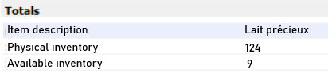

This line information can be defined in Back Office > Settings > Documents > Types.
1. Open the document type of your choice (for example: Customer order (CC)), then select the Line Info tab.
2. In one of the available fields, select the criterion you want to see in the footer of the customer orders and validate.
3. You must reconnect for the settings to be taken into account.

Payment entry

For sales document (trade and retail,) once the body of the receipt entered and validated, an entry window opens automatically to allow you to add the payment method(s) used.

Other entry functionalities

Back Office > Purchases and Sales (Retail or Trade) modules - Enter

The functionalities linked to the entry of a document are available in the toolbar. Depending on the settings of the folder, other buttons or lines of buttons are available (litigation, packing, pre-allotment etc.)

| Button | Description |
| --- | --- |
|  | This button is used to view the third-party record or the document currency. |
|  | The [Additional actions] button is used to enter information to complement the header information, to detail discounts, to enter taxation exemptions, etc. |
|  | The [Installments] button is used to open the due dates and payment methods input window. |
|  | The [Line actions] button is used to insert and delete lines, to merge lines with identical characteristics and to display or hide generic item dimensions. |
|  | The [Insert subtotal] button is used to create a subtotal during entry. |
|  | This button is used to enter a deposit or a payment, if the Deposit management is enabled in the document type, in the Management tab. |
|  | The [Freight and expenses] button allows you to create or use freight and expenses for the document. |
|  | The [Search] button allows you to search for an element in the document |
|  | The [Detailed description of item] button opens a small free input window for the selected line, which can be used to enter comments on a line. |
|  | If this button is used the item search is performed via the item referencing rather than via a list of items. |
|  | The [Enter barcode] button opens the barcode entry window. |
|  | This button concerns only purchase documents. It is used to insert items in mass based on inventory criteria. |
|  | This button concerns only purchase documents It is used to create an item during document entry. |
|  | This button is used to manage the packing of items, if the appropriate option has been enabled first in the document types. |
|  | This button is used to create a third-party as long as the cursor is located in the document header (a supplier for purchase documents, a customer for sales documents.) |
|  | This button concerns only purchase documents. These buttons are used to allocate automatically the quantity of the previous document to the current document for a specific line or for all the lines of the document. |

#### Query, Modify and Duplicate Documents

Query, Modify and Duplicate Purchase and Sales Documents (Trade and Retail)

Query documents or receipts

| Access from Back Office | Type of query |
| --- | --- |
| Purchases or Trade sales > Query > By document | By document Documents can be queried document by document. In this case, 1 line = 1 document. Double-clicking on a line allows you to view the document concerned (for re-printing for example.) |
| Purchases or Trade sales > Query > By document line | Query by document line Documents can be queried by document line. In this case, 1 line = 1 line in a document. Double-clicking on a line allows you to view the document concerned (for re-printing for example). |
| Purchases or Trade sales > Query > By document | Query canceled documents The Deleted document checkbox option available the Status tab, is used to view the canceled documents only. By default, this option is not ticked. |
| Sales > Retail sales > Query > Receipts | Query receipts Receipts can be queried receipt by receipt. In this case, 1 line = 1 receipt. Double-clicking on a line allows you to view the document concerned (for re-printing for example). |
| Sales > Retail sales > Query > Receipt lines | Query receipt lines Receipts can be queried by line by line. In this case, 1 line = 1 receipt line: Double-clicking on a line allows you to view the document concerned (for re-printing for example.) |
| Sales > Retail sales > Query > Receipts or Receipt lines | Query canceled receipts The Receipt canceled option, available the Additions tab, is used to view canceled receipts only. By default, this option is not ticked. |
| Purchases or Trade sales > Query > By archived document or By archived document line Sales > Retail sales > Query >Archived receipts or Archived receipt lines | Query by archived documents/receipts Once the documents or receipts archived, use this command to perform queries (by document/receipt or by lines.) About the archiving feature (Administration > Purge/Archive > Archive documents): Archiving consists in reducing the size of the document tables, thus optimizing the management of active documents. The process is subject to the purge date (this date must be inferior to the current date by at least 3 years) and to the existence of an inventory closure (prior to the archiving date in order to be able to recalculate inventory.) The event log contains a record of archiving operations. The discount dashboard (available in Sales > Analysis > Dashboard/Discounts,) takes into account the movements archived in Back Office. |

Modify documents or receipts

| Access from Back Office | Type of change |
| --- | --- |
| Purchases or Trade Sales > Modification | Modification of documents This feature is used to modify the contents of a document. Once validated after its entry, a document can be modified only via this command. When a document has been opened using the modification command, the usual entry functions are available from the tool bar. However, some header information can no longer be modified. |
| Purchases or Sales (Trade and Retail) > Batch modification | Batch modification of documents/receipts This feature is used to modify the following properties of the documents/receipts selected: Acknowledgment of receipt, recorded document, Exported document, emailing status, mailing associated with a document This batch modification can be performed by document or document line. |
| Sales > Retail sales > Modify receipts | Modification of a receipt This feature is used to modify the contents of a sales receipt. Once validated after its entry, a receipt can be modified only via this command. This tool bar button is used to modify only the user-defined document tables, as long as they are not accounted for. This function depends on the activation of the Override modification settings for user-defined tables concept, in Administration > Users and Access > Access Right Management. This concept is used to ignore the settings defined in the User-defined tables tab in the settings of the document types, thus making all user-defined tables modifiable. |
| Sales > Retail sales > Batch modification | Modification of a payment This feature is used to modify the payment of a receipt. Once validated after its entry, a payment can be modified only via this command. |
| Sales > Retail sales > Assignment to a customer | Modification of a customer This feature is used to modify the customer of a receipt. This window offers numerous selection criteria, especially the Store field in the Standard tab, to search for specific sales receipts. Once the list of the receipts displayed, double click on the line of your choice. In the list of customers that will display, select the customer you want to assign to the receipt. After validation, a process is launched to link the receipt to the customer, taking into account the customer's loyalty. This operation is logged to the event log, thus tracing the origin of the assignment. |

Duplicate purchase and trade sales documents

Note that this Duplication feature does not concern Retail sales in Back Office.

To duplicate a document, you must first specify the duplication types for each document type in Settings Documents > Documents/Types.

Go to the Management tab, and specify in the Duplication types field the duplication types for each document type.

Duplicating a document

Back Office > Purchases or Trade sales modules

This function is useful for entering a new document quickly when the lines are virtually identical and only one piece of header information needs to be changed, such as the customer or store.

The document duplication function does not create any link between the original document and the duplicated document.

Double-click on the document to duplicate. Once open, make the relevant modifications and validate.

Upon duplication, button [Zoom menu, option Linked documents] displays the list of linked documents, and the type of link, in a simplified multi-criteria selection screen.

Information is added to the duplicated document to show that it has been duplicated. This information is also added to the duplication multi-criteria selection screen, in order to facilitate the selection of non-duplicated documents.

Please notice that the usual entry functionalities are available to you through the toolbar.

Preventing the modification or duplication of a document/receipt

If this feature is enabled, a user who tries to modify a document/receipt declared non-modifiable or to duplicate a document declared non-duplicable, will see a message displaying that this operation is not allowed.

Just remind: this Duplication feature does not concern Retail sales in Back Office.

Step 1: Define the actions that make the document non-modifiable or non-duplicable.

Back-Office > Settings > Documents > Documents/Types

For the document type of your choice (FFO for receipts), go to the Management tab and specify in field Doc. is not modifiable after or in field N on-duplicable doc. after , the actions that make this document type non-modifiable or non duplicable (creation, visa, etc.)

Step 2: Enable user rights

Back-Office > Administration > Users and access > Access right management

Select menu Concepts (26) and go to Commercial management > Document entry.

The Modifying a non-modifiable document and Duplicating a non-duplicable document concepts must be set to red to forbid the modification or duplication of these documents.

#### Generating Documents

Generating Purchase and Sales Documents

This process consists in creating a new document quickly from another document that precedes it in the trade sales cycle. There are two types of generation (manual or automatic)

Manual generation of documents

Back-Office > Purchases or Sales > Generation > and then selection of the command

This feature allows the rapid entry of a document from a previous document. Each document can thus be generated from a previous document in the purchase cycle.

Examples:
- Creating a delivery from a customer order, or creating an invoice from a delivery or direct from a quotation.
- Creating a receipt from a purchase order, or creating an invoice from a receipt.

Standard input procedure

Choose the type of document you want to generate from the generation menu: Order, Delivery, etc.

Use the multi-criteria selection screen to search for the document you want to transform. Only those types of documents that precede the new document in the cycle will be shown.

Double-click on the document to transform. The entry screen for the document you want to generate will open, with the normal entry functions.

Use the following quantity allocation buttons located in the toolbar, and then validate the new document:
- Allocate the quantities automatically for the line,
- Allocate the quantities automatically for the document.

Note: The quickest method is to allocate the quantities for the entire document, and then just change the lines that have different quantities.

Blind entry of barcodes

In manual document generation, you can opt for entering barcodes in blind mode. If the option is enabled, you must enter the barcode using the barcode entry screen and you cannot view information from the previous document. However, if an item barcode is not usable (erased or torn label,) this button , available on the input line ( Barcode field) allows you to select the item from a multi-criteria screen.

To implement this functionality, enable the Blind entry of barcodes setting in the document type concerned. Once this setting is enabled, you can nevertheless force this setting for some user groups by activating, through the access right management, the Override blind entry of barcodes for manual generation concept in Back Office > Administration > Users and access > Access right management, > Concepts (26) > Commercial management > Document entry.

Blind entry of barcodes

Override blind entry of barcodes for manual generation

If there is a difference between the original document and the validated document, an information message is displayed to alert the user about this issue: “There are differences between the validated document and the original one. For further information, please refer to the event log.”

In order to keep track in the event log, of these discrepancies found for the entered items, go to module Administration > Users and access > Access rights management > Follow up actions (113) and enable the tracking of actions of your choice:
- Purchases > Generation of purchases > Discrepancy on blind validation of barcodes
- Sales > Generating sales > Discrepancy on blind validation of barcodes

Automatic generation of documents

Back-Office > Purchases or Sales > Generation > Automatic generation

This command enables the automatic generation of a document or several documents using one or several preceding documents, according to grouping criteria (see below.)
- In the case of different suppliers in original documents, several documents will be generated.
- In the case of identical suppliers in the original documents, just one document can be generated, under certain conditions (same tax system, same discount if there is one, same currency, etc.)

Pre-receipts and receipts of ALFs and CFs

Back-Office > Purchases > Generation > Pre-receive and receive notices

It is possible to pre-receive and receive delivery notices and purchase orders automatically in multi-selection. This makes it possible to accelerate the merchandise receipt functionalities in the case of delivery notices by indicating that the goods have arrived at the store, thus allowing them to be rapidly entered into inventory.

Procedure

Documents must be selected with the space bar, and then use one of the following buttons:
- This button launches the pre-receipt of the elements selected.
- This button launches the validation of notices and orders (and therefore receipt) of elements selected.
- This button displays the communication screen with an input terminal. Terminal downloading allows you to automatically take delivery of the notices and orders.
- These buttons allow you to perform pre-receipts and receipts of multiple packages. They display a screen that allow you to enter information quickly , especially if the references are barcodes. These two options are subject to the following access rights: Authorize multi-package pre-receipts when validating notices and Authorize multi-package receipts when validating notices , both available in Menu 26 - Concepts > Commercial management > Document entry.

Status

The status of a receipt may have 1 of these 4 values:
- On hold: the document has just been created
- Pre-received: the document has arrived at the warehouse
- Partial processing: The document content has been scanned but items are missing
- Notice processed: all the items have arrived or the document has been cleared

To view the status in the multiple criteria screen, configure appropriately the display of the "Receiving Status" column.

For convenience, this screen will also allow you to pre-receive and receive transfer notices (TRV).

The Pre-receive and receive notices feature is also available in Back Office menu Inventory > Generation, and in Front Office menu Management > Receipts and returns.

Grouping criteria

Back Office > Settings > Documents > Documents > Types

The grouping criteria can be configured via the [Additions - Grouping option] button, according to document type.

Third party criteria are generally used for quotations, taxes, invoicing system (tax exclusive or inclusive), business discount percentage, etc. You cannot group orders from more than one customer into a single delivery.

Visa Management

(See Approval Management )

Approval Management

Approval management allows any document type to be subject to validation by an authorized user if the amount in question falls outside of a predefined range. (For example, a customer order must be approved if the cost exceeds 500 euros.)

Remainder management

When entering a document, you may find that there are quantities leftover from the quantity entered in the preceding document. These are called remainders. For example, order # 1 contains the following items:
- UNI: 3 items
- DIM: 20 items, as follows:

| Colors/Sizes | 36 | 38 | 40 | 42 | Total |
| --- | --- | --- | --- | --- | --- |
| Black | 1 | 2 | 3 | 4 | 10 |
| Pink | 4 | 3 | 2 | 1 | 10 |
| Total | 5 | 5 | 5 | 5 | 20 |

Receipt # 1 is generated from order # 1:
- UNI: 1 item
- DIM: 20 items, as follows:

| Colors/Sizes | 36 | 38 | 40 | 42 | 44 | Total |
| --- | --- | --- | --- | --- | --- | --- |
| Black | 2 | 2 | 2 | 2 | 2 | 10 |
| Pink | 2 | 2 | 2 | 2 | 2 | 10 |
| Total | 4 | 4 | 4 | 4 | 4 | 20 |

The remainders of the UNI item are therefore 2 items.

The remainders of the DIM items are as follows:

| Colors/Sizes | 36 | 38 | 40 | 42 | 44 | Total |
| --- | --- | --- | --- | --- | --- | --- |
| Black | - | 0 | 1 | 2 | - | 3 |
| Pink | 2 | 1 | 0 | - | - | 3 |
| Total | 2 | 1 | 1 | 2 | - | 6 |

These remainders can be consulted:
- in the document query (field GP_TOTALQTERESTE)
- in the documents line query (field GL_QTERESTE)
- in the purchases dashboard
- in the inventory cube

Note: The DIM quantities for size 44 are referred to as surplus quantities.

#### Impacts on Inventory

Impacts on Inventory

Purchase and sales documents have an obvious impact on inventory.

Purchase documents

The following counters allow you to change the DISPO table:
- GQ_PHYSIQUE (physical inventory)
- GQ_PROPOACHAT (purchase proposal counter)
- GQ_RESERVEFOU (purchase order counter)
- GQ_ANNONCELIV (delivery notice counter)
- GQ_LIVREFOU (receipts of goods counter)
- GQ_FACTUREFOU (supplier invoices on inventory counter)
- GQ_AVOIRFOURNSTOCK (supplier credit note on inventory counter)
- GQ_RETOURFOURN (supplier return counter)

Purchase proposals, purchase orders and delivery notices never have an impact on physical stock (GQ_PHYSIQUE). The other documents have an impact on stock as indicated above.

Please notice that in some cases, the generation cancels the impact of the previous document.

Example:

| Action: | Impacted counters | Impacted quantity |
| --- | --- | --- |
| Creation of a purchase order (CF) | GQ_RESERVEFOU +1 | +1 |
| Generation of a delivery (BLF) | GQ_PHYSIQUE GQ_LIVREFOU GQ_RESERVEFOU | +1 +1 -1 |

GQ_RESERVEFOU is impacted again by the generation of the previous document.

Sales documents

The following counters allow you to change the DISPO table:
- GQ_PHYSIQUE (physical inventory)
- GQ_RESERVECLI (customer order counter)
- GQ_PREPACLI (delivery preparation counter)
- GQ_LIVRECLI (customer delivery counter)
- GQ_DISPOCLI (available reservations and orders counter)
- GQ_FACTURECLI (customer invoices on inventory counter)
- GQ_AVOIRSTOCK (customer credit notes on inventory counter)

Deliveries, invoices and credit notes have an impact on the physical inventory (GQ_PHYSIQUE field). The other documents have an impact on stock as indicated above.

Please notice that in some cases, the generation cancels the impact of the previous document.

Example:

| Action | Impacted counters | Impacted quantity |
| --- | --- | --- |
| Creating a customer order (CC) | GQ_RESERVECLI | +1 |
| Generating a delivery (BLC) | GQ_PHYSIQUE GQ_LIVRECLI GQ_RESERVECLI | +1 +1 -1 |

GQ_RESERVEFOU -1 is impacted again by the generation of the preceding document.

#### Trade Payments

Trade Payments

One of the key elements of trade sales document management is the entry and tracking of customer payments. By default, when accounting and commercial management have common databases, this tracking is managed by the additional accounting module called Payment follow-up . If the databases are different, a number of settings must be configured in the commercial management folder in order to ensure that customer payments are tracked (whether they have been collected or not), and that a customer’s balance can be viewed at any time.

Trade settlement settings

Enable payment follow-up

Back-Office > Administration > Company > Company settings

Go to Commercial management > Customers-Suppliers, then check the Trade settlement management option (available in the Customer payments section.)

Configure how the installment window opens

Back-Office > Settings > Documents > Documents > Types

Go to the Management tab and specify in field Opening installment window how the window will open (automatically, on demand, no installments.)

Configure payment method used

Back-Office > Settings > Management > Financing plans

This option enables the user to define the payment methods that will be used when entering trade payments.

Entering trade payments

Back Office > Sales > Trade sales

This topic explains trade payment entry within or outside a document.

Enter payments in a document

Back-Office > Sales > Trade sales, then select the document to enter (quotation, order, delivery, etc.)

Depending on the relevant settings, the installment window will open automatically or via the [Installments] button.

For all documents except invoices, you must first indicate whether a payment is a deposit or a down payment. This information is not required for an invoice.

You must then specify the customer payment method(s), the respective amounts and whether the payments were made at the time, or the scheduled payment date, otherwise.

The default settlement method specified in the Payment tab of the relevant customer record will be displayed first.

This button allows you to access the financing plan settings in the Installment distribution window.

Note that the Amount collected information is only available when the Trade settlement management company setting has been activated.

This button allows you to assign due dates to the payment methods displayed.

Enter payments without using a document

Back Office > Sales > Trade sales > Enter payment

This allows you to enter a payment without entering a business document.

The payments and due dates entry window is then displayed so that you can complete the initial entry made during document entry. In this entry mode, payments are considered to be collected by default.

Warning:

When a payment is entered directly in this way it is linked to a fictitious document type, with the code FIC.

List of payments when generating invoices

Back Office > Sales > Generation > Invoice

When the Trade settlement management option has been enabled in the company settings, a List of customer payments will be automatically displayed when validating the generation of customer invoices.

You can then select all or some of the payments that were recorded as collected when the documents preceding the invoice were entered.

View customer outstanding business

(cf. Viewing the customer’s business outstanding amount .)

Viewing the customer’s business outstanding amount

Reconciling/Canceling payment reconciliation

Back Office > Sales > Trade sales > Reconcile/cancel

Cegid Retail Y2 allows you to match invoices to customer payments.

After having selected a line from the list, click on this button to view the document information at the bottom of the screen without having to open it.

The left part displays information about the items of the document and the right part displays payment data.

The [Zoom] button allows you to switch between the customer record view and the document view.

Lines can be selected using the space bar or the [Select all] button.

A number of checks are performed when carrying out or canceling a reconciliation. Generally, these checks are linked to payments; and based on their context the following messages may be displayed:
- The sum of payments cannot be superior to the sum of invoices.
- Payment of invoice no. XX is linked to several invoices. Do you want to cancel the reconciliation of these other invoices or only this one?

## Omni-Channel Process Management

### Contents

Omni-Channel Management - Contents

Omni-channel settings
- Required settings (serialization, company settings, access rights)
- Setting up the website and the stores
- Optional settings (Managing alerts and reasons, taxation of delivered sales)

Order management from Back or Front Office:
- Manual entry of orders (selection of delivery options, entry of a gift message or a customer comment)
- Refusing an omni-channel document
- Order tracking
- Mass generation of omnichannel documents

Managing omni-channel orders in Back Office
- Automatic order integration
- Processing customer orders
- Blocking or releasing orders
- Canceling orders
- Canceling orders based on their delivery method
- Modifying the customer’s delivery address
- Managing returns
- Tracking store deliveries

Managing omni-channel orders in Front Office
- Managing orders and returns
- Managing requests for goods
- Managing pick-up points (receipts, pick-up, partial pick-up of parcels)

No available stock in central warehouse for orders
- Required settings
- General principles
- Recap of the various cases
- Order entry with shipping to the customer from one or more stores

Document closure
- Overview
- Procedure

Order status
- Various order statuses
- Managing status "Awaiting validation"

Managing depletion warehouse at order entry
- Selecting, displaying, modifying the depletion warehouse
- Combining depletion warehouses

Other features
- Querying documents
- Multicurrency management for orders
- Other features available in the omni-channel module (data recovery, document export, formula management)

### Omni-Channel Settings

Omni-Channel Settings

Required settings

Serialization

Back Office > Administration > Company > Serialization > Activation of modules

To use omni-channel type features, you must activate the Retail Order Management module, proposed in step 3.

Company settings

Back Office > Administration > Company > Company settings

Go to Commercial management/Omni-Commerce and specify the settings described here .

settings described here

Access rights

Back Office > Administration > Users and access > Access right management

Enable the access rights in the following menus for the user groups of your choice.
- Menu Data Exchanges (1) > Data export: The Export omni-channel documents section may allow user groups of your choice to perform exports of omni-channel type returns and sales.
- Menu Concepts (26) > Commercial management > Omni-channel: This section may allow user groups of your choice to perform various operations linked to omni-channel functionalities (i.e. entering gift messages or customer comments, blocking or releasing orders, canceling or closing orders, etc.)
- Menu Sales (102) > Omni-channel sales: This section may allow user groups of your choice to perform sales operations such as tracking, entry, validation, receipt, preparation, delivery of orders, etc.)
- Menu Customers (109) > Omni-channel sales: This section may allow user groups of your choice to perform operations linked to omni-channel customers (i.e. tracking orders, delivering preparations, canceling orders, requesting goods, managing transfer notices, pick-up points.)

Setting up the Website and the stores

Back Office > Basic data > Stores > Stores

Step 1: Create a Website

This step creates a store dedicated to omni-channel type transactions , also called Website.

The Omni-channel store represents the central site used for these transactions.
1. Use this button to create the Website.
2. Fill in the options described in the Store record, and in particular: Contact information tab: The Type field must be set to e-Commerce for the store to be considered a Website. E-commerce tab: Fill in the options linked to the payments used and define the options of returns and exchanges.

Refer to the Store record to fill in the other fields of the record.

Store record

Step 2: Configure e-Commerce stores

This step defines which stores will perform omni-channel type operations (pick-up points, picking up orders in the store, etc.) Unlike the previous step, you will now configure the omni-channel store(s) and not the central site.

Open the Store record concerned and set up in the e-Commerce tab the options described in the Store record :

Store record

Optional settings

Alert on Web requests

Back Office > Settings > Front Office > Register > Services tab

Front Office > Settings > Registers > Registers > Services tab

This step is optional; it allows you to declare which cash registers will be entitled to receive alerts on pending Web requests.

These alerts will be displayed automatically when the checkout screen opens, if the store has a reservation request, a transfer request or a customer order to validate.

To enable this feature in the Services tab of the register record, tick the Alert on Web requests option (see Register settings, Services tab .)

Register settings, Services tab

Movement reasons

Back Office > Settings > Documents > Movement reasons

This step is optional and makes sense only if you use the following features:
- Block omni-channel orders
- Cancel omni-channel orders
- Refuse return notices
- Refuse requests for goods

This allows you to create the reasons why one of these documents may be blocked, refused or canceled. Create a movement reason for each of these features you want to use.
- For blocking orders, select type Order blocking and validate.
- For canceling orders, select type Order cancellation and validate.
- For refusing returns, select type Return refused and validate.
- For refusing an omni-channel document, select type Refusal of requests for goods and validate.

Taxation of delivered sales

Since July 1, 2021, distance sales have been taxable in the country of arrival when carried out in European Union countries. To meet this legal requirement, the document must be able to be taxed using a tax model. This tax will be levied at the customer's delivery address, or at the store where the goods are collected or reserved, or at the pick-up point.

Click here for further information about how this taxation is set up and how it works.

Click here

### Document Management in Back Office or Front Office

#### Manual Entry of Omni-Channel Orders

Manual Entry of Omni-Channel Orders

Back Office > Sales > Omni-channel sales > Enter an order

Front Office > Sales receipts > Sales > Enter transaction > button [Customer Services] > e-Commerce > Entry of an e-Commerce order

This topic details the different possibilities offered when entering an omni-channel order, whether from the Back or Front Office.

Selection of delivery options

After having entered the document header information, enter the items to be ordered. When the order is validated, a screen displays for you to select various delivery options:
- Delivery to the customer
- Reserved in store
- Picked up in store,
- Store pick-up point: In this case, the store is to be considered as a pick-up point (refer to Configuring Omni-Channel Stores .)

For more information about the different possible order scenarios, please also refer to topic Ordering with Delivery to Customer from One or More Stores.

Ordering with Delivery to Customer from One or More Stores.

Entry of gift messages and/or Entry of customer comments

When validating the order, in addition to the selecting the delivery options, you can customize the omni-channel order by adding a gift message or a customer comment.
- The gift message corresponds to information of type "Happy birthday".
- The customer comment corresponds to an additional information of type "Leave the package with the caretaker".

Preliminary settings

Back Office > Administration > Users and access > Access right management

These features are subject to the access right management. Open menu Concept (26) > Commercial management > Omni-channel and activate the concepts you want to handle: Entry of gift messages and/or Entry of customer comments

Entering a gift message

When entering an omni-channel type order

When validating the order, a window displays proposing the following choices if the concept is enabled:
- No card
- Blank card: this choice enables you to write a few words on a blank card.
- Customized card: this choice enables you to enter a text in the box provided for this purpose.

Entering a customer comment

When entering omni-channel orders

When validating an order, enter additional information in the Customer comment field, if the concept is enabled.

Modifying the comment or the gift message

Back Office > Sales > Omni-channel sales > Track orders

You can return to the comment and the gift message entered in order to modify them Access the order tacking feature and use this button to access the modification screen.

#### Refusing an Omni-Channel Document

Refusing an Omni-Channel Document

You can refuse in Back Office or Front Office an omni-channel document (customer reservation request, transfer request in the context of a customer delivery and/or a customer order.)

This option is only available if the request is active and the order status is set to:
- "Requested in store" for reservation requests,
- "Awaiting goods” for transfer requests for delivery to the customer.

Refusal from the Sales receipts menu (Front Office).

Front Office > Sales receipts > Sales > Enter transaction

Please note!

The Alert on Web requests option must be enabled in the Services tab of the register settings.

Refusal procedure
1. At the opening of the cash register, the E-Commerce requests for goods window opens automatically, and displays the pending documents (reservation requests, transfer requests, and customer orders.)
2. To refuse a document, simply go to the line concerned, select it using the space bar and click the [Refuse the request] button.

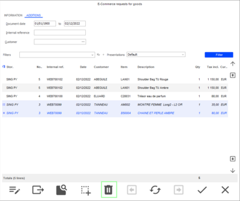
1. If the management of movement reasons is enabled, a window is displayed in order to fill it in (see Omni-Channel Settings, chapter Creating Movement Reasons .)
2. Once the refusal is saved, the document no longer appears in the list.
3. In Order tracking, the tracking status is then set to Merchandise request denied , and the document is closed.

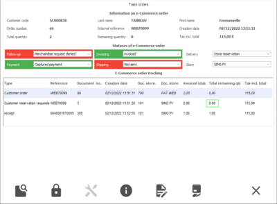

Refusal from the “Track orders” menu (in Back Office and Front Office)

Back Office > Sales > Omni-channel sales > Track orders

Front Office > Customers > Omni-channel sales > Track orders

Please note!

In Front Office, only documents related to reservation requests or customer orders are present.

To refuse a transfer request, use the Front Office menu Sales receipts or the Back Office menu Track orders .

Refusal procedure
1. Open a document to display the Track orders window,
2. To refuse the customer order or the reservation request, simply go to the line concerned, select it using the space bar and click the [Refuse the request] button.
3. If the management of movement reasons is enabled, a window is displayed in order to fill it in (see Omni-Channel Settings, chapter Creating Movement Reasons .)
4. In Order tracking, the tracking status is then set to Merchandise request denied , and the document is closed.

#### Tracking Omni-Channel Orders

Tracking Omni-Channel Orders

Back Office > Sales > Omni-channel sales > Track orders

Front Office > Customers > Omni-channel sales > Track orders

The Track orders screen lists the documents generated during the various steps of order management.

It tracks the order during its whole life cycle and displays information about various statuses of the order (follow-up, payment, invoicing, shipment and return statuses.)

statuses of the order

It allows the user to perform actions specific to the omni-channel central site (preparation, delivery or order transfer.)

A double-click on a line in this screens triggers the document to be opened in read-only mode.

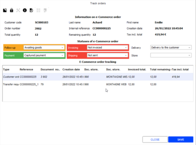

Note on the Creation date field

In this screen, the Creation date field displays the date and time the document was created in the store, or more precisely, it displays the date the document was created on the server, converted into the store's time zone. The purpose of this is to manage inconsistencies related to the time difference between stores, which can sometimes lead to changing the day of creation of the document.

Actions to perform from the tool bar

This button is used to view the order.

This button blocks the order (refer to Blocking/Releasing Omni-Channel Orders .)

Blocking/Releasing Omni-Channel Orders

This button closes the order (refer to Closing an Omni-Channel Document .)

Closing an Omni-Channel Document

This button is used to display the gift messages and customer comments (see Entering Gift Messages or Customer Comments ).

Entering Gift Messages or Customer Comments

This button is used to modify the order. The features available for order modification are almost identical to those available for order entry .

order entry

This button is used to create the preparation.

This button is used to create the associated delivery and invoicing.

This button is used to view the order.

This button cancels the order (see Canceling Omni-Channel Orders .)

Canceling Omni-Channel Orders

#### Mass Generation of Omnichannel Documents

Mass Generation of Omnichannel Documents

Multiselection and multiline generation are available in many omnichannel-related menus.

Indeed, Cegid Retail Y2 offers the possibility of selecting all or some of the lines in a menu in order to launch mass processing on all documents.

However, it is possible to disable this feature and require the user to process each document individually, which can be particularly useful when entering mandatory user-defined fields.

Menus concerned

This feature only applies to the following menus
- Back Office > Sales > Omnichannel sales > Prepare orders
- Back Office > Sales > Omnichannel sales > Deliver orders
- Front Office > Sales receipts > Enter transaction > Multicriteria screen E-Commerce requests for goods
- Front Office > Customers > Omnichannel sales > Deliver preparations

Procedure

Back Office > Administration > Users and access > Access right management

Front Office > Settings > Administration > Users and access > Access right management

This ban is set via access right management, by turning red the Authorize batch generation of deliveries concept (available in menu Concepts (26) > Omnichannel.)

This will hide the following buttons, forcing the user to perform processing on a document-by-document basis:
- Select all
- Schedule task
- Validate/Launch process

Please note:
- By default, this right is set to Green; You can set it to Red to prevent mass processing.
- A logout/login is required after enabling or disabling the right.

### Omni-Channel Management in Back Office

#### Automatic Integration of Orders

Automatic Integration of Omni-Channel Orders

Note that omni-channel orders that have a currency different from those configured are rejected by the data import and the Web Services (SalesDocument.Create.)

Importing omni-channel orders

Back Office > Data exchanges > Data recovery > Data import

Orders can be imported. For further information about import formats for files, please contact your consultant. At order creation:
- The follow-up status may be To process or Validated .
- The payment status may be Partially paid or Paid .

Calling the order creation Web Service

Web Services will use the data import mechanism to create the order. For further information about their use, please refer to relevant documentation available when you install the following kit: E_IIS_DOCUMENTATION_RETAIL.msi. At order creation:
- The follow-up status may be To process or Validated .
- The payment status may be Partially paid or Paid .

It is possible to issue and consume paper-values when entering an omni-channel order. Therefore, the entry of paper-values must have been authorized. These values are generated on the order with an inactive status; finally, when orders are invoiced the generated paper-values are resumed in the sales receipt and made active. They are moved to status "deleted" on the order.

The issuance step is characterized by the addition of items of type "financial” for which a voucher number must be entered. The latter can be entered together with the order, or later at delivery.

The consumption requires a payment of type “paper-value” for which the relevant voucher number will be specified.

Please note!

This can be used only for data imports: at present, the whole paper-value will be used. Any potential leftover will be lost.

#### Processing Orders

Processing Omni-Channel Orders in Back Office

Orders with outstanding payments

Back Office > Sales > Omni-channel sales > Orders with outstanding payments

This command is used to validate the payment statuses for new omni-channel orders.

This step is optional if the order arrives from the omni-channel site directly with a validated payment status.

In order to resume only orders with outstanding payments, the Payment status criterion must be set to Outstanding payment .

The Payment column will display the status of the payments

Validate orders

Back Office > Sales > Omni-channel sales > Validate orders

This step is optional if the order arrives from the omni-channel site directly with a validated follow-up status.

This command is used to validate the follow-up statuses for new omni-channel orders.

In order to resume only orders to validate, the Follow-up status criterion must be set to To process .

Receive orders

Back Office > Sales > Omni-channel sales > Receive orders

In the case where goods are transferred from stores to the omni-channel store, this screen helps receiving the goods.

Once all the goods are received, the order will then be delivered to the customer.

Prepare orders

Back Office > Sales > Omni-channel sales > Prepare orders

This step moves the omni-channel orders into preparations. The order document is changed into a preparation document.

Deliver orders

Back Office > Sales > Omni-channel sales > Deliver orders

This step changes the omni-channel orders or preparations into deliveries.

The order or preparation document is changed into a delivery document.

Upon delivery, if shipping fees are set in the company settings (refer to Shipping Fees Item, in the Processing Orders at Central Level section,) this item will be automatically integrated with the delivery, if it is also present in the order.

Shipping Fees Item, in the Processing Orders at Central Level

#### Blocking or Releasing Orders

Blocking or Releasing Omni-Channel Orders in Back Office

This step is optional, but in some cases it may be useful to block an order (in the case of disputes or if a return is expected.) To use these features, you must first create the reasons why an Omni-channel order may be blocked.

Blocking or releasing an order manually

Back Office > Sales > Omni-channel sales > Block orders

Back Office > Sales > Omni-channel sales > Release orders

Select the order to block (or release) and click this button. Select the appropriate reason and validate the process.

The order will show "Order blocked" in red.

Please note!

These features are subject to the access right management (refer to Menu Concepts (26)):
- Order blocking
- Order release

Blocking or releasing an order through import
- $$_BLOQUECDEECO blocks the order,
- $$_MOTIFLOCKCDEECO specifies the reason why orders are blocked,
- $$_BLOQUECDEECO releases the order,

Blocking or releasing an order using Web Services

For further information about their use, please refer to relevant documentation available when you install the following kit: E_IIS_DOCUMENTATION_RETAIL.msi.

#### Canceling Orders

Canceling Omni-Channel Orders in Back Office

Cegid Retail Y2 offers the possibility to cancel omni-channel orders. To use these features, you must first create the reasons why an order may be canceled (see Creating Movement Reasons .)

Creating Movement Reasons

General principles

Note that if the Order blocking concept is enabled, then only a blocked order may be canceled. The order moves to status "Canceled". The order will be closed and its content kept. Any subsequent documents in progress will be deleted. Cancellation is irreversible.

Manually canceling orders

Back Office > Sales > Omni-channel sales > Cancel orders

Select one or more orders to cancel and then click on this button. Specify the reason for cancellation and validate.

Just remind if the Order blocking concept is enabled, only blocked orders can be canceled.

Warning!

This feature is also subject to the Order cancellation access right, available in he Concepts (26) menu.

Canceling orders through import
- The $$_ANNULECDEECO field is available to cancel the order.
- The $$_MOTIFANNULECDEECO field is used to explain the reason for the cancellation. According to the settings defined, this reason may be mandatory.

Canceling orders using Web Services

For further information about their use, please refer to relevant documentation available when you install the following kit: E_IIS_DOCUMENTATION_RETAIL.msi.

Duplicating canceled orders

Back Office > Sales > Omni-channel sales > Track orders

Use the Order status criterion from the multiple criteria screen of order tracking to display the canceled orders. Double-click on the order of your choice: the order will display with Order canceled in red.

Click the [Order duplication] button to create a new but identical order. The new order is linked to the canceled one; its statuses will be reset so that the order can enter the order processing flow. Header elements are recovered from the canceled order:

- Customer
- Store and warehouse
- Delivery scenario
- Type of origin (Web/Store)
- Internal reference: supplemented with an index (_1, etc.)
- External and follow-up references
- Delivery address
- Billing address

If need be, modify the order (quantity, items, etc.), then validate. When the order is validated, a screen displays for you to select various delivery options:
- Delivery to the customer
- Reserved in store
- Goods picked up in the store
- Store pick-up point

#### Canceling Orders Based On Their Delivery Method

Canceling Omni-Channel Orders Based On Their Delivery Method

Just remind if the Order blocking concept is enabled, only blocked orders can be canceled.

Orders of type "Delivery to the customer"

The process is always carried out from the original order. A reservation request cannot be canceled directly; therefore, the original omni-channel order must be canceled first. The cancellation process is as follows:

Cancellation of the customer order
- If no preparation has been generated, just close the order.
- The "customer ordered" data in the inventory records is adjusted.
- The status of the order is set to Order canceled .

If a preparation has been generated, it is deleted
- Lines are deleted.
- Inventory for preparations in progress is adjusted.
- The header of the preparation is updated: GP_SUPPRIME is set to "X" and status updated to Canceled .

If a delivery has been generated, it is deleted
- Lines are deleted.
- Inventory for delivery in progress is adjusted.
- The header of the delivery will be updated: GP_SUPPRIME is set to "X" and status updated to Canceled .

If the FFO invoice has already been generated
- Creation of an FFO credit note impacting the sales figures: duplication of the initial invoice with a negative quantity.
- No impact on inventory: This is a billing receipt that does not impact inventory (the delivery document does have an impact on physical inventory.)

Orders of type "Reservation on store’s stock"

As long as the goods have not been picked up from the store by the customer, the initial order can be canceled. The cancellation process is described as follows:

Cancellation of the customer order
- The status of the order is set to Order canceled .

The reservation request is deleted
- Lines are deleted.
- If the reservation has not been generated, the inventory for the reservation in progress is adjusted.
- The header of the of the reservation request is updated: GP_SUPPRIME is set to "X" and status updated to Canceled.GP_SUPPRIME set to "X" and status updated to Canceled .

The reservation is deleted
- Lines are deleted.
- The inventory for reservation in progress is adjusted.
- The header of the reservation is updated: GP_SUPPRIME is set to "X" and status updated to Canceled .

The FFO invoice is reimbursed
- Creation of an FFO credit note impacting the sales figures: duplication of the initial invoice with a negative quantity.
- The register operation relating to the deposit payment of the initial FFO invoice is closed.

Within the reservation process, the following elements were created:
- A deposit payment receipt (collected by the site),
- A register operation for the payment of the deposit, that will be recovered in the store when customer picks up the goods. In this case, the customer's balance is positive.

The cancellation generates:
- A reverse receipt for the deposit paid (refunded to the customer)
- The closing of the register operation corresponding to the available payment. The customer's balance is null again.

Orders of type "Order picked up in store".

As long as the goods have not been picked up from the store by the customer, the initial order can be canceled. The cancellation process is described as follows:

Cancellation of the customer order
- The status of the order is set to Order canceled .

If the transfer request has not yet been processed, it is deleted
- Lines are deleted
- Inventory for the transfer request in progress is adjusted.
- The header of the transfer request is updated: GP_SUPPRIME is set to "X" and status updated to Canceled .

If the transfer request has been processed
- The header of the transfer request is updated and the status updated to Canceled .

If the transfer preparation has not yet been processed
- Lines are deleted
- Inventory for the transfer preparations is adjusted.
- The header of the transfer preparation is updated: GP_SUPPRIME is set to "X" and the status updated to Canceled .

If the transfer preparation has been processed: update of the header and status set to "Canceled"

If the transfer notice has not yet been validated:
- The status is updated to Canceled for the sent transfer.
- The status is updated to Canceled for the transfer notice.
- The transfer notice can be validated, but will not generate any order available for the customer.

If the transfer notice has been validated:
- The status is updated to Canceled for the sent transfer.
- The status is updated to Canceled for the transfer notice.
- The status is updated to Canceled for the received transfer.
- The available order is deleted.
- The lines of the available order are deleted.
- Inventory for the available orders are adjusted.
- The header of the available order is updated: GP_SUPPRIME is equal to "X" and status updated to Canceled .

The FFO invoice is reimbursed
- Creation of an FFO credit note impacting the sales figures: duplication of the initial invoice with a negative quantity.
- The register operation relating to the deposit payment of the initial FFO invoice is closed.

In the same way as when making reservations on the store's stock, we created:
- A deposit payment receipt (collected by the site),
- A register operation for the payment of the deposit, that must be recovered in the store when customer picks up the goods. In this case, the customer's balance is positive.

The cancellation generates:
- A reverse receipt for the paid deposit (refunded to the customer)
- The closing of the register operation corresponding to the available payment. The customer's balance is null again.

#### Modifying the Customer’s Delivery Address

Modifying the Customer’s Delivery Address

This topic explains how to modify a customer’s delivery address in the context of a delivery to the customer by a store .

This operation can only be performed from Back-Office, and as long as the delivery has not been made.

Required settings

Back Office and Front Office > Settings > Documents > Documents > Types

To manage delivery addresses in documents, you have to set up the concerned document type.
1. Therefore, select the Customer order (CC) document type and access the Third party tab .
2. Check the Address management option and validate.

Modifying the customer’s delivery address

In omni-channel order entry and tracking

You can change a customer’s delivery address as long as the following constraints are fulfilled:
- Order of type omni-channel with delivery to the customer’s place .
- Delivery made by a store .
- Delivery not yet completed
- Operation only possible in Back Office

How it works

When an omni-channel type order is entered, the address in the customer's record is automatically taken over as the billing address and the delivery address.

These addresses are visible and can be modified using the [Additional actions, Additional header information option] button.

The billing address can be modified manually by unchecking the option Transfer Addr.

In the case of an order with delivery to the customer, at the creation of the order (or after its creation in the Order Tracking feature), this button allows you to assign the store for customer's delivery.

Selecting a store on a line leads to the generation of a new order on behalf of this store, with the information from the header, including the delivery address.

Note that if the order is delivered by several stores, an order is created for each store.

As long as the order is not assigned to a store, it can be modified without any constraints in the header.

If the order is assigned to a store, the original order can still be modified in the Order Tracking feature via the [Modify the order] button.

The Document user-def. fields window is displayed, allowing you to update the addresses using the button opposite.

Validating the update of an address impacts all the undelivered active documents that follow the Web order:
- Created order assigned to the store
- Preparation of the order by the store

#### Managing Returns

Managing Omni-Channel Returns in Back Office

How to return omni-channel orders

The final customer enters a return of goods on the Internet site. The site transmits the return notice to Cegid Retail Y2 using an import flow or Web Services. A return notice document is then generated. The central site can view the list of returns to validate.

The validation of the selected returns on this screen is carried out manually by a Cegid user or via data import (if there is an interface with an logistician.) The return notice is then changed into a negative document of type receipt (FFO); inventory is updated too. Note that credit notes are not handled.

Entry of a return notice

Back Office > Sales > Omni-channel sales > Enter a return notice

Double-click the document concerned and validate the return using the [Save] button. The Exchange or return window displays and prompts you to select the return type:
- Exchange: the latter must be entered later using the "Enter an exchange order" command.
- Return with credit note: a credit note is issued.
- Return with refund: the customer is refunded.

In the 3 cases, the Installment distributions window displays.
- In the case of an exchange, the payment method displayed is the one specified in the store record (in the e-Commerce tab).
- In the case of a return with a credit note, the payment method displayed is the one specified in the store record (in the e-Commerce tab).
- In the case of a return with refund, this window allows you to select the payment method for refunding.

Follow-up of return notices

Back Office > Sales > Omni-channel sales > Follow up return notices

Double-click on a line of your choice to open a return notice. The return notice may have the following statuses:
- Announced return: the return notice was entered.
- Return validated: the return was received.
- Return not validated: the return was entirely refused.
- Return partially validated: the partial return is refused.

Receipt of return notices

Back Office > Sales > Omni-channel sales > Receive return notices

This screen displays all pending returns. Open the notice of your choice and specify the quantity effectively received, then validate. This action triggers the creation of the return receipt document.

Refusal of return notices

Back Office > Sales > Omni-channel sales > Refuse return notices

This feature allows you to refuse the pending returns displayed in this screen. To use these features, you must first create the reasons why the return notice may be refused.

Select the line of your choice with the space bar and click on the [Validation] button. The Reason window displays and enables you to specify the reason why the notice is refused.

Return and exchange

In the case of a return with exchange, the return notice is typed "exchange" and two documents closely linked are sent to Cegid Retail Y2: the return notice and the new order.

Details of the documents

The return notice (ANR) is then created in Cegid Retail Y2. This document must be linked to the original omni-channel order (LIAISONPIECE table); in this case, it appears in the order tracking. The payment method of the return notice is a credit note and is resumed in the settings of the store. This notice is of type Exchange.

The new omni-channel order displays a new follow-up status Awaiting return . The order will be put on hold until the returned items are received and validated. If there is a variance in price for the items exchanged, the return notice will include payment information: Reimbursement or Credit note

The new omni-channel order typed Exchange linked to the return notice will be integrated:
- Either, just after the return notice with a Awaiting return status. The order will be blocked, waiting to be processed until the returned items are received and validated. A new store setting defines the reason why the order awaiting a return will be blocked.
- Or, after the receipt of the goods with a Validated status.

Entry of an exchange order

Back Office > Sales > Omni-channel sales > Enter an exchange order

The screen displays the orders for which an exchange has been specified after the entry of a return notice.
1. Open the document of your choice: the content is void.
2. Enter the appropriate order, as well as the customer, and then validate.
3. If the total amount is higher than in the initial order, the "Installment distributions" window displays for the entry of the payment method to be used for the remaining amount.
4. Proceed as usual and select the delivery options.
5. Upon validation, the customer order is:

#### Tracking Store Deliveries

Tracking Store Deliveries

Access right management

Back Office > Administration > Users and access > Access right management

Go to menu Sales (102) > Omni-channel sales and enable the Track store deliveries access right for the user groups of your choice.

How it works

Back Office > Sales > Omni-channel sales > Track store deliveries

In the multiple criteria screen, the list of e-Commerce orders is restricted to the stores having their record populated as follows:
- Contact information tab: The Type field is different from e-Commerce
- E-Commerce tab: The Shipment to customers option is ticked

Consequently, in the Standards tab of the multiple criteria screen, the Store field proposed only non e-commerce stores having ticked their option Shipment to customers .

Selecting a line displays the same tracking screen as the Order Tracking screen, and works the same way. It displays the tracking of the Web order at the origin of the store order.

Order Tracking screen,

### Omni-Channel Management in Front Office

#### Cancellation and Returns

Omni-Channel Cancellations and Returns in Front Office

How omni-channel cancellations and returns work in Front Office

Canceling orders

Front Office > Customers > Omni-channel sales > Cancel orders

This screen displays the list of orders entered by the cashier that may be canceled:
- Customer delivery (entered by the store)
- Pick-up point (entered by the store)
- In-store reservation (attributed to the store)
- In-store pick-up (an order may be canceled in the pick-up store)
- In-store pick-up (an order may be canceled in the order-entry store, but not at the pick-up point).

Deposits made for these orders must be closed on the list of expected payments, as well as in the customer balance.

Remember
- Cancellation reasons must have been previously created in Settings > Documents > Movement reasons (see Creating Movement Reasons .)
- Canceling orders is also subject to the Order cancellation access right available in the Concepts (26) menu.
- Canceling orders is also subject to the Order blocking access right available in the Concepts (26) menu.
- The list of orders is also available in the Track orders menu.

Managing returns

Front Office > Sales receipts > Sales > Enter transaction

The return in Front Office of an omni-channel order works like a standard return via the sales transaction entry screen (see Managing Returns .)

Managing Returns

#### Requests for Goods

Managing Omni-Channel Requests for Goods in Front Office

How omni-channel type requests for goods work in Front Office

List of Omni-channel requests for goods on the sales transaction entry screen

Front Office > Sales receipts > Sales > Enter transaction - automatic display of the list when opening the screen

If in the Services tab of the register settings, the Alert on Web Requests option is ticked, the list of requests for omni-channel goods will be automatically be displayed at the opening of the sales transaction entry screen as shown below:

Alert on Web Requests

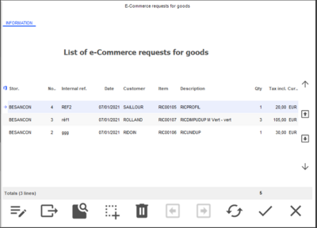

The screen displays elements awaiting validation, i.e. customer orders to be delivered directly to the customer (CC), reservation requests (DDI), and transfer requests (DTR).

The Additions tab allows you to filter these items using the following criteria: document date, internal reference, and customer.

Note that a filter can be saved as anywhere else in the application, and will be loaded automatically when the page is opened.

Functionalities available from the List of omni-channel requests for goods

You can perform the following actions on that screen:
- Set the screen layout. In addition to the constraint seen previously due to accumulation, note that this button is subject to the Filter settings access right of the Concepts (26) menu. Moreover, you can handle specific formulas (see Formula Management in the List of Requests for Goods .)
- This function allows you to export the list of web requests to Excel format. This button is subject to the Export the lists access right of the Concepts (26) menu.
- Open the request.
- The [Select all] button is used to select all the in 1 click screen. Note! This button is conditioned by an access right that allows to prohibit the Mass Generation of Omnichannel Documents .
- Refresh the screen.
- Mass validation automatically validates all the quantities in the request for goods.

Optional settings used to speed up the restitution of elements

Returned elements are displayed in the List of Omni-channel requests for goods screen ; sometimes this can be time-consuming, especially if the volume is important.

In this case, it is advisable to click on the [Set up layout] button and deactivate the Display an accumulated total option that is checked for some columns (as in the screen below).

Please note!

The display of an accumulation in a multi-criteria screens must be restricted to screens with little data (less than 100 lines). This mechanism generates a solicitation of the database which will slow down the processing, with a "timeout" in case of a large volume of processed data.

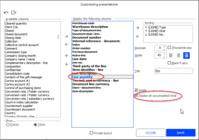

Validating requests for goods

Front Office > Sales receipts > Sales > Enter transaction and [Customer Services] button.

Front Office > Customers > Omni-channel sales > Requests for goods > Validation

This screen enables you to validate the reservation requests and transfer requests to the omni-channel store. Double click on the document of your choice and validate it.
- Reservation requests will become reservations
- Transfer requests will become transfers sent to the omni-channel store.

Querying requests for goods

Front Office > Customers > Omni-channel sales > Requests for goods > Query by document or document line

These commands enable you to view the customer reservation requests and the transfer requests. No change is possible; the documents are in read-only mode.

#### Pick-Up Points

Managing Pick-Up Points in Front Office

Front Office > Customers > Omni-channel sales > Pick-up point

If pick-up pints are managed in your folder and if the store is declared a Pick-up point (these settings are just outlined below), you can then proceed with the receipt of the parcels arriving from the omni-channel central office, and/or handle the withdrawal of parcels by customers.

Various required settings
- Company settings, Omni-commerce: Tick options Manage stores as pick-up points and Preparation management .
- Store record, Contact information tab: the store must be of type e-Commerce (see Creating an omni-channel store .)
- Store record e-commerce tab: In addition to the store of type e-Commerce, you must also have a store that manages pick-up points (see Configuring omni-channel stores .)

Receiving packages

Front Office > Customers > Omni-channel sales > Pick-up point > Receipt of packages

This command is used to enter a receipt date for the package sent by the omni-channel central office. The follow-up status is then changed to Received in store .

Picking up packages

Front Office > Customers > Omni-channel sales > Pick-up point > Pick-up of packages

In some cases, a pick-up point delivery comprising several lines can be delivered to the pick-up point, either totally or partially, or in several shipments.

Total pick-up

In this case, you can enter a pick-up date when the customer comes and takes the package. The follow-up status is then changed to Picked up by customer .

Partial pick-up

Case1: The order is delivered in several shipments

| Step1, order tracking display |
| --- |
| After the entry and the partial preparation of an order | After delivery of the preparation: The background color of the shipment status is orange. As the order is delivered partially, the status becomes “Sent partially”. |
| Step 2, in the store |
| The first package is received and validated (order tracking status = Available in store) | Then the customer picks up the package (order tracking status = Accepted by the customer |
| Step 3, at the central office |
| Preparation of the 2nd item | Then delivery The background color for the shipment status is Green. When the order is fully delivered, the status is set to “Sent” |
| Step 4, in the store |
| The package is received. | The customer pick-up the package/ |

Case 2: The order is partially delivered and cleared by the Website

| After the package is picked up by the customer |
| --- |
| The central office clears the order with this button | The background color of the shipping status is Orange. Once the order cleared, the status changes to “Sent partially” |

Case 3: Web Services

This case is taken into account by the CustomerOrderManagement service (transforming customer sales documents:)
- Creation of a delivery preparation
- Creation of a delivery from an order or a delivery preparation

### No Available Stock in Central Warehouse for Orders

#### Required Settings

Required Settings if Stock is Unavailable in the Central Warehouse

This topic deals with customer orders placed on the Web, for which the central warehouse has no stock available, unlike the network stores which have goods in stock.

Cegid Retail Y2 offers these stores the possibility to:
- Deliver the goods directly to the customer.
- Transfer the goods to another store without the help of the central warehouse.
- Or transfer the goods to the central warehouse for delivery to the customer.

Required settings

Company Settings

Back Office > Administration > Company > Company settings

Go to Commercial management > Omni-commerce and tick the Shipment of goods setting, then validate.

Store record

Back Office > Basic data > Stores > Stores

In the e-Commerce tab of the store records, tick the appropriate options relating to the shipment of goods ( click here for further information.) These options are visible only if the company setting described above is enabled.

click here

Setting up Web Services

For Web Services, the PreferCustomerDelivery field must be added to the envelope.

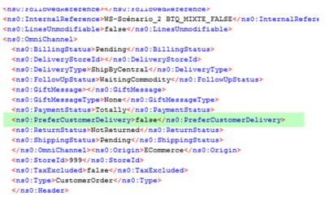
- False: Delivery to customers by stores is not preferred.
- True: Delivery to customers by stores is preferred.

#### General Principles

General Principles

If a central warehouse that does not have stock to fulfill a Web order, two cases may occur:
- The items of the order are available in one and the same store . This refers to an order for mono-warehouse depletion.
- The items of the order are available i n several stores. This refers to an order for multi-warehouse depletion.

These principles are described in detail hereafter and a recap of various cases is available here .

recap of various cases is available here

Case 1: Delivery to customer by a store with stock

Mono-warehouse depletion order

The item is not available in the central warehouse, but in one of the network stores.
- If the Shipment to customers option is ticked in the store’s record, the store can the deliver the goods directly to the customer.
- If the Transfer to Headquarters store setting is ticked, the order will undergo the standard process in Y2, with a transfer request for the store.
- If these two options ( Shipment to customers and Transfer to Headquarters ) are ticked, the following message will be displayed: “Do you prefer the stores shipping the goods to the customers?” Then, the system will either generate customer orders (YES), or transfer requests (NO.)

Documentary chain of delivery by the store

The order is placed in the Web store and a copy of the order is sent to the store that will deliver the customer.

The FFO (invoice) document consumes the payment. This document is generated either when the order is placed, or when the goods are delivered, according to the company settings defined (see section Invoicing .)

Invoicing

The preparation option available in both the company settings and in the store record allows you to implement a preparation stage in the store before delivery.

Management in cashing

The order generated in the store will appear on the List of e-Commerce requests for goods screen that displays when you open the checkout screen.

Note that you can add the document type to that list to differentiate these orders from transfer requests (to another store or to the central warehouse.)

Refusing the order

You can refuse an order which will then switch to status Merchandise request denied . The store order is then cleared and the original order is reactivated.

Note that you cannot refuse just one line; the order is refused as a whole. This method enables the central warehouse to reassign the full order to another store to avoid doubling the shipping costs.

You can then change, in Back Office, the depletion warehouses for the order to allow the central warehouse or another store to deliver the goods. The shipment type cannot be changed.

In the case the order is refused, the central warehouse cannot change the depletion warehouses.

Multi-warehouse depletion order

In the case an order refers to several depletion warehouses:
- If the Transfer to Headquarters store setting is ticked for ALL stores, the system generates transfer requests.
- If the Shipment to customers store setting is ticked for ALL stores, the system generates customer orders.
- If these two options ( Transfer to Headquarters and Shipment to customers ) are ticked for ALL the stores, the following message will be displayed: “Do you prefer the stores shipping the goods to the customers?” Then, the system will either generate customer orders (YES), or transfer requests (NO.)
- If the Transfer to Headquarters option is ticked for one store and for another store the two options ( Transfer to Headquarters and Shipment to customers ) are ticked, the system generates only transfer requests, because transfer requests and customer orders cannot be mixed up.
- If the Shipment to customers option is ticked for one store and for another store the two options Transfer to Headquarters and Shipment to customers are ticked, the system generates only customer orders (because transfer requests and customer orders cannot be mixed up.)
- If the Shipment to customers option is ticked for one store and for another the Transfer to Headquarters option is ticked, the following message is displayed: “Delivery option not possible. The warehouses for the lines have been changed in the order.” This indicates that the store settings make the processing not possible. (The same goes for the Web Services.)

Case 2: Order picked up in the store by the customer

Mono-warehouse depletion order

The item is not available in the central warehouse, but in one of the network stores. Direct delivery to the store without using the central warehouse is preferred.
- If the Transfer to other stores store setting is ticked for this store, the latter transfers the goods directly to the pick-up store.
- If the Transfer to Headquarters store option is ticked for the store, the order will undergo the standard process in Y2.

Multi-warehouse depletion order

The items are not available in the central warehouse, but in several stores of the network.

If the Transfer to other stores store setting is ticked for these stores, they transfer the goods directly to the pick-up store.

Documentary chain

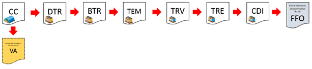

Management rules

The transfer request generated in the store will appear on the List of e-Commerce requests for goods screen that displays when you open the checkout screen. This is then the standard case in Y2, when goods are picked up in the store:
- A transfer notice is generated in the pick-up store.
- When the goods arrive in the store, the Validation of transfer notices screen lists this new transfer notice.
- The operator accepts the goods with a received transfer (TRE) document, generating an available order (CDI) for the customer.

The status of the original order line evolves and changes to Goods received .

The status of the original order is then set to Validated and the customer is notified to pick up the goods. When the customer comes to the store, the deposit payment is automatically retrieved and consumed.

Goods are shipped to the pick-up store by two stores

Several transfer requests (DTR) are created pour each store shipping goods to the pick-up store. The pick-up store waits for the goods and receives them in the same flow, in several times. The status of each line of the original order evolves and changes to Goods received . The status of the original order is set to Validated when all the lines are received. The customer is then notified to pick-up the goods. When the customer comes to the store, the deposit payment is automatically retrieved and consumed.

Note that you can also inform the customer when creating each available order (CDI). The customer can come several times to the store and consume the deposit progressively.

Refusing a transfer request

You may refuse a transfer request. Its status will then change to Merchandise request denied . You can then change, in Back Office, the depletion warehouses for the order to allow the central warehouse or another store to transfer the goods. The shipment type cannot be changed.

However, you can change the depletion warehouses for the lines.

Changing quantities, prices, payments, etc. is not authorized as this would lead to an incorrect deposit payment for the order and allow frauds on goods. In this case, you can assign a different warehouse to each line, generating a request by store.

#### Recap of the Various Cases

Recap of the various cases

The table below shows the various possible scenarios based on the settings defined in the e-Commerce tab of the store records.

The Customer delivered by the Website column describes the so-called “standard” case, where the order is entered by the customer on the Web site which having the available stock, delivers the items directly to the customer, without the help of the stores.

Please note!

As indicated in the table, some scenarios are not possible.

Indeed, it is still not possible to mix up several types of shipping (e.g. the Website sends part of the order to the customer and the store sends another part.)

| Customer delivered by the Website | Customer delivered by the stores (based on an option in the store record) | Result |
| --- | --- | --- |
|  | Transfer to Headquarters | Shipment to customers | Transfer to Headquarters and Shipment to customers |  |
| 1 STORE = X |  |  |  | No message and 1 customer order |
|  | 1 STORE = X |  |  | No message and 1 transfer request |
|  |  | 1 STORE = X |  | No message and 1 customer order |
|  |  |  | 1 STORE = X | Message: “Do you prefer the stores shipping the goods to the customers?” If YES => Customer order If NO => Transfer request |
|  | 1st STORE = X 2nd STORE = X |  |  | No message and 2 transfer requests |
|  |  | 1st STORE = X 2nd STORE = X |  | No message and 2 customer orders |
|  |  |  | 1st STORE = X 2nd STORE = X | Message: “Do you prefer the stores shipping the goods to the customers? If YES => 2 customer orders If NO => 2 transfer requests |
|  | 1st STORE = X |  | 2nd STORE = X | No message and 2 transfer requests |
|  |  | 1st STORE = X | 2nd STORE = X | No message and 2 customer orders |
|  | 1st STORE = X | 2nd STORE = X |  | The following message “Delivery option not possible. The warehouses for the lines have been changed in the order.” |
| 1st STORE = X |  | 2nd STORE = X | 3rd STORE = X | Same |
| 1st STORE = X | 2nd STORE = X |  |  | Same |
| 1st STORE = X |  | 2nd STORE = X |  | Same |
| 1st STORE = X |  |  | 2nd STORE = X | Same |

#### Order Entry with Shipping to the Customer from One or More Stores

##### Introduction

Order Entry with Shipping to the Customer from One or More Stores

If a central warehouse does not have stock to fulfill an order, several cases may occur whether the items of the order are available in a single store or in several stores.

These cases also differ according to the settings defined in the e-Commerce tab of the store records.

Several cases described in detail hereafter.

Order entry with shipping to the customer from one single store
- This is the context of a single-warehouse depletion order .
- Click here to see a standard scenario .

Order entry with shipping to the customer from one or more stores
- This is the context of a multi-warehouse depletion order .
- Click here to see the 4 proposed scenarios .

##### Order Entry with Shipping to the Customer from One Single Store

Order Entry with Shipping to the Customer from One Single Store

This is the context of a single-warehouse depletion order , with the following scenario:

Scenario 1

Step 1: Store record settings

Back Office > Basic data > Stores > Stores

In the e-Commerce tab, the New-York store has its Shipment to customers AND Transfer to Headquarters options enabled.

Step 2: Order entry

Back Office > Sales > Omni-channel sales > Enter an order

Front Office > Sales receipts > Sales > Enter transaction and button [Customer Services].
1. Enter the customer‘s name, the internal reference and the items of the order.
2. Use the [E-Commerce depletion warehouses] button to display the E-Commerce warehouse selection screen.
3. For all the items select the warehouse to deplete (Lyon) by clicking the Warehouse field.
4. Validate the order and select the Delivery to the customer option
5. The following question is displayed: “Do you prefer the stores shipping the goods to the customers?”

Step 3: Tracking orders

Back Office > Sales > Reports > Omni-channel sales
1. In the list of orders, you will find the order just created.
2. By double-clicking this order, it will be displayed according to the selection made in the previous step.
- YES answer to the question:

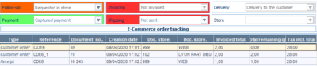
- NO answer to the question:

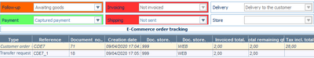

Step 4: Validation of the order on the register

Front Office > Sales receipts > Sales > Enter transaction
1. The List of omni-channel requests for goods window that opens when you open the register, displays the order processed previously.
2. Click this button to start the validation of the request.
3. Note that you can also validate it from the menu Customers > Omni-channel sales > Requests for goods > Validation.

##### Order Entry with Shipping to the Customer from Several Stores

Order Entry with Shipping to the Customer from Several Stores

This is the context of a multi-warehouse depletion order , with the following 4 scenarios:

Scenario 1

Step 1: Store record settings

Back Office > Basic data > Stores > Stores

In the e-Commerce tab, the Marseille and the Paris stores have their Shipment to customers AND Transfer to Headquarters options enabled.

Step 2: Order entry

Back Office > Sales > Omni-channel sales > Enter an order

Front Office > Sales receipts > Sales > Enter transaction and button [Customer Services].
1. Enter the customer‘s name, the internal reference and the items of the order.
2. Use the [E-Commerce depletion warehouses] button to display the E-Commerce warehouse selection screen.
3. For some items, select the Paris store in the Warehouse field, and the Marseille store for the other items.
4. Validate the order and select the Delivery to the customer option
5. The following question is displayed: “Do you prefer the stores shipping the goods to the customers?”

Step 3: Tracking orders

Back Office > Sales > Reports > Omni-channel sales

Front Office > Customers > Omni-channel sales
1. In the list of orders, you will find the order just created.
2. By double-clicking this order, it will be displayed according to the selection made in the previous step.
- YES answer to the question:

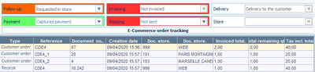
- NO answer to the question:

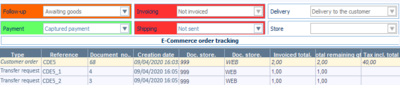

Step 4: Validation of the order on the register

Front Office > Sales receipts > Sales > Enter transaction
1. The List of omni-channel requests for goods window that opens when you open the register, displays the order processed previously.
2. Click this button to start the validation of the request.
3. Note that you can also validate it from the menu Customers > Omni-channel sales > Requests for goods > Validation.

Scenario 2

Step 1: Store record settings

Back Office > Basic data > Stores > Stores

In the e-Commerce tab, the Lyon and the Paris stores have only their Shipment to customers options enabled.

Step 2: Order entry

Back Office > Sales > Omni-channel sales > Enter an order

Front Office > Sales receipts > Sales > Enter transaction and button [Customer Services].
1. Enter the customer‘s name, the internal reference and the items of the order.
2. Use the [E-Commerce depletion warehouses] button to display the E-Commerce warehouse selection screen.
3. In the Warehouse field, select a store to deplete (Lyon) for some items, and then the other store (Paris) for the other items.
4. Validate the order and select the Delivery to the customer option
5. No question displays and two customer orders are generated.

Step 3: Tracking orders

Back Office > Sales > Reports > Omni-channel sales

Front Office > Customers > Omni-channel sales
1. In the list of orders, you will find the order just created.
2. By double-clicking the order, you can see the following: The Website order is cleared and 2 customer orders have been created, as well as a deposit payment receipt. The tracking status is “Requested in store.”

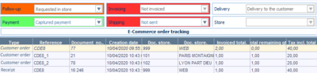

Step 4: Validation of the order on the register

Front Office > Sales receipts > Sales > Enter transaction
1. The List of omni-channel requests for goods window that opens when you open the register, displays the order processed previously.
2. Click this button to start the validation of the request.
3. Note that you can also validate it from the menu Customers > Omni-channel sales > Requests for goods > Validation.

Scenario 3

Step 1: Store record settings

Back Office > Basic data > Stores > Stores

In the e-Commerce tab in their respective records:
- The Lyon store has only its Shipment to customers option enabled.
- The Paris store has its Shipment to customers AND Transfer to Headquarters options enabled.

Step 2: Order entry

Back Office > Sales > Omni-channel sales > Enter an order

Front Office > Sales receipts > Sales > Enter transaction and button [Customer Services].
1. Enter the customer‘s name, the internal reference and the items of the order.
2. Use the [E-Commerce depletion warehouses] button to display the E-Commerce warehouse selection screen.
3. For some items, select the Lyon store in the Warehouse field, and the Paris store for the other items. Validate the order and select the Delivery to the customer option
4. No question displays and two customer orders are generated.

Step 3: Tracking orders

Back Office > Sales > Reports > Omni-channel sales

Front Office > Customers > Omni-channel sales
1. In the list of orders, you will find the order just created.
2. By double-clicking the order, you can see the following: The Website order is cleared and 2 customer orders have been created, as well as a deposit payment receipt. The tracking status is “Requested in store.”

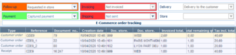

Step 4: Validation of the order on the register

Front Office > Sales receipts > Sales > Enter transaction
1. The List of omni-channel requests for goods window that opens when you open the register, displays the order processed previously.
2. Click this button to start the validation of the request.
3. Note that you can also validate it from the menu Customers > Omni-channel sales > Requests for goods > Validation.

Scenario 4

If the settings of the stores are too different (see below), the order entry generates an error message. It is, indeed, not possible to mix up tow shipment types in the same order.

Step 1: Store record settings

Back Office > Basic data > Stores > Stores

In the e-Commerce tab in their respective records:
- The Paris store has only its Shipment to customers option enabled.
- The Lyon store has only its Transfer to Headquarters option enabled.

Step 2: Order entry

Back Office > Sales > Omni-channel sales > Enter an order

Front Office > Sales receipts > Sales > Enter transaction and button [Customer Services].
1. Enter the customer‘s name, the internal reference and the items of the order.
2. Use the [E-Commerce depletion warehouses] button to display the E-Commerce warehouse selection screen.
3. For some items, select the Lyon store in the Warehouse field, and the Paris store for the other items. Validate the order and select the Delivery to the customer option
4. This scenario generates the following error message: The following message “Delivery option not possible. The warehouses for the lines have been changed in the order.”

### Document Closure

#### Overview

Closing an Omni-Channel Document

In some cases, a customer order or reservation may be delivered partially. The decision may be taken not to deliver the remaining quantities of the order, and in this case, the order must be closed.

It is also possible to close a transfer request that has not been fully processed by a store.

This operation can be performed from Web Services or from the Cegid Retail Y2 application (Back or Front Office.)

Operating principle

The Close option is not effective on all omni-channel documents. You can close:
- A customer order delivered by the central site, partially or totally, (iso-functional compared to previous versions.)
- A customer order delivered by the store, only partially, otherwise it must be refused in the store.
- A reservation, partially or totally, on the central site or in the store.
- A transfer request only partially, otherwise it must be refused.
- An available order, totally, because it is not possible to deliver it partially.

User rights

Depending on whether you want to allow closing documents in the application, enable the relevant access right in menu Concepts (26) > Commercial management > Omni-channel > Close document. Please note that this control is not implemented for the Web Services.

Managing payment methods (deposits, gift cards, gift certificates)

Once the document has been closed, if a deposit had been paid, the voucher is no longer linked to the order, and the customer may use it later in a standard sale.

Gift cards will be credited back. In the case where an order is canceled, the order will be closed automatically. In the case of a partial delivery, the delivery will specify the amounts of the various payment methods.

In the case where the order is paid with gift certificates, remainders will be created for gift certificates, as well as for credit notes.

Example:

Order of 2 items worth €40: 1 item worth €30, 1 item worth €10.

The payment is done as follows: Bank card: €20, gift certificates: €20.

Partial delivery: only the item worth €30 is delivered.

The delivery document displays the payment method amounts: Bank card: €20, gift certificates: €10.

When the order is closed, €10 will be refunded in gift certificates.

Procedure for closing an omni-channel type order

You can close an omni-channel document as follows:
- From the Track orders command (in Back Office and Front Office)
- From the Close documents command (in Back Office)
- From the Web Services
- through import

Click here for further information.

Click here

#### Procedure

Procedure for Closing an Omni-Channel Document

You can close an omni-channel document as follows:
- From the Track orders command (in Back Office and Front Office)
- From the Close documents (in Back Office)
- From the Web Services
- through import

These commands are described in detail hereafter.

From the “Track orders” command (in Back Office and Front Office)

Depending on the document status and the access rights granted, the [Close document] button will be grayed out or not, as described hereafter.

In Back Office:

Back Office > Sales > Omni-channel sales > Track orders

| Customer order delivered by the store |
| --- |
| The [Close document] button is grayed out: An full order cannot be closed. | The [Close document] button is active: A partial order can be closed. |
| Customer reservation |
| The [Close document] button is active: A reservation can be closed in full. | The [Close document] button is active: A reservation can be closed partially. |
| Transfer requests |
| The [Close document] button is grayed out: A full transfer request cannot be closed. | The [Close document] button is active: A transfer request can be closed partially. |
| Available order |
| The [Close document] button is active: An available order can be closed in full. |

In Front Office

Front Office > Customers > Omni-channel sales > Track orders

Please note!

Only reservations and available orders can be closed.

| Customer reservation |
| --- |
| The [Close document] button is active: A full reservation total can be closed in full. | The [Close document] button is active: A reservation can be closed partially. |
| Available order |
| The [Close document] button is active: An available order can be closed in full. |

From the “Close documents” command (in Back Office)

Back Office > Sales > Omni-channel sales > Close documents

The multi-criteria screen allows you to close:
- A customer order delivered by the store, if delivered partially,
- A reservation in full or partially
- A transfer request, if sent partially
- An available order in full.

In the multi-criteria screen, select the document you want to close, then select the [Validation] button. Finally, confirm that the document will be closed.

From the Web Services

The list of the document types has been completed in the SaleDocumentService.close Web Service. You will find the four documents already mentioned:

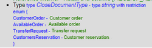

If a document cannot be closed, the following information displays: "Failed to close document."

If a document can be closed, the following information displays:

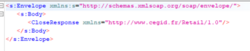

Through import

$$_SOLDECDEECO closes an order.

### Order Statuses

#### Statuses of Omni-Channel Orders

Statuses of Omni-Channel Orders

Back Office > Sales > Omni-channel sales > Track orders

Front Office > Customers > Omni-channel sales > Track orders

You can track the progression of Web orders through the various displayed statuses.

Follow-up status

The order may have one of the following statuses:

| Fields | Description |
| --- | --- |
| To process | The order must be validated |
| Validated | The payment (full or partial) is done on site. |
| Awaiting validation | Only the order is created. The preparation and the delivery cannot ne generated. The order can still be modified (quantities or items). The order must be validated before it can be prepared or delivered (see Managing status “Awaiting validation” ). |
| To supply to Headquarters | Headquarters have issued a transfer request form a store to Headquarters. |
| Requested at central level | The goods will transit from the Headquarters to the store. |
| To deliver by the store | A reservation was created in a store. |
| Preparation in progress | The delivery slip was created. |
| Prepared | The delivery slip was created. |
| Sent from Headquarters | The delivery slip was created. |
| Sent by logistician | The delivery slip was created. |
| Sent from store | The goods were shipped by the store. |
| Requested in store | The reservation of the goods was requested from the store. |
| Reserved in store | The transfer was received and the customer reservation created. |
| Picked-up in store | The customer reservation was closed in the store. |
| Closed | The order is already closed |
| Transferred to store | The goods are shipped from the Headquarters to the store. |
| Available in store | The goods are put aside. |
| Reservation request denied | The store refused the reservation request. |
| Accepted by the customer | The store refused the reservation request. |
| Awaiting return | The goods are to be returned by the customer. |

Shipment status

The order may have one of the following statuses:
- Not sent
- Sent
- Sent partially
- Shipment in progress

Invoicing status

The order may have one of the following statuses:
- Not invoiced
- Invoiced
- Partially invoiced

Payment status

The order may have one of the following statuses:
- Outstanding payment
- Captured payment
- Partial payment captured
- Payment debited
- Partial payment debited
- Credit note generated
- Payment refused
- To reimburse
- Payment credited

Delivery status

The order may have one of the following statuses:
- Delivery from Headquarters
- Store reservation
- Pick-up in store
- Pick-up point

Store status

The statuses of the store are limited to Pick-up store and Reservation store.

#### Managing Status Awaiting Validation

Managing Status “Awaiting Validation”

Back Office > Sales > Omni-channel sales > Track orders

Front Office > Customers > Omni-channel sales > Track orders

A number of different statuses are available in Order Tracking to monitor the progress of Web orders.

The Awaiting validation status can only be used for customer orders with delivery option: Delivery to the customer.

When the order is created manually or via Web Services, only the customer order is created (subsequent documents are not generated.)

And as long as the status has not been changed to Validated , the order can be modified.

Store record settings

Back Office > Basic data > Stores > Stores

In the Website’s store record, open the e-Commerce tab.

The Default tracking status setting is used to determine the default status of a Web order with delivery to the customer , when it is created in Back or Front-Office. The statuses proposed are as follows:
- Validated: This is the default status.
- Awaiting validation: If this status is set, any order created manually from the Back or Front Office will be assigned this status. When an order is entered, either manually or via Web Services, only the customer order is created, and the following documents are not generated:
- In the case of a Website-only order, the Preparation and Delivery documents cannot be generated until the status has been changed to Validated . If, when the order is created, depletion warehouses are specified for the stores, the Customer order or transfer request documents are not created. The same applies to deposit payment receipts and invoicing receipts (if invoiced on order).

As long as the status has not been changed to Validated , this button is available for modifying the order (changing quantities, adding items, changing depletion warehouses.)

How it works

It is necessary to distinguish 2 cases as detailed below:
- Manual entry of an e-Commerce order from the Back or Front Office,
- Creation of an e-Commerce order via Web Services.

Case 1: Manual order entry

If, in the Website’s store record, the status is set to:
- Validated: The standard scenarios will be used for the different delivery cases (Website delivery, store delivery or mixed delivery), with the creation of all the subsequent documents when the order is entered.
- Awaiting validation: Only the customer order is created upon registration.

Example 1: Order entry for the Website

If status Awaiting validation is activated in the Website's store record.
1. At order creation, tracking is automatically set to Awaiting validation
2. At this stage, it is not possible to generate preparation or delivery, but it is possible to change quantities or add items using the [Modify the order] button.
3. In order to prepare and/or deliver the order, it is necessary to manually change the tracking status from Awaiting validation to Validated .
4. The message "Do you confirm the validation of the order?" appears. If you answer:
1. NO: The tracking status remains unchanged. YES: the deposit payment document is created and preparation is possible. Then simply continue the scenario with order preparation and delivery, whose process remains unchanged.

Example 2: Order entry with modification of line warehouses

If status Awaiting validation is activated in the Website's store record.
1. At order creation, tracking is automatically set to Awaiting validation
2. Customer orders for stores have not been created.
3. As in the previous case, you can change quantities or add items using the [Modify order] button.
4. At this stage, it is still possible to change the warehouses of the stores using this button.
5. Store orders are still not created when the changes are saved.
6. To generate them, it is necessary to manually change the tracking status from Awaiting validation to Validated .
7. The message "Do you confirm the validation of the order?" appears. If you answer:
1. NO: The tracking status remains unchanged. YES: Tracking changes to Requested in store , the quantities of the Web order are updated according to the lines entered in the depletion window, customer orders are created, as well as the deposit payment receipt. The customer’s balance is updated too. Then simply continue the scenario with order preparation and delivery, whose process remains unchanged.

Case 2: Creation of an order via Web Services

The Awaiting validation setting available in the Website’s store record is not taken into account for the Web Services; it must therefore be specified in the order creation envelope.
1. An Awaiting validation status is added to the SaleDocumentService.Create Web Service with the FollowedUpStatus enumerable.
2. When the service is run, the order is created, and the order tracking is automatically updated to status Awaiting validation .
3. Customer orders for the stores have not yet been created.
4. The SaleDocumentService.Update service can be used to update the allocated warehouses or the quantities so that the Tax incl. total is recalculated.
5. The SaleDocumentService.UpdateHeader is used to update the FollowedUpStatus enumerable by changing its status from Awaiting validation to Validated , and triggers the subsequent document to be generated.
6. Tracking changes to Requested in store . The quantities of the Web order are updated according to the lines entered in the Web Service envelope. Customer orders are created, along with the deposit payment receipt. The customer’s balance is updated too.
7. The scenario can be continued with order preparation and delivery, whose process remains unchanged.

### Depletion Warehouse Management at Order Entry

#### Selecting, Displaying, Modifying the Depletion Warehouse

Managing Depletion Warehouse at Omni-Channel Order Entry

Back Office > Sales > Omni-channel sales > Enter an order

Front Office > Sales receipts > Sales > Enter transaction > button [Customer Services] > e-Commerce > Entry of an e-Commerce order

This topic details the various options for managing depletion warehouses when entering an omni-channel type order.

Displaying the depletion warehouse and/or the reservation store

When entering an order, it can be extremely useful to see at a glance for each order line:
- The selected depletion warehouse in case of delivery to the customer
- The selected reservation store in case of a reservation in the store

Therefore, you need to set up input lists

Procedure to define input lists

Back Office > Settings > Documents > Documents > Input lists
1. Use this button to select the GCSAISIECC (customer order) input list.
2. In the list of available fields, drag and drop this elements to the fields that make up the customer order, and save:
1. Once these elements are set up, they will appear systematically at order entry in the body of the document, as in the example below:

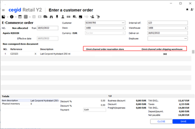

Display inventory for the selected warehouse

When entering or modifying an omni-channel order, it can be extremely useful to see at a glance for each order line, the inventory corresponding to the warehouse associated with the line:

Therefore, you need to set up document types

Procedure to define settings for document types

Back Office > Settings > Documents > Documents > Types
1. For the Customer order (CC) document type, select the Line info tab.
2. In one of the available lines, select Available inventory from shipping warehouse and validate.
3. You need to reconnect for the settings to be taken into account.
4. Once the settings have been made, when entering or modifying an omni-channel order, the inventory corresponding to the warehouse associated with the item line is displayed in the lower left-hand part of the document:

Just remind, use this button to choose the depletion warehouse for the selected line.

1. Note that inventory is calculated according to the settings defined in the company settings, Commercial management > Web Services, and more particularly in the Omni-channel net inventory calculation: Physical + field.

Note that this information is displayed only for omni-channel type orders, and when the shipping warehouse is specified in the line (change of depletion warehouse for customer deliveries.)

Selecting the depletion depot depending on available inventory

In case of a delivery to the customer's place or to a pick-up store, it is possible to define the warehouse to be depleted at order entry.
1. After having entered the document header information, enter the items to be ordered.
2. Click this button to open E-Commerce warehouse selection window.
3. In the Warehouse column, on the item line, you can either:
- Indicate the code of the warehouse to deplete, if you know it, and finish your order.
- Or click this button (available at the end of the field) to display the list of warehouses.
1. The E-Commerce warehouse inventory screen opens and lists the warehouses having stock for the item of the order line. Note that the item is automatically specified in the proposed criteria and cannot be modified.
1. The Available inventory column is calculated according to the settings defined in the company settings, Commercial management > Web Services, and more particularly in the Omni-channel net inventory calculation: Physical + field.
1. The warehouses displayed in the list are limited according to the following elements:
- In the Warehouse record , the Inventory visible to other stores option must be checked. The Warehouse record is accessible from Basic Data > Stores > Warehouses.
- In the Store record (e-Commerce tab), one of the following three options must be checked: Transfer to Headquarters, Shipment to customers, or Transfer to other Stores. The Store record is accessible from Basic Data > Stores > Stores.
- In the User record , the warehouse must not be subject to a user restriction regarding inventory query. The User record is accessible from Administration > Users and Access > Users.

Note that if the depletion warehouse was not entered at order entry, it can be entered from the Back or Front Office, in Order tracking, via the [Modify the order] button.

Modifying the depletion warehouse for order lines

Back Office > Sales > Omni-channel sales > Track orders

Front Office > Customers > Omni-channel sales > Track orders

In the e-Commerce order tracking menu, for orders to be delivered to the customer, you can change the depletion warehouse for the lines if the items are not available in the selected warehouse.

This button allows you to reassign an order to the Web warehouse, in case the "non e-Commerce" warehouse refuses the order.

The Web warehouse can then ship the goods directly to the customer if it has received them in the meantime or reassign the order to another "non e-Commerce” warehouse.

Displaying inventory available for sale in the entire network

When creating or modifying an order (if omni-channel or not), it can be useful to know the inventory available for sale in the entire network. Available inventory means the total inventory available in the entire network of stores, as well as in the Web inventory, for a given item.

Therefore, you need to set up document types

Procedure to define settings for document types

Back Office > Settings > Documents > Documents > Types

=> This setup can be applied to any document type, if required.
1. For the Customer order (CC) document type, select the Line info tab.
2. In one of the available lines, select Network cumulative inventory and validate.
3. You need to reconnect for the settings to be taken into account.
4. Once the settings have been made, when entering or modifying an omni-channel order, the network cumulative available inventory corresponding to the item line is displayed in the lower left-hand part of the document.

Note that inventory available is calculated according to the settings defined in the company settings, Commercial management > Web Services, and more particularly in the Omni-channel net inventory calculation: Physical + field.

The inventory taken into account meets the following constraints
- The Inventory query user restriction is applied.
- Inventory in the following warehouses is taken into account:

Combining depletion warehouses

Cegid retail y2 allows you to combined different depletion warehouses (Website and stores) when you enter a Wen order.

For further information, see Combining Depletion Warehouses .

Combining Depletion Warehouses

#### Combining Depletion Warehouses

Combining Depletion Warehouses

The two main menus used in the examples below are Enter an order and Track orders (from the Omni-Channel Sales module).

Cegid Retail Y2 allows you to combined different depletion warehouses (Website and stores) when you enter a Web order. There are several possible scenarios:
- Delivery of goods to the customer by both the Website AND directly by one or more stores.
- Delivery of goods by the Head office (Website), but with the option of requesting only a part of the goods from one or more stores, while the Website has a part of the goods to deliver.
- Refusal of a customer order or transfer request by a store, and mixed reallocation of lines.

Case 1: Delivery to the customer by the Website and by each selected store.

Prerequisites: The Shipment to customers option must be checked for the store in their records (in the E-Commerce tab.)

Manual entry of the order in the Back Office and/or Front Office

Enter an order
1. Enter the items to be ordered and click the [E-Commerce depletion warehouses] button.
2. In the E-Commerce warehouse selection window select the various warehouses of your choice: Website’s warehouse and the stores’ warehouses.
3. Please note! All lines of the warehouses must be filled in, otherwise the following message will be displayed when the document is validated: "Delivery option not possible. The warehouses for the lines have been changed in the order.”
4. When you select the delivery type, select Delivery to the customer .

Track orders
1. Several customer orders have been created: one for the Website and one for each of the specified stores, with quantities corresponding to those associated with the order lines.
2. If payable on delivery, a deposit payment receipt has also been created for the Website, to be used for each customer delivery along with the billing receipt.
3. The stores and the Website can deliver the customer independently, with or without preparation management.
4. For the Website, delivery can be made from the Track orders menu, or from the Deliver orders menu, available in the Omni-Channel Sales module.
5. Once delivery has been made, the customer order from the Website is displayed as Closed through the Track orders menu. A customer delivery is generated, as well as a billing receipt. And the invoicing status and the shipping status are set respectively to Partially Invoiced and Partially sent .

Delivery from stores

Stores can make deliveries from the Front Office, through the Enter transaction menu, or from the Track orders menu.
1. Delivery from a store through the Enter transaction menu : In the E-Commerce requests for goods window, find the order for the store. To generate the delivery, either select the entire order, which will automatically validate it, or double-click on each line to enter the quantities to be delivered. Once delivery has been made, the customer order from the store is displayed as Closed through the Track orders menu. A customer delivery is generated, as well as a billing receipt. And the invoicing status and the shipping status are set respectively to Partially Invoiced and Partially sent .
2. To complete shipment of the order, the 2nd store must in turn deliver its order.
3. Delivery by the 2nd store from the Track orders menu : Select the order line and click the [Order delivery] button. Once delivery has been made, the customer order from the store is displayed as Closed through the Track orders menu. A customer delivery is generated, as well as a billing receipt. And the invoicing status and the shipping status are set respectively to Invoiced and Sent. The customer balance is 0, and the deposit has also been used up.

Order creation using Web Services
1. In the Create section of the SaleDocumentService.svc service, in the envelope, specify the WarehouseId tag for the various lines, as well as for the selected warehouses.
2. Once the service has run, you'll see through the Track orders menu that several sales orders have been created: one for the Website and one for each of the stores entered, with quantities corresponding to those associated with the order lines.
3. A deposit payment receipt linked to the Website has also been created.

Case 2: Delivery to the customer's premises by the Website with partial transfer of goods to the main warehouse

Prerequisites: The Transfer to Headquarters option must be checked for the stores in their records (in the E-Commerce tab.)

Manual entry of the order in the Back Office and/or Front Office
1. Once the order has been entered, including the allocation of the depletion warehouses, a customer order is created in the order tracking feature, including the total quantities, and a transfer request is created for each of the stores entered, with only the quantities associated with the order lines.
2. The Website will have to wait for all the goods requested from the stores to be received before it can deliver the entire order to the customer.
3. For the stores, the transfer request is accepted in the Front-Office, through the Enter transaction menu.
4. In the E-Commerce request for goods window, you will find the request for the store.
5. As in the previous case, there are 2 possibilities for generating the sent transfer: automatic validation, or manual (total or partial) generation.
6. Once validated, the transfer request is displayed as Closed through the Track orders menu. The application then creates a sent transfer and a delivery notice.
7. The 2nd store must also validate the transfer request. Once validated, the transfer request is displayed as Closed through the Track orders menu. The application then creates a sent transfer and a delivery notice.
8. The Website is still unable to deliver the customer, as the [Order delivery] button remains disabled until the goods have been received at the main warehouse, with the validation of the transfer notices.
9. The generation can be done from either the Track orders menu, or the Receive orders menu, both of which are available in the Omni-Channel Sales module.
10. Once the 2 transfer notices have been validated, they are displayed as Closed through the Track orders menu. Two received transfers are created, and the follow-up status is set to Validated .
11. The order can now be delivered to the customer. This can be done from the Track orders menu, or from the Deliver orders menu, available in the Omni-Channel Sales module.
12. Once delivery has been made, the customer order from the Website is displayed as Closed through the Track orders menu. A customer delivery is generated, as well as a billing receipt. The follow-up status and the shipping status are both set to Shipped and the invoicing status is set to Invoiced .

Order creation using Web Services
1. In the Create section of the SaleDocumentService.svc service, in the envelope, specify the WarehouseId tag for the various lines, as well as for the selected warehouses.
2. Once the service has run, you will see through the Track orders menu that a customer order has been created with all quantities. And for each of the stores entered, a transfer request has been created with only the quantities associated with the order lines.

Case 3: Refusal of a customer order or transfer request by a store, and mixed reallocation of lines

Refusal of a customer order by a store
1. Once the order had been entered, including the assignment of the depletion warehouses through the Track orders menu, several customer orders were created: one for the Website and one for each of the specified stores. The quantities correspond to those associated with the order lines.
2. If payable on delivery, a deposit payment receipt has also been created for the Website, to be used for each customer delivery along with the billing receipt.
3. In the Front Office, it is possible to refuse the order using the [Refuse the request] button available in the Enter transaction or Track orders menus.
4. At this stage, checks are carried out, and it not possible to use the [Refuse], [Prepare], [Deliver], [Close] and [Block] buttons for an order from another store or from the Website, as these have been disabled.
5. After the store's refusal, the order is displayed as Closed through the Track orders menu, and the follow-up status is set to Merchandise request denied . It is therefore necessary to reassign the rejected lines. To do this, position your cursor on the Website order, click the [Modify the order] button; then in the warehouse selection window, modify the rejected lines with either the Website warehouse, or with that of another store, or combine both.
6. When the document is validated, the Website order is updated with the new quantities, and a new customer order is created for the other store. A new deposit payment receipt is created, and the original one canceled. The follow-up status is then changed to Requested in store . The customer’s balance is updated too. The standard scenario for delivery to the customer's premises is then repeated, as in the previous case.

Refusal of a transfer request by a store
1. Once the order has been entered, including the allocation of the depletion warehouses,, using the Track order s menu, a customer order is created including the total quantities, and a transfer request is created for each of the specified stores, with only the quantities associated with the order lines.
2. In the Front Office, it is possible to refuse the transfer request using the [Refuse the request] button available in the Enter transaction menu.
3. After the store's refusal, the transfer request is displayed as Closed through the Track orders menu, and the follow-up status is set to Merchandise request denied . It is therefore necessary to reassign the rejected lines. To do this, position your cursor on the Website order, click the [Modify the order] button; then in the warehouse selection window, modify the rejected lines with either the Website warehouse, or with that of another store, or combine both.
4. When the document is validated, a new transfer request , with only the changed quantities is created for the other store. The follow-up status is then changed to Requested in store . The standard scenario for validating transfer requests is then repeated, as in the previous case.

### Querying Documents

Query of Omni-Channel Documents

This section lists the different ways to access the query of omni-channel documents within the application.

Tracking orders

Order tracking allows you to view the status of an order. From an order, you can view all other documents linked to the order.
- In Back Office > Sales > Omni-channel sales > Track orders.
- In Front Office > Customers > Omni-channel sales > Track orders.

Just remind: The statuses displayed for the order depend on the statuses defined in the company settings (see Status of Orders to Deliver to Customer .)

Status of Orders to Deliver to Customer

Querying orders
- In Back Office > Sales > Omni-channel sales > Query by document > Orders
- In Back Office > Sales > Omni-channel sales > Query by document line > Orders

Querying deliveries
- In Back Office > Sales > Omni-channel sales >Query by document > Deliveries
- In Back Office > Sales > Omni-channel sales > Query by document line > Deliveries.

Querying invoices
- In Back Office > Sales > Omni-channel sales > Query by document > Invoicing
- In Back Office > Sales > Omni-channel sales > Query by document line > Invoicing

Querying transfer requests
- In Back Office > Sales > Omni-channel sales > Query by document > Transfer requests
- In Back Office > Sales > Omni-channel sales > Query by document line > Transfer requests.

Querying reservation requests
- In Back Office > Sales > Omni-channel sales > Query by document > Requests for goods
- In Back Office > Sales > Omni-channel sales > Query by document line > Requests for goods

Querying reservations
- In Back Office > Sales > Omni-channel sales > Query by document > Reservations
- In Back Office > Sales > Omni-channel sales > Query by document line > Reservations

Querying return notices
- In Back Office > Sales > Omni-channel sales > Query by document > Return notices
- In Back Office > Sales > Omni-channel sales > Query by document line > Return notices

Querying reservation requests (or requests for goods)
- In Back Office > Sales > Omni-channel sales > Query by document > Requests for goods
- In Back Office > Sales > Omni-channel sales > Query by document line > Requests for goods
- In Front Office > Customers > Omni-channel sales > Requests for Goods.

Querying transfer notices
- In Front Office > Customers > Omni-channel sales > Transfer notices > Query by document.

### Multicurrency Management for Orders

Multicurrency Management for Omni-Channel Orders

This topic deals with multicurrency management of omni-channel orders, especially when a Website managed in one currency wants to handle customer orders for which deposit payments are made in another currency. Moreover, this topic also describes how to handle pickups in stores for which the currency in use is different from the currency used on the Website where the order was placed.

First, this section describes the settings required to handle these cases, then it shows how this works in the store.

For the sake for clarity, we will take the euro and the pound sterling as examples.

Settings for a euro-managed Website that accepts pounds sterling

Step 1: Payment method

Back Office > Settings > Management > Payment methods

Create the Deposits already paid in £ payment method with the pound sterling currency.

Step 2: Register operation

Back Office > Settings > Management > Register operations

Create the Deposits already paid in £ register operation and specify in the Associated payment method field (in the Outstanding payments tab) the payment method just created.

Step 3: Store record

Back Office > Basic data > Stores > Stores (Omni-channel store record)

In the omni-channel store record, go to the e-Commerce tab and click the [Other currencies accepted] button. Specify the following information in the window that displays:
- Sales currency: in our example, the pound sterling
- Deposit payment: this is the register operation created in step 2
- Payment method: this is the payment method created in step 1

The following checks will be performed:
- The store currency cannot be added (because already present)
- One single line is entered per currency
- The deposit payment must be associated with a payment method in the same currency as the sale
- The deposit payment is mandatory.

Reservations and pick-ups in stores

When creating an omni-channel order of type Reservation or Picked up in store in a currency different from the currency of the omni-channel store, the deposit payment receipt is created in the correct currency by using the financial item for deposit payments, set in the omni-channel store of the order.

When the goods are picked up in the store, the payment method linked to the deposit payment is used to consume the deposit payment in the currency of the payment, and the customer’s balance is then updated.

Note that omni-channel orders that have a currency different from those configured are rejected by the data import and the Web Services (SalesDocument.Create.)

The following cases may occur:
- The deposit payment can cover 100% of the order or only a part
- The order can be delivered totally
- The reservation can be picked up partially or totally
- The customer can pick up the order and buy other items

Case study

The customer buys in England on the Website (in €) an item worth £100 (€80 with an exchange rate of 1.25.) The customer pays the total amount, i.e. a deposit payment of £100.
- Order £100
- Exchange rate £1 = €1.25
- Payment £100
- Checkout payment 0

Item delivered to the customer in a store in £:
- If delivered to the store, the order will be generated in £.
- If reserved in the store, the reservation will be generated in £.
- Recovered in a FFO document in £, for £100 with a deposit paid £100.

Result:
- Order £ 100
- Exchange rate £1 = €1.25
- Payment £ 100
- Checkout payment £100

Item delivered to the customer in a store in €:
- If delivered to the store, the order will be generated in £. The original document will not be converted.
- If reserved in the store, the reservation will be generated in £. The original document will not be converted.
- If the deposit payment is used at 100% for the payment, the payment will not be converted.
- If the deposit payment is used partially for a reservation, the change given back to the customer will be in the currency of the store, based on the store's exchange rate.

### Other Features Available in the Module

Other Features Available in the Omni-Channel Module

Data recovery

Back Office > Data exchanges > Data recovery > Data import

In imports of delivery preparations, the $$_PRESTATIONTRANSPORT import field specifies whether the service item Shipping fees will be recovered.

Note that omni-channel orders that have a currency different from those configured are rejected by the data import and the Web Services (SalesDocument.Create.)

For more information on automatic order integration, click here .

click here

Omni-channel import

Upon importing a sent transfer (with generation of a transfer notice):
- Outside e-Commerce context: include the field $$_DUPLICPIECE to generate the transfer notice.
- E-Commerce context: do not add the field $$_DUPLICPIECE, the transfer notice is automatically created upon import.

Consequently, omni-channel and non omni-channel imports must be kept distinct from one another with two separate recovery formats.

Export documents

Back Office > Data exchanges > Data export - Export Omni-channel documents

This command enables the export of sales documents or return documents. Click here for further information.

Click here

For any issue linked the export of omni-channel data, please contact your consultant.

Managing formulas in lists of requests for goods

Front Office > Sales receipts > Sales > Enter transaction - automatic display of the list when opening the screen

Examples of formulas to alert on late reservation requests

Addition of a formula with 2 states
1. Add a simple formula: (IIF(DATEDIFF(minute,GL_DATECREATION,NOW)<500, "X", "-")) 500 = number of minutes to alert that the reservation request is late.
2. Make it invisible.
3. Then add a conditional formula: If(C23)=X Then #COL#clGreen Else #COL#clRed

Addition of a formula with 3 states
1. Add a simple formula: (IIF(DATEDIFF(minute,GL_DATECREATION,NOW)>300,(IIF(DATEDIFF(minute,GL_DATECREATION,NOW)<1000,"O","R")),"G")) 1000 = number of minutes to alert that the reservation request is late.
2. Make it invisible.
3. Then add a conditional formula: [@SI([C26]=R;#COL#clRed;SI([C26]=G;#COL#clGreen;#COL#clGray))]

Result

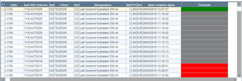

## Intercompany

### Introduction to the Subsidiary Record

Introduction to the Subsidiary Record

Back Office > Basic data > Stores > Subsidiaries

Foreword

Stores can be organized into subsidiaries, with all information centralized in the same database.

The subsidiary is a piece of information specified in the Contact information tab of the store record (in the Back Office Basic data module.)

When organizing subsidiaries, it is important to be able to create a flow chart of the subsidiaries and their legal affiliations:

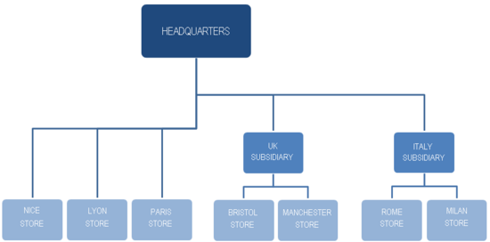

In this example, the following applies:
- French stores are directly associated with HEADQUARTERS
- British stores are associated with the UK subsidiary, which is in turn linked to HEADQUARTERS
- Italian stores are associated with the ITALY subsidiary, which is itself associated with HEADQUARTERS

In this type of organization, the subsidiaries are considered suppliers by their associated subsidiary stores. In the same way, the associated subsidiary stores are considered as customers by their own subsidiaries.

Activation of additional modules and their impact on the layout of the Subsidiary record.

Note that the subsidiary record looks different whether the Intercompany module is activated; the presence of the Mobile Clienteling and/or Inventory Tracking modules also impacts the layout of the record:

|  | Mobile Clienteling and Inventory Tracking modules enabled | Mobile Clienteling and Inventory Tracking modules disabled |
| --- | --- | --- |
| Intercompany enabled | The subsidiary record is available in Basic data > Stores, in its detailed form. The subsidiary concept is displayed in the store record. | The subsidiary record is available in Basic data > Stores, in its detailed form. The subsidiary concept is displayed in the store record. |
| Intercompany disabled | The subsidiary record is available in Basic data > Stores, in its simplified form (only the code, the description, the currency and the e-mail appear in the subsidiary record.) The subsidiary concept is displayed in the store record. | The subsidiary record is not available in Basic data > Stores. The subsidiary concept is not displayed in the store record. |

### Focus on the Subsidiary Record

Subsidiary Record

Back Office > Basic data > Stores > Subsidiaries

Just remind!

The subsidiary record looks different whether the Intercompany module is activated; the presence of the Mobile Clienteling and/or Inventory Tracking modules also impacts the layout of the record (see Introduction to the Subsidiary Record .)

Introduction to the Subsidiary Record

Characteristics tab

The Subsidiary record is divided into three parts detailed below:

Header

The upper part of the screen is used to enter information specific to the subsidiary (code, description, e-mail, and currency.)

Note that once the currency selected, it can be changed only in Administration > Maintenance > Change currency for subsidiary.

Transfers

The middle part of the screen defines options and valuation methods for these transfers. Note that information relating to transfers does not directly concern counterpart flow management. Consequently, regardless of counterpart flows and their management, do not forget to populate the fields hereafter to enable transfers to be valued correctly.

| Fields | Description |
| --- | --- |
| Authorize the validation of transfer notices in the store records | This option is an input help. It allows you to check (or uncheck) the setting in all stores and warehouses affiliated to the subsidiary by checking (or unchecking) only that in the subsidiary record. |
| Print intra-store transfer documents on a same geographical site | This setting is closely linked to the settings in the warehouse record. The management of inventory can be handled internally within the store or outsourced to another site. To avoid having the inventory movement document printed systematically, you can specify in the warehouse record whether the warehouse is a remote warehouse of the store. You can also specify the geographical site linked to this warehouse. The transfer document will not be printed in the following situations: If subsidiary management is activated and the sender and recipient stores are identical and the Print intra-store transfer documents on a same geographical site setting is not selected in the subsidiary record and the sender and recipient warehouses are not remote or the original and recipient warehouses are remote and the geographical site has been entered and the sender and recipient geographical sites are identical. |
| Direct transfers between remote warehouses of a same geographical site | This options allows you to specify that no transfer notices should be generated for transfers between remote warehouses within the same geographical site. In this case, the TEM document is generated as a TRE document directly. For further information, please refer to Internal Inventory Movements . |
| Direct transfer from sender stores of type Headquarters | This option is only available if the Direct transfer if sender store is of type Headquarters option is selected in Company settings > Inventory. It enables the automatic creation of a sent transfer if the sender is a store typed Headquarters (see Store record > Contact information tab > field Type.) For further information, please refer to Internal Inventory Movements . |
| Valuation of transfers | All options linked to the valuation of transfers (sent or received) are described in detail in section Transfer Valuation . |

Settings

The lower part of the subsidiary screen is used to define additional settings.

| Field | Description |
| --- | --- |
| Selection for printed language | This option activates multilingual printouts: If the management of subsidiaries is not active , only the value in the Selection for printed language company setting, accessible in Commercial management > Preferences, is taken into account. If the management of subsidiaries is active, the following applies : If the user’s default store is associated with a subsidiary, the setting from the subsidiary record will be taken into account. If the user’s default store is not associated with a subsidiary, the company setting will be taken into account. An option in the Page layout tab of the print screens allows you to select the print language. By default, this language is set to the language of the user’s programs. |
| International customizations | In the case of subsidiary management, the International customizations feature must be activated for every subsidiary in the Back Office. |
| Transfer price management | This option activates transfer prices. |
| Specific item search priority | The item search priority can be activated at subsidiary level. If this option is ticked, the stores associated with the subsidiary can set a specific item search (Miscellaneous tab of the Store record .) For more information on this feature, please refer to Search Priorities . |
| Query/Process litigations on transfers | You can set restrictions for querying or processing litigations on transfers (in the company settings via Commercial management >Document-Entry) For more flexibility, these settings are also available at subsidiary level. Default values are set to By recipient . |
| Management of cashboxes | If the management of cashboxes is enabled in the company settings (Front-Office tab,) it is then possible to authorize this feature at store level (refer to Cashbox Management .) |

Toolbar
- Affiliated stores: Click this button to view the stores affiliated with the subsidiary.
- Settings for inventories: Click this button to define settings for inventory counts (refer to Inventory Count Management .)
- Supplier referencing: Once the record created, click this button to define the suppliers associated with the subsidiary. Please note! This referencing is dedicated to users handling counterpart flows. For further information about supplier referencing, please refer to paragraph Referencing Suppliers Associated with the Subsidiary , described in topic Counterpart Flows .

Affiliating the subsidiary with the store

Back Office > Basic data > Stores > Stores

Two settings in the store record allow you to specify whether the store is associated with a subsidiary, and whether certain documents exchanged between this store and its subsidiary generate counterpart documents:

This relates to the Type and Subsidiary fields (see the Contact information tab in the Store record.)

Contact information

### Counterpart Flows

Counterpart Flows - Contents

This section is designed for users wanting to generate counterpart documents between the subsidiary and its stores. The objective is to automatically generate counterpart documents:
- When creating purchase orders for stores, automatic generation of customer orders for their subsidiary.
- Or conversely, when creating subsidiary customer orders for a given store, automatic generation of supplier orders for this store.

Note that counterpart flows are available on if multicompany management has been serialized.

Preliminary settings
- Enabling counterpart management
- Configuring subsidiaries for counterpart flows
- Configuring stores for counterpart flows
- Changing the store subsidiary
- Configuring the automatic flow chart
- Configuring access rights

Document management
- Purchase documents
- Sales documents
- Document follow-up
- Managing broken chains
- Third party management

Constraints
- Three cases of constraints

Counterpart flow diagram examples
- Store creates purchase order proposal
- Subsidiary exports quotation
- Subsidiary transforms quotation into customer order
- Subsidiary delivers order

#### Contents

Counterpart Flows - Contents

This section is designed for users wanting to generate counterpart documents between the subsidiary and its stores. The objective is to automatically generate counterpart documents:
- When creating purchase orders for stores, automatic generation of customer orders for their subsidiary.
- Or conversely, when creating subsidiary customer orders for a given store, automatic generation of supplier orders for this store.

Note that counterpart flows are available on if multicompany management has been serialized.

Preliminary settings
- Enabling counterpart management
- Configuring subsidiaries for counterpart flows
- Configuring stores for counterpart flows
- Changing the store subsidiary
- Configuring the automatic flow chart
- Configuring access rights

Document management
- Purchase documents
- Sales documents
- Document follow-up
- Managing broken chains
- Third party management

Constraints
- Three cases of constraints

Counterpart flow diagram examples
- Store creates purchase order proposal
- Subsidiary exports quotation
- Subsidiary transforms quotation into customer order
- Subsidiary delivers order

#### Counterpart Flow Settings

Counterpart Flow Settings

Enabling counterpart flow management

Back Office > Administration> Company > Company settings

Go to Administration> Distribution. To enable counterpart flows, check the Management of subsidiary flows available in the Multicurrency panel.

Configuring subsidiaries for counterpart flows

Back Office > Basic data > Stores > Subsidiaries

The standard configuration is in the Subsidiary record is explained in detail, in the Subsidiary Record section. Nevertheless, to ensure the proper functioning of the counterpart flow, please check that both of the following settings have been correctly entered.

Subsidiary Record

Referencing the suppliers used by the subsidiary

In the Subsidiary record, click this button to define the suppliers used by the subsidiary.

This referencing is possible only if subsidiary flow management has been enabled in company settings. Otherwise, the Supplier referencing option will be hidden.

Note that the referencing is cross-referenced. As a result, it will be automatically applied to the Supplier record.

To verify this, use the same button in the Supplier record and open the Subsidiary Referencing option.

Restrictions:
- A consigned supplier cannot be associated with a subsidiary.
- All stores for a given subsidiary must have the same serial number management.

Assigning a store to a subsidiary

In the subsidiary record, click this button and select the stores to associate with the subsidiary.

Configuring stores to manage counterpart flows

Back Office > Basic data > Stores > Stores

Two fields in the Store record ( Contact tab) must be populated to manage counterpart flows.

These are the Type and Subsidiary fields detailed in the Subsidiary section. See topic Assigning the Subsidiary to Stores .

Assigning the Subsidiary to Stores

These settings enable you to specify that a store has been assigned to a subsidiary and that certain documents exchanged between the store and it subsidiary generate counterpart documents.

You can also determine links between a subsidiary, subsidiary headquarters and stores that are attached to them.

Subsidiary headquarters must be set as such in the Type field. So for a given subsidiary, only one store can be labeled as subsidiary headquarters . Stores must have distinct associated customers and the same serial number management.

Restrictions:
- For a given subsidiary, a only one store can be of type “Subsidiary headquarters”; it will then correspond to the Headquarters of the subsidiary.
- In the Third party tab, the Associated customer is required if the store belongs to a subsidiary and if the Management of subsidiary flows company setting is enabled.

Configuration example

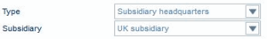

| Fields | Description |
| --- | --- |
| Type | The store is, for example, typed as a Subsidiary headquarters when it corresponds to the upper level of the counterpart flow described below (the subsidiary office that the stores are linked to). For example, the stores will be typed as a Branch or Agent stores. |
| Subsidiary | Subsidiary stores will be linked to the subsidiary by the Subsidiary field, regardless of type. You can enter the subsidiary a store belongs to in this field. Examples: Subsidiaries in UK, Southeast Asia, Europe, etc. |
| Stores created | In our example, 3 stores can be created, as follows : UK HEADQUARTERS: type: subsidiary headquarters subsidiary: UK subsidiary LONDON store: type: branch subsidiary: UK subsidiary MANCHESTER store: type: retailer subsidiary: UK subsidiary |

Changing the subsidiary of the store

Back Office > Administration > Maintenance > Change subsidiary for store

When documents have been entered for a store, its subsidiary can be changed with this command only. This operation will also cause all store documents to be re-calculated.

The wizard will display stores and subsidiaries currently saved. After selecting the new subsidiary, click [Next] to start the operation. It is possible to change the subsidiary for a store without using this wizard in the following cases:
- If the store has no movements.
- If the store has movements, but the currency for the new subsidiary is the same as the one for the old subsidiary.
- If the store has movements, but it has not been assigned to any subsidiary, and the new subsidiary’s currency is the same as the folder currency.

Configuring the automatic flow chart

Back Office > Settings > Documents > Counterpart flow

For each subsidiary, counterpart flows are determined by taking into account the type of the sender store and the document type sent.

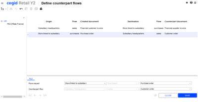

In this example, entering purchase orders for a store assigned to a subsidiary will automatically generate customer orders at the level of subsidiary headquarters. Note that this is not necessary to enter reverse flows.

In our example, entering customer orders for subsidiary headquarters will automatically generate purchase orders for the assigned store.

When viewing a document, the [Zoom/Linked documents] button allows you to view the counterpart document.

The link between documents is managed in the LIAISONPIECE table. This screen is available for each subsidiary. In this way, organizational strategies may be different between each subsidiary and its assigned stores.

When flows are created, a check is carried out to verify that all linked documents have the following identical document settings:
- Remainder management (Inventory tab)
- Serial number management (Inventory tab)
- Credit note document (General tab)
- Litigation management (General tab)
- Visa management (General tab)
- Authorize documents valued at 0 (Valuation tab)
- Document subject to tax (Management tab)
- Authorized item types (Item tab)

Counterpart documents are managed by all document creation and modification operations: direct entry or modification, duplication, deletion, automatic and manual generation, CAPM imports, store replenishment order generation, replenishment order generation, etc.

Configuring access rights

Back Office > Administration > Users and access > Access right management

Enable access rights for the user groups of your choice.

Menu Concepts (26) – Inventory
- View inventory of all warehouses of the subsidiary: Authorize or not the user to view the inventory of all the warehouses and/or all the warehouses of the subsidiary. If the user is granted authorization, the list of warehouses returned by restrictions in terms of warehouse visibility is updated. If the right is denied, the user cannot view the inventory of all the warehouses of the subsidiary.

Menu Settings (105) – Documents
- Counterpart flows: Authorize or not the user to access the management of counterpart flows.

Menu Administration (106) – Maintenance
- Change currency for subsidiary: Authorize or deny users access to the command which allows subsidiary currency to be changed.
- Change subsidiary for store: Authorize or deny users access to the command which allows subsidiary of the store to be changed.

Menu Basic data (110) – Stores
- Subsidiaries: Authorize or deny user access to the command enabling subsidiary management.

#### Document Management

Counterpart Document Management

Purchase documents

A control will be done in purchase document entry to verify that:
- The store is of type “Subsidiary headquarters” or assigned to a subsidiary.
- The flow is part of the counterpart flow table for the subsidiary and its stores.
- The supplier is distributed by the subsidiary.

In the case where these three conditions
- are met: the validation of purchase document generates corresponding sales document
- are not met: no counterpart document will be generated

Example: When a purchase proposal is created in the MANCHESTER store, the following search will be carried out:
- Is the MANCHESTER store assigned to a subsidiary? YES (UK SUBSIDIARY)
- Are purchase proposals in the counterpart table? YES (customer quotation)
- Is the supplier of the purchase proposal distributed by the subsidiary? YES

Validating the purchase proposal generates a counterpart customer quotation with the following characteristics:
- Store issuing the customer quotation: UK SUBSIDIARY
- Customer of the quotation: Customer associated to the Manchester store

Sales documents

A control will be done upon the entry of the sales document to verify that:
- The store is of type “Subsidiary headquarters” or assigned to a subsidiary
- The flow is part of the counterpart flow table for the subsidiary and its stores
- The customer in the sales document is the one associated to a store linked to the subsidiary

In the case where these three conditions
- are met: the validation of the sales document generates the corresponding purchase document
- are not met: no counterpart document will be generated

Example: When a customer quotation is created in the UK store, the following search will be carried out:
- Is the UK subsidiary a subsidiary? YES
- Are the customer quotations in the counterpart table? YES (purchase proposals)
- Is the customer of quotation the one associated to a store assigned to the subsidiary? YES

Validating the customer quotation generates a counterpart purchase proposal with the following characteristics:
- Store issuing the purchase proposal: MANCHESTER
- Supplier of the generated purchase document: Reference supplier

Document follow-up

Modifying documents

Modifying a document automatically causes the counterpart document to be modified. And vice-versa.

Generating documents

With the following configuration in the counterpart flow table:

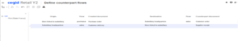
- An issued purchase order (CF) creates a counterpart customer order (CC).
- The generation of a customer order (CC) into a customer delivery (BLC) creates a supplier receipt (BLF) which closes the purchase order (CF).

This functioning takes backorders into account.

Duplicating documents

Document duplication also generates counterpart documents, if need be.

Managing broken chains

When a document belonging to a flow generates a document not belonging to the flow, the chain is broken.

Consequences: The counterpart flow documents may not be modified and the document generated is marked as “broken counterpart.”

Example:
- A counterpart flow is defined between customer deliveries (BLC) and supplier receipts (BLF).
- A counterpart flow is not defined for a customer invoice (FAC).
- A BLC is entered, which generates a BLF as counterpart.
- A BLC is generated in FAC
- The FAC generated is marked as “Broken counterpart”: GP_CONTREPARTIE=CAS
- The BLC generated is marked as “Non-modifiable”: GP_NONMODIFIABLE=X
- The BLF for the counterpart is marked as “Non-modifiable”: GP_NONMODIFIABLE=X, but it is not closed.

Third party management

Associated customer

The associated customer in one who is entered in the Third party tab in the store record.

Reference supplier

As soon as the initial document is entered, a search is performed to check whether the document will be used to create a counterpart document. In this case, entering the first item determines the reference supplier.
- If the supplier is distributed by the subsidiaries:
- If this supplier is not distributed by the subsidiaries:

The original document and the counterpart document will therefore remain identical in content.

#### Counterpart Flow Constraints

Counterpart Flow Constraints

Case 1

It is not possible to use a subsequent document (in the purchases or sales chain) in the case of grouped documents.

Example: The customer invoice balances the customer quotation and the delivery notice balances the purchase order proposal.

Counterpart procedure:

Customer invoice (FAF) -> Delivery notice (ALF)

Customer quotation (DE) -> Purchase order proposal (DEF)

Constraint: A customer invoice must not group several customer quotations, and a delivery notice must not group several purchase order proposals.

Case 2

If a subsequent document exists, the preceding document cannot be updated.

Example: The customer invoice balances the customer quotation and the delivery notice balances the purchase order proposal.

Counterpart procedure:

Customer invoice (FAF) -> Delivery notice (ALF)

Customer quotation (DE) -> Purchase order proposal (DEF)

Constraint: When a customer quotation or purchase order proposal has been, even partially, balanced by their respective subsequent document, they can no longer be modified.

Case 3

A subsequent document that is not managed in a counterpart flow will “break” the counterpart nature of the preceding documents.

Example: The customer invoice balances the customer quotation and the delivery notice balances the purchase order proposal. There is no counterpart document generated for the supplier delivery.

Counterpart procedure:

Customer invoice (FAF) -> Delivery notice (ALF)

Customer quotation (DE) -> Purchase order proposal (DEF)

Supplier delivery (BLF)-> no counterpart

Constraints: The generation of a supplier delivery for a delivery notice “breaks” the existing counterpart status between the delivery notice and the customer invoice.

As a result, any change to the customer invoice will not be reflected in the delivery notice and vice versa.

#### Counterpart Flow Diagrams

Counterpart Flow Diagrams

Store creates purchase order proposal.

Creating documents

Supplier F1 is distributed by the subsidiary. Since all conditions for managing the counterpart have been met, the customer quotation is created.

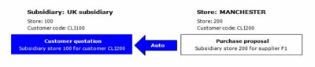

Modifying documents

Purchase order proposals remain modifiable in-store, so long as the quotation is not transformed or exported. The modifications done on purchase order proposals will automatically be transferred to quotations. In the same way, modifications made to quotations are transferred to purchase order proposals.

Valuing generated documents

The document generated uses the values of the original document.

Subsidiary exports quotation

Exporting a quotation enables you to render it non-viable. Since quotations are issued from purchase proposals, they are rendered non-viable.

This function depends on adding new data in the following export format type: $$_DOCNONVIVANT.

Subsidiary transforms quotation into customer order.

Generating customer orders updates estimates of ordered quantities, then renders the quotation non-viable (no management of backorders on quotations). Since quotations are issued from purchase order proposals, they are rendered non-viable. Creation of customer orders causes the creation of purchase orders (according to settings).

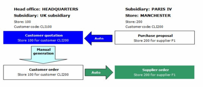

Subsidiary delivers order

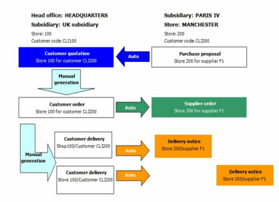

Customer delivery

One or more deliveries are generated for delivery to the store. Delivery notices are automatically created. They may not be changed by the store.

Interaction with purchase orders

Creating a customer delivery is done via backorder processing on the customer order. A supplier delivery notice will be created according to customer delivery, and backorders from purchase orders are updated according to delivery notices. Note that backorder management must be identical for customer orders and purchase orders.

Balancing purchase orders

Since purchaser orders manage backorders, they are closed via the following two actions:
- The process of reconciling shows that orders have been 100% delivered. No document will then be expected. Order is rendered non-viable.
- The order can be manually closed (remainders will not be delivered).

The customer order will follow the same scheme. It is closed and rendered non-viable.

## Franchisee, Concession and Affiliate Management

### Invoicing Sales and Transfers

#### Contents

Invoicing Sales and Transfers - Contents

In its organization, a chain of stores can be structured to take into account different store typologies such as branches, franchises, affiliated commission agents, multi-brand retailers, etc.
- For sales invoicing, affiliated commission agents do not own their stock. The turnover of these stores comes from a percentage on sales generated. Central site will therefore invoice Front Office sales.
- For transfer invoicing, all stores are served by the Headquarters using transfers or transfer proposals. It is therefore necessary to be able to issue invoices to the stores, which constitute different legal entities. The invoicing principle applied to transfers is as follows: Order (Retailer) ---> Headquarters ---> Stores (Branches, Franchises, Retailers, Affiliated agents.)

In both cases, invoicing can be performed based on predefined program (.i.e. Invoicing by program), or in interactive mode (whereby a multi-criteria selection screen allows you select the list of documents to be processed.)

A wizard is then launched allowing you to select the processing options.

General Settings
- Stores
- Company settings
- Access rights

Interactive invoicing
- Invoice sales interactively
- Invoice transfers interactively

Invoicing via program
- Invoicing Sales and Transfers Using a Program

Invoicing structure
- Sales invoicing structure
- Transfer invoicing structure

#### General Settings

Settings for Invoicing Sales and Transfers

Stores

Back Office > Basic data > Stores > Stores

Contact information tab

For the various stores concerned (Headquarters, Franchise, etc.) populate the Type field in the Contact information tab.

Third-party tab

The customer and supplier associated with the store must be specified for invoicing transfers.

For invoicing sales, only the associated customer must be specified.

In both cases, you need to have created the corresponding customers and suppliers beforehand.

Company settings

Back Office > Administration> Company > Company settings

Go to Commercial management > Documents - Processing and configure the options available in the Invoicing franchisees, concessions and affiliates section.

Commercial management > Documents - Processing

For invoicing transfers, all options must be specified, except the Invoicing store that is used only for invoicing sales.

Access rights

Back Office > Administration > Users and access > Access right management

Menu Sales (102): You can use the Invoice sales and Invoice transfers submenus in the Generation section to authorize or deny access to the user groups of your choice.

#### Invoicing Sales Interactively

Invoice Sales Interactively

Back Office > Sales > Generation > Invoice sales > Interactive

The information in the multiple criteria screen enables you to filter the data displayed.

Select the sales to invoice and click this button to display the Invoice sales wizard.

| Fields | Description |
| --- | --- |
| Invoicing store | The invoice will be generated with this store. By default, this is the store selected in the company settings. |
| Invoice valuation | The settings below will depend on the selection of one of the options described below. Note that all these options allow the application of a ratio. Original document price: The price of the receipt is retrieved in the generated invoice. Price list of customer linked to the store: The generated invoice is based on the customer’s price list for the store of the sale. Trade price list of customer associated with the store: The generated invoice is based on the customer’s trade price list for the store of the sale. Invoicing store price list: The generated invoice is based on the price list of the invoicing store selected above. Price lists are searched with the currency of the invoicing store. You select the type of price list from the drop-down purchase or sales price list. Only price list types in the currency of the selected invoicing store are proposed. Transfer price: The generated invoice is based on the transfer price of the selected sales line. |
| Invoicing ratio | Enter a ratio to apply to the price. Note that if a ratio or a discount on invoice total is applied, the taxation of the document will be recalculated |
| Price list validity date | You can select the date for applying the price list if the invoice depends on a price list. By default, the original document date can be selected. |
| Automatically approve generated invoices | This option enables you to approve generated invoices automatically. This option depends on user access rights. |
| Printing documents | Documents are printed automatically. |

Once these options are defined, click [Next] and then click [End] to run the process.

At the end of the processing, you can print the report displayed.

#### Invoicing Transfers Interactively

Invoicing Transfers Interactively

Back Office > Sales > Generation > Invoice transfers > Interactive

Step 1: Select transfers to invoice

The information in this multiple criteria list enables you to filter the data displayed.

Subsidiaries tab

This tab is available only if the Management of subsidiaries has been enabled in the company settings in Administration > Distribution. The Subsidiaries tab allows you to filter your selection based on the following elements:
- The list of subsidiaries of the sender store
- The list of subsidiaries of the recipient store
- The Selection of inter-subsidiary transfers option, which allows you to select all transfers for which the subsidiary corresponding to the sender store is different from the subsidiary of the recipient store.

The invoicing principle applied is as follows:
- Inter-subsidiary inventory movements result in the issuing of an invoice between 2 stores typed "Subsidiary headquarters." This typology must be specified in the subsidiary record.
- Inventory movements between a store that is linked to a subsidiary and a store that is not linked to a subsidiary result in the issuing of an invoice between the store typed "Subsidiary headquarters" concerned and the store not linked to a subsidiary.
- Intra-subsidiary inventory movements result in the issuing of an invoice if they are selected. If you do not want to issue intra-subsidiary invoices, it is advisable to tick the Selection of inter-subsidiary transfers checkbox option.

Standards tab

The options proposed in this tab depend on whether the Company setting Selection of whole transfers during invoicing , available in the Documents - Processing branch, is enabled.

Documents - Processing

If the company setting is checked, the following options are available:
- Transfers already invoiced: Allows you to include or not in the selection list the transfer documents that have already been invoiced.
- Exclude transfers with zero prices: same behavior as option Exclude transfers with lines at zero .

If the company setting is not checked, the following options are available:
- Lines already invoiced: Allows you to include or not in the selection list the transfer lines that have already been invoiced.
- Exclude transfers with lines at zero: Allows you to include or not transfers with at least one line with a null price. If this option is selected, and a transfer includes an item line with a null price, none of the lines will be invoiced.
- Exclude consigned documents: if this option is selected only firm documents are selected.

The criteria available in the ‘Grouping’ zone of this tab allows you to generate invoices that group together several transfers, as long as the following conditions are met:
- The option “For the period” is selected in the Standards tab.
- All the transfer documents selected share the same sender warehouse.
- All the transfer documents selected share the same recipient warehouse (in the case of invoices generated from Transfer Received (TRE) documents, or the same recipient store in the case of invoices generated from Transfer Sent (TEM) documents.
- All the transfer documents selected are in the same currency.

Step 2: Launch the interactive invoicing process

The wizard used for invoicing transfers allows you to generate invoices based on certain settings.

Once you have selected the transfers, launch the wizard by using this button. The wizard then opens, and you may select the following options.

| Fields | Description |
| --- | --- |
| Date of generated invoice | Specify the date of the invoice that will be generated by the process |
| Invoice valuation | Select the type of valuation you want to perform: Original document price: the generated invoice is valued based on the selected transfer price. Price list of the customer linked to the recipient store: the generated invoice is valued based on the price list of the recipient store customer for the selected transfer. Sender store price list: the generated invoice is valued based on the price list of the sender store for the selected transfer. Recipient store price list: the generated invoice is valued based on the price list of the recipient store for the selected transfer. Type of price list: selection of sales price list or purchase price list for the store. Transfer price: the generated invoice is valued based on the selected transfer price. |
| Invoice total discount | Is used to define an invoice total discount rate to apply to all the invoices generated. If this option is not selected, the discount that is defined in the records for the customers and suppliers associated with the stores will be applied. |
| Price list validity date | You can select the following: Date of the original document: the price list search starts from the date of the selected transfer. Date: the price list search starts from the date entered. |
| Store of centralization | If need be, the store of centralization will be specified. This field is not displayed, if the company setting Centralize invoicing on is set to None . |
| Automatically approve generated invoices | This option enables you to approve generated invoices automatically. This option depends on user access rights (for both the wizard and the transfer program.) |
| Printing documents | If selected, documents are printed automatically. |

Once these options are defined, click [Next] and then click [End] to run the process.

#### Invoicing Sales and Transfers Using a Program

Invoicing Sales and Transfers Using a Program

Back Office > Sales > Generation> Invoice transfers (or sales)> Per program

This feature is used to define invoicing programs for transfers (or sales), and then start processing.

Creating a program

Use this button to create a new program.

The Characteristics ”tab is where you select the documents to be invoiced, by the means of triggers having a scope of use set to Invoicing sales and transfers .

Do not forget, triggers must have been created first in Settings > General > Triggers.

For invoicing transfers, the following options allow you to refine the program:
- Exclude consigned documents: if this option is selected only firm documents are invoiced.
- Exclude documents having no price specified: this option allows you to specify that transfers containing at least one line with a null price should not be invoiced. If this option is selected, and a transfer includes an item line with a null price, none of the lines will be invoiced.

For invoicing sales, the Consigned items lines option allows you to invoice only consigned item lines.

The options provided for generating invoices, available on the Generation tab, are the same as those provided by the existing wizard as seen before (Interactive invoicing.)

Please notice that documents can only be printed in immediate mode (Immediate processing option). This option is not taken into account if the invoicing of transfers is carried out as a scheduled task.

Starting the invoicing process
- Immediately (manual action): Using the [Running the program] button available in the multiple criteria screen of programs.
- Off-line (scheduled task): Using the [Schedule this task] button, available in the Generation tab of the program record, the execution of the program can be subject to scheduling. This allows you to schedule different types of invoices, with each task carrying out a specific process. Examples:

#### Sales Invoicing Structure

Sales Invoicing Structure

The documents created by the wizard are described below.

| Store | Store type | Invoiced third-party |
| --- | --- | --- |
| 001 | Headquarters | C001 |
| 002 | Branch | C002 |
| 003 | Franchise | C003 |
| 004 | Branch | C004 |

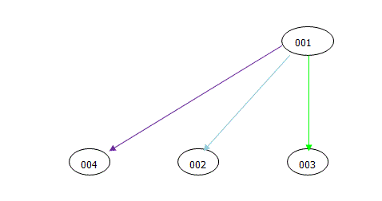

| Document type | Store | Generated document | Document warehouse | Invoiced customer |
| --- | --- | --- | --- | --- |
| FFO | 001 | FAF | 001 | C001 |
| FFO | 002 | FAF | 001 | C002 |
| FFO | 003 | FAF | 001 | C003 |
| FFO | 004 | FAF | 001 | C004 |

#### Transfer Invoicing Structure

Transfer Invoicing Structure

The invoicing procedure is determined by the value selected for the company setting Centralize invoicing on selected in Commercial management > Documents - processing (refer to the Company Settings .)

Company Settings

The possible choices are described below in the recap tables, the captions of which are:
- Store type: Headquarters (SIE), Subsidiary (FIL), Branch (SUC), Franchise (FRA), Retailer (DET), Affiliated commission agent (COM), Other (AUT).
- Document type Financial customer invoice (FAF), Financial supplier invoice (FFF), Customer credit note (AVC), Supplier financial credit note (AF).

Company setting set to None

Subsidiaries are handled in the same way as branches:

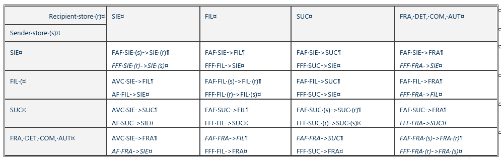

Company setting set to Headquarters

FRA, DET, COM, AUT-type stores are handled in the same way as branches.

SIE-type stores that do not correspond with the SIE type specified in the wizard are handled in the same way as branches.

New documents are shown in italics.

In the table, the SIE code in bold corresponds to the headquarter-type store selected in the wizard. The codes “SIE”(r) and “SIE(s)” correspond to the headquarter-type stores that sent (s) or received (r) the transfer and that differ from the centralized headquarters store.

SIE

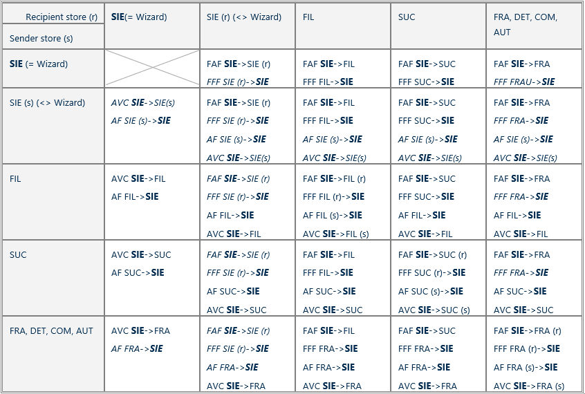

Company setting set to Subsidiary Headquarters

FRA, DET, COM, AUT-type stores are handled in the same way as branches.

SIE-type stores that do not correspond with the SIE type specified in the wizard are handled in the same way as branches.

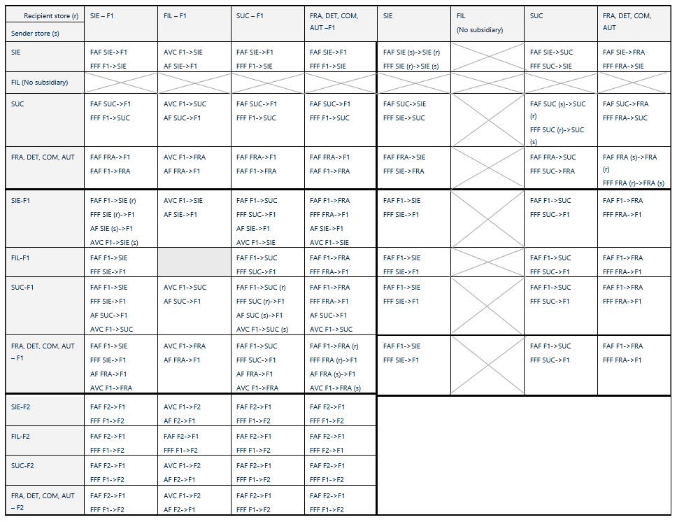