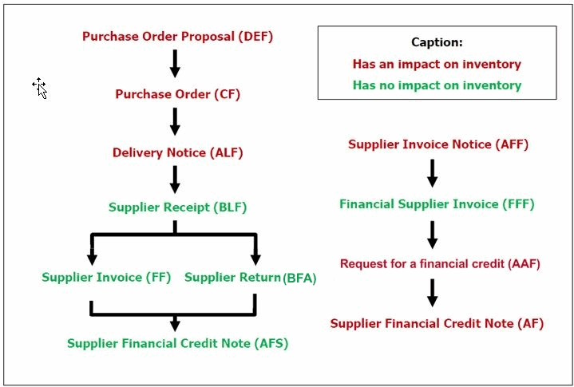

# Procurement and Sourcing Management

*Source: Cegid Retail Y2 – Version 26 | Extracted: 2026-02-27*

---

# Procurement and Sourcing Management

## Purchases

### Supplier Management

#### Contents

Supplier Record - Contents

The supplier record forms part of the basic data essential to a Commercial management folder. No purchases can be made without being associated with at least one supplier. Indeed, certain automated processes and default values can be determined by the way in which the record is populated: behavior of documents in entry mode, assignment of unique barcodes, item referencing, etc.

The objective, of course, is to clearly identify the suppliers behind the purchases, the period in question, and the corresponding amount. With this information, the commercial performance of items linked to each supplier can be analyzed, and the purchasing strategy for subsequent seasons can be determined.

Supplier record settings
- Company settings
- Search priorities
- Fields in supplier record
- Access rights

Supplier record
- Supplier record settings
- Toolbar

Actions linked to suppliers
- Editing lists and labels
- Supplier catalog
- Batch modification
- Batch deletion
- Deactivating a supplier record
- Reactivating a supplier record

#### Supplier Record Settings

Supplier Record Settings

Company settings

Back Office > Administration > Company > Company settings
- Go to Commercial management > Customers/suppliers , if you wish to increment supplier codes automatically, then tick the Automatic assignment of supplier code option.
- Open the Commercial management > Item branch:
- Tick the Distinct barcodes per supplier option to authorize the assignment of barcodes based on supplier-specific settings. Tick the One supplier per item option if you want an item be assigned to only one supplier.

Search priorities

Back Office > Settings > Suppliers > Search priorities

This command allows you to define the search priorities for suppliers. You may select up to 6 priorities which will then be processed in ascending order. Once created, the search priorities are then selected in the Company settings > Commercial management > Customers/Suppliers > section Search priorities (see Search Priorities .)

Search Priorities

Fields in supplier record

Back Office > Settings > Suppliers > Field settings

This feature allows you to define the user fields to be displayed in the supplier record (see Field Settings .)

Field Settings

Access rights

Back Office > Administration > Users and access > Access right management

The following access rights must be enabled for the user groups of your choice:
- Menu Concepts (26) - Commercial management - Suppliers: This menu allows you to authorize the display, creation and/or modification of supplier records for the user groups concerned.
- Menu Settings (105) - Suppliers: This menu allows you to authorize the relevant user groups to access the various settings tables used to populate the records, as well as the settings used for configuring the read-only or mandatory fields in the record.
- Menu Administration (106) - Event log: This menu allows you to authorize a customized follow-up of suppliers, as well as the purge of the relevant records.
- Menu Basic data (110) - Suppliers: This menu allows you to authorize the relevant user groups to access the actual supplier records, as well as various actions relating to the modification, deletion, or closure of these records. It is also used for managing access to processes and reports relating to suppliers.

#### Supplier Record

Supplier Record

Back Office > Basic data > Suppliers > Suppliers

The list of existing suppliers is displayed based on the specified sort criteria:

Tabs of the Supplier record

General tab

| Fields | Description |
| --- | --- |
| Address | This first section displays the various contact information for the supplier: The address can be entered on 4 lines of 70 characters. The city, country and region can be entered within a limit of 70 characters as well. These elements can be set in the Settings > General. |
| Identification | Specific processes (price lists, referencing, items, management rules, rights, etc.) are linked to the Type of supplier field. |
| Pricing | This section is used to select the price list category and the currency for the supplier. |
| Communications | Send document automatically: allows you to activate the systematic sending of documents entered for this supplier, provided the relevant module has been purchased. The Exception on document management screen, available when using the Complementary data button in the record, allows you to modify the default values of the settings used for sending documents; these settings are defined in the Layout tab, accessible in Settings > Documents > Documents >Types. One file per subsidiary: this option is available if documents are sent automatically (feature enabled.) When a purchase proposal with a pre-allotment by store is sent automatically, a file will be sent by subsidiary based on the stores specified in the pre-allotment. Automatic acknowledgment of document delivery: is used to specify that the supplier is able to send acknowledgments by import. In the case where this status is not ticked (default value), the documents from this supplier are assigned the “No control” status. If the supplier handles acknowledgments, then the document created for the supplier is assigned the “Not received” status. This status can be changed when, the acknowledgment is imported, or when purchase documents are mass updated. |
| Follow-up | Closed: This option should be activated if you no longer want a supplier to be included in processes or in the entry of documents. Note that in this case, the supplier is not deleted from the database. Fictitious supplier: This option is essential for the creation of records that are used when entering documents such as replenishment orders. Indeed, it is absolutely necessary that you assign a dummy third-party to these movements. |

Addition tab

| Fields | Description |
| --- | --- |
| Workshop | This section allows you to configure the supplier record to handle workshops for servicing (see Customer Services Management .) Supplier of Customer Services / Alterations: This option allows you to type the supplier as service provider. Internal workshop: Available only if the Internal workshop management option is enabled (see Internal Workshop Management .) Margin ratios: When the workshop values the quotation, margin ratios for services will be applied if the selling prices of the services are set to zero. The ratio applies to the purchase price. You must enter a ratio for services of type “Freight and expenses”, and another ratio for other services. Workshop delivery address: Selection of an address among those already defined via the [Complementary data] button - option Addresses, available in the supplier record. |
| Quotation management | Delivery address for quotations: Is used to take delivery of special orders at the Headquarters to check them, before they are sent to stores. Margin ratio: Ratio between the price announced by the supplier and the amount to invoice to the customer. Average delivery lead time (days): Is used to update the forecasted delivery date of the quotation at the valuation step. At this step, this is date is required and becomes the D day + delivery lead-time, if not specified before. Please note! This delivery lead-time does not apply if a date was specified upon the creation of the quote. Account for special invoices: Supplier invoices from special orders can be registered to this specific supplier account. Otherwise, the auxiliary supplier account will be used. |
| Margin | Margin ration rounding: Allows you to specify the rounding method used for calculating the margin ratio. |
| Litigations on data import | For further information about this topic, refer to the chapter about Litigation Management . |
| Item referencing | This setting is visible only if the company setting One supplier per item is not ticked (refer to Company Settings/Items .) It is used in purchase documents to check that the items selected are actually sold by the supplier in a multi-supplier per item folder. This option requires that the supplier’s item referencing is up-to-date (by input or import.) Controls are performed when an item is added to a document for the given supplier: The supplier must be the main supplier in the item record. Or the supplier must be listed in the item referencing for the supplier. If none of these conditions is met, the item cannot be integrated with the purchase document. |
| Consigned items | This serializable module allows the use of items that remain property of the supplier but are consigned to the retailer for sale. The retailer is only invoiced for the merchandise that is sold, with the unsold quantity returned to the supplier at the end of the season (see Consigned Items .) |

Payments tab

| Fields | Description |
| --- | --- |
| Discounts | This section allows you to specify the supplier’s discount percentages and/or business discount percentages. These are then proposed automatically when entering documents. |
| Taxes and discounts | This section impacts the use of currencies in purchase documents. |
| Payment method | This section contains the usual payment terms. Note that these terms can be defined directly in Settings > Management > Financing plans . |
| Type | The Type section is essential because it allows you to indicate which tax system applies to the supplier. This has a direct impact on the calculation of taxes, particularly VAT, when entering documents. |
| Shipping | This section allows you to indicate the usual merchandise transportation methods for this supplier. |
| Accounting | This section is essential for configuring the accounting interface. |
| Associated suppliers | This section allows you to specify the supplier that is to be paid and/or the supplier that issued the invoice, if different from the main supplier. A supplier can be assigned to a GPO (group purchasing organization) if the Management of GPOs setting is enabled |
| Identification and Export | The information provided in these sections is used to create the Trade of Goods Declaration (Incoterm fields, Shipping method and Availability site field.) For more information on this topic, please refer to: Topic Incoterms, Transportation Methods and Places of availability |
| Credit | This section is useful for specifying risk calculation methods. |
| Coefficients | This section allows you to indicate the tax-exclusive and/or tax inclusive coefficients specific to this supplier. These are retrieved automatically when creating item records associated with this supplier. |

Information tab

This tab allows you to really customize the record based on your specific needs. All of the information contained on this tab is user-defined and fully customizable:
- The titles of user-defined criteria can be configured in Settings > Suppliers > User-defined field titles.
- The content of user-defined tables can be populated in Settings > Suppliers > User-defined tables, or directly in the supplier record by clicking the [Subtable settings] button displayed next to every field concerned.

The lower part of the screen is used as a notepad, with simple word processing functions available by right-clicking in this section.

User fields tab

This tab displays only if the use of user fields is enabled in the company settings. This tab is used to populate the various user fields defined for suppliers.

Although a large number of user-defined fields are proposed by default in the Information tab of the item record, you may be required to manage a greater number of user fields. These user fields are used in addition to the existing user-defined tables. All user fields in the supplier record will be used systematically.

The management of user fields is dependent on a company setting located in Administration > Company > Company settings > Commercial management > Default settings (see User Fields .)

User Fields

Toolbar
- The [Zoom menu] button gives access to the Current documents, Ordered items, Category price list, Pricing, Website, and Document summary.
- The [Complementary data] button gives access to exceptions, address management, various referencing and identifiers. For further information about these topics, refer to the chapters about: Multi-Referencing , Subsidiary referencing (refer to Subsidiary Record and Counterpart Flows .)
- The [Contact] button allows you to enter the details for contacts on the supplier’s side.
- The [BAID] button allows you to enter the details of the supplier’s bank account.
- The [Memos] button allows you to link photos or memos to the supplier record.
- The [Barcode] button allows you to enter specific barcode settings. This button is visible only if the Distinct barcodes per supplier checkbox option is activated. Therefore, go to Administration > Company > Company settings > Commercial management > Items.

#### Actions Linked to Suppliers

Actions Linked to Suppliers

Editing lists and labels

Back Office > Basic data > Suppliers > Reports

This feature allows you to edit a list of selected supplier records based on various criteria, in addition to labels.

Supplier catalog

Back Office > Basic data > Suppliers > Catalog

This feature allows you to view the prices that are applied by the supplier and specified upon item creation.

Information on the supplier catalog is purely informative and is not taken into account in processes, except in the valuation of documents. The “Multiple of” function can be managed by multi-referencing.

Batch modification

Back Office > Basic data > Suppliers > Batch modification

This feature allows you to modify or populate a field for a selection of suppliers. Validation of the modification can be performed automatically for the set of selected records, or on a record-by-record basis for better control.

Batch deletion

Back Office > Basic data > Suppliers > Batch deletion

This feature allows you to delete permanently a supplier record or a selection of supplier records To do this, the records in question must be closed first. Naturally, a certain number of checks are also carried out before deletion is authorized. It is possible to view a list of these deleted supplier records, as well as those that were rejected during the deletion process along with the reason for rejection.

permanently

Deactivating a supplier record

Back Office > Basic data > Suppliers > Suppliers

This feature allows you to exclude a supplier or selection of suppliers from processes and/or document entries, without permanent deletion of the file .

without permanent deletion of the file

It is still possible to view information relating to closed records, or to reactivate a supplier after a commercial dispute has been resolved, for example.

Reactivating a supplier record

Back Office > Basic data > Suppliers > Reactivate suppliers

This feature allows you to make a deactivated record or a selection of records available again for processing and document entry.

### Pre-Allotment by Store

#### Contents

Pre-Allotment of Purchases by Store

Purchases made by Headquarters can arise from requirements at store level. Even if the order sent to the supplier represents the sum of these requirements, pre-allotment by store can exist and must be kept.

Example:

A total quantity of 500 items is ordered from the supplier. This includes: 5 items for Manchester, 8 for York, 12 for London, etc. 500 items are ordered for all stores combined. This pre-allotment can be sent to the supplier so that items can be delivered directly to each store.
- Required settings
- Entering a purchase order proposal
- Tracking a purchase order proposal
- Generating allotments by store

#### Required Settings for Pre-Allotment

Required Settings for Pre-Allotment

Company settings

Back Office > Administration > Company > Company settings > Commercial management

Click here to see the fields to be specified in the Pre-allotment by store pane.

here

Visa management for documents

Back Office > Settings > Documents > Documents > Types

This setup is used to approve a purchase order proposal by checking the amount planned for each store. If a store is below the required amount, the whole purchase proposal will require approval.

Select the Purchase order proposal (DEF) document type and select the General tab. Tick the Visa option to enable visa management for this document type.

If the Visa option is selected and the Visa by store if pre-allotment setting is:
- Not selected : The purchase order proposal will require approval if the overall amount of the document falls within the specified range.
- Selected : The purchase order proposal will require approval if the pre-allotment for one or more stores falls within the specified range.

This setting can also be configured in the customer or supplier record in the Exception on document management menu.

Access rights

Back Office > Administration > Users and access > Access right management
- Menu Purchases (101) : Select Generation/Pre-allotment by store to grant access to the Pre-allotment command in Purchases > Generation.
- Menu Follow up actions (113) - Purchases - Generation of purchases - Generation of pre-allotment : Follow-up enables you to trace various operations and manipulations related to the generation of pre-allotment performed by employees. These actions can be viewed in the Event Log .

#### Entering a Purchase Order Proposal

Entering a Purchase Order Proposal

Back Office > Purchases > Enter > Purchase order proposal

The pre-allotment of purchases is managed for purchase order proposals only (DEF). It enables you to enter a document specific to a facility that includes the requirements of all stores. Each purchase order proposal is then broken down into separate purchase orders or delivery notices, with one document per store.

With non-consigned items

A pre-allotment can be entered in each line of a document for single items or dimensioned items (not generic ones).

Once you have entered the item, click the [Additional actions] button and select the Pre-allotment by store option.

Please note! If it is a dimensioned item, position the cursor on the required size before clicking this button.

The pre-allotment window enables you to enter different quantities for each store.

You can also enter data for groups of stores using one of the criteria proposed in the Grouping field.

The Quantity field is used to specify the quantity you want.

The [Grouping details] button located between the two tables enables you to add grouping details so that you can define specific characteristics for each store in the group.

Once the line has been validated, allotments are saved by store so that a fixed pre-allotment amount can be defined for each store.

When you validate the pre-allotment window, the purchase order proposal will appear again.

Each line in the pre-allotment will be identified by a blue icon.

With consigned items

To enable data entry in a consigned purchase order proposal and generate the pre-allotment, the following rules are applied:
- If the first item in the document is a consigned item and the first warehouse selected in the pre-allotment window is a consigned warehouse , then the document will be a consigned document.
- In this case, the pre-allotment window will display consigned warehouses only.
- Non-consigned items cannot be entered in the purchase order proposal.
- Generated documents will also be consigned .

#### Tracking a Purchase Order Proposal

Tracking a Purchase Order Proposal

Modify a purchase order proposal

Back Office > Purchases > Modification > Purchase order proposal

You can modify a purchase order proposal as long as it has not been generated.

Duplicate a purchase order proposal

Back Office > Purchases > Duplication > Purchase order proposal

The duplication of a document with pre-allotment also duplicates the pre-allotment of the original document.

Purge a purchase order proposal

Back Office > Purchases> Processing > Purge purchase proposals

Obsolete purchase order proposals can be deleted using the Purge command.

View the dashboard

Back Office > Purchases > Analysis > Dashboard

The dashboard enables you to work on all of the lines entered in the purchase order proposal and displays the allotment stores.

#### Generating Allotments by Store

Generating Allotments by Store

During data entry of the purchase order proposal

Back Office > Purchases > Enter > Purchase order proposal

When you are in the process of validating the purchase proposal, a message will appear asking you to generate the allotment by store.
- If you accept, you should select the type of document to generate, e.g. purchase order, delivery notice or purchase order proposal. Once this is selected, documents will be generated for each store.
- If you refuse, you can generate the allotment at a later time. (See the next paragraph.)

After data entry of the purchase order proposal

Back Office > Purchases > Generation> Pre-allotment by store

This command enables you to generate the allotment by store at a later time. You can therefore make the required modifications or checks before the final allotment. You can modify the purchase order proposal in Purchases > Modification > Purchase order proposal.

Purchase proposal approval

Back Office > Purchases > Processing > Approval for documents

At this stage and depending on the settings defined, the purchase order proposal may require approval. If this is the case, the purchase order proposal must be approved before purchase orders or delivery notices can be generated. Purchase orders or delivery notices may also require approval. (See Enabling visa management .)

Enabling visa management

Using the "Replenishment and distribution" command

Back Office > Inventory > Store replenishment > Replenishment and distribution

Replenishment calculates the requirements for each store and generates a purchase order proposal with pre-allotment by store.
1. Open a replenishment record of type Purchase document .
2. Click the [Processing] button and select the Generate purchase documents option. The Generation of purchases window will appear.
3. In the Generation section, select the Y2 option and select Purchase order proposal .
4. Select the Pre-allotment option to generate a purchase order proposal with a pre-allotment by store. Validate.

See the Replenishment topic to find out more about the various options of the menu.

Replenishment

### Document Management (Purchases and Sales)

#### Contents

Cycle and Purchase and Sales Document Management (Trade and Retail) - Contents

The purchase and sales cycle is used to manage the different documents necessary for the smooth running of the company. Cegid Retail Y2 has a very large range of possibilities for the management of these documents.
- The purchase cycle mainly occurs in the Back Office Purchases module, but some functionalities are however available in Front Office.
- The sales cycle distinguishes between retail sales (sales made with retail customers and with tax included prices), and trade sales (sales made with corporate customers, generally with tax excluded prices.)

Only purchases and sales made in Back Office are described in this topic.

Introduction
- Overview of the purchase cycle
- Trade sales cycle

Miscellaneous settings
- Document type settings
- Additional setup for trade sales documents
- Access rights management

Manual entry of documents
- Header information
- User-defined tables for documents
- Body of the document
- Document footer information
- Payment entry
- Other entry functionalities

Query, modify and duplicate documents
- Query documents/receipts
- Modify documents/receipts
- Duplicate documents
- Preventing the modification or duplication of a document/receipt

Generation of purchase or trade sales documents
- Manual generation of documents
- Automatic generation of documents
- Pre-receipts and receipts of ALFs and CFs
- Grouping criteria
- Visa management
- Remainder management

Links with inventory
- Impacts on inventory

Trade payments
- Trade settlement settings
- Entering trade payments
- List of payments when generating invoices
- View customer outstanding business
- Reconcile/Cancel payment reconciliation

#### Overview of the Purchase Cycle

Overview of the Purchase Cycle

Different procurement methods

With software from the ORLI range

The purchase cycle can be supplied by the Orliweb software package:
- Orders from Orliweb customers are downloaded to Cegid Retail Y2 as purchase orders.
- Orliweb deliveries are downloaded to Cegid Retail Y2 as delivery notices or supplier receipts, depending on the user’s choice.

By using replenishment or pre-allotment

A purchase order can also be created from:
- Automatic replenishment available in Back Office > Inventory > Store replenishment > Replenishment and distribution.
- Replenishment orders entered directly by the stores and then generated at Headquarters as purchase orders.
- Purchase proposals entered at Headquarters, and then generated as purchase orders by the means of pre-allotment.
- Replenishment suggestions available in Back Office > Purchases > Generation > Replenishment for customer orders > Replenishment suggestions.

Directly in Back Office

A purchase order can also be simply entered directly in Back Office > Purchases > Enter > Purchase order. Here it is possible to enter:
- Orders centralized at Headquarters for all stores
- Orders by store

The procurement cycle

Various purchase documents
- Purchase order proposal (DEF) : This document is a sort of pre-purchase order. It is used to enter at the Headquarters only one document grouping all the needs of the stores for a given supplier, and then generate as many purchase orders as there are stores involved (refer to Pre-allotment of Purchases by Store .)
- Purchase order (CF) : This is a document created for a single store and a single supplier. It can be entered directly, or it can be issued from the generation of other documents.
- Delivery notice (ALF) : The delivery notice is a document used to notify stores of the delivery of ordered items. It is thus an intermediary document between the order and the receipt. The store must validate its delivery notices every day according to the merchandise received. The validated delivery notice is then transformed into a receipt.
- Receipt (BLF) : This document is used to make a record of a supplier delivery. It can either be entered directly, or generated from a purchase order or a delivery notice. This type of document has an impact on physical inventory. The validation of a delivery notice (ALF) in the Front Office has the effect of generating a receipt (BLF).
- Financial invoice notice (AFF) : This document is made up of all sales and all consigned item returns. The process of invoicing sales generates a document of type Financial invoice notice per supplier and per store, in order to enable an analytical allocation of the purchase to the right store. These invoice notices will be retrieved and sent to each supplier of consigned items, with the breakdown of items sold per store, then generated as a financial supplier invoice when the invoice is received (refer to Managing Consigned Items .)
- Supplier invoice (FF) : This document is a typical invoice that validates the merchandise order to a supplier, and has an impact on inventory.
- Financial supplier invoice (FFF) : This document does not physically correspond to a merchandise exchange, and has therefore no impact on inventory. It can be, for example, an additional invoice following a mistake in the original invoice.
- Supplier return (BFA) : This document follows a return of merchandise to the supplier after receipt and/or invoicing. This type of document has an impact on inventory.
- Supplier credit note on inventory : This document corresponds to a typical credit note prompting a supplier invoice. This type of document has an impact on inventory.
- Request for a financial credit (AAF) : This document precedes the financial credit in the purchase cycle, and has no impact on inventory. It is particularly used in litigation management.
- Supplier financial credit note (AF) : This document is the counterpart of the financial invoice. It may, for example, correspond to an invoicing correction only affecting the price and not the quantity of items.

#### Overview of the Trade Sales Cycle

Overview of the Trade Sales Cycle

Trade sales cycle

Overview of Trade sales documents
- Customer quotation (DE) : This type of document is a kind of customer pre-purchase order that performs an initial calculation of the order cost. It has no impact on the physical inventory.
- Pro-forma (PRO) : This type of document is equivalent to a quotation, but is used for administration purposes. It has no impact on the physical inventory.
- Customer order (CC) : This type of document, when used for a specific store and customer, can be entered directly or generated from another type of document that comes before it in the cycle. It has no impact on the physical inventory.
- Delivery preparation (PRE) : This is a kind of intermediate document between an order and a delivery. It is optional, and aims to make it easier to search the inventory for items that have been ordered. It may differ from the relevant customer order to the extent that not all of the ordered items may be available. It has no impact on the physical inventory.
- Customer delivery (BLC) : This type of document can be entered directly or generated from another document that comes before it in the cycle (Quotation/Customer order/Delivery preparation, etc.). It has an impact on the physical inventory.
- Customer invoice (FAC) : This document corresponds to a traditional invoice and has an impact on the physical inventory. It can be entered directly or generated from another document type that comes before it in the cycle – generally a delivery.
- Financial customer invoice (FAF) : This document does not result in a physical exchange of merchandise, and therefore has no impact on the physical inventory (example: an additional invoice following an error in the original).
- Customer credit on inventory (AVS) and financial credit note (AVC) : Customer credit on inventory corresponds to a traditional credit note. Its counterpart is a customer invoice, and it has an impact on the physical inventory. A financial credit note is the counterpart of a financial customer invoice. It has no impact on the physical inventory.

#### Various Settings

Settings Linked to Purchase and Sales Document Management

Document type settings

Back and Front Office > Settings > Documents > Documents > Types

This command lists all documents type used in Back Office and Front Office (especially purchase documents, trade or retail sales document.) You can customize settings for each document type. Click here for further information.

Click here

Required settings for trade sales documents

Back Office > Administration > Company > Company settings > Commercial management

Some of the company settings hereafter have a direct impact on the way in which trade sales documents are entered.
- In Documents - Processing: Check the settings of the Miscellaneous section .
- In Pricing: Check the Use TRADE price lists field.
- In Documents - Entry: The Delivery dates section allows you to set up a delivery date check to be carried out during entry and generation, according to the document type.
- In Customers - Suppliers: Check the Trade settlement management setting (in the Customer payment section.)

Access rights management

Back-Office > Administration > Users and access > Access right management

The following access rights may be activated for the user groups of your choice.

| Menu | Section | Access right description | Cycle |
| --- | --- | --- | --- |
| Menu Concepts (26) | Commercial management - Document entry | This menu manages user rights concerning the particular functions relative to the entry of documents in general, including purchase cycle documents. | Purchase and sales (trade and retail) cycle |
| Menu Settings (105) | Documents | This menu is used to authorize, in accordance with user groups, access to document settings, counter settings, input list settings, etc. | Purchase and sales (trade and retail) cycle |
| Management | This menu allows you to grant the relevant user groups access to the settings tables used when entering documents, for example, payment methods, currencies and exchange rates, tax systems, freight and expenses. | Purchase and sales (trade and retail) cycle |
| Menu Purchases (101) | All sections | This menu grants authorization for selected user groups to get access to all the operations and processes that can be performed on purchase documents according to their type: entry, search, modification, reports and analyses, generation, duplication, processing, price lists, etc. | Purchase cycle |
| Menu Sales (102) | Retail sales | These menus allow you to authorize users to enter, modify and query retail sales receipts in Back Office. They can also be used to manage user access rights for outstanding payments, orders and customer reservations, etc. | Retail sales cycle |
| Pricing | These menus allow you to authorize the relevant user groups to access retail sales price list management functions, i.e. tax included price lists. | Retail sales cycle |
| Analyses and Reports | These menus allow you to grant the relevant user groups access to analyses and reports. | Purchase and sales (trade and retail) cycle |
| Trade sales | These menus allow you to authorize the relevant user groups to input, modify, view, duplicate and reconcile the various types of trade sales documents. | Trade sales cycle |
| Generation | They also allow you to manually or automatically change one type of trade sales document into another type of document that comes later in the sales cycle. They can also be used to manage user access rights for document approval, customer order allocation, remainder cancellation. | Trade sales cycle |
| Trade price lists and Pricing | These menus allow you to grant the relevant user groups access to trade sales price list management functions, i.e. tax excluded price lists. | Trade sales cycle |

#### Manual Entry of Documents

Manual Entry of Purchase and Sales Documents

Back Office > Purchases or Sales (Retail or Trade) modules > Enter

The features linked to the entry of a document are available in the tool bar. The purchase document can be divided into the following parts: Header information, User-defines tables (optional), Body of the document, Footer information of the document, and Payment entry.

Please note that some documents can be entered directly. Others can only be generated from a previous document.

The document type used for the entry of retails is FFO (Sales receipt), and concerns both the receipts entered in Front Office and in Back Office. It includes sales receipts and customer merchandise return receipts.

Header information

A purchase or sales document has a certain amount of header information. Some information is mandatory, especially:
- The supplier (for purchase documents)
- The customer (for sales documents) even if the customer is not identified.
- The store and the warehouse (if multi-warehouse management in use)
- The document currency
- The document date
- The provisional delivery date

Once the items are entered, some information is non modifiable, and other data is optional, such as references (internal, external or follow-up) or the sales representative.

Note that many fields can be pre-set in the document types (go to Settings > Documents > Documents > Types). The field concerned are:
- Document currency: This field recovers the setup defined in the document types/ Preferences tab, field Origin of currency
- Delivery date: This fields is supplied by the setting defined in the document types/Preferences tab, field Origin of delivery date .
- Document sales rep: This field recovers the setup defined in the document types/Employee tab, field Sales representative type .
- References (internal, external or follow-up): These fields recover the settings defined in the document types, tab Miscellaneous .

Document user-defined tables (optional)

Note that the use of document user-defined tables is not mandatory. For more information on user field settings, please refer to topic User-defined tables - Documents .

User-defined tables - Documents

Document body

This part is used to enter items, or other lines such as comment lines. Several entry methods are offered:

Entry of the item reference

Enter directly into the Reference field the item reference, or double-click to select your item from the list (only the items linked to the supplier of the document are proposed.)

Enter barcode

Click this button to display the Enter barcode window.

Terminal downloading

It is possible to use a portable inventory terminal (PIT) to download data.
1. Click the [Enter the barcode] button to display the "Enter barcode" screen.
2. Then click this button to open the Transmission window.

Footer information of the document

In addition to the information displayed on the item lines, it is possible to enter in the footer:
- discount
- A business discount
- Freight and expenses

You can display in the footer data of the document useful information when entering the document such as the available inventory or the purchase unit for example. This is the Line Info:

This line information can be defined in Back Office > Settings > Documents > Types.
1. Open the document type of your choice (for example: Customer order (CC)), then select the Line Info tab.
2. In one of the available fields, select the criterion you want to see in the footer of the customer orders and validate.
3. You must reconnect for the settings to be taken into account.

Payment entry

For sales document (trade and retail,) once the body of the receipt entered and validated, an entry window opens automatically to allow you to add the payment method(s) used.

Other entry functionalities

Back Office > Purchases and Sales (Retail or Trade) modules - Enter

The functionalities linked to the entry of a document are available in the toolbar. Depending on the settings of the folder, other buttons or lines of buttons are available (litigation, packing, pre-allotment etc.)

| Button | Description |
| --- | --- |
|  | This button is used to view the third-party record or the document currency. |
|  | The [Additional actions] button is used to enter information to complement the header information, to detail discounts, to enter taxation exemptions, etc. |
|  | The [Installments] button is used to open the due dates and payment methods input window. |
|  | The [Line actions] button is used to insert and delete lines, to merge lines with identical characteristics and to display or hide generic item dimensions. |
|  | The [Insert subtotal] button is used to create a subtotal during entry. |
|  | This button is used to enter a deposit or a payment, if the Deposit management is enabled in the document type, in the Management tab. |
|  | The [Freight and expenses] button allows you to create or use freight and expenses for the document. |
|  | The [Search] button allows you to search for an element in the document |
|  | The [Detailed description of item] button opens a small free input window for the selected line, which can be used to enter comments on a line. |
|  | If this button is used the item search is performed via the item referencing rather than via a list of items. |
|  | The [Enter barcode] button opens the barcode entry window. |
|  | This button concerns only purchase documents. It is used to insert items in mass based on inventory criteria. |
|  | This button concerns only purchase documents It is used to create an item during document entry. |
|  | This button is used to manage the packing of items, if the appropriate option has been enabled first in the document types. |
|  | This button is used to create a third-party as long as the cursor is located in the document header (a supplier for purchase documents, a customer for sales documents.) |
|  | This button concerns only purchase documents. These buttons are used to allocate automatically the quantity of the previous document to the current document for a specific line or for all the lines of the document. |

#### User-Defined Tables - Documents

=> See also procedure 354 (Managing Document User-Defined Tables)

User-Defined Tables - Documents

If the information in the document header is insufficient to characterize it, you can add data by using user-defined document tables. Therefore, a preliminary setup is required.

Required settings

Step 1: Titles of user-defined tables

Back Office > Settings > Documents > User-defined tables - Documents > Definition

At first, it is necessary to give a title to the additional data (for example, Order type, Origin of the order, etc.)

Step 2: User-defined table elements

Back Office > Settings > Documents > User-defined tables - Documents > User-defined fields

Secondly, you must define the list of the possible values for the titles defined previously.

For example, consider the two previous examples for user-defined tables:
- For title "Order type" you can create the following: Collection, Replenishment, etc.
- For title "Origin of the order" you can create the following: Regular mail, E-mail, Fax, etc.

You can also use an existing subtable, thus avoiding the entry of different descriptions. Therefore, tick the Using a subtable checkbox option, and select the subtable to use. In this way, you can define a table called Collection and then use the Collections subtable without having to fill them in, as they are already defined in the subtable. You can do the same on all the subtables proposed: Zip codes, Accounting categories, Shipping method, Regions, Currencies, etc.

Step 3: Scope of use for user-defined tables

Back-Office > Settings > Documents > Documents > Types

In step three, you must determine the scope of use. Therefore, select in the right-hand part of the screen the document type for which you want to use these user-defined tables (Customer order - CC, Sales receipt - FFO, etc.)

Go then to the User-defined tables tab, and tick the Use of user-defined tables checkbox option, and specify the preferred values.

The Mandatory checkbox option makes the entry of this information mandatory, with or without a default value (refer to Document Types/Tab User-defined Tables .)

Document Types/Tab User-defined Tables

Display of document user-defined tables at checkout

Click here to find out how to display the document user-defined tables at checkout.

Click here

How to use user-defined tables

User-defined tables are then used in document entry for later use in statistics and analyses.

#### Query, Modify and Duplicate Documents

Query, Modify and Duplicate Purchase and Sales Documents (Trade and Retail)

Query documents or receipts

| Access from Back Office | Type of query |
| --- | --- |
| Purchases or Trade sales > Query > By document | By document Documents can be queried document by document. In this case, 1 line = 1 document. Double-clicking on a line allows you to view the document concerned (for re-printing for example.) |
| Purchases or Trade sales > Query > By document line | Query by document line Documents can be queried by document line. In this case, 1 line = 1 line in a document. Double-clicking on a line allows you to view the document concerned (for re-printing for example). |
| Purchases or Trade sales > Query > By document | Query canceled documents The Deleted document checkbox option available the Status tab, is used to view the canceled documents only. By default, this option is not ticked. |
| Sales > Retail sales > Query > Receipts | Query receipts Receipts can be queried receipt by receipt. In this case, 1 line = 1 receipt. Double-clicking on a line allows you to view the document concerned (for re-printing for example). |
| Sales > Retail sales > Query > Receipt lines | Query receipt lines Receipts can be queried by line by line. In this case, 1 line = 1 receipt line: Double-clicking on a line allows you to view the document concerned (for re-printing for example.) |
| Sales > Retail sales > Query > Receipts or Receipt lines | Query canceled receipts The Receipt canceled option, available the Additions tab, is used to view canceled receipts only. By default, this option is not ticked. |
| Purchases or Trade sales > Query > By archived document or By archived document line Sales > Retail sales > Query >Archived receipts or Archived receipt lines | Query by archived documents/receipts Once the documents or receipts archived, use this command to perform queries (by document/receipt or by lines.) About the archiving feature (Administration > Purge/Archive > Archive documents): Archiving consists in reducing the size of the document tables, thus optimizing the management of active documents. The process is subject to the purge date (this date must be inferior to the current date by at least 3 years) and to the existence of an inventory closure (prior to the archiving date in order to be able to recalculate inventory.) The event log contains a record of archiving operations. The discount dashboard (available in Sales > Analysis > Dashboard/Discounts,) takes into account the movements archived in Back Office. |

Modify documents or receipts

| Access from Back Office | Type of change |
| --- | --- |
| Purchases or Trade Sales > Modification | Modification of documents This feature is used to modify the contents of a document. Once validated after its entry, a document can be modified only via this command. When a document has been opened using the modification command, the usual entry functions are available from the tool bar. However, some header information can no longer be modified. |
| Purchases or Sales (Trade and Retail) > Batch modification | Batch modification of documents/receipts This feature is used to modify the following properties of the documents/receipts selected: Acknowledgment of receipt, recorded document, Exported document, emailing status, mailing associated with a document This batch modification can be performed by document or document line. |
| Sales > Retail sales > Modify receipts | Modification of a receipt This feature is used to modify the contents of a sales receipt. Once validated after its entry, a receipt can be modified only via this command. This tool bar button is used to modify only the user-defined document tables, as long as they are not accounted for. This function depends on the activation of the Override modification settings for user-defined tables concept, in Administration > Users and Access > Access Right Management. This concept is used to ignore the settings defined in the User-defined tables tab in the settings of the document types, thus making all user-defined tables modifiable. |
| Sales > Retail sales > Batch modification | Modification of a payment This feature is used to modify the payment of a receipt. Once validated after its entry, a payment can be modified only via this command. |
| Sales > Retail sales > Assignment to a customer | Modification of a customer This feature is used to modify the customer of a receipt. This window offers numerous selection criteria, especially the Store field in the Standard tab, to search for specific sales receipts. Once the list of the receipts displayed, double click on the line of your choice. In the list of customers that will display, select the customer you want to assign to the receipt. After validation, a process is launched to link the receipt to the customer, taking into account the customer's loyalty. This operation is logged to the event log, thus tracing the origin of the assignment. |

Duplicate purchase and trade sales documents

Note that this Duplication feature does not concern Retail sales in Back Office.

To duplicate a document, you must first specify the duplication types for each document type in Settings Documents > Documents/Types.

Go to the Management tab, and specify in the Duplication types field the duplication types for each document type.

Duplicating a document

Back Office > Purchases or Trade sales modules

This function is useful for entering a new document quickly when the lines are virtually identical and only one piece of header information needs to be changed, such as the customer or store.

The document duplication function does not create any link between the original document and the duplicated document.

Double-click on the document to duplicate. Once open, make the relevant modifications and validate.

Upon duplication, button [Zoom menu, option Linked documents] displays the list of linked documents, and the type of link, in a simplified multi-criteria selection screen.

Information is added to the duplicated document to show that it has been duplicated. This information is also added to the duplication multi-criteria selection screen, in order to facilitate the selection of non-duplicated documents.

Please notice that the usual entry functionalities are available to you through the toolbar.

Preventing the modification or duplication of a document/receipt

If this feature is enabled, a user who tries to modify a document/receipt declared non-modifiable or to duplicate a document declared non-duplicable, will see a message displaying that this operation is not allowed.

Just remind: this Duplication feature does not concern Retail sales in Back Office.

Step 1: Define the actions that make the document non-modifiable or non-duplicable.

Back-Office > Settings > Documents > Documents/Types

For the document type of your choice (FFO for receipts), go to the Management tab and specify in field Doc. is not modifiable after or in field N on-duplicable doc. after , the actions that make this document type non-modifiable or non duplicable (creation, visa, etc.)

Step 2: Enable user rights

Back-Office > Administration > Users and access > Access right management

Select menu Concepts (26) and go to Commercial management > Document entry.

The Modifying a non-modifiable document and Duplicating a non-duplicable document concepts must be set to red to forbid the modification or duplication of these documents.

#### Generating Documents

Generating Purchase and Sales Documents

This process consists in creating a new document quickly from another document that precedes it in the trade sales cycle. There are two types of generation (manual or automatic)

Manual generation of documents

Back-Office > Purchases or Sales > Generation > and then selection of the command

This feature allows the rapid entry of a document from a previous document. Each document can thus be generated from a previous document in the purchase cycle.

Examples:
- Creating a delivery from a customer order, or creating an invoice from a delivery or direct from a quotation.
- Creating a receipt from a purchase order, or creating an invoice from a receipt.

Standard input procedure

Choose the type of document you want to generate from the generation menu: Order, Delivery, etc.

Use the multi-criteria selection screen to search for the document you want to transform. Only those types of documents that precede the new document in the cycle will be shown.

Double-click on the document to transform. The entry screen for the document you want to generate will open, with the normal entry functions.

Use the following quantity allocation buttons located in the toolbar, and then validate the new document:
- Allocate the quantities automatically for the line,
- Allocate the quantities automatically for the document.

Note: The quickest method is to allocate the quantities for the entire document, and then just change the lines that have different quantities.

Blind entry of barcodes

In manual document generation, you can opt for entering barcodes in blind mode. If the option is enabled, you must enter the barcode using the barcode entry screen and you cannot view information from the previous document. However, if an item barcode is not usable (erased or torn label,) this button , available on the input line ( Barcode field) allows you to select the item from a multi-criteria screen.

To implement this functionality, enable the Blind entry of barcodes setting in the document type concerned. Once this setting is enabled, you can nevertheless force this setting for some user groups by activating, through the access right management, the Override blind entry of barcodes for manual generation concept in Back Office > Administration > Users and access > Access right management, > Concepts (26) > Commercial management > Document entry.

Blind entry of barcodes

Override blind entry of barcodes for manual generation

If there is a difference between the original document and the validated document, an information message is displayed to alert the user about this issue: “There are differences between the validated document and the original one. For further information, please refer to the event log.”

In order to keep track in the event log, of these discrepancies found for the entered items, go to module Administration > Users and access > Access rights management > Follow up actions (113) and enable the tracking of actions of your choice:
- Purchases > Generation of purchases > Discrepancy on blind validation of barcodes
- Sales > Generating sales > Discrepancy on blind validation of barcodes

Automatic generation of documents

Back-Office > Purchases or Sales > Generation > Automatic generation

This command enables the automatic generation of a document or several documents using one or several preceding documents, according to grouping criteria (see below.)
- In the case of different suppliers in original documents, several documents will be generated.
- In the case of identical suppliers in the original documents, just one document can be generated, under certain conditions (same tax system, same discount if there is one, same currency, etc.)

Pre-receipts and receipts of ALFs and CFs

Back-Office > Purchases > Generation > Pre-receive and receive notices

It is possible to pre-receive and receive delivery notices and purchase orders automatically in multi-selection. This makes it possible to accelerate the merchandise receipt functionalities in the case of delivery notices by indicating that the goods have arrived at the store, thus allowing them to be rapidly entered into inventory.

Procedure

Documents must be selected with the space bar, and then use one of the following buttons:
- This button launches the pre-receipt of the elements selected.
- This button launches the validation of notices and orders (and therefore receipt) of elements selected.
- This button displays the communication screen with an input terminal. Terminal downloading allows you to automatically take delivery of the notices and orders.
- These buttons allow you to perform pre-receipts and receipts of multiple packages. They display a screen that allow you to enter information quickly , especially if the references are barcodes. These two options are subject to the following access rights: Authorize multi-package pre-receipts when validating notices and Authorize multi-package receipts when validating notices , both available in Menu 26 - Concepts > Commercial management > Document entry.

Status

The status of a receipt may have 1 of these 4 values:
- On hold: the document has just been created
- Pre-received: the document has arrived at the warehouse
- Partial processing: The document content has been scanned but items are missing
- Notice processed: all the items have arrived or the document has been cleared

To view the status in the multiple criteria screen, configure appropriately the display of the "Receiving Status" column.

For convenience, this screen will also allow you to pre-receive and receive transfer notices (TRV).

The Pre-receive and receive notices feature is also available in Back Office menu Inventory > Generation, and in Front Office menu Management > Receipts and returns.

Grouping criteria

Back Office > Settings > Documents > Documents > Types

The grouping criteria can be configured via the [Additions - Grouping option] button, according to document type.

Third party criteria are generally used for quotations, taxes, invoicing system (tax exclusive or inclusive), business discount percentage, etc. You cannot group orders from more than one customer into a single delivery.

Visa Management

(See Approval Management )

Approval Management

Approval management allows any document type to be subject to validation by an authorized user if the amount in question falls outside of a predefined range. (For example, a customer order must be approved if the cost exceeds 500 euros.)

Remainder management

When entering a document, you may find that there are quantities leftover from the quantity entered in the preceding document. These are called remainders. For example, order # 1 contains the following items:
- UNI: 3 items
- DIM: 20 items, as follows:

| Colors/Sizes | 36 | 38 | 40 | 42 | Total |
| --- | --- | --- | --- | --- | --- |
| Black | 1 | 2 | 3 | 4 | 10 |
| Pink | 4 | 3 | 2 | 1 | 10 |
| Total | 5 | 5 | 5 | 5 | 20 |

Receipt # 1 is generated from order # 1:
- UNI: 1 item
- DIM: 20 items, as follows:

| Colors/Sizes | 36 | 38 | 40 | 42 | 44 | Total |
| --- | --- | --- | --- | --- | --- | --- |
| Black | 2 | 2 | 2 | 2 | 2 | 10 |
| Pink | 2 | 2 | 2 | 2 | 2 | 10 |
| Total | 4 | 4 | 4 | 4 | 4 | 20 |

The remainders of the UNI item are therefore 2 items.

The remainders of the DIM items are as follows:

| Colors/Sizes | 36 | 38 | 40 | 42 | 44 | Total |
| --- | --- | --- | --- | --- | --- | --- |
| Black | - | 0 | 1 | 2 | - | 3 |
| Pink | 2 | 1 | 0 | - | - | 3 |
| Total | 2 | 1 | 1 | 2 | - | 6 |

These remainders can be consulted:
- in the document query (field GP_TOTALQTERESTE)
- in the documents line query (field GL_QTERESTE)
- in the purchases dashboard
- in the inventory cube

Note: The DIM quantities for size 44 are referred to as surplus quantities.

#### Impacts on Inventory

Impacts on Inventory

Purchase and sales documents have an obvious impact on inventory.

Purchase documents

The following counters allow you to change the DISPO table:
- GQ_PHYSIQUE (physical inventory)
- GQ_PROPOACHAT (purchase proposal counter)
- GQ_RESERVEFOU (purchase order counter)
- GQ_ANNONCELIV (delivery notice counter)
- GQ_LIVREFOU (receipts of goods counter)
- GQ_FACTUREFOU (supplier invoices on inventory counter)
- GQ_AVOIRFOURNSTOCK (supplier credit note on inventory counter)
- GQ_RETOURFOURN (supplier return counter)

Purchase proposals, purchase orders and delivery notices never have an impact on physical stock (GQ_PHYSIQUE). The other documents have an impact on stock as indicated above.

Please notice that in some cases, the generation cancels the impact of the previous document.

Example:

| Action: | Impacted counters | Impacted quantity |
| --- | --- | --- |
| Creation of a purchase order (CF) | GQ_RESERVEFOU +1 | +1 |
| Generation of a delivery (BLF) | GQ_PHYSIQUE GQ_LIVREFOU GQ_RESERVEFOU | +1 +1 -1 |

GQ_RESERVEFOU is impacted again by the generation of the previous document.

Sales documents

The following counters allow you to change the DISPO table:
- GQ_PHYSIQUE (physical inventory)
- GQ_RESERVECLI (customer order counter)
- GQ_PREPACLI (delivery preparation counter)
- GQ_LIVRECLI (customer delivery counter)
- GQ_DISPOCLI (available reservations and orders counter)
- GQ_FACTURECLI (customer invoices on inventory counter)
- GQ_AVOIRSTOCK (customer credit notes on inventory counter)

Deliveries, invoices and credit notes have an impact on the physical inventory (GQ_PHYSIQUE field). The other documents have an impact on stock as indicated above.

Please notice that in some cases, the generation cancels the impact of the previous document.

Example:

| Action | Impacted counters | Impacted quantity |
| --- | --- | --- |
| Creating a customer order (CC) | GQ_RESERVECLI | +1 |
| Generating a delivery (BLC) | GQ_PHYSIQUE GQ_LIVRECLI GQ_RESERVECLI | +1 +1 -1 |

GQ_RESERVEFOU -1 is impacted again by the generation of the preceding document.

#### Trade Payments

Trade Payments

One of the key elements of trade sales document management is the entry and tracking of customer payments. By default, when accounting and commercial management have common databases, this tracking is managed by the additional accounting module called Payment follow-up . If the databases are different, a number of settings must be configured in the commercial management folder in order to ensure that customer payments are tracked (whether they have been collected or not), and that a customer’s balance can be viewed at any time.

Trade settlement settings

Enable payment follow-up

Back-Office > Administration > Company > Company settings

Go to Commercial management > Customers-Suppliers, then check the Trade settlement management option (available in the Customer payments section.)

Configure how the installment window opens

Back-Office > Settings > Documents > Documents > Types

Go to the Management tab and specify in field Opening installment window how the window will open (automatically, on demand, no installments.)

Configure payment method used

Back-Office > Settings > Management > Financing plans

This option enables the user to define the payment methods that will be used when entering trade payments.

Entering trade payments

Back Office > Sales > Trade sales

This topic explains trade payment entry within or outside a document.

Enter payments in a document

Back-Office > Sales > Trade sales, then select the document to enter (quotation, order, delivery, etc.)

Depending on the relevant settings, the installment window will open automatically or via the [Installments] button.

For all documents except invoices, you must first indicate whether a payment is a deposit or a down payment. This information is not required for an invoice.

You must then specify the customer payment method(s), the respective amounts and whether the payments were made at the time, or the scheduled payment date, otherwise.

The default settlement method specified in the Payment tab of the relevant customer record will be displayed first.

This button allows you to access the financing plan settings in the Installment distribution window.

Note that the Amount collected information is only available when the Trade settlement management company setting has been activated.

This button allows you to assign due dates to the payment methods displayed.

Enter payments without using a document

Back Office > Sales > Trade sales > Enter payment

This allows you to enter a payment without entering a business document.

The payments and due dates entry window is then displayed so that you can complete the initial entry made during document entry. In this entry mode, payments are considered to be collected by default.

Warning:

When a payment is entered directly in this way it is linked to a fictitious document type, with the code FIC.

List of payments when generating invoices

Back Office > Sales > Generation > Invoice

When the Trade settlement management option has been enabled in the company settings, a List of customer payments will be automatically displayed when validating the generation of customer invoices.

You can then select all or some of the payments that were recorded as collected when the documents preceding the invoice were entered.

View customer outstanding business

(cf. Viewing the customer’s business outstanding amount .)

Viewing the customer’s business outstanding amount

Reconciling/Canceling payment reconciliation

Back Office > Sales > Trade sales > Reconcile/cancel

Cegid Retail Y2 allows you to match invoices to customer payments.

After having selected a line from the list, click on this button to view the document information at the bottom of the screen without having to open it.

The left part displays information about the items of the document and the right part displays payment data.

The [Zoom] button allows you to switch between the customer record view and the document view.

Lines can be selected using the space bar or the [Select all] button.

A number of checks are performed when carrying out or canceling a reconciliation. Generally, these checks are linked to payments; and based on their context the following messages may be displayed:
- The sum of payments cannot be superior to the sum of invoices.
- Payment of invoice no. XX is linked to several invoices. Do you want to cancel the reconciliation of these other invoices or only this one?

### Retail Purchase Price Lists

#### Contents

Retail Purchase Price Lists - Contents

A price list consists of a price list type and an application period. To create a price list, it is therefore necessary to define first the price list type and the application period. When using price lists, the price of an item can be related to the following:
- The document date (price list application period)
- The store (price list defined for the store)
- The supplier or supplier category (if a supplier price list was defined)

The Sales Pricing and Promotions module must be serialized before you can use this functionality.

Retail purchase price list settings
- Serialization
- Company settings
- User access
- Rounding methods
- Price list types
- Application periods
- Store price lists

Creating price lists
- Entering a price list during item creation
- Creating a price list by item
- Creating a price list by item category
- Updating price lists

Managing price lists
- Query, edit and analyze price lists
- Close, delete and purge price lists

#### Retail Purchase Price List Settings

Retail Purchase Price List Settings

Serialization

Back Office > Administration > Company > Serialization > Activation of modules

The Sales Pricing and Promotions module must be serialized and validated before you can use this functionality.

Company settings

Back Office > Administration > Company > Company settings

Select Commercial management > Pricing and populate the fields as described .

described

User access

Restricting user access to price lists

Back Office > Administration > Users and access > Users

For each user, you can restrict the visibility of price lists. You can select the various price list types that users are authorized to view in the Restrictions tab in the user record.

If no value is selected, the user will have access to all price list types.

Managing access rights

Back Office > Administration > Users and access > Access right management

Select menu Purchases (101) and enable access rights for the user groups you want.

Rounding methods

Back Office > Settings > Management > Rounding methods

This command is used to configure rounding methods for managing price lists (see Setup of Rounding Methods ).

Setup of Rounding Methods

Price list types

Back Office > Purchases > Item price lists > Price list types

This command is used to create different types of price lists.

| Field | Description |
| --- | --- |
| Price list type | This must be expressed in a single currency to be specified when creating the price list. |
| Pricing system | Used to define if the purchase price list is tax inclusive or tax exclusive. |
| Coefficient | This is the coefficient applicable when creating the price list and is based on the price entered in the item record. |
| Exceptions by store | This non-accessible field is used to manage price list exceptions by store. |
| Update of price list by store in purchasing | If the purchase price list is entered in purchase documents, this field will update: The store price list for the purchase document if the option is selected. The price list for all stores if the option is not selected. |
| Consider prices of item record | If the value in the Proposed price field, in the Valuation tab of the document types) is Last purchase price , and if the Consider prices of item record option is: Checked: The purchase price will be retrieved, or failing that, the GQ_DPA or the GA_DPA. If none of these three prices exist, no price will be retrieved. Not checked: The purchase price alone will be retrieved. If this price does not exist, no price will be retrieved. |

Application periods

Back Office > Purchases > Item price lists > Application period

To manage price lists, you must define application periods. An application period can be associated with a price list type. This link is mandatory if the Price list period always linked to a price list code company setting is selected. (See Company Settings/Pricing .)

Company Settings/Pricing

Remark about dates
- The start date is the date on which the price list will be applied.
- The application period for the price list expires on this date.

Store price lists

Back-Office > Basic data > Stores > Stores

The Contact information tab in the store record is used to associate a purchase price list with a store. You should select a previously created type of price list (see Price list types above.)

Note that you can also associate a purchase price list with the store in this record. (See Retail price lists .)

Retail price lists

#### Price List Creation

Retail Purchase Price List Creation

There are several ways to create a price list:
- Enter a price list when creating an item
- Create a price list for each item
- Create a price list for each item category
- Update a price list

Specifying a price list when creating an item

If the Price list proposal in item creation company setting is selected (see Company Settings), you can enter price lists directly when creating an item.

Once you validate the item created, the Base price list of item XX window will be displayed. Price lists are created according to the base period defined in the company settings. By default, the price specified is the retail purchase price entered in the item record multiplied by the coefficient defined for the price list type.

If the price list is generated by dimension, then after validation, you can modify the price list for each dimension by clicking this button.

After validation, you can also access this window in the item record by clicking the [Additional information/Base price list] button.

Creating a price list by item

Back Office > Purchases > Item price lists > Item price lists

Click this button to create an item price list and specify the following:

- The price list type
- The application period for the price list
- The store where the price list will be applied, or "All stores" if the price list is applicable to all stores
- The code of the item for which the price list is being created
- The item price list for all settings
- The following information is displayed again as a reminder:

Creating a price list for each item category

Back Office > Purchases > Item price lists > Item category price lists

This functionality is used to create a price list for each item category. The principle is the same as for item price lists, but instead of selecting an item to apply the price list to, an item category must be selected.

Note that item categories are configured in Settings > Items > Price list category

Each item can be associated with a category in the Pricing tab of the item record.

Updating price lists

Back Office > Purchases > Item price lists > Update item price lists

This functionality is used to update one price list using another.

Select the items whose price list must be updated. Click the [Update] button to display the wizard.

The screen of this wizard is divided into two. The left pane is used to specify the settings of the original price list. The right pane is used to specify the settings of the price list to be updated.
1. Specify the settings of the original price list:
1. Specify the settings of the updated price list:
1. Once you have specified these settings, a summary of your settings will appear at the bottom of the screen.
2. Click the [Next] button to select the stores you want to update.
3. If All stores was selected in the previous step, the price list will be applicable to all stores whose purchase price list corresponds to the updated price list type. However, if a price list specific to the store exists for this price list, this price list will be applied rather than the All stores price list
4. Click the [Next] button to display the next window.
5. Click the [End] button to update the price list.

#### Price List Management

Retail Purchase Price List Management

Query, edit and analyze price lists

Querying items without a price list

Back office > Purchases > Item price lists > Query items without price list

This functionality is used to display the list of items without a price list.

You can print this list.

Editing item price lists

Back Office > Purchases > Item price lists > Edit item price lists

This functionality is used to edit the list of items with a price list. You can print using multiple criteria in the "Criteria" and "Addition" tabs, e.g. with or without inventory, suppliers, etc.

Advanced dashboard

Back Office > Inventory > Query > Advanced dashboard

You can display purchase price lists and sales price lists in the dashboard. The Pricing tab is used to select the type of price list you want to view. The selected price list will depend on user restrictions applicable to price lists.

If you generate an advanced dashboard grouped by item (i.e. item dimension options not selected), the price list for the generic item will be retrieved. In terms of dimensions, any deviating price lists will be ignored.

Attention!

The processing time required will depend on the number of items returned in the dashboard.

Close, delete and purge price lists

Closing price lists

Back Office > Purchases > Item price lists > Close price lists

Before you can delete a price list, you must close it. This functionality is used to close and disable price lists before deleting them.

Deleting price lists

Back Office > Purchases > Item price lists > Delete price lists

This command deletes price lists that have been closed.

Purging price lists

Back Office > Administration > Purge/Archive > Purge item price lists

This functionality is used to purge price lists in Cegid Retail Y2. It processes purchase price lists and sales price lists.

A wizard enables you to enter the item codes and application periods you want to delete. You can perform a multi-selection using these two criteria.

Click the [New] button to display the wizard.

Step 1

To enable you to run an accurate purge, different criteria are displayed in the first screen of the wizard, namely criteria associated with items that are:
- Closed: You can run a purge on closed price lists only, on non-closed price lists only, or on both closed and non-closed price lists.
- Modified: Price lists that have not been modified since the date specified.
- In stock: The Retention of price lists for items still in stock option is selected and non-modifiable. This means that only price lists associated with items that are no longer in stock will be processed.
- Selected: The Item selection field is used to restrict the purge to the items you want. By default, all items are processed. However, you can define a specific list of items whose price lists must be purged.

Item restriction is processed as follows:
- If a generic item is selected, the price lists for the generic item and its dimensions will be deleted.
- If a dimensioned item is selected, the price lists for the selected dimension alone will be deleted. Price lists for other dimensions and generic items will be kept.
- If a single item is selected, all price lists for the item will be deleted.

Step 2

This step summarizes the previously selected criteria.

Step 3

When you validate the processing, the item price lists corresponding to the criteria as well as all related data (price list types, periods and price list definitions) will be physically deleted from the database.

This deletion can be run immediately or scheduled to run at a later time.

Related data will only be deleted if it is no longer associated with any price list.

Once a price list code is deleted, it will also be deleted in user restrictions on price lists.

The purge of item price lists is logged in the event log. You can also view purges in the multi-criteria screen in the purge wizard.

User restrictions on price lists are automatically applied. Users can only purge the price lists that they are authorized to access.

### Exchanges with Suppliers

#### Contents

Exchanges with Suppliers

This topic lists the various means offered by Cegid Retail Y2 to ease exchanges with suppliers: mails, export of documents, visa, etc.
- Required settings
- Commands impacted by these settings
- Batch modification of purchase documents

#### Settings for Exchanges with Suppliers

Settings for Exchanges with Suppliers

Configuring the emailing method

Back Office > Administration > Company > Company settings

The settings required for sending e-mails must be specified in Commercial management > Emailing .

Commercial management > Emailing

Configuring the emailing method according to the document type

Back Office > Settings > Documents > Documents > Types

Select a document type of your choice and go to the Layout tab. The Sending documents section allows you to define how documents are sent according to the document type chosen. The sending method includes issues such as the export type, file format, etc.

Note that the ASCII export formats available here are the same as those available in the module used for exporting purchase documents.

Configuring the supplier record

Back Office > Basic data > Suppliers > Suppliers

You may define two options in the supplier record:
- Configure automatic emailing of documents per supplier: The Send document automatically option in the General tab of the supplier record allows you to specify that documents for this supplier are sent automatically. However, a document that is awaiting approval cannot be sent automatically. The sending process is not triggered until the document in question has been approved.
- Configure for each supplier how documents are sent according to their type: Click the [Complementary data] button in the supplier record to open the Exception on document management screen. The Layout tab allows you to configure for each supplier, how documents will be sent according to their type (purchase order, purchase proposal, etc.) as selected in the General tab on the same screen.

Managing access rights

Back Office > Administration > Users and access > Access right management

Menu Purchases (101)
- Section Processing > Approval for documents authorizes the relevant user group to manage document approvals.
- Section Modification > Batch modification authorizes the relevant user group to make batch changes to purchase documents.

#### Commands Impacted by these Settings

Commands Impacted by these Settings

The commands listed below take into account the settings for sending mails or documents to suppliers as they are executed. Based on the settings defined in the document type, an e-mail will be sent or a file (PDF or export) will be created automatically when the document is generated or validated.
- Sales > Generation: Invoice sales and Invoice transfers
- Sales > Retail sales > Available for customer > Generate available orders
- Purchases > Generation > Replenishment for customer orders/Replenishment suggestion
- Inventory > Store replenishment > Replenishment and distribution

#### Batch Modification of Purchase Documents

Batch Modification of Purchase Documents

Purchases > Modification > Batch modification

This feature allows you to modify very quickly several documents for which a correction or an update must be done. Information relating to exchanges that may be changed is listed hereafter:
- Mailing associated with document: A mailing can thus be allocated retroactively, or be de-allocated.
- E-mail sending status: No sending/Pending/Sent/Changed to send again
- Exported document: Export pending/Exported/Changed to re-export
- Acknowledgment of receipt: No control/Received/Not received
- Document exported: Export pending/Export in progress/Exported/Changed to re-export.

You can then:

Update documents one by one, or

Schedule this task

## Cost Prices

### Contents

Cost Price Management - Contents

Cost price management enables you to work on purchase prices for each item having additional costs added, such as: inventory costs, transportation, quality control, year-end discounts, advertising, etc.

General settings
- Module serialization
- Company settings
- Document settings
- Store settings
- Item settings
- Access rights

Cost management
- Determining cost
- Determining cost groups
- Generating costs based on the HSM customs code
- Special instructions for Korea

Cost price calculation
- Updating inventory prices
- Updating item record prices
- Querying cost prices

Updating cost prices
- Use of coefficient
- Use of cost groups
- By import

### Cost Price Settings

Cost Price Settings

Module serialization

Back Office > Administration > Company > Serialization > Activation of modules

If the Cost Price Calculation module is not activated, cost price management will be limited to the use of the item record ex-tax cost price. In addition, the following functions will be grayed out or hidden:
- The Cost price calculation from cost groups company setting is inactive.
- The Cost price management company setting will be limited to the use of the item record ex-tax cost price (no manual or automatic cost price.)
- Information relating to cost prices will be hidden in the Pricing tab of the item record.
- The Cost price profile option will be hidden in the store record.
- Information relating to cost prices will be hidden in the subsidiary record.
- Menus relating to cost groups will be hidden.

Company settings

Back Office > Administration > Company > Company settings

Go to Commercial management > Inventory and populate the Cost price section.

Cost price

Document settings

Back Office > Settings > Documents > Documents > Types

Open the Valuation tab and populate the Folder cost price field.

Folder cost price

If you manage costs, also fill in the Cost groups field in the Valuation section of the stock records .

Store settings

Each store may generate management of various costs. A related setting enables you to associate profiles to each store.

Creating profiles

Back Office > Settings > Stores > Cost price profiles

This command enables you to create cost price profiles that will then be assigned to stores.

Assigning profiles

Back Office > Basic data > Stores > Stores

Assigning a profile to a store is done in the Additions tab in each store record.

Item settings

Likewise, a setting enables you to associate a profile to each item.

Creating profiles

Back Office > Settings > Items > Cost price profiles

This option enables you to create cost price profiles that will then be assigned to items.

Assigning profiles

Back Office > Basic data > Items > Items

Assigning a profile to an item is done in the Pricing tab in each item record.

Access rights

Back Office > Administration > Users and access > Access right management

Menu Concepts (26)

Commercial management - Items

Depending on the rights granted, these concepts allow you to limit the purchase price and cost price displays in the Pricing tab located in the Item record:
- Display cost prices: Enables you to view cost prices, but not purchase prices.
- Display purchase prices: Enables you to view purchase prices, but not cost prices.

Throughout the various multiple search criteria screens, the data relative to purchase prices and cost prices will not necessarily be visible, depending on concept settings.

By activating the following concepts, the latest purchase and cost prices may be changed in the item record:
- Modification of LPPs
- Modification of LCPs

Commercial management - Inventory

By activating these concepts, the latest item and inventory purchase and cost prices may be changed:
- Modification of LPPs
- Modification of LCPs

Menu Settings (105)
- Stores - Cost price profiles: This menu enables you to authorize cost price profile management in store settings.
- Items - Cost price profiles: This menu enables you to authorize cost price profile management for item settings.
- Management - Cost price: This menu enables you to authorize access to the following menus in Settings > Management > Cost price: Cost Cost groups

### Cost Management

Cost Management

Back-Office > Settings > Management > Cost price

Please note! Cost management is available only if the Cost Price Calculation module has been serialized.

Determining cost

Back-Office > Settings > Management > Cost price > Cost

This command enables you to determine costs and receipts. There are 2 types of cost:
- Percentage of the base price (purchase price - line discount, business discount and invoice total discount deducted): the percentage is applied to purchase prices in order to calculate cost prices.
- Fixed amount per quantity: Added to purchase prices to calculate cost prices.

It is possible to enter negative cost prices, e.g. end of year discounts/rebates.

Determining cost groups

Back Office > Settings > Management > Cost price > Cost group

Cost groups must be set for store and item profiles. Several costs may be assigned to each of the cost groups.

Cost groups are also determined by combining store profiles and item group criteria.

| Fields | Description |
| --- | --- |
| Grouping | The following information may affect cost groups: Item record user-defined tables (15) Item record categories (8) User-defined item statistics (2) Collection Main supplier Item price list category Customs bill of materials Cost price profile User fields (grouping used for HSM customs code as explained in the section below.) |
| User fields | This area is only displayed if the previously chosen grouping is of type User Fields. Just remind: This grouping is used for HSM customs code as explained in the section below.) |
| Item | Selection of items for which the grouping is defined in the item record. |
| Priority | Enables you to specify the rule used when an item meets several grouping criteria (priority 1 is the highest). |

Generating costs based on the HSM customs code

The HSM code is an international customs code that some countries wish to use as criterion to filter the items to take into account in the cost price calculation with the application of cost groups. Consequently, Cegid Retail Y2 offers the possibility of using user fields as grouping criteria to filter these items.

Please note!

In addition to the settings below, required to use the HSN code as criterion, the settings seen previously (see Cost Price Settings ), such as company settings, store settings, document types, etc. remain essential to handle this step.

Cost Price Settings

Step 1: Define user field settings

Back Office > Settings > Items > User fields

Click the [New] button and fill in the description (e.g., Brazilian HSN code) then choose Selection list in field Type of entry .

Click the [Selection list] button next to that field in order to create the elements of the subtable (e.g. South Brazil/North Brazil.)

Please refer to the topic relating to User Fields to learn more about the various possible settings.

User Fields

Step 2: Define items settings

Back Office > Basic data > Items > Items

In order to defined the items concerned, in the User fields tab of the item record, select the elements just created in step 1.

Step 3: Create a cost group of type HSN

Back-Office > Settings > Management > Cost price

Create a cost group with a grouping criterion of type User field, then select the user field and the items of your choice.

Step 4 : How it works upon document entry

Upon document entry, after the entry of the store and the items, the cost groups are applied according to the settings defined in the document type (no calculation, application on demand, automatic application.) Of course, the document type, the store and the items used in the document entry must have been set up according (see previous steps)

To check that the cost groups have been effectively applied, you can query the inventory cubes.

Special instructions for Korea

Determining cost

In Korea, a Special Consumption Tax is levied on certain items. Depending on the case, this tax may be refunded (and affects only tax inclusive selling prices) and integrated into item cost prices. When determining costs, there are options which enable you to take new calculation bases and application levels into account.

Determining cost groups

The Rank field enables you to determine the order of application for costs.

### Cost Price Calculation

Cost Price Calculation

The cost price calculation formula is as follows:
- P1 = Purchase price used on line = Purchase price -- Discount on invoice total -- Business Discount
- Cost price = [(Quantity x P1 + Cost percent) + (Quantity x Amount by quantity)] / Quantity

Updating inventory prices

Back Office > Settings > Documents > Documents > Types

The Proposed price field available in the Valuation tab enables you to update prices.

According to the configuration, the LCP (Last Cost Price) and WACP (Weighted Average Cost Price) for the inventory will be updated for stores that have a cost price calculation profile.

Updating item record prices

Back Office > Administration > Company > Company settings

The Updating the purchase and the cost prices in the item record option (Commercial management/Items) enables you to transfer the LPP/LCP to the item record.

WACP prices will be transferred to the item record if the same company setting is enabled, and if the item has been entered in the store for prices contained in the item record (see Document types .)

Document types

Remember that WAPP prices will be transferred to the item record if the same company setting is enabled and if the item has been entered into the default store.

Note:
- LPP and WAPP are affected by purchase prices. Only the line discount is deducted.
- LCP and WACP are affected by purchase prices, line discounts, discounts on invoice totals and discounts are deducted (shipping and expenses are taken into account according to settings.

Querying cost prices

Cost prices are available in the following commands:
- Sales/purchases and inventory cubes
- Dashboards for sales/purchases/internal movements and advanced dashboards
- Item availability

### Updating Cost Prices with a Wizard

Updating Cost Prices with a Wizard

Back Office > Inventory > Processing > Cost price update > Cost price calculation

This section describes cost price updates using a wizard. However, you may manually change the LPP and LCP by enabling certain access rights in the Concepts menu (26).

access rights

The wizard enables you to update various cost prices (cost price, last cost price and average weighted cost price) in item and inventory records, using purchase prices found in item and inventory records (purchase price, last purchase price and average weighted purchase price).

Click this button to open the update wizard. The first step consists of selecting the relevant items and stores. The following steps will depend on the calculation method chosen:

- Use of a coefficient
- Use of cost groups

Update by applying a coefficient

Step 1: Select items and stores to update

This step enables you select the items and stores to be updated. After selecting the Applying coefficient calculation method, click the [Next] button.

Step 2: Select prices to update

Item record

Check the cost price to be updated in the item record (Tax exclusive CP, LCP, WACP (cost price exclusive of tax, last cost price, weighted average cost price). The formula to be applied is as follows: CP = PP (purchase price) * coefficient

Please note!

When the cost price in the item record is updated using a purchase price from the item record, the cost price for the items selected in Step 1 will be updated independently of the stores selected in Step 1. However, when the cost price in the item record is updated using a purchase price from the inventory record, the cost price for the items selected in step 1 will be updated for the stores selected in Step 1, with 2 options:
- Warehouse by warehouse: The cost price in the item record will be updated using the inventory purchase price from the main warehouse of the store of reference, defined in the company settings (Administration > Company > Company settings > Commercial management > Inventory (Cost price section.)
- From a warehouse to be selected: The cost price in the item record will be updated from the inventory purchase price of the selected warehouse.

Inventory record

Check the cost price to be updated in the inventory record (cost price, average weighted cost price, user-defined value 1, user-defined value 2). Then select the price from the one updated, as well as the coefficient. The formula to be applied is as follows: CP = PP (purchase price) * coefficient

Please note!

When the cost price in the inventory record is updated using a purchase price from the item record, the cost price in the inventory records for the items selected in Step 1 will be updated for all stores selected in Step 1. However, when the cost price in the inventory record is updated using a purchase price from the inventory record, the cost price for the items selected in step 1 will be updated for the stores selected in Step 1, with 2 options:
- Warehouse by warehouse: Warehouse cost prices in inventory records for each store selected in Step 1 will be updated using the inventory purchase price for each of the warehouses. For example: The cost price in the inventory record for the STOCKROOM warehouse for the LYON store will be updated using the purchase price in the inventory record for the STOCKROOM warehouse for the LYON store. Likewise, the cost price in the inventory record for the WINDOW warehouse for the LYON store will be updated using the purchase price in the inventory record for the WINDOW warehouse for the LYON store.
- From a selected warehouse: Warehouse cost prices in inventory records for each store selected in Step 1 will be updated using the inventory purchase price in inventory records the selected warehouse. For example: The cost price in the inventory record for warehouses 1 and 2 for the LYON store will be updated using the purchase price from the inventory record for the GRENELLE STOCKROOM warehouse.

Step 3: Processing start-up and report

The [Save] button will save settings before processing is started.

The [Schedule] button enables you to program jobs as scheduled tasks.

The [Calculate] button will start processing according to the configuration done in previous steps.

Update by using cost groups

Step 1: Select items and stores to update

This step enables you select the items and stores to be updated. After selecting the Use of cost groups calculation method, click the [Next] button.

Step 2: Select documents to take into account

The [Check] button displays the list of items selected in Step 1, which were not present in the documents selected in Step 2 (consistency control.)

The [Save] button will save the list of items to a text file.

Then press the [Next] button.

Step 3: Select prices to update

Same as Step 2 in the preceding method.

Step 4: Processing start-up and report

Same as Step 3 in the preceding method.

Query cost prices calculated after update

Back Office > Inventory > Processing > Cost price update >Query calculated prices

This option enables you to query cost prices calculated after update.

### Cost Price Update by Import

Updating Cost Prices by Import

Depending on the activity managed, cost prices may be supplied upstream of Cegid Retail Y2. One option enables you to update inventory cost prices using imported cost prices, when importing documents. The new cost price, expressed in the store currency, will be saved in document line tables.

Implementation

Data exchanges > Data recovery > Settings > Recovery formats

The CAPM document import format enables you to specify new cost prices.
- $$_PRHTUNITAIRE: Unit tax exclusive cost price
- $$_DEVISEPRHT: Tax exclusive CP currency

The ex-tax cost price currency may be set in the format of the file. It is optional. Failing that, the ex-tax cost price for the imported file will be expressed in the document currency.

In any case, the line ex-tax cost price (GL_PRHT) is expressed in the store currency. The ex-tax cost price currency for the import file will not be saved in the document.

If the fields are present in the import format and are filled in, they will serve to update document line cost prices (searchable information in multiple search criteria of document lines or in line additions from a document.)

This information is used to update inventory LCPs / WACPs that may be queried in Inventory > Query > Item availability > Inventory record, for example.

Generating documents with LCP or WACP management

When generating a document, if the document ex-tax cost price has been entered, it will be used to update the inventory LCPs and WACPs.

## Invoice Matching

### Litigation Management

#### Contents

=> See also procedure 389 (Litigation Generation when Validating Delivery/Transfer Notices through Import or Web Services)

Litigation Management - Contents

When dealing with purchases from suppliers, it is important to check what was sent by the supplier, and what was received by the stores.

The litigation management functionality enables you to assign a status to a line whenever a discrepancy is noted, such as in the following cases:
- The actual price is different from the original price.
- The quantity received is different from the planned delivery.

These statuses are updated, automatically by the data imports, and manually when generating documents.

Litigation can also be managed and monitored for transfer documents and trade sales documents.

The Purchasing Invoice Matching must be serialized in Administration > Company > Serialization

Litigation settings
- Define company settings
- Define litigation documents
- Define settlement reasons
- Configure litigations for data imports
- Manage access rights

Managing litigations for purchase documents
- Declare a litigation in document data entry
- Manage litigations in data imports
- View the list of litigations
- Process existing litigations
- Modify a document with litigations
- Generate a document with litigations
- Reconcile invoices with litigations
- Generate a request for a financial credit note

Managing litigations for sales and transfer documents
- Litigations in trade sales
- Litigations in transfers

Automatic litigations
- Create a document
- Generate a document
- Modify a document

#### Litigation Settings

Litigation Settings

Define company settings

Back Office > Administration > Company > Company settings

Options

To define the settings for litigations, go to Commercial management > Document - Entry, and populate the settings for section Checking Supplier Invoices .

Checking Supplier Invoices

Post litigation documents

The setup for posting litigation documents must be performed as follows:
- Prevent the posting of litigation documents: Go to Commercial management > Account posting and select the Litigation accounting company setting.
- Configure the accounts (see paragraph “Define settlement reasons”.)

The accounting closure process for inventory includes a step for litigation folders. Documents whose litigations are earlier than the accounting closure are modified:
- The document date becomes the closing date + 1.
- The external reference date is specified with the original document date.

Define litigation documents

Back Office > Settings > Documents > Documents > Types

Go to the General tab and define the settings described in the Document Types/Litigation Management section.

Document Types/Litigation Management

Define settlement reasons

Back Office > Settings > Documents > Litigation settlement reasons

This is for creating the different reasons for litigation settlement. This is important because these reasons must be specified when a litigation is settled.

For example, a settlement reason may be a supplier error or an incorrect order.

Accounts for settlement reasons must be set up to post possible discrepancies.

Configure litigations for data imports

Back Office > Basic data > Suppliers > Suppliers

Define a tolerance percentage

To manage price discrepancies, you can define a percentage for the tolerance threshold. To do this, select the Addition tab in the supplier record and specify the percentage you want in the field.

Configure the sending of the import report

You can send suppliers an email containing the import report. This report lists the documents created through data import with litigation management.

This report informs suppliers whether they are required to deliver the goods.
1. To do this, specify the supplier email address in the General tab of the supplier record.
2. Click the Addition tab and select the Mail report option.
3. Next, enter the text to be displayed in the header of the report file.
4. A CptMail.txt file is created in the input directory of the data origin. This file is deleted after the email is sent.

Manage access rights

Back Office > Administration > Users and access > Access right management

You can authorize access to certain actions or menus to the relevant user groups as follows:

| Menu | Branch | Sub-branch | Access right/Concept |
| --- | --- | --- | --- |
| 26 - Concepts | Commercial management | Document entry | Authorize creation and modification of litigations |
| 101 - Purchases | Query |  | Litigation list |
| Processing | Litigations | Process litigations Reconcile invoices Generate credit note requests |
| 102 - Sales | Trade sales | Query | Litigation list |
| Modification | Process litigations |
| 103 - Inventory | Query | Query | Transfer litigation list |
| Processing |  | Process transfer litigations |
| 105 - Settings | Documents |  | Litigation settlement reasons |
| 108 - Management | Transfers | Litigations | Query litigations on transfers Process litigations on transfers |
| Receipts of goods |  | Process litigations |

#### Management of Purchase Document Litigations

Management of Purchase Document Litigations

Declare a litigation in document data entry

Back Office > Purchases > Enter

For an item line

When entering a new document, there are no litigations displayed in the lines or header. You can check this in the Litigation field in the header and item lines of the document which should display "No litigation".

To declare a line litigation, select the relevant item line or dimension and click the [Additional actions/Line litigation] button. A new screen will appear, enabling you to enter one or more litigations linked to the selected line.

You can also access this screen directly by double-clicking in the litigation cell for the single or dimensioned item.

| Fields | Description |
| --- | --- |
| Litigation reason | The litigation reason must be selected from the predefined and non-modifiable list. The following reasons are proposed: None, Non-planned item, Other, Lower net unit price, Higher net unit price, Price to confirm, Lower quantity, Higher quantity. |
| Litigation | This field proposes the following values: In progress (internal processing): Action has been taken to resolve the litigation due to an employee error. In progress (external processing): Action has been taken to resolve the litigation due to a supplier error. No: Litigation was detected when entering or importing data. Yes: Action has been taken and the litigation has been settled. |
| Illustrative text | Used to add additional information. |
| Settlement reason | This field is mandatory if the litigation is processed. Once this step is completed, the status of the line litigation changes to Litigation processed. See Define Settlement Reasons . |

If a litigation exists for a line, the document is automatically assigned a line litigation.

For the whole document

Other litigation types can also be entered in the document to indicate that there are problems not related to lines.

To do this, click the [Additional actions/Document litigation] button to display the Document litigation screen and populate the following fields:

- Litigation reason: In this screen, the litigation reason must be selected from the predefined and non-modifiable list (Awaiting reconciliation, Shipping and handling fees, Forced litigation, Line litigation, Tax excl. amount on invoice statement and Tax incl. amount on invoice statement.
- Processed litigation/Settlement reason: These fields propose the same values as those above for the line litigation.

Once all litigations in the document have been processed and the screen validated, the status of the document will change to "Litigation processed".

Impact of a litigation on a document

Once you define a litigation for a document line, the status of the line (for generic and dimensioned items or single items) and document will be "In litigation". When you print, the document will display the following text in red, "IN LITIGATION". Depending on the cause, litigations can be settled as follows:

and
- Internal error: The litigation will be settled manually.
- Supplier error: The processing of litigations can be automated to generate the corresponding request for a financial credit note automatically.

Manage litigations in data imports

To manage litigations in data imports, you must first define the settings for the supplier record. See Configure Litigations for Data Imports .

Configure Litigations for Data Imports

Operating principle

You can enable litigation management during document import by using the $$_GERELITIGE field. Litigations will automatically be generated by comparing the $$_NATUREPIECEG and $$_REFINTERNE fields in the documents to be closed.

When a document is generated as a result of a data import, litigations are automatically updated. This explains why litigation types are set by the application.
- The possible values for line litigations are as follows: Higher quantity, Higher net unit price, Lower net unit price, Non-planned item.
- The possible values for document litigations are as follows: Line litigation, Shipping and handling fees.

Warn suppliers about litigations detected during import

You can send suppliers an email containing the import report. This report lists the documents created through data import with litigation management. This report informs suppliers whether or not they are required to deliver the goods.

The email will be structured as follows:
- Email subject: "Report", followed by the name of the company (defined in the company settings).
- Email body: Empty.
- Attached file: The report file so that it can be processed automatically. This file will contain a header line, which can be configured in the supplier record, and one line for each integrated document (Store code + Supplier code + Document type + Doc no. (internal reference) + yes/no).

View the list of litigations

Back Office > Purchases > Query > Litigation list

This command enables you to check litigations, e.g. by litigation type or by status.

Process existing litigations

Back Office > Purchases > Processing > Litigations > Process litigations

Front Office > Management > Receipts and returns > Process litigations

This command is used to process existing litigations. To apply a status to the current litigation, select the line you want and click one of the following buttons:
- In progress (internal processing)
- In progress (external processing)

When you double-click a litigation, the litigation record will appear and you can process it immediately.

Modify a document with litigations

Back Office > Purchases > Modification

This command enables you to modify a document and its associated litigations. You cannot delete litigations.

Generate a document with litigations

Back Office > Purchases > Generation

When a document is generated, non-processed litigations from the previous document are carried over. However, settled litigations are not carried over to previous documents.

Reconcile invoices with litigations

Operating principle

Suppliers send an electronic invoice once they have shipped the merchandise to the store. This invoice is imported to Cegid Retail Y2 as a delivery notice (ALF) and as a financial supplier invoice (FFF). The two documents are completely identical and have the same internal reference. Once the merchandise has been received by the store, a receipt is generated from the delivery notice. Modifications can then be made to the receipt if there is a difference between what was shipped and what was received. The invoice reconciliation process will reconcile the financial supplier invoice with the supplier receipt in order to determine the possible litigations.

To implement this process, you must add the $$_LITIGEATTRAPPRO field to the import format for financial supplier invoices in order to force the "Awaiting reconciliation" litigation reason for imported invoices.

Process invoices

Back Office > Purchases > Processing > Litigations > Reconcile invoices

This command enables access to the list of all financial supplier invoices for which there are litigations. You run the process to reconcile one or more invoices. In order for the reconciliation to run correctly, the invoice must have an internal reference, and it must be possible to locate the corresponding receipt of goods with the same internal reference. The reconciliation will delete the "Awaiting reconciliation" litigation status and will establish actual litigations applicable to the invoice. If no litigation is present, the invoice will no longer be in litigation.

If no litigation exists for the financial invoice at the end of the invoice reconciliation, the corresponding supplier receipt becomes inactive. It can no longer be modified or converted.

Note

This process can be run as a scheduled task and is available for purchase documents only. During invoice reconciliation, if the supplier receipt (BLF) contains lines that are not included in the financial supplier invoice, a "Missing item" document litigation will be created. This is applicable only if the financial supplier invoice supports the "Missing item" litigation reason or if it does not manage remainders. Documents are linked in the following way:
- In the supplier receipt, the [Next document] button displays the financial supplier invoice.
- In the financial supplier invoice, the [Previous document] button displays the supplier receipt.

Example of operating during data entry (simulation without data import):

Example of operating during data entry (simulation without data import):
- Create a financial supplier invoice (FFF) and a delivery notice (ALF) that are identical, with the same external reference and quantities.
- In the financial supplier invoice, specify "Awaiting reconciliation" as the document litigation type.
- Generate the supplier receipt (BLF) from the delivery notice (ALF) by modifying the quantities and prices.
- Select the financial supplier invoice in the invoice reconciliation menu and run the process.
- When you view the financial supplier invoice, you can see the following:

Generate a request for a financial credit note

Back Office > Purchases > Processing > Litigations >Generate credit note requests

This command enables the multiple selection of supplier invoices (financial or inventory-based invoices) where litigations whose status is "In progress (external processing)" are taken into account.

This process enables you to generate the corresponding financial credit note requests automatically. They can be sent via data export or in a PDF by email.

When you import the financial credit note from the supplier via EDI, this enables you to close the request for a financial credit note.

The management of litigations must be enabled for documents of type "Financial credit" and "Request for a financial credit" to ensure that the credit note corresponds to the credit note request.

#### Management of Litigations for Sales and Transfer Documents

Management of Litigations for Sales and Transfer Documents

The process for trade sales documents and transfer documents is identical. However, the option available in the supplier record concerning litigation in data imports does not exist for customers. It therefore cannot be used for trade sales imports.

Litigations in trade sales

Query litigations

Back Office > Sales > Trade sales > Query > Litigation list

This command enables you to check litigations, according to elements such as litigation type or status.

Process litigations

Back Office > Sales > Trade sales > Modification > Process litigations

This command is used to process existing litigations. When you double-click a litigation, the litigation record will appear and you can process it immediately. To apply a status to the current litigation, select the line you want and click one of the following buttons:
- In progress (internal processing)
- In progress (external processing)

Litigations in transfers

Query litigations

Back Office > Inventory > Query > Transfer litigation list

Front Office > Management >Transfers > Litigations > Query litigations on transfers

This command enables you to check litigations, e.g. by litigation type or by status. You can view the list of litigations in the Back Office and Front Office.

Process litigations

Back Office > Inventory > Processing > Process transfer litigations

Front Office > Management > Transfers > Litigations > Process litigations on transfers

This command is used to process existing litigations. When you double-click a litigation, the litigation record will appear and you can process it immediately. To apply a status to the current litigation, select the line you want and click one of the following buttons:
- In progress (internal processing)
- In progress (external processing)

#### Automatic Litigations

Automatic Litigations

The configuration enabling the management of automatic litigations must be performed as described in the section on Automatic Litigation Settings (General tab, Automatic creation option).

Automatic Litigation Settings

Create a document

When a new document is created, no litigation is created automatically because there is no existing document. However, you can create a litigation manually.

Generate a document

When a document is generated as the next document (e.g. a supplier receipt generated from a delivery notice):
- If the automatic creation is disabled, litigations must be created manually by users.
- If the automatic creation is enabled, the menu used for creating litigations in documents will not be accessible. Litigations will be generated once the document has been validated.

Note

The automatic creation option does not affect data import which depends on the "$$_GERELITIGE" field.

When the Litigation on lower quantity if remainder management option is enabled, litigations on lower quantities can be created automatically or manually.

Modify a document

When modifying a document, you can access the litigation processing window at any time. Once the document has been validated, all litigations (excluding forced litigations) that have not been processed or that are not currently being processed will be deleted. New litigations will be created automatically if required.