# Point-of-Sale Management

*Source: Cegid Retail Y2 – Version 26 | Extracted: 2026-02-27*

---

# Point-of-Sale Management

## POS – Front Office

### Register Settings

#### Contents

=> See also procedure 258 (New Layout of the Checkout Screen)

Register Settings - Contents

Back Office > Settings > Front Office > Register

Front Office > Settings > Registers > Registers

The register settings are used to configure the properties of one register or of all the registers of a store. The register settings are accessible in both the Back Office and the Front Office: To configure a register, just double-click on the register of your choice. Once the record open, the various settings are available through tabs. Each of these tabs is detailed hereafter.

Register record
- General tab
- Preferences tab
- Additions tab
- Management tab
- Discount tab
- Daily operations tab
- End of day tab
- Cash float tab
- Layout tab
- Cash register receipt tab
- Receipt (continued) tab
- Print tab
- Peripherals tab
- Communications tab
- Standalone mode tab
- Services tab

Defining register settings
- Configuring touch screen and keyboard
- Displaying a Web page using a button on the touch pad
- Configuring receipt input
- Configuring register peripheral devices
- Additional actions

#### Register Record

##### General Tab

Register Settings - General Tab

Back Office > Settings > Front Office > Register

Front Office > Settings > Registers > Registers

Identification of the register

| Fields | Description |
| --- | --- |
| Code/Title | Code of the register on 3 characters and labelling of the register |
| Rank | Is used to number the register in the store (see Register rank .) |
| Store | Store affiliated to the register: a register is associated with only one store; but one store may have several registers. |
| Warehouse | Warehouse affiliated to the register: as for the register, a warehouse is associated with a store. |
| Register unavailable | If this option is checkmarked, the register cannot be used anymore. In this case, no register operation (sales transaction, sales day opening, printing an X-receipt, etc.) linked to cashing will be performed. |

Sales receipt

| Fields | Description |
| --- | --- |
| Default customer | Customer selected automatically when a sales receipt is entered, also referred to as walk-in customer. |
| Enter customer | Makes the entry of the customer mandatory for each sales receipt entry. If this option is checkmarked, additional settings will be proposed. Proposes default customer: the default (or walk-in) customer will be selected automatically each time a receipt is entered. Enter customer by name: allows you to enter the customer's name rather than his code. Once this name validated, the customer list appears and displays all the customers with the same name as the one initially entered Simplified customer record: gives the user the opportunity to keep the essential customer information (contact information, information.) The non simplified version displays additions and information about conditions and payments. The simplified record is available only in Front Office. |
| Assign last receipt to a customer | If the receipt is assigned to the default customer, a warning message asks the user, after the validation of the payment method, whether the receipt must be assigned to a specific customer. |
| Price update upon customer change | This setting is checked by default. It works as follows: If the setting is checked, prices will be updates when the customer of the shopping cart changes. If the setting is not checked, items already in the shopping cart will retain their prices if the customer changes. If items are added, their price will be calculated in relation to the new customer on the receipt. Please note: This setting is taken into account in register duplication and batch updating of register settings. The register setting should be unchecked only if no customer or customer category price lists or loyalty price lists were created for the store, and if the invoicing type does not depend on the customer. Prices of items already added to the shopping cart can be retained when changing customer. |
| Customer threshold mandatory | Is used to enter an amount beyond which the entry of a customer is mandatory. As soon as an amount is entered, the following setting is enabled: Invoice if threshold exceeded: if the customer threshold is superior to 0, it is possible to ask for an invoice in the case where the threshold is exceeded. |
| Invoice if customer is a company | If the customer is defined as a company in the customer record, an invoice is printed if this customer makes a purchase. |
| Pre-positioning on grid | If the Proposes default customer option is disabled, this setting is disabled too. Thus, upon sales receipt entry, the cursor automatically positions on the Customer field to enter his name without making this identification mandatory. |
| Empty line allowed | The user can enter items into the grid within any line. Otherwise, the user can populate only the next line. |
| Automatic line transition | Once the item entered, the cursor goes automatically to the next line. |
| Break before next receipt | After every sale, a message displays that must be validated before another sales receipt can be entered. |
| Proposes linked items | In the case where an item is linked to another, a message will propose this item for sale. |
| Validate the printing of checks | If a sale is paid by check, after the check is printed, a new window must be validated to perform the registration of the receipt. |
| Force the keyboard in caps lock | Letters entered are automatically in upper case. If this option is enabled, a conflict may arise when a barcode is entered with a handheld scanner. It is then recommended not to force the keyboard in caps lock. |
| Display base price | Allows the display of the base price in the sales receipt entry for each line. First of all, the GL_PUTTCBASE or GL_PUHTBAS fields must have been added to the input list (go to Settings > Documents > Documents > Input lists.) |
| Invoicing type | Selection of the selling price type used for sales receipt entry: Customer invoiced, Invoiced exclusive of tax, Invoiced inclusive of tax. |
| Zero price control | Performs a control if the item is priced at EUR 0. The following controls are proposed: No control, Control and message, Control and blocking message. |

##### Preferences Tab

Register Settings - Preferences Tab

Back Office > Settings > Front Office > Register

Front Office > Settings > Registers > Registers

Management of salespeople/cashiers

| Fields | Description |
| --- | --- |
| Receipt header entry | If this option is ticked, the salesperson/cashier selected for sale is then displayed in the header of the sales transaction entry screen. Note that this option is grayed out if the salespeople authentication is enabled in the Miscellaneous tab of the store record. However, the Recover salesperson option is accessible, unless the salespeople authentication level is one of the following: Secured identification at input, Secured identification in document header Secured systematic identification. |
| Recover salesperson | Select the method used to assign the salesperson/cashier to the receipt: No recovery: the header mentions no salesperson, no cashier. The user must specify them for each new receipt. From the register: the salesperson/cashier allocated to the register is used. It is the staff member specified in the "Default cashier" field. From the customer: the salesperson is associated with the customer record (tab Additions.) From the previous sales receipt: the salesperson/cashier who made the previous sales is kept. User code: salesperson/cashier who authenticates on the software. The user who authenticates must have a salesperson profile (defined in the Employee record.) |
| Receipt line entry | A salesperson/cashier may be assigned to every item line. Recovery 1st line: concerns the salesperson/cashier of the first line in the grid. From the register: the salesperson/cashier allocated to the register is used. The salesperson/cashier of the register is defined in the he "Default cashier" field. From the customer: salesperson assigned to the customer. A salesperson can be assigned in the customer's record in the General tab, in section Communications. From the document header: salesperson/cashier assigned to the receipt. From the previous receipt: salesperson/cashier who was assigned to the previous receipt. User code: salesperson/cashier who authenticates on the software. The user who authenticates must have a salesperson profile. The salesperson must have an affiliated account: therefore, go to the Settings > Registers > Store staff and then to field User. This can also be defined in Back Office through Basic data > Store staff > Store staff. Recover next: concerns the salesperson/cashier for the lines to follow. From the document header: salesperson/cashier assigned to the receipt. From 1st line: salesperson/cashier assigned to the first line. From previous line: salesperson/cashier assigned to the previous line. 1st salesperson rule: salesperson/cashier who made the first sale of the day. |
| Only salespeople that have clocked in on the touch pad | Upon sales receipt entry, when the dynamic touch pad of the salespeople displays, the number of salespeople can be limited to the salespeople present in the store. If this option is checkmarked, the touch pad will only display the salespeople who effectively clocked in. |
| Mandatory entry | Specifies that the entry of a salesperson, or cashier is mandatory when entering a sales receipt. |
| Default salesperson | Selection of the salesperson/cashier automatically assigned to each receipt. |

Payment methods

| Fields | Description |
| --- | --- |
| Authorized methods of payment | Payment methods accepted at cashing. Payment methods can be created and modified in Back Office through Settings > Management > Payment methods. |
| Change | Payment method used to give back change for a paid amount |
| Exchange difference | Specifies the payment method used to manage exchange differences. Is used for accounting entries to manage the differences linked to exchange rate fluctuations. |
| Return of receipts | Specifies the payment method used to manage item returns. Generally it is a credit note. |
| Link for payments | For payment methods that require to be traced (credit note recovery, collection of deposits, etc.) the application will search for the linked original document and the associated customer. |

Financing plans

(See Financing plans )

Financing plans

Check Management of financing plans if you want to manage installment payments at checkout. These payments must be configured first in Back Office through Settings > Management > Financing plans

Display amounts in foreign currency

| Fields | Description |
| --- | --- |
| Displayed currencies | Select the currencies in which prices can be displayed upon sales receipt entry. Prices in these currencies can then be viewed when a sales receipt is entered, using the [Additional actions button, option Prices in foreign currency]. |
| Highlight rates entered for more than | This setting allows the user to highlight the exchange rates that have been entered for more than X days (X is comprised between 0 and 9999 days). The conversion takes into account the currency rate of the incoming payment, defined as follows: Stock exchange of store Default rate type for payments (defined in the Company settings) |

Running condition

| Fields | Description |
| --- | --- |
| Mono session | This settings requires that only one Front Office is opened on the register. This mode secures the register operations and prevents possible error occurring when two screens are displayed. Indeed, if this settings is checked, a blocking control is activated on all features that allow the creation of receipts in order to forbid access from so-called secondary sessions ( a secondary session is meant to be a new Front Office opened while a first session already active.) How it works when the settings is checked: A first Front Office is launched (in connected or standalone mode); a second Front Office is launched on the same workstation: If the second Front Office is launched in standalone mode, a blocking message is displayed: “The FOS5 application is already running”; the Font Office will be a closed automatically. If the second Front Office is launched in connected mode and if the user tries to access a function that creates receipts (e.g. Entering a sales transaction, Daily opening or closing, Integration of sales, a blocking message displays: “Function not available from a secondary session”; the menu is then automatically closed. |
| Management linked to encashment | If this option is checkmarked, management operations (such as the entry of a transfer or an inventory movement) will be possible only if the register is already open. As long as the register is closed, no management operation can be carried out. |

Cart on hold

| Fields | Description |
| --- | --- |
| Cart on hold | This option enables the user to put a cart on hold to carry out other operations until the end of the sales day. A customer can interrupt purchases while the sales receipt is being entered. The receipt may be completed and finalized later. Several options are available: Automatic pending: the cart on hold is transferred to another register where this option is not checkmarked. This way, it is possible to dedicate a register to the entry of a sales receipt and another to cashing. Printing cart on hold: allows the printing of a temporary receipt. It can be used to identify the receipt for cashing. Search with identifier: enables the user to search for a by the means of its number. The number is displayed on the printed receipt. Put on hold without confirmation: when a cashier gives up a cart, the latter is automatically put on hold without informing the cashier. Propose the customer's receipts: once the customer identified for a sale, and if there are carts on hold for this customer, a message will prompt the cashier to integrate these carts with the current one. Number of history days: register closing makes carts on holds unusable. However, this number of days specifies how long these carts on hold are kept. A value of 365 days keeps them in the database for 1 year, so that you can keep track of carts on hold that are never resumed, or exchange them with third-party software applications that send carts on hold Y2. A value of 0 does not archive carts on hold (default value.) |

Sale for delivery

| Fields | Description |
| --- | --- |
| Customer required | The customer different of the default one has to be specified. |
| Save address if sale to deliver | Stores the address of a third-party for sales to deliver. The operation of this setting is subject to the settings defined for the document type FFO > Third-party tab, field Address management .) If this setting is ticked for the FFO document type, and if the Save address if sale to deliver setting is: Ticked: the customer’s address is saved if the sales receipts matches a sale to deliver (this type of sale cannot be delivered to a fictitious third-party.) Not ticked: the address is saved if the receipt is linked to a non fictitious third-party, or if the cashier entered an address for the receipt. Otherwise, no address is saved. |

Airport

(See Airport Sales )

Airport Sales

| Fields | Description |
| --- | --- |
| Boarding pass reader | Specifies if the register is equipped with a boarding pass reader. |
| Customer is mandatory if no boarding pass | If this option is checkmarked and the boarding pass is not scanned, the identification of the customer is mandatory when entering a sales receipt. |

##### Additions Tab

Register Settings - Additions Tab

Back Office > Settings > Front Office > Register

Front Office > Settings > Registers > Registers

Maximum values

| Fields | Description |
| --- | --- |
| Quantities and percentages | Specify the maximum number of items authorized per line. |
| Unit prices and amounts | Specify the maximum net unit price authorized per line. |

Management of sales to deliver/pick up

| Fields | Description |
| --- | --- |
| Management of sales | Select the type of sales you want to manage: To pick up from stock: the item is available in stock and put aside to be picked up later by the customer. To deliver from stock: the item is available in stock and put aside to be delivered to the customers, or it will be sent from another warehouse if the item is not available in the store. To pick up on order: the item is not available in stock and requires the creation of a purchase order and a customer order. The customer will pick up the item in the store as soon as the store receives the order. To deliver on order: the item is not available in stock and requires the creation of a purchase order and a customer order. The item will be delivered to the customer as soon the order is received. |
| Default pick-up | Select the sales type used by default for the register. |

##### Management Tab

Register Settings - Management Tab

Back Office > Settings > Front Office > Register

Front Office > Settings > Registers > Registers

Return of merchandises

(See Management of Returns .)

Management of Returns

| Fields | Description |
| --- | --- |
| Check returns of merchandises | Enables the register to make returns of sold items. If this option is: ticked, the returns will be controlled based various criteria. not ticked, returns will made on the register without any control. |
| Recover customer of the return | Allows the user to recover the customer of the original receipt when recording a return line. If the receipt where the return line is recorded is already assigned to a customer, the salesperson is prompted to confirm. We recommend that you tick this option for loyalty management purposes, in order to associate the item return with the customer. |
| Remainder management on returns | When an item is returned, in the case of a single item sale, the current operating is kept; the sales line of the original receipt is found in order to recover the corresponding line information. In the case where the quantity in the original line is superior to 1, the screen that displays allows the entry of the quantity to return. A control is performed to prevent entering a quantity superior to the quantity still to return (refer to Remainder Management on Returns ). |
| Return receipt numbering | This option is used to specify whether return receipts have to be numbered differently from sales receipts. In this case, the internal reference of the receipt is calculated via a counter dedicated to the return receipts. Just remind : The internal reference is made of the cash register number, the period identifier (day, month, year, closure number), the receipt type, and a chronological period number. Receipts types are as follows: 0 - Cart on hold 1 - Sales receipt 2 - Cash flow receipt 3 - Invoice 4 - Return receipt Code "4" of the internal reference is used to differentiate return receipts from other types of receipts. The reinitialization rule for the receipts counter also applies to return receipts. If the cashier requests to consider the return receipt as an invoice; the counter used in this case will be the counter of the return receipts and not the counter of the invoices. The allocation of the internal reference in standalone mode takes these rules into account. |
| Checking reimbursement card | This setting is used to control that the bank card to which will be credited the reimbursement of the returned item is the card used to pay the original sale. If the card was used to pay partially or totally the original sale, the reimbursement on this card is accepted. If several items from different sales receipts are returned at the same time, the bank card will be accepted if it was used to pay at least one of these receipts. If the card was not used with the original receipt, an error message warns the cashier, and the validation process of the receipt is interrupted to allow the cashier to change the refund method for the return. This operating mode is associated with an access right Refund a card different from that used for the sale . Some cashiers may have the right to override the prohibition, for example if the customer received a new card upon expiry of the old one. |
| Recover salesperson from original receipt | This option is used to recover or not the salesperson from the original sale in the case of a return with control . At the cash register. The salesperson must be specified again by the operator who enters the return. Depending on the activation of this option, the salesperson assigned to the return may be the person who initially sold the item or the operator who enters the return. |
| Accept return - time period | Period (in days) beyond which a return is no longer possible. This period starts when the receipt is created. If the value is 0, there is no limit of time for the return. |
| Default discount | Return reason associated by default with the return of an item: defect, purchase error, etc. |
| Barcode search | Items of a receipt can be found quickly, if the barcode of the internal reference of the receipt is scanned. To take fully advantage of the feature, the internal reference must be printed as a barcode on the sales receipts. Two choices are proposed: Search by Internal reference barcode: when the cashier makes a return, a screen displays where he can scan the internal reference of the receipt. Once the internal reference of the receipt entered, the multiple selection criteria for the returned line are displayed with the lines of the corresponding receipt. Search by Internal reference barcode and item reference: when the cashier makes a return, a screen displays where he can scan the internal reference of the receipt and the barcode of the item. Once the internal reference of the receipt and the barcode of the item entered, the multiple selection criteria for the returned line are displayed with the line of the receipt corresponding to the references entered. |
| Management rule for returns | This option is used to define how item returns are managed with the following choices: On sales receipt: in a same receipt, the cashier can enter sales and returns of items. The total of the receipt may be either positive or negative. Only on return receipt: the receipt can include either sales lines (this is a sales receipt), or return lines (in this case you will have a "return receipt".) The exchange of an item will trigger the entry of a return receipt and then a sales receipt. On sales receipt if total is positive: the cashier can enter on the same receipt, sales and returns if the condition that the total of the receipt is positive. The receipt created is then a "sales receipt". If the total of the receipt is negative or null when the lines of the receipt are validated, an error message warns the cashier, and the validation process is interrupted. The cashier must then delete the returns to record the sales receipt. Then, he must enter the returns on a return receipt. This operating mode also applies when a receipt is entered in standalone mode. On sale if total is positive or null: is used to record an item return in a sales receipt with the condition the subtotal remains positive or null. This rule can be enabled for a register connected to a tax printer that imposes this constraint. If there are no settings specified, the search is carried out using the sales multi-criteria selection screen. |

Cancel receipt

| Fields | Description |
| --- | --- |
| Cancel cash receipts | Authorize the cancellation of receipts paid in cash |
| Time to cancel receipt | Period (in days) beyond which a receipt cannot be cancelled. This period starts when the receipt is created. If the value is 0, there is no limit of time for the cancellation. |

Customer addresses

The address type must be defined first in Back Office > Settings > Customers > Address types.

Fiscal references

These fields are mainly used in Ecuador to enter a code that can be included in the fiscal references of the documents.

| Fields | Description |
| --- | --- |
| Store identifier | This field (GPK_TPEIDBTQ) stores the code of the tax printed used. |
| Register identifier | This field (GPK_TPEIDCAISSE) assigns an identical number to all registers of a same store. |

##### Discount Tab

Register Settings - Discount Tab

Back Office > Settings > Front Office > Register

Front Office > Settings > Registers > Registers

This tab is used to define the commercial management on the register relating to discounts.

Discount management

| Fields | Description |
| --- | --- |
| Enter discounts | Tick this option to activate the following options in order to authorize the salesperson/cashier to grant discounts per item when entering a sales transaction. Rounded: rounding type for the discount. Rounding the discounted amount: the amount is rounded after the deduction of the discount. Display discounts: if this option is checkmarked, two discounts columns (in percentage and in gross value) are displayed. Price increase: is used to grant negative discounts and thus charge higher prices than the original. Invoice total discount for discounted lines: the user may grant a line discount and a global discount on the receipt. |
| Unit price of grid | Displays the unit price in the grid. The net price gives the amount after the discount. The gross price gives the amount before the discount. |

Markdown reasons

| Fields | Description |
| --- | --- |
| Enter mark-down | Adds a field relating to the discount reason to the sales receipt entry interface. Authorized reasons: all reasons that may be selected. Mark-down reasons are created in Front Office > Settings > Registers > Markdown reasons; or in Back Office > Settings > Front Office > Markdown reasons. Markdown required: the entry of a mark-down reason is mandatory. The discount cannot be granted as long as the reason is not specified. Keep line reason: in the case where several lines are discounted for different reasons. |

Maximum authorized %

Three maximum thresholds are authorized for discounts. They are used to limit the discount amounts. There is no limit if the threshold is set to 100%. It is then possible to apply restrictions to these thresholds by granting or denying access rights to certain user groups. For more information about this feature, see the section about Access Rights .

Access Rights

Detail of receipt discounts

This section is used to define the type of display you want for the recap of discounts obtained via the [Detail of discounts] at cashing.

(Refer to Final Selling Price).

| Field | Description |
| --- | --- |
| Display screen | This option proposes the following values: On request (default value): The [Detail of discounts] button is available to display the screen, and remains accessible when you enter payments, until the final validation of the receipt. In case of discount: The screen displays automatically on the payment screen before the payment is effectively entered in the case the sales receipt includes at least one discount (price list, allocation, manual, loyalty.) The [Display discounts] button remains after leaving this screen until the final validation of the sales receipt, so that these elements can be displayed, if need be. Note that this screen can be displayed in the case of a cash receipt. Systematic: Once the cashier validates the items to enter payments, the screen displays systematically, if there is a discount or not, except for cash receipts. The [Detail of discounts] button remains available. |
| Free information to display | In the recap screen of discounts you can display 3 types of user-defined information, such as: Category/subcategory 1 to 8 User-defined table 1 to 15 Checkbox 1 to 15 The short description will be display in the columns. |

##### Daily Operations Tab

Register Settings - Daily Operations Tab

Back Office > Settings > Front Office > Register

Front Office > Settings > Registers > Registers

This tab is used to define the settings linked to opening and closing a sales day.

Daily opening/closing

| Fields | Description |
| --- | --- |
| Taxation exception upon opening | Just remind: when the user opens a sales day, he can specify if the day derogates from the tax system defined. This system is used in certain American states to boost sales. For the registers that do not use this feature, this setting is used to propose or not the selection of the taxation exception to apply by default to the receipts of the day. |
| Management of events | At day closing, various events such as events linked to the weather, to the number of entries and so on, can be selected to make statistics. |
| Enter times at the end of the day | Is used to display at the end of the day a screen to record the hours worked by the salespeople. |
| Starting bank remittance | At each closing, the bank remittance will be carried out automatically. This option can be selected only if the Safe management is enabled (see the Cash float tab .) |
| Disconnection at the end of the day | Closes the application automatically. |
| Document detail in log | Supplies the event log with data. |
| Reset internal reference counter | Frequency at which the internal reference counter is reset. The selection of the frequency has an impact on how the internal reference of the receipt is built up (refer to Fiscal References .) |
| Accelerated closing | This setting enables the operator to work at night without being disturbed by a sales day closing, thus assigning the sale to the right calendar day. This feature allows the operator to perform an accelerated opening/closing, thus postponing time-consuming operations on a later date (refer to Accelerated Closing .) |

Alerts

These alerts are aimed at providing the store's staff with a better overview of the actions to perform at daily opening and/or closing.

| Fields | Description |
| --- | --- |
| Alert on open cash registers | When closing the sales day, a warning message will display if other registers of the store are still open. |
| Alert on non-validated notices | Display of alert notifications (on the opening and closing interfaces of a day) concerning non validated delivery notices. |
| Alert on transfer requests | Display of alert notifications (on the opening and closing interfaces of a day) concerning non validated transfer requests. |
| Alert on deferred checks | Display of an alert notification when opening a sales day about pending deferred checks. The Safe management must be enabled (see the Cash float tab.) |
| Alert on transfer/purchase/order proposal | Display of alert notifications (on the opening and closing interfaces of a day) concerning transfer/purchase/order proposals. |
| Alert on inventory | Display of alert notifications on inventories in progress. |
| Alert on overdue loans | This setting enables for each register an alert for loans whose theoretical date of return has expired. At daily opening, this option enables you to display loans whose return dates are due. |
| Alert on call back lists | This setting is used to define for every register an alert for call that have to be made. |
| Alert on non clocked-out users | Alerts about the presence of users who did not clock out. These alerts can then be viewed in the Sales receipts > Daily operations > Daily brief, and from the register opening and closing screens. |

Register control

| Fields | Description |
| --- | --- |
| Register control | When closing a sales day, the register control checks the amount actually in the cash drawer compared to the total amounts collected during the day per payment method. Once the control enabled, additional options are available. |
| On | Selection list for the payment method subject to the control. The payment methods must match the payment methods selected in the register control section (see the Daily operations tab.) |
| Register discrepancy | Specifies the register operation for which the register discrepancy receipt will be generated. Only payment methods of type Register discrepancy (see Payment methods) will be proposed. |
| Blind entry | Is used at register closing to generate the entry of the final cash float with no information about the collected amounts, available to the cashier. The data entered is more accurate, but the operation is time-consuming. |
| Entry of the envelope number | Is used to add a column to the payment method summary at safe remittance in order to enter the envelope number. The entry is free and optional; you can enter for example a number of banknote envelopes and other information (or none) for coin envelopes. No uniqueness check is performed on the value entered. |
| Required entry of coins and notes | Is mandatory for cash amounts. The total matches the total cash amount in a currency for the day. |
| Open drawer automatically | The drawer opens automatically when the cashier accesses the Register control interface. |
| Reason for discrepancies | The user must justify any discrepancy between the amount owned and the amount collected. |

##### End of Day Tab

Register Settings - End of Day Tab

Back Office > Settings > Front Office > Register

Front Office > Settings > Registers > Registers

Card number

| Fields | Description |
| --- | --- |
| Reset card numbers | The current standards (PCI DSS) require providing a tool for erasing the bank card numbers stored in the database. A manual process can be carried out from the Back Office, using Administration > Maintenance > Reset card numbers. If you want to automate this process, checkmark this option so that the utility to reset the numbers is launched at the end of the day closing. |
| Number of days for preservation/to study | These fields are used to limit the processing time by specifying the number of days for which you will search the elements to process. The number of days to study must be higher than the number of days for preservation. |

User-defined reports

This information is used to define the user-defined report that will be launched at day closing. Remark : this report will be launched only if the user has the appropriate rights to launch user-defined reports.

Remark

XML export

Selection of a printing template from the list of available templates for the XML export of a receipt. You can edit the printing template by clicking the button located at the end of the field.

##### Cash Float Tab

Register Settings - Cash Float Tab

Back Office > Settings > Front Office > Register

Front Office > Settings > Registers > Registers

Cash float

| Fields | Description |
| --- | --- |
| Cash float management | Manages the entry of cash float at daily opening. Once this setting enabled, additional options are available. Note that safe remittance takes cash floats into account. In other words, the cash amount withdrawn from the register for safe remittance is the difference between the amount entered during the register check and the cash float amount. |
| On | List of payment methods that may be used for cash float. |
| Cash float | Reports the entry of the register cash float to a register operation movement (generally called FD.) |
| Constant cash float | Specifies that the cash float remains the same from one day to the other. This option is not compatible with the Modification at closing option. |
| Recovery at opening | Automatically resumes the cash float left the day before |
| Modification at closing | Authorizes the modification of the cash float only if the Constant cash float is not checkmarked. |
| Management of cash float discrepancies | If there is a discrepancy between the cash float at opening and the cash float found at closing, this setting enables the justification of this gap. |

Safe

See also Safe Management .

Safe Management

| Fields | Description |
| --- | --- |
| Safe management | Checkmark this option if you want to manage a safe for the store. This is useful for the bank remittance of certain payment methods such as checks or cash if the remittance is not done every day. It is also useful for the management of deferred checks. |
| Mandatory use of the safe cash float | Allows the register to use the safe cash float to supply its own cash float. |
| Payment methods (1 to 5) and List of other payment methods | For each payment method concerned by transfers to the safe: If more than 5 payment methods are concerned, the others are located in the List of other payment methods . The payment methods selected will be those for which safe management is activated. At daily closing, the payments made via these methods will be transferred to the safe, pending bank remittance. If the Preselection option is checked, this will automatically pre-select the payment methods during bank remittance. The Modification option is used to indicate whether the selection can be modified at bank remittance. Nevertheless, modifications are subject to the Modify the selected payments during bank remittance concept (refer to Access Rights Linked to the Safe .) Press the [Set up the list] button to set the information displayed during bank remittance. The bank remittance screen displays each payment method in a different tab. The information displayed in these tabs may be customized, and may be defined here for each payment method. |
| Receipts when supplying safe | Enables the generation of receipts when the safe is supplied at the day;s closing. A receipt is generated with the total of the amounts per payment method, remitted to the safe. |
| Safe input | Define in this field a register operation of type "Withdrawal". This register operation must have been created first in the Back Office: Settings > Management > Register operations > Register operations. |
| Alerts on overrun | Checkmark this option if you want to trigger alerts that you may have configured in a Payment method record, tab Cash float. |

Bank remittance

See also Safe Management .

Safe Management

This concerns configuring bank remittance settings based on your preferences. To recap, bank remittance is done in Front Office > Sales receipts > Daily operations > Safe > Bank remittance.

| Field | Description |
| --- | --- |
| Validation of the bank remittance slip | This option enables the display of a screen during the bank remittance where the number of the slip is controlled and where the user can enter a reference. |
| Format/Template | Check that the template for printing the bank remittance slip is set Bank remittance slip . This verification is done in the Print tab, Statistical model section, BRS list. |
| Print the slip after validation | Automatically prints the slip for the bank remittance. |
| Launching day for daily closing | Select the days when the bank remittance is launched at day's closing. |

Accounting for bank remittance via the safe

Back Office > Administration > Company > Company settings

In the context of an accounting interface--and only in that case--you can base accounting for bank remittance on the amounts in the safe.

To do this, go to Commercial management > Account posting and check the Bank remittance via the safe option. Note that if this company setting is enabled it will not be possible to check the Bank remittance generation option in the Addition tab in payment methods.

##### Layout Tab

Register Settings - Layout Tab

Back Office > Settings > Front Office > Register

Front Office > Settings > Registers > Registers

This tab is used to define the message and the location of the customer display, as well as other information that may appear on the sales screen.

Display

| Fields | Description |
| --- | --- |
| Customer display | Checkbox used to define the existence of a customer display. Once this setting enabled, additional options are available: Reverse display: displays the welcome message in reverse mode. Useful for registers with a screen lying flat. Scrolling message: the welcome message scrolls left to right. Customer LCD display: confers an LCD style to the welcome message. Welcome message: message visible on the customer display as long as no item is entered. |
| Touch pad | If this option is checkmarked, the command buttons for the various cashing features will be displayed in the sales transaction entry interface (for example, items, payment methods, etc.) |
| Toolbar | This option enables the display of the toolbar at the bottom of the screen. |

Header and footer

| Fields | Description |
| --- | --- |
| Internal reference display | Internal reference present in the header of the interface when cancelling or modifying a receipt. This option enables the user to view the internal reference instead of the document number when entering a sales transaction. This internal reference is also printed on the sales receipt. For further information about the internal reference of receipts, please refer to the section about Fiscal References . |
| Display time | Time present in the header of the sales transaction entry interface. |
| Display tax amount | Taxes are displayed just under the price display. |

Line information

This information concerns various details displayed in the Sales section of the sales transaction entry interface.

| Fields | Description |
| --- | --- |
| Item | Information type displayed for a single item |
| Dimensioned item | Information type displayed for a dimensioned item |
| Display picture | Is used to display the photo of the product on the transaction entry screen. The photo of an item is configured in the item record available in Back Office > Basic data > Items > Items, by clicking the [Memos and photos] button. |
| Photo of the dimensioned item | If this setting is checkmarked, the photo of the dimensioned item displays if the photo is saved to the database; otherwise, the photo of the generic item is displayed. Warning: This option may result in a longer search time for the photo. If this option is not checkmarked, the photo of the generic item is always displayed. |

Logo

This section defines the logos displaying on the sales transaction entry screen and on the sales receipt. Formats recommended for logos are the following:
- Sales transaction entry screen: all formats are allowed.
- Sales receipt: .bmp format is required.

To create a new logo:
1. Click the button next to Logo field in order to display the Memos and photos window.
2. Click the [New] button.
3. Click the [Insert picture] button and select the picture of your choice.
4. Before validation, specify the use and the description of the picture.

##### Cash Register Receipt Tab

=> See also procedure 309 (Sale receipt template)

Cash register settings - Receipt tab

Back Office > Settings > Front Office > Register

Front Office > Settings > Registers > Registers

Cash register receipt

| Fields | Description |
| --- | --- |
| Printing format | Allows you to choose a Receipt format(cash register receipt) or a Report format (A4 format, for example) or neither for transaction receipts. |
| Printing template | Choose a print template from those available in the list. You can edit the print template by clicking on the button at the end of the field. |
| Number of copies | Number of receipts to print after each sale. If the French Law V2 module is enabled, only one copy is allowed for French stores. The field is then grayed out and cannot be modified. |
| Authorized templates | Printing template that can be used at the cash register |

Printing duplicates

| Fields | Description |
| --- | --- |
| Printing duplicates | If the French Law V2 module is: Enabled, only the “No” option is checked and cannot be modified. Disabled, all three options are available: Yes: a duplicate can be printed. Last receipt only: only the duplicate of the last receipt can be printed. No: no duplicate can be printed. |
| Confirm printing | This setting complies with anti-waste legislation. It allows you to validate a receipt without printing it or sending it by email (but retaining the export and tax submission). Note that this setting is grayed out and disabled when the Send receipt by email setting (available in the Ticket (continued) tab) displays the value Print receipt and send by email . |

Layout options

| Fields | Description |
| --- | --- |
| Printing logo | Allows you to print the logo (defined in the Formatting tab) on the receipt. |
| Barcode internal reference | Allows you to display the CODE39 barcode and reference number on the receipt. For more information on internal receipt references, please view the section on Fiscal References . |
| Printing customer code | Allows you to display the customer code on the receipt. |
| Printing customer address | Allows the customer's name and address to be displayed on the receipt. |
| Printing detail of discounts | Allows details of discounts applied to items to be displayed on the receipt. |
| Item reference to print | Allows the barcode, item code, or neither to be printed on the receipt. |
| Item description to print | Allows the item designation or one of the item families to be printed on the receipt. |

Invoice

| Field | Description |
| --- | --- |
| Printing format | Allows you to choose a Receipt format, a Report format, or neither for invoices. |
| Printing template | Choose a print template from those available in the list. You can edit the print template by clicking on the button at the end of the field. |
| Number of copies | Number of invoices to be printed after each sale. If the French Law V2 module is enabled, only two copies are allowed for a French store. |
| Authorized templates | Printing template that can be used at the cash register |
| Follow-up of duplicates | Once the option is enabled, invoice reprints will be tracked in the event log. Enter the document templates you want to track here. |
| Printing condition | Indicates when invoice printing is allowed. If the French Law V2 module is enabled for a French store, and if the print format is specified, this field is automatically set to “If treated as an invoice” and cannot be modified. |
| Choice of invoice template | Offers the user a choice of invoice templates before printing. |

Message of the day

Fields Lines 1 to 3 allow you to spread the message of the day over several lines. It is displayed at the bottom of the receipt and can be used to display information or advertising.

The Footer field displays the message at the bottom of the receipt.

Printing language

The Force printed language setting allows you to force the use of a specific language on the receipt:
- Language: selection of the desired language.
- Templates: receipt templates to which the language will apply.

##### Receipt (Continued) Tab

=> See also procedure 256 (Receipt Routing)

=> See also Procedure 309 (Sales Receipt Template)

Register Settings - Receipt (Continued) Tab

Back Office > Settings > Front Office > Register

Front Office > Settings > Registers > Registers

Optimization

The Optimized loading for printing setting enables the use of data loaded in memory instead of running the query of the template data sources when the receipt is printed just after a sales receipt was recorded.

Loyalty receipt template

Selection of a printing template from the list of available templates for the loyalty receipt. You can edit the printing template by clicking on the button located at the end of the field.

XML export of a receipt

Selection of a printing template from the list of available templates for the XML export of a receipt You can edit the printing template by clicking on the button located at the end of the field.

Cart on hold

| Fields | Description |
| --- | --- |
| Template | Selection of a printing template from the list of available templates for carts on hold. You can edit the printing template by clicking on the button located at the end of the field. |
| Sales conditions on carts on hold | Option used to print the sales conditions on carts on hold. |

E-mail

(See Emailing Receipts .)

Emailing Receipts

| Fields | Description |
| --- | --- |
| Send receipt per e-mail | When a receipt is validated, it is either printed or emailed (if sending the receipt by e-mail is set). Different cases may occur depending on the values of the settings Confirm printing (see Cash register receipt tab), and Send receipt by e-mail : Send receipt per e-mail = No If in the Cash register receipt tab the Confirm printing setting is checked, a confirmation message appears on the screen: "Do you want to print the sales document? Yes/No”. If the answer is Yes: the receipt is printed. If the answer is No: no receipt is printed, and the collection screen is reset to allow the entry of the next receipt. Send receipt per e-mail = Yes When validating a receipt, the screen allowing the emailing of the receipt is displayed, but the way it works is different depending on whether in the Cash register receipt, Confirm printing is: Checked: The screen displays the [Close] button which allows you to leave the window without printing the receipt or emailing it. Unchecked: The screen does not display the [Close] button, thus requiring the user to print the receipt or emailing it. Send receipt per e-mail = Print and send per e-mail In this case, in the Cash register receipt tab, the Confirm printing setting is automatically unchecked and inaccessible. The screen for emailing the receipt displays the [Close] button, and the user can then choose to: Click on [Close]: In this case, the receipt is only printed. There will be no emailing. Email the receipt: By entering a temporary e-mail address (for the walk-in customer or for a customer who is not set up to receive the receipt per e-mail), and then clicking the [Send] button. Directly by clicking the [Send] button for customers who are set up to receive the receipt per e-mail, and having an e-mail address entered in their customer record. Sending the e-mail will then systematically follows the printing of the receipt. Note on the standalone mode As emailing the receipt is not operational in standalone mode, the receipt is printed automatically, except in the case where Send receipt per e-mail is set to NO, and the Confirm printing setting is checked. Concerning the reintegration of receipts entered in standalone mode and the printing of the receipt, the working is the same as in connected mode, provided that the register setting Print a receipt during integration (see Standalone mode tab) is enabled. |
| E-mail profile | Select from this field, the profile you want to associate with the register, then validate. Just remind that profiles are created in Settings > Documents > E-mail profile |

##### Print Tab

Register Settings - Print Tab

Back Office > Settings > Front Office > Register

Front Office > Settings > Registers > Registers

This tab is used to configure the various printing formats and templates used for the receipts and vouchers issued by the register. For all fields, it is possible to view or edit the template being selected by clicking on the button located at the end of the field. Each field proposes to select a template type from a list. This template determines the layout of the receipt.

Please note that the template set for transfers only applies to final documents, i.e., received/sent transfers. It does not apply to intermediate documents such as transfer requests, notices or preparations.

##### Peripherals Tab

Register Settings - Peripherals Tab

Back Office > Settings > Front Office > Register

Front Office > Settings > Registers > Registers

Electronic Payment Terminal

| Fields | Description |
| --- | --- |
| Authorization request on entry | The validation request for the payment method by the EFT feature is issued as soon as the cashier validates the payment line. Otherwise the requests will be sent when the cashier definitely validates the receipt. This setting specifies whether the dialog with the EFT feature, the payment terminal or the integrated payment solution must be triggered during the final validation of the receipt or immediately after the entry of a payment line with a payment method requesting EFT validation. Please note! This setting is ignored and considered to be always enabled as soon as at least one gift card payment method, with a maximum refund amount greater than zero, is present in the database. |
| Authorization while modifying payment | The cancellation of the receipt paid partially or totally with a bank card triggers the issue of a request to the EFT feature for cancelling the transaction. The modification of the payment methods of the receipt triggers the issue of an authorization request to the EFT feature. The cancellation of the receipt paid partially or totally with a bank card triggers the issue of a request to the EFT feature for cancelling the transaction. This setting enables the cancellation requests of registered payments to be sent to the electronic payment terminal. If this setting is not ticked, the salesperson has to adjust manually the entries registered on the payment terminal. This setting also applies when changing payments or cancelling sales receipts to send cancellation requests to the terminal. |
| A priori signature of the customer | Prompts the customer to sign on the signature capture terminal before the payment is submitted to the EFT feature. |
| Allocation of transaction number | Enables the allocation of a transaction number by Cegid Retail Y2. |
| Specific payment method | Payment method which replaces the payment method entered by the cashier if the EFT feature indicates that the customer has chosen to benefit from the "Dynamic Currency Conversion". |
| Force EPT results | Enables the possibility for the cashier to accept a payment initially refused by the electronic payment system (case of a loyal customer for whom the cashier makes an exception.) This concerns credit card and check payments. Based on the settings defined for the payment method used, the cashier has to enter additional information, such as the authorization number obtained by phone, for example. If the electronic payment system supports forced transactions, a request is sent to the system with the additional information entered. This setting is linked to the Force EPT results access right. |
| Transaction number prefix | Prefix used by Y2 to allocate the transaction number. This prefix ensures the uniqueness of the transaction number. Each register must have a unique prefix, at least for the set of register that are using the same EFT system. |
| Number length | The length of the transaction number allocated by Y2 depends on the EFT system used. |

Register drawer

=> See also procedure 311 (Cash Drawer Management)

=> See also procedure 358 (Monitoring Cash Drawer Openings)

| Fields | Description |
| --- | --- |
| Counts user openings | This option counts how often the cash drawer was opened. This total can be viewed in Front Office > Sales receipts > Daily operations > Status If this setting is checkmarked, the application only counts the openings triggered on the user's request and those triggered by the opening and closing of the sales day. If the option is not checkmarked, the application also counts the openings triggered when the receipt is printed. |
| Opening before recording | If this setting is checkmarked, the application triggers the opening of the cash drawer before the sales receipt is saved and printed, so that the cashier has time enough to give the change to the customer. If the setting is not checkmarked the drawer opens when the receipt is printed. |

Card reader

Checkmark this option to specify that the keyboard of the register is equipped with an MSR that can be used by the cashier to read the magnetic stripes of bank cards or gift cards.

Tax box

Specify if the reference of the receipt sent to the tax box is the internal reference of receipt or its fiscal reference.

Entry counters

If there are several registers in the same store, only the register that performs the closing must be configured appropriately.

| Fields | Description |
| --- | --- |
| Application to launch at closing | Specifies the path to the application that counts the entries. |
| File to integrate | Indicates the name of the text file to recover and integrate. This file must always have the same name and be located in the same directory than the file of the counting application specified in the previous field. |
| Data origin to use | Specifies the name of the data recovery type to apply. |

##### Communications Tab

=> See also procedure 247 (Y2 Network control)

Register Settings - Communications Tab

Back Office > Settings > Front Office > Register

Front Office > Settings > Registers > Registers

Network control

The management of stores with a centralized database requires having the shortest possible connection and processing times. An independent program, called CBRNC (CBR Network Control) measures the times required between the moment where the SQL standard query is sent to the database and its feedback. This program is started automatically when the Front Office is launched in Web Access mode on a register where is control is foreseen.

This control is set up in Back Office > Administration > Performance > Network control, in order to define the query and the setup elements making the running of the query and the storage of the results more or less frequent.

Once the settings defined, the control must be associated with the register.

If the register has enabled the traces, the tool starts at the day's opening and closes when the day's closing is performed. It is a background task and does not hinder the operating of the Front Office.

To reduce the risks of slowdowns, the program interrupts during the main register operations, such as the selection of a customer, the scanning of an item or the validation of a sale.

##### Standalone Mode Tab

Register Settings - Standalone Mode Tab

Back Office > Settings > Front Office > Register

Front Office > Settings > Registers > Registers

The standalone mode enables the cash register to meet the essential functions while the network is down (refer to Standalone Mode .)

Standalone Mode

| Fields | Description |
| --- | --- |
| Authorize standalone mode | Setting to enable the use of the register in standalone mode. |
| Forced standalone mode | Setting to checkmark to force the register to operate only in standalone mode. |
| Use of CBS | When exporting register settings, if this option is ticked, CBS scripts will be exported in full replacement mode. |

Printing template

Select the printing templates to use for the receipts and the invoices to print in standalone mode. Note that report templates specific to the standalone mode can be created in Settings > Documents > Documents - Standalone report printing templates. If these types of reports do exist, as well as the CbrOfflineReport application on the workstation, these receipt and invoice templates will be available in selection lists.

| Fields | Description |
| --- | --- |
| Automatic receipt integration while reconnecting | Receipts created in standalone mode will be automatically integrated with the database as soon as the system reconnects; and the standard values defined in the company settings will be assigned if necessary, without requiring the user's intervention . In case of automatic integration, the first action of the cash register when it returns online is to integrate the receipt entered offline. A window appears which shows the progress and allows the user to cancel the process. |
| Allow the integration to be interrupted | This option allows you to postpone the integration of the receipts entered in standalone mode. This information is checked by default . Please note! This option must not be ticked for countries with strong taxation (Portugal for example.) |
| Print a receipt during integration | A receipt is printed during the sales transaction and when the receipt entered in standalone mode is integrated into the database. |

Customer management

To limit the volume and time for data to export, the export of customers is available in a differential mode, meaning that information is updated with the elements added or changed since the last export . The Customer differential export can be activated in Back Office > Administration > Company > Company settings > Commercial management > Front Office standalone mode (see Standalone Mode .)

the last export

Standalone Mode

| Fields | Description |
| --- | --- |
| Rules for exporting customers | Select the rule created in Settings > Front Office > Offline customer criteria (refer to Configuring Customer Export Rules .) Customers are systematically exported at daily opening, i f the cash register has an export rule . For all other cash registers, customers are not available in standalone mode. |
| Date of the last customer export | Allows you to view the latest export date, as well as the total number of customers exported per register. This button re-initializes the date of last export. The file generated after the register export will be then removed and recreated. |

Item Management

This section specifies the elements of the latest export performed.

| Fields | Description |
| --- | --- |
| Date of the last item export | Is used to view the date of the latest export. This button re-initializes the date of last export. The file generated after the register export will be then removed and recreated. |
| Number of exported items | Specifies the number of the exported items according to the maximum number of items defined in the aggregate settings (refer to Setting the Price List and Item Export Rule ). |

Aggregates

| Fields | Description |
| --- | --- |
| Recover aggregates when opening/closing register | Select aggregates, items and/or customers to be retrieved when opening and closing registers. Note! Since aggregates are essential for standalone mode to function correctly, the settings must be selected at least once for all registers authorizing standalone mode. For more information about aggregates, see the topic about Standalone Mode . |
| Checking the link for payments | Once enabled, this setting allows the register in standalone mode to use a pending payment issued in connected mode, such as a gift certificate or a gift card. In Front Office, when a store collects sales in standalone mode, a record can be populated with a certain number of elements the store may get from a person authorized by the Headquarters to deliver the required information. These elements are available in Back Office > Sales > Retail sales > Outstanding payments. Then, select the payment concerned and click the [Additional actions - Allocate an authorization number] button. The screen that displays mentions the characteristics of the payment (dates and number); a user-defined comment can be added too. The authorization number secures a minimum the use of the payment. It is made up from the amount and the certificate number. This information is provided by the Headquarters to the store. For more information about the link for payments, please refer to Using Outstanding Payments in Standalone Mode . |
| Suspend the reconnect proposal till the end of the day | When a register is in standalone mode, a service runs in the background to detect the reconnection to the network. If so, at the end of the sales transaction (receipt), just before entering a new one, a message prompts the user to reconnect or to defer the reconnection. If the user remains in standalone mode, the message appears again at the end of the next sales transaction. This setting prevents the display of the message proposing to reconnect after every sales transaction (see Re-connecting after communications have been restored .) |

##### Services Tab

Register Settings - Services Tab

Back Office > Settings > Front Office > Register

Front Office > Settings > Registers > Registers

This tab is used to configure all the features linked to customer orders and reservations.

| Fields | Description |
| --- | --- |
| Number of authorized days | Enables the calculation of a period during which the order or the reservation is still active. |
| Customer order management | Once this management authorized, the [Customer services/Customer orders] button appears on the sales transaction entry screen in Front Office. The search will be performed on CDI document types. |
| Customer reservation management | Once this management authorized, the [Customer services/Customer reservations] button appears on the sales transaction entry screen in Front Office. The search will be performed on RDI document types. |
| Loan management | Once this management authorized, the [Customer services/Customer reservations] button appears on the sales transaction entry screen in Front Office. The search will be performed on PRT document types. |
| Alert on Web requests | This option is used to alert users about pending requests (these requests are defined as reservation requests, transfer requests or customer orders to be validated.) If this option is ticked, when the checkout screen opens, the List of e-Commerce requests for goods window opens automatically, if the store has a pending Web request. If it is unchecked, you go straight to the sales transaction entry. The List of e-Commerce requests for goods window will never be displayed at checkout even if the store has a pending request. These requests will be processed from the Omni-channel sales menu in Front Office. |

Valuation

(See Recalculation of Selling Prices for Customer Orders and Reservations )

Recalculation of Selling Prices for Customer Orders and Reservations

The Price updates register setting is used to indicate when and how to update the prices of available order or reservation lines when they are retrieved in the shopping cart. It can have the following values:
- Always update: Prices are automatically updated without any intervention from the cashier.
- Offer higher prices only: If the day’s price is higher than the net price of the line, a message appears at the register asking whether the price of the recovered line should be updated.
- Offer lower prices only: If the day’s price is lower than the net price of the line, message appears at the register asking whether the price of the recovered line should be updated.
- Offer higher or lower prices: If the day’s price is different from the net price of the line, message appears at the register asking whether the price of the recovered line should be updated..

This setting is set to Always update during the migration process and when a new cash register is created.

Deposit/down payment

| Fields | Description |
| --- | --- |
| Register operation | Is used to define that the register operation corresponding to the reservation or the order is a deposit payment (code: VA.) It is the amount the customer will pay when he makes a reservation (or passes the order.) |
| Rounded | Select the type of rounding to apply. |
| Calculate amount | This information is common to customer orders and reservations, and may be set to the following values: Based on invoicing type: This is the default mode so that the usual operation cannot be changed. Tax excl.: Deposits are always calculated in relation to the tax exclusive amount. Tax incl.: Deposits are always calculated in relation to the tax inclusive amount. |
| % due | Specifies the amount of the percentage the customer must pay for the reservation or the order. |
| Information to print | In order to inform the buyer about the content of the order or reservation, the information displayed on the receipt can be configured adequately. The following values are available: When the document is validated, a line is inserted into the receipt corresponding to the deposit payment to collect for the order or reservation. Header + item description: with this option, each item line of the document is inserted into the sales receipt entry screen as a comment. This option recovers the description of the order line and copies it to the receipt description. In the case of dimensioned items, only the line of the dimensioned item is recovered. Header + item description + quantity: the quantity of the line in the document is resumed in the receipt. Header + item description + quantity + unit price: the unit price is resumed in the receipt. Header + lines: corresponds to the previous option + all non void lines of the document (item lines + comment lines, except generic items in the case of dimensioned items.) |
| Forced print | After an order or a reservation, the presence of this document in the receipt depends on the payment of deposits. If no deposit is paid, this setting systematizes the presence of the information in the receipt. By default, this option is not checkmarked; it is available only if the register operation is not specified or if the deposit percentage due is null. With this option, a comment line is systematically generated in the receipt at the end of the order or reservation. According to the other settings, the detail of the lines may be copied. |
| Print after receipt | If this option is checkmarked, the customer order or the reservation is no longer printed during the validation of the document, but once the receipt is validated and printed. In this case, the payments of deposits for the order or the reservation do appear on this printout. |
| Prefix for detail lines | A string of 3 characters maximum can be entered to distinguish detail lines. Example: String « -> » results in: Header description ->description of the detail line |

Printings

This section allows the user for every listed operation (order, reservation, etc.) to define certain printing options.

| Fields | Description |
| --- | --- |
| Format | Specify if the receipt is to be printed in Receipt or Report format. |
| Template | Selection of a printing template from the list of available templates. You can edit the printing template by clicking on the button located at the end of the field. |
| Number of copies | Number of copies to print. |
| e-mail | This option, available only for customer orders and reservations, allows the document to be emailed. |

#### Defining Other Register Settings

##### Configuring Touch Screen and Keyboard

=> See also procedure 258 (New Layout of the Checkout Screen)

=> See also procedure 390 (On-Screen Keyboard Display)

Configuring touch screen and keyboard

Back Office > Settings > Front Office > Register

Front Office > Settings > Registers > Registers

This feature is used to configure the touch screen, create buttons, modify their contents, or even remove them.

In the register record, click the [Configure touch screen and keyboard] button.

Please notice that there are several pages, each corresponding to an interface of a numerical touch pad. The page number is specified at the top on the left of the screen.

Use these buttons to scroll the pages.

Configuring a button

To modify an existing button, click the relevant button and modify the fields of your choice, in the table explained hereafter

To create a new button, click one of the so-called empty buttons and populate the following fields.

Type tab

| Fields | Description |
| --- | --- |
| Type of button | Based on the selection made from the list hereunder, new sections will be displayed on the pad to complete information about the type of the button: Empty: specifies that the button does not refer to any function. Item: configures a button for a specific item Comment: creates a button with a specific comment. When this button is used on the register, the comment is printed on the receipt. Discount: grants a discount for the current sale. Salesperson: enables the selection of a salesperson. Function: associates a usual function with a button (drawer opening, customers, display of a Web page ; item search, etc.) Payment methods: configures a button for a specific payment method Register operations: configures buttons for register operations (credit collection for example) Printing template: allows you to configure one or more buttons to request the printing for each operation when entering a sales receipt. Installment methods: configures a button for a specific financing plan Special functions: allows you to configure one or more buttons for special functions such as [Next page] to access another page of buttons. Menu lines: provides direct access to a configured menu. |
| Freeze on all pages | Locks a button on the same position on all the pages. |
| After go to page | Specifies the number of the page on which the application will position after the action (for example: selection of the customer.) |
| Keyboard shortcut | The keyboard shortcut gives you access to a function via a key on the keyboard. The shortcut is composed of one alphanumerical character associated with one of the 3 keys proposed. First, select the key that gives access to the function and associate it with one of three checkboxes: < CTRL >, < SHIFT >, < ALT >. |

Contents tab

| Fields | Description |
| --- | --- |
| Picture | Associates a picture with the button via one of the following options: Record photo: selection of a photo from an item record Picture: selection from a predefined list User-defined picture: selection of a picture from the hard drive. User-defined picture from the database: selection of a picture from the picture database of the software. Picture from the library: selection of a picture from the library of your computer. |
| Description | It is the caption of the button. Several methods can be used to define this caption: Code: unique code of the element. Barcode: item barcode. Description: title of the element (ex.: customer selection.) Short description: summarized description (for comments) User-defined: selection of your own description. |

Layout tab

This tab is used to configure the background color of the button, the outlines (color and thickness), as well as the color of the button text.

Changing the pad properties

Click this button to change the properties of the touch pad and the numerical keypad.

Touch pad

| Fields | Description |
| --- | --- |
| Number of buttons | It is possible to change the number of buttons in height and in width. For example if there are 3 buttons in height and 3 buttons in width, you will get 9 buttons per page. |
| Separation | The vertical and horizontal separations define the space between the buttons. |
| Contextual keyboard shortcuts | It is possible to associate a button of the touch pad with a keyboard shortcut, i.e. a combination of keys. The user can use the keyboard instead of the mouse to trigger an action associated with a button of the touch pad. The touch pad may be composed of several pages, but only one is displayed at a given time. If this option is checkmarked, the action of the button associated with the shortcut is triggered only if the appropriate page is displayed. If the option is not checkmarked, the action will be triggered even if the button is not on the displayed page. Please note! If this option is checkmarked, a given shortcut can be associated with several buttons on different pages. |

Numeric keypad

The pad properties are also used to define the characteristics of the numerical keypad, i.e. the color of the buttons; the color of the text of the numerical buttons, and the outlines of the buttons.

| Fields | Description |
| --- | --- |
| Display numerical keypad | Display of a numerical keypad used to make standard calculations on the sales receipt entry screen. |
| Buttons with outline | Display buttons with outlines Then, select the color of the outlines. |
| Navigation buttons | Are used to navigate in the sales grid and the payment grid. |
| Colors | Section used to refine the selections made. |

Other functionalities

Creating a shortcut on the touch screen

The [List of values] button displays data that may be used for a shortcut on the touch screen. To assign a value to a button, just click on the button and double-click on the value.

Copying settings from the register

Click the [Copy from register] button and select the register from which you want to copy the settings, and then validate. This validation triggers the duplication of the touch pad from the selected register to the register concerned by the configuration.

Copying buttons on registers

The [Copy on registers] button is used to duplicate the touch pad from one register to others:

- Copy button: select a button and then select the registers where you want to copy the button.
- Copy all buttons: all buttons of the main and secondary pads will be copied to registers selected.

Reproducing the layout

This button copies the layout of a button to another button. To do that, click the button used as model, and then click this layout button.

If you click on the target button, the layout of the "model" button will be reproduced. To stop the process, just click the button again. The layout of a button corresponds to its background color.

Changing the font

This button is used to change the layout of the text on the button.

Changing the position of the button

Click this button to move your button to the location of your choice on the touch pad. Therefore, specify the appropriate line and column numbers.

If you did not lock your button on all the pages, this button allows you to select the page where you want to position you button.

##### Displaying a Web Page Using a Button on the Touch Pad

=> See also procedure 238 (Displaying a Web Page)

=> See also procedure 258 (New Layout of the Checkout Screen)

Displaying a Web Page Using a Button on the Touch Pad

This feature is used to display a Web page using a button on the touch pad completed with launch arguments.

In the register record, click the [Configure touch screen and keyboard] button.

To create a new button, click one of the so-called empty buttons and populate the following fields.

For further information about the general configuration of the touch screen, please refer to topic Configuring Touch Screen and Keyboard .

Configuring Touch Screen and Keyboard

Configuring the button

Back Office > Settings > Front Office > Register

Front Office > Settings > Registers > Registers

Type tab

| Fields | Description |
| --- | --- |
| Type of button | Select “Function” |
| Function | Click the button at the end of the field, select Display Web page from the list proposed and validate. |
| Website | Enter the address of the Web page to display, completed with launch arguments if need be. |
| Closing peripherals | Closes the peripheral devices of the register to allow their use by the executable just launched. Devices will be available again when the executable terminates running and Front Office resumes working. Please note this operation may be time-consuming. |

Attention!

The Cegid Retail application uploads a component to display a Web page. If problems occur in displaying the page, the best solution is to launch an Internet browser of the market.

Therefore, select in field Function , the Launch an executable file option and specify in the Command line field the name of the executable corresponding to the browser, followed by the site to be reached, respecting the syntax of the latter.

Example: To access the CEGID site with Microsoft Internet Explorer, you must enter: "C:\Program Files (x86)\Internet Explorer\iexplore.exe" http://www.cegid.fr/

Launch arguments

Execution arguments for a command may be data of the receipt in progress by using the syntax of the report generator, that is to say by indicating the name of the column, in square brackets, for example [ET_LIBELLE] to use the description of the store

The following elements can be used:
- The header of the receipt (PIECE table)
- The line being entered, i.e. the line on which the cursor is positioned in the line grid (LIGNE table)
- The item of the line being entered (ARTICLE table)
- The picture of the current item in PHOTOARTICLE: name of the local POS file containing the picture of the current item in BMP format.
- The settlement being entered, i.e. The settlement on which the cursor is positioned in the line grid (PIEDECHE table)
- The payment method of the settlement being entered (MODEPAIE table)
- The customer of the receipt (TIERS table)
- The register (PARCAISSE and MPARCAISSECOMPL tables.)
- The register’s store (ETABLISS table)
- The delivery address of the receipt (ADRESSES or PIECEADRESSE tables
- The customer's loyalty data:
- Front Office connection data:

The columns of the database tables of type COMBO contain a code. It is possible to get the code description from the associated subtable by placing the $ symbol in front of the field name, for example [$ET_PAYS] returns the country description and not its code.

Similarly, you can get the short description by inserting the ! character in front of the field name, for example [!ET_LIBREET1] returns the short description of user-defined table 1 of the store.

##### Configuring Receipt Input

Configuring the Receipt Input Screen

Back Office > Settings > Front Office > Register

Front Office > Settings > Registers > Registers

To configure and customize the input interface for sales transactions, open the register record to be modified, and click the [Configure receipt input] button.

Several buttons are available at the bottom of the page. They propose the following actions:

Defining grid and background properties

This button is used to define the background color of the receipt entry screen, in both connected and standalone modes. The window proposes three tabs:

- Header: concerns the upper part of the receipt input screen.
- Sale: concerns the middle part of the receipt input screen.
- Payment: concerns the middle part of the payment input screen.

Tabs Header, Sale and Payment

| Fields | Description |
| --- | --- |
| Text color | Selection of the color to apply to the text. |
| Starting/ending color | First and last colors to define the background color gradation. |
| Effect | Effect applied to the background of the screen. |
| Grid header color | This selection is available only in tabs Sale and Payment . Your choice will apply to the to the Header section of the input grid, i.e., the line that refers to Reference, Description, Quantity, Price, etc. |
| Color of the title | Selection of the color to apply to the title. |
| Apply to pads | Selection of the color to apply to the background of the pad. |
| Alternating color | The colors selected will apply alternately (every second line.) |
| Number of visible lines | Specify the number of possible input lines. |
| Size | Selection of the size applied to the header, the grid and/or the footer of the screen. |
| Price list discount | Background color and text color applying to discounted lines. |

Assistance for copying

Copies the colors defined for the connected mode to the standalone mode.

Copies the colors defined for the current tab to the others.

Defining properties of displays

This button is used to configure the various displays available on the sales transaction entry screen of the cashing interface.

Specify your settings for each of the 3 proposed tabs (Header, Sale, Payment) and for each mode (connected or standalone.

| Fields | Description |
| --- | --- |
| Background color | Click on this button to view the available color palette and select the color that applies to the background of the display. |
| Pixel ON | Color of the text of the welcome message / amount. |
| Pixel OFF | Background color of the text of the welcome message / amount (available only if the Customer LCD display property is checkmarked.) |
| Customer display | Possibility to display or not the welcome message. |
| Reverse display | Reverses the welcome message vertically. |
| Customer LCD display | Confers an LCD look to the welcome message. |
| Scrolling message | Scrolls the welcome message. |
| Welcome message | Input field to define the welcome message. |

Assistance for copying

Copies the colors defined for the connected mode to the standalone mode.

Copies the colors defined for the current tab to the others.

Defining information to display on the sales transaction input screen

This button is used to define the information that will be displayed on the sales transaction screen.

In each of the 3 proposed tabs ((Header, Sale, Payment), select the information to display, the color and font style (bold or not):
- Header: displays information in the upper part of the input screen.
- Sale: displays information in the middle part of the input screen.
- Payment: displays information in the middle part of the payment screen.

Choosing the pad to display

This button is used to define the pad type to display when a cell of the grid is selected. Examples of use:

- If you click the Salesperson cell, a window will appear automatically displaying the list of salespeople.
- If you click the Mark-down cell, a window will appear automatically displaying the list of the possible mark-downs.

Procedure
1. First, select one of the cell composing the receipt input grid, and the click on the [Choose pad to display] button.
2. Select the radio-button of the pad you want to associate with the cell and validate.
3. Once the association done, the pad will appear each time you click on the appropriate cell.

Other features

Configure touch screen and keyboard

This button is used to configure the main and the secondary pads. For further information about this configuration, please refer to chapters Configuring Touch Screen and Keyboard and Defining Properties of the Secondary Pad .

Configuring Touch Screen and Keyboard

Defining Properties of the Secondary Pad

Restoring the default configuration

This button is used to recover the default configuration.

Defining the input order of information when entering a sales transaction

This button is used to configure the input order of information for a sales transaction. Specify if you want to enter either the customer or the salesperson first.

Defining secondary pad properties

This button is used to configure a secondary pad in the input interface for the sales transaction

This button is located on the right of the screen. This pad may be useful to configure recurrent actions such as deleting a line or modifying a quantity.

Once this secondary pad configured, use the [Configure touch screen and keyboard - Secondary pads] button to define which buttons will appear on this pad.

Displaying the input grid for payment methods

This button is used to display the input screen for payment methods to view the colors defined in the Payment tabs

Click the [Display installment grid] button. The upper part of the screen changes to display the entry screen for payment methods.

Use the various buttons to configure the input screen of the payment methods, as for example the definition of the cell properties.

Switching to standalone mode

This button enables you to visualize the results of the settings made for standalone mode, using the various buttons described above, such as Defining Grid and Background Properties or Defining Properties of Displays.

Copying settings for receipt input onto the registers

This button is used to copy the setup in the Configuration of the receipt section to one or more registers.

Importing/exporting the receipt input screen

These buttons allow you to export the receipt input screen (the pad, as well as the input screen) into an XML file, in order to import it into another database.

##### Configuring Register Peripheral Devices

Configuring Register Peripheral Devices

Front Office > Settings > Registers > Registers

To get access to the configuration of the register devices, open the register record to be modified, and click the [Settings for peripherals] button.

Peripheral devices are grouped by type; each device is identified by a number shown in its record,

| Fields | Description |
| --- | --- |
| DLL/Driver name | Names of the DLL and driver handling the peripheral device. |
| Mapping table | Mapping table for the Cegid Retail payment method Y2 and the electronic payment terminal (EPT), or the fiscal printer. |
| Payment method trigger | The use of a trigger determines the device to be used based on the payment methods of the sales receipt: a register can therefore drive several cash drawers and several payment terminals. Upon validation of the sales receipt, the cashier will choose the drawer to open or the terminal to use, according to the payment methods used in this sales transaction. |
| Item trigger | This trigger allows you to select the EFT system to be used to process operation such as activation, issuance and reloading of a gift card, according to register operation entered by the cashier. The scope of use for the item trigger is “Register peripherals”. When you start processing financial items of type “Gift card acquisition” via EFT, the system looks at the list of the electronic payment terminals declared for the register. These terminals are sorted by their identifier in ascending order. The request for activating, issuing or reloading a gift card is sent to the first device whose trigger accepts the processed register operation. If a device is not associated with any triggers, the device is assumed to handle any register operations. An error message informs the cashier if no EPT accepts the register operation. |
| Device to reload | Traditionally, CPOS drivers for register peripherals were reloaded each time the user launched a function from the main menu of the application. This was not suitable for some devices, either because they could not bear to be reloaded, or because the loading took too much time. This setting specifies whether the device should be reloaded each time, the user enters a new menu line. Note: If reloading is not enabled, changes to the settings of the device will be effectively taken into account at the next running of the Front Office application. |

The [Settings for peripheral] button opens the screen for specifying the driver settings. The settings requested are subject to the DLL and the driver used, and allow specifying additional properties.

The [Peripheral information] button displays the driver version of the peripheral device.

The [Peripheral test] button is used to test the proper installation of the device.

The [Update of the peripheral] button starts the update of the device firmware (for some devices only.)

Note that the CPOS driver must be installed on every register and every workstation using a register device.

Associated topics
- Settings for SVS driver
- Cash drawer management (Procedure no. 311)
- Checking the number of times the cash drawer is opened (Procedure no. 358)
- Receipt routing (Procedure no. 256)

##### Additional Actions

Additional Actions

Back Office > Settings > Front Office > Register

Front Office > Settings > Registers > Registers

Copying register settings

This feature duplicates the settings of a register.

Open the record of the register to modify and click the [Duplicate] button. The Copy register settings window displays. Select the code of the register which settings will be used as template and then select the tabs to copy.

The [Select all] button is used to select all the in 1 click screen.

Creating or deleting a transmission

Use this button to create a new register.

Use this button to delete the current register.

### Front Office Register Manual

#### Contents

Front Office Register Manual - Contents

Front Office - Getting started
- Starting the application
- Navigating through menus
- Deallocating a register

Register opening and closing
- Opening a register
- Closing a register
- Accelerated closing
- Opening a sales day on the day after

Entering and collecting sales
- Normal sale
- Customer identification
- Special cases
- Canceling the entry of a payment

Sales receipt management
- Putting carts on hold
- Printing receipts
- Canceling a receipt
- Changing the payment method for a receipt
- Assigning a receipt to a customer
- Emailing receipts

Display of user-defined tables at checkout
- Item user-defined tables
- Document user-defined tables

Register analyses
- Flash report
- X- or Z-receipts
- Customer balance – Loyalty totals
- Transaction history
- Outstanding payments

Inventory query
- From the Management module
- From the Sales receipts module

Deactivating an employee and/or a store
- Procedure

#### Front Office - Getting started

Front Office - Getting Started

Starting the application

To access the Front Office, double-click the Front Office icon located on the Desktop. Note that you can also use the Windows Start menu. The log-in window appears :
- Verify the COMPANY field. It should contain the name of the store (or use the training database if testing).
- Enter the user code in the User field.
- Enter the password associated with the user in the Password field.
- Click Log in to access the Front Office menus.

Navigating through menus

The main menu will appear, listing the various modules of the application (Sales, Management, Customers, Store staff, Settings). The menus relevant to each module are located on the left side of the screen, and can be divided into sub-menus.

Example:
- The Sales module is made up of the Sales menu, which itself has commands:
- The Sales receipts module is made up of the Daily operations menu, which itself has commands:

Deallocating a register

Front Office > Settings > Registers > Deallocate register

Sometimes the register may become locked. Select the register to be unlocked by pressing the space bar. The selected register is then displayed in italics.

Press the [Deallocate register] button, then confirm.

You may also access this function via the contextual menu (right-click).

#### Register Opening and Closing

Register Opening and Closing

Daily opening and closing procedure depend on the settings defined for the cash register. Consequently, some of the steps described below may not appear, especially the following:
- Different alerts about open registers, or transfer proposals, for example (see Register settings, Daily operations tab, section Alerts .)
- The management of daily events such as the entry of “Today’s weather”, for example (see Register settings, Daily operations tab, section Daily opening/closing .)
- Cash float entry with details of notes and coins (see Register settings, Daily operations tab, section Register control .)

For further information about these various settings, please refer to topic Register Settings (Daily operations and Cash float tabs in particular,) as well as the appropriate section about access rights.

Register Settings

A calculator is available on all screens, which enables you to enter sums directly from the key pad. In this case, these amounts have to be validated using the appropriate button on the calculator.

Opening a register

Front Office > Sales receipts > Daily operations > Opening

To enter a sales receipt, the cash register must be opened first. Note: If the store uses several registers, the opening operation must be repeated for each register. Because each register has its own initial cash float, you should never withdraw money from one register to place it in another.

Salesperson selection

In the first window, select the salesperson who opens the register, either by clicking the relevant touch pad button, or by selecting this person from the list via the […] button, or by entering their code directly in the Salesperson field. Then press the [Next] button.

Reminder of pending operations

This window displays information about operations to be carried out, such as the validation of delivery or transfer notices, reservations or available customer orders, deferred checks to be cashed, etc. Then press the [Next] button.

Entering initial cash float

You can enter the amount available at the start of the day on the Cash float screen. You can :
- either enter an overall amount at the top of the screen,
- or enter note and coin details in the bottom part of the screen.

Cash float entered at opening is assumed to be identical to the one entered at closing, but to manage potential discrepancies on cash float, Cegid Retail Y2 propose the following additional settings:
- Justify cash float discrepancy: A register setting, if enabled, prompts the cashier to justify the cash float difference (see Cash float tab/Management of cash float discrepancies .)
- Display or hide the discrepancy amount: An access right allows you to display or hide the discrepancy amount, whether it is positive or negative (see Show Positive or Negative Register Discrepancies .)

To manage these issues, the Processing discrepancy window displays for the cashier to modify the detail of the entries, or validate the discrepancy; according to the access rights granted for register discrepancies, the amount may be positive, negative or hidden.

The [Next] button validates the entry to proceed with the Additional actions step.

Entering additional actions

The [End] button allows you to validate all of your previous entries. A receipt will then be printed showing the initial cash float amount.

Closing a register

Front Office > Sales receipts > Daily operations > Closing

Salesperson selection

The selection procedure for the salesperson is identical to the day’s opening procedure.

Carts still on hold will be displayed on the closing window and can be viewed by clicking the appropriate line. Note: All carts that are on hold will be deleted from the system once daily closing has been completed.

Press the [Next] button

Reminder of pending operations

This window displays information about remaining operations to perform (refer to Register opening.)

Then press the [Next] button.

Entering final cash float

The control screen of payment methods is divided into two parts:
- The header grid (upper part of the screen) is used to specify the global amount in the register counted for each payment method.
- The detail grid (lower part of the screen) displays, for each payment method selected in the header grid, the detail of amounts.

In the Total counted field, enter the actual amount counted in the register for each payment method. If the amount entered is equal to the amount displayed in the Calculated total field, a green sign will be displayed in the Status field. If the amount is different from the one displayed in the Total counted field, the Processing discrepancy window displays, and according to the access rights granted, this differential amount can be displayed or hidden (see Show Positive or Negative Register Discrepancies .)

Show Positive or Negative Register Discrepancies

Three options are proposed to handle this discrepancy:
- Modify detail: This option allows you to go back to the initial entry. A red sign will be displayed during modification, which changes to orange or green depending on the type of discrepancy.
- Validate discrepancy: Validate an actual discrepancy. For each payment method showing a discrepancy, a receipt will be printed at the end of the procedure.
- Cancel: This option allows you to cancel the entry of cash float amounts, after confirmation.

For cash-type payment methods, you must enter the details relating to coins and notes in detail grid of the screen, provided the register settings have been defined accordingly. The Amount field is calculated automatically.

You can also enter details for discrepancies concerning check-type payment methods (see Managing Discrepancies on Checks at Register Control .)

Managing Discrepancies on Checks at Register Control

Press the [Next] button to go to the Events of the day/Special mentions step.

Daily input of events

This step is optional. It allows you to enter the important events of the day and any comments. Press the [Next] button to go to the Additional actions step:

Entering additional actions

This step allows you to select the end-of-day reports to be printed: Press the [End] button, or the [Next] button which will enable you to access the Bank remittance step, if the register has been configured accordingly.

Bank remittance

In this step, you can select payments that are to be transferred to the bank (see Bank remittance .)

Bank remittance

Register closing

Press the [End] button to close the register and print the various receipts. Turn off the monitor.

Accelerated closing

The accelerated closing enables the operator to work at night without being disturbed by a sales day closing, thus assigning the sale to the right calendar day. This feature allows the operator to postpone time-consuming operations on a later date.

Implementation

Back Office > Settings > Front Office > Register

Front Office > Settings > Registers > Registers

In the Daily operations tab of the register settings, the Accelerated closing option enables or disables this feature. By default, this checkbox option is not ticked. If enabled, this feature modifies how receipts entered at the end of the day are processed.

Daily operations

How it works

When the option is ticked, a receipt may start on day D. When the user validates the receipt, the system controls the creation date of the receipt. In the case this date is not compliant with the date of the sales day, an action will be inserted before the receipt is recorded: The current day will be closed with status “Accelerated closing”. This status means that the register control was not performed but should be done later. A new sales day will be opened on the system date of the register. The current receipt will be updated with this new date and recorded. It will be printed (with the data stored in memory, or via a request) with the new date of the sales day.

Opening on an earlier date

Currently, if the appropriate access right is granted, a sales day can be opened on an earlier day in order to process any input delays. The automatic closing of the register is not compatible with entries on an earlier date. Therefore, a blocking message will prohibit any opening on an earlier date for any register configured with an automatic accelerated closing. Therefore, input delays have to be processed on a dedicated register.

Register control and cashbox management

The register control will be performed at the next manual closing of the register, adding the payments for the sales days with accelerated closing. If cashboxes are handled, the cashbox opened on the register is assigned the “Interrupted” status.

Accelerated closing function

This function forces the accelerated closing of the register.

Example: the cashier leaves without closing the register. A manager forces the accelerated closing, and the cashier of the day will perform a double control.

Fiscal printer

The accelerated closing is not allowed if a fiscal printer is supported since the printer does not allow this type of input.

Opening a sales day on the day after

Back Office > Administration > Users and access > Access right management

You can now open a sales day at a date later than the current day. This feature is subject to an access right “Open at a date later than the system date”. This access right is available in the Sales receipts (107) menu in section Daily opening/closing.

This feature allows you to save the sales from the current date on the next day (for example, the sales from Thursday 11:00 p.m. to 12 Midnight will be saved to the next day (Friday).

#### Entering and Collecting Sales

Entering and Collecting Sales

Front Office > Sales receipts > Sales > Enter transaction

Normal sale

No change back to customer

The salespeople must identify themselves by pressing the button displaying their name, or by selecting their code from the Salesperson field. After being scanned, the items are displayed on-screen. If for any reason an item does not have a barcode, use the [...] button in the Reference field to display the list of items and search for the relevant item manually.

The same method can be used to search for Service type items (repairs, for example) or Financial type items (payment of deposit, for example).

Once the items have been entered, enter payment step by pressing the button corresponding to the payment method used by the customer. The payment entry screen will then displayed. Once the sale has been validated, the sales receipt will be printed.

The Esc key on the keyboard and the [Cancel] button on the numerical touch pad allow you to cancel a sale during the entry process, or to go back to the item entry screen.

Change back to customer

Once the items have been entered, press the button corresponding to the customer payment method, which is generally a cash payment. The cursor is then positioned on the amount to be paid. Enter the amount received from the customer on the keypad and then press the validate button. The amount of change to be returned to the customer is displayed and the sales receipt is then printed.

Multiple payment methods

Once the items have been entered, press the button corresponding to the first payment method. The payment method is displayed and the cursor is positioned on the amount due. On the numerical keypad, enter the amount paid by the customer for the first payment method and then press the [=] button. The amount entered is then displayed and the cursor is automatically positioned in the next line awaiting selection of a second payment method.

Press the button corresponding to the second payment method. The customer’s balance due is displayed on the screen and the cursor is positioned on this new amount. Enter the amount paid by the customer on the numerical keypad for the second payment method and then press the [=] button. The amount entered will be displayed. Once the last payment method has been entered, press the validation button to complete the sale. The sales receipt will then be printed.

Collecting deferred checks

Once the items have been entered, press the [Deferred check] button. In the Due date field, specify the date when the check will be cashed.

Attention!

The due date must be later than the date of the sale.

Customer identification

If no customer has been entered, the sale will be finalized with the default customer that was defined for the register, usually a walk-in customer.

When entering items
- If the customer exists in the database, press the [Customer] button on the item entry screen, or use the […] button next to the Customer field. Search and select the desired customer in the window that opens, then validate. Continue the sale and take payment as usual.
- For a new customer:

When entering payments

Note that you can specify the customer only when entering items. You cannot enter a customer when you enter payments, or change the customer if he was selected in the item entry step.

A button may have been set on the touch pad to allow a customer change or the creation of a new one. If this button is used, the following message will display: “This option is not available on the payment screen”

This message will also display if for a given payment method, the customer is required but he has not been specified before at the item entry step. You will have to return to the item entry screen to specify or change the customer.

Special cases

Selling a gift certificate

In the item entry screen, press the [Acquisition of a gift certificate] button. Enter the amount of the gift certificate, and continue entering the transaction as if it were a regular sale. A sales receipt and gift certificate will be printed with the details of the transaction.

It is possible to enter both a gift certificate type item and a merchandise type item on the same receipt.

Issuing a credit note

This operation is usual done for an item return. Enter the number or the name of the customer in the appropriate field.

On the item entry screen, enter or scan the item to be returned and then click the [Actions on lines/Return line] button. The item line will be displayed with a minus sign, signifying a return. On the sales transaction screen, select the Credit note payment method and then validate the transaction. A receipt is printed with the details of the transaction.

Issuing a deposit voucher

This operation can be performed when entering a customer order, for example. Enter the number or the name of the customer in the appropriate field.

On the item entry screen, press the [Deposit payment] button and enter an amount. Process the transaction as if it were a regular sale. A sales receipt and gift certificate will be printed with the details of the transaction.

Entering a sale using a gift certificate, credit note or deposit

To collect these types of payment for a customer, this customer must have already purchased a gift certificate, have a credit note (corresponding to an item return, for example), or have a deposit receipt (corresponding to the amount already paid for an order, for example).

Once the items have been entered, you can press one of the following buttons when selecting the payment method:
- Gift certificates
- Credit note
- Already paid deposits

Depending on the selected voucher, the [Link for payments] window will be displayed to allow you select the customer’s original voucher. Once the appropriate voucher has been selected, continue entering the sales receipt as if it were a regular sale. A receipt is printed with the details of the transaction.

Payments are linked based on the settings defined for the register. This allows you to track the customer’s voucher and to specify that the voucher has already been used.

Returning an item

See Management of Returns

Management of Returns

Managing customer orders and reservations

See Available for Customer

Available for Customer

#### Canceling the Entry of a Payment

Canceling the Entry of a Payment

Above all, it is useful to differentiate the notions of cancellation and reimbursement.

Reimbursement implies that the receipt was issued whether it has existed for a minute for a week A registered receipt cannot be canceled: it must be reimbursed. This case is not described here, but in topic Management of Returns in Front Office .

Management of Returns in Front Office

This topic only deals with the cancellation of payment methods already entered for a current receipt. This cancellation occurs exclusively if the receipt for various reasons cannot be saved. You must the cancel the payment method already entered because the receipt had never existed in the database. In this case, y2 displays a recap of the canceled payments; this is very useful for payments validated by the EFT application. This recap displays the cancellation status of the payment method and allows you to know if the transaction succeeded or not.

Register settings

Tick the following settings in the Peripherals tab of the register settings: Authorization demand on entry and Authorization while modifying payment . Payments

Cancellation of a bank card payment

Payment by bank card partially registered. There are two scenarios:

Case 1: Payment cancellation is accepted

Once payment is accepted, the payment line is locked.

The payment is then canceled: return to the basket

The transaction is canceled and the cancellation recap is displayed, confirming that the cancellation request is accepted:

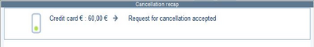

Case 2: Payment cancellation is refused

The payment is canceled, but not the transaction.

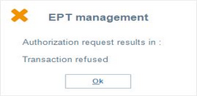

The cancellation recap is displayed and confirms that the cancellation request failed:

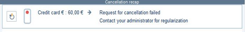

The user validates the window (at the bottom on the right) and contacts the administrator.

This button relaunches the cancellation request. Th payment is canceled if the transaction succeeds.

Cancellation of a gift card payment

Payment by gift card partially registered. There are two scenarios:

Case 1: Cancellation of a standard gift card

The payment is canceled. The cancellation recap is displayed, indicating that the voucher, if any, must be returned.

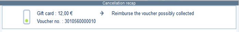

The gift card is always available.

Case 2: Cancellation of a gift card with option “Send amount to EPT”

In this case, the “Send amount to EPT” option is ticked in the Addition tab of the gift card payment method record.

The sale worth €5 is paid as follows: 3 euros are paid with the gift card and 2 euros in cash. The payment line is then locked.

The payment is canceled to return to the basket. The transaction is canceled and the cancellation recap is displayed:

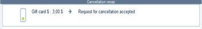

If the cancellation request fails, the following message is displayed:

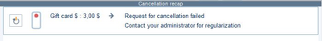

Use the button on the left to try again.

Cancellation of a payment in cash, by check, credit note or gift certificate

For these payment methods, the cancellation recap specifies the step to perform: return the cash, the check or the credit note

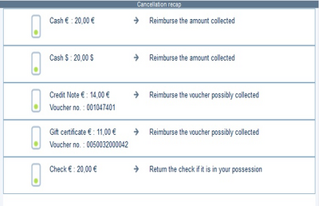

#### Receipt management

Receipt management

Put carts on hold

Front Office > Sales receipts > Sales > Enter transaction

The management of on-hold carts must first be configured in the cash register settings, under the Preferences tab.

Put cart on hold
1. After entering one or more items, press the ESC/Escape key on the keyboard or click on the cross on the numeric keypad.
2. When prompted to confirm that you want to abandon the input, select YES. The On-hold window will appear.
3. In the Description field, enter any text that will make it easier to identify the receipt when it is resumed, then confirm.
4. The sale is put on hold, and the cash register is available for input.

Resuming a cart on hold

A cart on hold can be resumed before any items have been scanned, or even after one or more items have already been entered. In the latter case, the items placed on hold will be added to those already entered.
1. Press the [Resume a cart on hold] button on the toolbar, or the button on the touchpad.
2. The List of carts on hold window appears.
3. Select the cart to resume and confirm.
4. The items placed on hold are included in the body of the receipt.
5. Complete the sale as usual

Checking a customer's on-hold carts

This function allows you to check a customer's on-hold carts when they come to the cash register. Prior settings of the cash register are required: in the Preferences tab, check the Propose the customer's receipts option. If the customer is listed in the cart, this information is included in the on-hold data: when the customer is identified at the cash register, and if there is a cart on hold, a message is displayed and its immediate inclusion in the receipt is suggested.

Printing receipts

Front Office > Sales receipts > Sales > Enter transaction

Printing a sales receipt without prices

After performing input for the items, click the [Other actions / Printing Template] button in the toolbar. The Choose printing template window will appear.

- In the Print Format area, select Receipt .
- In the Printing Template area, select the sales receipt without prices, then confirm.

Note that if the corresponding box is checked, the receipt without prices will be printed in addition to the standard sales receipt at the end of the sale.

Printing a mini invoice

In the previous step, and if the cash register settings allow it, the Choice of invoice template window opens before the receipt is printed, allowing you to select the appropriate invoice template.

Reprint or send last receipt

At any time, you can reprint or email the last receipt from the toolbar by clicking on the [Other actions / Reprint or send last receipt] button.

If the French Law V2 module is enabled, this feature is not available for French stores.

Print or send a receipt

At any time, you can reprint or email a receipt using the [Print Menu] button, available from the Cash Register > Sales > Look up a Receipt module.

If the French Law V2 module is enabled, this feature is not available for French stores.

Cancel transaction

Front Office > Sales receipts > Sales > Cancel transaction
1. Search for the receipt to be canceled.
2. Double-click on the line of the receipt to be canceled, or select the receipt line and then use the [Open] button.
3. The sales input screen appears, displaying the sales details.
4. Press the [Validate] button to cancel the sale.
5. Select the reason for cancellation if required, then confirm the operation to print the cancellation receipt.

Modifying the payment method of a receipt

Front Office > Sales receipts > Sales > Payment modification
2. Double-click on the line of the receipt to be modified, or select the receipt line and use the [Open] button.
3. The Payment Input window opens and displays the payment methods for the receipt.
4. If needed, use this button, available in the toolbar, to delete the current line.
5. Press the [...] button in the Method area to display the list of payments.
6. From the list, select the new payment method(s), then confirm the change.

Assign receipt to customer

Front Office > Sales receipts > Sales > Assignments to customer
1. Search for the receipt you want to modify. Note that only receipts linked to walk-in customers are displayed.
2. Double-click on the line of the receipt to be modified, or select the receipt line, then use the [Open] button.
3. The receipt screen opens and displays the list of customers.
4. Select the customer to whom the receipt should be linked, then confirm.

If the French Law V2 module is enabled for a store associated with the France international adaptation, receipts with the accounting type “Invoice” (e.g., Receipt treated as an invoice) cannot be attached to a customer.

Send receipt per e-mail

It is now common practice to offer customers the option of sending the receipt/invoice by email (see Emailing receipts ).

Emailing receipts

#### Register Analyses

Register Analyses

Flash report

Front Office > Sales receipts > Statistics > Flash report

This function allows you to see at a glance, the various results and transactions for the current day:
- Summary of the sales completed since the register was opened.
- Summary of payments
- Statistics by salesperson and category level, in table or chart form.

The flash report can also be printed in receipt format using the [Print] button.

X- or Z-receipts

Front Office > Sales receipts > Reports > X- or Z-receipts

These receipts recap daily operations (e.g. sales by item type, returns, etc.)
- The X-receipt may be viewed and printed at any time when a sales day has been opened.
- The Z-receipt may be viewed and printed at any time after the sales day has been closed.

These receipts can also be viewed using the Flash report feature. The information on these receipts can be configured in Print tab of the register settings.

If you wish to view Z-receipt information for an earlier date, use the Sales receipts > Statistics > Time based statistics

Customer balance – Loyalty totals

Front Office > Sales receipts > Sales > Enter transaction

Once a customer’s name and number have been entered in the sales transaction screen, you can view the balance for that customer.

The customer balance may be positive if a gift certificate has been acquired but not yet used.

Transaction history

Front Office > Customers > Customer management > Transaction history

This analysis can also be accessed through the sales screen, if a button has been configured in the touch pad.

Double-click on a customer record in the list displayed or use the [Open] button. The customer’s history will be displayed, recapping the various customer purchases by receipt. Several actions may be performed in this screen:
- To display a receipt on the monitor, double-click one of the receipts or use the [Open] button.
- To view the payment details of a receipt, use the [Detail of payments] button.
- To view the payment details for a line in the selected receipt, use the [Sales detail] button.

Outstanding payments

Front Office > Sales receipts > Sales > Outstanding payments

This function allows you to view the list of payments, such as credit notes, gift certificates, loyalty certificates, deposit payments, balance due amounts. The list of payments displayed allows you to perform the following operations:
- The [Open] button allows you to view the receipt corresponding to the outstanding payment.
- The Zoom menu allows you to view the various information on receipts, such as:
- The Additional actions menu allows you to:

#### Inventory Query

Inventory Query in Front Office

From the Management module

Viewing item availability

Front Office > Management > Inventory > Item availability

Enter the item code in the Code field or use the button displayed next to the field to select it from the list. You can narrow the search by using available criteria filters (category, department, etc.)

Start a search with the [Filter] button to narrow the list of the items corresponding to the selection.

Double-click the item line or use the [Open] button to view information by dimension.

You can display new columns in this list by clicking the [Set up layout] button.

Viewing inventory dashboards

Front Office > Management > Inventory > Dashboard

There are 3 types of dashboard:
- Item dashboard
- Dashboard by dimension that allows you to view the inventory of items right down to the dimension level.
- Inventory movement dashboard that groups together the following movements, for example:

From the Sales receipts module

Front Office > Sales receipts > Sales > Enter transaction

Item flash (item inventory)

You can set an Item Flash button in the touch pad (item inventory). When the item is scanned, you can view its stock for the various dimensions within the store or in other stores authorized for inventory viewing.

The inventory flash query screen also displays the detail of current movements for the selected item, showing the number of transfers, receipts, returns, reservations etc., in progress.

The [Other stores] button allows you to view the inventory for the same item in stores for which querying is authorized.

The information displayed on this screen depends on the settings made in Back Office > Query > Flash query settings

Note that other functions linked to the query of item inventory are available via the [Other actions] button.

#### Deactivating an Employee and/or a Store

=> See also procedure 362 (Deactivating of a Salesperson/Cashier)

Deactivating an employee and/or a store

This topic lists the steps to be taken to deactivate employees following their departure, or a store following its closure.

Closing a store

Back Office > Basic data > Stores > Stores

Open the Store record of your choice and in the Contact information tab, tick the Closed checkbox option.

Deactivating a salesperson and/or a cashier

Back Office > Basic data > Store staff > Store staff

Open the record of your choice, and select the Identity tab.

Enter the deletion date in the Deleted on field and validate.

Deactivating a user

Back Office > Administration > Users and Access > Users

Go to the Characteristics tab and select from the Group field a user group that no longer allows the connection to Back Office and Front Office.

#### User-Defined Tables at Checkout

##### Display of Item User-Defined Tables at Checkout

Display of Item User-Defined Tables at Checkout

This topic describes how to display the user-defined tables for items and documents at checkout.

Codes and short descriptions in item user-defined tables (1-10) can be displayed in columns on the sales transaction entry screen.

Therefore, user-defined item tables must belong to the input list associated with the FFO document type.

They may also be changed during sales, but these changes will apply only to document lines. No changes will be made to the item record.

Required settings

Step 1: Item user-defined tables

Back Office > Settings > Items > User-defined tables

This command allows you to set up user-defined tables of your choice. The first 10 can be viewed in documents.

Just remind, the titles of the user-defined tables must have been previously created in Settings > Items > Field title > Tables.

Step 2: Item record

Back Office > Basic data > Items > Items

These user-defined tables must then be associated with items of your choice. Therefore, go to the Information tab and specify user-defined tables.

Step 3: Input lists

Back Office > Settings > Documents > Documents > Input lists

For the input list linked to checkout (the one declared in the FFO document type - General tab - Input list field), the first 10 user-defined tables are available for display on the sales transaction entry screen.

At this stage, note that if you add to the FFO input list a user-defined table that is not checked in the user-defined tables to be exported to the price list aggregates, a message will prompt you to complete the settings for standalone mode.

Step 4: Configure receipt input

Back Office > Settings > Front Office > Register - button [Configure receipt input]

User-defined tables can also appear in the list of information to display. Therefore, do the following:
1. Click this button to open the window to configure the receipt input.
2. Then, click this button to open the screen to define the information to display.
3. In the Sales tab select the user-defined tables desired, then validate.

Step 5: Document types

Back Office > Settings > Documents > Documents > Types

To make user-defined tables appear in your documents (in the Line info section at the bottom on the left in the various documents,) select the item user-defined tables to display in the desired document type, in the Line info tab.

How it works when entering a sales transaction

Front Office > Sales receipts > Sales > Enter transaction

The user-defined tables selected from the input list will appear on the sales transaction entry screen, in columns with their title and will be populated with the values of the item.

These values can also be displayed in the Information section, below item input, if they were selected in the List of information to display in the configuration step of the receipt input for the register.

The column containing the code can be modified directly on the line. The short description is not modifiable. It is updated in case the code is changed.

For dimensioned items, you can change user-defined tables in the input list for the generic item and the dimensions.

There is no impact when modifying user-defined tables of generic lines on dimension lines.

If you need to verify item user-defined tables, press the [Additional actions] button, select the Line addition option, then open the Information tab.

At sales transaction entry, you may also change the values of these user-defined tables for an item by erasing its value and selecting another from the list.

The new value will be kept in the column and will be visible in the information to display, after a line change, as well as in the Additional line information screen.

However, the changes in the values of user-defined tables are only effective at document level, but not in the item record.

Changing user-defined tables in the Additional line information will automatically update user-defined tables in the input list.

Note that changes to user-defined tables can also be carried out using the following commands:
- Back Office > Sales > Retail sales > Modify user-defined tables
- Front Office > Sales receipts > Sales > Modify user-defined tables

Changes to user-defined tables are subject to access right management in Administration > Users and access > Access right management (menu Sales Receipts (107) > Sales > Modify user-defined tables.)

If changing table values directly in the input list, the line information section will not be updated immediately. It will be synchronized at record change.

User-defined tables will then be saved at the document level.

This operation is the same for any other document configured in this way; this also works in standalone mode.

Standalone mode

If user-defined tables are set up in an input list for checkout, you can view and modify user-defined tables in standalone mode in the same way as in connected mode, after having ticked the user-defined tables in the settings for aggregates (you do not have to start a new calculation of aggregates,) and after having exported the register settings for the standalone mode.

When integrating the receipts, the values from the user-defined tables that have been updated in standalone mode are kept in the integrated receipts.

Make sure to complete the settings in standalone mode when adding an item user-defined table to the FFO input list (a reminder message will be displayed.)

These settings will be defined in Administration > Scheduled tasks > Price list aggregates.

##### Display of Document User-Defined Tables at Checkout

Display of Document User-Defined Tables at Checkout

This topic describes how to display the document user-defined tables checkout. Some retailers require this display to facilitate checkout operations.

User-defined table setup

The required settings for user-defined tables are described here . In step 3, select Receipt - FFO as document type.

described here

Setting up the cash register configurator

Standard Configurator

Back Office > Settings > Front Office > Registers
1. Open the cash register of your choice, and click the [Configure receipt input] button.
2. Then click the [Define information to display] button.
3. Thee user-defined tables are now available in the information list for the following tabs: Header, Sales and Payment.

XML Configurator

For the <DataType> property the new values below will, if displayed, show the three user-defined tables in the Enter transaction screen:
- DocumentUserTable1.
- DocumentUserTable2.
- DocumentUserTable3.

They can be added to the following three banners:
- <HeaderBanner> for the header
- <BasketBanner> for the shopping cart
- <PaymentBanner> for the payment.

How it works when entering a sales transaction

Front Office > Sales receipts > Sales > Enter transaction

Once set up, this information will be displayed on the Enter transaction screen.

These pieces of information are also available in standalone mode.

They are stored in carts on hold

They are also retrieved for a reservation if this reservation is recovered in the Enter transaction screen.

### Discounts at Checkout

#### Item Line Discount

Item Line Discount

Front Office > Sales receipts > Sales > Enter transaction

Scan the item in the sales grid and proceed as follows, according to the discount to be made :
- To apply a percentage discount, press the button corresponding to the discount rate (5%, 10%, etc.) on the touch pad, or enter the percentage directly in the % field.
- To apply a discount amount, enter the agreed discount amount in the Discount field (10 for €10, for example.)
- To apply a new price to the item, enter the new unit price for the item in the Price field.

This will refresh the following fields: %, Discount and Amount

Then, enter the discount reason as follows:
- By either pressing the […] button beside the Mark-down field to display the list of mark-down reasons. Select the appropriate reason and validate the process.
- Or use the button on the touch pad corresponding to the required discount reason.

The mark-down reason will be displayed in the Mark-down field. Finalize the sale in the usual way.

To modify an amount or selected discount reason, position the cursor on the field that you want to change and repeat the same steps. To cancel a discount, enter a value of 0 in the % field.

#### Discount Applied to a Subtotal

Discount Applied to a Subtotal

Front Office > Sales receipts > Sales > Enter transaction

The ability to apply a discount to a subtotal is useful if you want to separate a group of items in order to apply a global discount to them, and continue entering other items on the receipt for which no discount applies.

Enter the items for which you want to apply a discount and then press the [Subtotal] button. The Subtotal line displays.

Depending on the discount being applied to the subtotal line, proceed as follows:
- To apply a percentage discount, press the button corresponding to the discount rate (5%, 10%, etc.) on the touch pad, or enter the percentage directly in the % field.
- To apply a discount amount, enter the agreed discount amount in the Discount field (10 for €10, for example.)
- To apply a new price to the subtotal, enter the new sales amount in the Amount field.

This will refresh the following fields: %, Discount and Amount Then, enter the discount reason as follows:
- By either pressing the […] button beside the Mark-down field to display the list of reasons for mark-down. Select the appropriate reason and validate the process.
- Or use the button on the touch pad corresponding to the required discount reason.

The mark-down reason will be displayed in the Mark-down field. Finalize the sale in the usual way.

#### Discount Applied to A Receipt Total

Discount Applied to a Receipt Total

Front Office > Sales receipts > Sales > Enter transaction

How this works depends on the configuration in the Register settings, in the Discount tab.

The Invoice total discount for discounted lines” register setting is enabled

Once the items have been entered, press the [Validate] button. The payment entry screen will then displayed.

Press the [Global discount on receipt] button on the toolbar, or use the button corresponding to the discount percentage to be applied. The Global discount on receipt window will be displayed:

- Enter a discount percentage or discount amount in the appropriate field.
- Select a discount reason from the selection list.
- Press the [Validate] button and finalize the sale as usual.

If a discount line has already been registered, the global discount will be added to the discount line.

The “Activation of invoice total discount” register setting is enabled

Once the items have been entered, press the [Validate] button. The payment entry screen will then displayed.

Press the [Global discount on receipt] button on the toolbar, or use the button corresponding to the discount percentage to be applied. The Global discount on receipt window will be displayed:

- Enter a discount percentage or discount amount in the appropriate field.
- Select a discount reason from the selection list.
- Press the [Validate] button and finalize the sale as usual.

The global discount is not displayed at the line level and is not added to a line discount that has already been applied.

Managing discounts when switching from sales transaction entry to payment method entry

For example, when you enter in the shopping cart:
- 2 separate lines of items, one at $14 (quantity 1) and the other at $16 (quantity 1): Receipt total: $30
- Then enter a global discount of 10% (Discount on invoice total enabled), the total becomes 27 ($30 - $3.)
- Next, if you proceed to the payment method entry screen, then abandon this entry to return to modify the sales transaction entry (add a line or modify the quantity of a line already entered), the amount added or modified will not automatically benefit from the 10% discount initially applied.
- Indeed, the discount on invoice total applies only to the items and quantities present in the entry at the time of activation.
- For the discount to also apply to new lines or modified quantities, it is necessary to reactivate the global discount by clicking on the discount button again and confirming the 10% discount.

#### Forced Price

Forced Price

Front Office > Sales receipts > Sales > Enter transaction

This function enables you to force a sales price during a sale, without having to generate a line discount.
- If a price list discount amount is present, it will be re-calculated.
- If a line discount is present, it will be deleted.

A button can be created on the touch pad to manage the “Force price” function. When this function is used, it will be recorded in the event log.

#### Changing the Discount Origin

Changing the Discount Origin

Historically, discounts attached to allowances and those related to a loyalty program (gift offered as a choice in a list) were grouped under the same original code "008". They are now distinguished as follows:
- Code 008 is reserved for discounts granted by loyalty for the delivery of a free item.
- Code 009 has been created for special conditions.

This reassignment may be necessary for analysis and statistical purposes.

Therefore, this command makes it possible - but only if it is required - to resume the history of those discounts and to update those in order to take into account this new assignment.

Update procedure

Back Office > Administration > Maintenance > Modify discount origin

Note that this command is aimed at modifying the origin of the discount. This goal is notified in the header of the screen. The multi-criteria screen returns the discount lines having as discount origin code 0008.

To start the process, select the lines to modify, and then click the [Update discount origin] button. Validate the confirmation message

You can check that the new assignment has been taken into account via the Discount dashboard command (Sales, > Analysis,) by customizing its layout with the Origin of discount criterion.

For any new lines entered in the Front Office with allowance discounts, these will be automatically updated with the 009 code reserved for special conditions.

When you print the sales receipt, the latter mentions only a discount line linked to the items benefiting from the allowance discount.

Please note!

This functionality is subject to the relevant access right: Menu Administration (106) > Maintenance > Modify discount origin.

### Final Selling Price Management

#### Contents

Final Selling Price Management - Contents

An item is assigned a price via a price list or a forced selling price. Next, discounts from the salesperson, loyalty or sales conditions are applied. When these calculations are completed, each item will have a non-modifiable price. You may then go to the payment phase. According to contract, certain deductibles may affect the calculated prices and therefore change them. The adjusted price is called the “Final selling price”.

General settings
- Activating final selling price management
- Managing markdown reasons
- Register settings
- Managing access rights

Final selling price usage
- Reminder concerning discount management by sales phase
- Discount recap zoom
- Entering final selling prices for lines
- Entering final selling prices for receipts
- Entering final selling prices for lines and receipts
- Display in the Discount recap screen
- Sale return/receipt cancellation
- Impact on Back Office

Additional information concerning final selling prices
- Special cases
- Some points about how final selling prices work

#### Final Selling Price Settings

Final Selling Price Settings

Activating final selling price management

Back Office > Administration > Company > Company settings

Open the Commercial Management > Front Office menu and check the Manage final selling prices at checkout company setting.

Managing discount reasons

Step 1: Create a discount reason

Back Office > Settings > Front Office > Markdown reasons

When this setting has been enabled, you will need to create a discount reason corresponding to discounts granted within the framework of final selling prices. Select the Final selling price discount type in the Markdown type section and validate. Important points:
- The final selling price discount may be used only with a price and line discount.
- The Printable at register option will be automatically enabled to display the justification for the discount on the receipt.
- The Additions tab with multiple criteria for markdown reasons offers various types of discounts.
- Final selling price markdown reasons are not subject to user restrictions.

Step 2: Manage markdown reasons by store

Back Office > Basic data > Stores > Stores

This setting enables you to authorize stores to manage final selling prices (by line, and/or receipt), as well as related markdown reasons.

Fill in the fields described in the Sales receipts section in the Additions tab for the Store record.

Sales receipts

Register settings

Setting the display type of the discount recap screen.

Back Office > Settings > Front Office > Register > Discount tab

This step enables you to set the desired display type concerning displaying a recap of discounts obtained at checkout, via the [Discount details] button. You can set the frequency of on-screen display (automatic, on demand or not), as well as three pieces of custom data that you wish to display. To do this, open the Discount tab in the Register record and fill in the Receipt discount details section ( these fields are explained here ).

these fields are explained here

Managing access rights

Back Office > Administration > Users and access > Access right management

Front Office > Settings > Administration > Users and access > Access right management

The following access rights must be managed for the various user groups.

Sales Receipts (107) > Access rights > Enter payments
- Authorize final selling price management for lines
- Authorize final selling price management for the receipt

#### Final Selling Price Usage

Final Selling Prices at Checkout

This section explains the discount recap screen, where you can enter a final selling price by line and/or receipt. You will remember that entering final selling prices is possible in Front Office only, and for only merchandise type items, for bills of materials and services. Financial items, such as gift card acquisition are excluded. In addition, a final selling price may not be applied to a benefit linked to a loyalty discount. In that case, the [Change] button will not be available on the discount recap screen.

Reminder concerning discount management by sales phase

Item entry

Display of “base price” and any promotional sales depending on prices, and application of any discounts entered by the salesperson.

Item validation

Application of discounts related to sales conditions and loyalty.

Payment entry
- Before payment entry: The discount recap screen displays, allowing access to final selling prices (line and/or receipt).
- After payment entry: The discount recap screen is available in query mode only.

Discount recap zoom

Front Office > Sales receipts > Sales >- Enter transaction

The discount recap window will appear after items and discounts have been entered (salesprson discount, sales conditions, loyalty, etc.), according to register settings (see Setting the Display Type of the Discount Recap Screen .)

Setting the Display Type of the Discount Recap Screen

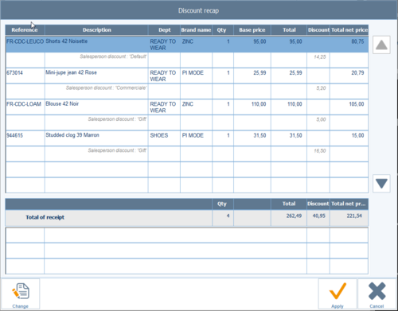

The window may also be displayed by clicking the following buttons:
- The [Additional actions, option: Detail of discounts] button is available when entering items.
- The [Detail of discounts] button is available when entering payments.

Note: Since this window displays the items as entered, it reflects the sales receipt:
- The Reference column shows the reference entered in the shopping cart (barcode or item code).
- The Description column shows the item description.
- The next 3 columns show information from register settings. Short labels are used for user-defined category or table types, while an X will be displayed to show that a Boolean has been checked.
- The Qty column shows the company settings determined in: Commercial management--Preferences--Decimal quantity

By default, the first modifiable line will be selected automatically. The second line may be selected using the keyboard or buttons located to the right of the table. Note that lines that cannot be changed will be grayed out (e.g., Item not available for a line discount).

According to the settings chosen (see Markdown Reasons ), the final selling price can be entered by line or receipt. A line final selling price may be combined with a receipt final selling price.

Markdown Reasons

Entering final selling prices for lines

Set the cursor on the item line concerned and click the [Change] button. This button will not be available if the item does not have a line discount.

The “Modify the final selling price on a line” window will open, showing the item line selected (item, description, quantity, base price, discount, total net price).

This new window enables you to enter discounts in percent, or even enter net prices. The user will have selected the net price and can enter a price using the keyboard or keypad. Data will be calculated to maintain consistency of unit prices:
- Entering net unit prices: Discount % calculated, then line amount. The amount entered may not be negative. It may be greater than the amount after discounts for sales conditions and loyalty have been deducted. In that case, the discount will be negative and will not appear on the receipt.
- Discounts entered as %: Unit price recalculated, then the line amount (unit price * quantity). The discount percentage must be less than or equal to 100%.

The markdown reason must be selected. It does not appear by default (see Markdown Reasons ).

Markdown Reasons

When entering a line final selling price, any receipt final selling price will be deleted.

The [Delete final selling price] button enables you to cancel data entry, without having to re-enter the previous amount.

When the discounts have been entered, the recap window will open again showing a line discount assigned to each item line discounted.

Entering final selling prices for receipts

Set the cursor on the line called Receipt total and click the [Change] button.

The Modify the final selling price on the receipt window will open, showing a recap of the sale (quantity, total, discount, total net price.)

This new window enables you to enter discounts in percent, or even enter an amount. The maximum discount amount is the sum of modifiable items, including receipt items, with the exclusion of financial items and items “not discountable at invoice total”.

By default, the cursor will be on the discount amount. Data will be calculated according to the information entered:
- Enter discount %: Line amount is recalculated. This percentage will be applied to each “discountable at invoice total” line on the receipt. The discount percentage must be less than or equal to 100%.
- Enter discount amount: The discount percentage is recalculated. The amount entered cannot be greater than the amount for the products eligible for discounts on the final selling price.

The [Delete final selling price] button enables you to cancel data entry, without having to re-enter the previous amount.

When the discounts have been entered, the recap window will open again showing a line discount assigned to each item, as well as a line for the total.

#### Entering final selling prices on lines and receipt

You may modify a final selling price on the receipt, even if there is a final selling price on one or more lines. If there is a double discount for the same item, the discount for the receipt final selling price will be added to the discount for the line final selling price. Two cases are possible:
- No final selling price for the receipt: The window showing final selling price lines will open.
- There is a final selling price for the receipt: A message displays showing that the” end of receipt discount” will be deleted.

Display discount recap

The various discount types that may be found in the recap window according to the entries made for the sales receipt:

| Discount type | Description |
| --- | --- |
| Price list | Promotion / customer / item price lists include a markdown code, giving the following data: Price list discount: Markdown code description |
| Salesperson | The discount is entered by the salesperson, with an optional markdown code entered by the salesperson: Salesperson discount: Markdown code description |
| Overall discount (only for total invoice discounts in Back Office) | Overall discount entered by the salesperson: Overall discounts |
| Line sales conditions | Discounts are calculated via the sales conditions engine, with a markdown code: Line promotion discount: Markdown code description |
| Receipt sales conditions | Discounts are calculated via the sales conditions engine, with a markdown code: Receipt promotion discount: Markdown code description |
| Loyalty | Discounts are calculated via the loyalty engine, with a markdown code: Loyalty discount: Markdown description |
| Special conditions | The special conditions program is selected by the salesperson, using a markdown code from the following program: Special Conditions discount: Markdown code description |
| Line final selling price | Changing item prices with entry of a markdown code: Discount price for final selling price: Markdown code description |
| Receipt final selling prices | Changing receipts with entry of a markdown code: Discount price for final selling price receipt: Markdown code description |

Sale return/receipt cancellation

This is done for the selling price for each line and for the receipt. Discount details are not used for item returns. Setting a price on returned lines includes the final selling price:
- Canceling receipts: The original sales line is reversed with the discount details in reverse.
- Return without controls: The original sales line is not known. No discounts are present on the line.
- Return with controls: The original sales line is used with the final price for the original sale in unit prices. Discounts for the original sale will not be used.

Impact on Back Office

Sales transaction entry screen

Back Office > Sales > Retail sales > Enter

When entering a sales transaction, the [Additional actions - Detail of discounts] button allows you to access the final selling price window, in query mode only.

Discount dashboard

Back Office > Sales > Analysis > Dashboard/Discounts

The dashboard may be viewed depending on discount reason, notably for final selling prices.

#### Additional Information

Additional Information Concerning Final Selling Prices

This section lists all the cases which may be encountered within the framework of final selling prices. At the end of the section, you will find some points about how final selling prices work.

Individual cases

Loyalty

When the Discount recap screen is called up, a check will be done to verify the existence of any loyalty benefits. The screen will be available for query only, if there are any line or overall loyalty discounts. Loyalty points will be recounted after validating the discount recap screen, so that they will be taken into account in loyalty calculations.

Sales conditions

Note: If sales conditions are enabled, the button below in the Front Office sales transaction entry screen will enable you to access discount recaps, including those concerning sales conditions.

Margin check

Margin checks based on purchase prices are not carried out when a final selling price is entered.

Taxes and taxation

For ex-tax billing, the discount recap screen is in ex-tax. Discounts are expressed as ex-tax, based on ex-tax.

Taxes will be recalculated when validating this screen. Note: Tax rates may vary according to amount (USA/Canada).

When entering ex-tax amounts, the amount to pay will recalculated. This will more than likely result in an adjustment to this type of discount.

Receipt totals (GP_TOTAL columns...) and line totals (GL_TOTAL columns....) represent amounts after all discounts have been deducted, including final selling prices. These columns are used to calculate taxes.

Tax refund

Tax refunds are based on the last price (final selling price). Discount details will therefore not show on the tax refund slip.

Fiscal printers

When entering a final selling price, the amount after deduction of all line discounts is then sent to a fiscal printer, without indication of the amount of each discount. Discount details will therefore not show on the fiscal receipt.

EFT

EFT applications may ask for tax details. Consequently, this functionality will be unavailable as soon as a payment is entered. The screen will be available for query only. Data entry in the discount recap screen will depend on deleting payment methods.

Example:

A sale is entered in the basket and validated. Sales conditions will then be activated and applied to sales lines.

The discount recap screen appears, allowing price modifications to be done. It will then be validated.

The payment entry window appears.
- If no payments have been entered, a button enables you to recall the discount recap screen in order to change prices.
- If at least one payment line has been entered:
- A button enables you to recall the discount recap screen for viewing. Payment methods can be deleted to call up the discount recap screen for modification.

Note: Returning to the basket will cancel sales conditions and entries done in the discount recap screen.

Overall discounts

When managing final selling prices, an overall discount is generally available when entering items or if payment entry can no longer be done in the store configured to manage final selling prices.

Standalone mode

Final selling price management is available in standalone mode.

BOM Management
- Macro BOM: Changing prices for items present in sales conditions, or a “macro” type BOM will not change the value of other lines in the macro.
- Assembly BOM: Selling prices may be changed for these BOM items. The components will not be present on sales lines. They are not priced with the selling price, but are used for inventory updates. Kit selling price changes will not affect components.
- Assortment BOM: Kit selling prices are the sum of component selling prices for assortment BOM items. They will be present on the receipt for kit lines and component lines. Kit lines may not be changed, but they will be on the discount recap screen. All component lines will be present on the discount recap screen. When validating component discount recaps, kit selling prices will be recalculated and displayed with the new values.

Storage

These discount amounts are stored in the table of discounts with the following discount types: Line Final selling price and Receipt final selling price. They can be viewed in the dashboard for discounts of the Back Office > Sales > Analysis > Dashboard.)

Some points about how final selling prices work

If a payment method has been entered in the installment panel the discount recap window will be in query mode only.

Entering final selling prices for line and receipt is:
- operational in Standalone Mode
- impossible if a Loyalty discount (benefit) applies
- not possible for Finance type items
- possible for Service and BOM type items
- Macro and Assortment BOM: discounts will be applied to components only Assembly BOM: discounts will be applied to BOM lines

If a store manages final selling prices, you will no longer be able to enter footer discounts in Front Office. In this case, the following message will appear: You cannot enter a global discount on a receipt for a store supporting final selling prices

During bulk register modifications, you will find register settings fields for displaying discount details: GPK_AFFDETAILREM, GPK_DETREMLIBRE1, GPK_DETREMLIBRE2 and GPK_DETREMLIBRE3.

In the Line or Receipt final selling price entry window, final selling price reduction reasons will not be subject to user restrictions. But will be subject to those determined in store settings.

Note: If a final selling price has been applied to a receipt and there is a line discount, the following message will appear : “Your end of receipt discount is about to be deleted. Do you want to continue?”

When managing final selling prices, no other settings concerning discounts will be taken into account (rounding, discount threshold, forced price, etc.)

After the final selling price has been entered, it will be lost if the cashier exits the payment screen or puts the cart on hold.

Discounts entered in the context of a receipt final selling price will be passed along to all lines in proportion to the amount on each line, except for items that cannot be granted total invoice discounts.

### Management of Returns in Front Office

#### Contents

Management of Returns in Front Office - Contents

This purpose of this section is to list the various methods of entering a return on the register. Returns may be entered by line or receipt, with or without searching the original sale, or simply by entering a negative quantity.

Cegid Retail Y2 also offers the option to manage remainders when entering a return. In addition, you can identify the receipt of the original sale, in order to prevent fraud.

Required settings
- Configuring return reasons
- Configuring the search mode for returns
- Configuring registers
- Managing access rights

Different methods of entering a return
- Entering a negative quantity
- Entering the return of an item without control
- Entering the return of an item with control
- Returning and duplicating a receipt
- Entering a return within an out-of-stock control
- Entering the return of an item with a serial number

Fraud prevention linked to returns
- Refunding the customer on the bank card used for the sale
- Searching the payment transaction for refunding a return
- Identifying original sales receipts

Miscellaneous
- Remainder management
- Standalone mode
- Labels
- Statistics
- Loyalty

#### Return Settings in Front Office

Return Settings in Front Office

Configuring return reasons

Enabling return reason management

Back Office > Settings > Documents > Documents > Types

Managing reasons for returns is not mandatory. It just helps to know the reason why items are returned.

If you do not want to handle these reasons, just ignore this step: no reason then will be prompted when you return items.

On the right of the screen, select the FFO type, and go to the Inventory tab.

Tick the Management of movement reasons option and validate. Henceforth, returns will have to be motivated when made in Front Office.

Defining return reasons

Back Office > Settings > Documents > Movement reasons

If the management of return reasons is enabled, you have to define some reasons.

Press the [New] button to display the Movement reason window and specify the code, the description and the short description of the reason (e.g. change of color, change of size, defect, etc.)

In the Movement types section, tick the Sales option and validate.

Configuring the search mode for returns

Back Office > Settings > Front Office > Setup for returns

When an item is returned on the register, several screens appear for finding the receipt the return refers to, in order to link the item to the original sale.

This setup functionality allows the user to define the information prompted when the operator enters a return on the cash register. You can define here the search criteria for returns.

Press the [New] button to display the Search settings for a return window, and populate the following fields:

| Fields | Description |
| --- | --- |
| Display of the return period | This option impacts the List of sold items sold window that displays for a return. It limits the search to perform and directly displays the sales made with the period specified in the register setting (see Management tab, Accept return - time period field.) |
| Modifiable return period | If this box is checked, the return period defined in the previous option can be modified by the user in the multiple criteria selection screen for the List of sold items . Otherwise, this period cannot be modified. |
| Choice no. 1/2/3 | This selection determines the first piece of information prompted on the cash register for a customer return. This can be the barcode of the item, its reference, or the customer code. If you select None, the List of sold items will display when the operator enters a return, so that they can search for the original sale. Minimum length: This option allows the search input field to be used only if a minimum number of characters has been entered Mandatory: This option allows you to specify that the input is mandatory. If the corresponding field is not specified when the operator enters a return, a message informs him that this field is mandatory. Search screen: Enables for a return the display of the search button that points to a multiple search criteria screen. Based on the information selected, the fields that are described in the table hereafter will appear or not. |

Only intersections marked with X are available:

|  | Minimum length | Mandatory | Search screen |
| --- | --- | --- | --- |
| Internal ref. of receipt | X | X | X |
| SKU barcode | Exact search | X |  |
| Item code | X | X | X |
| Customer code | X | X | X |
| Serial number | Exact search |  |  |
| External ref. of line | X |  |  |

Once the settings have been defined, they must be assigned to all registers in question (refer to Configuring cash registers).

After this setup, when you enter a return in the Front Office, a screen will appear inviting you to fill in information such as the serial number or the item code, in order to find the receipt.

This button, displayed in the receipt search screen results from the settings defined for Search screen (see the Table above.)

If gives access to a multiple selection screen to search for thee relevant information. The user can ignore the entry of this information if the Override the entry of return information concept is enabled in the access rights.

Configuring cash register for returns

Back Office > Settings > Front Office > Registers

Go to the Management tab and populate the various return options (refer to Register Settings - Management Tab .)

Register Settings - Management Tab

Managing access rights

Back Office > Administration > Users and access > Access right management

Front Office > Settings > Administration > Users and access > Access right management

The following access rights must be managed for the various groups.

| Menu | Branch | Access right description |
| --- | --- | --- |
| Menu 102 – Sales | Retail Sales | Statistics/Return statistics Authorize or restricts user groups from entering statistics on returns in Back Office. Reports/Item labels/On sales return In Back Office, authorizes or restricts user groups from printing item labels related to returns. |
| Menu 105 – Settings | Front Office | Setup of returns Authorizes or restricts user groups to define the settings for managing returns. |
| Menu 107 – Sales receipts | Statistics | Return statistics Authorizes or restricts user groups from entering return statistics in Front Office |
| Access rights/Enter transaction | Enter a return of receipt Authorizes or restricts users from entering returns of receipts via the [Actions on lines/Return of receipts] button, with or without duplication. Enter a return line Authorizes or restricts users from entering line returns on receipts, via the [Actions on lines/Return line] button, with or without control. If this right is red, no return line may be saved. A message will prompt the user you to enter a password of an authorized user to continue. Likewise, this access right acts on the option to enter (or not) a negative quantity. Enter a return line without control Authorizes or restricts users from entering returns receipts lines, via the [Actions on lines/Return line without control ] button. Unlike the previous right that has an impact on all return lines, this right only concerns return lines without control . Override control for merchandise returns Authorizes or restricts users from overriding a required control for an original sale during a return. If this right is red, no return line may be entered. Accordingly, it will not be possible to enter a negative quantity. Enter a return without any link to the original sale Authorizes or restricts users from overriding entering information on original sales. If this right is red, the user cannot enter a return line without linking it to the original sale. Enter return of service Authorizes or prevents returns of service type items. The Enter a return line access right must be granted to authorize the return of a service. Override the entry of return information Authorizes or restricts users from overriding entering required information related to item returns. If this right is red, users cannot enter a return line without entering the information requested (internal reference for receipts, item barcodes, etc.) |
| Access rights/Enter payments | Refund a card different from that used for the sale Authorizes or restricts user groups from reimbursing the return amount to a card different than the one used for the purchase. |
| Menu 108 – Management/Inventory | labels | On sale return In Front Office, authorizes or restricts user groups from printing item labels related to returns. |
| Menu 110 – Basic Data/Items | Labels | On sale return In Back Office, authorizes or restricts user groups from printing item labels related to returns |
| Menu 113 - Follow up actions |  | Following up actions gives the opportunity to trace various operations and manipulations done by colleagues. Concerning, the following actions may be traced: Basic data Reprint labels/On sale return Sales receipts Control of returns - Manual entry Return created from duplicate These actions may be viewed in Back or Front Office: Back Office > Administration > Event log > Log query Front Office > Settings > Administration > Event log > Log query For further information about the traced actions, please refer to the Event log . |

#### Different Methods of Entering a Return

Different Methods of Entering a Return

Front Office > Sales receipts > Sales > Enter transaction

Entering a negative quantity

Once you have entered an item, you can enter a negative quantity in the Quantity column of the sales receipt screen directly. In this case, there is no search carried out for the original sale, but the information relating to the original sale must be specified in the Information about the original sale screen that displays.

By default, the information displayed is taken from the receipt line, except for the number and date of the original receipt, which you must enter yourself. If reasons are managed for the sales receipts, the reasons for returns window will open next (see Return Settings .)

Return Settings

Entering the return of an item without control

Once the item entered, the use of the [Actions on lines - Return line without control] allows you to enter directly a negative line without further action. If the management of movement reasons is activated, you must select a reason for the return from the screen that displays.

Canceling the return entered without control

Note that if you perform the same operation twice, the following message displays: “Do you really want to cancel the return of this item?” If confirmed, the return entered without control will be canceled.

Entering the return of an item with control

It is possible to enter a return by searching for the original sale and then linking the original sale to the return.

Please note!

Depending on the settings made previously (see Configuring the Search Mode for Returns ), different screens may be displayed.

Configuring the Search Mode for Returns

Without entering a sales line, using the [Actions on lines/Return line] button allows you to search for the original sale via the List of items sold screen.

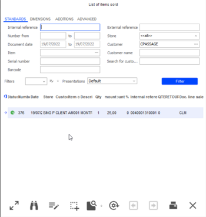

This multi-criteria screen is optimized by means of a company setting available in Administration/Performance ; this setting defines the maximum number of records returned by the query.

Administration/Performance

In the List of items sold screen, if none of the lines proposed correspond to the returned item, the [Close] button allows you to open a new window used for manually entering the information relating to the original sale:

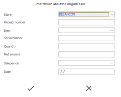

Please note!

The display of this window is subject to access rights granted to the user. In this case, it is the concept Override control for merchandise returns (Administration > Users and accesses > Access rights management):
- If the concept is set to green, this window will display.
- If the concept is set to red, the window will not open, and the return is not possible.

Already returned lines

You can get the list of already returned items, if you tick the Already returned items checkbox option in the Additions tab of the List of sold items screen By default, items already returned are not displayed.

Please note that the Status column in this screen displays a colored button:
- Green: the item has never been returned
- Red: the item is already returned

User restrictions

Back Office > Administration > Users and Access > Users

Please note that sales are searched for in the stores based on the user restrictions defined in the User record (Restrictions tab, Item returns field.)

Returning and duplicating a receipt

Returning a complete receipt

You can return a complete sales receipt with all its item lines.

all its

Therefore, press the [Actions on lines/Return of receipts] button to select the appropriate receipt.

Returning and duplicating a receipt

You can return a receipt and duplicate it. This feature is used in specific cases when it is necessary to return the complete receipt and recreate the sales receipt to make some changes.

Therefore, press the [Actions on lines/Return of receipts and duplication] button to select the appropriate receipt.

Entering a return within an out-of-stock control

Context

When a receipt is entered, Y2 will check whether the item entered is in stock (physical or available), in order to alert the cashier in the event of insufficient stock, or even to prevent validation of the quantity entered, in order to avoid generating negative stock (even if it means blocking and preventing a sale in the event of incorrect stock.)

How it works at checkout

In previous versions, in the event of an item return, when the document setting Deletion of the line shortage was enabled, it was not possible to add the item to the shopping cart, as the line was automatically deleted. Just remind, this setting is available in the Inventory tab of the document types (FFO type.)

Previously, when an item with negative stock was entered, a message was displayed indicating that the item was out of stock, and the line was deleted before the cashier could even indicate that it was a return line.

Now, even if this document setting is enabled, the return line is no longer deleted, and the message "Do you wish to return the item?" is proposed to the cashier. If the cashier answers:
- No, the line is deleted.
- Yes, the line is added with a quantity of -1, and inventory is updated.

Remarks
- This operation applies to single and dimensioned items, items managed by batch, assortment BOMs, and macro BOMs.
- It does not apply to assembly BOMs as there is no inventory control of component items.
- In standalone mode, this does not apply as inventory control is not supported.

Non-exhaustive recap of settings for checking inventory levels

The following settings can be used to check whether products are in stock:

| FFO document type, Inventory tab | FFO document type, Valuation tab | Register settings, Management tab |
| --- | --- | --- |
| Inventory shortage calculation: Physical. Deletion of the line if shortage: checked. | Authorize documents valued at 0: checked. | Check returns of merchandises: unchecked |

To find out more about how these settings work, please refer to the following topics:
- Document types ( Inventory tab and Valuation tab .)
- Register settings ( Management tab .)

Entering the return of an item with a serial number

Please note!

The choice of the method of entering serial number-managed items lines has an impact on entering returns from such serial number-managed sales lines.

It is strongly recommended that if you sell multiple serial numbers with a single Y2 item code, you enter a sales line for each serial number sold.

This makes it easier to enter the return of single serial number.

In fact, the list of the sold items displays a line with a quantity of 1 for each serial number sold, and the user can select the line corresponding to the serial number to be returned.

Otherwise, this list shows several lines with a quantity >1, and if one of the lines is selected, the following blocking message is displayed: “You cannot select a line associated with several serial numbers.”

Non-controlled returns of items with serial numbers

In the case of a return without control, an input window opens, where you can enter the serial number of the item to be returned.

However, the system will not check whether this serial number has already been returned, since by definition this type of return is not checked.

For items managed by serial number, we suggest that you only carry out controlled returns, or at the very least, restrict non-controlled returns to a specific category of users via access rights.

#### Fraud Prevention

Fraud Prevention

Operations linked to item returns to the store may cause fraud. The features developed and described below will limit these cases.

Refunding the customer on the bank card used for the sale

Bank card settings

Back Office > Settings > Management > Payment methods

Go to the Addition tab of the Credit card record and perform the following operations:

| Fields | Action |
| --- | --- |
| Authorization number | Check this option. |
| Type of authorization number | Select “None” |
| Send amount to EPT | Check this option. |

Cash register settings

Back Office > Settings > Front Office > Registers

Open the register record of your choice and perform the following operations:

| In the Register record | Action |
| --- | --- |
| Management tab | Tick the Checking reimbursement card option. |
| Settings for peripherals: EPT | Click this button and select EPT to configure the EFT simulator. In the General tab populate the following fields like this: DLL name: Cegid.CPOS.XEFTSimulator Driver name: EFTSIMUL |

How it operates on cash registers

Front Office > Sales receipts > Sales > Enter transaction

In case of a return, the payment transaction is searched for in the following cases:
- A partial or complete return of a receipt with one credit card payment.
- Return of a complete receipt paid with X payment methods including 1 credit card.

Sales receipt

When entering a receipt with 1 item paid with a bank card, an authorization request is sent to the EPT when the receipt is validated.

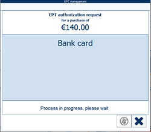

The various steps of the EFT transaction are the following:

Response request to the simulator: In the simulator, click the [Load response] button.

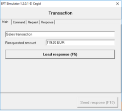

The acceptance by the payment terminal is simulated by selecting an OK-typed file:

=>Select the OK_Reglement_CB.xml file in C:\Program Files (x86)\Cegid\Cegid Retail\Cegid Retail Y2 VXX.0\Front Office\CPOS_Pilotes\Data

The identifiers of the transactions are then returned and can be viewed in the Response tab of the simulator:

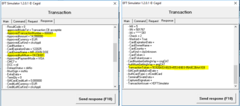

The return of the acceptance by the payment is simulated by clicking the [Send response] button. The receipt is edited.

Return receipt

When validating the return receipt, checks are performed on the amount and the identifiers of the original transaction.

The EPT authorization request window will open.

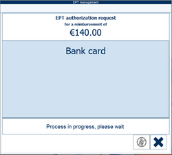

The amount must match the amount on the previous receipt. In the Request tab of the simulator the following transaction identifiers are checked:
- ApprovedTransactionNumber,
- ApprovedAuthNum,
- Transaction Token.

The following message is sent to the user:

=> "The following reimbursements have been made: €XX reimbursed with the card used to pay the sales receipt no. YY from register XYZ.”

Authorization request refused for a return

If the authorization request is refused for a return, a first message informs the user and a second message prompts the user to relaunch the authorization request.

If the user does not want to make the request again, the user has to select another payment method (cash or credit note.) After having selected the refund method, the user can validate the receipt.

Searching the payment transaction for refunding a return

It is sometimes difficult to find the payment transaction of a returned item (sale made in a store with a different EFT system, sale paid with several payment methods, return of several items from different sales, return of several items from different sales, return of an item belonging to a sale for which another item has already been returned and refunded, etc.)

A CBS specific development can then be used to select the transaction thanks to the CBS openness: CbrReceipt.BeforeEftAuthorizationRequest is called by Y2, before the authorization request for the payment by card is sent to the EFT system, thus before the CPOS driver is called. CBS can then obtain the reference of the original sale of the return lines of the receipt being processed thanks to the latest evolution of the contextual function ThisDocument.GetReceiptData .

According to the rules of use to be defined between the merchant and the EFT provider, and according to the CPOS driver capabilities, CBS will be able to select the reference of the original payment transaction, and return it to Y2 for transmission to the CPOS driver.

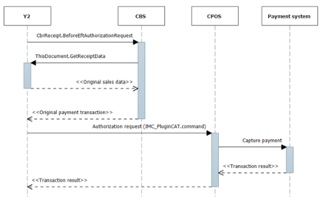

If no CBS code is connected to the user-exit, the refund request is sent to the EFT system without connection to the sales transaction.

Identifying original sales receipts

From the sales multi-criteria screen

The method used to enter a return line is saved in the Creation method field on the line and may take the following values:

The Creation method field can be displayed in the sales multi-criteria screen, using the [Set up layout] button. Move the Creation method (GL_CREERPAR) field to the list of columns to display. The following values are possible:

- Return identifier scanned from an original
- Return identifier scanned from a duplicate
- Return identifier scanned
- Return identifier entered from an original
- Return identifier entered from a duplicate
- Return identifier entered
- Return selected from a search list
- Entered

A line is created in the event log every time a return line is created from a duplicate receipt.

Required settings and operation

Back Office > Administration > Company > Company settings

A company setting available in Commercial management > Front Office allows you to differentiate original receipts from reprints (duplicates.) Click here for further information.

Click here

#### Miscellaneous

Management of Returns in Front Office - Miscellaneous

Remainder management

You may manage customer returns remainders by configuring this functionality in the register settings (see Register Settings ).

Register Settings
- Selling one item: When returning an item, for a single unit sale, the line from the original receipt is recovered so that line information may be available.
- Selling several items: When entering a return, register settings enable you to return the entire sales line, or only some items of the line. In the case where the quantity in the original line is greater than 1, the screen that displays allows the entry of the quantity to return (the quantity entered for the return cannot be greater than the original quantity.) Moreover, a control will be done to prevent the entry of quantity greater than the quantity still to return.

Standalone mode

Standalone mode does not allow returns to be controlled. A control will be done when integrating sales. If there is a discrepancy between the quantity sold and the quantity returned, a record will be inserted into the event log.

Printing labels

Back Office > Sales > Reports > Item labels > On sale return

Back Office > Basic Data > Items > Labels > On sale return

Front Office > Management > Inventory > Labels > On return sale

These commands can reprint labels for returned items.

Viewing statistics

Back Office > Sales > Retail sales > Statistics > Return statistics

Front Office > Sales receipts > Statistics > Return statistics

These commands generate statistics on returned items, based on numerous analysis criteria such as reason, salesperson, etc. These criteria are available in the Additions tab.

Item return and loyalty

Back Office > Settings > Front Office > Register

Front Office > Settings > Registers > Register

Within loyalty management, and in order to associate the item return with the customer, it is advisable to check the Recover customer of the return option in the Register settings ( Management tab .)

### Managing the Safe

#### Contents

Safe Management - Contents

This function is used to manage a safe in the store. This is particularly useful when bank deposits of certain payment methods such as checks or cash, are not carried out every day, this also concerns deferred checks.

When closing the day, payments made using the payment methods for which safe management is activated are sent to the safe pending bank remittance.

General settings
- Payment methods to transfer to safe
- Cash registers affected by safe remittance
- Register operations (cash float and discrepancy)
- Access rights linked to the safe

Safe management on cash registers
- Safe input
- Checking amounts in safe
- Initializing safe cash float
- Adjusting safe cash float
- Exchanging cash in safe
- Supplying safe cash float
- Withdrawing from safe
- Bank remittance
- Register control
- Discrepancies of checks in register or safe control

#### Defining Settings for the Safe

Defining Settings for the Safe

Payment methods to transfer to safe

Back Office > Settings > Management > Payment methods

Front Office > Settings > Registers > Payment methods

For each payment method concerned by the transfer to the safe (i.e. cash in euros or dollars, checks, deferred checks, etc.) perform the operations described in the Accounting and Cash float tabs:
- Accounting tab: Uncheck the Bank remittance generation option. Note that if in the Cash float tab the Transferred to safe option is checked for a payment method, you cannot check this option for the same payment method.
- Cash float tab: Please see the Payment method record for more information on the Cash float tab fields.

Cash registers affected by safe remittance

Cash Register Settings

Back Office > Settings > Front Office > Register

Front Office > Settings > Registers > Registers

For each register affected by safe remittance, go to the Cash float tab and do the following:
- Specify the information requested in the Safe section.
- Specify the information requested in the Bank remittance section.

If cash float is managed, you should tick the Cash float management box. Indeed, safe remittance takes cash floats into account. In other words, the cash amount withdrawn from the register for safe remittance is the difference between the amount entered during the register check and the cash float amount.

Configuring the touch pad (optional)

Back Office > Settings > Front Office > Register

Front Office > Settings > Registers > Registers

Transferring amounts to the safe is done in Front Office from the Transaction entry screen using the [Other actions/Safe input] button. It is possible to configure a button to enable safe input during the day by means of a touch pad function.

1. Press the [Configure touch screen and keyboard] button, and then click a free button.
2. Select [Function] in the Type of button field at the top of the screen.
3. In the Function section that displays, open the list and select Safe input .
4. Validate to create the shortcut on your touch pad.

Register operations linked to the safe

Back Office > Settings > Management > Register operations

As for cash register management, where it is necessary manage cash float and register discrepancies, it is also necessary to create two register operations of type Safe cash float and Safe discrepancy for the safe. For these operations, option Cash transaction is checked automatically and option Use with other items is grayed out.

Linking the safe discrepancy to the store

Back Office > Basic data > Stores > Stores

Go to the Additions tab of the store record and populate the Safe discrepancy field.

Access rights linked to the safe

Back Office > Administration > Users and access > Access right management

Enable access rights for user groups of your choice.

| Menu | Section | Access right description |
| --- | --- | --- |
| Menu 107 – Sales receipts | Daily operations | Safe This menu allows you to access the options in the Safe menu in Front Office: Query safe Bank remittance Bank remittance detail Bank remittance slips Check safe |
| Access rights | Register operations - Cash float amount outside the safe This menu is used to enter a financial item of the Cash float type, which will not be withdrawn from the envelopes in the safe. Safe Allows the following actions: Safe input during the day (i.e. without having to close the day) Cancel mandatory safe input (allows you to ignore the required safe input) Authorize exiting the bank remittance at the end of the day (allows you to quit the bank remittance window during the daily closing) Change the amount when making a bank remittance Modify selected payment during bank remittance |
| Menu 112 – Settings | Processing | Initialize safe When implementing safe management, this menu enables you to place existing deferred checks into the safe, in order to include them in subsequent bank remittances. The Initialize safe command is found in Front Office > Settings > Processing. |
| Menu 113 - Follow up actions | Sales receipts | Safe input during receipt entry Enables you to trace safe input over the course of the day in the event log. |

#### Safe Management on Cash Register

Safe Management on Cash Register

Flow diagram for the safe The various flows are detailed in the chapters below.

Safe input

Front Office > Sales receipts > Sales > Enter transaction > [Other actions/Safe input] button.

This command transfers all or part of the register content to the safe. The transfer can be made:
- Directly from the cash register at any moment
- In the case of an alert when the maximum amount in the register for a payment method is exceeded (amount defined in the Cash float tab in the payment method record.)
- When closing the register

When safe input is requested, the Safe input window opens, giving the option of a complete or partial safe remittance.

On validation, a receipt corresponding to the register operation configured for the safe is edited, ( Safe input setting), and a confirmation message of safe remittance will be displayed.

Safe input

Each tab is dedicated to a payment method.

For Cash type payment methods

The available amount is the amount in the register minus the cash float. During the day, you can place part or all of this available amount in the safe up to the minimum amount set in the Cash float tab of the payment method record (for the brand of the store of the register.)

Cash float tab of the payment method record

Example of a minimum cash amount for the payment method:

| Action | Amount in the cash register |
| --- | --- |
| Opening of the sales day no.1 | $100 |
| Collecting $150 in the currency | $250 |
| Closing of the day with a non-constant cash float | €250 |
| Opening of the sales day no.2 | €250 |
| Collecting $50 in the currency | €300 |

The maximum amount that can be withdrawn from the cash register is set to $200 on day no.2, leaving $100 in the cash register.

For Check type payment methods

Checks are proposed one by one. You can place all or only some of the checks in the safe.

Checking amounts in safe

Front Office > Sales receipts > Daily operations > Safe > Check safe

This command allows envelopes (including safe float) to be retrieved from the safe in order to check the total amounts for each payment method in the control screen and indicate any discrepancies. Cash and checks are then grouped by payment method and the new envelopes are placed in the safe again. Note that, if necessary, the safe float can be redefined during this operation.

Initializing safe cash float

Front Office > Sales receipts > Daily operations > Safe > Query safe

This step allows the creation of cash float for the safe from the register for one or more payment methods.

Click this button to display the window to initialize the cash float. Once initialized, this amount can be supplied:

- From the safe
- When entering a sales transaction (input)
- From query (adjustment)
- By withdrawing an amount during a sales transaction

Adjusting safe cash float

Front Office > Sales receipts > Daily operations > Safe > Query safe

This step allows you to fund cash float without sales transaction entry. Only currency envelopes already initialized can be supplied any further

Click this button to display the withdrawal window.

Exchanging cash in safe

Front Office > Sales receipts > Daily operations > Safe > Query safe

This step allows the exchange of face values in the safe. Note that these exchanges are traced in the event log.

Click this button to open the exchange of cash in safe window.

Supplying safe cash float

Front Office > Sales receipts > Sales > Enter transaction > [Other actions/ Supply safe cash float]

This step allows you to fund cash float from the sales transaction entry. Only currency envelopes already initialized can be supplied any further

Withdrawing from safe

Front Office > Sales receipts > Sales > Enter transaction

If the safe contains payments, you can make withdrawals from the safe during the day by entering a financial item of type Cash float. Therefore, enter a Financial item of type Cash float, the Withdrawal from safe window will appear so that you can enter the amount to withdraw.

Required settings
- A register operation of type Cash float must have been created (in Settings > Management > Register operations.)
- This operation must have been declared in the Cash float tab of the register record (in the Cash float section, available via Settings > Front Office > Register).

Bank remittance

Front Office > Sales receipts > Daily operations > Safe > Bank remittance

Bank remittance can be performed at daily closing, at register control, but also during the day for all or part of the payments in the safe (cash float excluded.) The information displayed on this screen has been defined in the Cash float tab in the register settings. The payment methods for which the Preselection option has been checked in the register settings (Cash float tab, Safe section,) will be automatically selected for bank remittance.

Cash float
- For Cash type payment methods, amounts are grouped by day.
- You can remit to the bank, all or part of the total amount collected the cash float limit, if managed.

Moreover, still in the Cash float tab of the register settings, if:
- Option Validation of the bank remittance slip is checked, a window opens enabling the bank remittance slip number to be verified and a reference to be entered.
- Option Print the slip after validation option is checked, the slip will be printed.

Note that the access right Authorize exiting the bank remittance at the end of the day is used to authorize a user group to exit certain screens of the bank remittance menu without carrying out any bank remittance. The following features are concerned:
- Validation of the slip
- Changing the amount of cash for bank remittance
- Bank remittance

Bank remittance detail can be viewed in Front Office > Sales receipts > Daily operations > Safe > Bank remittance detail command.

Bank remittance slips can be viewed in Front Office > Sales receipts > Daily operations > Safe > Bank remittance slips.

Please note!

When closing the cash registers of a store that manages a safe, we advise you to make the remittance to the bank through only one specific cash register. This method avoids inconsistencies caused by two cash registers simultaneously withdrawing cash from the safe.

Register control

Front Office > Sales receipts > Daily operations > Closing

This step allows the following:
- Bank remittance of collected payments (see previous section.)
- Control of collected amounts and cash floats when closing the register, with remittance to the safe.

All configured payments are automatically transferred to the safe, minus the cash float amount.

Follow this link to learn more about managing check discrepancies when controlling the safe .

Follow this link to learn more about managing check discrepancies when controlling the safe

#### Discrepancies of Checks at Register or Safe Control

Discrepancies of Checks in Register or Safe Control

Register or safe controls are generally carried out on cash amounts, with the difference entered during these controls being shown by a line specifying the difference between the theoretical amount and the counted amount.

Cegid Retail Y2 offers the opportunity to enter discrepancies on payments made by check (e.g. a check found later.)

Required settings

Payment methods

Back Office > Settings > Management > Payment methods

Go to the Cash float tab and tick the Transferred to safe option for payments of type Check.

Registers

Back Office > Settings > Management > Front Office

For the register concerned, go to the Cash float tab and tick the Safe management option.

Access rights

Back-Office > Administration > Users and access > Access right management

Go to menu Sales receipts (107), and enable the following rights for the user groups of your choice:
- Daily operations > Safe > Query safe
- Daily operations > Safe > Check safe
- Access rights > Daily opening-closing > Show detail of receipts in register control: If enabled this access right allows the cashier to view and tick off the check amounts during the register control. If this access right is not enabled , the checks will not appear in the detail grid, and a password will be prompted so that an authorized person can perform this operation.

Operation on cash registers

Front Office > Sales receipts > Daily operations > Closing

Overview of the payment method control screen

Just to remind the screen is divided into tow parts:
- The header grid (upper part of the screen) is used to specify the global amount in the register counted for each payment method.
- The detail grid (lower part of the screen) displays for each payment method selected in the header grid the detail of amounts.

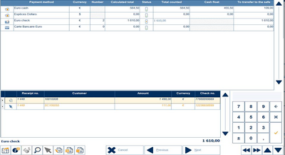

Tick off procedure for checks

When you carry out a register control at daily closing, you have the choice between two management options for the payment method of type Check:
- Entry of the total amount: If the total amount of the checks equals to the theoretical amount, the cashier enters this amount into the Total counted column In this case, all checks are automatically ticked off and put into to the safe.
- Ticking off the checks: the cashier ticks off the checks one by one in the detail, using the buttons described hereafter, and then transfers the amount (cumulative amount of the verified checks) to the header grid. Any movement in the grid is blocked until the cashier has ticked off all checks of deleted the missing checks.

This button is used to tick off a check. It is then counted in the sum of the amounts ticked off.

This button works differently depending on whether you are in register control or in safe control:

- In register control : Changing the amount of a check results in the creation of two discrepancy receipts of type register discrepancy, one is negative for the wrong amount and the other is positive. These differences will appear on the on the daily closing receipts ( register discrepancy receipts and list of payments.) From a fiscal point of view, this method has the advantage of keeping the receipt in its original sate without modifying the payment.

Example: check written with an amount of €70, when in reality it is €60. This generates a receipt with a negative difference of -70 and a positive difference of 60.
- In safe control : Changing the amount of a check results in the creation of two discrepancy receipts of type Safe discrepancy, one is negative for the wrong amount and the other is positive.

Example: check written with an amount of €70, when in reality it is €60. This generates a receipt with a negative difference of -10.

This button is used to add a payment, in case of check from a previous day is found. Once entered, it appears in the detail grid without receipt number. The application generates a discrepancy receipt.

This button is used to delete a payment if it has been saved, but the corresponding check cannot be found. The amount of the missing check must be deducted from the total so that the status of the line changes to orange. This operation generates a discrepancy receipt.

This button is used to validate and transfer to the header grid the amounts ticked off in the detail grid.

Possible messages
- “You must tick off all checks or delete missing checks”: this message displays if there is a difference between the amount entered and the theoretical amount.
- “Amount entered is different from the sum of the checks ticked off”: this message displays if you enter check with a negative amount. For example, a customer says that he pays with a check. The cashier edits the sales receipt, but he customer realizes that be cannot write the check. The cashier then enters an item return by check. At daily closing, the check appears in the detail grid and tis amount in the total. The status is red.
- “Do you confirm the deletion of this line?” and “Did you already entered a receipt to cancel this check in the amount of XX ?”: these messages are displayed when it is necessary to delete the amount of a saved check, but cannot be found.

Special cases
- Checks remitted to the safe during the day do not appear in the detail grid.
- A check registered then canceled while the register is in standalone mode does not appear in the control when the register is back in connected mode.
- Checks with negative amounts are not displayed in the list of checks and are counted in the theoretical amount. Moreover, they can block the control process of the register, and thus the closing of the day.

### Managing Cashboxes

#### Contents

Cashbox - Contents

Cashbox management refers to the concept of a floating cashier. A cashier must be able to use a cashbox on a given register. Consequently, the cash drawer is separated from the POS (physical hardware) so it (cashbox) may become mobile. In addition, counting cashboxes may be done at any time during the day, independently of the daily closing. Registers include the following fixed elements:
- POS: Physical hardware with devices
- Sales session: Cashier makes sales and takes payments.
- Cashbox or cash drawer: Contains payments

The sales session is put on hold and the associated cashbox is removed from the POS by the cashier, who then puts it into the safe during their break. Another cashier can then use the POS.

Attention!

Countries using tax printers (which registers a part of the cashbox, e.g. cash payments) cannot use cashbox management. Cashbox management must therefore be disabled for the branch or store (see Cashbox Settings ).

Cashbox Settings

Cashbox settings
- Company settings
- Stores and subsidiaries
- Cashbox creation
- Access rights and event log

Cashbox operation
- Operating principles
- Commands where cashbox settings are available

Cashbox actions
- Cashbox preparation
- Cashbox daily opening
- Cashbox daily interruption without control
- Changing cashiers on the fly when entering a sales transaction
- Sales day recovery on another cashbox by another cashier
- Cashbox control
- Daily closing
- Cashbox lookup
- Managing carts on hold
- Standalone mode

#### Cashbox Settings

Cashbox Settings

Company settings

Back Office > Administration > Company > Company settings > Commercial management

Open the Front Office menu and enable the Cashbox management setting.

Stores and subsidiaries

Subsidiaries

Back Office > Basic data > Stores > Subsidiaries

If you manage subsidiaries, enable the Cashbox management option in the Characteristics tab.

Stores

Back Office > Basic data > Stores > Stores

Enable the “Cashbox management” option in the “Additions” tab.

Cashbox creation

Back Office > Settings > Front Office > Cashbox

Front Office > Settings > Registers > Cashbox

Press the [New] button to create a cashbox, then input the Cashbox , Description and Store fields.

Access rights and tracking in event log

Back Office > Administration > Users and access > Access rights management

Back Office > Administration > Event log > Log query

The following access rights allow you to authorize use of the functions related to cashbox use.

| Menu | Sub-menus | Access rights | Record in event log |
| --- | --- | --- | --- |
| Menu 26 - Concepts | Commercial management/Cashbox | Reassign a cashbox to a salesperson different from the original one. |  |
| Menu 102 - Sales | Retail sales/Cashbox | Control Enter cashbox cash float Query daily cashbox operations |  |
| Menu 105 - Settings | Front Office | Cashbox |  |
| Menu 107 - Sales receipts | Daily operations/Cashbox | Interruption Retrieve Cashbox control Query daily cashbox operations |  |
| Menu 112 - Settings | Registers | Cashboxes |  |
| Menu 113 - Follow up actions | Sales receipts/Daily opening-closing | Daily opening on interrupted cashbox session with counting Daily opening on interrupted cashbox session without counting Daily closing with cashbox control Daily closing without cashbox control Daily closing without cashbox | Yes for all actions |
| Cashbox | Interruption of sales day w/ counting Interruption of sales day w/o counting Day recovery on interrupted cashbox session with counting Day recovery on interrupted cashbox session without counting Recovery of sales day w/closed cashbox Cashbox control Salesperson change on interrupted cashbox session | Yes for all actions |

#### Operating Principles

Cashbox Operation

Operating Principles

In Cegid Retail Y2, the following concepts are dissociated in cash registers:

POS and cash register session

The current cash register number becomes the POS number. It is completed by the Windows identification for the cash register displayed in the cash register configuration screen, then copied to the cash register session record.

Cash register session

It will keep its initial identifier, allowing you to manage the status of the day for each cash register. Both these concepts are linked, in order to manage any printers or tax boxes. The assignment to cash register operation remains available in case the central unit is changed on the POS (always connected to the same devices).

A cash register session enables you to manage sales and associated payments. On the other hand, it requires that you no longer perform cash register checks during the daily closing because payment totals depend on the cashbox.

Cashbox

It is identified via a unique number, identical to the cash register number. The cashbox is separated from the POS, allowing you to perform the following operations:
- Multiple cashiers per day on a POS.
- Verifying the cash register separated from the daily closing.

Example:

Cashier 1 opens the day with their cashbox C01.

Cashier 1 is replaced by cashier 2 with the cashbox C01.

Cashier 2 is replaced by cashier 1 with the cashbox C01.

Cashier 2 verifies their cashbox.

Cashier 1 closes the sales day without counting the cashbox.

Cashier 1 opens the day with their cashbox C01.

Cashier 2 closes the day and counts cashbox C02.

As for cash register sessions, cashboxes are managed in a cash register session via the following status:
- Open: in use
- Closed: cashbox verified

Commands where the Cashbox criterion is available

Back Office

Sales > Retail sales:
- Query receipts and receipt lines
- Modify receipts
- Modify payments

Front Office

Sales Receipts > Sales:
- Query receipts and receipt lines.
- Cancel a receipt.
- Assign customer.
- Modify salesperson.
- Items sold.
- List of payments
- Modify payments
- List of deferred checks

#### Cashbox Operations

Cashbox Actions

Front Office > Sales receipts > Daily operations

Back Office > Sales > Retail sales > Cashbox

This section lists the various actions that can be performed with cashboxes in Back Office and Front Office.

Cashbox preparation

Back Office > Sales > Retail sales > Cashbox > Enter cashbox cash float

This Back Office command enables you to prepare cashboxes by entering a cash float.

Opening a business day with cashbox

Front Office > Sales receipts > Daily operations > Opening

Procedure

Step 1: Cashier selects their name from the employee list, then clicks the [Next] button.

Step 2: Select cashbox from those available and associated to the store (available cashbox status not “Current”). When the cashbox is selected, the last salesperson assigned to the cashbox will be displayed for information.

The salesperson continues to open the register as usual, entering the cash float attributed to the cashbox selected (and not register). It is therefore important to verify and print the cash float receipt, which shows the cashbox and register numbers.

At this point, you can verify the cashbox status (current) from: Sales receipts > Daily operations > Query daily operations on cashboxes.

If a cashbox has already been assigned to another cashier, user access rights can allow the register to be re-assigned. The original cashier will therefore no longer be assigned to the cashbox.

Please note!

The new cashier will inherit the cashbox and its status. If the cashbox has not been counted, the new cashier will be prompted to do so. Control of the cashbox will be transferred to the new cashier’ sales session, including information to differentiate errors of the current cashier from those of the previous cashier. A record will be written to the event log, explaining that the cashbox has been verified. If there is a difference, the corresponding receipts will be registered. If a cashier inherits a cashbox that has not been closed or counted, this information will appear in the event log.

Cashbox daily interruption without control

Cashbox daily interruption without control

Front Office > Sales receipts > Daily operations > Interruption

Cashier 1 leaves his post, but takes the cashbox. Daily operations will then be interrupted to separate the cashbox from the POS. The previous register (POS) and cashbox sessions change to interrupted status.

The day (register session) is put on hold and displayed in “Query daily operations” in Back Office (Sales > Retail sales). The number of interruptions is unlimited during the day and register verifications are not required. An interruption may be done by any employee (with authorization).

Procedure

The command displays the various cashiers available. The new cashier selects their name, then the [Next] button.

During the next step, the cashier selects the cashbox. After pressing the [End] button, cashbox control is proposed.

At this point, the cashbox status may be checked (interrupted) in Sales Receipts > Daily operations > Query daily operations on cashboxes.

Changing cashiers on the fly when entering a sales transaction

Front Office > Sales receipts > Enter transaction

The cashier may be changed when entering a sales transaction. This operation is transparent. You do not need to go to the cashbox re-assignment phase, or cashbox control. Sales lines entered are attributed to the new cashier.

Sales day recovery on another cashbox by another cashier

Front Office > Sales receipts > Daily operations > Recovery

This command displays the various cashiers available. The new cashier selects their name, then the [Next] button.

During the next step, the cashier selects the cashbox. After pressing the [End] button, cashbox control is proposed. It is recommended to verify the cashbox when the selected salesperson is different than the one assigned to it previously.

You cannot recover a cashbox if another is in operation on the register.

At this point, you can verify the cashbox status (current) from: Sales receipts > Daily operations > Query daily operations on cashboxes.

Cashbox control

Front Office > Sales receipts > Daily operations > Cashbox control

Back Office > Sales > Retail sales > Cashbox > Check

This command enables you to count a cashbox. This operation is independent from a daily opening and may be done any time during the day on any store POS (or Back Office station). It consists of counting the cashbox as part of cashbox verification. The cashbox contents are calculated from receipts entered since the last cashbox verification was done. Managing financial receipts (including discrepancy receipts) depends on the register session:
- The cashier uses an open register. Financial receipts are assigned to the register sessions (POS).
- The register used is not open or the cashier is using a Back Office station. The financial receipts issued do not depend on the sales day. They are not visible in the Flash report and Z receipt.

Payment verification puts the cashbox into closed status. It is always assigned to a cashier, with a cash float if necessary. Bank remittance is done after the count and safe management is done.

Procedure

This command displays the various cashiers available. The cashier selects their name, then the [Next] button.

The next step is to select the cashbox to verify (all cashboxes are proposed: unverified and not closed, interrupted or in operation).

After pressing the [Next] button, the register cash window displays the various totals registered in the cashbox by payment method.

Validate the cash float, then print the list of payments. According to settings, bank remittance will be displayed.

At this point, you may verify the cashbox status (closed) from Sales Receipts > Daily operations > Query daily operations on cashboxes.

Note that you may verify cashboxes in Back Office (Sales > Retail sales > Cashbox/Check), especially in the case where a cashier has opened 2 cashbox sessions (e.g. a closed one and an interrupted one .)

Daily closing

Front Office > Sales receipts > Daily operations > Closing

When closing registers, the following scenarios may arise.

Cashbox already checked

No cashboxes will be offered for verification.

Cashbox not checked

A message will be displayed prompting cashbox verification. According to settings, you may:
- Perform cashbox verification: the day and the cashbox take the Closed status.
- Defer verification: the cashbox remains in an open state ( Interrupted. ).No bank remittance, register control or safe deposits will be done.

Querying cashboxes

Front Office > Sales receipts > Daily operations > Query daily operations on cashboxes

Back Office > Sales > Retail sales > Cashbox > Query daily operations on cashboxes

This command enables you to query cashbox status according to numerous selection criteria.

Managing carts on hold

Carts on hold are associated to a cashbox, just as any other sales receipt. In case of cashbox interruption, carts on hold may be taken to another cashbox.

Standalone mode

When going to standalone mode, receipts will remain assigned to the current cashbox. Receipts will be re-assigned to their original cashboxes during integration.

### Standalone Mode

#### Contents

=> See also procedure no. 295 (Managing the Passport in Standalone Mode)

=> See also procedure no. 313 (Connecting in Standalone Mode)

=> See also procedure no. 326 (Files in Standalone Mode)

=> See also procedure no. 367 (Calculation of Price List Aggregates)

Standalone Mode - Contents

Cegid Retail Y2 products will be used in real time, directly connected to the database. If the network goes down, Cegid Retail Y2 will switch to standalone mode. This enables in-store operations to continue. The system will re-synchronize when the network becomes available again.

Only Front Office will be used in standalone mode. Under certain conditions in standalone mode, some data such as customers or items, as well as business features (e.g. Register opening and closing) will be available.

You will find all appropriate information in the following sections.

Standalone mode settings
- Standalone mode options
- Store record
- Register settings
- Access rights

Item management in standalone mode
- Management principle
- Price list aggregates - V1
- Price list aggregates V2 (suited to large distribution networks)

Customer management in standalone mode
- Defining customer exports
- Customer record in standalone mode
- Customer identification elements
- Customer differential export

Loyal customers in standalone mode
- Loyalty card management
- Loyalty rates in standalone mode

Standalone mode operation
- Searching for an item
- Exporting register settings
- Switching to standalone mode
- Restoring communications
- Closing a sales day

Using outstanding payments in standalone mode
- Required settings
- Using the payment
- Integration of the receipt

Integration of sales receipts
- Automatic receipt integration while reconnecting
- Interactive integration
- Saving history
- General aspects

Close-up on files and directories
- Creating and using files
- File list
- Directory structure

More about Standalone mode
- Management principle of taxation exceptions
- Sales conditions management in standalone mode
- CBS in standalone mode
- Features available in standalone mode

#### Standalone Mode Settings

Standalone Mode Settings

Configuring options in standalone mode

Back Office > Administration > Company > Company settings

Go to Commercial management > Front Office standalone mode and populate the settings specified here :

settings specified here

Configuring standalone mode in stores

Back Office > Basic data > Stores > Stores

Tick the Counter per store option in the Contact Information tab in the store record. This step is required to use standalone mode on the registers linked to this store.

Counter per store

Defining register settings

Back Office > Settings > Front Office > Register

This section describes the operations to perform on the registers concerned to activate and define options for standalone mode, and configure the input of sales receipts if you want a display in standalone mode that differs from the display in connected mode.

Activating standalone mode on registers

Standalone mode tab

Before activating the standalone mode in the Register record, you need to have previously checked the Counter by store option in the store record (see previous section.) Otherwise the following message will appear: “Option "Counters by store" must be checked in the store record to be able to activate the standalone mode.”

Once this operation is done, open the register record of your choice and select the Standalone mode tab, and populate the settings described in topic Standalone Mode Tab .

Standalone Mode Tab

Securing receipt integration

Preferences tab

In order to secure the integration of receipts after a loss of connection, it is recommended to activate the Mono-session setting, available in the Preferences tab of the register settings.

Mono-session

Configuring receipt input display (Optional)

[Configure receipt input] button

In order to better differentiate between the transaction entry window displayed in standalone mode and the one in connected mode, you can configure screen settings in both modes.

Select the register in question, then click the [Configure receipt input] button to display the sales transaction input window. The configuration of the transaction entry interface in connected mode and standalone mode is explained in the Register Settings, in chapter Configuring the receipt input, more specifically in the following paragraphs:
- Defining Grid and Background Properties : This paragraph explains how to set the background color for the sales receipt entry interface, in connected or standalone mode.
- Defining the Properties of Displays : This paragraph explains how to configure the various displays located on the input screen of the sales receipts interface.
- Switching to Standalone Mode : This paragraph explains how to view what the standalone configuration will look like, using previously seen features (Defining grid and background properties and Defining properties of displays.)

Managing access rights

Back Office > Administration > Users and access > Access right management

The following access rights allow you to authorize use of the features relating to standalone mode.

| Menus | Sub-menus | Access rights |
| --- | --- | --- |
| Menu Concepts (26) | Commercial management - Document entry | Deleting receipts entered in standalone mode: This concept authorizes the user group to delete these receipts before they are integrated. |
| Menu Settings (105) | Front Office | Offline customer criteria: You need to create customer export rules so that customers will be available in standalone mode on each register. This access right enables you to authorize user groups to configure this setting. |
| Menu Administration (106) | Performance | Identifying workstations operating in standalone mode: This access right enables you to authorize user groups to query workstations that have switched to standalone mode. |
| Menu Sales receipts (107) | Access rights/Miscellaneous | This menu authorizes user groups to access the following options: Force switch to standalone mode: Enables you to manually switch to the sales receipts screen in Front Office in standalone mode. Modify thresholds for management rules on customers in standalone mode: you may authorize user groups to change thresholds configured in customer export rules. |
|  | Daily operations | This menu authorizes user group access to Front Office > Sales > Daily operations (Sales integration/Interactive and History.) |
|  | Access Rights/Register operations | Ignore authorization number for outstanding payment: Authorizes/denies user groups to bypass authorization number controls. |
| Menu Follow up actions (113) | Administration/Link to accounting | Standalone mode (post-integration closure): This menu authorizes the generation of accounting closure events in the event log. |
|  | Sales receipts/Standalone mode | This menu authorizes the generation of events in the event log for the following actions: Switch to standalone mode, Integration of the receipt, Deletion of sales receipts Control of exported customers/items |
|  | Sales receipts/Outstanding balances | Allocate an authorization number for standalone mode: Authorizes the generation of events in the event log to track authorization numbers allocated in standalone mode. |

#### Item Management in Standalone Mode

##### Management Principle

Item Management in Standalone Mode

Management principle

The objective here is to have items valued at prices available when Front Office is no longer in connected mode. Price aggregates allow you to calculate prices usable in standalone mode. This way you can:
- Determine items that will be available in standalone mode. For reliability and performance issues, items are not recovered in full from the database. Based on criteria defined in section Item selection you will determine the items that can be used in standalone mode.
- Calculate the price of these items, considering the option selected (price from the item record or price list calculation.)
- Determine item information that will be available in standalone mode.

Please note!

It is strongly advisable that each store is covered by just one price list aggregate rule.

Check according to the groupings used that every store is referenced only once.

However, if the brand has points of sale located on different continents, it can be difficult to find a time slot during which there are no stores open for customers and during which the aggregate calculation process can be started without affecting the speed of sales input.

If this is the case, it is possible to create several, independently programmable, aggregate settings. However, it is essential that each store is covered by just one aggregate rule only. Otherwise, the calculations could be false.

Keep in mind that the calculation of the aggregates automatically calculates the loyalty prices if this type of prices is referenced in the store.

Defining the export rule

To download item information on registers in standalone mode, you must create strategies for selecting items.

The main criteria for downloading items are the following: item criteria, availability in stock, items moves in certain document types.

Items are selected for all the registers, and then price lists are calculated. You will then get a combination of items/price lists per strategy.

When opening (or closing) the sales day, the register recovers all the items/price lists of the strategy defined based on the selections made in the register settings ( Standalone mode tab .)

Standalone mode tab

Please note!

There are two modules for configuring the export rule. Please note that the management of the V2 price list aggregates has been created to adapt to the constraints of large store networks. Indeed, the management of previous aggregates (V1) is no longer operational for large distribution networks with a hundred or more stores, and whose price lists are sent by the ERP to Cegid Retail Y2 for each store.
- Price list aggregates - V1
- Price list aggregates V2 (suited to large distribution networks.)

##### Price List Aggregates V1

Price List Aggregates V1

Back Office > Administration > Scheduled tasks > Price list aggregates

Please note!

This command is subject to the Price list aggregates access right, available in menu Administration (106) > Scheduled tasks section.

Defining the price list and item export rule

Procedure
1. Click this button to create a new rule.
2. Enter a code and a description.
3. The Active box is automatically selected when a price is selected (Tax excl. sale/ Tax incl. sale.)
4. If this setting is unchecked, it deactivates all calculations.
5. Then enter the settings shown in the various tabs.

Settings tab

The Settings tab allows you to specify a selection of data to be made available in standalone mode:

| Fields | Description |
| --- | --- |
| Item selection | First of all, it is possible to limit the export of items to a category, a collection, a department, etc. Other criteria are then proposed: Bill of materials: Allows you to include bill of materials-type items in item selection. Linked items: Allows you to include linked items in item selection. If this box is not checked, the link between one item and its linked item will not be loaded. Only items in stock: Enables you to restrict the selection to items in stock. Unless transfer since: Allows you to include items that have been transferred since MM/DD/YYYY. Document types: Types of documents to be taken into account for inventory movements. Maximum number of single and dimensioned items per export: limits the number of items downloaded onto the register. By default, this option allows downloading the first x items of the strategy; the others will not be taken into account. The value of the threshold will have to be increased manually to recover all the items. If the maximum threshold of exported items is exceeded, the information will be logged to the event log (in the Access rights management module, activate in menu 113: Follow up actions/Sales receipts/Check exported customers/items.) Please note! In some cases, items that were not in your selection, will be exported anyhow. Example: if the “Bills of materials” criterion is checked, and department “Ladies” is excluded, items of that department will be exported if they belong to bills of materials. |
| Selection of stores | Grouping: Allows you to select one or more store groups (user-defined tables for stores.) Stores: Allows you to select one or more stores. |
| Price selection | Price in item record or Price list calculation: If option Price list calculation is selected, you must also specify time for the calculation of price lists. If the specified time is exceeded, the price list will be calculated for the next day. Purchase: Calculates purchase prices Tax exclusive sale: Calculates tax exclusive selling prices Tax inclusive sale: Calculates tax inclusive selling prices |
| Programming | Use this button to set the scheduled task. |

Once the criteria have been filled in, this button starts the process manually.

Please note!

To ensure that the current price lists are always up-to-date, it is recommended that you schedule a daily task.

Exported data tab

In this tab, the item data settings that have to be exported are associated with an aggregate setting.

This screen allows you to define which information from the item record will be loaded on the register at daily opening.

Keep in mind that the more information needs to be sent, the longer it will take to load at the daily opening.

| Fields | Description |
| --- | --- |
| Item information | You can choose any setting you like except for these two settings, which are checked by default: Barcodes: Barcodes for single or dimensioned items Description: Designation of the item |
| Item referencing | Enables you to define the referencing types to load: customer, supplier, company, as well as item description in listings. |
| User fields | User fields are used in sales conditions and therefore must be exported. You may export up to 5 user fields (see User fields .) |

User-defined tables and fields tabs

Both these tabs allow you to select the data that will be exported and usable in standalone mode, notably for the use of sales conditions.

Deletion of an aggregate calculation (V1 or V2)

Refer to the procedure described in V2 .

Refer to the procedure described in V2

##### Price List Aggregates V2

Price list aggregates V2

Back Office > Administration > Scheduled tasks > Price list aggregates V2

The management of the V2 price list aggregates was created to adapt to the constraints of large store networks. Indeed, the management of V1 aggregates is no longer operational for large distribution networks comprising a hundred or more stores, and whose price lists are sent by the ERP to Cegid Retail Y2 for each store.

The new calculation of V2 price list aggregates has been created according to the following proposals/assumptions:
- Create a new calculation of aggregates in addition to the current one, based on the same tables.
- Speed up the processing by delegating the deletion to a recurring purge operation.
- Simplify the restitution by systematically generating price list per store.
- Simplify the current filters, by allowing the calculation to be parallelized.

Important!

This command is subject to the Price list aggregates (V2) access right, available in menu Administration (106) > Scheduled tasks section.

Defining the price list and item export rule

Procedure
1. Click this button to create a new rule.
2. Enter a code and a description.
3. The Active box is automatically selected when a price is selected (Tax excl. sale or Tax incl. sale.)
4. If this setting is unchecked, it deactivates all calculations.
5. Then enter the settings shown in the various tabs.

Settings tab

This tab allows you to specify a selection of data to be made available in standalone mode:

| Fields | Description |
| --- | --- |
| Item selection | Bill of materials: Allows you to include bill of materials-type items in item selection. Linked items: Allows you to include linked items in item selection. If this box is not checked, the link between one item and its linked item will not be loaded. Only items in stock: Option checked by default to restrict the selection to the items in stock. Consider the deliveries/transfers expected by the store: Check this option if you want to take into account the items that are on standby for delivery/transfer (all warehouses) in the store. |
| Selection of stores | Grouping: Allows you to select one or more store groups (user-defined tables for stores.). Stores: Allows you to select one or more stores. |
| Price selection | Price in item record or Price list calculation: If option Price list calculation is selected, you must also specify time for the calculation of price lists. If the specified time is exceeded, the price list will be calculated for the next day. Tax exclusive sale: Calculates tax exclusive selling prices Tax inclusive sale: Calculates tax inclusive selling prices |
| Programming | Use this button to set the scheduled task. |

Once the criteria have been filled in, this button starts the process manually.

Please note!

To ensure that the current price lists are always up-to-date, it is recommended that you schedule a daily task.

Exported data tab

In this tab, the item data settings that have to be exported are associated with an aggregate setting.

This screen allows you to define which information from the item record will be loaded on the register at daily opening.

The more information there is to be sent, the longer it will take to load at the daily opening.

| Fields | Description |
| --- | --- |
| Item information | You can choose any setting you like except for these two settings, which are checked by default: Barcodes: Barcodes for single or dimensioned items Description: Designation of the item |
| Item referencing | Enables you to define the referencing types to load: customer, supplier, company, as well as item description in listings. |
| User fields | User fields are used in sales conditions and therefore must be exported. You may export up to 5 user fields (see User fields .) |

User-defined tables and fields tabs

Both these tabs allow you to select the data that will be exported and usable in standalone mode, notably for the use of sales conditions.

How the calculation of aggregates works in V2

Each rule follows an algorithm based on the assumption that each store manages its list of items, established according to the presence of the item in stock.

Search for new items to be integrated by store

Search by store for items in stock (and expected, if the option checked), but not present in the table of aggregates for the store. This list of items to be calculated is completed with the following elements:

by store
- The linked items of the items in stock
- Service and financial items without restrictions
- Unclosed bill of material items, if bills of material have been requested.

Calculation of prices lists with a rule
- The calculation of the aggregates is carried out, for each store of the rule, by group of items (pages of 1,000): Calculation of the aggregates from the sales price lists.
- Systematic search for the current item price list (day/next day depending on the option): Calculation of the aggregates starting from the prices in the item record.
- Search for the price in the item record, converted into the currency of the store: Update in the table of aggregates, only for new price lists or price lists different from those already present in the aggregates
- Note that the next price lists not searched.

Logging actions

Back Office > Administration > Event log > Log query

A summary of the operations carried out is inserted in the event log, with a record per pricing system (exclusive of tax/inclusive of tax)):

<MM/DD/YYYY hh:mm:ss AM or PM> Price list calculation per store – Rule <Code> <Description>
- <Store code> <Store description> : <250> lines added - <400> price lists calculated …

<MM/DD/YYYY hh:mm:ss AM or PM> Price list calculation per store – Rule <Code> <Description>

<MM/DD/YYYY hh:mm:ss AM or PM> Price list calculation per store – Rule <Code> <Description>
- <Store code> <Store description> : <250> lines added - <400> price lists calculated …

<MM/DD/YYYY hh:mm:ss AM or PM> End of processing

Deletion of an aggregate calculation (V1 or V2)

The deletion of an aggregate calculation is a heavy process that can lead to timeouts Therefore, this process is performed via a scheduled task, during non-peak hours.

Procedure
1. Press this button to delete the aggregate calculation.
2. Confirm the message that appears. This action must be scheduled during non-peak hours. Do you confirm the processing?
3. The aggregate is immediately deleted from the list, and a scheduled deletion task is generated.
4. In order to trace the deletion, information is stored in the event log, and can be viewed from the menu Administration > Event log > Log query.

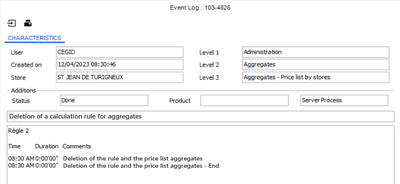

#### Customer Management in Standalone Mode

Customer Management in Standalone Mode

The best practice consists in limiting the customer export to the customers of the store, adding if need be, customers who came to the store the last X days. However, the number of exported customers cannot exceed 100,000. If this number is exceeded, and despite a successful export, starting Front Office in standalone mode may generate a memory overflow. In this case, cashing in standalone mode would not be operational.

Defining customer exports

Step 1: Define a customer export rule

Back Office > Settings > Front-Office > Offline customer criteria

You need to create customer export rules so that customers will be available in standalone mode on each register. To do this, please fill in the following tabs.

Customer Settings tab

The first tab allows you to define various rules for managing customers in standalone mode. The objective of these rules is to specify a selection of customers to be copied to each register. This selection is based, among other elements, on a certain number of customer criteria defined in a customer trigger whose scope is set to “Standalone mode”.

| Field | Description |
| --- | --- |
| Selection of customers matching | Options to enable based on the selections you want to make: The condition on criteria: if you want to select only the customers who match criteria defined in the Selection on criteria pane. The condition on activity: if you want to take into account only the elements defined in the Selection on activity . Both conditions: if you want to use the condition on criteria and the condition on activity. One of these two conditions: if you want to use one or the other condition. |
| Selection on criteria | The customers to export for standalone mode are selected according to various criteria such as: Customer trigger: In order to download only the most relevant customers in standalone "mode, select a customer trigger from the drop-down list; (the trigger must have a “Standalone mode” scope of use.") Use this button to access the setup screen for customer triggers (see Triggers ). Consider prospects: Tick this option if you want to include prospects within the selection. These criteria can be combined with a selection of stores used to target a specific group of customers. All stores: There is no restriction on customers based on stores. Stores of the restriction: Concerns the stores defined in the Store restrictions pane. Store linked to the register: Is used to limit the customers to the store linked to the register. |
| Selection on activity | The customers to export for standalone mode are selected according to an activity (receipt, order, reservation, etc.) since a given period. Number of days since the last visit : defines the period to take into account for the selection of customers. (For example, 3 days, 30 days...) This selection can be combined with the selection of stores ads previously in the selection on criteria. |
| Store restrictions | This pane will be grayed out, if the selections about criteria and activity do not use restrictions. Otherwise, it is used to define a restriction based on the selection of a grouping or stores. For example, the grouping Location type is used to select stores downtown and/or in a mall. |

Exported data tab

This tab allows you to set the field to be copied. As for items, you have the option of downloading various elements:

| Field | Description |
| --- | --- |
| Customer information | Title: T_JURIDIQUE Address T_ADRESSE1 to 3, T_CODEPOSTAL, T_VILLE, T_PAYS E-mail address: T_EMAIL Telephones: T_TELEPHONE, T_FAX, T_TELEX Passport: T_PASSEPORT User-defined tables: YTC_TABLELIBRETIERS1 to 10 User-defined amounts: YTC_VALLIBRE1 to 3 User-defined dates: YTC_DATELIBRE1 to 3 User-defined texts YTC_TEXTELIBRE1 to 3 User-defined Booleans: YTC_BOOLIBRE1 to 3 The main information will be copied systematically: Individual customer: T_PARTICULIER Code: T_TIERS, T_AUXILIAIRE Last name/First name or Company name: T_LIBELLE, T_PRENOM Last name 2/First name 2: T_NOM2, T_PRENOM2 A specific process is carried out for the register’s default customer: It is systematically exported, even if it does not meet any of the rule’s criteria. All the fields for this customer record are exported. |
| User fields | Selected customer user fields are available in standalone mode (10 fields maximum are exported.) In standalone mode, these fields are available only when you create a customer (they are not available when viewing customer information.) The fields with the following types can be exported: Numerical, Boolean, date, string and selection lists not associated with a subtable, or associated with a subtable linked to tables COMMUN, CHOIXCOD, and CHOIXEXT. |
| Controls | The settings for the third-party user-defined tables are exported systematically. To avoid overly-long processing times, there are two settings that allow you to control the quantity of customers per store to be copied: Warning if number of customers is superior to: if the number defined is exceeded, a warning message will be displayed. Locking if number of customers is superior to: if the number defined is exceeded, customer information will not be copied. These settings may be viewed only, except for users that have the proper access rights (see access rights: Modify thresholds for management rules on customers in standalone mode .) |
| Simulation | A simulation feature is also available allowing you to enter a register in order to control the number of customers concerned. The simulation is started as soon as the entry is validated and the result is displayed in the Result field. Attention! The value in the Result field does not match the number of customers exported to the register. Indeed, some customer may have been already copied to the register, if the company setting Customer differential export is enabled in the Commercial management > Front Office standalone mode. |

Step 2: Define registers settings

Back Office > Settings > Front Office > Register > Standalone mode tab

Select a register and populate the following fields:

| Field | Description |
| --- | --- |
| Rules for exporting customers | Select here the rule configured in the previous step. Customers are systematically exported when a sales day is opened if an export rule is associated to the register . Customers will not be available in standalone mode for all other registers. |
| Aggregate recovery | The Customer aggregate must be selected for the register opening and/or the register closing. |

Customer record in standalone mode

The creation of a customer in standalone mode is possible through a simplified record, regardless of the value of the Simplified customer record option available in the General tab of the register settings.

The data displayed in the customer record in standalone mode is conditioned by the setup described above, defined in the Exported data tab of the customer management in standalone mode.

If data is not ticked as data to be exported, but is set in the customer search priorities, then this information will be sent however and will be available in the customer records.

If there has been no customer export on the cash register, a click on the customer will open the record in creation mode.

The Creating customer forms by double validation in Front-Office company setting, available in Commercial management > Customers/Suppliers, is not taken into account in standalone mode.

Creating customer forms by double validation in Front-Office

Modifying or deleting a customer in standalone mode is possible only for a customer that has just been created in standalone mode and has not yet been integrated.

Reminders regarding access rights

The creation of a customer record is subject to the following access right: Menu Concepts (26) > Commercial management > Customers > Create customers .

Menu Concepts (26) > Commercial management > Customers > Create customers

Viewing an exported customer record is subject to the following access right: M enu Sales receipts (107) > Access rights > Enter transaction > Show customer.

enu Sales receipts (107) > Access rights > Enter transaction > Show customer.

Management of user fields
- Customer creation : When creating a customer in standalone mode, all elements set in the export rule are downloaded and usable. If the user fields are part of the data to export, a new tab is displayed in the customer record, and the notion of mandatory field defined in the user field settings is included in this screen.
- Customer lookup : When viewing a customer record in standalone mode, the User fields tab is not displayed.

Customer identification elements

Back Office > Settings > Customers > Search priorities

The only criteria that can be used in standalone mode to search for customers are the customer code, the last name, the official document number (passport for example) and the loyalty card number. Any entry of criteria other than these will result in the opening of the multi-criteria customer search screen, even if the criterion is included in the search priority settings.
- The Last name field will then be pre-filled with the value entered, if at least one alphabetical character is entered (e.g. the e-mail address).
- The Customer code field will be pre-filled if you enter only a numeric character (for example a phone number).

Customer identification

The customer can be identifier with an official document or with the number of their loyalty card. For better search performance, an index is created either from loyalty card numbers, or from names.
- Official document: The presence of this criterion in the search priorities causes the export of that informative element. The store search priority is taken into account if it is specified. Otherwise, the priority defined in the company settings will be used.
- Loyalty card number: If this criterion is selected in the search priorities, then only active loyalty cards (from the loyalty program linked to the register store) on the date of the customer export will be exported.

Customer differential export

Back Office > Administration > Company > Company settings

This option available in the Company settings Commercial Management > Front Office Standalone mode, allows you to limit the export to only the updated customer records. Customers are selected from their update date which must be superior or equal to the date of the latest export as written to the register record. (Standalone mode tab - Date of the last customer export.)

#### Loyal Customers in Standalone Mode

Loyal Customers in Standalone Mode

Loyalty functionalities (acquisition calculations, benefit proposals, card renewal, or program change) are not available in standalone mode.

Loyalty points earned on sales receipts entered in standalone mode will be calculated during receipt integration.

Loyalty card management in standalone mode

Creation of a loyalty card

In standalone mode, no card creation will be proposed. The loyalty card will be created when sales transactions (receipts) are reintegrated; according to the program options defined.

Renewal of a loyalty card

The renewal of a loyalty card occurs either at the end of the official validity period of the loyalty card (i.e. When the expiry date of the card is exceeded), or when purchasing a new loyalty card (this new card replaces the old one, and validity dates are updated consequently.)

Setting aside a loyalty card number

Back Office > Settings > Front Office > Register

Front Office > Settings > Registers > Register

In standalone mode, you can set aside a card number to be allocated to a new loyalty card (creation and renewal.)

No setup is required, but for a more user-friendly use, you can set a [Request for card in standalone mode] button on the register touchpad. To create this button, follow the instructions described in the Configuring Touch Screen and Keyboard topic. As you know, you will select Function for the Type of button , and then Request for card in standalone mode for the Function field.

Configuring Touch Screen and Keyboard

At checkout, on a manual action from the salesperson, a window is displayed so that the operator can then enter the number of the loyalty card. This number will be saved to the sales receipt, and will be used later by loyalty processes when reintegrating the receipt. Upon integration, loyalty rules will apply according to several possible cases:
- This number will be taken into account if the card must be created or renewed. The salesperson does not have to enter the number, as the reserved number will be used.
- If the number was reserved by mistake: this number does not affect the integration of the receipt, and, the card associated with the number remains available for another customer. Information is inserted into the event log to track these errors and alert the users. This information is independent from the reintegration trace of the receipt.
- If no number was reserved, the current operating mode for the creation of the renewal of the card will apply: the entry of a number will be required.
- If there is already a loyalty card, with a number entered in standalone mode, a trace will be added to the event log, and the application displays again a message for the creation of the card and the entry of the number.

Please note!

None of the loyalty settings will be exported in standalone mode; this card creation or renewal remains without control.

Loyalty price lists in standalone mode

Cegid Retail Y2 proposes the application of the loyalty prices to owners of a loyalty card. The appropriate setting is defined in the store record.

The calculation of price list aggregates includes the calculation of loyalty prices and makes them available in standalone mode (see Managing Items in Standalone Mode .)

Managing Items in Standalone Mode

When customers are exported, the search priority is focused on the loyalty card number, and this is essential to determine if the customer is loyal.

On the register, the following cases may occur in standalone mode:
- With customer export and customer search priorities including loyalty cards, loyalty prices are automatically proposed to loyal customers.
- Without customer export and customer search priorities including loyalty cards: For stores applying loyalty prices, Cegid Retail Y2 asks the operator if the customer is loyal to apply the loyalty price. This is then traced in the event log.
- Unknown customers: Cegid Retail Y2 also asks the operator if the customer is loyal to apply this special price.

#### Standalone Mode Operation

##### Searching for an Item in Standalone Mode

Searching for an Item in Standalone Mode

Configuring a button on the register touch pad (optional)

Using the item search in standalone mode does not require any settings. However, for a more user-friendly use, you can set an [item search] button on the register touch pad.

To create this button, follow the instructions described in the Configuring touch screen and keyboard topic. As you know, you will select Function for the Type of button, and then Search item for the Function field as displayed in the screenshot below.

Configuring touch screen and keyboard

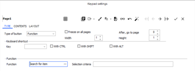

Display of the search screen

If you do not want to set up an item search button on the touch pad, perform the search as follows.

To open the item search screen when you enter a sales transaction, just click this button available in the Reference area. The screen that displays allows you to perform a search with the following criteria:

- Item code using search priorities
- Item description
- Item type
- Categories
- User-defined tables
- Dimension descriptions, if dimensions are downloaded

Once the item selected, it is returned to the sales transaction entry screen.

Search principles

You can enter only a text value for each dimension. The search will be performed on the description of the corresponding dimension.

The search is performed to find the dimensions beginning the description entered.

This search is case-sensitive.

In the case where the search result returns more than 20 items, only the first 20 results will be displayed.

##### Exporting Register Settings for Standalone Mode

Exporting Register Settings for Standalone Mode

Automatic export

Register settings are exported systematically every time the register is opened or closed.

Please note: If the register settings are modified in Front Office, the settings are automatically exported again when you validate your changes.

The export screen for standalone mode displays the following information:
- The customer export includes the number of exported customer and a progression per block.
- The item download displays the total number of items to export and a progression per block.
- The multi-referencing download shows the number of exported references.

Manual export

Back Office > Settings > Front Office > Register > Standalone mode tab

A manual export is possible at any time, using this button.

Multiple languages

Concerning translation of financial item descriptions and services in standalone mode: If exports have already been done in the store language, the system considers that re-exporting these items will not be necessary because they were already done. It is therefore recommended to delete the item export file and re-launch register settings export.

##### Switch to standalone mode

Switch to standalone mode

Possible situations

Standalone mode can be activated in the following cases:

Network outage

If connection to the server is not possible or the existing connection is lost, the user will see the following message: Attention! Server connection lost. In the body of the message, two buttons are displayed, allowing the user to:
- retry the connection using the [Retry] button,
- switch to standalone mode using the [Standalone Mode] button.

If the user chooses to switch to standalone mode, the current action is abandoned and the software is restarted without a network connection. In standalone mode, the software opens a minimized window in the taskbar, which periodically tests for the return of the connection, displaying the following message: “Testing connection...”.

If the day has not yet been opened, the cash register is offered for opening, in almost the same way as in online mode, allowing input for the sales people and the cash funds. The checkout screen then opens, allowing sales to be input in standalone mode.

The layout of the checkout window in standalone mode conforms to the current cash register settings, with a black and white LCD display to distinguish it from normal mode. Its operation is also subject to the availability of the required data.

Ad hoc standalone mode requested by the user

From the checkout screen, it is possible to switch to standalone mode with a simple manual action by the user.

To do this, click on this button and select the Force switch to standalone mode option. This feature is subject to access rights (see Access Rights / Menu 107 ). Note that it is possible to add this button to the touchpad to switch to standalone mode (see Configuring Touch Screen ).

Access Rights / Menu 107

Configuring Touch Screen

Forced standalone mode

This option, available in the Standalone Mode tab of the cash register settings (see Register Settings ), allows you to force a switch to standalone mode. Regardless of the network connection, the cash register switches to standalone mode. This option ensures that in-store payments can continue without disruption, for example, if you are carrying out works in the store.

Register Settings

Identify workstations in standalone mode

Back Office > Administration > Performance > Network Control > Identify workstations in standalone mode

This command displays all cash registers that have active settings but have not communicated with the Headquarters central server for the specified time. This screen displays in real time the cash registers that may have switched to standalone mode following a network outage. Cash registers for which standalone mode has been forced are not displayed.

Aspect specific to French Law V2

To comply with legal requirements (French Law V2 module), a store linked to the “France” adaptation model cannot remain in standalone mode for more than 30 days. After this period, the following alert message is displayed: “The maximum number of days allowed in standalone mode (30) has been exceeded.”

##### Restoring Communications

Restoring Communications

Re-connecting after communications have been restored

At checkout when the connection is restored, the application displays to the user the following question: “Do you want to quit standalone mode?"

But depending on whether or not the option Suspend reconnect proposal till the end of the day is checked in the Standalone mode tab of the register settings, the choices offered will be different:

Option not checked

When asked "Do you want to switch to Connected mode?", the user will have the following choices:
1. Return to Connected mode now: the Front-Office is closed and reopened in connected mode.
2. Return to Connected mode in 30 minutes: no reconnect proposal is made for 30 minutes, but reconnection is proposed again at the end of the current receipt.
3. Cancel: the same window reappears, after registration of the current receipt, or after the 5 minutes delay.

Option checked

When asked "Do you want to switch to Connected mode?", the user will have the previous choices, plus the following option:
1. Return to connected mode at the end of the day: the connection is no longer proposed. If the user tries to close the application, a message proposes to return to connected mode. The user can either return to the connected mode or cancel.

When reconnecting online, the receipt integration step will start (see Integration of Receipts .)

Integration of Receipts

Quitting standalone mode before communications are restored

If reconnection has failed, a message will be displayed when you quit the checkout screen using the [Close] button: “The server is not yet available. What do you want to do?” Just select the Quit standalone mode option and the application will close. Note that the daily closing has not been done.

Traces in the event log

If tracking has been activated, events will be written to the event log when reconnecting after a session in standalone mode (see Access Rights/ Menu 113 ). A line is inserted into the event log for each warning in a differentiated way to allow a batch or CBS alert to target the changes to be made. The time when the register is switched to standalone mode and the time when it is reconnected are also recorded.

Access Rights/ Menu 113

An entry can also be created if the user refuses to integrate receipts when reconnecting.

When a customer is created in standalone mode, the event log is also updated accordingly.

Finally, when a receipt is integrated and has incorrect information or invalid critical data, an entry is written to the event log, if this type of error has been selected in webapp Company settings > Commercial management >Front Office standalone mode. These events can be configured in Back Office > Administration > Users and access > Access right management, and can be viewed in Administration > Event log > Line query.

##### Closing a Sales Day in Standalone Mode

Closing a Sales Day in Standalone Mode

In standard mode

If receipts were entered in standalone mode, the daily closing will not be possible until they are integrated. In this case, the following message will be displayed: “Warning: The daily closing should not be done until all receipts have been entered into the system."

In standalone mode

If reconnection has failed, a message will be displayed when you quit the checkout screen using the [Close] button: “The server is not yet available. What do you want to do?” The user may then choose one of the following options:
- Leave standalone mode: The application closes without performing the daily closing.
- Close and leave standalone mode: The daily closing will be proposed before exiting the application.

By selecting the second option, the procedure will be the same as in normal mode, and integrates register control and safe management. Note that the bank deposit function will remain unavailable.

#### Using Outstanding Payments in Standalone Mode

Using Outstanding Payments in Standalone Mode

In standalone mode, you can use an outstanding payment (gift certificate, gift card, etc.) that was issued in connected mode.

Required settings

Register

Back Office > Settings > Front Office > Registers

To use outstanding payment in standalone mode, you must tick the Checking the link for payments option, which is accessible in the Standalone mode tab of the register settings (see Link for Payments .) If this option is not enabled, no check will be performed by Y2 in standalone mode.

Link for Payments

Payment methods

Back Office > Settings> Management > Payment methods

In the records of the payment methods concerned, the following options must be populated in the Outstanding payments tab:
- Link for payments: Select option Mandatory .
- Entry of voucher no.: Select one of the two options proposed.
- Generate a voucher if remainder: Populate the fields if you want to handle remaining amounts for the payment method.

Access rights

Back Office > Administration > Users and access > Access right management

In standalone mode, when cashing the outstanding payment, the cashier must enter some information to check the validity of the payment (voucher number, amount and authorization number.) The input of these elements is subject an access right Ignore authorization number for outstanding payment that can be accessed in Menu Sales receipts (107) > Access rights > Register operations.
- If the access right is not granted, the following message is displayed of case of inconsistent information: “Entered information is not correct. Please check your entries Do you want to enter a password to continue?" The cashier must then call for assistance a user authorized to override this right.
- If the access right is granted no consistency check will be performed.

How to use the payment

Cashing the payment

Front Office > Sales receipts > Sales > Enter transaction

If the cash register is in standalone mode when a sale is paid with an outstanding payment, a window displays where the cashier can enter informative elements about the payment (voucher number, amount and authorization number.) The cashier, then, must get in touch with the Headquarters for this information.

Call to the Headquarters to allocate an authorization number

Back Office > Sales > Retail sales > Outstanding payments

The user at the Headquarters must have access to database to control that the voucher is not used and allocate an authorization number. This number secures a minimum the use of the payment. It is made up from the amount and the certificate number. This information is provided by the Headquarters to the store.

The outstanding payment can be used in whole or in part. When integrating receipts entered in standalone mode, the issue of the payment will be automatically linked to its use on the integrated receipt and to the corresponding balance. Any remainders are generated on a new voucher (gift, deposit, etc.), or the amount used is reduced in the case of a gift card.

Select the payment in question, then click the [Additional actions - Allocate an authorization number] button. The window that displays allows you to get the payment details (dates, number), and add a comment. The validation then allocates the authorization number.

This usage is logged to the event log by inserting a line.

This authorization number is assigned to the payment. If this payment is not used after this allocation request, the number will be preserved.

If a new request is issued, this number can be transmitted again to the store, and a message in red “Authorization already granted” displays on the screen to alert the user in the Headquarters that the payment might have been used by a store in standalone mode.

The authorization number is aimed at securing the entry by the cashier, and helping the integration of receipts.

Recovery at store level

The cashier enters the information given by the Headquarters. The control is carried out on the amount in absolute value, and the amount can be positive or negative? In order to trace the attempt to use the voucher, a line is inserted into the event log.

Integration the receipt

When the application is back in connected mode, the receipt is integrated with the following checks

Inconsistent dates

If the voucher found is available, even if the expiry date is exceeded, Cegid Retail Y2 automatically links the outstanding payment found to its use in the integrated receipt.

Inconsistent authorization number

No special check, this number is aimed at managing consistency when entering information in standalone mode.

Credit note amount used = Amount available

The voucher is accepted, closed and linked to the receipt It no longer appears in the outstanding payments.

Credit note amount used < Amount available

The voucher is accepted, closed and linked to the receipt It no longer appears in the outstanding payments. According to the settings defined another voucher is created for the remaining amount.

Credit note amount used > Amount available

This occurs with gift cards in case of simultaneous use or privilege or access right elevation about authorization number consistency. During the integration of the receipt, a message alerts that the payment is not available.

Inconsistent voucher number

When integrating a receipt with an inconsistent voucher number, the following message displays and informs that the payment is not available: “Payment XXX unavailable, please select another one.”

The list of outstanding payments is then displayed where you can then select the desired payment.

In the case this payment in inferior in amount to the amount available, it is accepted with the remaining amount; another outstanding payment is then generated, if the payment method supports remainders (see above section: Required settings/Payment methods.)

If you exit without a link to payments, the receipt is saved and displayed in orange.

These actions are traced in the event log

#### Integration of Receipts

Integration of Receipts

Just remind!

In order to secure the integration of receipts after a loss of connection, it is recommended to activate the Mono-session setting, available in the Preferences tab of the register settings.

Mono-session

Automatic receipt integration while reconnecting

Receipts are integrated in two distinct phases (whose performance is shown in a progression bar.)

Phase 1: Integrating the data imprint
- Receipt header loaded into memory
- Assignment of a generic customer
- Assignment of the actual number
- Receipt header is stored in the database without calculating the temporary integration status.

This first phase makes the register unavailable. It does not require any intervention from the user and cannot be interrupted .

cannot be interrupted

Once this phase completed, a message reminds the user of any receipts that have not yet been integrated: “Some receipts have been entered in standalone mode. Do you want to integrate them?” If the user answers:
- No: The receipts can be integrated at a later time in the Front Office > Sales receipts > Daily operations > Sales integration/Interactive.
- Yes: The integration will start automatically.

Phase 2: Effective integration of a receipt

This phase starts automatically. Every receipt is recovered and the following actions are performed:
- Receipt header is loaded into memory
- Creation of the customer, if need be
- Use of the actual number already assigned
- Recalculation of the receipt with standard function
- Detection of anomalies
- Receipt is stored in the database
- Information is logged to the event log

This second phase can be interrupted based on the settings defined for standalone mode (see Activating Standalone Mode on Registers ) for later integration (see section Interactive integration) via the [Interrupt] button of the progression bar. During the integration of the receipt, the system will perform controls to determine its status.

Activating Standalone Mode on Registers
- Green: data is correct and the receipt will be integrated automatically. No intervention is required from the user.
- Orange: data has inconsistencies such as price errors, discount errors, etc. The receipt is integrated without the user’s intervention. Its status remains orange.
- Red: data is inconsistent with blocking errors (unknown item, for example). The user has to intervene if the register setting Automatic receipt integration while reconnecting is not ticked. The window that displays allows you to perform the following actions:

This button forces the receipt to be integrated with the default values defined in the company settings.

This button interrupts the integration process and hands over the control to the user.

This button moves to the next receipt without processing the error, or integrating the receipt in progress. This allows you to solve the problem later.

Interactive integration

Front Office > Sales receipts > Daily operations - Sales integration/Interactive

This feature is used to integrate sales receipts manually after the interruption of the integration process. The screen lists the sales receipts created in standalone mode that have to be integrated.

Click this button to start the second step of the receipt integration (see Phase 2 described above: Effective integration of a receipt.)

Note that the integration of items scanned with their serial number is operational. You do not have to enter the scanned numbers again. However, you have to enter these numbers if the items are handled with serial numbers, but identified by barcodes.

Customer integration

The customer record can be completed or modified during interactive integration. If the search for duplicates has been activated, and results are returned, a button allows you to view the latter when integrating in interactive mode, so that you may replace one created in standalone mode. Note that the customer associated to the standalone mode receipt can be replaced by another customer in the database. If the customer entered in standalone mode corresponds to a closed customer, the latter will be replaced by the default customer during automatic integration. Loyalty points earned on sales receipts entered in standalone mode will be calculated during integration.

Saving history

Back Office > Administration > Company > Company settings

The Number of archive days company setting may be accessed in the Commercial management > Front Office standalone mode menu. It is used to specify the number of days for which history is to be retained. Previous files will therefore be automatically purged.

Commercial management > Front Office standalone mode

General aspects
- The integrated receipt numbers are converted so that the cash float receipt numbers are shown first, followed by the receipt numbers for the day’s payments.
- The history of enables you to view and print the receipts entered in standalone mode which have been integrated. This command is available in Front Office > Sales receipts > Daily operations > Sales integration > History.
- The CbRReceiptAfterPrint, CbrReceipt.BeforeValid and CbrReceipt.AfterValid events are now called up during receipt integration in standalone mode. This allows you to add tests and patches created using Cegid Studio (CBS.)

#### Close-Up on Files and Directories

Close-Up on Files and Directories

Creating and using files

Files are now created in the following sub-directories: C :\ ProgramData\CEGID\FOS5\ Database_Name

Files used in standalone mode reside in the same directory.

File list

Files with the register code “xxx” as their suffix are located at the root of this directory:

| Files | Description |
| --- | --- |
| Crtlxxx.dat: | Control “receipt”, which keeps track of all receipts entered in standalone mode, with a purchase summary (quantity of items, total amounts including tax and excluding tax) and the status of integration. |
| FOCnfxxx.dat, FOStructxxx.dat FOCnfxxx.sos, FOStructxxx.sos FOCnfxxx.err | Register settings, extracted from the base during daily opening or closing. The FOCnfxxx.sos and FOStructxxx.sos files (copies of the .dat files) are created at the end of register export if the export is complete. If the export fails (information available in the event log), and if these .sos files exist, they are copied in their respective .dat files, otherwise the .dat files that would have been generated remain unchanged. A FOCnfxxx.err file is always created = copy of the .dat file created during the incomplete export. |
| JourCaissxxx.dat | Current status of the day. |
| Tiersxxx.dat | Default third-parties and third-parties created in standalone mode, which are deleted once they have been integrated into the database. |
| Articlesxxx.dat Articlesxxx.sos | Selection of items whose daily prices have been calculated with price aggregates. (Volume: about 1kB for 10 records with the minimum selection of the following fields: GA_ARTICLE, GA_CODEBARRE, GA_LIBELLE, GA_TYPEARTICLE, GA_REMISELIGNE, GA_REMISEPIED, GA_INTERDITVENTE, GA_COMPTEDSINDICE, GA_TYPEARTFINAN, GA_FAMILLETAXE1, GA_FAMILLETAXE2, GA_FAMILLENIV1, LIBDIM1, LIBDIM2, LIBDIM3, LIBDIM4, LIBDIM5, MAT_PRIXBASE, MAT_PRIXREEL, MAT_DEMARQUE). There are also Articlesxxx.sos files. This Articlesxxx.sos file is created when exporting items; it is the copy of the Articlesxxx.dat file before it is overwritten by the next export. |
| IndexCABxxx.dat | Referencing of items with barcodes used as an index. |
| MultiCABxxx.dat | Referencing of items with multiple barcodes. |
| ArticlesLiesXXXXXX.dat | Details of the items linked to the items which are present the store’s aggregates |
| ListeArticleXXXXXX.dat | Details of the item lists used in sales conditions such as gift lists. |
| NomencAssortXXXXXX.dat | Details of assortment and macro bills of materials. |
| ClientsXXXXXX.dat | Details of the store’ customer according to the export rule defined in the register settings. |
| IdxNomClientsXXXXXX.dat | Index to search for a customer by name. |
| IdxNom2ClientsXXXXXX.dat | Index to search for a customer by name #2. |
| IdxNomPrenomClientsXXXXXX.dat | Index to seacrh for a customer by last and first name. |
| IdxPrioRechClients1XXXXXX.dat | Index to search for a customer by search priority #1. |
| IdxPrioRechClients2XXXXXX.dat | Index to search for a customer by search priority #2. |
| IdxPrioRechClients3XXXXXX.dat | Index to search for a customer by search priority #3. |
| IdxPrioRechClients4XXXXXX.dat | Index to search for a customer by search priority #4. |
| IdxPrioRechClients5XXXXXX.dat | Index to search for a customer by search priority #5. |
| IdxPrioRechClients6XXXXXX.dat | Index to search for a customer by search priority #6. |
| DocOfficielsXXXXXX.dat | Details of official customer documents. |
| CustomerUserFieldsXXXXXX.dat | Details of customer user fields. |
| PlanEtabXXXXXX.dat | Details of sales staff schedule |
| .bak | Files with a “.bak” extension are older versions of the “.dat” files. |

Directory structure

The directory structure in the root is as follows:
- xxx / Nouv: Placement of receipts created in standalone mode.
- xxx / Temp: Once imprints are integrated, receipts are transferred to this directory.
- xxx / Intg: Once integrated, receipts are transferred to this directory.
- xxx / Err: In case of error, receipts are stored here.
- xxx_1: Receipts entered in connected mode during day 1. Cash float and register control receipts are included.
- xxx_2: Receipts entered in connected mode during day 2.
- xxx_n: etc.

#### More About Standalone Mode

More About Standalone Mode

Management principle of taxation exceptions

Financing plans are available in standalone mode. For further information about the tax management click here .

click here

In standalone mode, no additional setup is required to download this information.

Exceptions on taxation entered at item level are available in standalone mode thanks to item export. In this export, the tax system is taken into account as well as the prices. However, exceptions on taxation entered at third-party level are not resumed in standalone mode.

Moreover, if the Taxation exceptions upon opening is enabled in the register settings (Daily operations tab), and if the tax model of the store linked to the register has taxation exception ([Taxation exceptions] button in the tax model,) the exception selected at register opening is recovered for the sales receipts entered in standalone mode.

This is also true if the register is opened directly in standalone mode. The exception selected then applies to the sales receipts created.

In standalone mode, it is also possible to call a taxation exception in a specific receipt.

Management of sales conditions

The use of sales conditions in standalone mode is limited by the unavailability of certain information. Click here for further information.

Click here

CBS in standalone mode

Back Office Settings - Front-Office - Register - Standalone mode tab

To use CBS features in standalone mode, the Use of CBS option must be ticked in the register settings (Standalone tab.)

Features available in standalone mode

| Features | Available | Remarks |
| --- | --- | --- |
| Cancel receipt | No |  |
| Items | Yes | Except item and dimension mask search via barcode entry. |
| Authentication of salespeople | Yes |  |
| CBS | Yes | Please refer to the CBS documentation. |
| Customers | Yes | Create customers: You can create a new customer in standalone mode. Customers created in standalone mode can benefit from the loyalty program, just as customers created in connected mode. Customers searches: Customer search priorities will be retrieved for standalone mode (see Customer identification .) Exporting customers: Exporting customers is available in a differential mode. The information will be updated with elements added or changed since the last export, thus limiting the volume and time for data to be exported. Printing documents: You can force the print language for customer documents. User-defined fields: These fields are downloaded in standalone mode, if the download is configured appropriately in the Back Office > Settings Settings > Front Office > Offline customer criteria. You can then in standalone mode, search for a customer based on these user-defined fields and view them. Note that the user-defined field cannot be displayed in the record if its title is labeled with ".-". |
| Sales conditions | Yes/ No | Using sales conditions in standalone mode is limited by the unavailability of some information. Click here for further information.. |
| Receipt lookup | No |  |
| Inventory query | No |  |
| Tax refunds | Yes |  |
| Taxation exception | Yes |  |
| Printing invoices | No | Printed in receipt format only. Invoices can be printed when integrating receipts. |
| Payment links | Yes |  |
| Putting carts on hold | No |  |
| Payment mode | Yes |  |
| Markdown reasons | Yes |  |
| Reasons for returns | Yes |  |
| Bill of Materials | Yes / No | In standalone mode, all types of BOMs are available. The fooling conditions must be met to make these BOMs available. Only BOMs sold in the last 90 days preceding the aggregate calculation date are taken into account. Option Bill of materials must be ticked in the price list aggregate Item price list aggregates in BOMs are calculated even if they do not meet the criteria defined for aggregates. |
| Register operations | Yes |  |
| Daily opening and closing, and register control | Yes / No | Daily opening and closing operations are accessible in standalone mode, but the following functions are not available at the daily closing: events, weather, alerts on documents and on deferred checks, and bank remittance. |
| Search priorities | Yes | Customer search priorities will be retrieved for standalone mode (see Customer identification .) |
| Tax references | Yes | For certain tax reference settings |
| Reprint last receipt |  | This is operational when the first receipt has been entered in the current standalone mode session, since the last receipt printed in connected mode is no longer accessible. |
| Sales returns without verification or with manual data entry in the original receipt. | Yes |  |
| Flash report | Yes |  |
| Currency exchange rates | No |  |
| Price lists (current and future price lists) | Yes |  |
| Special loyalty rates | Yes | Using loyalty prices for customers with loyalty cards. |
| Taxes | Yes | Reminder: In the case of receipts that are exclusive of tax (when managing US taxes, for example), taxes are calculated based on the store template, but the user can modify these on a line-by-line basis in the case of item exceptions, using, for example the [Taxation actions/Line taxation] button. If both buttons displayed at the bottom of the screen allow you to modify the tax system, the rate or the amount of the tax in the line. Tax exclusive management must be activated in register settings and in the FFO receipt type. |
| Translation | Yes | Generation of a translation dictionary in standalone mode will be done each time register settings are exported. |
| VAT types and associated rates | Yes |  |
| Federated identity | No | A user with a Federated identity declared in their record will not be able to connect to the Front-Office in standalone mode in the event of a computer network failure, because their e-mail address cannot be verified. This is why users with a federated identity are not included in the files of exported user for standalone mode. |
| Salespeople | Yes |  |

### Emailing Receipts

#### Contents

=> See also procedure 297 (Settings for Emailing Receipts)

=> See also procedure 353 (Emailing Receipts to Walk-in Store Customers)

=> See also procedure 359 (“Duplicate” Indicator in Invoice)

=> See also procedure 393 (Managing Default Templates for Receipts and Document sent per E-mail)

Emailing Receipts - Contents

From the checkout in Front Office, emailing receipts presents several advantages: there is no paper printout, and the customer can keep a permanent record of their invoice. According to the profiles of the stores and their customers, the application proposes to email receipts in a more or less incentive way.

Moreover, an external tool can be used for sending these e-mails.

Note that receipts can be emailed:
- From mobile devices via the "InsertSale" service called by iCBR (versions 11.05 or later)
- From the CBR Front-Office (versions 11.10 or later)

Please note!

In case of a tax system using the printer port, it is still essential to print the receipt or the invoice.

Settings for emailing receipts
- Configuring the emailing of receipts
- Specifying e-mail addresses
- Creating and associating e-mail profiles
- Defining the printing language for receipts.
- Managing access rights
- Additional settings linked to fictitious (or walk-in) customers

How to email receipts
- Entering a sale and emailing the receipt
- Emailing a receipt
- Sending the e-mail again
- Using scheduled tasks to generate and send a PDF receipt
- Checking the delivery of the e-mail
- Importing addresses from documents

Storage of PDFs to be sent by an external tool
- Configuring the storage of PDFs for receipts
- Viewing/purging PDFs for receipts

#### Settings for Emailing Receipts

Settings for Emailing Receipts

Configuring the emailing of receipts

In the company settings

Back Office > Administration > Company > Company settings

The folder must be set up appropriately, as there are several methods for sending e-mails: SMTP, Outlook, and Notes.
1. Go to Commercial management > Emailing
2. In the Sending method for mails field, select the method of your choice: SMTP, Outlook, or Notes.
3. For further information about these settings click here .

In the register settings

Back Office > Settings > Front Office > Register

Specify the following register settings which affect whether or not the receipt is sent per e-mail.
- Cash register receipt tab : field Confirm printing
- Receipt (continued) tab : field Send receipt per e-mail

Specifying e-mail addresses

E-mail addresses have to be specified in store and customer records.

In the store record

Back Office > Basic data > Stores > Stores > Contact information tab

Use the E-mail field to enter the e-mail address of the store for which invoices will be entered and sent to customers. This is the e-mail address of the e-mail sender. If this address is missing, the SMTP e-mail address from the company settings will be used.

In the customer record

Back Office > Basic data > Customers > Customers > General tab

In the E-mail field, enter the customer's e-mail address that will be used to send the receipts or invoices. If the customer wants to receive the receipts per e-mail, check option Recover e-mails .

Creating and associating e-mail profiles

E-mail profiles are used to define the structure of the e-mail that will be sent (subject, body, and printing template.) Once the profile created, it must be associated with a register set up to send e-mails.

Step 1: Creating e-mail profiles

Back Office > Settings > Documents > E-mail profile

E-mail profiles are used to define standard information that will be sent in the e-mail when the transaction is validated.

To design a standard e-mail, Cegid Retail Y2 provides you with several tags that can be used in the subject and/or in the body of the e-mail.

Examples of standard e-mails:
- In the subject line of the e-mail: Invoice for your order dated <DOCDATE>.
- In the body f the e-mail: The <STORE> store thanks you for your purchase dated <DOCDATE>. Your receipt number is <DOCNO>.

To know the different tags proposed, please refer to the Company settings > Commercial management > Emailing .

Commercial management > Emailing

Step 2: Associating the profile with a register

Back Office > Settings > Front Office > Register

To link the e-mail profile to a register of your choice, go to the Receipt (continued) tab, and select the profile in the field.

Defining the printing language for receipts.

Back Office > Settings > Documents > Documents > Types

This step defines in which language the receipt will be printed.

Select the document type FFO - Receipt and go to the Layout tab. Tick the Print in third-party language option and validate.

The printing language of the receipt will match the language defined the customer's record (in the Identification section of the General tab.)

Managing access rights

Back Office > Administration > Users and access > Access right management

Enable access rights for user groups of your choice.
- Go to Settings (105) > Documents and enable the E-mail profile access right.
- Go to Administration (106) > Scheduled tasks and enable the Email documents access right.

Additional settings linked to fictitious (or walk-in) customers

Some unidentified customers (also called fictitious customers) may also request that the receipt be sent per e-mail. In this case, please perform the previous settings with the ones described below:

Register settings

Back Office > Settings > Front Office > Register

Check the following fields in the Register record.

| Tab | Fields |
| --- | --- |
| General tab | Default customer: a walk-in customer must have been defined. Enter customer: this checkbox must be checked. |
| Preferences tab | Save address if sale to deliver: the checkbox must not be ticked. |

Document type

Back Office > Settings > Documents > Documents > Types

Select the document type FFO - Receipt and go to the Third-party tab. Check that the Address management checkbox is ticked.

#### How to Email Receipts

How to Email Receipts

Entering a sale and emailing the receipt

Front Office > Sales receipts > Sales > Enter transaction

Once the settings have been made (see Settings for Emailing Receipts ,) whatever the type of customer (fictitious or not,) the feature works the same.

Settings for Emailing Receipts

At the end of the sales transaction, the Send receipt per e-mail screen appears where you can enter or modify the customer’s e-mail address. This screen is covered in detail in the next section.

Please note, however, that it is possible, during the sale, to enter the customer's e-mail address in this way:

| Customer status | Enter e-mail address during the sale |
| --- | --- |
| Unknown customer (fictitious) | During the sale, click the [Additional actions] button and select the Additional header information option. Then, enter the e-mail address in the appropriate field, in the Delivery address section. |
| Known customer | In the customer’s record: On the cashing screen, after entering the customer's name, click the [Actions on customers] button, then select the Customer/prospect modification option. The customer’s record then displays where you can enter or change the e-mail. In the Additional header information: On the cashing screen, after entering the customer's name, click the [Additional actions] button, then select the Additional header information option. Data (including e-mails) in this header is recovered from the customer record. E-mails in this header are displayed based on the following rule: E-mail 1 is recovered from the customer record if the e-mail is valid E-mail 2 is recovered from the customer record if e-mail 1 is not valid. Just remind: an e-mail is confirmed valid or not in the customer’s record, using the button associated with the e-mail field (see Customer Records in Detail, tab General .) |

Emailing a receipt

Front Office > Sales receipts > Sales > Enter transaction

When the cashier validates the receipt, the Send receipt per e-mail screen displays.

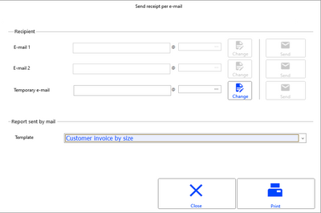

| Fields | Description |
| --- | --- |
| E-mail 1/E-mail 2 | In the case of walk-in customers, these fields are not usable. If the customer is identified, 2 e-mail addresses are retrieved from the customer record (the addresses of the contacts are not.) If the cashier modifies the selected e-mail address, the customer record will be updated (if the cashier has permission to modify customer, as well as their e-mail addresses.) |
| Temporary e-mail | In the case of a walk-in customer, if the e-mail address has been entered in the Additional header information, it is copied here and can be modified by the user. The record of the walk-in customer is not updated with the temporary e-mail, but the address is saved to the delivery address of the document. If the e-mail is sent again (see paragraph “Send e-mail again”), the address can be modified but not saved. |
| Propose to send per e-mail | This option can be disabled, if the customer no longer wants to receive the receipt per e-mail. The customer record is then updated with this information. |
| Template | The cashier can select the template to use for printing from the list of templates authorized for the e-mail profile of the register. The default template for the profile is proposed first. Please note! The selected template must not be configured to continue with the subsequent report. Check this setting in the Next report (to print) field in the Options tab of the report setup (see the Report Generator documentation > Options tab.) |
| [Change] | This button, active only if the e-mail address of the line is specified, allows the cashier to change the e-mail address with automatic transfer to the customer’s record. |
| [Send] | The receipt is emailed when the cashier uses the button next to the line corresponding to e-mail address to use. This button is active only if the e-mail address of the line is specified If an e-mail address is selected, the receipt is printed (in PDF format) by the server in the defined printing language (refer to Define the printing language for receipts ), and then sent to the customer's address. The invoice received by the customer includes the information entered in the Additional header information (name, address, etc.) |
| [Print] | In the case where the customer does not want to receive the receipt per e-mail, this button allows you to print it. |

Sending the e-mail again

Front Office > Sales receipts > Sales > Look up receipt

Select the receipt and then press the [Print menu] button, option Send receipt per e-mail . The document received is the same as the first document sent.

If the French Law V2 module is enabled, email forwarding is not possible for French stores.

Using scheduled tasks to generate and send a PDF receipt

Back Office > Administration > Scheduled tasks - Email documents

As soon as the previous screen Send receipt per e-mail is validated, a unique scheduled task with immediate execution is created to generate and send the receipt in PDF format.

The screen lists the scheduled tasks created automatically by the e-mailing feature, with status OK, not purged yet, or KO.

This list also displays the execution status of the task.

The Process Server run as scheduled task, then, generates the document in PDF format and sends the e-mail with the attached document.

Once the task has been run, it will be disabled and the status is set to OK.

A process that automatically purges the former e-mailing tasks is implemented when running the Process Server. This process ensures that former tasks were successfully completed, at last 5 min before they are removed.

The scheduled task can be viewed in detail by double-clicking on the concerned line.

Related actions

The [Select all] button enables the selection of all the lines displayed on the screen and matching the selection criteria.

The [Modify periodicity] button gives access to the periodicity screen to change the criteria for e-mailing.

The [Reactivate task] button is used to send e-mails again for the selected tasks. This action is preceded by a confirmation message.

The [Delete] button is used to delete the selected tasks. This action is preceded by a confirmation message and logged to the event log.

Checking the delivery of the e-mail

This tracking is performed at 2 levels: At scheduled task and event log levels.

Note that the database GP_STATEMAIL and GP_DATEEMAIL fields are no longer refreshed when a receipt is emailed since it is managed by scheduled task.

At scheduled task level

Back Office > Administration > Scheduled tasks - Email documents

This allows you to know whether the task has started correctly on the planned date and whether the processing launched by this task is complete. Possible values are: in progress, OK, KO. Note that the status is set to OK, as soon as the e-mail has been sent, with or without errors. Moreover, this command also allows you to delete or send e-mails again. Note that tasks run with success will be deleted on a regular basis.

At event log level

Back Office > Administration > Event log > Log query

This command allows you to monitor the process launched by the scheduled task. Possible values are: in progress, interrupted, in error, with warning, and succeeded.
- If the e-mail has been sent successfully, the initiation message for the task is set to status OK.
- If the delivery failed, an error message is inserted with status KO.

The event log must have:
- A trace of the created scheduled task, with the number of the associated receipt.
- A trace for each unsuccessful attempt (KO) to send the e-mail, with the number of the associated receipt.
- A trace for the successful e-mailing (OK) of the new receipt.
- A trace for the automatic deletion of tasks.

Importing addresses from documents

Back Office > Data exchanges > Data recovery > Settings > Recovery formats

The GPA_EMAIL, GPA_CODETIERSEXTERNE and GPA_PARTICULIER fields are available in the settings for recovery formats.

#### Storage of PDFs to Be Sent by an External Tool

Storage of PDFs to Be Sent by an External Tool

This feature enables you to store the PDF file of the receipt and the additional elements required to constitute the e-mail, so that it can be sent later by an external tool, instead of being processed by Cegid Retail Y2. The general principle is to create the PDF file for the invoice via a scheduled task. The Process Server running the scheduled task will perform one of the following actions:
- Directly send the e-mail.
- Store the PDF file and its additional routing information in a directory on a local server.
- Store the PDF file and its additional information on a remote server accessible via FTP.

Note that Cegid Retail Y2 provides access to this information (PDF + routing information.) The external tool, then, has to support the flagging, archiving and moving of the data sent, the possible purging of files, as well as the management of emailing errors that may occur.

Configuring the storage of PDFs for an external tool

Back Office > Administration > Company > Company settings

Go to Commercial management > Emailing and populate the settings specified here .

settings specified here

Storage on local disk

If the storage of the PDF is enabled, the PDF generated by the scheduled task is no longer sent to the customer, but stored on disk in the directory configured and named according to the settings defined. If the PDF already exists, it will be overwritten (for example, if the PDF has been generated again after a change in the receipt.) There is a table in Cegid Y2 to store this information, in order to recover this data via the multi-criteria feature to track the e-mails provided. Provided e-mail data, stored in the MMAILINFOS information table:
- Key of the receipt: Type/Stub/Number/Index
- Receipt date
- Store of the receipt
- Register of the receipt
- Salesperson code
- Sender e-mail
- Recipient e-mail
- E-mail subject: Originating from profile
- E-mail body: Originating from profile
- Recipient customer code
- Name of the PDF file
- Backup directory
- Creation/Modification date

Storage on remote server via FTP

In this case, the PDF is no longer stored on a local disk, but on a remote server via FTP (mandatory binary mode) in the directory configured and named according to the settings defined. As in the previous case, if the PDF already exists it will be overwritten, and the data in the table will be refreshed.

Viewing PDF files for receipts

Back Office > Administration > Company > Send e-mails via external tool

This command is visible only the Storage of receipt PDFs for external tool setting is ticked (refer to the Company Settings .)

Company Settings

The screen displays the list of the receipts that have been e-mailed to customers. Any information from the MMAILINFOS table can be displayed in the list together with the main information about the customer (last name, first name, address.)

Purging PDF files for receipts

Like for the purge of scheduled tasks for e-mailing, a new process to purge the stored PDF files has been implemented when the Process Server starts processing the delivery of e-mails.

This ensures the deletion of the PDF files stored on disk, as well as the memorized ancillary data, for all e-mail deliveries before the retention period defined in the company setting (refer to the Company Settings .)

Company Settings

For the storage via FTP, only the data in the table will be purged, not the actual files.

### Mobility

#### Managing External Registers

Managing External Registers

An “external” register is one managed by external software which populates sales with the new Web Services. These sales are enabled by an open session on the external register, as initiated by the store.

Required settings

Company settings

Back Office > Administration > Company > Company settings > Administration

In Distribution, click the Use external registers setting.

Access rights

Back Office > Administration > Users and access > Access right management

To manage these registers, the following access rights must be activated for the desired user groups:
- Menu Settings (105) > Mobility > External register
- Menu Sales Receipts (107) > Daily operations > External registers > Opening and closing

Creating external registers

Manual procedure

Back Office > Settings > Mobility > External register

To create a new external register, click the [New] button, and fill in the following fields:

- Code and Description for the register: The code cannot exist for another register (regardless of type: standard, mobile, etc.)
- Store: Enables you to assign a register to a store declared in Y2.

Via importing

Back Office > Data exchanges > Data recovery > Settings > Recovery formats

Creating external registers may be done via file importing. The table to be used is MPARCAISSEEXTERNE.

Declaring a workstation

You will need to create a register and declare it as a workstation, in order to identify the workstation store. This register will not be used to enter receipts. This operation is done in two steps:

Step 1: Create a standard register dedicated to a workstation

Back Office > Settings > Registers > Registers

You will need to create a register to be used as a workstation where you can then open external registers.

To create this register, click the [New] button, and populate the fields for the record (see Register record ).

Register record

Step 2: Associate the register to a workstation

Front Office > Settings > Registers > Workstation

In Front Office, a store register must be declared as a workstation.

To do this, select the register that was created in step 1, in the Workstation settings window, and validate.

Authenticating salespeople

During the daily opening and closing, sales staff can be authenticated at store or register level.

Authenticating by store

Back Office > Basic data > Stores > Stores

Open the Miscellaneous tab, and activate the authentication of salespeople. Select a security level with secure identification, then validate.

Authenticating by register

Back Office > Settings > Front Office > Register > Preferences tab
- If the authentication of salespeople is activated for the store, the Receipt header entry setting available in the Management of salespeople/cashiers panel, will be automatically activated for the register (checkbox activated and non-modifiable.)
- If the authentication of salespeople is not activated for the store, it may be activated for the register. In this case, authentication of salespeople will only be in effect for basic daily openings/closings at the external register level (i.e. not in effect for mass daily opening/closing.

Opening external registers

Daily opening

Front Office > Sales receipts > Daily operations > External registers > Opening

The daily opening for an external register is similar to the standard daily opening procedure, the difference being no cash float entry.

Note that to open an external register, the workstation register does not have to be open. The external register can operate whether the workstation register is open or closed.

Notes concerning the opening date:
- The date of the daily opening may be changed in the Opening date of the external register field.
- You can perform a daily opening at a previous date, but this option depends on the following access right, Change opening date and on the Opening of a sales day on a date prior to an accounting closure concept.
- In the case of a daily opening for a day that has already been opened and closed, a message will alert the user that a day has already been opened on this date, and asks for confirmation.

Daily mass opening

Front Office > Sales receipts > Daily operations > External registers > Mass opening

This command will perform a daily opening for several external registers with a single click.

Select the registers to be opened and launch the daily opening using this button.

Note that closed registers are marked with red dot.

If the authentication of salespeople has been activated for the store, a window will open for the salesperson to identify.

Closing external registers

Daily closing

Front Office > Sales receipts > Daily operations > External registers > Closing

Select the salesperson performing the closing in the screen which opens and click [Next].

Then select the register to be closed and click [Next].

Next, click the [End] button to validate the closing of the register.

Note that there is no entry of final cash float for the register.

Daily mass closing

Front Office > Sales receipts > Daily operations > External registers > Mass closing

You can close daily operations for a store’s external registers in mass.

Note that open registers are marked with green dot.

If the authentication of salespeople has been activated for the store, a window will open for the salesperson to identify.

Reports and statistics

Journal report

Front Office > Sales receipts > Reports > Journal report

In the Criteria panel, the Registers field lets you select the external registers for which you want the Journal report.

Flash Report

Front Office > Sales receipts > Statistics > Flash Report

The Register field allows you to select the external registers for which you want the Flash report.

Historical Flash Report

Front Office > Sales receipts > Statistics > Historical Flash Report

In the Standards tab, the Register field allows you to select external registers for which you want to view one or more days.

#### Managing Mobile Registers

Managing Mobile Registers

To find out more about the features for mobile registers, please refer to the MPOS V5 document, available here .

Managing mobile registers from Cegid Retail Y2

In Cegid Retail Y2, the menus for mobile registers are as follows:
- Back Office > Settings > Mobility:
- Mobile register (register configuration Batch modification of mobile registers
- Front Office > Sales receipts > Daily operations > Mobile registers:
- Opening (of a sales day on a mobile register) Closing (a sales day on a mobile register) Canceling a sales receipt

Please note the following regarding receipt cancellation:
- Only carts that are not on hold can be canceled.
- Canceled receipts and cancellation receipts are not taken into account in register control.
- If the store is subject to French law, this menu will not be displayed.

Please refer to the MPOS documentation

To know more about these features as well as the management of MPOS V5 mobile device, please refer to the document available here .

The following topics are covered:
- Configuration in Cegid Retail Y2
- Configuration of the Apple mobile device
- Referencing and configuring the Apple mobile device
- How to connect
- Register opening and closing
- Customers and Items
- Main screen
- Sales conditions
- Statistics
- Gift Cards - Gift Certificates - Deposit reimbursement
- Loyalty
- Orders and Reservations
- Management of returns
- Clocking-in/out
- Shop-in-shop mode
- Receipt options
- Tax refund
- Device settings
- Maintenance

#### Batch Modification of Registers in Menu Mobility

Batch Modification of Registers in Menu Mobility

Required settings

Activation of modules

Back Office > Administration > Company > Serialization > Activation of modules

The Shopping and MPOS menu must be activated

Access rights

Back Office > Administration > Users and access > Access right management

By default access rights are disabled To manage these different registers in the Mobility menu, the following access rights must be activated for the user groups of your choice:
- Menu Settings (105) > Mobility > Batch modification of MPOS settings
- Menu Settings (105) > Mobility > Batch modification of mobile registers
- Menu Follow Up Actions (113) > Administration > Data and settings

How it works

Batch modification of mobile registers

Back Office > Settings > Mobility > Batch modification of mobile registers

This command allows you initiates the batch modification of mobile registers
1. In the list that appears, use the space bar to select the registers to be modified.
2. Click this button to open the list of fields.
3. Move the fields to be modified in the right-hand column, then modify their values.
4. Press the [Launch] button to apply the modification, and validate the confirmation message.

Please note!
- The user must ensure that the new values the user assigns to the registers are valid. Indeed, the batch update checks the properties modified separately. The consistency of modified properties with each other and with unmodified properties is not checked.
- User restrictions on payment methods apply only to the Exchange difference field.

Batch modification of MPOS settings

Back Office > Settings > Mobility > Batch modification of MPOS settings

This command allows you initiates the batch modification of MPOS settings

The displayed list of MPOS registers corresponds to MPOS devices that have already connected to the database. If no device has connected, only the default setup (DEF) is available.

The procedure for batch modification is the same as that explained above for mobile registers.

Please note!
- The user must ensure that the new values the user assigns to the registers are valid. Indeed, the batch update checks the properties modified separately. The consistency of modified properties with each other and with unmodified properties is not checked.
- Customer user fields are available in the list customer properties that can be mass-modified.
- User fields for the item master are not available in the item properties that can be mass-modified..

Traces in the event log

Back Office > Administration > Event log > Log query

These changes are traced in the event log: an event is created for every updated register and the list of the modified fields is displayed in the event.

Please note!

The line is created in the event log if access rights are enabled for the user's group; if they are not enabled, the line is not created.

### Stimulsoft Reporting Tool

#### Contents

=> See also procedure 267 (Installation)

=> See also procedure 298 (Data Dictionary)

Stimulsoft Reporting Tool

The Stimulsoft tool produces prints in A4/A5 format on a POS. This tool that operates close to the sales receipt generator, runs locally on the cash register, thus reducing network latency.

The printing templates used by Stimulsoft are specific templates dedicated to this type of reports. Former templates are not recovered, templates will be entirely re-designed with Stimulsoft. The tool operates in both connected and standalone mode.

Please note!

The Emailing receipts feature does not support Stimulsoft reports, so receipts are always sent in report format.
- Stimulsoft installation
- Focus on the template record
- Managing Stimulsoft templates
- Managing sales receipts/invoices in standalone mode

#### Stimulsoft Installation

Stimulsoft Installation

Access rights

Back Office > Administration > Users and access > Access right management

In order to handle Stimulsoft printouts, go to the Settings menus (105 and 112) and enable the Stimulsoft report printing templates in Documents/Documents.

Installation procedure

Stimulsoft will be installed manually, and before you start, please close all your Cegid applications.

Stimulsoft.zip contains a set of DLLs to be copied into the following directory that must be created if need be: C:\Program Files (x86)\Cegid\Cegid Retail\Stimulsoft.

You will find there:
- The "RegAsm.bat" command file that enables the “Cegid.Retail.Stimulsoft.dll” DLL to be referenced.
- A sample of templates (files with mrt and xsd extensions)
- The Stimulsoft user guide

Once all DLLs have been copied to the directory, right-click the "RegAsm.bat” command file and select the Edit option.

In the file that displays check that the paths hereunder are correctly specified (change them, if required.)
- set REP_DLL="C:\Program Files (x86)\Cegid\Cegid Retail\Stimulsoft"
- set REP_REGASM="C:\Windows\Microsoft.NET\Framework\v4.0.30319"

Once the file closed, right-click again and select Run as administrator ” in order to start the installation.

To test that Stimulsoft is installed correctly, go to Settings > Documents > Documents > Stimulsoft report printing template, and click the [Test Stimulsoft installation] button.

#### Focus on the Template Record

Focus on the Template Record

Back Office or Front Office > Settings > Documents > Documents > Stimulsoft report printing template

This command is used to create, change or query a Stimulsoft report template
- The [Test Stimulsoft installation] button is available in the multi-criteria screen and allows you to test if the Stimulsoft components are correctly installed.
- The [New] button allows the creation of a new template. The type proposed by default is Stimulsoft Sales receipt.
- The [Duplicate template] button, available in the template record, is used for deriving templates in different languages. For a report offered in several languages, use the same code; only the language will be different.
- The [Model with or without data] button, available in the template record, allows yo to launch Stimulsoft in order to create or modify a template. A very simple template is provided as sample (mrt extension in the zip file.) Please refer to the Stimulsoft documentation to design your templates. Note that in this first version, reports cannot be translated dynamically. You have to propose them per language. For a report offered in several languages, use the same code; only the language will be different.
- The [Import a template] button, available in the template record, allows you to import a previously exported template.
- The [Export a template] button, available in the template record, allows you to export the current template ( layout + data dictionary) in order to import it into another record. Allows you to save a template on disk in .MRT format.
- The [Delete] button allows you to delete the current template.

#### Managing Stimulsoft Templates

Managing Stimulsoft Templates

Stimulsoft templates are usable in the Front Office when you enter a sales transaction, reprint receipts, print invoices, print or reprint exchange vouchers.

Register settings

Back Office > Settings > Front Office > Registers

In this step, you define the template that must be used to print the receipt or the invoice. To use Stimulsoft’s templates for receipts and/or exchange vouchers, go to the tabs hereafter and select the available Stimulsoft reports (if the Stimulsoft format is selected, the lists of printing templates and authorized templates are limited to Stimulsoft templates only.)
- Cash register receipt tab : Section Sales receipts, field Printing format.
- Cash register receipt tab : Section Invoice, field Printing format.
- Print tab : Section Print exchange vouchers.

Selecting the template at checkout

Front Office > Sales receipts > Sales > Enter transaction

The [Other actions] button provides access to the printing templates so that you can select the format and the template desired. As for the register setup, the Stimulsoft format is available on this screen. The list of templates is limited to the Stimulsoft template in case of selection. This screen is also accessible before you reprint a sales receipt.

Printing language of templates

Setup
- In the Register settings record ( Cash register receipt tab,) check the Force printed language , then select the language desired, as well as the receipt templates to which the language will apply.
- In the Document types ( Layout tab,) the Printing options section allows printing in the third party’s language and offers to select the language for printing the receipt.

Search principle

Once the settings defined, the following principle for searching the language applies:
- Language defined in the register settings if it is forced
- Otherwise, prints are done in the customer’s language (if requested in the register settings and specified in the customer record,) or in the user’s language.

Once the language has been determined, if the document settings allow the choice of the language before printing, the user can change the language determined above before printing.

Data translation

When data is loaded before printing, data is translated into the printing language determined by Y2.

Translation of template labels

A template per language will have to be created, with the labels and backgrounds directly entered in the language of the template. Cegid Retail Y2 will launch the Stimulsoft printing component by specifying the template to use:
- Template defined at setup level if it exists in one single language.

Otherwise:
- Template in the printing language determined by Y2: If not found, template in the folder language If not found, template in French

Management of sales receipts/invoices in standalone mode

Register settings for standalone mode

Back Office > Settings > Front Office > Registers

Go to the Standalone mode tab, and in the Printing template section, select a printing format and template for the receipts and the invoices issued in standalone mode. As for the connected mode the following fields are available to configure reports in standalone mode:
- Format : the choices proposed are Receipt or Stimulsoft report.
- Template : the list proposed is limited based on the format selected before.
- Number of copies : this (modifiable) field is initialized with the number of copies specified for the connected mode.

Note that if nothing is specified in the Standalone mode tab of the register settings, the printing feature in standalone mode uses the template defined for the connected mode.

Printing sales receipts/invoices in standalone mode

The principle is similar to the connected mode, the only difference being the loading of print data,
- Additional data configured by SQL queries are not loaded.
- The printout is build only from the data loaded in the sales receipt and available in standalone mode.
- The template is loaded from the version stored locally on the cash register, and not from the template stored in the database.
- The Print in third-party language and Force printed language options are not supported in standalone mode.

Exporting templates

The export of the register settings also exports the Stimulsoft templates that are authorized on the register. The export extracts the templates from the database and store the templates in .mrt format in a dedicated directory of the cash register.

Emailing receipts

This feature does not support Stimulsoft prints: emailed receipts will always have a report format.

#### Managing Sales Receipts/Invoices in Standalone Mode

Managing Sales Receipts/Invoices in Standalone Mode

Register settings for standalone mode

Back Office > Settings > Front Office > Registers

Go to the Standalone mode tab, and in the Printing template section, select a printing format and template for the receipts and the invoices issued in standalone mode. As for the connected mode the following fields are available to configure reports in standalone mode:
- Format : the choices proposed are Receipt or Stimulsoft report.
- Template : the list proposed is limited based on the format selected before.
- Number of copies : this (modifiable) field is initialized with the number of copies specified for the connected mode.

Note that if nothing is specified in the Standalone mode tab of the register settings, the printing feature in standalone mode uses the template defined for the connected mode.

Printing sales receipts/invoices in standalone mode

The principle is similar to the connected mode, the only difference being the loading of print data,
- Additional data configured by SQL queries are not loaded.
- The printout is build only from the data loaded in the sales receipt and available in standalone mode.
- The template is loaded from the version stored locally on the cash register, and not from the template stored in the database.
- The Print in third-party language and Force printed language options are not supported in standalone mode.

Exporting templates

The export of the register settings also exports the Stimulsoft templates that are authorized on the register. The export extracts the templates from the database and store the templates in .mrt format in a dedicated directory of the cash register.

### Financing Plans

#### Contents

Financing Plans

Financing allows you to manage both settlement methods and payments of the “4 installments without interest" type, along with management of installment dates. Note! This feature can be used only in Front Office.
- Financing plan settings
- Entering a sale with financing plan
- General aspects

#### Financing Plan Settings

Financing Plan Settings

Step 1: Create financing plans

Back Office > Settings > Management > Financing plans

To create a financing plan, click the [New] button and specify the information displayed in the following tabs.

Characteristics tab

The Usable at register option allows you to differentiate between financing plans that can be used in Front Office and those that can be used in commercial management. If the option is enabled, the date of first installment option is limited to Invoice date and End of month .

When calculating the date of the first installment at + n days, the date of the first field is incremented by n days, except if the user enters a multiple of 30 (30, 60, 90, etc.) In this case, the month is incremented (+1, +2, +3, etc.)

Example (invoice date / number of days / first due date)

8/4/2022 + 29 days = 9/2/2022 (day + 29)

8/4/2022 + 30 days = 9/4/2022 (month + 1)

8/4/2022 + 31 days = 9/4/2022 (day + 31)

Installments tab

The list of payment methods that may be used in this tab is restricted to payment methods that match the following settings in the Payment method record (available in Settings > Management > Payment methods). In the Payment method record:
- the Front Office tab, set the following options: The Usable at register option must be enabled, Set the Type option to Deferred check or Withdrawal Or select Other payment method , and tick the Cash collection type option for these payment methods.
- In the Addition tab, the Send amount to EPT option must be disabled.

For the first installment, in cases where there are no days added or rounding applied (in the Characteristics tab,) the list of payment methods is extended to include cash, bank cards, and checks.

Note that if the first installment is a withdrawal, you must define the first installment date, greater than the current date, in the Characteristics tab.

Please note!

The first installment of a financing plan should always be regarded as the installment that follows the initial payment at the register. For example, if a customer wants to pay in 4 installments, the financing plan will be made up of 3 due dates, the first installment having been paid against the initial receipt.

Front Office tab

You may determine the following fields:

| Fields | Description |
| --- | --- |
| Minimum/Maximum amount | Enter the minimum and maximum amounts. |
| Percentage of the proposed amount | For example, if the percentage proposed for a receipt of €1,000 is 75%, the system will propose a sum of €750 to be divided into installments. |
| Maximum percentage of the amount | For example, if the maximum authorized percentage is 75% for a receipt of €1,000, the system will ensure that a maximum amount of €750 is allocated to this financing plan. |
| Additional payment methods | If the financing plan is used on a receipt, the system can restrict the list of additional payment methods. For example, to pay in 4 interest-free installments, the only additional payment methods authorized are cash and bank cards. Only payment methods accepted at the checkout are authorized. |

If the user attempts to use a financing plan, that includes a payment method not authorized by the register, a message will inform the user that the financing plan cannot be used because it contains an unauthorized payment method. This action is recorded in the event log.

Step 2: Associate financing plan with registers

Back Office > Settings > Front Office > Registers

Open the Preferences tab in the register record, check the Management of financing plans option, then select the financing plan(s) authorized by the register.

#### Entering a Sale with Financing Plan

Entering a Sale with Financing Plan

Front Office > Sales receipts > Sales > Enter transaction

When entering payment on a receipt, click the button on the toolbar to open the window used for entering a financing plan [see financing plans]. Note that you will also have the option to configure a button on the touch pad (see Register Settings ).

Register Settings

The Financing plan window opens to allow you to enter the desired financing plan. There are several possible scenarios, depending on the settings or on the customer’s payment method.

A receipt for €1,000 and a “4 interest-free installments” financing plan, with a proposed percentage of 75%:

Case 1

Applying the financing plan to the entire receipt. Amount: €750

The three installments are calculated and generated on the receipt (3*€250).

The user finalizes the payment of the remaining € 250 installment using an authorized payment method.

Case 2

€100, paid in cash. The financing plan is applied. The proposed amount is € 675 [(1,000-100)*75%].

The three installments are calculated and generated on the receipt (2*€224.98 + 1*€225.04).

The user finalizes the payment of €125 using another authorized payment method.

Case 3

€500, paid in cash.

The financing plan is applied and the amount of €500 is proposed.

The three installments are calculated and generated on the receipt (2*€166.65 + 1*€166.70). The cash line is also entered manually.

#### Financing Plans – General Aspects

Financing Plans ‒ General Aspects

Modifying lines and payment methods

When entering payments, only one financing plan can be applied per receipt. Once a financing plan has been applied, the menu and buttons associated with the financing plans will no longer be active. In order to comply with management rules, the lines generated cannot be modified. In case of error, the user must delete the lines one at a time. A function available in Front Office, allows you to modify the payment methods for receipts, until the daily closing has been performed.

However, financing plan management is not available in this module. As a result:
- You cannot generate a financing plan and break down an amount.
- Restrictions on additional payment methods are not implemented.

Verification management

There are numerous, complex checks to carry out. Financing plan management is therefore essentially a data entry aid. Only payment methods are stored in the installment table. In order to facilitate verification financing plans are stored in the GP_MODEREGLE field in the receipt header. The checks that can be implemented on the minimum and maximum amounts for payment methods are applied to the lines generated by a financing plan.

Currency management

A financing plan can be associated with a payment method that uses a currency other than the store currency. In this instance, the amount(s) to be broken down must be calculated using the currency associated with the payment method.

Standalone mode

Financing plans are available in standalone mode.

### Sales Indices

Sales Indices

This feature is aimed at configuring the calculation of the sales indices (number of receipts, average basket.)
- Average basket = total sales amount /number of receipts
- Sales index = total sales quantity/number of receipts

Configuring sales indices

Company settings

Back-Office > Administration > Company > Company settings

Go to Commercial management > Front Office, and populate the fields available in the Sales Indices section.

Sales Indices

Item, service and/or register operation records

Back Office > Basic data > Items > Items and/or Services

Back Office > Settings > Management > Register operations

The Included in indexes option available in the Characteristics tab ( Profile section) of the item, service and register operation records allows you to specify whether or not the item in question is to be taken into account when calculating sales indices. If this option is not selected, the relevant items will not be included in the receipt number calculation, or in the sales total calculation — which determines the average basket.

Reporting in Cegid Retail Y2

Flash reports, X-receipts and Z-receipts

Front Office > Sales receipts > Statistics > Flash report

The sales table is populated with the total sales. This number corresponds to the total sales figures for items that should be included in the calculation of the sales indices. The average basket is calculated using the total sales, the item quantity and the number of items, all of which depend on different settings.

All the values in the statistics table take into account the item settings and the settings for the calculation of indices.

Employee productivity

Front Office > Sales receipt > Reports > Employee productivity

The report also takes into account the different item settings and the settings for the calculation of sales indices.

KPI statistics

Back Office > Sales > Reports > KPI statistics

Front Office > Sales receipts > Statistics > KPI statistics

In this report, changes are reflected in the Receipts column. The receipt number takes into account the options chosen in the company settings, impacting the values displayed in the Average quantity and Average value columns

So, this report can only use those items selected to be included in the calculation of the sales indices.

Time based statistics

Back Office > Sales > Retail sales > Statistics > Time based statistics

Front Office > Sales receipts > Statistics > Time based statistics

All the values of this report take into account the item settings and the settings for the calculation of the sales indices.

Employee statistics

Back Office > Sales > Retail sales > Statistics > Employee statistics

Front Office > Sales receipt > Statistics > Employee statistics

The Series criterion available in the Additions tab is used to display for each salesperson, values such as:
- Total sales (inclusive or exclusive of tax)
- Number of documents
- Average basket (inclusive or exclusive of tax)
- Sales index
- Quantity
- Discounts

## Gift Certificates and Gift Cards

### Contents

Gift Cards and Gift Certificates - Contents

In Cegid Retail Y2, there are 2 methods for creating gift certificates and gift cards.
- Active gift certificates and gift cards are those created as a register operation, sold as a product and used as a payment method or discount.
- Non active payments pre-recorded gift certificates and gift cards are those usually created in series by the main office, then sent to stores.

When customers return to the store, the cashing system will recognize the amount or the balance associated to the card via its number. The same card may be used repeatedly to pay for subsequent purchases.

There is also another type of gift card: Electronically prepaid gift cards are controlled by a service provider (SVS e.g.) which grants transactions authorization before being saved in Cegid Retail Y2 (to await authorization). The most common transactions are issuing gift cards, using all or part of a card’s value, merchandise returns, recharging gift cards and checking gift card balances.

Note that in Cegid Retail Y2, the concept of gift certificates or gift cards is similar.

Setting up and creating active gift certificates and gift cards
- Setting up gift certificates and gift cards
- Creating gift certificates and gift cards
- Access rights

Using gift cards and gift certificates
- Selling a gift card or gift certificate
- Completing a gift card or gift certificate sale
- Gift certificate and gift cards security
- Using gift certificates in standalone mode
- Gift card reimbursement

Tracking gift certificates and gift cards
- Querying a gift card or gift certificate
- Modifying a gift card or gift certificate
- Querying outstanding balances

Managing non active payments
- Gift certificate and gift card pre-registration
- Allocating gift certificates and gift cards
- Reallocating gift certificates and gift cards
- Querying non active gift certificates and gift cards
- Modifying non active gift certificates and gift cards
- General aspects

Managing prepaid gift cards via EFT
- Prepaid card settings
- Prepaid card sales
- Activation of a prepaid card
- Issuing a prepaid card
- Reloading a prepaid card
- Merchandise returns
- Payment with a prepaid card
- Querying card balance
- Canceling a receipt
- Reconciling
- Exporting stores
- Driver settings

### Setup and Creation

Setting up and Creating Gift Certificates and Gift Cards

Gift Certificate and Gift Card Settings

Company settings

Back Office > Administration > Company > Company settings > Commercial management

Open the Front Office branch and specify the settings in the Payment link section detailed here .

detailed here

Register settings

Back Office > Settings > Front Office > Register

Gift certificate print settings

Select the print templates desired for your certificates in the Voucher templates section of the Print tab.

The Confirmation request option will display a confirmation message before printing the certificate. Otherwise, printing will start immediately.

An additional label will enable you to enter a personalized message (e.g. “Happy Birthday”).

Note that the printing of the gift certificate can also be defined in the payment method record.

Attention! If nothing is set in the payment method record, the register configuration will be set as default for the printing.

Peripheral device settings

Check the Keyboard with swipe reader option in the Peripherals tab to specify that the register keyboard is equipped with an MSR that can be used by the cashier to read the magnetic strip on bank cards or gift cards.

Adding a button to the sales transaction touch screen

Please see Configuring Touch Screen and Keyboard to add a button to the sales transaction entry screen.

Configuring Touch Screen and Keyboard

When using the new button, a window will open to allow you to enter the gift card number. This number may be manually entered or scanned with the MSR tool. Payment will be made normally, like any other sale. Gift certificates may also be printed with a personalized message.

Exclusion periods

For more control, you can set an exclusion period for stores, restricting use of certificates or gift cards during a given period. You may set global restrictions on the use of gift certificates or gift cards for a given store.

Step 1: Exclusion period settings

Back Office > Settings > General > Exclusion periods

Create the exclusion periods desired (e.g. winter or summer sales, etc.).

Step 2: Store settings

Back-Office > Basic data > Stores > Stores

Open the desired Store record and select the exclusion period you have just created, in the Exclusion period for gift cards and gift certificates field of the Additions tab.

Step 3: Register operations settings

Back Office > Settings> Management > Register operations

Exclusion periods are added to register operations of type “Acquisition of gift certificates or gift cards.” This enables you to set customized restrictions, e.g. gift cards may be used during sale periods, but not gift certificates.

Select the exclusion period in the “Payments on hold” tab.

This option is also available in the “Addition per store” option/Characteristics tab.

Creating Gift Certificates and Gift Cards

Creating gift certificates and gift cards requires the creation of a cash register operation, then a payment method.

Creating a register operation (or a financial item)

Back Office > Settings> Management > Register operations

Gift cards and gift certificates must be created through register operations (see Register Operations .)

Register Operations

Creating a payment method

Back Office > Settings> Management > Payment methods

When a card is sold, it can be used as a payment method. A payment method must therefore be created to this effect (see Payment Methods .)

Payment Methods

### Access Rights

Access Rights for Gift Certificates and Gift Cards

Back Office > Administration > Users and access > Access right management

The following access rights allow you to authorize use of the functions related to gift certificates and gift cards.

| Menus | Sub-menus | Access rights |
| --- | --- | --- |
| Menu Concepts (26) | Document entry | Display complete gift card number (see Access Rights/Concepts ) |
| Menu Sales (102) > Retail sales | Outstanding balances | Gift certificates Loyalty gift certificate/sales condition Gift cards All outstanding payments |
|  | Non active payments | Pre-register gift certificates/gift cards Gift cards Gift certificates Loyalty gift certificate/sales condition Allocation of gift certificates/cards Reallocation of gift certificates/gift cards |
|  | Query of gift certificates/gift cards |  |
|  | Modification of gift certificates/cards |  |
| Menu Settings (105) | User-defined fields | Gift certificates/gift cards |
| Menu Sales receipts (107) > Sales | Outstanding balances | Gift certificates Loyalty gift certificate/sales condition Gift cards All outstanding payments |
|  | Non active payments | Gift cards Gift certificates Loyalty gift certificate/sales condition |
|  | Access rights - Register operations | Acquisition of gift certificate Acquisition of loyalty gift certificate Acquisition of gift card Line discount on gift certificates/gift cards Gift certificate reimbursement Reimbursement of a gift card |
|  | Access rights - Enter transaction | Reprint vouchers from last receipt |
|  | Access rights - Enter payments | Authorize the search for certificate numbers at the register (see Gift Certificate and Gift Card Security .) |
|  | Access rights - Payment methods | Gift certificates Gift cards |

### Using Gift Cards and Gift Certificates

Using Gift Cards and Gift Certificates

Front Office > Sales receipts > Sales > Enter transaction

Selling a gift card or gift certificate

To sell a gift certificate or a card like any other item, you must create a register operation beforehand (card or gift certificate) and create a payment method (card or gift certificate). To do so, please see topic Creating Gift Certificates and Gift Cards.

Procedure
1. Enter the financial item corresponding to the acquisition of the gift certificate or gift card.
2. Enter the amount paid, and then enter the message associated to the certificate, if any.
3. End the sale by taking payment.
4. The gift certificate will then be printed, showing the number attributed to it. This will serve as the card is used.

Completing a gift card or gift certificate sale

When taking payment, select the payment method (gift certificate or gift card). A window appears, where you can enter or scan the voucher number.

If the Authorize search for certificate numbers option is enabled, you can do a search of the gift certificate by clicking on the [Search] button. Otherwise, you must call the user with authorization to perform this operation (see Gift Certificates and Gift Card Security .)

Gift Certificates and Gift Card Security

You may remove one or more certificates from the list at any time, using the available buttons [Delete element] and [Delete all], as well as direction arrows allowing you to navigate the list of selected certificates. Note that you may not insert new certificates if the total amount of the certificates already selected is greater than or equal to the amount remaining to pay on the receipt.

The validate button will be active only if at least one certificate has been entered and checks carried out (expiration date exceeded, minimum amount, remainders, etc.) when validating each certificate.

Note that you may enter (or scan) several certificates while the customer is present. To do this you must enable:
- The Link for payments register setting available in the Preferences tab.
- The Multi-certificate entry company setting, in Commercial management/Front Office.

When taking payment, you may check if the certificate has been saved:
- The value of the certificate is entered on a payment method line for Payment method certificates.
- For Discount type gift certificate, the discount related to the gift certificate may be verified using the [Discount details] button.

If the certificate has been partially used, the remaining balance may be viewed in “Outstanding payments” command (option All outstanding payments ), in module Sales receipts > Sales (see Using Gift Cards or Gift Certificates .)

Using Gift Cards or Gift Certificates

Types of messages that may appear when you exit the number entry window

No certificate selected: quit the screen.

If the Override payment link option is activated, a message will be displayed showing that no payment has been selected, and prompts you to keep the payment method.
- YES: The payment method of type certificate or card is inserted into the receipt.
- NO: The payment method of type certificate or card is not inserted into the receipt.

One or more certificates selected: A message showing that the selection has been canceled and prompts you to confirm.
- YES: Quit without selecting and the line is canceled.
- NO: Stay in the certificate entry window.

Gift certificate and gift cards security

Back Office > Administration > Users and access > Access right management

Front Office > Settings > Administration > Users and access > Access right management

The Authorize search for certificate numbers on the register access right enables you to authorize or deny the use of custom searches on certificate numbers (see Sales receipts (107) > Access rights > Enter payments).
- The default is “active”. This access right allows custom searches on certificate numbers on registers
- Non-active: This allows you to secure certificate use by requiring input of certificate numbers without the option to use another. However, you always have the option to override this restriction, by calling a user authorized to perform this operation.

This operation depends also on the Search on gift certificate number company setting in Commercial management/Front Office.

Note that authorization or restriction of access rights concerns ALL payment methods for “basic” gift certificates, loyalty gift certificates and/or sales condition gift certificate, gift cards (not personalized), deposits made, as well as credit notes.

The table below recaps access rights operation whether the Search on gift certificate number company setting (Commercial management/Front Office) is checked.

| “Search on gift certificate number” company setting checked. |
| --- |
| Authorize the search for certificate numbers at the register | Allows you to secure certificate use by requiring input of certificate numbers without the option to use another. However, you always have the option to override this restriction, by calling a user authorized to perform this operation. |
| Authorize the search for certificate numbers at the register | Authorizes custom searches of certificate numbers at the register. |

| “Search on gift certificate number” company setting unchecked. |
| --- |
| Authorize the search for certificate numbers at the register | Allows you to secure certificate use by requiring input of certificate numbers without the option to use another. However, you always have the option to override this restriction, by calling a user authorized to perform this operation. |
| Authorize the search for certificate numbers at the register | Users may select the certificate/card of their choice from the list of certificates/cards on hold that is displayed. |

Recap of settings that alert cashiers to the certificates available to customers:
- The company setting present in the CRM menu for gift certificates with sales conditions: Alert on gift certificates for sales conditions
- Suggest use of available gift certificates setting, available in the Loyalty program ( Definition tab for loyalty gift certificates.

Using gift certificates in standalone mode

Back Office > Settings > Front Office > Register

Front Office > Settings > Registers > Registers

There are two operating modes available in standalone mode, according to the Checking the link for payments register setting in the Standalone mode tab:
- Option not checked: No verification of the certificate number, neither for input, nor for receipt reintegration.
- Option checked: A data entry window will open to input certificate information (number, amount, etc.).

There are several options available when re-integrating:
- Automatic integration: A trace is added to the event log.
- Manual integration: If the corresponding certificate is valid, it will be integrated. Otherwise, multiple criteria will be proposed to the customer to match the gift certificate used with an existing one, if the Authorize search for gift certificates at register access right is enabled. If you quit without making a selection, the certificate will be integrated without being linked to an existing certificate. A trace will be written to the event log.

Gift card reimbursement

In certain states in the US, the remaining balance on an electronic gift card must be reimbursed to the cardholder if it falls below a certain level.

Reimbursement level

Back Office > Settings> Management > Payment methods

The card reimbursement level is determined in the gift card payment method option, in the Outstanding payments tab. To find out which fields you need to fill in, see topic Creating a Payment Method.

Reimbursement during a sale

Front Office > Sales receipts > Sales > Enter transaction

When a gift card is used to pay for purchases, Cegid Retail Y2 ensures that the balance available on the card is greater than the level set for the payment method. If the amount on the card is less than the level, Cegid Retail Y2 will reimburse the customer. If the Propose payment method option is checked, the application will prompt the cashier to reimburse the customer via the following message: “The available amount on the card is $ XX. Do you want to reimburse the customer in: cash in dollars?”

Attention! The prompt will not appear if the Propose payment method is not checked.

If the cashier accepts or if the Propose payment method option is not checked, Cegid Retail Y2 will send a request for gift card reimbursement (cash out) to the payment system. If it does not have a particular command for reimbursement, the application will send a payment request.

If the request is successful, a message will prompt the cashier to reimburse the customer, as follows: “The available amount on the card is less than $ XX. Refund $XX in cash.”

Then Cegid Retail Y2 will add a line to the receipt with the financial item dedicated to a gift card refund and the amount available on the card. It will also add a payment with the payment method set and the amount available on the card.

Taxation

Attention!

In most countries, gift card refunds are not subject to tax. The financial item dedicated to gift card refunds must therefore be set to be ignored by tax calculations.

### Tracking Gift Certificate and Gift Card

Tracking Gift Certificate and Gift Card

Back Office > Sales > Retail sales

Querying gift certificates and gift cards

Back Office > Sales > Retail sales > Query gift certificates/cards

This option allows you to query gift certificates and gift cards according to numerous criteria available in the Standards and Additions tabs. Double-click on a line to display gift certificate and gift card characteristics.

Modifying gift certificates and gift cards

Back Office > Sales > Retail sales > Modify gift certificates/cards

This option allows you to change gift certificates and gift cards according to numerous criteria available in the Standards and Additions tabs. Double-click on a line to display gift certificate and gift card characteristics. You may make changes to the record if you have authorization.

Querying outstanding balances

Back Office > Sales > Retail sales > Outstanding payments (Gift certificates, Loyalty/Sales condition gift certificates, All outstanding payments.)

This command allows you to access to the query function for various gift certificates and gift cards, according to several selection criteria.

Use this button to:

- Allocate an authorization no.
- Close payment
- Modify validity dates

Use this button to view:

- Receipts
- Installments
- Customers
- Movement history
- Linked payment

### Non Active Payment Management

Non Active Payment Management

Non-active payment means that gift cards and certificates have not been activated yet. Generally, these are vouchers and cards that are pre-registered by the Headquarters and then sent to the stores. The “Pre-recorded” setting must be ticked in the Characteristics tab of the register operation .

Gift certificate and gift card pre-registration

Back Office > Sales > Retail sales > Non active payments > Pre-register

The wizard allows you to allocate gift certificates/gift cards in several stores.

Step 1:

| Field | Description |
| --- | --- |
| Gift certificate/gift card type | Select desired type: Gift certificate or gift card. The available elements are register operations that have the Pre-recorded option checked. |
| Allocation store | Required field. Corresponds to the store selling the gift certificate or card. |
| Use in several stores | Allows you to enter a group of stores where gift certificates and gift cards may be used. You must enter a store trigger (a store trigger with the scope of “gift certificates/cards” must be created beforehand in Settings > General.) |
| Allocation in the stores of use | This specifies that the allocation stores are the same as the store of use. If this option is: Ticked: the allocation store field will be grayed out and displays the value Stores of use . Gift certificates/cards will have value “...” in the store and can be sold in one of stores defined in the trigger selected in “Use in several stores.” Not ticked and no allocation store selected: gift certificates/cards will be generated without a store and cannot be sold until an allocation store is assigned to them (using the Allocate gift certificates/cards and Reallocate gift certificates/cards commands.) Not ticked and allocation store selected: gift certificates/cards will be generated for the allocation store selected. They can be sold only in this store. |
| Type of use | Enables you to determine if the coupon (or the gift card) is to be used as a payment method or a discount. |
| Validity date/Number of validity days | Both settings are dependent on one another for calculations. You may specify: Validity start date + number of days. The end date will be automatically calculated. Start date + end date. Validity days will be automatically calculated. The number of days alone can be specified. |
| Deadline of allocation | Shows the latest date when the gift certificate or card may be issued and sold. |
| Value of gift certificates/cards | The value that will be credited to the card or face value of the gift certificate or gift card. |
| Unit cost | Allows you to enter a value corresponding to the actual unit cost for the store. The card currency will be used for this value. This data is for information only. It may not be used by Cegid Retail Y2, but is available for query, or in the gift card export function. |
| Maximum discount (%) | Shows the % of the maximum discount allowed for the gift certificate or card. Example: 50% discount = a €60 gift certificate may only be used on a sale of more than €120. |
| Exclusion period | Allows you to set periods when certificates or cards may not be used by customers. You must create exclusion periods beforehand in Settings > General. |
| User-defined texts | Three 35-character fields are available for data entry. This information will be transferred to each card or gift certificate created. The title of these 3 fields may be configured by folder (Settings > Management > User-defined fields). This data is for information only, available via query or card and gift certificate export. |
| Numbering of gift certificates - settings | Allows you to determine how certificate and card barcodes are to be generated. |
| Allocation method for gift certificate numbers | Entry of a range of numbers: Enter the first and last numbers of the range. Entry of a list of numbers: Enter the list of certificate numbers. |

Step 2/Step 3

Enter the number range or list for certificates/cards and press this button. Press the [Run] button to start the operation. Gift certificates and gift cards will be pre-registered. They may be modified using the Reallocate command.

Allocating non active pre-registered gift certificates and gift cards

Back Office > Sales > Retail sales > Non active payments > Allocate gift certificates/gift cards

This command allows you to allocate gift certificated/gift cards with no allocation and for which the field does not contain the Stores of use value. This change is authorized only if a trigger is selected, or if the gift certificates/cards already have an associated trigger.

Note that the entry of a store trigger (field Stores of use ) is mandatory if the Allocation store is set to Stores of use .

Reallocating non active pre-registered gift certificates and gift cards

Back Office > Sales > Retail sales > Non active payments > Reallocate gift certificates/gift cards

This command will change certain elements and reallocate new information. This phase mainly allows the allocation of a gift certificate/gift card to a store, or the modification of the store. Non active means not yet sold to a customer.

Select the line(s) to change, then save the selection. The Allocation/Reallocation window will open so that you can change the desired elements.

Note that the entry of a store trigger (field Stores of use ) is mandatory if the Allocation store is set to Stores of use.

Querying non active pre-registered gift certificates and gift cards

Back Office > Sales > Retail sales > Query gift certificates/cards

The commands below allow you to query non-active gift certificates and gift cards, i.e. not yet sold or used.
- Gift certificates
- Gift cards
- Loyalty/sales condition gift certificate

Modifying non active pre-registered gift certificates and gift cards

Back Office > Sales > Retail sales > Modify gift certificates/cards

This command will change certain elements and reallocate new information (date, amount, store.)

Note that the entry of a store trigger (field Stores of use ) is mandatory if the Allocation store is set to Stores of use .

General aspects

Using gift certificates and gift cards

Gift certificates and gift cards can be used in the stores matching the trigger specified for the certificate/card. Certificates/cards without triggers can be used in stores matching user restrictions (User record > Restrictions tab > Outstanding payments field.)

Importing

For imports, you can create or modify gift certificates and gift cards with an allocation store set to ‘...’.

However, it is not possible to import sales receipts in which a customer purchases or pays with a gift certificate or a gift card, because the link to payments is not managed via the import of documents that are not omni-channel documents.

Recap on use cases

| “Allocation in the stores of use” setting | Value of the allocation store | Store of use trigger | Allocation | Use |
| --- | --- | --- | --- | --- |
| - | Null | Null | Not salable, not usable, mandatory allocation phase | Possible after allocation |
| - | Store X | Trigger Y | Only for store X | Usable in the sores of trigger Y |
| - | Store X | Null | Only for store X | Usable in the stores matching the restrictions of user record ( Outstanding payments field.) |
| x | ... | Trigger Y | Allocation is possible for the stores of trigger Y | Usable in the sores of trigger Y |
| x | ... | Null | PROHIBITED : locked in the Pre-register, Allocate, Reallocate and Modify commands for vouchers and gift cards, as well as for imports (creating or modifying vouchers/gift cards.) |  |

### Managing Prepaid Gift Cards via EFT

=> See also procedure 248 (Export of SVS Sales)

Managing Prepaid Gift Cards via EFT

Prepaid gift cards are controlled by a service provider (e.g., SVS) which grants transactions authorization before being saved in Cegid Retail Y2 (to await authorization). The most common transactions are issuing a gift card, spending all or part of a card’s value, returning goods and adding the value to the gift card, and checking the gift card balance.

Card settings

A financial item of type Acquisition of a gift card must be created beforehand (see Creating Register Operations). The Type of credit request field must be input differently depending whether it is an activation, card issuing or reloading. When a card is returned to a customer, the card is issued or activated, depending on the type of card the store offers. A card is reloaded when a customer transfers money to it, or when a customer receives a reimbursement credited to their card.

Prepaid card sales

The cashier enters the financial item reference dedicated to the sale of prepaid cards. The amount is then charged to the card. If the amount entered is less than the minimum amount or greater than the maximum amount set for the register operation, an error message will prompt the cashier to correct the value entered. Other items may be entered and payment methods used by customers for purchases may be saved. The cashier then validates the sales receipt.

Activation of a prepaid card

Activation applies to prepaid cards. Once all payments have been validated, Cegid Retail Y2 prompts the cashier to enter the number of the prepaid card, or scan the card’s barcode or use an MSR reader to scan the card’s magnetic tracks. When a card number is unknown, Cegid Retail Y2 opens a dialog with the CPOS driver to request prepaid card activation.

How SVS operates

The latter calculates a STAN identifier for the register and sends a message to the SVS Web Service. If the response of the web service is:
- Positive: The request is considered to be approved. The driver gives control to Cegid Retail Y2, which processes the next financial item.
- Error: If a reply is not received within 10 seconds (configuration done by SVS), the driver sends a reversal message several times between each transfer (the number of reversals and the wait between each reversal are driver settings). The driver displays a message to prompt the cashier to call SVI at SVS, giving the telephone number to use (CPOS setting), the SVI store number (CPOS setting) and the amount of the transaction, plus the access code to give to SVI.

The access code is calculated by the driver using an algorithm supplied by SVS. Once the cashier has obtained authorization from SVI, the authorization number given may be entered. The driver verifies the validity of the authorization number via an SVS algorithm. If the number is correct, the driver gives control to Cegid Retail Y2, which processes the next financial item. If the number is incorrect, the cashier will be prompted to enter it again, or abort the current sale.

If the cashier has not obtained a valid authorization number from SVI, the request is considered to be denied. The driver gives control to Cegid Retail Y2, which display an error message to the cashier. The cashier has the option to repeat the transaction or cancel the current sale. In the latter case, payments on the receipt are canceled. This may trigger cancellation transactions in the EFT system concerning credit card payments. Likewise, SVS transactions generated by the sale will be canceled. When all financial items for the sale have been approved by SVS, Cegid Retail Y2 will save the sales in its database and print the receipt.

STAN calculation (SVS)

The CPOS driver manages a numerical sequence that may vary between “1” and “999999”. This sequence is required by SVS to identify transactions.

End of card validity date (SVS)

A setting of the CPOS driver enables you to set the number of days to subtract from the end of validity date returned by SVS to calculate the end of commercial validity date. This may be printed on the receipt or displayed when checking card balances. This setting can take a value between 0 and 99 days. Note that the number of days is subtracted from the end of validity only if the difference is greater than today’s date.

Receipt template

Cegid Retail Y2 gives you the option to change the template for the receipt printed. Accordingly, gift card numbers and end of validity dates may be printed using a personalized receipt template for the “SOLDEGIFTCARDLIG”, “DEVISESOLDEGIFTCARDLIG” and “EOVSOLDEGIFTCARDLIG” fields. This information can only be printed on the original receipt. It cannot appear in the case of reprinting.

Issuing a prepaid card

Issuing prepaid cards implies that the card has been loaded.

Setup

To register prepaid card sales, a financial item of type Acquisition of gift card must be created beforehand (see Creating Register Operations.) The properties of this item are identical to those of the financial item used to activate the prepaid card, with the exception of the “Issue” credit request.

Card sales (SVS)

The process is similar to that of prepaid card activation.

Reloading a prepaid card

Setup

A financial item of type Acquisition of gift card allows you to record the reloading of a prepaid card or a gift card (see Creating Register Operations.) The properties of this item are identical to those of the financial item used to activate the prepaid card, with the exception of the “Reload” credit request.

Reloading a card (SVS)

The process is similar to that of prepaid card activation.

Merchandise returns

Merchandise return means merchandise has been taken back. You can include gift cards in the return. Gift cards will be canceled.

Setup

A payment method of type Credit note must be created beforehand (see Creating Payment Methods.)

Initializing a card (SVS)

The cashier will register the items returned by the customer, and then use the Credit note payment method to reimburse the customer. When the cashier has saved the transaction, Cegid Retail Y2 will prompt the cashier to enter or scan the card number. The process is similar to prepaid card activation.

Payment with a prepaid card

Setup

A payment method of type Gift card must be created beforehand (see Creating Payment Methods.) The properties of this payment method are identical to those of the payment method used for merchandise returns.

Payment

The cashier saves the items purchased by the customer, and then enters the payment method code for prepaid cards. Cegid Retail Y2 will query the EFT module for the amount available on the prepaid card. A window will appear to prompt the cashier to slide the card in the magnetic stripe reader or to scan the card barcode. The cashier can then change the amount to deduct from the card,which is initialized with the outstanding amount on the receipt. Next, the cashier can save additional payments.

With SVS, when the cashier starts the final approval for the receipt, the CPOS driver sends a card redemption request. The reversal principle is used for this transaction, as in the case of prepaid card sale.

If the redemption request fails, a message will prompt the cashier to replace prepaid card with another payment method, or cancel the current sale.

If the amount validated by the EFT module is different from the amount requested by Cegid Retail Y2, a message will prompt the cashier and receipt validation will be interrupted to enable the cashier to correct the payments.

Several prepaid cards may be used. In this case, the operations described above may be repeated for each card used.

If the cashier cancels the current receipt, and if one or several prepaid cards have been validated by the Web Service, Cegid Retail Y2 will trigger cancellation of each validated transaction.

With SVS, the CPOS driver issues a cancellation request for the transaction, reusing the STAN of the original transaction; if one of the transactions is a reversal transaction, the CPOS driver issues a reloading message for the card.

You may also load a prepaid card during a reimbursement operation. The operation is similar to the one described previously, but the triggering element is not the entry of a payment method, but a reimbursement financial item.

Querying card balance

The cashier can query prepaid card balances using a key on the sales transaction entry touchpad, programmed for this operation. Cegid Retail Y2 will then prompt the cashier to enter the number of the prepaid card, or scan the card’s barcode, or use an MSR reader to read the card’s magnetic tracks if the register has an MSR reader.

When a card number is unknown, Cegid Retail Y2 opens a dialog with the CPOS driver to query the prepaid card balance.

With SVS, a STAN is calculated for the register and a message is sent to the Web service. The driver extracts the available amount from the card and the card expiration date to respond to the SVS Web Service and return them to Cegid Retail Y2 that will display them.

Canceling a receipt

Canceling a receipt that sends, activates or reloads prepaid cards will cause the refund of the amount charged to the cards. In other words, the cancellation of a receipt using a prepaid card triggers the reloading of the card with the amount used, if the “Authorization while modifying payment” register setting is ticked. If there is an error, a message will be displayed to prompt the cashier that the problem must be handled manually.

Reconciliation (SVS)

A sales export tool, accessible from Data exchanges > Export data > Export documents > Sales > Settings tab, enables you to generate a flat file based on a configurable structure. Nevertheless, a new specific export format must be developed to generate files in the required format. A company setting enables you to enter the customer code attributed by service providers. When the file has been created, the programmed export may automatically follow the file transfer phase via the FTP protocol. The required options for the FTP protocol are configured in Administration > Company > Company settings > Administration > Specifics (available in Customer Service View.)

Administration > Specifics

Every export can be programmed to be run every day at a given time on one of the application servers at company headquarters. Data entered in registers is saved in the main database in real time and will be recognized by the export task.

File structure

Header

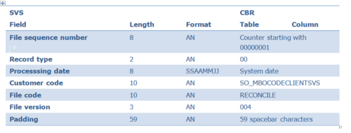

Body

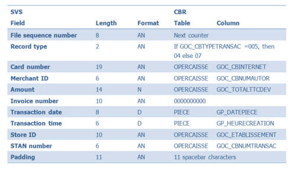

Footer

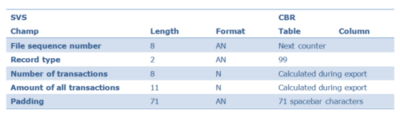

Export stores

Cegid Retail Y2 Back Office proposes a specific export format for stores to provide SVS with a list mapping the Cegid's alphanumerical store codes and SVS store numbers.

The resulting file called ANI (Automatic Number Identification) by SVS is compliant with the specifications described in the "ANI File Specifications Version 1.9" SVS document. It must be generated once a week and filed via FTP in the directory specified in the company settings described in the Administration > Specifics section.

Warning! This export is mandatory if an alphanumerical code has been implemented for stores.

Driver settings

Front Office > Settings > Registers > Registers

The following settings must be determined for each company register handling SVS cards in the EPT settings screen.

SVS driver

Click this button to access the settings of the register peripheral devices, then select EPT. Peripheral devices are grouped by type; each device is identified by a number. Note that the CPOS SVS driver must be the first on the EPT list, and its identifier must be 1.

About SVS, once the DLL name and the driver name have been entered, the driver settings window will open. Fill in the following fields:

| Setting | Default value | Mandatory (X = Yes) | Exact size to check (Empty = No check) |
| --- | --- | --- | --- |
| Web service URL |  | X |  |
| User name |  | X |  |
| Password |  | X |  |
| Number of reversal attempts | 3 | X |  |
| Time between two reversal attempts (seconds) | 10 | X |  |
| Routing of transactions |  | X | 19 |
| Merchant's name |  | X |  |
| Merchant number |  | X | 6 |
| Division |  | X | 5 |
| Voice server phone number |  |  |  |
| Number of the store to provide to SVI |  | X |  |
| Number of days to subtract from the card expiration date |  |  |  |

Settings to be adjusted to use the CPOS driver

You will need to adjust settings in Front Office to use prepaid cards.

SVS uses ISOA currency codes. They may therefore be entered into the database. In addition, the Keyboard with swipe reader option must be enabled in the Peripherals tab in register settings. In addition, if the customer wishes to cancel transactions (Canceling a receipt with gift card issue, Canceling a gift card payment), the Authorization while modifying payment must also be enabled in the Peripherals tab in register settings.

If the register uses several devices, you must create triggers for the payment methods associated to EPTs. For example:
- 1 trigger for SVS payment modes
- 1 trigger for Credit card payment modes

Without these triggers, Front Office will always use Device 1 (i.e. SVS EPT) to process payment, including credit card transactions.

Please note!

SVS only supports digital codes. It does not support IVR (offline mode) for stores with an alphanumerical code (hardcoded during transmission.)

## Delivered or Picked up Goods

### Contents

Delivered or Picked up Goods - Contents

In some brand stores, items bought are not taken away immediately. When finalizing the sales transaction, the items bought by the customer can have various statuses (taken away, to pick up, to deliver.)
- Taken away: This is the most common behavior in stores; the customer buys an item and takes it with him when he leaves the store.
- To pick up: The item is set aside or ordered, and will be picked up later by the customer. In this case, the item can be picked up:
- To deliver: The item is set aside or ordered, and will be delivered later to the customer. In this case, the item can be delivered:

General settings
- Serializing the module
- Configuring the store
- Adding new columns to the entry of sales receipts
- Configuring the register

Use of the Delivered/Picked up module
- Sales to pick up on order (REC)
- Sales to deliver on order (LIC)
- Sales to deliver from stock (LIV)
- Sales to pick up from stock (RET)

Return management
- Return settings
- Return process
- Return and exchange
- Return refused

Imports
- Importing return notices (ANR)
- Importing supplier documents

Inventory movements
- Principle of inventory movements
- Example of a sale to pick up on order (REC)

### Delivery/Pick-up Settings

Delivery/Pick-up Settings

Serializing the module

Back Office > Administration > Company > Serialization > Activation of modules

To be able to use the Pick-up and delivery management feature, serialize the Pick-up and Delivery module. When serializing the module, the Pick-up and Delivery company setting is ticked automatically. This setting is available in Administration > Distribution > Point-of-sale management.

Configuring the store

Back Office > Basic data > Stores > Stores

Delivered/picked up tab

Enable in this tab the Management of sales to pick up or to deliver.

For both features, you may limit the warehouses where you will manage pick-ups and deliveries, and define a default warehouse for orders and pick-ups from stock.

It is also possible to distinguish warehouses taking orders and receiving orders.

The payment method for credit notes generated subsequently to returns for delivered or picked up goods is also defined in this tab.

Finally, you have to specify if your company wants to manage delivery notices and preparations in this context.

Adding new columns to the entry of sales receipts

Back Office > Settings > Documents > Documents > Input lists

Input list for receipts

For the input list associated with the receipt (FFO) document type, add the following columns:
- Pick-up (GL_STATUTENVOI)
- Delivery date (GL_DATELIVRAISON)
- Warehouse (GL_DEPOT)

Just remind: The document types are available in Settings > Documents > Documents > Types - FFO, tab General, field Input list .

Configuring the register

Back Office > Settings > Front Office > Register

Additions tab

If the settings of the store do allow this, you may activate for the register the following options:
- Management of sales to pick up from stock
- Management of sales to deliver from stock
- Management of sales to pick up on order
- Management of sales to deliver on order

You can also define the default warehouses for these various types of sales.

Please note!

The “Default pick-up” defined here will be assigned systematically to an item entered for a sales transaction, except if a Default pick-up has been defined for the item itself; in this case, the setting for the item prevails.

### Use of the Delivered/Picked up Module

#### Sales to Pick Up for Orders (REC)

Sales to Pick Up for Orders (REC)

Sales transactions

To make a sale to be picked up for an order, you have to enter the item to order. If the item is set by default to “picked up on order”, this pick-up method will be retrieved automatically: REC.

Documents generated during a sales transaction

The validation of the payment method validates the sale and triggers the printing of the sales receipt followed by the customer order (CC) with the order number, the customer reference and the item(s) ordered.

This order can be viewed in the Query of orders to pick up in Front Office > Customers > Delivered/Picked up > Orders to pick up. Double-click the order to display the details. The application displays the various statuses of the document:
- Follow-up (at this stage, is still set to Ordered )
- Payment
- Invoicing
- Shipping
- Delivery

You can also see the initial sales receipt at the origin of the order, the purchase order generated automatically, and later all other documents linked to this order. The detail per line is available in Front Office > Customers > Delivered/Picked up > Track orders by line.

Next steps of the process

Delivery notice

If delivery notices are supported, you can generate delivery notice by clicking the appropriate button if you are positioned on the purchase order when viewing the details of the order to pick up.

The delivery notice document to generate will open and you just have to assign quantities and validate.

The generated delivery notice can be directly viewed just after the purchase order in the order tracking feature.

The Follow-up status is set from Ordered to Order accepted .

Receipt/Available order

If you are positioned on the delivery notice in the details of order to pick up, you can generate the supplier receipt by clicking the [Accept purchase order] button.

The Supplier receipt document to generate will open and you just have to assign quantities and validate: the voucher of the supplier receipt will be printed.

The generated supplier receipt can be directly viewed just after the delivery notice in the order tracking feature, as well as the associated available order.

The Follow-up status is still set to Order accepted .

Preparation/Delivery to warehouse

The available order must now be processed in Front Office > Customers > Delivered/Picked up > Items to pick up.

Double-click on the line of your choice.

If the cursor is positioned on the available order (CDI), you can generate the Preparation of the order, if of course preparations are supported, by clicking the [Order preparation] button.

The Delivery preparation document to generate will open and you just have to assign quantities and validate: the Preparation report will be printed.

The generated delivery preparation can be directly viewed just after the available order in the order tracking feature.

The Follow-up status is set to Preparation in progress.

If the cursor is positioned on the Delivery preparation, you can generate the Order delivery by clicking the [Order delivery] button.

The Order delivery document to generate will open and you just have to assign quantities and validate: the delivery report will be printed.

The generated delivery can be directly viewed just after the available order in the order tracking feature.

The Follow-up status is then set to Goods picked up .

#### Sales to Deliver for Orders (LIC)

Sales to Deliver for Orders (LIC)

Sales transactions

To make a sale to be delivered for an order, you have to enter the item to order. If the item is set by default to “delivered on order” this method will be retrieved automatically: LIC.

Documents generated during a sales transaction

The validation of the payment method validates the sale and triggers the printing of the sales receipt followed by the customer order (CC) with the order number, the customer reference and the item(s) ordered.

This order can be viewed in the Query of orders to deliver in Front Office > Customers > Delivered/Picked up > Orders to deliver.

Double-click the order to display the details. The application displays the various statuses of the document:
- Follow-up (at this stage, is still set to Ordered )
- Payment
- Invoicing
- Shipping
- Delivery

You can also see the initial sales receipt at the origin of the order, the purchase order generated automatically, and later all other documents linked to this order.

The detail per line is available in Front Office > Customers > Delivered/Picked up > Track orders by line.

Next steps of the process

Delivery notice

If delivery notices are supported, you can generate a delivery notice by clicking the appropriate button if you are positioned on the purchase order when viewing the details of the order to deliver.

The delivery notice document to generate will open and you just have to assign quantities and validate.

The generated delivery notice can be directly viewed just after the purchase order in the order tracking feature.

The Follow-up status is set from Ordered to Order accepted .

Receipt/Delivery to customer

If you are positioned on the delivery notice when viewing the details of the order to deliver, you can generate the supplier receipt by clicking the [Accept purchase order] button.

The Supplier receipt document to generate will open and you just have to assign quantities and validate: the voucher of the supplier receipt will be printed.

This receipt automatically triggers the customer delivery.

The generated supplier receipt can be directly viewed just after the delivery notice in the order tracking feature, as well as the associated delivery.

The Follow-up status is set to Sent from Headquarters .

#### Sales to Deliver from Stock (LIV)

Sales to Deliver from Stock (LIV)

Sales transactions

To make a sale to deliver from stock, you have to enter the item to buy. If the item is set by default to “delivered from stock”, this method will be retrieved automatically: LIV.

Documents generated during a sales transaction

The validation of the payment method validates the sale and triggers the printing of the sales receipt followed by the available order to deliver in the form of a report with the order number, the customer’s reference and the item(s) ordered.

This available order can be viewed in the Query of items to deliver in Front Office > Customers > Delivered/Picked up > Items to deliver. Double-click the available order to display the details. The application displays the various statuses of the document:
- Follow-up (at this stage, is set to Available in warehouse )
- Payment
- Invoicing
- Shipping
- Delivery

You can also see the initial sales receipt at the origin of the order, and later all other documents linked to this order.

The detail per line is available in Front-Office > Customers > Delivered/Picked up > Track orders by line.

Next steps of the process

Preparation/Delivery to warehouse

You can generate the Preparation of the order, if of course preparations are supported, by clicking the [Order preparation] button.

The Delivery preparation document to generate will open and you just have to assign quantities and validate: the Preparation report will be printed.

The generated delivery preparation can be directly viewed just after the available order in the order tracking feature.

The Follow-up status is set to Preparation in progress.

If the cursor is positioned on the delivery preparation, you can generate the Order delivery by clicking the [Order delivery] button. The Customer delivery document to generate will open and you just have to assign quantities and validate: the Delivery report will be printed.

The generated delivery can be directly viewed just after the delivery preparation in the order tracking feature.

The Follow-up status is still set to Sent from Headquarters .

#### Sales to Pick Up from Stock (RET)

Sales to Pick Up from Stock (RET)

Sales transactions

To make a sale to be picked up from stock, you have to enter the item to buy. If the item is set by default to “picked up from stock”, this pick-up method will be retrieved automatically: RET.

Documents generated during a sales transaction

The validation of the payment method validates the sale and triggers the printing of the sales receipt followed by the available order in the form of a report with the customer reference and the item(s) ordered.

This available order can be viewed in the Query of items to deliver in Front Office > Customers > Delivered/Picked up > Items to pick up. Double-click the available order to display the details. The application displays the various statuses of the document:
- Follow-up (at this stage, is set to Available in warehouse )
- Payment
- Invoicing
- Shipping
- Delivery

You can also see the initial sales receipt at the origin of the order, and later all other documents linked to this order.

The detail per line is available in Front-Office > Customers > Delivered/Picked up > Track orders by line.

Next steps of the process

Preparation/Delivery to warehouse

You can generate the Preparation of the order, if of course preparations are supported, by clicking the [Order preparation] button.

The Delivery preparation document to generate will open and you just have to assign quantities and validate: the Preparation report will be printed.

The generated delivery preparation can be directly viewed just after the available order in the order tracking feature.

The Follow-up status is set to Preparation in progress .

If the cursor is positioned on the delivery preparation, you can generate the Order delivery by clicking the [Order delivery] button. The Customer delivery document to generate will open and you just have to assign quantities and validate: the Delivery report will be printed.

The generated delivery can be directly viewed just after the delivery preparation in the order tracking feature.

The Follow-up status is then set to Goods picked up .

### Return Management

Return Management for Delivery/Pick-up Module

You can return to the store an item that was delivered or picked up from stock or on order. The customer ships the goods back to the Headquarters, specifying the type of the return: Exchange or Return .
- In the case of a return, the Headquarters accept the goods and generate a reimbursement voucher or a credit note.
- In the case of an exchange, the Headquarters accept the goods, and then process an new customer order for the exchange.

This return triggers:
- A direct reimbursement (no credit note): per check, in cash, etc.
- A credit note
- An exchange, if the customer wants another size or another item.

In the last case, there are 2 possibilities:
- If the new order costs more than the initial order, the customer has to pay the difference.
- If the new order costs less than the initial order, the customer must be refunded the difference with a credit note.

Note that the return process is the same whatever the type of the original sale (LIC, REC, LIV or RET.)

Return Settings

Payment method for credit notes

Back Office > Basic data > Stores > Stores

Enter a payment method for credit notes in the Delivered/picked up tab of the store record. This payment method will be the one chosen for returns refunded with credit notes. For returns with direct reimbursement, the payment method of the return notice will be the one used in the original order.

Refusal reasons for returns

Back Office > Settings > Documents > Movement reasons

Any refused return must be justified with a reason. These reasons must be created with movement type Return refused.

Return Process

Creating a return notice

Back Office > Sales > Delivered/Picked up> Enter a return notice

A multiple criteria selection screen enables you to select the original order (CC or CD); when you validate your choice, the items of the order are loaded into the return notice document you just have to validate. The system then proposes the following types of return: Exchange, Return with credit note, Return with refund. Finally, the Installment distribution window displays with:
- The payment method of type Credit note (that of the store) if a Return with Exchange or Credit note was selected.
- The initial payment method of the sales receipt, if a Return with Refund was selected

A document of type Return notice is generated with:
- The Status of return set to “Announced return”
- Return or Exchange set to “Return”
- Payment type set to “Reimbursement”, “Credit note” or “Exchange” according to the kind of return selected.

Return receipt

Back Office > Sales > Delivered/Picked up > Follow up return notices

The return notice and its statuses can be viewed in the Back Office and the Front Office. As long as the return remains announced, the fields Return/Exchange and Refund/credit note can be modified A return can be accepted only in the Back-Office:
1. Double-click the return notice to accept.
2. At this stage, you can see the original order followed by the return notice.
3. Position on the return notice line
4. Click the [Accept delivery of return] button.

A document of type BLR (return receipt) is created , as well as a negative credit note voucher, usable for a later payment. The statuses of the return notice will be set to the following values:
- The Status of return is set to “Return accepted”
- Return/Exchange and Refund/credit note are not changed, but cannot be modified anymore.

Return and Exchange

Back Office > Sales > Delivered/Picked up

Entry of an exchange order

You must have entered and accepted a return notice of type “Exchange.” You can create an exchange order:
- Either from the Follow-up of return notices screen by clicking the [Create the exchange order] button.
- Or from the Entry of an exchange order feature.

Selection of the type for the generated exchange order

Once the creation of an exchange order requested, a selection screen displays and prompts you to define whether the order is to be delivered or picked up. The customer exchange order then opens and recovers the header information from the return notice (ANR). The lines are empty. You must enter the item(s) the customer wants to buy, and then validate. The customer exchange order then immediately appears under the following documents: Return notice, Return receipt, Credit note voucher.

At this stage, the order can be viewed only if the return had been effectively accepted in:
- Front Office > Customers > Delivered/Picked up > Orders to deliver (or to pick up).
- Back Office > Sales > Delivered/Picked up > Orders to deliver (or to pick up).

This order can be viewed anytime in the standard query of customer orders.

A purchase order was created in conjunction with the customer exchange order to actually launch the order of the replacement item, and is visible when viewing the customer exchange order in the Orders to deliver (or to pick up).

Delivery/Pick-up of the exchange order

To finalize the customer exchange order, follow the same progression as for a customer order (CC), sale to deliver on order (LIC), or sale to pick up on order (REC). Therefore, from the Orders to deliver (pick up) feature, you have to create the delivery notice for the exchange order, as well as the supplier receipt, the preparation and the delivery; the credit note generated by the return receipt must be consumed too. 2 cases may occur:
- If the item ordered costs less than the original order, the credit note will be used partially; the remaining amount due to the customer must be reimbursed with a new credit note. In the case the initial credit note is updated, no new credit note will be created: in the list of outstanding payments, you can view the credit note with in field Amount the final available amount (after the delivery of the new item), and in field “Tax incl. total” the amount initially available (i.e. the credit note amount generated from the return receipt for the item to be exchanged.)
- If the new item costs more than the original order, the customer must pay the additional amount since the initial credit note does not cover the total amount of the new order. Specifically, after the selection of the type for the exchange order to generate (delivered or picked up on order) you must enter the missing installment: the Installment distribution window proposes a Credit note line with the amount of the credit note generated by the return receipt; you have to supplement the amount due with another payment method.

Return Refused

Back Office > Sales > Delivered/Picked up > Refuse return notices

Back Office > Sales > Delivered/Picked up > Follow up return notices > [Refuse return] button

It possible to refuse the return of an item for various reasons that have to be justified by the selection of a refusal reason.

This list only displays “refusable” return notices, that is to say not fully accepted and not entirely refused. You have to select the return notice(s) you want to refuse and click the [Validation] button A reason will be prompted for every notice subject to refusal. Once the reason validated, the return notice will be closed, and the return status will be set to “Return refused” or remain at “Return partially accepted.”

If the return is completely refused, the return notice will disappear from the list. If no receipt has yet been made for a return notice, then the refusal will result in a total refusal. However, it is possible to refuse a return partially:

Accept a return partially (via the Follow-up of return notices or Return notice receipt)

For this return, the status is set to “Partially accepted return.”

Refuse to receive the rest of the return (via the multiple selection criteria in the Return notice refusal or in the Follow-up of return notices)

This action closes the return notice, which in turn:
- makes it no longer visible in the multiple criteria of the Return notice refusal
- makes it no longer “refusable” in the Follow-up of return notice, since the [Refuse return] is not available anymore.

### Import Management

Import Management for Delivery/Pick-up Module

Back Office > Data exchanges > Data recovery

Various external documents can be integrated by imports within the Delivered/Picked up feature:
- “Supplier documents”: Purchase order (CF), Supplier delivery notice (ALF), and Supplier receipt (BLF)
- “Customer” returns: Return notice (ANR) with refund, exchange, or credit note.

Importing return notices (ANR)

Whatever the type of the imported return notice, the import format remains the same, only the following fields must change: $$_TYPERETOUR (ECH for Exchange, RET for Return with credit note or refund) and $$_TYPEREGLT (AVE for credit note and RMB for refund).

The type of the document to close ($$_NATUREPIECEG) is either an Available order (CDI) if the origin is a sale to pick up from stock (RET), or a sale to deliver from stock (LIV); or a Customer order (CC), if the origin is a sale to pick up on order (REC) or a sale to deliver on order (LIC).

Before you can import a return notice (ANR), the original order (CC or CDI) must have been delivered.

Example of import format

Back Office > Data exchanges > Data recovery > Settings > Recovery formats

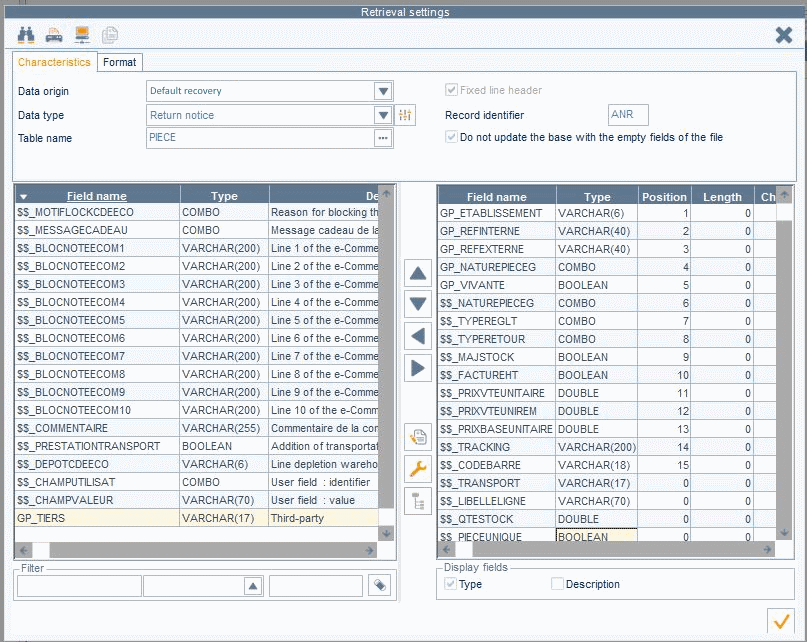

Importing supplier documents

Supplier-typed documents can be imported by using the standard import format for Purchase orders (CF), Delivery notices (ALF), and Supplier receipts (BLF). These documents are used only in conjunction with sales to deliver on order (LIC) or sales to pick up on order (REC).

Example of import format

Back Office > Data exchanges > Data recovery > Settings > Recovery formats

Importing delivery notices (ALF)

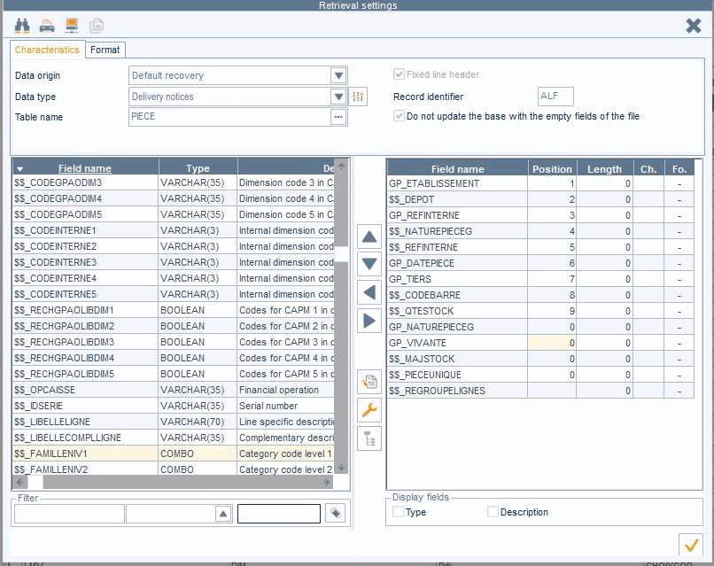

Importing supplier receipts (BLF)

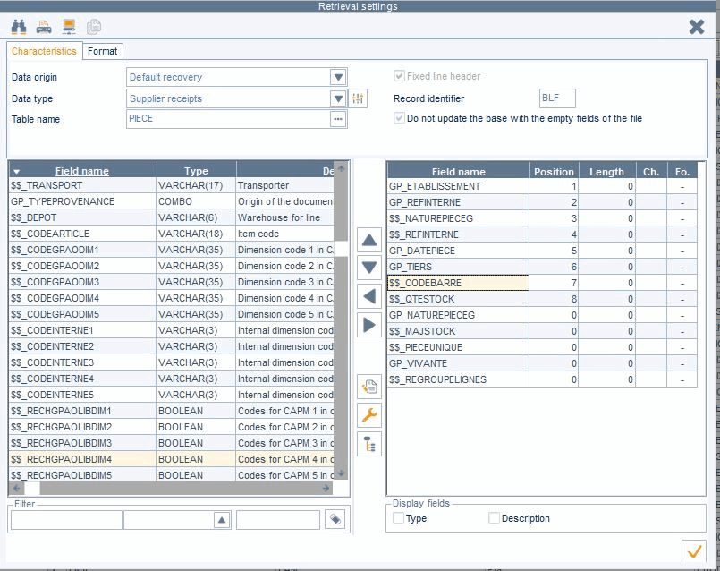

Import impacts

The import of a delivery notice (ALF) will have the following results:
- The purchase order (CF) will be closed (remaining quantities set to 0)
- Generation of the delivery notice (ALF)
- The Follow-up status is set from Ordered to Order accepted .

The import of a supplier receipt (BLF) will have the following results:
- The delivery notice (ALF) will be closed (remaining quantities set to 0)
- Generation of the supplier receipt (BLF)
- Generation of a customer delivery (BLC) in the case of a sale to deliver on order (LIC), or an available order (CDI) in the case of a sale to pick up on order (REC).
- The Follow-up status is set from Order accepted to Sent from Headquarters in the case of an LIC.

### Inventory Movement Management

Inventory Movement Management for Delivery/Pick-up Module

Principle of inventory movements

Back Office > Basic data > Stores > Stores

Various warehouses may be used when updating inventory, according to the settings defined in the store record.

Default warehouse when entering a sales transaction, recovered for customer orders (CC) and available orders (CDI)

In the Management of sales to pick up section:
- The Default warehouse on stock is the warehouse proposed on the receipt line in the case of a sale to pick up from stock (RET). It will be assigned to the available order (CDI).
- The Warehouse taking orders is the warehouse proposed on the receipt line in the case of a sale to pick up on order (REC). It will be assigned to the customer order (CC).

In the Management of sales to deliver section:
- The Default warehouse on stock is the warehouse proposed on the receipt line in the case of a sale to deliver on order (LIV). It will be assigned to the available order (CDI).
- The Warehouse taking orders is the warehouse proposed on the receipt line in the case of a sale to deliver on order (LIC). It will be assigned to the customer order (CC).

Recipient warehouse

In the Management of sales to pick up section:
- The Warehouse receiving orders is the warehouse that will receive the purchase order generated subsequently to the customer order of type REC. Moreover, the customer delivery will be done from this warehouse to the store, from the available order (CDI).

In the Management of sales to deliver section:
- The Warehouse receiving orders is the warehouse that will receive the purchase order generated subsequently to the customer order of type LIC. Moreover, the customer delivery will be done from this warehouse, from the supplier receipt (BLF).

Example of a sale to pick up on order (REC)

If the following warehouses are defined:
- Warehouse taking orders: CRC (for orders to pick up on order )
- Warehouse receiving orders: RRC (for receipts to pick up on order )

Le table below shows each step required to process a sale of type REC: for each step, the stock level is specified just after each action; effective changes are highlighted in orange.

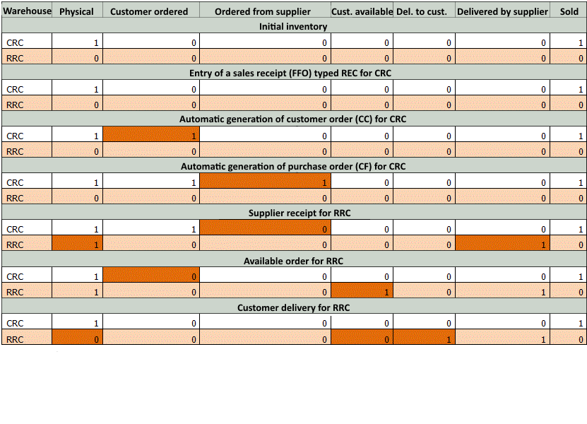

## Quotations and Special Orders

### Contents

Quotations and Specials Orders - Contents

Customers sometimes wish to buy items that are unavailable in the store. The quotations and special orders module allows the entry of special orders, with a preliminary price request phase. This document describes the various steps involved from the entry of the quotation to the generation of the order.

This module (30547) must be serialized before it can be used.

Preliminary settings
- Company settings
- Configuring the supplier record
- Field settings
- Configuring reason tables
- Settings for receipts and reports
- Managing access rights

Managing quotations and special orders in Front Office
- Creating a quotation
- Following up a quotation
- Sending a quotation to a supplier
- Valuation of the quotation
- Saving the customer's decision
- Workshop go-ahead
- Order generation
- Close/Reopen an order

Managing quotations and special orders in Back Office
- Follow up of quotations
- List of quotation lines
- Generation of special orders

### Preliminary Settings

Settings for Quotations and Special Orders

Company settings

Back Office > Administration > Company > Company settings > Commercial management > Customer orders and reservations

Open Customer orders and reservations and populate the settings described here .

populate the settings described here

Configuring the supplier record

Back Office > Basic data > Suppliers > Suppliers
- Quotation management: The Addition tab of the Supplier record enables the entry of information about quotation management.
- Management of additional addresses: Additional addresses can be entered in the supplier record via the [Complementary data/Addresses] button.

Field settings

Back Office > Settings > Quotations and special orders > Field settings

These settings enable you to hide fields and make others mandatory.

Configuring reason tables

These tables are used to specify the reasons why a customer accepts or refuses a quotation, and how the customer is informed about the quotation. You will be prompted in Front Office to specify that information at the Register the customer's reply step.

Register the customer's reply

Customer agreement type

Back Office > Settings > Quotations and special orders > Customer agreement type

This table specifies the various means used by the customer to give their agreement: e-mail, post mail, signature of the quotation in the store, phone, etc. In Front Office, these table elements are presented in field Quotation accepted and confirmed by.

Refusal type

Back Office > Settings > Quotations and special orders > Refusal type

This table is used to specify the various reasons why the customer refuses the quotation: price, change of mind, lengthy delivery times, etc. In Front Office, these table elements are presented in field Reason for refusal.

Information medium

Back Office > Settings > Quotations and special orders > Information medium

This table specifies the various means used to communicate with the customer about the quotation: e-mail, in the store, phone, etc. In Front Office, these table elements are presented in field Customer notified by the following information medium .

Settings for receipts and reports

Back Office > Settings > Quotations and special orders > Receipts and/or Reports

These commands are used to define the templates for printing receipts and reports for quotations and special orders.

Access right management

Back Office > Administration > Users and access > Access right management

The following access rights must be managed for the different user groups.

| Menu | Sub-menu | Access right |
| --- | --- | --- |
| Menu 26 – Concepts | Commercial management - Quotations and special orders | Deleting a quotation Display step "Send go-ahead" |
| Menu 102 – Sales/Retail sales | Quotations and specials orders | The options on this menu allow you to authorize the relevant user groups to perform the following actions in Back Office: Follow up quotations List quotation lines Generate special orders |
| Menu 105 – Settings | Quotations and specials orders | The options on this menu allow you to authorize the relevant user groups to perform the following actions in Back Office: Customer agreement type Information medium Refusal type Reports Receipts Field Settings |
| Menu 109 – Customers | Quotations and specials orders | The options in this menu allow you to authorize the relevant user groups to perform the following actions in Front Office: Enter a quotation Follow-up a quotation Quotation to send Quotation to value Customer's reply Quotation go-ahead Generate special orders Close/reopen a quotation Query available orders by line or by document |

### Quotations and Special Orders in Front Office

Management of Quotations and Special Orders in Front Office

Quotations and special orders can be used in Front Office from the Customers module or the Sales receipts module. All commands described hereafter will be used in the Customers module. However these commands are also available in Sales receipts > Sales > Enter transaction.

From the Enter transaction command, press the [Customer services] button, select Quotation , and then the command you want to use. The procedures are the same as described below.

Creating a quotation

Front Office > Customers > Quotations and special orders > Enter a quotation

The customer comes to the store with a special request. He asks for the price and the delivery lead time for the item. A quote must be entered for the customer. Enter the following information and validate.
- Selection of salesperson
- Selection of the customer
- Selection of the supplier
- Selection of the item (or of the service): if the item is already referenced in the file, select it in the Item field, otherwise use the Supplier reference field.

A notepad on the right side of the window enables you to enter additional information.

Following up a quotation

Front Office > Customers> Quotations and special orders > Follow up a quotation

The quotation will then undergo several steps that will be successively specified by the salesperson; these steps can also be viewed via this menu item. The Follow-up tab of the Quotation record displays the subsequent steps of the request.

Sending a quotation to a supplier

Front Office > Customers> Quotations and special orders > Quotation to send

Once the quotation has been entered, it must be sent to the supplier for valuation.

Select the quotation concerned and use the [Open] button to display the Quotation to send record.

Note that the Supplier shipping info field can be used to add a comment (for example, if the quotation is urgent.) The quotation can be sent to the supplier per e-mail or post mail.
- Send by e-mail: The [Send shipping slip] button allows you to send the quotation to the supplier via e-mail, to the address specified in the supplier record.
- Send by post: The [Print shipping slip] button allows you to print the quotation in order to send it to the supplier by post.

Valuation of the quotation

Front Office > Customers > Quotations and special orders > Quotations to value

This step corresponds to the moment when the supplier calls the store to give them the requested information (price, delivery lead-time, etc.)

Select the quotation concerned, use the [Open] button to display the Quotation - Supplier valuation screen.

Valued quotation or Quotation not possible

At this step, the quotation is valued or considered as not possible.
- If you get information from the supplier (price lists, delivery lead time, etc.), specify these elements and click the [Valued quotation] button.
- If the supplier cannot perform a valuation, click the [Quotation not possible] button to notify this situation.

In both cases, you have to inform the customer (see next section.)

Inform customer

You want to inform your customer immediately: use the [Call customer] button to save the customer's reply.

immediately:

You want to continue your quotation later: use the [Validate] button to save this step, and proceed with other things. You will be able to return to your quotation and proceed with step “Register customer’s decision.”

later:

Saving the customer's decision

Front Office > Customers > Quotations and special orders > Customer’s reply

This step corresponds to the moment when the store calls the customer to inform him of the conditions of sale and the customer decides if he accepts or declines the quotation: The customer's reply record is used to save the customer's decision via the following buttons:

Customer notified

This button is used to state that the quotation has been communicated to the customer, but the latter has not replied yet. The Information medium field indicates how the customer has been informed. This table must have been configured first (see section Information medium .)

Information medium

Quotation refused

This button is used when the customer refuses the quotation. The transaction is stopped and the quotation request is cancelled. The Reason for refusal specifies why the quotation is refused.

This table must have been configured first (see section Refusal type .) If within a reasonable time, the customer changes his mind, you can resume the refused quotation and finally accept it.

Refusal type

Quotation accepted

This button is used to state that the customer accepts the quotation; you can then enter a deposit. The Confirmed by field is used to specify how the agreement was confirmed. This table must have been configured first (see section Customer agreement type .)

Customer agreement type

If the quotation is accepted, the [Send a go-ahead] button allows you to go directly to the next step.

In any case, a comment can be added to the notepad via this button.

Workshop go-ahead

Front Office > Customers > Quotations and special orders > Quotation go-ahead

This step corresponds to the moment when the store has received agreement from the customer and sends a go-ahead to launch the order. You can also print the quotation before you send the go-ahead. Select the quotation concerned to display the Quotation go-ahead screen.

Order generation

This new step has two objectives:
- Checking the existence of the items within the database.
- Generating the purchase order for the customer.

Step: 1 Check the existence of the items

Back Office > Sales > Retail sales > Quotation and special orders > List quotation lines

The order can be generated only if the items or services specified in the quotation exist in the information system. Indeed, the order can be generated only if the items or the services do exist in the database. If it is necessary to create items (or services), you must first use the List quotation lines feature in Back Office.

List quotation lines

Step 2: Generate the order

Front Office > Customers > Quotations and special orders > Generate special orders

Select the quotation concerned to display the Generate special orders from quotations screen. Validate the information displayed on the screen to generate the purchase order. This order will follow the usual replenishment process for inventory to become later an available order for the customer that can be viewed in Customers > Quotations and special orders > Available orders.

Closing/Reopening a quotation

Front Office > Customers > Quotations and special orders > Close/Reopen a quotation

This step closes or reopens quotation requests. Go to the Additions tab and use the Display closed customer services criterion to display the closed quotations and reactivate them, if need be.

### Quotations and Special Orders in Back Office

Management of Quotations and Special Orders from the Back Office

Back Office > Sales > Retail sales > Quotations and special orders

The commands described below will handle some features seen previously, but in Back Office.

Follow up quotation

This command is used to search for a quotation based on several selection criteria. According to its status, a quotation may be modified or deleted.

List quotation lines

This command is used to create items that appear in a quotation, but are not yet referenced in the database. The screen displays the list of the quotation lines for which the item code is not specified.

Click this button to create a new item.

Generate special orders

This command allows you, just as in Front Office to transform a quotation into an order; but the order can be generated only if the items or services specified in the quotation exist in the information system (refer to List of quotation lines.)

Double-click the quotation of your choice: the Generate special orders from quotations screen displays.

Validate the information displayed on the screen to generate the purchase order.

This feature will follow the usual inventory replenishment process before being generated as an available order for the customer.

## Voucher Migration Utility

### Settings and Launch

=> See also procedure 402 (Accounting for Taxes at Cashing)

=> See also procedure 405 (Taxes at Cashing - Implementation)

=> See also procedure 406 (Taxes at Cashing - Interaction with External Solutions)

Settings and Launch

In the scope of redesigning the vouchers, integrating a new structure and associated APIs, it is necessary to resume the history of vouchers in order to be able to upgrade them to the new management.

The new voucher handling introduces two changes to how voucher settlement actions are recorded in the database:
- Documents created for this operation are now marked with the fictitious type "FIC" (previously typed "FFO").
- The document stub originates from acting user’s allocation store and not from the originating store.

The reason for this is that the settlement is processed in the Back Office and does not generated a physical receipt.

The purpose of this operation is to harmonize the vouchers between the old and the new management, among other things in terms of currencies.

This utility, which can be used only once , allows you to update all the old vouchers and to enable the new voucher management

Settings

Access rights

Back Office > Administration > Users and access > Access right management

To authorize the user groups of your choice to access this feature, enable the New management of vouchers access right available in the Administration (106) > Maintenance menu.

Company Settings

From the Company Settings WebApp

In Commercial Management > Front-Office > Link for payments, the setting New management of vouchers is grayed out and inaccessible.

It is disabled by default and will be activated automatically once the migration process is launched.

Launching the migration utility

Back-Office > Administration > Maintenance > New management of vouchers

In the scope of redesigning the paper values, integrating a new structure and associated APIs, it is necessary to resume the history of vouchers in order to be able to upgrade them to the new management.

This feature allows you to migrate to the new voucher management.
1. The following message displays when you run the command:

This utility allows you to migrate to the new voucher management.

The process will be run as scheduled task.

Note! No more vouchers must be created or modified!
1. Press the [Launch] button to generate a scheduled task.
2. The details of the updates made can be seen in the event log (see chapter below).
3. After the process completes, the New voucher management is enabled, but remains grayed out and inaccessible.
4. It is then no longer possible to run the migration process. A message will now appear indicating that the new voucher management is already enabled.

### Viewing the Update Process

Viewing the Update Process

Back Office > Administration > Event log > Log query

To view the different steps of processing, and the number of updated data, select : Level 1 - Administration / Level 2 - Maintenance / Level 3 - Settings.

Te process consists of six steps

Step 1

Processing issued but unused vouchers

For unused vouchers with different Document and Store currencies (GOC_DEVISE <> GOC_DEVISEETAB) and which types are the following: Credit note, Deposit, Gift certificate, Loyalty gift certificate, Gift card, Sales condition gift certificate:
- GOC_DEVISE is carried over to GOC_DEVISEETAB
- GOC_TOTALTTCDEV is carried over to GOC_TOTALTTC
- GOC_TOTALTTCDEV is carried over to GOC_TOTALDISPOTTC (except for credit notes)

Step 2

Processing partially used vouchers

Only partially used gift cards and deposit payments with different Document and Store currencies are resumed:
- GOC_DEVISE is carried over to GOC_DEVISEETAB
- GOC_TOTALTTCDEV is carried over to GOC_TOTALTTC
- Calculation of GOC_TOTALDISPOTTC based on the consumption history

Step 3

Numbering vouchers

Step 3.1
- Once the migration utility has been run, you can no longer create register operations without voucher numbers for register operations of types Gift certificate acquisition Gift card acquisition, Loyalty certificate acquisition, Acquisition of sales condition gift certificate, and Deposit payment, as well as for payment methods of type Credit note. Thus, for all these register operations and payment methods, the field Allocation of voucher number (available in the Outstanding Payments tab of each of these records) will change from No to Automatic . Note that once the migration utility has been run, the No value will no longer be available for these types of register operations and payment methods.

Step 3.2

Assigning a number to unnumbered vouchers.

Step 4

Processing vouchers managed by an external service provider.

Step 5

Associating the current vouchers to the new management.

Step 6

Activating the new voucher management.

## Tax Refund Connectors

Tax Refund Connectors

Listed below are the different tax refund connectors used by Cegid Retail Y2.

PLANET
- Version 1.2.9
- Version 1.3.2
- Version 1.4
- Version 1.4.2

GLOBAL BLUE
- Version 1.2.9
- Version 1.3.2
- Version 1.4
- Version 1.4.2

## Travel Retail - Airport Sales

Airport Sales

This feature is aimed at meeting the specific needs of airport sales, notably the entry of customers’ boarding pass information on the register.

Please note!

The Airport Sales module is applicable only in the case where the store in the airport of origin is located in EUROPE. (Example: Exclusive of tax sales in an airport store in Paris for a NYC flight destination. Not applicable in an NYC airport for a Paris flight destination.)

R equired settings

Module serialization and activation

Back Office > Administration > Company > Serialization > Activation of modules

Back-Office > Administration > Company > Company settings

You must acquire and serialize the Travel Retail module before you can use it.

This will automatically activate the Travail Retail company setting available in Administration > Distribution.

This company setting determines the display of airport information in the store record, and the access to the list of airports.

Access Rights

Back Office > Administration > Users and access > Access right management

Activate the following access rights for the user groups of your choice in the following menus.
- Menu Sales (102): Reports / Airport sales
- Menu Sales receipts (107): Reports / Airport sales
- Menu Sales receipts (107): Access rights/Enter transaction/Manual entry of boarding pass
- Menu Basic Data (110): Stores / Airport management
- Menu Settings (112): Registers / Airport management

Configuring airports

Creating airport records

Back Office > Basic data > Stores > Airport management

Front Office > Settings > Register > Airport management

Use the [New] button to create a new airport and populate the following fields:

| Fields | Description |
| --- | --- |
| Airport | Code on 3 alphanumerical characters, and description on 35 characters. |
| Country | Choose a country from the countries table. |
| Category | This allows you to manage country groupings in reports. There are 3 predefined values: European Union, Outside the European Union, Dom-Tom (French Overseas Departments and Territories) |
| Export sales | This setting allows you to define the calculation method of the sale (see section “Declaring an airport store”.) This option applies to airports located in Europe. |

Note that this screen is available in Back Office. It is also available in Front Office in read-only mode.

Importing airports

Importing airports (MAEROPORT table) is managed using integrated checks. It is also possible to find the country code for an airport using its ISO code via the $$_CODEISO2, $$_CODEISO3, or $$_CODEISO3NUM fields.

Declaring an airport store

Back Office > Basic data > Stores > Stores

Go to the Miscellaneous tab of the store record and configure the options described hereafter.

| Fields | Description |
| --- | --- |
| Airport store | This field may take the following values: YES: All sales are subject to the presentation of a boarding pass. NO: A boarding pass is never required. Register operations for this store are unchanged. MIXED: The boarding pass must be presented for certain types of sales. The boarding pass input window will always open in the sales transaction entry screen. However, you can exit this window if the register is located in an airport store known as a "mixed" store. |
| Airport | If the store is an airport store or a mixed store, this field will prompt you to specify the associated airport. The values in this list are determined by the country of the store. Therefore, if a store is located in France, this field must correspond to a French airport. It is essential that you specify the country of the store in order to access the list of airports. |
| Export sale type | This field may take the following values: Tax excl. selling price list : This is the selling price exclusive of tax as entered in the Contact information tab (must be populated.) If this value is selected , then all types of items are concerned (merchandise, bill of material, service.) Markup/markdown rate : This is the selling price list inclusive of tax as entered on the Contact information tab, based on the option defined for export sales in the Additions tab: If this value is selected , then the constraints of the export sales on the item types apply and only the items of type Merchandise/ Bill of Materials are exempted, (services and financial items are not.) W/o tax + markup: To calculate the end price, VAT is subtracted from the tax-inclusive selling price (from the item price list or item record) to get the tax-exclusive price. The markup rate is then added to that price: Tax-incl. price = Tax-excl. price * (1 + MARKUP_RATE/100) Tax-incl. selling price list – Markdown rate: The tax-inclusive selling price (item price list or record) is used to calculate the end price The markdown rate is then subtracted from that price: Tax-incl. price = Tax-excl. price (1 – MARKDOWN_RATE/100) If the destination airport is specified as “Export sale,” the sale is automatically converted to a tax-free sale in one of the following ways: Using the tax-exclusive selling price of the store. Applying the export sale with a markup/markdown rate. If the destination airport is not specified as “Export sales”, the sale will be calculated in the usual way. |

Creating flight classes

Back Office > Settings > Stores > Flight classes

This command allows you to configure flight classes (e.g. Business class, Economy class.)

Configuring boarding passes

Back Office > Settings > Front Office > Register

Go to the Preferences tab and specify the following information:
- Boarding pass reader: This option must be ticked if the boarding pass is read by a reader.
- Customer required if no boarding pass: This the entry of the customer, mandatory in cases where an airport sale was entered without an associated boarding pass.

Entering a sale with a boarding pass

Front Office > Sales receipts > Sales > Enter transaction

Overview of the boarding pass feature

If the register is linked to an airport store, the Boarding Pass screen displays automatically. The first screen allows you to enter (or read) information specific to the boarding pass. Note that the sale cannot be initiated until all of the information has been entered. If the destination airport is specified as an Export sale, the sale is automatically converted to a tax-free sale in one of the following ways:
- Using the tax-exclusive selling price of the store.
- Applying the export sale with a markup/markdown rate.

In this case, the receipt will include the customer’s boarding pass information, and will be marked “EXPORT SALE”.

If the destination airport is not specified as Export sale , or if the boarding pass was not entered because it was optional, the sale is processed in the usual way.

The [Validate] button allows you to validate the boarding pass information, and to go to the transaction entry process.

The [Cancel] button allows you to exit the boarding pass screen:

- If the store is a mixed airport store, you are returned to the standard transaction entry screen.
- If the store is an airport store exclusively, the transaction entry screen closes completely (because the entry of boarding pass information is mandatory).

Once the sales transaction finalized, the receipt is printed with information relating to an airport sale (refer to “Printing a receipt.”)

At any time during the sale, the operator can view the boarding pass information entered (refer to section “Viewing boarding pass information.”)

Specific fields have been added to the boarding pass management feature; these fields are populated automatically as the boarding pass is read by the means of a 2D barcode scanner. The field concerned are: Booking code (or PNR), Day of flight, Seat.

Reading the boarding pass with a barcode reader

The device used to read a boarding pass must be a 2D barcode reader.

If a reader has been set up, the boarding pass has to be read by this device in order to populate automatically some fields displayed on the screen. The fields are populated automatically, taking into account the tax systems of the final destination airport (connecting flights are taken into account also.)

In the case where the barcode is read correctly, the sale can start normally, taking into account the export sale type.

Note: Users still have access to manual entry by clicking the [Manual entry] button. They must have the necessary access rights in order to modify the boarding pass information.

Printing the receipt

In the case of an airport sale, the standard sales receipt includes new information in the header of the receipt:

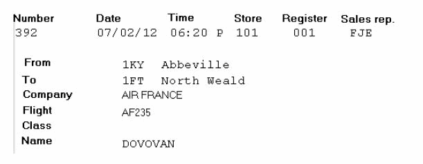

In the case of an export sale, “Export sale” is indicated on the receipt and on the sales transaction entry screen.

This information can be modified easily using the receipt generator.

Viewing boarding pass information

When entering a sales transaction, you can display the boarding pass again by using the [Zoom Menu - Show boarding pass] button. This function can also be configured as a button on the touch pad.

Reports on airport sales

Front office > Sales receipts > Reports > Airport sales

Back Office > Sales > Reports > Airport sales

In the selection criteria, the Report template field proposes two report types that do meet the customs’ requirements.
- The Summary report allows you to print the following information for each store: Customs reference of the item, Sales total based on WAPP pricing for 3 country categories (Countries of the European Union, Countries outside the European Union, Dom-Tom (French Overseas Departments and Territories)).
- The Detailed Report allows you to print the following information for each store and each item customs reference: Sales system (European Union/Export/Dom-Tom), Receipt number, Item code and description, Quantity sold, unit WAPP, Line amount (quantity x WAPP)