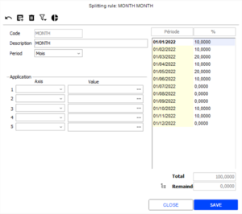
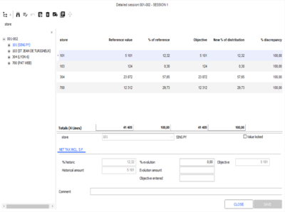
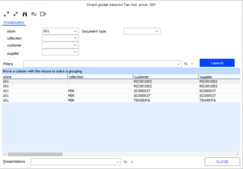
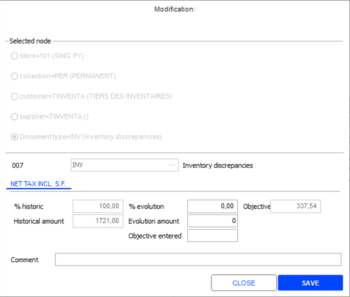
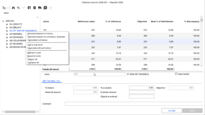
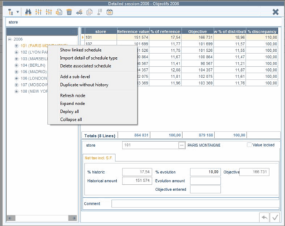
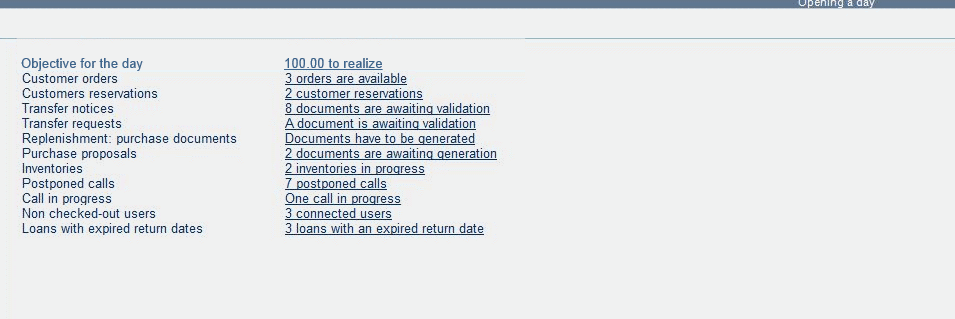
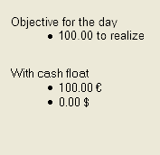
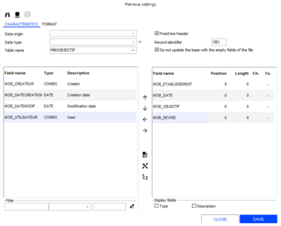

# Budgeting & Forecasting

*Source: Cegid Retail Y2 – Version 26 | Extracted: 2026-02-27*

---

# Budgeting & Forecasting

## Sales Objectives

### Contents

=> See also procedure 391 (Simplified Objectives in Cashing)

Sales Objectives - Contents

The Objectives module allows you to establish and track sales forecasts. Using the sales history, you can define, enter, and check objectives. The reporting tools then allow you to track sales progress in relation to the forecasted objectives.

Objectives are also available in store, so that managers can track sales objectives on a daily basis. Objectives are generated automatically from various criteria, such as history and objective periods, values, document types, etc. Once the criteria have been selected, it is very easy to enter objectives. You can choose from one of 3 methods: Entering an evolution percentage, Entering an evolution amount, or Entering an objective.

Finally, dashboards, cubes, and reporting tools allow you to track and adjust objectives, and to set up reports to track actual sales in relation to forecasted objectives and/or the sales history.

General settings
- Serialization
- Company settings
- Access rights

Creating a session
- General tab
- Application tab

Allocation schedule
- Defining an allocation schedule

Defining objectives
- Defining objectives
- Checking and adjusting objectives
- Data entry support

Schedule – Managing daily goals
- Values without schedule
- Values with schedule
- First value in the tree
- Refining schedules

Objectives reporting
- Cube
- Dashboard
- Store goals
- Objectives by period
- Reports available in Front Office

Daily (or simplified) objectives
- Enabling the management of simplified objectives
- Managing access rights
- Using the module
- Reporting
- Importing a daily objective

### Configuring Sales Objectives

Configuring Sales Objectives

Serialization

Back Office > Administration > Company > Serialization > Activation of modules

This feature is subject to the serialization of the Objectives & Budgets module.

Company settings

Back Office > Administration > Company > Company settings

Section Administration - Distribution

Once the serialization performed, the Objectives and Budgets setting is ticked. Moreover, you can configure in this section:
- The session that will be used on the register to calculate the daily objectives.
- And rounded daily objectives.

Section Commercial management - Default settings

In this section, you can:
- Select the first day of the week in order to force regional Windows settings, for example.
- Authorize the use of 4-4-5 periods in schedules

Access rights

Back Office > Administration > Users and access > Access right management

Select the Objectives (216) menu and enable access rights for user groups of your choice.

### Creating a Session

Creating a Session

Back Office > Objectives > Objectives > Session

A session is a framework for which objectives will be defined. It is thus characterized by several criteria (reference periods, document types, etc.) Moreover, creating a session enables you to specify axes that will be used to define sales objectives for the period.

To create a new session, click the [New] button and populate the fields in the various tabs.

General tab

Header

| Fields | Description |
| --- | --- |
| Reference period | The period the objectives are derived from. |
| Objective period | The period for which the objectives will be calculated. You could establish sales forecasts for the period January 1, 2014 to December 31, 2014, based on the sales made between January 1, 2013 and December 31, 2013. |
| Document type | Allows you to select the types of documents from which the objectives will be calculated. |
| Displayed value | Type of value the objectives will be based on, such as tax-inclusive turnover, tax-exclusive turnover, quantity, etc. |

Analysis axes

Between 1 and 5 analysis axes, such as customer, store, item user-defined tables, etc. In the case of the Currency axis in particular, currencies are provided as an analysis axis type so that the user can choose whether or not to include them:
- If the currency is not included as an axis, the information will be based on the GL_TOTALTTC, GL_TOTALHT, GL_PUHTNET, and GL_PUTTCNET values.
- If the currency is included as an axis, the information will be based on the GL_TOTALTTCDEV, GL_TOTALHTDEV, GL_PUHTNETDEV, and GL_PUTTCNETDEV values.

Splitting rule

You can define the period for which objectives are set in two ways:

By lead time

You can enter objectives for a 4-month period, a quarter, a 4-4-5 period, a month, a fortnight, or a week for the analysis axes defined in the session.

Once the previous fields populated and validated, click the [Objective Initialization] button, and select the periodicity. The objective session will then be initialized according to your chosen periodicity, for every analysis axis.

For a session defined by store and collection, and initialized per month, the approach will be as follows:

Session 1:

Store 1

Store 1

Collection 1

Collection 1

January

February

...

December

Collection 2

Collection 2

January

February

...

December

Store 2

Store 2

Collection 1

Collection 1

January

February

...

December

Collection 2

Collection 2

January

February

...

December

By defining the splitting rules

This method allows you to apply several types of periodicity to the analysis axes. For example, you could have one objective session per month for the Paris stores, and one per fortnight for Lyon stores – using a different allocation percentage depending on the axes.

Once the previous fields populated and validated, click this button, and select the periodicity. Validate the confirmation message that is displayed.

Then click this button and select Definition of rules to define the splitting rules.

In the window that displays, click the [New] button, then create a rule and, if necessary, apply it to specific axes.

The [Remainder] button allows you to assign the allocation balance in percent to an entry line. By default, the allocation percentages are initialized in linear format, i.e. equally throughout the entire period.

You can also initialize them using the sales history, by clicking this button.

Validate the definition of the rules, and click this button in the session record, and select Calculation according to the rules to apply the previous allocations.

Note that defining objectives by lead time is by far the simplest method.

Application tab

This tab allows you to work on selected values of analysis axes only. (Example: You can define objectives by stores, but objectives for stores located in France only.)

### Allocation Schedule

Defining an Allocation Schedule

Back Office > Objectives > Objectives > Allocation schedule

Once you have defined the characteristics of the session, you can create a typical week. This involves creating a weekly schedule, in which the allocation of sales in a standard week is estimated. By entering monthly objectives, fortnightly objectives, etc., you can then break down these objectives by day, in order to identify the applicable daily sales forecasts.

Example:

The Paris store’s weekly turnover is generally broken down as follows:

| Day | % |
| --- | --- |
| Monday | 10% |
| Tuesday | 15% |
| Wednesday | 25% |
| Thursday | 10% |
| Friday | 5% |
| Saturday | 35% |
| Sunday | 0% |
| Total | 100% |

Click the [New] button to create a new schedule, then enter the daily allocation percentages.

Note that the definition or use of an allocation schedule is optional.

### Entering Objectives

Entering Objectives

Back Office > Objectives > Objectives > Session

Input

Once the session has been initialized, and the schedule created if necessary, the objectives can be entered.

Therefore, you have to open the detailed session, by clicking this button displayed in the multi-criteria screen. Note that this button is also available in the session record.

You can also right-click on a line and select the Detailed session option to open a session. The following screen opens:

The left-hand side of the screen shows the analysis axes selected for the entry of objectives ( store), and at the lowest level, the periodicity (month.)

The right-hand side of the screen displays 6 columns by default:
- The analysis axis (here, store)
- The reference value of this axis value, i.e. the sales history for the period
- The reference %, i.e. this axis value’s contribution to the total
- The objective: the value of the objective to be entered
- The new allocation %: the axis value’s new contribution to total, according to the objective entered
- The discrepancy %: the difference between the reference value and the objective entered

The lower part of the screen allows you to enter the objectives in one of 3 ways:

| Fields | Description |
| --- | --- |
| % evolution | This allows you to enter an objective in terms of the % discrepancy in relation to the sales history. For example, if the sales history is equal to 100, and the % evolution is 20%, the objective is 120. |
| Evolution amount | The Evolution amount field allows you to enter a value that represents a change in relation to the sales history. For example, if the sales history is equal to 1,500, and the evolution value is 200, the objective is 1,700. |
| Objective entered | This allows you to enter the required objective directly. |

Checking and adjusting objectives

Once the objectives have been entered, you can check and adjust them if necessary using a specific dashboard.

Select a session line on the multi-criteria screen, then click on this button, and select the Session control option. Note that this button is also available in the session record. You can also access the session control with a right-click on a line and selecting the Session control option.

The information returned will be in a standard dashboard format: you are free to reorganize the data according to your needs. Double-click on one of the objective values to open the following window:

This allows you to adjust previously entered values if necessary: the fields correspond to those previously seen in the Detailed session window.

Data entry support

Duplicating a session

You can copy a session to a new session file easily using the [Duplicate] button. You have three options here:

- Header duplication: Only the session settings are copied.
- Total duplication: Both the settings and the data are copied
- Partial duplication: The settings and data up to the selected axis level are copied.

Simultaneous evolution on several axes

From the detailed session window

This function, accessed via the detailed session window, allows you to change the same level on several axes at the same time.

Example:

For a session defined by Store/Collection, you can increase the PERMANENT collection objective by 20% for all stores. In order to do this, go to the PERMANENT collection, then click the [Evolution for axes] button.

Locking values

From the detailed session window

It is possible to lock a level’s objective. All changes to objectives will be made without modifying the specified value. In other words, all other values will be recalculated in such a way that the locked value is preserved. In order to do this, once you have selected the relevant level, tick the Value locked setting, available in the right part of the screen. The locked value turns red.

Duplicating levels

From the detailed session window

You can duplicate any level of the tree by using the [Duplicate without history] button.

This copies the axis value and its sub-levels. A duplicate check or date consistency check completes this validation.

When making a copy, only the objective is transferred; logically, the history remains empty.

Creating levels and sub-levels

From the detailed session window

You can add a level to an existing axis using the [New] button. The new level does not contain any values or sub-levels.

Similarly, you can add a sub-level to an existing axis using the [Add a sub-level] button.

### Schedule – Managing Daily Objectives

Schedule – Managing Daily Objectives

Back Office > Objectives > Objectives > Session > [Menu/Detailed session]

A daily schedule, which can either be based on the history from the previous period or a schedule template, allows you to break forecasts down into daily objectives.

In the detailed session window, you can choose to initialize a schedule linked to a session.

In any case, a right-click on an axis value gives access to schedule options as in the example below:

These options are detailed hereafter; they differ whether you are positioned on a value having or not a schedule, or on the first value of the tree.

Values without schedule

Schedule based on history

This option generates a schedule using history as the reference period.

Schedule based on schedule template

This option calculates the schedule using a weekly allocation schedule template, and defines the objectives for each day as a % of the turnover for the week. The Allocation schedule screen displays and allows you to perform the following actions:

Create a new schedule

View the schedule template details

Generates a schedule template for the store concerned by the selection

Calculated schedule

This schedule is calculated from the average percentages of the daily sales figures realized within X weeks. This schedule will be calculated by store.

Values with schedule

Viewing a linked schedule

The Show linked schedule option allows you to query and modify previously generated schedules.

Importing schedule template details

The Import detail of schedule type option allows you to retrieve the schedule template exceptions that were defined in previous versions of the objective. Once the schedule template has been selected, and you have checked that exceptions exist for that schedule; these exceptions are imported into the schedule.

Deleting the linked schedule

The Delete associated schedule option allows you to delete a previously generated schedule.

First value in the tree

Schedules based on history for all axes

This option is available when you right-click on the session title; this allows you to generate a schedule for all the axes in the session.

A warning message indicates the number of schedules that will be generated, and prompts you to confirm the generation.

This is followed by a message prompting the automatic validation of all the schedules generated.
- If you answer yes, validation is carried out automatically.
- If you answer no, the user is free to query, modify, or validate each schedule one by one:

Schedules based on the schedule template for all axes

This option works the same as described above, except that you will be asked to choose a schedule template first.

Calculated schedules for all axes

This allows you to generate a schedule for all the axes in a session.

Delete all schedules linked to a session

This option allows you to delete all the schedules linked to the session, starting from the first axis value. A warning message appears before this process is executed.

Refining the schedules

You can then modify the schedules initialized for a given session one by one:

The schedule linked to the session is shown with a % initials column (containing the forecasts calculated using history) and a % entered column (allowing you to refine the results generated during initialization).
- When a schedule generated from the history is opened, the % entered column contains a copy of the % initials column.
- In schedules generated from a schedule template, the % entered column contains the weekly schedule template percentage model for the relevant session period.

If a percentage in the % entered column is modified, the Forecasted column is recalculated.

Conversely, if the Forecasted column is modified, the % entered column is recalculated.

Remainder management

When a percentage or an amount is modified, a remainder is generated: the sum of the forecasted amounts must correspond to the objective amount defined for the period, or the sum of the percentages for the period must make up 100%. Any remainder must therefore be divided up across the corresponding period. Therefore, the following tools are available on the screen:

Remainder options (preservation or compensation)

Here it is possible to select:
- Whether the change in the daily objective in the Forecasted column should alter the total. Therefore, use the {Remainder preservation] button.
- Whether the generated remainder should be transferred to another day. Therefore, use the {Remainder compensation] button.

Selection method (Single or Multiple)
- The Single selection method allows you to clear a remainder while locking a particular day. Once you have selected the day in question, an option called Allocate the remainder on the rest of the period becomes available via a right-click.
- The Multiple selection method allows you to lock the values for certain days (for example, you can specify that Sundays should remain at 0), divide the remainder out over the other days. In order to do this, select this method and then press the space bar to select the current line. A black dot will appear in the left-hand column to indicate the days that have been locked.

Finally, you can access the Allocate the remainder on non-selected dates option by right-clicking the % entered column when the relevant value appears in italics.

Note that the remainder can only be preserved if the following conditions are met:
- The schedule must be generated at the highest level
- The axis value on which the schedule is generated must not be locked
- The schedule period must not be locked
- The schedule period must exist in the detailed session window

### Objectives Reporting

Objectives Reporting

Cube

Back Office > Objectives > Objectives > Cube

This reporting tool allows you to display a cube, and generate the required axes, periods, and values.

Layout tab

In the Layout tab, you can select the axes and values you want to display. Similarly, you can use the available fields to add formulas.

In the settings of the element selected, the date should be formatted as follows:
- Format: DD/MM/YY or DD/MM/YYYY
- Group: None

Double-clicking on one of the lines allows you to open the schedule details. This point is covered in the next section.

A graph is also available:

Result tab

Daily reporting can be accessed via the cube by double-clicking on a line in the table.

If no schedules are available for the selected axes, you will be alerted by a warning message “No schedule was defined for this selection”; a reminder will also display at the bottom of the window.

If a schedule does exist for the selected axes, a reminder at the bottom of the window lets you know which axis the schedule corresponds to.

You can recalculate the amounts on the fly, by reducing the value of your current selection. This option can be accessed via a shortcut menu in the date columns via a right-click, option Recalculate from .

Dashboard

Back Office > Objectives > Objectives > Dashboard

The dashboard provides access to the same information and allows you to reorganize the data. Double-click on an axis value to view a graph for the selected line.

Store goals

Back Office > Objectives > Objectives > Reports > Store goals

In the Layout tab, three reports allow you to define the type of report for your daily objectives:
- Simplified report per day
- Monthly report (note: you have to tick the “Monthly report” option in the Criteria tab)
- Simplified report per axis

Objectives by period

Back Office > Objectives > Objectives > Reports > Objectives by period

This report allows you to generate a document containing the sales achieved, the objective, and the history for the selected axes:
- The Detail per day checkbox allows you to generate a document showing the daily results and integrating corrections made via the schedules.
- The View only the totals checkbox allows you to generate a summary of the session.

Reports available in Front-Office

At daily opening or closing

The store goals are displayed in the daily brief when opening or closing a sales day:

At daily opening

In the flash report

For this, you need to enter the objectives session to be used in the Commercial management > Front Office section of the company settings.

### Daily (or Simplified) Objectives

Daily (or Simplified) Objectives

Daily objectives provide simpler access, allowing daily sales objectives per store to be saved in Cegid Retail Y2. This module cannot be serialized and is not linked to the Objectives and budgets module which must be serialized.

The Objectives and budgets module is not affected by daily objectives as data is stored in additional and separate tables.

With the daily objectives you can do the following:
- Access a screen where you can enter, view, or modify daily objectives.
- Integrate this data using a simplified format.

Enabling the management of daily objectives

Back Office > Administration > Company > Company settings

The Management of daily objectives company setting must be ticked in Commercial management > Default settings.

Please note!

If the Objectives and Budgets module is already serialized (check in step 4 the module activation), this company setting will not be accessible because these two modules are not compatible.

Access right management

Back Office > Administration > Users and access > Access right management

The following menus and access rights must be activated:
- Menu Concepts (26) – Commercial management/Objectives: The Authorize the modification of the daily objectives concept allows you to modify these daily objectives. It has no impact on the objectives in the Objectives module.
- Menu Sales (102): Retail sales/Store goals
- Menu Sales receipts (107): Sales/Store goals

Please note!

The access right in Menu 216 > Objectives > Reports > Store goals is relating to the Objectives and budgets module and not to simplified objectives.

Using the module

Back Office > Sales > Retail sales > Store goals

Front Office > Sales receipts > Sales > Store goals

Here you can enter, query, and modify daily objectives. You can also import them. The values entered are always expressed in the currency of the store in question.

Reporting

in Front Office

Simplified objectives are displayed on the reports in the same way as the objectives described previously (see Reports available in Front Office .

Reports available in Front Office

In reports

You can use the @MCALCOBJECTIFJOUR function to print a store's daily objectives.

Importing daily objectives

Back Office > Data exchanges > Data recovery > Settings > Recovery formats

Daily objectives can be imported using our standard import module. A standard format is supplied:

Integrating a daily objective deletes and replaces the existing objective. The data to be transferred by this simplified import function consists of:
- Store
- Current date
- Goal
- Currency