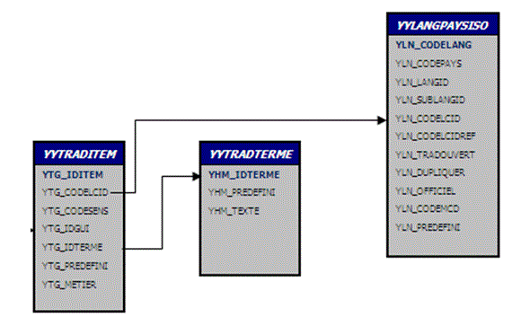
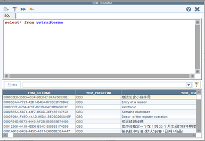
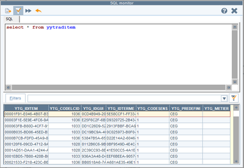
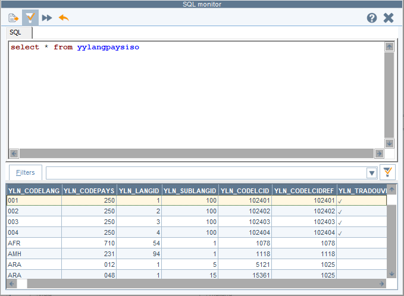
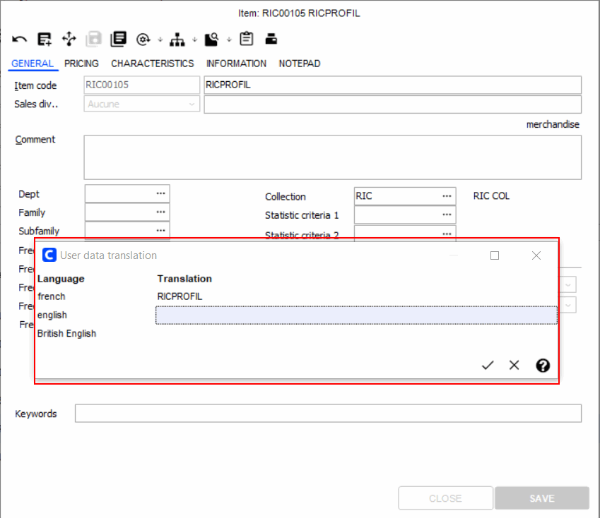
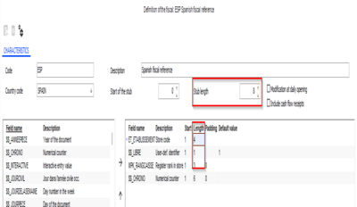
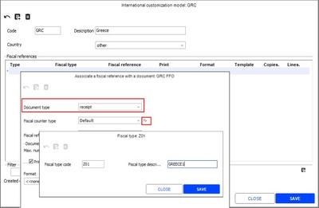
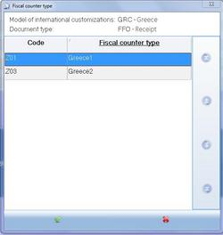

# Localization

*Source: Cegid Retail Y2 – Version 26 | Extracted: 2026-02-27*

---

# Localization

## Translation Management

### Contents

=> See also procedure 212 (Adding a New Language)

=> See also procedure 292 (Optimization Dictionaries)

=> See also procedure 293 (Integrating Dictionaries )

=> See also procedure 314 (Translation Process)

Translation Management - Contents

The purpose of this document is to explain the translation process. Note that:
- The following tables are used: YYLANGPAYSISO, YYTRADTERM and YYTRADITEM, whose keys are GUIDs, generated by Cegid.
- FRA (French) terms are used as a reference for translating messages and screens. Consequently, the French dictionary (YYLANG1036) must always be installed, just like any other language.
- There are no restrictions on the dictionary volume. The only limitation is memory size. In fact, the dictionary is specific to a database. Moreover, only the languages used are loaded into memory.
- Term customization by the customer is kept when terms are updated.

For more information on country activation (country packages), see the Company Settings topic Administration/Location .

Translation tables
- Description of translation tables
- Table YYTRADTERME
- Table YYTRADITEM
- Table YYTRADGUI
- Table YYLANGPAYSISO
- Other translation tables

Translating Cegid Retail applications
- Translating the interface
- Translating the connection screen
- Translating reports
- Translating languages with special characters
- Translating names for user-defined report and receipts

Additional translation tools
- Modifying translations (customized translations)
- Deleting translations
- Dictionary checker
- Translating customer data via import and export
- Selecting fields and subtables to translate
- Updating translated data manually

User management
- Cultural profiles
- Associated access rights

### Translation Tables

Translation Tables

Description of translation tables

Setting up translating within a database begins with table management. This mechanism may be shown through the diagram below.

Table YYTRADTERME

This table contains French and foreign terms, without naming the language or translation. They are interface data (Cegid Retail Y2 data.)

They may be:
- supplied by Cegid (YHM_PREDEFINI = "CEG")
- customized by the user (YHM_PREDEFINI = “DOS”)

Each term is identified by a unique code called GUID: the YHM_IDTERME is therefore different for each term.

The YHM_TEXTE field shows descriptions for all terms in the interface. (Example: Article, item and articolo are three distinct records in the YYTRADTERME table, without any link between them

Table YYTRADITEM table

This table contains the link between terms and languages. This is an intermediate table linking objects to translation languages.

| Field | Description |
| --- | --- |
| YTG_IDITEM | Unique identifier of the record. |
| YTG_IDTERME | This field acts as a link with the record in the YYTRADTERME table. It corresponds to the YHM_IDTERME field for the YYTRADTERME table. |
| YTG_IDGUI | Acts as a link with the record in the YYTRADTERME table. Each term related to the same word has the same YTG_IDGUI regardless of language. Example: article, articolo, item have the same YTG_IDGUI. |
| YTG_CODELCID | This field corresponds to the code of the translation language. This corresponds to the Microsoft coding (LoCale IDentifier) for regional settings, which allows you to make distinctions between regional specifics for the same language. Example: French - France = 1036 French - Belgium = 2060 Note that regional settings (also called site settings, linguistic environment, regional and linguistic options or even cultural options or locale,) comprise a set of text and format definitions useful for software localization. They enable the software to display data according to cultural and linguistic requirements for each user language and country: Comma type Numerical digits Date and time formats Monetary units, Alphabetical order for letters (which may vary according to region) Etc. |
| YTG_PREDEFINI | Shows whether the entry is a CEGID translation (= "CEG") or a user-defined translation (= "DOS"). |
| YTG_METIER | Corresponds to a business code for the translation of business-specific terms. |
| YTG_CODESENS | Shows the code corresponding to the meaning of the translation. The default value is "1", determining the first meaning of the translation. |

Table YYTRADGUI

This table lists the various objects in the application that may be translated. These objects are application messages, graphical objects or objects provided by records or reports. The table is not managed in the current version of the application.

Table YYLANGPAYSISO

This table contains language associations with countries, enabling an LCID code to be created, used by Microsoft.

| Fields | Description |
| --- | --- |
| YLN_CODELANG | Alphanumerical ISO3 language code (ISO 639-1 standard.) |
| YLN_CODEPAYS | Numerical ISO3 country code. |
| YLN_LANGID and YLN_SUBLANGID | They compose the LCID code. Resulting in the following formula: CODELCID=LANGID + 1024 * SUBLANGID. |
| YLN_CODELCID | Regional language variety (e.g. Quebec French.) |
| YLN_CODELCIDREF | The YLN_CODELCIDREF field shows the LCID code for the reference language for a "sub-language." For example, for American English (code 1033), the reference language is British English (code 2057). |
| YLN_CODEMCD | This field cross-references LCID codes and language codes used in MCD CEGID (TTTRADUCTION subtable.) This results in the following mapping: YLN_CODEMCD YLN_CODELCID Description ARA 7169 Tunisian CHT 1028 Traditional Chinese CHS 2052 Simplified Chinese DUT 1043 Dutch ELL 1032 Greek ESP 3082 Spanish (Spain) FRA 1036 French (France) FRC 3084 French (Canada) GER 1031 German ITL 1040 Italian JPN 1041 Japanese KOR 1042 Korean POR 2070 Portuguese (Portugal) RUS 1049 Russian SWE 1053 Swedish TUR 1055 Turkish UK 2057 English (UK) US 1033 English (US) VNM 1066 Vietnamese | YLN_CODEMCD | YLN_CODELCID | Description | ARA | 7169 | Tunisian | CHT | 1028 | Traditional Chinese | CHS | 2052 | Simplified Chinese | DUT | 1043 | Dutch | ELL | 1032 | Greek | ESP | 3082 | Spanish (Spain) | FRA | 1036 | French (France) | FRC | 3084 | French (Canada) | GER | 1031 | German | ITL | 1040 | Italian | JPN | 1041 | Japanese | KOR | 1042 | Korean | POR | 2070 | Portuguese (Portugal) | RUS | 1049 | Russian | SWE | 1053 | Swedish | TUR | 1055 | Turkish | UK | 2057 | English (UK) | US | 1033 | English (US) | VNM | 1066 | Vietnamese |
| YLN_CODEMCD | YLN_CODELCID | Description |
| ARA | 7169 | Tunisian |
| CHT | 1028 | Traditional Chinese |
| CHS | 2052 | Simplified Chinese |
| DUT | 1043 | Dutch |
| ELL | 1032 | Greek |
| ESP | 3082 | Spanish (Spain) |
| FRA | 1036 | French (France) |
| FRC | 3084 | French (Canada) |
| GER | 1031 | German |
| ITL | 1040 | Italian |
| JPN | 1041 | Japanese |
| KOR | 1042 | Korean |
| POR | 2070 | Portuguese (Portugal) |
| RUS | 1049 | Russian |
| SWE | 1053 | Swedish |
| TUR | 1055 | Turkish |
| UK | 2057 | English (UK) |
| US | 1033 | English (US) |
| VNM | 1066 | Vietnamese |

Other translation tables

| Table | Description |
| --- | --- |
| TRADDATA | This concerns the translation of fields (those made translatable in the TRADDCT table.) Installing dictionaries transfers data from YYTRADTERME to TRADDATA (fields.) |
| TRADTT | This concerns the translation of subtables (made translatable in the TRADDCT table.) Installing dictionaries transfers data from YYTRADTERME data to TRADTT (subtables.) |
| TRADDCT and TRADPREDCT | Transfers from TRADPREDCT to TRADDCT are done in Cegid Retail Y2 (Administration > Multilingual > Data translation, option Select fields and subtables to translate .) |
| TRADPREDCT | Data is supplied to this table by Cegid. It is a dictionary of fields and subtables that could potentially be made translatable (corresponds to the left side of the screen available in Administration > Multilingual > Data translation, option Select fields and subtables to translate .) |
| TRADDCT | This is the dictionary of fields and subtables made translatable (corresponds to the right side of the screen available in Administration > Multilingual > Data translation/ > Select fields and subtables to translate.) |

### Translating Cegid Retail Applications

Translating Cegid Retail Y2 Applications

This topic lists the operations required for translating applications, using dictionaries supplied by Cegid. Once these operations have been carried out, customized translation may be done using the procedure described in topic Customized translation .

Customized translation

Prerequisites

Up to now the BOZ files required to install the translations were downloaded when installing the Cegid Retail Administration Tools kit.

This is no longer the case from version 18. A new kit, TASKSCHEDULER_RETAIL_TRANSLATIONS.msi, is now available; it installs the BOZ files in a fixed and non-modifiable directory on the task server. The goal is to streamline the integration and update of a new dictionary on a client platform, especially for a SaaS installation.

For the moment, the user must integrate this kit manually on the task server.

Translating the interface

Installing Cegid dictionaries

Back Office > Administration > Multilingual > Install translations

Cegid applications are shipped with many files allowing the software to be translated into various languages.

To add a dictionary to the database, click the [Install a translation] button. The List of installable languages window displays.

Using the space bar, select the language to install and click the [Select] button. The progress bar shows the gradual integration of the dictionary. The integration is run as server process on a task server.

As the French terms (FRA) are used as reference for the translation of messages and screens, the French dictionary (YYLALNG1036) must always be installed like any other language.

Moreover, note that is still possible to use Cegid Retail Tools (Administration/Install translations) to integrate a dictionary. The procedure is the same as the one described here.

Identifying languages

The languages proposed may be identified by their LCID code (see Table YYLANGPAYSISO .)

Table YYLANGPAYSISO

Translating the connection screen

Back Office > Toolbar on the Home page > [Context] button.

The connection screen is the first screen displayed, even before the user login.

In order to enable its translation, you must set a default connection language. Moreover, to ensure that the connection screen will be translated, the CegidPgi.dic file must be located in the application’s directory. This is done automatically when installing or updating a Cegid application.

This feature is available from the [Context] button in the upper right part of the home page.

Click the [Preferences] button and open the International tab.

Select the language of your choice from the Default language for connection field, then validate. From now on, the user may connect with the associated language (see Managing Users

Managing Users

Translating reports

Back Office > Toolbar on the Home page > [Context] button.

his feature is available from the [Context] button in the upper right part of the home page.

Click the [Preferences] button and open the International tab.

Check the Show reports in all languages option, then validate.

The choices set here enable you to select in Page layout of reports the language in which these reports are printed.

Translating languages with special characters

Back Office > Toolbar on the Home page > [Context] button.

Some languages, like Turkish, Greek or Thai, require the use of a particular font to be set here.

Please note!

For this setup to be effective, you must connect with a user with a cultural profile other than French . Otherwise, data will not display correctly (vertical black bars instead of special characters).

cultural profile

other than French

Procedure
1. Click the [Context] button in the upper right part of the home page.
2. Click the [Preferences] button and open the International tab.
3. Check the Enable settings for complex script languages option.
4. Select @Arial Unicode MS in the Display font field. This font can also be used for Chinese and most of the languages supported Cegid Retail Y2.
5. The Menu Font Size option, presented as a slider, allows you to adjust the font height of the menus on the Home page and in the Context window.

Concerning this last option, beware of truncated displays! Indeed, if this setting allows you to increase the height of the font, it does not change the size of the display area.

Several adjustments may be necessary to find the right display.

Translating names for user-defined reports and receipts

Translating user-defined report names

Back Office > Basic data > BO (or FO) user-defined reports > Translation

Front Office > Settings > Printing templates - Modify user-defined tables > Translation

You may translate Back Office and Front Office user-defined report names. Foreign users can use the bottom part of the screen to enter a translation in their own language for existing user-defined reports .

existing user-defined reports

Translating receipt names

Back Office > Settings > Front Office > Translation of receipts

Front Office Settings - Printing templates - Translation of receipts

This command enables you to translate receipt names. Select the receipt to be changed from the upper section of the screen; then click the "Template description" field displayed at the bottom of the screen. A window will open allowing you to enter the desired translation.

### Additional Translation Tools

Additional Translation Tools

The previous topic provided an overview of how translations work in the Cegid Retail Y2 application (integration of the Cegid dictionary, translation of reports, etc.)

This topic now addresses the "maintenance" aspect of translations by detailing the operations involved in modifying a translation, importing or deleting a dictionary, checking the conformity of translations, etc.

Modifying translations (customized translations)

Back Office > Administration > Multilingual > Translation

In addition to the options and functions previously seen for standard translations in applications, you can manage a private dictionary by creating or importing customized translations.

This command therefore enables you to manage terms imported during installation or update of language files, but also terms you have translated. There are two dictionaries within this command:
- The Cegid dictionary, containing translations loaded during installations or updates. These translations are displayed in black.
- A private dictionary, containing the translations you have modified manually or imported via the [Import private dictionary] button. These translations are displayed in blue.

Any translations that have been modified are considered to belong to the private dictionary, as opposed to the Cegid dictionary. These translations are displayed in blue for easier identification.

The translation provided by Cegid will not be overwritten, however: Throughout the various tables, Cegid translations will be labeled "CEGID" (CEG), while customer translations will be labeled "DOSSIER" (DOS).

This means that private dictionaries will not be impacted by version updates. Only the Cegid dictionary will be updated, without deleting your translations. If there is a term with two different translations, the one in the private dictionary will have priority.

Modification procedure by import/export

You can modify a term here and then, but you can also modify a large number of terms through a .txt file. Therefore, you must first export the terms to be modified on the basis of your own criteria selected from the multiple criteria (language, item starting with, non-translated terms, etc.)

When the labels have been displayed, click the [Export dictionary] button. Open the generated .txt file and change the translations without never changing the French terms.

never

Once your translations have been modified, you can re-import the .txt file using the [Import private dictionary] button. The modified text will then be displayed in blue for easy identification and become part of the private dictionary.

Warning!

If you want to change translations again that you have already modified (and are therefore a part of a private dictionary,) click the [Export private dictionary] button. Only the text displayed in blue will be exported..

Deleting translations

Back Office > Administration > Multilingual > Delete translations

A major effort has been made to clean up Cegid dictionaries in order to remove from our dictionaries obsolete terms that have been present for long. As a result of this purge, new lightweight .BOZ files were generated, much smaller in size than the old ones. The Delete translations command therefore allows you to finalize this purging work by deleting all the translations in the database, regardless of language. Once the translations have been deleted, the new, purged and lightened Cegid dictionaries can be integrated in the form of new .BOZ files.

This operation is carried out in two steps, using a wizard:
- Step 1 (BEFORE processing): Export customized translations for each language (backup operation.)
- Step 2 (AFTER processing): Install translation and import customized translations.

Step 1 of the deletion wizard

This first step informs the user about the essential action to perform BEFORE starting the process, i.e. backing up customized translations, otherwise they will be lost . Indeed, the purpose of the operation being to lighten the dictionaries, you have to purge first all obsolete translations, regardless of language, so that the new lightweight dictionaries can then be integrated.

This backup is done by exporting the desired language, using the [Export private dictionary] button. Only the terms displayed in blue that you have modified can be exported in a .txt file.

Step 2 of the deletion wizard

The second step of the wizard starts processing and displays a confirmation message. The process is launched in process server mode and a recap is displayed at runtime, specifying the start date/time of the process, as well as the list of all deleted languages. This operation is tracked in the event log.

You can now install the new Cegid dictionaries (see Translating the Interface ), then import your customized translations, using the [Import private dictionary] button.

Translating the Interface

Dictionary checker

Back Office > Administration > Multilingual > Dictionary checker

This command enables you to verify the messages for which the translation is not in conformity with the original structure of the message. This especially concerns translation of variables. Click the [Start] button to initiate the process.

Translating customer data via import and export

Back Office > Administration > Multilingual - Data translation > Export data to translate

This section relates to the data contained in the TRADDATA and TRADTT tables, i.e. customer data (such as descriptions for items, user-defined tables, etc.) Objective:

customer data
- Export data in French, with the corresponding translation if applicable, to an .asc file.
- Send this file to a translator, in order to do the required translation.
- Import the file with the translations so that it can be integrated into the application.

This command will therefore allow you to select subtables and fields to be exported.

Exporting the terms to translate

Terms to export are selected using the keyboard space bar or the [Select all] button.

Then, use this button to start exporting. This will be done in the .asc file shown in the Path field in the Settings tab.

An .asc file will then be created for each of the selected languages. Once the .asc file has been generated, the user may translate or have translated the extracted terms. The user can then re-import the translations into the database using the standard data import method.

Translation import settings

Back Office > Data exchanges > Data recovery - Settings/Recovery formats

Select Default recovery for the data origin, in order to configure the 3 following formats ( Record identifier column): TRC, TRT, TRG.

Note: In the Format tab, the separator is ALWAYS a tabulation and the Column field corresponds to the column number in the .asc file.

Configuring TRC, TRT and TRG formats

| Formats | Description | Characteristics tab | Format tab |
| --- | --- | --- | --- |
| TRC | Enables the import of “FIELD” type data | The right side of the screen will display the following fields: TDA_CHAMP TDA_CLE TDA_LANG TDA_VAL | File format section: Check: Tabulation separator "Data format" section: Date format = DDMMYYYY Boolean format = Yes/No Decimal separator = . (decimal point) |
| TRT | Enables the import of “SUBTABLE” type data | The right side of the screen will display the following fields: $$_TABLETTE TDT_CODE TDT_LANG TDT_LIBELLE | Same |
| TRG | Enables the import of “SHORT” type data | The right side of the screen will display the following fields: $$_TABLETTE TDT_CODE TDT_LANG TDT_ABREGE | Same |

Importing translations

Back Office > Data exchanges > Data recovery > Data import

This command enables you to import the translated file.

Selecting fields and subtables to translate

Back Office > Administration > Multilingual > Data translation > Select fields and subtables to translate

To enable a user field or subtable for translation (so that it can be translated by a "Translator" user), the field or subtable must be displayed on the right-hand side of the screen.

Using these buttons you can move:
- the lines one by one
- all lines at the same time.

Only those fields that are selected on the right-hand side will be translated. This optimizes the display of information for users whose display language is different from the folder language. By default, many fields are preselected. This display can be narrowed down based on the fields of the multi-criteria screen, especially the Functional domain criterion (documents, items, registers, etc.).

Note: when running the Cegid Retail Administration Tools, only the fields and subtables that contain at least one translated data item will be retained in the section on the right. The others are transferred back to the section on the left, to lighten the database.

For the changes to be taken into account, you need to shut down the application and ideally restart the server.

Manual update of data translation

Back Office > Administration > Multilingual > Update data translation

This utility (available for French folders) enables you to copy the data from translation tables (YY...) to the TRADDATA and TRADTT tables.

If there are "DOS" translations, only these are processed, otherwise, "CEG" translations are used. In fact, you always process one or the other, but not both.

The integration of dictionaries automatically includes this update. There is therefore no need for a manual start-up.

### Managing Users for Translations

Managing Users for Translations

This section describes the operations that allow users to connect to Cegid Retail Y2 in their own language.

Cultural profiles

Users associated with a cultural profile will be able to use Cegid Retail Y2 in the language defined in this record and translate customer data from French. For example: Creating an English profile will enable users associated with it to use the applications in English, and translate customer data from French into English.

Creating cultural profiles

Back Office > Administration - Users and Access - Cultural profiles

No need to create the cultural profile for French users, the default is FRA. You may create other profiles that reflect how you use Cegid Retail Y2.

To create a profile, click this button and enter the following data:

| Fields | Description |
| --- | --- |
| Code | Unique code to identify the profile. Examples: FRA = French, US = American English, UK = British English, etc. |
| Software language | This information allows you to specify in which language the software displays screens, menus and all interface data. If the language in this field is "American”, Cegid Retail Y2 screens are displayed in this language for the users associated with this profile. |
| Translator | The translator is considered to be a privileged user who can change translations. |
| Translator reference language | This language is available only if the Translator setting is checked. If the language of reference is Spanish, the translator may view a term in 3 different languages when making changes to it. French: always displayed English: displayed by default, but may be changed in the scroll-down list. Reference language: in this example, Spanish. |
| Data languages | User data (item descriptions, etc.) will be displayed in: The folder language, defined in the Administration > Company > Company settings > Accounting > Folder settings > Default data language field (French, in the screen below). The main language of the cultural profile (English in the screen below). The secondary language of the cultural profile (Spanish in the screen below). |

For example: Left-clicking the Description field in the item record will open the following window:

Notes:
- If the user is a Translator, they have access to data translations in the Administration > Multilingual > Translation. Otherwise, this menu is not be available.
- If the user is a Translator, and has connected to the application in a language other than French, the Modify dictionary option can be accessed in translatable fields by right-clicking the mouse.

Assigning a cultural profile to users

Back Office > Administration > Users and access > Users

Once the cultural profile defined, it must be assigned to a user record in the Characteristics tab.

This button gives direct access to the cultural profile record.

Once the dictionaries have been installed, and fields and subtables made translatable, users may access Cegid Retail Y2 in the language set in the cultural profile they have been assigned to.

Access rights

Back Office > Administration > Users and access > Access right management

Access rights grant or deny access to certain actions or menus, according to user groups. All the functionalities seen in this document are therefore subject to access rights which may be enabled in the following menus.

Menu Settings (105) - Front Office

This menu allows you to grant or deny access to the Translation of receipts command.

Menu Administration (106)

The Users and access section allows you to grant or deny access to Cultural profiles .

The Multilingual section allows you to grant or deny access to the following commands:
- Install translations
- Delete translations
- Translation
- Dictionary checker
- Data translation
- Update data translation

Menu Basic data (110)

The BO and FO user-defined reports section allows you to grant or deny access to the Translation command.

Menu Settings (112)

This menu allows you to grant or deny access to the following commands in FO:

Printing templates:
- Modify user-defined reports > Translation
- Translation of receipts

Administration > Users and access:
- Cultural profiles
- Multilingual

Menu Pop S5 (27)

This menu allows you to grant or deny access to the Modify dictionary command for the BO / FO / HRO applications.

## Fiscal References

### Contents

=> See also procedure no. 264 (Document Counters)

Fiscal References - Contents

Documents are currently referenced in Cegid Retail Y2, using two types of counters:
- Internal counter: This is a chronological counter based on the store and cash register.
- Internal reference: This information is a second unique identifier. Its composition is as follows: Register code + register day number + receipt type + chronological number in the register day.

The aim of this new function is to add a third chronology, referred to as a Fiscal reference, which is intended to satisfy the relevant legal constraints in most countries. Its flexibility in terms of customizing the chronology of documents helps to ensure that international fiscal requirements are met.

Internal Counters
- Overview
- Using configured counters by store
- Wizard for counter creation by store

Internal reference for receipts
- Counter reset
- Internal reference display
- Internal reference barcode

Fiscal counter structure (fiscal references)
- Register rank
- Creating fiscal references
- Automatic counter reset
- Manual modification of counters

International customization models
- Creating models
- Associating international customization models

Information specific to receipt type documents
- Invoice receipt
- Standalone mode
- Securing the fiscal counter decrement
- Features available when entering a sales transaction
- Selection of the fiscal counter type

Using a specific fiscal counter for credit notes
- Document processing principle
- Defining fiscal references
- Operating in Front Office and processing documents

### Internal Counters

Internal Counters

Overview

Every sales receipts document is identified by an internal counter, which must be a component with a unique database key. This type of counter was originally used by Cegid Retail Y2. These settings require the creation of a counter (stub) and associating it to:
- a document type
- a document type and a store

Managing counters by store was put into place to streamline and facilitate configuration.

A document is uniquely identified by its composition:
- document type (ticket, invoice, credit, etc.)
- store code
- year (“yearly management” option)
- chronological number

A counter is managed for each document type and each store in order to attribute a chronological number.

|  |  | Identifier |
| --- | --- | --- |
| Order of input | Document | Type | Store | Number |
| 1 | Invoice | FAC | 038 | 000001 |
| 2 | Invoice | FAC | 038 | 000002 |
| 3 | Credit note | AVC | 038 | 000001 |
| 4 | Receipt | FFO | 038 | 000001 |
| 5 | Receipt | FFO | 038 | 000002 |

Using configured counters, also by store

Back Office > Settings > Documents > Documents > Types

Select the document type for which you wish to use counters (e.g. FFO), then open the Management tab:
- Select the desired counter in the Counter field.
- Select in the Counter per store field the counter of your choice.

Wizard for counter creation by store

Back Office > Basic data > Stores > Stores

The counter per store creation wizard enables you to initialize or change counters for different document types.

Step 6 in the wizard enables you to configure document counters. The annual management option (“Yearly” column) allows the counter to be reset to 0 automatically at the beginning of the year, while continuing to allow documents from the previous year to be entered.

Without yearly management

To attribute a document number when saving it, go to the document type counter in the store for the year “....”.

You increment the last counter after using it as document number.

| Action | Store | Type | Year | Last counter |
| --- | --- | --- | --- | --- |
|  | 038 | AVC | ... | 15896 |
| Entering a credit note for the year 2015: the number 15897 is attributed to the credit note. | 038 | AVC | ... | 15897 |

With yearly management

The document number is constituted by year and by the last counter used.

| Action | Store | Type | Year | Last counter |
| --- | --- | --- | --- | --- |
|  | 038 | AVC | 2014 | 15896 |
| Entering the first credit note for the year 2015: the number 9000001 is attributed to the credit note. | 038 | AVC | 2015 | 00001 |
| Entering a credit note for the year 2014: the number 8015897 is attributed to the credit note. | 038 | AVC | 2014 | 15897 |

This method enables you to enter a document for the previous year. It also allows you to integrate tickets from standalone mode for the previous year, in the case of using standalone mode at year end.

### Internal Reference for Receipts

Internal Reference for Receipts

Back Office > Settings > Front Office > Register

Receipts entered in Front Office will be assigned a second identifier with the following structure:
- Register code on 3 alphanumerical characters,
- register Z number on 5 digits,
- receipt type on 1 digit (0 = cart on hold, 1 = receipt, 2 = cash receipt, and 3 = invoice),
- chronological number of the register day on 4 digits for each receipt type)

This identifier is unique and above all, independent of the entry mode (standalone or connected). It is saved in the receipt internal reference (GP_REFINTERNE field)

Resetting counters

Daily operations tab

Resetting counters is automatic and may be configured with different time frames on the cash register.

In the record of the desired cash register, open the Daily operations tab and select the desired setting in the Reset internal reference counter .

In the context of external registers and receipts created by SalesExternal, the setting applied to reset the internal reference to 0 is set to "Systematic".

The time frame to be reset will influence the way the receipt internal reference is structured, according to the following rules:

Frequency = Systematic

Internal reference
- Register code = 3 characters
- Closing no. = 5 digits
- Receipt type = 1 character
- Counter = 4 digits

Frequency = Daily

Internal reference
- Register code = 3 characters
- Year = 2 digits
- Day of year = 3 digits
- Receipt type = 1 character
- Counter = 4 digits

Frequency = Weekly

Internal reference
- Register code = 3 characters
- Year = 2 digits
- Week no. in calendar year = 2 digits
- Receipt type = 1 character
- Counter = 5 digits

Frequency = Monthly

Internal reference
- Register code = 3 characters
- Year = 2 digits
- Month no. in calendar year = 2 digits
- Receipt type = 1 character
- Counter = 5 digits

Frequency = Yearly

Internal reference
- Register code = 3 characters
- Year = 2 digits
- Receipt type = 1 character
- Counter = 7 digits

Frequency = Never

Internal reference
- Register code = 3 characters
- Receipt type = 1 character
- Counter = 9 digits

Internal reference display

Layout tab

Open the Layout tab in the desired register record. The Internal reference display register setting, if checked, allows you to view this internal reference instead of the document number when entering the receipt. This internal reference is also printed on the sales receipt.

Internal reference barcode

Cash register receipt tab

Open the Cash register receipt tab in the desired register record. If checked, the Internal reference barcode register setting allows this internal reference to be printed in the form of a CODE39 barcode.

### Fiscal Counter Structure (Fiscal References)

Fiscal Counter Structure (Fiscal References)

The purpose of this topic is to add a third Fiscal reference qualified chronology, in addition to the previous chronologies viewed (counter and internal reference). This must be sufficiently customizable, while remaining quite strict to meet the legislative requirements of all countries.

Register rank

Back Office > Settings > Front Office > Register

Open the General tab in the desired register record. The Rank field enables you to number registers in the store. The rank appears below its code in register settings.

Example:

| Store code | Register code | Register rank in store |
| --- | --- | --- |
| 001 | 001 | 1 |
| 001 | 201 | 2 |
| 001 | 202 | 3 |
| 002 | 002 | 1 |
| 164 | C01 | 1 |
| 164 | C02 | 2 |

In a store with two registers (1 and 2), if register 1 is deleted, register 2 will keep its number. However, when a new register is created, a check is carried out to ensure that the newly created register is assigned the first available code.

When the version is updated, this number is incremented based on the store code and the register creation dates. The register with the oldest creation date will become number 1.

Note that the register is recognized only for sales checkout operations in Front Office. A document entered in Back Office cannot therefore use a register code in its fiscal reference. In this case, the field padding value will be used.

Creating fiscal references

Back Office > Settings > Documents > Fiscal references > Settings

Click the [New] button to display a window to determine the composition of the reference.

The Start of the stub and Stub length options allow you to set up an automatic counter reset, depending on the settings depending on the settings described below in the “Automatic counter reset” paragraph. Each line includes the following information:

| Fields | Description |
| --- | --- |
| Field name/description | Choose from the list of values supplied by Cegid Retail Y2. |
| Start | Start position of the value selected (1 for the first character) |
| Length | Retrieve selected value from the start position. |
| Padding | Padding character to be used if the field is shorter than the length determined in settings. If this character is not determined, it will be forced with a space. |
| Default value | Enter the default value, if any. |

Note that fields may be used as many times as necessary. For example, fiscal reference "001/001/0908/00001" uses the $$_LIBRE field (user-defined identifier) 3 times with the value “/ “.

Example of setting up a fiscal reference counter

Note that when setting up a fiscal reference counter, the value in the Stub length field defines the unique key for each counter.

In the example below, the stub length is set 8 characters, based on the store code (4), the user-defined identifier (1) and the register rank (3).

Consequently, if you finalize a sale in:
- Store 1234, register rank 001, the fiscal reference of the first generated receipt is 12341001000001.
- Store 5678, register rank 001, the fiscal reference of the first generated receipt is 56781001000001.

If no value had been given for stub length, the fiscal reference for the second case would have been 56781001000002 because there only one unique counter would have been used.

Additional options

| Fields | Description |
| --- | --- |
| Modification at daily opening | Enables you to automatically call up the manual modification window for counters used by the store during the daily opening. In the case of non-modification, this action has no effect and will not create a new record. |
| Country code | This field corresponds to the country the fiscal reference is assigned to and enables you to show the country that needs this reference. The goal is to enable a filter to display fiscal references (multi-criteria modification). |
| Total length of fiscal reference | This information is displayed at the bottom of the screen and shows the number of characters in the fiscal reference. This information is displayed in red if the fiscal reference is too long, or in green if it is correct. A fiscal reference must not exceed 35 characters. |
| Include cash flow receipts | Is used to specify that cash receipts (cash float, register discrepancy; withdrawal) follow this numbering for the fiscal reference. |

Testing fiscal references

This button enables you to simulate fiscal references.

Automatic counter reset

Back Office > Settings > Documents > Fiscal references > Settings

The Start of the stub and Stub length fields allow you to set up an automatic counter reset, depending on the settings defined. You must therefore define criteria for the different counters to be used, according to the store code, the year, the register code, etc.

Counters may be reset according to the first section of the fiscal reference ( Start of the stub and Stub length settings).

This reset is a non-mandatory option. It is highly dependent on the composition of the reference. By default, counters are not reset automatically (value 0 in the field).

For example, a fiscal reference is made up of the following information:

| Field | Start | Length | Padding character |
| --- | --- | --- | --- |
| Store code | 1 | 3 |  |
| Custom identifier | 1 | 1 | - |
| Store/register code | 1 | 2 | 0 |
| Custom identifier | 1 | 1 | - |
| Year | 3 | 2 | 1 |
| Month | 1 | 2 |  |
| Identifier | 1 | 1 | - |
| Counter | 1 | 6 | 0 |

Example with a stub starting at 1:

Fiscal reference: 001-01-0908-001234

Resetting will give one of the following results depending on the settings:
- Stub length for reset = 3: The counter is based on the store. It will be reset to 0 for each new store.
- Stub length for reset = 6: The counter is based on “store/register code in the store”. It will be reset to 0 for each new register.
- Stub length for reset = 9: The counter is based on “store/register code/year”. It will be reset to 0 for each new year for each register.
- Stub length for reset = 11: The counter is based on “store/register code/year/month”. It will be reset to 0 at the start of every month for each register.

Manual modification of counters

Back Office > Settings > Documents > Fiscal references > List of counters

This command enables you to view counters, if there are any in fiscal references. The following options, which can be accessed by double-clicking on one of the lines, allow you to select a line with an index of 0.

Reset

This button enables you to update a counter manually. The record changes index.

The next document creation will automatically generate a new line in this table with an index at 0.

New counter

The record is duplicated before its index is changed. All indexes are incremented, index 0 being the most recent; the higher the index the older the record. Two fields are saved:
- Free text entered by the users
- Value of counter at the time the index was created

Note that no control is carried out when the counter is reset. It is up to the user to check for duplicates (managing countries with annual reset when the counter does not include the year.)

### International Customization Models

International Customization Models

Creating models

Back Office > Settings > Stores > International customizations

International customization models are defined for, and assigned to, stores that are subject to a specific tax system.

Click the [New] button to create a new model. Select then the country to apply the model to. The information to be filled in will then be different according to the chosen country.

Associating fiscal references to a document

The [New] button located at the lower right corner of the screen, allows you to set up a new fiscal reference line.

This opens the Associate a fiscal reference with a document screen where you can enter the following information:

| Fields | Description |
| --- | --- |
| Document type | All document types may be used, except transfers (BTR, DTR, TEM, TRE, TRV.) Receipt type documents can include a generic fiscal reference that satisfies many fiscal numbering constraints, as each reference type includes variables such as store or register. |
| Fiscal counter type | For documents of type Receipt (FFO), different types of fiscal counters are available: Receipt Acquisition of gift certificate Acquisition of gift card Cancellation receipt Register discrepancy Collecting deferred checks Collecting credit Exchange of payment methods Miscellaneous input Invoice Acquisition of loyalty gift certificate Cash float Withdrawal Deposit reimbursement Credit note reimbursement Gift certificate reimbursement Reimbursement of a gift card Return receipt Miscellaneous output Deposit payment This button creates a new type. |
| Keep the original fiscal reference | Note that if the fiscal counter type is Cancellation receipt , this option allows the fiscal reference of the original receipt to be retained, so that it can be included in the cancellation document. The GP_NUMPIECE field is used to store this fiscal reference in documents. |
| Fiscal reference | You may use a different fiscal reference for each type of document. If more comprehensive information is required with regard to the type of receipts entered (e.g; receipt, Front Office invoice, cash float receipt, deposit payment receipt,) a special fiscal reference can be provided for each of these types. |
| Max. number of lines | For special forms, the number of lines can be restricted to limit the number of lines entered in the receipt. This number takes any comments into account. A value of 0 indicates that the number of lines is not restricted. |
| Print | If this option is enabled, and the format or model has not been entered, the receipt format and template selected in the register settings will be used. For print options, priority is given to those determined in cash register settings. |

Associating international customization models

Back Office > Settings > General > Country

Back Office > Basic data > Stores > Stores

International customization models can be associated with countries and stores.

Populate the Model of international customizations field and validate. Once a model is associated with a country, it may not be replaced anymore. In addition, the model will be automatically assigned to all stores of the country. Finally, the subsidiaries which these stores belong to will be configured to allow international customizations. If the store alone is associated with an international customization model, there is no change to the process.

### Information Specific to Receipt Type Documents

Information Specific to Receipt Type Documents

Invoice receipts

Front Office > Sales receipts Sales - Enter transaction

Using a register option, customers may ask for an invoice when they wish, in addition to the register receipt. Although in France, an invoice is simply a special print format, such a request can have more restrictive consequences in certain countries, in particular those that require a different fiscal chronology to be used for receipts and invoices. Two situations may arise:

Invoice requested before the sale is registered

Once you have entered the items, press the [Other actions] button in the toolbar and select the option Process as a bill . The sale is then registered as an invoice. The invoice fiscal chronology is used. The receipt fiscal chronology is not affected.

The fiscal reference of the document (GP_NUMPIECE) is entered, and a record is created in the MPIECECOMPL table, with the invoice fiscal reference in the MDI_REFFISCALEVAL field.

Invoice requested after the sale is registered

The customer requests an invoice after the sale. The Change receipt into invoice function allows you to register the sale as a receipt with the receipt fiscal chronology.

This function is also available when carrying out a sale, using the [Actions on taxation] button on the toolbar. You may also assign this function to a button on the touch pad.

The fiscal reference of the document (GP_NUMPIECE) is populated using the receipt fiscal reference. The sale is then resumed and registered as an invoice. The MPIECECOMPL table is updated to include a record in which the invoice fiscal reference is entered in the MDI_REFFISCALEVAL field.

The Change receipt into an invoice feature, which is available in Front Office, in Sales receipts > Sales > Fiscal references, enables you to select an entered receipt in order to change it into an invoice.

Standalone mode

The standalone mode operates in the following cases:
- The fiscal reference does not contain a counter.
- The fiscal reference contains a counter with the register code in the stub. In order to check whether the counter is supported in standalone mode, you need to check the multi-criteria selection screen for the counters. If the REGISTER field contains a value, then the counter is supported in standalone mode.

For other fiscal references, the counter will be forced to zero in standalone mode.

Securing the fiscal counter decrement

Sometimes, issuing a receipt can fail, in particular when the network is down.

In order to keep on recording the sales receipts under all circumstances, and without discontinuity in the assignment of counters, a security process has been implemented.

It allows, in case of error, to reject the first receipt by indicating that the recording of the receipt has failed. During the next entry, the counter will be incremented again and the receipts can be saved without error, while ensuring the continuity in numbering receipts.

Features available when entering a sales transaction

Front Office > Sales receipts Sales - Enter transaction

All features relating to fiscal references are available when registering sales, with the [Actions on taxation] button available in the toolbar. They can also be assigned to a button on the touch screen for ease of use.

- Display reference: Opens a screen which simulates the next fiscal reference. Note that if the fiscal reference is set on the register, it will be applied to the receipt. Otherwise, the counter may have changed between the time it is displayed on the window and the time the receipt is validated.
- Modify counter: Enables you to open the counter associated with the fiscal reference in order to change the start number (see Manual Counter Modification ).
- Force reference: Allows you not to use the fiscal reference associated with the receipt, and instead you can use the fiscal reference of the form, for example. This mode can be used in standalone mode if counters are not managed by register. This operation is tracked in the event log.
- Change a receipt into an invoice: This function is explained above on this page (see Invoice requested after sale).
- Replace a receipt reference: This function opens a multi-criteria list receipts where you can replace the fiscal reference or force the creation of a new reference. This operation is tracked in the event log.
- Select a fiscal counter type: See next paragraph

Note that the Change receipt into invoice and Replace receipt reference features are also available from the Sales receipts module > Sales > Fiscal references.

Selection of the fiscal counter type

Front Office > Sales receipts > Sales > Enter transaction

Back Office > Settings > Stores > International customizations

This feature allows you to force the creation of a new fiscal reference by selecting a customized fiscal counter type.

The types of customized fiscal counters that can be accessed by the user depend on the store’s international customization model and on the document type.

Customized fiscal counters are created in Back Office, in Settings > Stores > International customizations. They are only available for documents of type Receipt (refer to International Customization Models .)

International Customization Models

Note that the code of the customized fiscal counter type must start with Z.

In Front Office, the Select a fiscal counter type function, which can be accessed using the [Actions on taxation] button in the toolbar, is used to select the counter type:

If no customized counters have been created, the following message is displayed: “You do not have a customized fiscal counter type for the international customization model XX, and for document type YY.”

A button can be configured on the touch pad to propose this selection window. A button can also be linked directly to a particular type of customized fiscal counter.

### Using a Specific Fiscal Counter for Credit Notes

Using a Specific Fiscal Counter for Credit Notes

This functionality enables you to create a chronology of fiscal references relating to credit notes, so that the receipts that have returns lines are processed as an invoice.

Document processing principle

Credit notes

If the cashier uses the Process as a bill register function before saving a receipt that has at least one return line, or if he calls up the Change receipt into invoice function after saving a receipt that has at least one return line, the chronology associated to the Credit note type will be used.

If the cashier uses the Process as a bill , a second time, the current receipt will become a normal receipt. The chronology associated to the “Return” type will then be applied.

To ensure forward accounting, this function is used only if the “Credit note” fiscal counter was set for store international customization. Otherwise, the “Invoice” (not “Credit note”) type will be used.

Return with controls

The return function with register controls enables the current receipt to be processed as an invoice if the type of billing of the sales document of origin is “Invoice”.

In addition, the type of fiscal counter used for the current receipt is forced to “Credit note”, if the one for the original sales document is “Invoice”. Accordingly, cashiers will no longer have to call up the Process as an invoice function when they save item returns from an invoice, or more precisely, a receipt processed as an invoice.

If cashiers save the return of an item from a receipt and the return of an item from an invoice in the same document, the billing type and fiscal counter type of the invoice will be applied to the document.

Cashiers have the option to cancel recognition of the billing type and the fiscal counter type of the original invoice, by using the “Process as a bill” function. In this case, the current receipt will return to being a normal receipt. It will be applied to the chronology associated to the “Return” type.

To ensure forward accounting, this function is used only if the “Credit note” fiscal counter was set for store international customization. Otherwise, the “Invoice” (not “Credit note”) type will be used.

Return of receipts

Recovery of the accounting type and fiscal counter type for the original sales document is also put into place with “Return of receipts” and “Return of receipts and duplication” cash register functions.

If the accounting type for at least one of the returned receipts is "Invoice”, the function Process as an invoice will be applied to the return receipt and the duplicated receipt.

In the same way, If the accounting type for at least returned receipts is “Invoice”, the “Credit note” fiscal counter type is used for the returns receipt and “Invoice” for the duplicated receipt.

To ensure forward accounting, this function is used only if the “Credit note” fiscal counter was set for store international customization. Otherwise, the “Invoice” (not “Credit note”) type will be used.

Canceling receipts

In any case, the “Cancellation receipt” fiscal counter type is used, as well as for a sales receipt, a return receipt or a receipt processed as an invoice or a credit note receipt.

Defining fiscal references

Creating a fiscal reference especially for credits

Back Office > Settings > Documents > Fiscal references > Settings

Click the [New] button to display a window to determine the composition of the reference.

Other fiscal references can be created (e.g. receipts, receipt returns, invoices, receipt cancellations).

Associate the counter of the fiscal reference

Back Office > Settings > Stores > International customizations

After creating a new international customizations model, associate it to the fiscal reference previously created.

To do this, in the list of templates, double-click on the desired template, and in the Fiscal reference field, select the desired template.

Do the same for the other fiscal references (e.g. receipts, receipt returns, invoices, receipt cancellation).

Associating international customization models to countries

Back Office > Settings > General > Country

Select the country you want to associate a model to (e.g. Greece), on the right side of the screen. Then choose the model created in the International Customizations Models field The international customizations model will be automatically updated and non-modifiable in the record of the store associated to Greece.

Operating in Front Office and processing documents

Front Office > Sales receipts > Sales >Enter transaction

Return of receipts

The original receipt is a receipt processed as an invoice.

This operation is done by using the [Actions on lines / Return of receipts] button in tool bar on the checkout screen. When validating the operation, you will obtain the following values:
- The GP_TYPEFISCAL field takes the value AVO.
- The GP_TYPECOMPTA field takes the value FAC.

Changing a receipt into an invoice

The original receipt is a return receipt.

This operation is done by using the [Actions on lines/Fiscal references/Changing a receipt into an invoice] button in the tool bar of the checkout screen.

After answering YES to the following question: “Are you sure you want to change the selected receipt into an invoice?”, the receipt will be changed into an invoice.

When validating the operation, you will obtain the following values:
- The GP_TYPEFISCAL field takes the value AVO.
- The GP_TYPECOMPTA field takes the value FAC.

Canceling receipts

The original receipt is a Credit note. When validating the operation, you will obtain the following values:
- The GP_TYPEFISCAL field will take the value ANN.
- The GP_TYPECOMPTA field takes the value FAC.

Standalone mode

The fiscal counter for credits notes is operational in standalone mode.

## Trade of Goods Declaration in France

=> See procedure 368 (Déclaration d'Échange de Biens) only available in French

Trade of Goods Declaration in France - Contents

Cegid Retail Y2 Back Office can help you generate files for the intra-Community trade declaration.

Procedure 368 describes the exchange formats used to communicate data with the IDEP-CN8 software and the French Customs online portal PRO DOUANE, given that the IDEP software has not been functional for several years and the portal has evolved. This procedure describes how to:
- Fill in data in Back Office, which will not be affected by the January 1, 2022 changes.
- Extract the files, allowing companies that have been using these formats to continue using them.

French speakers can click here to read procedure 368 which covers the following topics:

General information about the Trade of Goods Declaration
- What is the Trade of Goods Declaration?
- What should be reported?
- Who needs to file the declaration?
- Definitions

Contents of the declaration
- Declaration header
- Declaration line
- Summary of required data

Settings in Cegid Retail Y2
- Settings for concerned third parties
- Settings for concerned items
- Settings for member-countries of the European Union
- Settings for Incoterms
- Settings for declaration thresholds

Generation in Cegid Retail Y2 Back Office
- Steps 1 to 5

Appendices
- Appendix 1: Web file format
- Appendix 2: Old IDEP file format

For further information about the trade declaration in France, refer to Formalities for intra-Community trade .

Formalities for intra-Community trade

## Incoterms, modes of transport and places of availability

Incoterms, Transportation Methods and Places of Availability

Required settings

Defining Incoterms

Back Office > Settings > General > Incoterm

This command is used to define the Incoterms that will be used (e.g., Ex Works, Carriage paid to, etc.)

Setting up the modes of transport

Back Office > Settings > General > Export > Transportation methods

This command is used to define the transportation methods of your choice (e.g., By Sea, Road, Rail, etc.)

Defining places of availability

Back Office > Settings > General > Export > Places of availability

This command is used to define the availability locations of your choice (e.g., France, European Union, etc.

Managing access rights

Back Office > Administration > Users and access > Access right management

Access rights for Incoterms, Transportation methods and Places of availability are available in menu Settings (105) > General > Export.

How to use this information

In the Supplier record

Back Office > Basic data > Suppliers > Suppliers

The Export section, available in the Payments tab, allows you to select the previously defined information.

In the Customer record

Back Office > Basic data > Customers > Customers

The Export section, available in the Conditions tab, allows you to select the previously defined information.