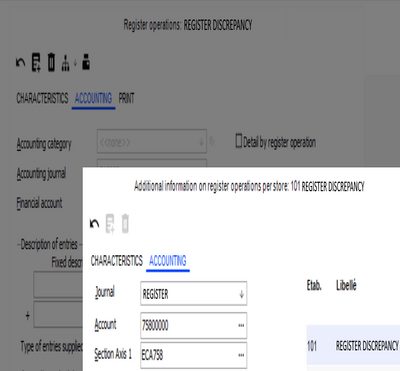

# Finance & Controlling

*Source: Cegid Retail Y2 – Version 26 | Extracted: 2026-02-27*

---

# Finance & Controlling

## Cegid Finance Connector

### Accounting Closure

#### Contents

Accounting Closure - Contents

The purpose of accounting closure is to streamline financial management for companies that carry out regular accounting reports. It enables you to:
- Value the company’s inventory on a given date
- Take non-received invoices into account, i.e. supplier invoices not received before the accounting closure, but relating to this fiscal year.

Valuing inventory will be done on the basis of an inventory snapshot which may be generated by the closure itself.

Accounting closures are based on the effective document date so it may be taken into account. This date is managed according to the presence of an accounting closure for the store and document date. Once the closure is done, a certain number of Back Office operations will be blocked, e.g. creation or modification of documents before the accounting closure.

Note that an accounting closure enables you to manage non-received invoices. It will not process accrued expenses and deferred income.

Required settings
- Creating accounting journals
- Creating general accounts
- Configuring company settings
- Configuring documents
- Configuring store record
- Managing access rights

Configuration and closure start-up
- Creating accounting closure elements
- Required controls
- Deleting accounting closures
- Accounting impact on closure (inventory and non-received invoices)
- Impacts

#### Required Settings

Required Settings for Accounting Closure

Creating accounting journals

Back Office > Administration > Link to Accounting > Journals

This command allows you to create the appropriate accounting journals.

Click the [New] button to create a journal of type Miscellaneous operation (OD).

Creating control accounts

Back Office > Administration > Link to Accounting >- Control accounts

This command allows you to create the appropriate accounts.

For non-received invoice records
- Supplier account, type 408xxx (Supplier collective account type) analytical breakdown not possible.
- VAT account, type 44586x (Various account type)
- Expenses account, type 608xxx (Expenses account type) analytical breakdown possible.
- Analysis used in purchase settings.

For inventory closure entries
- Inventory account, type 370xxx (Various non-collective account type) analytical breakdown not possible.
- Inventory variation account, type 6037xx (Expenses account type) analytical breakdown possible.
- Analysis used in purchase settings.

These accounts and journals are set by stores, or otherwise in company settings.

Configuring company settings

Back Office > Administration > Company > Company settings

Open Commercial management/Inventory accounting closure, and enable the “Management of inventory closure” option.

You should also populate the “Store accounting for transfer notices” setting that will be used if the accounting closure takes transfer notices into account.

For more information on other settings, see the chapter dealing with company settings related to Inventory Accounting Closure .

Inventory Accounting Closure

Configuring documents

Back Office > Settings > Documents > Documents > Types

Note that this configuration is valid only for purchase documents. Open the Accounting tab and enter the following settings ( described here ):

described here
- Go to accounting
- Freeze closure

Configuring store records

Back Office > Basic data > Stores > Stores

The Accounting tab enables each store to activate an accounting closure. Note that journals, descriptions and accounting closure records will be first taken from store settings. If they do not exist, company settings will be used.

Access rights management

Back Office > Administration module > Users and access > Access right management

Menu Concepts (26) > Concepts > Accounting >Accounting closure

This menu enables you to give certain Back Office user groups the option to perform the following actions:
- Daily opening on a date previous to an accounting closure
- Modify the external reference date
- Inventory not validated before the closure date
- Existence of day opened before the closure date
- Transfer documents to accounting integrated after closure
- Delete accounting closure
- Ignore confirmation if entering a document with a previous date

Menu Administration (106) > Link to Accounting > Accounting closure

This menu enables you to give certain Back Office user groups the option to access lines in the Accounting closure menu present in Administration/Link to Accounting.

Menu Follow up actions (113) > Administration > Link to Accounting

This menu enables you to authorize traces on the following actions in the event journal:
- Standalone mode: post-integration closure
- Closure maintained
- Closure suspended

#### Configuration and Closure Start-Up

Configuration and Closure Start-Up

Creating accounting closure elements

Back Office > Administration > Link to Accounting > Closure

You may select the stores or store groups that an accounting closure has been started for. Only those stores that have accounting closure activated will be proposed (see Store Record Settings .) The closure date must also be selected.

Store Record Settings

| Fields | Description |
| --- | --- |
| Automatic generation of inventory snapshots | This option enables you to automatically calculate an inventory snapshot on the accounting closure date. If the option is not enabled, the previous inventory snapshot dated on the accounting closure date will be used to value inventory. As for normal snapshot creation, you must enter: The purchase price valuation for the snapshot (LPP or WAPP for the warehouse inventory record). The cost price valuation for the snapshot (LCP or WACP for the warehouse inventory record). Which of these 2 values will be used to valuate inventory corresponding to the accounting entry (purchase or cost price valuation of the snapshot) |
| Consider transfer notices | This option enables you to specify whether transfer notices must be recognized for inventory records. If this is the case, they will be accounted for in the store (sender or recipient) specified in company settings. |
| Generating entries for non-received invoices | The checkbox enables you to start generating these entries within the accounting closure operation. |

Scheduling closures

Accounting closure can be scheduled using the [Scheduling] button.

Launching closures

You can launch the closure by using the [Perform this closure] button. At the end of the operation, the Report tab will give details of the operation done and any errors encountered.

The files are named using the “INVENTORY-aaaammjjhhmm.TRA” format and saved in the export directory specified in company settings.

Please note!

The import phase in the accounting database must be done manually.

Deleting reports

The report can be deleted using this button.

Required controls

Many controls are done before all accounting closures.

List of controls done
- The first operation enables you to verify the presence of documents dated before the date of the last closure, but not yet accounted for. This is the case for an invoice in litigation at the time of the closure (therefore not included in the closure,) and the litigation is resolved after the closure. These documents must be sent to accounting with the closure date + 1 day as the accounting date.
- All registers will have the day closed for this date (no days open before this date). This control is non-blocking if the user has the corresponding access rights.
- No inventory counts are to be in progress in the store on the closure date. This control is non-blocking if the user has the corresponding access rights. If the control is ignored, a message will appear to indicate that an inventory discrepancy document will be generated for the closure date + 1 day Note that an inventory may be deleted at the Head-office level to force closure.
- If generating non-received invoices, all stores selected must have a previous identical accounting closure date. Otherwise, the stores must be closed separately. This control will block operations.
- All documents that must go to accounting, and are dated before the closure date, must already have been transferred to accounting. This control will block operations.

A line will be added to the event log with the list of documents in error.

In the case of an interactive operation, controls (according to their type) will end with results that will enable users to:
- Maintain the closure
- Suspend the closure

In any case, these processes will be written to an event log.

Deleting accounting closures

It is possible to delete accounting closures. A message will alert the user that accounting entries must be manually deleted from the accounting database. The accounting closure will be marked as deleted and the user that deleted it will be saved.

Accounting impact on closure (inventory and non-received invoices (FNP)

Starting an accounting closure will enable you to value the company’s inventory on a given date. Non-received supplier invoices may also be taken into account. Once the closure has been done, no documents before this date may be created or modified.

The documents taken into account are those viable before the date of closure and after the previous closure.

A double entry will be generated:
- The first on the closure date
- The second: Reverses the first entry the day after the closure date.

Here is an example of the entries generated:

Entries on inventory - December 2009

On 12/1/2009, the previous closure resulted in stock valued at €8,000. You should cancel it on 12/31/2009, then note the balance valued on 01/01/2010:

|  | Count | Debit | Credit |
| --- | --- | --- | --- |
| Inventory canceled on 12/31/2009 | Variation | 6037xxx |  | 8000 |
| Inventory | 370xxx | 8000 |  |
| Inventory canceled on 1/1/2010 | Variation | 6037xxx | 10000 |  |
| Inventory | 370xxx |  | 10000 |

Entries on non-received invoices - December 2009

Receipts of goods for an amount of €120 (inclusive of tax) have not yet been billed :

|  | Count | Debit | Credit |
| --- | --- | --- | --- |
| Non-received invoices noted on 12/31/2009 | Supplier | 408xxx |  | 120 |
| Purchase | 608xx | 100 |  |
| VAT | 44586x | 20 |  |
| Reverse non-received invoices on 1/1/2010 | Supplier | 408xxx | 120 |  |
| Purchase | 608xx |  | 100 |
| VAT | 44586x |  | 20 |

The invoice will then be normally accounted for when received.

Note that during the first closure operation, only the entry with the observation will be generated. The valuation of canceled inventory will equal 0.

Impacts

Implications in Back Office

When creating a document, the effective date is calculated as follows (once the document date is entered):
- If the document date is prior to the latest date of the accounting closure, the effective date is initialized to the accounting closure date + 1 day.
- If the document date is after the latest date of the accounting closure, the effective date matches the document date.

Example:

Store A with the last accounting closure dated 9/30/2012
- On 10/05/2012, creation of receiving with the date of 09/28/2012 => effective date document on 10/01/2012 (accounting date + 1 day).
- On 10/05/2012, creation of receiving with the date of 10/04/2012 => effective date document on 10/04/2012.

When entering a document with a date before the last accounting closure, the concept “Override confirmation if entering a document with a previous date” will be used. If the concept is not authorized, a message will prompt you to confirm the document date. Otherwise, the effective date will be automatically adjusted.

When modifying documents, those that have an effective date before the last accounting closure will not be available. This documents will be available in viewing orders for this document.

Note that documents that do not go to accounting remain modifiable.

Inventory count management

The inventories must all be validated (or deleted) during the closure of the period. Otherwise, a non-blocking message will appear during the closure (a concept enables you to handle this control). The discrepancy document will then be set to the inventory closure date + 1 day.

concept

When validating inventories, if they have been done for an inventory date before the closure date, this control will also be applied. This action will be saved in the event log.

When creating an inventory list, you cannot enter an inventory date before the closure date.

Data imports

Data importing may accept documents before the date of closure. A mechanism has been created which will enable you to integrate these documents with the information system, as follows:
- GP_DATEPIECE: Document date contained in the import file.
- GP_DATEEFFET: The same mechanism for populating this date is identical to the method applied in document entry. The “Override confirmation if entering a document with a previous date” concept will not be taken into account during importing.
- GP_DATEREFEXTERNE: document date issued by third-party. It is entered only if the document date is before the date of closure.

History recovery

When it is empty, the external reference date must be updated with the document date. A request for an update will be supplied. It must be manually treated for the documents to be processed. The external reference date may be changed, according to access rights. This mechanism concerns only documents sent to accounting.

Document transfer to accounting

Document transfer to accounting enables you to select the documents integrated after closure. This option (subject to access rights) is present for authorized users only.

Receipt entry in standalone mode

Receipts entered in standalone mode may be recovered with their actual sales date. If an accounting closure has been done after entering a document, a line will be added to the event journal with the list of documents in error. This case will be manually processed in accounting. It should only impact stores remaining in standalone mode for an extended period (slight or no risk).

Example:
- April 15 – May 15: Start-up of the Paris Montaigne store in standalone mode
- May 9: Accounting closure at headquarters on May 1
- Sales in the Paris Montaigne store are saved manually in accounting for the period of 04/15 to 04/30.
- May 16: Recovery of the communication line:

Impacts in Front Office

When Front Office receipts go to accounting, a new control will verify at the start of the day that the opening date is not before the date of the last closure for the store.

### Accounting Transfer

#### Contents

Transfer to Accounting - Contents

The Accounting transfer module enables you to direct the various Cegid Retail Y2 documents (invoices, receipts, etc.) to the accounting software. A certain number of settings is necessary for the proper operation of accounting transfers.

Configuring accounting transfers
- General settings
- Accounting link configuration
- Deleting accounting elements

Other configurations
- Tax account configuration
- Payment method configuration
- Register operations configuration
- Bank card fees configuration
- Store record configuration

Operation of the accounting transfer
- Transfer control and configuration
- End report
- Miscellaneous
- Managing analytics for register operations

#### Configuring Accounting Transfers

Configuring Accounting Transfers

General settings

Company settings

Back Office > Administration > Company > Company settings
- Determining accounting accounts: Click here to find the company settings concerning accounting transfers
- Determining account posting: Click here to find the company settings concerning account posting.

Document types

Back Office > Settings > Documents > Documents > Types
- General tab: Click here to verify the document types to be configured.
- Accounting customization tab: Click here to customize your accounting interface.
- Accounting tab: Click here to determine account posting settings.

Access rights

Back Office > Administration > Users and access > Access right management

The following menus allow you to manage user group authorizations:
- Administration (106) > Link to Accounting allows you to authorize the user groups access to the various accounting transfer menus.
- Concepts (26) > Accounting allows you to authorize user groups to create, change or delete the various accounting accounts, business accounts, logs, fiscal years, etc.

Accounting link configuration

Accounting breakdowns

Back Office > Administration > Link to Accounting > Accounting breakdowns

This command enables you to configure specific accounts for purchases, sales, discounts or rebates for certain categories of item accounting, certain third-party accounting categories or certain warehouses. The breakdown will depend on the Accounting breakdowns in the company settings, in Commercial management > Account posting .

Check the following options according to the accounting breakdowns you wish to manage: Items, Third-parties and/or Warehouses. Note that when these breakdowns are not managed, the corresponding options must be disabled.

Please note!

When you have at least one line with an item or warehouse in an accounting breakdown, you will need to enter the item or the warehouse on all lines.

Analytical breakdowns

Back Office > Administration> Link to Accounting > Analytical breakdowns

This breakdown is often used to configure posting of analytical entries by store, or all stores combined, using the following configurations:
- The Purchases type enables you to configure the breakdown for all purchasing documents.
- The Sales type enables you to configure the breakdown for all sales documents.
- The Other type enables you to allocate bank card fees according to the analytic configured.

Accounting journals

Back Office > Administration > Link to Accounting > Journals

Select the following in the Characteristics tab:
- A code and description for the journal
- A type (purchase, sale, bank, register, etc.)
- The input mode: Document
- The Multicurrency checkbox must be enabled if the journal is to appear on the list of accounting journals in the document settings.

The Additions tab enables you to set the following fields:
- Normal counter
- Simulation counter
- Counterpart account

Control accounts

Back Office > Administration > Link to Accounting > Control accounts

Click the [New] button to create bank accounts, sales accounts and register accounts. The accounting Interface manages up to 3 axes. To enable breakdowns, select the corresponding axes.

- For bank accounts: You must select the Collective type, and the Mixed direction.
- For sales accounts: You must select the Product type, and the Credit or Mixed direction.
- For register accounts: You must select the Register type, and the Mixed direction.

Accounting categories (item and third-party)

Back Office > Administration > Link to Accounting > Accounting categories

This menu enables you to create item and third-party accounting categories. You will then need to assign the accounting categories:
- Items concerned: from the item record > Characteristics tab
- Third-parties concerned: from the third-party record > Payments tab (customer or supplier)

Deleting accounting elements

Deletion rule

You may delete some elements in accounting links, such as accounting accounts, business accounts, logs, fiscal years, etc.

Use this button to delete accounting elements. Note that deletion is immediate and without verification. Once an element has been deleted, it will no longer be available in lists and may no longer be used in settings.

Please note!

This option is subject to access rights management. Authorization must be granted in Administration > Users and access > Access right management. Select the Concepts (26) menu > Accounting and activate the Modification right for the desired elements (general accounts, sections, etc.)

#### Other Accounting Transfer Configurations

Other Accounting Transfer Configurations

Configuring tax accounts

Back Office > Settings > Management > Taxes> Tax rate

Open the Additions tab and populate the purchase and sales accounts.

Configuring payment methods

Back Office > Settings > Management > Payment methods

Populate the fields in the Accounting tab.

Accounting

Configuring register operations

Back Office > Settings > Management > Register operations

Accounting tab

The accounting configuration for register operations is made at the record level, in the Accounting tab.

You may then assign an accounting category, an accounting account as well as an accounting journal to each register operation.

Regardless of the store, all documents concerned by a configured register operation will go to accounting according to this setup.

Note that in the case where a collective account is used, the auxiliary account will be used for the accounting entry. The Detail by register operation setting enables you to split accounting entries by register operation.

Please note!

For some types of register operations, the Cash transaction option must be.
- Checked: Register discrepancy, Cash float, and Withdrawal
- Unchecked: Gift certificate acquisition, acquisition of loyalty gift certificate, collecting deferred check, collecting credit, exchange of payment methods, deposit reimbursement, credit reimbursement, gift certificate reimbursement, and deposit payment.

Please note!

You absolutely must assign cash register operations to an accounting journal different than the one for sales (e.g. OD type), so that these operations will not be mixed with sales.

Configuring bank card fees

Company settings

Back Office > Administration > Company > Company settings > Account posting

Enable the Management of bank card fees option to obtain the Bank card fees menu.

Once this company setting ticked, the Bank card fees menu option is available in the settings of payment methods of type Bank card by the means of the [Additions] button.

Item accounting categories

Back Office > Administration> Link to Accounting > Accounting categories - Item

Enables you to create an item accounting category having the FCB code (required) and the Bank card fees description.

Accounting breakdown

Back Office > Administration > Link to Accounting > Accounting breakdowns

Enables you to create an accounting breakdown for the Bank card fees item, and to populate the corresponding purchase and sales accounts.

Analytical breakdown

Back Office > Administration > Link to Accounting > Analytical breakdowns

Enables you to create an analytical breakdown by using the Bank card fees type.

Configuring the store record

Back Office > Basic data > Stores > Stores

In order to be able to use the Y2 accounting interface to send to accounting entries from an external cash register or Live Store, the Checkout default customer field (ET_CLIENTRETAIL field) must be filled in (see. Store Record, Third party tab ).

Store Record, Third party tab

Without this setup, an error displaying the message Unknown third party message will occur in the accounting transfer report and entries will not be sent.

#### Operation of the Accounting Transfer

Operation of the Accounting Transfer

Back Office > Administration > Link to Accounting > Accounting transfer

Transfer control and configuration

Click the [New] button and populate the fields as described hereafter.

| Fields | Description |
| --- | --- |
| Grouping | Enables you to select a series of stores from their user-defined tables. |
| Stores or Name of user-defined table | Enables you to select either a store or a value in the user-defined table set in the grouping. |
| Document types | Only the document types that have a “Deferred time” accounting link will be visible (see Settings/Document Types ). |
| File name | If the field is empty, it will be automatically created. Otherwise, addition of the Date and .tra extension to the value entered will be done automatically. |
| Accounting base | This field is only visible in the case of external accounting. If this setting has been specified, file importing will be done automatically to the company entered here. |
| Accounting for entries already extracted | Enables you to re-integrate into accounting the entries that have already been transferred to accounting. From a technical viewpoint, this corresponds to documents for which GP_ETATCOMPTA="EXP” (and not "ATT") is valid. This option is hidden in the case of integrated accounting. |
| Scheduling | Enables you to schedule a transfer to accounting. |
| Status | Enables you to view each task, its status, the last run date and the person that ran it. Scheduled: Transfer to Accounting Scheduling Loaded: Loading information concerning lines, documents and payment methods in the INTERCOMPTA table. Checked: Allocation of accounts and journals for lines in the INTERCOMPTA table. Generated: Generation of accounting entries in a temporary table. Exported: Exporting entries to a .TRA file. |

Related actions

Buttons enable you to perform the following actions:

Schedules the accounting transfer (available next to the Task number field.)

Starts the accounting transfer task (load, check, generation, etc.)

Reinitializes the accounting transfer

Starts the complete accounting transfer.

End report

The transfer to accounting notepad will be updated at the end of the accounting operation. The notepad is found in the Report tab. It enables you to see:
- the task run
- the checks done
- the results of the accounting transfer or the task
- the configuration or processing errors
- the entries generated

Miscellaneous

| . | Company settings Account posting FO customer follow-up | Document settings Accounting customization Grouping by day | Document settings Accounting customization Grouping on centralization auxiliary | Store record Sales receipts account | Result |
| --- | --- | --- | --- | --- | --- |
| CASE 1 | X | X | - | - | No sales grouping. One entry per customer, sale by sale, then one entry per payment method. The third-party account is the account for the default third-party (41100000). |
| CASE 2 | X | X | X | - | Sales grouping. One entry for all sales, then one entry per payment method. The third-party account is the account for the default third-party (41100000). |
| CASE 3 | - | X | X | 41100205 | Sales grouping. One entry for all sales, then one entry per payment method. The third-party account is 41100205, for sales entries and collection entries (41100205). |
| CASE 4 | - | X | - | 41100205 | No sales grouping. One entry per customer, sale by sale, then one entry per payment method. The third-party account is 41100205, for sales entries and collection entries (41100205). |

In these 4 cases, note that if one of the payment methods has a specific account per store, this account will be used for the payment entry (line for 512 or 530).

Managing analytics for register operations

Back Office > Settings > Management > Register operations

Cegid Retail Y2 enables you to manage analytics for register operations by using the sections set in the exceptions per store.

Open the record of your choice, and click the [Additions/Per store addition] button.

Open the Accounting tab and enter the following data:

### Accounting Interface

=> See also procedure 348 (Grouping Option in the TRA file Cash Receipts Journal)

Accounting Interface

Cegid Retail Y2 is compatible with Finance V9/Y2. This section lists the elements to take into account to manage various accounting functions:
- Y2/Finance V9
- Y2/Finance Y2 (not including the management of the new analytics)
- Y2/External accounting

The interface is run via TRA files in the V9/Y2 format according to the accounting settings in the Cegid Retail Y2 database (account length, analytic management, analytic settings, etc.) These files are generated in the record export phase via the “Communications Sx V9” accounting communications tool (also known as “ComSx”).

The tool is integrated into kits in a version compatible with the CBP version associated with Cegid Retail Y2.

Important points:
- Transfers are no longer done directly database-to-database.
- The database selected for accounting transfers has no impact.

Y2 Accounting

Y2 Accounting migration

Setting up Finance Y2 does not require migration of analytics if it retains its old structure. Migration is done with third-party software independent of Finance. The “Finance Y2” smart client will not be able to connect to the folder until migration is completed. The migration replaces analytical sections with plan and sub-plan management.

Analytic management

Changing the analytic structure is optional. It is not activated by default. The SO_NEWANALYTIQUE company setting is equal to “ - ".

The sections will be managed in the only sub-plan 1 configured in the folder. This company setting is disabled and invisible in Cegid Retail Y2 (in Accounting > Advanced settings >New analytic version.)

Updating the MCD is however essential. Exporting is done on the basis of new tables, even if the interface file format (.TRA) remains unchanged.

Activating the new analytic structure enables you to manage up to 6 sub-plan levels.

Please note!

This setting must remain disabled to be compatible with Cegid Retail Y2.

TRA V10 file

The format of the TRA file is composed as follows:

A new indicator has been added to the file header: new analytics. Position 148 in first record in the file.

When activating new analytics, the following changes are implemented:
- Analytical breakdowns
- Analytical sections
- SEPA creditor identifier ICS record
- Order - MDT record
- Entry lines

For folders with no new analytic activation, only changes to the file header are necessary. ComSx Y2 is therefore capable of integrating TRA files including the same records as in the V9 format.

Configuration types

Configuring Cegid Retail Y2/External Accounting

The External accounting company setting (Commercial Management > Account posting) allows you to manage the Y2 interface with an external accounting program. The folders managed via an external accounting program maintain the record type and format of records in the TRA file used in previous versions.

Please note: Since the file is generated by the new ComSx Y2, the header record will be completed!

Configuring Cegid Retail Y2/V9 Accounting

Cegid Retail is configured with Cegid accounting elements (non-external).

The Management of analytics per document (Commercial Management > Account posting) is disabled by default.

The accounting interface and analytic settings remain unchanged.

Only the header record will be completed with the new indicator ( Manage new Y2 analytics .)

Configuring Cegid Retail Y2/Y2 Accounting - Same structure

The same as the previous configuration.

CgiComSx Process Server

The CgiComSx process server generates accounting interface files (TRA), then saves them in a database (YEDMFILES table). The data in this table concerning the accounting interface may be identified with this restriction: YEF_CUSTOMTYPE="COMSX".

Recovering the last generated file

The [File extraction] button restarts extraction of the last file generated by the interface. The file will be made available in the configured directory.

Note that the extraction will be done automatically when running the interface. This action will enable you to extract the last file generated without running the complete interface again.

Purging files

The Maximum number of days to keep files in the database company setting (Commercial management > Account posting) defines the time period files are to be kept in the database (YEDMFILES table). When running any accounting application from a smart client or through scheduled tasks, files will be purged from the database. Please note: if this setting is set to 0, no purge will be performed. By default, this setting is set to 365.

INTERCOMPTAENT table

The MIE_FILEID (GUID) field has been added to the INTERCOMPTAENT table. When the interface is running, this field is fed by the GUID identifier from the record stored in the database: YEDMFILES.YEF_ID. Purges affect the “ComSx” records in this table:

SELECT * FROM YEDMFILES WHERE YEF_CUSTOMTYPE="COMSX" AND YEF_CREATIONDATE<NOW()-365

Interface report

The report is available in the Report tab and the Event log. It also contains information supplied by the CgiComSx process server.

Example of traces:

EXPORT REPORT

*** Export started on 9/3/2015 at 11:25 a.m.

Selection criteria

Journals: CAI;VED;

Stores: 104

Period from 9/3/2015 to 9/3/2015

Control accounts

Journals: CAI;VED;

Loading entries

Journal entries: CAI

Journal entries: VED

Total debtor turnover: 505.00

Total creditor turnover: 505.00

Exporting entries

*** Export completed on 9/3/2015 at 11:25 a.m.