# Foundation Techniques & Tools

*Source: Cegid Retail Y2 – Version 26 | Extracted: 2026-02-27*

---

# Foundation Techniques & Tools

## Secure Key

Secure Key

The control of Cegid Retail Y2 is performed thanks to the presence a valid Y2 license in your environment. This license in the form of a key (or token) signs the declaration of the Y2 environment to Cegid. When connecting to the Back Office product, the application controls that the environment is known to Cegid and that the present license is valid. Otherwise, Back Office will switch to demonstration mode. Therefore (refer to License Management) you have to:
- Generate a file extracted from your Y2 environment.
- Send it to your Contact at Cegid.
- In return, you will get from your contact a token in XML format.
- Integrate the token with your environment.

Prerequisites

You must generate and integrate a key per database and Y2 environment, regardless of the number of IIS servers. For example, if your environment references two databases (BASE01 and BASE02) on three IIS servers in version Y2 12.01, you have to generate and integrate a key for database BASE01, and another key for database BASE02 on one of your IIS servers.

If your Y2 environment relates to different time zones, do not wait for the last day before your license expires to update the Y2 license.

Please note! The change of the company name in the database requires a new key to be generated and integrated.

License management

You can manage any operations linked to licensing from the License page of one of your IIS servers.

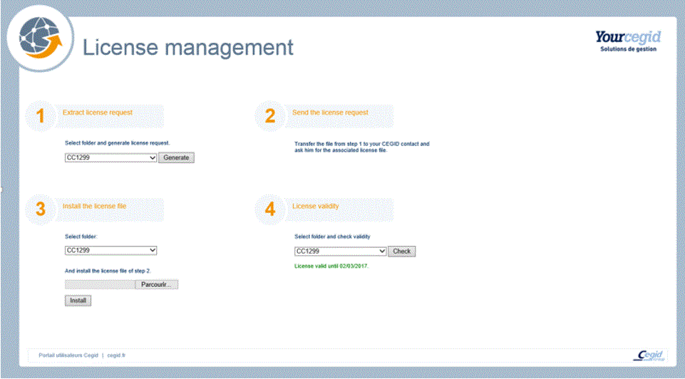

Access the License Manager

This page can be accessed:
- Either by means of the Internet Services Manager:

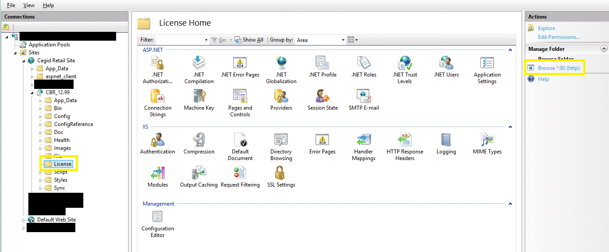
- Or via: http://XXXXX/CBR_YY.YY/License (XXXX being the IIS server and YY.YY the Y2 version.)

Ask for the License
1. Connect to the License page of an IIS server.
2. Generate the information file per “Folder ID” (i.e. per database):

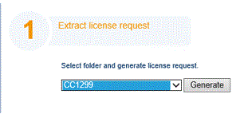
- Select the database. Click the [Generate] button to generate and save the file.

Attention! In any case, do not change the name and the xml file.
1. Send the file(s) to your contact at Cegid, who will return a token to integrate.

Save the License
1. As soon as you receive the key, you must integrated it. This integration will be performed by Folder ID (i.e. database):

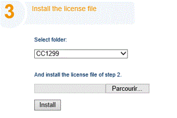
- Select the database. Select the corresponding key (token) Click the [Install] button to perform the integration.

Attention! In any case, do not change the name and the xml file.
1. Check that the key is taken into account via License validity .

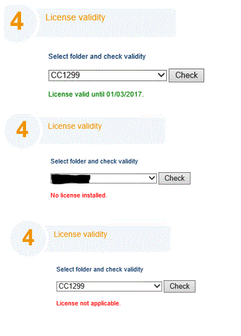

License Control
- License missing : If there is no Y2 license, a message informs you about that situation, and Back Office switches to Demonstration mode. In this case, you must contact your Cegid Retail Y2 administrator. If the integrated key does not match the environment, the database name, or other elements, the key will be considered as not valid. In this case, the same behavior as for missing license will apply.
- License expiring soon : Within 10 days prior to expiry, each time you connect, you will get an information message specifying the expiry date of the license. You must inform the Cegid Retail Y2 administrator. In the case of different time zones in your Y2 environment, we advise you to update your license as soon as possible before its expiry.
- License expired : The day after the expiry of the license, when you connect to Back Office, a message informs you that there no valid license installed; you will then access Back Office in Demonstration mode.

## Cegid Database Maintenance and CPTX

Cegid Database Maintenance and CPTX

Installation of CDM and Update by CPTX

Click here to open the document .

## Export Time Measurements

=> See also procedure 141 (Runtime Measurement - Edt21 and later)

=> See also procedure 141 (Runtime Measurement - V23 and later)

Export time measurements

This command enables the export of timer measurements in CSV format.

Settings

Configuration file

Set the cgimode configuration file on the task server when using [ FileExchangePath].

Example:

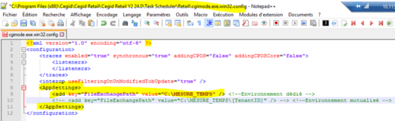

Company Settings

Back Office > Administration > Company > Company settings > Commercial management

If you wish to manage status files for scheduled tasks, open Commercial Management > Scheduled Tasks and set the following options:
- Activate option Status file management .
- In field Backup directory for status files , for example, enter [ FileExchangePath]\ LOGS_TASK.

How it works

Back Office > Administration > Performance > Export time measurements

Front-Office > Settings> Processing > Export time measurements

Description of available options

| Fields | Description |
| --- | --- |
| File name | For SaaS files, the [ FileExchangePath] or [RetailFileExchangePath] tags should be used. To build the file name, and in order to avoid overwriting previous generated files, the following tags can be used: <DAY>: Day number in the month <DAY2>: Day number in the month on 2 digits <MONTH>: Number of the month <MONTH2>: Number of the month on 2 digits <YEAR>: Year on 4 digits <DATE>: Current date in YYYYMMDD format <TIME>: Time in HH24MMSS format |
| Visa | Visa management is not available when running a scheduled task. The Visa and Updating exported events options cannot be checked. |
| Number of lines per file | This criterion has a default value of 10,000 and must be between 1,000 and 100,000. It is used to split generated files in order to limit the number of records present in the files. When the limit is reached, a new file is generated. Files are then suffixed with _sequential number. |

Task scheduling

This button is used to schedule the task for execution on the server

Event log

Back Office > Administration > Event log > Log query

Front Office > Administration > Settings > Event log > Log query

In the case of a scheduled task execution, traces are not available in the menu notepad, but are inserted into the event log:
- The first trace contains the scheduled task criteria.
- The second the traces of the generated files

## Audit of Use

### Overview

=> See also procedure 217 (Audit of Use)

Audit of Use - Overview

Back Office > Administration > Company > Serialization > Audit of use

This command is aimed at counting the user licenses for Cegid Retail Y2. The information returned concerns the following elements:
- Stores
- POS and devices (Front-Office, Mpos and Inventory Tracking),
- Users
- Module

Presentation of the functionality

Access rights

To be able to use this command, enable the access right available in Administration (106) > Company > Serialization > Audit of use.

Launching the count

After having specified the launch criteria, available in the Criteria tab, use the [Launch] button.

PDF export

The [PDF export] button returns the collected information in a PDF file.

Appendices

Note that the report also displays additional information:
- Last movements by store
- Number of opened days per POS
- Detail of Inventory Tracking devices
- Detail of Mpos devices
- Detail per users.

Detail of returned elements

For further information click one of the following elements:
- Detail of stores
- Detail of POS and devices
- Detail of users
- Detail of modules

### Detail of Stores

Audit of Use - Detail of Stores

Back Office > Administration > Company > Serialization > Audit of use

This is to count the stores present in the database, identifying active and inactive stores.

Management of country packages

The Country package column is used to confirm that the corresponding Country package is activated. The display varies dependent on the store’s status:
- Nothing is displayed if the store is not active.
- If the store is active but no country package is found: the screen displays UNKNOWN.
- If the store is active and the country package is not enabled: the country package is displayed followed by ‘- NON ACTIVE’.
- If "No country" and the store is active: The screen displays UNKNOWN.

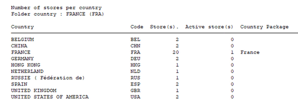

Management of restrictions

As the audit report takes user restrictions into account, the user's default store restriction is displayed in the audit report header:

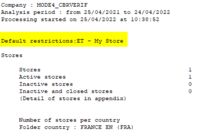

### Detail of POS and Devices

Audit of Use - Detail of POS and Devices

Back Office > Administration > Company > Serialization > Audit of use

The purpose is to count the POS and the devices of Front office, Mpos and Inventory Tracking.

Front Office POS count

Front Office cash registers are listed under the heading Front-Office POS .

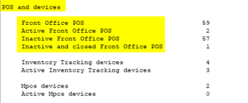

Appendix

Note that the appendix Number of open days per POS contains only Front-Office POS.

Mpos count

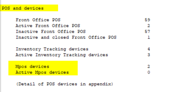

Counters displaying the number of mobile registers and devices are listed under the headings Mpos devices and Active Mpos devices .

The Active Mpos devices counter displays the number of Mpos devices that had a connection during the audit period.

Appendix

In the report, an appendix dedicated to Mpos devices is added after the Front-Office POS and Inventory Tracking devices appendix.

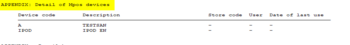

This appendix is only present if there is information to display:
- Presence of an active device during the period in case of a request for device details,
- Presence of a device in case of request of all devices details.

Inventory Tracking count

The POS AND DEVICES section displays the Inventory Tracking devices and Active Inventory Tracking devices counters:

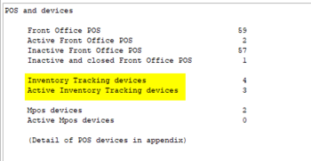

The calculation of these counters is based on the count of the Inventory Tracking devices with the exclusion of the reference records.

The Active Inventory Tracking devices counter displays the number of Inventory Tracking devices that had a connection during the audit period.

Note that only one device is counted in the case of multiple users using it, in one or more stores of a same folder.

Appendix

An appendix dedicated to Inventory Tracking devices is displayed after the Front-Office POS appendix:

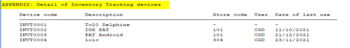

This appendix is only present when there is information to display:
- Presence of an active device in case of a request for details of active devices.
- Presence of a device in case of a request for details of all devices.

Note that device reassignment is managed from Inventory Tracking V3.

Management of active devices per country

This page is now called Active Front Office POS and devices per country .

It is completed with the columns Number of Inventory tracking and Number of Mpos , and the column Number of POS is now renamed Number of FO POS:

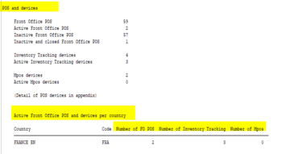

Front Office POS are cash registers systematically assigned to a store, itself assigned to a country.

In the case of Mpos, the device is assigned to a cash register, itself linked to a store, itself assigned to a country.

Note that for Inventory Tracking, this data is only informative, because the devices assigned to inventory counts can rotate between stores.

### Detail of Users

Audit of Use - Detail of Users

Back Office > Administration > Company > Serialization > Audit of use

This is to count all the users of the system according to their activity.

Counting rule

The concept of user counts has been reviewed for a better understanding:
- A license is counted if the user connects to a Back-Office, or a Front-Office that only handles management operations.
- Users connecting to a Front-Office that does cashing are not counted, as the workstation is included in the Front Office POS count.

Appendix

Depending on the option selected in Detail of users , the appendix shows the list of active users or the list of all users.

The Software column shows:
- BO: for the users connected to Back Office and Front Office
- FO: for user connected only to Front Office on a management workstation (with no cashing)
- “-” for users without a connection or connected only to a POS terminal (in this case, the user license is not counted, only the POS license is counted).

A note has been added at the bottom of the users table to explain this notion.

### Detail of Modules

Audit of Use - Detail of Modules

Back Office > Administration > Company > Serialization > Audit of use

This is to list the existing, activated and used modules.

Presentation the list of modules

The list of modules displays the following columns:
- Module description: The names of the modules are displayed in English only.
- Type
- Activated module
- Active: Checked if the date of the last use is specified, except for the following rows:
- Product Data Management: always checked Retail Order Management: Checked if the Omnicommerce column of the table below has at least one value greater than 0. Custom Order Management: Checked if the Stores column of the table- at least one value greater than 0.
- Last use

Omnicommerce Management

If the Omnicommerce management module is activated and you ask for the detail of modules, the system displays the number of omni-channel orders created each month over the audit period.

The date indicated on the same line as the module name displays the date of the last omni-channel order within the audit period.

## Multi-Environment Management

### Environment Configuration Tool (Data Spread)

#### Contents

=> See also procedure 384 (Multi-Environment Settings)

Environment Configuration Tool (Data Spread) - Contents

The Data Spread tool enables you to propagate a configuration implemented in a given environment to one or more environments without requiring further data entry. This facilitates the implementation of the Cegid Retail Y2 solution on multiple international sites or in multiple environments (e.g. production, pre-production and test).

The Data Spread tool is a module dedicated to users with an Administrator profile.

Overview and settings
- How it works
- Preliminary settings

Export profile
- Characteristics tab
- Information to export tab
- Actions that can be carried out from the Export profile (execution, addition of tables, etc.)
- Example of adding a table and a register variable

Import profile (optional)
- Characteristics tab

Data to export/exclude
- Data to export for the profile
- Data to exclude for the profile

Additional tools
- Launching and scheduling the process
- Traces in the event log
- Comparison tool
- Processing through an external program

Creation of a pre-packaged profile
- Creation steps

#### Overview and Settings

Environment Configuration Tool (Data Spread) - Overview and Settings

Cegid Data Spread - Overview

How it works

The Cegid Data Spread processing is described in the five steps below.
- Step 1 - Setup: You configure the export profiles, i.e. all data to be exported.
- Step 2 - Extraction: You run the data export process
- Step 3 - Distribution: You send TXT files manually, by email or other means.
- Step 4 - Import: You configure the import profiles and then you import data.
- Step 5 - Supervision: You check the processing by comparing data.

Processes performed

This tool allows you to perform the following processes:
- Exporting database settings - Example: The company settings of database A are exported to a file.
- Checking the differences of these settings with another database - Example: The differences between the file and the company settings of database B are displayed on the screen.
- Importing the settings into another database and traceability of the integrations - Example: The file is integrated into database B to take over the settings from database A.
- Managing export profiles used to define the settings to be controlled and to be integrated into another database ( Example: Management profile - for Company settings - for Store settings - for Branch offices of a database from another continent - ...)
- Managing import profiles to limit the scope of an integrated file - Example: Import only the company settings from a file and ignore the others.

Required settings

Activation of modules

Back Office > Administration > Company > Serialization > Activation of modules

You must first activated the Environment Configuration Tool module, before you can use it.

Folder configuration

Back Office > Administration > Company > Company settings > Administration > Distribution

Once the module is activated, the Multi-environment settings option is ticked and grayed out. Specify the following fields:
- Default folder of the export files: Specify the folder where export files should be located.
- Folder import profile: Select the import profile previously created in Import Profiles . The profile indicated here will be applied by default in the Import command but it can be modified on a one-off basis. Note that the choice of a default import profile is optional.

Access rights

Back Office > Administration > Users and access > Access right management

The use of the Data Spread tool is defined by access rights that may be granted or denied in the following menus.
- Menu Administration (106): The Multi-environment settings section enables you to authorize or deny user groups access to the following commands:
- Menu Concepts (26): The Commercial management > DataSpread section displays two concepts used to grant user groups the right to modify an export profile and/or an import profile. If access is denied, then it is available in read-only mode.

#### Export Profile

Environment Configuration Tool (Data Spread) - Export Profile

Back Office > Administration > Multi-environment settings > Export > Profile

Profiles are used to group information independently of other profiles (e.g. Europe profile, Asia profile, etc.)

In this window, you can search for existing export profiles using the different criteria proposed in the Standards and Additions tabs. To open an existing export profile, double-click the relevant line.

To create a profile, click the [New] button and specify the information described hereafter.

Characteristics tab

Specify the code and the description of the profile and complete the following information.

| Fields | Description |
| --- | --- |
| Export type | The information in this section is used to define the actions to be performed during file integration at the target site. Check: If this setting is selected, the data must be checked in the target database. Update: If this setting is selected, the target database will be updated based on the selected option. Partial update by adding the new data only. Complete update by canceling and replacing the data. Modification by resource: Resources are the "elements to be exported" This option enables you to decide the type of export for each data item to be exported. This means that you can combine checks with updates. If the option is selected, the Export type section is used by default for the data to be exported. If the option is not selected and if one of the elements to be exported has a specific setting that is different from the one in the Export type pane, the following message will be displayed: "Caution: The setup by resource will be ignored." |
| Export file | This section is used to define the name and path of the export file. Directory: By default, the directory specified in the company settings in Administration > Distribution is used. If required, you can modify it in the profile (see Folder Configuration .) File name: The file can be timestamped the same way as in data exports. This enables new files to be generated each time the export is run. Note: If a file is generated with an existing file name, it will overwrite the existing file. A standard format is defined using the <DATE> tag in the file name. In this case, the format used is as follows: yyyymmdd_hhnn_sszzz To define a date format, the syntax used must be as follows: <DATE@my format> Example: <DATE@ddmmyyyy> Format: Only TXT (UNICODE) is supported at present. CPTX requires the installation of a component on the workstation where the extraction is performed. This format is not supported at present. |
| Last run | This section is used to view the last process run as well as the generated file in the same screen. You can click the [Open folder] and [Open file] buttons to view the folder or file without exiting the screen. The Number of exported lines field enables users to check that the results are correct and consistent with the elements to export as defined in the export profile. |

Information to export tab

This tab is used to group information by category. The screen displayed is divided into two parts:
- The left side displays the functional domains that may be subject to export: Company settings, general settings, item settings, etc.
- On the right side, next to each domain, you can click the [Selection/Setup] button to open the screen for selecting the data to be exported for the profile, thus allowing you to choose the data to be taken into account for the domain concerned.

Selection/Setup of the domains to be exported

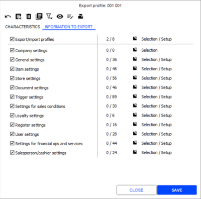

| Some information about this screen... |
| --- |
| Display of a counter | The screen displays a counter on the right side for the functional domains ticked on the left side. In the screen above, the first line displays 2/8, which means that out of 8 exportable elements, only 2 have been selected to be exported. |
| Button [Selection/Setup] | After the selection of a functional domain, click this button to open the selection screen for the data to be exported (list of resources to be exported such as tables, subtables, etc.) This screen is explained in the next paragraph. |
| Notes about... | Export/import profiles: This functional domain includes tables and combos used to set up imports/exports. This enables you to propagate export/import profiles: to other databases. This data can be used in the same way as the other functional domains, with the possibility of integration and comparison Company settings: When you select this functional Domain, the system displays the Exportable company settings for profile... screen |

Selection of data to export for profile

This screen becomes available when you click the [Selection/Setup] button.

This screen shows all the settings to export for the functional domain selected previously.

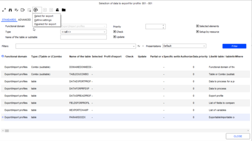

| Some information about this screen... |
| --- |
| Process button | After having selected the lines to process, click this button for the following: Select for export: Is used to add elements to be exported. Once this selection has been saved, the export profile code is displayed in the Export profile column of the multi-criteria screen (NS in the example of the screen above.) Deselect for export: Is used to remove the selected lines from the export. Once this deselection is saved, the export profile code disappears from the Export profile column of the multi-criteria screen. Define settings: Is used to apply specific settings to the selected lines. The Properties screen that opens proposes the Check and Update fields (already detailed above, in the Export type part of the Characteristics tab.) The Priority field is used to assign a priority to the data to be checked. It ranks information in the comparison console. |
| Select all/Deselect all | With this button, you can select or deselect all the desired elements with a single click. |
| View or modify the properties of the element | A double-click on a line allows you to view or modify the properties of the element (see Data to Export for the Profile .) |

Actions that can be carried out from the export profile

Integrate variables

This button is used to set up variables, just like in the management of user-defined exports.

These variables are intended to be used in filtering queries and when running the export. A pop-up will ask for the value of the variable (e.g. a specific register code to export only this register.)

The screen for these variables is the same as for the user-defined exports, except for system variable that are not available in export profiles. Possible types of objects are as follows:
- String/Integer/Boolean: entry of a value without control.
- Multiple values (selection of choices from an existing subtable:) Selection from a list of cash registers or store, for example.
- Selection list (selection from an existing subtable:) Selection of a cash register or a store, for example.
- Date/Date range: Selection of settings that have changed since a specific date, for example.

When running the export process, if variables have been set up for certain tables , you are asked to specify them in the Test the query screen before executing the export profile:

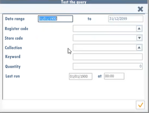

For further information on how variables are set up, please refer to the topic about user-defined exports (see How to Use User-Defined Exports .)

How to Use User-Defined Exports

Launch the process

Open the Profile record of your choice, then click this button to run the data export using a .txt file.

Note that if variables have been set up for some tables, the Test the query screen is displayed to specify these variables before running the process (see previous paragraph dealing with variables).

Duplicate the record

This button enables you to duplicate the Profile record. This is an aid for creating a new profile.

View the available elements and add a table or subtable.

Click this button to find an element (e.g. table or subtable) and see its functional domains. This eliminates the need to view all settings or functional domains.

This button also allows you to add a new table. This table must be added to an existing functional domain.

Please note! This procedure requires you to access the Customer service view!

Click here to see the example of adding a table and a Register variable .

Click here to see the example of adding a table and a Register variable

#### Example of Adding a Table (CAISSON) and a Register Variable

Environment Configuration Tool (Data Spread) - Example of Adding a Table (CAISSON) and a Register Variable

Addition of the table

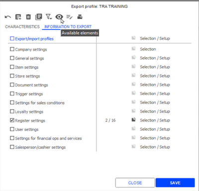

In the Data to export window, use the [New] button.

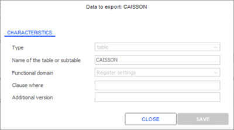

Addition of a variable

Variable are applicable to each selected element.

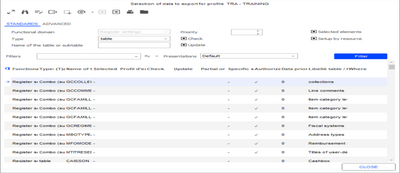

Data selection of the Register domain.

Note that the syntax of the condition is checked upon record validation. In the event of a malfunction, an explicit message indicates the error.

If there is a filter, it is indicated visually to the right of the Data filter wording.

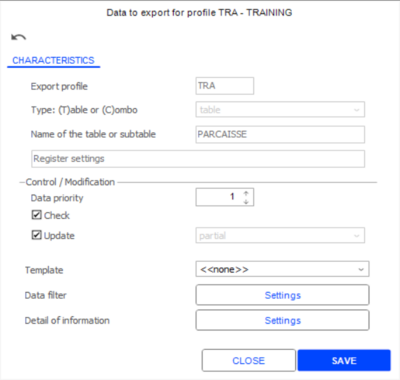

The use of the variables must be specified on every piece of data linked to this variable.

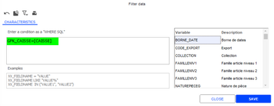

#### Import Profile

Environment Configuration Tool (Data Spread) - Import Profile

Back Office > Administration > Multi-environment settings > Import > Profile

Defining and using import profiles is optional . This feature is used to exclude fields from the file to be imported.

optional

Profiles are used to group information independently of other profiles, e.g. Europe profile or Asia profile.

Import profiles enable you to select the elements you want to integrate, e.g. company settings, general settings or item settings.

In this window, you can search for existing profiles using the different criteria proposed in the Standards and Additions tabs. To open an existing profile, double-click the relevant line.

Once you have created import profiles, you can define a default profile in the company settings (in Distribution.) This eliminates the need to select it each time you want to run an import (see Folder Configuration .)

Folder Configuration

Note that the process is run and/or scheduled from the Import command.

To create a profile, click the [New] button then specify the information described hereafter.

Characteristics tab

This tab is used to group information by category. The screen displayed is divided into two parts:
- The left side displays the functional domains that may be subject to exclusion: Company settings, General settings, Item settings, etc.
- On the right side, next to each domain, you can click the [Exclusion] button to open the screen for selecting the data to be exclude for the profile.

Selection of the domains to exclude

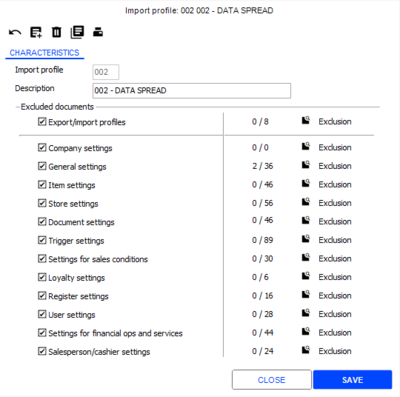

| Some information about this screen... |
| --- |
| Display of a counter | The screen displays a counter on the right side for the functional domains ticked on the left side. In the screen above, the General settings line shows 2/36, which means that out of 36 elements that can be excluded, 2 have been selected. |
| Button [Exclusion] | After the selection of a functional domain, click this button to open the selection screen for the data to be exclude (list of resources to be excluded such as tables, subtables, etc.) This screen is explained in the next paragraph. |
| Some information about this screen... | Export/import profiles: This functional domain includes tables and combos used to set up imports/exports. This enables you to propagate export/import profiles: to other databases. This data can be used in the same way as the other functional domains, with the possibility to carry out integration and comparison Company settings: When you select this functional domain, the system displays the Non importable company settings for profile... screen |

Selection of data to exclude for the profile

This screen becomes available when you click the [Exclusion] button.

This screen shows all the settings to exclude for the functional domain selected previously.

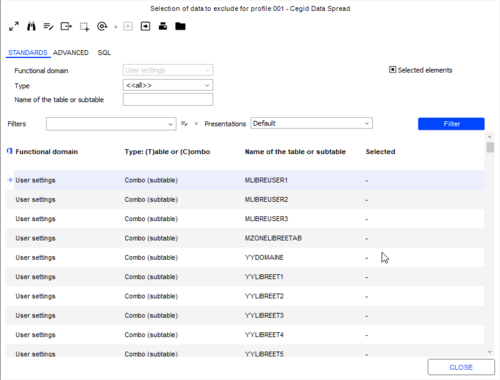

| Some information about this screen... |
| --- |
| Process button | After having selected the lines to process, click this button for the following: Do not import: Is used to exclude elements from the import. Once the selection is saved, an X is displayed in the Selected column of the multi-criteria screen (as shown above.) Import: Is used to import the selected lines. |
| Select all/Deselect all | With this button, you can with one click select or deselect all the desired elements. |
| View the properties of the element | A double-click on a line allows you to view the properties of the element (see Data to Exclude for the Profile .) |

#### Data to Export/Exclude for the Profile

Environment Configuration Tool (Data Spread) - Data to Export/Exclude for the Profile

Data to export for the profile

Back Office > Administration > Multi-environment settings > Export > Profile

Open an export profile record and go to the Information to export tab.

Click one of the [Selection/Setup] buttons to display the Selection of data to export for profile multi-criteria screen.

Double click the line of your choice and specify the following information.

Characteristics tab

Some of the data is retrieved from the profile and is modifiable depending on the options enabled.

| Fields | Description |
| --- | --- |
| Data priority | This is used to assign a priority to the data to be checked. It ranks information in the comparison console. |
| Model | This option is only available for table data and is used in cases where the central site does not manage all elements of all databases to be checked. For example, you can create a standard store by country that can be subsequently used as model for other stores in this country. As such, certain tables can manage models by enabling users to select template data. If the model is specified, data from this model will be extracted from the original database and compared with data from all records in the target database based on the defined data filter. If the model is not specified, data will be extracted from the original database based on the data defined filter. It will be individually compared with data in the target database. |
| Data filter | This option is available only for data of type table and is used to restrict the data to be exported using a control filter that is defined as an SQL query containing a WHERE clause. Click the [Settings] button to open the Filter data window. When the query is validated, the WHERE clause is verified. If it is correct, the number of elements returned will be displayed. A concept grants authorization to modify an export profile. Other users can only access it in read mode. WHERE clauses with variables: Not that you can enter clauses with variables, thanks to the list of variables available on the right side of the screen. A double click on one of them allows you to add it to the restrictive clause to be applied to the table. Some variables displayed here are inherited from the User-Defined Export feature. WHERE clauses with indexes: On this screen, the [Select the columns of an index] button allows you to view the existing indexes for the table. You can quickly generate a clause based on indexes by double-clicking your selection. |
| Detail of information | This option is available for certain tables. It is used to restrict the comparison to relevant data and eliminates the need to define specific settings. You can perform the comparison from the Company > Multi-environment settings. Click the [Settings] button to open the Fields to take into account window. Select or deselect the fields you want using the space bar. Next, click the [Selection/Deselection] button. The Selected elements criterion displayed in the top half of the window is used to filter the selected elements in order to restrict the information to display. Only the selected information will be compared. By default, no information is selected, so that all can be taken into account. Please note! When you add new fields to the data model, they will be retrieved based on the following selection: No other field selected: The new fields will automatically be exported. Certain fields selected: The new fields will not be exported. |

Data tab

This tab is only available for subtable data and is used to view data for the selected subtable.

Data to exclude for the profile

Back Office > Administration > Multi-environment settings > Import > Profile

Open an import profile record and go to the Characteristics tab.

Click one of the [Exclusion] buttons to display the Selection of data to exclude for profile multi-criteria screen.

Double-click the line of your choice to open the Data to exclude for the profile screen. Data cannot be modified.

#### Additional Tools

Environment Configuration Tool (Data Spread) - Additional Tools

Launching and scheduling the process

Back Office > Administration > Multi-environment settings > Export > Export

Back Office > Administration > Multi-environment settings > Import > Import

These commands are used not only to schedule the process but also to start it immediately.

After selecting a profile and entering the location of the file (when importing) use one of the following buttons:
- The process is launched directly through this immediate execution button.

Or
- The process can be scheduled. This button then opens the Settings for a task screen. Please refer to the Scheduled Tasks topic for further information.

Note!

It is imperative that the file directory be a shared directory, accessible from the client workstation and the scheduled task server.

Clarification regarding the export process

If variables are present, the Test the query screen is displayed to specify the variables (see Integrate Variables .)

Integrate Variables

You can also start the export from the Export Profile record

Export Profile

Clarification regarding the Import process

The import performs full processing as follows:
- Compare data to generate the results file containing differences.
- Integrate and update data.

By default, the Import profile to use field retrieves the import profile indicated in the company setting (in Distribution.) If required, you can modify it.

Traces in event log

Back Office > Administration > Event log > Log query

For an export

When running the Export process, the “DataSpread export” trace is added to the event log.

This trace of level 3 is used to track the export process and displays the start and end dates, as well as the number of exported records.

In the case of a scheduled import/export, the trace logged to the event log is completed with the number of the scheduled task in charge of the process.

The Processing section displays the total number of lines, the number of processed lines and erroneous lines, as well as the name and the location of the processed file.

Note that the old level 3 trace (Data and Settings) that traced the export has been kept and allows you to display only the changes made to the settings since the last launch.

For an import

When running the Import process, the “DataSpread Import” trace is added to the event log.

This trace of level 3 is used to track the import process and displays the name and the location of the variance file as well as the number of lines with discrepancies.

In the case of a scheduled import/export, the trace logged to the event log is completed with the number of the scheduled task in charge of the process.

The Processing section displays the number of lines to process the number of processed lines and erroneous lines, as well as the name of the processed file.

Comparison tool

Comparing environments

Back Office > Administration > Multi-environment settings > Import > Check

This command is used to import a file to compare its content with that of the database No changes are made.

In the Location of the file to compare field, specify the path to the previously generated file and press the tab key.

This will create a result file named in the following format: nameofthefiletocompare_Res.txt

This will generate a result file that lists differences.

Loading result file from comparison

Back Office > Administration > Multi-environment settings > Import > Query variance

This command is used to load a file from a comparison so that differences can be clearly displayed and easily analyzed as compared with a TXT file. The comparison can be run on a remote database and the generated file can be retrieved to the central database for analysis. In this way, the central database can run a comparison in its environment and load the file containing differences ( _Res.txt file).

Please note! Only differences will be displayed.

Processing through an external program

Using dataspread.msi

Once you have installed dataspread.msi, you can run batch processing using the following type of command line:
- CbrDataSpread.exe /EXPORT /DATABASENAME=DEMO /INIFILE=CEGIDPGI.INI /PROFILE=001 /FILE="C:\ExportData.txt" /LOGFILE="C:\LogExportData.log"
- CbrDataSpread.exe /IMPORT /DATABASENAME=DEMO /INIFILE=CEGIDPGI.INI /FILE="C:\ImportData.txt"
- CbrDataSpread.exe /COMPARE /DATABASENAME=DEMO /INIFILE=CEGIDPGI.INI /RESULTFILE="C:\CompareData.txt" /FILE="C:\ExportData.txt"

#### Creation of a Pre-packaged Profile

Environment Configuration Tool (Data Spread) - Creation of a Pre-packaged Profile

Back Office > Administration > Multi-environment settings > Export > Profile

Creation of a pre-packaged profile

Step 1: Create an export profile

Normally initialize an export profile (see Export Profile .)

Export Profile

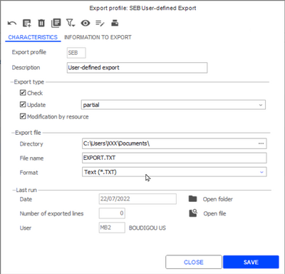

Step 2: Add tables

If tables are not available as standard, add them (see topic Export Profile, section Adding a Table .)

Export Profile, section Adding a Table

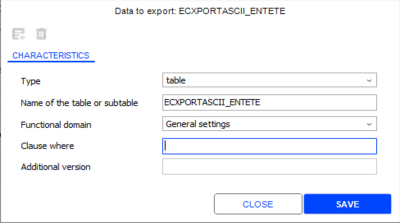

Step 3: Add variables

If variables are required, add them (see Export profile, chapter Integrate variables (see topic Export Profile, section Integrate Variables .)

Export Profile, section Integrate Variables

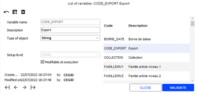

Step 4: Select tables

Select table as usual (see Export profile .) This step is essential because it requires a good knowledge of the Y2 MCD, i.e. to know all the tables representing a functional object.

Export profile

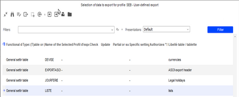

Step 5: Add filters on variables and fields

Filter and variabilize with the WHERE clauses (see Export profile .) This step is essential because it requires a good knowledge of the Y2 MCD and sometimes the need to implement joints. The examples below show a directly by variabilized table, as well as another table variabilized through a joint on the first. All the tables concerned by the export must be filtered according to the same criteria for the export to make sense.

Export profile

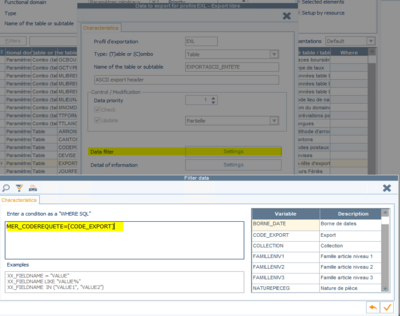

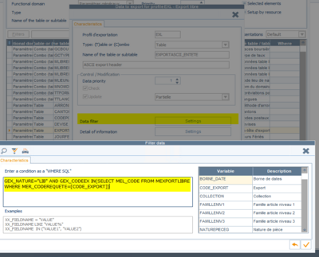

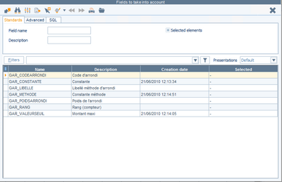

Step 6: Save the profile

Export the created profile from the ECT export profile.

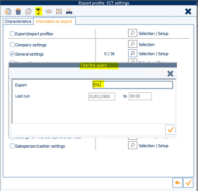

Here is a typical example of a prepackaged profile provided by Cegid.

../ECT_Profil_EXL.txt

## File Exchange Management

### Data Imports - Formats

#### Contents

Default Import Formats - Contents

Data imports can be used to allow the Cegid Retail Y2 application interface with other systems. For example, it can be used to import into the application, items with their respective settings (category, dimension, supplier...), as well as documents, inventory, customers, price lists, and so forth. There is a default import format for each of these types of data to be imported.

This document details the list of the default import formats proposed and their contents.

This document does not deal with the tool and the data recovery procedures used in the former GB2000 and Magestel product lines.

List of default import formats
- Item categories
- Dimensions (grids, descriptions, masks)
- Collections
- Third parties
- Items
- Item user-defined statistics
- Inventory and snapshots
- Price lists
- Documents
- Cost price
- Installments
- User fields
- Classifications
- Serial numbers
- Loyalty
- Multi-barcodes
- Currencies
- Translation
- Item list
- Call-back lists
- Deposits
- Gift certificates/gift cards
- Customer services

File recovery
- Recovering inventory files
- Recovering entry counters

List of $$ fields

Setting specific fields for the following tables:
- ACOMPTE
- ADRESSES
- ARTICLE
- ARTICLETIERS
- COMMERCIAL
- COMPTEURETAB
- DEPOTS Table
- DIMENSION
- DISPO
- DISPOSERIE
- ETABLISS
- FIDELITELIG
- LIGNESERIE
- MAEROPORT
- MBINMASK
- MBOCA
- MBOCALLBACKENT
- MCARTFIDENT
- MDISPOIMAGELIG
- MFUSIONARTDET
- MLISTEARTICLE
- MODELETAXEART
- MPOIDSNUMSERIE
- MRANGTAUXTAXE
- MSAVENT
- OPERCAISSES
- PARCAISSE
- PIECE
- PIECEADRESSE
- PIEDECHE
- PROSPECTS
- RELEVEFACTURE
- RIB
- STKFICHETRACE
- TARIF
- TAUXTAXE
- TIERS
- TRADDATA
- TRADTT
- TRANSINVERR
- TRANSINVLIG
- ARTICLE, TIERS, ETABLISS, COMMERCIAL, MSAVENT, PIECE

Implemented controls
- Required fields for every table
- Format control

#### List of Default Import Formats

##### Recovery Formats - Item Categories

Recovery Formats - Item Categories

Back Office > Data exchanges > Data recovery > Settings > Recovery formats

Please note!

Cegid Retail Y2 may handle up to 8 category levels: it is necessary to use one record type per category level.

A default import format is proposed for the first three category levels.

Consequently, the record identifier must evolve in the header file.

|  |  |
| --- | --- |
| PF1C1 001Jeans | Jeans |
| PF1C1 002Robe | Dress |
| PF1C1 003Tailleur | Suit |
| PF2C1 001Long | Long |
| PF2C1 002Court | Short |

Finally, you must force the CC_TYPE field accordingly to the category level: FN1 to FN8.

Example for categories of level 1:

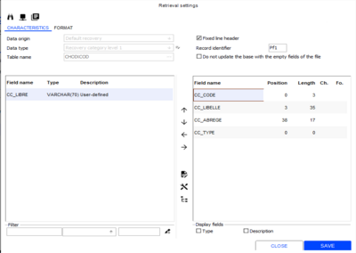

Use this button to handle default values.

##### Recovery Formats - Dimensions

Recovery Formats - Dimensions (Grids, Descriptions and Masks)

Back Office > Data exchanges > Data recovery > Settings > Recovery formats

Dimension grids

Please note!

Cegid Retail Y2 may handle up to 5 dimensions: it is necessary to use one record type per dimension. A default import format is proposed for the 5 dimensions. Consequently, the record identifier must evolve in the header file.

|  |  |
| --- | --- |
| PD1C1 U Unique | Unique |
| PD1C1 001Grille S M L XL | S M L XL |
| PD2C1 001Couleur Robe | Dress |
| PD2C1 002Couleur Jeans | Jeans |

Example for grids of dimension 1:

Note : The import format creates only the codes and the descriptions of the various imported dimension grids. The values in these grids have the import format of the next import Dimension descriptions .

Note

Dimension descriptions

Dimension descriptions are stored in the DIMENSION table. Two methods are used to update dimensions :
- Cegid Retail Y2 dimensions: The GDI_CODEDIM field may be entered and will overwrite the corresponding dimension. In this case, it serves no purpose to enter the GDI_DIMORLI field. Warning! When changing a display row, it is strongly recommended to update all grid dimensions for a coherent display.
- Dimensions from a third-party system: The importing tool automatically creates internal Cegid Retail Y2 codes. Consequently, the GDI_CODEDIM field must not be filled in. This import recovers the descriptions of dimensions (GDI_LIBELLE) but also the associated dimension code (GDI_DIMORLI), visible as complementary description of the dimensions. This CAPM dimension code is mandatory and must be unique for a given dimension grid. It will be used in the following imports to find the internal code associated with a dimension.

|  |  |
| --- | --- |
| DIMC1 DI1U Unique | Unique |
| DIMC1 DI1001S | 01 |
| DIMC1 DI1001M | 02 |
| DIMC1 DI1001L | 03 |
| DIMC1 DI1001XL | 04 |
| DIMC1 DI2001Rouge | 001 |
| DIMC1 DI2001Bleu | 002 |

For example: For dimension grid 1 “001”, you will recover these descriptions: S, M, L, and XL.

The associated CAPM codes 01, 02, 03 and 04 correspond for example to the ranks in the size grid. To find these sizes later, you will work only on these values: 01, 02, 03 and 04.

The settings of the import are as follows:

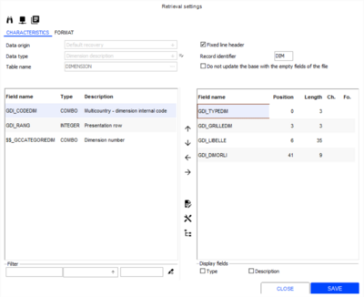

Meaning of the populated fields

| Fields | Description |
| --- | --- |
| GDI_TYPEDIM | Dimension no.: DI1 to DI5 |
| GDI_GRILLEDIM | Code of the dimension grid (ex.: U, 001...) |
| GDI_CODEDIM | Internal dimension code |
| GDI_RANG | Dimension row display |
| GDI_LIBELLE | Dimension description (e.g. U, S, M, L, XL, Red….) |
| GDI_DIMORLI | CAPM code of the dimension (e.g. Unique, 01, 02….) |

Available specific field

$$_GCCATEGORIEDIM: Replaces the GDI_TYPEDIM field and accesses a specific subtable to initialize the number of a dimension according to the settings of the dimension categories, as defined in Settings > Dimension for items (e.g. Selection of the size in the subtable -> Forces DI1 in GDI_TYPEDIM, or use the $$_CATEGORIEDIM field).

Dimension masks

Dimension masks are created automatically when importing items according to the dimension grids used. That is why no default import format is available.

##### Recovery Formats - Collections

Recovery Formats - Collections

Back Office > Data exchanges > Data recovery > Settings > Recovery formats

Default import settings

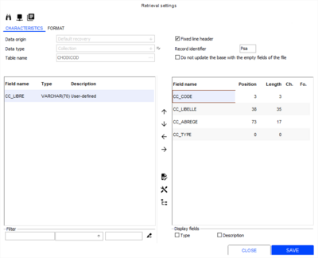

Use this button to handle default values.

##### Recovery Formats - Third Party

Recovery Formats - Third Party

Back Office > Data exchanges > Data recovery > Settings > Recovery formats

Three third party categories can be recovered by default: customers, prospects and suppliers.

Customers or prospects

The default import is set up as follows:

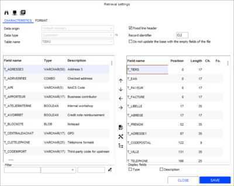

A certain number of fields are initialized by the default import format:

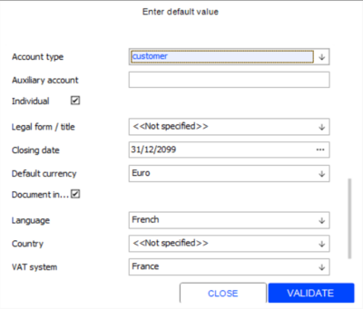

Some specific fields are handled:

| Fields | Description |
| --- | --- |
| $$_MAJPARTIELLE | Partial update or reinitialization: updates one or several fields, keeping the values of the other fields. |
| $$_CREATION | Imports third parties in creation mode only (no update.) |
| $$_TABLELIBRETIERS1 to 10 | Code of the user-defined table for third parties 1 to 10 (stored in TIERSCOMPL). |
| $$_TEXTELIBRE1 to 3 | User-defined third party text 1 to 3 (stored in TIERSCOMPL). |
| $$_VALLIBRE1 to 3 | User-defined third party value 1 to 3 (stored in TIERSCOMPL). |
| $$_DATELIBRE1 to 3 | User-defined third party date 1 to 3 (stored in TIERSCOMPL). |
| $$_BOOLLIBRE1 to 3 | User-defined third party Boolean1 to 3 (stored in TIERSCOMPL). |
| $$_CREECLICASH | Customer 999999 CASH 2000. |
| $$_CODETIERSFUSION | Customer code before merging duplicated customer records |
| $$_FERMEDOTATION | Closes allocation programs |
| $$_KEEPCODEAUXILARY | If this option is checked, the customer’s T_AUXILIAIRE corresponds to the one included in the file upon creation or update. This field is not calculated from the T_TIERS field and the auxiliary account settings (length and padding character) in the company settings/accounting. If this option is not checked, the customer’s T_AUXILIAIRE is calculated from the T_TIERS field and the auxiliary account settings (length and padding character) in the company settings/accounting. Note: Before any update of a third party, the system checks that there is no third party with the same T_TIERS code than the code in the file, and a T_AUXILIAIRE different from the one calculated. In this case, a message is displayed and informs the user that there is already a record with this third party code XXXXX. |

Please note!:

Has the length of the auxiliary accounts in the case of an accounting transfer. This length must be at least equal to the length of the recovered customer codes.

Suppliers

The default import is set up as follows:

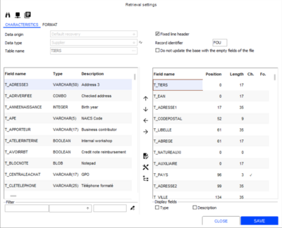

A certain number of fields are initialized by the default import format, the most import field being the accounting type field that is used to distinguish the recovered third party type:

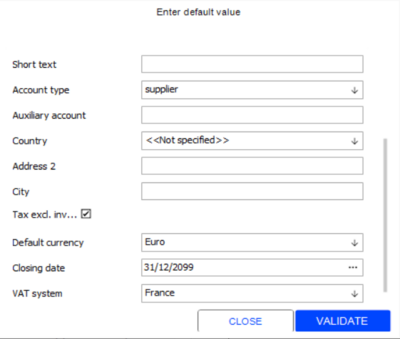

The list of the specific fields is identical to the specific list for customers.

Please note:

In the case of an accounting transfer, the length of the auxiliary accounts must be at least equal to the length of the recovered customer codes.

Notes:
- Upon the import of purchase documents, if the third party of the document is not specified, the main supplier of the first item will be used.
- If $$_FORCETIERS is added and if the third party provided does not exists, the default third party defined in the company settings will be recovered. In this case, the third party will undergo a unity check.
- When importing third parties, it possible to populate the YTC_INCOTERM, YTC_MODEEXP, YTC_LIEUDISPO fields with the values from the $$_INCOTERM, $$_MODEEXP, $$_LIEUDISPO fields.

Checks performed
- When importing customers, the date of birth will be checked to ensure that it is valid.
- If the auxiliary code (T_AUXILIAIRE) is provided, its length will be checked to ensure that is not greater than the length (Auxiliary account length) set in company settings.

Importing a customer with allocations

The customer import format includes the $$_DOTATION fields These fields enable you to associate a customer with one or more allocation programs. When added to the list of fields of the import file, the $$_DOTATION field is incremented as follows: $$_DOTATION 1, $$_DOTATION 2, etc.

Bulk mode

Method for mass insertion of records during import used to speed up processing. For now, this mechanism is enabled for importing third-parties upon creation only. The engine automatically switches to the “BULK” mode. Some conditions must be respected for this mode to be activated:
- Import of data from the TIERS table (the only import that presently benefits from the BULK mode.)
- $$_CREATION present in the format with default value ="X".
- Absence of fields $$_CODETIERSFUSION, $$_FERMEDOTATION, $$_CREECLICASH, $$_MAJPARTIELLE in the import format.
- Import file with enough entries (by default, at least 500 lines.)

Addresses

Data import manages customer address information via Data Exchanges > Settings > Recovery formats with additional fields to perform the following actions:
- $$_DELETE: Delete address (BOOLEAN),
- $$_REPORTADRCLI: Recover address

The identifier that allows you to recover an address is made up of 3 fields:
- ADR_NATUREAUXI: CLI/FOU/PRO
- ADR_REFCODE: Third party code
- ADR_NADRESSE: Address number

This information is required in the import format. ADR_NUMEROADRESSE is a “technical” key that is ignored and never recovered by the import module.

Note that typing is made more flexible and you may create several delivery, billing or payment addresses.

##### Recovery Formats - Items

Recovery Formats - Items

Back Office > Data exchanges > Data recovery > Settings > Recovery formats

Items are handled in two main tables: ARTICLE and ARTICLECOMPL.

Dimensioned items

As far as dimensions are concerned, the following rules must be respected:
- Never work on fields GA_CODEDIM1 to 5. Instead, always use codes $$_CODEGPAODIM1 to 5. These codes correspond to the CAPM dimension codes (for GDI_DIMORLI - refer to the import of dimensions.)
- Dimension masks are created automatically according to the grids.
- You can create the following settings at the same time as items : categories, grids, statistical tables, etc. However, the associated settings are not updated when updating items (except the dimension descriptions).
- For dimensioned items, the generic item must not be included in the file since the generic item record is created when the first dimensioned item is imported.
- An item created as dimensioned item cannot be reintegrated as single item.

Default settings

The default import is set up as follows:

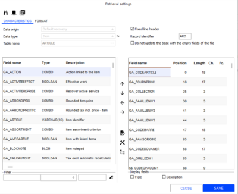

A certain number of fields are initialized by the default import format. Use this button to handle them.

List of specific fields

List of the specific fields available for table ARTICLE:

| Fields | Description |
| --- | --- |
| $$_LIBCOLLECTION | Description of the collection. When importing the item, the application checks that the collection exists. There are three possibilities: The collection exists in the database, no problem. The collection does not exist, but the $$_LIBCOLLECTION field exists in the import format and the corresponding information is recovered in the file or initialized with a default value. The collection is then created. The collection does not exist and the information corresponding to the $$_LIBCOLLECTION field is not recovered in the file. The item is rejected. |
| $$_FAMILLENIV4 to 8 | Specifies the category of levels 4 to 8 (stored in table ARTICLECOMPL.) |
| $$_LIBFAMILLE1 to 8 | Category descriptions 1 to 8: creates the category of levels 1 to 5, if need be (same as $$_LIBCOLLECTION.) |
| $$_LIBGRILLE1 to 5 | Grid descriptions 1 to 5: creates the dimension grids 1 to 5, if need be (same as $$_LIBCOLLECTION.) |
| $$_CODEGPAODIM1 to 5 | Dimension codes 1 to 5 for CAPM |
| $$_LIBGPAODIM1 to 5 | Dimension size descriptions 1 to 5: creates or updates the dimensions 1 to 5, if need be (same as $$_LIBCOLLECTION.) |
| $$_LIBREARTB to F | User-defined item tables 11 to 15: creates the descriptions of the user-defined tables 1 to 15, if need be (same as $$_LIBCOLLECTION) |
| $$_STATART1 to 2 | Specifies the category of levels 1 to 2 (stored in table ARTICLECOMPL.) |
| $$_LIBSTATART1 to 2 | Descriptions of complementary statistics 1 to 2: creates the descriptions of statistics 1 to 2, if need be (same as $$_LIBCOLLECTION.) |
| $$_LIBLIBREART1 to 9 | Descriptions of statistics 1 to 9: creates the descriptions of statistics 1 to 9, if need be (same as $$_LIBCOLLECTION.) |
| $$_LIBLIBREARTA to F | Descriptions of statistics 10 to 15: creates the descriptions of statistics 10 to 15, if need be (same as $$_LIBCOLLECTION.) |
| $$_BOOLLIBRE4 to 9 | Populates the user-defined item decisions 4 to 9 (same as $$_LIBCOLLECTION.) |
| $$_BOOLLIBREA to F | Populates the user-defined decisions 10 to 15: (same as $$_LIBCOLLECTION.) |
| $$_COLLECTIONBAS | Update of the base collection in ARTICLECOMPL. |
| $$_CODEDEVISEPV | Currency code of the selling price: is used to recover the selling prices in a currency different from the currency of the folder. |
| $$_CODEDEVISEPA | Currency code of the purchase price: is used to recover the purchase prices in a currency different from the currency of the folder. |
| $$_CODEDEVISEPR | Currency code of the cost price: is used to recover the cost prices in a currency different from the currency of the folder. |
| $$_CHEMINPHOTO | Directory and name of the JPEG image associated with generic and unique item. |
| $$_CALCULCLECB | Calculates the key of the barcode used (EAN13, EAN8, CODE39, 2/5...) |
| $$_MAJPARTIELLE | Partial update or reinitialization: updates a field, without resetting all the others. For example: Send item code + CAPM dimension codes + new category of level 1 |
| $$_CREATION | Imports items in creation mode only (no update.) |
| $$_PREFIXEMASQUE | Adds a 1-character prefix to the dimension mask code (for example to differentiate masks with the same code, but with different contents.) |
| $$_BLOCNOTELIGNE1 to 10 | Is used to provide the first 10 lines (200 characters each) of the notepad for unique and generic items. |
| $$_PROFILARTICLE | Applies values to an item profile. |
| $$_TRAITEDOUBLONCB | If "true", different items with the same barcode are integrated. The item barcode that already exists in the database will be suffixed with "-S". |

Note that the barcode is only complementary information.

All these partial updates will find the item via the item code + grids + CAPM dimension codes. In this case, you cannot work on field GA_CODEBARRE.

Principles for updating a dimensioned item

The item to update will be searched for according to the information provided by "GA_CODEARTICLE" and "$$_CODEGPAODIM1...2"

When this information makes it possible to find the existing item, if the barcode is available in the import file, this is non-discriminatory data: the barcode is then updated for the item in question.

Update item information about dimensions

You must enable the Copy item information to dimensions option, available in Administration > Company > Company settings > Commercial management > Data import.

If this company setting is checked:
- GA_FOURNPRINC, GA_FAMILLENIV1, GA_FAMILLENIV2, GA_FAMILLENIV3, Statistics, user-defined fields, GA_LIBELLE, GA_LIBCOMPL, GA_COMMENTAIRE, GA_NUMEROSERIE trigger the update of all the dimensions and the generic item.
- GA_COLLECTION, GA_POIDSNET, GA_POIDSBRUT, GA_DPR, GA_PRHT trigger the update of the generic item and the current dimension only.

If this company setting is not checked:
- GA_COLLECTION, GA_POIDSNET, GA_POIDSBRUT, GA_DPR, GA_PRHT trigger the update of the generic item and the current dimension only.

Item referencing

Via the imports in the ARTICLERTIERS table, settings may specify to perform a check on duplicates upon data integration to ensure unique referencing of items: $$_REFARTTIERSUNIQ – Boolean – Unique referencing

Item type

If a non-merchandise type item is imported, the item will be forced to “Not managed in stock”.

In data imports, an item of type merchandise "Is considered in the quantity total" only if the item is neither an "Item for free at register" nor a "Packing item".

Update

At item recovery:
- Updating GA_POIDSNET, GA_POIDSBRUT, GA_POIDSDOUA triggers the update of the generic item with the same information.
- Updating GA_QUALIFPOIDS triggers the update of the generic items and of all the item dimensions with the same information.

At item import:

Update principle for fields GA_PVHT, GA_PVTTC, GA_PAHT, GA_PRHT for data imports:

With single prices:
- If the price for the dimension is set to 0, the price of the generic item for this dimension will be considered.
- Then, if the Copy item information to dimensions company setting is enabled, the generic item and all the dimensions are updated with the price of this dimension. If this setting is not enabled, the process is the same as for a non unique price.

With a non-unique price:
- If the price of the dimension is not 0, only the price of the generic item will be considered.

##### Recovery Formats - Item User-Defined Statistics

Recovery Formats - Item User-Defined Statistics

Back Office > Data exchanges > Data recovery > Settings > Recovery formats

Default import settings

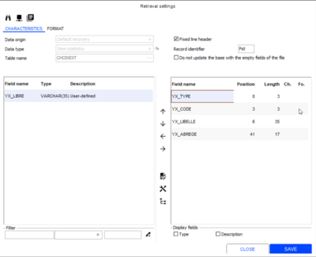

##### Recovery Formats - Inventory and Snapshots

Recovery formats - Inventory and Snapshots

Back Office > Data exchanges > Data recovery > Settings > Recovery formats

Inventory

Inventory is managed in the DISPO table. The fields to populate (from a file or initialized manually) are as follows :
- Item code
- Warehouse
- Closing date (initialized at 01/01/1900 for non-closed inventory)
- Closing flag (Y/N)

Importing may be done either on the item code + CAPM codes, or on the barcode (easier to handle).

In this case, the search for barcodes will be done according to the item search priority as defined by default in Administration > Company > Company settings > Commercial management > Items.

For more information about these formats, see Search Priorities .

Search Priorities

Default import settings

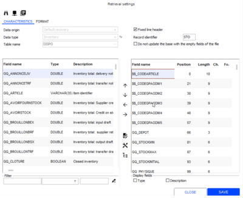

A certain number of fields are initialized by the default import format. Use this button to handle them.

List of specific fields

| Fields | Description |
| --- | --- |
| $$_CODEARTICLE | Generic item code |
| $$_CODEGPAODIM1 to 5 | Dimension codes 1 to 5 for CAPM |
| $$_RECHGPAOLIBDIM1 to 5 | CAPM codes 1 in descriptions: search for dimensions 1 to 5 in field GDI_LIBELLE instead of field GDI_DIMORLI. |
| $$_CODEBARRE | Barcode |
| $$_CODEDEVISEPA | Currency code of the purchase price: is used to recover the purchase prices in a currency different from the currency of the folder. |
| $$_CODEDEVISEPR | Currency code of the cost price: is used to recover the cost prices in a currency different from the currency of the folder. |
| $$_RAZSTOCK | Deletes the warehouse inventory. Please note! Very sensitive because the complete removal of the inventory requires no confirmation. |
| $$_MAJPARTIELLE | Partial update or reinitialization: updates a field, without resetting all the others. |
| $$_MISEAZERO | Resets the movement counters when viewing inventory, such as the quantities received, quantities sold or notice quantities for example. |
| $$_RAZPREPAORLI | Only resets the counter for movements concerning ORLI preparations. |

Inventory snapshots

Inventory snapshots can also be imported. Importing will be done in the MDISPOIMAGELIG line table whose fields must be populated:
- MIL_DEPOT with a valid warehouse code.
- MIL_DATEIMAGE specifying the date of the snapshot. If the field is not populated, the field will be initialized with the date of the import.
- MIL_PHYSIQUE specifies the item quantity of the snapshot.
- The item may be identified with its Cegid Retail Y2 code through MIL_ARTICLE.
- The item may be identified with its barcode or referencing through $$_CODEBARRE.
- MIL_PA and MIL_PR are used to specify the valuation.
- $$_TYPEPA and $$_TYPEPR are used to specify the valuation type in the header.

When inventory snapshots are imported, lines are valued by the means of MIL_PA and MIL_RP.

This is a global valuation. $$_PAUNITAIRE and $$_PRUNITAIRE are used to define a unit valuation. These fields are used only if a global valuation is set to 0.

##### Recovery Formats - Price Lists

Recovery Formats - Price Lists

Back Office > Data exchanges > Data recovery > Settings > Recovery formats

Price lists are set by associating a price list code to a period code.

Price list periods

A price list period is defined by a code, a description, application start and end dates, and a store. If it is a generic price list (i.e. to be applied to all stores linked to this price list ) the store code will be initialized to “ ... “

all stores linked to this price list

If the start date or the end date of the period of the price list is modified, this change will be applied to the TARIFMODE and TARIF tables.

Here is an example of recovering a generic price (default settings):

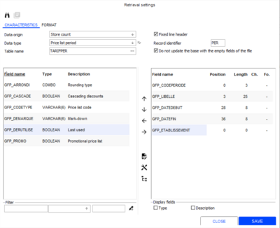

The GFP_ETABLISSEMENT field is initialized to "…" for the generic price list.

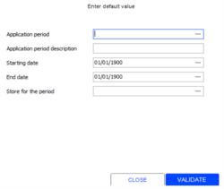

Price list types

A price list type is defined by a code, a description, a currency, and a type (Sale or Purchase.) The default import is set up as follows:

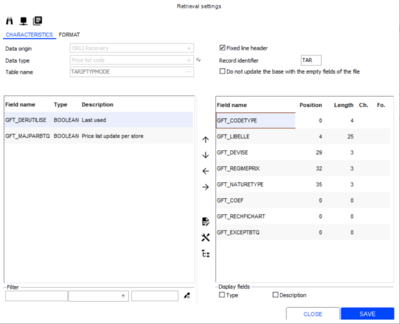

Field GFT_NATURETYPE can have to 2 values: VTE (sale) or ACH (purchase).

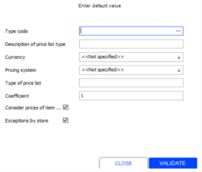

Importing price lists

The import of price lists is based on a price list code, a period code, and an item (item code + CAPM dimension codes or barcodes). Never use field GF_ARTICLE.

The default import is set up as follows:

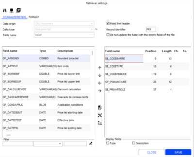

The specific fields are as follows:

| Fields | Description |
| --- | --- |
| $$_CODEARTICLE | Generic item code |
| $$_CODEGPAODIM1 to 5 | Dimension codes 1 to 5 for CAPM |
| $$_RECHGPAOLIBDIM1 to 5 | CAPM codes in descriptions: search for dimensions 1 to 5 in field GDI_LIBELLE instead of field GDI_DIMORLI. |
| $$_SANSOPTIGEN | Without optimization on the generic item. Systematically populates the price list of the dimensioned item even if it is identical to the price list of the generic item. |
| $$_COPYTARIFPERPREC | Copies the price lists from the preceding period |
| $$_CODEBARRE | Barcode |
| $$_CODETYPE | Price list code |
| $$_CODEPERIODE | Price list period |
| $$_PRIXARTICLE | Price to carry forward to the item record: If a selling price list is concerned, the selling price including tax (field GA_PVTTC) for the item will be populated. If a purchase price list is concerned, the tax exclusive purchase price and the last purchase price (fields GA_PAHT and GA_DPA) will be populated. |

Setup and operation

When importing price lists, a price list line is uniquely identified by the GF_TARIF field. If this field is present in the import format, this information is recovered from the file without control (an existing price list will be overwritten.)
- When modifying a price list, field GL_TARIF can be integrated with the import file and be used for the search and modification of the price list.
- When creating a price list:

Remarks

Importing may be done either on the item code + CAPM codes, or on the barcode (easier to handle). Only price lists in amounts can be imported, price lists in percentages are excluded from the import.

The creation of price lists during data import is based on the following principles when importing a dimension of a given item:
- Searching for a price list for the generic item in the database:

Consequently, the import file must absolutely be sorted on the dimensions of the imported items, so that the price list of the generic item may be the price list of the first imported dimension.

If the dimensions of the imported items are “dispersed” in the file, it is highly probable that the price list of the generic item is the price list of another dimension further down in the dimension grid and generally with a higher value.

Wholesale price list

When price lists are imported, if field $$_TARIFNEGOCE is present and enabled, wholesale price lists will be processed. In this case, field GF_DEPOT corresponds to a warehouse.

The setup must include at least, the unit price, the currency, the supplier and a value that identifies the item. Otherwise, retail price list will be processed, and in this case the GF-DEPOT field specifies the code of a store. The control of the value in GF_DEPOT is adjusted according to the case processed.

##### Recovery Formats for Documents

###### Documents

Recovery Formats - Documents

Back Office > Data exchanges > Data recovery > Settings > Recovery formats

The import wizard helps to recover any type of Cegid Retail Y2 document. Considering the structure of these documents, the setup covers the PIECE table and uses many specific fields ($$_) to populate the LIGNES and PIEDECHE tables (payment methods, installments) and the PIEDBASE table (business discount, document discount, totals.)

The LIGNES and PIEDBASE tables must never be populated directly by the import wizard. Various option are offered:

LIGNES

PIEDBASE
- Inventory impact, or not
- Close preceding document and manage remaining quantities.
- Import transfers (automatic generation of the transfer sent or to be validated)
- etc.

Since the import format considers only the PIECE table, the file format is relatively simple. All the calculations are handled by the import wizard. The following information must be entered:
- Document type
- Internal reference required , since this field identifies the document
- third party associated with the document
- Dimensioned item or barcode
- Quantity
- Prices

Note that this information need not be present in the file. It can be initialized by default.

Two lines belonging to the same document must be consecutive and have the same internal reference .

must be consecutive

and have the same internal reference

Related topics:
- List of available and specific fields
- Maintaining documents
- Managing specific features

###### List of Available and Specific Fields

Import Formats - List of Available and Specific Fields

List of available fields

| Fields | Description |
| --- | --- |
| GP_NATUREPIECEG | Document type |
| GP_DATEPIECE | Document date |
| GP_DATELIVRAISON | Delivery date |
| GP_REFINTERNE | Internal reference |
| GP_REFEXTERNE | External reference |
| GP_REFSUIVI | Follow-up reference |
| GP_TIERS | Third-party |
| GP_TIERSLIVRE | Ship-to party |
| GP_TIERSFACTURE | Invoiced third-party |
| GP_TIERSPAYEUR | Third-party payer |
| GP_ETABLISSEMENT | Code of the document store |
| GP_VENTEACHAT | Indicator of the document type (VTE/ACH/TRF/INV/AUT). |
| GP_VIVANTE | Active/modifiable document |
| GP_CAISSE | Register code |
| GP_ETABLISDEST | Code of the recipient store for transfers |
| GP_DEPOTDEST | Recipient warehouse for transfers |
| GP_CODEMODELETAXE | Tax model code |
| GP_REGIMETAXE | Tax system code |
| GP_LIBREPIECE1 à 3 | User-defined tables 1 to 3 of the document |
| GP_ETATEXPORT | Exported document indicator |
| GP_DATEEXPORT | Export date of a document |
| GP_ETATVISA | Approved document indicator |
| GP_DATEVISA | Visa date of document |
| GP_REMISEPIED | Footer discount in percentage |
| GP_ESCOMPTE | Business discount in percentage |
| GP_MAILING | Mailing associated with the document |
| GP_PRIXFERME | Document managed in firm prices (non modifiable). |
| GP_ACCRECEPTION | Acknowledgment document receipt |
| GP_NUMZCAISSE | Register Z receipt number |
| GP_VENTEEXPORT | Export sale indicator |
| GP_TAUXMAJOREXPORT | Markup rate for export sale |

List of specific fields

| Fields | Description |
| --- | --- |
| $$_FAMILLETAXE1 to 5 | Tax categories 1 to 5: by default these tax categories are recovered from the item record. These fields are used to force other taxes (for example RED/reduced instead of NOR/normal.) |
| $$_REPRESENTANT | Sales representative: by default the representative is recovered from the third-party record of the document. This field is used to force the sales representative to another value. |
| $$_LIBELLELIGNE | Specific line description: by default the line description is recovered from the item description. This field is used to force the description of the line. |
| $$_CODEARTICLE | Generic item code |
| $$_CODEGPAODIM1 to 5 | Dimension codes 1 to 5 for CAPM |
| $$_RECHGPAOLIBDIM1 to 5 | CAPM codes 1 to 5 in descriptions: search for dimensions 1 to 5 in field GDI_LIBELLE instead of field GDI_DIMORLI. |
| $$_CODEINTERNE1 à 5 | PGI internal dimension codes 1 to 5: this code must not be used (specific import dedicated to CASH 2000.) |
| $$_CODEBARRE | Barcode |
| $$_FORCEARTICLE | If the item is unknown and if this field is checked and used, the item will be replaced by the default item defined in the company settings (see the management of exchanges.) |
| $$_FORCETIERS | If the item is unknown and if this field is checked and used, third-party will be replaced by the default party-party defined in the import format. |
| $$_OPCAISSE | Financial operation: is used to recover financial operations. A mapping table must be handled. In this case, you must associate a register operation with a financial item and a payment method. |
| $$_QTESTOCK | Quantity in absolute value |
| $$_QTEINIT | Is used to specify the initial quantity of a line. |
| $$_DEPOT | Line warehouse |
| $$_DEPOTDEST | Line Recipient warehouse |
| $$_SIGNE | Sign of the movement (+/- or POS/NEG.) |
| $$_MAJSTOCK | Inventory update. |
| $$_GEREECHEANCES | Automatic generation of installments. The wizard recovers the payment method of the third-party. And then, creates the installments (PIEDECHE line) with the payment method associated with the settlement. |
| $$_REGROUPELIGNES | Grouping of lines. The import wizard may group together, on demand, lines with the same items. The activated $$_REGROUPELIGNES option groups lines together when importing a document, if these lines have the following identical data: $$_NATUREPIECEG $$_REFINTERNE GL_ARTICLE GL_DEPOT GL_DATELIVRAISON |
| $$_FACTUREHT | Tax exclusive invoice (Y/N). |
| $$_IDSERIE | Is used to recover the serial numbers of an item. |
| $$_DATELIVINITIALE | Is used to specify the initial delivery date. |
| $$_CODETVA | VAT code: by default the tax system (for example, FRA) is the third-party's one in the document, and the taxes (MRD/RED) are in accordance with the items. This specific field helps you to handle a mapping table and to force these 2 elements. Example: $$_CODETVA = 0 -> Regime = FRA Tax = RED 5.5% $$_CODETVA = 1 -> Regime = FRA Tax = NOR 19.6% |
| $$_PRIXACHUNITAIRE | Unit purchase price of the item: this information must be specified to obtain margins when importing sales. |
| $$_PRIXREVUNITAIRE | Unit cost price of the item: this information must be specified to obtain margins when importing sales. |
| $$_PRIXBASEUNITAIRE | Unit base price of the item: this information must be specified to obtain margins when importing sales. |
| $$_PRIXVTEUNITAIRE | Unit price: this field used for the valuation of the document. For a sales transaction, it corresponds to the gross selling price (with or without tax.) For a purchase document it corresponds to the PP (purchase price.) |
| $$_PRIXVTEUNIREM | Discounted unit price: this field used for the valuation of the document. For a sales transaction it corresponds to the net selling price, (with or without tax.) For a purchase document it corresponds to the discounted PP (purchase price.) |
| $$_GEREARTLIESOBLIG | Makes the management of linked items mandatory. |
| $$_MNTARTLIEOBLIG1 | Makes the amount of the first linked item mandatory. |
| $$_MAJFIDELITE | Impacts a customer's loyalty total. Subject to serialization. |
| $$_TYPEREMISE | Mark-down reason (for sales.) |
| $$_RECUPREMISETIERS | Helps to recover the discount from the third-party record. |
| $$_RECUPESCOMPTETIERS | Helps to recover the business discount from the third-party record. |
| $$_REMISE | Discount in percentage Two solutions: If $$_REMISE is populated, the discounted unit price is calculated automatically from the unit price and the discount granted. If the field is not populated, the discount is calculated automatically from the gross unit price and the net unit price. |
| $$_PRIXACHTOTAL | Total purchase price: the same as $$_PRIXACHUNITAIRE. The wizard automatically recalculates the unit purchase price from the total purchase price and the quantity. You must specify one or the other field (unit or total.) If both are specified, only field $$_PRIXACHUNITAIRE is taken into account |
| $$_PRIXREVTOTAL | Total cost price: the same as $$_ PRIXREVUNITAIRE. The wizard automatically recalculates the unit cost price from the total cost price and the quantity. You must specify one or the other field (unit or total.) If both are specified, only field $$_PRIXREVUNITAIRE is taken into account |
| $$_PRIXVTETOTAL | Total line price: the same as $$_ PRIXVTEUNITAIRE. The wizard automatically recalculates the unit selling price from the total gross selling price and the quantity. You must specify one or the other field (unit or total.) If both are specified, only field $$_ PRIXVTEUNITAIRE is taken into account |
| $$_PRIXBASETOTAL | Total line base price: the same as $$_ PRIXBASEUNITAIRE. The wizard automatically recalculates the unit base price from the total gross base price and the quantity. You must specify one or the other field (unit or total.) If both are specified, only field $$_ PRIXBASEUNITAIRE is taken into account |
| $$_PRIXVTETOTREM | Total discounted line price: the same as $$_ PRIXVTEUNIREM. The wizard automatically recalculates the net unit selling price from the total net selling price and the quantity. You must specify one or the other field (unit or total.) If both are specified, only field $$_ PRIXVTEUNIREM is taken into account |
| $$_CTRLPRIXVTETTC | Checks the tax inclusive selling price for the item |
| $$_CTRLPRIXVTEHT | Checks the tax inclusive selling price for the item |
| $$_CTRLPRIXNUL | If the document price is null, the price of the item record is recovered (tax exclusive purchase price if purchase document, or selling price inclusive or exclusive of tax if sale document). |
| $$_GRATUIT | Specifies if an item is offered for free; the line price is forced to 0 in any case. Revaluation has no impact on these lines, nor has the checking of null prices ($$_CTRLPRIXNUL). |
| $$_TARIFETAB | Store linked to the valuation price list. |
| $$_TARIFTYPE | Code of the price list used for valuation. |
| $$_TARIFDATE | Valuation date. |
| $$_MOTIFMVT | Inventory I/O reason. |
| $$_DEVISE | Document currency. |
| $$_DUPLICPIECE | Duplication type: used to recover transfers. Defines the type of the duplicated transfer: to validate or received. Warning! Do not use in e-Commerce context. |
| $$_RECALCULPIECE | Enables the revaluation of the document prices |
| $$_NATUREPIECEG | Type of the document to close: used for example to integrate a delivery notice. |
| $$_REFINTERNE | Internal reference of the document to close: used for example to integrate a delivery notice. |
| $$_PIECEUNIQUE | Unique internal reference: for checking the uniqueness of the internal reference. If there is already a document with this internal reference, the document will be rejected. |
| $$_MAJDATEINT | Updates field GP_DATEINTEGR normally handled by TOX imports. |
| $$_CREECLICASH | Customer 999999 CASH 2000: as for imports of CASH 2000 files in GB 2000, this field assigns the last party created to the document. |
| $$_BLOCNOTEDOC1 to 10 | Is used to populate the first 10 lines (200 characters each) in the notepad of the document. |
| $$_FAMILLENIV1 to 3 | Line specific category levels 1 to 3: by default category levels 1 to 3 recover category levels 1 to 3 of the item. This field is used to force category levels 1 to 3 of the line. |
| $$_COLLECTION | Specific line description: by default the line description is recovered from the item description. This field is used to force the collection of the line. |
| $$_NONRECHTAXES | Disables the automatic search for taxes to apply. |
| $$_MONTANTTAXE1 to 5 | Tax amount 1 to 5 |
| $$_TAUXTAXE1 à 5 | Tax rate 1 to 5 |
| $$_REMPLACE | Supersedes a document This field does not work with FFO documents (since, even in a context different from the French Law type restriction, modifying sales receipts is not encouraged.) |
| $$_REMPLACELIGNE | Supersedes a line Please note! You can change only the quantities of the line. Prices remain unchanged. |
| $$_SOLDEE | Specifies if a document line has status"Closed" or"Non closed" |
| $$_PAYSTAXE | Country associated with the tax system. |
| $$_REGIONTAXE | Region associated with the tax system. |
| $$_TAXEDEETAB | Recovers from the database taxation elements of the store. |
| $$_CODEPORT | Freight code in the document footer. |
| $$_MONTANTPORT | Freight amount in the document footer. |
| $$_MAJSTATUT | Updates the status of the document. |
| $$_GERELITIGE | Enables litigation management. |
| $$_LITIGEATTRAPPRO | Forces the status of the document litigation to “Awaiting reconciliation”. |
| $$_DEVISECODEISO3 | Recovers the ISO3 code of the document currency. |
| $$_DEVISECODEISO3NUM | Recovers the ISO3 code of the document currency. |
| $$_TIERSCODEEAN | Recovers the EAN code of the document third-party. |
| $$_ETABCODEEAN | Recovers the EAN code of the document store. |
| $$_ETABDESTCODEEAN | Recovers the EAN code of the recipient store. |
| $$_LOTEXTERNE | External batch: if the batch management is enabled and if the item processed handles batches, this field checks that the batch is specified according to the settings defined in the document type to update the picking (creation of the associated inventory movement.) |
| $$_LOTINTERNE | Internal batch: if the batch management is enabled and if the item processed handles batches, this field checks that the batch is specified according to the settings defined in the document type to update the picking (creation of the associated inventory movement.) |
| $$_LOTSUIVI | Tracked batch: if the batch management is enabled and if the item processed handles batches, this field checks that the batch is specified, in the absence of the external batch, according to the settings defined in the document type to update the picking (creation of the associated inventory movement.) |
| $$_DATEPEREMPTION | Expiry date of the batch: if specified, this date is taken into account for the creation of the inventory movement associated with the document, and possibly in the batch record if is created. |
| $$_DATEDLU | Use-by date of the batch: if specified, this date is taken into account for the creation of the inventory movement associated with the document, and possibly in the batch record if is created. |
| $$_MAJINFOENTETE | This field, if populated, enables the update of some header information without performing controls on document lines. |

Remarks
- A document is imported in its entirety, or not at all.
- Changes in documents are not taken into account.
- When importing a document that closes another document, the delivery and billing addresses are copied from the closed document to the imported one. The same goes for all user-defined fields. The same goes for third-parties and representatives.

###### Maintaining Documents

Maintaining Documents

Maintenance involves the modification of a document that is already integrated. The update of the quantities of a line takes into account the delivery date defined.

When importing a document for maintenance, the lines in the document integrated with the database and those in the document being currently imported, are sorted according to the following criteria: Item code, delivery date, order number of line creation

After this operation, the lines will be updated in a 3-step process.

1. Updating identical lines

1. Updating identical lines

Cegid Retail Y2 browses the document in the database, searches for each line the corresponding line in the document being imported, according to the Item code/Delivery date criteria.

If the line is found, Cegid Retail Y2 will update and flag the two lines as processed.

2. Updating lines in chronological order by delivery date

2. Updating lines in chronological order by delivery date

Cegid Retail Y2 browses the document in the database and searches for the first non-processed line in the document being imported for each non-processed line, according to the item code criterion only (documents are sorted in chronological order by delivery date.)

If a line is found, Cegid Retail Y2 will update and flag the line of the document being imported as processed. Otherwise the document in the database is closed.

3. Processing new lines

3. Processing new lines

Cegid Retail Y2 browses the document being imported, and adds it to the document in the database for each non-processed line.

Through this process, Cegid Retail Y2 updates the document with order quantities and delivery dates.

Two default import formats are available: Both will recover sales receipts, either from items or from barcodes.

The default import is set up as follows:

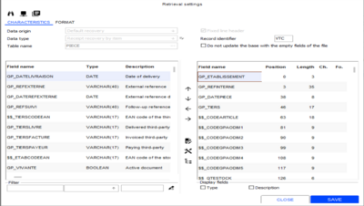

Use the [Define default values] button to see the fields initialized by the default import format:

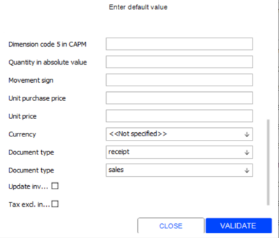

The default import with barcodes is set up as follows:

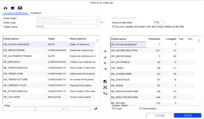

###### Managing Specific Features

Import Formats - Managing Specific Features

Addresses

You can manage importing delivery and billing addresses associated to a document. Therefore, data must be imported into the PIECEADRESSE table.

Prices

The corresponding unit price is calculated from the quantity expressed as an absolute amount, to avoid changing the sign of the price when using the $$_PRIXxxxTOTAL fields.

Bill of materials

When importing documents, you can use assembly BOM items. This type of management is effective when:
- creating documents
- canceling/replacing documents
- importing a document that closes the preceding one
- creating/updating document via Webservices

Macro BOMs and assortment BOMs cannot be used.

Third party

Upon the import of purchase documents, if the third party of the document is not specified, the main supplier of the first item will be used. If $$_FORCETIERS is added and if the third party provided does not exists, the default third party defined in the company settings will be recovered. In this case, the third party will undergo a unity check.

Warehouses

In a multiple warehouse environment, when you import a document that closes the preceding one, and if the warehouse of the line is not provided by field $$_DEPOT, the warehouse will be recovers from the preceding document. When importing documents, if the $$_DEPO field is populated but not the GP_ETABLISSEMENT field:
- In a single warehouse environment: GP_ETABLISSEMENT will focus on $$_DEPOT.
- In a multiple warehouse environment: You will search for the store using the following query, which helps you to identify the first store using this warehouse with the highest priority.

select ##TOP 1## MDE_ETABLISSEMENT from metabdepot

select ##TOP 1## MDE_ETABLISSEMENT from metabdepot

where mde_depot="001"

where mde_depot="001"

order by mde_priorite, mde_etablissement

order by mde_priorite, mde_etablissement

Taxes

Upon document imports, it is possible to define the tax model and the tax system to use in the document. Therefore, you must use the GP_CODEMODELETAXE and GP_REGIMETAXE fields. You must populate the tax region and the tax country from the tax system, to be able to export to accounting (search for accounts) if taxes are not calculated.

Tax calculation

When importing an Oni-channel document, a new field enables you to recover the tax calculation method of the original document ($$_NONRECHTAXES set to ‘X’.)

Transfers

You can import a TRE closing a TRV. In this case, the number of the TRE transfer is recovered from the TRV transfer, and the inventory of the recipient warehouse is updated.

Document verification

When importing documents:
- If the document date is prior to the date of the last inventory statement, the document will be integrated at the current date, and the initial date will be copied to the GP_DATEREFEXTERNE field (same operating as for accounting closure.)
- The check performed on the document recognizes the GP_SUPPRIME field.
- When a document is imported with the $$_PIECEUNIQUE field, the existence of the document will be checked for the TIERS+REFINTERNE (third party + internal reference) combination.

Additional descriptions

When a document is recovered, you may force the complementary line description by using the $$_LIBELLECOMPLLIGNE field. By default, the complementary line description includes the complementary item description.

User-defined tables

When importing documents in supersede mode, the document user-defined tables are overwritten only if the value of the file is not void. Document user-defined tables using a subtable are controlled when documents are imported.

Accounting

You can now recover the accounting export status when importing documents. Therefore, you must use the GP_ETATCOMPTA and GP_DATECOMPTA fields. If the status is "Awaiting export", the date is initialized to 01/01/1900.

Formulas

Special characters such as ' (single quotation mark), (,),[,],@,+,-,/,*,% are supported.

Document date and time

When importing documents, the document will be integrated at the current date and the initial date will be copied to the GP_DATEREFEXTERNE field (same operating as for accounting closure) if the document date is prior to the date of the last inventory statement.

If the document date is not present in the import format, not specified, or not set to 01/01/1900, the date is automatically initialized to the processing date.

Field GP_HEURECREATION is added to the list of fields available in the setup of an import format concerning table PIECE:

This field will include the date and the time in the formats specified in the setup (the time format is not configurable.)

With the following setup in the example above:

Date in format DDMMYYYY and time in format HHNNSS.

For the following date and time “16/12/2010 16:10:55”, the file must have the following value: "16122010161055".

Document headers

It is possible to enter updates for document headers without importing the lines. If the $$_MAJINFOENTETE field has been added to the recovery format for documents, the following fields can be updated:
- GP_REFEXTERNE
- GP_DATEREFEXTERNE
- GP_REFSUIVI
- GP_LIBREPIECE 1 to 3
- GP_DATELIBREPIECE 1 to 3

Importing document lines

In the previous versions, document modification was based on the “supersede” mode. Line references have been created to make this operating more flexible. The use of the $$_REFLIGNE field triggers the management of document imports by line reference.

You no longer need to send all of the lines to update the document during document maintenance based on line references. The update is based on line references. Lines that are not found will not be updated.

To close a preceding document by using line references, you must use field $$_REFLIGNESOLD to specify the line to close.

Omni-channel documents

Gift certificates and gift cards

You can import receipts that issue a voucher or consume a voucher.
- Issuing a voucher via an imported receipt: To keep the accounting accurate with the preceding data importing function, the $$_NUMBON field in the PIECE table import format enables management of vouchers if the document type for the imported line is FFO, and if the item being imported is an “Acquisition of gift certificate/gift card” financial type item.
- Activating a voucher via an imported receipt: You must use a financial item type “Acquisition of a gift certificate/gift card” with the “pre-registered” setting enabled. In this case, the corresponding cash register operation will be searched using the $$_NUMBON value.
- Consuming a voucher via imported receipt: If the payment method for the imported installment line is “Gift certificate/gift card”, the gift certificate/gift card will be searched using the $$_NUMBON value.
- Reimbursing a voucher via imported receipt: The $$_NUMBON field in the PIECE table import template activates management of paper values for FFO type documents. If the financial item for the imported installment line is “Gift certificate/gift card”, the gift certificate/gift card cash register operation will be searched using the $$_NUMBON value.

Note: Reimbursing a gift card is always done with the same form of payment, even if the card is marked as “discount” card.

Valuation when importing documents

The "$$_PRIXNULVERROUILLE” field will lock the lines with null prices. This option is used for instance when you import delivery preparations to close Omni-channel orders including gift items.

If this indicator is missing when importing a document that closes a previous document not managed in firm prices, the calculation of the document is performed despite the missing “$$_RECALCULPIECE”, which cause the revaluation of the gift items.

##### Recovery Formats - Cost Prices

Recovery Formats - Cost Prices

Back Office > Data exchanges > Data recovery > Settings > Recovery formats

According to the business supported, the cost prices may be provided upstream of Cegid Retail Y2.

Inventory cost prices can be updated from an imported cost price.

This new cost price is stored in table LIGNE (GL_PRHT), and is expressed in the currency of the store.

This price can be populated only by document imports.

CAPM imports

The CAPM import format for documents allows you to specify this new cost price.
- $$_PRHTUNITAIRE: Unit cost price exclusive of tax
- $$_DEVISEPRHT: Currency of the tax exclusive cost price

The currency of line cost price exclusive of tax may be specified in the file format, but it is optional. By default, the ex-tax cost price of the imported file is expressed in the folder currency.

In any case, the ex-tax cost price line (GL_PRHT) is expressed in the store currency. The currency of the ex-tax cost price in the import file is not saved in the document.

##### Recovery Formats - Installments

Recovery Formats - Installments

Back Office > Data exchanges > Data recovery > Settings > Recovery formats

When importing installments, it is possible to define information about bank cards using the following fields: GPE_CBINTERNET, GPE_DATEEXPIRE, GPE_CBLIBELLE and GPE_CBNUMAUTOR.

This information is encrypted automatically.

The Boolean field GPE_PERCU is added to the available fields to specify that the payment of an invoice or of a credit note has been received.

The payment to update will be found by the means of the following fields:
- GPE_NATUREPIECEG Document type
- $$_REFINTERNE Internal document reference
- GPE_NUMECHE Installment line number

If partial payments are received, two lines will be sent to Cegid Retail Y2.

For example: For an invoice of €5,000 paid with a bank transfer of €3,000 and the balance to be paid later. The following information must be sent:
- Line 1 for €3,000 Transfer “received” - Boolean checked
- Line 2 for €2,000 Transfer "to receive" - Boolean unchecked

##### Recovery Formats - User Fields

Recovery Formats - User Fields

Back Office > Data exchanges > Data recovery > Settings > Recovery formats

User fields can be imported. The idea is to propose for the formats of basic data new $$_... fields to import at the same time basic data and the associated user fields.

In the description of the basic data formats (items, customers/suppliers, stores, representatives,) the following $$_... user fields are available:
- $$_CHAMPUTILISATx
- $$_CHAMPVALEURx

If one of these two fields is shifted to the right in the import format, the associated second field will also be shifted to the right, and a number will be attributed to them:
- $$_CHAMPUTILISAT1
- $$_CHAMPVALEUR1
- $$_CHAMPUTILISAT2
- $$_CHAMPVALEUR2
- $$_CHAMPUTILISAT3
- $$_CHAMPVALEUR3
- ...

The user must specify the relevant user field for each $$_CHAMPUTILISATx field. During importing, the $$_CHAMPVALEURx field values are checked to ensure that they comply with all user field characteristics:
- Boolean
- Value
- String
- Selection list

In order to simplify verification, user restrictions are deactivated during the configuration and importing phases.

##### Recovery Formats - Classifications

Recovery Formats - Classifications

Back Office > Data exchanges > Data recovery > Settings > Recovery formats

Default import settings

Classifications can be imported. Therefore, you must define the import format for table MCLASSIFDATA.

Example of a file and a format used to import item classifications:

CARC1 ;C23323;1;BAND1TISSU;

CARC1 ;C23323;1;BAND0TISSU;

CARC1 ;C23323;1;MHSPORT;

...

It is not useful to indicate in the file each element of the hierarchy. The last element is enough; the hierarchy will be rebuilt by the import process.

Use this button to handle default values.

##### Recovery Formats - Serial Numbers

Recovery Formats - Serial Numbers

Back Office > Data exchanges > Data recovery > Settings > Recovery formats

One import format is used to import serial numbers to inventory by populating the DISPOSERIE table and another imports serial numbers associated with a document by populating the LIGNESERIE table.

DISPOSERIE

The default import for DISPOSERIE is set up as follows:

List of specific fields:

| Fields | Description |
| --- | --- |
| $$_CODEARTICLE | Generic item code |
| $$_CODEBARRE | Barcode |
| $$_CODEGPAODIM1 to 5 | Dimension codes 1 to 5 for CAPM |
| $$_RECHGPAOLIBDIM1 to 5 | CAPM codes 1 to 5 in descriptions: search for dimensions 1 to 5 in field GDI_LIBELLE instead of field GDI_DIMORLI. |
| $$_RAZSTOCK | Deletes the warehouse inventory. Please note! Very sensitive because the complete removal of the inventory requires no confirmation. |
| $$_MAJPARTIELLE | Partial update or reinitialization: updates a field, without resetting all the others. |

LIGNESERIE

The default import for LIGNESERIE is set up as follows:

List of specific fields:

| Fields | Description |
| --- | --- |
| $$_TIERS | Code of the document third party |
| $$_DEPOT | Line warehouse code |
| $$_CODEARTICLE | Generic item code |
| $$_CODEBARRE | Barcode |
| $$_CODEGPAODIM1 to 5 | Dimension codes 1 to 5 for CAPM |
| $$_RECHGPAOLIBDIM1 to 5 | CAPM codes 1 to 5 in descriptions: search for dimensions 1 to 5 in field GDI_LIBELLE instead of field GDI_DIMORLI. |
| $$_MAJDISPOSERIE | Adds serial numbers associated with the document to stock (DISPOSERIE). |

When importing serial numbers found in purchase documents, an inventory existence test will be done, based on the warehouse, item reference, and serial number.

Importing serial number lines
- Documents with negative quantities (documents of type BFA - Supplier returns) will also be processed.
- Verifications on DISPOSERIE are performed only if the $$_MAJSTOCKSERIE field is present and enabled in the selected format.
- Garbage messages are removed from the processing report.

##### Recovery Formats - Loyalty

Recovery Formats - Loyalty

The import wizard recovers a loyalty total or an addition of points by populating the FIDELITELIG table.

Default import settings

The following specific fields will populate the FIDELITEENT table.

| Fields | Description |
| --- | --- |
| $$_TIERS | Determines the third party associated with the card. |
| $$_NUMCARTEEXT | Card external reference |
| $$_DATEOUVERTURE | Card opening date |
| $$_DATEFERMETURE | Card closing date |
| $$_FERME | Closed loyalty card |
| $$_NBPASSAGE | Number of visits generated for recovering history |

Field GFI_TYPELIGNEFIDEL can have to 2 values:
- 999 – Data recovery (default value)
- 888 – Manual entry (requires an e-Commerce integration license).

When importing receipts, field $$_MAJFIDELITE updates the customer's loyalty total according to the receipt concerned.

This feature supports loyalty V2, if the company setting Use of V2 loyalty is enabled.

Impact of the V2 loyalty import on table MCARTEFIDENT. Like for the V2 loyalty feature, it is possible to recover a history on loyalty or a manual entry for those having an Omni-channel license.

When importing a V2 loyalty line for type 888 - Manual entry, the comment can be populated with the information from the relevant receipt.

Therefore, you must use fields $$_NATUREPIECEG and $$_REFINTERNE.

The comment generated will be something like "Store 101, Receipt no. 76, date 8/13/2010".

Importing loyalty cards allows you to manage the following dates:
- Management of the sales date when points are added manually.
- Management of the activation date if it is specified in the import file (start and end of validity dates, and closing dates are recalculated.)
- Management of the closing date when the status of the card is set to "Closed".

Now, it is even possible to recover loyalty cards without history (field $$_VALEUR is not present or is set to 0.)

Importing closed loyalty cards

This is aimed at keeping track of old loyalty cards or cards from another system managing loyalty (a closed card can be used as customer identifier.) The import format must include the following customer options:
- Use the $$_CREATIONCARTE=X field to “force” creation of a loyalty card.
- Use the MFC_FERME=X field

Changing card loyalty programs via data imports

It is now possible to change a loyalty program of a card via data import.

Please note! The rules for program changes are not taken into account.

Program changes will be effective if the value of the $$_CHANGEPROGFID field, BOOLEAN type is set to ‘X’.

Program changes add an event to the card line table, with a comment specifying the origin of the change: “Import dated [date of the import]”.

##### Recovery Formats - Multi-Barcodes

Recovery Formats - Multi-Barcodes

Back Office > Data exchanges > Data recovery > Settings > Recovery formats

This import format is used to import into the database, in the ARTICLETIERS table, the item referencing or the item barcodes from a supplier or a customer, different from the internal referencing or barcode numbering in Cegid Retail Y2.

Default import settings

##### Recovery Formats - Currencies

Recovery Formats - Currencies

Back Office > Data exchanges > Data recovery > Settings > Recovery formats

This import format is used to import to the database a list of currency in the DEVISE table.

Default import settings

Use this button to handle default values.

##### Recovery Formats - Translation

Recovery Formats - Translation

Back Office > Data exchanges > Data recovery > Settings > Recovery formats

Translated data is imported into 2 tables:
- TRADDATA: list of data in tables
- TRADTT: list of data in subtables

Two default recovery formats are available:

TRADDATA

Default import settings:

TRADTT

Default import settings:

##### Recovery Formats - Item Lists

Recovery Formats - Item Lists

Back Office > Data exchanges > Data recovery > Settings > Recovery formats

Lists of items are imported using two tables:
- MLISTEARTICLE: Lists of items
- MLISTEARTENT: Item list header

MLISTEARTICLE

Default import settings:

MLISTEARTENT

The following specific fields will populate the MLISTEARTENT table.

| Fields | Description |
| --- | --- |
| $$_LIBELLELISTE | Item list description |
| $$_PORTEELISTEART | Scope of use for the item list |
| $$_FAMILLERESTR | Restriction category for the item list |

The $$_PORTEELISTEART field can have only a scope value. The one of the list is completed with the new scope specified in the file. To simplify the entry of the file, specific fields are used to populate the MLISTEARTICLE table.

| Fields | Description |
| --- | --- |
| $$_CODEBARRE | Item list description |
| $$_CODEGPAODIM1 to 5 | These codes correspond to the CAPM codes for dimensions (GDI_DIMORLI – see Importing dimensions ) |

Barcodes may be used instead of item codes to directly populate items without grouping. Groupings and dissension grids are populated according the information entered.

| Fields | Description |
| --- | --- |
| $$_ANNULEREMPLACE | Item list description |

##### Recovery Formats - Call-Back Lists

Recovery Formats - Call-Back Lists

Back Office > Data exchanges > Data recovery > Settings > Recovery formats

Call-back lists are imported using 3 tables:
- MBOCALLBACKENT: Call-back lists
- MBOCALLBACKLIG: Calls from the lists
- MBOCALLBACKSUIVI: Call actions

MBOCALLBACKENT

The default import for the MBOCALLBACKENT table is set up as follows:

MBOCALLBACKENT

The following specific fields will populate the MBOCALLBACKENT table.

| Fields | Description |
| --- | --- |
| MCB_LIBELLE | Description of the call-back list, this description is used as key for recording. |
| MCB_DATEDEBUT | Start date for the list |
| MCB_DATEFIN | End date for the list |
| MCB_AFFECTACOM | Type of salesperson assignment |
| MCB_AFFECTECLIENT | Type of customer store allocation |
| MCB_FERME | Closed |

MCB_ETABLISSEMENT is not in the recovery format because it is a list of stores that cannot be processed by import. However, it is updated with the stores updated in the calls according to the allocation type.

MBOCALLBACKLIG

The following specific fields will populate the MBOCALLBACKLIG table.

MBOCALLBACKLIG

| Fields | Description |
| --- | --- |
| $$_TIERS | Customer of the call |
| $$_COMMERCIAL | Operator of the call, may be not specified according to the assignment type. |
| $$_DATEDEMANDEE | Preferred date of the call. |

Note that the status of the call is automatically initialized to "Not started" when the call is being created.

MBOCALLBACKLIG/SUIVI

The following specific fields will populate the MBOCALLBACKLIG/SUIVI tables when the call is updated:

MBOCALLBACKLIG/SUIVI

| Fields | Description |
| --- | --- |
| $$_ETATAPPEL | Status of the call, updated with the call. |
| $$_COMMENTAIRE | Comment about the call. |
| $$_COMMACTION | Salesperson having performed the action |
| $$_LIBACTION | Description of the action. |
| $$_DATEACTION | Date of the action. |
| $$_MAJPARTIELLE | This field must be checked to enable the update mode for the follow-up of actions. |

##### Imports and Exports of Customer Services

Imports and Exports of Customer Services

Data exports can be used to allow the Cegid Retail Y2 application interface with other systems. Cegid Retail Y2 enables the following types of data exports:
- Export lists: Some reports can be exported directly. You can do this by simply selecting the Export list option on the Page layout tab of the report in question. The report must be exportable in its current format. Examples: Top-selling items, cash book, sales summaries, etc.
- Direct export to Microsoft Excel: All lists with the [Export list] button can be exported to Microsoft Excel with a simple click. This applies to the screens used for viewing documents and third-party lists, for example, and to all multiple criteria selection screens in general.
- A specific export module that allows you to export a whole range of data, such as the customer service records described in this section.

Data imports can be used to allow the Cegid Retail Y2 application interface with other systems. It can be used for example to import into the application, items with their respective settings (categories, dimensions, suppliers etc.) documents, inventory, customers, price lists, etc.

Each of this data type has its own default import format, as detailed in this topic.

Click here for further information about data exchanges.

Click here
- Required settings
- Exporting customer service records
- Importing customer service records

##### Recovery Formats - Deposits

Recovery formats - Deposits

Back Office > Data exchanges > Data recovery > Settings > Recovery formats

When importing deposits, it is possible to define information about bank cards by means of fields GAC_CBINTERNET, GAC_DATEEXPIRE and GAC_CBLIBELLE. This information is encrypted automatically.

Importing payments for sales receipts (FFO)
- The rate type is recovered from company settings Rate type for payments .
- The GPE_DEVISE field is used to populate the GPE_DEVISEESP field; the GPE_DEVISE field specifies the currency of the document.
- The GPE_MONTANTDEV field is used to populate the GPE_MONTANTENCAIS field, which in turn, is used to recalculate the other amounts.

##### Recovery Formats - Gift Certificates and Gift Cards

Recovery Formats - Gift Certificates and Gift Cards

Back Office > Data exchanges > Data recovery > Settings > Recovery formats

The $$MAJPARTIELLE option in the import module enables you to make partial changes to gift certificates and gift cards.

#### File Recovery

##### Inventory Counts Conducted by Integrating an Inventory Counter File

Inventory Counts by Integrating an Inventory Counter File

File format

The integration of an inventory counter file enables you to retrieve easily an ASCII file containing an inventory count. If need be, this operation can be performed in the Front-Office. The format of the file is configurable: It is an ASCCI type file, and must be divided into columns (fixed length field) with no field separator. The following information should always be transmitted:
- The Cegid Retail Y2 code of the inventoried store: 3 characters.
- The barcode: 13 characters – or more if needed, and notify this.
- The inventoried quantity: 4 characters, aligned on the right.
- The location (optional): Maximum 17 characters.
- The user (optional): Maximum 17 characters.

Example of file format:

001 3600980407287 1 LOCATION Bob

001 3600980411147 1 LOCATION Bob

001 3600980417927 1 LOCATION Bob

Note that if this type of file is integrated, it will not be possible to flag the lines. Reintegrating the file will duplicate the lines in the TRANSINVLIG table.

Files with line headers

Example of files:

INVC1 001 3600980407287 1 LOCATION Bob

INVC1 001 3600980411147 1 LOCATION Bob

INVC1 001 3600980417927 1 LOCATION Bob

Please note!
- The 0 position corresponds to the 7th character (beginning of the data to be retrieved)
- The sixth blank character allows you to flag lines during integration:
- In order to optimize the recovery, lines with the same barcode should be grouped together.
- As the file structure can be customized in the import format, it may vary for size and position of the zones.

Defining data recovery settings

Back Office > Inventory > Conduct Inventory > Transmitted inventories > File format settings

Front Office > Inventory > Conduct Inventory > Transmitted inventories > File format settings

The origin of data, Inventory recovery , used for this purpose and selected by default, will be automatically created by the module if it does not exist. The settings allow you to define a file format that populates the TRANSINVLIG table (transmitted inventory count). The module allows you to retrieve all file types. Double-click the import format proposed by default: the Recovery Settings screen displays.

List of specific fields

| Fields | Description |
| --- | --- |
| $$_LIBELLE | Custom description |
| $$_CODEGPAODIM1 to 5 | Dimension code 1 to 5 in CAPM |
| $$_SANSREJETCB | Is used to exclude any rejections of unknown barcodes, as they are processed in Cegid Retail Y2. |

You have to add the GIN_EMPLACEMENT and GIN_INITOPE fields to integrate optional information about locations and operators.

Use the [Define default values] to populate your usual operating options.

Save your setup via the [Save settings] button.

Option “Without barcode reject"

If in the List of specific fields, you have configured the “$$_SANSREJETCB” field, unknown barcodes will be integrated with the application.
- Option configured and ticked in the default values: erroneous barcodes will be integrated; they must be corrected afterwards in the application .
- Option not configured: unknown barcodes are rejected when the file is integrated, and a report displays the list of the barcodes concerned.

Integrating an inventory counter file

Back Office > Inventory > Conduct Inventory > Transmitted inventories > Integrate inventory counter file

Front Office > Inventory > Conduct Inventory > Transmitted inventories > Integrate inventory counter file

This action replaces the stage in which the inventory count is downloaded from a portable inventory terminal. It is therefore necessary to start, first, the processes relating to the beginning of an inventory as described in the Requirements Common to Conducting Inventories .

Requirements Common to Conducting Inventories

Procedure
1. The wizard for recovering the inventory counter file will open.
2. The Data Origin field is already populated by default. This field cannot be changed by the user.
3. Select the file to integrate, then click the [Next] button Step 2 will be displayed.
4. Click the [Start recovery] button. The processing report displays on-screen.
5. Continue the inventory as normal to the Entry/Query step for the transmitted inventory.

##### Integration of Entry Counters

Integration of Entry Counters

This module is based on using software which recovers information collected by door terminals and saves it to a text file on the checkout register. This software is not furnished by Cegid, but by the manufacturer of these terminals. Location of text files, name and structure varies from one manufacturer to another. In addition, the information collected will be accessible in the report generator. This enables you to calculate the conversion percentage and attraction percentage. The basic principle is as follows:
- At day’s end: When closing for the day, the program defined in the register settings will start-up between controlling the register and entering daily events. It extracts data from door counters (or entry counter) to a file in text format (.txt). Next, Front Office adds this file to the entry counter table (COMPTEURETAB). The closing procedure waits until the end of the run of this program to continue the operation.
- At any time: The entry counter integration command enables you to start processing without waiting until the end of the day.

Configuration of data recovery

Customers must create data origins and importing format according to the operation of data recovery utilities in door terminals, and the structure of text files created by this tool. This information is available in the manufacturer's documentation or through their Help Desk.

Text file format

The file supplied by the counter utility must be in ASCII format with columns and without field separators.

Example:

000010612200411:45000200001200000N053

000010612200412:00000010000000000O100

000010612200412:15000010000000000O100

000010612200412:30000020000000000O100

000010612200413:45000010000100000N095

000010612200414:00000020000300000O100

000010612200414:15000000000100000O100

000010612200414:30000010000200000O100

000010612200415:00000180001200000O100

000010612200415:15000240002000000O100

000010612200415:30000050000600000O100

| Start | Size | Description |
| --- | --- | --- |
| 0 | 5 | Entry counter code |
| 5 | 8 | Counting date (DDMMYYYY) |
| 13 | 2 | Counting hour |
| 16 | 2 | Counting minute |
| 18 | 5 | Number of entries |
| 23 | 5 | Number of pulls |
| 28 | 5 | "00000" fixed (value not exploited) |
| 33 | 1 | Counting validity (Y:N) |
| 34 | 3 | Validity percentage (*) |

* (Not implemented yet)

(Not implemented yet)

Data origin creation

Back Office > Data exchanges > Data recovery > Settings > Data origin

Click the [New] button to create a store count data origin. Next, fill in the record fields on the basis of the information provided by the software provider.

Import format settings

Back Office > Data exchanges > Data recovery > Settings > Recovery formats

Click this button available next to the Data type field. The Type of data to recover window will open.

Click this button to create a new data type, then exit the window. Note that origin and data types codes can be independent.

Use the [New] button to create a new recovery format. The Retrieval settings window opens.

Select the origin and data type previously created (Store count), then enter the name of the table to populate: COMPTEURETAB. Uncheck the Fixed line header field and populate the fields, start and length positions as follows:

Please note!

The GCE_ETABLISSEMENT requires the use of a formula which enables you find the store for the register when integrating counters. The position must be set to 0 and length to 1.

To enter the formula, use the [Define a calculation formula] button. Enter the [ETABCOURANT] value in the Simple formula field in the Formula window, then validate.

Defining register settings

Back Office > Settings > Front Office > Register

Open the Peripherals tab and enter the following data:
- Application to launch at closing: Enter the access path to the entry count application.
- File to integrate: Enter the name of the text file to be recovered and integrated. This file must always have the same name and be located in the same directory than the file of the counting application specified in the previous field.
- Data origin to use: Enter the name of the data recovery type to apply.

Please note!

If there are several registers for the same store, only the register performing closings will need to be configured.

#### Integrating Entry Counters on Cash Registers

Front Office > Sales receipts > Daily operations > Integration of entry counters

This command enables you to start the entry counter integration operation without waiting for the daily closing. This on-demand operation enables you above all, to save time when closing for the day. The cashier can therefore start this operation when there are no customers at the register. A message will advise users that the operation could take some time. When the operation is started, Cegid Retail Y2 will start the recovery utility, which appears as a black command prompt window. When the operation has finished, a progress window will show the data importing time.

Data recovery

Front-Office > Sales receipts > Statistics > Time based statistics

This command enables you to view the number of entries for a given period, corresponding sales figures, as well as the conversion rate.

To view statistics, select the desired information in the Standards tab and populate the Series field.

Remember that the conversion rate is the ratio between the number of sales receipts entered for a given period, and the number of entries counted for the same period.

Door entry counters can also be viewed in the scheduling module.

Integrating data at the main office

The operation previously seen describes the integration of counting information from stores. If the information is centralized, you can integrate data directly at the main office. In that case, the file format will vary in order to add new information (store code for each terminal.)

File format

The format of the file to be imported may change if you add data at the end of the file:

| Start | Size | Description |
| --- | --- | --- |
| 0 | 5 | Entry counter code |
| 5 | 8 | Counting date (DDMMYYYY) |
| 13 | 2 | Counting hour |
| 16 | 2 | Counting minute |
| 18 | 5 | Number of entries |
| 23 | 5 | Number of pulls |
| 28 | 5 | "00000" fixed (value not exploited) |
| 33 | 1 | Counting validity (Y:N) |
| 34 | 3 | Validity percentage (*) |
| 37 | 3 | Store code in Cegid Retail Y2 |

* (Not implemented yet)

(Not implemented yet)

The data recovery settings has been modified as follows:

Integration

Back Office > Data exchanges > Data recovery > Data import

This module is used with the data origin created or used in section Data Origin Creation.

Check Integrate file , then enter the file name and path to recover.

Select the Store count for the data origin, created previously, click Next , then start the recovery operation.

For more information about data recovery operations, please see the following topics:
- Data Imports - Operation
- Data Imports - Formats

#### List of $$ Fields

##### ACOMPTE Table

ACOMPTE Table

Names of the fields used to recover payments other than receipt (FFO) payments

( '$$_REFINTERNE', 'Internal reference', 'VARCHAR(40)' ),

( '$$_DEVISE', 'Payment currency', 'COMBO' ) );

*}

##### ADRESSES Table

ADRESSES Table

// Names of the fields used to recover addresses.

( ‘$$_DELETE’, ‘Delete address', 'BOOLEAN' ),

( ‘$$_REPORTADRCLI’, ‘Copy address to customer address', 'BOOLEAN' )

The identifier that allows you to recover an address is made up of 3 fields:

| Fields | Description |
| --- | --- |
| ADR_NATUREAUXI: | CLI/FOU/PRO |
| ADR_REFCODE: | Third party code |
| ADR_NADRESSE: | Address number |

These 3 pieces of data are required in the import format. ADR_NUMEROADRESSE is a “technical” key that is ignored and never recovered by the import module.

Note that typing is made more flexible and you may create several delivery, billing or payment addresses.

##### ARTICLE Table

ARTICLE Table

List of the specific fields available for the ARTICLE table:

{1}( '$$_LIBCOLLECTION', 'Description of collection', 'VARCHAR(35)' ),

( '$$_FAMILLENIV4', 'Category level 4', 'COMBO' ),

( '$$_FAMILLENIV4', 'Category level 5', 'COMBO' ),

( '$$_FAMILLENIV4', 'Category level 6', 'COMBO' ),

( '$$_FAMILLENIV4', 'Category level 7', 'COMBO' ),

( '$$_FAMILLENIV4', 'Category level 8', 'COMBO' ),

( '$$_LIBFAMILLE1', 'Description category level 1', 'VARCHAR(35)' ),

( '$$_LIBFAMILLE2', 'Description category level 2', 'VARCHAR(35)' ),

( '$$_LIBFAMILLE3', 'Description category level 3', 'VARCHAR(35)' ),

{10}( '$$_LIBFAMILLE4', 'Description category level 4', 'VARCHAR(35)' ),

( '$$_LIBFAMILLE5', 'Description category level 5', 'VARCHAR(35)' ),

( '$$_LIBFAMILLE6', 'Description category level 6', 'VARCHAR(35)' ),

( '$$_LIBFAMILLE7', 'Description category level 7', 'VARCHAR(35)' ),

( '$$_LIBFAMILLE8', 'Description category level 8', 'VARCHAR(35)' ),

( '$$_PREFIXEMASQUE', 'Prefix of dimension mask', 'VARCHAR(1)' ),

( '$$_LIBGRILLE1', 'Description dimension grid 1', 'VARCHAR(35)' ),

( '$$_LIBGRILLE2', 'Description dimension grid 2', 'VARCHAR(35)' ),

( '$$_LIBGRILLE3', 'Description dimension grid 3', 'VARCHAR(35)' ),

( '$$_LIBGRILLE4', 'Description dimension grid 4', 'VARCHAR(35)' ),

{20}( '$$_LIBGRILLE5', 'Description dimension grid 5', 'VARCHAR(35)' ),

( '$$_CODEGPAODIM1', ‘Code of dimension 1 in CAPM', 'VARCHAR(35)' ),

( ‘$$_CODEGPAODIM2’, ‘Code dimension 2 in CAPM', 'VARCHAR(35)' ),

( ‘$$_CODEGPAODIM3’, ‘Code dimension 3 in CAPM', 'VARCHAR(35)' ),

( ‘$$_CODEGPAODIM4’, ‘Code dimension 4 in CAPM', 'VARCHAR(35)' ),

( ‘$$_CODEGPAODIM5’, Code dimension 5 in CAPM', 'VARCHAR(35)' ),

( '$$_LIBGPAODIM1', 'Description dimension 1 in CAPM', 'VARCHAR(35)' ),

( '$$_LIBGPAODIM2', 'Description dimension 2 in CAPM', 'VARCHAR(35)' ),

( '$$_LIBGPAODIM3', 'Description dimension 3 in CAPM', 'VARCHAR(35)' ),

( '$$_LIBGPAODIM4', 'Description dimension 4 in CAPM', 'VARCHAR(35)' ),

{30}( '$$_LIBGPAODIM5', 'Description dimension 5 in CAPM', 'VARCHAR(35)' ),

( '$$_STATART1', 'Additional statistic 1', 'VARCHAR(9)' ),

( '$$_LIBSTATART1', 'Description additional statistic 1', 'VARCHAR(35)' ),

( '$$_STATART2', 'Additional statistic 2', 'VARCHAR(9)' ),

( '$$_LIBSTATART2', 'Description additional statistic 3', 'VARCHAR(35)' ),

( '$$_LIBREARTB', 'Item user-defined table 11', 'VARCHAR(6)' ),

( '$$_LIBREARTC', 'Item user-defined table 12', 'VARCHAR(6)' ),

( '$$_LIBREARTD', 'Item user-defined table 13', 'VARCHAR(6)' ),

( '$$_LIBREARTE', 'Item user-defined table 14', 'VARCHAR(6)' ),

( '$$_LIBREARTF', 'Item user-defined table 15', 'VARCHAR(6)' ),

{40}( '$$_LIBLIBREART1', ‘Description item statistic 1', 'VARCHAR(35)' ),

( '$$_LIBLIBREART2', ‘Description item statistic 2', 'VARCHAR(35)' ),

( '$$_LIBLIBREART3', ‘Description item statistic 3', 'VARCHAR(35)' ),

( '$$_LIBLIBREART4', ‘Description item statistic 4', 'VARCHAR(35)' ),

( '$$_LIBLIBREART5', ‘Description item statistic 5', 'VARCHAR(35)' ),

( '$$_LIBLIBREART6', ‘Description item statistic 6', 'VARCHAR(35)' ),

( '$$_LIBLIBREART7', ‘Description item statistic 7', 'VARCHAR(35)' ),

( '$$_LIBLIBREART8', ‘Description item statistic 8', 'VARCHAR(35)' ),

( '$$_LIBLIBREART9', ‘Description item statistic 9', 'VARCHAR(35)' ),

( '$$_LIBLIBREARTA', ‘Description item statistic 10', 'VARCHAR(35)' ),

{50}( '$$_LIBLIBREARTB', ‘Description item statistic 11', 'VARCHAR(35)' ),

( '$$_LIBLIBREARTC', ‘Description item statistic 12', 'VARCHAR(35)' ),

( '$$_LIBLIBREARTD', ‘Description item statistic 13', 'VARCHAR(35)' ),

( '$$_LIBLIBREARTE', ‘Description item statistic 14', 'VARCHAR(35)' ),

( '$$_LIBLIBREARTF', ‘Description item statistic 15', 'VARCHAR(35)' ),

( '$$_BOOLLIBRE4', 'Item user-defined decision 4', 'BOOLEAN' ),

( '$$_BOOLLIBRE5', 'Item user-defined decision 5', 'BOOLEAN' ),

( '$$_BOOLLIBRE6', 'Item user-defined decision 6', 'BOOLEAN' ),

( '$$_BOOLLIBRE7', 'Item user-defined decision 7', 'BOOLEAN' ),

( '$$_BOOLLIBRE8', 'Item user-defined decision 8', 'BOOLEAN' ),

{60}( '$$_BOOLLIBRE9', 'Item user-defined decision 9', 'BOOLEAN' ),

( '$$_BOOLLIBREA', 'Item user-defined decision 10', 'BOOLEAN' ),

( '$$_BOOLLIBREB', 'Item user-defined decision 11', 'BOOLEAN' ),

( '$$_BOOLLIBREC', 'Item user-defined decision 12', 'BOOLEAN' ),

( '$$_BOOLLIBRED', 'Item user-defined decision 13', 'BOOLEAN' ),

( '$$_BOOLLIBREE', 'Item user-defined decision 14', 'BOOLEAN' ),

( '$$_BOOLLIBREF', 'Item user-defined decision 15', 'BOOLEAN' ),

( '$$_BLOCNOTELIGNE1', 'Line 1 in notepad', 'VARCHAR(200)' ),

( '$$_BLOCNOTELIGNE2', 'Line 2 in notepad', 'VARCHAR(200)' ),

( '$$_BLOCNOTELIGNE3', 'Line 3 in notepad', 'VARCHAR(200)' ),

{70}( '$$_BLOCNOTELIGNE4', 'Line 4 in notepad', 'VARCHAR(200)' ),

( '$$_BLOCNOTELIGNE5', 'Line 5 in notepad', 'VARCHAR(200)' ),

( '$$_BLOCNOTELIGNE6', 'Line 6 in notepad', 'VARCHAR(200)' ),

( '$$_BLOCNOTELIGNE7', 'Line 7 in notepad', 'VARCHAR(200)' ),

( '$$_BLOCNOTELIGNE8', 'Line 8 in notepad', 'VARCHAR(200)' ),

( '$$_BLOCNOTELIGNE9', 'Line 9 in notepad', 'VARCHAR(200)' ),

( '$$_BLOCNOTELIGNE10', 'Line 10 in notepad', 'VARCHAR(200)' ),

( '$$_COLLECTIONBAS', 'Basic collection', 'VARCHAR(3)' ),

( '$$_CODEDEVISEPV', 'Currency code for SP', 'VARCHAR(3)' ),

( '$$_CODEDEVISEPA', 'Currency code for PP', 'VARCHAR(3)' ),

{80}( '$$_CODEDEVISEPR', 'Currency code for CP', 'VARCHAR(3)' ),

( '$$_CHEMINPHOTO', 'Directory and name of the JPEG image', 'VARCHAR(70)' ),

( '$$_CALCULCLECB', 'Calculation of the barcode key', 'BOOLEAN' ),

( '$$_MAJPARTIELLE', 'Partial update', 'BOOLEAN' ),

( ‘$$_CREATION ‘, ‘Single creation’, 'BOOLEAN' ),

( '$$_PROFILARTICLE', 'Item profile', 'VARCHAR(3)' ),

( '$$_MOTCLE', 'Keywords', 'VARCHAR(255)' ),

( '$$_FIRSTSEASONONLY', ‘Collection update at creation only', 'BOOLEAN' ),

( '$$_MULTIUNITEVTE', 'Available billing units', 'VARCHAR(35)' ),

( '$$_ENVOITPEFO', 'Send amount to EPT', 'BOOLEAN' ),

( '$$_TRAITEDOUBLONCB', 'Renames if need be the existing barcode to avoid a duplicate during the import', 'BOOLEAN' ) );

*}

##### ARTICLETIERS Table

ARTICLETIERS Table

Names of the fields used to recover item referencing.

( '$$_CODEBARRE', 'Barcodes', 'VARCHAR(18)' ),

( '$$_CODEARTICLE', 'Item code', 'VARCHAR(18)' ),

( ‘$$_CODEGPAODIM1’, ‘Code dimension 1 in CAPM', 'VARCHAR(35)' ),

( ‘$$_CODEGPAODIM2’, ‘Code dimension 2 in CAPM', 'VARCHAR(35)' ),

( ‘$$_CODEGPAODIM3’, ‘Code dimension 3 in CAPM', 'VARCHAR(35)' ),

( ‘$$_CODEGPAODIM4’, ‘Code dimension 4 in CAPM', 'VARCHAR(35)' ),

( ‘$$_CODEGPAODIM5’, 'Code dimension 5 in CAPM', 'VARCHAR(35)' ),

( '$$_REFARTTIERSUNIQ', 'Unique referencing', 'BOOLEAN' ));

*}

##### COMMERCIAL Table

COMMERCIAL Table

Names of the fields used to update sales representatives.

( '$$_MAJPARTIELLE', 'Partial update', 'BOOLEAN' )

*}

##### COMPTEURETAB Table

COMPTEURETAB Table

Definition of specific fields used to recover store entry counters.

( '$$_HEURE', 'Measurement hour', 'VARCHAR(2)' ),

( '$$_MINUTE', 'Measurement minute', 'VARCHAR(2)' ),

*}

##### DEPOTS Table

DEPOTS Table

Names of the fields used to recover the store linked to a Colombus warehouse.

( '$$_ETABLISSEMENT', 'Affiliated store', 'VARCHAR(5)' )

);

##### DIMENSION Table

DIMENSION Table

Definition of specific fields used to recover dimension values.

( '$$_GCCATEGORIEDIM', 'Dimension number', 'COMBO' ) );

*}

##### DISPO Table

DISPO Table

Definition of specific fields used to recover inventory.

{1}( '$$_CODEBARRE', 'Barcodes', 'VARCHAR(18)' ),

( '$$_CODEARTICLE', 'Generic item code', 'VARCHAR(18)' ),

( ‘$$_CODEGPAODIM1’, Code dimension 1 in CAPM', 'VARCHAR(35)' ),

( ‘$$_CODEGPAODIM2’, ‘Code dimension 2 in CAPM', 'VARCHAR(35)' ),

( ‘$$_CODEGPAODIM3’, ‘Code dimension 3 in CAPM', 'VARCHAR(35)' ),

( ‘$$_CODEGPAODIM4’, ‘Code dimension 4 in CAPM', 'VARCHAR(35)' ),

( ‘$$_CODEGPAODIM5’, Code dimension 5 in CAPM', 'VARCHAR(35)' ),

( '$$_RECHGPAOLIBDIM1', 'CAPM codes 1 in descriptions', 'BOOLEAN' ),

( ‘$$_RECHGPAOLIBDIM2’, ‘CAPM codes 2 in descriptions’, ‘BOOLEAN’ ),

( ‘$$_RECHGPAOLIBDIM3', 'CAPM codes 3 in descriptions', 'BOOLEAN' ),

( ‘$$_RECHGPAOLIBDIM4', 'CAPM codes 4 in descriptions', 'BOOLEAN' ),

( ‘$$_RECHGPAOLIBDIM5', 'CAPM codes 5 in descriptions', 'BOOLEAN' ),

( '$$_CODEDEVISEPA', 'Currency code for PP', 'VARCHAR(3)' ),

( '$$_CODEDEVISEPR', 'Currency code for CP', 'VARCHAR(3)' ),

( '$$_RAZSTOCK', 'Deletes the warehouse inventory', 'BOOLEAN' ),

( '$$_MISEAZERO', 'Resets the warehouse inventory', 'BOOLEAN' ),

( '$$_RAZPREPAORLI', 'Resets the quantity in ORLI preparation at the warehouse', 'BOOLEAN' ),

( '$$_MAJPARTIELLE', 'Partial update', 'BOOLEAN' ),

{19}( '$$_CODEDEVISEPR', 'Currency code for folder cost prices', 'VARCHAR(3)' ),

*}

##### DISPOSERIE Table

DISPOSERIE Table

=> See also procedure 290 (DISPOSERIE Positions)

Definition of specific fields used to recover inventory with serial numbers.

( 'GQS_IDSERIE', 'Serial number', 'VARCHAR(35)' ),

( 'GQS_ARTICLE', 'Item identifier', 'VARCHAR(35)' ),

( 'GQS_DEPOT', 'Warehouse', 'VARCHAR(6)' ),

( '$$_CODEBARRE', 'Barcodes', 'VARCHAR(18)' ),

( '$$_CODEARTICLE', 'Generic item code', 'VARCHAR(18)' ),

( ‘$$_CODEGPAODIM1’, Code dimension 1 in CAPM', 'VARCHAR(35)' ),

( ‘$$_CODEGPAODIM2’, ‘Code dimension 2 in CAPM', 'VARCHAR(35)' ),

( ‘$$_CODEGPAODIM3’, ‘Code dimension 3 in CAPM', 'VARCHAR(35)' ),

( ‘$$_CODEGPAODIM4’, ‘Code dimension 4 in CAPM', 'VARCHAR(35)' ),

( ‘$$_CODEGPAODIM5’, Code dimension 5 in CAPM', 'VARCHAR(35)' ),

( '$$_RECHGPAOLIBDIM1', 'CAPM codes 1 in descriptions', 'BOOLEAN' ),

( ‘$$_RECHGPAOLIBDIM2’, ‘CAPM codes 2 in descriptions’, ‘BOOLEAN’ ),

( ‘$$_RECHGPAOLIBDIM3', 'CAPM codes 3 in descriptions', 'BOOLEAN' ),

( ‘$$_RECHGPAOLIBDIM4', 'CAPM codes 4 in descriptions', 'BOOLEAN' ),

( ‘$$_RECHGPAOLIBDIM5', 'CAPM codes 5 in descriptions', 'BOOLEAN' ),

( '$$_RAZSTOCK', 'Deletes the serial numbers from a warehouse', 'BOOLEAN' ),

( '$$_MAJPARTIELLE', 'Partial update', 'BOOLEAN' );

*}

##### ETABLISS Table

ETABLISS Table

Names of the fields used to import a store.

( '$$_HEUREOUVERTURE', 'Opening hour', 'VARCHAR(2)'),

( '$$_MINUTEOUVERTURE', 'Opening minute', 'VARCHAR(2)'),

( '$$_HEUREFERMETURE', 'Closing hour', 'VARCHAR(2)'),

( '$$_MINUTEFERMETURE', 'Closing minute', 'VARCHAR(2)'),

( '$$_HEUREDEBUTNUIT', 'Night start hour', 'VARCHAR(2)'),

( '$$_MINUTEDEBUTNUIT', 'Night start minute', 'VARCHAR(2)'),

( '$$_HEUREFINNUIT', 'Night end hour', 'VARCHAR(2)'),

( '$$_MINUTEFINNUIT', 'Night end minute', 'VARCHAR(2)') );

*}

##### FIDELITELIG Table

FIDELITELIG Table

Names of the fields used to recover V1 loyalty.

( '$$_TIERS', 'Third party', 'VARCHAR(17)' ),

( '$$_NUMCARTEEXT', 'External card number', 'VARCHAR(17)' ),

( '$$_DATEOUVERTURE', 'Opening date for card', 'DATE' ),

( '$$_DATEFERMETURE', 'Closing date for card', 'DATE' ),

( '$$_FERME', 'Closed loyalty card', 'BOOLEAN' ),

( '$$_NBPASSAGE', 'Number of visits', 'INTEGER' ) );

*}

##### LIGNESERIE Table

LIGNESERIE Table

Definition of specific fields used to recover line serial numbers.

( 'GLS_NATUREPIECEG', 'Document type', 'COMBO' ),

( '$$_REFINTERNE', 'Internal reference', 'VARCHAR(40)' ),

( '$$_TIERS', 'Third party', 'VARCHAR(17)' );

( '$$_DEPOT', 'Warehouse', 'VARCHAR(6)' ),

( 'GLS_IDSERIE', 'Serial number', 'VARCHAR(35)' ),

( '$$_CODEBARRE', 'Barcodes', 'VARCHAR(18)' ),

( '$$_CODEARTICLE', 'Generic item code', 'VARCHAR(18)' ),

( ‘$$_CODEGPAODIM1’, Code dimension 1 in CAPM', 'VARCHAR(35)' ),

( ‘$$_CODEGPAODIM2’, ‘Code dimension 2 in CAPM', 'VARCHAR(35)' ),

( ‘$$_CODEGPAODIM3’, ‘Code dimension 3 in CAPM', 'VARCHAR(35)' ),

( ‘$$_CODEGPAODIM4’, ‘Code dimension 4 in CAPM', 'VARCHAR(35)' ),

( ‘$$_CODEGPAODIM5’, Code dimension 5 in CAPM', 'VARCHAR(35)' ),

( '$$_RECHGPAOLIBDIM1', 'CAPM codes 1 in descriptions', 'BOOLEAN' ),

( ‘$$_RECHGPAOLIBDIM2’, ‘CAPM codes 2 in descriptions’, ‘BOOLEAN’ ),

( ‘$$_RECHGPAOLIBDIM3', 'CAPM codes 3 in descriptions', 'BOOLEAN' ),

( ‘$$_RECHGPAOLIBDIM4', 'CAPM codes 4 in descriptions', 'BOOLEAN' ),

( ‘$$_RECHGPAOLIBDIM5', 'CAPM codes 5 in descriptions', 'BOOLEAN' ),

( '$$_MAJDISPOSERIE', 'Update of inventory serial numbers', 'BOOLEAN' ),

( '$$_FORCERESERVE', 'Force depletion of stockroom warehouses', 'BOOLEAN' ) );

*}

##### MAEROPORT Table

MAEROPORT Table

Names of the fields used to import airports.

( '$$_PAYSCODEISO2', 'ISO2 country code', 'VARCHAR(2)' ),

( '$$_PAYSCODEISO3', 'ISO3 country code', 'VARCHAR(3)' ),

( '$$_PAYSCODEISO3NUM', 'Numerical ISO3 country code', 'VARCHAR(3)' ),

*}

##### MBINMASK Table

MBINMASK Table

Name of the fields used to import the 6 first digits of bank cards (BIN).

For information: Used to determine the type of card employed (in the USA to determine whether you process a debit card or a credit card), or the country of the issuing bank (to know if the owner of the bank card is eligible for to tax refund).

( '$$_BINMASK', 'BIN mask', 'VARCHAR(20)' ),

( '$$_PAYSCODEISO2', 'ISO2 country code', 'VARCHAR(2)' ),

( '$$_PAYSCODEISO3', 'ISO3 country code', 'VARCHAR(3)' ),

( '$$_PAYSCODEISO3NUM', 'Numerical ISO3 country code', 'VARCHAR(3)' ),

( '$$_FERME', 'Closing of masks', 'BOOLEAN' ) );

*}

##### MBOCA Table

MBOCA Table

Definition of specific fields used to recover sales figures.

( '$$_HEURECA', 'Sales figure hour', 'VARCHAR(2)' ),

( '$$_MINUTECA', 'Sales figure minutes', 'VARCHAR(2)' ),

*}

##### MBOCALLBACKENT Table

MBOCALLBACKENT Table

Names of the fields used to recover call-back lists.

( 'MCB_CALLBACKLIST', 'Call-back list identifier', 'CHAR(36)' ), //

( 'MCB_LIBELLE', 'Call-back list description', 'VARCHAR(70)' ),

( 'MCB_DATEDEBUT', 'Startup date', 'DATE' ),

( '$$_TARIFDATE', 'Ending date', 'DATE' ),

( 'MCB_AFFECTACOM', 'Assignment of salesperson', 'COMBO' ),

( 'MCB_AFFECTACOM', 'Customer assignment', 'COMBO' ),

( 'MCB_FERME', 'Closed', 'BOOLEAN' ),

( '$$_TIERS', 'Call customer', 'VARCHAR(17)' ),

( '$$_COMMERCIAL', 'Salesperson of the call', 'VARCHAR(17)' ),

( '$$_DATEDEMANDEE', 'Preferred date', 'DATE' ),

( '$$_ETATAPPEL', 'Status of the call', 'COMBO' ),

( '$$_COMMENTAIRE', 'Comment on call', 'VARCHAR(200)' ),

( '$$_COMMACTION', 'Salesperson of the action', 'VARCHAR(17)' ),

( '$$_LIBACTION', 'Description of action', 'VARCHAR(200)' ),

( '$$_DATEACTION', 'Date of the action', 'DATE' ),

( '$$_MAJPARTIELLE', 'Updating action', 'BOOLEAN' ),

*}

##### MCARTFIDENT Table

MCARTFIDENT Table

Names of the fields used to recover V2 loyalty.

( '$$_TYPELIGNEFIDEL', 'Type of line', 'COMBO' ),

( '$$_VALEUR', 'Loyalty value', 'DOUBLE' ),

( '$$_NBPASSAGE', 'Number of visits', 'INTEGER' ),

( '$$_DATEVALEUR', 'Value date', 'DATE' ),

( '$$_COMMENTAIRE', 'Customer loyalty comment', 'VARCHAR(70)' ),

( '$$_NATUREPIECEG', 'Document type', 'COMBO' ),

( '$$_REFINTERNE', 'Internal reference', 'VARCHAR(40)' ),

( '$$_CREATIONCARTEFID', 'Creation of an external loyalty card', 'BOOLEAN' ),

( '$$_CHANGEPROGFID', 'Program change', 'BOOLEAN' ),

// EME A1201: Multi-card customer loyalty

( '$$_GERE1CARTEFIDACTIVE', ‘Managing the most recent card as active', 'BOOLEAN' ),

( '$$_MOTIFVALEUR', 'Entry reason for loyalty value', 'COMBO' ),

( '$$_VERIFIERSEUIL', 'Check thresholds for authorized loyalty values', 'BOOLEAN' )

);

idxChpFidTypeLigne = 1;

idxChpFidValeur = 2;

idxChpFidNbPassage = 3;

idxChpFidDateValeur = 4;

idxChpFidCommentaire = 5;

idxChpFidNaturePG = 6;

idxChpFidRefInterne = 7;

idxChpFidCreateCarte = 8;

idxChpFidChangeProg = 9;

idxChpFid1ActiveCard = 10;

idxChpFidMotifValeur = 11;

idxChpFidVerifierSeuil = 12;

*}

##### MDISPOIMAGELIG Table

MDISPOIMAGELIG Table

Names of the fields used to import the detail of an inventory snapshot.

( '$$_PAUNITAIRE', 'Unit PP', 'DOUBLE' ),

( '$$_PRUNITAIRE', 'Unit CP', 'DOUBLE' ),

( '$$_TYPEPA', 'Type of input for PP', 'COMBO' ),

( '$$_TYPEPR', 'Type of input for CP', 'COMBO' ),

( '$$_CODEBARRE', 'Barcodes', 'VARCHAR(18)' ),

( '$$_CODEARTICLE', 'Generic item code', 'VARCHAR(18)' ),

( ‘$$_CODEGPAODIM1’, Code dimension 1 in CAPM', 'VARCHAR(35)' ),

( ‘$$_CODEGPAODIM2’, ‘Code dimension 2 in CAPM', 'VARCHAR(35)' ),

( ‘$$_CODEGPAODIM3’, ‘Code dimension 3 in CAPM', 'VARCHAR(35)' ),

( ‘$$_CODEGPAODIM4’, ‘Code dimension 4 in CAPM', 'VARCHAR(35)' ),

( ‘$$_CODEGPAODIM5’, Code dimension 5 in CAPM', 'VARCHAR(35)' ),

( '$$_RECHGPAOLIBDIM1', 'CAPM codes 1 in descriptions', 'BOOLEAN' ),

( ‘$$_RECHGPAOLIBDIM2’, ‘CAPM codes 2 in descriptions’, ‘BOOLEAN’ ),

( ‘$$_RECHGPAOLIBDIM3', 'CAPM codes 3 in descriptions', 'BOOLEAN' ),

( ‘$$_RECHGPAOLIBDIM4', 'CAPM codes 4 in descriptions', 'BOOLEAN' ),

( ‘$$_RECHGPAOLIBDIM5', 'CAPM codes 5 in descriptions', 'BOOLEAN' );

*}

##### MFUSIONARTDET Table

MFUSIONARTDET Table

Names of the fields used to import merged items.

( '$$_CODEBARREFUS', 'Barcode of merged item', 'VARCHAR(18)' ),

( '$$_CODEBARRECONS', 'Barcode of preserved item', 'VARCHAR(18)' ),

( '$$_LIBELLE', 'Merger description', 'VARCHAR(35)' ),

( '$$_PMAPMAJ', 'Recalculation of WAPPs', 'BOOLEAN' ),

( '$$_DPAMAJ', 'Recalculation of LPPs', 'BOOLEAN' ) );

*)

##### MLISTEARTICLE Table

MLISTEARTICLE Table

Names of the fields used to recover item lists.

( 'MLH_CODE', 'Code of the item list', 'COMBO' ),

( '$$_LIBELLELISTE', 'Description', 'VARCHAR(35)' ),

( '$$_PORTEELISTEART', 'Scope of use', 'COMBO' ),

( '$$_FAMILLERESTR', 'Restriction category', 'COMBO' ),

( 'MLH_CODEARTICLE', 'Item code', 'VARCHAR(18)' ),

( '$$_CODEBARRE', 'Barcodes', 'VARCHAR(18)' ),

( ‘$$_CODEGPAODIM1’, ‘Code dimension 1 in CAPM', 'VARCHAR(35)' ),

( ‘$$_CODEGPAODIM2’, ‘Code dimension 2 in CAPM', 'VARCHAR(35)' ),

( ‘$$_CODEGPAODIM3’, ‘Code dimension 3 in CAPM', 'VARCHAR(35)' ),

( ‘$$_CODEGPAODIM4’, ‘Code dimension 4 in CAPM', 'VARCHAR(35)' ),

( ‘$$_CODEGPAODIM5’, Code dimension 5 in CAPM', 'VARCHAR(35)' ),

( 'MLH_VALEURARTICLE', 'Item value', 'DOUBLE' ),

( '$$_ANNULEREMPLACE', 'Supersedes', 'BOOLEAN' ));

*}

##### MODELETAXEART Table

MODELETAXEART Table

Definition of specific fields to recover item exceptions per tax system.

( '$$_CODEBARRE', 'Barcodes', 'VARCHAR(18)' ),

( '$$_CODEARTICLE', 'Generic item code', 'VARCHAR(18)' ),

( ‘$$_CODEGPAODIM1’, Code dimension 1 in CAPM', 'VARCHAR(35)' ),

( ‘$$_CODEGPAODIM2’, ‘Code dimension 2 in CAPM', 'VARCHAR(35)' ),

( ‘$$_CODEGPAODIM3’, ‘Code dimension 3 in CAPM', 'VARCHAR(35)' ),

( ‘$$_CODEGPAODIM4’, ‘Code dimension 4 in CAPM', 'VARCHAR(35)' ),

( ‘$$_CODEGPAODIM5’, Code dimension 5 in CAPM', 'VARCHAR(35)' ),

( '$$_RECHGPAOLIBDIM1', 'CAPM codes 1 in descriptions', 'BOOLEAN' ),

( ‘$$_RECHGPAOLIBDIM2’, ‘CAPM codes 2 in descriptions’, ‘BOOLEAN’ ),

( ‘$$_RECHGPAOLIBDIM3', 'CAPM codes 3 in descriptions', 'BOOLEAN' ),

( ‘$$_RECHGPAOLIBDIM4', 'CAPM codes 4 in descriptions', 'BOOLEAN' ),

( ‘$$_RECHGPAOLIBDIM5', 'CAPM codes 5 in descriptions', 'BOOLEAN' );

*}

##### MPOIDSNUMSERIE Table

MPOIDSNUMSERIE Table

Names of the fields used to recover measurement units and weight.

( 'MNU_COMPOSANT', 'Component', 'VARCHAR(17)' ),

( 'MNU_VALEUR', 'Weight or value', 'DOUBLE' ),

( 'MNU_MESURE', 'Measurement unit', 'COMBO' ),

( '$$_SERIEINTERNE', 'Serial number', 'VARCHAR(35)' ),

( 'MNU_FERME', 'Closed', 'BOOLEAN' ),

( 'MNU_DATEPESEE', 'Weighing date', ‘DATE' ),

( 'MNU_DATEHPESEE', 'Weighing date and time', 'DATETIME' )

*}

##### MRANGTAUXTAXE Table

MRANGTAUXTAXE Table

Definition of specific fields used to recover tax rate rows.

( '$$_RECHRANGTAXE', 'Search for tax rate rank', 'BOOLEAN' ) );

*}

##### MSAVENT Table

MSAVENT Table

Names of the fields used to recover customer services records.

( 'MSA_NUMSAV', 'Cust. service no.', 'VARCHAR(17)' ),

( 'MSA_ETABLISSEMENT', 'Store of the customer service operation', 'VARCHAR(6)' ),

( 'MSA_REFEXTERNE', 'External reference', 'VARCHAR(40)' ),

( 'MSA_REFSUIVI', 'Follow-up reference', 'VARCHAR(40)' ),

( 'MSA_TIERS', 'Customer code', 'VARCHAR(17)' ),

( 'MSA_TELEPHONE', 'Phone', 'VARCHAR(25)' ),

( 'MSA_TELEX', 'Phone 2', 'VARCHAR(25)' ),

( 'MSA_EMAIL', 'E-mail', 'VARCHAR(250)' ),

( 'MSA_REPRESENTANT', 'Salesperson', 'VARCHAR(17)' ),

( 'MSA_FOURNISSEUR', 'Workshop', 'VARCHAR(17)' ),

( 'MSA_IDSERIE', 'Serial number', 'VARCHAR(35)' ),

( 'MSA_ARTAREPARE', 'Item to repair', 'VARCHAR(18)' ),

( '$$_CODEGPAODIM1', 'Code of dimension 1 in CAPM', 'VARCHAR(35)' ),

( ‘$$_CODEGPAODIM2’, ‘Code dimension 2 in CAPM', 'VARCHAR(35)' ),

( ‘$$_CODEGPAODIM3’, ‘Code dimension 3 in CAPM', 'VARCHAR(35)' ),

( ‘$$_CODEGPAODIM4’, ‘Code dimension 4 in CAPM', 'VARCHAR(35)' ),

( ‘$$_CODEGPAODIM5’, Code dimension 5 in CAPM', 'VARCHAR(35)' ),

( '$$_CODEBARRE', 'Barcode of the item to repair', 'VARCHAR (18)' ),

( 'MSA_PRIXACHATART', 'Item selling price', 'DOUBLE' ),

( 'MSA_DATEACHAT', 'Sales date', 'DATE' ),

( 'MSA_GARANTIE', 'Under warranty', 'BOOLEAN' ),

( 'MSA_COUTGARANTIE', 'Cost of the warranty', 'DOUBLE' ),

( 'MSA_MOTIFGARANTIE', ‘Warranty reason', 'COMBO' ),

( 'MSA_INFOTYPESAV', 'Type of cust. services', 'COMBO' ),

( 'MSA_DEVISDEMANDE', 'Quotation inquiry', 'BOOLEAN' ),

( 'MSA_DEVISFORCE', 'Forced quotation', 'BOOLEAN' ),

( 'MSA_DATELIVPREV', 'Expected delivery date', 'DATE' ),

( 'MSA_MOTIFIMP', 'Impossible repair reason', 'VARCHAR(100)' ),

( 'MSA_MOTIFSOL', 'Settled service reason', 'VARCHAR(100)' ),

( 'MSA_BOOLLIBRE1', 'User-defined decision 1 - Customer services', 'BOOLEAN' ),

( 'MSA_BOOLLIBRE2', 'User-defined decision 2 - Customer services', 'BOOLEAN' ),

( 'MSA_BOOLLIBRE3', 'User-defined decision 3 - Customer services', 'BOOLEAN' ),

( 'MSA_BOOLLIBRE4', 'User-defined decision 4 - Customer services', 'BOOLEAN' ),

( 'MSA_BOOLLIBRE5', 'User-defined decision 5 - Customer services', 'BOOLEAN' ),

( 'MSA_BOOLLIBRE6', 'User-defined decision 6 - Customer services', 'BOOLEAN' ),

( 'MSA_BOOLLIBRE7', 'User-defined decision 7 - Customer services', 'BOOLEAN' ),

( 'MSA_BOOLLIBRE8', 'User-defined decision 8 - Customer services', 'BOOLEAN' ),

( 'MSA_BOOLLIBRE9', 'User-defined decision 9 - Customer services', 'BOOLEAN' ),

( 'MSA_BOOLLIBRE10', 'User-defined decision 10 - Customer services', 'BOOLEAN' ),

( 'MSA_LIBREPR1', 'User-defined table 1 - Customer services', 'VARCHAR(6)' ),

( 'MSA_LIBREPR2', 'User-defined table 2 - Customer services', 'VARCHAR(6)' ),

( 'MSA_LIBREPR3', 'User-defined table 3 - Customer services', 'VARCHAR(6)' ),

( 'MSA_LIBREPR4', 'User-defined table 4 - Customer services', 'VARCHAR(6)' ),

( 'MSA_LIBREPR5', 'User-defined table 5 - Customer services', 'VARCHAR(6)' ),

( 'MSA_LIBREPR6', 'User-defined table 6 - Customer services', 'VARCHAR(6)' ),

( 'MSA_LIBREPR7', 'User-defined table 7 - Customer services', 'VARCHAR(6)' ),

( 'MSA_LIBREPR8', 'User-defined table 8 - Customer services', 'VARCHAR(6)' ),

( 'MSA_LIBREPR9', 'User-defined table 9 - Customer services', 'VARCHAR(6)' ),

( 'MSA_LIBREPR10', 'User-defined table 10 - Customer services', 'VARCHAR(6)' ),

( ‘$$_PRESTATION’, ‘Cegid item code for service’, ‘VARCHAR (35)’ ),

( '$$_CODEBARREPRESTA', 'Barcode of the service item', 'VARCHAR(18)' ),

( '$$_ACOMPTE', 'Deposit paid', 'DOUBLE' ),

( '$$_PRIXDEVIS', 'Quotation purchase price', 'DOUBLE' ),

( '$$_DEVISEPADEVIS', 'Currency of the Quotation purchase price', 'COMBO'),

( '$$_PRIXACHAT', 'Final purchase price', 'DOUBLE' ),

( '$$_DEVISEPA', 'Currency of the final purchase price', 'COMBO'),

( '$$_PRIXVENTE', 'Selling price', 'DOUBLE' ),

( '$$_DEVISEPV', 'Currency of the selling price', 'COMBO'),

( '$$_CALCULAUTOPV', 'Automatic calculation of the SP', 'BOOLEAN' ),

( '$$_LITIGE', 'Litigation between the quotation purchase price the final purchase price', 'COMBO' ),

( '$$_REPDEVISCLIENT', 'Customer's reply', 'COMBO' ),

( 'MSA_INFOREPCLI', 'Type of the customer agreement', 'COMBO' ),

( 'MSA_INFOREFUSCLI', 'Info on customer refusal - quotation', 'COMBO' ),

( '$$_MAJPARTIELLE', 'Partial update', 'COMBO' ),

( 'MSA_QUANTITE', 'Quantity', 'DOUBLE' ),

( 'MSA_DESCRIPTION1', 'Description 1', 'VARCHAR(255)' ),

( 'MSA_DESCRIPTION2', 'Description 2', 'VARCHAR(255)' ),

*}

##### OPERCAISSES Table

OPERCAISSES Table

Definition of specific fields for register operations.

( '$$_MAJPARTIELLE', 'Partial update', 'BOOLEAN' )

( 'GOC_ACTIF', 'Active', 'BOOLEAN' ),

( 'GOC_ARTICLE', 'Item identifier', 'VARCHAR(35)' ),

( 'GOC_CBINTERNET', card number', 'VARCHAR(70)' ),

( 'GOC_CHARLIBRE1', 'User-defined text 1', 'VARCHAR(35)' ),

( ‘GOC_CHARLIBRE2', 'User-defined text 2', 'VARCHAR(35)' ),

( ‘GOC_CHARLIBRE3', 'User-defined text 3', 'VARCHAR(35)' ),

( 'GOC_COUTUNIT', 'Unit cost of certificate', 'DOUBLE' ),

( 'GOC_DATEDEBVAL', 'Start of validity date', 'DATE' ),

( 'GOC_DATEEMISSION', 'Issuing date', 'DATE' ),

( 'GOC_DATEFINVAL', 'End of validity date', 'DATE' ),

( 'GOC_DATEMAXAFFECT', ‘Deadline of allocation', 'DATE' ),

( 'GOC_DATEPIECE', 'Register operation date', 'DATE' ),

( 'GOC_DECLENCHETAB', 'Store of use trigger', 'CHAR(36)' ),

( 'GOC_DEVISE', 'Currency code', 'COMBO' ),

( 'GOC_ETABLISSEMENT', 'Store', 'VARCHAR(6)' ),

( 'GOC_LIBCOMPL', 'Complementary description', 'VARCHAR(200)' ),

( 'GOC_MODEPAIE', 'Payment method', 'COMBO' ),

( 'GOC_NBJOURSVALID', 'Number of validity days', 'INTEGER' ),

( 'GOC_NUMBON', 'Certificate no.', 'VARCHAR(22)' ),

( 'GOC_NUMERO', 'Number’, 'INTEGER' ),

( 'GOC_PERIODEEXCLU', 'Exclusion period', 'VARCHAR(6)' ),

( 'GOC_PREFIXE', 'Prefix', 'COMBO' ),

( 'GOC_REMISEMAXI', 'Maximum authorized discount', 'DOUBLE' ),

( 'GOC_TIERS', 'Third-party', 'VARCHAR(17)' );

( 'GOC_TOTALDISPOTTC', 'Total available inclusive of tax', 'DOUBLE' ),

( 'GOC_TOTALTTCDEV', 'Tax inclusive total in currency', 'DOUBLE' ),

( 'GOC_UTILBA', 'Type of use', 'COMBO' ),

( '$$_CRYPTAGE', 'Encryption of imported card numbers', 'BOOLEAN' ),

( '$$_MAJPARTIELLE', 'Partial update', 'BOOLEAN' );

Managing SVS gift cards
- The “GifCard.OperationNumber” transaction number is now saved in the GOC_CBNUMTRANSAC field (replaces GOC_CBNUMAUTOR).
- The GOC_CBNUMAUTOR field now contains the “GifCard.ApprovedAuthNum” authorization number.

##### PARCAISSE Table

PARCAISSE Table

Names of the fields used to recover the register template and the Colombus cohabitation context.

( '$$_MODELECAISSE', 'Register template', 'VARCHAR(5)' ),

( '$$_COPIECLAVIER', 'Copy keyboard', 'BOOLEAN' ),

( '$$_COPIEIMPRIM', 'Copy printers', 'BOOLEAN' ),

( '$$_COPIEIMPRIM', 'Copy peripherals', 'BOOLEAN' ),

( '$$_COPIESAISIETICK', 'Copy receipt entry', 'BOOLEAN' )

);

##### PIECE Table

PIECE Table

Names of the fields used to recover a document. A document is composed of a header, lines and footer. Recovery is therefore simplified.

( 'GP_NATUREPIECEG', 'Document type', 'COMBO' ),

( 'GP_DATEPIECE', 'Document date', 'DATE' ),

( 'GP_DATELIVRAISON', 'Delivery date', 'DATE' ),

( 'GP_REFINTERNE', 'Internal reference', 'VARCHAR(40)' ),

( 'GP_REFEXTERNE', 'External reference', 'VARCHAR(40)' ),

( 'GP_DATEREFEXTERNE', 'External reference date', 'DATE'),

( 'GP_REFSUIVI', 'Follow-up reference', 'VARCHAR(40)' ),

( 'GP_TIERS', 'Third-party', 'VARCHAR(17)' ),

( '$$_TIERSCODEEAN', 'EAN code of the third party', 'VARCHAR(17)' ),

( 'GP_TIERSLIVRE', 'Delivered third party', 'VARCHAR(17)' ),

( 'GP_TIERSFACTURE', 'Invoiced third party', 'VARCHAR(17)' ),

( 'GP_TIERSFACTURE', 'Paying third party', 'VARCHAR(17)' ),

( 'GP_ETABLISSEMENT', 'Store', 'VARCHAR(6)' ),

( '$$_ETABCODEEAN', 'EAN code of the store', 'VARCHAR(17)' ),

( 'GP_VENTEACHAT', 'Document type', 'COMBO' ),

( 'GP_VIVANTE', Active document', 'BOOLEAN' ),

( 'GP_CODEMODELETAXE', 'Code of the tax model', 'COMBO' ),

( 'GP_REGIMETAXE', 'Tax system', 'COMBO' ),

( 'GP_CAISSE', 'Register code', 'VARCHAR(6)' ),

( 'GP_CAISSON', 'Cashbox code', 'VARCHAR(6)' ),

( 'GP_ETABLISSDEST', 'Recipient store', 'VARCHAR(6)' ),

( '$$_ETABDESTCODEEAN', 'EAN code of the recipient store', 'VARCHAR(17)' ),

( 'GP_DEPOTDEST', 'Recipient warehouse', 'VARCHAR(6)' ),

( 'GP_NUMZCAISSE', 'Register opening number', 'INTEGER' ),

( 'GP_NUMCAISSON', ‘Cashbox session number', 'INTEGER' ),

( 'GP_ACCRECEPTION', 'Acknowledgment of document delivery', 'COMBO' ),

( 'GP_LIBREPIECE1', 'Document user-defined table 1', 'VARCHAR(17)' ),

( 'GP_LIBREPIECE2', 'Document user-defined table 2', 'VARCHAR(17)' ),

( 'GP_LIBREPIECE3', 'Document user-defined table 3', 'VARCHAR(17)' ),

( 'GP_ETATEXPORT', 'Exported document', 'COMBO' ),

( 'GP_DATEEXPORT', 'Export date', 'DATE' ),

( 'GP_ETATCOMPTA', 'Accounted document', 'COMBO' ),

( 'GP_DATECOMPTA', 'Accounting date', 'DATE' ),

( 'GP_ETATCOMPTA', 'Approved document', 'COMBO' ),

( 'GP_DATEVISA', 'Document visa date', 'DATE' ),

( 'GP_MAILING', 'Mailing associated to the document', 'VARCHAR(6)' ),

( 'GP_PRIXFERME', ‘Firm prices on document valuation', 'BOOLEAN' ),

( 'GP_REMISEPIED', 'Invoice total discount in percentage', 'DOUBLE' ),

( 'GP_ESCOMPTE', 'Business discount in percentage', 'DOUBLE' ),

( 'GP_VENTEEXPORT', 'Export sale', 'BOOLEAN' ),

( 'GP_TAUXMAJOREXPORT', 'Export sales - markup rate', 'DOUBLE' ),

( 'GP_HEURECREATION', 'Date and time of creation', 'DATETIME' ),

( 'GP_DATELIBREPIECE1', 'Document user-defined date 1', 'DATE' ),

( 'GP_DATELIBREPIECE2', 'Document user-defined date 2', 'DATE' ),

( 'GP_DATELIBREPIECE3', 'Document user-defined date 3', 'DATE' ),

( '$$_CDEECOMSUIVI', 'Omni-channel follow-up status', 'COMBO' ),

( ‘$$_CDEECOMREGLT’, ‘Omni-channel payment status’, ‘COMBO’ ),

( ‘$$_CDEECOMFACT’, ‘Omni-channel invoicing status', 'COMBO' ),

( '$$_CDEECOMEXPED', 'Omni-channel shipping status', 'COMBO' ),

{50}( '$$_CDEECOMRETOUR', 'Omni-channel return status', 'COMBO' ),

( '$$_CDEECOMENVOI', 'Shipment type (delivery or pick-up in store)', 'COMBO' ),

( '$$_CDEECOMETAB', 'Store where to pick-up the order', 'VARCHAR(6)' ),

( '$$_TRACKING', 'Tracking information', 'VARCHAR(200)' ),

( '$$_TRANSPORT', 'Carrier', 'VARCHAR(17)' ),

( ‘GP_TYPEPROVENANCE’, ‘Origin of the document (Omni-channel…)', 'COMBO' ),

( '$$_DEPOT', 'Warehouse for line', 'VARCHAR(6)' ),

( '$$_CODEBARRE', 'Barcodes', 'VARCHAR(18)' ),

( '$$_CODEARTICLE', 'Item code', 'VARCHAR(18)' ),

( ‘$$_CODEGPAODIM1’, ‘Code dimension 1 in CAPM', 'VARCHAR(35)' ),

( ‘$$_CODEGPAODIM2’, ‘Code dimension 2 in CAPM', 'VARCHAR(35)' ),

( ‘$$_CODEGPAODIM3’, ‘Code dimension 3 in CAPM', 'VARCHAR(35)' ),

( ‘$$_CODEGPAODIM4’, ‘Code dimension 4 in CAPM', 'VARCHAR(35)' ),

( ‘$$_CODEGPAODIM5’, Code dimension 5 in CAPM', 'VARCHAR(35)' ),

( '$$_CODEINTERNE1', 'Internal dimension code 1', 'VARCHAR(3)' ),

( '$$_CODEINTERNE2', 'Internal dimension code 2', 'VARCHAR(3)' ),

( '$$_CODEINTERNE3', 'Internal dimension code 3', 'VARCHAR(3)' ),

( '$$_CODEINTERNE4', 'Internal dimension code 4', 'VARCHAR(3)' ),

( '$$_CODEINTERNE5', 'Internal dimension code 5', 'VARCHAR(3)' ),

( '$$_RECHGPAOLIBDIM1', 'CAPM codes 1 in descriptions', 'BOOLEAN' ),

( ‘$$_RECHGPAOLIBDIM2’, ‘CAPM codes 2 in descriptions’, ‘BOOLEAN’ ),

( ‘$$_RECHGPAOLIBDIM3', 'CAPM codes 3 in descriptions', 'BOOLEAN' ),

( ‘$$_RECHGPAOLIBDIM4', 'CAPM codes 4 in descriptions', 'BOOLEAN' ),

( ‘$$_RECHGPAOLIBDIM5', 'CAPM codes 5 in descriptions', 'BOOLEAN' ),

( '$$_OPCAISSE', 'Financial operation', 'VARCHAR(35)' ),

( '$$_IDSERIE', 'Serial number', 'VARCHAR(35)' ),

( '$$_LIBELLELIGNE', 'Line specific description', 'VARCHAR(70)' ),

( '$$_LIBELLECOMPLLIGNE', 'Complementary description - line', 'VARCHAR(35)' ),

( '$$_FAMILLENIV1', 'Category code level 1 - specific line', 'COMBO' ),

( '$$_FAMILLENIV2', 'Category code level 2 - specific line', 'COMBO' ),

( '$$_FAMILLENIV3', 'Category code level 3 - specific line', 'COMBO' ),

( '$$_COLLECTION', 'Line specific collection code', 'COMBO' ),

( '$$_FORCEARTICLE', 'Default item if unknown', 'BOOLEAN' ),

( '$$_FORCETIERS', 'Default third-party if unknown', 'BOOLEAN' ),

( '$$_QTESTOCK', 'Quantity in absolute value', 'DOUBLE' ),

( '$$_QTEINIT', 'Initial quantity', 'DOUBLE' ),

( '$$_DATELIVINITIALE', 'Initial delivery date', 'DATE' ),

( '$$_SIGNE', 'Movement sign', 'VARCHAR(1)' ),

( '$$_MAJSTOCK', 'Inventory update', 'BOOLEAN' ),

( '$$_PRIXACHUNITAIRE', Unit purchase price', 'DOUBLE' ),

( '$$_PRIXREVUNITAIRE', 'Unit cost price', 'DOUBLE' ),

( '$$_PRHTUNITAIRE', 'Unit cost price exclusive of tax', 'DOUBLE' ),

( '$$_PRIXBASEUNITAIRE', 'Unit base price', 'DOUBLE' ),

( '$$_PRIXVTEUNITAIRE', 'Unit price', 'DOUBLE' ),

( '$$_PRIXVTEUNIREM', 'Discounted unit price', 'DOUBLE' ),

( '$$_REMISE', 'Discount in percentage', 'DOUBLE' ),

( '$$_PRIXACHTOTAL', Total purchase price', 'DOUBLE' ),

( '$$_PRIXREVTOTAL', 'Total cost price', 'DOUBLE' ),

( '$$_PRIXBASETOTAL', 'Base price - total line', 'DOUBLE' ),

( '$$_PRIXVTETOTAL', 'Total price - line', 'DOUBLE' ),

{100}( '$$_PRIXVTETOTREM', 'Total price - discounted line', 'DOUBLE' ),

( '$$_GRATUIT', 'Item for free', 'BOOLEAN' ),

( '$$_FAMILLETAXE1', 'Tax category 1', 'COMBO' ),

( '$$_FAMILLETAXE2', 'Tax category 2', 'COMBO' ),

( '$$_FAMILLETAXE3', 'Tax category 3', 'COMBO' ),

( '$$_FAMILLETAXE4', 'Tax category 4', 'COMBO' ),

( '$$_FAMILLETAXE5', 'Tax category 5', 'COMBO' ),

( '$$_REPRESENTANT', Sales representative', 'VARCHAR(17)' ),

( '$$_GEREECHEANCES', 'Generation of installments, 'BOOLEAN' ),

( '$$_FACTUREHT', Tax exclusive invoice', 'BOOLEAN' ),

( '$$_CODETVA', 'VAT code', 'VARCHAR(3)' ),

( '$$_TYPEREMISE', 'Markdown reason', 'VARCHAR(6)' ),

( '$$_MOTIFMVT', 'Inventory I/O reason', 'COMBO' ),

( '$$_DEVISE', 'Currency', 'COMBO' ),

( '$$_DEVISEPRHT', 'Tax excl. CP currency', 'COMBO' ),

( '$$_DEVISECODEISO3', 'ISO3 currency code', 'VARCHAR(3)' ),

( '$$_DEVISECODEISO3NUM', 'Numerical ISO3 currency code', 'VARCHAR(3)' ),

( '$$_DUPLICPIECE', 'Duplication type', 'COMBO' ),

( '$$_LIEDOCSAV', 'Linked to a cust. service document', 'BOOLEAN'),

( '$$_NUMSAV', 'Cust. service no.' , 'VARCHAR(17)' ),

( '$$_REFEXTERNESAV', 'Cust. service external ref.', 'VARCHAR(35)' ),

( '$$_NATUREPIECEG', Type of document to be cleared', 'COMBO' ),

( '$$_REFINTERNE', 'Int. ref. of the document to be cleared, 'VARCHAR(40)' ),

( '$$_REFLIGNE', 'Line reference', 'INTEGER' ),

( '$$_REFLIGNESOLD', 'Reference of the line to close', 'INTEGER' ),

( '$$_PIECEUNIQUE', 'Unique internal reference', 'BOOLEAN' ),

( '$$_CTRLPRIXNUL', 'Initialization of null UPs', 'BOOLEAN' ),

( '$$_TARIFETAB', 'Valuation store', 'VARCHAR(6)' ),

( '$$_TARIFTYPE', 'Valuation price list code', 'VARCHAR(6)' ),

( '$$_TARIFDATE', 'Valuation date', 'DATE' ),

( '$$_CTRLPRIXVTETTC', 'Checks tax inclusive selling price for the item', 'DOUBLE' ),

( '$$_CTRLPRIXVTETTC', 'Checks tax exclusive selling price for the item', 'DOUBLE' ),

( '$$_RECALCULPIECE', 'Revalue document prices', 'BOOLEAN' ),

( '$$_REGROUPELIGNES', 'Grouping of lines', 'BOOLEAN' ),

( '$$_MAJDATEINT', 'Integration date update', 'BOOLEAN' ),

( '$$_CREECLICASH', 'Customer 999999 CASH 2000', 'BOOLEAN' ),

( '$$_TAXEDEETAB', 'Taxation elements for store', 'BOOLEAN' ),

( '$$_NONRECHTAXES', 'No search for taxes', 'BOOLEAN' ),

( '$$_MONTANTTAXE1', 'Tax amount 1', 'DOUBLE' ),

( '$$_MONTANTTAXE2', 'Tax amount 2', 'DOUBLE' ),

( '$$_MONTANTTAXE3', 'Tax amount 3', 'DOUBLE' ),

( '$$_MONTANTTAXE4', 'Tax amount 4', 'DOUBLE' ),

( '$$_MONTANTTAXE5’, 'Tax amount 5', 'DOUBLE' ),

( '$$_TAUXTAXE1', 'Tax rate 1', 'DOUBLE' ),

( '$$_TAUXTAXE2', 'Tax rate 2', 'DOUBLE' ),

( '$$_TAUXTAXE3', 'Tax rate 3', 'DOUBLE' ),

( '$$_TAUXTAXE4', 'Tax rate 4', 'DOUBLE' ),

( '$$_TAUXTAXE5', 'Tax rate 5', 'DOUBLE' ),

( '$$_PAYSTAXE', 'Taxation country', 'VARCHAR(3)' ),

( '$$_REGIONTAXE', 'Taxation region', 'VARCHAR(9)' ),

{150}( '$$_SOLDEE', 'Closed line', 'BOOLEAN'),

( '$$_CODEPORT', 'Freight code', 'VARCHAR(18)'),

( '$$_MONTANTPORT', 'Freight amount', 'DOUBLE'),

( '$$_REMPLACE', 'Supersedes', 'BOOLEAN' ),

( '$$_REMPLACELIGNE', 'Supersedes a line', 'BOOLEAN' ),

Please note! You can change only the quantities of the line. Prices remain unchanged.

( '$$_MAJSTATUT', 'Document status update', 'BOOLEAN'),

( '$$_GERELITIGE', 'Litigation management', 'BOOLEAN'),

( '$$_LITIGEATTRAPPRO', 'Forces the document litigation to "Awaiting reconciliation"', 'BOOLEAN'),

( '$$_RECUPREMISETIERS', 'Recovery of the third-party discount', 'BOOLEAN'),

( '$$_RECUPESCOMPTETIERS', 'Recovery of the third-party business discount', 'BOOLEAN'),

( '$$_BLOCNOTEDOC1', 'Line 1 of document notepad', 'VARCHAR(200)' ),

( '$$_BLOCNOTEDOC2', 'Line 2 of document notepad', 'VARCHAR(200)' ),

( '$$_BLOCNOTEDOC3', 'Line 3 of document notepad', 'VARCHAR(200)' ),

( '$$_BLOCNOTEDOC4', 'Line 4 of document notepad', 'VARCHAR(200)' ),

( '$$_BLOCNOTEDOC5', 'Line 5 of document notepad', 'VARCHAR(200)' ),

( '$$_BLOCNOTEDOC6', 'Line 6 of document notepad', 'VARCHAR(200)' ),

( '$$_BLOCNOTEDOC7', 'Line 7 of document notepad', 'VARCHAR(200)' ),

( '$$_BLOCNOTEDOC8', 'Line 8 of document notepad', 'VARCHAR(200)' ),

( '$$_BLOCNOTEDOC9', 'Line 9 of document notepad', 'VARCHAR(200)' ),

( '$$_BLOCNOTEDOC10', 'Line 10 of document notepad', 'VARCHAR(200)' ),

( '$$_GEREARTLIESOBLIG', 'Management of mandatory linked items', 'BOOLEAN'),

( '$$_MNTARTLIEOBLIG1', 'Amount of the first mandatory linked item', 'DOUBLE'),

( '$$_CIRCUIT', 'Circuit', 'VARCHAR(10)'),

( '$$_PAYSORIGINE', 'Country of origin', 'VARCHAR(3)'),

( '$$_PAYSORIGINECODEISO2', 'ISO2 code - country of origin', 'VARCHAR(2)'),

( '$$_PAYSORIGINECODEISO3', 'ISO3 code - country of origin', 'VARCHAR(3)'),

( '$$_PAYSORIGINECODEISO3NUM', 'Numerical ISO3 code - country of origin', 'VARCHAR(3)'),

( '$$_DETAXE', 'Line for tax refund', 'BOOLEAN'),

( '$$_PUCESSION', 'Transfer price', 'DOUBLE'),

( '$$_TOTALCESSION', 'Total transfer amount', 'DOUBLE'),

( '$$_PUCESSIONBASE', 'Base transfer amount', 'DOUBLE'),

( '$$_COEFCESSION', 'Transfer coefficient', 'DOUBLE'),

( '$$_COEFCESSION2', 'Transfer coefficient 2', 'DOUBLE'),

( ‘$$_REFINTERNEECO’, ‘Internal Omni-channel reference', 'VARCHAR(35)' ),

( '$$_LOTEXTERNE', 'External batch', 'VARCHAR(35)'),

( '$$_LOTINTERNE', 'Internal batch', 'VARCHAR(35)'),

( '$$_LOTSUIVI', 'Tracked batch', 'VARCHAR(35)'),

( '$$_DATEPEREMPTION', 'Expiry date of the batch ', 'DATE'),

( '$$_DATEDLU', 'Use-by-date of the batch', 'DATE'),

( '$$_CODEDEVISEPRHTDOSSIER', 'Currency code of folder cost price', 'VARCHAR(3)' ),

{190}( '$$_PRHTDOSSIER', 'Folder currency cost price', 'DOUBLE' ),

( 'GP_PRIXFERMECESSION', 'Firm prices on transfer prices', 'BOOLEAN' ),

( '$$_REFARTBARRE', 'Line barcode', 'VARCHAR(18)' ),

( '$$_REFEXTERNE', 'External reference - line', 'VARCHAR(40)' ),

( '$$_REFCATALOGUE', 'Catalog reference', 'VARCHAR(35)' ),

( '$$_MAJINFOENTETE', 'Update of document header', 'BOOLEAN'),

( ‘$$_TYPEPROVENANCE’, ‘Origin of the line (Omni-channel…)', 'COMBO' ),

( ‘GP_NONMODIFIABLE’, ‘Non modifiable document', 'BOOLEAN' ),

( '$$_FORCERESERVE', 'Force depletion of stockroom warehouses', 'BOOLEAN' ) );

( '$$_REFINTERNEDEP', 'Internal reference for delivered/picked up', 'VARCHAR(35)' )

( '$$_MAJFIDELITE', Loyalty update', 'BOOLEAN')

( '$$_NUMBON', 'Certificate no.', 'VARCHAR(17)' ),

( ‘$$_ANNULCDEECO’, ‘Cancellation of the Omni-channel order', 'BOOLEAN' ),

( ‘$$_BLOQUECDEECO’, Blocking of the Omni-channel order', 'BOOLEAN' ),

( ‘$$_DEBLOQUECDEECO’, ‘Release of the Omni-channel order', 'BOOLEAN' ),

( ‘$$_MOTIFANNULCDEECO’, ‘Cancellation reason for the Omni-channel order', 'COMBO' ),

( ‘$$_MOTIFLOCKCDEECO’, ‘Reason for blocking the Omni-channel order', 'COMBO' ),

( ‘$$_MESSAGECADEAU’, ‘Gift message for the Omni-channel' order, 'COMBO' ),

( ‘$$_BLOCNOTEECOM1’, ‘Line 1 of the Omni-channel notepad', 'VARCHAR(200)' ),

( ‘$$_BLOCNOTEECOM2’, ‘Line 2 of the Omni-channel notepad', 'VARCHAR(200)' ),

( ‘$$_BLOCNOTEECOM3’, ‘Line 3 of the Omni-channel notepad', 'VARCHAR(200)' ),

( ‘$$_BLOCNOTEECOM4’, ‘Line 4 of the Omni-channel notepad', 'VARCHAR(200)' ),

( ‘$$_BLOCNOTEECOM5’, ‘Line 5 of the Omni-channel notepad', 'VARCHAR(200)' ),

( ‘$$_BLOCNOTEECOM6’, ‘Line 6 of Omni-channel notepad', 'VARCHAR(200)' ),

( ‘$$_BLOCNOTEECOM7’, ‘Line 7 of the Omni-channel notepad', 'VARCHAR(200)' ),

( ‘$$_BLOCNOTEECOM8’, ‘Line 8 of the Omni-channel notepad', 'VARCHAR(200)' ),

( ‘$$_BLOCNOTEECOM9’, ‘Line 9 of the Omni-channel notepad', 'VARCHAR(200)' ),

( ‘$$_BLOCNOTEECOM10’, ‘Line 10 of the Omni-channel notepad', 'VARCHAR(200)' ),

( ‘$$_COMMENTAIRE’, ‘Comment on the Omni-channel order', 'VARCHAR(255)' ),

( '$$_PRESTATIONTRANSPORT', 'Addition of transportation services', 'BOOLEAN' ),

( ‘$$_TYPERETOUR’, ‘Omni-channel return type', 'COMBO' ),

( ‘$$_TYPEREGLT’, ‘Payment type for the Omni-channel return', 'COMBO' )

Omni-channel

When importing an Omni-channel document, a new field enables you to recover the tax calculation method of the original document ($$_NONRECHTAXES set to ‘X’.)

Gift certificates and gift cards

You can import receipts that issue a voucher or consume a voucher.

Issuing a voucher using an imported receipt

To keep the accounting accurate with the preceding data importing function, the $$_NUMBON field in the PIECE table import format enables management of vouchers if the document type for the imported line is FFO, and if the item being imported is an “Acquisition of gift certificate/gift card” financial type item.

Activating a voucher using an imported receipt

You must use a “Acquisition of a gift certificate/gift card” financial type with the “pre-registered” setting enabled. In this case, the corresponding cash register operation will be searched using the $$_NUMBON value.

Consuming a voucher using an imported receipt

If the payment method for the imported installment line is “Gift certificate/gift card”, the gift certificate/gift card will be searched using the $$_NUMBON value.

Reimbursing a voucher using an imported receipt

The $$_NUMBON field in the PIECE table import template activates management of vouchers for FFO type documents. If the financial item for the imported installment line is “Gift certificate/gift card”, the gift certificate/gift card cash register operation will be searched using the $$_NUMBON value.

Please note!

Reimbursing a gift card is always done with the same form of payment, even if the card is marked as “discount” card.

##### PIECEADRESSE Table

PIECEADRESSE Table

Names of the fields used to recover addresses from a document.

( 'GPA_NATUREPIECEG', 'Document type', 'COMBO' ),

( '$$_REFINTERNE', 'Internal reference', 'VARCHAR(40)' ),

( 'GPA_TYPEPIECEADR', 'Address type', 'COMBO' ),

( 'GPA_JURIDIQUE', 'Title', 'COMBO' ),

( 'GPA_LIBELLE', 'Company name or third party name', 'VARCHAR(35)' ),

( 'GPA_LIBELLE2', 'Company name or first name', 'VARCHAR(35)' ),

( 'GPA_ADRESSE1', 'Address 1', 'VARCHAR(35)' ),

( 'GPA_ADRESSE2', 'Address 2', 'VARCHAR(35)' ),

( 'GPA_ADRESSE3', 'Address 3', 'VARCHAR(35)' ),

( 'GPA_CODEPOSTAL', 'Zip code', 'VARCHAR(9)' ),

( 'GPA_VILLE', 'City', 'VARCHAR(35)' ),

( 'GPA_PAYS', 'Country code', 'COMBO' ),

( 'GPA_REGION', 'Region', 'VARCHAR(9)' ),

( 'GPA_TELEPHONE', 'Phone', 'VARCHAR(25)' ));

*}

##### PIEDECHE Table

PIEDECHE Table

Names of the fields used to recover a receipt (FFO) payment.

( 'GPE_NATUREPIECEG', 'Document type', 'COMBO' ),

( '$$_REFINTERNE', 'Internal reference', 'VARCHAR(40)' ),

( 'GPE_NUMECHE', 'Line number', 'INTEGER' ),

( 'GPE_MODEPAIE', 'Payment method', 'COMBO' ),

( 'GPE_MONTANTDEV', 'Amount in currency', 'DOUBLE' ),

( 'GPE_DEVISE', 'Payment currency', 'COMBO' ),

( 'GPE_CHQDIFUTIL', 'Sales receipts', 'BOOLEAN' ),

( 'GPE_DATEREMBNQ', 'Date of bank remittance', 'DATE' ),

( 'GPE_DATEECHE', 'Due date', 'DATE' ),

( 'GPE_CBINTERNET', 'Bank card no.', 'VARCHAR(100)' ),

( 'GPE_DATEEXPIRE', 'Expiry date', 'VARCHAR(70)' ),

( 'GPE_CBLIBELLE', 'Name showing on the card', 'VARCHAR(150)' ),

( 'GPE_CBNUMAUTOR', 'Authorization number', 'VARCHAR(7)' ),

( 'GPE_PERCU', 'Payment collected', 'BOOLEAN' ),

( '$$_RESTEAPERCEVOIR', 'Payment method of outstanding amount', 'VARCHAR(3)' ),

( '$$_VERSEMENTARRHES', 'Deposit payment', 'VARCHAR(35)' ),

( '$$_REMISECOFFRE', 'Safe remittance', 'BOOLEAN' ) );

( '$$_NUMBON', 'Certificate no.', 'VARCHAR(17)' );

*}

##### PROSPECTS Table

PROSPECTS Table

Names of the fields used to recover prospects.

( '$$_MAJPARTIELLE', 'Partial update', 'BOOLEAN' )

*}

##### RELEVEFACTURE Table

RELEVEFACTURE Table

Name of the fields used to import an invoice via generation from delivery slips.

( 'GP_DATEPIECE', 'Document date', 'DATE' ),

( 'GP_NATUREPIECEG', 'Document type', 'COMBO' ),

( 'GP_REFINTERNE', 'Internal reference', 'VARCHAR(40)' ),

( '$$_PIECEUNIQUE', 'Unique internal reference', 'BOOLEAN' ),

( '$$_REFINTERNE', 'Int. ref. of the document to be cleared, 'VARCHAR(40)' ),

( '$$_TOTALHTPIECE', 'Tax excl. net total amount - document', 'DOUBLE' ),

( '$$_TOTALTTCPIECE', 'Tax incl. net total amount - document', 'DOUBLE' ),

( '$$_MONTANTPORTS', 'Total freight amount', 'DOUBLE' ),

( '$$_PRESTATIONECART', 'Service for the management of the rounding discrepancies', 'VARCHAR(35)' ),

( '$$_MNTHTECART', 'Authorized rounding discrepancy amount', 'DOUBLE' ) );

*}

##### RIB Table

RIB Table

Definition of specific fields used to recover bank information.

( '$$_TIERS', 'Third party', 'VARCHAR(17)' ) );

*}

##### STKFICHETRACE Table

STKFICHETRACE Table

Names of the fields used to recover item referencing.

( '$$_CODEBARRE', 'Barcodes', 'VARCHAR(18)' )

);

##### TARIF Table

TARIF Table

Definition of specific fields used to recover price lists.

( '$$_CODEBARRE', 'Barcodes', 'VARCHAR(18)' ),

( '$$_CODEBARRE', 'Price list code', 'VARCHAR(6)' ),

( '$$_CODEBARRE', 'Price list code', 'VARCHAR(6)' ),

( '$$_CODEARTICLE', 'Generic item code', 'VARCHAR(18)' ),

( ‘$$_CODEGPAODIM1’, Code dimension 1 in CAPM', 'VARCHAR(35)' ),

( ‘$$_CODEGPAODIM2’, ‘Code dimension 2 in CAPM', 'VARCHAR(35)' ),

( ‘$$_CODEGPAODIM3’, ‘Code dimension 3 in CAPM', 'VARCHAR(35)' ),

( ‘$$_CODEGPAODIM4’, ‘Code dimension 4 in CAPM', 'VARCHAR(35)' ),

( ‘$$_CODEGPAODIM5’, Code dimension 5 in CAPM', 'VARCHAR(35)' ),

( '$$_RECHGPAOLIBDIM1', 'CAPM codes in descriptions', 'BOOLEAN' ),

( ‘$$_RECHGPAOLIBDIM2', 'CAPM codes 2 in descriptions', 'BOOLEAN' ),

( ‘$$_RECHGPAOLIBDIM3', 'CAPM codes 3 in descriptions', 'BOOLEAN' ),

( ‘$$_RECHGPAOLIBDIM4', 'CAPM codes 4 in descriptions', 'BOOLEAN' ),

( ‘$$_RECHGPAOLIBDIM5', 'CAPM codes 5 in descriptions', 'BOOLEAN' ),

( '$$_PRIXARTICLE', 'Price to carry forward to the item record', 'BOOLEAN' ),

( '$$_SANSOPTIGEN', 'Without optimization for the generic', 'BOOLEAN' ),

( '$$_COPYTARIFPERPREC', 'Copies the price lists from the preceding period', 'BOOLEAN' ),

( '$$_TARIFNEGOCE', 'Wholesale price list', 'BOOLEAN' ),

( '$$_ANNULEREMPLACE', 'Supersedes', 'BOOLEAN' ),

( '$$_PROMONONGENERIQUE', 'No creation of a promotional price list for the generic, 'BOOLEAN' ));

*}

##### TAUXTAXE Table

TAUXTAXE Table

Definition of specific fields used to recover tax rates.

( '$$_PARAMPRECEDENT', 'Recover previous rate settings', 'BOOLEAN' ),

( '$$_RECHRANGTAXE', 'Search for tax rate rank', 'VARCHAR(35)' ) );

*}

##### TIERS Table

TIERS Table

Definition of specific fields used to recover third parties.

( '$$_MAJPARTIELLE', 'Partial update', 'BOOLEAN' ),

( ‘$$_CREATION ‘, ‘Single creation’, 'BOOLEAN' ),

( '$$_TABLELIBRETIERS1', 'Code for third party user-defined table 1', 'VARCHAR(6)' ),

( '$$_TABLELIBRETIERS2', 'Code for third party user-defined table 2', 'VARCHAR(6)' ),

( '$$_TABLELIBRETIERS3', 'Code for third party user-defined table 3', 'VARCHAR(6)' ),

( '$$_TABLELIBRETIERS4', 'Code for third party user-defined table 4', 'VARCHAR(6)' ),

( '$$_TABLELIBRETIERS5', 'Code for third party user-defined table 5', 'VARCHAR(6)' ),

( '$$_TABLELIBRETIERS6', 'Code for third party user-defined table 6', 'VARCHAR(6)' ),

( '$$_TABLELIBRETIERS7', 'Code for third party user-defined table 7', 'VARCHAR(6)' ),

( '$$_TABLELIBRETIERS8', 'Code for third party user-defined table 8', 'VARCHAR(6)' ),

( '$$_TABLELIBRETIERS9', 'Code for third party user-defined table 9', 'VARCHAR(6)' ),

( '$$_TABLELIBRETIERS10', 'Code for third party user-defined table 10', 'VARCHAR(6)' ),

( '$$_TABLELIBRETIERS1', 'Code for supplier user-defined table 1', 'VARCHAR(6)' ),

( '$$_TABLELIBRETIERS2', 'Code for supplier user-defined table 2', 'VARCHAR(6)' ),

( '$$_TABLELIBRETIERS3', 'Code for supplier user-defined table 3', 'VARCHAR(6)' ),

( '$$_TEXTELIBRE1', 'Third party user-defined text 1', 'VARCHAR(35)' ),

( '$$_TEXTELIBRE1', 'Third party user-defined text 2', 'VARCHAR(35)' ),

( '$$_TEXTELIBRE1', 'Third party user-defined text 3', 'VARCHAR(35)' ),

( '$$_VALLIBRE1', 'Third party user-defined value 1', 'DOUBLE' ),

( '$$_VALLIBRE2', 'Third party user-defined value 2', 'DOUBLE' ),

( '$$_VALLIBRE3', 'Third party user-defined value 3', 'DOUBLE' ),

( '$$_DATELIBRE1', ‘Third party user-defined date 1', 'DATE' ),

( '$$_DATELIBRE2', ‘Third party user-defined date 2', 'DATE' ),

( '$$_DATELIBRE3', ‘Third party user-defined date 3', 'DATE' ),

( '$$_BOOLLIBRE1', 'Third party user-defined Boolean 1', BOOLEAN' ),

( '$$_BOOLLIBRE2', 'Third party user-defined Boolean 2', BOOLEAN' ),

( '$$_BOOLLIBRE3', 'Third party user-defined Boolean 3', BOOLEAN' ),

( '$$_INCOTERM', 'Incoterm table', 'COMBO' ),

( '$$_MODEEXP', 'Shipping methods table', 'COMBO' ),

( '$$_LIEUDISPO', 'Availability site for goods (Incoterm)', 'COMBO' ),

( '$$_CREECLICASH', 'Customer 999999 CASH 2000', 'BOOLEAN' ),

( '$$_CODETIERSFUSION', 'Customer code before merging', 'VARCHAR(17)' ),

( '$$_EMAIL1SYNHS', 'E-mail 1 incorrect syntax', 'BOOLEAN' ),

( '$$_EMAIL2SYNHS', 'E-mail 2 incorrect syntax', 'BOOLEAN' ),

( '$$_EMAIL1VALIDE', 'E-mail 1 valid', 'BOOLEAN' ),

( '$$_EMAIL2VALIDE', 'E-mail 2 valid', 'BOOLEAN' ),

( '$$_TEL1SYNHS', ‘Phone 1 incorrect syntax', 'BOOLEAN' ),

( '$$_TEL2SYNHS', ‘Phone 2 incorrect syntax', 'BOOLEAN' ),

( '$$_TEL3SYNHS', ‘Phone 3 incorrect syntax', 'BOOLEAN' ),

( '$$_TEL1VALIDE', 'Phone 1 valid', 'BOOLEAN' ),

( '$$_TEL2VALIDE', 'Phone 2 valid', 'BOOLEAN' ),

( '$$_TEL3VALIDE', 'Phone 3 valid', 'BOOLEAN' ),

( '$$_INFOEMAIL1', 'Information e-mail 1', 'COMBO' ),

( '$$_INFOEMAIL2', 'Information e-mail 2', 'COMBO' ),

( '$$_INFOTEL1', 'Information phone 1', 'COMBO' ),

( '$$_INFOTEL2', 'Information phone 2', 'COMBO' ),

( '$$_INFOTEL3', 'Information phone 3', 'COMBO' ),

( '$$_INFOADRESSE', 'Information about address', 'COMBO' ),

( '$$_REPRESENTANT2', ‘Sales representative no. 2', 'VARCHAR(17)' ),

( '$$_BLOCNOTELIGNE1', 'Line 1 in notepad', 'VARCHAR(200)' ),

( '$$_BLOCNOTELIGNE2', 'Line 2 in notepad', 'VARCHAR(200)' ),

( '$$_BLOCNOTELIGNE3', 'Line 3 in notepad', 'VARCHAR(200)' ),

( '$$_BLOCNOTELIGNE4', 'Line 4 in notepad', 'VARCHAR(200)' ),

( '$$_BLOCNOTELIGNE5', 'Line 5 in notepad', 'VARCHAR(200)' ),

( '$$_BLOCNOTELIGNE6', 'Line 6 in notepad', 'VARCHAR(200)' ),

( '$$_BLOCNOTELIGNE7', 'Line 7 in notepad', 'VARCHAR(200)' ),

( '$$_BLOCNOTELIGNE8', 'Line 8 in notepad', 'VARCHAR(200)' ),

( '$$_BLOCNOTELIGNE9', 'Line 9 in notepad', 'VARCHAR(200)' ),

( '$$_BLOCNOTELIGNE10', 'Line 10 in notepad', 'VARCHAR(200)' ),

( '$$_KEEPCODEAUXILIARY', 'Keep auxiliary code', 'BOOLEAN' ),

( '$$_DOCOFFTYP', 'Official document type', 'COMBO' ),

( '$$_DOCOFFID', 'Official document number', 'VARCHAR(35)' ),

( '$$_DATEEMISSION', 'Issuing date', 'DATE' ),

( '$$_DATEFINVALID', 'End of validity date', 'DATE' ),

( '$$_COMMENTAIRE', 'Comment', 'VARCHAR(200)' ),

( '$$_DOCOFFRANG', 'Rank of official document', 'INTEGER' ),

( '$$_DOCOFFETAB', 'Store of creation', 'VARCHAR(6)' ),

( '$$_DOCOFFDATECRE', 'Date of creation', 'DATE' ),

( '$$_DOCOFFDATEMOD', 'Date of modification', 'DATE' ),

( '$$_DOCOFFVEND', 'Salesperson', 'VARCHAR(17)' )

( '$$_DOTATION', 'Allowance program', 'COMBO' ) );

( ‘$$_FERMEDOTATION’, ‘Close associated allowance program', 'BOOLEAN' ) );

*}

##### TRADDATA Table

TRADDATA Table

Names of the fields used to import translations.

( ‘$$_LANGLCID’, ‘LCID code of the language', 'INTEGER' ) );

*}

##### TRADTT Table

TRADTT Table

Names of the fields used to import translations from subtables.

( '$$_TABLETTE', 'Subtable name', 'VARCHAR(35)' ),

( '$$_LANGLCID', 'LCID code of the language', 'INTEGER' ) );

*}

##### TRANSINVERR Table

TRANSINVERR Table

Names of the fields used to recover inventory errors.

( '$$_CODEBARRE', 'Barcodes', 'VARCHAR(18)' ),

( '$$_CODEARTICLE', 'Item code', 'VARCHAR(18)' ),

( ‘$$_CODEGPAODIM1’, ‘Code dimension 1 in CAPM', 'VARCHAR(35)' ),

( ‘$$_CODEGPAODIM2’, ‘Code dimension 2 in CAPM', 'VARCHAR(35)' ),

( ‘$$_CODEGPAODIM3’, ‘Code dimension 3 in CAPM', 'VARCHAR(35)' ),

( ‘$$_CODEGPAODIM4’, ‘Code dimension 4 in CAPM', 'VARCHAR(35)' ),

( ‘$$_CODEGPAODIM5’, Code dimension 5 in CAPM', 'VARCHAR(35)' ),

( '$$_CODEINTERNE1', 'Internal dimension code 1', 'VARCHAR(3)' ),

( '$$_CODEINTERNE2', 'Internal dimension code 2', 'VARCHAR(3)' ),

( '$$_CODEINTERNE3', 'Internal dimension code 3', 'VARCHAR(3)' ),

( '$$_CODEINTERNE4', 'Internal dimension code 4', 'VARCHAR(3)' ),

( '$$_CODEINTERNE5', 'Internal dimension code 5', 'VARCHAR(3)' ),

*}

##### TRANSINVLIG Table

TRANSINVLIG Table

Names of the fields used to recover an inventory.

( '$$_LIBELLE', 'Description', 'VARCHAR(70)' ),

( ‘$$_CODEGPAODIM1’, ‘Code dimension 1 in CAPM', 'VARCHAR(35)' ),

( ‘$$_CODEGPAODIM2’, ‘Code dimension 2 in CAPM', 'VARCHAR(35)' ),

( ‘$$_CODEGPAODIM3’, ‘Code dimension 3 in CAPM', 'VARCHAR(35)' ),

( ‘$$_CODEGPAODIM4’, ‘Code dimension 4 in CAPM', 'VARCHAR(35)' ),

( ‘$$_CODEGPAODIM5’, Code dimension 5 in CAPM', 'VARCHAR(35)' ),

( '$$_SANSREJETCB', 'Without barcode reject', 'BOOLEAN' ),

( '$$_NUMEROSERIE', 'Serial number', 'VARCHAR(35)' ) );

*}

##### ARTICLE, TIERS, ETABLISS, COMMERCIAL, MSAVENT, PIECE Tables

ARTICLE, TIERS, ETABLISS, COMMERCIAL, MSAVENT, PIECE Tables

Names of the fields used to import user fields.

( ‘$$_CHAMPUTILISAT’, User field %0:s : identifier', 'COMBO' ),

( ‘$$_CHAMPVALEUR’, ‘User field %0:s : value', 'VARCHAR(70)' ) );

*}

#### Import Formats - Implemented Controls

Import Formats - Implemented Controls

Required fields for every table

List of tables and implemented controls

| Tables | Controls |
| --- | --- |
| CHOIXCOD | CC_TYPE and CC_CODE are mandatory fields |
| CHOIXEXT | YX_TYPE and YX_CODE are mandatory fields. |
| PAYS | PY_PAYS is mandatory. |
| FILIALE | MFI_FILIALE |
| CODEPOST | O_CODEPOSTAL, O_VILLE, and O_PAYS |
| CANTON | GCN_CANTON and GCN_PAYS |
| REGION | RG_REGION and RG_PAYS |
| RIB | R_AUXILIAIRE or $$_TIERS, R_ETABBQ, R_GUICHET, R_NUMEROCOMPTE, R_DOMICILIATION, and R_VILLE |
| CATALOGU | GCA_TIERS and GCA_ARTICLE are mandatory fields. If setting SO_LIAISONPRENIUM is specified. |
| MARTEXCEPCONFBTQ | MEC_CODEARTICLE and MEC_ETABLISSEMENT |
| DISPO | GQ_DEPOT |
| MDISPOIMAGELIG | MIL_DEPOT, $$_TYPEPA, and $$_TYPEPR |
| DISPOSERIE | TGQS_DEPOT, GQS_IDSERIE, GQS_ARTICLE or $$_CODEBARRE, or $$_CODEARTICLE |
| DIMENSION | TGDI_TYPEDIM or $$_GCCATEGORIEDIM, GDI_GRILLEDIM, GDI_LIBELLE, GDI_CODEDIM or GDI_DIMORLI |
| ARTICLE | GA_CODEBARRE or GA_CODEARTICLE are mandatory fields, if identifier ARX is specified; otherwise, GA_CODEBARRE or GA_CODEARTICLE, GA_LIBELLE, GA_STATUTART, and GA_TYPEARTICLE are mandatory. |
| ARTICLETIERS | GAT_REFARTICLE, GAT_ARTICLE or $$_CODEBARRE or $$_CODEARTICLE |
| TARIF | If $$_TARIFNEGOCE is present: $$_TARIFNEGOCE, GF_PRIXUNITAIRE, GF_DEVISE, GF_TIERS and either GF_ARTICLE or $$_CODEBARRE or $$_CODEARTICLE Otherwise, GF_PRIXUNITAIRE, $$_CODETYPE, $$_CODEPERIODE and either GF_ARTICLE or $$_CODEBARRE, or $$_CODEARTICLE |
| TARIFTYPMODE | GFT_NATURETYPE, GFT_DEVISE, and GFT_REGIMEPRIX |
| TIERS | T_AUXILIAIRE or T_TIERS, T_LIBELLE |
| PIEDECHE | $$_REFINTERNE, GPE_NATUREPIECEG, GPE_DEVISE, GPE_MODEPAIE, and GPE_NUMECHE |
| PIECEADRESSE | $$_REFINTERNE and GPA_NATUREPIECEG |
| ACOMPTES | $$_REFINTERNE, GAC_NATUREPIECEG, $$_DEVISE, GAC_MODEPAIE, and GAC_NUMECR |
| TRANSINVLIG | GIN_CODEBARRE, GIN_CODEARTICLE or GIN_ARTICLE |
| TRANSINVERR | MTE_CODEBARRE is mandatory |
| FIDELITELIG | $$_TIERS and GFI_ETABLISSEMENT are mandatory fields. |
| MCARTEFIDENT | MFC_TIERS and MFC_ETABLISSEMENT are mandatory fields. |
| PROSPECTS | RPR_AUXILIAIRE is mandatory. |
| MODELETAXE | GMT_CODEMODELETAXE, GMT_NBCATEGTAXE, GMT_REGIMETAXE, and GMT_PAYS are mandatory fields. |
| MODELETAXEART | GMA_CODEMODELETAXE, GMA_ARTICLE or $$_CODEBARRE or $$_CODEARTICLE are mandatory fields. |
| MODELETAXETIERS | GMC_CODEMODELETAXE, GMC_TIERS, and GMC_REGIMETAXE are mandatory fields. |
| TAUXTAXE | GXT_CODEMODELETAXE, GXT_CATEGORIETAXE, GXT_CODETAUX, and GXT_PAYSTAXE are mandatory fields. |
| MRANGTAUXTAXE | MRX_CODEMODELETAXE, MRX_PAYSTAXE, MRX_REGIONTAXE, and MRX_LIBELLE are mandatory fields. |
| EXCEPTIONTAXE | GXA_CODEMODELETAXE and GXA_EXCEPTIONTAXE are mandatory fields. |
| TRADDATA | TDA_CHAMP, TDA_CLE, TDA_VAL, and TDA_LANG or $$_LANGLCID are mandatory fields. |
| TRADTT | If fields $$_TABLETTE $$_TABLETTE, TDT_LANG or $$_LANGLCID, TDT_LIBELLE or TDT_ABREGE are mandatory fields. Otherwise TDT_PREFIXE, TDT_TYPE, TDT_LANG or $$_LANGLCID, TDT_LIBELLE or TDT_ABREGE are mandatory fields. |
| MAEROPORT | MAE_AEROPORT, MAE_LIBELLE, $$_PAYSCODEISO2 or $$_PAYSCODEISO3 or $$_PAYSCODEISO3NUM are mandatory fields |
| MBINMASK | MBI_TYPEMASK, $$_BINMASK or MBI_BINMASK, $$_PAYSCODEISO2 either $$_PAYSCODEISO3 or $$_PAYSCODEISO3NUM are mandatory fields. |
| MODEPAIE | MP_MODEPAIE, MP_LIBELLE, and MP_GENERAL are mandatory fields. If MP_UTILFO is selected, MP_TYPEMODEPAIE and MP_DEVISEFO are required. |
| COMPTEURETAB | GCE_ETABLISSEMENT, GCE_CODEBORNE, $$_HEURE, and $$_MINUTE fields. |
| COMMERCIAL | GCL_COMMERCIAL is mandatory. |
| MFUSIONARTDET | MFD_ARTICLECONS or $$_CODEBARRECONS, MFD_ARTICLEFUS or $$_CODEBARREFUS are mandatory fields. |
| TAUXDEV | YTD_DEVISEREF, YTD_DEVISE, YTD_TYPETAUX, and YTD_DATECOURS are mandatory fields. |
| DIMMASQUE | GDM_MASQUE is mandatory. |
| PARCAISSE | GPK_CAISSE, GPK_ETABLISSEMENT, and GPK_DEPOT are mandatory fields. |
| MCLASSIFDATA | MHD_ENTITEMCD and MHD_IDCLASSIF are mandatory fields. |
| MCHPSUTILISATDATA | MUD_ENTITEMCD, MUD_IDCHAMP, MUD_CLEENTITE, and MUD_VALCHAMP are mandatory fields. |
| MBOEVENEMENT | MEV_CODEEVT, MEV_LIBELLE, MEV_METHODEIDENT, MEV_CTRLINVIT or MEV_SUIVIEVT (one of these two last elements must be set to X) are mandatory fields. |
| MEVENEMENTHISTO | MVH_CODEEVT, MVH_ETATEVT, MVH_CODEBARRE, and MVH_TIERS are mandatory fields.. |
| QSITE | QSI_SITE is mandatory. |
| WPROVENANCE | WPR_PROVENANCE, WPR_SITEMES, and WPR_VERSIONPROV are mandatory fields. |
| WNOMETET | WNT_CODEARTICLE is mandatory. |
| QPHASEITI | QP_PHASE, QP_OPEITI, and QP_CODITI are mandatory fields. |
| WARTNAT | WAN_CODEARTICLE, WAN_NATURETRAVAIL, and WAN_CODITI are mandatory fields. |
| WORDRELIG | WOL_PROVENANCE, WOL_REFEXTERNE, and WOL_LIGEXTERNE are mandatory fields. And if identifier = 'WOL', the following fields are added: WOL_CODEARTICLE, WOL_FAMORDRE, $$_CODEGPAODIM2, $$_CODEGPAODIM3, $$_LIBDIM1. First of all, a WPR record is required (but not controllable at this level.) If identifier =’ WOO', $$_OBSERVATION is added. If identifier = ’WOU', $$_CODEGPAODIM2 $$_LIBDIM1 are added. If identifier = 'WOG', $$_TEMPS is added. |
| WORDREPHASE | $$_PROVENANCE, $$_REFEXTERNE, $$_LIGEXTERNE, WOP_OPERCIRC, WOP_PHASE, and WOP_SITE are mandatory fields. |
| WORDREGAMME | $$_PROVENANCE, $$_REFEXTERNE, $$_LIGEXTERNE, $$_TEMPS, WOG_UNITEPREV, WOG_CODEOPERATION or combination (WOG_OPECIRC, WOG_NUMOPERGAMME) are mandatory fields. |
| QWHISTORES | If identifier= QWZ, $$_DATEPRODUCTION, QWH_SITE, and QWH_RESSOURCE are mandatory. If identifier ME1: $$_DATEPRODUCTION, QWH_SITE, QWH_RESSOURCE, QWH_NATURETRAVAIL, QWH_TYPELIGNEPDR, and $$_REFERENCE are mandatory fields. If identifier ME2: $$_CLEPROD or otherwise $$_DATEPRODUCTION, QWH_RELEVE, QWH_RESSOURCE, and QWH_LIGNERELEVE are mandatory fields. If identifier MET: $$_DATEPRODUCTION, QWH_SITE, QWH_RESSOURCE, and QWH_NATURETRAVAIL are mandatory fields. |
| QWBACTET | QWB_LIGNEORDREGEN or all of the 3 fields $$_PROVENANCE, $$_REFEXTERNE, $$_LIGEXTERNE. |
| RESSOURCE | ARS_RESSOURCE and ARS_LIBELLE are mandatory fields. |
| QOPOINTAGE | QOP_DATEPRESENCE, QOP_RESSOURCE, and QOP_TPRESINITIAL are mandatory fields. |
| WGAMMELIG | If identifiers WGL, WGP, WGL_CODEARTICLE, WGL_OPEITI or WGL_PHASE, WGL_LIBELLE, $$_TEMPS, WGL_NATURETRAVAIL and WGL_MAJEUR If identifiers WGM, WGI, WGL_CODEARTICLE, WGL_OPEITI or WGL_PHASE, WGL_NUMOPERGAMME, WGL_LIBELLE, $$_TEMPS, WGL_NATURETRAVAIL and WGL_MAJEUR. |
| WGAMMETET | WGT_CODEARTICLE, WGT_NATURETRAVAIL, and WGT_MAJEUR |
| QWINFO | QWI_CODEARTICLE, $$_CODEGPAODIM2, QWI_TYPEINFO and either QWI_LIGNEORDREGEN or the $$_REFEXTERNE, $$_LIGEXTERNE pair. |
| QQCONTENANTLIG | $$_EAN13, QQ2_CONTENANT,$$_LIBELLE, and QQ2_QUANTITE fields. |
| QQARTICLEEMB | $$_EAN13 and QQ3_EMBALLAGE fields. |
| ARTICLELIE | GAL_ARTICLE and GAL_ARTICLELIE fields. If GAL_ZONEETAB is selected, GAL_CONTENUETAB becomes mandatory. Moreover, one of these 3 fields, GAL_NATUREVTE, GAL_NATUREACH or GAL_NATURESTOCK must be populated. |
| DEPOTS | GDE_DEPOT and GDE_LIBELLE fields |
| ETABLISS | ET_ETABLISSEMENT and ET_LIBELLE fields If ET_PLANNING is present, the following fields, $$_HEUREOUVERTURE, $$_MINUTEOUVERTURE, $$_HEUREFERMETURE, and $$_MINUTEFERMETURE must be used too. |
| MBOCA | $$_HEURECA and $$_MINUTECA are mandatory fields. |
| MBOOBJECTIF | MOB_ETABLISSEMENT is mandatory. |
| ICBRMATCHINGPRODUCT | MI3_CODEARTICLE and MI3_ARTICLEPROPOSE |
| MLISTEARTICLE | MLH_CODE, MLH_CODEARTICLE or $$_CODEBARRE |
| MBOCALLBACKENT | MCB_LIBELLE or MCB_CALLBACKLIST, $$_TIERS, $$_ETATAPPEL, $$_COMMACTION, and $$_LIBACTION |
| DEVISE | D_DEVISE |
| PIECE | GP_REFERENCEINTERNE, GP_NATUREPIECEG, $$_QTESTOCK, GP_TIERS or $$_TIERSCODEEAN, or ($$_CODEBARRE or $$_CODEARTICLE) In the case of updates of a header or a status, or even for a supersede operation, the third party which is determined by the document to replace, is not required. If the status is updated, field GP_ACCRECEPTION is mandatory. Moreover, if you are not updating the status or the header, GP_ETABLISSEMENT, or $$_ETABCODEEAN or $$_DEPOT are mandatory fields. |
| MSAVENT | If $$_MAJPARTIELLE (for the creation of a customer services record) is not used, MSA_REFEXTERNE, MSA_ETABLISSEMENT, MSA_TIERS, MSA_ARTREPARE or $$_CODEBARRE are mandatory fields. If $$_MAJPARTIELLE is present, MSA_NUMSAV or MSA_REFEXTERNE (except for $$_MAJPARTIELLE = 001 where MSA_NUMSAV is mandatory), MSA_ETABLISSEMENT, $$_MAJPARTIELLE are mandatory fields. For information, once all mandatory fields selected, and only if $$_MAJPARTIELLE = 001, field MSA_NUMSAV is mandatory if the 2 fields MSA_NUMSAV and MSA_REFEXTERNE are not among the configured fields. If $$_PRESTATION or $$_CODEBARREPRESTA is not present in the list of the configured fields, and if $$_MAJPARTIELLE = 002,005 , one of these two fields must be added. Specify that the presence of field $$_REPDEVISCLIENT is required if $$_MAJPARTIELLE = 003. |
| LIGNESERIE | $$_REFINTERNE, GLS_NATUREPIECEG, $$_CODEARTICLE or $$_CODEBARRE, and GLS_IDSERIE are mandatory fields. |
| RELEVEFACTURE | GP_NATUREPIECEG, GP_REFINTERNE, GP_DATEPIECE, and $$_REFINTERNE |
| QWRELEVELIG | QWL_TYPELIGNEPDR, QWL_REFERENCESAIS, and $$_SITE |

Format control

Back Office > Data exchanges > Data recovery > Settings > Recovery formats

Control of required fields

Controls have been added to facilitate entering import settings:
- Current format entry control: The [Control of the setup] button is used to check that all required fields have been entered.
- Control when saving the format: If an error is detected, the format will not be saved.
- In addition, if there are required fields missing, an alert message will show the list of missing fields.

Field length control

A field-length control has been added when entering a format, as well as validating the setup for VARCHAR, COMBO and BOOLEAN type fields (in case of a fixed format). Please note that the control will not be done if a formula is associated with the field, or if the field does not have a mapping table associated with it. During the import, if data superior to the size of the field is integrated, a warning message specifying that the field has been truncated will be inserted into the integration report.

### Data Imports - Operation

#### Contents

Data Imports - Contents

Data imports can be used to allow the Cegid Retail Y2 application interface with other systems. For example, it can be used to import into the application, items with their respective settings (category, dimension, supplier...), as well as documents, inventory, customers, price lists, and so forth. There is a default import format for each of these types of data to be imported.

The goal of this section is to describe the terms of use and the possibilities of the data import tool, but it does not address the tool and the data recovery methods from the former GB 2000 product range.

The Foundation Integration Management module must be serialized before you can use it.

Data import settings
- Date format
- Company settings
- Access rights

Data format and recovered file formats
- Data format
- Recovered file formats (with or without line headers)

Data origin
- Creating a data origin
- Saving/Restoring a data origin

Recovery formats
- Characteristics tab
- Format tab
- Reminders and related actions

Importing data - Process
- Retrieving files using the wizard
- Table management
- Alert management

Converting imported files
- Transformation types
- Special cases

Import filters
- Using import filters

Import formulas
- Operation
- Available fields
- Basic formulas
- Complex expressions
- Function syntax
- Conditional formulas

Practical examples of data imports
- Item lists
- Call-back list
- Replacing price lists
- Importing documents
- Importing installments
- Importing document lines
- Importing closed loyalty cards
- Importing customers with allowances

#### Data Import Settings

Data Import Settings

Date format

You can now specify the date format for each import setting. Previously, this was determined by the regional settings on the workstation doing the integration process. During migration, the date format is set to DDMMYYYY. If this format does not match your own files, because the regional settings on your computer are based on a locale other than French, you will need to configure the correct date format in the recovery formats (see Format tab ).

Format tab

Company settings

Back Office > Administration > Company > Company settings

Go to Commercial management > Data import, to set the necessary default settings. Some of these settings will then be suggested automatically when using the data import wizard. However, you can still change these settings in the wizard directly.

Click here to access the company settings required for running imports.

Click here

Message standardization

During data recovery, all messages available for processing are sorted by type (error, information, warning) and by classification (item, third-party, document, etc.) They are saved to the database with a message code created from the following elements:
- RETAIL: Market ID
- EAI: Module ID
- XXX: Classification
- 99999: Number within the classification

This message code makes it easier to identify problems, which you can then process according to their type.

This section of the company settings enables the operator to define the message restitution level, as well as the format of the message content both on the screen and in the file:
- The log file for the process contains all messages by default. The restitution level (error, system error, warning, information) applies to the screen only.
- The message type is never displayed on-screen, because a special color code is used to differentiate the various types of messages: Red: Error Blue: Warning Black: Information

Access rights

Back Office > Administration > Users and access > Access right management

The following rights can be used to authorize or deny access to the various menus and recovery options, according to user groups:
- Menu Data Exchange (1) > Data recovery
- Menu Concepts (26) > Commercial management > Dimensions > Change supplementary label for imported dimensions

#### Data Format and Recovered File Formats

Data Format and Recovered File Formats

Data format

Data in the Y2 database is regularly exchanged synchronously or asynchronously with several other applications. It is the responsibility of retailers to integrate consistent information, compatible with the most common exchange formats. That is why, apart from BLOB fields, text data embedded in Y2 tables must be in the standard UNICODE character set, avoiding:

The following control characters:

U+0001–U+0008, U+000B–U+000C, U+000E–U+001F: this includes most (not all) C0 control characters

most

U+007F–U+0084, U+0086–U+009F: this includes a C0 control character, and all but one C1 control.

The following non-characters:

U+FDD0–U+FDEF

U+1FFFE–U+1FFFF, U+2FFFE–U+2FFFF, U+3FFFE–U+3FFFF, U+4FFFE–U+4FFFF, U+5FFFE–U+5FFFF, U+6FFFE–U+6FFFF, U+7FFFE–U+7FFFF, U+8FFFE–U+8FFFF, U+9FFFE–U+9FFFF, U+AFFFE–U+AFFFF, U+BFFFE–U+BFFFF, U+CFFFE–U+CFFFF, U+DFFFE–U+DFFFF, U+EFFFE–U+EFFFF, U+FFFFE–U+FFFFF, U+10FFFE–U+10FFFF.

Recovered file formats

The following file formats are supported:
- ANSI
- Unicode UTF-16 LE (Little Endian) with BOM
- Unicode UTF-16 BE (Big Endian) with BOM

Files are managed in DOS/Windows format only (not UNIX/Linux). You may recover files whether they contain line headers or not.

Files with line headers

Files must be ASCII format, in columns without field separators or without columns with field separators. A line header is a fixed set of 6 characters that must be included at the beginning of each line of recovered data files.

Please note!

If these expected characters are omitted or invalid, the imported data files cannot be processed.

The remaining data included in a line can be configured in the default import formats provided. The 6 fixed characters are broken down as follows:
- The first 3 characters identify the type of data included in the line. They are specified in the import format used.
- The 4th character identifies the line type. H istorically, “C” was used for “created”, or “M” for “modified” (but no control is performed on those characters.)
- The 5th character identifies the sequence number. Since all records currently recovered by the default import formats are mono-sequence records, the value of this character must be 1.
- The 6th character must be blank. It is used to “mark” the line when importing data files:
- Blank characters: line not yet processed T: Line is currently being processed I: Line has been integrated (i.e. added to the database) R: Line has been rejected (i.e. not included in the database) B: Line being processed in bulk mode (mass insert method)
- The seventh character in a line corresponds to position 0 in the data file import format, and indicates the start of the remaining records, excluding the header.

Sample file with line header:

PF1 C 1 001Jeans

PF1 C 1

PF1 C 1 002Dress

PF1 C 1

PF1 C 1 003TSuit

PF1 C 1

PF1 C 1 004Coat

PF1 C 1

Explanation:
- The line identifier is PF1. This setting must be entered in the default import format.
- C (4th character) indicates that data is being created.
- 1 indicates that there is only one sequence per record

The data included in the imported file is as follows:
- The 3-character category code starts at position 0: 001, 002, 003, etc.
- The label at position 3 contains 35 characters: Jeans, Dress, Suit, etc.

Files without line headers

The module is also capable of integrating files without line headers. In this case, the files are not “marked” when processed, and can be integrated several times with no extra steps required. The file reintegration process will then process all lines again .

The file reintegration process will then process all lines again

Sample file without line header:

0013000000183441 1

0013000000137932 6

0013000000138649 34

0013000000138649 1

0013000000138649 31

Please note!

Importing files without line headers is not recommended for the following reasons:

not recommended
- There is no instruction provided on how the lines are to be processed: You can therefore integrate the same file several times, thus duplicating the records. In addition, you cannot reintegrate data that was rejected during the initial process only.
- You cannot differentiate between a file whose content has been integrated correctly and a file whose content has been rejected partially or totally, or not processed at all.
- Finally, you cannot have several import formats for the same data origin.

#### Data Origin

Data Origin

Creating a data origin

Back Office > Data exchanges > Data recovery > Settings > Data origin

Click the [New] button to create a new data origin. A window will open enabling you to enter the following information:

General tab

Characteristics

This section allows you to set the import directories to be used, as well as the prefix of the file names to be imported:

| Fields | Description |
| --- | --- |
| Input directory | Directory where files to be imported are stored |
| Input file names | Only file names that meet the criteria specified here are retrieved. You can enter several criteria, using a semi-colon as the separator. Windows syntax is used: Examples: AE* will retrieve all files whose names start with AE. AE*.txt will retrieve all .txt files whose names start with AE. |
| Reject directory | Directory where files that have been rejected or integrated with errors are stored. This directory is used in automatic integration mode only. |
| Archive directory | Directory where all successfully integrated files are archived. This directory is used in automatic integration mode only. |

These directories are created automatically when you click the [Create directory] button.

Options

The Options section allows you to specify the file retrieval method:

| Fields | Description |
| --- | --- |
| Recover files via FTP | If you select this option, an additional FTP tab is displayed for you to specify the settings required for this type of retrieval. As you may know, FTP is not usable in SaaS, another mode of data exchange is available. |
| Recover files via e-mail | If you select this option, an additional E-mail tab is displayed to specify the settings required for this type of retrieval. |
| Run active transformations | When this option is enabled, the Transformations tab is displayed, allowing you to launch the conversion tool before importing. Please see Converting Imported Files to convert to a usable format. |

Logs

The Logs section allows you to indicate the name and location of the import log file.

| Fields | Description |
| --- | --- |
| Logs | Option checked: Allows the generation of the log file. Option unchecked: No default file name will be determined and no log file will be generated. It is then possible to download the report from the event log. |
| File name | You can choose from several options: Enter the path, with the file name and its extension (C:\REPRISEGPAO\LOGIMPORT.TXT): the log file will be created in the indicated directory. Enter only the name of the file and its extension (e.g. LOGIMPORT.TXT): the file will be created in the input directory indicated above (see the Characteristics section.) Enter only the file name without extension (e.g. LOGIMPORT): the file will be created in the input directory indicated above (see the Characteristics section.) If the file name is empty, the generation of logs is disabled |
| File timestamping | If you enable this option, a log file will be created for each event, with a date suffix. Otherwise, only one log file will be updated with each import. |

Purging archives

You can set how history for data imported into Back Office is kept. A purge trail will be generated in the event log (Level 3 = RE4).

S aving/Restoring a data origin

Back Office > Data exchanges > Data recovery > Settings > Recovery formats

Save

When the multi-criteria screen displays, select the data origin of your choice in the Data origin field and click the [Apply criteria] button. The data origins corresponding to your selection are displayed.

To save the desired data origin, select it and then click the [Export settings] button.

All data types and import formats associated with this data origin will be backed up to a .DAI file. The list of fields and any mapping tables are also backed up for each format.

Restore

The multi-criteria screen displays with a list of all data origins.

To restore the desired origin, select it and then click the [Import settings] button. A message will be added to the event log when a data recovery format is imported.

#### Recovery Formats

Recovery Formats

Back Office > Data exchanges > Data recovery > Settings > Recovery formats

Each import format is associated with a data origin (e.g. Default recovery) and a data type (e.g. CLI for customers). A data type may be used in several data origins.

Characteristics Tab

Each import format contains the settings determined in the Characteristics tab:

| Field | Description |
| --- | --- |
| Table name | Name of the table in the database that is to be populated (Example: CLIENT) |
| Fixed line header | If this option is enabled, the record identifier field will contain the first 3 characters of each line of the header file to be retrieved : CLI for clients, for example. |
| Do not update the base with the empty fields of the file. | If you select the option, do not update the base with the empty fields of the file. The database fields will not be updated for file data that is not populated. If a default value is defined, the field will be populated with this value. |

All fields in the selected table will appear. Fields that need to be recovered must be moved to the right. Similarly, the up and down arrows allow you to change the order of the selected fields.

If working with a default import format, the required fields will already be copied to the column on the right.

Format tab

Each import format includes a tab that is used for configuring the format of the file to be imported. This Format tab is essential for importing various files containing the following record types:
- Fixed or variable-length records, with choice of field separator
- Date format: specify the date format used in the file to be imported for every import setting
- Specific Boolean format
- Choice of decimal number or separator

Field separators

Using field separators will modify the way the setup window for import formats is displayed. The position and length of the fields will be replaced by the column number in imported files:

If a field is configured with a column number of “0”, it will be populated with the default value.

Files with column headers

If you select the File with column header checkbox you can determine settings based on the column title so that the files are imported with column headers. In this case, it is the column name (not the column header) that should be used to populate fields.

If a field is configured without a column name, it will be populated with the default value.

Sample file format with column header and field separator:

TAIC1 ;Code;Description;Abbreviation;Type

TAIC1 ;XL;Size XL;XL;DI1

TAIC1 ;L;Size L;L;DI1

TAIC1 ;M;Size M;M;DI1

TAIC1 ;S;Size S;S;DI1

Just remind

If the selected format is Fixed, the position and length of each field in the file must be specified in the import format. Position 0 corresponds to the seventh character of the retrieved line (refer to previous section). In order words, this is where the data to be imported actually starts, not taking into account the file header. If the selected format is Separator, the column number must be specified. Or, if the File with column header setting is checked, the column name must be specified.

Related actions

Filtering available field display

The Filter option (bottom left of screen), allows you to filter display of available fields according to name, type or description:

Choosing the type of field display

For clarity, the display options for the fields allow you to display the type and description of the field that is to be populated in the database:

Setting a default value

This button allows all non-retrieved fields to be initialized by default, or any field for which the retrieved value in the file is blank.

Setting a calculation formula

Depending on the type of field, this button allows you to manage relatively complex formulas. For numerical fields, the formula must be enclosed within parentheses. If a formula is being used, a checkmark will appear in the Fo. column of the field in question.

For more information, see Using Import Formulas .

Using Import Formulas

Populating mapping tables

This button enables you to set a mapping table for a given field. This involves associating known database values to different values contained in the imported files.

Once set, the mapping table will be available. It must then be activated by checking the Co column for the relevant field.

The % wildcard at the end of a string may be used to restrict the size of the table.

Within the same data origin, a mapping table entered in one field will be common to all fields with the same suffix.

Example: A mapping table available for T_ETABLISSEMENT will also be found for GP_ETABLISSEMENT.

See following example:

- The T_TIERS, T_EAN, T_PAYEUR and T_FACTURE fields will be retrieved in the import file starting from position 0 and extending over a length of 17 characters (these 4 fields will therefore be populated in the same way, with the 17 characters found after position 0)
- The T_LIBELLE field will be retrieved starting from position 17 and extending over a length of 35 characters.
- The T_ABREGE field will be retrieved starting from position 17 and extending over a length of 17 characters only.
- ......
- The T_NATUREAUXI field will not be retrieved in the file (position 0, length 0); however it will be initialized by the button (default values).
- .....

Verifying data entry for required fields

Controls have been added to facilitate import settings to be entered. If an error is detected when saving, the format will not be saved. In addition, if there are required fields missing, an alert message will show the list of missing fields.

This button allows you to verify that required fields have been populated while entering the format.

Verifying field length

A field-length control has been added when entering a format, as well as validating the setup for VARCHAR, COMBO and BOOLEAN type fields (in case of a fixed format). This control triggers the following message : “The maximum length for field XX is X characters.”

Please note that the control is not performed if a formula is associated with the field, or if the field does not have a mapping table associated with it.

During the import, if data superior to the size of the field is integrated, a warning message specifying that the field has been truncated will be inserted into the integration report.

#### Importing Data - Process

Importing Data - Process

Please note!

To import data, it is recommended to use a file path (folder) without UNICODE characters. It is best to use ANSI characters.

Retrieving a file via the wizard

Back Office > Data exchanges > Data recovery > Data import

The file import wizard allows you to start the import process for a data file.

This button will start all scheduled task operations. It should be used when the file contains more than 100 lines.

Automatic integration

If you select the Automatic integration option, all of the files contained in the input directory that was defined for the data origin will be processed. Note that you can select multiple data origins. These will then be run in sequence.

Manual integration

If you select the File integration option, two steps are required:
- Step 1: The “File integration” field enables you to select the file to be imported. Next, select the data origin to be used and click the [Next] button.
- Step 2: The second step of the wizard starts the import process. The [Unmark file to integrate] button allows you to “unmark” a file that has already been imported so that it can be integrated again in full (applies to files with header lines only). It allows the 6th character of the marking to be replaced by a blank space. Note that this button is not available for automatic integration. Once you remove the marking, all of the data will be available again for integration.

Please note!

If errors occur for a file, it is not necessary to “unmark” it in order for the file to be integrated again. Only invalid records and records marked with an “R” will be processed again.

Report

The import report displays possible error messages. Note that it is possible to display the number of the line in error in the report and/or in the log file. Therefore, populate the following company settings available in Commercial management > Data import :

Commercial management > Data import
- Format of displayed messages: Select Line number to display the number of the line in error in the import report.
- Format of the messages in the file: Select Line number to display the number of the line in error in the log file.
- Copy of erroneous lines to the log file: Tick this setting to display erroneous files in the log file.
- Maximum number of lines to copy: Specify the maximum number of lines to insert into the log file.

Note that you can also see this information in the event log.

Table management

Specific fields

Specific fields starting with $$_ are available for certain tables. These fields do not exist in the selected table; however they can be used to trigger processes or populate several tables during the import.

Examples:
- $$_MAJSTOCX: Allows the impact on inventory to be taken into account when importing a document.
- $$_PRIXARTICLE: Allows the price to be populated in the item record when importing a price list.
- $$_CODEDEVISEPV: Allows the retrieval of prices expressed in another currency.

Additional controls

Data importing enables you to process all tables present in the Cegid Retail Y2 template. However, only some tables have associated controls to ensure consistency of integrated data. Controls are added to the following tables:
- ETABLISS: Stores
- MEVENEMENTHISTO: Business operations history
- COMMERCIAL: Sales representatives
- DEPOTS: Storage warehouse
- MBOEVENEMENT: Business operations

Alert management

The CEG-IMPORTS, CEG-IMPORTSOK and CEG-IMPORTSERR indicators list the files that have been imported, processed, and those which have errors during a floating period of 7 days.

#### Converting Imported Files

Converting Imported Files

Back Office > Data exchanges > Data recovery > File transformation

This command allows you to access a tool that is used for modifying import files in automated mode. The objective of this tool is to convert files to be imported into a format compatible with Cegid Retail Y2 data recovery. This step must therefore be carried out before the actual data import process.

The conversion process modifies the selected files in the input directory and stores the result in an output directory.

In addition, if the conversion process is successful, the source files will also be archived in a dedicated directory.

The conversion settings are managed using a specific record and a multi-criteria search window which lists all of existing transformations for viewing or modification.

You may perform the following actions in this window:

Create new transformation

Duplicate an existing transformation

Select all displayed transformations in a single click

Manually run the active transformations selected

Transformation types

| Fields | Description |
| --- | --- |
| File sorting | This conversion enables you to sort import files containing line identifiers. Users need to enter format identifiers in the desired order in the Sorting order field. Example: Entering “BLF;ALF” in the Sorting order field will sort BLF then ALF. All unidentified records will be listed at the end of the file. |
| Adding identifiers | This conversion adds a specific identifier before each line, before lines specified in the Line identifier field or Identifier on output as described below. |
| Filter | This conversion allows you to filter files according to filters set in the “ Import filter ” menu (see topic Import Filters ). The Line identifier field determines the lines to which the filter will apply. |
| Grouping of records | This conversion allows you to group header records with their associated lines (i.e. document file with header and detail lines). |
| TDS Tax rate | Specific TDS tax file conversion for the US. |
| Web Service | (Very) special conversion : Web Service call from airports in Belgium to import flight lists. |

Special cases

Defining execution priorities

You may change settings to meet specific needs, particularly in cases where sequenced conversions are required. Provided Active transformation is checked, all you need to do is correctly configure the run priority of each conversion so that they are run in the desired order.

Recovering files via FTP

Check Recover files via FTP in the General tab. The FTP tab will open and you may enter the settings required for recovery.

Recovering files via e-mail

Check Recover files via e-mail in the General tab. The E-mail tab will open and you may enter the settings required for recovery.

Unzipping files

If you want to unzip files, check Unzip zipped files in the General tab.

Running active transformations manually

You can also run conversions manually by clicking the Run button provided in the record or on the multi-criteria search window.

- If you click this button from the record, only the open conversion will be run.
- If you click this button from the multi-criteria search window, all selected transformations will be run.
- Each time a conversion is done, a report is displayed so that you can check that the process was completed successfully.

The purpose of the conversion management feature is to automate data importing (scheduled task). Once an import task has been scheduled, you can select the Run active transformations checkbox. This will ensure that all conversions that have been marked as active are run before the actual import processes. This checkbox is available in the Data origin/General tab/Options window. The Transformations tab allows you to select active conversions.

Data origin/General tab/Options

#### Using Import Filters

Using Import Filters

Back Office > Data exchanges > Data recovery > Import filters

This option allows you to exclude stores, items or values from imported files. When importing data, this functionality allows you to exclude certain records from the import process for various reasons.

Examples:
- The upstream system sends items that are not supposed to be integrated into Cegid Retail Y2.
- Order lines need to be sorted so that certain items, such as promotional items, are not integrated into branch stores.

The objective of these filters is therefore to reject certain lines in the file to be imported, on the basis of various settings.

Each filter is made up of instructions that enable certain lines to be rejected from the files to be imported:

The 3 transmitted values will be checked in every line filtered. Lines will be rejected if the store is included in the list of stores to be taken into account by the filter, and if the item or user-defined value is included in the list of values to be excluded.

Once a filter has been applied, each line of the filter will be tested for each entry in the file.

If a line is rejected even once, it will be removed. The list of values allows the rejection of values on the basis of information not relating to the item.

This filter management feature can be used in conjunction with the file conversion feature, which can be selected when determining settings for the transformation type to be applied to the file to be imported (in Back Office > Data exchanges > Data recovery > File transformation):

#### Using Import Formulas

Using Import Formulas

Back Office > Data exchanges > Data recovery > Settings > Recovery formats

For numerical fields, the formula must be enclosed within parentheses.

How it works

When defining an import format, you can access the parameters for a formula by placing your cursor in the field in question and clicking the [Define a calculation formula] button. The Formula window will open. You may set a basic or conditional formula.

Available fields

| Fields | Description |
| --- | --- |
| [VALEUR] | Returns the value read from the imported file. |
| [VALDEFAUT] | Returns the default value defined in the mapping tables. |
| [SO_LIBELLE] | Value of the company setting |
| [GP_TIERS] | Returns the value of a field in the processed table. This can be risky as the field must be loaded when the formula is processed. |
| [ETABCOURANT] | Returns the value of the current store. |

Basic formulas

Extraction formula

[”C2.5”VALEUR]: Extracts the first 5 characters after position 2 in the value that is read from the file.

Concatenation formula

[VALEUR]ABCD: Adds ABCD to the value read from the file.

Complex expressions

Script language can be used. Character string processing functions will then be available: COPY, TRIM, LTRIM, RTRIM, LENGTH, INSERE, TOUPPER, POS, DELETE, EXTRACTVALEUR, DELETECRETLF, etc.

Arithmetical operators will also be available.

The expression must return a character string.

It is important to enclose the fields within ‘ characters, as in the example below. This has the effect of ignoring the last two significant characters in the value that is read from the file.

Example of extraction with a simple formula:

COPY(TRIM('[VALEUR]'),1,LENGTH(TRIM('[VALUE]'))-2)

Example of concatenation with a simple formula:

('E\PGI01\IMAGES\03H\BD\')+COPY(TRIM('[VALEUR]'),1,(LENGTH(RTRIM('[VALEUR'))-3))+('.JPG')

Function summary

Insere

| Syntax | Insere( S1, S2 : string , P : integer ) : string |
| --- | --- |
| Description | Inserts string S1 at position P of string S2, and returns the created string. |
| Parameters | S1: String to be inserted. S2: Source string. P: Position where to insert S1, starting from 1. |
| Returned value | Created string |

Copy

| Syntax | Copy(Str : string , Debut, Longueur : integer) : string |
| --- | --- |
| Description | Returns a sub-string of a string |
| Parameters | Str: String from which a portion is to be extracted. Debut: Position of the string to be extracted. Longueur: Length of the string to be extracted. |
| Returned value | Extracted string |

POS

| Syntax | Pos (SubStr, Str : string ) : integer |
| --- | --- |
| Description | Returns the index value of the first character of a specified sub-string located in a string |
| Parameters | SubStr: String for which the position must be found. Str: String in which you are looking for SubStr. |
| Returned value | Position of SubStr in Str |

Delete

| Syntax | Delete (Str : string, Debut, Longueur : integer ) : string |
| --- | --- |
| Description | Allows you to delete part of the string. |
| Parameters | Str: String from which a portion is to be delete Debut: Position of the string to be deleted Longueur: Length of the string to be deleted |
| Returned value | Modified string |

Trim

| Syntax | Trim (St : string) : string |
| --- | --- |
| Description | Removes the spaces to the left AND to the right of a string |
| Parameters | St: string in which the leading and trailing spaces are to be deleted |
| Returned value | String: Returns the modified string |

Ltrim

| Syntax | Ltrim (St : string) : string |
| --- | --- |
| Description | Removes the spaces to the left of a string. |
| Parameters | St: string in which the leading spaces are to be removed |
| Returned value | Modified string |

Rtrim

| Syntax | Rtrim (St : string) : string |
| --- | --- |
| Description | Removes the spaces to the right of a string. |
| Parameters | St: string in which the trailing spaces are to be removed. |
| Returned value | Modified string |

Length

| Syntax | Length (St : string) : integer |
| --- | --- |
| Description | Determines the length of a string. |
| Parameters | Str: string in which the number of characters is to be counted. |
| Returned value | Returns the number of characters for St. |

ToUpper

| Syntax | ToUpper( Str : string ) : string |
| --- | --- |
| Description | Converts a string to uppercase characters. |
| Parameters | Str: String to be converted. |
| Returned value | String in uppercase characters. |
| The uppercase field can only contain the following special characters: ‘ ( ) [ ] @ + - / * % ~ |

ExtractValeur

| Syntax | ExtractValeur( St : string ) : string |
| --- | --- |
| Description | Extracts the portion of a string located on the right of the = sign. |
| Parameters | Str: String in LeftPortion=RightPortion format. |
| Returned value | The portion of the string on the right of the equal sign. |
| Example | ExtractValeur(LeftPortion=RightPortion)// Returns RightPortion |

IntToStr

| Syntax | IntToDtr(Entier : integer ) : string |
| --- | --- |
| Description | Converts an integer to a string. |
| Parameters | Entier: Integer to be converted to a string. |
| Returned value | Returns the string. |

StrToInt

| Syntax | StrToInt (Str : string) : integer |
| --- | --- |
| Description | Converts a string to an integer. |
| Parameters | Str: string to be converted to an integer. |
| Returned value | Returns the integer. |

ABS

| Syntax | ABS( num : extended ) : integer |
| --- | --- |
| Description | Returns the absolute value of the value passed as a parameter. |
| Parameters | num: numerical value from which the absolute value is to be extracted. |
| Returned value | Absolute value (Num). |

Rounded

| Syntax | Arrondi( Num : double, Dec : integer ) : double |
| --- | --- |
| Description | Returns the rounded value of the value passed as parameter. This function also allows the result of a DOUBLE type GetChamp(THDBEdit) field to be converted to double format. |
| Parameters | Num: Number to be rounded. Dec: Rounding accuracy to be applied. |
| Returned value | Rounded number |
| Example | A:= arrondi(Nbre.value, 4) B:= arrondi(GetField(‘GA_DPA’),2) |

Round

| Syntax | Round( Num : double ) : integer |
| --- | --- |
| Description | Returns the value rounded to the nearest integer |
| Parameters | Num: numerical value to be rounded. |
| Returned value | Nearest integer |

Date

| Syntax | Date( ) : TDateTime |
| --- | --- |
| Description | Returns the current date. |
| Parameters | None |
| Returned value | Current date |
| Example | DateFin := Date()+30 |
| Notes: | The formula requires a space between the 2 parentheses: (Date( )) The formula returns a string containing the date in the format defined by the regional settings configured for the computer carrying out the integration task If this formula is used for a date field, and the date format set by the regional settings does not correspond to the date format defined in the import settings, an error will occur. |

Maintenant

| Syntax | Maintenant( ) : TDateTime |
| --- | --- |
| Description | Returns the current date and time. |
| Parameters | None |
| Returned value | Current date and time. |

Heure

| Syntax | Heure( ) : TDateTime |
| --- | --- |
| Description | Returns the current time. |
| Parameters | None |
| Returned value | Current time in HH:MM:SS format |

Month

| Syntax | Month( Date : TDateTime) : integer |
| --- | --- |
| Description | Returns the month corresponding to date passed as parameter |
| Parameters | date: the date |
| Returned value | Month number from the date, number between 1 and 12 |

PlusMois

| Syntax | PlusMois( Ladate : TDateTime, NbMois : integer ) : TDateTime |
| --- | --- |
| Description | Adds months to a date. |
| Parameters | Ladate: Initial date. NbMois: Number of months to be added. |
| Returned value | New Date |

DebutDeMois

| Syntax | DebutDeMois( Ladate : TDateTime ) : TDateTime |
| --- | --- |
| Description | Returns the first day of the month for a given date. |
| Parameters | LaDate: Date to be tested in Tdatetime format. |
| Returned value | Returns the date corresponding to the first day of the month of LaDate. |

FinDeMois

| Syntax | FinDeMois( LaDate : TDateTime ): TDateTime |
| --- | --- |
| Description | Returns the last day of the month in a given date. |
| Parameters | LaDate : Date to be tested in Tdatetime format. |
| Returned value | Returns the date corresponding to the last day of the month of LaDate. |

DebutAnnee

| Syntax | DebutAnnee( Ladate : TDateTime ) : TDateTime |
| --- | --- |
| Description | Returns the first day of the year of a given date |
| Parameters | LaDate: date |
| Returned value | Returns the date corresponding to the first day of the year. |

Conditional formulas

It is possible to replace one value with another value using conditional formulas. The formula must return a character string.

It is important to enclose the fields within ' characters, as in the following example, which replaces the value 001 read from the file with 998, and retains the other values read from the file.

Remarks
- You can embed another formula within a conditional formula by double-clicking in the IF field.
- The length of a formula is limited to 200 characters.
- The use of formulas increases processing time considerably – It is recommended that you restrict their use to a minimum.

#### Practical Examples

Practical Examples of Data Imports

Back Office > Data exchanges > Data recovery > Settings > Recovery formats

Lists of items

You may create and update item lists for the MLISTEARTICLE table via the import of files. Items may be entered via barcode or item code. Dimensions are checked by additional description (CAPM code).

Note that importing a list can update only a single scope of use. However, this may be completed by importing another scope of use from the list. According to the item information entered, the grouping by item will be determined automatically, unless the settings are inconsistent:
- 0: Item grouping
- 1: Grouping - dimension 1
- 2: Grouping - dimension 2
- 3: Grouping - dimension 3
- 4: Grouping - dimension 4
- 5: Grouping - dimension 5
- 9: No grouping

The data recovery format for item lists is provided for the Default recovery origin in a file which must be requested from your Cegid contact.

Call-back lists

The Data Recovery module is supplemented by call-back lists. You may add them in the following ways:
- Create a header in a list if there isn’t one, before adding customers to it.
- Add call-back follow-up.

Replacing price lists

When importing prices, the $$_ANNULEREMPLACE enables you to close the existing prices that have the same:
- Price list code
- Period code
- Warehouse code
- Item code

The file will need to be sorted by price code / period code / item code / period code, for the algorithm to function properly.

Importing documents

The following fields are proposed in the recovery format to update document lines:
- $$_REFARTBARRE
- $$_REFEXTERNE
- $$_REFCATALOGUE

Importing installments

The Boolean field GPE_PERCU is added to the available fields to specify that the payment of an invoice or of a credit note has been received. The payment to update will be found by the means of the following fields:
- GPE_NATUREPIECEG: Type of document
- $$_REFINTERNE: Internal document reference
- GPE_NUMECHE: Installment line number

If partial payments are received, two lines will be sent to Cegid Retail Y2.

Example: For an invoice of €5,000 paid with a bank transfer of €3,000 and the balance to be paid later.
- Line 1 for €3,000 Transfer "received” - Boolean checked
- Line 2 for €2,000 Transfer "to receive" - Boolean unchecked

Importing document lines

In previous versions, document modification was based on the "supersede" mode. Line references have been created to make this operation more flexible: using the $$_REFLIGNE field triggers the management of document import by line reference.

Upon the maintenance of documents based on line references, it is no longer necessary to send all of the lines to update the document. The update is based on line references. Lines that are not found are not updated.

To close a preceding document using line references, you must use the $$_REFLIGNESOLD field to specify the line to be closed.

Importing closed loyalty cards

This is aimed at keeping track of old loyalty cards or cards from another loyalty management system.

Note that closed cards may be used to identify customers.

The import format must include the following options:
- Use the $$_CREATIONCARTE=X field to "force” the creation of a loyalty card.
- Use the MFC_FERME=X field

Importing customers with allowances

$$_DOTATION fields are present in the import format to link customers to one or more allowance programs. When added to the list of fields of the import file, the $$_DOTATION field will be incremented as follows: $$_DOTATION 1, $$_DOTATION 2, etc.

### Data Exports

#### Contents

Data Export - Contents

Overview of data exports
- Warnings and cautions
- Various exports
- Access rights management

How to use exports
- Pre-defined exports
- Export format settings
- Export counter
- Export photos

How to use user-defined exports
- Implementing user-defined exports
- Using variables
- Role of variables
- Export format settings
- How to use user-defined exports
- External functions

Various exports
- Export items
- Export customers
- Export inventory
- Export inventory snapshots
- Export documents
- Export Omni-channel documents
- Export payments
- Export tax refund
- Export warehouses
- Export schedules
- Export replenishment proposals

File generation
- Generation of an empty file when no data is exported

#### Overview of Data Export

Overview of Data Export

Data exports can be used to allow the application interface with other systems. Cegid Retail Y2 allows you to export data in several ways, as described hereafter.

Warnings and cautions

Exports (whether they ate standard or user-defined) allow you to query and process large volumes of data. You must therefore take into account a certain number of precautions when using them.

Character types

To export data, it is recommended to use a file path (folder) without UNICODE characters. It is best to use ANSI characters.

Database

The queries you perform may place a heavy load on the engine and affect the operation for other users. Therefore, you should:
- Filter exported data using key information such as stores, a period for movements, and warehouse for inventory.
- Use available indexes or add indexes, if required.
- Prefer simple queries, or even make several exports rather than a complex export with many joins. Reconciliation will be done in an external BI system without altering production.
- Launch highly consuming exports outside production hours to limit interactions with the operation of cash registers.
- Prohibit any multiple recurrence of exports, often unnecessary, by favoring a launch outside the production period.

Network

The volume of exported information can load the network, as well as the CPU of the IIS that performs the storage. Therefore, you should:
- Export only the strict necessary data, both in terms of number of records and number of extracted fields.
- Store the export files on the central servers, and then compress them before any transfer.
- Prohibit any recovery of large files on client workstations.

Flagging

If it is possible to flag exported records, this feature should be used within a very limited context o impotence. Since the export query is launched again at the end of the export process, it must update the same records.

Example to be avoided: Export of the day’s sales. There is no assurance that between the beginning and the end of the export, sales will not be added.

Exports must be made on the basis of integral data For example: Export the day’s sales only when that day is closed. The export is based on a reliable concept: the sales day the closing of which prevent any addition.

Various exports

Export lists

Certain reports can be exported directly. You can do this by simply selecting the Export list option on the Page layout tab of the report in question. The report must be exportable in its current format.

Examples: Top-selling items, cash book, sales summaries, etc.

Direct export to Microsoft Excel

Any list containing this button can be exported to Microsoft Excel by simply clicking on this button.

This applies to the screens used for viewing documents and third-party lists, for example, and to all multiple criteria selection screens in general.

User-defined export module

A user-defined export module is also available (see How to use user-defined exports .)

How to use user-defined exports

Specific export module

This module allows you to export a whole range of data, such as the following:
- Items
- Customers
- Inventory
- Inventory snapshots
- Documents (purchases, sales, sales receipt, inventory movements)
- Omni-channel documents (sales, returns),
- Payments
- Photos
- Tax refunds
- Warehouses
- Schedules
- Attendance times

Access right management

Back Office > Administration > Users and access > Access right management

Access rights can be found in Data exchanges (1) > Data Export and Export Omni-channel documents. These access rights allow you to define data that can be exported (items, customers, inventory, etc.)

#### How to Use Exports

How to Use Exports

The features for exporting items, customers, inventory, documents, payments, tax refunds, and warehouses allow you to export the corresponding data to an ASCII file (.asc) for use in other applications. The fields provided in these exports are predefined.

The feature for exporting photos allows you to export selected photos to a shared directory.

User-defined exports are created by running a query in the database. In this case, the fields available in the export are dependent on the results returned by this query.

User-defined exports

Predefined exports

Back Office > Data exchanges > Data export > Export option of your choice

After the selection of the Export option of your choice, the screen that displays allows you to refine the data to export.

Settings tab

The data to be entered on the Settings tab depends on the type of data to be exported. Indeed, the criteria proposed in this tab differ according to the Export type selected. Let us describe in detail the criteria available in this tab.

Please note!

Based on the export type chosen, the fields described hereafter may be available or not.

| Fields | Description |
| --- | --- |
| ASCII export type | This field allows you to select either a customizable format, or the actual format required to export the data in ORLI format. |
| Path | This field allows you to select the directory to which the .asc file will be created. If this .asc format does not meet your needs, you can change the file extension (to .txt, for example). It is also possible to ensure that all generated file names are unique by adding the date to the file path, as follows: C:\MYFILE_<DATE>.txt will result in the following file name: C:\MYFILE_20091015_0940_35150.TXT (creation date of October 15, 2009 at 09:40:35, 150 milliseconds.) |
| Complete file | If the .asc file already exists, tick this checkbox to ensure that it is not overwritten by successive imports. In this case, new data will be written to the end of the file. |
| File export via FTP | This checkbox allows you to export the .asc file directly via the FTP site defined in the company settings. It is also possible to configure a new FTP site using the FTP tab of the relevant export format. As you may know, FTP is not usable in SaaS, another mode of data exchange is available. |
| One file per supplier | This checkbox allows you to generate one file for each supplier concerned by the exported documents. |
| One file per subsidiary | When exporting warehouses and documents , this checkbox allows you to generate one file for each subsidiary concerned by the exported documents. |
| Inventory export | The function for exporting inventory allows you to export closed inventory with the option of selecting a closing date. |
| Document exports | Allows you to apply a filter to the document lines in order to exclude certain types of items (such as financial items.) |
| Export code | This field allows you to select the required export type, if available. If the code does not exist, you can create one by clicking the [New] button. The creation procedure is detailed hereafter in section “Export format settings.” |
| Item type | For exports of documents (including omni-channel documents): is used to select one or more item types (financial, merchandise, bill of materials, pack, service or logistical unit) to process. |

Export format settings

Back Office > Data exchanges > Data export > Export option of your choice

Once you have selected the Export command of your choice, go to the Settings tab and double-click the Export code field to display the ASCII export list screen.

Click on the [New] button to display the Export settings window, detailed hereafter.

Characteristics tab

You need to enter a code, export description, and a location for the export file. This tab also allows you to enable the options for completing the file, exporting it via FTP, and adding a column header line.

Format tab

The Format tab allows you to specify the file format to be used.

| Fields | Description |
| --- | --- |
| File format | The file can be exported by the means of a fixed format, or a field separator. |
| Padding character | If using a fixed format, you need to specify the alphabetical and numerical characters to be used as padding characters |
| Formatting numerics | This field allows you to specify the symbol to be used for decimal places (comma or period) as well as the number of decimals used. This formatting applies to all numerical data. |
| File encryption | Select the desired encoding. |
| Date format | For the Date fields, you can choose from the range of formats available. |
| Boolean format | This field allows you to specify the format to be used for Boolean data. |

FTP tab

This tab allows you to define specific settings for the FTP site. These settings will then override those specified in the company settings.

How to process fields displayed on screen

To export a field, select it on the left-hand side, and then move it to the right-hand side using the arrow buttons. Please notice that you can copy over the same field several times. This applies to all of the fields available, especially the $$_NUMEROSERIE field. This field is used for exporting several serial numbers associated with a document line or inventory record; each $$_NUMEROSERIE field will be replaced by a serial number, or left blank if all numbers have already been exported.

The Start field on the right-hand side of the screen is always set to 1. However, it is possible not to export the first x characters of the field by setting this value to x+1.

Example: If you do not want to export the first 3 characters contained in the T_LIBELLE field, you need to set the Start field to 4.

It is also possible to define default values using the [Default value] button.

The export directory can be entered in the export format directly. It will then be applied automatically each time this export format is used.

Once you have defined the settings for the export format, validate your entries.

When you return to the selection screen, use the space bar or the [Select all] button to select the data to be exported.

Then click on this button to start the export process.

Once the export process has finished, the .asc file will be stored in the specified directory.

Export counters

Configuring a counter

Back Office > Data exchanges > Data export > Counters

The counter counts the number of exports performed on the database. The ALL counter is defined by CEGID and cannot be removed. It is also possible to create other counters and associate these with an export format in order to keep track of the number of exports carried out for this format.

Using the counter in the export format

Back Office > Data exchanges > Data export > Export option of your choice > with Export code

This counter will then be available for selection from the settings for the export format (Characteristics tab.) The following field will complete the setup:

| Fields | Description |
| --- | --- |
| Associated counter | Enables you to select a counter to use with this counter. If you have rights to module Data Exchanges > Data export > Counters, you can click the [Sub-table settings] button at the end of the field to access the counter settings. |
| Addition of a header line | Adds a header line to the file generated. If the export format includes a header line, this button will allow you to open a window for defining the settings to be used for the header line (refer to “Setup of the header” below.) |

Setup of the header

The settings screen for the header is pretty much the same as the main settings window:

The use of counters is possible via the following fields:
- $$_COUNTALLEXPORT: corresponding to the ALL counter.
- $$_COUNTTHISEXPORT: corresponding to the counter associated with the format.

Note:
- Only one header setup can be selected per export format
- If you choose to work with headers, the Complete file , Export via web service and Export column titles options will not be available.

Export photos

Back Office > Data exchanges > Data export > Export photos

The feature for exporting photos allows you to export selected photos to a shared directory. You may refine the selection of photos to export by using the multiple search criteria. The process for this type of export is very straightforward.

Settings tab

Simply click on the selection button for the Path field and choose the directory to which the photos are to be exported. A checkbox is provided to allow you run this export as a scheduled task.

The [Display item] button allows you to view and check the current item record.

You can use the space bar or the [Select all] button to select the photos that you want to export.

Click this button to start the export process.

#### How to Use User-Defined Exports

How to Use User-Defined Exports

The purpose of user-defined exports is to allow the export of large volumes of data to a single file, as quickly as possible. User-defined exports are created by running a query in the database. In this case, the fields available in the export are dependent on the results returned by this query.

Note!

This type of export is intended for consultants and experienced users. It does not consider user restrictions.

Implementing user-defined exports

Back Office > Data exchanges > Data export > User-defined export > Request templates

It allows you to export directly the result of a query to an Excel-compatible text file (with tabs as field delimiters). Each export is then associated with a configurable SQL query containing different variables (see section “Using variables.”)

The [Test the query] button allows you to check that the configured query has run correctly.

Using variables

Back Office > Data exchanges > Data export > User-defined export > Request templates

The query can use keywords (variables) which will be processed when the query is run.

There is a number of default variables provided (CEGID configuration level). You can view these by clicking on the [List of variables] button.

You can also create other variables (Folder configuration level) using the [New] button.

Role of variables

Avoid writing several similar queries Examples:

These two queries:

SELECT GP_NUMERO, GP_DATEPIECE FROM PIECE WHERE GP_NATUREPIECEG = "AAF"

SELECT GP_NUMERO, GP_DATEPIECE FROM PIECE WHERE GP_NATUREPIECEG = "AF"

can be replaced by one single query:

SELECT GP_NUMERO, GP_DATEPIECE FROM PIECE WHERE GP_NATUREPIECEG = [NATUREPIECEG]

That will be run twice: first with value "AAF", and then with value "AF".

[NATUREPIECEG]

Select records relating to a document type. Examples:

Query:

SELECT GP_NUMERO, GP_DATEPIECE FROM PIECE WHERE GP_NATUREPIECEG = [NATUREPIECEG]

will be translated into:

SELECT GP_NUMERO, GP_DATEPIECE FROM PIECE WHERE GP_NATUREPIECEG IN ( "XXX", "YYY", … )

Query:

SELECT GP_NUMERO, GP_DATEPIECE FROM PIECE WHERE GP_NATUREPIECEG <> [NATUREPIECEG]

will be translated into:

SELECT GP_NUMERO, GP_DATEPIECE FROM PIECE WHERE GP_NATUREPIECEG NOT IN ("XXX", "YYY", … )

[BORNE_DATE]

Select records relating to a date range Examples:

Query:

SELECT T_TIERS, T_LIBELLE FROM TIERS WHERE T_NATUREAUXI="CLI" AND T_DATECREATION = [BORNE_DATE]

will be translated into:

SELECT T_TIERS, T_LIBELLE FROM TIERS WHERE T_NATUREAUXI="CLI" AND T_DATECREATION BETWEEN D1 AND D2

Query:

SELECT T_TIERS, T_LIBELLE FROM TIERS WHERE T_NATUREAUXI="CLI" AND T_DATECREATION = [BORNE_DATE]

will be translated into:

SELECT T_TIERS, T_LIBELLE FROM TIERS WHERE T_NATUREAUXI="CLI" AND T_DATECREATION NOT BETWEEN D1 AND D2

[QUANTITE]

Select records relating to a integer values. Examples:

Query:

SELECT T_TIERS, T_LIBELLE FROM TIERS WHERE T_NATUREAUXI="CLI" AND T_MOISNAISSANCE = [QUANTITE]

will be translated into:

SELECT T_TIERS, T_LIBELLE FROM TIERS WHERE T_NATUREAUXI="CLI" AND T_MOISNAISSANCE = X

Query:

SELECT T_TIERS, T_LIBELLE FROM TIERS WHERE T_NATUREAUXI="CLI" AND T_MOISNAISSANCE <> [QUANTITE]

will be translated into:

SELECT T_TIERS, T_LIBELLE FROM TIERS WHERE T_NATUREAUXI="CLI" AND T_MOISNAISSANCE <> X

Export format settings

Back Office > Data exchanges > Data export > User-defined export > Request templates

Double-click the request of your choice and click the [Settings] button to access the export format.

Note: You can define several formats for the same user-defined export. The list of available fields returned by the query is displayed on the left. You now need to select the fields that you want included in the output file by clicking on the arrow button and copying these fields to the list on the right. Then all you need to do is specify the start position of the data relative to this field in the output file as well as the length. The Start field on the right-hand side of the screen is always set to 1. However, it is possible not to export the first x characters in a field by setting this value to x+1.

You can also define default values using the [Default value] button.

How to use user-defined exports

Back Office > Data exchanges > Data export > User-defined export > Run pre-defined queries

Once created, you can run the user-defined export in the required format. You can do this using the Data exchanges module. Before running the query, you can specify the values for any variables included in the query.

User-defined exports can be started manually or configured as a scheduled task via the [Schedule] button.

External functions

User-defined exports now allow external functions to be used in the generated file format.

Activation

Back Office > Administration > Users and access > Access right management

Open the Concepts (26) menu and in Commercial management/Administration enable the Use of external functions for exports . concept.

Use

Back Office > Data exchanges > Data export > User-defined export >Run pre-defined queries

Once you activate this concept, the $$_FONCTION_EXTERNE field will become available on the list of columns to export: When you select this column from the list of exported columns using the right arrow, the settings window for an external function will display to allow you select the external function and corresponding settings: The settings for these functions are the same as those used for the report generation functions.

Flagging function

This flagging function for exported data that does not generate any data in the exported file is available in the External function field.

Two types of flagging are available. Cegid Retail Y2 determines the flagging mode automatically based on the type of the export query:
- Bidirectional flagging: this method implies that the flagged element is included in the fields selected. In the case of export queries with joins, the flagged field must belong to the main table of the query: clause “FROM”. In this mode, the field is flagged during the data scan.
- Flagging via SQL query: in the case of complex SQL queries including either a “UNION” clause, or a “GROUP BY” clause or a join of type 1-n with 1 for the main table that is flagged, and n for the joined table. Example: FROM PIECE LEFT JOIN LIGNE, bidirectional flagging is not possible. Flagging is then carried out with “UPDATE” queries. To force the use of this method, the following field must be added to the export request: " UNION " AS TOPAGE_SQL.

In both cases, if queries with joins are used, an “ORDER BY” clause followed by the fields of the unique index must be present. Example for flagging documents: ORDER BY GP_NATUREPIECEG,GP_SOUCHE,GP_NUMERO.

The settings of the flagging function must comply with the following format: < List of break fields >; <List of fields to be flagged>; < List of flags> with:
- < List of break fields >: defines the breakpoint that triggers the flagging of data. Not all exported lines will be flagged necessarily, as is the case when exporting document lines for which the document as a whole is flagged.
- <List of fields to be flagged>: Each list contains a series of data items enclosed between square brackets “[]” and separated by the “&” character.
- < List of flags>: Each of the data items can consist of either a fixed value or a field from the list of exported columns In this case, it is enclosed within “[]” characters; see DATEEXPORT in the example below.

For example, for [GP_NATUREPIECEG]&[GP_SOUCHE]&[GP_NUMERO];[GP_ETATCOMPTA]&[GP_DATECOMPTA]&[GP_REFCOMPTABLE];EXP&[DATEEXPORT]&RF.2011.01.145

The exported documents will be flagged as follows:
- GP_ETATCOMPTA = EXP
- GP_DATECOMPTA = DATEEXPORT (included in the list of columns in the query: NOW AS DATEEXPORT. It would also have been possible to use GP_DATEPIECE here)
- GP_REFCOMPTABLE = RF.2011.01.145

Restrictions of use - technical constraint

For scheduled tasks, the flagging is performed by default by using bidirectional queries. Data is then flagged when the query is run. Some complex queries, using a UNION clause or including 1 to n cardinality relationships, for example, cannot be flagged this way. Flagging is then performed via an UPDATE query at each key break (an ORDER BY clause must exist for this key in the query.)

In the Y2 smart client environment, the SQL flagging is still used.

#### Various Exports

Various Exports

Back Office > Data exchanges > Data export > Export option of your choice

An export is set up in the Settings tab and the Export code field with the [New button].

The various possible exports are detailed hereafter, but note that for each of these exports, there is a number of specific fields available, identified by a $$ prefix. To display these fields, type $$ in the Filter field at the bottom of the screen. The list of the fields is then updated.

Export items

The fields contained in the ARTICLE table (items) and ARTICLECOMPL table (additional items) are available for this export. There is also a number of specific fields available, identified by a $$ prefix. To display them, type $$ in the Filter field.

Export customers

The fields contained in the TIERS table (third-parties), TIERSCOMPL table (additional third-parties) and FIDELITEENT table (loyalty program) are available for export. There is also a number of specific fields available, identified by a $$ prefix. The $$_CUMULFIDELITE field in particular allows you to extract loyalty point totals. To display them, type $$ in the Filter field.

Export inventory

The fields contained in the ARTICLE table (items) and ARTICLECOMPL table (additional items) are available for this export. There is also a number of specific fields available, identified by a $$ prefix. To display them, type $$ in the Filter field.

Export inventory snapshots

The fields contained in the DEPOT table (warehouses), ARTICLE table (items), ARTICLECOMPL table (additional items), and MDISPOIMAGELIG table (inventory snapshot lines) are available for export. There is also a number of specific fields available, identified by a $$ prefix. To display them, type $$ in the Filter field.

Export documents

The options available relate to the exporting of purchase documents, sales documents (trade sales), sales receipts (retail sales), and inventory movements (transfers, special movements). The fields contained in the ETABLISS table (stores), ARTICLE table (items), ARTICLECOMPL table (additional items), LIGNE table (lines), PIECE table (documents), PIECEADRESSE table (addresses), TIERS table (third-parties), and TIERSCOMPL table (additional third-parties) are available for export. There is also a number of specific fields available, identified by a $$ prefix. To display them, type $$ in the Filter field.

GP_REFINTERNE

This field is automatically populated with a unique reference number , in the case this information does not exist in the exported document. This number is created based on document type_warehouse code_document number (example of transfer request for warehouse 199: DTR_199_199000001) This number will then allow the identification and follow-up of the document (for imports, updates, previous document, etc.).

reference number

Canceled receipts

The following fields in the sales document export allow you to obtain some information on the receipt canceled at the level of the exported cancellation receipt:
- $$_TICKETANNULENUMERO: Number of canceled receipt
- $$_TICKETANNULESOUCHE: Stub of canceled receipt
- $$_TICKETANNULEREFINTERNE: Internal reference of the canceled receipt

Export Omni-channel documents

Omni-channel documents are relating to:
- Sales (customer orders, preparations, deliveries, reservation requests, transfer requests, transfer notices, reservations and receipts.)
- Returns (return notices, return receipts and receipts).)

For all these documents, you can define filters based on the order status (tracking, payment, shipping, invoicing, return,) the sending type or the pick-up store, or even based on the status of the original return notice (payment, invoicing, return, return type, and payment type.)

The fields available are those from the tables concerned by sales and returns (refer to the previous section Export documents.) There is also a number of specific fields available, identified by a $$ prefix. To display them, type $$ in the Filter field.

Impact of the TIERS table fields on the customization of presentations and on the Advanced tab

The [Set up layout] button offers the possibility to customize the presentation of multi-criteria lists, by adding or removing new fields, and in particular the fields of the TIERS table. These fields can be set in the presentation customization, but should not be used in the Advanced tab of the multiple criteria list .

Export of order preparations or customer deliveries

Order tracking information is stored in a specific MPIECEECO table, and is not duplicated on all documents that follow the order.

$$ fields are available in the sales document export module, in order to export the status of the original customer order when exporting customer preparations or deliveries:
- $$_REFINTERNECDE: Internal reference of the order
- $$_REFEXTERNECDE: External reference of the order
- $$_REFSUIVICDE: Follow-up reference of the order

Export payments

The fields contained in the PIECE table (documents), PIEDECHE table (installments), TIERS table (third-parties), and TIERSCOMPL table (additional third-parties) are available for export. There is also a number of specific fields available, identified by a $$ prefix. To display them, enter $$ into the Filter field.

Export tax refunds

The fields contained in the DETAXES (tax refunds) table are available for export. There is also a number of specific fields available, identified by a $$ prefix. To display them, enter $$ into the Filter field.

Export warehouses

The fields contained in the ETABLISS table (stores) and in the DEPOTS table (warehouses) are available for export. There is also a number of specific fields available, identified by a $$ prefix. To display them, enter $$ into the Filter field.

Export schedules

The fields contained in tables MPLAGESALARIE, COMMERCIAL, and MTYPEPLAGE are available for this export.

Special format

There is a specific field, identified by a $$ prefix: $$_PLANNINGDENUIT

Export format

The export format provides is described in the following table:

| Start | Size | Description | Field | Values |
| --- | --- | --- | --- | --- |
| 1 | 3 | Schedule type | MPS_MODEPLA | 001 forecasted scheduled / 002 realized schedule |
| 1 | 3 | Range type | MPS_TYPEPLA | Configurable range code |
| 1 | 3 | Store | MPS_ETABLISSEMENT |  |
| 1 | 20 | Start date | MPS_DATEDEBPLAGE |  |
| 1 | 20 | End date | MPS_DATEFINPLAGE |  |
| 1 | 10 | Start time | MPS_HORDEBPLAGE | Do not consider the date, only the time is significant. |
| 1 | 10 | End time | MPS_HORFINPLAGE | Do not consider the date, only the time is significant. |
| 1 | 12 | Duration | MPS_DUREEPLAGE | Duration in hundredths Example: 4h30min becomes 4.30 |
| 1 | 12 | Duration | MPS_DUREEHEURE | Duration in sixtieths Example: 4h30min becomes 4.5 |
| 1 | 17 | Salesperson | MPS_COMMERCIAL | Salesperson code |
| 1 | 17 | Employee | GCL_SALARIE | ID |
| 1 | 3 | Justification code 1 | MPS_JUSTIF1 | Customizable code |
| 1 | 3 | Justification code 2 | MPS_JUSTIF2 | Customizable code |
| 1 | 3 | Justification code 3 | MPS_JUSTIF3 | Customizable code |
| 1 | 12 | Number of weekly hours | GCL_HORHEBDO |  |
| 1 | 3 | Position | GCL_FONCTIONCOM |  |
| 1 | 17 | Social security number | GCL_HORHEBDO |  |
| 1 | 3 | Contract type | GCL_TCONTRAT | Customizable code |
| 1 | 12 | Average hourly rate | GCL_TAUXMH |  |
| 1 | 10 | Entry date | GCL_DATEENTREE |  |
| 1 | 10 | Date of leaving | GCL_DATESORTIE |  |
| 1 | 10 | Date of birth | GCL_DATENAISSANCE |  |
| 1 | 70 | Address 1 | GCL_ADRESSE1 |  |
| 1 | 70 | Address 2 | GCL_ADRESSE2 |  |
| 1 | 70 | Address 3 | GCL_ADRESSE3 |  |
| 1 | 17 | Zip code | GCL_CODEPOSTAL |  |
| 1 | 35 | City | GCL_VILLE |  |
| 1 | 3 | Country | GCL_PAYS |  |
| 1 | 1 | Worked hours | MTY_HEURETR | Is used to determine if these hours must be accounted for worked hours. |
| 1 | 1 | Management in days | MTY_JOUR |  |
| 1 | 1 | Management of half days | MTY_DEMIJOUR |  |
| 1 | 1 | Night shift | $$_PLANNINGDENUIT |  |

#### Export Replenishment Proposals

Export Replenishment Proposals

Back Office > Inventory > Store Replenishment > Replenishment and Distribution

The fields contained in the ARTICLE table (items) and PROPTRANSFLIG table (transfer proposal lines) are available for export in ASCII format. There is also a number of specific fields available, identified by a $$ prefix.

Note!

Note the importance of the following company settings (available in Commercial management > Data export .)

Commercial management > Data export
- No valuation of documents: If this setting is ticked, there is no search carried out in the prices table, instead you must specify the price in the item record.
- No valuation if price list does not exist: if this setting is ticked, and the price is not included in the prices table, no prices will be allocated to the document.

Operation

You can carry out the export from the following two modules by the means of the [Processing] button:

Generation of purchase documents (purchase order or purchase proposal)

The following screen allows you to generate an ASCII file. Therefore, you just have to select the Generation of an ASCII file . If the Distribution by warehouses box is selected, the file is organized by warehouse. Otherwise, the central warehouse applies.

You can also generate an ORLI ASCII file. Therefore, you just have to select the Generation of an ORLI ASCII file .

Generation of transfers

The following screen allows you to generate an ASCII or ORLI ASCII file:

If the Positive allocation proposals checkbox is selected, only strictly positive allocation proposals will be transferred.

As seen above, it is possible to export data to replenishment proposals in the form of an ORLI ASCII file. In this case, the purchase orders or transfers are exported in ORLI order format (header followed by lines). For other exports such as exports in ORLI format, for example (apart from replenishment proposals), a BOB file containing predefined export formats can be obtained from the Development department, eliminating the need to redefine formats.

#### Generation of an Empty File When No Data is Exported

Generation of an Empty File When No Data is Exported

In some conditions, the Y2 data export feature generates empty files, even when there is no data to export, which can prove problematic in certain configurations (RFE in particular.)

It is now possible to decide whether or not an empty file should be created if no data is exported.

Settings

Back Office > Administration > Company > Company settings > Commercial management > Data export

The company setting Generate an empty file if no data to export is used to define how to manage the export of empty files (see Company settings - Data export .)

Company settings - Data export

How it works

After an export without data :
- The scheduled task status changes to OK .
- Export status changes to Done , inserting a line in the event log, showing the export execution settings.

Please note that the following options, available in the Characteristics tab of the data export , are not relevant to the empty file concept:
- Addition of a header line
- Export column titles

Traces in the event log

A line is inserted in the event log for the scheduled task with status Done .

If the Data and settings access right (available in the Follow up actions menu) is granted, an entry is added to the event log with the message No data to export .
- If the company setting is checked, the event log shows a Processing section containing the name of the processed file and the number of lines.
- If the company setting is unchecked, the Processing section is not displayed in the event log.

### HRO Data Import

HRO Data Import

Accessible from the eHRS5.exe module

Data exports can be used to allow the “HR Optimisation” module interface with other systems. This module allows the following data types about salespeople, stores, sales figures, objectives and entry counters to be imported into the application. A default import format is provided for each of these data types to import. This section gives a detailed description of the import formats proposed by default and their contents.

Note that in “HR Optimisation”, the Import/Export module requires a license and must therefore be serialized in Serialization > Activation of modules ( Foundation Integration Management module.) The appropriate access rights are available in menu Data exchanges (1).

Default import formats

The default import formats are described as follows:
- The list of the mandatory imported fields is in blue
- The list of the fields initialized by the default import format is in purple
- The list of the fields that can be imported because they are used in HR Optimisation is in green

The import of user-defined fields is not dealt here; however all of them can be imported and used.

Salespeople

Table name: COMMERCIAL

| Start | Size | Description | Field | Default value |
| --- | --- | --- | --- | --- |
| 0 | 17 | Employee | GCL_COMMERCIAL |  |
| 17 | 3 | Store of the employee | GCL_ETABLISSEMENT | Default store |
| 20 | 35 | Employee's name | GCL_LIBELLE |  |
| 55 | 35 | Employee's first name | GCL_PRENOM |  |
| 90 | 35 | Employee's nickname | GCL_SURNOM |  |
| 125 | 150 | Employee's e-mail | GCL_EMAI |  |
| 275 | 25 | Phone | GCL_TELEPHONE |  |
| 300 | 3 | User | GCL_UTILISATEUR |  |
| 303 | 3 | Business area | GCL_ZONECOM |  |
| 306 | 3 | Position | GCL_FONCTIONCOM |  |
| 309 | 3 | Contract type | GCL_TCONTRAT |  |
| 312 | 12 | Number of weekly hours | GCL_HOREBDO |  |
| 324 | 8 | Entry date | GCL_DATEENTREE |  |
| 332 | 12 | Average hourly rate | GCL_TAUXMH |  |
| 344 | 70 | List of additional stores | GCL_LISTEETAB |  |
| 414 | 70 | Address 1 | GCL_ADRESSE1 |  |
| 484 | 70 | Address 2 | GCL_ADRESSE2 |  |
| 554 | 70 | Address 3 | GCL_ADRESSE3 |  |
| 624 | 17 | Zip code | GCL_CODEPOSTAL |  |
| 641 | 35 | City | GCL_VILLE |  |
| 676 | 3 | Country | GCL_PAYS |  |
| 679 | 17 | Social security number | GCL_NUMEROSS |  |
| 696 | 8 | Date of birth | GCL_DATENAISSANCE |  |
| 704 | 17 | Employee code | GCL_SALARIE |  |
| 721 | 3 | Employee type | GCL_TYPECOMMERCIAL | VEN |
| 724 | 3 | Commission type | GLC_TYPECOM | CA |
| 727 | 3 | Type of document for calculation | GCL_NATUREPIECEG | FAC |
| 730 | 8 | Deletion date | GCL_DATESUPP | 12/31/2099 |
| 738 | 8 | Date of leaving | GCL_DATESORTIE | 12/31/2099 |

Technical information
- If the store is not specified, it will be initialized to the default store.
- The Boolean variables Cashier and Salesperson are checkmarked but not visible.

Controls

During the import, the following controls are performed:
- The employee code must be specified;
- If the name is not specified, the code will be used;
- If the nickname is not specified, the last name will be used.

Stores

Table name: ETABLISS

| Start | Size | Description | Field | Default value |
| --- | --- | --- | --- | --- |
| 0 | 3 | Store code | ET_ETABLISSEMENT |  |
| 3 | 35 | Store description | ET_LIBELLE |  |
| 38 | 17 | Store short description | ET_ABREGE |  |
| 55 | 3 | Legal form of the store | ET_JURIDIQUE |  |
| 58 | 35 | Store address 1 | ET_ADRESSE1 |  |
| 93 | 35 | Store address 2 | ET_ADRESSE2 |  |
| 128 | 35 | Store address 3 | ET_ADRESSE3 |  |
| 163 | 9 | Store zip code | ET_CODEPOSTAL |  |
| 172 | 35 | City of the store | ET_VILLE |  |
| 207 | 3 | Store's country | ET_PAYS |  |
| 210 | 9 | Store's region | ET_REGION |  |
| 219 | 25 | Phone no. 1 - Store | ET_TELEPHONE |  |
| 244 | 25 | Phone no. 2 - Store | ET_TELEX |  |
| 269 | 17 | C.R.N - store | ET_SIRET |  |
| 286 | 5 | Store Activity/NAICS code | ET_APE |  |
| 291 | 25 | Store fax | ET_FAX |  |
| 316 | 17 | EAN code | ET_EAN |  |
| 333 | 128 | E-mail address - store 1 | ET_EMAIL |  |
| 461 | 128 | E-mail address - store 2 | ET_EMAIL2 |  |
| 589 | 3 | Store currency | ET_DEVISE |  |
| 592 | 3 | Sales representative prefix | ET_PREFIXE |  |
| 595 | 1 | Schedule management | ET_PLANNING |  |
| 596 | 1 | Managing visas for schedules | ET_PLANNINGVISA |  |
| 597 | 2 | Opening hour | ET_HOROUV |  |
| 600 | 2 | Opening minute | ET_HOROUV |  |
| 602 | 2 | Closing hour | ET_HORFER |  |
| 605 | 2 | Closing minute | ET_HORFER |  |
| 607 | 2 | Night start hour | ET_HORDEBNUIT |  |
| 610 | 2 | Night start minute | ET_HORDEBNUIT |  |
| 612 | 2 | Night end hour | ET_HORFINNUIT |  |
| 615 | 2 | Night end minute | ET_HORFINNUIT |  |
| 617 | 12 | Daily cost for the store | ET_COUTMQ |  |
| 0 | 0 | Store closed | ET_FERME | False |
| 0 | 0 | Store definitely closed | ET_SUPPRIME | False |
| 0 | 0 | Type of store | ET_TYPETAB | "SUC" |
| 0 | 0 | Store managed on site | ET_SURSITE | True |
| 0 | 0 | Airport Store | ET_BTQAEROPORT | No |
| 0 | 0 | Consider in replenishments | ET_COMPTEREA | True |

Technical information

The following fields are not visible. However, they are forced for future compatibility, but they are not used in the “HR Optimisation” context.
- The Company field (ET_SOCIETE) is set to the value of the company setting called Company, available in Accounting > Contact information.
- The Store tax model field (ET_CODEMODELETAXE) is set to the value of the "Default tax model" company setting available via Commercial management > Default settings.
- The Tax system field is set to the system corresponding to the tax model.
- The Store - Stock exchange field (ET_PLACEBOURSE) is set to the default value of the Default stock exchange company setting (in Accounting > Folder settings), which is not visible in the “HR Optimisation” context.
- The Default warehouse for inventory input field (ET_DEFENTREE) is set to the value of the store code.

| The following fields are not used in the HR Optimisation context, and are initialized to False by default: |
| --- |
| CWAS use | ET_USEETABCHRONO | False |
| Validating transfer notices | ET_SURSITEDISTANT | False |
| Serial numbers | ET_NUMEROSERIE | False |
| Packing management | ET_GESTCOLISAGE | False |
| Automatic account receivable | ET_NUMTIERSAUTO | False |
| Loan management | ET_PRET | False |
| Cust. Service management | ET_GESTIONSAV | False |
| Store managing consigned items | ET_CONFIE | False |
| Fictitious | ET_FICTIF | False |
| International customizations | ET_GERELOCALIS | False |
| Transfer price management | ET_GEREPXCESSION | False |
| Cashier management | ET_GESTCAISSIER | False |
| Closure - store | ET_CLOTURECPTA | False |
| Use address checking | ET_UTILVERIFADR | False |
| Reallocate reservations | ET_RESATRANSFERT | False |
| Display card number in US format | ET_AFFICHNUMCBUS | False |

Controls

During the import, the following controls are performed:
- The store code must be specified
- The description of the store must be specified
- If the schedule management is enabled:

Sales figures

Table name: MBOCA

| Start | Size | Description | Field | Default value |
| --- | --- | --- | --- | --- |
| 0 | 3 | Store code | MCI_ETABLISSEMENT |  |
| 3 | 8 | Date | MCI_DATE |  |
| 11 | 12 | Tax excl. sales figures | MCI_CAHT | One of the two turnovers is mandatory |
| 23 | 12 | Tax incl. sales figures | MCI_CATTC | One of the two turnovers is mandatory |
| 35 | 3 | Currency | MCI_DEVISE | Default store currency |
| 38 | 2 | Hour | MCI_HEURE |  |
| 41 | 2 | Minutes | MCI_HEURE |  |
| 43 | 17 | Sales rep. code | MCI_COMMERCIAL |  |

Technical information

The key is a GUID code, generated during the import.

Objectives

Table name: MBOOBJECTIF

| Start | Size | Description | Field | Default value |
| --- | --- | --- | --- | --- |
| 0 | 3 | Store code | MOB_ETABLISSEMENT |  |
| 3 | 8 | Date | MOB_DATE |  |
| 11 | 12 | Objective | MOB_OBJECTIF |  |
| 23 | 3 | Currency | MOB_DEVISE | Default store currency |

Entry counters

The file provided by the counter utility must be of type ASCII, with columns and without field separator.

Example:

CPTC1 000010201201011:450002000012N101

CPTC1 000010201201012:000000100000O101

CPTC1 000010201201012:150000100000O101

CPTC1 000010201201012:300000200000O001

CPTC1 000010201201013:450000100001N001

CPTC1 000010201201014:000000200003O001

| Start | Size | Description | Field | Default value |
| --- | --- | --- | --- | --- |
| 0 | 5 | Counter code | GCE_CODEBORNE |  |
| 5 | 8 | Measurement date (DDMMYYYY) | GCE_DATE |  |
| 13 | 2 | Measurement hour | GCE_HORAIRE |  |
| 16 | 2 | Measurement minute | GCE_HORAIRE |  |
| 18 | 5 | Number of entries | GCE_NBENTREES |  |
| 23 | 5 | Number of exits | GCE_NBSORTIES |  |
| 28 | 1 | Validity of the count (O:N) | GCE_FLAGVALIDITE | O |
| 29 | 3 | Store code in Y2 | GCE_ETABLISSEMENT |  |

### Integration of Entry Counters

Integration of Entry Counters

This module is based on using software which recovers information collected by door terminals and saves it to a text file on the checkout register. This software is not furnished by Cegid, but by the manufacturer of these terminals. Location of text files, name and structure varies from one manufacturer to another. In addition, the information collected will be accessible in the report generator. This enables you to calculate the conversion percentage and attraction percentage. The basic principle is as follows:
- At day’s end: When closing for the day, the program defined in the register settings will start-up between controlling the register and entering daily events. It extracts data from door counters (or entry counter) to a file in text format (.txt). Next, Front Office adds this file to the entry counter table (COMPTEURETAB). The closing procedure waits until the end of the run of this program to continue the operation.
- At any time: The entry counter integration command enables you to start processing without waiting until the end of the day.

Configuration of data recovery

Customers must create data origins and importing format according to the operation of data recovery utilities in door terminals, and the structure of text files created by this tool. This information is available in the manufacturer's documentation or through their Help Desk.

Text file format

The file supplied by the counter utility must be in ASCII format with columns and without field separators.

Example:

000010612200411:45000200001200000N053

000010612200412:00000010000000000O100

000010612200412:15000010000000000O100

000010612200412:30000020000000000O100

000010612200413:45000010000100000N095

000010612200414:00000020000300000O100

000010612200414:15000000000100000O100

000010612200414:30000010000200000O100

000010612200415:00000180001200000O100

000010612200415:15000240002000000O100

000010612200415:30000050000600000O100

| Start | Size | Description |
| --- | --- | --- |
| 0 | 5 | Entry counter code |
| 5 | 8 | Counting date (DDMMYYYY) |
| 13 | 2 | Counting hour |
| 16 | 2 | Counting minute |
| 18 | 5 | Number of entries |
| 23 | 5 | Number of pulls |
| 28 | 5 | "00000" fixed (value not exploited) |
| 33 | 1 | Counting validity (Y:N) |
| 34 | 3 | Validity percentage (*) |

* (Not implemented yet)

(Not implemented yet)

Data origin creation

Back Office > Data exchanges > Data recovery > Settings > Data origin

Click the [New] button to create a store count data origin. Next, fill in the record fields on the basis of the information provided by the software provider.

Import format settings

Back Office > Data exchanges > Data recovery > Settings > Recovery formats

Click this button available next to the Data type field. The Type of data to recover window will open.

Click this button to create a new data type, then exit the window. Note that origin and data types codes can be independent.

Use the [New] button to create a new recovery format. The Retrieval settings window opens.

Select the origin and data type previously created (Store count), then enter the name of the table to populate: COMPTEURETAB. Uncheck the Fixed line header field and populate the fields, start and length positions as follows:

Please note!

The GCE_ETABLISSEMENT requires the use of a formula which enables you find the store for the register when integrating counters. The position must be set to 0 and length to 1.

To enter the formula, use the [Define a calculation formula] button. Enter the [ETABCOURANT] value in the Simple formula field in the Formula window, then validate.

Defining register settings

Back Office > Settings > Front Office > Register

Open the Peripherals tab and enter the following data:
- Application to launch at closing: Enter the access path to the entry count application.
- File to integrate: Enter the name of the text file to be recovered and integrated. This file must always have the same name and be located in the same directory than the file of the counting application specified in the previous field.
- Data origin to use: Enter the name of the data recovery type to apply.

Please note!

If there are several registers for the same store, only the register performing closings will need to be configured.

#### Integrating Entry Counters on Cash Registers

Front Office > Sales receipts > Daily operations > Integration of entry counters

This command enables you to start the entry counter integration operation without waiting for the daily closing. This on-demand operation enables you above all, to save time when closing for the day. The cashier can therefore start this operation when there are no customers at the register. A message will advise users that the operation could take some time. When the operation is started, Cegid Retail Y2 will start the recovery utility, which appears as a black command prompt window. When the operation has finished, a progress window will show the data importing time.

Data recovery

Front-Office > Sales receipts > Statistics > Time based statistics

This command enables you to view the number of entries for a given period, corresponding sales figures, as well as the conversion rate.

To view statistics, select the desired information in the Standards tab and populate the Series field.

Remember that the conversion rate is the ratio between the number of sales receipts entered for a given period, and the number of entries counted for the same period.

Door entry counters can also be viewed in the scheduling module.

Integrating data at the main office

The operation previously seen describes the integration of counting information from stores. If the information is centralized, you can integrate data directly at the main office. In that case, the file format will vary in order to add new information (store code for each terminal.)

File format

The format of the file to be imported may change if you add data at the end of the file:

| Start | Size | Description |
| --- | --- | --- |
| 0 | 5 | Entry counter code |
| 5 | 8 | Counting date (DDMMYYYY) |
| 13 | 2 | Counting hour |
| 16 | 2 | Counting minute |
| 18 | 5 | Number of entries |
| 23 | 5 | Number of pulls |
| 28 | 5 | "00000" fixed (value not exploited) |
| 33 | 1 | Counting validity (Y:N) |
| 34 | 3 | Validity percentage (*) |
| 37 | 3 | Store code in Cegid Retail Y2 |

* (Not implemented yet)

(Not implemented yet)

The data recovery settings has been modified as follows:

Integration

Back Office > Data exchanges > Data recovery > Data import

This module is used with the data origin created or used in section Data Origin Creation.

Check Integrate file , then enter the file name and path to recover.

Select the Store count for the data origin, created previously, click Next , then start the recovery operation.

For more information about data recovery operations, please see the following topics:
- Data Imports - Operation
- Data Imports - Formats

## Scheduled Tasks

### Contents

Scheduled Tasks - Contents

Some processes in the Cegid Retail Y2 application can be scheduled to be started automatically at a given date and time on a regular basis. Other processes are always run as immediate scheduled tasks, such as the import of language dictionaries. The advantages of this solution are as follows:
- Schedule processes to be run at night
- Speed up processes
- Avoid for major processes to lose direct connection with the workstation.

Tasks can be scheduled in Cegid Retail Y2 or by an external tool. Scheduled tasks will be run by task servers.

Note that the task sever must be in regional locale and the interface in French, British English or American English. If you use Unicode languages, they must be installed on the task servers.

Server settings for scheduled tasks
- Installing task server
- Windows task scheduler
- Checking configuration

Managing scheduled tasks
- Creating a task
- Task settings
- Task status
- Controlling scheduled tasks when connecting
- Event log

Linking and maintaining scheduled tasks
- Linking scheduled tasks
- Maintaining scheduled tasks

Status management
- Required settings
- How generated files work
- Examples of scheduled tasks that generate status files

Debugging and external scheduling
- Debugging
- External scheduling

Time zone management
- Time Offset and Scheduled Tasks (Time Zone Management)

### Server Settings for Scheduled Tasks

Server Settings for Scheduled Tasks

Installing the task server

Please refer to document “Install Retail Y2 XX.XX (=Version Y2) - Reports and Tasks.docx.” to install and configure the scheduled task server.

Windows task scheduler

In the Windows task scheduler, the Cegid Retail Y2 Vxx.0 task (Task Scheduler) must be present and running. (Vxx is the version number.)

Checking the configuration

Back Office > Administration > Scheduled tasks > Query

Controlling the task server

Use the [Run a test task] button to check that the configuration of the scheduled tasks is operational. When running the task you must get the following response:

| Starting scheduled task: 3/29/2017 02:08:02 PM Hello World! Returned with success 3/29/2017 02:08:02 PM |
| --- |

In the case the task server fails, you will get the following message:

| 3/29/2017 02:11:51 PM - Error while running the test task The scheduled task could not be taken into account within the timeout. |
| --- |

Controlling a Retail process as scheduled task

Initiate a Retail process as scheduled task that must be run (e.g. Preparation of an inventory list with selection of one item with one warehouse or import of languages.)

Check on the task server the presence of file "cegid.framework.data.cegidconfig" in the following directories (Vxx is the version number):

C:\Program Files (x86)\Cegid\Cegid Retail\Cegid Retail Y2 Vxx.0\Task Scheduler\Framework\Config

C:\Program Files (x86)\Cegid\Cegid Retail\Cegid Retail Y2 Vxx.0\Task Scheduler\Retail\Config

If this file does not exist in these directories, copy it from C:\Program Files (x86)\Cegid\Cegid Retail\Cegid Retail Y2 Vxx.0\Task Scheduler\Config.

### Managing Scheduled Tasks

Managing Scheduled Tasks

Creating scheduled tasks

From an application process

When an operation can be executed, this button creates the scheduled task.

Many functional areas provide the ability to perform processing via a scheduled task. This allows you to program the job once and schedule its execution regularly. This is the case for many features; the following list is not exhaustive: Calculation of price list aggregates, Data import, Data export, Replenishment, Inventory list, Accounting transfer, Automatic generation of price lists, and Alerts.

From the list of scheduled tasks, you can access the execution settings of the task using the [Show creation settings in the event log] button.

To ensure the optimum functioning of data imports and exports as scheduled tasks, it is recommended that you put the folders used for imports and exports locally on the task server. This will avoid any access right issues when accessing the directory.

In terms of FTP, the task server must have access rights to the FTP server (and not the client workstation on which the scheduled task was started.)

Creation in the task query

Back Office > Administration > Scheduled tasks > Query

You can create a new task using the [New] button.

You must also populate the required fields Executable and Action ; these fields are dependent on the process.

When launching certain processes

For some identified processes, their execution must always be performed via a one-time executable task with immediate execution. This is the case for the following actions, in particular:
- Import of language dictionaries
- Configuration check
- Creation of inventory list

Creation by calling a plugin

It is possible to create a task that initiates a periodic process by calling a plugin external to the application. The task must contain the name of the plugin and its settings for execution.

The following actions are available:
- : New job for external processing
- : Job modification for external processing

Task settings

Back Office > Administration > Scheduled tasks > Query > [New] button

| Field | Description |
| --- | --- |
| Identification | This section mentions generic information about the task. Note that the Description field is populated by the program and most often resumes the functional domain. If for example, you are creating task linked to price list aggregates, the description of the task will contain this name. For the task to run, it must be active. This concept will be updated to the periodicity range defined (e.g. if the task must be run 10 times in total, then the task will no longer be active after these 10 occurrences.) The Force execution option enables you to initiate the task without linking it to its periodicity. |
| Characteristics | This section may be hidden or displayed by using the [Display characteristics] button. The Executable and Action fields are populated by the program at the creation step of the task. This data must not be modified. The Master task field links the current task to a master task. Its execution depends on the task selected in this field (refer to Linking Scheduled Tasks .) Email and Level of confidentiality : these fields are not operational. |
| Local time/Server time | If the client workstation detects a different time zone on the server, a radio button is displayed to switch between Local time and Server time . |
| Frequency | Select the rhythm of execution (once, time, in days, weeks, months.) Based on the selection made, other options are enabled to run a task, for example, every working day, selection of execution days, timeslot, etc. Time zones (time difference between the server workstation and the local workstation) are taken into account when setting up periodicity (see Time Offset and Scheduled Tasks .) |
| Periodicity range | Determines over a period, the lifetime of the task. Several options are available (No end date, task ending after X occurrences, or end date.) This range can be changed using the [Period modification] button. |

Task status

Task status may take the following values:

| Code | Description |
| --- | --- |
| OK | The task may be started. |
| RUN | The task is running. |
| KO | The last run of the task was unsuccessful. It cannot be run anymore. This button resets a task. |
| OUT | No execution of the task (refer to Linking Scheduled Tasks .) |
| WAI (waiting) | The tasks wait for the completion of the master task (refer to Linking Scheduled Tasks .) |

Note that the status of the task is updated depending on whether the task was launched. It is not linked to the execution result. This means that if the task has started, but the export file could not be created, the task that executed this export will have its status set to OK.

Example: Let us consider the following export task with an error in the name of the export directory. The status of the executed task is set to OK.

If the status management feature is enabled, the file containing, the file contains the error on file generation.

The file of the task contains the explanation of the error.

The event log linked to the execution of the tasks contains the following information:

Controlling scheduled tasks when connecting

Back Office > Administration > Users and access > Users

It is possible to display a user list of tasks that should be controlled as soon as the user is connected. Go to the Characteristics tab of the user record and tick the Control scheduled task when connecting option. This list is made of active, assigned tasks with an execution date prior to the connection date.

For example, if the task server stops when tasks are running, tasks remain assigned (as the process has not been completed) and the next execution date has not been updated after the process terminated. Therefore, these tasks must be controlled.

Event log

Back Office > Administration > Event log > Log query

When queried, the event log contains a record for each task executed or configured.

This log contains information about the process status, data about task settings, and information about possible errors.

To get the list of events relating to scheduled tasks, select for level 1 “Administration” (ADM code), and for level 2 “Scheduled tasks” (PLA code.)

For further information about the Event log click here .

click here

### Linking and Maintaining Scheduled Tasks

Linking and Maintaining Scheduled Tasks

Linking scheduled tasks

The goal is to trigger one or more tasks following a successful run of another scheduled task.

Please note!
- Scheduled tasks must have the same periodicity and sequence for the link to work.
- The entire of execution of the related tasks determines the execution sequence. If the kinematic processing time exceeds 2 hours, for example, the periodicity of the tasks cannot be set to every 30 or 50 minutes.
- The start date of the slave task must be after the processing end date of the master task, or have the same periodicity. Note that a slave task will run based on its periodicity first; the link between the master task and the slave task will be taken into account afterwards.

Example:

You may schedule replenishment following inventory import, without managing the estimated end time.

Example: task T1, task T2 linked to T1; task T3 linked to T1 and task T4 linked to T2

Kinematics

If Task B is linked to Task A, Task A is then the master task. Task B will be run as a result of the execution of Task A.

You must fulfill the following steps to select the tasks to be run.

Step 1:

Select the active tasks whose execution is not forced, and that are not allocate; their next execution date is inferior or equal to the time of selection.

Step 2:

Check and classify master and salves tasks.

Step 3:

The master task launched changes to RUN. If related tasks are to be run (and only these), they will be set to WAI until the end of the master task execution.

Step 4:

At the end of processing:
- If the mask task succeeds, the tasks with status WAI will start and move to RUN until the last task terminates.

- If the master task fails (status KO), the related tasks with status WAI will be set to OUT. They will not be rescheduled.

Linking tasks

To link tasks to each other, open the scheduled task, and select in the Characteristics pane, the master task that will trigger the current task when it is completed.

These buttons are used to display or delete the Characteristics pane.

This button available in the Master task field deletes the link between tasks.

Maintaining scheduled tasks

Back Office > Administration > Scheduled tasks > Maintenance

The list displays the tasks configured in the database and enables you to perform actions on the scheduled tasks selected with the Space bar or the [Select all] button.

You cannot delete Cegid-type tasks: for these tasks, the Active task option cannot be changed in the task record. These are administrative tasks that are created automatically and are responsible for generating tax archives and meeting legal obligations (related to France Law module V2.)

Note that you can force a task to run by right-clicking on the selected task.

The following actions are available from the toolbar
- Modify the periodicity
- Check periodicity
- Resync periodicity (see Time Offset .)
- Delete time zones. Functionality restricted to administrators to be able to delete the time zone (+XX:XX or –XX:XX) which is no longer supported to date. Just remind, in the previous versions, the dates were stored in local time of the client workstation, and the time difference with respect to UTC was indicated by adding +XX:XX or –XX:XX (e.g. 2019-05-16T12:30:00+02:00). This button makes the management of planning dates compatible with the new way of storing them.
- Reactivate a task
- View the creation settings in the event log
- Activate the selected tasks
- Disable the selected tasks, except for Cegid-type tasks that cannot be disabled (France Law module V2.)
- Change the database linked to the task
- Force the login and the user with the connected user
- Modify the notepad of the task, except for Cegid-type tasks that cannot be modified (France Law Module V2.) Please Note! Any change in the notepad must be done with knowledge of the XML structure and the expected values.

### Status Management

Status Management

The goal is to obtain the status of various scheduled tasks, outside of the Cegid Retail application. These files will be analyzed by robots that will also trigger alerts in case of problems. This allows the generation of log files. To make analysis easier, each log file complies with a very specific format.

Required settings

Back Office > Administration > Company > Company settings

Go to Commercial management > Scheduled tasks, and specify the fields as described here .

described here

Process and generated files

For each task, the following two files are generated:
- LOG file containing information the form of comments.
- DONE file to trigger EAI. This file must be generated at the end of the task.

These files are generated in a directory that can be accessed from the task server.

The first file is generated when the task is started with the “01 - Job started” status code. This file will use the DONE file structure, but with a temporary extension .RUN:

RUN file: LOG-xxx-2008-01-16-10-08-25-125.RUN

On completion of the process, the RUN file is replaced by the DONE file, and the LOG file is generated.

Example:

File names

The names of the log files are unique and are based on the following structure:

FileHeader+‘-’+Date(YYYY-MM-DD-HH-NN-SS-ZZZ)+‘-TASK-’+ TaskNumber.Extension

Where:
- FileHeader = Header of the configurable file
- NN corresponds to minutes
- ZZZ corresponds to milliseconds

Example: Files generated for a task started on 9/16/2011 at 10hrs08min25secs:

LOG file: LOG-xxx-2011-09-16-10-08-25-125.TXT

DONE file: LOG-xxx-2011-09-16-10-08-25-125.DONE

Sample LOG file

The content of the log file is as follows:

| Description |
| --- |
| Task 6: ITEM EXPORT Export carried out 06/25/2011 09:30:52 AM File: C:\logs\exp.ASC File generated 06/25/2011 09:30:52 AM Export carried out 06/25/2011 09:30:52 AM File: C:\logs\exp.ASC File generated 06/25/2011 09:30:52 AM Export carried out 06/25/2011 09:30:52 AM File: C:\logs\exp.ASC File generated 06/25/2011 09:30:52 AM Export carried out 06/25/2011 09:30:52 AM File: C:\logs\exp.ASC File generated 06/25/2011 09:30:52 AM |

DONE file structure

The content of the log file is as follows:

|  |  |  |
| --- | --- | --- |
| LOGAPPLI | CHAR(20) | Application |
| LOGSDA | CHAR(10) DATE ISO (YYYY-MM-DD) | Start date |
| LOGSTI | CHAR(08) TIME ISO (HH.MN.SS) | Start time |
| LOGEDA | CHAR (10) DATE ISO | End date |
| LOGETI | CHAR (08) TIME ISO | End time |
| LOGJOB | VARCHAR (256) | Job name |
| LOGNBR | CHAR (06) NUMERIC | Job number |
| LOGUSR | VARCHAR(256) | User |
| LOGPGM | VARCHAR(256) | Program |
| LOGERR | CHAR(02) | Error code |
| LOGTXT | VARCHAR(5000) | User-defined text |

Each line must consist of one field only (carriage return at line feed (CRLF)):

Example: File generated for a task (number 6) started 6/25/2011 at 9hrs30min51sec:

| Description |
| --- |
| Cegid Retail Y2 6/25/2011 09.30.51 6/25/2011 09.30.52 CGIMODE 0 Task 6 - EXPORT ITEMS EXPORT_DONNEES 00 File generated |

Error code management

Five error codes generated:

| Code | Meaning |
| --- | --- |
| 00 | Normal termination: The process ran without errors. |
| 01 | Warning: The task was started. |
| 02 | Warning: The process finished normally, but a non-critical error occurred. The codes are allocated on an application basis. |
| 51 | Application error: The error was caused by the application, and not by a bug. Example: Incorrect input data, no data to process. |
| 99 | Error: Fatal error. The codes are allocated on an application basis. The default code for a fatal error is ‘99’. |

Examples of scheduled tasks that generate status files

Click here to access the examples .

Click here to access the examples

### Examples of Scheduled Tasks that Generate Status Files

Examples of Scheduled Tasks that Generate Status Files

Depending on the tasks that are run, the four fields (=lines) in the status files will vary:
- LOGUSR: CHAR(10)
- LOGPGM: CHAR(10)
- LOGERR: CHAR(02)
- LOGTXT: VARCHAR(5000)

More detailed information is listed in the LOG file.

Data imports

|  |
| --- |
| LOGUSR | Task number |
| LOGPGM | IMPORT |
| LOGERR | 00 No errors 51 Errors |
| LOGTXT | Files imported without errors (LOGERR = 0) Some files contain errors (LOGERR = 51) |

If the import is rejected, the content of the GPAOAno.txt file will be included in the log file

Database exports

|  |
| --- |
| LOGUSR | Task number |
| LOGPGM | EXPORTDATA |
| LOGERR | 00 No errors 51 Errors |
| LOGTXT | File generated successfully (LOGERR = 0) Problems occurred when generating the file (LOGERR = 51) |

Document exports

|  |
| --- |
| LOGUSR | Task number |
| LOGPGM | EXPORT_PIECES |
| LOGERR | 00 No errors 51 Errors |
| LOGTXT | File generated successfully (LOGERR = 0) Problems occurred when generating the file (LOGERR = 51) |

Photo exports

|  |
| --- |
| LOGUSR | Task number |
| LOGPGM | EXPORT_PHOTOS |
| LOGERR | 00 No errors 51 Errors |
| LOGTXT | Photos exported successfully (LOGERR = 0) Problems occurred when exporting the photos (LOGERR = 51) |

Replenishment

|  |
| --- |
| LOGUSR | Task number |
| LOGPGM | REASSORT |
| LOGERR | 00 No errors 51 Errors |
| LOGTXT | Replenishment carried out successfully (LOGERR = 0) Problems occurred when calculating the replenishment (LOGERR = 51) |

Accounting Interface

|  |
| --- |
| LOGUSR | Task number |
| LOGPGM | TRF_COMPTA |
| LOGERR | 00 No errors 51 Errors |
| LOGTXT | Accounting transfer carried out successfully (LOGERR = 0) Problems occurred during the accounting transfer (LOGERR = 51) |

Generating price lists

|  |
| --- |
| LOGUSR | Task number |
| LOGPGM | GEN_TARIF |
| LOGERR | 00 No errors 51 Errors |
| LOGTXT | Price lists generated successfully (LOGERR = 0) Problems occurred when generating the price lists (LOGERR = 51) |

Calculating price list aggregates

|  |
| --- |
| LOGUSR | Task number |
| LOGPGM | AGR_TARIFS |
| LOGERR | 00 No errors 51 Errors |
| LOGTXT | Price list aggregates generated successfully OK (LOGERR = 0) Problems occurred when generating the price list aggregates (LOGERR = 51) |

Calculating replenishment aggregates

|  |
| --- |
| LOGUSR | Task number |
| LOGPGM | AGR_REASSO |
| LOGERR | 00 No errors 51 Errors |
| LOGTXT | Replenishment aggregates generated successfully OK (LOGERR = 0) Problems occurred when generating the replenishment aggregates (LOGERR = 51) |

Alert management

|  |
| --- |
| LOGUSR | Task number |
| LOGPGM | ALERTES |
| LOGERR | 00 No errors 51 Errors |
| LOGTXT | Alert ran successfully (LOGERR = 0) Problems occurred when running the alert (LOGERR = 51) |

The alert number, description, and alert user are also specified. When an alert is run as a scheduled task, and there is no email address specified for a user and the task is not assigned an error code. Instead, it is assigned a warning with code "02". Of course, if a more serious error occurred, the code returned would be “51” corresponding to an application error.

Generating gift certificates

|  |
| --- |
| LOGUSR | Task number |
| LOGPGM | BAFIDELITE |
| LOGERR | 00 No errors 51 Errors |
| LOGTXT | Loyalty gift certificates generated successfully OK (LOGERR = 0) Problems occurred when generating the loyalty gift certificates (LOGERR = 51) |

Purging stores

|  |
| --- |
| LOGUSR | Task number |
| LOGPGM | EPURATION |
| LOGERR | 00 No errors 51 Errors |
| LOGTXT | Purging ran successfully (LOGERR = 0) Problems occurred when purging stores (LOGERR = 51) |

Reconciling invoices

|  |
| --- |
| LOGUSR | Task number |
| LOGPGM | RAPPRO_FAC |
| LOGERR | 00 No errors 51 Errors |
| LOGTXT | Invoices reconciled successfully (LOGERR = 0) Problems occurred during invoice reconciliation (LOGERR = 51) |

Inventory statements

|  |
| --- |
| LOGUSR | Task number |
| LOGPGM | ARRETE_STK |
| LOGERR | 00 No errors 51 Errors |
| LOGTXT | Inventory statement created successfully (LOGERR = 0) Problems occurred when generating the inventory statement (LOGERR = 51) |

Updating cost prices

|  |
| --- |
| LOGUSR | Task number |
| LOGPGM | MAJPR |
| LOGERR | 00 No errors 51 Errors |
| LOGTXT | Cost prices updated successfully (LOGERR = 0) Problems occurred when updating cost prices (LOGERR = 51) |

### Debugging and External Scheduling

Debugging and External Scheduling

Debugging

Linked to the task server

Traces linked to the task server are available in C:\ProgramData\Cegid\Cegid Retail Y2 Vxx.0\Logs.

This file contains information linked to the server activity (connections to databases, selection of processed tasks, etc.)

Linked to scheduled tasks

Each time a task is run, a trace file is created on the task server. Directory C:\ProgramData\Cegid\Cegid Retail Y2 Vxx.0\Logs\PS_Retail contains the following files:

cgimode_XXXXXX where XXXXX corresponds to the task number.

CGICOMSX_.Log when a task generates accounting entries via ComsX

External scheduling

You can launch server processes from data contained in tables linked to scheduled tasks using a third-party launcher not known to Cegid Retail Y2. To run a scheduled task, the most important thing is to be able to create the files that must be passed as parameter to the product that will run the task (CgiMode.) This file must contain information such as the database to connect to, the user used in the process and all the settings of the scheduled task.

A tool allows you to extract task data and create two files (InputFile.Xml and Auth.txt) required for the execution of the server process.

This tool is CbPTaskExport.exe, installed by the Task Scheduler kit. Example of use:

CD "C:\Program Files (x86)\CEGID\Cegid Retail\Cegid Retail Y2 xx.0\Task Scheduler\"

CbpExportTask.exe -LEVEL 4 -DB %BDD% -TASKID %JOBID% -OUTPUTFOLDER %REP_DEST% -DOMAIN Negotiate\CEGIDGROUP

Then, it is necessary in the third-party launcher to:
- Configure the product that runs the task (execution of cgiMode.)
- Link the InputFile.Xlm file containing the execution parameters.
- Reference the Auth.txt file indicating the user used to perform the processing.
- Indicate the name of the action (e.g. EXPORT_DATA)

Recommendations
- Input and authentication files must be located on the task server and not on a network drive.
- Used authentication files must include the number of the task.
- In case of heavy use, it may be necessary to use two task servers.

### Time Offset (Time Zones)

=> See also procedure 324 (Managing Dates and Time Zones)

=> See also procedure 325 (Scheduler and Time Zones)

Time Offset and Scheduled Tasks (Time Zone Management)

In some cases, there may be a time difference between the client workstation and the scheduled task server that the user is not supposed to know.

By default, scheduling is done in local time, but it is possible to view the server time.

Execution dates and times are always recorded in server time; however, it is possible to convert this display to the client workstation time.

Periodicity settings allow simple conversions to made between the local time zone and the server time zone.

Scheduling a task

Back Office > Administration > Scheduled tasks > Query

Use the [New] button to create a new task. By default, input is made in local time, but if the client workstation detects a different time zone on the server, a radio button is displayed to switch between “Local time” and “Server time”. The UTC offset of each of these time zones is also indicated.

If server time is selected, the start and end dates will be displayed, converted into the server time zone and frequency. The time can be modified whether it is expressed according to the server or the customer workstation. Information is stored in server time when the scheduled task is saved.

Task query

Back Office > Administration > Scheduled tasks > Query

By default, dates and times in the multi-criteria screen are displayed in server time.

The ServerToLocalDatetime formula is used to convert times expressed in server time to the time of the local workstation.

Example of use with the date/time of the last run: (ServerToLocalDatetime(SKJ_DATELASTEXEC))

Task maintenance

Back Office > Administration > Scheduled tasks > Maintenance

Same operation as for entering a schedule. A radio button allows you to choose whether to display in local time or server time. By default, local time is selected.

Time offset

The [Resync periodicity] is used to resync the execution dates of the tasks recorded in the database. It allows you to shift one or more tasks by selecting a number of hours or minutes expressed in positive or negative. The following elements are impacted:

- Periodicity range (start/end date/time)
- Periodicity (validity date range, frequency, etc.)

The validation of the offset results in the resync task. The latter will modify all the selected tasks, readjust the date of the last execution, add information about the shift in the task description, and insert a trace in the event log.

Frequency conversion

Back Office > Administration > Scheduled tasks > Query

The frequency of the task is memorized in server time, but will also be converted into local time when displayed.

This type of conversion is detailed hereafter:

Once

Dates are converted when changing the display between local time and server time:
- Start date/time
- End date, considered as a date at 00:00:00

Time period

Dates are converted when changing the display between local time and server time:
- Start date/time
- End date, considered as a date at 00:00:00
- Periodicity range

Daily

Dates are converted when changing the display between local time and server time:
- Start date/time
- End date, considered as a date at 00:00:00

Weekly

Dates are converted when changing the display between local time and server time:
- Start date/time
- End date, considered as a date at 00:00:00
- Selection of a day

Monthly

Dates are converted when changing the display between local time and server time:
- Start date/time
- End date, considered as a date at 00:00:00
- Selection of days

Note that scheduling a task on the 31st of the months will be done on the last day of the month for months with less than 31 days. This means that once executed on a 30-day month, the next execution does not automatically revert to the 31st of the following month.

Example:

|  | Date | Execution result |
| --- | --- | --- |
| Task created | 7/31 | OK |
| Task executed the next month with 31 days | 8/31 | OK |
| Task executed in a month with 30 days | 9/30 | OK |
| Task executed again in a month with 31 days | 10/30 | KO |

Note:

It is therefore advisable to create monthly tasks to be executed on the 1st of the following month, or alternatively a specific task for each end of month (12 scheduled tasks).

Legacy

No legacy has been done. The behavior of the application is modified for existing tasks corresponding to scheduling cases that are no longer managed (scheduled on a working day or monthly basis with a formula.)

Viewing/modifying a task

An alert is displayed at the opening of the record; it indicates that the current schedule is no longer supported and prompts the user to make changes.

The record cannot be changes until the schedule is changed.

Running a task

When calculating the next execution date of the task, an error message is inserted in the event log stating that the schedule is no longer managed and has to be changed.

This task is closed

Checking periodicity

A control tool is available from the task maintenance menu. It lists the entries on a periodicity that is no longer supported and which will not be executed anymore.

This tool launches a scheduled control task. A report is then available in the event log.

## Trace File Management

### Contents

Trace File Management - Contents

Trace file management
- Overview and goal

Trace files
- Delphi
- .NET
- IIS server Webapp

Trace file options
- Activate tracing
- Trace level
- Category
- CPOS
- CBP Delphi trace synchronization
- Dissociating Delphi traces and Net traces
- File path
- Rolling logs
- Number of files
- Minimum size

Trace storage
- Storing client traces
- Storing server traces
- Storing IIS server Webapp traces

Analyzing trace files
- Time in files
- Which traces should you analyze to find the cause of a malfunction?
- Farms of IIS, task or print servers
- Which file history to transmit?
- Searching for errors
- DELPHI and .NET trace link from the Webapp of the IIS server

### Traces Overview and Goal

Trace File Management: Overview and Goal

Goal

Traces will record all the work done by all the (executable) products composing Retail Y2, according to a level.

By default, all trace files will include a predefined error level, their destination directory, their number, the file size, etc.

Information is classified according to the different levels.

In order to understand an error or a behavior of the applications, the traces bring information required to make a correct diagnosis.

It is difficult to decide, based on the error message or behavior, which particular trace and their levels should be enabled. The situation should be assessed every time. Experience and knowledge will make it possible to privilege such trace with this specific level.

This section covers the following topics:
- Overview of traces
- Delphi and .Net trace files in order to configure them manually or by the means of a tool.
- Configurable options for traces (Activation, Trace level, Categories, CPOS, etc.)
- How to store client and server traces.
- How to analyze traces; which history to transmit; how to look for an error; what is the link between Delphi and .Net traces as identified by the Webapp, etc.

Please note!

Any changes to the files must be made with full knowledge. Before modifying files, we strongly recommend to copy the files to another directory in order to rollback easily. Do not rename the original file in its directory.

Please note! For changes to trace file options to be taken into account, the following requirements must be met:
- For client parts, close the application and start it again.
- For Webapp traces of the IIS server, shut down and restart the IIS server.
- For traces linked to scheduled tasks, stop and restart the Windows task linked to these scheduled tasks.
- For traces linked to the print server, stop and restart the Windows task linked to this server.
- For traces of the Workerprocess, restart the associated CegidRetailProcessLaunche service.

If several servers are concerned, this operation must be performed on each of them.

Overview

The Retail Y2 product range consists of two types of executables using different programming languages. That is why traces are handled on two levels: Delphi traces and .Net traces

A trace file contains settings required to run and save traces

Traces are set by default when you install Retail Y2.

By default, Delphi traces are redirected to the log of the .Net traces, respecting the verbosity chosen in the configuration of the .NET traces.

For example:
- The DELPHI trace file has a "4" level (errorlevel="4")
- The .NET file has a “Warning” level (level="Warning"),
- The DELPHI traces will have a level equivalent to the .NET traces, i.e. “2”.

Please note!

The trace level has an impact on the client performance. This is also true for the processes traced on the IIS, print and task servers.

### Delphi Trace Files

Delphi Trace Files

Settings for Delphi traces for each executable are defined in the ZZZZZ.exe.win32.config file (ZZZZZ = executable name.)

This file is stored in the same directory as the executable, and for each product name, the corresponding configuration file is specified.

Client workstation

C:\Program Files (x86)\CEGID\Cegid Retail\Cegid Retail Y2 XX.X(*)

| Product name | Corresponding configuration file |
| --- | --- |
| Front Office: TestFrontOfficeOnline | eFOS5.exe.win32.config TestFrontOfficeOnLine.exe.win32.config |
| Back Office: | eBOS5.exe.win32.config |
| Cegid Tools | eCegidTools.exe.win32.config |

Task server

C:\Program Files (x86)\Cegid\Cegid Retail\Cegid Retail Y2 XX.X(*)\Task Scheduler

| Product name | Corresponding configuration file |
| --- | --- |
| CbpTaskScheduler | CbpTaskScheduler.exe.win32.config |

C:\Program Files (x86)\Cegid\Cegid Retail\Cegid Retail Y2 XX.X(*)\Task Scheduler\Retail

| Product name | Corresponding configuration file |
| --- | --- |
| Cgimode | cgimode.exe.win32.config |
| Cgigpoa | cgigpao.exe.win32.config |
| Cgicomsx | cgiComSX.exe.win32.config |

Print server

C:\Program Files (x86)\Cegid\Cegid Retail\Cegid Retail Y2 XX.X(*)\ReportService

| Product name | Corresponding configuration file |
| --- | --- |
| Cbpreportservice | CbpReportService.exe.win32.config |

IIS server

C:\Program Files (x86)\Cegid\Cegid Retail\Cegid Retail Y2 XX.X(*)\WorkerProcess

| Product name | Corresponding configuration file |
| --- | --- |
| Workerprocess | CbrWorkerProcess.exe.win32.config |

(*) XX.X Retail Y2 version, i.e. 13.0 or 14.0

### .NET Trace Files

.NET Trace Files

Settings for .NET traces for each executable are defined in the cegid.framework.services.cegidconfig file accessible in the “Config” directory of the executable. For each product name, the directory of the executable is specified.

Client workstation

C:\Program Files (x86)\CEGID\Cegid Retail\Cegid Retail Y2 XX.X(*)\.

| Product name | Executable directory |
| --- | --- |
| Front Office | …\Front Office |
| Back Office: | …\Back Office |
| Cegid Tools | …\CegidTools |

Task server

C:\Program Files (x86)\CEGID\Cegid Retail\Cegid Retail Y2 XX.X(*)\.

| Product name | Executable directory |
| --- | --- |
| CbpTaskScheduler | …\Task Scheduler |
| Cgimode | …\Task Scheduler\Retail (Cegid.ConfigurationEditor tool not available) |
| Cgigpoa |
| Cgicomsx |

Print server

C:\Program Files (x86)\CEGID\Cegid Retail\Cegid Retail Y2 XX.X(*)\.

| Product name | Executable directory |
| --- | --- |
| Cbpreportservice | …\ReportService |

IIS server

C:\Program Files (x86)\CEGID\Cegid Retail\Cegid Retail Y2 XX.X(*)\.

| Product name | Executable directory |
| --- | --- |
| Workerprocess | …\WorkerProcess |

(*) XX.X Retail Y2 version, i.e. 13.0 or 14.0

File settings

For some executables, you can use the “Cegid.ConfigurationEditor” tool to access the configuration options for the .NET traces.

This tool is available in the directory of the executables.

Once the tool is running, the configuration can be loaded from the Config directory by the means of this button.

Then select the Logging section:

### IIS Server (Webapp) Traces

IIS server (Webapp) Traces

For traces of the IIS server (Webapp), the .Net traces are managed from the Retail_XX.XX Webapp via Cegid Tools/Configuration editor.

### Trace File Options

Trace File Options

Some trace options are predefined. You may modify them temporarily and return to their initial settings after performing your search.

Activating tracing

The enabled=”XXX” tag must be set to true (lowercase) for traces to be enabled.

Trace level

The trace configuration includes the following levels:
- "1" or "Error": sets the filter on error traces only.
- "2" or "Warning": sets the filter on warning and error traces.
- "3" or "Info": sets the filter on information, warning and error traces.
- "4" or "Verbose": processes all traces.

| Level | Delphi traces ("errorlevel” tag) | .Net traces (“level” tag) | Identification in the log file |
| --- | --- | --- | --- |
| Errors | 1 | Error | ERR |
| Warning + Errors | 2 | Warning | WAR |
| Information + warning + Errors | 3 | Info | INF |
| All levels | 4 | Verbose | VER |

Sample files

Category

For some cases, you can filter traces on categories, if need be. For example, if you want to recover only the sales condition among the FO traces, you can just add the following category to the tag: CONDITIONS-COM.

| Common categories (Non-exhaustive list of available categories) | FRONT OFFICE categories | BACK OFFICE categories |
| --- | --- | --- |
| 'TIERS' => Third-party management 'FIDELITE' => Loyalty 'DECLENCHEUR' => Trigger processing 'DEVISE' => Currency management 'RECHARTICLE' => Item search 'FILIALE' => Management of subsidiary flows 'DIMENSION' => Dimension management 'PRIXCESSION' => Transfer price management 'INVENTAIRE' => Inventory count management 'JOURNAL-EV' => Event log management 'BLOC-NOTES' => Notepad management (for documents and installments) 'CONDITIONS-COM' => Sales conditions 'MODEPAIE' => Payment methods 'COMMERCIAUX' => Staff management 'PURGETARIFART' => Item price list purge 'PURGESTOCK' => Inventory purge 'PURGEARTICLE' => Item purge 'PAYS' => Countries 'CODEFISCAL' => Fiscal code calculation and management (Italy) 'CALLBACKLIST' => Call-back list 'SAV' => Customer services 'FACTCALC' => Amount calculation in documents 'TYPETARIFPROG' => Program/rule to determine the price list type for a store. 'TYPEREMISE' => Discount type ‘OMNI-CANAL’ => Omni-channel 'STOCK' => Inventory 'DOCUMENTLINE' => Document line 'CALCULDOCUMENT' => Document calculation 'TABLEAUBORD' => Dashboard 'DOCOFFICIEL' => Official documents 'UL-PACK' => Logistical units and packs 'LISTEETAB' => Store lists | 'STANDALONE' => Function specific to standalone mode (non-functional) 'SAISIETICK' => Sales transaction entry 'VALIDETICK' => Sales receipt registration 'TICKETATT' => Putting a cart on hold 'IMPRIMETICKET' => Printing a sales receipt 'VALIDEJOUR' => Daily opening/closing registration 'TIROIR' => Drawer opening 'TRACEFOAUTCB' => Bank card authorization request 'FISCALPRINTER' => Fiscal printer 'PERIPHFO' => Register devices 'DETAXE' => Tax refund 'MENUFO' => Menu management 'PIECEBILLET' => Entry of coins and notes (detail) 'MESURETEMPS' => Runtime measurement 'DAILY BRIEF' => Daily brief management 'MODESCALE' => Scale interface 'EVENEMENT' => Event management 'EXPORTXML' => Document XML export 'RETOURART' => Item return 'EXPORTCAIS' => Export for standalone mode 'KEYPAD' => Touchpad 'COFFRE' => Safe | 'CHRONO' => Counter management (document number and other elements) 'REASSORT' => Replenishment 'TARIFMODE' => Price list search 'INVENTAIRE' => Inventory count 'TAXEMODE' => Tax calculation 'REFFISCALE' =>Fiscal reference creation 'PAYEXPORT' => Generation of export files for CBP payroll 'MODECOMPTA' => Accounting interface processing 'GENPIECE' => Document generation 'ARTICLETIERS' => Third-party item link 'AGESTOCK' => Inventory age 'CLOTURESTOCK' => Inventory closure 'VALOTRANSFERT' => Transfer valuation 'PRIXARTICLE' => Item prices in documents 'PREVISIONVENTE' => Sales forecasts for replenishment '2DBARCODE' => 2D barcodes 'ARCHIVE' => Document archiving 'DATASPREAD' => Data Spread Export (Platform governance) 'SOLDE' => Document balance 'ACHATSETSOURCING' => Procurement & Sourcing 'FABRICATION' => Manufacturing 'MODIFICATIONENSERIE' => Batch modification 'ALERTES' => Indicators and alerts |

CPOS

CPOS traces for Front Office will be added to Delphi traces by the means of the following tag set to True:

Activating CPOS traces severely degrades performance. However, as of version Y2 V14, a CPOS attribute has been added in order to neutralize the traces relating to CPOS Core and the receipt editor. These traces cause a severe loss of performance as soon as the traces are enabled. By default, this attribute is set to True.

The following categories are used for traces:
- CMC_MANAGER for the Device Manager.
- CMC_IMPRIME for the receipt editor.

CBP Delphi trace synchronization

Sending CBP Delphi traces in a synchronous way to the Delphi trace of the product.

In order to have synchronous DELPHI traces, value “synchronous” must be set to ”true”. This is the default value. In this case, the file is fed at the same time as the execution of the DELPHI code. This avoids the loss of traces that could result from an error and the registration of elements into the trace file. In general, this setting must not be changed.

Dissociating Delphi traces and Net traces

For performance reasons, you can dissociate Delphi and .NET traces.

To do so, you have to add the following section to the configuration file of Delphi traces.

----

</traces>

<interop useInteropTraceListeners = " false " />

false "

----

<configuration>

File path

The path specified by default must be kept.

Rolling logs

Option checked by default to take into account the value entered in the “Number of files” field when the size of the trace file reaches the value (in KB) entered in the “Maximum size” field.

Number of files

Number of trace log files.

Maximum size (in KB)

This option determines the maximum size of the trace files.

Example:

### Trace Storage

Trace Storage

Storing Client Traces

This section is based on the default configurations for trace files.

The client part concerns the following applications (with XX.XX in 13.00 or 14.00.)
- Cegid Retail Front Office XX.XX Smartclient,
- Cegid Retail Administration Tools XX.XX Smartclient,
- Cegid Retail Back Office XX.XX Smartclient,
- Cegid Retail Instore Staff Scheduling XX.XX Smartclient.

On the client workstation, the activity traces of each product are stored as follows:

| Client products | Directory |
| --- | --- |
| Cegid Retail Front Office XX.XXSmartclient | C:\ProgramData\CEGID\eFOS5 |
| Cegid Retail Back Office XX.XXSmartclient | C:\ProgramData\CEGID\eBOS5 |
| Cegid Retail Administration XX.XX Smartclient | C:\ProgramData\CEGID\eCegidTools |

Storing Server Traces

This section is based on the default configurations for provided trace files. Note that in the case of server farms (IIS, task servers and print servers,) each server has its own traces.

IIS server
- Webapp IIS server: C:\ProgramData\Cegid\Cegid Retail Y2 XX.X\Logs
- Workerprocess: C:\ProgramData\Cegid\Cegid Retail Y2 13.0\Logs\WorkerProcess\ Database_Name Directory

Task server
- TaskScheduler: C:\ProgramData\Cegid\Cegid Retail Y2 XX.X\Logs
- Cgimode / Cgigpoa / Cgicomsx: C:\ProgramData\Cegid\Cegid Retail Y2 XX.X\Logs\PS_Retail

Print server
- Cbpreportservice: C:\ProgramData\Cegid\Cegid Retail Y2 XX.X\Logs

Storing IIS server Webapp traces

Traces are stored in C:\ProgramData\Cegid\Cegid Retail Y2 XX.X\Logs

WebApplication.Log file

### Analyzing Trace Files

Analyzing Trace Files

Time in files

Time specified in trace files does not match the server time. Time is expressed in the UTC time standard (without offset.)

Example : The server display 10:49 (UTC+2) and traces are recorded at 08:49.

Which traces should you analyze to find the cause of a malfunction?

It is difficult to provide an exhaustive answer to that question. Depending on the problem, the search leads to activate various traces to be able to understand the origin of the problem.

You will find hereafter some samples:
- Search for an error that occurred when printing in report format: At least, analyze the product traces for the client and the print server.
- Search for an error that occurred when printing in receipt format: At least, analyze Front Office traces together with CPOS traces.
- Search for an error that occurred when running a scheduled task: At least, TaskScheduler and CGIMODE traces corresponding to the schedules task (cgimode_XXXXX.log with XXXXX corresponding to the number of the task.)
- Search for an error that occurred in the EFO or EBO applications: At least, Front Office and Back Office traces together with IIS server Webapp traces.

It is important to specify the exact time of the problem to analyze in case the error had been reproduced on the client configuration.

Note that depending on the first analyzes, it may be necessary to modify the trace level (see Trace Level ) and perform the scenario again.

Trace Level

Farms of IIS, task or print servers

You cannot identify the IIS server that processed the request by the means of the ARR server when you are looking for the origin of the message or a behavior of a client application.

In this case, you must search in the traces on each IIS server, the errors matching the time of the message.

You must perform the same search on the task and print servers.

Which file history to transmit?

It is not necessary to transmit all trace files with history days. For example, default traces for Cegidreportservice keep history in 5 files with a maximum size of 20MB. Unless expressly requested, you should transmit the file matching the period to the error.

To transmit only traces related to the scenario, you can:
- Either transmit files containing the relevant traces matching the day and the time when the problem occurred.
- Or copy the current trace files into an archive directory and perform the scenario again to reproduce the problem. In this case, you should transmit the latest files created.

Searching for errors

Using a text editor and its search function, you can find the relevant error in the files; just type “ERR” (with blanks before and after.)

DELPHI and .NET trace link from the Webapp of the IIS server

In some cases, the error in the client traces (Front Office, Back Office) is caused by an error while IIS server is processing the request. In this case, the details of the error are available in the IIS traces of the Webapp. The link between the client traces and the server traces is built up by the means of an identical reference between the two logs.

Example: This illustration allows you to understand the link between the two log files.

Message when validating a transfer request:

Extract from the trace log of the Back Office application (eBOS5_SC.log) at the time message occurred. (Note: as the original file was generated on a French platform, some elements in this log file are in French, others are translated for better understanding.)

If you search for “ERR”, the log file, at the time of the message contains the following information:

The trace file contains the following:

Just above in the blue framed section, the message addressed to client is displayed; and before this message, you can find the internal reference of the server in the read framed section. Thanks to this reference, the IIS server log file of the Webapp may contain more information.

Extract from the trace log of the IIS server Webapp (WebApplication.log) at the time message occurred.

By searching the previous internal reference in this file, you can find the following information:

Our case concerned the validation of a document for which the number already existed in the database.

Note when testing a version, you may trace the error detail in the traces of the client application.

Warning!

In this case, you will expose the error details on the client workstation, which can be used maliciously. That is why this option is not activated via an interface, but manually by modifying the file. This is strongly discouraged in a production environment.

## RFID

### Contents

Radio Frequency Identification or RFID

Radio frequency identification is a method that enables you to recover remote data using markers called “RFID tags”. These RFID tags are small objects that can be affixed to or integrated into objects or products (e.g. Adhesive labels). The tags include a chip and an antenna to send a “Radio Frequency Identification” to a sensor. This RFID is a unique number that enables a secured and grouped reading of information. This identification technology may be used to identify objects in the same way as a barcode (electronic label.) As code segmentation will be standardized you should recover information about the manufacturer, the product, and the serial number (for items managed with serial numbers.) Accordingly, RFID scans enable you to collect information by product.

RFID integration within Cegid Retail Y2

RFID technology enables to identify items separately using tags that emit radio signals (e.g. a carton of 20 identical items (SKU) emits 20 different identification signals.) These identifying signals often contain item barcodes, thus avoiding cross-reference tables. Tags are scanned using a sensor or tunnel, ensuring rapid scans. The results are sent to Cegid Retail Y2 in the form of a file, ready for the user to perform the integration.

The purpose of this section is to describe the method of RFID implementation and its use within Cegid Retail Y2.
- Required settings
- Creating RFID templates
- Assigning RFID templates to stores
- Usable text files
- Using RFID when entering documents
- Using RFID in inventory management

### RFID Settings

RFID Settings

Company settings

From the Company Settings webapp

To activate RFID management, go to Administration > Distribution and check the RFID integration setting.

Please note!

Consigned items cannot be managed at the same time as RFID. If this is the case, a warning message will appear. You will have to abort management of consigned items.

Access rights

Back Office > Administration > Users and access > Access right management

The use of RFID templates is subject to access rights that may be granted or denied Menu Settings (105) > Stores > RFID templates.

### Creating RFID Templates

Creating RFID templates

Back Office > Settings > Stores > RFID templates

The idea is to create RFID templates to identify the origin of the scan. You will need to create as many templates as scan sources, in order to dissociate the various scans (sales, inventory, stock, etc.)

The RFID templates will then be assigned to one or more stores. (See section Assigning RFID templates to stores.)

Step 1: Entering characteristics

Click the [New] button to create a new template and populate the various identification elements of the template:

| Fields | Description |
| --- | --- |
| Code/Description | Enter a code and a description to identify the template. |
| Directories | RFID management is based on exploiting text files. Therefore, you must show the access paths to scanning and archive directories for these files: The scan directory enables you to show the path where the text file containing the information to be exploited (barcodes, quantity, warehouse, etc.) is to be stored. The archive directory enables you to show the path where the text file will be transferred to after being exploited by Cegid Retail Y2. These paths are entered as defaults. To validate this information and create the indicated directories, click the button displayed at the end of the field. |
| Number of preservation days | If necessary, change the number of days the archived files are to be kept. The default for this setting is 30. |
| Separator | This is a character used to fill blank spaces when composing a text file name. Make changes if needed. |

Use the [Save] button to populate the next fields.

Step 2: Description of RFID file name

RFID management is based on exploiting text files including information to be integrated (such as barcodes, quantities, etc.) Therefore, this step allows you to specify the structure of the text to be used so that it can be integrated correctly.

To specify in which document types RFID will be enabled, press the [Add document type] button, and in the Description of RFID file name window specify the following elements:

| Fields | Description |
| --- | --- |
| Document type | Select the type of document you want to manage. |
| File prefix | This field will be automatically populated with the 3 letters identifying the document type selected. The prefix may be changed, if desired. Example: Delivery notice (ALF), Inventory discrepancies (INV). |
| Document reference | Select the type of reference to be used in the file name. This helps establishing a direct link with the document concerned ( Internal reference, External reference or Follow-up reference.) When the file name includes the document internal reference, a direct association is made between the information read and the contents of the document, without having to select it. This enables merchandise to be received in just a few seconds. Note that the reference type selection can be configured as default in Settings > Documents > Documents > Types > Miscellaneous tab. |

Use the [Save] button to go to the next step.

Step 3: Content of the RFID file

The RFID text file generally includes information about barcodes and quantity. However, you must first enter:
- number of barcode characters; the default is 13
- number of quantity characters; the default is 6

Using this information, enter:
- position of the 1st barcode character; the default is 1
- position of the 1st quantity character; the default is 14

Step 4: Specific to inventory transmission

Inventory files usually include the following additional information: Warehouse, Stock location and User.

Consequently, enter the position and the number of characters relative to this information, as done previously.

### Assigning RFID Templates to Stores

Assigning RFID Templates to Stores

Back Office > Basic data > Stores > Stores

In the Additions tab, the RFID template field enables you to select a previously created template (see topic Creating RFID templates .)

Creating RFID templates

Also, verify that the Store field shows a store managing RFID (User record, Characteristics tab).

### Usable Text Files

Usable Text Files

Tags are scanned using a sensor or tunnel, and the results of the scan will be sent to Cegid Retail Y2 in file format. Consequently, the RFID software provider must give you the executable which scans the RFID signals and transforms them into sequential text files.

These text files must contain at least barcodes for the items, as well as the quantity.

Example:
- If the item barcodes are: 3000000098820, 3000000098806
- And if the respective quantity for both these items is: 2 and 1
- The content of the log file will be as follows: 3000000098820000002 3000000098806000001

Please refer to the section below for more information on how to use these text files.

### Using RFID When Entering Documents in Document Entry

Using RFID When Entering Documents

Example: Create a delivery notice (ALF) using an RFID file containing 1 item (quantity: 2).

Text file creation for integration

File name

The name of the text file must be structured according to the settings in the RFID template to be recognized (see Creating RFID Templates):
- File prefix: ALF for example
- Internal reference (optional): RFID001 for example
- Separator: _
- An identifier for different files: 20140305 for example. The element can be a date, for example. This choice is optional and custom.

Result: In this example, the file name is as follows: ALF_RFID001_20140305.txt

RFID file contents

This text file includes data relative to the barcodes and quantity to be integrated, still according to the settings in RFID templates (see Creating RFID Templates):
- Item barcode: 3000000098820 (e.g. 13 characters)
- Quantity: 000002 (e.g. 6 characters)

Result: In this example, the file will contain: 3000000098820000002.

Document entry
1. After entering header information in the document (supplier, date, etc.), click the [Barcode entry] button. The Barcode entry window opens.
2. Then click the [RFID downloading] button. The RFID file integration list window opens with all the .txt files subject to be integrated into the document. At this point, you can use the buttons proposed to display to the RFID file settings or refresh the list.
3. Double-click the files to be included. The data contained in the files will be automatically sent to the grid. At this point, you can: purge grid delete line perform item return download an inventory hand-held terminal perform another RFID download in the same grid
4. Make any necessary modifications, then validate the grid. The main entry window for the document will again be displayed with the item lines.
5. Finish data entry as usual, then validate.

RFID download

Back-Office > Purchases > Generation > Pre-receive and receive notices

Front Office > Management > Transfers (or Receipts) > Pre-receive notice

You may perform a RFID download from this menu.

### Using RFID in Inventory Management

Using RFID in Inventory Management

Example: Taking inventory via RFID transmission.

Text file creation for integration

File name

The name of the text file must be structured according to the settings in the RFID template to be recognized (see Creating RFID Templates):
- File prefix: INV for example
- Internal reference (optional): RFIDINV001 for example
- Separator: _
- An identifier for different files: 20140305 for example. The element can be a date, for example. This choice is optional and custom.

Result: In this example, the file name is as follows: INV_RFIDINV001_20140305.txt

RFID file contents

This text file includes data relative to the barcodes and quantity to be integrated, as well as information related to warehouse, stock location and user, still according to the settings defined in RFID templates (see Creating RFID Templates):
- Item barcode: 3000000098820 (e.g. 13 characters)
- Quantity: 000002 (e.g. 6 characters)
- Warehouse: 001 (e.g. 3 characters)
- Stock location: RACK11 (e.g. 6 characters)
- User: CEG (e.g. 3 characters)

Result: In this example, the file will contain: 3000000098820000002001RACK11CE

Start integration

Back Office > Inventory > Conduct inventory > Transmitted inventories > PIT transmission

Click the [Configuration display] button and select RFID for the PIT type.

Then click the [Start communication] button to start the transmission A warning message will appear if the information is in error.