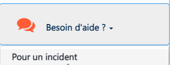
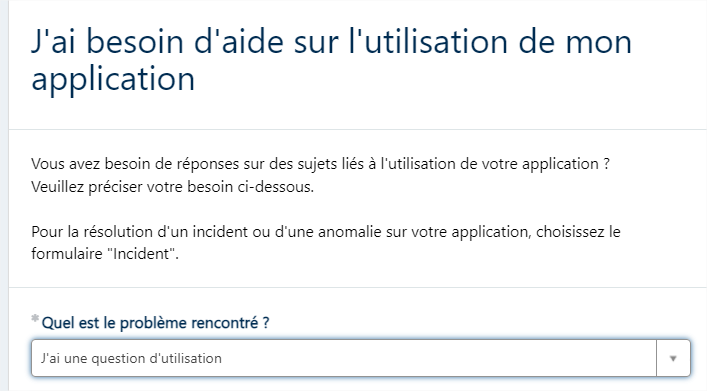
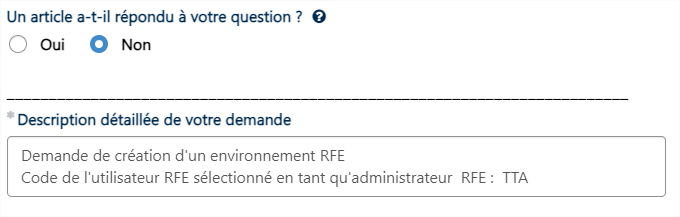
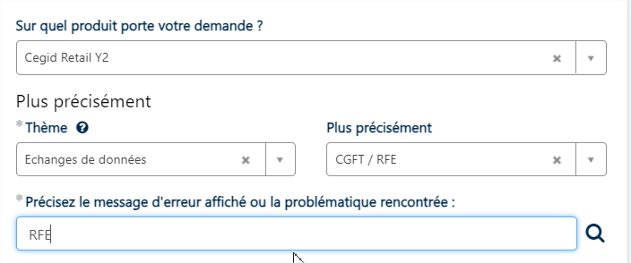

# Migration Guide

*Source: Migration_Guide.pdf | Extracted: 2026-02-27*

---

1

## RFE: Migration Guide

## CEGID

## Retail Y2

## Make

## more

## possible

3

REVISIONS

Version

Date

Writer

Nature

1.0

10/13/2023

SMJ

Documentation completed

2.0

04/09/2024

SMJ

e-Learning access

4

### Context

As a Cegid Retail Y2 user, you use CGFT (Cegid File Transfer) more or less often to import or export

Y2 data and have been doing so for many years.  CGFT was designed at a time when data exchange

standards, scalability and volumes of data exchanged were different.

Over the years 2022-2023, Cegid invested heavily in a new product, the Retail File Exchange (RFE),

designed to replace CGFT by 2024.  This confirms Cegid's ongoing commitment to improving its

Cegid Retail application ranges.

This new solution applies to your situation, and you will need to migrate very soon.

Please note:  RFE can be deployed progressively and can run at the same time as CGFT, thus

enabling you to gradually switch your exchange flows between Cegid Retail Y2 and third-party

systems.

Why migrate from CGFT to RFE?

RFE will offer you:

-

Time savings on large files

-

Better scalability

-

Optimum security for file exchanges via secure protocols

-

High levels of supervision and resilience

-

7-day file archiving

5

### II. PREPARE FOR YOUR MIGRATION

Within one month:

### 1.   Step 1:  Identify the RFE administrator

We advise you to choose a person who is familiar with the Cegid Retail Y2 product and the technical

processes of file transfers. The account for this person must therefore be present in Y2, regardless of the

group to which it belongs. The password defined in Y2 will be the same on the RFE side.

### 2.   Step 2: Declare your RFE administrator code

Create a ticket on Cegid Life, in the "Need help" section, so that the Cegid teams can provide your RFE

environment.

Then click:  "Report an Incident on my application"

Fill out the form with the following information:

Then enter your company and contact information

Then select as follows:

6

The site will propose help articles. These will not be useful to you, so proceed as shown below:

Make sure that the user and email exist.

Then confirm by clicking

You will be notified of the creation of your RFE environment within 1 week.

### 3.   Step 3: Get training

While waiting for your environment to be created (within 1 week), your RFE administrator and any other

person likely to manage file transfers can take an online training session on Cegid's e-learning site:   You

will thus be able to learn everything about this new solution and to discover the prerequisites for a

successful migration and

the various migration stages.

If you have any problems accessing the e-learning site, please contact  CegidRetailAcademy@cegid.com .

7

If you require more extensive support, you can opt for a different support method: from the simple

provision of online documentation to a turnkey service, choose the level of support you need to make

your migration a success, and let us know by contacting your Customer Success Manager.

The support team will not provide assistance with RFE configuration.

Don't wait any longer to prepare for your migration!

